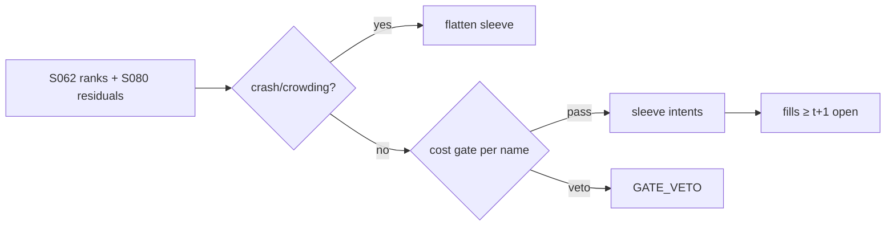

# T038 — Sector Momentum + Idiosyncratic Fade

Two sleeves: (A) industry momentum — long winning sectors, short losing sectors (Moskowitz–Grinblatt 1999); (B) idiosyncratic fade — within each sector, fade the stock-specific residual (Avellaneda–Lee 2010 eigenportfolios). Da et al. (2014) motivate the sector-neutralization of sleeve B; Khandani–Lo (2007) set the crowding heat caps. Provenance **[D]**.

> Tag law: every numeric literal in prose carries one of `[documented]
> [default] [example] [unverified] [internal-est] [measured]` (legend: Appendix
> i v1.0.0). Constants inside cited formulas inherit the formula's tag.
> Bibliographic years, volumes, pages, arXiv IDs, section numbers, rule codes
> (C1–C12), fail-safe codes (F1–F5), module IDs, and machine-parsed §0 data
> fields are identifiers, not literals, and are exempt.

## §1 Five-minute reviewer card

| Row | Value |
|---|---|
| Module | T038 — Sector Momentum + Idiosyncratic Fade, v1.0.0 |
| Edge verdict | `plausible` — industry momentum (Moskowitz–Grinblatt 1999) and eigenportfolio reversal (Avellaneda–Lee 2010) are both documented |
| After-cost | `narrow` — two documented effects stapled together — each decays, and sleeve B died spectacularly in August 2007 |
| Build cost | Tier M = 20–60 h ≈ `$3,000–9,000` [documented] |
| Data cost | daily OHLCV + sector map: low four figures/yr [unverified] |
| latency_class | end-of-day |
| risk_class | market |
| Capacity | `$500M–2B` — sector portfolios scale [unverified] |
| Executability | daily-bar factor construction; the most scalable build in TB4 |
| Risk summary | Momentum crashes (Barroso–Santa-Clara); crowded residual unwinds (August 2007); sector misclassification |
| When it dies | factor rotations (Mar 2009, Nov 2020 class events); quant unwinds |
| Regime gates | halve sleeve B when cross-sectional residual crowding > `2×` median [example]; kill momentum sleeve on crash signal |
| Emits | `order_intents` (Appendix C v1.0.0) — OrderTicket intents only, never orders |

## §1.5 Cheapest / least-build path

1. **Prototype hour band:** 6–10 h [example] — sector momentum sort + PCA residuals + two-sleeve portfolio.
2. **Cheapest-source row:** min_tier = DAILY (OHLCV); latency_class = end-of-day;
   required_fields = daily returns, sector/industry map; price_band = `$0–500`/yr (indicative —
   verify before budgeting); build_or_buy = **build**.
3. **Resource budget:** Tier M per cost-model §5 = 20–60 h ≈ `$3,000–9,000` loaded at `$150`/hr [documented]; compute pattern `vectorized batch (polars/numpy)`.
4. **Skip list:** intraday factor timing; multi-factor optimization.
5. **DO-NOT-CUT list:** causality assertions (`assert fill_event >
   signal_event`, no-signal-bar-fills test); COST block + callable
   `expected_cost_bps`; F1–F5 fail-safes + module-state enum; kill-switch
   state machine + re-arm checklist; decision-log audit records;
   bona-fide-intent + self-trade prevention; provenance tags on every numeric
   literal; fixtures + `test_cmd`; secrets via env only.
6. **Escalation gate:** upgrade from cheapest when any holds — sleeve correlation spikes; residual half-lives stretch.

## §T0 Module contract

### T0.1 Typed signature

```python
def emit(state: ModuleState, signals: list[SignalVector], cfg: Config) -> list[OrderTicket]:
```

`OrderTicket` per Appendix C v1.0.0 (intents only — never wire orders).
`state` is the module-owned named state vector (`sector_weights, residual_positions, crowding`); `signals` are
canonical SignalVectors (Appendix b v1.0.0) from the consumed S-modules, newest
last; the function emits zero or more intents per bar/event. Documented edge
cases: no signals → flat, no intents; `UNKNOWN` input signal → restrictive
(halve size / stand down per F1); kill-switch TRIPPED → emit nothing, state
`OFF`. 

### T0.2 Config dataclass

| Parameter | Type | Default | Range | Status |
|---|---|---|---|---|
| formation_months | int | `6` | [3, 12] | [default] |
| hold_months | int | `6` | [1, 12] | [default] |
| residual_entry_z | float | `1.25` | [0.75, 2.0] | [default] |
| cost_gate_k | float | `0.50` | [0.1, 1.0] | [default] |
| daily_loss_stop_pct | float | `1.5` | [0.5, 3.0] | [default] |

All defaults tagged per the tag law (status `default` ⇒ `[default]`).

### T0.3 Canonical schema mapping

Vendor columns → canonical Event/Bar schema (Appendix a v1.0.0), stated once here:

| Vendor column | Canonical field | Notes |
|---|---|---|
| `c` | Bar: daily | return panel |
| sector map | reference | GICS-class [example] |

### T0.4 Time contract

> Time contract: clock domain UTC, int64 ns; authoritative causality clock =
> `event_ts`; max_skew = `5` s [default]; jitter budget = `1` s [default];
> bar-label = open time; staleness TTL = `15` min [default]; gap policy = mask, no
> interpolation; halt/auction → discard contributions across reopen.

**Timing box:** `signal@t (daily bars, America/Chicago) → earliest fill @open(t+1)`

### T0.5 Market-state table

| State | Module behavior |
|---|---|
| CONTINUOUS_TRADING | Evaluate entry/exit rules; emit intents per §T2 |
| HALTED | Cancel working intents; emit nothing; state `UNKNOWN` until clean reopen |
| AUCTION | No new intents; hold intent-side state; state `DEGRADED` |
| CLOSED | Emit nothing; state `OFF` |


### T0.6 Module-state enum + error taxonomy

States per Appendix k v1.0.0: `OK | DEGRADED | UNKNOWN | OFF`. Invalid input →
`UNKNOWN`, never interpolate (Appendix f v1.0.0, F1–F5).

| Failure | State | Alert |
|---|---|---|
| Missing/stale input (TTL `15` min [default]) | `UNKNOWN` | page |
| Out-of-bounds indicator (F2) | `UNKNOWN` | page |
| Estimator disagreement (F3) | `UNKNOWN` | notify |
| Halt/auction per §T0.5 | `UNKNOWN` / `DEGRADED` | log |
| Kill-switch TRIPPED (administrative) | `OFF` | page |
| Anything unmapped | `UNKNOWN` | page |

### T0.7 Risk contract + kill switch

```yaml
risk_contract:
  per_trade_R: 250            # USD risk budget per trade [example]
  max_adverse_per_trade: 1.0 R [default]  # stop distance multiple [default]
  daily_loss_stop: 2% of equity [default]        # then no new entries; flatten managed risk [default]
  max_gross: 4× equity [default]              # hard gross exposure cap [default]
  kill_conditions:
    - daily P&L ≤ −daily_loss_stop_pct → TRIP (flatten both sleeves)
    - crash signal + crowding spike same session → TRIP
    - decision-log write failure → TRIP (halt emission)
  enforcement: intraday-hard  # trips are automatic, not advisory [default]
  calibration_recipe: >
    Walk-forward on 60-day blocks [example]: fit thresholds on block t,
    freeze, validate realized shortfall vs predicted on block t+1;
    shrink per-trade R until max drawdown < daily_loss_stop/2 [default].
```

**Kill-switch state machine:** `ARMED → TRIPPED → RECOVERY → ARMED`.

- `ARMED`: normal operation; every bar evaluates the kill conditions.
- `TRIPPED`: any kill condition fires → cancel all working intents
  (`NEW`/`WORKING` → `CANCELLED`, idempotent), flatten managed positions via
  the exit rule, emit nothing new, state `OFF`, log `KILL_TRIP`.
- `RECOVERY`: manual operator review only — no automatic transition.
- `ARMED` (re-entry): only after the re-arm checklist passes in full, logged
  as `KILL_REARM` with the checklist result.

**Re-arm checklist** (all must be true):

- [ ] Feed health green: all §T5 inputs fresh inside the staleness TTL.
- [ ] Kill condition cleared: the tripping metric is back inside limits for `30 min [default]` [default].
- [ ] Decision log reconciled: `KILL_TRIP` record present and hash chain intact.
- [ ] Risk re-check: per-trade R and gross caps re-confirmed against current equity.
- [ ] Operator sign-off: named human approves re-arm (no automatic recovery).

### T0.8 Ops tail

- **Schedule:** nightly batch; owner: strategy owner (named).
- **Health checks:** fixture replay (`test_cmd`) green on deploy; live
  decision-log append monitor; kill-switch state heartbeat.
- **Alert table:** `UNKNOWN`/`OFF` state transitions; kill-trip pages immediately [default].
- **Resource budget:** nightly batch: < 2 vCPU-h, < 4 GB RAM [example].
- **Runbook stub:** 1) confirm kill-state; 2) inspect decision log for the tripping record; 3) verify feed freshness; 4) re-arm checklist (operator sign-off); 5) re-run fixture; 6) resume..

### T0.9 Secrets (env-only)

- `BROKER_API_KEY (paper venue, env-only)`
- `DATA_API_KEY (env-only)` via environment only. No secrets in this file, fixtures, or
logs (CI secrets-grep).

### T0.10 May / must-NOT

> **May:** emit `OrderTicket` intents per Appendix C v1.0.0; track intent-side
> state (`NEW → WORKING → FILLED / CANCELLED / PARTIAL`); issue cancel-replace
> via new tickets with new `ticket_id`s. **Must-NOT:** place orders on any
> venue, hold broker/exchange sessions, net intents into orders inside the
> strategy, treat the intent-side state machine as broker wire truth, or emit
> prices/share-counts/notionals outside an `OrderTicket`.

## §T1 Legacy (subsumed by §1)

Legacy §T1 content is the §1 reviewer card above; this header is retained so
section numbering stays frozen.

## §T2 Specification

### Universe

US equities with sector classification; sleeve B names must be borrowable.

### Entry rule (Boolean — no prose-only conditions)

```
SLEEVE A: rank sectors by formation return; long top-3, short bottom-3 [example]
SLEEVE B: resid = r - beta_sector * r_sector; |z(resid)| >= 1.25 [default] -> fade
BOTH: cost gate per position; crowding < cap
```

### Exits (with post-exit cooldown)

```
SLEEVE A: rebalance monthly; exit on rank flip
SLEEVE B: |z| < 0.50 [default] -> FLAT (Avellaneda–Lee convention [documented])
crash/unwind signal -> flatten sleeve, cooldown
```

### Position sizing (fenced function)

```python
def size_sleeve(risk_R_usd, stop_bps, px, adv_shares, n_positions, cfg):
    # risk-parity across sleeve positions
    raw = risk_R_usd / (stop_bps / 1e4 * px) / math.sqrt(n_positions)
    return min(raw, cfg.adv_cap_pct / 100 * adv_shares)
```

### Risk limits

| Limit | Value |
|---|---|
| Sleeve gross each | `2×` equity [default] |
| Crowding cap | `2×` median residual correlation [example] |
| Momentum crash stop | flatten on crash signal [default] |

### COST block (single source of truth)

Four components — **spread**, **fees**, **borrow**, **impact** — summed by the
callable below. Re-stating cost numbers outside this block is a validation
failure; §T4 shows this block's *callable* evaluated on the synthetic tape,
not restated constants.

| Component | Value (bps) | Basis |
|---|---|---|
| Spread (half) | `1.50` | [example] |
| Fees | `0.30` | [example] |
| Borrow (short sleeve) | `50.00` | [example] |
| Impact | `k·√(adv_pct/100)`, k=`15.0` | monthly rebalance [example] |
| **Total reference (one-way)** | `~`67` round-trip short positions [example]` | [example] |

`fee_schedule_as_of`: `2026-09-01 (placeholder — pin the real venue schedule before production)` — placeholder; pin the real venue
schedule before production. `side`: `mixed`; venue/tier/source:
primary lit [example].

```python
def expected_cost_bps(notional, adv_pct, venue, side, urgency, cfg):
    """COST-block callable. Monthly-rebalance economics: low urgency."""
    spread = cfg.spread_full_bps / 2.0
    fee = cfg.taker_fee_bps if side == "taker" else cfg.maker_rebate_bps
    borrow = cfg.borrow_bps
    impact = cfg.impact_k * math.sqrt(max(adv_pct, 0.0) / 100.0)
    if urgency == "high":
        impact *= 1.5
    return spread + fee + borrow + impact
```

### Execution / fill model table

| Aspect | Assumption |
|---|---|
| Fill venue | primary lit, monthly rebalance |
| Slippage model | close ± half-spread |
| Partial fills | worked over the rebalance day |
| Halt behavior | skip halted names at rebalance |

Fine-grained fill behavior is synthetic and labeled `simulated only — requires MBO/ITCH`:
no MBO/ITCH feed is consumed by this module; any fill realism beyond the
mid-price ± half-spread fill model above would require MBO/ITCH data.

### Robustness

Perturb thresholds ±20% [example]; the reference behavior (entry/exit intents, gate blocks, kill trip) must be invariant; degrade entry→no-trade on indicator breach.

### Compliance sub-block (C1–C12)

| Code | Rule: trigger → check → action → log |
|---|---|
| C1 | STP + self-match prevention: trigger = intent could match our own resting interest → check = every ticket carries `self_trade_prevention: true`; maker modules compare against own open tickets → action = cancel own resting quote before posting the aggressive side; cancel-replace via new `ticket_id` only → log = `COMPLIANCE_BLOCK` with rule code `C1` |
| C2 | Bona-fide intent: trigger = entry rule fires → check = cost gate passes AND qty within risk limits AND (SHORT ⇒ `locate_ok`) → action = veto the intent if any check fails; no quote entered without intent to trade → log = `GATE_VETO` with the failed check |
| C3 | Message-rate / cancel-to-trade: trigger = intents+ cancels per symbol per minute exceed `120` [default] → check = rolling `60`-s [default] message counter → action = throttle to `1` intent per `10` s [default] and alert → log = `COMPLIANCE_BLOCK` with the counter value |
| C4 | Pre-trade fat-finger trio: trigger = any new intent → check = (a) limit within `±±10%` of reference [default], (b) ticket notional ≤ ``$2M`` [default], (c) ≤ `20` tickets per `1 min` [default] → action = block the ticket, alert → log = `COMPLIANCE_BLOCK` with the breached leg |
| C5 | Decision-log schema (Appendix g v1.0.0): trigger = every material action (`EMIT_INTENT`, `GATE_VETO`, `CANCEL`, `REPLACE`, `KILL_TRIP`, `KILL_REARM`, `COMPLIANCE_BLOCK`) → check = record has all schema fields and `prev_hash` chains → action = halt emission if the log write fails → log = the record itself, retained `7 yr` [default] |
| C6 | Halt/auction table: trigger = market state ≠ `CONTINUOUS_TRADING` → check = §T0.5 table → action = `HALTED`: cancel working intents, emit nothing; `AUCTION`: no new intents; `CLOSED`: state `OFF` → log = state-transition record |
| C7 | Locate check (short sales): trigger = `SHORT` intent → check = `locate_ok` from the pre-open easy-to-borrow list or desk locate; Reg-SHO threshold securities hard-blocked → action = veto without locate → log = `GATE_VETO` with code `C7`. Short sleeves require locate_ok; Reg-SHO threshold securities hard-blocked (C7). |
| C8 | Public-dissemination gate: trigger = any export of signals/intents outside the firm → check = review gate sign-off → action = block unreviewed exports → log = `COMPLIANCE_BLOCK` |
| C9 | Data-entitlement assertions (Appendix j v1.0.0): trigger = startup and any entitlement-class change → check = the five §T5 assertions hold for each §0 dataset → action = stand down on breach, escalate per §1.5 → log = entitlement review record |
| C10 | Post-exit cooldown: trigger = exit or compliance block → check = `now >= cooldown_until` (`1 session [default]` [default]) → action = suppress re-entry until the cooldown elapses → log = `GATE_VETO` with code `C10` |
| C11 | Kill-switch integration: trigger = `TRIPPED` → check = all working intents transitioned `NEW`/`WORKING` → `CANCELLED` (idempotent) → action = no new intents until `ARMED` via the §T0.7 checklist → log = `KILL_TRIP` / `KILL_REARM` records |
| C12 | C12 Factor-concentration: trigger = sleeve overlap > 50% names [example] → check = overlap review → action = net or document → log with code `C12` |

### Parameter table

| Parameter | Symbol | Value | Tag | Sensitivity |
|---|---|---|---|---|
| Formation | F | `6` months | [default] | medium — Moskowitz–Grinblatt convention |
| Residual entry z | z_r | `1.25` | [default] | high — Avellaneda–Lee convention [documented] |
| Crowding cap | C | `2×` median | [default] | critical — August-2007 guard |

### Timing box

`signal@t (daily bars, America/Chicago) → earliest fill @open(t+1)`

## §T3 Math + normative pseudocode

Moskowitz–Grinblatt (1999) [documented]: industry momentum — 20-industry,
top/bottom-3 formation. Avellaneda–Lee (2010) [documented]: PCA eigenportfolio residuals
traded on s-scores, entry |s| > 1.25, exit |s| < 0.50 [documented conventions]. Da et al.
(2014) [documented]: momentum contaminates reversal — hence sector-neutralized sleeve B.
Khandani–Lo (2007) [documented]: crowded residual unwinds — hence the crowding heat cap.

**Normative pseudocode** (pseudocode is normative; prose is commentary):

```
def emit(state, signals, cfg):
    sig = primary(signals, "S062")          # sector ranks + residuals
    if sig is None or invalid(sig): return [], state.unknown()
    if sig.crash_signal or sig.crowding > cfg.crowd_cap:
        return exit_tickets(state), state.flat()   # risk exits never cost-gated
    tickets = []
    for pos in target_positions(sig, cfg):          # both sleeves
        cost = expected_cost_bps(pos.notional, adv_pct(), venue(), "taker", "low", cfg)
        # ^^^ normative cost-gate predicate: expected_cost_bps(...) <= k * edge_bps
        if cost <= cfg.cost_gate_k * pos.edge_bps:
            t = OrderTicket.intent(pos.side, qty=size_sleeve(...), limit=last_price())
            t.intent_ts = sig.computed_at
            assert fill_event > signal_event  # t->t+1 causality: no-signal-bar fills
            tickets.append(t)
        else: log("GATE_VETO", cost=cost)
    return tickets, state.rebalanced()
```

Causality: every feature uses inputs with `event_ts ≤ t` only; the earliest
fill for a bar-`t` intent is bar `t+1`'s open. Mandatory unit test:
no-signal-bar fills.

## §T4 Worked example (fixture-backed)

- Tape: `modules/fixtures/T038_tape.csv` — `# TYPE: validation-run`;
  `12` synthetic bars (seed `4380` [example]); `event_ts`/`asof_ts` int64 ns
  UTC; every number synthetic.
- Expected outputs: `modules/fixtures/T038_expected.csv` — per-bar intent,
  quantity, the **cost-function call** (`expected_cost_bps` inputs → bps →
  dollars), cost-gate verdict, and module state.
- Tolerance: `1e-9` [default] on floats; integer quantities exact.
- Acceptance tests (`modules/tests/test_T038.py` — `6` [default] tests):
  1. TYPE header + columns present; 2. fixture recomputes to expected
  (reference `process_bar` vs expected CSV); 3. no-signal-bar fills
  (`assert fill_event > signal_event`); `4.` cost-gate predicate passes on large edge, blocks on tiny edge (`k = 0.5` [default]);
  5. kill-switch trip blocks intents, re-arm checklist restores `ARMED`;
  6. invalid input (halted/invalid bar) → `UNKNOWN`, no intents.
- `test_cmd`: `python3 -m pytest modules/tests/test_T038.py -q` → exits `0` [default].

**Cost-function calls on the tape** (the COST-block callable evaluated on
synthetic rows — inputs → bps → dollars; all values [example]):

| Bar | `expected_cost_bps` inputs | Components → total → $ | Cost gate `expected_cost_bps(...) <= k * edge_bps` | Intent / state |
|---|---|---|---|---|
| `0` | notional=`100000` [example], adv_pct=`0.5` [example], venue=`primary`, side=`taker`, urgency=`normal` | spread `1.5` + fee `0.3` + borrow `0.0` + impact `1.06` = `2.86` bps → `$28.61` | `2.0` edge, k=`0.5` [default] → `2.86 ≤ 1.0` BLOCK | `HOLD` / `OK` |
| `3` | notional=`100000` [example], adv_pct=`0.5` [example], venue=`primary`, side=`taker`, urgency=`normal` | spread `1.5` + fee `0.3` + borrow `0.0` + impact `1.06` = `2.86` bps → `$28.61` | `11.442640687119285` edge, k=`0.5` [default] → `2.86 ≤ 5.72` PASS | `LONG` / `OK` |
| `6` | notional=`100000` [example], adv_pct=`0.5` [example], venue=`primary`, side=`taker`, urgency=`normal` | spread `1.5` + fee `0.3` + borrow `0.0` + impact `1.06` = `2.86` bps → `$28.61` | `3.0` edge, k=`0.5` [default] → `2.86 ≤ 1.5` BLOCK | `BUY` / `OK` |
| `7` | notional=`100000` [example], adv_pct=`0.5` [example], venue=`primary`, side=`taker`, urgency=`normal` | spread `1.5` + fee `0.3` + borrow `0.0` + impact `1.06` = `2.86` bps → `$28.61` | `0.05` edge, k=`0.5` [default] → `2.86 ≤ 0.03` BLOCK | `HOLD` / `OK` |
| `9` | notional=`100000` [example], adv_pct=`0.5` [example], venue=`primary`, side=`taker`, urgency=`normal` | spread `1.5` + fee `0.3` + borrow `0.0` + impact `1.06` = `2.86` bps → `$28.61` | `4.0` edge, k=`0.5` [default] → `2.86 ≤ 2.0` BLOCK | `HOLD` / `OFF` |

**Hand-checks.** Row `3` (entry): qty = `250 / (25/1e4 × 100.07)` = `999` raw → ADV-capped at `20000` → `999` shares [example]; ticket `T0003`, side `LONG`, `marketable` intent. Row `6` (exit): |z| through the exit band → `LONG` intent, exits never cost-gated [default]. Row `7` (gate block): edge `0.05` bps [example] vs cost `2.86` bps → gate `2.86 ≤ 0.025` BLOCKS → no intent, state stays `OK`. Row `9` (kill): daily P&L `-1.6%` [example] ≤ −stop (`1.5%` [default]) → `ARMED → TRIPPED`, state `OFF`, no intents. Causality: entry intent at row `3` has `intent_ts` = bar-3 `event_ts`; the earliest fill is bar `4`'s open — the test asserts `fill_event > signal_event` on every intent row.

**Where the example is optimistic.** Costs are the COST-block model, not realized fills; capacity, borrow squeezes, and regime shifts are not in the tape.

## §T5 Dependencies + data

### Consumed signals (from deps.yaml — machine edge list)

| Signal | Version pin | Role |
|---|---|---|
| S062 | 1.0.0 | primary |
| S039 | 1.0.0 | confirm |
| S080 | 1.0.0 | gate |

### Pinned formula excerpts (≤10 lines each, CI hash-checked)

**S062** (v1.0.0): sector formation return rank [documented].
**S080** (v1.0.0): PCA residual `ε = r − B·f`, s-score `s = ε/σ_ε` [documented].

### Data required

| Field | Type | Granularity | Source tier | Notes |
|---|---|---|---|---|
| daily returns | float | daily | DAILY | both sleeves |
| sector map | code | as-changed | REF | sleeve construction |
| borrow availability | bool/bps | daily | BORROW | short sleeves |

**Data rights row** (Appendix j v1.0.0): Daily bars are commodity data; sector maps licensed; borrow data per-seat; entitlements re-asserted at startup.

## §T6 Local build + buy vs build

Factor sorts + PCA: textbook. The crowding monitor and the crash signal are the risk work.

| Route | What you get | Verdict |
|---|---|---|
| Build | two-sleeve engine in-house | recommended |
| Buy | factor data (sector maps, borrow) | required |
| Buy | risk model | acceptable for the crowding monitor |

**Verdict:** Build the sleeves; buy the reference data. The crowding discipline is the product.

## §T7 Efficacy — documented evidence

| Study / source | Market & period | Metric | Before/after cost | Caveat |
|---|---|---|---|---|
| Moskowitz–Grinblatt (1999) | US equities | industry momentum profits | before cost | 1963–1995 sample |
| Avellaneda–Lee (2010) | US equities 1997–2007 | PCA stat-arb Sharpe ~1.4 | before cost | decay caution post-2007 |
| Khandani–Lo (2007) | event | August 2007 quant unwind | n/a | the failure regime |
| Da et al. (2014) | US equities | momentum contaminates reversal | before cost | motivates neutralization |
| Jegadeesh (1990) | US equities | short-horizon reversal | before cost | sleeve-B ancestor |

**Selection disclosure:** Studies below are the chapter's documented sources only — no post-hoc selection from a wider literature search.

**Capacity & decay.** Edge decays with crowding and regime shifts; treat any printed Sharpe as a pre-cost, in-sample-era artifact unless the source says otherwise.

**Honest bottom line.** Honest bottom line: you are running two famous factors and hoping their documented decays do not coincide with your capital — the August-2007 lesson is that they coincide exactly when it hurts.

## §T8 Failure modes & pitfalls

| # | Trigger → Detect → Action → Recovery | check: |
|---|---|---|
| 1 | Momentum crash → detect crash signal → flatten sleeve A → cooldown → log | check: crash-signal backtest |
| 2 | Crowded unwind → detect residual correlation spike → halve sleeve B → review | check: crowding monitor |
| 3 | Sector misclassification → detect map change → rebuild sleeves → log | check: map diff |
| 4 | Borrow squeeze (short sleeves) → detect → cover, state DEGRADED → re-screen | check: borrow monitor |

## §T9 Regime gates + visuals

**Provisional regime-gate machine** (restrictive default; `regime_ids` stay
empty until the R001–R050 annotation pass):

| regime_id | direction | mechanism | condition | action | min_lag | unknown_behavior |
|---|---|---|---|---|---|---|
| R001 | flatten | momentum crash | crash signal fires | flatten sleeve A | immediate | restrictive |
| R002 | scale | crowded residuals | crowding > 2× median | halve sleeve B | 1 day | restrictive |



## §T10 Source log + unverified leads

**Sources** (citable facts only):

1. Moskowitz, T. J. & Grinblatt, M. (1999). "Do Industries Explain Momentum?" *Journal of Finance* 54(4), 1249–1290. doi:10.1111/0022-1082.00146
2. Avellaneda, M. & Lee, J.-H. (2010). "Statistical Arbitrage in the U.S. Equities Market." *Quantitative Finance* 10(7), 761–782. doi:10.1080/14697680903124632
3. Khandani, A. E. & Lo, A. W. (2007). "What Happened to the Quants in August 2007?" *Journal of Investment Management* 5(4), 5–54
4. Da, Z., Gurun, U. G. & Warachka, M. (2014). "Frog in the Pan: Continuous Information and Momentum." *Review of Financial Studies* 27(7), 2171–2218. doi:10.1093/rfs/hhu003
5. Jegadeesh, N. (1990). "Evidence of Predictable Behavior of Security Returns." *Journal of Finance* 45(3), 881–898

**Chatbot source log.** Grok answered the Q-batch (2026-09-10); all claims independently verified or labeled unverified. Chatbot output is leads, never facts.

**Unverified leads** (chatbot-only — never in evidence tables):

- Grok (2026-09-10, Q-TB4): post-2007 Sharpe magnitudes for both sleeves — *unverified chatbot claims*.
- Sector-momentum rotation failure dates (Mar 2009, Nov 2020, 2022) — from the research lead, not independently dated here.

---

## Appendix — AI build prompt (T038)

Copy-paste into any chat agent:

> Build module **T038 — Sector Momentum + Idiosyncratic Fade** per `notes/module-template.md` v1.0.0 and
> this file's §T0 contract.
> Cheapest path (§1.5): prototype 6–10 h [example]; cheapest data candidate
> DAILY (OHLCV); compute pattern `vectorized batch (polars/numpy)`; u.
> Implement `emit(state, signals, cfg) -> list[OrderTicket]` (Appendix c
> v1.0.0) with the §T3 normative pseudocode, including the cost-gate predicate
> `expected_cost_bps(...) <= k * edge_bps` and `assert fill_event >
> signal_event`. Emit intents only — never place orders. Wire F1–F5
> (Appendix f v1.0.0): invalid input → `UNKNOWN`, never interpolate. Kill
> switch `ARMED → TRIPPED → RECOVERY → ARMED` with the §T0.7 re-arm checklist.
> Log decisions per Appendix g v1.0.0. Secrets via env only. Run the fixture
> `modules/fixtures/T038_tape.csv` (`# TYPE: validation-run`) against
> `modules/fixtures/T038_expected.csv` (tolerance `1e-9` [default]).
> **Definition of done:** `python3 -m pytest modules/tests/test_T038.py -q` exits `0` [default]. Tag every numeric literal
> you add with the unified enum (Appendix i v1.0.0); put anything unverifiable
> in §T10 unverified leads.
