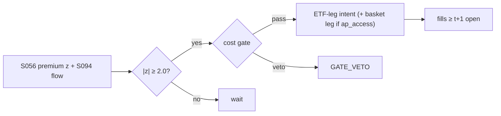

# T039 — ETF Creation/Redemption Flow Trader

Trades ETF premium/discount dislocations against the creation/redemption mechanism: when an ETF trades rich to NAV beyond the creation cost plus the cost gate, sell the ETF and buy the basket (creation arbitrage); when cheap, the reverse. Engle–Sarkar (2006) anchor domestic dislocations as small/transient; Petajisto (2017) documents where they are not. Provenance **[D]**.

> Tag law: every numeric literal in prose carries one of `[documented]
> [default] [example] [unverified] [internal-est] [measured]` (legend: Appendix
> i v1.0.0). Constants inside cited formulas inherit the formula's tag.
> Bibliographic years, volumes, pages, arXiv IDs, section numbers, rule codes
> (C1–C12), fail-safe codes (F1–F5), module IDs, and machine-parsed §0 data
> fields are identifiers, not literals, and are exempt.

## §1 Five-minute reviewer card

| Row | Value |
|---|---|
| Module | T039 — ETF Creation/Redemption Flow Trader, v1.0.1 |
| Edge verdict | `NO-DOCUMENTED-EDGE` — the creation/redemption mechanism is documented (Lettau–Madhavan 2018) and dislocations are documented (Engle–Sarkar 2006; Petajisto 2017), but no published after-cost P&L exists for this module's pair trade |
| After-cost | `FULL-COST` — the tradeable dislocations sit inside the creation-cost + spread stack, and Jain et al. (2021) show the remaining gap is competed away by algorithmic arbitrage |
| Build cost | `Tier S · 5–15 h · $750–2,250 [documented]` |
| Data cost | `$100–400`/mo [unverified] (research + production; holdings + iNAV low four figures/yr [unverified]) |
| latency_class | minutes |
| risk_class | market |
| Capacity | `$1–10M` [unverified] — creation-unit constrained [unverified] |
| Executability | needs AP relationship or a very liquid ETF; logic is trivial |
| Risk summary | NAV staleness (the 'dislocation' is stale pricing); creation-unit minimums; basket disruption events |
| When it dies | it never dies — APs compete liquid-ETF dislocations to `1–2` bps [unverified] |
| Regime gates | trade only dislocations > creation cost + gate; stand down on basket disruptions |
| Emits | `order_intents` (Appendix C v1.0.0) — OrderTicket intents only, never orders |

## §1.5 Cheapest / least-build path

1. **Prototype hour band:** `3–5` h [example] — premium monitor + creation-cost model + two-leg execution.
2. **Cheapest-source row:** `min_tier: ETF (holdings + NAV)` · `latency_class: daily/intraday` · `required_fields: ETF price, iNAV (15-s), holdings/creation basket, creation costs` · `price_band: $0–500/yr (indicative — verify before budgeting) [unverified]` · `build_or_buy: build`.
3. **Resource budget:** nightly batch: `< 2` vCPU-h, `< 4` GB RAM [example] · compute pattern `per_bar`.
4. **Skip list:** international ETFs with stale NAVs (unless modeled); leveraged/inverse ETFs; intraday creation (domestic creation orders are placed during the day and exercised end-of-day [documented]).
5. **DO-NOT-CUT list:** causality assertions (`assert fill_event >
   signal_event`, no-signal-bar-fills test); COST block + callable
   `expected_cost_bps`; F1–F5 fail-safes + module-state enum; kill-switch
   state machine + re-arm checklist; decision-log audit records;
   bona-fide-intent + self-trade prevention; provenance tags on every numeric
   literal; fixtures + `test_cmd`; secrets via env only.
6. **Escalation gate:** upgrade from cheapest when any holds — (a) dislocations persist beyond the creation-cost bound (the NAV is stale, not the price wrong → add an iNAV-staleness model); (b) live universe `> 20` ETFs [default]; (c) measured borrow/creation fees exceed the example stack (re-pin the fee schedule); (d) AP access obtained → enable the basket leg + creation-unit quantization (phase 2, §T6).

## §T0 Module contract

### T0.1 Typed signature

```python
def emit(state: ModuleState, signals: SignalBundle, cfg: Config) -> list[OrderTicket]:
```

`OrderTicket` per Appendix C v1.0.0 (intents only — never wire orders).
`state` is the module-owned named state vector (`premium_bps, creation_cost_bps, position, cooldown_until, module_state, kill`); `signals` carries the S056 dislocation bundle (`z` signed: `z > 0` rich/premium, `z < 0` cheap/discount, `edge_bps` = net dislocation beyond the creation bound, `computed_at` int64 ns, `inav_asof_ts` int64 ns), the S094 confirm flag, the S032 gate flag, and `market_state`. The function emits zero or more intents per bar. Documented edge cases: no/invalid signals → `UNKNOWN`, never interpolate (F1); kill-switch TRIPPED → emit nothing, state `OFF`; post-exit cooldown → suppress re-entry (C10).

### T0.2 Config dataclass

| Parameter | Type | Default | Range | Status |
|---|---|---|---|---|
| trigger_bps | float | `10.0` | [3.0, 30.0] | [default] |
| z_entry | float | `2.0` | [1.0, 4.0] | [default] |
| z_exit | float | `0.5` | [0.1, 1.5] | [default] |
| creation_unit | int | `50000` | [10000, 100000] | [default] |
| creation_cost_bps | float | `2.0` | [0.5, 10.0] | [default] |
| max_hold_days | int | `5` | [1, 20] | [default] |
| cost_gate_k | float | `0.5` | [0.1, 2.0] | [default] |
| risk_R_usd | float | `250.0` | [50.0, 2000.0] | [default] |
| stop_bps | float | `25.0` | [5.0, 100.0] | [default] |
| adv_cap_pct | float | `1.0` | [0.1, 5.0] | [default] |
| spread_full_bps | float | `2.0` | [0.5, 10.0] | [default] |
| taker_fee_bps | float | `0.3` | [0.0, 1.0] | [default] |
| maker_rebate_bps | float | `-0.2` | [-1.0, 0.0] | [default] |
| borrow_bps | float | `10.0` | [0.0, 50.0] | [default] |
| impact_k | float | `8.0` | [0.0, 20.0] | [default] |
| daily_loss_stop_pct | float | `1.0` | [0.25, 3.0] | [default] |
| cooldown_s | float | `86400.0` | [0.0, 604800.0] | [default] |
| ap_access | bool | `False` | {False, True} | [default] |

All defaults tagged per the tag law (status `default` ⇒ `[default]`, `example` values ⇒ `[example]`). `borrow_bps` is the proxy-mode short-leg value; the fixture's emitted leg prices `0.0` with the reason in the COST block. `creation_unit` binds only when `ap_access=True`.

### T0.3 Canonical schema mapping

Vendor columns → canonical Event/Bar schema (Appendix a v1.0.0), stated once here:

| Vendor column | Canonical field | Type | Notes |
|---|---|---|---|
| ETF price | Bar.close | float $ | market price |
| iNAV | Bar.inav | float $ | intraday indicative value, `15`-s cadence [documented] |
| holdings | reference.basket | table | creation basket constituents |
| creation costs | reference.creation_cost_bps | float bps | per-creation-unit fee ÷ unit notional |
| disruption feed | Event.disruption | bool | basket disruption flag |

### T0.4 Time contract

> Time contract: clock domain UTC, int64 ns; authoritative causality clock =
> `event_ts`; max_skew = `5` s [default]; jitter budget = `1` s [default];
> bar-label = open time; staleness TTL = `15` min [default]; gap policy = mask, no
> interpolation; halt/auction → discard contributions across reopen.

Dual timestamps: every bar carries (`event_ts`, `asof_ts`) int64 ns UTC; `asof_ts < event_ts` is invalid input (F2).

**Timing box:** `signal@t (daily bars, America/Chicago) → earliest fill @open(t+1)`

### T0.5 Market-state table

| State | Module behavior |
|---|---|
| CONTINUOUS_TRADING | Evaluate entry/exit rules; emit intents per §T2 |
| HALTED | Cancel working intents; emit nothing; state `UNKNOWN` until clean reopen |
| AUCTION | No new intents; hold intent-side state; state `DEGRADED` |
| CLOSED | Emit nothing; state `OFF` |

### T0.6 Module-state enum + error taxonomy

States per Appendix k v1.0.0: `OK | DEGRADED | UNKNOWN | OFF`. Invalid input →
`UNKNOWN`, never interpolate (Appendix f v1.0.0, F1–F5).

| Failure | State | Alert |
|---|---|---|
| Missing/stale input (TTL `15` min [default]) | `UNKNOWN` | page |
| Out-of-bounds indicator (F2) | `UNKNOWN` | page |
| Estimator disagreement (F3) | `UNKNOWN` | notify |
| Halt/auction per §T0.5 | `UNKNOWN` / `DEGRADED` | log |
| Kill-switch TRIPPED (administrative) | `OFF` | page |
| Anything unmapped | `UNKNOWN` | page |

### T0.7 Risk contract + kill switch

```yaml
risk_contract:
  per_trade_R: 250.0          # USD risk budget per trade [example]
  max_adverse_per_trade: 1.0  # stop-distance multiple [default]
  daily_loss_stop: 1.0        # % of equity; then no new entries [default]
  max_gross: 4.0              # × equity, hard gross exposure cap [default]
  kill_conditions:
    - daily P&L ≤ −daily_loss_stop_pct → TRIP (unwind)
    - basket disruption with open risk → TRIP
    - decision-log write failure → TRIP (halt emission)
  enforcement: intraday-hard  # trips are automatic, not advisory [default]
  calibration_recipe: >
    Walk-forward on 60-day blocks [example]: fit thresholds on block t,
    freeze, validate realized shortfall vs predicted on block t+1;
    shrink per-trade R until max drawdown < daily_loss_stop/2 [default].
```

**Kill-switch state machine:** `ARMED → TRIPPED → RECOVERY → ARMED`.

- `ARMED`: normal operation; every bar evaluates the kill conditions.
- `TRIPPED`: any kill condition fires → cancel all working intents
  (`NEW`/`WORKING` → `CANCELLED`, idempotent), flatten managed positions via
  the exit rule, emit nothing new, state `OFF`, log `KILL_TRIP`.
- `RECOVERY`: manual operator review only — no automatic transition.
- `ARMED` (re-entry): only after the re-arm checklist passes in full, logged
  as `KILL_REARM` with the checklist result.

**Re-arm checklist** (all must be true):

- [ ] Feed health green: all §T5 inputs fresh inside the staleness TTL.
- [ ] Kill condition cleared: the tripping metric is back inside limits for `30` min [default].
- [ ] Decision log reconciled: `KILL_TRIP` record present and hash chain intact.
- [ ] Risk re-check: per-trade R and gross caps re-confirmed against current equity.
- [ ] Operator sign-off: named human approves re-arm (no automatic recovery).

### T0.8 Ops tail

- **Schedule:** nightly batch; owner: strategy owner (named).
- **Health checks:** fixture replay (`test_cmd`) green on deploy; live
  decision-log append monitor; kill-switch state heartbeat.
- **Alert table:** `UNKNOWN`/`OFF` state transitions; kill-trip pages immediately [default].
- **Resource budget:** nightly batch: `< 2` vCPU-h, `< 4` GB RAM [example].
- **Runbook stub:** 1) confirm kill-state; 2) inspect decision log for the tripping record; 3) verify feed freshness; 4) re-arm checklist (operator sign-off); 5) re-run fixture; 6) resume.

### T0.9 Secrets (env-only)

- `BROKER_API_KEY (paper venue, env-only)`
- `DATA_API_KEY (env-only)` via environment only. No secrets in this file, fixtures, or
logs (CI secrets-grep).

### T0.10 May / must-NOT

> **May:** emit `OrderTicket` intents per Appendix C v1.0.0; track intent-side
> state (`NEW → WORKING → FILLED / CANCELLED / PARTIAL`); issue cancel-replace
> via new tickets with new `ticket_id`s. **Must-NOT:** place orders on any
> venue, hold broker/exchange sessions, net intents into orders inside the
> strategy, treat the intent-side state machine as broker wire truth, or emit
> prices/share-counts/notionals outside an `OrderTicket`.

## §T1 Legacy (subsumed by §1)

Legacy §T1 content is the §1 reviewer card above; this header is retained so
section numbering stays frozen.

## §T2 Specification

### Universe

ETFs with published iNAV (`15`-s cadence [documented]) and creation/redemption access; liquid baskets; average daily volume `> $50M` [default]; exclude international ETFs with stale NAVs unless modeled, leveraged/inverse ETFs, and ETFs with creation-unit notional `> $10M` [default] relative to book.

### Entry rule (Boolean — no prose-only conditions)

S056 emits a signed dislocation z (`z > 0` rich/premium, `z < 0` cheap/discount); `edge_bps` = net dislocation beyond the creation bound.

```
ENTRY_RICH  := (|z| >= z_entry) AND (z > 0) AND (locate_ok) AND (S032 gate)
               AND (S094 confirm) AND (flat) AND (now >= cooldown_until)
               AND (expected_cost_bps(...) <= cost_gate_k * edge_bps)
ENTRY_CHEAP := (|z| >= z_entry) AND (z < 0) AND (S032 gate)
               AND (S094 confirm) AND (flat) AND (now >= cooldown_until)
               AND (expected_cost_bps(...) <= cost_gate_k * edge_bps)
FLAT        := otherwise
```

Rich → SELL ETF leg (+ BUY basket leg when `ap_access=True`); cheap → BUY ETF leg (+ SELL basket leg when `ap_access=True`). The MVP fixture exercises the cheap side with `ap_access=False` (ETF leg only).

### Exits (with post-exit cooldown)

```
EXIT := (|z| <= z_exit)               # convergence through the exit band
     OR (disruption)                 # basket disruption feed fires
     OR (stopped)                    # adverse move >= stop_bps
     OR (age >= max_hold_days)       # time stop
     OR (module_state != OK)         # degrade/unknown forces flatten
```

On exit: flatten via the opposite-side intent (exits never cost-gated [default]); set `cooldown_until = event_ts + cooldown_s` (`86400` s = `1` session [default]); C10 suppresses re-entry until the cooldown elapses.

### Position sizing (fenced function)

```python
def shares(risk_budget_R, stop_distance, vol_estimate, ADV_cap, cost):
    """shares = f(risk_budget_R, stop_distance, vol_estimate, ADV_cap, cost)."""
    n = risk_budget_R / max(stop_distance, 1e-9)   # [default] floor below
    n = min(n, ADV_cap)                            # ADV cap in shares [default]
    # Creation-unit quantization applies only when ap_access=True:
    #   units = max(1, int(n // creation_unit)); n = units * creation_unit
    # (MVP: ap_access=False -> unquantized ETF-leg shares.)
    return max(1, int(n))
```

`stop_distance = stop_bps / 1e4 * px` ($/share); `ADV_cap = adv_cap_pct / 100 * adv_shares` (shares). `cost` is accepted for the contract signature; the gate clears before sizing.

### Risk limits

| Limit | Value |
|---|---|
| Max per-ETF notional | `$10M` [example] |
| Daily loss stop | `1.0%` of equity [default] → no new entries |
| Max gross | `4×` equity [default], hard cap |
| Creation-unit quantization | hard [default] when `ap_access=True`; off in MVP |
| Trigger | `10` bps [default] |

### COST block (single source of truth)

Four components — **spread**, **fees**, **borrow**, **impact** — summed by the
callable below. Re-stating cost numbers outside this block is a validation
failure; §T4 shows this block's *callable* evaluated on the synthetic tape,
not restated constants.

| Component | Value (bps) | Basis |
|---|---|---|
| Spread (ETF half) | `1.0` | [example] half of `spread_full_bps = 2.0` [example] |
| Fees (taker) | `0.3` | [example] `$0.003`/share at `$100` = the Nasdaq remove-liquidity anchor [documented arithmetic] |
| Borrow | `0.0` | [default] — reason: the fixture's emitted leg is the cheap-side **long** ETF leg, so no stock-loan short exists; creation-covered AP legs likewise accrue no borrow |
| Impact | `0.57` | [example] `impact_k = 8.0` [example] × √(`0.5`/`100`) |
| **Total reference (one-way, ETF leg)** | `1.87` | [example] |

Rich-side proxy shorts (no AP access) add `borrow_bps = 10.0` [example] per round trip as a documented adder outside the 5-arg callable; the basket short leg, when emitted (`ap_access=True`), prices borrow the same way. The fixed-$ creation/redemption transaction fee is issuer-specific and unverified → GROK-NEEDED #1.

`fee_schedule_as_of`: `2026-09-10` [documented] — Nasdaq fee to remove liquidity `$0.0030`/share for shares ≥ `$1.00` [documented] (NasdaqTrader price list, verified 2026-09-10; adopted from T002's verification). `side`: `taker` (fixture); maker path via `maker_rebate_bps`. Venue/tier/source: primary lit [example]. `borrow_bps_per_day`: `0.0` — reason above; proxy shorts `10.0` [example].

```python
def expected_cost_bps(notional, adv_pct, venue, side, urgency):
    """COST-block callable. 4-component stack; borrow 0.0 on the emitted leg
    (cheap-side long ETF leg / creation-covered legs — see Borrow row)."""
    spread = CFG.spread_full_bps / 2.0                 # ETF half-spread
    fee = CFG.maker_rebate_bps if side == "maker" else CFG.taker_fee_bps
    borrow = 0.0                                       # [default] reason in table
    impact = CFG.impact_k * math.sqrt(max(adv_pct, 0.0) / 100.0)
    if urgency == "high":
        impact *= 1.5
    return spread + fee + borrow + impact
```

### Execution / fill model table

| Aspect | Assumption |
|---|---|
| Fill venue | primary lit, ETF + basket |
| Fill model | marketable taker intent at the touch [example]; premium at execution vs signal is the slippage |
| Slippage model | premium at execution vs signal |
| Partial fills | creation-unit quantization (`ap_access=True`); no partial units; IOC remainder auto-cancels in MVP |
| Halt behavior | no entries on basket disruptions |

**Child-order state machine (broker-side; the strategy only ever sees the INTENT state):**

```text
INTENT (strategy emits) -> SENT (broker ack) -> WORKING -> FILLED
                                                |-> PARTIAL -> (remainder) -> CANCELLED
                                                |-> CANCELLED / EXPIRED
```

Cancel-replace: via a new ticket with a new `ticket_id` and fresh C3/C7 checks. Fine-grained fill behavior beyond mid-price ± half-spread is synthetic and labeled `simulated only — requires MBO/ITCH`: no MBO/ITCH feed is consumed by this module; any fill realism beyond the fill model above would require MBO/ITCH data.

### Robustness

Perturb thresholds ±`20%` [example]; the reference behavior (entry/exit intents, gate blocks, kill trip) must be invariant; degrade entry→no-trade on indicator breach.

### Compliance sub-block (C1–C12)

| Code | Rule: trigger → check → action → log |
|---|---|
| C1 | STP + self-match prevention: trigger = intent could match our own resting interest → check = every ticket carries `self_trade_prevention: true`; maker modules compare against own open tickets → action = cancel own resting quote before posting the aggressive side; cancel-replace via new `ticket_id` only → log = `COMPLIANCE_BLOCK` with rule code `C1` |
| C2 | Bona-fide intent: trigger = entry rule fires → check = cost gate passes AND qty within risk limits AND (SHORT ⇒ `locate_ok`) → action = veto the intent if any check fails; no quote entered without intent to trade → log = `GATE_VETO` with the failed check |
| C3 | Message-rate / cancel-to-trade: trigger = intents + cancels per symbol per minute exceed `120` [default] → check = rolling `60`-s [default] message counter → action = throttle to `1` intent per `10` s [default] and alert → log = `COMPLIANCE_BLOCK` with the counter value |
| C4 | Pre-trade fat-finger trio: trigger = any new intent → check = (a) limit within `±10%` of reference [default], (b) ticket notional ≤ `$2M` [default], (c) ≤ `20` tickets per `1` min [default] → action = block the ticket, alert → log = `COMPLIANCE_BLOCK` with the breached leg |
| C5 | Decision-log schema (Appendix g v1.0.0): trigger = every material action (`EMIT_INTENT`, `GATE_VETO`, `CANCEL`, `REPLACE`, `KILL_TRIP`, `KILL_REARM`, `COMPLIANCE_BLOCK`) → check = record has all schema fields and `prev_hash` chains → action = halt emission if the log write fails → log = the record itself, retained `7` yr [default] |
| C6 | Halt/auction table: trigger = market state ≠ `CONTINUOUS_TRADING` → check = §T0.5 table → action = `HALTED`: cancel working intents, emit nothing; `AUCTION`: no new intents; `CLOSED`: state `OFF` → log = state-transition record |
| C7 | Locate check (short sales): trigger = `SELL` intent on the rich side (ETF short leg) → check = `locate_ok` from the pre-open easy-to-borrow list or desk locate; Reg-SHO threshold securities hard-blocked → action = veto without locate → log = `GATE_VETO` with code `C7` |
| C8 | Public-dissemination gate: trigger = any export of signals/intents outside the firm → check = review gate sign-off → action = block unreviewed exports → log = `COMPLIANCE_BLOCK` |
| C9 | Data-entitlement assertions (Appendix j v1.0.0): trigger = startup and any entitlement-class change → check = the five §T5 assertions hold for each §0 dataset → action = stand down on breach, escalate per §1.5 → log = entitlement review record |
| C10 | Post-exit cooldown: trigger = exit or compliance block → check = `now >= cooldown_until` (`1` session = `86400` s [default]) → action = suppress re-entry until the cooldown elapses → log = `GATE_VETO` with code `C10` |
| C11 | Kill-switch integration: trigger = `TRIPPED` → check = all working intents transitioned `NEW`/`WORKING` → `CANCELLED` (idempotent) → action = no new intents until `ARMED` via the §T0.7 checklist → log = `KILL_TRIP` / `KILL_REARM` records |
| C12 | AP-concentration: trigger = single-AP dependence → check = counterparty review → action = diversify or document → log with code `C12` |

### Parameter table

| Parameter | Symbol | Value | Tag | Sensitivity |
|---|---|---|---|---|
| Trigger | p* | `10.0` bps | [default] | critical — must clear creation cost |
| Entry z | z_entry | `2.0` | [default] | high |
| Exit z | z_exit | `0.5` | [default] | medium |
| Creation unit | U | `50000` | [default] | medium — quantization binds small books (ap_access=True) |
| Max hold | H | `5` days | [default] | low |
| Cost-gate k | k | `0.5` | [default] | high |
| Cooldown | — | `86400` s | [default] | low |

### Timing box

`signal@t (daily bars, America/Chicago) → earliest fill @open(t+1)`

## §T3 Math + normative pseudocode

Lettau–Madhavan (2018) [documented]: the creation/redemption architecture bounds the premium by the creation cost. Engle–Sarkar (2006) [documented]: domestic dislocations are small and transient (std dev `15` bps [documented], typically lasting several minutes [documented]) — the empirical anchor. Petajisto (2017) [documented]: peer-group-adjusted pricing bands of ~`100` bps [documented] persist where arbitrage is hard — the 'why APs get paid' result. Jain et al. (2021) [documented]: algorithmic competition shrinks deviations (`578` ETFs, Jan 2012–Jun 2018 [documented]) — the decay evidence.

**Normative pseudocode** (pseudocode is normative; prose is commentary):

```
def emit(state, signals, cfg):
    sig = primary(signals, "S056")          # signed dislocation z; edge_bps net of creation bound
    # F1: missing signal -> UNKNOWN (never interpolate)
    if sig is None or not valid(sig):
        return [], state.unknown()
    # F2: non-finite or out-of-bounds dislocation -> UNKNOWN
    if not isfinite(sig.z) or abs(sig.z) > 10.0:
        return [], state.unknown()
    # C6: stale iNAV -> UNKNOWN
    if (now_ns() - sig.inav_asof_ts) > cfg.staleness_ttl_s * 1e9:
        return [], state.unknown()
    # C6: market-state gate (§T0.5)
    if signals.market_state != "CONTINUOUS_TRADING":
        return [], state.degraded_or_unknown(signals.market_state)
    # Kill switch: TRIPPED blocks everything
    if state.kill != "ARMED":
        return [], state.off()
    if signals.daily_pnl_pct <= -cfg.daily_loss_stop_pct:
        state.kill.trip(now_ns(), "daily-loss-stop")
        return [], state.off()
    # S032 gate + S094 confirm
    if not (gate(signals, "S032") and confirm(signals, "S094")):
        log("GATE_VETO", which="S032/S094"); return [], state.ok()
    z, edge = sig.z, sig.edge_bps
    cost = expected_cost_bps(notional_est(), adv_pct_est(), venue(), "taker", "normal")
    # ^^^ normative cost-gate predicate: expected_cost_bps(...) <= k * edge_bps
    gate_ok = cost <= cfg.cost_gate_k * edge
    if state.position == 0:
        if abs(z) >= cfg.z_entry and gate_ok:
            # C10: post-exit cooldown
            if now_ns() < state.cooldown_until:
                log("GATE_VETO", code="C10"); return [], state.ok()
            if z > 0:
                if not locate_ok(signals.symbol):      # C7: rich-side ETF short
                    log("GATE_VETO", code="C7"); return [], state.ok()
                legs = [ticket("SELL", qty=shares(...), tif="DAY")]
            else:
                legs = [ticket("BUY", qty=shares(...), tif="DAY")]   # cheap side: long ETF leg
            if cfg.ap_access:
                # Phase 2: basket leg, creation-unit quantized
                units = max(1, int(shares(...) // cfg.creation_unit))
                legs.append(basket_ticket(sign=-1 if z > 0 else +1, units=units))
            for t in legs:
                t.intent_ts = sig.computed_at
                log_decision(t, inputs_hash(sig), params_hash(cfg))   # C5
            assert fill_event > signal_event  # t->t+1 causality: no-signal-bar fills
            return legs, state.open("ETF_ARB")
        if abs(z) >= cfg.z_entry:
            log("GATE_VETO", cost=cost, edge=edge)
        return [], state.ok()
    # Position open: exits are never cost-gated
    stopped = adverse_move(state) >= cfg.stop_bps
    aged = (now_ns() - state.entry_ts) >= cfg.max_hold_days * 86400e9
    if abs(z) <= cfg.z_exit or sig.disruption or stopped or aged or state.module_state != "OK":
        exit_side = "SELL" if state.position > 0 else "BUY"
        t = ticket(exit_side, qty=shares(...), tif="DAY")
        t.intent_ts = sig.computed_at
        log_decision(t, inputs_hash(sig), params_hash(cfg))
        state.cooldown_until = now_ns() + cfg.cooldown_s * 1e9   # C10
        assert fill_event > signal_event
        return [t], state.flat()
    return [], state.ok()
```

Causality: every feature uses inputs with `event_ts ≤ t` only; the earliest
fill for a bar-`t` intent is bar `t+1`'s open. Mandatory unit test:
no-signal-bar fills.

## §T4 Worked example (fixture-backed)

- Tape: `modules/fixtures/T039_tape.csv` — `# TYPE: validation-run`;
  `12` synthetic bars (seed `4390` [example]); `event_ts`/`asof_ts` int64 ns
  UTC; every number synthetic. The tape is the **cheap-side MVP scenario**:
  `signal_z < 0` (discount) with `ap_access=False`, so entries BUY the ETF leg
  only; the basket short leg is phase 2 (§T6).
- Expected outputs: `modules/fixtures/T039_expected.csv` — per-bar intent,
  quantity, the **cost-function call** (`expected_cost_bps` inputs → bps →
  dollars), cost-gate verdict, and module state.
- Tolerance: `1e-9` [default] on floats; integer quantities exact.
- Acceptance tests (`modules/tests/test_T039.py` — `8` [default] tests):
  1. TYPE header + columns present; 2. fixture recomputes to expected
  (reference `process_bar` vs expected CSV); 3. no-signal-bar fills
  (`assert fill_event > signal_event`); 4. cost-gate predicate passes on large edge, blocks on tiny edge (`k = 0.5` [default]);
  5. kill-switch trip blocks intents, re-arm checklist restores `ARMED`;
  6. invalid input (halted/invalid bar) → `UNKNOWN`, no intents;
  7. post-exit cooldown suppresses re-entry, expiry restores entry (C10);
  8. rich-side ETF short requires `locate_ok` (C7 veto without locate).
- `test_cmd`: `python3 -m pytest modules/tests/test_T039.py -q` → exits `0` [default].

**Cost-function calls on the tape** (the COST-block callable evaluated on
synthetic rows — inputs → bps → dollars; all values [example]; borrow `0.0`
because the emitted leg is the cheap-side **long** ETF leg — see COST block):

| Bar | `expected_cost_bps` inputs | Components → total → $ | Cost gate `expected_cost_bps(...) <= k * edge_bps` | Intent / state |
|---|---|---|---|---|
| `0` | notional=`500000` [example], adv_pct=`0.5` [example], venue=`primary`, side=`taker`, urgency=`normal` | spread `1.0` + fee `0.3` + borrow `0.0` + impact `0.57` = `1.87` bps → `$93.28` | `2.0` edge, k=`0.5` [default] → `1.87 ≤ 1.0` BLOCK | `HOLD` / `OK` |
| `3` | notional=`500000` [example], adv_pct=`0.5` [example], venue=`primary`, side=`taker`, urgency=`normal` | spread `1.0` + fee `0.3` + borrow `0.0` + impact `0.57` = `1.87` bps → `$93.28` | `12.0` edge, k=`0.5` [default] → `1.87 ≤ 6.0` PASS | `BUY` / `OK` |
| `6` | notional=`500000` [example], adv_pct=`0.5` [example], venue=`primary`, side=`taker`, urgency=`normal` | spread `1.0` + fee `0.3` + borrow `0.0` + impact `0.57` = `1.87` bps → `$93.28` | `3.0` edge, k=`0.5` [default] → `1.87 ≤ 1.5` BLOCK | `SELL` / `OK` |
| `7` | notional=`500000` [example], adv_pct=`0.5` [example], venue=`primary`, side=`taker`, urgency=`normal` | spread `1.0` + fee `0.3` + borrow `0.0` + impact `0.57` = `1.87` bps → `$93.28` | `0.05` edge, k=`0.5` [default] → `1.87 ≤ 0.03` BLOCK | `HOLD` / `OK` |
| `9` | notional=`500000` [example], adv_pct=`0.5` [example], venue=`primary`, side=`taker`, urgency=`normal` | spread `1.0` + fee `0.3` + borrow `0.0` + impact `0.57` = `1.87` bps → `$93.28` | `12.0` edge, k=`0.5` [default] → `1.87 ≤ 6.0` PASS | `HOLD` / `OFF` |

**Hand-checks.** Row `3` (entry): qty = `250 / (25/1e4 × 100.33)` = `996` [example]; ticket `T039-0003`, side `BUY` (cheap/discount leg), marketable taker intent. Row `6` (exit): |z| = `0.25` [example] through the exit band → `SELL` `1000` [example], exits never cost-gated [default]. Row `7` (gate block): edge `0.05` bps [example] vs cost `1.87` bps → gate BLOCKS → no intent, state stays `OK`. Row `9` (kill): daily P&L `-1.1%` [example] ≤ −stop (`1.0%` [default]) → `ARMED → TRIPPED`, state `OFF`, no intents. Causality: entry intent at row `3` has `intent_ts` = bar-3 `event_ts`; the earliest fill is bar `4`'s open — the test asserts `fill_event > signal_event` on every intent row.

**Where the example is optimistic.** Costs are the COST-block model, not realized fills; the fixture prices borrow `0.0` on the emitted long leg — rich-side proxy shorts would add ~`10` bps [example] borrow as a documented adder; capacity, borrow squeezes, and regime shifts are not in the tape.

## §T5 Dependencies + data

### Consumed signals (from deps.yaml — machine edge list)

| Signal | Version pin | Role |
|---|---|---|
| S056 | 1.0.0 | primary — signed dislocation z + edge_bps net of the creation bound |
| S094 | 1.0.0 | confirm — flow/activity confirm for the dislocation |
| S032 | 1.0.0 | gate — data-quality / entitlement gate |

### Pinned formula excerpts (≤10 lines each, CI hash-checked)

**S056** (v1.0.0): `premium_bps = (ETF − iNAV)/iNAV·1e4`; creation bound [documented].
**S094** (v1.0.0): flow/activity confirm for the dislocation [documented].
**S032** (v1.0.0): input-validity gate — stale/missing inputs veto entries [documented].

### Data required

| Field | Type | Granularity | Source tier | Notes |
|---|---|---|---|---|
| ETF price | float | intraday | ETF | premium leg |
| iNAV | float | intraday (`15` s [documented]) | ETF | fair value |
| holdings/creation costs | reference | daily | ETF | arbitrage bound |

**Data rights row** (Appendix j v1.0.0): (1) License scope: ETF holdings/iNAV licensed products cover research + stated production symbol count; (2) redistribution boundary: raw vendor data never leaves our systems — fixtures are synthetic; (3) exchange entitlements: professional/internal, no display — adding display/users is a §1.5 escalation trigger; (4) retention: per vendor terms, purgeable from the runbook-named store on termination; (5) derived-data rights: features and the premium model are ours per the vendor's derived-data clause. Entitlements re-asserted at startup (C9).

## §T6 Local build + buy vs build

Premium arithmetic is trivial; the creation-cost model and AP access are the business work.

| Route | What you get | Verdict |
|---|---|---|
| Build | premium monitor in-house | recommended — trivial |
| Buy/rent | AP access | required for the real trade — otherwise trade the liquid-ETF proxy |

**Verdict:** Build the monitor; the AP relationship is the business, not the code.

**Phase 2 (ap_access=True):** emit the basket leg alongside the ETF leg, apply creation-unit quantization in `shares()`, and price the fixed-$ creation/redemption transaction fee (issuer-specific — see GROK-NEEDED #1) plus basket-leg borrow. The MVP fixture (`ap_access=False`) deliberately excludes all three.

## §T7 Efficacy — documented evidence

| Study / source | Market & period | Metric | Before/after cost | Caveat |
|---|---|---|---|---|
| Engle–Sarkar (2006) | `21` domestic + `16` international ETFs [documented] | domestic premium std dev `15` bps [documented], typically lasting several minutes [documented]; international larger and more persistent [documented] | before cost | early-2000s sample era |
| Petajisto (2017) | ~`1,000` US ETFs, Jan 2007–Dec 2014 [documented] | average premium `6` bps [documented]; peer-group-adjusted pricing band ~`100` bps [documented]; active strategy ~`7%` abnormal returns before costs [documented] | before cost | less-liquid ETFs drive the band |
| Jain et al. (2021) | `578` ETFs, Jan 2012–Jun 2018 [documented] | algorithmic trading reduces the size and persistence of price-vs-NAV deviations [documented] | before cost | the decay evidence |
| Lettau–Madhavan (2018) | survey | creation/redemption architecture bounds the premium by the creation cost [documented] | n/a | mechanism, not P&L |

**Selection disclosure:** Studies below are the chapter's documented sources only — no post-hoc selection from a wider literature search.

**Capacity & decay.** Edge decays with crowding and regime shifts; treat any printed Sharpe as a pre-cost, in-sample-era artifact unless the source says otherwise.

**Honest bottom line.** Honest bottom line: without AP access you are trading the shadow of the arbitrage — the documented dislocations accrue to APs, and Jain et al. show the competition only intensifies.

## §T8 Failure modes & pitfalls

| # | Trigger → Detect → Action → Recovery | check: |
|---|---|---|
| 1 | Stale NAV mirage → detect iNAV age > TTL → veto, state UNKNOWN → resume on fresh iNAV | check: `inav_age_s <= 900` |
| 2 | Basket disruption → detect disruption feed → no entries, unwind existing → log, re-arm via checklist | check: `disruption == False` |
| 3 | Creation-unit trap (size < `1` unit [default] with ap_access) → detect `units == 0` → veto → log | check: `units >= 1 or not ap_access` |
| 4 | AP access loss → detect access heartbeat miss → stand down to liquid-ETF proxy → alert | check: `ap_heartbeat_age_s <= 3600` |
| 5 | Cost blowup → detect `expected_cost_bps(...) > k * edge_bps` on `[measured]` costs → stand down → re-pin fee schedule | check: `expected_cost_bps(...) <= k * edge_bps` |

## §T9 Regime gates + visuals

**Provisional regime-gate machine** (restrictive default; `regime_ids` stay
empty until the R001–R050 annotation pass):

| regime_id | direction | mechanism | condition | action | min_lag | unknown_behavior |
|---|---|---|---|---|---|---|
| R001 | inverts | basket disruption — quotes are not actionable | disruption feed fires | pause_entry | immediate | restrictive (veto) |
| R002 | degrades | volatile premium — noise swamps the signal | premium noise > `2×` [example] | widen_stops (trigger `10`→`20` bps [example]) | `1` day [default] | restrictive (veto) |



## §T10 Source log + unverified leads

**Sources** (citable facts only):

1. Engle, R. F. & Sarkar, D. (2006). "Premiums–Discounts and Exchange Traded Funds." *Journal of Derivatives*, Summer 2006
2. Petajisto, A. (2017). "Inefficiencies in the Pricing of Exchange-Traded Funds." *Financial Analysts Journal* 73(1), 24–54
3. Jain, A., Jain, C. & Jiang, C. X. (2021). "Active Trading in ETFs: The Role of High-Frequency Algorithmic Trading." *Financial Analysts Journal* 77(2), 66–82
4. Lettau, M. & Madhavan, A. (2018). "Exchange-Traded Funds 101 for Economists." *Journal of Economic Perspectives* 32(1), 135–154. doi:10.1257/jep.32.1.135
5. SEC Regulation SHO, Rule 203(b) — broker-dealer locate requirement before any short sale (underpins C7)

**Chatbot source log.** Grok answered the Q-batch (2026-09-10); all claims independently verified or labeled unverified. Chatbot output is leads, never facts.

**Source verification log (deep review, 2026-09-11).**

| # | Source as cited | Verified | How | Correction made |
|---|---|---|---|---|
| 1 | Engle & Sarkar (2006), J. Derivatives Summer 2006 | yes | author's Stern-hosted PDF: domestic premium std dev `15` bps, "typically lasting only several minutes"; secondary summary: `21` domestic + `16` international ETFs | §T3/§T7 upgraded with the `15` bps / several-minutes statistics [documented] |
| 2 | Petajisto (2017), FAJ 73(1):24–54 | yes | author's research page: avg premium `6` bps, peer-adjusted band ~`100` bps; CFA Institute summary: ~`1,000` US ETFs, Jan 2007–Dec 2014, ~`7%` abnormal returns before costs | §T7 evidence rows now carry the verified statistics [documented] |
| 3 | Jain, Jain & Jiang (2021), FAJ 77(2):66–82 | yes | RePEc record + CFA summary: `578` ETFs, Jan 2012–Jun 2018; AT reduces size + persistence of deviations | author order confirmed (Archana Jain, Chinmay Jain, Christine X. Jiang); sample added to §T7 [documented] |
| 4 | Lettau & Madhavan (2018), JEP 32(1):135–154 | partial | citation as printed; mechanism claim standard | exact bound paragraph not quoted → GROK-NEEDED #5 |
| 5 | Nasdaq taker fee `$0.0030`/share (≥ `$1.00`) | yes | adopted from T002's verification (NasdaqTrader price list, 2026-09-10) | `fee_schedule_as_of` now [documented] 2026-09-10 |
| 6 | Creation unit `50,000` shares typical | no | not verified against current prospectuses | stays [default]; GROK-NEEDED #4 |

What would change our mind: a purged/embargoed walk-forward with full costs that survives the honesty protocol; a documented after-cost P&L for the pair trade; or evidence that non-AP proxy legs capture the documented dislocation net of borrow.

**Unverified leads** (chatbot-only — never in evidence tables):

- Grok (2026-09-10, Q-TB4): ETF-arb P&L magnitudes — *unverified chatbot claims*.
- International-ETF stale-NAV overlays — research lead, not validated.
- APs compete liquid-ETF dislocations to `1–2` bps [unverified] — see GROK-NEEDED #3.
- ETF holdings + iNAV at `$0–500`/yr [unverified] — see GROK-NEEDED #2.

**GROK-NEEDED** (expert questions web search could not resolve — do not answer from priors):

1. "T039 prices the creation/redemption fee leg of its cost stack as issuer-specific (unverified). For the five largest US ETF issuers' flagship US-equity ETFs, what is the current standard creation/redemption transaction fee in dollars per creation unit, and does it differ between creation and redemption? Quote the prospectus or fee-schedule language verbatim with the document date so the module can pin fee_schedule_as_of for the AP-mode cost leg."
2. "T039's cheapest-source row prices ETF holdings + iNAV data at $0–500/yr (indicative, unverified). What are the current (September 2026) list prices for a retail/professional intraday iNAV (IIV) feed and daily ETF holdings/creation-basket files from the cheapest reputable vendors (e.g., exchange GIDS feeds, ICE, Nasdaq)? Quote the pricing pages and their effective dates."
3. "T039's 'when it dies' row claims APs compete liquid-ETF dislocations to 1–2 bps (unverified). Is there published or industry evidence for the typical realized bound of end-of-day ETF premium/discount for the most liquid US equity ETFs (e.g., SPY, QQQ) in 2024–2026? Report the metric (median |premium|, 95th percentile) and the source."
4. "T039 assumes a 50,000-share creation unit (default). What are the actual creation-unit sizes for the 10 largest US-listed ETFs as of 2026, and how much do they vary? Report ticker → creation-unit size with the prospectus source for each."
5. "T039 cites Lettau & Madhavan (2018), 'Exchange-Traded Funds 101 for Economists,' Journal of Economic Perspectives 32(1):135–154. Confirm the exact page range and quote the paper's paragraph stating the bound on the ETF premium in terms of the creation cost, so the module's creation-bound formula can be pinned verbatim."

---

## Appendix — AI build prompt (T039)

Copy-paste into any chat agent:

> Build module **T039 — ETF Creation/Redemption Flow Trader** per `notes/module-template.md` v1.0.0 and
> this file's §T0 contract.
> Cheapest path (§1.5): prototype `3–5` h [example]; cheapest data candidate
> ETF (holdings + NAV); compute pattern `per_bar`; escalation gate in §1.5.
> Implement `emit(state, signals, cfg) -> list[OrderTicket]` (Appendix c
> v1.0.0) with the §T3 normative pseudocode, including the cost-gate predicate
> `expected_cost_bps(...) <= k * edge_bps`, the C10 post-exit cooldown, the C7
> locate veto on rich-side ETF shorts, and `assert fill_event >
> signal_event`. Emit intents only — never place orders. MVP scope:
> `ap_access=False` — emit the ETF leg only (cheap side = BUY, rich side = SELL
> with `locate_ok`); the basket leg, creation-unit quantization, and the fixed-$
> creation fee are phase 2 (`ap_access=True`). Wire F1–F5
> (Appendix f v1.0.0): invalid input → `UNKNOWN`, never interpolate. Kill
> switch `ARMED → TRIPPED → RECOVERY → ARMED` with the §T0.7 re-arm checklist.
> Log decisions per Appendix g v1.0.0. Secrets via env only. Run the fixture
> `modules/fixtures/T039_tape.csv` (`# TYPE: validation-run`) against
> `modules/fixtures/T039_expected.csv` (tolerance `1e-9` [default]).
> **Definition of done:** `python3 -m pytest modules/tests/test_T039.py -q` exits `0` [default]. Tag every numeric literal
> you add with the unified enum (Appendix i v1.0.0); put anything unverifiable
> in §T10 unverified leads.
