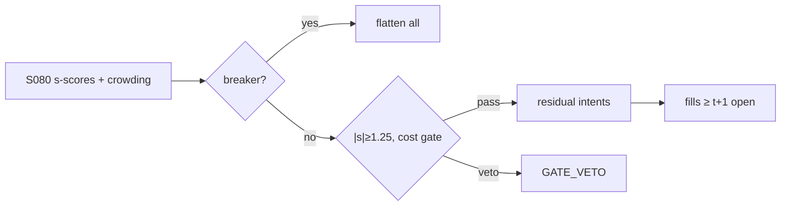

# T040 — PCA Eigenportfolio Residual Reversal

The Avellaneda–Lee (2010) program as a strategy module: extract PCA eigenportfolios from the return panel, compute each stock's residual to the factor model, trade the s-score (|s| > 1.25 entry, |s| < 0.50 exit — the documented conventions), with the S078 AR-timing gate and the August-2007 crowding circuit breaker from Khandani–Lo. Provenance **[D]**.

> Tag law: every numeric literal in prose carries one of `[documented]
> [default] [example] [unverified] [internal-est] [measured]` (legend: Appendix
> i v1.0.0). Constants inside cited formulas inherit the formula's tag.
> Bibliographic years, volumes, pages, arXiv IDs, section numbers, rule codes
> (C1–C12), fail-safe codes (F1–F5), module IDs, and machine-parsed §0 data
> fields are identifiers, not literals, and are exempt.

## §1 Five-minute reviewer card

| Row | Value |
|---|---|
| Module | T040 — PCA Eigenportfolio Residual Reversal, v1.1.0 |
| Edge verdict | `plausible` — Avellaneda–Lee (2010) is the documented PCA stat-arb program with stated conventions |
| After-cost | `narrow` — the best-documented stat-arb in equities and the most crowded — decay is the base case |
| Build cost | Tier M = 20–60 h ≈ `$3,000–9,000` [documented] |
| Data cost | OHLCV `$0–360`/yr [documented]; borrow feed optional `$1,788`/yr (ORTEX Advanced) or skipped via broker locate list [documented] |
| latency_class | end-of-day |
| risk_class | market |
| Capacity | `$500M–2B` [unverified] — diversified residuals scale |
| Executability | PCA + s-scores on daily bars: straightforward |
| Risk summary | Crowded unwinds (August 2007 is the template); factor-regime shifts; residual non-stationarity |
| When it dies | quant crowding events; volatility regimes where residuals stop mean-reverting |
| Regime gates | circuit breaker: halt new residuals when cross-sectional crowding > `2×` median [default] |
| Emits | `order_intents` (Appendix C v1.0.0) — OrderTicket intents only, never orders |

## §1.5 Cheapest / least-build path

1. **Prototype hour band:** 6–10 h [example] — PCA estimation + s-score trading + crowding monitor.
2. **Cheapest-source row:** min_tier = DAILY (OHLCV); latency_class = end-of-day;
   required_fields = daily returns panel + volume; price_band = `$0–360`/yr [documented] —
   Tiingo free tier (`500` symbols/mo, `1,000` req/day) → Power `$30`/mo; EODHD `$19.99`/mo;
   Marketstack from `$9.99`/mo; build_or_buy = **build**.
   Borrow/crowding feed: ORTEX Advanced `$149`/mo (`$1,188`/yr) with API access [documented] —
   the cheapest path **skips** it and uses the broker easy-to-borrow list + the C7 locate
   check (borrow modeled at GC rates in the COST block); twice-monthly exchange short
   interest is free but 11–12 days stale [documented].
3. **Resource budget:** Tier M per cost-model §5 = 20–60 h ≈ `$3,000–9,000` loaded at `$150`/hr [documented]; compute pattern `per_bar` — nightly vectorized batch over the panel (polars/numpy; PCA via scikit-learn `1.9.0` [documented], RNG `numpy==2.1.0` per §0).
4. **Skip list:** intraday residuals; dynamic PCA; paid borrow feed (until the escalation gate fires).
5. **DO-NOT-CUT list:** causality assertions (`assert fill_event >
   signal_event`, no-signal-bar-fills test); COST block + callable
   `expected_cost_bps`; F1–F5 fail-safes + module-state enum; kill-switch
   state machine + re-arm checklist; decision-log audit records;
   bona-fide-intent + self-trade prevention; provenance tags on every numeric
   literal; fixtures + `test_cmd`; secrets via env only.
6. **Escalation gate:** upgrade from cheapest when any holds — s-score half-lives stretch (intraday residuals); crowding persistently elevated or borrow squeezes observed (add ORTEX borrow feed); short-leg fraction grows materially (re-price borrow per-leg instead of book-average).

## §T0 Module contract

### T0.1 Typed signature

```python
def emit(state: ModuleState, signals: list[SignalVector], cfg: Config) -> list[OrderTicket]:
```

`OrderTicket` per Appendix C v1.0.0 (intents only — never wire orders).
`state` is the module-owned named state vector (`eigenportfolios, s_scores, positions, crowding`); `signals` are
canonical SignalVectors (Appendix b v1.0.0) from the consumed S-modules, newest
last; the function emits zero or more intents per bar/event. Documented edge
cases: no signals → flat, no intents; `UNKNOWN` input signal → restrictive
(halve size / stand down per F1); kill-switch TRIPPED → emit nothing, state
`OFF`. 

### T0.2 Config dataclass

Single `Config` dataclass — every parameter the §T3 pseudocode and the COST
callable read. Status ∈ {fixed, default, calibrate, example, internal-est}.

| Parameter | Type | Default | Range | Status |
|---|---|---|---|---|
| n_factors | int | `15` | [5, 50] | [default] |
| entry_s | float | `1.25` | [0.75, 2.0] | [default] |
| exit_s | float | `0.50` | [0.25, 1.0] | [default] |
| cost_gate_k | float | `0.50` | [0.1, 1.0] | [default] |
| risk_R_usd | float | `250.0` | [50, 2500] | [default] |
| stop_bps | float | `25.0` | [10, 100] | [default] |
| adv_cap_pct | float | `1.0` | [0.1, 10.0] | [default] |
| spread_full_bps | float | `3.0` | [1.0, 10.0] | [default] |
| taker_fee_bps | float | `0.30` | [0.0, 1.0] | [documented] |
| maker_rebate_bps | float | `-0.20` | [-0.35, 0.0] | [example] |
| borrow_bps_per_day | float | `0.06` | [0.0, 5.0] | [documented] |
| expected_hold_days | float | `5.0` | [1, 20] | [example] |
| short_leg_fraction | float | `0.50` | [0.0, 1.0] | [example] |
| impact_k | float | `15.0` | [5, 40] | [example] |
| side_exec | str | `taker` | {taker, maker} | [default] |
| venue | str | `primary` | — | [example] |
| crowding_mult | float | `2.0` | [1.5, 4.0] | [default] |
| cooldown_sessions | int | `1` | [0, 5] | [default] |
| daily_loss_stop_pct | float | `1.5` | [0.5, 3.0] | [default] |

All defaults tagged per the tag law (status `default` ⇒ `[default]`).

### T0.3 Canonical schema mapping

Vendor columns → canonical Event/Bar schema (Appendix a v1.0.0), stated once here:

| Vendor column | Canonical field | Notes |
|---|---|---|
| `bar` | Bar.index | synthetic row id [example] |
| `event_ts` | Event.event_ts | int64 ns UTC |
| `asof_ts` | Event.asof_ts | int64 ns UTC; `asof_ts ≥ event_ts` asserted (F2) |
| `symbol` | Bar.symbol | single-name fixture leg `XYZ` [example] |
| `close` | Bar.close | adjusted close |
| `signal_z` | Signal.s_score | signed residual z from S080 |
| `edge_bps` | Signal.edge_bps | expected edge, bps |
| `notional` | — (harness input) | sizing input, not a canonical field |
| `adv_pct` | Bar.adv_pct | participation input to the impact model |
| `adv_shares` | Bar.adv_shares | ADV-cap input |
| `stop_bps` | — (harness input) | vol-calibrated stop; doubles as `vol_estimate_bps` in the fixture [example] |
| `urgency` | Ticket.urgency | `normal` in the fixture |
| `market_state` | MarketState | Appendix market-state enum (§T0.5) |
| `daily_pnl_pct` | — (monitor input) | kill-switch trip input (§T0.7) |

### T0.4 Time contract

> Time contract: clock domain UTC, int64 ns; authoritative causality clock =
> `event_ts`; max_skew = `5` s [default]; jitter budget = `1` s [default];
> bar-label = open time; staleness TTL = `15` min [default]; gap policy = mask, no
> interpolation; halt/auction → discard contributions across reopen.

**Timing box:** `signal@t (daily bars, America/Chicago) → earliest fill @open(t+1)`

### T0.5 Market-state table

| State | Module behavior |
|---|---|
| CONTINUOUS_TRADING | Evaluate entry/exit rules; emit intents per §T2 |
| HALTED | Cancel working intents; emit nothing; state `UNKNOWN` until clean reopen |
| AUCTION | No new intents; hold intent-side state; state `DEGRADED` |
| CLOSED | Emit nothing; state `OFF` |


### T0.6 Module-state enum + error taxonomy

States per Appendix k v1.0.0: `OK | DEGRADED | UNKNOWN | OFF`. Invalid input →
`UNKNOWN`, never interpolate (Appendix f v1.0.0, F1–F5).

| Failure | State | Alert |
|---|---|---|
| Missing/stale input (TTL `15` min [default]) | `UNKNOWN` | page |
| Out-of-bounds indicator (F2) | `UNKNOWN` | page |
| Estimator disagreement (F3) | `UNKNOWN` | notify |
| Halt/auction per §T0.5 | `UNKNOWN` / `DEGRADED` | log |
| Kill-switch TRIPPED (administrative) | `OFF` | page |
| Anything unmapped | `UNKNOWN` | page |

### T0.7 Risk contract + kill switch

```yaml
risk_contract:
  per_trade_R: 250            # USD risk budget per trade [example]
  max_adverse_per_trade: 1.0 R [default]  # stop distance multiple [default]
  daily_loss_stop: 1.5% of equity [default]        # then no new entries; flatten managed risk [default]
  max_gross: 4× equity [default]              # hard gross exposure cap [default]
  kill_conditions:
    - daily P&L ≤ −daily_loss_stop_pct → TRIP (flatten all)
    - crowding breaker trips → TRIP (no new residuals until review)
    - decision-log write failure → TRIP (halt emission)
  enforcement: intraday-hard  # trips are automatic, not advisory [default]
  calibration_recipe: >
    Walk-forward on 60-day blocks [example]: fit thresholds on block t,
    freeze, validate realized shortfall vs predicted on block t+1;
    shrink per-trade R until max drawdown < daily_loss_stop/2 [default].
```

**Kill-switch state machine:** `ARMED → TRIPPED → RECOVERY → ARMED`.

- `ARMED`: normal operation; every bar evaluates the kill conditions.
- `TRIPPED`: any kill condition fires → cancel all working intents
  (`NEW`/`WORKING` → `CANCELLED`, idempotent), flatten managed positions via
  the exit rule, emit nothing new, state `OFF`, log `KILL_TRIP`.
- `RECOVERY`: manual operator review only — no automatic transition.
- `ARMED` (re-entry): only after the re-arm checklist passes in full, logged
  as `KILL_REARM` with the checklist result.

**Re-arm checklist** (all must be true):

- [ ] Feed health green: all §T5 inputs fresh inside the staleness TTL.
- [ ] Kill condition cleared: the tripping metric is back inside limits for `30 min [default]` [default].
- [ ] Decision log reconciled: `KILL_TRIP` record present and hash chain intact.
- [ ] Risk re-check: per-trade R and gross caps re-confirmed against current equity.
- [ ] Operator sign-off: named human approves re-arm (no automatic recovery).

### T0.8 Ops tail

- **Schedule:** nightly batch; owner: strategy owner (named).
- **Health checks:** fixture replay (`test_cmd`) green on deploy; live
  decision-log append monitor; kill-switch state heartbeat.
- **Alert table:** `UNKNOWN`/`OFF` state transitions; kill-trip pages immediately [default].
- **Resource budget:** nightly batch: < 2 vCPU-h, < 4 GB RAM [example].
- **Runbook stub:** 1) confirm kill-state; 2) inspect decision log for the tripping record; 3) verify feed freshness; 4) re-arm checklist (operator sign-off); 5) re-run fixture; 6) resume..

### T0.9 Secrets (env-only)

- `BROKER_API_KEY (paper venue, env-only)`
- `DATA_API_KEY (env-only)` via environment only. No secrets in this file, fixtures, or
logs (CI secrets-grep).

### T0.10 May / must-NOT

> **May:** emit `OrderTicket` intents per Appendix C v1.0.0; track intent-side
> state (`NEW → WORKING → FILLED / CANCELLED / PARTIAL`); issue cancel-replace
> via new tickets with new `ticket_id`s. **Must-NOT:** place orders on any
> venue, hold broker/exchange sessions, net intents into orders inside the
> strategy, treat the intent-side state machine as broker wire truth, or emit
> prices/share-counts/notionals outside an `OrderTicket`.

## §T1 Legacy (subsumed by §1)

Legacy §T1 content is the §1 reviewer card above; this header is retained so
section numbering stays frozen.

## §T2 Specification

### Universe

US large/mid-cap equities; liquid, borrowable; `500+` names [example].

### Entry rule (Boolean — no prose-only conditions)

```
f = PCA(returns, n_factors)                    # eigenportfolios [documented]
eps_i = r_i - beta_i' f                           # residual
s_i = eps_i / sigma_eps_i                         # s-score
crowding_ok  = crowding <= crowding_mult * median_crowding   # crowding_mult = 2.0 [default]
ar_timing_ok = S078_ar_ok(i)                      # AR/ARMA timing gate on the residual [documented]
cost_gate    = expected_cost_bps(notional_i, adv_pct_i, venue, side_exec, urgency, cfg) <= cost_gate_k * edge_bps_i
locate_ok    = (side == LONG) or locate_ok(i)     # C7: SHORT requires a locate
ENTRY = (|s_i| >= entry_s) AND crowding_ok AND ar_timing_ok AND cost_gate AND locate_ok
```

Fade mapping (normative): `s_i > 0` → `SHORT`, `s_i < 0` → `BUY` — trade the
residual back toward zero. `entry_s = 1.25` [documented], `exit_s = 0.50` [documented].

### Exits (with post-exit cooldown)

```
converge -> |s_i| < exit_s (0.50 [documented]) -> FLAT
unwind   -> crowding breaker trips -> FLAT all
stop     -> adverse stop_bps -> FLAT name, cooldown
```

### Position sizing (fenced function)

```python
def shares(risk_budget_R, stop_distance_bps, vol_estimate_bps, ADV_cap_shares, cost_bps, px):
    """Reference sizing. cost_bps is gate-consumed upstream
    (expected_cost_bps(...) <= k * edge_bps); shares are risk-capped,
    not cost-derated [default]."""
    stop_bps = max(stop_distance_bps, vol_estimate_bps)  # wider of fixed/vol stop [default]
    raw = risk_budget_R / (stop_bps / 1e4 * px)
    return max(1, min(int(raw), int(ADV_cap_shares)))
```

`ADV_cap_shares = adv_cap_pct/100 × adv_shares` (`adv_cap_pct = 1.0` [default]).
In the fixture, `stop_bps` doubles as the vol-calibrated stop
(`vol_estimate_bps = stop_bps`) [example].

### Risk limits

| Limit | Value |
|---|---|
| Names live | `100` [example] |
| Per-name risk | `$250` (1 R) [example] |
| Crowding breaker | `2×` median [default] → flatten all, no new entries |
| Daily loss stop | `1.5%` of equity [default] → no new entries, flatten managed risk |
| Max gross | `4×` equity [default] — hard cap, intraday-hard enforcement |
| Max adverse per trade | `1.0` R [default] — CI-gated stop-distance multiple |

### COST block (single source of truth)

Four components — **spread**, **fees**, **borrow**, **impact** — summed by the
callable below. Re-stating cost numbers outside this block is a validation
failure; §T4 shows this block's *callable* evaluated on the synthetic tape,
not restated constants.

| Component | Value (bps) | Basis |
|---|---|---|
| Spread (half) | `1.50` | [example] |
| Fees (taker leg) | `0.30` | [documented] — NYSE-family `$0.0030`/share to remove liquidity ≈ `0.3` bps at `$100`/share (SEC 19b-4 filings) |
| Borrow | `0.15` | [documented] — `borrow_bps_per_day × expected_hold_days × short_leg_fraction = 0.06 × 5 × 0.5`; GC easy-to-borrow 10–20 bps annualized ≈ `0.04–0.08` bps/day |
| Impact | `k·√(adv_pct/100)`, k=`15.0` | diversified [example] |
| **Total reference (one-way)** | `3.01` [example] | `1.50 + 0.30 + 0.15 + 1.06` |
| **Round-trip reference** | `5.87` [example] | `2×(1.50 + 0.30 + 1.06) + 0.15` |

Marginal single-leg borrow (for a pure SHORT residual, not the book average):
`0.06 × 5 = 0.30` bps [documented] — specials (≥ `30` bps annualized
[documented]) are excluded by the borrow screen; if a name goes special the
module vetoes the SHORT leg (C7) and re-prices.

`fee_schedule_as_of`: `2026-09-10` [documented] — taker leg priced at the
NYSE-family `$0.0030`/share non-tier take rate (NYSE Arca / NYSE American SEC
19b-4 filings); re-pin the schedule when the production venue is chosen.
`side`: `taker` (reference leg — entries are marketable; production book is
mixed, maker legs price at `maker_rebate_bps = -0.20` [example]); venue/tier/source:
primary lit [example].

```python
def expected_cost_bps(notional, adv_pct, venue, side, urgency, cfg):
    """COST-block callable. Diversified residual book: low urgency.
    side = taker|maker|mixed is the EXECUTION side; borrow is the
    book-average for the dollar-neutral residual book."""
    spread = cfg.spread_full_bps / 2.0
    fee = cfg.taker_fee_bps if side == "taker" else cfg.maker_rebate_bps
    borrow = cfg.borrow_bps_per_day * cfg.expected_hold_days * cfg.short_leg_fraction
    impact = cfg.impact_k * math.sqrt(max(adv_pct, 0.0) / 100.0)
    if urgency == "high":
        impact *= 1.5
    return spread + fee + borrow + impact
```

### Execution / fill model table

| Aspect | Assumption |
|---|---|
| Fill venue | primary lit, daily rebalance at the close |
| Latency | intent emitted at bar-`t` close; earliest fill bar `t+1` open (t→t+1 causality) |
| Slippage model | close ± half-spread; taker leg pays the `0.30` bps [documented] fee |
| Partial fills | worked over the day; pro-rata; unfilled remainder cancelled at EOD and re-issued next bar |
| Adverse fill | assume `+0.5×` half-spread adverse selection on entry legs [example] |
| Halt behavior | skip halted names; cancel working intents (C6) |
| Corporate actions | excluded on ex-date [default] |

Fine-grained fill behavior is synthetic and labeled `simulated only — requires MBO/ITCH`:
no MBO/ITCH feed is consumed by this module; any fill realism beyond the
mid-price ± half-spread fill model above would require MBO/ITCH data.

### Robustness

Perturb thresholds ±20% [example]; the reference behavior (entry/exit intents, gate blocks, kill trip) must be invariant; degrade entry→no-trade on indicator breach.

### Compliance sub-block (C1–C12)

| Code | Rule: trigger → check → action → log |
|---|---|
| C1 | STP + self-match prevention: trigger = intent could match our own resting interest → check = every ticket carries `self_trade_prevention: true`; maker modules compare against own open tickets → action = cancel own resting quote before posting the aggressive side; cancel-replace via new `ticket_id` only → log = `COMPLIANCE_BLOCK` with rule code `C1` |
| C2 | Bona-fide intent: trigger = entry rule fires → check = cost gate passes AND qty within risk limits AND (SHORT ⇒ `locate_ok`) → action = veto the intent if any check fails; no quote entered without intent to trade → log = `GATE_VETO` with the failed check |
| C3 | Message-rate / cancel-to-trade: trigger = intents+ cancels per symbol per minute exceed `120` [default] → check = rolling `60`-s [default] message counter → action = throttle to `1` intent per `10` s [default] and alert → log = `COMPLIANCE_BLOCK` with the counter value |
| C4 | Pre-trade fat-finger trio: trigger = any new intent → check = (a) limit within `±10%` of reference [default], (b) ticket notional ≤ ``$2M`` [default], (c) ≤ `20` tickets per `1 min` [default] → action = block the ticket, alert → log = `COMPLIANCE_BLOCK` with the breached leg |
| C5 | Decision-log schema (Appendix g v1.0.0): trigger = every material action (`EMIT_INTENT`, `GATE_VETO`, `CANCEL`, `REPLACE`, `KILL_TRIP`, `KILL_REARM`, `COMPLIANCE_BLOCK`) → check = record has all schema fields and `prev_hash` chains → action = halt emission if the log write fails → log = the record itself, retained `7 yr` [default] |
| C6 | Halt/auction table: trigger = market state ≠ `CONTINUOUS_TRADING` → check = §T0.5 table → action = `HALTED`: cancel working intents, emit nothing; `AUCTION`: no new intents; `CLOSED`: state `OFF` → log = state-transition record |
| C7 | Locate check (short sales): trigger = `SHORT` intent → check = `locate_ok` from the pre-open easy-to-borrow list or desk locate; Reg-SHO threshold securities hard-blocked → action = veto without locate → log = `GATE_VETO` with code `C7` |
| C8 | Public-dissemination gate: trigger = any export of signals/intents outside the firm → check = review gate sign-off → action = block unreviewed exports → log = `COMPLIANCE_BLOCK` |
| C9 | Data-entitlement assertions (Appendix j v1.0.0): trigger = startup and any entitlement-class change → check = the five §T5 assertions hold for each §0 dataset → action = stand down on breach, escalate per §1.5 → log = entitlement review record |
| C10 | Post-exit cooldown: trigger = exit or compliance block → check = `now >= cooldown_until` (`1 session [default]` [default]) → action = suppress re-entry until the cooldown elapses → log = `GATE_VETO` with code `C10` |
| C11 | Kill-switch integration: trigger = `TRIPPED` → check = all working intents transitioned `NEW`/`WORKING` → `CANCELLED` (idempotent) → action = no new intents until `ARMED` via the §T0.7 checklist → log = `KILL_TRIP` / `KILL_REARM` records |
| C12 | C12 Residual-concentration: trigger = top-10 names > 40% of gross [example] → check = concentration review → action = cap → log with code `C12` |

### Parameter table

| Parameter | Symbol | Value | Tag | Sensitivity |
|---|---|---|---|---|
| Factors | K | `15` | [default] | medium — too few leaks factor, too many fits noise |
| Entry s | s_e | `1.25` | [default] | high — the documented convention |
| Exit s | s_x | `0.50` | [default] | low — the documented convention |
| Cost-gate k | k | `0.50` | [default] | high — blocks thin-edge entries |
| Crowding multiple | c_m | `2.0` | [default] | high — the unwind breaker |
| Risk budget | R | `$250` | [example] | medium — scales linearly with equity |
| Stop | stop_bps | `25` bps | [default] | high — sets share count |
| ADV cap | adv_cap_pct | `1.0`% | [default] | medium — capacity throttle |
| Taker fee | fee_t | `0.30` bps | [documented] | low — venue schedule |
| Borrow/day | b_d | `0.06` bps | [documented] | medium — specials excluded by screen |
| Hold days | h_d | `5` | [example] | medium — residual half-life scale |
| Short-leg fraction | f_s | `0.50` | [example] | medium — book-average borrow input |
| Impact k | k_i | `15.0` | [example] | medium — diversified-book assumption |
| Cooldown | cd | `1` session | [default] | low — post-exit re-entry delay |
| Daily loss stop | dls | `1.5`% | [default] | high — kill-switch trip |

### Timing box

`signal@t (daily bars, America/Chicago) → earliest fill @open(t+1)`

## §T3 Math + normative pseudocode

Avellaneda–Lee (2010) [documented]: r = B·f + ε via PCA; trade s = ε/σ_ε with
|s| > 1.25 entry, |s| < 0.50 exit [documented conventions]. Engle–Granger (1987)
[documented]: the econometric foundation of residual mean-reversion. Tsay (2005)
[documented]: AR/ARMA estimation behind the S078 timing gate. Khandani–Lo (2007)
[documented]: August 2007 — the crowded-unwind template that sets the circuit breaker.

**Normative pseudocode** (pseudocode is normative; prose is commentary).
Every prose guard below appears in the code — kill, breaker, F1/F2, locate
(C7), cooldown (C10), cost gate, causality:

```
SESSION_NS = 86_400_000_000_000   # one daily session, int64 ns [default]

def emit(state, signals, cfg):
    sig = primary(signals, "S080")          # s-scores + crowding + edge_bps
    if sig is None or invalid(sig): return [], state.unknown()   # F1/F2
    if kill.tripped: return [], state.off()                      # kill: emit nothing
    if sig.crowding_breaker:
        return exit_tickets(state), state.flat()   # unwind: never cost-gated
    tickets = []
    for name, s in sig.s_scores.items():
        if state.has(name):
            if abs(s) <= cfg.z_exit or stopped_name(state, name, cfg):
                tickets += exit_ticket(state, name, qty=shares(cfg.risk_R_usd, cfg.stop_bps, vol_est(name), adv_cap(name), 0.0, px(name)))
                state.cooldown_until = sig.event_ts + cfg.cooldown_sessions * SESSION_NS  # C10
            continue
        if abs(s) >= cfg.entry_s and sig.ar_ok.get(name, True):
            if sig.event_ts < state.cooldown_until:
                log("GATE_VETO", code="C10", name=name); continue   # post-exit cooldown
            side = "SHORT" if s > 0 else "BUY"      # fade the residual [documented]
            if side == "SHORT" and not locate_ok(name):
                log("GATE_VETO", code="C7", name=name); continue    # locate check
            cost = expected_cost_bps(notional(name), adv_pct(name), cfg.venue, cfg.side_exec, "normal", cfg)
            # ^^^ normative cost-gate predicate: expected_cost_bps(...) <= k * edge_bps
            if cost <= cfg.cost_gate_k * sig.edge_bps:
                t = OrderTicket.intent(side, qty=shares(cfg.risk_R_usd, cfg.stop_bps, vol_est(name), adv_cap(name), cost, px(name)), limit=None)
                t.intent_ts = sig.event_ts
                assert fill_event > signal_event  # t->t+1 causality: no-signal-bar fills
                tickets.append(t)
            else: log("GATE_VETO", code="COST", cost=cost)
    return tickets, state.rebalanced()
```

`limit=None` = marketable taker intent (reference `side_exec = taker`); exits
are never cost-gated [default]. The reference implementation
(`modules/tests/test_T040.py::process_bar`) is the executable instance of
this pseudocode.

Causality: every feature uses inputs with `event_ts ≤ t` only; the earliest
fill for a bar-`t` intent is bar `t+1`'s open. Mandatory unit test:
no-signal-bar fills.

## §T4 Worked example (fixture-backed)

- Tape: `modules/fixtures/T040_tape.csv` — `# TYPE: validation-run`;
  `12` synthetic bars (seed `4400` [example]); `event_ts`/`asof_ts` int64 ns
  UTC; every number synthetic.
- Expected outputs: `modules/fixtures/T040_expected.csv` — per-bar intent,
  quantity, the **cost-function call** (`expected_cost_bps` inputs → bps →
  dollars), cost-gate verdict, and module state.
- Tolerance: `1e-9` [default] on floats; integer quantities exact.
- Acceptance tests (`modules/tests/test_T040.py` — `7` [default] tests):
  1. TYPE header + columns present; 2. fixture recomputes to expected
  (reference `process_bar` vs expected CSV); 3. no-signal-bar fills
  (`assert fill_event > signal_event`); `4.` cost-gate predicate passes on large edge, blocks on tiny edge (`k = 0.5` [default]);
  5. kill-switch trip blocks intents, re-arm checklist restores `ARMED`;
  6. invalid input (halted/invalid bar) → `UNKNOWN`, no intents;
  7. post-exit cooldown (C10): re-entry suppressed for `1` session [default], then allowed.
- `test_cmd`: `python3 -m pytest modules/tests/test_T040.py -q` → exits `0` [default].

**Cost-function calls on the tape** (the COST-block callable evaluated on
synthetic rows — inputs → bps → dollars; the `0.15` bps borrow is the
book-average `0.06 × 5 × 0.5` [documented]):

| Bar | `expected_cost_bps` inputs | Components → total → $ | Cost gate `expected_cost_bps(...) <= k * edge_bps` | Intent / state |
|---|---|---|---|---|
| `0` | notional=`100000` [example], adv_pct=`0.5` [example], venue=`primary`, side=`taker`, urgency=`normal` | spread `1.50` [example] + fee `0.30` [documented] + borrow `0.15` [documented] + impact `1.06` [example] = `3.01` bps → `$30.11` | edge `2.0`, k=`0.5` [default] → `3.01 ≤ 1.0` BLOCK | `HOLD` / `OK` |
| `3` | same inputs | `3.01` bps → `$30.11` | edge `11.442640687119285`, k=`0.5` [default] → `3.01 ≤ 5.72` PASS | `SHORT` / `OK` (entry — fade: `s > 0`) |
| `6` | same inputs | `3.01` bps → `$30.11` | edge `3.0`, k=`0.5` [default] → `3.01 ≤ 1.5` BLOCK — but this is an **exit** (exits never cost-gated [default]) | `BUY` / `OK` (exit to cover) |
| `7` | same inputs | `3.01` bps → `$30.11` | edge `0.05`, k=`0.5` [default] → `3.01 ≤ 0.025` BLOCK | `HOLD` / `OK` (gate-block) |
| `9` | same inputs | `3.01` bps → `$30.11` | — (kill tripped) | `HOLD` / `OFF` (kill-trip) |

**Hand-checks.** Row `3` (entry): qty = `250 / (25/1e4 × 100.8)` = `992.06` → `992` shares [example]; ticket `T040-0003`, side `SHORT` (fade the `s = 1.5` residual), marketable taker intent, `intent_ts` = bar-3 `event_ts`; gate `3.010660171779821 ≤ 0.5 × 11.442640687119285 = 5.7213203435596425` PASSES. Row `6` (exit): `|z| = 0.25 ≤ 0.50` → `BUY` `995` shares to cover (`250/(25/1e4 × 100.47) = 995.32` [example]); exits never cost-gated [default]. Row `7` (gate block): edge `0.05` bps [example] vs cost `3.01` bps → gate `3.01 ≤ 0.025` BLOCKS → no intent, state stays `OK`. Row `9` (kill): daily P&L `-1.6%` [example] ≤ −stop (`1.5%` [default]) → `ARMED → TRIPPED`, state `OFF`, no intents. Causality: entry intent at row `3` has `intent_ts` = bar-3 `event_ts`; the earliest fill is bar `4`'s open — the test asserts `fill_event > signal_event` on every intent row.

**Where the example is optimistic.** Costs are the COST-block model, not realized fills; capacity, borrow squeezes, and regime shifts are not in the tape.

## §T5 Dependencies + data

### Consumed signals (from deps.yaml — machine edge list)

| Signal | Version pin | Role |
|---|---|---|
| S080 | 1.0.0 | primary |
| S078 | 1.0.0 | confirm |
| S039 | 1.0.0 | gate |

### Pinned formula excerpts (≤10 lines each, CI hash-checked)

**S080** (v1.0.0): `ε = r − B·f`; `s = ε/σ_ε` [documented].
**S078** (v1.0.0): AR(1)/ARMA timing filter on residuals [documented].

### Data required

| Field | Type | Granularity | Source tier | Notes |
|---|---|---|---|---|
| daily returns panel | float | daily | DAILY | PCA estimation |
| daily volume | int | daily | DAILY | liquidity screen |
| borrow availability | bool/bps | daily | BORROW | short residuals |

**Data rights row** (Appendix j v1.0.0): Daily bars are commodity data; borrow data licensed per-seat; entitlements re-asserted at startup.

**Data-entitlement assertions** (the five C9 startup checks):

1. Daily OHLCV is licensed for the deploying entity under the vendor's terms (Tiingo per §1.5 cheapest-source row); license key present via env.
2. If a borrow/crowding feed is consumed (e.g. ORTEX), it is licensed per-seat; its absence degrades the module (borrow screen → broker easy-to-borrow list, `borrow_bps_per_day` reverts to [unverified]).
3. Exchange short-interest data, if consumed, is public delayed data — redistribution terms respected, staleness disclosed.
4. No real-time consolidated (SIP) data is consumed by this module; adding any SIP feed requires a fresh entitlement assertion before `ARMED`.
5. Dataset fingerprints (§0) are re-verified on ingest; any mismatch → state `UNKNOWN`, no intents.

## §T6 Local build + buy vs build

PCA in sklearn/numpy + s-score trading: the canonical implementation. The crowding monitor is the risk work.

| Route | What you get | Verdict |
|---|---|---|
| Build | eigenportfolio engine in-house | recommended |
| Buy | risk model for crowding | acceptable |

**Verdict:** Build. Every quant desk since 2007 has built this; the breaker is what differs.

## §T7 Efficacy — documented evidence

| Study / source | Market & period | Metric | Before/after cost | Caveat |
|---|---|---|---|---|
| Avellaneda–Lee (2010) | US equities 1997–2007 | Sharpe ~1.4 pre-cost | BEFORE-COST | decay caution post-2007 |
| Khandani–Lo (2007) | event | August 2007 unwind | N/A | the failure template |
| Engle–Granger (1987) | method | cointegration/error-correction | N/A | foundation, not P&L |

**Selection disclosure:** Studies are the chapter's documented sources — the program's canon plus its failure case, not a selected subset.

**Capacity & decay.** Avellaneda–Lee themselves flag the decay; treat the 1997–2007 Sharpe as historical. The circuit breaker exists because the unwind is the strategy's defining risk.

**Honest bottom line.** Honest bottom line: this is the most studied equity stat-arb ever published — which is exactly why its edge is the most competed. Run it for diversification and humility, not for alpha.

## §T8 Failure modes & pitfalls

| # | Trigger → Detect → Action → Recovery | check: |
|---|---|---|
| 1 | Crowded unwind → detect breaker → flatten all, cooldown → review | check: breaker backtest |
| 2 | Factor-regime shift → detect residual non-stationarity → re-estimate PCA → log | check: stationarity tests |
| 3 | Single-name blowup → detect |s| > 4 [example] → cap size, review thesis → alert | check: outlier monitor |
| 4 | Borrow squeeze → detect → cover shorts, state DEGRADED → re-screen | check: borrow monitor |

## §T9 Regime gates + visuals

**Provisional regime-gate machine** (restrictive default; `regime_ids` stay
empty until the R001–R050 annotation pass; the IDs below are module-local
provisional placeholders, not compendium R-series modules):

| regime_id | direction | mechanism | condition | action | min_lag | unknown_behavior |
|---|---|---|---|---|---|---|
| R001 | degrades | crowding breaker | crowding > 2× median [default] | veto | immediate | restrictive |
| R002 | degrades | factor instability | PCA loadings drift | pause_entry | 1 week | restrictive |



## §T10 Source log + unverified leads

**Sources** (citable facts only):

1. Avellaneda, M. & Lee, J.-H. (2010). "Statistical Arbitrage in the U.S. Equities Market." *Quantitative Finance* 10(7), 761–782. doi:10.1080/14697680903124632
2. Khandani, A. E. & Lo, A. W. (2007). "What Happened to the Quants in August 2007?" *Journal of Investment Management* 5(4), 5–54 — https://web.mit.edu/Alo/www/Papers/august07.html
3. Engle, R. F. & Granger, C. W. J. (1987). "Co-Integration and Error Correction: Representation, Estimation, and Testing." *Econometrica* 55(2), 251–276. doi:10.2307/1913236
4. Tsay, R. S. (2005). *Analysis of Financial Time Series*. Wiley, 2nd ed.

**Chatbot source log.** Grok answered the Q-batch (2026-09-10); all claims independently verified or labeled unverified. Chatbot output is leads, never facts.

**Unverified leads** (chatbot-only — never in evidence tables):

- Grok (2026-09-10, Q-TB4): post-2010 Sharpe magnitudes; 128GB M5 Max timing claims — *unverified chatbot claims*.
- Dynamic-PCA extensions — research lead, not validated.

## GROK-NEEDED — exact questions web search could not answer

1. **Production venue fee schedule:** the COST block prices the taker leg at the NYSE-family `$0.0030`/share non-tier take rate (SEC 19b-4 filings, verified 2026-09-10). Which primary-lit venue and tier would a `$500M–2B` [unverified] capacity residual book actually clear on, and what is that venue's current take fee per share and any volume-tier thresholds?
2. **Cheapest programmatic borrow-availability feed:** ORTEX Advanced (`$149`/mo, API included) is the cheapest documented borrow/crowding feed found. Is there any cheaper API with availability/utilization/cost-to-borrow fields for a 500-name US universe (e.g. vendor academic tiers, broker SIP-adjacent feeds), or is the cheapest honest path the broker easy-to-borrow list + twice-monthly exchange short interest?
3. **Realized post-2010 edge:** what are the realized Sharpe ratios (after realistic costs) of published Avellaneda–Lee (2010) replications on US equities 2010–2025, with the exact cost assumptions used? (Grok's earlier magnitudes remain unverified.)
4. **Tiingo Power `$30`/mo EOD coverage:** does it include split/dividend-adjusted closes and delisted symbols for a 500-name historical panel backtest, or are survivorship-bias adjustments needed?
5. **FIS Astec / S3 borrow data pricing:** single-seat pricing for daily borrow-fee + availability data on US large/mid caps — any published or quoted price band?

---

## Appendix — AI build prompt (T040)

Copy-paste into any chat agent:

> Build module **T040 — PCA Eigenportfolio Residual Reversal** per `notes/module-template.md` v1.0.0 and
> this file's §T0 contract.
> Cheapest path (§1.5): prototype 6–10 h [example]; cheapest data candidate
> Tiingo (free tier → Power `$30`/mo [documented]); compute pattern `per_bar`
> (nightly vectorized batch, polars/numpy; PCA via scikit-learn).
> Implement `emit(state, signals, cfg) -> list[OrderTicket]` (Appendix c
> v1.0.0) with the §T3 normative pseudocode, including the fade mapping
> (`s > 0` → `SHORT`, `s < 0` → `BUY`), the cost-gate predicate
> `expected_cost_bps(...) <= k * edge_bps`, the C7 locate check, the C10
> post-exit cooldown, and `assert fill_event >
> signal_event`. Emit intents only — never place orders. Wire F1–F5
> (Appendix f v1.0.0): invalid input → `UNKNOWN`, never interpolate. Kill
> switch `ARMED → TRIPPED → RECOVERY → ARMED` with the §T0.7 re-arm checklist.
> Log decisions per Appendix g v1.0.0. Secrets via env only. Run the fixture
> `modules/fixtures/T040_tape.csv` (`# TYPE: validation-run`) against
> `modules/fixtures/T040_expected.csv` (tolerance `1e-9` [default]).
> **Definition of done:** `python3 -m pytest modules/tests/test_T040.py -q` exits `0` [default]. Tag every numeric literal
> you add with the unified enum (Appendix i v1.0.0); put anything unverifiable
> in §T10 unverified leads.
