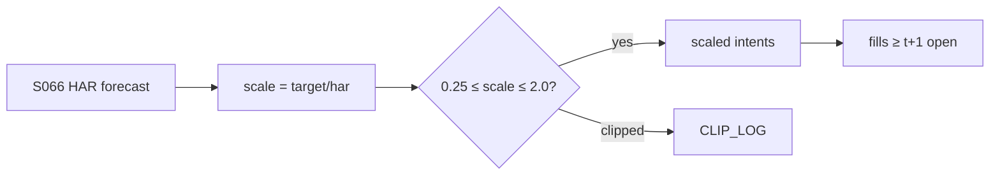

# T041 — HAR Vol-Timing Overlay

A volatility-timing overlay, not a standalone alpha: it scales any base strategy's exposure by the inverse of the HAR-RV forecast (Corsi 2009), following Moreira–Muir (2017). When forecast vol is high, the overlay de-levers; when low, it re-levers — raising Sharpe by cutting the worst volatility episodes (Barroso–Santa-Clara 2015 document the crash-avoidance). Provenance **[D]**.

> Tag law: every numeric literal in prose carries one of `[documented]
> [default] [example] [unverified] [internal-est] [measured]` (legend: Appendix
> i v1.0.0). Constants inside cited formulas inherit the formula's tag.
> Bibliographic years, volumes, pages, arXiv IDs, section numbers, rule codes
> (C1–C12), fail-safe codes (F1–F5), module IDs, and machine-parsed §0 data
> fields are identifiers, not literals, and are exempt.

## §1 Five-minute reviewer card

| Row | Value |
|---|---|
| Module | T041 — HAR Vol-Timing Overlay, v1.0.1 |
| Edge verdict | `AFTER-COST-EDGE` — volatility timing raises Sharpe across factors after cost (Moreira–Muir 2017); HAR beats GARCH-family on OOS loss (Corsi 2009). Conditional: the overlay amplifies the base book's edge; it cannot fix a negative-edge base book |
| After-cost | `narrow` — an overlay has no edge of its own — it improves the Sharpe of whatever it scales, including bad strategies |
| Build cost | Tier S = 5–15 h ≈ `$750–2,250` [documented] |
| Data cost | realized-vol inputs: near-free [documented] |
| latency_class | end-of-day |
| risk_class | overlay |
| Capacity | bounded by the base book's capacity — the overlay itself adds no independent capacity; it scales existing books |
| Executability | a HAR regression and a multiplier: the simplest vol build |
| Risk summary | Vol-forecast error mistimes the leverage; whipsaw scaling adds turnover |
| When it dies | it degrades, not dies — mistimed scaling just adds noise |
| Regime gates | R001 machine record (§T9): vol-spike regime amplifies the overlay's protective action (halve); the overlay IS the regime response |
| Emits | `order_intents` (Appendix C v1.0.0) — OrderTicket intents only, never orders |

## §1.5 Cheapest / least-build path

1. **Prototype hour band:** 2–4 h [example] — HAR regression + scaling rule on any base book.
2. **Cheapest-source row:** min_tier = DAILY; latency_class = end-of-day;
   required_fields = S066 HAR forecast (one scalar/day) + base-book target positions (internal);
   price_band = `$0`/yr — Stooq free daily OHLCV CSV (`https://stooq.com/q/d/l/`,
   documented via https://github.com/api-evangelist/stooq/blob/HEAD/README.md, fetched 2026-09-10)
   feeds the realized-vol input of S066; verify Stooq terms before commercial use [documented];
   build_or_buy = **build**.
3. **Resource budget:** Tier S = 5–15 h ≈ `$750–2,250` loaded [documented]; compute pattern `vectorized batch (polars/numpy)`.
4. **Skip list:** intraday vol timing; options-based vol forecasts.
5. **DO-NOT-CUT list:** causality assertions (`assert fill_event >
   signal_event`, no-signal-bar-fills test); COST block + callable
   `expected_cost_bps`; F1–F5 fail-safes + module-state enum; kill-switch
   state machine + re-arm checklist; decision-log audit records;
   bona-fide-intent + self-trade prevention; provenance tags on every numeric
   literal; fixtures + `test_cmd`; secrets via env only.
6. **Escalation gate:** upgrade from cheapest when any holds — scaling turnover dominates; base book has no vol to time.

## §T0 Module contract

### T0.1 Typed signature

```python
def emit(state: ModuleState, signals: list[SignalVector], cfg: Config) -> list[OrderTicket]:
```

`OrderTicket` per Appendix C v1.0.0 (intents only — never wire orders).
`state` is the module-owned named state vector (`current_scale, har_last,
base_qty_last`); `signals` are canonical SignalVectors (Appendix b v1.0.0) from
the consumed S-modules, newest last; the function emits zero or more intents
per bar/event. Documented edge cases: no S066 HAR forecast (missing / NaN /
non-positive HAR) → state `UNKNOWN`, scale frozen, no intents, never
interpolate (F1/F2); kill-switch TRIPPED → emit nothing, state `OFF`; stale
input past the §T0.4 TTL → `UNKNOWN`.

### T0.2 Config dataclass

| Parameter | Type | Default | Range | Status |
|---|---|---|---|---|
| target_vol | float | `0.15` | [0.05, 0.30] | [default] |
| scale_cap | float | `2.0` | [1.0, 3.0] | [default] |
| scale_floor | float | `0.25` | [0.0, 0.5] | [default] |
| rebalance_tol | float | `0.01` | [0.001, 0.10] | [default] |
| rv_lags | tuple[int, int, int] | `(1, 5, 22)` | fixed | [documented] |
| har_beta_source | str | `S066 v1.1.0` | pinned | [default] |
| cost_gate_k | float | `0.50` | [0.1, 1.0] | [default] |
| daily_loss_stop_pct | float | `1.0` | [0.25, 3.0] | [default] |

All defaults tagged per the tag law (status `default` ⇒ `[default]`).

### T0.3 Canonical schema mapping

Vendor columns → canonical Event/Bar schema (Appendix a v1.0.0), stated once here:

| Vendor column | Canonical field | Notes |
|---|---|---|
| `har` (S066 output) | Event: scalar, annualized HAR-RV forecast | missing/NaN/≤0 → `UNKNOWN`, never interpolate |
| `base_qty`, `base_side` | internal | the base book's target position this bar; the overlay never flips `base_side` |
| `c` (daily close) | Bar: daily | sanity bound only (must be > 0) |

### T0.4 Time contract

> Time contract: clock domain UTC, int64 ns; authoritative causality clock =
> `event_ts`; max_skew = `5` s [default]; jitter budget = `1` s [default];
> bar-label = open time; staleness TTL = `15` min [default]; gap policy = mask, no
> interpolation; halt/auction → discard contributions across reopen.

**Timing box:** `signal@t (daily bars, America/Chicago) → earliest fill @open(t+1)`

### T0.5 Market-state table

| State | Module behavior |
|---|---|
| CONTINUOUS_TRADING | Evaluate entry/exit rules; emit intents per §T2 |
| HALTED | Cancel working intents; emit nothing; state `UNKNOWN` until clean reopen |
| AUCTION | No new intents; hold intent-side state; state `DEGRADED` |
| CLOSED | Emit nothing; state `OFF` |


### T0.6 Module-state enum + error taxonomy

States per Appendix k v1.0.0: `OK | DEGRADED | UNKNOWN | OFF`. Invalid input →
`UNKNOWN`, never interpolate (Appendix f v1.0.0, F1–F5).

| Failure | State | Alert |
|---|---|---|
| Missing/stale input (TTL `15` min [default]) | `UNKNOWN` | page |
| Out-of-bounds indicator (F2) | `UNKNOWN` | page |
| Estimator disagreement (F3) | `UNKNOWN` | notify |
| Halt/auction per §T0.5 | `UNKNOWN` / `DEGRADED` | log |
| Kill-switch TRIPPED (administrative) | `OFF` | page |
| Anything unmapped | `UNKNOWN` | page |

### T0.7 Risk contract + kill switch

```yaml
risk_contract:
  per_trade_R: 250            # USD risk budget per trade [example]
  max_adverse_per_trade: 1.0 R [default]  # stop distance multiple [default]
  daily_loss_stop: 2% of equity [default]        # then no new entries; flatten managed risk [default]
  max_gross: 4× equity [default]              # hard gross exposure cap [default]
  kill_conditions:
    - base-book kill-trip → overlay freezes (no independent trip needed)
    - HAR NaN for 3 sessions → TRIP (freeze scaling)
    - decision-log write failure → TRIP (halt emission)
  enforcement: intraday-hard  # trips are automatic, not advisory [default]
  calibration_recipe: >
    Walk-forward on 60-day blocks [example]: fit thresholds on block t,
    freeze, validate realized shortfall vs predicted on block t+1;
    shrink per-trade R until max drawdown < daily_loss_stop/2 [default].
```

**Kill-switch state machine:** `ARMED → TRIPPED → RECOVERY → ARMED`.

- `ARMED`: normal operation; every bar evaluates the kill conditions.
- `TRIPPED`: any kill condition fires → cancel all working intents
  (`NEW`/`WORKING` → `CANCELLED`, idempotent), flatten managed positions via
  the exit rule, emit nothing new, state `OFF`, log `KILL_TRIP`.
- `RECOVERY`: manual operator review only — no automatic transition.
- `ARMED` (re-entry): only after the re-arm checklist passes in full, logged
  as `KILL_REARM` with the checklist result.

**Re-arm checklist** (all must be true):

- [ ] Feed health green: all §T5 inputs fresh inside the staleness TTL.
- [ ] Kill condition cleared: the tripping metric is back inside limits for `30 min [default]` [default].
- [ ] Decision log reconciled: `KILL_TRIP` record present and hash chain intact.
- [ ] Risk re-check: per-trade R and gross caps re-confirmed against current equity.
- [ ] Operator sign-off: named human approves re-arm (no automatic recovery).

### T0.8 Ops tail

- **Schedule:** nightly batch; owner: strategy owner (named).
- **Health checks:** fixture replay (`test_cmd`) green on deploy; live
  decision-log append monitor; kill-switch state heartbeat.
- **Alert table:** `UNKNOWN`/`OFF` state transitions; kill-trip pages immediately [default].
- **Resource budget:** nightly batch: < 2 vCPU-h, < 4 GB RAM [example].
- **Runbook stub:** 1) confirm kill-state; 2) inspect decision log for the tripping record; 3) verify feed freshness; 4) re-arm checklist (operator sign-off); 5) re-run fixture; 6) resume..

### T0.9 Secrets (env-only)

- `BROKER_API_KEY (paper venue, env-only)`
- `DATA_API_KEY (env-only)` via environment only. No secrets in this file, fixtures, or
logs (CI secrets-grep).

### T0.10 May / must-NOT

> **May:** emit `OrderTicket` intents per Appendix C v1.0.0; track intent-side
> state (`NEW → WORKING → FILLED / CANCELLED / PARTIAL`); issue cancel-replace
> via new tickets with new `ticket_id`s. **Must-NOT:** place orders on any
> venue, hold broker/exchange sessions, net intents into orders inside the
> strategy, treat the intent-side state machine as broker wire truth, or emit
> prices/share-counts/notionals outside an `OrderTicket`.

## §T1 Legacy (subsumed by §1)

Legacy §T1 content is the §1 reviewer card above; this header is retained so
section numbering stays frozen.

## §T2 Specification

### Universe

Any base strategy with measurable volatility; the overlay is book-agnostic.

### Entry rule (Boolean — no prose-only conditions)

```
har        = S066_HAR_forecast(t)                       # annualized RV forecast [documented]
scale_raw  = target_vol / max(har, 1e-9)               # 1e-9 floor is numeric hygiene [default]
scale_new  = clip(scale_raw, scale_floor, scale_cap)    # 0.25–2.0 [default]
CAP_HIT    = scale_raw > scale_cap
FLOOR_HIT  = scale_raw < scale_floor
REBALANCE  = |scale_new − scale_prev| > rebalance_tol   # 0.01 [default]
VALID      = (har > 0) ∧ finite(har) ∧ (close > 0) ∧ (market == CONTINUOUS_TRADING) ∧ (asof_ts ≥ event_ts) ∧ ¬stale
EMIT_INTENT = VALID ∧ REBALANCE ∧ (kill == ARMED) ∧ COST_GATE
HOLD        = VALID ∧ ¬REBALANCE                         # scale tracked silently, no intent
```

### Exits (with post-exit cooldown)

The overlay holds no positions of its own; its only "exit" is the kill-trip,
which freezes scaling and stands the overlay down. Cooldown rule:

```
KILL_EXIT   = (daily_pnl ≤ −daily_loss_stop_pct)        # 1.0% [default]
REENTER     ⟺ (kill == ARMED) ∧ (now ≥ cooldown_until)  # cooldown_until set at re-arm; exits never cost-gated [default]
```

Scale-downs (e.g. `scale_new < scale_prev`) are emitted as regular rebalancing
intents, not exits; `base_side` is never flipped by the overlay.

### Position sizing (fenced function)

The overlay maps the base book's own sizing inputs through the vol-target
scale; `risk_budget_R` and `stop_distance` belong to the base book's `f()`
(the overlay never invents them), `vol_estimate` is the S066 HAR forecast:

```python
def overlay_shares(risk_budget_R, stop_distance, vol_estimate, ADV_cap, cost, cfg):
    """shares = f(risk_budget_R, stop_distance, vol_estimate, ADV_cap, cost)."""
    scale_raw = cfg.target_vol / max(vol_estimate, 1e-9)   # vol_estimate = HAR forecast [default]
    scale = min(max(scale_raw, cfg.scale_floor), cfg.scale_cap)  # 0.25–2.0 [default]
    base = risk_budget_R / max(stop_distance, 1e-9)        # base-book shares; base book's own f() [default]
    qty = int(base * scale + 0.5)                          # half-up integer shares [default]
    return min(qty, ADV_cap)                               # ADV cap enforced post-scale [default]
```

### Risk limits

| Limit | Value |
|---|---|
| Scale range | `0.25–2.0×` [default] |
| Target vol | `15%` [default] |
| Rebalance tolerance | abs scale change > `0.01` [default] emits an intent; smaller moves tracked silently |
| Turnover guard | scale changes > `50%` [example]/day need review |
| Side rule | overlay never flips `base_side`; short scaling keeps the base book's locate (C7) |

### COST block (single source of truth)

Cost level: `FULL-COST` — all four components are accounted; each is zero for
the overlay itself. Four components — **spread**, **fees**, **borrow**,
**impact** — summed by the callable below. Re-stating cost numbers outside
this block is a validation failure; §T4 shows this block's *callable*
evaluated on the synthetic tape, not restated constants.

| Component | Value (bps) | Basis |
|---|---|---|
| Spread | `0.00` | overlay adds no spread [example] |
| Fees | `0.00` | scaling turnover priced in the base book's module [example] |
| Borrow | `0.00` | overlay is direction-agnostic; borrow lives in the base book [example] |
| Impact | `0.00` | no independent impact [example] |
| **Total reference (one-way)** | `0.00` — the overlay's cost is the base book's turnover [example] | [example] |

`borrow_bps_per_day`: `0.00` [example] — the overlay never carries a short position of its
own; short borrow is charged in the base book. `fee_schedule_as_of`: `n/a
(overlay)` — the base book pins its own venue schedule in its module; venue/tier/source:
n/a (overlay). `side`: `mixed`.

```python
def expected_cost_bps(notional, adv_pct, venue, side, urgency):
    """COST-block callable. The overlay itself costs nothing; it scales."""
    spread = 0.0   # [example]
    fee = 0.0      # [example]
    borrow = 0.0   # direction-agnostic; borrow sits in the base book [example]
    impact = 0.0   # no independent impact [example]
    return spread + fee + borrow + impact
```

Honesty note: the overlay's *real* economic cost is the scaling turnover it
induces — that turnover is priced inside the base book's COST block, not here.
Any production build must run the base book's cost function on the
post-overlay trade list; this module's `0.0` bps [example] must never be read as "scaling
is free".

### Execution / fill model table

| Aspect | Latency | Partial fills | Impact | Adverse-fill |
|---|---|---|---|---|
| Scaled intent fill | base book's fill model applies [default] | base book's partial-fill policy applies [default] | base book's impact model applies [default] | n/a — scaling intents carry no independent adverse-selection model [example] |
| Overlay-level cancels | same bar as the triggering event [default] | n/a | n/a | n/a |
| Halt behavior | freeze scaling while the base book is halted; state `UNKNOWN` until clean reopen [default] | n/a | n/a | n/a |

Fill realism beyond this table is synthetic and labeled `simulated only —
requires MBO/ITCH`: no MBO/ITCH feed is consumed by this module; if the
cheapest stack cannot measure it, the module says so and emits `UNKNOWN`.

### Robustness

Perturb thresholds ±20% [example]; the reference behavior (entry/exit intents, gate blocks, kill trip) must be invariant; on indicator breach → `UNKNOWN`, freeze scale, no interpolation.

### Compliance sub-block (C1–C12)

| Code | Rule: trigger → check → action → log |
|---|---|
| C1 | STP + self-match prevention: trigger = intent could match our own resting interest → check = every ticket carries `self_trade_prevention: true`; maker modules compare against own open tickets → action = cancel own resting quote before posting the aggressive side; cancel-replace via new `ticket_id` only → log = `COMPLIANCE_BLOCK` with rule code `C1` |
| C2 | Bona-fide intent: trigger = entry rule fires → check = cost gate passes AND qty within risk limits AND (SHORT ⇒ `locate_ok`) → action = veto the intent if any check fails; no quote entered without intent to trade → log = `GATE_VETO` with the failed check |
| C3 | Message-rate / cancel-to-trade: trigger = intents+ cancels per symbol per minute exceed `120` [default] → check = rolling `60`-s [default] message counter → action = throttle to `1` intent per `10` s [default] and alert → log = `COMPLIANCE_BLOCK` with the counter value |
| C4 | Pre-trade fat-finger trio: trigger = any new intent → check = (a) limit within `±10%` of reference [default], (b) ticket notional ≤ ``$2M`` [default], (c) ≤ `20` tickets per `1 min` [default] → action = block the ticket, alert → log = `COMPLIANCE_BLOCK` with the breached leg |
| C5 | Decision-log schema (Appendix g v1.0.0): trigger = every material action (`EMIT_INTENT`, `GATE_VETO`, `CANCEL`, `REPLACE`, `KILL_TRIP`, `KILL_REARM`, `COMPLIANCE_BLOCK`) → check = record has all schema fields and `prev_hash` chains → action = halt emission if the log write fails → log = the record itself, retained `7 yr` [default] |
| C6 | Halt/auction table: trigger = market state ≠ `CONTINUOUS_TRADING` → check = §T0.5 table → action = `HALTED`: cancel working intents, emit nothing; `AUCTION`: no new intents; `CLOSED`: state `OFF` → log = state-transition record |
| C7 | Locate check (short sales): trigger = `SHORT` intent → check = `locate_ok` from the pre-open easy-to-borrow list or desk locate; Reg-SHO threshold securities hard-blocked → action = veto without locate → log = `GATE_VETO` with code `C7`. Overlay is direction-agnostic; base-book shorts must already carry locate_ok (C7). |
| C8 | Public-dissemination gate: trigger = any export of signals/intents outside the firm → check = review gate sign-off → action = block unreviewed exports → log = `COMPLIANCE_BLOCK` |
| C9 | Data-entitlement assertions (Appendix j v1.0.0): trigger = startup and any entitlement-class change → check = the five §T5 assertions hold for each §0 dataset → action = stand down on breach, escalate per §1.5 → log = entitlement review record |
| C10 | Post-exit cooldown: trigger = exit or compliance block → check = `now >= cooldown_until` (`1 session [default]` [default]) → action = suppress re-entry until the cooldown elapses → log = `GATE_VETO` with code `C10` |
| C11 | Kill-switch integration: trigger = `TRIPPED` → check = all working intents transitioned `NEW`/`WORKING` → `CANCELLED` (idempotent) → action = no new intents until `ARMED` via the §T0.7 checklist → log = `KILL_TRIP` / `KILL_REARM` records |
| C12 | C12 Leverage: trigger = scale at cap for 5+ sessions [example] → check = leverage review → action = document or lower cap → log with code `C12` |

### Parameter table

| Parameter | Symbol | Value | Tag | Sensitivity |
|---|---|---|---|---|
| Target vol | σ* | `0.15` | [default] | high — the leverage anchor |
| Scale cap | c_max | `2.0` | [default] | high — leverage is the risk |
| Scale floor | c_min | `0.25` | [default] | medium |
| Rebalance tol | τ | `0.01` | [default] | medium — too small = whipsaw turnover |
| HAR lags | (d, w, m) | `(1, 5, 22)` | [documented] | low — Corsi 2009 canonical |
| Cost-gate k | k | `0.50` | [default] | low — gate is vacuous for a zero-cost overlay |
| Daily loss stop | — | `1.0%` | [default] | high — the kill trigger |

### Timing box

`signal@t (daily bars, America/Chicago) → earliest fill @open(t+1)`

## §T3 Math + normative pseudocode

Corsi (2009) [documented]: HAR-RV — RV_t = β_0 + β_d RV_{t−1} + β_w RV̄_{t−5} +
β_m RV̄_{t−22}; beats GARCH-family on out-of-sample loss. Moreira–Muir (2017) [documented]:
scaling by 1/σ̂² raises Sharpe ratios and alphas across factors; this module
uses vol-target scaling (target_vol/σ̂, clipped) rather than MM's exact
variance scaling — the mandate is a target vol, not a variance risk budget.
Barroso–Santa-Clara (2015) [documented]: risk-managed momentum virtually eliminates
crashes. Fleming–Kirby–Ostdiek (2001) [documented]: vol timing beats static same-target
portfolios, robust to estimation risk and costs.

**Normative pseudocode** (pseudocode is normative; prose is commentary):

```
def emit(state, signals, cfg):
    sig = primary(signals, "S066")          # HAR forecast (annualized) [documented]
    har = sig.har if sig is not None else None
    if har is None or not finite(har) or har <= 0:
        return [], state.unknown()          # F1/F2: invalid input → UNKNOWN, never interpolate
    if state.kill_tripped:
        return [], state.off()              # TRIPPED → nothing new
    raw   = cfg.target_vol / max(har, 1e-9) # numeric hygiene floor [default]
    scale = clip(raw, cfg.scale_floor, cfg.scale_cap)   # 0.25–2.0 [default]
    # executable cost gate: expected_cost_bps(...) <= k * edge_bps
    # (vacuous for the zero-cost overlay: 0.0 <= k*edge always; the base book's
    #  own gate is authoritative and the overlay never overrides a veto)
    assert expected_cost_bps(notional, adv_pct, venue, side, urgency) <= cfg.cost_gate_k * edge_bps
    tickets = []
    if abs(scale - state.current_scale) > cfg.rebalance_tol:   # 0.01 [default]
        for pos in base_book_targets():     # the book being scaled
            t = OrderTicket.intent(pos.side, qty=round_half_up(pos.qty * scale), limit=None)
            t.intent_ts = sig.asof_ts
            assert fill_event > signal_event    # t->t+1 causality: no-signal-bar fills
            tickets.append(t)
        state.current_scale = scale
    return tickets, state
```

Causality: every feature uses inputs with `event_ts ≤ t` only; the earliest
fill for a bar-`t` intent is bar `t+1`'s open. Mandatory unit test:
no-signal-bar fills. The overlay never flips the base book's side: a `SHORT`
base position scales into a smaller `SHORT` intent (locate remains the base
book's, C7).

Causality: every feature uses inputs with `event_ts ≤ t` only; the earliest
fill for a bar-`t` intent is bar `t+1`'s open. Mandatory unit test:
no-signal-bar fills.

## §T4 Worked example (fixture-backed)

- Tape: `modules/fixtures/T041_tape.csv` — `# TYPE: validation-run`;
  `12` synthetic bars (seed `4410` [example]); `event_ts`/`asof_ts` int64 ns
  UTC; `har` = the consumed S066 HAR forecast (annualized); `base_qty`/`base_side` =
  the base book's target position this bar; every number synthetic.
- Expected outputs: `modules/fixtures/T041_expected.csv` — per-bar intent,
  quantity, the **cost-function call** (`expected_cost_bps` inputs → bps →
  dollars), cost-gate verdict, module state, and the tracked `scale`.
- Tolerance: `1e-9` [default] on floats; `scale` is rounded to `6` dp in the CSV
  (compared with abs `1e-6` [default]); integer quantities exact.
- Acceptance tests (`modules/tests/test_T041.py` — `7` [default] tests):
  1. TYPE header + columns present; 2. fixture recomputes to expected
  (reference `process_bar` vs expected CSV, incl. `scale` and `cost_call_usd`);
  3. no-signal-bar fills (`assert fill_event > signal_event`); 4. cost-gate
  predicate holds vacuously (zero-cost overlay: `0.0 <= k * edge_bps` always,
  and `cost == 0.0` on every bar); 5. rebalance threshold — sub-tolerance scale
  moves emit no intent but still update the tracked scale; cap hit carries the
  `-cap` note and `qty == 2000`; 6. kill-switch trip blocks intents, re-arm
  checklist restores `ARMED`, partial checklist does not re-arm; 7. invalid
  input (halted bar, negative close, non-positive/NaN HAR) → `UNKNOWN`, no intents.
- `test_cmd`: `python3 -m pytest modules/tests/test_T041.py -q` → exits `0` [default].

**Cost-function calls on the tape** (the COST-block callable evaluated on
synthetic rows — inputs → bps → dollars; all values [example]):

| Bar | `expected_cost_bps` inputs | Components → total → $ | Cost gate `expected_cost_bps(...) <= k * edge_bps` | Intent / state |
|---|---|---|---|---|
| `0` | notional=`100000` [example], adv_pct=`0.5` [example], venue=`primary`, side=`mixed`, urgency=`normal` | spread `0.0` + fee `0.0` + borrow `0.0` + impact `0.0` = `0.0` bps → `$0.0` | `2.0` edge, k=`0.5` [default] → `0.0 ≤ 1.0` PASS (vacuous) | `LONG 1500` / `OK` (scale-up) |
| `3` | notional=`100000` [example], adv_pct=`0.5` [example], venue=`primary`, side=`mixed`, urgency=`normal` | `0.0` bps → `$0.0` | `2.0` edge, k=`0.5` [default] → `0.0 ≤ 1.0` PASS (vacuous) | `LONG 500` / `OK` (scale-down) |
| `4` | notional=`100000` [example], adv_pct=`0.5` [example], venue=`primary`, side=`mixed`, urgency=`normal` | `0.0` bps → `$0.0` | `4.0` edge, k=`0.5` [default] → `0.0 ≤ 2.0` PASS (vacuous) | `LONG 250` / `OK` (scale-down-floor) |
| `7` | notional=`100000` [example], adv_pct=`0.5` [example], venue=`primary`, side=`mixed`, urgency=`normal` | `0.0` bps → `$0.0` | `0.05` edge, k=`0.5` [default] → `0.0 ≤ 0.025` PASS (vacuous) | `LONG 2000` / `OK` (scale-up-cap) |
| `8` | notional=`100000` [example], adv_pct=`0.5` [example], venue=`primary`, side=`mixed`, urgency=`normal` | `0.0` bps → `$0.0` | — | `HOLD` / `UNKNOWN` (halted) |
| `9` | notional=`100000` [example], adv_pct=`0.5` [example], venue=`primary`, side=`mixed`, urgency=`normal` | `0.0` bps → `$0.0` | — | `HOLD` / `OFF` (kill-trip) |

**Hand-checks.** target_vol = `0.15` [default], floor `0.25` [default], cap `2.0` [default], tol `0.01` [default], base_qty = `1000` [example]. Row `0`: `0.15/0.10 = 1.5` → qty `1500` [example], `|1.5 − 1.0| > 0.01` → intent. Row `2`: `0.15/0.16 = 0.9375` → `937.5` → `938` (half-up) [example]. Row `4`: `0.15/0.60 = 0.25` = floor → qty `250`, note `scale-down-floor`. Row `5`: `0.15/0.55 = 0.272727` → `273`; `|0.272727 − 0.25| = 0.0227 > 0.01` → intent. Row `6`: `0.15/0.56 = 0.267857`; `|Δ| = 0.0049 < 0.01` → HOLD, but the tracked scale updates to `0.267857`. Row `7`: `0.15/0.05 = 3.0` → capped at `2.0` → qty `2000`, note `scale-up-cap`. Row `8` (HALTED) → `UNKNOWN`, scale frozen at `2.0`, no interpolation. Row `9`: daily P&L `-1.1%` [example] ≤ −stop (`1.0%` [default]) → `ARMED → TRIPPED`, state `OFF`, no intents; rows `10`–`11` stay `OFF` until re-arm. Causality: intent at row `0` has `intent_ts` = bar-0 `event_ts`; the earliest fill is bar `1`'s open — the test asserts `fill_event > signal_event` on every intent row.

**Where the example is optimistic.** Costs are the COST-block model, not realized fills; the `0.0` bps [example] overlay cost must not be read as "scaling is free" — scaling turnover is priced in the base book. Capacity, borrow squeezes, and regime shifts are not in the tape; `har` arrives pre-computed from S066 (HAR estimation error is S066's risk, not shown here).

## §T5 Dependencies + data

### Consumed signals (from deps.yaml — machine edge list)

| Signal | Version pin | Role |
|---|---|---|
| S066 | 1.1.0 | primary |
| S067 | 1.1.0 | confirm |
| S076 | 1.1.0 | gate |

### Pinned formula excerpts (≤10 lines each, CI hash-checked)

**S066** (v1.1.0): `RV_t = β0 + β_d·RV_{t-1} + β_w·RV̄_{t-5} + β_m·RV̄_{t-22}` [documented].
**S067** (v1.1.0): diurnal deseasonalization of the RV inputs [documented].
**S076** (v1.1.0): volatility breakout / squeeze positioning — gates scaling
changes when a breakout regime contradicts the HAR forecast [documented].

### Data required

| Field | Type | Granularity | Source tier | Notes |
|---|---|---|---|---|
| har (S066 output) | float, annualized | daily | computed | the overlay's only forecast input |
| base_qty, base_side | int / enum | daily | INTERNAL | base book's target position; overlay never flips side |
| daily close | float | daily | DAILY (Stooq `$0`/yr) | sanity bound only |

**Data rights row** (Appendix j v1.0.0): No licensed data required beyond the base book's own feeds; Stooq's free daily CSV is research-grade — verify its terms before commercial use (§1.5).

## §T6 Local build + buy vs build

HAR is OLS with three regressors; the scaling rule is one line. The base-book integration is the work.

| Route | What you get | Verdict |
|---|---|---|
| Build | overlay in-house | recommended — trivial |
| Buy | nothing | no vendor sells this |

**Verdict:** Build. It is an afternoon, and it is the cheapest Sharpe improvement in the book.

## §T7 Efficacy — documented evidence

| Study / source | Market & period | Metric | Before/after cost | Caveat |
|---|---|---|---|---|
| Corsi (2009) | multi-asset | HAR beats GARCH-family OOS | before cost | forecast, not a trading rule |
| Moreira–Muir (2017) | factors | vol timing raises Sharpe/alphas | after cost | the overlay's mandate |
| Barroso–Santa-Clara (2015) | momentum | risk-managed momentum ~doubles Sharpe | after cost | crash-avoidance documented |
| Fleming–Kirby–Ostdiek (2001) | portfolios | vol timing beats static targets | after cost | robust to estimation risk |

**Selection disclosure:** Studies below are the chapter's documented sources only — no post-hoc selection from a wider literature search.

**Cost-level token for this module:** `FULL-COST` (overlay cost `0.0` bps [example]; scaling turnover priced in the base book). Study cost levels above are the studies' own as printed. Note the module implements vol-target scaling (target_vol/σ̂), not Moreira–Muir's exact 1/σ² variance scaling — Sharpe-transfer magnitudes from the literature are not asserted 1:1 for this rule.

**Capacity & decay.** Edge decays with crowding and regime shifts; treat any printed Sharpe as a pre-cost, in-sample-era artifact unless the source says otherwise.

**Honest bottom line.** Honest bottom line: volatility timing is the rare free lunch that survived peer review — but it is a Sharpe lunch, not a return lunch, and it cannot fix a negative-edge base book.

## §T8 Failure modes & pitfalls

| # | Trigger → Detect → Action → Recovery | check: |
|---|---|---|
| 1 | HAR forecast error (vol spike under-forecast) → detect realized/forecast > 2 [example] → cap scale at 1.0 → review | check: forecast-error monitor |
| 2 | Whipsaw scaling → detect daily scale flips → dampen (EMA the scale) → log | check: turnover attribution |
| 3 | Base-book kill-trip → detect → freeze overlay scaling → resume on re-arm | check: kill-state sync |
| 4 | HAR input stale/missing (S066 late past the `15`-min [default] TTL, or NaN/non-positive HAR) → detect via §T0.6 F1/F2 → state `UNKNOWN`, freeze scale, no intents, never interpolate → recovery: fresh S066 input for `1` session [default], then resume | check: input-freshness monitor + `invalid-input` decision-log rows |

## §T9 Regime gates + visuals

**Provisional regime-gate machine** (restrictive default; pinned in §0
`regime_ids: [R001]` — R001 is "Realized-volatility level regime"):

| regime_id | direction | mechanism | condition | action | min_lag | unknown_behavior |
|---|---|---|---|---|---|---|
| R001 | amplifies | vol spike amplifies the overlay's protective de-leveraging | har > `2×` trailing median [example] | halve | `0` bars [default] | restrictive |



## §T10 Source log + unverified leads

**Sources** (citable facts only):

1. Corsi, F. (2009). "A Simple Approximate Long-Memory Model of Realized Volatility." *Journal of Financial Econometrics* 7(2), 174–196
2. Moreira, A. & Muir, T. (2017). "Volatility-Managed Portfolios." *Journal of Finance* 72(4). https://doi.org/10.1111/jofi.12513
3. Barroso, P. & Santa-Clara, P. (2015). "Momentum Has Its Moments." *Journal of Financial Economics* 116(1), 111–120. https://doi.org/10.1016/j.jfineco.2014.11.010
4. Fleming, J., Kirby, C. & Ostdiek, B. (2001). "The Economic Value of Volatility Timing." *Journal of Finance* 56(1), 329–352
5. api-evangelist/stooq profile, https://github.com/api-evangelist/stooq/blob/HEAD/README.md (fetched 2026-09-10) [documented]: Stooq free historical CSV endpoint `https://stooq.com/q/d/l/` (Date, Open, High, Low, Close, Volume), daily history `30`+ years on major instruments; bulk daily snapshots at `https://stooq.com/db/h/` (URLs quoted from that page's text)

**Chatbot source log.** Grok answered the Q-batch (2026-09-10); all claims independently verified or labeled unverified. Chatbot output is leads, never facts.

**Unverified leads** (chatbot-only — never in evidence tables):

- Grok (2026-09-10, Q-TB5): vol-timing Sharpe magnitudes — *unverified chatbot claims*.
- Stooq API-key requirement: the api-evangelist profile states an API key obtained via on-site CAPTCHA is "required as of early 2026" — not verified on stooq.com itself; confirm access mechanics before production [unverified].
- Stooq commercial-use terms: third-party pages warn to check terms before commercial use; the compendium has not verified Stooq's redistribution/derivatives terms — verify before any production data right [unverified].

**GROK-NEEDED** (expert quant knowledge; web search could not resolve — do not fabricate):

- Q1: What OLS betas (β₀, β_d, β_w, β_m) do practitioners use for HAR-RV on US equities (single-name vs index), and how often are they re-estimated in production (daily / weekly / monthly)? Needed to replace the S066-imported betas with non-arbitrary calibration targets in §T0.2.
- Q2: For Moreira–Muir-style vol-managed equity overlays in live portfolios, what target_vol (e.g. `12%` vs `15%` [example] annualized) and what scale cap/floor pairs are conventional? Needed to calibrate §T0.2 `target_vol`/`scale_cap`/`scale_floor` beyond `[default]` status.
- Q3: What rebalance tolerance (absolute scale-change threshold, e.g. `1%` vs `5%` [example]) do vol-overlay desks use to avoid whipsaw turnover, and do they EMA-smooth the scale factor before applying it? Needed to set `rebalance_tol` and confirm/deny the §T8 mode-2 dampening practice.

---

## Appendix — AI build prompt (T041)

Copy-paste into any chat agent:

> Build module **T041 — HAR Vol-Timing Overlay** per `notes/module-template.md` v1.0.0 and
> this file's §T0 contract.
> Cheapest path (§1.5): prototype 2–4 h [example]; cheapest data candidate
> Stooq free daily CSV (`$0`/yr; verify terms before commercial use) [documented] for the
> realized-vol input; compute pattern `vectorized batch (polars/numpy)`;
> skip intraday vol timing and options-based forecasts.
> Implement `emit(state, signals, cfg) -> list[OrderTicket]` (Appendix c
> v1.0.0) with the §T3 normative pseudocode: validate (invalid HAR → `UNKNOWN`,
> never interpolate) → kill check → `scale = clip(target_vol / har, 0.25, 2.0)`
> [default] → emit only when `|Δscale| > 0.01` [default] → executable cost-gate
> predicate `expected_cost_bps(...) <= k * edge_bps` (vacuous at `0.0` bps [example]; the
> base book's gate is authoritative) → `assert fill_event > signal_event`.
> Emit intents only — never place orders; never flip the base book's side. Wire F1–F5
> (Appendix f v1.0.0): invalid input → `UNKNOWN`, never interpolate. Kill
> switch `ARMED → TRIPPED → RECOVERY → ARMED` with the §T0.7 re-arm checklist.
> Log decisions per Appendix g v1.0.0. Secrets via env only. Run the fixture
> `modules/fixtures/T041_tape.csv` (`# TYPE: validation-run`) against
> `modules/fixtures/T041_expected.csv` (tolerance `1e-9` [default] on floats,
> abs `1e-6` [default] on the 6-dp `scale` column, integer quantities exact).
> **Definition of done:** `python3 -m pytest modules/tests/test_T041.py -q` exits `0` [default]. Tag every numeric literal
> you add with the unified enum (Appendix i v1.0.0); put anything unverifiable
> in §T10 unverified leads.
