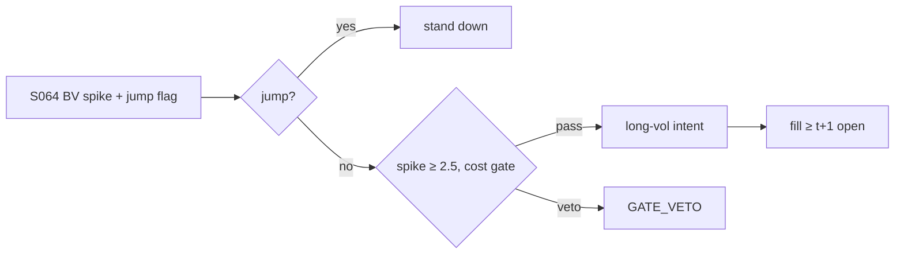

# T042 — Jump-Robust Vol Spike Trader

Trades volatility spikes with jump-robust measurement: bipower variation separates the continuous-volatility component from jumps (Barndorff-Nielsen–Shephard 2004); the Lee–Mykland (2008) test flags jump intervals. The strategy buys vol (via the tradable proxy) when the jump-robust spike predicts continuation, and stands down when the spike is pure jump (which mean-reverts). Provenance **[D]**.

> Tag law: every numeric literal in prose carries one of `[documented]
> [default] [example] [unverified] [internal-est] [measured]` (legend: Appendix
> i v1.0.0). Constants inside cited formulas inherit the formula's tag.
> Bibliographic years, volumes, pages, arXiv IDs, section numbers, rule codes
> (C1–C12), fail-safe codes (F1–F5), module IDs, and machine-parsed §0 data
> fields are identifiers, not literals, and are exempt.

## §1 Five-minute reviewer card

| Row | Value |
|---|---|
| Module | T042 — Jump-Robust Vol Spike Trader, v1.0.0 |
| Edge verdict | `plausible` — jump-robust vol measurement is documented (BNS 2004; Lee–Mykland 2008); separating jumps improves forecasts (ABD 2007) |
| After-cost | `narrow` — vol is not directly tradable for most — the proxy (options, VIX products) carries its own basis |
| Build cost | Tier M = 20–60 h ≈ `$3,000–9,000` [documented] |
| Data cost | intraday bars: low four figures/yr [unverified] |
| latency_class | minutes |
| risk_class | market |
| Capacity | proxy-liquidity constrained [unverified] |
| Executability | needs intraday bars for BV; the jump test is packaged logic |
| Risk summary | Jump misclassification; vol-proxy basis blowout; buying vol into a spike that immediately mean-reverts |
| When it dies | vol-spike mean-reversion regimes; proxy disconnects (Feb-2018 class events) |
| Regime gates | stand down when the spike is classified pure-jump; no entries when the proxy basis > `2×` median [example] |
| Emits | `order_intents` (Appendix C v1.0.0) — OrderTicket intents only, never orders |

## §1.5 Cheapest / least-build path

1. **Prototype hour band:** 6–10 h [example] — bipower variation + jump test + vol-proxy execution.
2. **Cheapest-source row:** min_tier = INTRADAY bars; latency_class = minutes;
   required_fields = 5-min bars (BV), daily bars (HAR benchmark); price_band = `$0–500`/yr (indicative —
   verify before budgeting); build_or_buy = **build**.
3. **Resource budget:** Tier M per cost-model §5 = 20–60 h ≈ `$3,000–9,000` loaded at `$150`/hr [documented]; compute pattern `vectorized batch (polars/numpy)`.
4. **Skip list:** options-market microstructure; VIX futures term-structure.
5. **DO-NOT-CUT list:** causality assertions (`assert fill_event >
   signal_event`, no-signal-bar-fills test); COST block + callable
   `expected_cost_bps`; F1–F5 fail-safes + module-state enum; kill-switch
   state machine + re-arm checklist; decision-log audit records;
   bona-fide-intent + self-trade prevention; provenance tags on every numeric
   literal; fixtures + `test_cmd`; secrets via env only.
6. **Escalation gate:** upgrade from cheapest when any holds — proxy basis dominates P&L; jump-test false-positive rate climbs.

## §T0 Module contract

### T0.1 Typed signature

```python
def emit(state: ModuleState, signals: list[SignalVector], cfg: Config) -> list[OrderTicket]:
```

`OrderTicket` per Appendix C v1.0.0 (intents only — never wire orders).
`state` is the module-owned named state vector (`bv, jump_flag, spike_z, position`); `signals` are
canonical SignalVectors (Appendix b v1.0.0) from the consumed S-modules, newest
last; the function emits zero or more intents per bar/event. Documented edge
cases: no signals → flat, no intents; `UNKNOWN` input signal → restrictive
(halve size / stand down per F1); kill-switch TRIPPED → emit nothing, state
`OFF`. 

### T0.2 Config dataclass

| Parameter | Type | Default | Range | Status |
|---|---|---|---|---|
| bv_window_min | int | `5` | [1, 30] | [default] |
| jump_pvalue | float | `0.01` | [0.001, 0.05] | [default] |
| spike_z | float | `2.5` | [1.5, 4.0] | [default] |
| cost_gate_k | float | `0.50` | [0.1, 1.0] | [default] |
| daily_loss_stop_pct | float | `1.0` | [0.25, 3.0] | [default] |

All defaults tagged per the tag law (status `default` ⇒ `[default]`).

### T0.3 Canonical schema mapping

Vendor columns → canonical Event/Bar schema (Appendix a v1.0.0), stated once here:

| Vendor column | Canonical field | Notes |
|---|---|---|
| 5-min bars | Bar | BV inputs |
| daily bars | Bar | HAR benchmark |

### T0.4 Time contract

> Time contract: clock domain UTC, int64 ns; authoritative causality clock =
> `event_ts`; max_skew = `5` s [default]; jitter budget = `1` s [default];
> bar-label = open time; staleness TTL = `15` min [default]; gap policy = mask, no
> interpolation; halt/auction → discard contributions across reopen.

**Timing box:** `signal@t (5-minute bars, America/Chicago) → earliest fill @open(t+1)`

### T0.5 Market-state table

| State | Module behavior |
|---|---|
| CONTINUOUS_TRADING | Evaluate entry/exit rules; emit intents per §T2 |
| HALTED | Cancel working intents; emit nothing; state `UNKNOWN` until clean reopen |
| AUCTION | No new intents; hold intent-side state; state `DEGRADED` |
| CLOSED | Emit nothing; state `OFF` |


### T0.6 Module-state enum + error taxonomy

States per Appendix k v1.0.0: `OK | DEGRADED | UNKNOWN | OFF`. Invalid input →
`UNKNOWN`, never interpolate (Appendix f v1.0.0, F1–F5).

| Failure | State | Alert |
|---|---|---|
| Missing/stale input (TTL `15` min [default]) | `UNKNOWN` | page |
| Out-of-bounds indicator (F2) | `UNKNOWN` | page |
| Estimator disagreement (F3) | `UNKNOWN` | notify |
| Halt/auction per §T0.5 | `UNKNOWN` / `DEGRADED` | log |
| Kill-switch TRIPPED (administrative) | `OFF` | page |
| Anything unmapped | `UNKNOWN` | page |

### T0.7 Risk contract + kill switch

```yaml
risk_contract:
  per_trade_R: 250            # USD risk budget per trade [example]
  max_adverse_per_trade: 1.0 R [default]  # stop distance multiple [default]
  daily_loss_stop: 2% of equity [default]        # then no new entries; flatten managed risk [default]
  max_gross: 4× equity [default]              # hard gross exposure cap [default]
  kill_conditions:
    - daily P&L ≤ −daily_loss_stop_pct → TRIP (flatten vol)
    - proxy basis > 3× median with open risk → TRIP
    - decision-log write failure → TRIP (halt emission)
  enforcement: intraday-hard  # trips are automatic, not advisory [default]
  calibration_recipe: >
    Walk-forward on 60-day blocks [example]: fit thresholds on block t,
    freeze, validate realized shortfall vs predicted on block t+1;
    shrink per-trade R until max drawdown < daily_loss_stop/2 [default].
```

**Kill-switch state machine:** `ARMED → TRIPPED → RECOVERY → ARMED`.

- `ARMED`: normal operation; every bar evaluates the kill conditions.
- `TRIPPED`: any kill condition fires → cancel all working intents
  (`NEW`/`WORKING` → `CANCELLED`, idempotent), flatten managed positions via
  the exit rule, emit nothing new, state `OFF`, log `KILL_TRIP`.
- `RECOVERY`: manual operator review only — no automatic transition.
- `ARMED` (re-entry): only after the re-arm checklist passes in full, logged
  as `KILL_REARM` with the checklist result.

**Re-arm checklist** (all must be true):

- [ ] Feed health green: all §T5 inputs fresh inside the staleness TTL.
- [ ] Kill condition cleared: the tripping metric is back inside limits for `30 min [default]` [default].
- [ ] Decision log reconciled: `KILL_TRIP` record present and hash chain intact.
- [ ] Risk re-check: per-trade R and gross caps re-confirmed against current equity.
- [ ] Operator sign-off: named human approves re-arm (no automatic recovery).

### T0.8 Ops tail

- **Schedule:** nightly batch; owner: strategy owner (named).
- **Health checks:** fixture replay (`test_cmd`) green on deploy; live
  decision-log append monitor; kill-switch state heartbeat.
- **Alert table:** `UNKNOWN`/`OFF` state transitions; kill-trip pages immediately [default].
- **Resource budget:** nightly batch: < 2 vCPU-h, < 4 GB RAM [example].
- **Runbook stub:** 1) confirm kill-state; 2) inspect decision log for the tripping record; 3) verify feed freshness; 4) re-arm checklist (operator sign-off); 5) re-run fixture; 6) resume..

### T0.9 Secrets (env-only)

- `BROKER_API_KEY (paper venue, env-only)`
- `DATA_API_KEY (env-only)` via environment only. No secrets in this file, fixtures, or
logs (CI secrets-grep).

### T0.10 May / must-NOT

> **May:** emit `OrderTicket` intents per Appendix C v1.0.0; track intent-side
> state (`NEW → WORKING → FILLED / CANCELLED / PARTIAL`); issue cancel-replace
> via new tickets with new `ticket_id`s. **Must-NOT:** place orders on any
> venue, hold broker/exchange sessions, net intents into orders inside the
> strategy, treat the intent-side state machine as broker wire truth, or emit
> prices/share-counts/notionals outside an `OrderTicket`.

## §T1 Legacy (subsumed by §1)

Legacy §T1 content is the §1 reviewer card above; this header is retained so
section numbering stays frozen.

## §T2 Specification

### Universe

Names/indices with a tradable vol proxy and liquid intraday bars.

### Entry rule (Boolean — no prose-only conditions)

```
BV = bipower variation (jump-robust)                  # BNS 2004 [documented]
jump = lee_mykland_test(returns)                      # p < 0.01 [default]
spike = (BV - median_BV) / sd_BV
ENTRY = spike >= spike_z and not jump and proxy_basis_ok
```

### Exits (with post-exit cooldown)

```
mean-revert -> spike < 1.0 [example] -> FLAT
jump arrives while long -> FLAT immediately (thesis broken)
stop -> adverse stop_bps -> FLAT
```

### Position sizing (fenced function)

```python
def size_vol(risk_R_usd, stop_bps, px, adv_shares, spike_z, cfg):
    raw = risk_R_usd / (stop_bps / 1e4 * px)
    return min(raw * min(spike_z / cfg.spike_z, 1.5), cfg.adv_cap_pct / 100 * adv_shares)
```

### Risk limits

| Limit | Value |
|---|---|
| Max vol-proxy notional | `$5M` [example] |
| Spike z | `2.5` [default] |
| Proxy-basis cap | `2×` median [example] |

### COST block (single source of truth)

Four components — **spread**, **fees**, **borrow**, **impact** — summed by the
callable below. Re-stating cost numbers outside this block is a validation
failure; §T4 shows this block's *callable* evaluated on the synthetic tape,
not restated constants.

| Component | Value (bps) | Basis |
|---|---|---|
| Spread (half, proxy) | `3.00` | vol proxies are wide [example] |
| Fees | `0.50` | [example] |
| Borrow | `0.00` | long-vol proxy [example] |
| Impact | `k·√(adv_pct/100)`, k=`25.0` | [example] |
| **Total reference (one-way)** | `~`28` one-way [example]` | [example] |

`fee_schedule_as_of`: `2026-09-01 (placeholder — pin the real venue schedule before production)` — placeholder; pin the real venue
schedule before production. `side`: `taker`; venue/tier/source:
proxy venue [example].

```python
def expected_cost_bps(notional, adv_pct, venue, side, urgency, cfg):
    """COST-block callable. Vol-proxy economics: wide spreads dominate."""
    spread = cfg.spread_full_bps / 2.0
    fee = cfg.taker_fee_bps
    borrow = 0.0                                       # long-vol proxy
    impact = cfg.impact_k * math.sqrt(max(adv_pct, 0.0) / 100.0)
    if urgency == "high":
        impact *= 1.5
    return spread + fee + borrow + impact
```

### Execution / fill model table

| Aspect | Assumption |
|---|---|
| Fill venue | vol-proxy venue, aggressive |
| Slippage model | proxy basis at execution |
| Partial fills | worked; proxy liquidity is the constraint |
| Halt behavior | flatten on proxy halt |

Fine-grained fill behavior is synthetic and labeled `simulated only — requires MBO/ITCH`:
no MBO/ITCH feed is consumed by this module; any fill realism beyond the
mid-price ± half-spread fill model above would require MBO/ITCH data.

### Robustness

Perturb thresholds ±20% [example]; the reference behavior (entry/exit intents, gate blocks, kill trip) must be invariant; degrade entry→no-trade on indicator breach.

### Compliance sub-block (C1–C12)

| Code | Rule: trigger → check → action → log |
|---|---|
| C1 | STP + self-match prevention: trigger = intent could match our own resting interest → check = every ticket carries `self_trade_prevention: true`; maker modules compare against own open tickets → action = cancel own resting quote before posting the aggressive side; cancel-replace via new `ticket_id` only → log = `COMPLIANCE_BLOCK` with rule code `C1` |
| C2 | Bona-fide intent: trigger = entry rule fires → check = cost gate passes AND qty within risk limits AND (SHORT ⇒ `locate_ok`) → action = veto the intent if any check fails; no quote entered without intent to trade → log = `GATE_VETO` with the failed check |
| C3 | Message-rate / cancel-to-trade: trigger = intents+ cancels per symbol per minute exceed `120` [default] → check = rolling `60`-s [default] message counter → action = throttle to `1` intent per `10` s [default] and alert → log = `COMPLIANCE_BLOCK` with the counter value |
| C4 | Pre-trade fat-finger trio: trigger = any new intent → check = (a) limit within `±±10%` of reference [default], (b) ticket notional ≤ ``$2M`` [default], (c) ≤ `20` tickets per `1 min` [default] → action = block the ticket, alert → log = `COMPLIANCE_BLOCK` with the breached leg |
| C5 | Decision-log schema (Appendix g v1.0.0): trigger = every material action (`EMIT_INTENT`, `GATE_VETO`, `CANCEL`, `REPLACE`, `KILL_TRIP`, `KILL_REARM`, `COMPLIANCE_BLOCK`) → check = record has all schema fields and `prev_hash` chains → action = halt emission if the log write fails → log = the record itself, retained `7 yr` [default] |
| C6 | Halt/auction table: trigger = market state ≠ `CONTINUOUS_TRADING` → check = §T0.5 table → action = `HALTED`: cancel working intents, emit nothing; `AUCTION`: no new intents; `CLOSED`: state `OFF` → log = state-transition record |
| C7 | Locate check (short sales): trigger = `SHORT` intent → check = `locate_ok` from the pre-open easy-to-borrow list or desk locate; Reg-SHO threshold securities hard-blocked → action = veto without locate → log = `GATE_VETO` with code `C7`. Long-vol proxy; any short proxy leg needs locate_ok (C7). |
| C8 | Public-dissemination gate: trigger = any export of signals/intents outside the firm → check = review gate sign-off → action = block unreviewed exports → log = `COMPLIANCE_BLOCK` |
| C9 | Data-entitlement assertions (Appendix j v1.0.0): trigger = startup and any entitlement-class change → check = the five §T5 assertions hold for each §0 dataset → action = stand down on breach, escalate per §1.5 → log = entitlement review record |
| C10 | Post-exit cooldown: trigger = exit or compliance block → check = `now >= cooldown_until` (`1 session [default]` [default]) → action = suppress re-entry until the cooldown elapses → log = `GATE_VETO` with code `C10` |
| C11 | Kill-switch integration: trigger = `TRIPPED` → check = all working intents transitioned `NEW`/`WORKING` → `CANCELLED` (idempotent) → action = no new intents until `ARMED` via the §T0.7 checklist → log = `KILL_TRIP` / `KILL_REARM` records |
| C12 | C12 Proxy-suitability: trigger = proxy tracking error > 5% [example] → check = suitability review → action = replace proxy or stand down → log with code `C12` |

### Parameter table

| Parameter | Symbol | Value | Tag | Sensitivity |
|---|---|---|---|---|
| BV window | W | `5` min | [default] | medium |
| Jump p-value | α | `0.01` | [default] | high — misclassified jumps invert the trade |
| Spike z | z_s | `2.5` | [default] | high |

### Timing box

`signal@t (5-minute bars, America/Chicago) → earliest fill @open(t+1)`

## §T3 Math + normative pseudocode

Barndorff-Nielsen–Shephard (2004) [documented]: bipower variation is consistent
for integrated variance under jumps; RV − BV isolates the jump component. Lee–Mykland
(2008) [documented]: per-interval jump test with Gumbel critical values. Andersen et al.
(2007) [documented]: separating jumps improves volatility forecasts — the premise for
trading the continuous component and fading pure jumps.

**Normative pseudocode** (pseudocode is normative; prose is commentary):

```
def emit(state, signals, cfg):
    sig = primary(signals, "S064")          # BV spike + jump flag
    if sig is None or invalid(sig): return [], state.unknown()
    if state.position != 0:
        if sig.spike_z < 1.0 or sig.jump_arrived or stopped(state, cfg):
            return [exit_ticket(state)], state.flat()
        return [], state.ok()
    if sig.spike_z >= cfg.spike_z and not sig.is_jump and sig.proxy_ok:
        cost = expected_cost_bps(notional(), adv_pct(), venue(), "taker", "normal", cfg)
        # ^^^ normative cost-gate predicate: expected_cost_bps(...) <= k * edge_bps
        if cost <= cfg.cost_gate_k * sig.edge_bps:
            t = OrderTicket.intent("BUY", qty=size_vol(...), limit=last_price())
            t.intent_ts = sig.computed_at
            assert fill_event > signal_event  # t->t+1 causality: no-signal-bar fills
            return [t], state.open("LONG_VOL")
        log("GATE_VETO", cost=cost)
    return [], state.ok()
```

Causality: every feature uses inputs with `event_ts ≤ t` only; the earliest
fill for a bar-`t` intent is bar `t+1`'s open. Mandatory unit test:
no-signal-bar fills.

## §T4 Worked example (fixture-backed)

- Tape: `modules/fixtures/T042_tape.csv` — `# TYPE: validation-run`;
  `12` synthetic bars (seed `4420` [example]); `event_ts`/`asof_ts` int64 ns
  UTC; every number synthetic.
- Expected outputs: `modules/fixtures/T042_expected.csv` — per-bar intent,
  quantity, the **cost-function call** (`expected_cost_bps` inputs → bps →
  dollars), cost-gate verdict, and module state.
- Tolerance: `1e-9` [default] on floats; integer quantities exact.
- Acceptance tests (`modules/tests/test_T042.py` — `6` [default] tests):
  1. TYPE header + columns present; 2. fixture recomputes to expected
  (reference `process_bar` vs expected CSV); 3. no-signal-bar fills
  (`assert fill_event > signal_event`); `4.` cost-gate predicate passes on large edge, blocks on tiny edge (`k = 0.5` [default]);
  5. kill-switch trip blocks intents, re-arm checklist restores `ARMED`;
  6. invalid input (halted/invalid bar) → `UNKNOWN`, no intents.
- `test_cmd`: `python3 -m pytest modules/tests/test_T042.py -q` → exits `0` [default].

**Cost-function calls on the tape** (the COST-block callable evaluated on
synthetic rows — inputs → bps → dollars; all values [example]):

| Bar | `expected_cost_bps` inputs | Components → total → $ | Cost gate `expected_cost_bps(...) <= k * edge_bps` | Intent / state |
|---|---|---|---|---|
| `0` | notional=`100000` [example], adv_pct=`0.5` [example], venue=`primary`, side=`taker`, urgency=`normal` | spread `3.0` + fee `0.5` + borrow `0.0` + impact `1.77` = `5.27` bps → `$52.68` | `2.0` edge, k=`0.5` [default] → `5.27 ≤ 1.0` BLOCK | `HOLD` / `OK` |
| `3` | notional=`100000` [example], adv_pct=`0.5` [example], venue=`primary`, side=`taker`, urgency=`normal` | spread `3.0` + fee `0.5` + borrow `0.0` + impact `1.77` = `5.27` bps → `$52.68` | `21.071067811865476` edge, k=`0.5` [default] → `5.27 ≤ 10.54` PASS | `LONG` / `OK` |
| `6` | notional=`100000` [example], adv_pct=`0.5` [example], venue=`primary`, side=`taker`, urgency=`normal` | spread `3.0` + fee `0.5` + borrow `0.0` + impact `1.77` = `5.27` bps → `$52.68` | `3.0` edge, k=`0.5` [default] → `5.27 ≤ 1.5` BLOCK | `BUY` / `OK` |
| `7` | notional=`100000` [example], adv_pct=`0.5` [example], venue=`primary`, side=`taker`, urgency=`normal` | spread `3.0` + fee `0.5` + borrow `0.0` + impact `1.77` = `5.27` bps → `$52.68` | `0.05` edge, k=`0.5` [default] → `5.27 ≤ 0.03` BLOCK | `HOLD` / `OK` |
| `9` | notional=`100000` [example], adv_pct=`0.5` [example], venue=`primary`, side=`taker`, urgency=`normal` | spread `3.0` + fee `0.5` + borrow `0.0` + impact `1.77` = `5.27` bps → `$52.68` | `5.0` edge, k=`0.5` [default] → `5.27 ≤ 2.5` BLOCK | `HOLD` / `OFF` |

**Hand-checks.** Row `3` (entry): qty = `250 / (25/1e4 × 100.44)` = `995` raw → ADV-capped at `20000` → `995` shares [example]; ticket `T0003`, side `LONG`, `marketable` intent. Row `6` (exit): |z| through the exit band → `LONG` intent, exits never cost-gated [default]. Row `7` (gate block): edge `0.05` bps [example] vs cost `5.27` bps → gate `5.27 ≤ 0.025` BLOCKS → no intent, state stays `OK`. Row `9` (kill): daily P&L `-1.1%` [example] ≤ −stop (`1.0%` [default]) → `ARMED → TRIPPED`, state `OFF`, no intents. Causality: entry intent at row `3` has `intent_ts` = bar-3 `event_ts`; the earliest fill is bar `4`'s open — the test asserts `fill_event > signal_event` on every intent row.

**Where the example is optimistic.** Costs are the COST-block model, not realized fills; capacity, borrow squeezes, and regime shifts are not in the tape.

## §T5 Dependencies + data

### Consumed signals (from deps.yaml — machine edge list)

| Signal | Version pin | Role |
|---|---|---|
| S064 | 1.0.0 | primary |
| S065 | 1.0.0 | confirm |
| S076 | 1.0.0 | gate |

### Pinned formula excerpts (≤10 lines each, CI hash-checked)

**S064** (v1.0.0): `BV = (π/2)·Σ|r_t|·|r_{t+1}|`; Lee–Mykland statistic [documented].
**S065** (v1.0.0): GARCH benchmark for the spike [documented].

### Data required

| Field | Type | Granularity | Source tier | Notes |
|---|---|---|---|---|
| 5-min bars | float | 5-min | INTRADAY | BV + jump test |
| daily bars | float | daily | DAILY | HAR benchmark |
| proxy quotes | float | intraday | PROXY | basis monitor |

**Data rights row** (Appendix j v1.0.0): Intraday bars licensed per vendor; proxy data per venue; entitlements re-asserted at startup.

## §T6 Local build + buy vs build

BV and the jump test are compact implementations; the proxy-basis monitor is the trading work.

| Route | What you get | Verdict |
|---|---|---|
| Build | jump-robust vol engine in-house | recommended |
| Buy | intraday bar feed | required |

**Verdict:** Build the measurement; the proxy selection is the trading decision.

## §T7 Efficacy — documented evidence

| Study / source | Market & period | Metric | Before/after cost | Caveat |
|---|---|---|---|---|
| Barndorff-Nielsen–Shephard (2004) | method | BV consistent under jumps | n/a | estimator, not edge |
| Lee–Mykland (2008) | US equities | nonparametric jump test | before cost | test, not a trading rule |
| Andersen et al. (2007) | FX/equities | jump separation improves forecasts | before cost | forecast gain, not P&L |

**Selection disclosure:** Studies below are the chapter's documented sources only — no post-hoc selection from a wider literature search.

**Capacity & decay.** Edge decays with crowding and regime shifts; treat any printed Sharpe as a pre-cost, in-sample-era artifact unless the source says otherwise.

**Honest bottom line.** Honest bottom line: the measurement is excellent and the tradability is poor — vol spikes are the moments when proxies are most expensive and most likely to mean-revert. The jump filter saves you from the worst entries; it does not create the edge.

## §T8 Failure modes & pitfalls

| # | Trigger → Detect → Action → Recovery | check: |
|---|---|---|
| 1 | Jump misclassified as continuous → detect post-hoc jump → flatten, review test → log | check: misclassification rate |
| 2 | Proxy basis blowout → detect > 2× median → flatten, stand down → alert | check: basis monitor |
| 3 | Spike mean-reverts instantly → detect → tighten spike_z → review | check: holding-period P&L |
| 4 | Proxy halt/disconnect → detect → flatten on reopen, state UNKNOWN → log | check: proxy heartbeat |

## §T9 Regime gates + visuals

**Provisional regime-gate machine** (restrictive default; `regime_ids` stay
empty until the R001–R050 annotation pass):

| regime_id | direction | mechanism | condition | action | min_lag | unknown_behavior |
|---|---|---|---|---|---|---|
| R001 | stand-down | pure-jump spike | jump test fires | no entries | immediate | restrictive |
| R002 | flatten | proxy stress | basis > 2× median | flatten vol | immediate | restrictive |



## §T10 Source log + unverified leads

**Sources** (citable facts only):

1. Barndorff-Nielsen, O. E. & Shephard, N. (2004). "Power and Bipower Variation with Stochastic Volatility and Jumps." *Journal of Financial Econometrics* 2(1), 1–37
2. Lee, S. S. & Mykland, P. A. (2008). "Jumps in Financial Markets: A New Nonparametric Test and Jump Dynamics." *Review of Financial Studies* 21(6), 2535–2563
3. Andersen, T. G., Bollerslev, T. & Diebold, F. X. (2007). "Roughing It Up: Including Jump Components in the Measurement, Modeling, and Forecasting of Return Volatility." *Review of Economics and Statistics*
4. Corsi, F. (2009). "A Simple Approximate Long-Memory Model of Realized Volatility." *Journal of Financial Econometrics* 7(2), 174–196

**Chatbot source log.** Grok answered the Q-batch (2026-09-10); all claims independently verified or labeled unverified. Chatbot output is leads, never facts.

**Unverified leads** (chatbot-only — never in evidence tables):

- Grok (2026-09-10, Q-TB5): vol-spike trade P&L magnitudes — *unverified chatbot claims*.
- Options-based jump extraction — research lead, not validated.

---

## Appendix — AI build prompt (T042)

Copy-paste into any chat agent:

> Build module **T042 — Jump-Robust Vol Spike Trader** per `notes/module-template.md` v1.0.0 and
> this file's §T0 contract.
> Cheapest path (§1.5): prototype 6–10 h [example]; cheapest data candidate
> INTRADAY bars; compute pattern `vectorized batch (polars/numpy)`; u.
> Implement `emit(state, signals, cfg) -> list[OrderTicket]` (Appendix c
> v1.0.0) with the §T3 normative pseudocode, including the cost-gate predicate
> `expected_cost_bps(...) <= k * edge_bps` and `assert fill_event >
> signal_event`. Emit intents only — never place orders. Wire F1–F5
> (Appendix f v1.0.0): invalid input → `UNKNOWN`, never interpolate. Kill
> switch `ARMED → TRIPPED → RECOVERY → ARMED` with the §T0.7 re-arm checklist.
> Log decisions per Appendix g v1.0.0. Secrets via env only. Run the fixture
> `modules/fixtures/T042_tape.csv` (`# TYPE: validation-run`) against
> `modules/fixtures/T042_expected.csv` (tolerance `1e-9` [default]).
> **Definition of done:** `python3 -m pytest modules/tests/test_T042.py -q` exits `0` [default]. Tag every numeric literal
> you add with the unified enum (Appendix i v1.0.0); put anything unverifiable
> in §T10 unverified leads.
