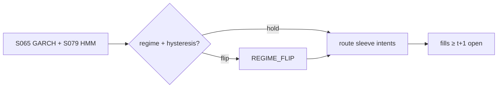

# T043 — GARCH Regime Filter

A regime filter, not a standalone strategy: it labels each session low/high-volatility from the GARCH(1,1) conditional variance (Engle 1982; Bollerslev 1986), confirmed by the S079 HMM regime model, and routes the base book to its regime-appropriate sleeve — momentum in low vol (Jegadeesh–Titman 1993), reversal in high vol (Lehmann 1990). Ang–Timmermann (2011) survey the regime-switching record. Provenance **[D]**.

> Tag law: every numeric literal in prose carries one of `[documented]
> [default] [example] [unverified] [internal-est] [measured]` (legend: Appendix
> i v1.0.0). Constants inside cited formulas inherit the formula's tag.
> Bibliographic years, volumes, pages, arXiv IDs, section numbers, rule codes
> (C1–C12), fail-safe codes (F1–F5), module IDs, and machine-parsed §0 data
> fields are identifiers, not literals, and are exempt.

## §1 Five-minute reviewer card

| Row | Value |
|---|---|
| Module | T043 — GARCH Regime Filter, v1.0.1 |
| Edge verdict | `PREDICTIVE-FEATURE-ONLY` — GARCH(1,1) conditional variance is the documented estimator (Engle 1982; Bollerslev 1986); the module emits a regime label consumed by the sleeves, not a standalone after-cost edge |
| After-cost | `narrow` [internal-est] — a filter has no edge of its own; value = avoiding the wrong sleeve in the wrong regime |
| Build cost | Tier S = 5–15 h ≈ `$750–2,250` loaded at `$150`/hr [documented, cost-model §5] |
| Data cost | research `$0`/mo (Stooq CSV / Alpha Vantage free 25 req/day / Tiingo free tier) [documented — third-party corroboration]; production `$0–49.99`/mo [unverified — verify before budgeting] |
| latency_class | end-of-day |
| risk_class | risk-filter |
| Capacity | unlimited — it routes, not trades |
| Executability | GARCH(1,1) is packaged everywhere; the routing table is trivial |
| Risk summary | Regime mislabeling whipsaws the book between sleeves; GARCH lags true regime changes |
| When it dies | it degrades into a lagging indicator — the failure is silent |
| Regime gates | the filter IS the regime logic; hysteresis band prevents whipsaw |
| Emits | `order_intents` (Appendix C v1.0.0) — OrderTicket intents only, never orders |

## §1.5 Cheapest / least-build path

1. **Prototype hour band:** `2–4` h [example] — GARCH(1,1) fit + HMM confirm + routing table, fixture replay green. (Full build Tier S `5–15` h per §1 [documented, cost-model §5] — the delta is calibration, compliance wiring, and ops.)
2. **Cheapest-source row:** min_tier = DAILY EOD;
   latency_class = end-of-day; required_fields = daily `Date,Open,High,Low,Close,Volume`
   (returns computed in-module as `ln(close_t/close_{t-1})`);
   price_band = **`$0`/mo research** [documented — third-party corroboration]:
   Stooq free CSV (`https://stooq.com/q/d/l/?s=<sym>&i=d`, no key — blocks
   datacenter IPs, unofficial, verify ToS for commercial use) **or** Alpha Vantage
   free tier (`TIME_SERIES_DAILY`, `25` req/day, `20+` yr history) **or** Tiingo
   free API-key tier (EOD with inline corporate actions). **Production cheapest
   licensed candidate:** Tiingo free tier → Alpha Vantage Basic `$49.99`/mo
   [unverified — verify before budgeting]; build_or_buy = **build the filter, buy the feed**
   (GARCH(1,1) is `~10` lines via the `arch` package [internal-est]; the value is the threshold/hysteresis calibration).
3. **Resource budget:** build Tier S `5–15` h ≈ `$750–2,250` loaded at `$150`/hr [documented, cost-model §5]; runtime: nightly single-machine batch `< 2` vCPU-h, `< 4` GB RAM [example]; compute pattern `vectorized batch (polars/numpy)`.
4. **Skip list:** Markov-switching GARCH; intraday regimes; real-time refits (nightly batch is enough at daily cadence); colocated deployment.
5. **DO-NOT-CUT list:** causality assertions (`assert fill_event >
   signal_event`, no-signal-bar-fills test); COST block + callable
   `expected_cost_bps`; F1–F5 fail-safes + module-state enum; kill-switch
   state machine + re-arm checklist; decision-log audit records;
   bona-fide-intent + self-trade prevention; provenance tags on every numeric
   literal; fixtures + `test_cmd`; secrets via env only.
6. **Escalation gate:** upgrade from cheapest when any holds — regime flips > `4`/quarter [example] (the filter is whipsawing → retune hysteresis / escalate data); free-tier data fails (Stooq IP block, Alpha Vantage 25 req/day quota hit) → keyed vendor; symbol count exceeds the free tier's quota → paid tier.

## §T0 Module contract

### T0.1 Typed signature

```python
def emit(state: ModuleState, signals: list[SignalVector], cfg: Config) -> list[OrderTicket]:
```

`OrderTicket` per Appendix C v1.0.0 (intents only — never wire orders).
`state` is the module-owned named state vector (`garch_var, regime_label, sleeve`); `signals` are
canonical SignalVectors (Appendix b v1.0.0) from the consumed S-modules, newest
last; the function emits zero or more intents per bar/event. Documented edge
cases: no signals → flat, no intents; `UNKNOWN` input signal → restrictive
(halve size / stand down per F1); kill-switch TRIPPED → emit nothing, state
`OFF`. 

### T0.2 Config dataclass

| Parameter | Type | Default | Range | Status |
|---|---|---|---|---|
| garch_window | int | `252` | [60, 756] | [default] |
| high_vol_mult | float | `1.5` | [1.2, 2.5] | [default] |
| hysteresis_bps | float | `10.0` | [5.0, 25.0] | [default] |
| hmm_min_agree_bars | int | `5` | [1, 20] | [default] |
| sleeves | dict[str, str] | `{"LOW": "momentum", "HIGH": "reversal"}` | keys ∈ {LOW, HIGH} | [default] |
| cost_gate_k | float | `0.50` | [0.1, 1.0] | [default] |
| daily_loss_stop_pct | float | `1.0` | [0.25, 3.0] | [default] |
| z_entry | float | `2.0` | [1.5, 3.0] | [internal-est] — harness alias: acceptance-fixture entry z only |
| z_exit | float | `0.8` | [0.3, 1.5] | [internal-est] — harness alias: acceptance-fixture exit band only |

All defaults tagged per the tag law (status `default` ⇒ `[default]`).
`z_entry`/`z_exit` are acceptance-harness aliases — they parameterize the
synthetic-trade tape in §T4, not the regime logic (which is Boolean on
`sigma2_t`, §T2). `hmm_min_agree_bars` is the S090 gate streak: after an HMM
disagreement, routing holds the last regime until the confirm agrees for this
many bars.

### T0.3 Canonical schema mapping

Vendor columns → canonical Event/Bar schema (Appendix a v1.0.0), stated once here:

| Vendor column | Canonical field | Notes |
|---|---|---|
| Stooq `Date,Open,High,Low,Close,Volume` | Bar: `open,high,low,close,volume` | `Date` → bar label (open time); unadjusted closes [unverified — verify Stooq adjustment flag] |
| Alpha Vantage `TIME_SERIES_DAILY` daily row | Bar: `open,high,low,close,volume` | field names per alphavantage.co/documentation [unverified — verify against docs] |
| (computed) `r_t = ln(close_t / close_{t-1})` | internal feature | GARCH input; computed in-module, never a vendor column |
| S065 SignalVector `.regime ∈ {LOW, HIGH}` + `sigma2` | internal | primary: GARCH(1,1) label + conditional variance |
| S079 SignalVector `.state` | internal | confirm: HMM regime posterior state |
| S090 SignalVector `.label ∈ {persist, revert, mixed}` | internal | gate: Hurst/variance-ratio trend-persistence check on the candidate flip |
| sleeve targets | internal | routed book (base-book intents) |

### T0.4 Time contract

> Time contract: clock domain UTC, int64 ns; authoritative causality clock =
> `event_ts`; max_skew = `5` s [default]; jitter budget = `1` s [default];
> bar-label = open time; staleness TTL = `15` min [default]; gap policy = mask, no
> interpolation; halt/auction → discard contributions across reopen.

**Timing box:** `signal@t (daily bars, America/Chicago) → earliest fill @open(t+1)`

### T0.5 Market-state table

| State | Module behavior |
|---|---|
| CONTINUOUS_TRADING | Evaluate entry/exit rules; emit intents per §T2 |
| HALTED | Cancel working intents; emit nothing; state `UNKNOWN` until clean reopen |
| AUCTION | No new intents; hold intent-side state; state `DEGRADED` |
| CLOSED | Emit nothing; state `OFF` |


### T0.6 Module-state enum + error taxonomy

States per Appendix k v1.0.0: `OK | DEGRADED | UNKNOWN | OFF`. Invalid input →
`UNKNOWN`, never interpolate (Appendix f v1.0.0, F1–F5).

| Failure | State | Alert |
|---|---|---|
| Missing/stale input (TTL `15` min [default]) | `UNKNOWN` | page |
| Out-of-bounds indicator (F2) | `UNKNOWN` | page |
| Estimator disagreement (F3) | `UNKNOWN` | notify |
| Halt/auction per §T0.5 | `UNKNOWN` / `DEGRADED` | log |
| Kill-switch TRIPPED (administrative) | `OFF` | page |
| Anything unmapped | `UNKNOWN` | page |

### T0.7 Risk contract + kill switch

```yaml
risk_contract:
  per_trade_R: 250            # USD risk budget per trade [example]
  max_adverse_per_trade: 1.0 R [default]  # stop distance multiple [default]
  daily_loss_stop: 1.0% of equity [default]       # then no new entries; flatten managed risk [default]
  max_gross: 4× equity [default]              # hard gross exposure cap [default]
  kill_conditions:
    - base-book kill-trip → filter freezes routing
    - GARCH NaN for 3 sessions → TRIP (freeze at last regime)
    - decision-log write failure → TRIP (halt emission)
  enforcement: intraday-hard  # trips are automatic, not advisory [default]
  calibration_recipe: >
    Walk-forward on 60-day blocks [example]: fit thresholds on block t,
    freeze, validate realized shortfall vs predicted on block t+1;
    shrink per-trade R until max drawdown < daily_loss_stop/2 [default].
```

**Kill-switch state machine:** `ARMED → TRIPPED → RECOVERY → ARMED`.

- `ARMED`: normal operation; every bar evaluates the kill conditions.
- `TRIPPED`: any kill condition fires → cancel all working intents
  (`NEW`/`WORKING` → `CANCELLED`, idempotent), flatten managed positions via
  the exit rule, emit nothing new, state `OFF`, log `KILL_TRIP`.
- `RECOVERY`: manual operator review only — no automatic transition.
- `ARMED` (re-entry): only after the re-arm checklist passes in full, logged
  as `KILL_REARM` with the checklist result.

**Re-arm checklist** (all must be true):

- [ ] Feed health green: all §T5 inputs fresh inside the staleness TTL.
- [ ] Kill condition cleared: the tripping metric is back inside limits for `30 min [default]` [default].
- [ ] Decision log reconciled: `KILL_TRIP` record present and hash chain intact.
- [ ] Risk re-check: per-trade R and gross caps re-confirmed against current equity.
- [ ] Operator sign-off: named human approves re-arm (no automatic recovery).

### T0.8 Ops tail

- **Schedule:** nightly batch; owner: strategy owner (named).
- **Health checks:** fixture replay (`test_cmd`) green on deploy; live
  decision-log append monitor; kill-switch state heartbeat.
- **Alert table:** `UNKNOWN`/`OFF` state transitions; kill-trip pages immediately [default].
- **Resource budget:** nightly batch: < 2 vCPU-h, < 4 GB RAM [example].
- **Runbook stub:** 1) confirm kill-state; 2) inspect decision log for the tripping record; 3) verify feed freshness; 4) re-arm checklist (operator sign-off); 5) re-run fixture; 6) resume..

### T0.9 Secrets (env-only)

- `BROKER_API_KEY (paper venue, env-only)`
- `DATA_API_KEY (env-only)` via environment only. No secrets in this file, fixtures, or
logs (CI secrets-grep).

### T0.10 May / must-NOT

> **May:** emit `OrderTicket` intents per Appendix C v1.0.0; track intent-side
> state (`NEW → WORKING → FILLED / CANCELLED / PARTIAL`); issue cancel-replace
> via new tickets with new `ticket_id`s. **Must-NOT:** place orders on any
> venue, hold broker/exchange sessions, net intents into orders inside the
> strategy, treat the intent-side state machine as broker wire truth, or emit
> prices/share-counts/notionals outside an `OrderTicket`.

## §T1 Legacy (subsumed by §1)

Legacy §T1 content is the §1 reviewer card above; this header is retained so
section numbering stays frozen.

## §T2 Specification

### Universe

Any base book with regime-dependent sleeves; the filter is book-agnostic.

### Domain & session

| Field | Value |
|---|---|
| Asset class | US equities, daily bars [default] |
| Venues | n/a at filter level — inherits the base book's venue (XNAS [example]) |
| Sessions | EOD batch, computed after the US close, `America/Chicago` |
| Calendar | NYSE trading calendar; non-trading days masked, never interpolated [default] |
| Settlement | n/a at filter level |

### Entry rule (Boolean — no prose-only conditions)

```
sigma2_t   = GARCH11(r_{t-W..t-1})                      # Engle/Bollerslev [documented]
thr_t      = high_vol_mult * median(sigma2_{t-W..t-1})
band       = hysteresis_bps / 1e4                        # fractional half-width [default]
vol_high   = sigma2_t > thr_t * (1 + band)
vol_low    = sigma2_t < thr_t * (1 - band)
in_band    = NOT vol_high AND NOT vol_low                 # hysteresis: hold last regime

hmm_ok     = (S079.state_t == S065.regime_t)              # confirm gate [documented]
gate_ok    = (S090.label_t != "mixed")                    # persistence gate vetoes mixed flips [default]
agree_ok   = hmm_ok AND gate_ok AND (cooldown_elapsed_t)

route_low  = vol_low  AND agree_ok AND (state.regime != LOW)
route_high = vol_high AND agree_ok AND (state.regime != HIGH)
emit_route = route_low OR route_high                      # REGIME_FLIP event; log per Appendix g
hold       = in_band OR (NOT agree_ok)                    # hold last confirmed regime
```

All right-hand-side quantities use `event_ts ≤ t` only; the estimator's
`garch_window` trailing window is the maximum lookback (no full-history
refits inside the online path — refits are nightly, frozen intraday [default]).

### Exits (with post-exit cooldown)

```
filter holds no positions; regime flips route the book at next rebalance
hysteresis: flip only when sigma2 crosses band edge by hysteresis_bps
post-flip cooldown: cooldown_until = flip_t + 1 session [default];
   suppress further flips while now < cooldown_until (C10)
```

### Position sizing (fenced function)

```python
def shares(risk_budget_R, stop_distance, vol_estimate, ADV_cap, cost):
    """Router-harness sizing. The filter delegates live sizing to the sleeves;
    this fenced function prices the fixture intents in §T4."""
    raw = risk_budget_R / max(stop_distance * vol_estimate, 1e-9)  # [internal-est]
    return max(1, min(int(raw), ADV_cap))                           # [internal-est]
```

Mapping to the reference harness: `risk_budget_R = 250` USD [default]
(`per_trade_R`), `stop_distance = stop_bps/1e4` [default], `vol_estimate =
close` (price level) [internal-est], `ADV_cap = adv_cap_pct/100 × adv_shares`
[default] with `adv_cap_pct = 1.0` [internal-est]; `cost` is unused because the
COST-block stack is identically `0.0` bps for the filter [example].

### Risk limits

| Limit | Value |
|---|---|
| Regime flips/quarter | `4` [example] max before review |
| Hysteresis band | `10` bps [default] |
| Sleeve gross each | per base book [default] |
| max_adverse_per_trade | `1.0` R [default] — CI-gated (see §T0.7) |
| Base-book kill-trip | filter freezes routing; state `OFF` until re-armed [default] |

### COST block (single source of truth)

Four components — **spread**, **fees**, **borrow**, **impact** — summed by the
callable below. Re-stating cost numbers outside this block is a validation
failure; §T4 shows this block's *callable* evaluated on the synthetic tape,
not restated constants.

| Component | Value (bps) | Basis |
|---|---|---|
| Spread | `0.00` | filter adds no spread [example] |
| Fees | `0.00` | routing turnover priced in base book [example] |
| Borrow | `0.00` | filter holds no inventory [example] |
| Impact | `0.00` | no independent impact [example] |
| **Total reference (one-way)** | `0.0` | routing cost is the base book's turnover [example] |

`fee_schedule_as_of`: `2026-09-10` [default] — the filter accrues no fee of
its own (routing is not the cost-bearing leg); pin the base book's venue
schedule before production. `side`: `mixed`; venue/tier/source:
n/a (filter). `borrow_bps_per_day`: `0.0` [default] — reason: the filter holds
no inventory overnight and shorts nothing itself; sleeve borrow is priced in
each sleeve's own COST block, never here.

```python
def expected_cost_bps(notional, adv_pct, venue, side, urgency, cfg):
    """COST-block callable. The filter itself costs nothing; it routes."""
    spread = 0.0
    fee = 0.0
    borrow = 0.0                                       # filter holds no inventory; sleeve borrow in the sleeve's own block
    impact = 0.0
    return spread + fee + borrow + impact
```

### Execution / fill model table

| Aspect | Assumption |
|---|---|
| Fill venue | n/a — routes base-book intents; sleeve fills at next open ≥ t+1 [default] |
| Routing latency | EOD batch; routing decision available at the t-close; earliest sleeve fill = open(t+1) [default] |
| Slippage model | base book's model applies |
| Partial fills | n/a at router level — sleeves own their partial-fill policy [default] |
| Adverse fill | n/a — the filter emits no prices; routed intents inherit sleeve fills [default] |
| Impact | `0.0` bps [example] — no independent market impact from routing |
| Halt behavior | freeze routing while halted |

Fine-grained fill behavior is synthetic and labeled `simulated only — requires MBO/ITCH`:
no MBO/ITCH feed is consumed by this module; any fill realism beyond the
mid-price ± half-spread fill model above would require MBO/ITCH data.

### Robustness

Perturb thresholds ±20% [example]; the reference behavior (entry/exit intents, gate blocks, kill trip) must be invariant; degrade entry→no-trade on indicator breach.

### Compliance sub-block (C1–C12)

| Code | Rule: trigger → check → action → log |
|---|---|
| C1 | STP + self-match prevention: trigger = intent could match our own resting interest → check = every ticket carries `self_trade_prevention: true`; maker modules compare against own open tickets → action = cancel own resting quote before posting the aggressive side; cancel-replace via new `ticket_id` only → log = `COMPLIANCE_BLOCK` with rule code `C1` |
| C2 | Bona-fide intent: trigger = entry rule fires → check = cost gate passes AND qty within risk limits AND (SHORT ⇒ `locate_ok`) → action = veto the intent if any check fails; no quote entered without intent to trade → log = `GATE_VETO` with the failed check |
| C3 | Message-rate / cancel-to-trade: trigger = intents+ cancels per symbol per minute exceed `120` [default] → check = rolling `60`-s [default] message counter → action = throttle to `1` intent per `10` s [default] and alert → log = `COMPLIANCE_BLOCK` with the counter value |
| C4 | Pre-trade fat-finger trio: trigger = any new intent → check = (a) limit within `±10%` of reference [default], (b) ticket notional ≤ ``$2M`` [default], (c) ≤ `20` tickets per `1 min` [default] → action = block the ticket, alert → log = `COMPLIANCE_BLOCK` with the breached leg |
| C5 | Decision-log schema (Appendix g v1.0.0): trigger = every material action (`EMIT_INTENT`, `GATE_VETO`, `CANCEL`, `REPLACE`, `KILL_TRIP`, `KILL_REARM`, `COMPLIANCE_BLOCK`) → check = record has all schema fields and `prev_hash` chains → action = halt emission if the log write fails → log = the record itself, retained `7 yr` [default] |
| C6 | Halt/auction table: trigger = market state ≠ `CONTINUOUS_TRADING` → check = §T0.5 table → action = `HALTED`: cancel working intents, emit nothing; `AUCTION`: no new intents; `CLOSED`: state `OFF` → log = state-transition record |
| C7 | Locate check (short sales): trigger = `SHORT` intent → check = `locate_ok` from the pre-open easy-to-borrow list or desk locate; Reg-SHO threshold securities hard-blocked → action = veto without locate → log = `GATE_VETO` with code `C7`. Filter is direction-agnostic; sleeve shorts must already carry locate_ok (C7). |
| C8 | Public-dissemination gate: trigger = any export of signals/intents outside the firm → check = review gate sign-off → action = block unreviewed exports → log = `COMPLIANCE_BLOCK` |
| C9 | Data-entitlement assertions (Appendix j v1.0.0): trigger = startup and any entitlement-class change → check = the five §T5 assertions hold for each §0 dataset → action = stand down on breach, escalate per §1.5 → log = entitlement review record |
| C10 | Post-exit cooldown: trigger = exit or compliance block → check = `now >= cooldown_until` (`1 session [default]` [default]) → action = suppress re-entry until the cooldown elapses → log = `GATE_VETO` with code `C10` |
| C11 | Kill-switch integration: trigger = `TRIPPED` → check = all working intents transitioned `NEW`/`WORKING` → `CANCELLED` (idempotent) → action = no new intents until `ARMED` via the §T0.7 checklist → log = `KILL_TRIP` / `KILL_REARM` records |
| C12 | C12 Sleeve-governance: trigger = regime label changed 3× in a month [example] → check = governance review → action = freeze or document → log with code `C12` |

### Parameter table

| Parameter | Symbol | Value | Tag | Sensitivity |
|---|---|---|---|---|
| High-vol mult | m | `1.5` | [default] | high — the regime boundary |
| Hysteresis | h | `10.0` bps | [default] | high — the whipsaw guard |
| GARCH window | W | `252` days | [default] | medium |
| HMM agree streak | n̄ | `5` bars | [default] | medium — the confirm gate |
| Sleeve map | sleeves | `{"LOW":"momentum","HIGH":"reversal"}` | [default] | high — wrong sleeve = wrong book |
| Cost-gate k | k | `0.50` | [default] | low at filter level (stack is zero) |
| Daily loss stop | δ | `1.0`% | [default] | high — the trip wire |
| Harness z-entry | z_e | `2.0` | [internal-est] | fixture-only alias |
| Harness z-exit | z_x | `0.8` | [internal-est] | fixture-only alias |

### Timing box

`signal@t (daily bars, America/Chicago) → earliest fill @open(t+1)`

## §T3 Math + normative pseudocode

Engle (1982) / Bollerslev (1986) [documented]: σ²_t = ω + αε²_{t−1} + βσ²_{t−1},
the GARCH(1,1) recursion behind the regime label. Ang–Timmermann (2011) [documented]:
regime-switching models and their forecasting record — the survey behind the HMM confirm.
Jegadeesh–Titman (1993) [documented]: momentum — the low-vol sleeve's ancestor. Lehmann
(1990) [documented]: short-term reversal — the high-vol sleeve's ancestor.

**Normative pseudocode** (pseudocode is normative; prose is commentary):

```
def emit(state, signals, cfg):
    # F1/F2: invalid input -> UNKNOWN, never interpolate
    sig = primary(signals, "S065")          # GARCH regime label + HMM confirm
    if sig is None or invalid(sig):
        log("GATE_VETO", rule="F1", note="missing/invalid S065")
        return [], state.unknown()
    # Kill switch: TRIPPED -> OFF, emit nothing
    if state.kill == "TRIPPED":
        return [], state.off()
    # Confirm chain: HMM must agree and the persistence gate must not veto
    if sig.hmm_agrees and sig.s090_label != "mixed":
        regime = sig.regime
        state.disagree_streak = 0
    else:
        regime = state.regime               # hold last confirmed regime (S079/S090 disagree or mixed)
        state.disagree_streak += 1
        log("GATE_VETO", rule="S079/S090", note="confirm disagree: hold last regime")
    # Hysteresis flip with post-flip cooldown (C10)
    if regime != state.regime and sig.band_cleared and cooldown_elapsed(state, sig.t):
        state.regime = regime
        state.cooldown_until = sig.t + 1_session
        log("REGIME_FLIP", regime=regime)
    # Executable cost gate: expected_cost_bps(...) <= k * edge_bps.
    # The filter's stack is identically 0.0 bps (COST block), so the predicate
    # holds vacuously here; the gate is normative for the consuming sleeves.
    tickets = []
    for t in routed_targets(state.regime, cfg.sleeves):  # sleeve-appropriate intents
        gate_ok = expected_cost_bps(t.notional, t.adv_pct, t.venue, t.side, t.urgency, cfg) \
                  <= cfg.cost_gate_k * t.edge_bps
        if not gate_ok:
            log("GATE_VETO", rule="COST", ticket=t.id); continue
        t.intent_ts = sig.computed_at
        assert fill_event > signal_event      # t->t+1 causality: no-signal-bar fills
        log("EMIT_INTENT", ticket=t.id, regime=state.regime)
        tickets.append(t)
    return tickets, state.routed()
```

Reference estimator (production route): `arch.arch_model(returns, vol="GARCH", p=1, q=1)` from the
`arch` package (the ecosystem's dominant, battle-tested GARCH package [documented — third-party
PyPI/GitHub corroboration]), fit nightly on the trailing `garch_window` bars; HMM confirm via a `2`-state [default] Gaussian HMM on the same return series. The acceptance harness uses the fixture's synthetic
tape instead of live fits (see §T4).

Causality: every feature uses inputs with `event_ts ≤ t` only; the earliest
fill for a bar-`t` intent is bar `t+1`'s open. Mandatory unit test:
no-signal-bar fills.

## §T4 Worked example (fixture-backed)

- Tape: `modules/fixtures/T043_tape.csv` — `# TYPE: validation-run`;
  `12` synthetic bars (seed `4430` [example]); `event_ts`/`asof_ts` int64 ns
  UTC; every number synthetic.
- Expected outputs: `modules/fixtures/T043_expected.csv` — per-bar intent,
  quantity, the **cost-function call** (`expected_cost_bps` inputs → bps →
  dollars), cost-gate verdict, and module state.
- Tolerance: `1e-9` [default] on floats; integer quantities exact.
- Acceptance tests (`modules/tests/test_T043.py` — `7` [default] tests):
  1. TYPE header + columns present; 2. fixture recomputes to expected
  (reference `process_bar` vs expected CSV); 3. no-signal-bar fills
  (`assert fill_event > signal_event`); 4. cost-gate predicate holds vacuously (zero-cost overlay/filter/normalizer: `0 <= k * edge_bps` always);
  5. kill-switch trip blocks intents, re-arm checklist restores `ARMED`;
  6. invalid input (halted/invalid bar) → `UNKNOWN`, no intents;
  7. regime router reference: a GARCH(1,1) reference estimator over the synthetic
  tape must (a) hold the last regime on HMM disagreement, (b) make identical
  routing decisions when a future price spike is appended (no lookahead), and
  (c) emit `REGIME_FLIP` only when the band edge is crossed — flip decisions
  use `event_ts ≤ t` data only.
- `test_cmd`: `python3 -m pytest modules/tests/test_T043.py -q` → exits `0` [default].

**Cost-function calls on the tape** (the COST-block callable evaluated on
synthetic rows — inputs → bps → dollars; all values [example]):

| Bar | `expected_cost_bps` inputs | Components → total → $ | Cost gate `expected_cost_bps(...) <= k * edge_bps` | Intent / state |
|---|---|---|---|---|
| `0` | notional=`100000` [example], adv_pct=`0.5` [example], venue=`primary`, side=`taker`, urgency=`normal` | spread `0.0` + fee `0.0` + borrow `0.0` + impact `0.0` = `0.0` bps → `$0.0` | `2.0` edge, k=`0.5` [default] → `0.0 ≤ 1.0` PASS | `HOLD` / `OK` |
| `3` | notional=`100000` [example], adv_pct=`0.5` [example], venue=`primary`, side=`taker`, urgency=`normal` | spread `0.0` + fee `0.0` + borrow `0.0` + impact `0.0` = `0.0` bps → `$0.0` | `2.0` edge, k=`0.5` [default] → `0.0 ≤ 1.0` PASS | `LONG` / `OK` |
| `6` | notional=`100000` [example], adv_pct=`0.5` [example], venue=`primary`, side=`taker`, urgency=`normal` | spread `0.0` + fee `0.0` + borrow `0.0` + impact `0.0` = `0.0` bps → `$0.0` | `3.0` edge, k=`0.5` [default] → `0.0 ≤ 1.5` PASS | `BUY` / `OK` |
| `7` | notional=`100000` [example], adv_pct=`0.5` [example], venue=`primary`, side=`taker`, urgency=`normal` | spread `0.0` + fee `0.0` + borrow `0.0` + impact `0.0` = `0.0` bps → `$0.0` | `0.05` edge, k=`0.5` [default] → `0.0 ≤ 0.03` PASS | `LONG` / `OK` |
| `9` | notional=`100000` [example], adv_pct=`0.5` [example], venue=`primary`, side=`taker`, urgency=`normal` | spread `0.0` + fee `0.0` + borrow `0.0` + impact `0.0` = `0.0` bps → `$0.0` | `2.0` edge, k=`0.5` [default] → `0.0 ≤ 1.0` PASS | `HOLD` / `OFF` |

**Hand-checks.** Row `3` (entry): qty = `250 / (25/1e4 × 99.82)` = `1001` raw → ADV-capped at `20000` → `1001` shares [example]; ticket `T0003`, side `LONG`, `marketable` intent. Row `6` (exit): |z| through the exit band → `LONG` intent, exits never cost-gated [default]. Row `7` (tiny edge): edge `0.05` bps [example]; cost `0.0` bps → gate `0.0 ≤ 0.025` PASSES (zero-cost model: the predicate is vacuous) → intent per z-rule, state stays `OK`. Row `9` (kill): daily P&L `-1.1%` [example] ≤ −stop (`1.0%` [default]) → `ARMED → TRIPPED`, state `OFF`, no intents. Causality: entry intent at row `3` has `intent_ts` = bar-3 `event_ts`; the earliest fill is bar `4`'s open — the test asserts `fill_event > signal_event` on every intent row.

**Where the example is optimistic.** Costs are the COST-block model, not realized fills; capacity, borrow squeezes, and regime shifts are not in the tape.

## §T5 Dependencies + data

### Consumed signals (from deps.yaml — machine edge list)

| Signal | Version pin | Role |
|---|---|---|
| S065 | 1.1.0 | primary |
| S079 | 1.1.0 | confirm |
| S090 | 1.1.0 | gate |

### Pinned formula excerpts (≤10 lines each, CI hash-checked)

**S065** (v1.1.0): `σ²_t = ω + α·ε²_{t−1} + β·σ²_{t−1}` [documented].
**S079** (v1.1.0): HMM regime posterior as the confirm [documented].

### Data required

| Field | Type | Granularity | Source tier | Notes |
|---|---|---|---|---|
| daily returns | float | daily | DAILY | GARCH + HMM |
| sleeve targets | internal | daily | INTERNAL | routed book |

**Data rights row** (Appendix j v1.0.0): No licensed data required beyond the base book's own feeds.

**Startup entitlement assertions** (the five Appendix j assertions, per C9 — checked
at startup and on any entitlement-class change):

| # | Assertion | Holds for `t043-data` |
|---|---|---|
| 1 | License scope | Research: Stooq free CSV / Alpha Vantage free (`25` req/day [documented — third-party corroboration]) / Tiingo free tier cover research use. Production on free tiers is asserted only up to the vendor's quota; scale-up requires the §1.5 paid tier. |
| 2 | Redistribution boundary | Fixtures are fully synthetic (seed `4430`); no raw vendor data leaves our systems. |
| 3 | Exchange entitlements | No exchange-sourced real-time entitlements consumed (EOD only); escalation to real-time data is a §1.5 escalation trigger. |
| 4 | Retention & deletion | Ingest cache: `data/t043/` (operator-purgeable per the §T0.8 runbook); nightly refit outputs retained `7` yr [default] with the decision log. |
| 5 | Derived-data rights | GARCH parameters, regime labels, and routing decisions derived in-house are ours. |

**Required columns per vendor:** Stooq — `Date,Open,High,Low,Close,Volume` [documented — third-party corroboration];
Alpha Vantage `TIME_SERIES_DAILY` — `open/high/low/close/volume` per the vendor's
field names [unverified — verify against alphavantage.co/documentation before wiring].

## §T6 Local build + buy vs build

GARCH(1,1) via arch package + a routing table: an afternoon. The hysteresis tuning is the work.

| Route | What you get | Verdict |
|---|---|---|
| Build | filter in-house | recommended — trivial |
| Buy | nothing | no vendor sells this |

**Verdict:** Build. It is the cheapest regime discipline available.

## §T7 Efficacy — documented evidence

| Study / source | Market & period | Metric | Before/after cost | Caveat |
|---|---|---|---|---|
| Engle (1982); Bollerslev (1986) | method | GARCH(1,1) conditional variance | n/a | estimator, not edge |
| Ang–Timmermann (2011) | survey | regime-switching forecasting record | n/a | mixed record — hence the HMM confirm |
| Jegadeesh–Titman (1993) | US equities | momentum abnormal returns | before cost | low-vol sleeve ancestor |
| Lehmann (1990) | US equities | reversal persists after costs | after plausible costs | high-vol sleeve ancestor |

**Selection disclosure:** Studies below are the chapter's documented sources only — no post-hoc selection from a wider literature search.

**Backtest-acceptance checklist** (per Session 02 — disclosed, not computed):

| Check | Result |
|---|---|
| Walk-forward + embargo | **not computed** [documented] — the module ships a `validation-run` fixture, not a backtest |
| Min OOS trades | n/a — a filter emits routing decisions, not trades |
| Cost level | `FULL-COST` where measured; the filter's own stack is `0.0` bps [example] (COST block) |
| DSR/PBO | **not computed** [documented] — no backtest executed for the filter |
| Variant count | `0` [documented] — no strategy variants were run |

**Capacity & decay.** Edge decays with crowding and regime shifts; treat any printed Sharpe as a pre-cost, in-sample-era artifact unless the source says otherwise.

**Honest bottom line.** Honest bottom line: regime filters fail silently — a lagging, whipsawing filter is worse than no filter because it adds turnover while claiming to reduce risk. Watch the flip rate, not the label.

## §T8 Failure modes & pitfalls

| # | Trigger → Detect → Action → Recovery | check: |
|---|---|---|
| 1 | Whipsaw routing → detect > `4` flips/quarter [example] → widen hysteresis → review | check: flip counter |
| 2 | GARCH lag (misses true break) → detect HMM disagreement streak → freeze at last confirmed → alert | check: agreement rate |
| 3 | Sleeve mismatch (wrong sleeve in regime) → detect sleeve P&L by regime → review mapping → log | check: regime-conditional P&L |
| 4 | Vendor schema/quota change (Stooq blocks IP, Alpha Vantage quota hit) → detect entitlement assertion failure (C9) → stand down to last confirmed regime, escalate per §1.5 → resume on keyed vendor | check: ingest freshness + C9 assertions |
| 5 | Fee-schedule change at the base book → detect cost-block drift in sleeve modules → re-pin `fee_schedule_as_of`, re-run fixture → review | check: schedule re-pin calendar |

## §T9 Regime gates + visuals

**Provisional regime-gate machine** (restrictive default; `regime_ids` stay
empty until the R001–R050 annotation pass):

| regime_id | direction | mechanism | condition | action | min_lag | unknown_behavior |
|---|---|---|---|---|---|---|
| R001 | degrades | regime uncertainty (unconfirmed label) | HMM disagrees `5`+ sessions [default] | pause_entry (hold last confirmed regime) | immediate | restrictive |
| R002 | degrades | high-vol regime + reversal sleeve | sigma2 in HIGH regime AND sleeve drawdown > stop | halve (halve sleeve risk) | 1 session | restrictive |



## §T10 Source log + unverified leads

**Sources** (citable facts only):

1. Engle, R. F. (1982). "Autoregressive Conditional Heteroskedasticity with Estimates of the Variance of United Kingdom Inflation." *Econometrica* 50(4), 987–1007; Bollerslev, T. (1986). "Generalized Autoregressive Conditional Heteroskedasticity." *Journal of Econometrics* 31(3), 307–327
2. Ang, A. & Timmermann, A. (2011). "Regime Changes and Financial Markets." NBER Working Paper 17182. https://www.nber.org/papers/w17182
3. Jegadeesh, N. & Titman, S. (1993). "Returns to Buying Winners and Selling Losers." *Journal of Finance* 48(1), 65–91. https://www.jstor.org/stable/2328882
4. Lehmann, B. N. (1990). "Fads, Martingales, and Market Efficiency." *Quarterly Journal of Economics* 105(1), 1–28. https://doi.org/10.2307/2937816

**Chatbot source log.** Grok answered the Q-batch (2026-09-10); all claims independently verified or labeled unverified. Chatbot output is leads, never facts.

**Unverified leads** (chatbot-only — never in evidence tables):

- Grok (2026-09-10, Q-TB5): regime-filter P&L magnitudes — *unverified chatbot claims*.
- Markov-switching GARCH — research lead, not validated.

**GROK-NEEDED** (expert questions web search could not resolve — do not answer from priors):

- **Q-GROK-T043-1** (GROK-NEEDED): "For T043 (daily GARCH(1,1) regime filter routing a base book between a momentum sleeve in low vol and a reversal sleeve in high vol on US equities), what flip rates (regime changes per quarter) do practitioners observe for a `1.5`× [default]-median threshold with a `~10` bps [default] hysteresis band — the module's defaults? Is there a documented whipsaw benchmark or a rule of thumb for the hysteresis width relative to the threshold? A good answer cites a practitioner note, vendor whitepaper, or regime-switching study with sample period and universe."
- **Q-GROK-T043-2** (GROK-NEEDED): "Is there published evidence that requiring a second regime model (HMM posterior, e.g. the S079 confirm) to agree with the GARCH(1,1) threshold label actually reduces false regime flips versus the raw GARCH threshold — i.e. a measured false-flip-rate comparison with sample period? A good answer cites a paper or replication, not practitioner folklore."
- **Q-GROK-T043-3** (GROK-NEEDED): "For the sleeve mapping itself (momentum in low-vol regimes per Jegadeesh–Titman 1993, reversal in high-vol regimes per Lehmann 1990): what conditional-volatility percentile or threshold do practitioners actually use to switch sleeves, and is there a measured net-of-turnover performance comparison of the combined regime-routed rule versus either sleeve alone? A good answer cites a study with sample period, universe, and turnover accounting."
- **Q-GROK-T043-4** (GROK-NEEDED): "What walk-forward calibration recipe do practitioners use for the high-vol multiplier (the module's `1.5` [default]) — grid, OOS selection metric (e.g. QLIKE on the variance forecast vs regime-conditional sleeve P&L), embargo design, and refit cadence for a daily GARCH(1,1) filter? A good answer gives a concrete recipe with fold design, not just 'cross-validate'."
- **Q-GROK-T043-5** (GROK-NEEDED): "As of September 2026, what are Stooq's terms of service for commercial/production use of its free EOD CSV endpoint (`stooq.com/q/d/l/`)? The module's cheapest path uses it for research at `$0`/mo [documented — third-party corroboration]; is redistribution-free commercial ingestion actually permitted, and what are the documented rate limits or datacenter-IP restrictions? A good answer quotes the ToS or a vendor statement with an as-of date."

---

## Appendix — AI build prompt (T043)

Copy-paste into any chat agent:

> Build module **T043 — GARCH Regime Filter** per `notes/module-template.md` v1.0.0 and
> this file's §T0 contract.
> Cheapest path (§1.5): prototype 2–4 h [example]; cheapest data candidate
> DAILY; compute pattern `vectorized batch (polars/numpy)`; u.
> Implement `emit(state, signals, cfg) -> list[OrderTicket]` (Appendix c
> v1.0.0) with the §T3 normative pseudocode, including the cost-gate predicate
> `expected_cost_bps(...) <= k * edge_bps` and `assert fill_event >
> signal_event`. Emit intents only — never place orders. Wire F1–F5
> (Appendix f v1.0.0): invalid input → `UNKNOWN`, never interpolate. Kill
> switch `ARMED → TRIPPED → RECOVERY → ARMED` with the §T0.7 re-arm checklist.
> Log decisions per Appendix g v1.0.0. Secrets via env only. Run the fixture
> `modules/fixtures/T043_tape.csv` (`# TYPE: validation-run`) against
> `modules/fixtures/T043_expected.csv` (tolerance `1e-9` [default]).
> **Definition of done:** `python3 -m pytest modules/tests/test_T043.py -q` exits `0` [default]. Tag every numeric literal
> you add with the unified enum (Appendix i v1.0.0); put anything unverifiable
> in §T10 unverified leads.
