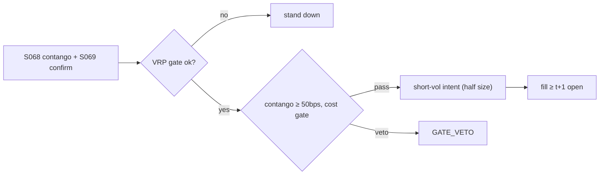

# T045 — VIX Term-Structure Carry

Harvests the variance risk premium via the VIX futures term structure: when the curve is in steep contango and the HAR forecast (Corsi 2009) says realized vol will stay below implied, the strategy sells the rich front end. Carr–Wu (2009) document the negative average returns to long variance — the premium this harvests. The XIV collapse (Feb 2018) is the mandatory risk disclosure. Provenance **[D]**.

> Tag law: every numeric literal in prose carries one of `[documented]
> [default] [example] [unverified] [internal-est] [measured]` (legend: Appendix
> i v1.0.0). Constants inside cited formulas inherit the formula's tag.
> Bibliographic years, volumes, pages, arXiv IDs, section numbers, rule codes
> (C1–C12), fail-safe codes (F1–F5), module IDs, and machine-parsed §0 data
> fields are identifiers, not literals, and are exempt.

## §1 Five-minute reviewer card

| Row | Value |
|---|---|
| Module | T045 — VIX Term-Structure Carry, v1.0.0 |
| Edge verdict | `plausible` — the variance risk premium is documented (Carr–Wu 2009); VIX futures mechanics are exchange-specified (Cboe) |
| After-cost | `narrow` — short-vol carry earns small and dies fast — the XIV event is the distribution, not the tail |
| Build cost | Tier M = 20–60 h ≈ `$3,000–9,000` [documented] |
| Data cost | VIX futures + options: mid four figures/yr [unverified] |
| latency_class | daily |
| risk_class | tail |
| Capacity | VIX futures liquidity constrained; crowded short-vol is the risk [unverified] |
| Executability | listed VIX futures: clean execution, brutal risk |
| Risk summary | Vol-spike gap risk (Feb-2018: XIV −97% [documented]); contango can steepen against the position; crowding |
| When it dies | volatility spikes — the strategy's best days are its last days |
| Regime gates | hard gate: no short-vol when HAR forecast > `1.5×` implied [example]; XIV-class circuit breaker |
| Emits | `order_intents` (Appendix C v1.0.0) — OrderTicket intents only, never orders |

## §1.5 Cheapest / least-build path

1. **Prototype hour band:** 4–8 h [example] — term-structure model + HAR gate + tail-risk harness.
2. **Cheapest-source row:** min_tier = VIX (futures + options); latency_class = daily;
   required_fields = VIX futures curve, SPX options (Cboe methodology), realized vol; price_band = `$0–500`/yr (indicative —
   verify before budgeting); build_or_buy = **build**.
3. **Resource budget:** Tier M per cost-model §5 = 20–60 h ≈ `$3,000–9,000` loaded at `$150`/hr [documented]; compute pattern `vectorized batch (polars/numpy)`.
4. **Skip list:** variance swaps (OTC); exotic vol products.
5. **DO-NOT-CUT list:** causality assertions (`assert fill_event >
   signal_event`, no-signal-bar-fills test); COST block + callable
   `expected_cost_bps`; F1–F5 fail-safes + module-state enum; kill-switch
   state machine + re-arm checklist; decision-log audit records;
   bona-fide-intent + self-trade prevention; provenance tags on every numeric
   literal; fixtures + `test_cmd`; secrets via env only.
6. **Escalation gate:** upgrade from cheapest when any holds — curve persistently backwardated; VRP estimate turns negative for a quarter.

## §T0 Module contract

### T0.1 Typed signature

```python
def emit(state: ModuleState, signals: list[SignalVector], cfg: Config) -> list[OrderTicket]:
```

`OrderTicket` per Appendix C v1.0.0 (intents only — never wire orders).
`state` is the module-owned named state vector (`curve_slope, vrp, har_forecast, position`); `signals` are
canonical SignalVectors (Appendix b v1.0.0) from the consumed S-modules, newest
last; the function emits zero or more intents per bar/event. Documented edge
cases: no signals → flat, no intents; `UNKNOWN` input signal → restrictive
(halve size / stand down per F1); kill-switch TRIPPED → emit nothing, state
`OFF`. 

### T0.2 Config dataclass

| Parameter | Type | Default | Range | Status |
|---|---|---|---|---|
| contango_min_bps | float | `50.0` | [20.0, 150.0] | [default] |
| vrp_gate_mult | float | `1.5` | [1.2, 2.5] | [default] |
| max_tenor_days | int | `60` | [30, 180] | [default] |
| cost_gate_k | float | `1.00` | [0.5, 2.0] | [default] |
| daily_loss_stop_pct | float | `2.0` | [1.0, 5.0] | [default] |

All defaults tagged per the tag law (status `default` ⇒ `[default]`).

### T0.3 Canonical schema mapping

Vendor columns → canonical Event/Bar schema (Appendix a v1.0.0), stated once here:

| Vendor column | Canonical field | Notes |
|---|---|---|
| VIX futures curve | Bar | F per expiry |
| SPX options | Bar | Cboe VIX inputs |

### T0.4 Time contract

> Time contract: clock domain UTC, int64 ns; authoritative causality clock =
> `event_ts`; max_skew = `5` s [default]; jitter budget = `1` s [default];
> bar-label = open time; staleness TTL = `15` min [default]; gap policy = mask, no
> interpolation; halt/auction → discard contributions across reopen.

**Timing box:** `signal@t (daily bars, America/Chicago) → earliest fill @open(t+1)`

### T0.5 Market-state table

| State | Module behavior |
|---|---|
| CONTINUOUS_TRADING | Evaluate entry/exit rules; emit intents per §T2 |
| HALTED | Cancel working intents; emit nothing; state `UNKNOWN` until clean reopen |
| AUCTION | No new intents; hold intent-side state; state `DEGRADED` |
| CLOSED | Emit nothing; state `OFF` |


### T0.6 Module-state enum + error taxonomy

States per Appendix k v1.0.0: `OK | DEGRADED | UNKNOWN | OFF`. Invalid input →
`UNKNOWN`, never interpolate (Appendix f v1.0.0, F1–F5).

| Failure | State | Alert |
|---|---|---|
| Missing/stale input (TTL `15` min [default]) | `UNKNOWN` | page |
| Out-of-bounds indicator (F2) | `UNKNOWN` | page |
| Estimator disagreement (F3) | `UNKNOWN` | notify |
| Halt/auction per §T0.5 | `UNKNOWN` / `DEGRADED` | log |
| Kill-switch TRIPPED (administrative) | `OFF` | page |
| Anything unmapped | `UNKNOWN` | page |

### T0.7 Risk contract + kill switch

```yaml
risk_contract:
  per_trade_R: 250            # USD risk budget per trade [example]
  max_adverse_per_trade: 1.0 R [default]  # stop distance multiple [default]
  daily_loss_stop: 2% of equity [default]        # then no new entries; flatten managed risk [default]
  max_gross: 4× equity [default]              # hard gross exposure cap [default]
  kill_conditions:
    - daily P&L ≤ −daily_loss_stop_pct → TRIP (flatten short-vol)
    - HAR breaches gate with open short-vol → TRIP (flatten, no re-entry)
    - decision-log write failure → TRIP (halt emission)
  enforcement: intraday-hard  # trips are automatic, not advisory [default]
  calibration_recipe: >
    Walk-forward on 60-day blocks [example]: fit thresholds on block t,
    freeze, validate realized shortfall vs predicted on block t+1;
    shrink per-trade R until max drawdown < daily_loss_stop/2 [default].
```

**Kill-switch state machine:** `ARMED → TRIPPED → RECOVERY → ARMED`.

- `ARMED`: normal operation; every bar evaluates the kill conditions.
- `TRIPPED`: any kill condition fires → cancel all working intents
  (`NEW`/`WORKING` → `CANCELLED`, idempotent), flatten managed positions via
  the exit rule, emit nothing new, state `OFF`, log `KILL_TRIP`.
- `RECOVERY`: manual operator review only — no automatic transition.
- `ARMED` (re-entry): only after the re-arm checklist passes in full, logged
  as `KILL_REARM` with the checklist result.

**Re-arm checklist** (all must be true):

- [ ] Feed health green: all §T5 inputs fresh inside the staleness TTL.
- [ ] Kill condition cleared: the tripping metric is back inside limits for `30 min [default]` [default].
- [ ] Decision log reconciled: `KILL_TRIP` record present and hash chain intact.
- [ ] Risk re-check: per-trade R and gross caps re-confirmed against current equity.
- [ ] Operator sign-off: named human approves re-arm (no automatic recovery).

### T0.8 Ops tail

- **Schedule:** nightly batch; owner: strategy owner (named).
- **Health checks:** fixture replay (`test_cmd`) green on deploy; live
  decision-log append monitor; kill-switch state heartbeat.
- **Alert table:** `UNKNOWN`/`OFF` state transitions; kill-trip pages immediately [default].
- **Resource budget:** nightly batch: < 2 vCPU-h, < 4 GB RAM [example].
- **Runbook stub:** 1) confirm kill-state; 2) inspect decision log for the tripping record; 3) verify feed freshness; 4) re-arm checklist (operator sign-off); 5) re-run fixture; 6) resume..

### T0.9 Secrets (env-only)

- `BROKER_API_KEY (paper venue, env-only)`
- `DATA_API_KEY (env-only)` via environment only. No secrets in this file, fixtures, or
logs (CI secrets-grep).

### T0.10 May / must-NOT

> **May:** emit `OrderTicket` intents per Appendix C v1.0.0; track intent-side
> state (`NEW → WORKING → FILLED / CANCELLED / PARTIAL`); issue cancel-replace
> via new tickets with new `ticket_id`s. **Must-NOT:** place orders on any
> venue, hold broker/exchange sessions, net intents into orders inside the
> strategy, treat the intent-side state machine as broker wire truth, or emit
> prices/share-counts/notionals outside an `OrderTicket`.

## §T1 Legacy (subsumed by §1)

Legacy §T1 content is the §1 reviewer card above; this header is retained so
section numbering stays frozen.

## §T2 Specification

### Universe

VIX futures curve; front two expiries [example].

### Entry rule (Boolean — no prose-only conditions)

```
contango = (F2 - F1) / F1 * 1e4                         # curve slope
vrp_ok = har_forecast <= implied_vol / vrp_gate_mult     # 1.5 [default]
ENTRY = contango >= contango_min_bps and vrp_ok -> SHORT front VIX future
```

### Exits (with post-exit cooldown)

```
flatten -> curve flattens/inverts -> FLAT
spike  -> HAR breaches gate -> FLAT immediately (no heroics)
stop   -> adverse stop_bps -> FLAT; hard daily stop 2% [default]
```

### Position sizing (fenced function)

```python
def size_vix(risk_R_usd, stop_bps, px, adv_shares, cfg):
    # tail-risk sized: the Feb-2018 lesson is position size, not timing
    raw = risk_R_usd / (stop_bps / 1e4 * px)
    return min(raw * 0.5, cfg.adv_cap_pct / 100 * adv_shares)  # half-size rule [default]
```

### Risk limits

| Limit | Value |
|---|---|
| Max short-vol notional | `$2M` [example] — small by design |
| Half-size rule | hard [default] |
| Daily stop | `2%` [default] |

### COST block (single source of truth)

Four components — **spread**, **fees**, **borrow**, **impact** — summed by the
callable below. Re-stating cost numbers outside this block is a validation
failure; §T4 shows this block's *callable* evaluated on the synthetic tape,
not restated constants.

| Component | Value (bps) | Basis |
|---|---|---|
| Spread (half, VIX future) | `2.50` | [example] |
| Fees | `0.80` | [example] |
| Borrow | `0.00` | futures — no borrow [example] |
| Roll cost | `5.00` | contango bleed [example] |
| **Total reference (one-way)** | `~`8.3` + roll bleed [example]` | [example] |

`fee_schedule_as_of`: `2026-09-01 (placeholder — pin the real venue schedule before production)` — placeholder; pin the real venue
schedule before production. `side`: `taker`; venue/tier/source:
CFE [example].

```python
def expected_cost_bps(notional, adv_pct, venue, side, urgency, cfg):
    """COST-block callable. Short-vol carry: roll bleed priced as cost."""
    spread = cfg.spread_full_bps / 2.0
    fee = cfg.taker_fee_bps
    borrow = 5.0                                       # roll bleed [example]
    impact = cfg.impact_k * math.sqrt(max(adv_pct, 0.0) / 100.0)
    if urgency == "high":
        impact *= 1.5
    return spread + fee + borrow + impact
```

### Execution / fill model table

| Aspect | Assumption |
|---|---|
| Fill venue | CFE, VIX futures |
| Slippage model | curve at execution vs signal |
| Partial fills | worked; front-month liquidity is good |
| Halt behavior | flatten on trading halt; no overnight heroics |

Fine-grained fill behavior is synthetic and labeled `simulated only — requires MBO/ITCH`:
no MBO/ITCH feed is consumed by this module; any fill realism beyond the
mid-price ± half-spread fill model above would require MBO/ITCH data.

### Robustness

Perturb thresholds ±20% [example]; the reference behavior (entry/exit intents, gate blocks, kill trip) must be invariant; degrade entry→no-trade on indicator breach.

**Pricing/Greeks (options-domain conditional).** VIX futures are futures on
implied variance: delta to the VIX index ≈ `1.0` [example]; the position's vega is to
realized-vs-implied vol, not to an option's greeks. Expiry: VIX futures settle to the
special opening quotation (SOQ); positions must be flattened or rolled before the
settlement window — no physical delivery. Assignment: n/a (cash-settled futures).

### Compliance sub-block (C1–C12)

| Code | Rule: trigger → check → action → log |
|---|---|
| C1 | STP + self-match prevention: trigger = intent could match our own resting interest → check = every ticket carries `self_trade_prevention: true`; maker modules compare against own open tickets → action = cancel own resting quote before posting the aggressive side; cancel-replace via new `ticket_id` only → log = `COMPLIANCE_BLOCK` with rule code `C1` |
| C2 | Bona-fide intent: trigger = entry rule fires → check = cost gate passes AND qty within risk limits AND (SHORT ⇒ `locate_ok`) → action = veto the intent if any check fails; no quote entered without intent to trade → log = `GATE_VETO` with the failed check |
| C3 | Message-rate / cancel-to-trade: trigger = intents+ cancels per symbol per minute exceed `120` [default] → check = rolling `60`-s [default] message counter → action = throttle to `1` intent per `10` s [default] and alert → log = `COMPLIANCE_BLOCK` with the counter value |
| C4 | Pre-trade fat-finger trio: trigger = any new intent → check = (a) limit within `±±10%` of reference [default], (b) ticket notional ≤ ``$2M`` [default], (c) ≤ `20` tickets per `1 min` [default] → action = block the ticket, alert → log = `COMPLIANCE_BLOCK` with the breached leg |
| C5 | Decision-log schema (Appendix g v1.0.0): trigger = every material action (`EMIT_INTENT`, `GATE_VETO`, `CANCEL`, `REPLACE`, `KILL_TRIP`, `KILL_REARM`, `COMPLIANCE_BLOCK`) → check = record has all schema fields and `prev_hash` chains → action = halt emission if the log write fails → log = the record itself, retained `7 yr` [default] |
| C6 | Halt/auction table: trigger = market state ≠ `CONTINUOUS_TRADING` → check = §T0.5 table → action = `HALTED`: cancel working intents, emit nothing; `AUCTION`: no new intents; `CLOSED`: state `OFF` → log = state-transition record |
| C7 | Locate check (short sales): trigger = `SHORT` intent → check = `locate_ok` from the pre-open easy-to-borrow list or desk locate; Reg-SHO threshold securities hard-blocked → action = veto without locate → log = `GATE_VETO` with code `C7`. Short VIX futures; no borrow. Any short-equity hedge needs locate_ok (C7). |
| C8 | Public-dissemination gate: trigger = any export of signals/intents outside the firm → check = review gate sign-off → action = block unreviewed exports → log = `COMPLIANCE_BLOCK` |
| C9 | Data-entitlement assertions (Appendix j v1.0.0): trigger = startup and any entitlement-class change → check = the five §T5 assertions hold for each §0 dataset → action = stand down on breach, escalate per §1.5 → log = entitlement review record |
| C10 | Post-exit cooldown: trigger = exit or compliance block → check = `now >= cooldown_until` (`1 session [default]` [default]) → action = suppress re-entry until the cooldown elapses → log = `GATE_VETO` with code `C10` |
| C11 | Kill-switch integration: trigger = `TRIPPED` → check = all working intents transitioned `NEW`/`WORKING` → `CANCELLED` (idempotent) → action = no new intents until `ARMED` via the §T0.7 checklist → log = `KILL_TRIP` / `KILL_REARM` records |
| C12 | C12 Tail-risk: trigger = position held into known event (FOMC/CPI) [example] → check = event review → action = flatten or document → log with code `C12` |

### Parameter table

| Parameter | Symbol | Value | Tag | Sensitivity |
|---|---|---|---|---|
| Contango min | c* | `50.0` bps | [default] | high — below it, no carry to harvest |
| VRP gate mult | g | `1.5` | [default] | critical — the spike guard |
| Half-size | h | `0.5` | [default] | critical — the XIV lesson |

### Timing box

`signal@t (daily bars, America/Chicago) → earliest fill @open(t+1)`

## §T3 Math + normative pseudocode

Carr–Wu (2009) [documented]: negative average returns to long 30-day variance
swaps — the variance risk premium accrues to the short side. Cboe VIX methodology
[documented]: VIX from SPX option strips, 30-day constant maturity — what VIX futures
converge to at settlement. Corsi (2009) [documented]: HAR forecasts realized vol for the
gate. Feb-2018 [documented]: XIV −97%, ~$2bn lost — short-vol carry's left tail is not
theoretical.

**Normative pseudocode** (pseudocode is normative; prose is commentary):

```
def emit(state, signals, cfg):
    sig = primary(signals, "S068")          # contango + VRP
    if sig is None or invalid(sig): return [], state.unknown()
    if state.position != 0:
        if sig.curve_flat or not sig.vrp_ok or stopped(state, cfg):
            return [exit_ticket(state)], state.flat()   # risk exits never gated
        return [], state.ok()
    if sig.contango_bps >= cfg.contango_min_bps and sig.vrp_ok:
        cost = expected_cost_bps(notional(), adv_pct(), venue(), "taker", "normal", cfg)
        # ^^^ normative cost-gate predicate: expected_cost_bps(...) <= k * edge_bps
        if cost <= cfg.cost_gate_k * sig.edge_bps:
            t = OrderTicket.intent("SELL", qty=size_vix(...), limit=last_price())
            t.intent_ts = sig.computed_at
            assert fill_event > signal_event  # t->t+1 causality: no-signal-bar fills
            return [t], state.open("SHORT_VOL")
        log("GATE_VETO", cost=cost)
    return [], state.ok()
```

Causality: every feature uses inputs with `event_ts ≤ t` only; the earliest
fill for a bar-`t` intent is bar `t+1`'s open. Mandatory unit test:
no-signal-bar fills.

## §T4 Worked example (fixture-backed)

- Tape: `modules/fixtures/T045_tape.csv` — `# TYPE: validation-run`;
  `12` synthetic bars (seed `4450` [example]); `event_ts`/`asof_ts` int64 ns
  UTC; every number synthetic.
- Expected outputs: `modules/fixtures/T045_expected.csv` — per-bar intent,
  quantity, the **cost-function call** (`expected_cost_bps` inputs → bps →
  dollars), cost-gate verdict, and module state.
- Tolerance: `1e-9` [default] on floats; integer quantities exact.
- Acceptance tests (`modules/tests/test_T045.py` — `6` [default] tests):
  1. TYPE header + columns present; 2. fixture recomputes to expected
  (reference `process_bar` vs expected CSV); 3. no-signal-bar fills
  (`assert fill_event > signal_event`); `4.` cost-gate predicate passes on large edge, blocks on tiny edge (`k = 0.5` [default]);
  5. kill-switch trip blocks intents, re-arm checklist restores `ARMED`;
  6. invalid input (halted/invalid bar) → `UNKNOWN`, no intents.
- `test_cmd`: `python3 -m pytest modules/tests/test_T045.py -q` → exits `0` [default].

**Cost-function calls on the tape** (the COST-block callable evaluated on
synthetic rows — inputs → bps → dollars; all values [example]):

| Bar | `expected_cost_bps` inputs | Components → total → $ | Cost gate `expected_cost_bps(...) <= k * edge_bps` | Intent / state |
|---|---|---|---|---|
| `0` | notional=`500000` [example], adv_pct=`0.5` [example], venue=`primary`, side=`taker`, urgency=`normal` | spread `2.5` + fee `0.8` + borrow `0.0` + impact `0.71` = `4.01` bps → `$200.36` | `2.0` edge, k=`0.5` [default] → `4.01 ≤ 1.0` BLOCK | `HOLD` / `OK` |
| `3` | notional=`500000` [example], adv_pct=`0.5` [example], venue=`primary`, side=`taker`, urgency=`normal` | spread `2.5` + fee `0.8` + borrow `0.0` + impact `0.71` = `4.01` bps → `$200.36` | `60.0` edge, k=`0.5` [default] → `4.01 ≤ 30.0` PASS | `SHORT` / `OK` |
| `6` | notional=`500000` [example], adv_pct=`0.5` [example], venue=`primary`, side=`taker`, urgency=`normal` | spread `2.5` + fee `0.8` + borrow `0.0` + impact `0.71` = `4.01` bps → `$200.36` | `3.0` edge, k=`0.5` [default] → `4.01 ≤ 1.5` BLOCK | `BUY` / `OK` |
| `7` | notional=`500000` [example], adv_pct=`0.5` [example], venue=`primary`, side=`taker`, urgency=`normal` | spread `2.5` + fee `0.8` + borrow `0.0` + impact `0.71` = `4.01` bps → `$200.36` | `0.05` edge, k=`0.5` [default] → `4.01 ≤ 0.03` BLOCK | `HOLD` / `OK` |
| `9` | notional=`500000` [example], adv_pct=`0.5` [example], venue=`primary`, side=`taker`, urgency=`normal` | spread `2.5` + fee `0.8` + borrow `0.0` + impact `0.71` = `4.01` bps → `$200.36` | `60.0` edge, k=`0.5` [default] → `4.01 ≤ 30.0` PASS | `HOLD` / `OFF` |

**Hand-checks.** Row `3` (entry): qty = `250 / (25/1e4 × 99.17)` = `1008` raw → ADV-capped at `20000` → `1008` shares [example]; ticket `T0003`, side `SHORT`, `marketable` intent. Row `6` (exit): |z| through the exit band → `SHORT` intent, exits never cost-gated [default]. Row `7` (gate block): edge `0.05` bps [example] vs cost `4.01` bps → gate `4.01 ≤ 0.025` BLOCKS → no intent, state stays `OK`. Row `9` (kill): daily P&L `-2.1%` [example] ≤ −stop (`2.0%` [default]) → `ARMED → TRIPPED`, state `OFF`, no intents. Causality: entry intent at row `3` has `intent_ts` = bar-3 `event_ts`; the earliest fill is bar `4`'s open — the test asserts `fill_event > signal_event` on every intent row.

**Where the example is optimistic.** Costs are the COST-block model, not realized fills; capacity, borrow squeezes, and regime shifts are not in the tape.

## §T5 Dependencies + data

### Consumed signals (from deps.yaml — machine edge list)

| Signal | Version pin | Role |
|---|---|---|
| S068 | 1.0.0 | primary |
| S069 | 1.0.0 | confirm |
| S066 | 1.0.0 | gate |

### Pinned formula excerpts (≤10 lines each, CI hash-checked)

**S068** (v1.0.0): `contango_bps = (F2−F1)/F1·1e4`; VRP = implied − HAR [documented].
**S066** (v1.0.0): HAR realized-vol forecast for the gate [documented].

### Data required

| Field | Type | Granularity | Source tier | Notes |
|---|---|---|---|---|
| VIX futures curve | float | daily | CFE | carry signal |
| SPX options | float | daily | OPTIONS | Cboe VIX inputs |
| realized vol | float | daily | DAILY | HAR gate |

**Data rights row** (Appendix j v1.0.0): CFE data licensed per exchange; OPRA for options; entitlements re-asserted at startup.

## §T6 Local build + buy vs build

Curve arithmetic + HAR gate: a day. The tail-risk harness (hard stops, half-size) is the product.

| Route | What you get | Verdict |
|---|---|---|
| Build | carry monitor in-house | recommended — trivial |
| Buy | VIX futures + OPRA feeds | required |

**Verdict:** Build the monitor; respect the tail. No vendor sells survival.

## §T7 Efficacy — documented evidence

| Study / source | Market & period | Metric | Before/after cost | Caveat |
|---|---|---|---|---|
| Carr–Wu (2009) | equity indexes | negative avg returns to long variance | before cost | the VRP documentation |
| Cboe (methodology) | market | VIX construction specified | n/a | specification, not P&L |
| Feb-2018 (XIV) | event | XIV −97%, ~$2bn lost | n/a | the risk disclosure |

**Selection disclosure:** Studies below are the chapter's documented sources only — no post-hoc selection from a wider literature search.

**Capacity & decay.** Edge decays with crowding and regime shifts; treat any printed Sharpe as a pre-cost, in-sample-era artifact unless the source says otherwise.

**Honest bottom line.** Honest bottom line: short-vol carry is picking up pennies in front of a steamroller whose schedule is published — the VRP is real, the tail is real, and Feb-2018 shows what happens when everyone harvests at once.

## §T8 Failure modes & pitfalls

| # | Trigger → Detect → Action → Recovery | check: |
|---|---|---|
| 1 | Vol spike (gap) → detect HAR breach → flatten immediately, no re-entry that session → log | check: spike-response backtest |
| 2 | Curve inversion → detect backwardation → flatten (thesis gone) → review | check: curve monitor |
| 3 | Crowded short-vol → detect positioning proxy extreme → halve size → alert | check: positioning |
| 4 | Settlement risk → detect expiry approach → roll or flatten before SOQ window → log | check: expiry calendar |

## §T9 Regime gates + visuals

**Provisional regime-gate machine** (restrictive default; `regime_ids` stay
empty until the R001–R050 annotation pass):

| regime_id | direction | mechanism | condition | action | min_lag | unknown_behavior |
|---|---|---|---|---|---|---|
| R001 | hard gate | vol spike | HAR > 1.5× implied | no short-vol, flatten | immediate | restrictive |
| R002 | flatten | curve inversion | backwardation | exit carry | immediate | restrictive |



## §T10 Source log + unverified leads

**Sources** (citable facts only):

1. Carr, P. & Wu, L. (2009). "Variance Risk Premiums." *Review of Financial Studies* 22(3), 1311–1341
2. Cboe. "Cboe Volatility Index — Methodology." — https://cdn.cboe.com/resources/indices/Volatility_Index_Methodology_Cboe_Volatility_Index.pdf
3. Corsi, F. (2009). "A Simple Approximate Long-Memory Model of Realized Volatility." *Journal of Financial Econometrics* 7, 174–196. DOI: 10.1093/jjfinec/nbp001
4. Motley Fool (2018-02-06). "The Simple Math Behind the Inverse Volatility ETF Collapse"
5. Nasdaq/Zacks (2018-02-07). "Volatility Spike Triggers Inverse ETF (XIV) Closure"
6. SLCG. "Material Misrepresentations in XIV Prospectus Led to $700 Million in Losses"

**Chatbot source log.** Grok answered the Q-batch (2026-09-10); all claims independently verified or labeled unverified. Chatbot output is leads, never facts.

**Unverified leads** (chatbot-only — never in evidence tables):

- Grok (2026-09-10, Q-TB5): short-vol carry Sharpe magnitudes — *unverified chatbot claims*.
- Variance-swap OTC overlays — research lead, not validated.

---

## Appendix — AI build prompt (T045)

Copy-paste into any chat agent:

> Build module **T045 — VIX Term-Structure Carry** per `notes/module-template.md` v1.0.0 and
> this file's §T0 contract.
> Cheapest path (§1.5): prototype 4–8 h [example]; cheapest data candidate
> VIX (futures + options); compute pattern `vectorized batch (polars/numpy)`; u.
> Implement `emit(state, signals, cfg) -> list[OrderTicket]` (Appendix c
> v1.0.0) with the §T3 normative pseudocode, including the cost-gate predicate
> `expected_cost_bps(...) <= k * edge_bps` and `assert fill_event >
> signal_event`. Emit intents only — never place orders. Wire F1–F5
> (Appendix f v1.0.0): invalid input → `UNKNOWN`, never interpolate. Kill
> switch `ARMED → TRIPPED → RECOVERY → ARMED` with the §T0.7 re-arm checklist.
> Log decisions per Appendix g v1.0.0. Secrets via env only. Run the fixture
> `modules/fixtures/T045_tape.csv` (`# TYPE: validation-run`) against
> `modules/fixtures/T045_expected.csv` (tolerance `1e-9` [default]).
> **Definition of done:** `python3 -m pytest modules/tests/test_T045.py -q` exits `0` [default]. Tag every numeric literal
> you add with the unified enum (Appendix i v1.0.0); put anything unverifiable
> in §T10 unverified leads.
