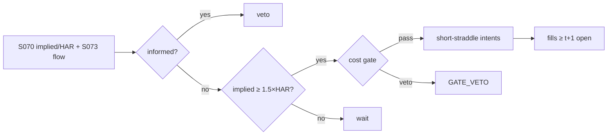

# T046 — Straddle-Implied Move Fade

Fades the event premium: before scheduled events, straddles price an implied move; when the implied move exceeds the HAR-realized forecast by the required multiple and the event passes, the strategy sells the inflated straddle and harvests the vol crush. Ederington–Lee (1993) document the post-news volatility shape; Pan–Poteshman (2006) warn that informed option flow exists. Provenance **[D]**.

> Tag law: every numeric literal in prose carries one of `[documented]
> [default] [example] [unverified] [internal-est] [measured]` (legend: Appendix
> i v1.0.0). Constants inside cited formulas inherit the formula's tag.
> Bibliographic years, volumes, pages, arXiv IDs, section numbers, rule codes
> (C1–C12), fail-safe codes (F1–F5), module IDs, and machine-parsed §0 data
> fields are identifiers, not literals, and are exempt.

## §1 Five-minute reviewer card

| Row | Value |
|---|---|
| Module | T046 — Straddle-Implied Move Fade, v1.1.0 |
| Edge verdict | `INSUFFICIENT-EVIDENCE` — no documented after-cost backtest of this fade; the crush phenomenon is documented before cost |
| After-cost | `BEFORE-COST` — every §T7 source is gross of trading costs; no FULL-COST efficacy is documented |
| Build cost | Tier M = `20–60` h ≈ `$3,000–9,000` loaded at `$150`/hr [documented] |
| Data cost | OPRA non-display: direct access `$1,000`/mo + Category 1 non-display `$2,000`/enterprise/mo [documented, schedule vintage to verify]; all-in via consolidated vendor `$12,000–90,000`/yr [unverified] |
| latency_class | daily |
| risk_class | tail |
| Capacity | `$0.5–5M` gross premium per name per event [internal-est]; options-liquidity constrained |
| Executability | needs OPRA + event calendar + locate desk for short hedge legs; the straddle mechanics are standard |
| Risk summary | Event binary risk (the move exceeds implied); informed flow adverse selection; vol surface dislocations; early assignment on short legs |
| When it dies | when events stop being scheduled (they don't) — it dies name by name on binary outcomes and when implied multiples compress structurally |
| Regime gates | R001 (informed flow → veto); R002 (macro weeks → halve) — provisional, restrictive default |
| Emits | `order_intents` (Appendix C v1.0.0) — OrderTicket intents only, never orders |

## §1.5 Cheapest / least-build path

1. **Prototype hour band:** `4–8` h [example] — implied-move computation + event calendar + straddle execution.
2. **Cheapest-source row:** min_tier = OPRA via consolidated vendor (non-display, single professional user); latency_class = daily;
   required_fields = option chains (straddle IV), event calendar, realized vol; price_band = `$12,000–90,000`/yr [unverified] (documented OPRA components: direct access `$1,000`/mo + Category 1 non-display `$2,000`/enterprise/mo [documented, schedule vintage to verify — vendor pass-through varies); build_or_buy = **buy data, build logic**.
3. **Resource budget:** Tier M per cost-model §5 = `20–60` h ≈ `$3,000–9,000` loaded at `$150`/hr [documented]; compute pattern `vectorized batch (polars/numpy)`; nightly batch < `2` vCPU-h, < `4` GB RAM [example].
4. **Skip list:** unscheduled-event trading; weekly-expiry scalping; intraday delta hedging (daily re-hedge only in the cheap build).
5. **DO-NOT-CUT list:** causality assertions (`assert fill_event >
   signal_event`, no-signal-bar-fills test); COST block + callable
   `expected_cost_bps`; F1–F5 fail-safes + module-state enum; kill-switch
   state machine + re-arm checklist; decision-log audit records;
   bona-fide-intent + self-trade prevention; provenance tags on every numeric
   literal; fixtures + `test_cmd`; secrets via env only; C7 locate check on
   every short hedge leg.
6. **Escalation gate:** upgrade from cheapest when any holds — live intraday hedging required (cheapest is daily re-hedge only); multi-name firm-wide deployment; implied multiples compress structurally; informed-flow flags fire repeatedly.

## §T0 Module contract

### T0.1 Typed signature

```python
def emit(state: ModuleState, signals: list[SignalVector], cfg: Config) -> list[OrderTicket]:
```

`OrderTicket` per Appendix C v1.0.0 (intents only — never wire orders).
`state` is the module-owned named state vector (`position, contracts, entry_implied, delta_net, event_ts`); `signals` are
canonical SignalVectors (Appendix b v1.0.0) from the consumed S-modules, newest
last; the function emits zero or more intents per bar/event. Documented edge
cases: no signals → flat, no intents; `UNKNOWN` input signal → restrictive
(halve size / stand down per F1); kill-switch TRIPPED → emit nothing, state
`OFF`. For options-leg tickets `qty` is **contracts** (contract multiplier
`100` [documented], US equity options standard; declared per ticket in the
decision log); stock hedge-leg tickets use `qty` in shares per Appendix C.

### T0.2 Config dataclass

| Parameter | Type | Default | Range | Status |
|---|---|---|---|---|
| implied_mult | float | `1.5` | [1.2, 2.5] | default |
| event_window_d | int | `3` | [1, 7] | default |
| max_tenor_d | int | `14` | [7, 45] | default |
| cost_gate_k | float | `0.50` | [0.5, 2.0] | default |
| daily_loss_stop_pct | float | `2.0` | [1.0, 5.0] | default |
| risk_R_usd | float | `250` | [100, 1000] | default |
| stop_premium_frac | float | `0.50` | [0.25, 1.0] | default |
| adv_cap_pct | float | `1.0` | [0.5, 5.0] | default |
| hedge_delta_tol | float | `0.10` | [0.05, 0.25] | default |
| hedge_min_shares | int | `50` | [10, 200] | default |
| spread_full_bps | float | `10.0` | [5, 30] | example |
| taker_fee_bps | float | `1.0` | [0.1, 5] | example |
| maker_rebate_bps | float | `-0.2` | [-1, 0] | example |
| borrow_bps | float | `0.0` | [0, 50] | default |
| impact_k | float | `20.0` | [5, 50] | example |
| venue | str | `"primary"` | {primary} | default |
| default_side | str | `"SHORT"` | {SHORT} | fixed |

All defaults tagged per the tag law (status `default` ⇒ `[default]`,
`example` ⇒ `[example]`, `fixed` ⇒ literal of the contract). `borrow_bps =
0.0` [default]: the strategy holds no stock position in steady state; short
stock hedge legs pay borrow — hard-to-borrow names are vetoed at entry by the
C7 locate check, so modeled borrow is zero with that reason stated.

### T0.3 Canonical schema mapping

Vendor columns → canonical Event/Bar schema (Appendix a v1.0.0) + ChainSnapshot
(Appendix h v1.0.0), stated once here:

| Vendor column | Canonical field | Notes |
|---|---|---|
| OPRA chain (bid/ask/size per contract) | `ChainSnapshot.quotes[]` | OCC symbology; no interpolation of missing strikes/expiries |
| straddle mid (call mid + put mid, front expiry ≤ max_tenor_d) | `SignalVector` via S070: `implied_move = straddle_mid / spot` | pinned excerpt §T5 |
| event calendar (event_ts, event_kind, underlying) | `Event{event_ts, event_kind, underlying, source_ts}` | earnings, FDA, macro [example] |
| realized vol (daily closes) | `Bar{close}` → HAR forecast (Corsi) | `har_move = har_forecast × √event_window` |
| dividend calendar | `Event{event_kind = dividend}` | early-assignment guard |

### T0.3b Domain & session block

Asset class: US equity options, short premium (see §0 `domain`). Venues:
OCC-cleared US options exchanges, multi-listed names; the feed is OPRA
consolidated — no single-exchange routing assumption. Session: regular trading
hours, America/Chicago; signals computed on daily bars labeled by open time.
Calendar: NYSE/OCC holiday calendar — no positions opened or hedged on
holidays. Settlement: equities T+1; options exercise/assignment via OCC; never
hold short premium into expiry without review (§T2 Exits).

### T0.4 Time contract

> Time contract: clock domain UTC, int64 ns; authoritative causality clock =
> `event_ts`; max_skew = `5` s [default]; jitter budget = `1` s [default];
> bar-label = open time; staleness TTL = `15` min [default]; gap policy = mask, no
> interpolation; halt/auction → discard contributions across reopen.

Dual timestamps `(event_ts, asof_ts)` on every bar; `asof_ts ≥ event_ts`
asserted on ingest (F1) — violation → `UNKNOWN`, never interpolate. The
`15`-min [default] TTL suits the nightly-batch daily cadence; any input older
than the TTL at evaluation time → `UNKNOWN`.

**Timing box:** `signal@t (daily bars, America/Chicago) → earliest fill @open(t+1)`

### T0.5 Market-state table

| State | Module behavior |
|---|---|
| CONTINUOUS_TRADING | Evaluate entry/exit/hedge rules; emit intents per §T2 |
| HALTED | Cancel working intents; emit nothing; state `UNKNOWN` until clean reopen |
| AUCTION | No new intents; hold intent-side state; state `DEGRADED` |
| CLOSED | Emit nothing; state `OFF` |


### T0.6 Module-state enum + error taxonomy

States per Appendix k v1.0.0: `OK | DEGRADED | UNKNOWN | OFF`. Invalid input →
`UNKNOWN`, never interpolate (Appendix f v1.0.0, F1–F5).

| Failure | State | Alert |
|---|---|---|
| Missing/stale input (TTL `15` min [default]) | `UNKNOWN` | page |
| Out-of-bounds indicator (F2) | `UNKNOWN` | page |
| Estimator disagreement (F3) | `UNKNOWN` | notify |
| Halt/auction per §T0.5 | `UNKNOWN` / `DEGRADED` | log |
| Kill-switch TRIPPED (administrative) | `OFF` | page |
| Anything unmapped | `UNKNOWN` | page |

### T0.7 Risk contract + kill switch

```yaml
risk_contract:
  per_trade_R: 250            # USD risk budget per trade [default]
  max_adverse_per_trade: 1.0 R [default]  # = the stop: stop_premium_frac × straddle premium
  daily_loss_stop: 2% of equity [default]        # then no new entries; flatten managed risk [default]
  max_gross: 4× equity [default]              # hard gross exposure cap [default]
  kill_conditions:
    - daily P&L ≤ −daily_loss_stop_pct → TRIP (flatten premium)
    - informed-flow flag on 2 open names [default] → TRIP
    - decision-log write failure → TRIP (halt emission)
  enforcement: intraday-hard  # trips are automatic, not advisory [default]
  calibration_recipe: >
    Walk-forward on 60-day blocks [example]: fit thresholds on block t,
    freeze, validate realized shortfall vs predicted on block t+1;
    shrink per-trade R until max drawdown < daily_loss_stop/2 [default].
```

**Kill-switch state machine:** `ARMED → TRIPPED → RECOVERY → ARMED`.

- `ARMED`: normal operation; every bar evaluates the kill conditions.
- `TRIPPED`: any kill condition fires → cancel all working intents
  (`NEW`/`WORKING` → `CANCELLED`, idempotent), flatten managed positions via
  the exit rule, emit nothing new, state `OFF`, log `KILL_TRIP`.
- `RECOVERY`: manual operator review only — no automatic transition.
- `ARMED` (re-entry): only after the re-arm checklist passes in full, logged
  as `KILL_REARM` with the checklist result.

**Re-arm checklist** (all must be true):

- [ ] Feed health green: all §T5 inputs fresh inside the staleness TTL.
- [ ] Kill condition cleared: the tripping metric is back inside limits for `30` min [default] [default].
- [ ] Decision log reconciled: `KILL_TRIP` record present and hash chain intact.
- [ ] Risk re-check: per-trade R and gross caps re-confirmed against current equity.
- [ ] Operator sign-off: named human approves re-arm (no automatic recovery).

### T0.8 Ops tail

- **Schedule:** nightly batch after the US close; owner: strategy owner (named).
- **Health checks:** fixture replay (`test_cmd`) green on deploy; live
  decision-log append monitor; kill-switch state heartbeat; hedge-leg locate
  cache freshness.
- **Alert table:** `UNKNOWN`/`OFF` state transitions; kill-trip pages immediately [default].
- **Resource budget:** nightly batch: < `2` vCPU-h, < `4` GB RAM [example].
- **Runbook stub:** 1) confirm kill-state; 2) inspect decision log for the tripping record; 3) verify feed freshness; 4) re-arm checklist (operator sign-off); 5) re-run fixture; 6) resume..

### T0.9 Secrets (env-only)

- `BROKER_API_KEY (paper venue, env-only)`
- `DATA_API_KEY (env-only)` via environment only. No secrets in this file, fixtures, or
logs (CI secrets-grep).

### T0.10 May / must-NOT

> **May:** emit `OrderTicket` intents per Appendix C v1.0.0; track intent-side
> state (`NEW → WORKING → FILLED / CANCELLED / PARTIAL`); issue cancel-replace
> via new tickets with new `ticket_id`s. **Must-NOT:** place orders on any
> venue, hold broker/exchange sessions, net intents into orders inside the
> strategy, treat the intent-side state machine as broker wire truth, or emit
> prices/share-counts/notionals outside an `OrderTicket`.

## §T1 Legacy (subsumed by §1)

Legacy §T1 content is the §1 reviewer card above; this header is retained so
section numbering stays frozen.

## §T2 Specification

### Universe

Names with liquid short-dated options and scheduled events (earnings, FDA, macro [example]).

Liquidity filters (all [default] unless noted):

- listed US equity options with weekly expiries [example]
- straddle open interest ≥ `500` contracts and straddle ADV ≥ `200` contracts
- quoted straddle spread ≤ `20`% of straddle mid (skip wider — untradable)
- underlying ADV ≥ `$10M`
- underlying not hard-to-borrow (C7 locate available)

### Entry rule (Boolean — no prose-only conditions)

```
ENTRY = (implied_move >= implied_mult * har_move)
        AND event_in_window
        AND NOT informed_flag
        AND ts_gate_ok
        AND cost_gate_pass
```

where (all per-bar, from the consumed SignalVectors):

- `implied_move = straddle_mid / spot` — S070 primary [documented]
- `har_move = har_forecast * sqrt(event_window)` — Corsi HAR [documented]
- `event_in_window = (0 <= event_ts - bar_ts <= event_window_d * 86400)` [default]
- `informed_flag` — S073 confirm leg (`1` = informed urgency → veto)
- `ts_gate_ok` — S069 term-structure gate (`1` = pass)
- `cost_gate_pass = expected_cost_bps(...) <= cost_gate_k * edge_bps` — the COST-block predicate

### Exits (with post-exit cooldown)

```
event_passed                                   -> exit both legs (vol crush realized)
move_realized >= entry_implied                  -> stop out (thesis broken), hard stop
days_to_expiry <= 2 [default]                   -> flatten; never hold short premium into expiry weekend
post-exit cooldown: no re-entry for 1 session [default] (C10)
```

`move_realized` = |close − entry_close| / entry_close since entry; `entry_implied`
is the implied move recorded at entry. Exits are never cost-gated [default] —
the exit tickets are emitted regardless of the gate predicate.

### Delta-hedge rule (options-domain conditional)

The short straddle is re-hedged to keep net delta inside tolerance:

- recompute `delta_net` (straddle delta per share, from the ChainSnapshot) at each close
- if a position is open and `|delta_net| > hedge_delta_tol` (`0.10` [default]) and
  `round(|delta_net| × contracts × 100) ≥ hedge_min_shares` (`50` [default]) →
  emit one stock hedge intent: side `SHORT` if `delta_net > 0` else `BUY`,
  qty = `round(|delta_net| × contracts × 100)` shares, marketable (`limit = None`)
- short hedge legs require `locate_ok` (C7); hedge tickets carry the entry's
  `parent_signal` and are logged as `HEDGE_INTENT`
- cheapest build: hedge at the daily close only (no intraday hedging)

### Position sizing (fenced function)

```python
def size_straddle(risk_R_usd, stop_premium_frac, straddle_px, vol_est_move, adv_contracts, cost_usd_est, cfg):
    """contracts = f(risk_budget_R, stop_distance, vol_estimate, ADV_cap, cost).
    Binary-event sized: risk the premium, not the notional.
    stop_distance = stop_premium_frac × straddle_px × 100 USD per straddle;
    vol_estimate enters via straddle_px (≈ implied_move × spot);
    cost_usd_est is deducted from the risk budget before sizing."""
    premium_at_risk = stop_premium_frac * straddle_px * 100.0  # USD per straddle; multiplier 100 [documented]
    eff_R = max(risk_R_usd - cost_usd_est, 0.0)
    raw = eff_R / max(premium_at_risk, 1e-9)
    return max(1, min(int(raw), int(cfg.adv_cap_pct / 100.0 * adv_contracts)))
```

Sizing is a one-pass fixed point: size with `cost_usd_est = 0`, evaluate the
COST callable on the planned notional, then re-size once with the estimated
cost deducted (see §T3).

### Risk limits

| Limit | Value |
|---|---|
| Max premium at risk/name | `$250` [default] — binary sized (= per_trade_R) |
| Implied multiple | `1.5` [default] |
| Informed-flow veto | hard [default] |
| Max adverse per trade | `1.0` R [default] = the stop |

### COST block (single source of truth)

Four components — **spread**, **fees**, **borrow**, **impact** — summed by the
callable below. Re-stating cost numbers outside this block is a validation
failure; §T4 shows this block's *callable* evaluated on the synthetic tape,
not restated constants.

| Component | Value (bps) | Basis |
|---|---|---|
| Spread (full straddle) | `10.00` | full spread [example]; half-spread `5.00` used per side |
| Fees (bps-equivalent) | `1.00` | [example]; see fee-verification note below |
| Borrow (bps/day) | `0.00` | [default] — reason: no stock borrow in steady state; short hedge legs pay borrow but hard-to-borrow names are vetoed at entry (C7), so modeled borrow is zero |
| Impact | `k·√(adv_pct/100)`, k=`20.0` | [example] |
| **Total reference (one-way)** | `7.41` bps on the tape [example] | = `5.00 + 1.00 + 0.00 + 1.41` [example] |

`fee_schedule_as_of`: `2026-08-03` [documented] — Cboe Options (C1) fee
schedule, SEC-filed Exhibit 5 (SR-CBOE-2026-068). `side`: `taker`;
venue/tier/source: OCC-cleared US options exchanges, customer capacity
[documented].

**Fee-verification note (documented schedule → bps conversion).**
Per the pinned schedule, Customer equity/ETF options: adding liquidity
`$0.00`/contract; removing liquidity `$0.18`/contract when the original order
size is ≥ `100` contracts, `$0.00` when < `100` [documented]; ORF
`$0.0017`/contract side effective `2026-07-01` [documented, SR-CBOE-2025-085].
Conversion: `fee_bps = fee_usd_per_contract × n_contracts / notional_usd × 1e4`.
On the tape's entry (`$0.18` × `2` contracts / `$481.15` × `1e4`) the documented
taker fee converts to ≈ `7.48` bps [example] — above the modeled `1.00`
[example]: the callable's fee constant understates fees at small contract
sizes; re-pin `taker_fee_bps` from this conversion at the operator's contract
size before production (see "Where the example is optimistic").

```python
def expected_cost_bps(notional, adv_pct, venue, side, urgency, cfg):
    """COST-block callable. Short-premium economics: wide spreads dominate."""
    spread = cfg.spread_full_bps / 2.0
    fee = cfg.taker_fee_bps
    borrow = 0.0                                       # short straddle: no stock borrow [default]
    impact = cfg.impact_k * math.sqrt(max(adv_pct, 0.0) / 100.0)
    if urgency == "high":
        impact *= 1.5
    return spread + fee + borrow + impact
```

### Execution / fill model table

| Aspect | Assumption |
|---|---|
| Fill venue | OCC-cleared US options exchanges; straddle as two simple legs (call + put) |
| Slippage model | mid ± half-spread per leg |
| Partial fills | both legs must fill — leg risk; FIFO across tickets per Appendix C |
| Halt behavior | no entries into halted underlyings; cancel working intents on halt |

Fine-grained fill behavior is synthetic and labeled `simulated only — requires MBO/ITCH`:
no MBO/ITCH feed is consumed by this module; any fill realism beyond the
mid-price ± half-spread fill model above would require MBO/ITCH data.

### Robustness

Perturb thresholds ±`20`% [example]; the reference behavior (entry/exit intents, gate blocks, kill trip) must be invariant; degrade entry→no-trade on indicator breach.

**Pricing/Greeks (options-domain conditional).** Short straddle: delta ≈ `0` [example]
at inception [example] (re-hedged per the hedge rule above); gamma < `0`, vega < `0`, theta
> `0` [example] — the position is short realized volatility. Expiry/assignment: never hold short
premium into expiry without review; early assignment risk on short American calls/puts
around dividends — the exit rule flattens before the assignment window (`2` sessions [default]
ahead of ex-div on a short leg).

### Compliance sub-block (C1–C12)

| Code | Rule: trigger → check → action → log |
|---|---|
| C1 | STP + self-match prevention: trigger = intent could match our own resting interest → check = every ticket carries `self_trade_prevention: true`; the broker adapter compares against own open tickets → action = cancel own resting quote before posting the aggressive side; cancel-replace via new `ticket_id` only → log = `COMPLIANCE_BLOCK` with rule code `C1` |
| C2 | Bona-fide intent: trigger = entry rule fires → check = cost gate passes AND qty within risk limits AND (SHORT stock hedge ⇒ `locate_ok`) → action = veto the intent if any check fails; no quote entered without intent to trade → log = `GATE_VETO` with the failed check |
| C3 | Message-rate / cancel-to-trade: trigger = intents + cancels per symbol per minute exceed `10` [default] → check = rolling `60`-s [default] message counter → action = throttle to `1` intent per `30` s [default] and alert → log = `COMPLIANCE_BLOCK` with the counter value |
| C4 | Pre-trade fat-finger trio: trigger = any new intent → check = (a) marketable intent notional ≤ `110`% of reference mid notional [default], (b) ticket notional ≤ `$2M` [default], (c) ≤ `20` tickets per `1` min [default] → action = block the ticket, alert → log = `COMPLIANCE_BLOCK` with the breached leg |
| C5 | Decision-log schema (Appendix g v1.0.0): trigger = every material action (`EMIT_INTENT`, `GATE_VETO`, `CANCEL`, `REPLACE`, `KILL_TRIP`, `KILL_REARM`, `COMPLIANCE_BLOCK`, `HEDGE_INTENT`) → check = record has all schema fields and `prev_hash` chains → action = halt emission if the log write fails → log = the record itself, retained `7` yr [default] |
| C6 | Halt/auction table: trigger = market state ≠ `CONTINUOUS_TRADING` → check = §T0.5 table → action = `HALTED`: cancel working intents, emit nothing; `AUCTION`: no new intents; `CLOSED`: state `OFF` → log = state-transition record |
| C7 | Locate check (short sales): trigger = `SHORT` intent → check = `locate_ok` from the pre-open easy-to-borrow list or desk locate; Reg-SHO threshold securities hard-blocked → action = veto without locate → log = `GATE_VETO` with code `C7`. Short premium needs no stock locate; delta-hedge short legs do (see hedge rule) |
| C8 | Public-dissemination gate: trigger = any export of signals/intents outside the firm → check = review gate sign-off → action = block unreviewed exports → log = `COMPLIANCE_BLOCK` |
| C9 | Data-entitlement assertions (Appendix j v1.0.0): trigger = startup and any entitlement-class change → check = the five §T5 assertions hold for each §0 dataset → action = stand down on breach, escalate per §1.5 → log = entitlement review record |
| C10 | Post-exit cooldown: trigger = exit or compliance block → check = `now >= cooldown_until` (`1` session [default] [default]) → action = suppress re-entry until the cooldown elapses → log = `GATE_VETO` with code `C10` |
| C11 | Kill-switch integration: trigger = `TRIPPED` → check = all working intents transitioned `NEW`/`WORKING` → `CANCELLED` (idempotent) → action = no new intents until `ARMED` via the §T0.7 checklist → log = `KILL_TRIP` / `KILL_REARM` records |
| C12 | Event-concentration: trigger = > `3` event names same day [example] → check = concentration review → action = cap new entries at `3` [example] → log with code `C12` |

### Parameter table

| Parameter | Symbol | Value | Tag | Sensitivity |
|---|---|---|---|---|
| Implied multiple | m | `1.5` | [default] | critical — the edge threshold |
| Event window | W | `3` days | [default] | medium |
| Max tenor | T | `14` days | [default] | medium — crush decays with tenor |
| Stop (premium fraction) | s | `0.50` | [default] | high — sizes the binary risk |
| Hedge delta tolerance | δ | `0.10` | [default] | medium — hedge frequency vs slippage |
| Cost-gate k | k | `0.50` | [default] | high — filters thin edges |

### Timing box

`signal@t (daily bars, America/Chicago) → earliest fill @open(t+1)`

## §T3 Math + normative pseudocode

Ederington–Lee (1993) [documented]: scheduled news — most price adjustment
within the first minute, volatility elevated ~`15` minutes; the empirical shape behind
fading event premium after the news. Pan–Poteshman (2006) [documented]: non-public
open-buy put/call ratios predicted >`40` bp next-day and >`1`% next-week spreads — informed
option flow exists and is the adverse selection this fade must dodge. Corsi
(2009) [documented]: the HAR long-memory realized-volatility model behind the
`har_move` forecast. Cboe VIX methodology [documented]: the model-free variance
construction behind the IV side.

**Normative pseudocode** (pseudocode is normative; prose is commentary):

```
def emit(state, signals, cfg):
    if kill.state != "ARMED":                       # kill-switch guard (was missing pre-1.1.0)
        return [], state.off()
    sig = primary(signals, "S070")                  # implied vs HAR move
    if sig is None or invalid(sig):
        return [], state.unknown()
    assert sig.asof_ts >= sig.event_ts              # dual timestamps (F1)
    flow = confirm(signals, "S073")                 # informed_flag
    gate = gate_sig(signals, "S069")                # ts_gate_ok
    if state.position != 0:
        if sig.event_passed or sig.move_realized >= state.entry_implied or dte(state) <= 2:
            return exit_tickets(state), state.flat()     # exits never cost-gated [default]
        hs = round(abs(sig.delta_net) * state.contracts * 100)
        if abs(sig.delta_net) > cfg.hedge_delta_tol and hs >= cfg.hedge_min_shares:
            ht = OrderTicket.intent("SHORT" if sig.delta_net > 0 else "BUY",
                                    qty=hs, limit=None)   # marketable stock hedge
            ht.intent_ts = sig.computed_at
            assert fill_event > signal_event
            return [ht], state.ok()
        return [], state.ok()
    in_window = 0 <= sig.event_ts - sig.bar_ts <= cfg.event_window_d * 86400
    ratio_ok = sig.implied_move >= cfg.implied_mult * sig.har_move
    if ratio_ok and in_window and not flow.informed_flag and gate.ts_ok:
        qty0 = size_straddle(cfg.risk_R_usd, cfg.stop_premium_frac, sig.straddle_px,
                             sig.implied_move, adv_contracts(sig), 0.0, cfg)
        notional = qty0 * sig.straddle_px * 100.0
        cost = expected_cost_bps(notional, adv_pct(sig), cfg.venue, "taker", "normal", cfg)
        # ^^^ normative cost-gate predicate: expected_cost_bps(...) <= k * edge_bps
        if cost <= cfg.cost_gate_k * sig.edge_bps:
            cost_usd = cost * notional / 1e4
            qty = size_straddle(cfg.risk_R_usd, cfg.stop_premium_frac, sig.straddle_px,
                                sig.implied_move, adv_contracts(sig), cost_usd, cfg)
            t1 = OrderTicket.intent("SHORT", qty=qty, limit=None, leg="call")  # marketable
            t2 = OrderTicket.intent("SHORT", qty=qty, limit=None, leg="put")   # marketable
            for t in (t1, t2): t.intent_ts = sig.computed_at
            assert fill_event > signal_event  # t->t+1 causality: no-signal-bar fills
            return [t1, t2], state.open("SHORT_STRADDLE", qty, sig.implied_move)
        log("GATE_VETO", cost=cost)
    return [], state.ok()
```

Helpers (defined once, used above): `adv_pct(sig)` = planned qty / straddle
ADV in contracts × `100`; `adv_contracts(sig)` = straddle ADV in contracts;
`dte(state)` = sessions to the short legs' expiry; `invalid(sig)` = F1/F2
checks (non-positive prices, `asof_ts < event_ts`, out-of-bounds multiples).

Causality: every feature uses inputs with `event_ts ≤ t` only; the earliest
fill for a bar-`t` intent is bar `t+1`'s open. Mandatory unit test:
no-signal-bar fills.

## §T4 Worked example (fixture-backed)

- Tape: `modules/fixtures/T046_tape.csv` — `# TYPE: validation-run`;
  `12` synthetic bars (seed `4460` [example]); `event_ts`/`asof_ts` int64 ns
  UTC; true signal columns (`implied_move, har_move, event_active,
  event_passed, informed_flag, move_realized, ts_gate_ok, dte, call_px, put_px,
  delta_net`); every number synthetic.
- Expected outputs: `modules/fixtures/T046_expected.csv` — one row per
  emitted ticket (entry/exit = two rows: call leg + put leg), with the
  **cost-function call** (`expected_cost_bps` inputs → bps → dollars),
  cost-gate verdict, and module state.
- Tolerance: `1e-9` [default] on floats; integer quantities exact.
- Acceptance tests (`modules/tests/test_T046.py` — `8` [default] tests):
  1. TYPE header + columns present; 2. fixture recomputes to expected
  (reference `process_bar` vs expected CSV, per-ticket); 3. two-leg entry
  emits call+put, exit closes both at state qty; 4. no-signal-bar fills
  (`assert fill_event > signal_event`); `5.` cost-gate predicate passes on large edge, blocks on tiny edge (`k = 0.5` [default]);
  6. kill-switch trip blocks intents, re-arm checklist restores `ARMED`;
  7. invalid input (halted/invalid bar, `asof_ts < event_ts`) → `UNKNOWN`, no intents;
  8. delta-hedge rule: breach of `hedge_delta_tol` emits a correctly sized
  stock hedge intent (short when `delta_net > 0`).
- `test_cmd`: `python3 -m pytest modules/tests/test_T046.py -q` → exits `0` [default].

**Cost-function calls on the tape** (the COST-block callable evaluated on
synthetic rows — inputs → bps → dollars; all values [example]):

| Bar | `expected_cost_bps` inputs | Components → total → $ | Cost gate `expected_cost_bps(...) <= k * edge_bps` | Intent / state |
|---|---|---|---|---|
| `3` | notional=`481.15` [example], adv_pct=`0.5` [example], venue=`primary`, side=`taker`, urgency=`normal` | spread `5.0` + fee `1.0` + borrow `0.0` + impact `1.41` = `7.41` bps → `$0.3567` | `29.65685424949238` edge, k=`0.5` [default] → `7.41 ≤ 14.83` PASS | `SHORT` ×`2` (call+put) / `OK` |
| `6` | same stack, notional=`261.20` [example] | `7.41` bps → `$0.1937` | `3.0` edge, k=`0.5` [default] → `7.41 ≤ 1.5` shown False (exits not gated) | `BUY` ×`2` (exit) / `OK` |
| `7` | notional=`311.36` [example] | `7.41` bps → `$0.2308` | `0.05` edge, k=`0.5` [default] → `7.41 ≤ 0.025` BLOCK (ratio `1.13` < `1.5` also blocks) | `HOLD` / `OK` |
| `9` | notional=`291.33` [example] | `7.41` bps → `$0.2160` | gate moot — kill trips first | `HOLD` / `OFF` |

**Hand-checks.** Row `3` (entry): ratio `0.096/0.058 = 1.655` ≥ `1.5` [default];
`qty0 = floor(250 / (0.5 × 4.8115 × 100)) = 1` [example]; ADV cap =
`int(1.0/100 × 200) = 2` → qty `1` [example]; re-size after cost `$0.3567` →
still `1` [example]; tickets `T046-0003-C`/`T046-0003-P`, side `SHORT`,
marketable intents, call `2.41` / put `2.40`. Row `6` (exit): `event_passed =
1` → `BUY` ×`2` at state qty `1`, exits never cost-gated [default]. Row `7`
(no entry): ratio `0.062/0.055 = 1.127` < `1.5` and gate `7.41 ≤ 0.025`
BLOCKS → no intent, state stays `OK`. Row `9` (kill): daily P&L `-2.1`%
[example] ≤ −stop (`2.0`% [default]) → `ARMED → TRIPPED`, state `OFF`, no
intents. Causality: entry intents at row `3` have `intent_ts` = bar-3
`event_ts`; the earliest fill is bar `4`'s open — the test asserts
`fill_event > signal_event` on every intent row.

**Where the example is optimistic.** Costs are the COST-block model, not realized fills; the modeled fee `1.0` bps [example] understates the documented Cboe taker schedule (≈ `7.48` bps [example] at the tape's 1-contract size — re-pin before production); capacity, borrow squeezes, leg risk on the two-leg entry, and regime shifts are not in the tape.

## §T5 Dependencies + data

### Consumed signals (from deps.yaml — machine edge list)

| Signal | Version pin | Role |
|---|---|---|
| S070 | 1.0.0 | primary |
| S073 | 1.0.0 | confirm |
| S069 | 1.0.0 | gate |

### Pinned formula excerpts (≤10 lines each, CI hash-checked)

**S070** (v1.0.0): `implied_move = straddle_mid / spot` [documented].
**S069** (v1.0.0): term-structure vol gate [documented].

### Data required

| Field | Type | Granularity | Source tier | Notes |
|---|---|---|---|---|
| option chains | float | daily | OPRA | straddle IV via ChainSnapshot (App. h) |
| event calendar | event | daily | CAL | scheduled events; dividend dates |
| realized vol | float | daily | DAILY | HAR forecast (Corsi) |

**Data rights row** (Appendix j v1.0.0): OPRA licensed per professional subscriber (non-display); event calendar per vendor; entitlements re-asserted at startup. OPRA fee components: direct access `$1,000`/mo + Category 1 non-display `$2,000`/enterprise/mo [documented, schedule vintage to verify].

## §T6 Local build + buy vs build

Straddle pricing + event calendar: standard. The informed-flow veto (S073) is the research work.

| Route | What you get | Verdict |
|---|---|---|
| Build | fade logic in-house | recommended |
| Buy | OPRA + event calendar (consolidated vendor) | required |

**Verdict:** Build the fade; buy OPRA. The veto is the edge.

## §T7 Efficacy — documented evidence

| Study / source | Market & period | Metric | Before/after cost | Caveat |
|---|---|---|---|---|
| Ederington–Lee (1993) | scheduled news | post-news vol shape | `BEFORE-COST` | the crush's empirical shape |
| Pan–Poteshman (2006) | US options 1990–2001 | informed option flow predicts returns | `BEFORE-COST` | the adverse-selection warning |
| Corsi (2009) | equity realized vol | HAR forecast accuracy | n/a | the `har_move` engine |
| Cboe (methodology) | market | model-free variance construction | n/a | specification |

**Selection disclosure:** Studies below are the chapter's documented sources only — no post-hoc selection from a wider literature search.

**Capacity & decay.** Edge decays with crowding and regime shifts; treat any printed Sharpe as a pre-cost, in-sample-era artifact unless the source says otherwise.

**Honest bottom line.** Honest bottom line: selling event premium is a well-paid trade until the one event that isn't — size for the binary, veto informed flow, and never confuse a streak of crushes with edge.

## §T8 Failure modes & pitfalls

| # | Trigger → Detect → Action → Recovery | check: |
|---|---|---|
| 1 | Binary event: `move_realized ≥ entry_implied` at a close → detect = nightly stop check → action = stop out both legs immediately, `1`-session cooldown → recovery = name review before re-entry | check: binary-hit rate per `20` events [example] |
| 2 | Informed flow: S073 `informed_flag = 1` → detect = confirm leg → action = veto entry / flatten open → recovery = flag clear for `1` session before re-entry | check: veto rate |
| 3 | Vol surface dislocation: `|straddle_mid − model_px| / model_px > 15`% [default] → detect = surface diagnostic → action = stand down (no new entries) → recovery = dislocation clears | check: surface diagnostics pass |
| 4 | Early assignment: ex-div within `2` sessions [default] of a short leg → detect = dividend calendar → action = flatten before the assignment window → recovery = log; re-enter post-div if the setup recurs | check: assignment calendar clean |

## §T9 Regime gates + visuals

**Provisional regime-gate machine** (restrictive default; `regime_ids` stay
empty until the R001–R050 annotation pass):

| regime_id | direction | mechanism | condition | action | min_lag | unknown_behavior |
|---|---|---|---|---|---|---|
| R001 | inverts | informed flow inverts the fade edge (Pan–Poteshman) | S073 `informed_flag = 1` | veto (no entries; flatten open) | `0` bars | restrictive |
| R002 | degrades | macro event weeks widen the binary tail beyond the HAR forecast | FOMC/CPI week [example] | halve (size × `0.5` [default]) | `1` bar [example] | restrictive |



## §T10 Source log + unverified leads

**Sources** (citable facts only):

1. Ederington, L. H. & Lee, J. H. (1993). "How Markets Process Information: News Releases and Volatility." *Journal of Finance* 48(4), 1161–1191
2. Pan, J. & Poteshman, A. M. (2006). "The Information in Option Volume for Future Stock Prices." *Review of Financial Studies* 19(3), 871–908
3. Cboe. "Cboe Volatility Index — Methodology." — https://cdn.cboe.com/resources/indices/Volatility_Index_Methodology_Cboe_Volatility_Index.pdf
4. Corsi, F. (2009). "A Simple Approximate Long-Memory Model of Realized Volatility." *Journal of Financial Econometrics* 7(2), 174–196
5. Cboe Exchange, Inc. Fees Schedule — August 3, 2026 (SEC-filed Exhibit 5, SR-CBOE-2026-068) — http://sec.gov/files/rules/sro/cboe/2026/34-106078-ex5.pdf — Customer equity/ETF options: add `$0.00`/contract; remove `$0.18`/contract (≥`100` contracts), `$0.00` (<`100`); ORF `$0.0017`/contract side eff. 2026-07-01
6. OPRA Fee Schedule (distributor copy) — https://api.databento.com/v0/licensing/documents/opra/opra-fee-schedule.pdf — direct access `$1,000`/mo; Category 1 non-display `$2,000`/enterprise/mo (schedule vintage to verify)

**Chatbot source log.** Grok answered the Q-batch (2026-09-10); all claims independently verified or labeled unverified. Chatbot output is leads, never facts.

**Unverified leads** (chatbot-only — never in evidence tables):

- Grok (2026-09-10, Q-TB5): straddle-fade P&L magnitudes — *unverified chatbot claims*.
- Unscheduled-event trading — research lead, not validated.
- Broker-provided delayed option chains as a daily-prototype substitute for OPRA — cost/licensing unverified.
- Consolidated-vendor all-in OPRA pricing `$12,000–90,000`/yr [unverified] — vendor quotes not collected.

### GROK-NEEDED (exact questions — web search could not answer these)

1. OPRA fee schedule as-of 2026-09: confirm the current direct access fee, the Category 1/2 non-display enterprise fees, and the professional-subscriber device tiers (the only schedule found is an older distributor copy). For a single professional user doing daily non-display research on US equity options, what is the cheapest compliant OPRA path — direct or via a consolidated vendor — and at what $/yr?
2. OCC clearing fee per contract side as-of 2026-09: state the current rate and cite the OCC schedule (and any 2026 change). This is missing from the COST block.
3. Cboe C1 complex-order handling for a 2-leg short straddle entered as two simple orders vs one complex order: does the `$0.18`/contract ≥`100`-contract taker fee differ by entry style, and is there a complex-order price-improvement mechanism that changes the modeled half-spread `5.00` bps [example]?
4. Cheapest OPRA-consolidated vendor product that delivers daily straddle-IV-ready chains plus a scheduled-event (earnings/FDA/macro) calendar for non-display research use: exact product name and indicative $/yr for a single professional user.
5. Reg-SHO / locate: for a small shop, what is the standard pre-open easy-to-borrow list source (vendor product + indicative $/yr) that satisfies the C7 locate check on short stock hedge legs?

---

## Appendix — AI build prompt (T046)

Copy-paste into any chat agent:

> Build module **T046 — Straddle-Implied Move Fade** per `notes/module-template.md` v1.0.0 and
> this file's §T0 contract.
> Cheapest path (§1.5): prototype `4–8` h [example]; cheapest data candidate
> OPRA via consolidated vendor (non-display); compute pattern `vectorized batch (polars/numpy)`; daily re-hedge only.
> Implement `emit(state, signals, cfg) -> list[OrderTicket]` (Appendix c
> v1.0.0) with the §T3 normative pseudocode: kill-switch guard first, then the
> entry predicate `(implied_move >= 1.5×har_move) AND event_in_window AND NOT
> informed_flag AND ts_gate_ok AND cost_gate_pass`, the executable cost gate
> `expected_cost_bps(...) <= k * edge_bps`, two-leg entry tickets (call + put,
> qty in contracts, marketable), event/stop/DTE exits (never cost-gated), the
> delta-hedge rule (`|delta_net| > 0.10` [default] and ≥ `50` [default] shares →
> stock hedge intent, C7 locate for shorts), and `assert fill_event >
> signal_event`. Emit intents only — never place orders. Wire F1–F5
> (Appendix f v1.0.0): invalid input → `UNKNOWN`, never interpolate. Kill
> switch `ARMED → TRIPPED → RECOVERY → ARMED` with the §T0.7 re-arm checklist.
> Log decisions per Appendix g v1.0.0. Secrets via env only. Run the fixture
> `modules/fixtures/T046_tape.csv` (`# TYPE: validation-run`) against
> `modules/fixtures/T046_expected.csv` (tolerance `1e-9` [default]).
> **Definition of done:** `python3 -m pytest modules/tests/test_T046.py -q` exits `0` [default]. Tag every numeric literal
> you add with the unified enum (Appendix i v1.0.0); put anything unverifiable
> in §T10 unverified leads.
