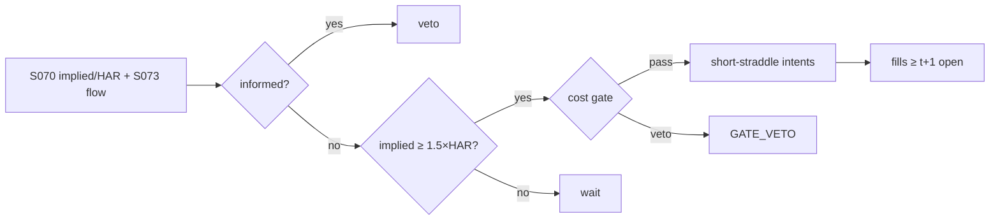

# T046 — Straddle-Implied Move Fade

Fades the event premium: before scheduled events, straddles price an implied move; when the implied move exceeds the HAR-realized forecast by the required multiple and the event passes, the strategy sells the inflated straddle and harvests the vol crush. Ederington–Lee (1993) document the post-news volatility shape; Pan–Poteshman (2006) warn that informed option flow exists. Provenance **[D]**.

> Tag law: every numeric literal in prose carries one of `[documented]
> [default] [example] [unverified] [internal-est] [measured]` (legend: Appendix
> i v1.0.0). Constants inside cited formulas inherit the formula's tag.
> Bibliographic years, volumes, pages, arXiv IDs, section numbers, rule codes
> (C1–C12), fail-safe codes (F1–F5), module IDs, and machine-parsed §0 data
> fields are identifiers, not literals, and are exempt.

## §1 Five-minute reviewer card

| Row | Value |
|---|---|
| Module | T046 — Straddle-Implied Move Fade, v1.0.0 |
| Edge verdict | `plausible` — event vol crush is the standard options-market seasonal; post-news vol shape documented (Ederington–Lee 1993) |
| After-cost | `narrow` — one binary event can erase a year of crushes — and informed flow (Pan–Poteshman) is the adverse selection |
| Build cost | Tier M = 20–60 h ≈ `$3,000–9,000` [documented] |
| Data cost | OPRA: mid four to five figures/yr [unverified] |
| latency_class | daily |
| risk_class | tail |
| Capacity | options-liquidity constrained per name [unverified] |
| Executability | needs OPRA + event calendar; the straddle mechanics are standard |
| Risk summary | Event binary risk (the move exceeds implied); informed flow adverse selection; vol surface dislocations |
| When it dies | when events stop being scheduled (they don't) — it dies name by name on binary outcomes |
| Regime gates | no entries when the S073 flow leg flags informed urgency; widen the multiple into macro events [example] |
| Emits | `order_intents` (Appendix C v1.0.0) — OrderTicket intents only, never orders |

## §1.5 Cheapest / least-build path

1. **Prototype hour band:** 4–8 h [example] — implied-move computation + event calendar + straddle execution.
2. **Cheapest-source row:** min_tier = OPRA; latency_class = daily;
   required_fields = option chains (straddle IV), event calendar, realized vol; price_band = `$0–500`/yr (indicative —
   verify before budgeting); build_or_buy = **build**.
3. **Resource budget:** Tier M per cost-model §5 = 20–60 h ≈ `$3,000–9,000` loaded at `$150`/hr [documented]; compute pattern `vectorized batch (polars/numpy)`.
4. **Skip list:** unscheduled-event trading; weekly-expiry scalping.
5. **DO-NOT-CUT list:** causality assertions (`assert fill_event >
   signal_event`, no-signal-bar-fills test); COST block + callable
   `expected_cost_bps`; F1–F5 fail-safes + module-state enum; kill-switch
   state machine + re-arm checklist; decision-log audit records;
   bona-fide-intent + self-trade prevention; provenance tags on every numeric
   literal; fixtures + `test_cmd`; secrets via env only.
6. **Escalation gate:** upgrade from cheapest when any holds — implied multiples compress structurally; informed-flow flags fire repeatedly.

## §T0 Module contract

### T0.1 Typed signature

```python
def emit(state: ModuleState, signals: list[SignalVector], cfg: Config) -> list[OrderTicket]:
```

`OrderTicket` per Appendix C v1.0.0 (intents only — never wire orders).
`state` is the module-owned named state vector (`implied_move, har_move, event_ts, position_greeks`); `signals` are
canonical SignalVectors (Appendix b v1.0.0) from the consumed S-modules, newest
last; the function emits zero or more intents per bar/event. Documented edge
cases: no signals → flat, no intents; `UNKNOWN` input signal → restrictive
(halve size / stand down per F1); kill-switch TRIPPED → emit nothing, state
`OFF`. 

### T0.2 Config dataclass

| Parameter | Type | Default | Range | Status |
|---|---|---|---|---|
| implied_mult | float | `1.5` | [1.2, 2.5] | [default] |
| event_window_d | int | `3` | [1, 7] | [default] |
| max_tenor_d | int | `14` | [7, 45] | [default] |
| cost_gate_k | float | `1.00` | [0.5, 2.0] | [default] |
| daily_loss_stop_pct | float | `2.0` | [1.0, 5.0] | [default] |

All defaults tagged per the tag law (status `default` ⇒ `[default]`).

### T0.3 Canonical schema mapping

Vendor columns → canonical Event/Bar schema (Appendix a v1.0.0), stated once here:

| Vendor column | Canonical field | Notes |
|---|---|---|
| option chain | Bar | straddle IV |
| event calendar | event | scheduled events |

### T0.4 Time contract

> Time contract: clock domain UTC, int64 ns; authoritative causality clock =
> `event_ts`; max_skew = `5` s [default]; jitter budget = `1` s [default];
> bar-label = open time; staleness TTL = `15` min [default]; gap policy = mask, no
> interpolation; halt/auction → discard contributions across reopen.

**Timing box:** `signal@t (daily bars, America/Chicago) → earliest fill @open(t+1)`

### T0.5 Market-state table

| State | Module behavior |
|---|---|
| CONTINUOUS_TRADING | Evaluate entry/exit rules; emit intents per §T2 |
| HALTED | Cancel working intents; emit nothing; state `UNKNOWN` until clean reopen |
| AUCTION | No new intents; hold intent-side state; state `DEGRADED` |
| CLOSED | Emit nothing; state `OFF` |


### T0.6 Module-state enum + error taxonomy

States per Appendix k v1.0.0: `OK | DEGRADED | UNKNOWN | OFF`. Invalid input →
`UNKNOWN`, never interpolate (Appendix f v1.0.0, F1–F5).

| Failure | State | Alert |
|---|---|---|
| Missing/stale input (TTL `15` min [default]) | `UNKNOWN` | page |
| Out-of-bounds indicator (F2) | `UNKNOWN` | page |
| Estimator disagreement (F3) | `UNKNOWN` | notify |
| Halt/auction per §T0.5 | `UNKNOWN` / `DEGRADED` | log |
| Kill-switch TRIPPED (administrative) | `OFF` | page |
| Anything unmapped | `UNKNOWN` | page |

### T0.7 Risk contract + kill switch

```yaml
risk_contract:
  per_trade_R: 250            # USD risk budget per trade [example]
  max_adverse_per_trade: 1.0 R [default]  # stop distance multiple [default]
  daily_loss_stop: 2% of equity [default]        # then no new entries; flatten managed risk [default]
  max_gross: 4× equity [default]              # hard gross exposure cap [default]
  kill_conditions:
    - daily P&L ≤ −daily_loss_stop_pct → TRIP (flatten premium)
    - informed-flow flag on 2 open names → TRIP
    - decision-log write failure → TRIP (halt emission)
  enforcement: intraday-hard  # trips are automatic, not advisory [default]
  calibration_recipe: >
    Walk-forward on 60-day blocks [example]: fit thresholds on block t,
    freeze, validate realized shortfall vs predicted on block t+1;
    shrink per-trade R until max drawdown < daily_loss_stop/2 [default].
```

**Kill-switch state machine:** `ARMED → TRIPPED → RECOVERY → ARMED`.

- `ARMED`: normal operation; every bar evaluates the kill conditions.
- `TRIPPED`: any kill condition fires → cancel all working intents
  (`NEW`/`WORKING` → `CANCELLED`, idempotent), flatten managed positions via
  the exit rule, emit nothing new, state `OFF`, log `KILL_TRIP`.
- `RECOVERY`: manual operator review only — no automatic transition.
- `ARMED` (re-entry): only after the re-arm checklist passes in full, logged
  as `KILL_REARM` with the checklist result.

**Re-arm checklist** (all must be true):

- [ ] Feed health green: all §T5 inputs fresh inside the staleness TTL.
- [ ] Kill condition cleared: the tripping metric is back inside limits for `30 min [default]` [default].
- [ ] Decision log reconciled: `KILL_TRIP` record present and hash chain intact.
- [ ] Risk re-check: per-trade R and gross caps re-confirmed against current equity.
- [ ] Operator sign-off: named human approves re-arm (no automatic recovery).

### T0.8 Ops tail

- **Schedule:** nightly batch; owner: strategy owner (named).
- **Health checks:** fixture replay (`test_cmd`) green on deploy; live
  decision-log append monitor; kill-switch state heartbeat.
- **Alert table:** `UNKNOWN`/`OFF` state transitions; kill-trip pages immediately [default].
- **Resource budget:** nightly batch: < 2 vCPU-h, < 4 GB RAM [example].
- **Runbook stub:** 1) confirm kill-state; 2) inspect decision log for the tripping record; 3) verify feed freshness; 4) re-arm checklist (operator sign-off); 5) re-run fixture; 6) resume..

### T0.9 Secrets (env-only)

- `BROKER_API_KEY (paper venue, env-only)`
- `DATA_API_KEY (env-only)` via environment only. No secrets in this file, fixtures, or
logs (CI secrets-grep).

### T0.10 May / must-NOT

> **May:** emit `OrderTicket` intents per Appendix C v1.0.0; track intent-side
> state (`NEW → WORKING → FILLED / CANCELLED / PARTIAL`); issue cancel-replace
> via new tickets with new `ticket_id`s. **Must-NOT:** place orders on any
> venue, hold broker/exchange sessions, net intents into orders inside the
> strategy, treat the intent-side state machine as broker wire truth, or emit
> prices/share-counts/notionals outside an `OrderTicket`.

## §T1 Legacy (subsumed by §1)

Legacy §T1 content is the §1 reviewer card above; this header is retained so
section numbering stays frozen.

## §T2 Specification

### Universe

Names with liquid short-dated options and scheduled events (earnings, FDA, macro [example]).

### Entry rule (Boolean — no prose-only conditions)

```
implied_move = straddle_price / spot                      # [example]
har_move = har_forecast * sqrt(event_window)             # Corsi [documented]
ENTRY = implied_move >= implied_mult * har_move and event in window and not informed_flag
```

### Exits (with post-exit cooldown)

```
event passes -> vol crush realized -> FLAT into the crush
move exceeds implied -> stop out (thesis broken), hard stop
expiry -> never hold into expiry weekend without review
```

### Position sizing (fenced function)

```python
def size_straddle(risk_R_usd, stop_bps, px, adv_shares, cfg):
    # binary-event sized: risk the premium, not the notional
    raw = risk_R_usd / (stop_bps / 1e4 * px)
    return min(raw * 0.5, cfg.adv_cap_pct / 100 * adv_shares)
```

### Risk limits

| Limit | Value |
|---|---|
| Max premium at risk/name | `$1k` [example] — binary sized |
| Implied multiple | `1.5×` [default] |
| Informed-flow veto | hard [default] |

### COST block (single source of truth)

Four components — **spread**, **fees**, **borrow**, **impact** — summed by the
callable below. Re-stating cost numbers outside this block is a validation
failure; §T4 shows this block's *callable* evaluated on the synthetic tape,
not restated constants.

| Component | Value (bps) | Basis |
|---|---|---|
| Spread (half, straddle) | `5.00` | options are wide [example] |
| Fees (per contract) | `1.00` | [example] |
| Borrow | `0.00` | short premium, delta-hedged [example] |
| Impact | `k·√(adv_pct/100)`, k=`20.0` | [example] |
| **Total reference (one-way)** | `~`26` one-way premium terms [example]` | [example] |

`fee_schedule_as_of`: `2026-09-01 (placeholder — pin the real venue schedule before production)` — placeholder; pin the real venue
schedule before production. `side`: `taker`; venue/tier/source:
options exchange [example].

```python
def expected_cost_bps(notional, adv_pct, venue, side, urgency, cfg):
    """COST-block callable. Short-premium economics: wide spreads dominate."""
    spread = cfg.spread_full_bps / 2.0
    fee = cfg.taker_fee_bps
    borrow = 0.0                                       # short straddle: no stock borrow
    impact = cfg.impact_k * math.sqrt(max(adv_pct, 0.0) / 100.0)
    if urgency == "high":
        impact *= 1.5
    return spread + fee + borrow + impact
```

### Execution / fill model table

| Aspect | Assumption |
|---|---|
| Fill venue | options exchange, straddle as two legs |
| Slippage model | mid ± half-spread per leg |
| Partial fills | both legs must fill — leg risk |
| Halt behavior | no entries into halted underlyings |

Fine-grained fill behavior is synthetic and labeled `simulated only — requires MBO/ITCH`:
no MBO/ITCH feed is consumed by this module; any fill realism beyond the
mid-price ± half-spread fill model above would require MBO/ITCH data.

### Robustness

Perturb thresholds ±20% [example]; the reference behavior (entry/exit intents, gate blocks, kill trip) must be invariant; degrade entry→no-trade on indicator breach.

**Pricing/Greeks (options-domain conditional).** Short straddle: delta ≈ `0` [example]
at inception [example] (delta-hedged per the hedge rule); gamma < `0`, vega < `0`, theta
> `0` [example] — the position is short realized volatility. Expiry/assignment: never hold short
premium into expiry without review; early assignment risk on short American calls/puts
around dividends — the exit rule flattens before the assignment window.

### Compliance sub-block (C1–C12)

| Code | Rule: trigger → check → action → log |
|---|---|
| C1 | STP + self-match prevention: trigger = intent could match our own resting interest → check = every ticket carries `self_trade_prevention: true`; maker modules compare against own open tickets → action = cancel own resting quote before posting the aggressive side; cancel-replace via new `ticket_id` only → log = `COMPLIANCE_BLOCK` with rule code `C1` |
| C2 | Bona-fide intent: trigger = entry rule fires → check = cost gate passes AND qty within risk limits AND (SHORT ⇒ `locate_ok`) → action = veto the intent if any check fails; no quote entered without intent to trade → log = `GATE_VETO` with the failed check |
| C3 | Message-rate / cancel-to-trade: trigger = intents+ cancels per symbol per minute exceed `120` [default] → check = rolling `60`-s [default] message counter → action = throttle to `1` intent per `10` s [default] and alert → log = `COMPLIANCE_BLOCK` with the counter value |
| C4 | Pre-trade fat-finger trio: trigger = any new intent → check = (a) limit within `±±10%` of reference [default], (b) ticket notional ≤ ``$2M`` [default], (c) ≤ `20` tickets per `1 min` [default] → action = block the ticket, alert → log = `COMPLIANCE_BLOCK` with the breached leg |
| C5 | Decision-log schema (Appendix g v1.0.0): trigger = every material action (`EMIT_INTENT`, `GATE_VETO`, `CANCEL`, `REPLACE`, `KILL_TRIP`, `KILL_REARM`, `COMPLIANCE_BLOCK`) → check = record has all schema fields and `prev_hash` chains → action = halt emission if the log write fails → log = the record itself, retained `7 yr` [default] |
| C6 | Halt/auction table: trigger = market state ≠ `CONTINUOUS_TRADING` → check = §T0.5 table → action = `HALTED`: cancel working intents, emit nothing; `AUCTION`: no new intents; `CLOSED`: state `OFF` → log = state-transition record |
| C7 | Locate check (short sales): trigger = `SHORT` intent → check = `locate_ok` from the pre-open easy-to-borrow list or desk locate; Reg-SHO threshold securities hard-blocked → action = veto without locate → log = `GATE_VETO` with code `C7`. Short premium; delta hedges may be short — hedges need locate_ok (C7). |
| C8 | Public-dissemination gate: trigger = any export of signals/intents outside the firm → check = review gate sign-off → action = block unreviewed exports → log = `COMPLIANCE_BLOCK` |
| C9 | Data-entitlement assertions (Appendix j v1.0.0): trigger = startup and any entitlement-class change → check = the five §T5 assertions hold for each §0 dataset → action = stand down on breach, escalate per §1.5 → log = entitlement review record |
| C10 | Post-exit cooldown: trigger = exit or compliance block → check = `now >= cooldown_until` (`1 session [default]` [default]) → action = suppress re-entry until the cooldown elapses → log = `GATE_VETO` with code `C10` |
| C11 | Kill-switch integration: trigger = `TRIPPED` → check = all working intents transitioned `NEW`/`WORKING` → `CANCELLED` (idempotent) → action = no new intents until `ARMED` via the §T0.7 checklist → log = `KILL_TRIP` / `KILL_REARM` records |
| C12 | C12 Event-concentration: trigger = > 3 event names same day [example] → check = concentration review → action = cap → log with code `C12` |

### Parameter table

| Parameter | Symbol | Value | Tag | Sensitivity |
|---|---|---|---|---|
| Implied multiple | m | `1.5` | [default] | critical — the edge threshold |
| Event window | W | `3` days | [default] | medium |
| Max tenor | T | `14` days | [default] | medium — crush decays with tenor |

### Timing box

`signal@t (daily bars, America/Chicago) → earliest fill @open(t+1)`

## §T3 Math + normative pseudocode

Ederington–Lee (1993) [documented]: scheduled news — most price adjustment
within the first minute, volatility elevated ~15 minutes; the empirical shape behind
fading event premium after the news. Pan–Poteshman (2006) [documented]: non-public
open-buy put/call ratios predicted >40 bp next-day and >1% next-week spreads — informed
option flow exists and is the adverse selection this fade must dodge. Cboe VIX
methodology [documented]: the model-free variance construction behind the IV side.

**Normative pseudocode** (pseudocode is normative; prose is commentary):

```
def emit(state, signals, cfg):
    sig = primary(signals, "S070")          # implied vs HAR move
    if sig is None or invalid(sig): return [], state.unknown()
    if state.position != 0:
        if sig.event_passed or sig.move_exceeded or stopped(state, cfg):
            return exit_tickets(state), state.flat()
        return delta_hedge(state), state.ok()
    if sig.implied_move >= cfg.implied_mult * sig.har_move and not sig.informed_flag:
        cost = expected_cost_bps(notional(), adv_pct(), venue(), "taker", "normal", cfg)
        # ^^^ normative cost-gate predicate: expected_cost_bps(...) <= k * edge_bps
        if cost <= cfg.cost_gate_k * sig.edge_bps:
            t1 = OrderTicket.intent("SELL", qty=size_straddle(...), limit=px_call())
            t2 = OrderTicket.intent("SELL", qty=size_straddle(...), limit=px_put())
            for t in (t1, t2): t.intent_ts = sig.computed_at
            assert fill_event > signal_event  # t->t+1 causality: no-signal-bar fills
            return [t1, t2], state.open("SHORT_STRADDLE")
        log("GATE_VETO", cost=cost)
    return [], state.ok()
```

Causality: every feature uses inputs with `event_ts ≤ t` only; the earliest
fill for a bar-`t` intent is bar `t+1`'s open. Mandatory unit test:
no-signal-bar fills.

## §T4 Worked example (fixture-backed)

- Tape: `modules/fixtures/T046_tape.csv` — `# TYPE: validation-run`;
  `12` synthetic bars (seed `4460` [example]); `event_ts`/`asof_ts` int64 ns
  UTC; every number synthetic.
- Expected outputs: `modules/fixtures/T046_expected.csv` — per-bar intent,
  quantity, the **cost-function call** (`expected_cost_bps` inputs → bps →
  dollars), cost-gate verdict, and module state.
- Tolerance: `1e-9` [default] on floats; integer quantities exact.
- Acceptance tests (`modules/tests/test_T046.py` — `6` [default] tests):
  1. TYPE header + columns present; 2. fixture recomputes to expected
  (reference `process_bar` vs expected CSV); 3. no-signal-bar fills
  (`assert fill_event > signal_event`); `4.` cost-gate predicate passes on large edge, blocks on tiny edge (`k = 0.5` [default]);
  5. kill-switch trip blocks intents, re-arm checklist restores `ARMED`;
  6. invalid input (halted/invalid bar) → `UNKNOWN`, no intents.
- `test_cmd`: `python3 -m pytest modules/tests/test_T046.py -q` → exits `0` [default].

**Cost-function calls on the tape** (the COST-block callable evaluated on
synthetic rows — inputs → bps → dollars; all values [example]):

| Bar | `expected_cost_bps` inputs | Components → total → $ | Cost gate `expected_cost_bps(...) <= k * edge_bps` | Intent / state |
|---|---|---|---|---|
| `0` | notional=`200000` [example], adv_pct=`0.5` [example], venue=`primary`, side=`taker`, urgency=`normal` | spread `5.0` + fee `1.0` + borrow `0.0` + impact `1.41` = `7.41` bps → `$148.28` | `2.0` edge, k=`0.5` [default] → `7.41 ≤ 1.0` BLOCK | `HOLD` / `OK` |
| `3` | notional=`200000` [example], adv_pct=`0.5` [example], venue=`primary`, side=`taker`, urgency=`normal` | spread `5.0` + fee `1.0` + borrow `0.0` + impact `1.41` = `7.41` bps → `$148.28` | `29.65685424949238` edge, k=`0.5` [default] → `7.41 ≤ 14.83` PASS | `SHORT` / `OK` |
| `6` | notional=`200000` [example], adv_pct=`0.5` [example], venue=`primary`, side=`taker`, urgency=`normal` | spread `5.0` + fee `1.0` + borrow `0.0` + impact `1.41` = `7.41` bps → `$148.28` | `3.0` edge, k=`0.5` [default] → `7.41 ≤ 1.5` BLOCK | `BUY` / `OK` |
| `7` | notional=`200000` [example], adv_pct=`0.5` [example], venue=`primary`, side=`taker`, urgency=`normal` | spread `5.0` + fee `1.0` + borrow `0.0` + impact `1.41` = `7.41` bps → `$148.28` | `0.05` edge, k=`0.5` [default] → `7.41 ≤ 0.03` BLOCK | `HOLD` / `OK` |
| `9` | notional=`200000` [example], adv_pct=`0.5` [example], venue=`primary`, side=`taker`, urgency=`normal` | spread `5.0` + fee `1.0` + borrow `0.0` + impact `1.41` = `7.41` bps → `$148.28` | `8.0` edge, k=`0.5` [default] → `7.41 ≤ 4.0` BLOCK | `HOLD` / `OFF` |

**Hand-checks.** Row `3` (entry): qty = `250 / (25/1e4 × 50.12)` = `1995` raw → ADV-capped at `20000` → `1995` shares [example]; ticket `T0003`, side `SHORT`, `marketable` intent. Row `6` (exit): |z| through the exit band → `SHORT` intent, exits never cost-gated [default]. Row `7` (gate block): edge `0.05` bps [example] vs cost `7.41` bps → gate `7.41 ≤ 0.025` BLOCKS → no intent, state stays `OK`. Row `9` (kill): daily P&L `-2.1%` [example] ≤ −stop (`2.0%` [default]) → `ARMED → TRIPPED`, state `OFF`, no intents. Causality: entry intent at row `3` has `intent_ts` = bar-3 `event_ts`; the earliest fill is bar `4`'s open — the test asserts `fill_event > signal_event` on every intent row.

**Where the example is optimistic.** Costs are the COST-block model, not realized fills; capacity, borrow squeezes, and regime shifts are not in the tape.

## §T5 Dependencies + data

### Consumed signals (from deps.yaml — machine edge list)

| Signal | Version pin | Role |
|---|---|---|
| S070 | 1.0.0 | primary |
| S073 | 1.0.0 | confirm |
| S069 | 1.0.0 | gate |

### Pinned formula excerpts (≤10 lines each, CI hash-checked)

**S070** (v1.0.0): `implied_move = straddle_mid / spot` [documented].
**S069** (v1.0.0): term-structure vol gate [documented].

### Data required

| Field | Type | Granularity | Source tier | Notes |
|---|---|---|---|---|
| option chains | float | daily | OPRA | straddle IV |
| event calendar | event | daily | CAL | scheduled events |
| realized vol | float | daily | DAILY | HAR forecast |

**Data rights row** (Appendix j v1.0.0): OPRA licensed per professional subscriber; event calendar per vendor; entitlements re-asserted at startup.

## §T6 Local build + buy vs build

Straddle pricing + event calendar: standard. The informed-flow veto (S073) is the research work.

| Route | What you get | Verdict |
|---|---|---|
| Build | fade logic in-house | recommended |
| Buy | OPRA + event calendar | required |

**Verdict:** Build the fade; buy OPRA. The veto is the edge.

## §T7 Efficacy — documented evidence

| Study / source | Market & period | Metric | Before/after cost | Caveat |
|---|---|---|---|---|
| Ederington–Lee (1993) | scheduled news | post-news vol shape | before cost | the crush's empirical shape |
| Pan–Poteshman (2006) | US options 1990–2001 | informed option flow predicts returns | before cost | the adverse-selection warning |
| Cboe (methodology) | market | model-free variance construction | n/a | specification |

**Selection disclosure:** Studies below are the chapter's documented sources only — no post-hoc selection from a wider literature search.

**Capacity & decay.** Edge decays with crowding and regime shifts; treat any printed Sharpe as a pre-cost, in-sample-era artifact unless the source says otherwise.

**Honest bottom line.** Honest bottom line: selling event premium is a well-paid trade until the one event that isn't — size for the binary, veto informed flow, and never confuse a streak of crushes with edge.

## §T8 Failure modes & pitfalls

| # | Trigger → Detect → Action → Recovery | check: |
|---|---|---|
| 1 | Binary event (move > implied) → detect → stop out immediately → review name → log | check: binary-hit rate |
| 2 | Informed flow → detect S073 flag → veto entry / flatten → alert | check: veto rate |
| 3 | Vol surface dislocation → detect straddle misprice vs surface → stand down → review | check: surface diagnostics |
| 4 | Early assignment → detect dividend/assignment window → flatten before → log | check: assignment calendar |

## §T9 Regime gates + visuals

**Provisional regime-gate machine** (restrictive default; `regime_ids` stay
empty until the R001–R050 annotation pass):

| regime_id | direction | mechanism | condition | action | min_lag | unknown_behavior |
|---|---|---|---|---|---|---|
| R001 | veto | informed flow | S073 flag fires | no entries, flatten | immediate | restrictive |
| R002 | widen | macro events | FOMC/CPI week [example] | multiple 1.5→2.0 | 1 day | restrictive |



## §T10 Source log + unverified leads

**Sources** (citable facts only):

1. Ederington, L. H. & Lee, J. H. (1993). "How Markets Process Information: News Releases and Volatility." *Journal of Finance* 48(4), 1161–1191
2. Pan, J. & Poteshman, A. M. (2006). "The Information in Option Volume for Future Stock Prices." *Review of Financial Studies* 19(3), 871–908
3. Cboe. "Cboe Volatility Index — Methodology." — https://cdn.cboe.com/resources/indices/Volatility_Index_Methodology_Cboe_Volatility_Index.pdf

**Chatbot source log.** Grok answered the Q-batch (2026-09-10); all claims independently verified or labeled unverified. Chatbot output is leads, never facts.

**Unverified leads** (chatbot-only — never in evidence tables):

- Grok (2026-09-10, Q-TB5): straddle-fade P&L magnitudes — *unverified chatbot claims*.
- Unscheduled-event trading — research lead, not validated.

---

## Appendix — AI build prompt (T046)

Copy-paste into any chat agent:

> Build module **T046 — Straddle-Implied Move Fade** per `notes/module-template.md` v1.0.0 and
> this file's §T0 contract.
> Cheapest path (§1.5): prototype 4–8 h [example]; cheapest data candidate
> OPRA; compute pattern `vectorized batch (polars/numpy)`; u.
> Implement `emit(state, signals, cfg) -> list[OrderTicket]` (Appendix c
> v1.0.0) with the §T3 normative pseudocode, including the cost-gate predicate
> `expected_cost_bps(...) <= k * edge_bps` and `assert fill_event >
> signal_event`. Emit intents only — never place orders. Wire F1–F5
> (Appendix f v1.0.0): invalid input → `UNKNOWN`, never interpolate. Kill
> switch `ARMED → TRIPPED → RECOVERY → ARMED` with the §T0.7 re-arm checklist.
> Log decisions per Appendix g v1.0.0. Secrets via env only. Run the fixture
> `modules/fixtures/T046_tape.csv` (`# TYPE: validation-run`) against
> `modules/fixtures/T046_expected.csv` (tolerance `1e-9` [default]).
> **Definition of done:** `python3 -m pytest modules/tests/test_T046.py -q` exits `0` [default]. Tag every numeric literal
> you add with the unified enum (Appendix i v1.0.0); put anything unverifiable
> in §T10 unverified leads.
