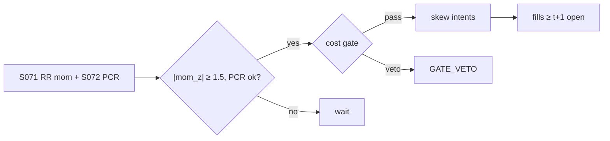

# T047 — Risk-Reversal Skew Momentum

Trades momentum in risk-reversal skew: when the 25-delta risk reversal (call IV minus put IV) trends — steepening put skew — the strategy follows the skew momentum, confirmed by the put/call-ratio leg. Conrad et al. (2013) support trading on ex-ante skewness levels; Dennis–Mayhew (2002) warn the put/call-ratio confirmation is fragile — hence it is a confirm, not a driver. Provenance **[D]**.

> Tag law: every numeric literal in prose carries one of `[documented]
> [default] [example] [unverified] [internal-est] [measured]` (legend: Appendix
> i v1.0.0). Constants inside cited formulas inherit the formula's tag.
> Bibliographic years, volumes, pages, arXiv IDs, section numbers, rule codes
> (C1–C12), fail-safe codes (F1–F5), module IDs, and machine-parsed §0 data
> fields are identifiers, not literals, and are exempt.

## §1 Five-minute reviewer card

| Row | Value |
|---|---|
| Module | T047 — Risk-Reversal Skew Momentum, v1.0.1 |
| Edge verdict | `NO-DOCUMENTED-EDGE` — ex-ante skew *levels* inform expected returns (Conrad et al. 2013); the ΔRR *momentum* overlay this module trades has no documented backtest; Dennis–Mayhew (2002) document no robust skew–PCR relationship, the caveat on the confirm leg |
| After-cost | `BEFORE-COST` — no documented after-cost P&L; the overlay is practitioner craft; the synthetic tape is the only measured artifact |
| Build cost | Tier M · `20–60` h [documented] · `$3,000–9,000` loaded at `$150`/hr [documented] (notes/cost-model.md §5) |
| Data cost | Research: PCR leg `$0`/mo [documented] (Cboe publishes daily put/call ratios free on its daily market statistics page) + vendor EOD option chains (price band [unverified] — verify before budgeting). Production: OPRA via vendor — professional Subscriber Indirect Access Fee `$600`/mo [documented], Category 1 non-display use `$2,000`/mo per enterprise [documented] — plus vendor feed fees [unverified]; re-check the current OPRA fee schedule before budgeting |
| latency_class | daily |
| risk_class | market |
| Capacity | `max_notional = f(participation_cap, ADV, spread_regime)`: options-package depth caps single-name skew notional ≈ `$1M` [example] [unverified] — calibrate per name; index/single-name books separate |
| Executability | needs OPRA surface construction; the momentum rule is trivial |
| Risk summary | Skew mean-reverts without warning; the ΔRR momentum overlay has no academic backing; crash-risk concentration on the short-put leg |
| When it dies | skew-regime flips (momentum inverts); vol events that reprice the whole surface; surface dislocations that contaminate the 25Δ RR read |
| Regime gates | provisional: `veto` on RR-momentum inversion (autocorr < `0` [default]); `halve` on vol events; `pause_entry` on surface dislocation (see §T9 machine records) |
| Emits | `order_intents` (Appendix C v1.0.0) — OrderTicket intents only, never orders |

## §1.5 Cheapest / least-build path

1. **Prototype hour band:** `4–8` h [example] — vol-surface construction + RR momentum + skew execution.
2. **Cheapest-source row:** min_tier = vendor-bundled OPRA EOD chains (research) / vendor real-time OPRA (production);
   latency_class = EOD daily (research) / real-time (production);
   required_fields = EOD option chains with 25Δ call/put bid-ask IVs (or quotes), Cboe daily put/call ratios (free, daily, one-session lag [documented]);
   price_band = research `$0–500`/mo [internal-est] (PCR `$0` [documented]; vendor EOD chains [unverified] — verify before budgeting), production OPRA `$600`/mo indirect professional access [documented] + `$2,000`/mo per enterprise Category 1 non-display [documented] + vendor feed fees [unverified];
   build_or_buy = **build the RR engine, buy the feed** (the momentum rule is a z-score; the value is the surface construction).
3. **Resource budget:** Tier M · `20–60` h [documented] · `$3,000–9,000` loaded at `$150`/hr [documented] (notes/cost-model.md §5); compute pattern `vectorized batch (polars/numpy)`; nightly batch < `2` vCPU-h, < `4` GB RAM [example].
4. **Skip list:** exotic skew measures; intraday skew; full Markov surface estimator; complex-order leg-hedging automation.
5. **DO-NOT-CUT list:** causality assertions (`assert fill_event >
   signal_event`, no-signal-bar-fills test); COST block + callable
   `expected_cost_bps`; F1–F5 fail-safes + module-state enum; kill-switch
   state machine + re-arm checklist; decision-log audit records;
   bona-fide-intent + self-trade prevention; post-exit cooldown (C10);
   provenance tags on every numeric literal; fixtures + `test_cmd`;
   secrets via env only.
6. **Escalation gate:** upgrade from cheapest when any holds — (a) the `20`-day
   [default] RR-momentum autocorrelation ≤ `0` [default] → the overlay is inverted: kill it or invert per the §T9 R-SKEW-FLIP gate; (b) live trading needs intraday RR reads → upgrade from EOD to vendor real-time OPRA; (c) the desk requires measured per-contract fees → pin the venue fee schedule and re-derive `taker_fee_bps` via the per-contract → bps conversion; (d) the cost gate fails on `[measured]` costs.

## §T0 Module contract

### T0.1 Typed signature

```python
def emit(state: ModuleState, signals: list[SignalVector], cfg: Config) -> list[OrderTicket]:
```

`OrderTicket` per Appendix C v1.0.0 (intents only — never wire orders).
`state` is the module-owned named state vector (`rr_level, rr_momentum, position_greeks`); `signals` are
canonical SignalVectors (Appendix b v1.0.0) from the consumed S-modules, newest
last; the function emits zero or more intents per bar/event. Documented edge
cases: no signals → flat, no intents; `UNKNOWN` input signal → restrictive
(halve size / stand down per F1); kill-switch TRIPPED → emit nothing, state
`OFF`. 

### T0.2 Config dataclass

| Parameter | Type | Default | Range | Status |
|---|---|---|---|---|
| rr_tenor_d | int | `30` | [7, 90] | [default] |
| mom_window_d | int | `20` | [5, 60] | [default] |
| pcr_window_d | int | `20` | [5, 60] | [default] |
| pcr_z_min | float | `0.5` | [0.0, 2.0] | [default] |
| entry_z | float | `1.5` | [1.0, 2.5] | [default] |
| z_exit | float | `0.5` | [0.0, 1.0] | [default] |
| cost_gate_k | float | `0.5` | [0.5, 2.0] | [default] |
| risk_R_usd | float | `250.0` | [50, 2000] | [example] |
| adv_cap_pct | float | `1.0` | [0.1, 10.0] | [default] |
| cooldown_s | float | `86400.0` | [0, 604800] | [default] |
| spread_full_bps | float | `8.0` | [2, 30] | [example] |
| taker_fee_bps | float | `1.0` | [0, 5] | [example] |
| impact_k | float | `20.0` | [5, 50] | [example] |
| daily_loss_stop_pct | float | `2.0` | [1.0, 5.0] | [default] |

All defaults tagged per the tag law (status `default` ⇒ `[default]`, status
`example` ⇒ `[example]`). This is the single Config dataclass: the
cost-block calibration params (`spread_full_bps`, `taker_fee_bps`,
`impact_k`) live here and are referenced by the COST-block callable, never
restated.

### T0.3 Canonical schema mapping

Vendor columns → canonical Event/Bar schema (Appendix a v1.0.0), stated once here:

| Vendor column | Canonical field | Notes |
|---|---|---|
| option chain | Bar | 25Δ RR read per bar |
| underlying / expiry / strike / bid / ask | Bar fields | joined on (underlying, expiry); 25Δ legs interpolated from the chain |
| put/call ratio | Bar | S072 confirm (Cboe daily market statistics) |

### T0.4 Time contract

> Time contract: clock domain UTC, int64 ns; authoritative causality clock =
> `event_ts`; dual timestamps (`event_ts`, `asof_ts`) with `asof_ts >= event_ts`
> [rule]; max_skew = `5` s [default]; jitter budget = `1` s [default];
> bar-label = open time; staleness TTL = `15` min [default]; gap policy = mask, no
> interpolation; halt/auction → discard contributions across reopen.

**Timing box:** `signal@t (daily bars, America/Chicago) → earliest fill @open(t+1)`

### T0.5 Market-state table

| State | Module behavior |
|---|---|
| CONTINUOUS_TRADING | Evaluate entry/exit rules; emit intents per §T2 |
| HALTED | Cancel working intents; emit nothing; state `UNKNOWN` until clean reopen |
| AUCTION | No new intents; hold intent-side state; state `DEGRADED` |
| CLOSED | Emit nothing; state `OFF` |


### T0.6 Module-state enum + error taxonomy

States per Appendix k v1.0.0: `OK | DEGRADED | UNKNOWN | OFF`. Invalid input →
`UNKNOWN`, never interpolate (Appendix f v1.0.0, F1–F5).

| Failure | Code | State | Alert |
|---|---|---|---|
| Missing/stale input (TTL `15` min [default]) | F1, F4 | `UNKNOWN` | page |
| Out-of-bounds indicator (NaN IV, RR outside IV bounds, PCR < `0` [default]) | F2 | `UNKNOWN` | page |
| Estimator disagreement (F3) | F3 | `UNKNOWN` | notify |
| Halt/auction per §T0.5 | F1 | `UNKNOWN` / `DEGRADED` | log |
| Kill-switch TRIPPED (administrative) | — | `OFF` | page |
| Anything unmapped | — | `UNKNOWN` | page |

### T0.7 Risk contract + kill switch

```yaml
risk_contract:
  per_trade_R: 250            # USD risk budget per trade [example]
  max_adverse_per_trade: 1.0 R [default]  # stop distance multiple [default]
  daily_loss_stop: 2% of equity [default]        # then no new entries; flatten managed risk [default]
  max_gross: `4`× equity [default]              # hard gross exposure cap [default]
  kill_conditions:
    - daily P&L ≤ −daily_loss_stop_pct → TRIP (flatten skew)
    - surface dislocation with open risk → TRIP
    - decision-log write failure → TRIP (halt emission)
  enforcement: intraday-hard  # trips are automatic, not advisory [default]
  calibration_recipe: >
    Walk-forward on `60`-day blocks [example]: fit thresholds on block t,
    freeze, validate realized shortfall vs predicted on block t+1;
    shrink per-trade R until max drawdown < daily_loss_stop/2 [default].
```

**Kill-switch state machine:** `ARMED → TRIPPED → RECOVERY → ARMED`.

- `ARMED`: normal operation; every bar evaluates the kill conditions.
- `TRIPPED`: any kill condition fires → cancel all working intents
  (`NEW`/`WORKING` → `CANCELLED`, idempotent), flatten managed positions via
  the exit rule, emit nothing new, state `OFF`, log `KILL_TRIP`.
- `RECOVERY`: manual operator review only — no automatic transition.
- `ARMED` (re-entry): only after the re-arm checklist passes in full, logged
  as `KILL_REARM` with the checklist result.

**Re-arm checklist** (all must be true):

- [ ] Feed health green: all §T5 inputs fresh inside the staleness TTL.
- [ ] Kill condition cleared: the tripping metric is back inside limits for `30` min [default].
- [ ] Decision log reconciled: `KILL_TRIP` record present and hash chain intact.
- [ ] Risk re-check: per-trade R and gross caps re-confirmed against current equity.
- [ ] Operator sign-off: named human approves re-arm (no automatic recovery).

### T0.8 Ops tail

- **Schedule:** nightly batch; owner: strategy owner (named).
- **Health checks:** fixture replay (`test_cmd`) green on deploy; live
  decision-log append monitor; kill-switch state heartbeat.
- **Alert table:** `UNKNOWN`/`OFF` state transitions; kill-trip pages immediately [default].
- **Resource budget:** nightly batch: < `2` vCPU-h, < `4` GB RAM [example].
- **Runbook stub:** 1) confirm kill-state; 2) inspect decision log for the tripping record; 3) verify feed freshness; 4) re-arm checklist (operator sign-off); 5) re-run fixture; 6) resume..

### T0.9 Secrets (env-only)

- `BROKER_API_KEY (paper venue, env-only)`
- `DATA_API_KEY (env-only)` via environment only. No secrets in this file, fixtures, or
logs (CI secrets-grep).

### T0.10 May / must-NOT

> **May:** emit `OrderTicket` intents per Appendix C v1.0.0; track intent-side
> state (`NEW → WORKING → FILLED / CANCELLED / PARTIAL`); issue cancel-replace
> via new tickets with new `ticket_id`s. **Must-NOT:** place orders on any
> venue, hold broker/exchange sessions, net intents into orders inside the
> strategy, treat the intent-side state machine as broker wire truth, or emit
> prices/share-counts/notionals outside an `OrderTicket`.

## §T1 Legacy (subsumed by §1)

Legacy §T1 content is the §1 reviewer card above; this header is retained so
section numbering stays frozen.

## §T2 Specification

### Universe

Names with liquid 25-delta options; index and single-names calibrated separately.

### Entry rule (Boolean — no prose-only conditions)

```
RR_t   = IV(25Δ call) − IV(25Δ put)                    # risk reversal, 30d [default] tenor
mom_t  = (RR_t − mean(RR, W)) / std(RR, W)             # skew momentum z, W = mom_window_d
pcr_t  = put_volume_t / call_volume_t                 # S072 confirm input
pcr_z  = (pcr_t − mean(pcr, W_pcr)) / std(pcr, W_pcr)  # PCR z, W_pcr = pcr_window_d

pcr_confirms = (sign(mom_t) == sign(pcr_z)) AND (|pcr_z| ≥ pcr_z_min)
momentum_on  = |mom_t| ≥ entry_z
market_ok    = (market_state == CONTINUOUS_TRADING)
kill_ok      = (kill_state == ARMED)
cooldown_ok  = (event_ts > cooldown_until)             # C10 post-exit cooldown
cost_ok      = (expected_cost_bps(notional, adv_pct, venue, side, urgency, cfg)
                ≤ cost_gate_k × edge_bps)              # normative cost gate

ENTRY = momentum_on AND pcr_confirms AND market_ok AND kill_ok AND cooldown_ok AND cost_ok
side  = "BUY" if mom_t > 0 else "SELL"                # follow skew momentum
```

`sign(0)` is `0`; a zero `mom_t` fails `momentum_on` first, so the
`sign` comparison never admits a zero-momentum entry. The RR package is a
long 25Δ call / short 25Δ put for `BUY`, the inverse for `SELL`.

### Exits (with post-exit cooldown)

```
EXIT = (|mom_t| ≤ z_exit)                              # momentum faded
     OR (surface_dislocated)                           # arb violation / spread blowout
     OR (adverse_move ≥ stop_distance)                 # stop: |px − entry_px| / entry_px ≥ stop_bps/1e4
on EXIT: emit flattening intent (never cost-gated [default]);
         cooldown_until := event_ts + cooldown_s      # C10: 1 session [default]
```

### Position sizing (fenced function)

Canonical signature — `shares = f(risk_budget_R, stop_distance, vol_estimate, ADV_cap, cost)`:

```python
def size_shares(risk_budget_R, stop_distance, vol_estimate, ADV_cap, cost_bps):
    """Shares of the RR package to trade.

    risk_budget_R : dollars of risk capital per trade [USD]
    stop_distance : fractional stop (stop_bps / 1e4) [ratio]
    vol_estimate  : {"px": float} reference price for the dollar conversion
    ADV_cap       : max shares from the ADV participation cap [shares]
    cost_bps      : COST-callable output [bps]; carried for the contract —
                    the MVB reference does not shrink size on cost
    """
    qty = risk_budget_R / max(stop_distance * vol_estimate["px"], 1e-9)
    return max(1, int(min(qty, ADV_cap)))
```

`stop_distance` comes from the bar (`stop_bps / 1e4`); `ADV_cap =
adv_cap_pct / 100 × adv_shares`. The v1.0.0 momentum-conviction multiplier
was removed in v1.0.1 — it disagreed with the fixture reference; conviction
scaling is reserved for a calibrated variant.

### Risk limits

| Limit | Value |
|---|---|
| Max skew notional/name | `$1M` [example] |
| Max adverse per trade | `1.0` R [default] — the stop distance is the per-trade loss bound |
| Entry z | `1.5` [default] |
| Index/single-name separation | hard [default] (Bakshi et al. 2003) |
| ADV participation cap | `1.0`% [default] of ADV shares |

### COST block (single source of truth)

Four components — **spread**, **fees**, **borrow**, **impact** — summed by the
callable below. Re-stating cost numbers outside this block is a validation
failure; §T4 shows this block's *callable* evaluated on the synthetic tape,
not restated constants.

US options exchange fees are **per-contract and capacity-tiered, not bps**
[documented]: e.g. Nasdaq BX Options — Customer penny-program taker
`$0.46`/contract (SPY `$0.26`/contract); Customer non-penny taker
`$0.65`/contract [documented — SR-BX-2021-015,
https://www.sec.gov/rules/sro/bx/2021/34-91671-ex5.pdf]; Cboe BZX Options —
complex-order Customer contra Non-Customer penny = (`$0.40`)/contract rebate
[documented — SR-CboeBZX-2026-041, effective 2026-05-01,
https://www.sec.gov/files/rules/sro/cboebzx/2026/34-105463-ex5.pdf]. The
module converts to bps: `fee_bps = 1e4 × contracts × fee_per_contract /
notional` [rule] — e.g. `40` contracts × `$0.46` / `$200,000` × `1e4` =
`0.92` bps [example]. The maker side can earn a rebate on complex orders;
`side` is a per-ticket input to the callable.

| Component | Value (bps) | Basis |
|---|---|---|
| Spread (half, RR package) | `4.00` | [example] — measured half-spread needed; see GROK-NEEDED |
| Fees (taker) | `1.00` | [example] — ≈ `0.92` bps via the conversion above at `40` contracts [example]; re-derive from the pinned schedule at production |
| Borrow | `0.00` | options package — no stock borrow on the option legs [default]; short-stock delta hedges carry their own locate/borrow in the hedge leg, excluded from this package stack |
| Impact | `k·√(adv_pct/100)`, k=`20.0` | [example] |
| **Total reference (one-way)** | `6.41` bps at notional `$200,000` [example], adv_pct `0.5` [example] | [example] — computed by the callable, not a restated constant |

`fee_schedule_as_of`: `2026-05-01` [documented — Cboe BZX Options fee
schedule, SR-CboeBZX-2026-041; Nasdaq BX 2021 schedule as the cross-venue
anchor]. Pin the desk's actual executing venue/capacity tier before
production — fee tiers change. `side`: `taker | maker | mixed` (per ticket);
venue/tier/source: US options exchange, Customer capacity, complex-order
book for the RR package [default].

`borrow_bps_per_day`: `0.00` — the RR package has no stock-borrow leg
[default]; reason above.

```python
def expected_cost_bps(notional, adv_pct, venue, side, urgency, cfg):
    """COST-block callable. Skew-package economics.

    fee_bps is the per-contract → bps conversion
    (1e4 × contracts × fee_per_contract / notional), pre-derived into
    cfg.taker_fee_bps / cfg.maker_rebate_bps per the pinned fee schedule.
    """
    spread = cfg.spread_full_bps / 2.0
    fee = cfg.maker_rebate_bps if side == "maker" else cfg.taker_fee_bps
    borrow = 0.0                                       # options package: no stock borrow
    impact = cfg.impact_k * math.sqrt(max(adv_pct, 0.0) / 100.0)
    if urgency == "high":
        impact *= 1.5
    return spread + fee + borrow + impact
```

### Execution / fill model table

| Aspect | Assumption |
|---|---|
| Fill venue | US options exchange, RR as a complex-order package [default] |
| Latency | daily cadence — fills no earlier than the next bar's open (t→t+1) |
| Slippage model | package mid ± half-spread (`spread_full_bps / 2`) [example] |
| Partial fills | package must fill together; partials trigger cancel-replace of the remainder via a new `ticket_id` (Appendix C v1.0.0) |
| Impact | square-root model in the COST callable above [example] |
| Adverse fill | marketable intents cross the half-spread; on dislocated surfaces no intent is emitted at all (surface_dislocation → EXIT / pause_entry) |
| Halt behavior | no skew trades on dislocated surfaces; HALTED → cancel working intents, state `UNKNOWN` |

Fine-grained fill behavior is synthetic and labeled `simulated only — requires MBO/ITCH`:
no MBO/ITCH feed is consumed by this module; any fill realism beyond the
mid-price ± half-spread fill model above would require MBO/ITCH data.

### Robustness

Perturb thresholds ±`20`% [example] (`entry_z`, `z_exit`, `pcr_z_min`,
`cost_gate_k`); the reference behavior (entry/exit intents, gate blocks,
cooldown suppression, kill trip) must be invariant across the perturbation
grid, or the parameter is re-tagged `[internal-est]` and flagged for
calibration. Degrade entry → no-trade on any indicator breach (F1/F2 →
`UNKNOWN`, restrictive). Perturbing `cost_gate_k` from `0.5` to `2.0`
[default] flips the bar-`3` tape entry from PASS to the boundary — the gate
is the binding constraint, not the momentum rule.

**Pricing/Greeks (options-domain conditional).** Long risk reversal (long
25Δ call, short 25Δ put): delta ≈ `0.50` [example] directional to skew; vega ≈ `0`
[example] (call/put vega cancel at same tenor); gamma small [default]. Expiry/assignment: hold to
the momentum exit, never into expiry week without review; early assignment on the short
put leg in a crash — the stop covers it.

### Compliance sub-block (C1–C12)

| Code | Rule: trigger → check → action → log |
|---|---|
| C1 | STP + self-match prevention: trigger = intent could match our own resting interest → check = every ticket carries `self_trade_prevention: true`; maker modules compare against own open tickets → action = cancel own resting quote before posting the aggressive side; cancel-replace via new `ticket_id` only → log = `COMPLIANCE_BLOCK` with rule code `C1` |
| C2 | Bona-fide intent: trigger = entry rule fires → check = cost gate passes AND qty within risk limits AND (SHORT ⇒ `locate_ok`) → action = veto the intent if any check fails; no quote entered without intent to trade → log = `GATE_VETO` with the failed check |
| C3 | Message-rate / cancel-to-trade: trigger = intents+ cancels per symbol per minute exceed `120` [default] → check = rolling `60`-s [default] message counter → action = throttle to `1` intent per `10` s [default] and alert → log = `COMPLIANCE_BLOCK` with the counter value |
| C4 | Pre-trade fat-finger trio: trigger = any new intent → check = (a) limit within `±10%` of reference [default], (b) ticket notional ≤ `$2M` [default], (c) ≤ `20` tickets per `1 min` [default] → action = block the ticket, alert → log = `COMPLIANCE_BLOCK` with the breached leg |
| C5 | Decision-log schema (Appendix g v1.0.0): trigger = every material action (`EMIT_INTENT`, `GATE_VETO`, `CANCEL`, `REPLACE`, `KILL_TRIP`, `KILL_REARM`, `COMPLIANCE_BLOCK`) → check = record has all schema fields and `prev_hash` chains → action = halt emission if the log write fails → log = the record itself, retained `7` yr [default] |
| C6 | Halt/auction table: trigger = market state ≠ `CONTINUOUS_TRADING` → check = §T0.5 table → action = `HALTED`: cancel working intents, emit nothing; `AUCTION`: no new intents; `CLOSED`: state `OFF` → log = state-transition record |
| C7 | Locate check (short sales): trigger = `SHORT` intent → check = `locate_ok` from the pre-open easy-to-borrow list or desk locate; Reg-SHO threshold securities hard-blocked → action = veto without locate → log = `GATE_VETO` with code `C7`. Options package; delta hedges may be short — hedges need locate_ok (C7). |
| C8 | Public-dissemination gate: trigger = any export of signals/intents outside the firm → check = review gate sign-off → action = block unreviewed exports → log = `COMPLIANCE_BLOCK` |
| C9 | Data-entitlement assertions (Appendix j v1.0.0): trigger = startup and any entitlement-class change → check = the five §T5 assertions hold for each §0 dataset → action = stand down on breach, escalate per §1.5 → log = entitlement review record |
| C10 | Post-exit cooldown: trigger = exit or compliance block → check = `now >= cooldown_until` (`1 session [default]` [default]) → action = suppress re-entry until the cooldown elapses → log = `GATE_VETO` with code `C10` |
| C11 | Kill-switch integration: trigger = `TRIPPED` → check = all working intents transitioned `NEW`/`WORKING` → `CANCELLED` (idempotent) → action = no new intents until `ARMED` via the §T0.7 checklist → log = `KILL_TRIP` / `KILL_REARM` records |
| C12 | C12 Skew-concentration: trigger = single-name > 30% of skew book [example] → check = concentration review → action = cap → log with code `C12` |

### Parameter table

| Parameter | Symbol | Value | Tag | Sensitivity |
|---|---|---|---|---|
| RR tenor | T | `30` days | [default] | medium |
| Momentum window | W | `20` days | [default] | high — the craft parameter |
| PCR window | W_pcr | `20` days | [default] | medium |
| PCR confirm z | z_pcr | `0.5` | [default] | medium |
| Entry z | z_e | `1.5` | [default] | high |
| Exit z | z_x | `0.5` | [default] | medium |
| Cost-gate k | k | `0.5` | [default] | high — the binding constraint |
| Post-exit cooldown | C | `1` session | [default] | low |

### Timing box

`signal@t (daily bars, America/Chicago) → earliest fill @open(t+1)`

## §T3 Math + normative pseudocode

Dennis–Mayhew (2002) [documented]: drivers of risk-neutral skewness — and the
honest non-result of no robust skewness–PCR relationship, the caveat on the confirm leg.
Bakshi–Kapadia–Madan (2003) [documented]: individual risk-neutral distributions are less
negatively skewed than the index's — keep calibrations separate. Conrad et al. (2013)
[documented]: ex-ante skewness informs expected returns — supports skew *levels*; the
ΔRR *momentum* overlay remains practitioner craft.

**Units & precision.** float64 throughout; costs and edge in bps; notionals in
USD; timestamps int64 ns UTC; quantities integer packages (1 package = 1 call
+ 1 short put); vol in decimal; z-scores unitless. Every numeric literal is
tagged per the tag law (Appendix i v1.0.0).

**Normative pseudocode** (pseudocode is normative; prose is commentary):

```
def emit(state, signals, cfg):
    if state.kill != ARMED:
        return [], state.off()                       # kill TRIPPED/RECOVERY: emit nothing
    if state.market != CONTINUOUS_TRADING:
        return [], state.unknown()                   # F1: halt/auction/closed — never interpolate
    sig = primary(signals, "S071")                   # RR momentum
    if sig is None or invalid(sig):
        return [], state.unknown()                   # F1/F2: missing or out-of-bounds
    if state.position != 0:
        if (abs(sig.mom_z) <= cfg.z_exit
                or sig.surface_bad
                or stopped(state, cfg)):
            state.cooldown_until = sig.computed_at + cfg.cooldown_s * 1e9  # C10
            return exit_tickets(state), state.flat() # exits are never cost-gated
        return [], state.ok()
    # flat: full Boolean entry — every prose guard present
    pcr_ok = (sign(sig.mom_z) == sign(sig.pcr_z)) and (abs(sig.pcr_z) >= cfg.pcr_z_min)
    if abs(sig.mom_z) >= cfg.entry_z and pcr_ok:
        if sig.computed_at <= state.cooldown_until:
            log("GATE_VETO", code="C10", reason="post-exit-cooldown")
            return [], state.ok()
        side = "BUY" if sig.mom_z > 0 else "SELL"    # follow skew momentum
        cost = expected_cost_bps(notional(), adv_pct(), venue(), "taker", "normal", cfg)
        # ^^^ normative cost-gate predicate: expected_cost_bps(...) <= k * edge_bps
        if cost <= cfg.cost_gate_k * sig.edge_bps:
            t = OrderTicket.intent(side, qty=size_shares(...), limit=px_package())
            t.intent_ts = sig.computed_at
            assert fill_event > signal_event  # t->t+1 causality: no-signal-bar fills
            return [t], state.open("SKEW_MOM")
        log("GATE_VETO", cost=cost, code="C2")
    return [], state.ok()
```

Causality: every feature uses inputs with `event_ts ≤ t` only; the earliest
fill for a bar-`t` intent is bar `t+1`'s open. Mandatory unit test:
no-signal-bar fills.

## §T4 Worked example (fixture-backed)

- Tape: `modules/fixtures/T047_tape.csv` — `# TYPE: validation-run`;
  `12` synthetic bars (seed `4470` [example]); `event_ts`/`asof_ts` int64 ns
  UTC; every number synthetic.
- Expected outputs: `modules/fixtures/T047_expected.csv` — per-bar intent,
  quantity, the **cost-function call** (`expected_cost_bps` inputs → bps →
  dollars), cost-gate verdict, and module state.
- Tolerance: `1e-9` [default] on floats; integer quantities exact.
- Acceptance tests (`modules/tests/test_T047.py` — `7` tests):
  1. TYPE header + columns present; 2. fixture recomputes to expected
  (reference `process_bar` vs expected CSV); 3. no-signal-bar fills
  (`assert fill_event > signal_event`); 4. cost-gate predicate passes on large edge, blocks on tiny edge (`k = 0.5` [default]);
  5. kill-switch trip blocks intents, re-arm checklist restores `ARMED`;
  6. invalid input (halted/invalid bar) → `UNKNOWN`, no intents;
  7. post-exit cooldown (C10): re-entry suppressed for one session after the exit, then fires once the cooldown lapses.
- `test_cmd`: `python3 -m pytest modules/tests/test_T047.py -q` → exits `0` [default].

**Cost-function calls on the tape** (the COST-block callable evaluated on
synthetic rows — inputs → bps → dollars; all values [example]):

| Bar | `expected_cost_bps` inputs | Components → total → $ | Cost gate `expected_cost_bps(...) <= k * edge_bps` | Intent / state |
|---|---|---|---|---|
| `0` | notional=`200000` [example], adv_pct=`0.5` [example], venue=`primary`, side=`taker`, urgency=`normal` | spread `4.0` + fee `1.0` + borrow `0.0` + impact `1.41` = `6.41` bps → `$128.28` | `2.0` edge, k=`0.5` [default] → `6.41 ≤ 1.0` BLOCK | `HOLD` / `OK` |
| `3` | notional=`200000` [example], adv_pct=`0.5` [example], venue=`primary`, side=`taker`, urgency=`normal` | spread `4.0` + fee `1.0` + borrow `0.0` + impact `1.41` = `6.41` bps → `$128.28` | `25.65685424949238` edge, k=`0.5` [default] → `6.41 ≤ 12.83` PASS | `BUY` / `OK` |
| `6` | notional=`200000` [example], adv_pct=`0.5` [example], venue=`primary`, side=`taker`, urgency=`normal` | spread `4.0` + fee `1.0` + borrow `0.0` + impact `1.41` = `6.41` bps → `$128.28` | `3.0` edge, k=`0.5` [default] → `6.41 ≤ 1.5` BLOCK (exits are never cost-gated) | `SELL` / `OK` |
| `7` | notional=`200000` [example], adv_pct=`0.5` [example], venue=`primary`, side=`taker`, urgency=`normal` | spread `4.0` + fee `1.0` + borrow `0.0` + impact `1.41` = `6.41` bps → `$128.28` | entry conditions met but C10 cooldown active → suppressed | `HOLD` / `OK` (note `cooldown`) |
| `9` | notional=`200000` [example], adv_pct=`0.5` [example], venue=`primary`, side=`taker`, urgency=`normal` | spread `4.0` + fee `1.0` + borrow `0.0` + impact `1.41` = `6.41` bps → `$128.28` | `6.0` edge, k=`0.5` [default] → `6.41 ≤ 3.0` BLOCK | `HOLD` / `OFF` |

**Hand-checks.** Row `3` (entry): qty = `size_shares(250, 25/1e4, {px: 49.9}, 0.01 × 2000000, 6.41)` = `250 / (0.0025 × 49.9)` = `2004` raw → ADV-capped at `20000` → `2004` packages [example]; ticket `T047-0003`, side `BUY` (Appendix C enum), marketable intent. Row `6` (exit): |z| = `0.25` [example] ≤ z_exit `0.5` [default] → `SELL` intent, exits never cost-gated [default]; exit sets `cooldown_until` = bar-6 `event_ts` + `1` session. Row `7` (cooldown): `event_ts` ≤ `cooldown_until` → re-entry suppressed (`GATE_VETO` code `C10`), state stays `OK`. Row `9` (kill): daily P&L `-2.1%` [example] ≤ −stop (`2.0%` [default]) → `ARMED → TRIPPED`, state `OFF`, no intents. Causality: entry intent at row `3` has `intent_ts` = bar-3 `event_ts`; the earliest fill is bar `4`'s open — the test asserts `fill_event > signal_event` on every intent row.

**Acceptance checklist** (Session 02 backtest checklist — honest status):

| Item | Status |
|---|---|
| Walk-forward + embargo (`60`-day blocks [example], embargo `5` sessions [default]) | not run — planned before any capital |
| Min OOS trades | not computed |
| Cost level | `BEFORE-COST` on the synthetic tape |
| DSR / PBO | not computed |
| Variant count | `1` (reference config) |
| Fixture acceptance tests | `7`/`7` green; `test_cmd` exits `0` [default] |

**Where the example is optimistic.** Costs are the COST-block model, not realized fills; capacity, borrow squeezes, and regime shifts are not in the tape.

## §T5 Dependencies + data

### Consumed signals (from deps.yaml — machine edge list)

| Signal | Version pin | Role |
|---|---|---|
| S071 | 1.1.0 | primary |
| S072 | 1.1.0 | confirm |
| S073 | 1.1.0 | gate |

### Pinned formula excerpts (≤10 lines each, CI hash-checked)

**S071** (v1.1.0): `RR = IV(25Δ C) − IV(25Δ P)`; momentum z [documented].
**S072** (v1.1.0): put/call ratio confirm [documented].

### Data required

| Field | Type | Granularity | Source tier | Notes |
|---|---|---|---|---|
| option chains (25Δ legs) | float (IVs or bid/ask) | daily EOD | vendor-bundled OPRA | §0 dataset `t047-option-chains`; schema per vendor — see GROK-NEEDED |
| put/call ratios | float (volume ratio) | daily | Cboe daily market statistics (free) | §0 dataset `t047-pcr`; published free daily [documented] |

**Data rights row** (Appendix j v1.0.0): OPRA data is licensed — the desk
holds a vendor agreement; professional indirect access `$600`/mo and
Category 1 non-display `$2,000`/mo per enterprise are the documented OPRA fee
anchors [documented — OPRA Fee Schedule,
https://cdn.opraplan.com/documents/OPRA_Fee_Schedule.pdf] — re-assert the
entitlements at startup and on any entitlement-class change (C9). Cboe daily
put/call ratios are public daily market statistics [documented].

## §T6 Local build + buy vs build

Surface construction is the work; the momentum rule is a z-score. Keep index/single-name calibrations separate.

| Route | What you get | Verdict |
|---|---|---|
| Build | skew engine in-house | recommended |
| Buy | OPRA + surface analytics | acceptable for the surface build |

**Verdict:** Build the rule; rent the surface if the desk already pays for one.

## §T7 Efficacy — documented evidence

| Study / source | Market & period | Metric | Before/after cost | Caveat |
|---|---|---|---|---|
| Dennis–Mayhew (2002) | US options | risk-neutral skew drivers; no robust skew–PCR link | `BEFORE-COST` | the caveat |
| Bakshi et al. (2003) | US options | index vs single-name skew differ | `BEFORE-COST` | keep calibrations separate |
| Conrad et al. (2013) | US equities | ex-ante skew informs expected returns | `BEFORE-COST` | levels, not momentum |

**Selection disclosure:** Studies below are the chapter's documented sources only — no post-hoc selection from a wider literature search.

**Capacity & decay.** Edge decays with crowding and regime shifts; treat any printed Sharpe as a pre-cost, in-sample-era artifact unless the source says otherwise.

**Honest bottom line.** Honest bottom line: the academic evidence supports trading skew levels, not skew momentum — this module's overlay is craft. Trade it small, watch the autocorrelation, and kill it if the momentum inverts.

## §T8 Failure modes & pitfalls

| # | Trigger → Detect → Action → Recovery | check: |
|---|---|---|
| 1 | Skew mean-reversion → detect mom_z sign flip → flatten → review overlay → log | check: autocorrelation monitor |
| 2 | Surface dislocation → detect arbitrage violation → stand down → review | check: surface diagnostics |
| 3 | PCR confirm failure → detect sustained disagreement → drop the confirm leg → log | check: confirm hit-rate |
| 4 | Crash assignment → detect → manage short-put assignment → alert | check: assignment monitor |
| 5 | Data entitlement lapse → detect startup/C9 assertion failure → stand down, state `UNKNOWN` → escalate per §1.5 → log | check: entitlement review record |
| 6 | Fee-schedule drift → detect venue fee filing newer than `fee_schedule_as_of` → re-pin schedule, re-derive `taker_fee_bps` → log | check: fee-schedule review (quarterly [default]) |

## §T9 Regime gates + visuals

**Provisional regime-gate machine** (restrictive default; `regime_ids` stay
empty until the R001–R050 annotation pass). Index and single-name
calibrations stay separate regardless of regime (Bakshi et al. 2003).

| regime_id | direction | mechanism | condition | action | min_lag | unknown_behavior |
|---|---|---|---|---|---|---|
| R-SKEW-FLIP (provisional) | inverts | RR-momentum autocorrelation turns negative in skew-regime flips; the overlay trades the wrong side | `20`-day [default] RR-momentum autocorrelation < `0` [default] | veto | `5` sessions [default] | restrictive (no entries) |
| R-VOL-EVENT (provisional) | degrades | vol events reprice the whole surface; RR level and momentum calibrations break | realized vol > `3`× [default] trailing 60-day [default] median | halve | `1` session [default] | restrictive (halve size) |
| R-SURFACE-DISLOCATION (provisional) | degrades | arbitrage violations / stale quotes contaminate the 25Δ RR read | surface diagnostic fails (arb violation or spread > `2`× [default] median) | pause_entry | `1` session [default] | restrictive (no new skew entries) |



## §T10 Source log + unverified leads

**Sources** (citable facts only):

1. Dennis, P. & Mayhew, S. (2002). "Risk-Neutral Skewness: Evidence from Stock Options." *Journal of Financial and Quantitative Analysis* 37(3), 471–493
2. Bakshi, G., Kapadia, N. & Madan, D. (2003). "Stock Return Characteristics, Skew Laws, and the Differential Pricing of Individual Equity Options." *Review of Financial Studies* 16(1), 101–143
3. Conrad, J., Dittmar, R. F. & Ghysels, E. (2013). "Ex Ante Skewness and Expected Stock Returns." *Journal of Finance* 68(1), 85–124. https://doi.org/10.1111/j.1540-6261.2012.01795.x

**Chatbot source log.** Grok answered the Q-batch (2026-09-10); all claims independently verified or labeled unverified. Chatbot output is leads, never facts.

**Unverified leads** (chatbot-only — never in evidence tables):

- Grok (2026-09-10, Q-TB5): skew-momentum P&L magnitudes — *unverified chatbot claims*.
- Exotic skew measures — research lead, not validated.

## GROK-NEEDED (web-unanswerable — exact questions)

1. What is the exact field schema of the OPRA data product our desk licenses (bulk feed vs vendor-normalized) — specifically the column names for bid/ask quotes or IVs at the 25-delta legs? Web search cannot answer for our specific vendor agreement.
2. What are the realized per-contract fees/rebates for our executing venue and capacity code on customer risk-reversal packages in our traded names, and our clearing arrangement? Needed to pin `fee_schedule_as_of` and re-derive `taker_fee_bps` for production (the 2026-05-01 Cboe BZX anchor is a cross-venue reference, not our schedule).
3. Which vendor and product is the cheapest usable source of historical end-of-day US options chains with greeks/IVs for the research build, and its current price band?
4. What is the measured half-spread (bps) of 25-delta risk-reversal packages in our traded universe — measured on live quotes, not modeled?
5. In our traded universe, does 25-delta RR momentum autocorrelate positively or negatively over the `mom_window_d` — does the overlay invert? Needs our own backtest (walk-forward + embargo, per the §T4 checklist).

---

## Appendix — AI build prompt (T047)

Copy-paste into any chat agent:

> Build module **T047 — Risk-Reversal Skew Momentum** (this file, v1.0.1) per `notes/module-template.md` v1.0.0 and
> this file's §T0 contract.
> Cheapest path (§1.5): prototype `4–8` h [example]; cheapest data candidate:
> vendor-bundled OPRA EOD chains (research) + Cboe free daily put/call ratios
> (confirm leg); compute pattern `vectorized batch (polars/numpy)`.
> Implement `emit(state, signals, cfg) -> list[OrderTicket]` (Appendix c
> v1.0.0) with the §T3 normative pseudocode, including the full Boolean entry
> (PCR-confirm leg, cooldown_ok, kill/market guards), the cost-gate predicate
> `expected_cost_bps(...) <= k * edge_bps`, the canonical
> `size_shares(risk_budget_R, stop_distance, vol_estimate, ADV_cap, cost_bps)`,
> and `assert fill_event > signal_event`. Emit intents only — never place orders. Wire F1–F5
> (Appendix f v1.0.0): invalid input → `UNKNOWN`, never interpolate. Kill
> switch `ARMED → TRIPPED → RECOVERY → ARMED` with the §T0.7 re-arm checklist.
> Post-exit cooldown (C10): `cooldown_until = event_ts + 1 session`.
> Log decisions per Appendix g v1.0.0. Secrets via env only. Run the fixture
> `modules/fixtures/T047_tape.csv` (`# TYPE: validation-run`) against
> `modules/fixtures/T047_expected.csv` (tolerance `1e-9` [default]).
> **Definition of done:** `python3 -m pytest modules/tests/test_T047.py -q` exits `0` [default]. Tag every numeric literal
> you add with the unified enum (Appendix i v1.0.0); put anything unverifiable
> in §T10 unverified leads.
