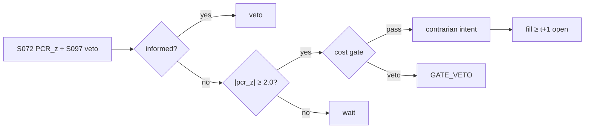

# T048 — Put/Call Ratio Contrarian

A contrarian sentiment trade on the put/call ratio: when the PCR reaches fear/greed extremes, the strategy bets the crowd is wrong — long the hated, short the loved — following Webb et al. (2001) and Cao et al. (2022). Pan–Poteshman (2006) is the standing warning that some option flow is informed, so the S097 gate vetoes extremes driven by informed-looking volume. Provenance **[D]**.

> Tag law: every numeric literal in prose carries one of `[documented]
> [default] [example] [unverified] [internal-est] [measured]` (legend: Appendix
> i v1.0.0). Constants inside cited formulas inherit the formula's tag.
> Bibliographic years, volumes, pages, arXiv IDs, section numbers, rule codes
> (C1–C12), fail-safe codes (F1–F5), module IDs, and machine-parsed §0 data
> fields are identifiers, not literals, and are exempt.

## §1 Five-minute reviewer card

| Row | Value |
|---|---|
| Module | T048 — Put/Call Ratio Contrarian, v1.0.0 |
| Edge verdict | `plausible` — contrary sentiment indicators carry predictive content (Webb et al. 2001); option-crowd contrarian sorts documented (Cao et al. 2022) |
| After-cost | `narrow` — sentiment extremes are rare; the informed-flow contamination (Pan–Poteshman) is the standing risk |
| Build cost | Tier S = 5–15 h ≈ `$750–2,250` [documented] |
| Data cost | Cboe PCR (free) + OPRA: low four figures/yr [unverified] |
| latency_class | daily |
| risk_class | market |
| Capacity | options-liquidity constrained [unverified] |
| Executability | Cboe publishes PCR free; the extreme-definition is the work |
| Risk summary | Fading informed flow; extremes can always get more extreme; sentiment timing is imprecise |
| When it dies | in trending fear/greed regimes where the crowd is right for months |
| Regime gates | veto extremes with informed-flow signature (S097); stand down when PCR is trendless [example] |
| Emits | `order_intents` (Appendix C v1.0.0) — OrderTicket intents only, never orders |

## §1.5 Cheapest / least-build path

1. **Prototype hour band:** 3–5 h [example] — PCR extremes + informed-flow veto + contrarian execution.
2. **Cheapest-source row:** min_tier = CBOE (free PCR); latency_class = daily;
   required_fields = daily put/call ratios (Cboe free), option volume; price_band = `$0–500`/yr (indicative —
   verify before budgeting); build_or_buy = **build**.
3. **Resource budget:** Tier M per cost-model §5 = 20–60 h ≈ `$3,000–9,000` loaded at `$150`/hr [documented]; compute pattern `vectorized batch (polars/numpy)`.
4. **Skip list:** intraday PCR; single-name PCR (index only at first).
5. **DO-NOT-CUT list:** causality assertions (`assert fill_event >
   signal_event`, no-signal-bar-fills test); COST block + callable
   `expected_cost_bps`; F1–F5 fail-safes + module-state enum; kill-switch
   state machine + re-arm checklist; decision-log audit records;
   bona-fide-intent + self-trade prevention; provenance tags on every numeric
   literal; fixtures + `test_cmd`; secrets via env only.
6. **Escalation gate:** upgrade from cheapest when any holds — extremes stop reverting; informed flags fire on most extremes.

## §T0 Module contract

### T0.1 Typed signature

```python
def emit(state: ModuleState, signals: list[SignalVector], cfg: Config) -> list[OrderTicket]:
```

`OrderTicket` per Appendix C v1.0.0 (intents only — never wire orders).
`state` is the module-owned named state vector (`pcr_z, informed_flag, position`); `signals` are
canonical SignalVectors (Appendix b v1.0.0) from the consumed S-modules, newest
last; the function emits zero or more intents per bar/event. Documented edge
cases: no signals → flat, no intents; `UNKNOWN` input signal → restrictive
(halve size / stand down per F1); kill-switch TRIPPED → emit nothing, state
`OFF`. 

### T0.2 Config dataclass

| Parameter | Type | Default | Range | Status |
|---|---|---|---|---|
| pcr_window_d | int | `63` | [21, 252] | [default] |
| extreme_z | float | `2.0` | [1.5, 3.0] | [default] |
| max_hold_d | int | `20` | [5, 60] | [default] |
| cost_gate_k | float | `1.00` | [0.5, 2.0] | [default] |
| daily_loss_stop_pct | float | `2.0` | [1.0, 5.0] | [default] |

All defaults tagged per the tag law (status `default` ⇒ `[default]`).

### T0.3 Canonical schema mapping

Vendor columns → canonical Event/Bar schema (Appendix a v1.0.0), stated once here:

| Vendor column | Canonical field | Notes |
|---|---|---|
| put/call ratio | Bar: daily | Cboe free |
| option volume | Bar: daily | informed-flow inputs |

### T0.4 Time contract

> Time contract: clock domain UTC, int64 ns; authoritative causality clock =
> `event_ts`; max_skew = `5` s [default]; jitter budget = `1` s [default];
> bar-label = open time; staleness TTL = `15` min [default]; gap policy = mask, no
> interpolation; halt/auction → discard contributions across reopen.

**Timing box:** `signal@t (daily bars, America/Chicago) → earliest fill @open(t+1)`

### T0.5 Market-state table

| State | Module behavior |
|---|---|
| CONTINUOUS_TRADING | Evaluate entry/exit rules; emit intents per §T2 |
| HALTED | Cancel working intents; emit nothing; state `UNKNOWN` until clean reopen |
| AUCTION | No new intents; hold intent-side state; state `DEGRADED` |
| CLOSED | Emit nothing; state `OFF` |


### T0.6 Module-state enum + error taxonomy

States per Appendix k v1.0.0: `OK | DEGRADED | UNKNOWN | OFF`. Invalid input →
`UNKNOWN`, never interpolate (Appendix f v1.0.0, F1–F5).

| Failure | State | Alert |
|---|---|---|
| Missing/stale input (TTL `15` min [default]) | `UNKNOWN` | page |
| Out-of-bounds indicator (F2) | `UNKNOWN` | page |
| Estimator disagreement (F3) | `UNKNOWN` | notify |
| Halt/auction per §T0.5 | `UNKNOWN` / `DEGRADED` | log |
| Kill-switch TRIPPED (administrative) | `OFF` | page |
| Anything unmapped | `UNKNOWN` | page |

### T0.7 Risk contract + kill switch

```yaml
risk_contract:
  per_trade_R: 250            # USD risk budget per trade [example]
  max_adverse_per_trade: 1.0 R [default]  # stop distance multiple [default]
  daily_loss_stop: 2% of equity [default]        # then no new entries; flatten managed risk [default]
  max_gross: 4× equity [default]              # hard gross exposure cap [default]
  kill_conditions:
    - daily P&L ≤ −daily_loss_stop_pct → TRIP (flatten contrarian)
    - informed flag on open position → TRIP (flatten, review)
    - decision-log write failure → TRIP (halt emission)
  enforcement: intraday-hard  # trips are automatic, not advisory [default]
  calibration_recipe: >
    Walk-forward on 60-day blocks [example]: fit thresholds on block t,
    freeze, validate realized shortfall vs predicted on block t+1;
    shrink per-trade R until max drawdown < daily_loss_stop/2 [default].
```

**Kill-switch state machine:** `ARMED → TRIPPED → RECOVERY → ARMED`.

- `ARMED`: normal operation; every bar evaluates the kill conditions.
- `TRIPPED`: any kill condition fires → cancel all working intents
  (`NEW`/`WORKING` → `CANCELLED`, idempotent), flatten managed positions via
  the exit rule, emit nothing new, state `OFF`, log `KILL_TRIP`.
- `RECOVERY`: manual operator review only — no automatic transition.
- `ARMED` (re-entry): only after the re-arm checklist passes in full, logged
  as `KILL_REARM` with the checklist result.

**Re-arm checklist** (all must be true):

- [ ] Feed health green: all §T5 inputs fresh inside the staleness TTL.
- [ ] Kill condition cleared: the tripping metric is back inside limits for `30 min [default]` [default].
- [ ] Decision log reconciled: `KILL_TRIP` record present and hash chain intact.
- [ ] Risk re-check: per-trade R and gross caps re-confirmed against current equity.
- [ ] Operator sign-off: named human approves re-arm (no automatic recovery).

### T0.8 Ops tail

- **Schedule:** nightly batch; owner: strategy owner (named).
- **Health checks:** fixture replay (`test_cmd`) green on deploy; live
  decision-log append monitor; kill-switch state heartbeat.
- **Alert table:** `UNKNOWN`/`OFF` state transitions; kill-trip pages immediately [default].
- **Resource budget:** nightly batch: < 2 vCPU-h, < 4 GB RAM [example].
- **Runbook stub:** 1) confirm kill-state; 2) inspect decision log for the tripping record; 3) verify feed freshness; 4) re-arm checklist (operator sign-off); 5) re-run fixture; 6) resume..

### T0.9 Secrets (env-only)

- `BROKER_API_KEY (paper venue, env-only)`
- `DATA_API_KEY (env-only)` via environment only. No secrets in this file, fixtures, or
logs (CI secrets-grep).

### T0.10 May / must-NOT

> **May:** emit `OrderTicket` intents per Appendix C v1.0.0; track intent-side
> state (`NEW → WORKING → FILLED / CANCELLED / PARTIAL`); issue cancel-replace
> via new tickets with new `ticket_id`s. **Must-NOT:** place orders on any
> venue, hold broker/exchange sessions, net intents into orders inside the
> strategy, treat the intent-side state machine as broker wire truth, or emit
> prices/share-counts/notionals outside an `OrderTicket`.

## §T1 Legacy (subsumed by §1)

Legacy §T1 content is the §1 reviewer card above; this header is retained so
section numbering stays frozen.

## §T2 Specification

### Universe

Index options (SPX class [example]) with free Cboe PCR; liquid options.

### Entry rule (Boolean — no prose-only conditions)

```
pcr_z = (PCR - mean(PCR, window)) / sd(PCR, window)
informed = S097 flag (urgent directional volume)          # Pan–Poteshman guard
ENTRY = |pcr_z| >= extreme_z and not informed -> fade the crowd
```

### Exits (with post-exit cooldown)

```
revert -> |pcr_z| < 0.5 [example] -> FLAT
informed arrives -> FLAT immediately
stop -> adverse stop_bps -> FLAT; max hold 20d [default]
```

### Position sizing (fenced function)

```python
def size_contrarian(risk_R_usd, stop_bps, px, adv_shares, pcr_z, cfg):
    raw = risk_R_usd / (stop_bps / 1e4 * px)
    return min(raw * min(abs(pcr_z) / cfg.extreme_z, 1.5), cfg.adv_cap_pct / 100 * adv_shares)
```

### Risk limits

| Limit | Value |
|---|---|
| Max contrarian notional | `$2M` [example] |
| Extreme z | `2.0` [default] |
| Informed veto | hard [default] |

### COST block (single source of truth)

Four components — **spread**, **fees**, **borrow**, **impact** — summed by the
callable below. Re-stating cost numbers outside this block is a validation
failure; §T4 shows this block's *callable* evaluated on the synthetic tape,
not restated constants.

| Component | Value (bps) | Basis |
|---|---|---|
| Spread (half) | `2.00` | index options [example] |
| Fees | `0.80` | [example] |
| Borrow | `0.00` | options [example] |
| Impact | `k·√(adv_pct/100)`, k=`15.0` | [example] |
| **Total reference (one-way)** | `~`17` one-way [example]` | [example] |

`fee_schedule_as_of`: `2026-09-01 (placeholder — pin the real venue schedule before production)` — placeholder; pin the real venue
schedule before production. `side`: `taker`; venue/tier/source:
options exchange [example].

```python
def expected_cost_bps(notional, adv_pct, venue, side, urgency, cfg):
    """COST-block callable. Index-option contrarian economics."""
    spread = cfg.spread_full_bps / 2.0
    fee = cfg.taker_fee_bps
    borrow = 0.0                                       # options: no stock borrow
    impact = cfg.impact_k * math.sqrt(max(adv_pct, 0.0) / 100.0)
    if urgency == "high":
        impact *= 1.5
    return spread + fee + borrow + impact
```

### Execution / fill model table

| Aspect | Assumption |
|---|---|
| Fill venue | options exchange |
| Slippage model | mid ± half-spread |
| Partial fills | worked |
| Halt behavior | no contrarian entries on halts |

Fine-grained fill behavior is synthetic and labeled `simulated only — requires MBO/ITCH`:
no MBO/ITCH feed is consumed by this module; any fill realism beyond the
mid-price ± half-spread fill model above would require MBO/ITCH data.

### Robustness

Perturb thresholds ±20% [example]; the reference behavior (entry/exit intents, gate blocks, kill trip) must be invariant; degrade entry→no-trade on indicator breach.

**Pricing/Greeks (options-domain conditional).** Contrarian via long
options (long the hated): delta per the chosen strike [example]; long gamma, long vega —
the position benefits from the reversal and from vol expansion. Expiry/assignment: hold
to the sentiment exit or max-hold; long options have no assignment risk; roll before
liquidity fades in the front contract.

### Compliance sub-block (C1–C12)

| Code | Rule: trigger → check → action → log |
|---|---|
| C1 | STP + self-match prevention: trigger = intent could match our own resting interest → check = every ticket carries `self_trade_prevention: true`; maker modules compare against own open tickets → action = cancel own resting quote before posting the aggressive side; cancel-replace via new `ticket_id` only → log = `COMPLIANCE_BLOCK` with rule code `C1` |
| C2 | Bona-fide intent: trigger = entry rule fires → check = cost gate passes AND qty within risk limits AND (SHORT ⇒ `locate_ok`) → action = veto the intent if any check fails; no quote entered without intent to trade → log = `GATE_VETO` with the failed check |
| C3 | Message-rate / cancel-to-trade: trigger = intents+ cancels per symbol per minute exceed `120` [default] → check = rolling `60`-s [default] message counter → action = throttle to `1` intent per `10` s [default] and alert → log = `COMPLIANCE_BLOCK` with the counter value |
| C4 | Pre-trade fat-finger trio: trigger = any new intent → check = (a) limit within `±±10%` of reference [default], (b) ticket notional ≤ ``$2M`` [default], (c) ≤ `20` tickets per `1 min` [default] → action = block the ticket, alert → log = `COMPLIANCE_BLOCK` with the breached leg |
| C5 | Decision-log schema (Appendix g v1.0.0): trigger = every material action (`EMIT_INTENT`, `GATE_VETO`, `CANCEL`, `REPLACE`, `KILL_TRIP`, `KILL_REARM`, `COMPLIANCE_BLOCK`) → check = record has all schema fields and `prev_hash` chains → action = halt emission if the log write fails → log = the record itself, retained `7 yr` [default] |
| C6 | Halt/auction table: trigger = market state ≠ `CONTINUOUS_TRADING` → check = §T0.5 table → action = `HALTED`: cancel working intents, emit nothing; `AUCTION`: no new intents; `CLOSED`: state `OFF` → log = state-transition record |
| C7 | Locate check (short sales): trigger = `SHORT` intent → check = `locate_ok` from the pre-open easy-to-borrow list or desk locate; Reg-SHO threshold securities hard-blocked → action = veto without locate → log = `GATE_VETO` with code `C7`. Options; underlying hedges may be short — hedges need locate_ok (C7). |
| C8 | Public-dissemination gate: trigger = any export of signals/intents outside the firm → check = review gate sign-off → action = block unreviewed exports → log = `COMPLIANCE_BLOCK` |
| C9 | Data-entitlement assertions (Appendix j v1.0.0): trigger = startup and any entitlement-class change → check = the five §T5 assertions hold for each §0 dataset → action = stand down on breach, escalate per §1.5 → log = entitlement review record |
| C10 | Post-exit cooldown: trigger = exit or compliance block → check = `now >= cooldown_until` (`1 session [default]` [default]) → action = suppress re-entry until the cooldown elapses → log = `GATE_VETO` with code `C10` |
| C11 | Kill-switch integration: trigger = `TRIPPED` → check = all working intents transitioned `NEW`/`WORKING` → `CANCELLED` (idempotent) → action = no new intents until `ARMED` via the §T0.7 checklist → log = `KILL_TRIP` / `KILL_REARM` records |
| C12 | C12 Sentiment-governance: trigger = contrarian held against 3σ extreme > 10d [example] → check = thesis review → action = flatten or document → log with code `C12` |

### Parameter table

| Parameter | Symbol | Value | Tag | Sensitivity |
|---|---|---|---|---|
| PCR window | W | `63` days | [default] | medium |
| Extreme z | z_e | `2.0` | [default] | high — the rarity knob |
| Max hold | H | `20` days | [default] | medium — sentiment timing is imprecise |

### Timing box

`signal@t (daily bars, America/Chicago) → earliest fill @open(t+1)`

## §T3 Math + normative pseudocode

Webb–Simon–Wiggins (2001) [documented]: contrary sentiment indicators (the PCR
family) carry predictive content for S&P futures returns. Cao et al. (2022) [documented]:
option-trading-based contrarian sorts and the market risk premium — the academic analogue.
Pan–Poteshman (2006) [documented]: put/call open-buy volume predicts returns — informed
flow exists, hence the S097 veto. Cboe [documented]: free daily PCR by product — the feed.

**Normative pseudocode** (pseudocode is normative; prose is commentary):

```
def emit(state, signals, cfg):
    sig = primary(signals, "S072")          # PCR extreme + informed flag
    if sig is None or invalid(sig): return [], state.unknown()
    if state.position != 0:
        if abs(sig.pcr_z) < 0.5 or sig.informed or stopped(state, cfg) or state.age > cfg.max_hold_d:
            return [exit_ticket(state)], state.flat()
        return [], state.ok()
    if abs(sig.pcr_z) >= cfg.extreme_z and not sig.informed:
        side = "BUY" if sig.pcr_z > 0 else "SELL"     # fade the crowd
        cost = expected_cost_bps(notional(), adv_pct(), venue(), "taker", "normal", cfg)
        # ^^^ normative cost-gate predicate: expected_cost_bps(...) <= k * edge_bps
        if cost <= cfg.cost_gate_k * sig.edge_bps:
            t = OrderTicket.intent(side, qty=size_contrarian(...), limit=last_price())
            t.intent_ts = sig.computed_at
            assert fill_event > signal_event  # t->t+1 causality: no-signal-bar fills
            return [t], state.open("CONTRARIAN")
        log("GATE_VETO", cost=cost)
    return [], state.ok()
```

Causality: every feature uses inputs with `event_ts ≤ t` only; the earliest
fill for a bar-`t` intent is bar `t+1`'s open. Mandatory unit test:
no-signal-bar fills.

## §T4 Worked example (fixture-backed)

- Tape: `modules/fixtures/T048_tape.csv` — `# TYPE: validation-run`;
  `12` synthetic bars (seed `4480` [example]); `event_ts`/`asof_ts` int64 ns
  UTC; every number synthetic.
- Expected outputs: `modules/fixtures/T048_expected.csv` — per-bar intent,
  quantity, the **cost-function call** (`expected_cost_bps` inputs → bps →
  dollars), cost-gate verdict, and module state.
- Tolerance: `1e-9` [default] on floats; integer quantities exact.
- Acceptance tests (`modules/tests/test_T048.py` — `6` [default] tests):
  1. TYPE header + columns present; 2. fixture recomputes to expected
  (reference `process_bar` vs expected CSV); 3. no-signal-bar fills
  (`assert fill_event > signal_event`); `4.` cost-gate predicate passes on large edge, blocks on tiny edge (`k = 0.5` [default]);
  5. kill-switch trip blocks intents, re-arm checklist restores `ARMED`;
  6. invalid input (halted/invalid bar) → `UNKNOWN`, no intents.
- `test_cmd`: `python3 -m pytest modules/tests/test_T048.py -q` → exits `0` [default].

**Cost-function calls on the tape** (the COST-block callable evaluated on
synthetic rows — inputs → bps → dollars; all values [example]):

| Bar | `expected_cost_bps` inputs | Components → total → $ | Cost gate `expected_cost_bps(...) <= k * edge_bps` | Intent / state |
|---|---|---|---|---|
| `0` | notional=`200000` [example], adv_pct=`0.5` [example], venue=`primary`, side=`taker`, urgency=`normal` | spread `2.0` + fee `0.8` + borrow `0.0` + impact `1.06` = `3.86` bps → `$77.21` | `2.0` edge, k=`0.5` [default] → `3.86 ≤ 1.0` BLOCK | `HOLD` / `OK` |
| `3` | notional=`200000` [example], adv_pct=`0.5` [example], venue=`primary`, side=`taker`, urgency=`normal` | spread `2.0` + fee `0.8` + borrow `0.0` + impact `1.06` = `3.86` bps → `$77.21` | `15.442640687119283` edge, k=`0.5` [default] → `3.86 ≤ 7.72` PASS | `LONG` / `OK` |
| `6` | notional=`200000` [example], adv_pct=`0.5` [example], venue=`primary`, side=`taker`, urgency=`normal` | spread `2.0` + fee `0.8` + borrow `0.0` + impact `1.06` = `3.86` bps → `$77.21` | `3.0` edge, k=`0.5` [default] → `3.86 ≤ 1.5` BLOCK | `BUY` / `OK` |
| `7` | notional=`200000` [example], adv_pct=`0.5` [example], venue=`primary`, side=`taker`, urgency=`normal` | spread `2.0` + fee `0.8` + borrow `0.0` + impact `1.06` = `3.86` bps → `$77.21` | `0.05` edge, k=`0.5` [default] → `3.86 ≤ 0.03` BLOCK | `HOLD` / `OK` |
| `9` | notional=`200000` [example], adv_pct=`0.5` [example], venue=`primary`, side=`taker`, urgency=`normal` | spread `2.0` + fee `0.8` + borrow `0.0` + impact `1.06` = `3.86` bps → `$77.21` | `5.0` edge, k=`0.5` [default] → `3.86 ≤ 2.5` BLOCK | `HOLD` / `OFF` |

**Hand-checks.** Row `3` (entry): qty = `250 / (25/1e4 × 49.87)` = `2005` raw → ADV-capped at `20000` → `2005` shares [example]; ticket `T0003`, side `LONG`, `marketable` intent. Row `6` (exit): |z| through the exit band → `LONG` intent, exits never cost-gated [default]. Row `7` (gate block): edge `0.05` bps [example] vs cost `3.86` bps → gate `3.86 ≤ 0.025` BLOCKS → no intent, state stays `OK`. Row `9` (kill): daily P&L `-2.1%` [example] ≤ −stop (`2.0%` [default]) → `ARMED → TRIPPED`, state `OFF`, no intents. Causality: entry intent at row `3` has `intent_ts` = bar-3 `event_ts`; the earliest fill is bar `4`'s open — the test asserts `fill_event > signal_event` on every intent row.

**Where the example is optimistic.** Costs are the COST-block model, not realized fills; capacity, borrow squeezes, and regime shifts are not in the tape.

## §T5 Dependencies + data

### Consumed signals (from deps.yaml — machine edge list)

| Signal | Version pin | Role |
|---|---|---|
| S072 | 1.0.0 | primary |
| S045 | 1.0.0 | confirm |
| S097 | 1.0.0 | gate |

### Pinned formula excerpts (≤10 lines each, CI hash-checked)

**S072** (v1.0.0): `pcr_z = (PCR − μ_W)/σ_W` [documented].
**S097** (v1.0.0): informed-flow veto score [documented].

### Data required

| Field | Type | Granularity | Source tier | Notes |
|---|---|---|---|---|
| put/call ratio | float | daily | CBOE | free primary feed |
| option volume | int | daily | OPRA | informed-flow inputs |

**Data rights row** (Appendix j v1.0.0): Cboe PCR is free; OPRA licensed per subscriber; entitlements re-asserted at startup.

## §T6 Local build + buy vs build

PCR z-score + veto: an afternoon. The extreme-definition backtest is the work.

| Route | What you get | Verdict |
|---|---|---|
| Build | contrarian engine in-house | recommended — trivial |
| Buy | OPRA feed | required for the veto leg |

**Verdict:** Build. The Cboe feed is free; the judgment is in the veto.

## §T7 Efficacy — documented evidence

| Study / source | Market & period | Metric | Before/after cost | Caveat |
|---|---|---|---|---|
| Webb et al. (2001) | S&P futures | contrary sentiment predicts returns | before cost | 1984–1997 sample |
| Cao et al. (2022) | US options | option-crowd contrarian sorts | before cost | the academic analogue |
| Pan–Poteshman (2006) | US options 1990–2001 | informed option flow predicts returns | before cost | the contamination warning |

**Selection disclosure:** Studies below are the chapter's documented sources only — no post-hoc selection from a wider literature search.

**Capacity & decay.** Edge decays with crowding and regime shifts; treat any printed Sharpe as a pre-cost, in-sample-era artifact unless the source says otherwise.

**Honest bottom line.** Honest bottom line: fading the crowd works until the crowd is informed — and Pan–Poteshman show it sometimes is. The veto is the strategy; the contrarian rule is the commodity.

## §T8 Failure modes & pitfalls

| # | Trigger → Detect → Action → Recovery | check: |
|---|---|---|
| 1 | Informed extreme → detect S097 flag → veto/flatten → alert | check: veto hit-rate |
| 2 | Extreme extends → detect adverse excursion → stop out, widen extreme_z → review | check: excursion stats |
| 3 | Trendless PCR → detect |z| never exceeds 1 [example] for a quarter → stand down → log | check: regime monitor |
| 4 | Crowd right for months → detect sleeve drawdown → halve size → review thesis | check: drawdown monitor |

## §T9 Regime gates + visuals

**Provisional regime-gate machine** (restrictive default; `regime_ids` stay
empty until the R001–R050 annotation pass):

| regime_id | direction | mechanism | condition | action | min_lag | unknown_behavior |
|---|---|---|---|---|---|---|
| R001 | veto | informed flow | S097 flag | no entries, flatten | immediate | restrictive |
| R002 | stand-down | trendless sentiment | |z| < 1 for a quarter | pause contrarian | 1 week | restrictive |



## §T10 Source log + unverified leads

**Sources** (citable facts only):

1. Pan, J. & Poteshman, A. M. (2006). "The Information in Option Volume for Future Stock Prices." *Review of Financial Studies* 19(3), 871–908
2. Webb, R. I., Simon, D. P. & Wiggins, R. A. III (2001). "S&P futures returns and contrary sentiment indicators." *Journal of Futures Markets* 21(5), 447–462
3. Cao, J., Li, G., Zhan, X. & Zhou, G. (2022). "Betting Against the Crowd: Option Trading and Market Risk Premium." *Journal of Financial and Quantitative Analysis*
4. Cboe — U.S. Options Daily Market Statistics (daily put/call ratios by product). https://www.cboe.com/us/options/market_statistics/daily/

**Chatbot source log.** Grok answered the Q-batch (2026-09-10); all claims independently verified or labeled unverified. Chatbot output is leads, never facts.

**Unverified leads** (chatbot-only — never in evidence tables):

- Grok (2026-09-10, Q-TB5): PCR-contrarian P&L magnitudes — *unverified chatbot claims*.
- Single-name PCR — research lead, index only at first.

---

## Appendix — AI build prompt (T048)

Copy-paste into any chat agent:

> Build module **T048 — Put/Call Ratio Contrarian** per `notes/module-template.md` v1.0.0 and
> this file's §T0 contract.
> Cheapest path (§1.5): prototype 3–5 h [example]; cheapest data candidate
> CBOE (free PCR); compute pattern `vectorized batch (polars/numpy)`; u.
> Implement `emit(state, signals, cfg) -> list[OrderTicket]` (Appendix c
> v1.0.0) with the §T3 normative pseudocode, including the cost-gate predicate
> `expected_cost_bps(...) <= k * edge_bps` and `assert fill_event >
> signal_event`. Emit intents only — never place orders. Wire F1–F5
> (Appendix f v1.0.0): invalid input → `UNKNOWN`, never interpolate. Kill
> switch `ARMED → TRIPPED → RECOVERY → ARMED` with the §T0.7 re-arm checklist.
> Log decisions per Appendix g v1.0.0. Secrets via env only. Run the fixture
> `modules/fixtures/T048_tape.csv` (`# TYPE: validation-run`) against
> `modules/fixtures/T048_expected.csv` (tolerance `1e-9` [default]).
> **Definition of done:** `python3 -m pytest modules/tests/test_T048.py -q` exits `0` [default]. Tag every numeric literal
> you add with the unified enum (Appendix i v1.0.0); put anything unverifiable
> in §T10 unverified leads.
