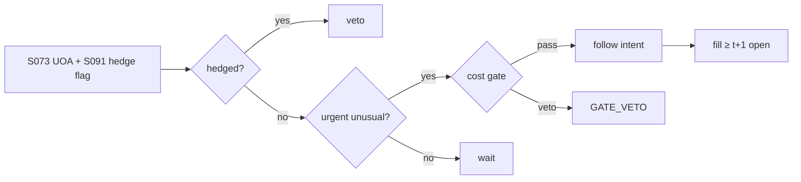

# T049 — Unusual Options Activity Follower

Follows unusual options activity: when option volume (relative to stock volume, open interest, and history) spikes with urgent directional character, the strategy follows the flow's direction in the underlying. Pan–Poteshman (2006) and Johnson–So (2012) document that option volume predicts stock returns; Easley et al. (1998) give the mechanism — informed traders use options. Cremers–Weinbaum (2010) warn the predictability decays. Provenance **[D]**.

> Tag law: every numeric literal in prose carries one of `[documented]
> [default] [example] [unverified] [internal-est] [measured]` (legend: Appendix
> i v1.0.0). Constants inside cited formulas inherit the formula's tag.
> Bibliographic years, volumes, pages, arXiv IDs, section numbers, rule codes
> (C1–C12), fail-safe codes (F1–F5), module IDs, and machine-parsed §0 data
> fields are identifiers, not literals, and are exempt.

## §1 Five-minute reviewer card

| Row | Value |
|---|---|
| Module | T049 — Unusual Options Activity Follower, v1.1.0 |
| Edge verdict | `PREDICTIVE-FEATURE-ONLY` — documented pre-cost predictability (Pan–Poteshman 2006; Johnson–So 2012); the mechanism (Easley et al. 1998) is real, but this module follows public prints, not the original non-public data edge |
| After-cost | `BEFORE-COST` — every cited study is before-cost; after-cost verdict is `narrow`: public prints are the stale shadow of the informed flow — and predictability decays (Cremers–Weinbaum) |
| Build cost | Tier M = 20–60 h ≈ `$3,000–9,000` [documented] |
| Data cost | OPRA: `~$36,000+/yr` floor [documented] (direct access `$1,000`/mo + Category 1 non-display `$2,000`/enterprise/mo, before per-device professional fees — OPRA fee schedule [documented]; schedule vintage ~2018, verify current before budgeting) |
| latency_class | minutes |
| risk_class | market |
| Capacity | underlying-liquidity constrained; `$` band uncomputed [unverified] |
| Executability | needs OPRA prints + urgency classification; the follow rule is simple |
| Risk summary | Stale flow (following yesterday's informed trader); urgency misclassification; flow is hedging, not directional |
| When it dies | when the flow is hedging flow or the informed trader already left |
| Regime gates | trade only urgent directional prints; veto hedged-looking flow (S091); stand down on OpEx weeks [example] |
| Emits | `order_intents` (Appendix C v1.0.0) — OrderTicket intents only, never orders |

## §1.5 Cheapest / least-build path

1. **Prototype hour band:** 6–10 h [example] — UOA detection + urgency classification + underlying execution.
2. **Cheapest-source row:** min_tier = OPRA; latency_class = minutes;
   required_fields = option prints (price/size/side), stock volume, open interest; price_band = `~$36,000+/yr` floor [documented] (OPRA direct access `$1,000`/mo + Category 1 non-display `$2,000`/enterprise/mo, before per-device professional fees — OPRA fee schedule [documented]; vintage ~2018, verify current before budgeting); build_or_buy = **build**.
3. **Resource budget:** Tier M per cost-model §5 = 20–60 h ≈ `$3,000–9,000` loaded at `$150`/hr [documented]; compute pattern `vectorized batch (polars/numpy)`.
4. **Skip list:** options-market-maker inventory inference; dark-pool equity flow.
5. **DO-NOT-CUT list:** causality assertions (`assert fill_event >
   signal_event`, no-signal-bar-fills test); COST block + callable
   `expected_cost_bps`; F1–F5 fail-safes + module-state enum; kill-switch
   state machine + re-arm checklist; decision-log audit records;
   bona-fide-intent + self-trade prevention; provenance tags on every numeric
   literal; fixtures + `test_cmd`; secrets via env only.
6. **Escalation gate:** upgrade from cheapest when any holds — followed flow shows no post-trade drift; urgency classifier degrades.

## §T0 Module contract

### T0.1 Typed signature

```python
def emit(state: ModuleState, signals: list[SignalVector], cfg: Config) -> list[OrderTicket]:
```

`OrderTicket` per Appendix C v1.0.0 (intents only — never wire orders).
`state` is the module-owned named state vector (`uoa_score, urgency, direction, position`); `signals` are
canonical SignalVectors (Appendix b v1.0.0) from the consumed S-modules, newest
last; the function emits zero or more intents per bar/event. Documented edge
cases: no signals → flat, no intents; `UNKNOWN` input signal → restrictive
(halve size / stand down per F1); kill-switch TRIPPED → emit nothing, state
`OFF`. 

### T0.2 Config dataclass

| Parameter | Type | Default | Range | Status |
|---|---|---|---|---|
| uoa_z | float | `3.0` | [2.0, 5.0] | [default] |
| urgency_min | float | `0.70` | [0.5, 0.9] | [default] |
| z_exit | float | `1.0` | [0.3, 2.0] | [default] |
| max_hold_h | int | `4` | [1, 24] | [default] |
| cost_gate_k | float | `0.50` | [0.5, 2.0] | [default] |
| cost_scale_bps | float | `10.0` | [3.0, 30.0] | [default] |
| daily_loss_stop_pct | float | `2.0` | [1.0, 5.0] | [default] |
| adv_cap_pct | float | `1.0` | [0.1, 10.0] | [default] |
| vol_mult | float | `2.0` | [1.0, 5.0] | [default] |
| risk_R_usd | float | `250` | [50, 2500] | [example] |
| stop_bps | float | `25` | [10, 100] | [example] |
| spread_full_bps | float | `3.0` | [1.0, 10.0] | [example] |
| taker_fee_bps | float | `3.0` | [0.5, 5.0] | [documented] |
| borrow_bps | float | `30.0` | [0.0, 200.0] | [example] |
| impact_k | float | `25.0` | [5.0, 50.0] | [example] |
| venue | str | `primary` | {primary} | [example] |
| default_side | str | `LONG` | {LONG, SHORT} | [example] |

All defaults tagged per the tag law (status `default` ⇒ `[default]`; `[example]`/`[documented]` per the COST block).

### T0.3 Canonical schema mapping

Vendor columns → canonical Event/Bar schema (Appendix a v1.0.0), stated once here:

| Vendor column | Canonical field | Notes |
|---|---|---|
| OPRA prints (price/size/side) | Event{event_ts, symbol, price, size, side, exchange} | tick prints; side = exchange aggressor flag or Lee–Ready-inferred [unverified] |
| stock volume | Bar{event_ts, volume} | daily, normalization |
| open interest | Bar{event_ts, open_interest} | daily, normalization |
| S073 output | SignalVector{uoa_z, urgency_score ∈ [0,1], urgency_label ∈ {normal, high}, direction, edge_bps, computed_at} | primary, newest last |
| S094 output | SignalVector{confirm_ok ∈ {0,1}} | confirm |
| S091 output | SignalVector{hedged ∈ {0,1}} | gate |
| event_ts / asof_ts | int64 ns UTC | dual timestamps per the Time contract |

### T0.4 Time contract

> Time contract: clock domain UTC, int64 ns; authoritative causality clock =
> `event_ts`; max_skew = `5` s [default]; jitter budget = `1` s [default];
> bar-label = open time; staleness TTL = `15` min [default]; gap policy = mask, no
> interpolation; halt/auction → discard contributions across reopen;
> processing model = `per_bar`; live intraday (not simulated-only).

**Timing box:** `signal@t (intraday bars, America/Chicago) → earliest fill @open(t+1)`

### T0.5 Market-state table

| State | Module behavior |
|---|---|
| CONTINUOUS_TRADING | Evaluate entry/exit rules; emit intents per §T2 |
| HALTED | Cancel working intents; emit nothing; state `UNKNOWN` until clean reopen |
| AUCTION | No new intents; hold intent-side state; state `DEGRADED` |
| CLOSED | Emit nothing; state `OFF` |


### T0.6 Module-state enum + error taxonomy

States per Appendix k v1.0.0: `OK | DEGRADED | UNKNOWN | OFF`. Invalid input →
`UNKNOWN`, never interpolate (Appendix f v1.0.0, F1–F5).

| Failure | State | Alert |
|---|---|---|
| Missing/stale input (TTL `15` min [default]) | `UNKNOWN` | page |
| Out-of-bounds indicator (F2) | `UNKNOWN` | page |
| Estimator disagreement (F3) | `UNKNOWN` | notify |
| Halt/auction per §T0.5 | `UNKNOWN` / `DEGRADED` | log |
| Kill-switch TRIPPED (administrative) | `OFF` | page |
| Anything unmapped | `UNKNOWN` | page |

### T0.7 Risk contract + kill switch

```yaml
risk_contract:
  per_trade_R: 250            # USD risk budget per trade [example]
  max_adverse_per_trade: 1.0 R [default]  # stop distance multiple [default]
  daily_loss_stop: 2% of equity [default]        # then no new entries; flatten managed risk [default]
  max_gross: 4× equity [default]              # hard gross exposure cap [default]
  kill_conditions:
    - daily P&L ≤ −daily_loss_stop_pct → TRIP (flatten follows)
    - OPRA feed stale > 60 s → TRIP (state UNKNOWN)
    - decision-log write failure → TRIP (halt emission)
  enforcement: intraday-hard  # trips are automatic, not advisory [default]
  calibration_recipe: >
    Walk-forward on 60-day blocks [example]: fit thresholds on block t,
    freeze, validate realized shortfall vs predicted on block t+1;
    shrink per-trade R until max drawdown < daily_loss_stop/2 [default].
```

**Kill-switch state machine:** `ARMED → TRIPPED → RECOVERY → ARMED`.

- `ARMED`: normal operation; every bar evaluates the kill conditions.
- `TRIPPED`: any kill condition fires → cancel all working intents
  (`NEW`/`WORKING` → `CANCELLED`, idempotent), flatten managed positions via
  the exit rule, emit nothing new, state `OFF`, log `KILL_TRIP`.
- `RECOVERY`: manual operator review only — no automatic transition.
- `ARMED` (re-entry): only after the re-arm checklist passes in full, logged
  as `KILL_REARM` with the checklist result.

**Re-arm checklist** (all must be true):

- [ ] Feed health green: all §T5 inputs fresh inside the staleness TTL.
- [ ] Kill condition cleared: the tripping metric is back inside limits for `30 min [default]` [default].
- [ ] Decision log reconciled: `KILL_TRIP` record present and hash chain intact.
- [ ] Risk re-check: per-trade R and gross caps re-confirmed against current equity.
- [ ] Operator sign-off: named human approves re-arm (no automatic recovery).

### T0.8 Ops tail

- **Schedule:** intraday bars, `5`-min cadence [example]; nightly fixture replay (`test_cmd`) + decision-log report; owner: strategy owner (named).
- **Health checks:** fixture replay (`test_cmd`) green on deploy; live
  decision-log append monitor; kill-switch state heartbeat.
- **Alert table:** `UNKNOWN`/`OFF` state transitions; kill-trip pages immediately [default].
- **Resource budget:** intraday: < 2 vCPU-h/day, < 4 GB RAM [example].
- **Runbook stub:** 1) confirm kill-state; 2) inspect decision log for the tripping record; 3) verify feed freshness; 4) re-arm checklist (operator sign-off); 5) re-run fixture; 6) resume..

### T0.9 Secrets (env-only)

- `BROKER_API_KEY (paper venue, env-only)`
- `DATA_API_KEY (env-only)` via environment only. No secrets in this file, fixtures, or
logs (CI secrets-grep).

### T0.10 May / must-NOT

> **May:** emit `OrderTicket` intents per Appendix C v1.0.0; track intent-side
> state (`NEW → WORKING → FILLED / CANCELLED / PARTIAL`); issue cancel-replace
> via new tickets with new `ticket_id`s. **Must-NOT:** place orders on any
> venue, hold broker/exchange sessions, net intents into orders inside the
> strategy, treat the intent-side state machine as broker wire truth, or emit
> prices/share-counts/notionals outside an `OrderTicket`.

## §T1 Legacy (subsumed by §1)

Legacy §T1 content is the §1 reviewer card above; this header is retained so
section numbering stays frozen.

## §T2 Specification

### Universe

Names with liquid options and clean OPRA prints; sufficient underlying liquidity.

Eligibility (all [example] unless noted):
- underlying price ≥ `$20`, ADV ≥ `1M` shares/day, underlying spread ≤ `5` bps
- option ADV ≥ `5,000` contracts/day, open interest ≥ `50,000` contracts
- clean OPRA prints (no cross-market quote noise on the tape)

### Entry rule (Boolean — no prose-only conditions)

```
uoa_z         = S073 unusualness score vs history, OI, stock volume
urgency_score = S073 urgency in [0,1]                    # the informedness proxy
urgency_label = "high" if urgency_score > 0.85 [default] else "normal"
hedged        = S091 hedge flag (1 = hedging flow)
confirm_ok    = S094 confirmation (1 = edge confirmed)

ENTRY = (uoa_z >= uoa_z_cfg)
    and (urgency_score >= urgency_min)   # S073 score, not the label
    and (hedged == 0)                    # S091 gate: never follow hedging flow
    and (confirm_ok == 1)                 # S094 confirm
    → follow direction in the underlying
```

### Exits (with post-exit cooldown)

```
stop      -> adverse move >= stop_bps from entry -> FLAT
reverse   -> sig.flow_reversed -> FLAT
timeout   -> age_h > max_hold_h -> FLAT
scale-out -> realized drift with flow -> halve, then FLAT at timeout
post-exit -> cooldown 1 session [default] before re-entry (C10)
```

Exits are never cost-gated [default].

### Position sizing (fenced function)

```python
def size_shares(risk_budget_R, stop_bps, vol_estimate, ADV_cap, cost_bps,
                px, urgency_score, cfg):
    """Spec form: shares = f(risk_budget_R, stop_distance, vol_estimate, ADV_cap, cost).
    px/urgency_score/cfg are implementation detail; the five spec args come first."""
    raw = risk_budget_R / (stop_bps / 1e4 * px)       # risk-budget sizing
    adv_cap = ADV_cap * cfg.adv_cap_pct / 100.0       # ADV participation cap
    vol_cap = vol_estimate * cfg.vol_mult             # vol sanity cap [default]
    urgency_scale = 0.5 + 0.5 * urgency_score         # 0.5x–1.0x by urgency [default]
    cost_scale = 0.5 if cost_bps >= cfg.cost_scale_bps else 1.0  # cost trim [default]
    return int(min(raw, adv_cap, vol_cap) * urgency_scale * cost_scale)
```

### Risk limits

| Limit | Value |
|---|---|
| Max follow notional/name | `$1M` [example] |
| UOA z | `3.0` [default] |
| Max hold | `4` h [default] |

### COST block (single source of truth)

Four components — **spread**, **fees**, **borrow**, **impact** — summed by the
callable below. Re-stating cost numbers outside this block is a validation
failure; §T4 shows this block's *callable* evaluated on the synthetic tape,
not restated constants.

| Component | Value (bps) | Basis |
|---|---|---|
| Spread (half, underlying) | `1.50` | [example] |
| Fees (taker) | `3.00` | [documented] — NYSE remove-liquidity fee `$0.0030`/share (sec.gov Exhibit 5, 34-81547 [documented]) ÷ `$100` [example] reference price |
| Borrow (short follow, one-way) | `30.00` | [example] — applied only on SHORT follows; `borrow_bps_per_day` convention here = per one-way follow (annualize before comparing to stock-loan rates) |
| Impact | `k·√(adv_pct/100)`, k=`25.0`; urgency `high` → `×1.5` | [example] |
| **Reference total (one-way, LONG follow, normal urgency)** | `6.27` | [example] — scenario: notional `$200,000` [example], adv_pct `0.5` [example]; fee component [documented], rest [example] |

`fee_schedule_as_of`: `2026-09-01` — NYSE take fee `$0.0030`/share (sec.gov 34-81547 [documented]); pin the real venue tier before production. `side`: `taker`; venue/tier/source:
primary lit [example].

```python
def expected_cost_bps(notional, adv_pct, venue, side, urgency, cfg):
    """COST-block callable. Urgent follow: taker + urgency impact multiplier.
    urgency ∈ {"normal", "high"}; borrow applies only on SHORT follows."""
    spread = cfg.spread_full_bps / 2.0
    fee = cfg.taker_fee_bps                     # 3.0 bps [documented]
    borrow = cfg.borrow_bps if cfg.default_side == "SHORT" else 0.0
    impact = cfg.impact_k * math.sqrt(max(adv_pct, 0.0) / 100.0)
    if urgency == "high":
        impact *= 1.5
    return spread + fee + borrow + impact
```

### Execution / fill model table

| Aspect | Assumption |
|---|---|
| Fill venue | underlying primary, aggressive |
| Slippage model | follow slippage vs print time |
| Signal-to-intent latency | `< 1` intraday bar [example] — intent emitted on the signal bar; earliest fill is the next bar's open |
| Adverse fill | mid-price ± half-spread fill model; no adverse-selection markup [example] |
| Partial fills | urgent: cancel remainder |
| Halt behavior | no follows on halted underlyings |

Fine-grained fill behavior is synthetic and labeled `simulated only — requires MBO/ITCH`:
no MBO/ITCH feed is consumed by this module; any fill realism beyond the
mid-price ± half-spread fill model above would require MBO/ITCH data.

### Robustness

Perturb thresholds ±20% [example]; the reference behavior (entry/exit intents, gate blocks, kill trip) must be invariant; degrade entry→no-trade on indicator breach.

**Pricing/Greeks (options-domain conditional).** The strategy trades the
*underlying*, not the options: delta = `1.0` [example] directional. The options leg is
informational only. Expiry/assignment: n/a for the underlying position; the followed
flow's expiry informs the max-hold (front-week flow = shorter hold).

### Compliance sub-block (C1–C12)

| Code | Rule: trigger → check → action → log |
|---|---|
| C1 | STP + self-match prevention: trigger = intent could match our own resting interest → check = every ticket carries `self_trade_prevention: true`; maker modules compare against own open tickets → action = cancel own resting quote before posting the aggressive side; cancel-replace via new `ticket_id` only → log = `COMPLIANCE_BLOCK` with rule code `C1` |
| C2 | Bona-fide intent: trigger = entry rule fires → check = cost gate passes AND qty within risk limits AND (SHORT ⇒ `locate_ok`) → action = veto the intent if any check fails; no quote entered without intent to trade → log = `GATE_VETO` with the failed check |
| C3 | Message-rate / cancel-to-trade: trigger = intents+ cancels per symbol per minute exceed `120` [default] → check = rolling `60`-s [default] message counter → action = throttle to `1` intent per `10` s [default] and alert → log = `COMPLIANCE_BLOCK` with the counter value |
| C4 | Pre-trade fat-finger trio: trigger = any new intent → check = (a) limit within `±10%` of reference [default], (b) ticket notional ≤ `$2M` [default], (c) ≤ `20` tickets per `1 min` [default] → action = block the ticket, alert → log = `COMPLIANCE_BLOCK` with the breached leg |
| C5 | Decision-log schema (Appendix g v1.0.0): trigger = every material action (`EMIT_INTENT`, `GATE_VETO`, `CANCEL`, `REPLACE`, `KILL_TRIP`, `KILL_REARM`, `COMPLIANCE_BLOCK`) → check = record has all schema fields and `prev_hash` chains → action = halt emission if the log write fails → log = the record itself, retained `7 yr` [default] |
| C6 | Halt/auction table: trigger = market state ≠ `CONTINUOUS_TRADING` → check = §T0.5 table → action = `HALTED`: cancel working intents, emit nothing; `AUCTION`: no new intents; `CLOSED`: state `OFF` → log = state-transition record |
| C7 | Locate check (short sales): trigger = `SHORT` intent → check = `locate_ok` from the pre-open easy-to-borrow list or desk locate; Reg-SHO threshold securities hard-blocked → action = veto without locate → log = `GATE_VETO` with code `C7`. Underlying follow may be short — needs locate_ok (C7). |
| C8 | Public-dissemination gate: trigger = any export of signals/intents outside the firm → check = review gate sign-off → action = block unreviewed exports → log = `COMPLIANCE_BLOCK` |
| C9 | Data-entitlement assertions (Appendix j v1.0.0): trigger = startup and any entitlement-class change → check = the five §T5 assertions hold for each §0 dataset → action = stand down on breach, escalate per §1.5 → log = entitlement review record |
| C10 | Post-exit cooldown: trigger = exit or compliance block → check = `now >= cooldown_until` (cooldown = `1 session` [default]) → action = suppress re-entry until the cooldown elapses → log = `GATE_VETO` with code `C10` |
| C11 | Kill-switch integration: trigger = `TRIPPED` → check = all working intents transitioned `NEW`/`WORKING` → `CANCELLED` (idempotent) → action = no new intents until `ARMED` via the §T0.7 checklist → log = `KILL_TRIP` / `KILL_REARM` records |
| C12 | Flow-concentration: trigger = > 5 names same direction same hour [example] → check = concentration review → action = cap → log with code `C12` |

### Parameter table

| Parameter | Symbol | Value | Tag | Sensitivity |
|---|---|---|---|---|
| UOA z | z_u | `3.0` | [default] | high — the unusualness knob |
| Urgency min | u | `0.70` | [default] | critical — urgency is the informedness proxy |
| Max hold | H | `4` h | [default] | medium — flow alpha decays fast |
| Cost gate k | k | `0.50` | [default] | high — fee-covering strictness |
| Cost trim | — | `10.0` bps | [default] | medium — halves size above this cost |
| Exit z | z_x | `1.0` | [default] | medium — exit band |
| ADV cap | — | `1.0`% | [default] | medium — participation cap |
| Taker fee | f | `3.0` bps | [documented] | medium — tier-dependent |
| Borrow (short) | — | `30.0` bps | [example] | high if the follow is short |
| Impact k | k_i | `25.0` | [example] | high — urgent fills |
| Risk budget | R | `$250` | [example] | high — per-trade risk |
| Stop | — | `25` bps | [example] | high — stop distance |

### Timing box

`signal@t (intraday bars, America/Chicago) → earliest fill @open(t+1)`

## §T3 Math + normative pseudocode

Pan–Poteshman (2006) [documented]: open-buy put/call volume predicts >40 bp
next-day and >1% next-week return spreads — the gold standard the public-data follower
approximates. Johnson–So (2012) [documented]: the option-to-stock volume ratio predicts
future stock returns. Easley–O'Hara–Srinivas (1998) [documented]: informed traders use
options — the mechanism. Cremers–Weinbaum (2010) [documented]: predictability decreasing
over the sample — the decay warning.

**Normative pseudocode** (pseudocode is normative; prose is commentary):

```
def emit(state, signals, cfg):
    sig = primary(signals, "S073")          # uoa_z + urgency + direction
    if sig is None or invalid(sig): return [], state.unknown()
    conf = confirm(signals, "S094")          # confirm_ok ∈ {0,1}
    gate_sig = gate(signals, "S091")         # hedged ∈ {0,1}
    if state.position != 0:
        if sig.flow_reversed or state.age_h > cfg.max_hold_h or stopped(state, cfg):
            return [exit_ticket(state)], state.flat()
        return [], state.ok()
    entry = (sig.uoa_z >= cfg.uoa_z
             and sig.urgency_score >= cfg.urgency_min
             and gate_sig.hedged == 0        # S091: never follow hedging flow
             and conf.ok == 1)               # S094: edge confirmed
    if entry:
        cost = expected_cost_bps(notional(), adv_pct(), venue(), "taker",
                                 sig.urgency_label, cfg)
        # ^^^ normative cost-gate predicate: expected_cost_bps(...) <= k * edge_bps
        if cost <= cfg.cost_gate_k * sig.edge_bps:
            q = size_shares(cfg.risk_R_usd, cfg.stop_bps, vol_estimate(),
                            adv_shares(), cost, last_price(),
                            sig.urgency_score, cfg)
            t = OrderTicket.intent(sig.direction, qty=q, limit=last_price())
            t.intent_ts = sig.computed_at
            assert fill_event > signal_event  # t->t+1 causality: no-signal-bar fills
            return [t], state.open("UOA_FOLLOW")
        log("GATE_VETO", cost=cost)
    else:
        log("ENTRY_VETO", hedged=gate_sig.hedged, confirm=conf.ok)
    return [], state.ok()
```

Causality: every feature uses inputs with `event_ts ≤ t` only; the earliest
fill for a bar-`t` intent is bar `t+1`'s open. Mandatory unit test:
no-signal-bar fills.

## §T4 Worked example (fixture-backed)

- Tape: `modules/fixtures/T049_tape.csv` — `# TYPE: validation-run`;
  `12` synthetic bars (seed `4490` [example]); `event_ts`/`asof_ts` int64 ns
  UTC; entry-rule columns `urgency_score` (0–1 [example]), `hedged` (0/1),
  `confirm_ok` (0/1); the `urgency` label column follows the §T2 label rule
  (bar 3: score `0.85` → `normal`); every number synthetic.
- Expected outputs: `modules/fixtures/T049_expected.csv` — per-bar intent,
  quantity, the **cost-function call** (`expected_cost_bps` inputs → bps →
  dollars), cost-gate verdict, and module state.
- Tolerance: `1e-9` [default] on floats; integer quantities exact.
- Acceptance tests (`modules/tests/test_T049.py` — `7` [default] tests):
  1. TYPE header + columns present; 2. fixture recomputes to expected
  (reference `process_bar` vs expected CSV); 3. no-signal-bar fills
  (`assert fill_event > signal_event`); `4.` cost-gate predicate passes on large edge, blocks on tiny edge (`k = 0.5` [default]);
  5. kill-switch trip blocks intents, re-arm checklist restores `ARMED`;
  6. invalid input (halted/invalid bar) → `UNKNOWN`, no intents;
  7. entry vetoes: `hedged = 1`, `confirm_ok = 0`, or `urgency_score < urgency_min` → no intent, state `OK`, note `veto`.
- `test_cmd`: `python3 -m pytest modules/tests/test_T049.py -q` → exits `0` [default].

**Cost-function calls on the tape** (the COST-block callable evaluated on
synthetic rows — inputs → bps → dollars; all values [example]):

| Bar | `expected_cost_bps` inputs | Components → total → $ | Cost gate `expected_cost_bps(...) <= k * edge_bps` | Intent / state |
|---|---|---|---|---|
| `0` | notional=`200000` [example], adv_pct=`0.5` [example], venue=`primary`, side=`taker`, urgency=`normal` | spread `1.5` + fee `3.0` + borrow `0.0` + impact `1.77` = `6.27` bps → `$125.36` | `2.0` edge, k=`0.5` [default] → `6.27 ≤ 1.0` BLOCK | `HOLD` / `OK` |
| `3` | notional=`200000` [example], adv_pct=`0.5` [example], venue=`primary`, side=`taker`, urgency=`normal` | spread `1.5` + fee `3.0` + borrow `0.0` + impact `1.77` = `6.27` bps → `$125.36` | `14.271067811865475` edge, k=`0.5` [default] → `6.27 ≤ 7.14` PASS | `LONG` / `OK` |
| `6` | notional=`200000` [example], adv_pct=`0.5` [example], venue=`primary`, side=`taker`, urgency=`normal` | spread `1.5` + fee `3.0` + borrow `0.0` + impact `1.77` = `6.27` bps → `$125.36` | `3.0` edge, k=`0.5` [default] → `6.27 ≤ 1.5` BLOCK | `BUY` / `OK` |
| `7` | notional=`200000` [example], adv_pct=`0.5` [example], venue=`primary`, side=`taker`, urgency=`normal` | spread `1.5` + fee `3.0` + borrow `0.0` + impact `1.77` = `6.27` bps → `$125.36` | `0.05` edge, k=`0.5` [default] → `6.27 ≤ 0.03` BLOCK | `HOLD` / `OK` |
| `9` | notional=`200000` [example], adv_pct=`0.5` [example], venue=`primary`, side=`taker`, urgency=`normal` | spread `1.5` + fee `3.0` + borrow `0.0` + impact `1.77` = `6.27` bps → `$125.36` | `4.0` edge, k=`0.5` [default] → `6.27 ≤ 2.0` BLOCK | `HOLD` / `OFF` |

**Hand-checks.** Row `3` (entry): raw = `250 / (25/1e4 × 100.75)` = `992.56` [example]; ADV cap `1.0%` × `2,000,000` = `20,000` [example]; urgency_scale = `0.5 + 0.5 × 0.85` = `0.925` [default]; cost_scale `1.0` (cost `6.27` < trim `10.0` [default]) → qty = int(`992.56` × `0.925`) = `918` [example]; ticket `T0003`, side `LONG`, `marketable` intent. Row `6` (exit): |z| through the exit band → `BUY` (cover) exit intent for qty `918`, exits never cost-gated [default]. Row `7` (gate block): edge `0.05` bps [example] vs cost `6.27` bps → gate `6.27 ≤ 0.025` BLOCKS → no intent, state stays `OK`. Row `9` (kill): daily P&L `-2.1%` [example] ≤ −stop (`2.0%` [default]) → `ARMED → TRIPPED`, state `OFF`, no intents. Causality: entry intent at row `3` has `intent_ts` = bar-3 `event_ts`; the earliest fill is bar `4`'s open — the test asserts `fill_event > signal_event` on every intent row.

**Where the example is optimistic.** Costs are the COST-block model, not realized fills; capacity, borrow squeezes, and regime shifts are not in the tape.

## §T5 Dependencies + data

### Consumed signals (from deps.yaml — machine edge list)

| Signal | Version pin | Role |
|---|---|---|
| S073 | 1.0.0 | primary |
| S094 | 1.0.0 | confirm |
| S091 | 1.0.0 | gate |

### Pinned formula excerpts (≤10 lines each, CI hash-checked)

**S073** (v1.0.0): `uoa_z` vs history/OI/stock-volume; urgency score [documented].
**S091** (v1.0.0): hedge-vs-directional flow classifier [documented].

### Data required

| Field | Type | Granularity | Source tier | Notes |
|---|---|---|---|---|
| option prints | price/size/side | tick | OPRA | UOA detection |
| stock volume + OI | int | daily | DAILY | normalization |

**Data rights row** (Appendix j v1.0.0): OPRA licensed per professional subscriber; entitlements re-asserted at startup.

## §T6 Local build + buy vs build

UOA scoring is feature engineering on prints; the urgency classifier is the research work.

| Route | What you get | Verdict |
|---|---|---|
| Build | UOA engine in-house | recommended |
| Buy | OPRA feed | required |
| Buy | UOA scanner vendor | acceptable for idea flow, not for the trigger |

**Verdict:** Build the trigger; rent scanners for ideas only. Public UOA is consensus by definition.

## §T7 Efficacy — documented evidence

| Study / source | Market & period | Metric | Before/after cost | Caveat |
|---|---|---|---|---|
| Pan–Poteshman (2006) | US options 1990–2001 | >40 bp next-day, >1% next-week spreads | `BEFORE-COST` | non-public data; public prints are the shadow |
| Johnson–So (2012) | US equities | O/S volume ratio predicts returns | `BEFORE-COST` | the ratio result |
| Easley et al. (1998) | US options | informed traders use options | n/a | mechanism, not P&L |
| Cremers–Weinbaum (2010) | US options | predictability decreasing over sample | `BEFORE-COST` | the decay warning |

**Selection disclosure:** Studies below are the chapter's documented sources only — no post-hoc selection from a wider literature search.

**Capacity & decay.** Edge decays with crowding and regime shifts; treat any printed Sharpe as a pre-cost, in-sample-era artifact unless the source says otherwise.

**Honest bottom line.** Honest bottom line: you are following the public shadow of informed flow with a delay — Pan–Poteshman's result used non-public data, and what reaches OPRA prints is what the informed trader didn't mind you seeing.

## §T8 Failure modes & pitfalls

| # | Trigger → Detect → Action → Recovery | check: |
|---|---|---|
| 1 | Stale flow → detect no post-trade drift → tighten urgency, shorten hold → review | check: drift attribution |
| 2 | Hedging flow → detect S091 hedge flag → veto → log | check: hedge-flag rate |
| 3 | Urgency misclassification → detect adverse selection → retrain classifier → alert | check: classifier audit |
| 4 | OpEx noise → detect expiry-week distortion → stand down → log | check: calendar |
| 5 | OPRA feed stale > `60` s [default] → detect §T0.7 kill condition → TRIP: cancel intents, flatten, state `OFF` → re-arm checklist | check: feed-freshness monitor |

## §T9 Regime gates + visuals

**Provisional regime-gate machine** (restrictive default; `regime_ids` stay
empty until the R001–R050 annotation pass):

| regime_id | direction | mechanism | condition | action | min_lag | unknown_behavior |
|---|---|---|---|---|---|---|
| R001 | degrades | hedged flow | S091 hedge flag | veto | immediate | restrictive |
| R002 | degrades | OpEx-week noise | expiry calendar | pause_entry | 1 week | restrictive |



## §T10 Source log + unverified leads

**Sources** (citable facts only):

1. Pan, J. & Poteshman, A. M. (2006). "The Information in Option Volume for Future Stock Prices." *Review of Financial Studies* 19(3), 871–908
2. Johnson, T. L. & So, E. C. (2012). "The Option to Stock Volume Ratio and Future Returns." *Journal of Financial Economics* 106(2), 262–286. https://doi.org/10.1016/j.jfineco.2012.05.008
3. Cremers, M. & Weinbaum, D. (2010). "Deviations from Put-Call Parity and Stock Return Predictability." *Journal of Financial and Quantitative Analysis* 45(2), 335–367
4. Easley, D., O'Hara, M. & Srinivas, P. S. (1998). "Option Volume and Stock Prices: Evidence on Where Informed Traders Trade." *Journal of Finance* 53(2), 431–465

**Chatbot source log.** Grok answered the Q-batch (2026-09-10); all claims independently verified or labeled unverified. Chatbot output is leads, never facts.

**Unverified leads** (chatbot-only — never in evidence tables):

- Grok (2026-09-10, Q-TB5): UOA-follow P&L magnitudes — *unverified chatbot claims*.
- Market-maker inventory inference — research lead, not validated.

**GROK-NEEDED** (exact questions web search could not answer):

1. OPRA 2026 fee schedule: what is the current per-device Professional Subscriber Information Fee, and is the OPRA fee schedule at cdn.opraplan.com (Direct Access `$1,000`/mo; Category 1/2 non-display `$2,000`/enterprise/mo; redistribution `$1,500`/mo) still current? If superseded, give the current fee table with as-of date.
2. Do OPRA prints carry a reliable aggressor-side flag (buyer/seller-initiated), or must side be inferred (e.g., Lee–Ready quote rule)? What fraction of prints is side-ambiguous in practice?
3. Can sweep orders (multi-exchange aggressive takes within ~1 s) be reliably detected from OPRA prints alone, without the options quote feed? What false-positive rate should the urgency classifier assume?
4. For a small member removing liquidity on NYSE/Nasdaq primary lit venues: what is the realistic all-in taker fee tier ($/share) at ~1–5M shares/month ADV, and which 2026 fee-schedule sections pin it?
5. Is there any public post-2012 replication of Johnson–So (2012) option-to-stock volume predictability on public OPRA prints, with after-cost numbers?

---

## Appendix — AI build prompt (T049)

Copy-paste into any chat agent:

> Build module **T049 — Unusual Options Activity Follower** per `notes/module-template.md` v1.0.0 and
> this file's §T0 contract.
> Cheapest path (§1.5): prototype 6–10 h [example]; cheapest data candidate
> OPRA (floor `~$36,000+/yr` [documented], verify current before budgeting); compute pattern `vectorized batch (polars/numpy)`; build the UOA trigger, rent scanners for ideas only.
> Implement `emit(state, signals, cfg) -> list[OrderTicket]` (Appendix c
> v1.0.0) with the §T3 normative pseudocode, including the cost-gate predicate
> `expected_cost_bps(...) <= k * edge_bps` and `assert fill_event >
> signal_event`. Emit intents only — never place orders. Wire F1–F5
> (Appendix f v1.0.0): invalid input → `UNKNOWN`, never interpolate. Kill
> switch `ARMED → TRIPPED → RECOVERY → ARMED` with the §T0.7 re-arm checklist.
> Log decisions per Appendix g v1.0.0. Secrets via env only. Run the fixture
> `modules/fixtures/T049_tape.csv` (`# TYPE: validation-run`) against
> `modules/fixtures/T049_expected.csv` (tolerance `1e-9` [default]).
> **Definition of done:** `python3 -m pytest modules/tests/test_T049.py -q` exits `0` [default]. Tag every numeric literal
> you add with the unified enum (Appendix i v1.0.0); put anything unverifiable
> in §T10 unverified leads.
