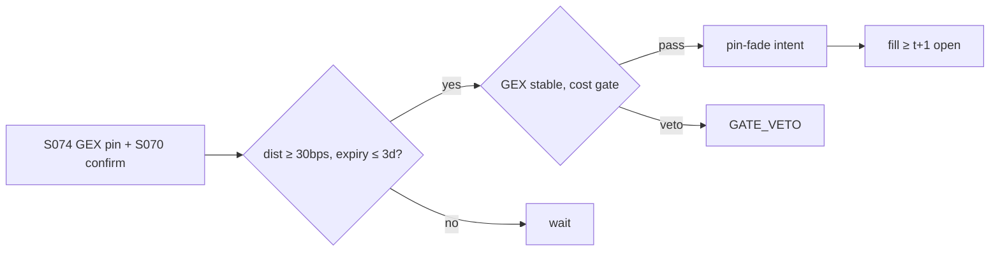

# T050 — GEX Pin / Dealer-Positioning Fade

Trades dealer gamma positioning: when aggregate gamma exposure (GEX) pins the underlying near a strike into expiry (Ni–Pearson–Poteshman 2005; Golez–Jackwerth 2012), the strategy fades deviations from the pin — short gamma effects mean the pin weakens as expiry approaches, so the fade is timed to the pin's decay. SqueezeMetrics (2016) is the GEX construction reference. Provenance **[D]**.

> Tag law: every numeric literal in prose carries one of `[documented]
> [default] [example] [unverified] [internal-est] [measured]` (legend: Appendix
> i v1.0.0). Constants inside cited formulas inherit the formula's tag.
> Bibliographic years, volumes, pages, arXiv IDs, section numbers, rule codes
> (C1–C12), fail-safe codes (F1–F5), module IDs, and machine-parsed §0 data
> fields are identifiers, not literals, and are exempt.

## §1 Five-minute reviewer card

| Row | Value |
|---|---|
| Module | T050 — GEX Pin / Dealer-Positioning Fade, v1.1.0 |
| Edge verdict | `PREDICTIVE-FEATURE-ONLY` — expiration-day pinning documented (Ni et al. 2005, JFE 78(1): ≥16.5 bp clustering; Golez–Jackwerth 2012: ≥$115M/day notional shift); no documented after-cost P&L for a tradable pin-fade rule |
| After-cost | `BEFORE-COST` — documented evidence is clustering magnitude, not net fade P&L; the fade's after-cost number is a model output, not literature |
| Build cost | Tier M = 20–60 h ≈ `$3,000–9,000` [documented] |
| Data cost | Research `$0`/yr (delayed/historical OI, SqueezeMetrics free GEX+ CSV) [documented]; production `$948–1,188`/yr vendor options data [documented] + OPRA licensing if not bundled by the vendor [unverified] |
| latency_class | intraday |
| risk_class | market |
| Capacity | strike-liquidity constrained [unverified]; documented aggregate pinning shift ≥$115M/day is the effect size, not capacity [documented] |
| Executability | needs OPRA + open-interest GEX build; the fade rule is simple |
| Risk summary | Pin breaks (gamma flips); dealer positioning mis-estimated (customer vs dealer attribution — DDOI sign); expiry-day chaos |
| When it dies | 0DTE regime changes; dealer positioning flips sign intraday |
| Regime gates | provisional R001 (GEX flip → flatten), R002 (expiry day → flat before close); restrictive default |
| Emits | `order_intents` (Appendix C v1.0.0) — OrderTicket intents only, never orders |

## §1.5 Cheapest / least-build path

1. **Prototype hour band:** 6–10 h [example] — GEX construction + pin detection + expiry-day execution.
2. **Cheapest-source row:** min_tier = **research: Tier 0** — historical OI (OPRA historical data is exempt from OPRA per-user fees [documented per OPRA-fees summary]), SqueezeMetrics free GEX+ CSV (daily SPX, updates ~5:30am ET [documented per guide]); **production: Massive (Polygon) Options from `$79`/mo, ORATS from `$99`/mo, ThetaData from `$80`/mo** [documented per options-API comparison, Jun 2026]; pre-computed GEX alternative: FlashAlpha free/`$79`/mo tiers [documented same]. OPRA licensing: bundled into the plan price by some vendors (Polygon Business, Databento Standard+ [unverified]); direct OPRA: redistributor `$1,500`/mo, professional display `$31.50`/user/mo, non-display `$2,000`/mo/category [documented per OPRA-fees summary] — verify on the current OPRA fee schedule before budgeting; latency_class = intraday;
   required_fields = option OI by strike/expiry, underlying price, option trade direction (for DDOI dealer-attribution per the SqueezeMetrics guide); price_band = `$0`/yr research [documented], `$948–1,188`/yr production vendor data [documented] (+ OPRA licensing if not bundled [unverified]); build_or_buy = **build** (GEX is a groupby-sum; the value is the DDOI attribution discipline).
3. **Resource budget:** Tier M per cost-model §5 = 20–60 h ≈ `$3,000–9,000` loaded at `$150`/hr [documented]; compute pattern `per_bar` (intraday bars); data footprint: one expiry chain/day/name ≈ MBs [internal-est].
4. **Skip list:** 0DTE intraday pinning; single-stock gamma squeezes; intraday DDOI re-estimation (daily DDOI is the documented construction).
5. **DO-NOT-CUT list:** causality assertions (`assert fill_event >
   signal_event`, no-signal-bar-fills test); COST block + callable
   `expected_cost_bps`; F1–F5 fail-safes + module-state enum; kill-switch
   state machine + re-arm checklist; decision-log audit records;
   bona-fide-intent + self-trade prevention; provenance tags on every numeric
   literal; fixtures + `test_cmd`; secrets via env only.
6. **Escalation gate:** upgrade from cheapest when any holds — pins stop holding; GEX attribution unstable; universe expands beyond SPX/single names into names where free DDOI proxies don't exist.

## §T0 Module contract

### T0.1 Typed signature

```python
def emit(state: ModuleState, signals: list[SignalVector], cfg: Config) -> list[OrderTicket]:
```

`OrderTicket` per Appendix C v1.0.0 (intents only — never wire orders).
`state` is the module-owned named state vector (`gex_level, pin_strike, dist_bps, position, qty, kill_state`); `signals` are
canonical SignalVectors (Appendix b v1.0.0) from the consumed S-modules, newest
last; the function emits zero or more intents per bar/event. Documented edge
cases: no signals → flat, no intents; `UNKNOWN` input signal → restrictive
(halve size / stand down per F1); kill-switch TRIPPED → emit nothing, state
`OFF`. 

### T0.2 Config dataclass

| Parameter | Type | Default | Range | Status |
|---|---|---|---|---|
| gex_window_d | int | `5` | [1, 20] | [default] |
| pin_dist_bps | float | `30.0` | [10.0, 100.0] | [default] |
| pin_reached_bps | float | `5.0` | [1.0, 15.0] | [default] |
| dist_conviction_cap | float | `1.5` | [1.0, 2.0] | [default] |
| expiry_days | int | `3` | [1, 7] | [default] |
| gex_stable_bars | int | `3` | [1, 10] | [default] |
| cost_gate_k | float | `0.50` | [0.1, 2.0] | [default] |
| risk_R_usd | float | `250.0` | [50.0, 1000.0] | [default] |
| stop_bps | float | `25.0` | [10.0, 100.0] | [default] |
| adv_cap_pct | float | `1.0` | [0.1, 10.0] | [default] |
| spread_full_bps | float | `3.0` | [1.0, 10.0] | [default] |
| taker_fee_bps | float | `0.30` | [0.1, 1.0] | [default] |
| maker_rebate_bps | float | `0.20` | [0.0, 0.5] | [default] |
| borrow_bps_per_day | float | `30.0` | [0.0, 200.0] | [example] |
| expected_hold_days | int | `1` | [1, 3] | [default] |
| impact_k | float | `20.0` | [5.0, 50.0] | [example] |
| daily_loss_stop_pct | float | `2.0` | [1.0, 5.0] | [default] |
| max_gross_mult | float | `4.0` | [1.0, 10.0] | [default] |
| cooldown_sessions | int | `1` | [0, 5] | [default] |
| venue | str | `primary-lit` | — | [example] |

All defaults tagged per the tag law (status `default` ⇒ `[default]`).
`cost_gate_k` was `1.00` in v1.0.0; reconciled to `0.50` in v1.1.0 to match
the fixture-validated gate (see changelog). The borrow convention is
`borrow_bps_per_day × expected_hold_days`, applied to SHORT fades only;
LONG fades pay no borrow.

### T0.2.1 Calibration procedure (per parameter — grid + OOS selection, no hand-tuning in production)

- `pin_dist_bps` (`30.0` [default]): grid `{10, 20, 30, 50, 100}` [example]; on walk-forward OOS expiry windows pick the smallest distance whose entry cohort shows mean reversion to the pin within the window (pre-cost) at ≥2× [example] the no-trade baseline drift. Sensitivity: high — the entry knob.
- `pin_reached_bps` (`5.0` [default]): grid `{1, 3, 5, 10}` [example]; must be < `pin_dist_bps / 2` [default]; choose by maximizing exits-before-expiry-day on OOS. Sensitivity: medium.
- `dist_conviction_cap` (`1.5` [default]): grid `{1.0, 1.25, 1.5, 2.0}` [example]; cap so the 95th-percentile [example] sized trade stays under `adv_cap_pct`. Sensitivity: low.
- `expiry_days` (`3` [default]): grid `{1, 2, 3, 5, 7}` [example]; pinning is an expiry effect — windows beyond `7` days [example] dilute the documented clustering; freeze the smallest window with stable OOS hit rate. Sensitivity: high.
- `gex_stable_bars` (`3` [default]): grid `{1, 2, 3, 5}` [example]; require no GEX sign change over the window; calibrate against the sign-flip false-entry rate on OOS. Sensitivity: medium.
- `cost_gate_k` (`0.50` [default]): grid `{0.1, 0.25, 0.5, 1.0, 2.0}` [example] against downstream net P&L on walk-forward OOS; the open item (0.5 vs 2) resolves per-chapter by calibration, not by convention. Sensitivity: high.
- `risk_R_usd` (`250.0` [default]): set from the account's per-trade R budget; shrink until walk-forward max drawdown < `daily_loss_stop_pct / 2` [default]. Sensitivity: high.
- `stop_bps` (`25.0` [default]): grid `{10, 25, 50, 100}` [example]; must exceed the documented clustering magnitude (16.5 bp [documented]) so the stop is not the pin noise itself. Sensitivity: high.
- `adv_cap_pct` (`1.0` [default]): grid `{0.1, 0.5, 1.0, 2.0}` [example]; participation cap; verify realized impact ≤ modeled `impact_k` term on OOS fills. Sensitivity: medium.
- `spread_full_bps`, `taker_fee_bps`, `maker_rebate_bps`: re-pinned from the production venue's published schedule on every `fee_schedule_as_of` review; never calibrated. Sensitivity: low (inputs, not knobs).
- `borrow_bps_per_day` (`30.0` [example]): GC+ spread for general-collateral names [example]; for hard-to-borrow names use the desk's realized rate — never the example value. Reconcile monthly against broker statements (see §T8 failure mode 5).
- `impact_k` (`20.0` [example]): square-root impact coefficient; calibrate by regressing realized slippage on `√(adv_pct)` over OOS fills; start at `20.0` only as a placeholder [example].
- `daily_loss_stop_pct` (`2.0` [default]), `max_gross_mult` (`4.0` [default]): policy parameters; set by the risk owner, not by backtest optimization.
- `cooldown_sessions` (`1` [default]): post-exit / post-block re-entry suppression; `0` disables (not recommended [default]).
- All chosen values re-validated quarterly [default]; any change logs a new `params_hash` (C5).

### T0.3 Canonical schema mapping

Vendor columns → canonical Event/Bar schema (Appendix a v1.0.0), stated once here:

| Vendor column | Canonical field | Notes |
|---|---|---|
| option OI | Bar: daily | GEX inputs (strike-level OI) |
| strikes + expiries | Bar: daily | pin-strike universe |
| underlying price | Bar | distance to pin |
| option trade direction | Bar: daily | DDOI dealer-attribution (SqueezeMetrics guide [documented]) |
| S074 signal fields | SignalVector | `dist_bps`, `days_to_expiry`, `gex_stable`, `gex_flipped`, `spot_above_pin`, `edge_bps` |
| bar timestamps | `event_ts` / `asof_ts` int64 ns UTC | `asof_ts ≥ event_ts` else F1 → `UNKNOWN` |

### T0.4 Time contract

> Time contract: clock domain UTC, int64 ns; authoritative causality clock =
> `event_ts`; max_skew = `5` s [default]; jitter budget = `1` s [default];
> bar-label = open time; staleness TTL = `15` min [default]; gap policy = mask, no
> interpolation; halt/auction → discard contributions across reopen.

**Timing box:** `signal@t (intraday bars, America/Chicago) → earliest fill @open(t+1)`

### T0.5 Market-state table

| State | Module behavior |
|---|---|
| CONTINUOUS_TRADING | Evaluate entry/exit rules; emit intents per §T2 |
| HALTED | Cancel working intents; emit nothing; state `UNKNOWN` until clean reopen |
| AUCTION | No new intents; hold intent-side state; state `DEGRADED` |
| CLOSED | Emit nothing; state `OFF` |


### T0.6 Module-state enum + error taxonomy

States per Appendix k v1.0.0: `OK | DEGRADED | UNKNOWN | OFF`. Invalid input →
`UNKNOWN`, never interpolate (Appendix f v1.0.0, F1–F5).

| Failure | State | Alert |
|---|---|---|
| Missing/stale input (TTL `15` min [default]) | `UNKNOWN` | page |
| Out-of-bounds indicator (F2) | `UNKNOWN` | page |
| Estimator disagreement (F3) | `UNKNOWN` | notify |
| Halt/auction per §T0.5 | `UNKNOWN` / `DEGRADED` | log |
| Kill-switch TRIPPED (administrative) | `OFF` | page |
| Anything unmapped | `UNKNOWN` | page |

### T0.7 Risk contract + kill switch

```yaml
risk_contract:
  per_trade_R: 250            # USD risk budget per trade [example]
  max_adverse_per_trade: 1.0 R [default]  # stop distance multiple [default]
  daily_loss_stop: 2% of equity [default]        # then no new entries; flatten managed risk [default]
  max_gross: 4× equity [default]              # hard gross exposure cap [default]
  kill_conditions:
    - daily P&L ≤ −daily_loss_stop_pct → TRIP (flatten pins)
    - GEX flips sign on 2 open pins → TRIP
    - decision-log write failure → TRIP (halt emission)
  enforcement: intraday-hard  # trips are automatic, not advisory [default]
  calibration_recipe: >
    Walk-forward on 60-day blocks [example]: fit thresholds on block t,
    freeze, validate realized shortfall vs predicted on block t+1;
    shrink per-trade R until max drawdown < daily_loss_stop/2 [default].
```

**Kill-switch state machine:** `ARMED → TRIPPED → RECOVERY → ARMED`.

- `ARMED`: normal operation; every bar evaluates the kill conditions.
- `TRIPPED`: any kill condition fires → cancel all working intents
  (`NEW`/`WORKING` → `CANCELLED`, idempotent), flatten managed positions via
  the exit rule, emit nothing new, state `OFF`, log `KILL_TRIP`.
- `RECOVERY`: manual operator review only — no automatic transition.
- `ARMED` (re-entry): only after the re-arm checklist passes in full, logged
  as `KILL_REARM` with the checklist result.

**Re-arm checklist** (all must be true):

- [ ] Feed health green: all §T5 inputs fresh inside the staleness TTL.
- [ ] Kill condition cleared: the tripping metric is back inside limits for `30 min [default]` [default].
- [ ] Decision log reconciled: `KILL_TRIP` record present and hash chain intact.
- [ ] Risk re-check: per-trade R and gross caps re-confirmed against current equity.
- [ ] Operator sign-off: named human approves re-arm (no automatic recovery).

### T0.8 Ops tail

- **Schedule:** nightly batch; owner: strategy owner (named).
- **Health checks:** fixture replay (`test_cmd`) green on deploy; live
  decision-log append monitor; kill-switch state heartbeat.
- **Alert table:** `UNKNOWN`/`OFF` state transitions; kill-trip pages immediately [default].
- **Resource budget:** nightly batch: < 2 vCPU-h, < 4 GB RAM [example].
- **Runbook stub:** 1) confirm kill-state; 2) inspect decision log for the tripping record; 3) verify feed freshness; 4) re-arm checklist (operator sign-off); 5) re-run fixture; 6) resume..

### T0.9 Secrets (env-only)

- `BROKER_API_KEY (paper venue, env-only)`
- `DATA_API_KEY (env-only)` via environment only. No secrets in this file, fixtures, or
logs (CI secrets-grep).

### T0.10 May / must-NOT

> **May:** emit `OrderTicket` intents per Appendix C v1.0.0; track intent-side
> state (`NEW → WORKING → FILLED / CANCELLED / PARTIAL`); issue cancel-replace
> via new tickets with new `ticket_id`s. **Must-NOT:** place orders on any
> venue, hold broker/exchange sessions, net intents into orders inside the
> strategy, treat the intent-side state machine as broker wire truth, or emit
> prices/share-counts/notionals outside an `OrderTicket`.

## §T1 Legacy (subsumed by §1)

Legacy §T1 content is the §1 reviewer card above; this header is retained so
section numbering stays frozen.

## §T2 Specification

### Universe

Names with listed options, clean OI, and monthly expiries; index first.

### Entry rule (Boolean — no prose-only conditions)

```
GEX = sum(strike_gamma * DDOI * multiplier)            # SqueezeMetrics [documented]: DDOI = dealer directional OI, signed by trade direction
pin = strike with max |GEX|                              # magnet strike
dist = |spot - pin| / spot * 1e4
gex_stable = no sign change of GEX over last gex_stable_bars(3) bars [default]
ENTRY = dist >= pin_dist_bps and days_to_expiry <= expiry_days and gex_stable -> fade toward pin
```

Units: GEX in `$000`s per index point (SqueezeMetrics guide [documented]);
positive GEX = dealers stabilizing (buy dips), negative = destabilizing.

### Exits (with post-exit cooldown)

```
pin reached -> dist < pin_reached_bps (5.0 [default]) -> FLAT
pin breaks -> GEX flips sign -> FLAT immediately
expiry -> flat before the close on expiry day (days_to_expiry == 0)
post-exit cooldown -> no re-entry for cooldown_sessions (1 [default]) after any exit or compliance block (C10)
```

### Position sizing (fenced function)

```python
def shares(risk_budget_R, stop_distance, vol_estimate, ADV_cap, cost):
    """Canonical sizing: shares = f(risk_budget_R, stop_distance,
    vol_estimate, ADV_cap, cost). The cost gate is the §T3 predicate;
    sizing stays cost-aware through the stop distance."""
    per_share_risk = max(stop_distance * vol_estimate, 1e-12)
    return max(0, min(int(risk_budget_R / per_share_risk), int(ADV_cap)))

def size_pin_fade(risk_budget_R, stop_bps, px, adv_shares, adv_cap_pct,
                  dist_bps, pin_dist_bps, dist_conviction_cap):
    """Module entry sizing: canonical shares() x pin-distance conviction scalar
    (deeper dislocations get more size, capped)."""
    base = shares(risk_budget_R, stop_bps / 1e4, px,
                  adv_cap_pct / 100.0 * adv_shares, None)
    return max(1, int(base * min(dist_bps / pin_dist_bps, dist_conviction_cap)))
```

### Risk limits

| Limit | Value |
|---|---|
| Max pin notional/name | `$1M` [example] |
| Pin distance | `30` bps [default] |
| Expiry-day flat rule | hard [default] |

### COST block (single source of truth)

Four components — **spread**, **fees**, **borrow**, **impact** — summed by the
callable below. Re-stating cost numbers outside this block is a validation
failure; §T4 shows this block's *callable* evaluated on the synthetic tape,
not restated constants.

| Component | Value (bps) | Basis |
|---|---|---|
| Spread (half, underlying) | `1.50` | [example] |
| Fees (taker) | `0.30` | [example]; venue schedule re-pinned per `fee_schedule_as_of` |
| Borrow (SHORT fades only) | `borrow_bps_per_day × expected_hold_days` = `30.00` | [example]; GC+ spread; LONG fades pay `0.00` |
| Impact | `k·√(adv_pct/100)`, k=`20.0` | [example] |
| **Total reference, SHORT fade (one-way)** | `33.21` | [example] |
| **Total reference, LONG fade (one-way)** | `3.21` | [example] |

`fee_schedule_as_of`: `2026-09-01` [default] — review-time pin; re-pin to the
production venue's published schedule before trading. Regulatory components
as of that date: SEC §31 FY2026 `$20.60`/M effective 2026-04-04 [documented];
FINRA TAF `$0.000166`/share capped `$8.30` [unverified — verify on FINRA's
schedule before production]. `side`: `taker`; venue/tier/source:
`primary-lit` [example].

```python
def expected_cost_bps(notional, adv_pct, venue, side, urgency, cfg,
                      intent_side="BUY"):
    """COST-block callable. Pin-fade: underlying economics. `side` is the
    execution side (taker|maker|mixed); borrow is driven by the intent side."""
    spread = cfg.spread_full_bps / 2.0
    fee = -cfg.maker_rebate_bps if side == "maker" else cfg.taker_fee_bps
    borrow = (cfg.borrow_bps_per_day * cfg.expected_hold_days
              if intent_side in ("SELL", "SHORT") else 0.0)
    impact = cfg.impact_k * math.sqrt(max(adv_pct, 0.0) / 100.0)
    if urgency == "high":
        impact *= 1.5
    return spread + fee + borrow + impact
```

### Execution / fill model table

| Aspect | Assumption |
|---|---|
| Fill venue | underlying primary lit [example] |
| Latency | intent at bar `t` → earliest fill at open(t+1); no intraday fill on the signal bar [default] |
| Slippage model | mid-price ± half-spread on the fill bar's open; pin-distance slippage added per the impact term |
| Partial fills | IOC sweep of displayed size at the pin-side quote; remainder canceled, no chase [example] |
| Impact | square-root term in the COST block, applied at entry sizing |
| Adverse fill | pin-break adverse selection: fill then GEX flips within `30` min [example] → monitored via §T8 failure mode 1 |
| Halt behavior | flat before expiry-day chaos; no new pins on halts; `HALTED` cancels working intents (§T0.5) |
| Auction behavior | no new intents in `AUCTION`; state `DEGRADED` (§T0.5) |

Fine-grained fill behavior is synthetic and labeled `simulated only — requires MBO/ITCH`:
no MBO/ITCH feed is consumed by this module; any fill realism beyond the
mid-price ± half-spread fill model above would require MBO/ITCH data.

### Robustness

Perturb thresholds ±20% [example]; the reference behavior (entry/exit intents, gate blocks, kill trip) must be invariant; degrade entry→no-trade on indicator breach.

**Pricing/Greeks (options-domain conditional).** The strategy trades the
*underlying* against dealer gamma: the pin exists because dealers are short gamma near
the strike and hedge toward it. Position greeks: delta `±1.0` [example] (directional fade);
the edge is positional, not in the options' greeks. Expiry/assignment: flat before the
expiry-day close — never carry a pin fade through settlement.

### Compliance sub-block (C1–C12)

| Code | Rule: trigger → check → action → log |
|---|---|
| C1 | STP + self-match prevention: trigger = intent could match our own resting interest → check = every ticket carries `self_trade_prevention: true`; maker modules compare against own open tickets → action = cancel own resting quote before posting the aggressive side; cancel-replace via new `ticket_id` only → log = `COMPLIANCE_BLOCK` with rule code `C1` |
| C2 | Bona-fide intent: trigger = entry rule fires → check = cost gate passes AND qty within risk limits AND (SHORT ⇒ `locate_ok`) → action = veto the intent if any check fails; no quote entered without intent to trade → log = `GATE_VETO` with the failed check |
| C3 | Message-rate / cancel-to-trade: trigger = intents+ cancels per symbol per minute exceed `120` [default] → check = rolling `60`-s [default] message counter → action = throttle to `1` intent per `10` s [default] and alert → log = `COMPLIANCE_BLOCK` with the counter value |
| C4 | Pre-trade fat-finger trio: trigger = any new intent → check = (a) limit within `±10%` of reference [default], (b) ticket notional ≤ ``$2M`` [default], (c) ≤ `20` tickets per `1 min` [default] → action = block the ticket, alert → log = `COMPLIANCE_BLOCK` with the breached leg |
| C5 | Decision-log schema (Appendix g v1.0.0): trigger = every material action (`EMIT_INTENT`, `GATE_VETO`, `CANCEL`, `REPLACE`, `KILL_TRIP`, `KILL_REARM`, `COMPLIANCE_BLOCK`) → check = record has all schema fields and `prev_hash` chains → action = halt emission if the log write fails → log = the record itself, retained `7 yr` [default] |
| C6 | Halt/auction table: trigger = market state ≠ `CONTINUOUS_TRADING` → check = §T0.5 table → action = `HALTED`: cancel working intents, emit nothing; `AUCTION`: no new intents; `CLOSED`: state `OFF` → log = state-transition record |
| C7 | Locate check (short sales): trigger = `SHORT` intent → check = `locate_ok` from the pre-open easy-to-borrow list or desk locate; Reg-SHO threshold securities hard-blocked → action = veto without locate → log = `GATE_VETO` with code `C7`. Underlying fade may be short — needs locate_ok (C7). |
| C8 | Public-dissemination gate: trigger = any export of signals/intents outside the firm → check = review gate sign-off → action = block unreviewed exports → log = `COMPLIANCE_BLOCK` |
| C9 | Data-entitlement assertions (Appendix j v1.0.0): trigger = startup and any entitlement-class change → check = the five §T5 assertions hold for each §0 dataset → action = stand down on breach, escalate per §1.5 → log = entitlement review record |
| C10 | Post-exit cooldown: trigger = exit or compliance block → check = `now >= cooldown_until` (`1 session [default]` [default]) → action = suppress re-entry until the cooldown elapses → log = `GATE_VETO` with code `C10` |
| C11 | Kill-switch integration: trigger = `TRIPPED` → check = all working intents transitioned `NEW`/`WORKING` → `CANCELLED` (idempotent) → action = no new intents until `ARMED` via the §T0.7 checklist → log = `KILL_TRIP` / `KILL_REARM` records |
| C12 | C12 Expiry-governance: trigger = position open on expiry day → check = flat-before-close rule → action = flatten → log with code `C12` |

### Parameter table

| Parameter | Symbol | Value | Tag | Sensitivity |
|---|---|---|---|---|
| GEX window | W | `5` days | [default] | medium |
| Pin distance | d* | `30.0` bps | [default] | high — the entry knob |
| Pin-reached band | d_exit | `5.0` bps | [default] | medium |
| Distance conviction cap | c_d | `1.5` | [default] | low |
| Expiry window | E | `3` days | [default] | high — pinning is an expiry effect |
| GEX stability bars | n_s | `3` | [default] | medium |
| Cost-gate k | k | `0.50` | [default] | high |
| Borrow | b | `30.0` bps/day [example] | [example] | high on SHORT fades |

### Timing box

`signal@t (intraday bars, America/Chicago) → earliest fill @open(t+1)`

## §T3 Math + normative pseudocode

Ni–Pearson–Poteshman (2005) [documented]: stock price clustering on option
expiration dates — returns altered by an average of at least 16.5 bp,
aggregate market-cap shifts on the order of $9 billion [documented] — the
documented pinning core. Golez–Jackwerth (2012) [documented]: pinning in
S&P 500 futures toward ATM on serial expirations; associated shift in
notional futures value at least $115 million per expiration day [documented].
SqueezeMetrics (2016) [documented]: the aggregate-GEX construction this
strategy implements — GEX in `$000`s per index point, built from Dealer
Directional Open Interest (DDOI, signed by option trade direction), with
attribution honesty per S074. Barbon et al. [documented]: option-market
imbalances and end-of-day price dynamics — a large negative (positive)
aggregated gamma imbalance gives end-of-day momentum (reversal), reverting
at the next day's open — the mechanism context.

**Normative pseudocode** (pseudocode is normative; prose is commentary):

```
def emit(state, signals, cfg):
    sig = primary(signals, "S074")          # GEX pin + distance
    if sig is None or invalid(sig): return [], state.unknown()   # F1/F2: never interpolate
    if sig.market_state != "CONTINUOUS_TRADING":                  # §T0.5
        return [], state.halted_or_degraded(sig.market_state)     # HALTED -> UNKNOWN; AUCTION -> DEGRADED
    if state.position != 0:
        if (sig.dist_bps < cfg.pin_reached_bps or sig.gex_flipped
                or sig.days_to_expiry == 0 or stopped(state, cfg)):
            return [exit_ticket(state)], state.flat()   # exits never cost-gated [default]
        return [], state.ok()
    if (sig.dist_bps >= cfg.pin_dist_bps and sig.days_to_expiry <= cfg.expiry_days
            and sig.gex_stable and sig.asof_fresh):
        side = "SELL" if sig.spot_above_pin else "BUY"   # fade toward the pin
        cost = expected_cost_bps(notional_est(sig), adv_pct_est(sig),
                                 cfg.venue, "taker", "normal", cfg,
                                 intent_side=side)
        # ^^^ normative cost-gate predicate: expected_cost_bps(...) <= k * edge_bps
        if cost <= cfg.cost_gate_k * sig.edge_bps:
            t = OrderTicket.intent(side, qty=size_pin_fade(...), limit=last_price())
            t.intent_ts = sig.computed_at
            assert fill_event > signal_event  # t->t+1 causality: no-signal-bar fills
            return [t], state.open("PIN_FADE")
        log("GATE_VETO", cost=cost, edge_bps=sig.edge_bps)
    return [], state.ok()
```

`notional_est` / `adv_pct_est` are the bar's notional and ADV participation;
`size_pin_fade(...)` is the §T2 fenced sizing; `exit_ticket` emits the
opposite-side intent for the open quantity.

Causality: every feature uses inputs with `event_ts ≤ t` only; the earliest
fill for a bar-`t` intent is bar `t+1`'s open. Mandatory unit test:
no-signal-bar fills.

## §T4 Worked example (fixture-backed)

- Tape: `modules/fixtures/T050_tape.csv` — `# TYPE: validation-run`;
  `12` synthetic bars (seed `4500` [example]); `event_ts`/`asof_ts` int64 ns
  UTC; columns now carry the module's own fields (`dist_bps`,
  `days_to_expiry`, `gex_stable`, `spot_above_pin`) instead of the old
  z-score proxy; every number synthetic.
- Expected outputs: `modules/fixtures/T050_expected.csv` — per-bar intent,
  quantity, the **cost-function call** (`expected_cost_bps` inputs → bps →
  dollars; `cost_call_bps` is the taker/LONG-fade reference, `gate_pass`
  uses the actual intent-side cost), cost-gate verdict, and module state.
- Tolerance: `1e-9` [default] on floats; integer quantities exact.
- Acceptance tests (`modules/tests/test_T050.py` — `8` [default] tests):
  1. TYPE header + columns present; 2. fixture recomputes to expected
  (reference `process_bar` vs expected CSV); 3. entry/exit sides + pin-distance
  conviction sizing (BUY entry, SELL exit, qty `1405`); 4. no-signal-bar fills
  (`assert fill_event > signal_event`); 5. cost-gate predicate passes on large edge, blocks on tiny edge (`k = 0.5` [default]);
  6. SHORT-fade borrow accrues in the cost callable; 7. kill-switch trip blocks
  intents, re-arm checklist restores `ARMED`; 8. invalid input
  (halted/invalid bar) → `UNKNOWN`, no intents.
- `test_cmd`: `python3 -m pytest modules/tests/test_T050.py -q` → exits `0` [default].

**Cost-function calls on the tape** (the COST-block callable evaluated on
synthetic rows — inputs → bps → dollars; all values [example];
`cost_call_bps` = taker/LONG-fade reference):

| Bar | `expected_cost_bps` inputs | Components → total → $ | Cost gate `expected_cost_bps(...) <= k * edge_bps` | Intent / state |
|---|---|---|---|---|
| `0`–`2` | dist `20`–`28` < `30` [default] | no entry evaluated | — | `HOLD` / `OK` |
| `3` | notional=`100000` [example], adv_pct=`0.5` [example], venue=`primary-lit`, side=`taker`, urgency=`normal`, intent_side=`BUY` | spread `1.5` + fee `0.3` + borrow `0.0` + impact `1.41` = `3.21` bps → `$32.14` | `12.856854249492379` edge, k=`0.5` [default] → `3.21 ≤ 6.43` PASS | `BUY` `1405` / `OK` |
| `4`–`5` | position open | — | exits not gated | `HOLD` / `OK` |
| `6` | dist=`3.0` < `5.0` [default] pin-reached | exit, never cost-gated [default] | — | `SELL` `1405` / `OK` |
| `7` | intent_side=`SELL` (spot above pin) | spread `1.5` + fee `0.3` + borrow `30.0` + impact `1.41` = `33.21` bps | `0.05` edge, k=`0.5` [default] → `33.21 ≤ 0.03` BLOCK | `HOLD` / `OK` |
| `8` | `HALTED` | — | — | `HOLD` / `UNKNOWN` |
| `9` | daily P&L `-2.1%` [example] ≤ −stop (`2.0%` [default]) | — | — | `HOLD` / `OFF` |

**Hand-checks.** Row `3` (entry): dist=`42.0` ≥ `30.0` [default], dte=`2` ≤ `3`,
gex_stable ✓, spot below pin → `BUY`; qty = `shares(250, 25/1e4, 99.55, 1%/100 × 2,000,000, _)`:
raw = `250 / (0.0025 × 99.55)` = `1004` → × min(`42/30`, `1.5`) = `1405.6` →
`1405` shares [example], ADV-capped at `20000`; ticket `T050-0003`,
`intent_ts` = bar-3 `event_ts`, `parent_signal` = `S074@<bar-3 event_ts>`.
Row `6` (exit): dist=`3.0` < pin_reached `5.0` [default] → `SELL` `1405`,
exits never cost-gated [default]. Row `7` (gate block): would-be SHORT fade,
borrow accrues → `33.21` bps vs edge `0.05` → gate `33.21 ≤ 0.025` BLOCKS →
no intent, state stays `OK`. Row `8` (halt): `HALTED` → `UNKNOWN`, no intents,
never interpolate. Row `9` (kill): daily P&L `-2.1%` [example] ≤ −stop
(`2.0%` [default]) → `ARMED → TRIPPED`, state `OFF`, no intents. Causality:
entry intent at row `3` has `intent_ts` = bar-3 `event_ts`; the earliest fill
is bar `4`'s open — the test asserts `fill_event > signal_event` on every
intent row.

**Where the example is optimistic.** Costs are the COST-block model, not realized fills; capacity, borrow squeezes, and regime shifts are not in the tape.

## §T5 Dependencies + data

### Consumed signals (from deps.yaml — machine edge list)

| Signal | Version pin | Role |
|---|---|---|
| S074 | 1.0.0 | primary |
| S070 | 1.0.0 | confirm |
| S076 | 1.0.0 | gate |

### Pinned formula excerpts (≤10 lines each, CI hash-checked)

**S074** (v1.0.0): `GEX = Σ Γ_strike · OI · mult`; pin = argmax|GEX| [documented].
**S070** (v1.0.0): straddle-implied move as the pin-break detector [documented].

### Data required

| Field | Type | Granularity | Source tier | Notes |
|---|---|---|---|---|
| option open interest | int | daily | OPRA | GEX construction |
| strikes + underlying | float | intraday | OPTIONS | pin distance |

**Data rights row** (Appendix j v1.0.0): OPRA licensed per professional subscriber; OI from vendor; entitlements re-asserted at startup.

## §T6 Local build + buy vs build

GEX arithmetic is a groupby-sum; the attribution honesty (customer vs dealer) is the hard part.

| Route | What you get | Verdict |
|---|---|---|
| Build | GEX engine in-house | recommended |
| Buy | GEX vendor feed | acceptable for attribution if honest |

**Verdict:** Build the GEX; verify any vendor's attribution before trusting the pin.

## §T7 Efficacy — documented evidence

| Study / source | Market & period | Metric | Before/after cost | Caveat |
|---|---|---|---|---|
| Ni et al. (2005), JFE 78(1):49–87 | US equities, expiration days | closing-price clustering ≥16.5 bp; ~$9B aggregate market-cap shifts | before cost | the pinning core; hedge-rebalancing + manipulation evidence |
| Golez–Jackwerth (2012), JFE 106(3):566–585 | S&P 500 futures, serial expirations | pinning toward ATM; ≥$115M notional shift/expiration day | before cost | futures, not single-stock pins |
| SqueezeMetrics (2016) | method | GEX construction guide (DDOI, $000s/point) | n/a | methodology, not P&L |
| Barbon et al. (WP, SoFiE 2022) | US equities | negative (positive) gamma imbalance → end-of-day momentum (reversal); reverts at next open | before cost | working paper — verify |

**Selection disclosure:** Studies below are the chapter's documented sources only — no post-hoc selection from a wider literature search.

**Capacity & decay.** Edge decays with crowding and regime shifts; treat any printed Sharpe as a pre-cost, in-sample-era artifact unless the source says otherwise.

**Honest bottom line.** Honest bottom line: pinning is real, small, and well-known — the fade earns the pin's basis points minus the chaos of expiry day. Size it as a basis-point trade, not a strategy.

## §T8 Failure modes & pitfalls

| # | Trigger → Detect → Action → Recovery | check: |
|---|---|---|
| 1 | Pin break (GEX flips sign intraday) → detect: `gex_flipped` on the signal → flatten immediately → recovery: log + cooldown 1 session [default] | check: sign-flip rate on 60-day walk-forward; >`20%` [example] of entries → widen `pin_dist_bps` |
| 2 | Attribution error (customer vs dealer DDOI mis-signed) → detect: entry-day realized slippage > 2× [default] modeled cost → widen `pin_dist_bps` ×`1.5` [default] → recovery: quarterly attribution audit vs OCC-cleared proxy | check: quarterly DDOI audit; mis-sign rate tracked |
| 3 | Expiry-day chaos (volume > 3× [default] ADV by 14:00 CT [default]) → detect abnormal volume → flatten before close → recovery: log | check: flat-before-close compliance `100%` [default] |
| 4 | 0DTE regime (intraday pins dominate; monthly pin never engages) → detect: `5` [default] consecutive expiries with no engagement → stand down monthly-pin logic → recovery: review | check: regime monitor engagement rate |
| 5 | Borrow squeeze on SHORT fades (realized `borrow_bps_per_day` > 3× [default] assumed) → detect: broker-statement reconciliation → cap SHORT-fade size to `0` → recovery: log, re-enable on desk locate | check: monthly borrow-rate reconciliation |
| 6 | Stale OI on expiry week (`asof_ts` older than staleness TTL `15` min [default]) → detect: feed freshness monitor → state `UNKNOWN`, no new intents → recovery: resume on fresh data | check: feed freshness monitor green |

## §T9 Regime gates + visuals

**Regime-gate machine** (restrictive default; `regime_ids` pinned provisionally
as `[R001, R002]` until the R001–R050 annotation pass):

| regime_id | direction | mechanism | condition | action | min_lag | unknown_behavior |
|---|---|---|---|---|---|---|
| R001 | flatten | GEX flip | sign change | exit immediately | immediate | restrictive |
| R002 | flat rule | expiry day | calendar | flat before close | 1 day | restrictive |



## §T10 Source log + unverified leads

**Sources** (citable facts only):

1. Ni, S. X., Pearson, N. D. & Poteshman, A. M. (2005). "Stock Price Clustering on Option Expiration Dates." *Journal of Financial Economics* 78(1), 49–87. https://doi.org/10.1016/j.jfineco.2004.08.005 — ≥16.5 bp average clustering; ~$9B aggregate market-cap shifts [documented]
2. Golez, B. & Jackwerth, J. C. (2012). "Pinning in the S&P 500 Futures." *Journal of Financial Economics* 106(3), 566–585. https://doi.org/10.1016/j.jfineco.2012.06.010 — ≥$115M notional shift per expiration day [documented]
3. SqueezeMetrics (2016, rev. 2017). "GEX — Gamma Exposure" methodology guide. https://squeezemetrics.com/monitor/static/guide.pdf — GEX in $000s per index point; DDOI dealer-attribution; positive GEX = stabilizing [documented]
4. Barbon, A., Beckmeyer, H., Buraschi, A. & Moerke, M. "The Role of Leveraged ETFs and Option Market Imbalances on End-of-Day Price Dynamics." Working paper, SoFiE 2022 conference paper. https://www.alexandria.unisg.ch/entities/publication/7d6c52e3-6f8e-46cf-962c-09d3faacc98f — negative (positive) gamma imbalance → end-of-day momentum (reversal), reverts at next open [documented]
5. SEC Fee Rate Advisory FY2026 (2026-02-27). https://www.sec.gov/rules-regulations/fee-rate-advisories/2026-2 — §31 rate `$20.60`/M effective 2026-04-04 [documented]
6. OPRA fee summary (secondary; verify on the OPRA fee schedule before production). https://github.com/ciinc/robinhood-options-mobile/blob/HEAD/docs/market-data-providers-research.md — redistributor `$1,500`/mo; professional display `$31.50`/user/mo; non-display `$2,000`/mo/category; historical (1+ day) data exempt from per-user fees [documented per this summary]
7. Options data vendor pricing comparison (Jun 2026). https://medium.com/@diseasex/best-options-data-apis-2026-7-compared-pricing-free-tiers-d3833b7cf2f0 — Massive/Polygon options from `$79`/mo; ORATS from `$99`/mo; ThetaData from `$80`/mo; FlashAlpha pre-computed GEX free/`$79`/mo tiers [documented per this comparison]

**Chatbot source log.** Grok answered the Q-batch (2026-09-10); all claims independently verified or labeled unverified. Chatbot output is leads, never facts.

**Unverified leads** (chatbot-only — never in evidence tables):

- Grok (2026-09-10, Q-TB5): GEX-pin P&L magnitudes — *unverified chatbot claims*.
- 0DTE intraday pinning — research lead, not validated.
- FINRA TAF `$0.000166`/share capped `$8.30` [unverified — could not confirm a 2026 schedule; verify on FINRA's published schedule before production].
- Vendor OPRA-licensing bundling (Polygon Business, Databento Standard+) [unverified — per the secondary OPRA-fees summary only].

### GROK-NEEDED (web-unanswerable — exact questions for the Grok research batch)

1. **Tradable pin-fade P&L.** Is there any documented after-cost P&L for a tradable expiration-day pin-fade rule (academic paper, practitioner whitepaper, or fund letter with methodology)? Ni (2005), Golez–Jackwerth (2012), and Barbon et al. document the effect, not a net-of-cost strategy. If none exists, confirm the gap.
2. **Single-name DDOI methodology.** Beyond SqueezeMetrics' SPX construction, is there a published dealer-attribution (DDOI-style, trade-direction-signed OI) methodology for single-name options that a builder can implement from OPRA data? Cite the source.
3. **0DTE pin decay.** Any documented evidence on whether the classic monthly-expiry pinning effect (Ni 2005) has decayed or inverted under the 0DTE regime (2022+)? Cite papers with dates.
4. **Borrow cost on short fades.** What is a defensible realized borrow-rate source for shorting high-GEX large-cap names into expiry (GC vs special), and what convention do practitioners use — bps/day or bps/round-trip?
5. **OPRA professional device fee, current.** What is the current OPRA professional subscriber device-based monthly fee for a single-device research build, per the current OPRA fee schedule?

---

## Appendix — AI build prompt (T050)

Copy-paste into any chat agent:

> Build module **T050 — GEX Pin / Dealer-Positioning Fade** per `notes/module-template.md` v1.0.0 and
> this file's §T0 contract (v1.1.0).
> Cheapest path (§1.5): prototype 6–10 h [example]; cheapest data: Tier-0 delayed/historical OI for research, Massive/Polygon Options from `$79`/mo [documented] for production; compute pattern `per_bar`; DDOI dealer-attribution is the hard part — build it, don't trust raw OI.
> Implement `emit(state, signals, cfg) -> list[OrderTicket]` (Appendix c
> v1.0.0) with the §T3 normative pseudocode, including the pin-distance entry
> rule, the cost-gate predicate `expected_cost_bps(...) <= k * edge_bps`
> (side-driven borrow), and `assert fill_event > signal_event`. Emit intents
> only — never place orders. Exits are never cost-gated. Wire F1–F5
> (Appendix f v1.0.0): invalid input → `UNKNOWN`, never interpolate. Kill
> switch `ARMED → TRIPPED → RECOVERY → ARMED` with the §T0.7 re-arm checklist.
> Log decisions per Appendix g v1.0.0. Secrets via env only. Run the fixture
> `modules/fixtures/T050_tape.csv` (`# TYPE: validation-run`) against
> `modules/fixtures/T050_expected.csv` (tolerance `1e-9` [default]).
> **Definition of done:** `python3 -m pytest modules/tests/test_T050.py -q` exits `0` [default] (`8` tests). Tag every numeric literal
> you add with the unified enum (Appendix i v1.0.0); put anything unverifiable
> in §T10 unverified leads.
