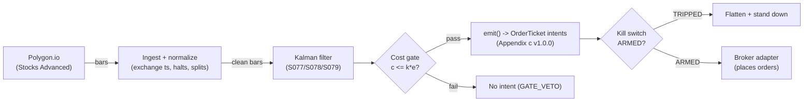

# T051 — Kalman Fair-Value Trend

Intraday trend-following on a Kalman-filtered fair value, with position size driven by the filter's own confidence. Provenance **D/SR**.

> Tag law: every numeric literal in prose carries one of `[documented]
> [default] [example] [unverified] [internal-est] [measured]` (legend: Appendix
> i v1.0.0). Bibliographic years, volumes, pages, arXiv IDs, section numbers,
> rule codes (C1–C11), fail-safe codes (F1–F5), module IDs, and machine-parsed
> §0 data fields are identifiers, not literals, and are exempt.

## §1 Five-minute reviewer card

| Row | Value |
|---|---|
| Module | T051 — Kalman Fair-Value Trend, v1.1.0 |
| Edge verdict | `INSUFFICIENT-EVIDENCE` — documented lag-reduction vs moving averages, but no published after-cost Sharpe for the standalone velocity rule |
| After-cost | `BEFORE-COST` — one-sentence verdict: a calibration-dependent smoothing edge — the filter lags less than an MA given correct Q/R, and P(t|t) sizes the bet, but no documented after-cost edge as a standalone trigger |
| Build cost | Tier M+ · `40–100` h [internal-est] · `$6,000–15,000` loaded [internal-est] |
| Data cost | Research `~$0–29`/mo [unverified — free/Starter tier bands per third-party docs; confirm at polygon.io/pricing]; production `~$199`/mo [unverified — third-party docs; confirm at polygon.io/pricing] — bands indicative, verify before budgeting |
| latency_class | bar / 5-minute |
| risk_class | medium |
| Capacity | `$50–200`M/day notional [example] — liquid large-caps on 5-min bars; bottleneck is per-name Q/R calibration, not impact; `max_notional = f(participation_cap, ADV, spread_regime)` per §T2 Risk limits |
| Executability | Feasible: Python+polars on 5-min bars; Kalman update is O(`1`) [documented] per bar per name |
| Risk summary | Calibration risk dominates: wrong Q/R turns the lag advantage into whipsaw; innovation-variance blowups mark regime breaks the filter cannot see |
| When it dies | Q/R miscalibrated; innovation variance `>3`× trailing median for `3` bars [example]; volatile-state regimes (S079 vetoes); earnings gaps |
| Regime gates | Provisional machine records in §T2: S079 trending/low-vol posterior `>0.60` [example] required; volatile state vetoes entries; unknown regime → veto (restrictive default) |
| Emits | `order_intents` (Appendix c v1.0.0) — intents only, never orders |

## §1.5 Cheapest / least-build path

1. **Prototype hour band:** `40–100` h [internal-est] — Kalman recursion + AR(1) confirm + HMM gate + cost/risk harness + fixture.
2. **Cheapest-source row:** min_tier = Polygon.io Stocks Advanced — cheapest data source candidate [internal-est]; latency_class = bar / 5-minute; required_fields = 1-min OHLCV bars, corporate actions; price_band = research `$0`/mo free tier, production `~$199`/mo [unverified — third-party pricing docs (pickuma.com review, ~May 2026; omniscient/markethawk POLYGON_RATE_LIMITS.md); **confirm at polygon.io/pricing before budgeting**]; build_or_buy = **build the filter, buy the bars**.
3. **Resource budget:** `1` core [internal-est], `<4` GB RAM [internal-est] for `500` names [example] on 5-min bars; compute pattern `per_bar`.
4. **Skip list:** tick-level execution; multi-venue; colocated deployment; Rust rewrite.
5. **DO-NOT-CUT list:** causality assertions (`assert fill_event > signal_event`, no-signal-bar-fills test); COST block + callable `expected_cost_bps`; F1–F5 fail-safes + module-state enum; kill-switch state machine + re-arm checklist; decision-log audit records; bona-fide-intent + self-trade prevention; provenance tags on every numeric literal; fixtures + `test_cmd`; secrets via env only.
6. **Escalation gate:** upgrade from cheapest when any holds — universe `>500` names [default]; bar cadence `<1` min [default]; cost gate fails on `[measured]` costs.

## §T0 Module contract

### T0.1 Typed signature

```python
def emit(state: ModuleState, signals: list[SignalVector], cfg: Config) -> tuple[list[OrderTicket], ModuleState]:
```

`OrderTicket` per Appendix c v1.0.0 — **intents only**; the strategy never
places orders, never holds broker/exchange sessions, never nets intents into
orders. `state` is the module-owned named state vector (`position`,
`sleeve_weights`, `cooldown_until`, `kill_state`, `module_state`); `signals`
are canonical SignalVectors (Appendix b v1.0.0), newest last. The function
returns the ticket list **and** the post-evaluation `ModuleState` (a
`Result`-style envelope — `UNKNOWN` is carried in the state field, never
smuggled into the ticket list). The function handles documented edge cases:
empty signals → `([], UNKNOWN)`; halt/auction bars → freeze per the
market-state table; stale inputs → `([], UNKNOWN)` (F4), never interpolate.

### T0.2 Config dataclass

| Parameter | Type | Default | Range | Status |
|---|---|---|---|---|
| `theta` | float | `0.15` [default] | `0.05`–`0.50` | default |
| `theta_z` | float | `0.5` [default] | `0.2`–`2.0` | default |
| `Q` | float | `1e-6` [internal-est] | calibrated | calibrate |
| `R` | float | `4e-6` [internal-est] | calibrated | calibrate |
| `pi_trend_min` | float | `0.60` [default] | `0.5`–`0.9` | default |
| `risk_budget_R` | float | `300.0` [internal-est] | `100`–`1,000` [default] | calibrate |
| `P_ref` | float | `0.14` [internal-est] | calibrated | calibrate |
| `time_stop_bars` | int | `6` [default] | `2`–`20` | default |
| `cooldown_bars` | int | `1` [default] | `0`–`10` | default |
| `cost_gate_k` | float | `0.5` [default] | `0.1`–`2.0` | default |

`Q`/`R`/`P_ref` are per-name calibration targets; the table defaults are
typical-magnitude placeholders [internal-est] (status `calibrate`). All other
defaults are tagged `[default]` per the tag law.

### T0.3 Canonical schema mapping

Vendor columns → canonical Bar schema (Appendix a v1.0.0), stated once here:

| Vendor (Polygon.io Stocks Advanced) | Canonical |
|---|---|
| bar open timestamp | `event_ts` (int64 ns UTC, bar open time) |
| `o/h/l/c`, `v` | `open/high/low/close`, `volume` |
| symbol | `symbol` (exchange-qualified) |
| signal value | `sig` (strategy-defined score, Appendix b `value`) |
| gate flag | `gate` ∈ {0, 1} (confirmation gate) |

### T0.4 Time contract

> Time contract: clock domain UTC, int64 ns; authoritative causality clock =
> `event_ts`; max_skew = `1` ms [default]; jitter budget = `500` µs [default];
> bar-label = open time; staleness TTL = `3`× cadence [default] (F4); gap
> policy = mask, no interpolation; halt/auction → discard contributions
> across reopen.

**Timing box:** `signal@t (per_bar-5min, America/New_York) → earliest fill @open(t+1)`

### T0.5 Market-state table

| State | Module behavior |
|---|---|
| CONTINUOUS_TRADING | Evaluate entries/exits per §T2; emit intents |
| HALTED | Freeze state; emit nothing; `UNKNOWN` on held signals |
| AUCTION | No new entries; exits only via auction-aware intents (MOO/MOC); state `DEGRADED` |
| CLOSED | Emit nothing; state `OFF` |

### T0.6 Module-state enum + error taxonomy

States per Appendix k v1.0.0: `OK | DEGRADED | UNKNOWN | OFF`. Invalid input →
`UNKNOWN`, never interpolate (Appendix f v1.0.0, F1–F5).

| Failure | State | Alert |
|---|---|---|
| Missing/stale input (TTL `3`× cadence [default]) | `UNKNOWN` | page |
| Non-finite / non-positive price reaching module (F2) | `UNKNOWN` | page |
| `event_ts` non-monotonic (F2) | `UNKNOWN` | page |
| Kill-switch TRIPPED | `OFF` (no new intents) | page |
| Halt/auction | `UNKNOWN` / `DEGRADED` (per table) | log |
| Feed anomaly (per §T9 row 1) | `DEGRADED` | notify |
| Anything unmapped | `UNKNOWN` | page |

### T0.7 Risk contract + kill switch

```yaml
risk_contract:
  per_trade_R: `300`            # [internal-est] — canonical sizing input: N = ⌊300 / stop_dist⌋; on a `$250` [example] stock with `0.6` [example] stop ≈ `500` sh ≈ `$125`k [example] notional
  max_adverse_per_trade: `2.0`× stop [default]   # [default]
  daily_loss_stop: `-2`% NAV [example]          # [example]
  max_gross: `1.5`× [example]                # [example]
  kill_conditions:                        # any one trips -> TRIPPED
  - "innovation variance > `3`× [example] trailing median for `3` [default] consecutive bars -> TRIPPED"
  - "daily loss <= `-2`% [example] NAV -> TRIPPED"
  - "feed stale > `3`× [default] cadence -> TRIPPED"
  enforcement: intraday-hard              # breach flattens; no review-only mode
```

**Calibration recipe:** `per_trade_R` is the sizing input to the canonical
`shares(risk_budget_R, stop_distance, vol_estimate, ADV_cap, cost)` in §T2;
re-estimate `R`
from the trailing `60`-day [default] per-trade P&L distribution so that a
`3`σ [default] adverse day stays inside `daily_loss_stop`. `max_gross` is
checked pre-emit on every ticket (C4). Kill-switch state machine:

```
ARMED → TRIPPED → RECOVERY → ARMED
```

- `ARMED → TRIPPED`: any kill condition fires → cancel all working intents
  (idempotent cancels), flatten at marketable limits, set module state `OFF`,
  write a `KILL_TRIP` decision record (Appendix g v1.0.0).
- `TRIPPED → RECOVERY`: re-arm checklist **all green** — `1.` feed healthy
  (no stale bars); `2.` decision log reconciled against broker ledger, no
  orphan tickets; `3.` root cause of the trip identified and the offending
  config reverted or re-calibrated; `4.` risk owner sign-off recorded.
- `RECOVERY → ARMED`: one clean evaluation pass over the fixture
  (`test_cmd` green) with no new trip, then resume.

### T0.8 Ops tail

- **Schedule:** RTH `09:30`–`16:00` [documented]; owner: stat-arb on-call.
- **Health checks:** fixture replay (`test_cmd`) green on deploy; live
  staleness watchdog at `3`× cadence [default]; kill-switch drill monthly [default].
- **Alert table:** page on `UNKNOWN` > `30` s [default], on any kill trip, or
  bounds violation; notify on `DEGRADED`; log on single dropped bars.
- **Resource budget:** `1` vCPU, `4` GB RAM [internal-est]; state is O(`1`) per symbol.
- **Runbook stub:** `1.` confirm feed; `2.` replay fixture; `3.` if red → set
  `OFF`, page; `4.` reconcile decision log before re-arm; `5.` complete the
  re-arm checklist (§T0.7) before `ARMED`.

### T0.9 Secrets (env-only)

`POLYGON_API_KEY` via environment only. No secrets in this file, fixtures, or logs
(CI secrets-grep).

### T0.10 May / must-NOT

> **May:** emit `OrderTicket` intents per Appendix c v1.0.0; track intent-side
> state; issue cancel-replace via new tickets. **Must-NOT:** place orders on
> any venue, hold broker/exchange sessions, net intents into orders inside the
> strategy, or treat the intent-side state machine as broker wire truth.

## §T1 Legacy (subsumed by §1)

Legacy §T1 content is the §1 reviewer card above; this header is retained so
section numbering stays frozen.

## §T2 Specification

### Universe

US large-cap equities, RTH only: ADV above `$50`M [example] and quoted spread at most `3` ticks [example]. Excluded: earnings-announcement days, halts, and the first `15` minutes [default] of the session (opening-auction noise corrupts the filter burn-in).

### Entry rule (Boolean — no prose-only conditions)

```
ENTER_LONG  := (dx > +theta) AND (sign(f_hat) == sign(dx))
               AND (pi_trend > pi_trend_min) AND (now >= cooldown_until)
               AND (expected_cost_bps(...) <= cost_gate_k * edge_bps)
ENTER_SHORT := (dx < -theta) AND (sign(f_hat) == sign(dx))
               AND (pi_trend > pi_trend_min) AND (now >= cooldown_until)
               AND (locate_ok) AND (expected_cost_bps(...) <= cost_gate_k * edge_bps)
FLAT        := otherwise
```

### Exits (with post-exit cooldown)

```
EXIT := (velocity flip: sign(dx) against position)
        OR (bars_held >= time_stop_bars)          # 6 bars [default]
        OR (adverse excursion > 2 * trailing 20-bar mean abs range)  # 2x [example] / 20 bars [example]
ON_EXIT: cooldown_until = now + cooldown_bars * bar_ns   # C10
```

### Position sizing (fenced function)

```python
def shares(risk_budget_R, stop_distance, vol_estimate, ADV_cap, cost_bps,
           confidence, P_tt, P_ref=0.14):   # P_ref default [internal-est]
    """Canonical sizing: shares = f(risk_budget_R, stop_distance, vol_estimate, ADV_cap, cost).
    T051 mapping: risk_budget_R <- per_trade_R ($300 [internal-est]); stop_distance <- stop_dist column;
    vol_estimate <- trailing 20-bar mean abs range (= stop_dist / 2 in the fixture convention [example]);
    ADV_cap <- 10% [default] of trailing ADV shares; cost_bps enters via the §T2 cost gate (C2),
    not via qty. The Kalman overlay scales size by the filter's own uncertainty P_tt."""
    n_risk = risk_budget_R / max(stop_distance, 1e-9)          # [documented] R-lot base
    n_vol  = risk_budget_R / max(2.0 * vol_estimate, 1e-9)      # [example] vol-implied cap
    n = min(n_risk, n_vol, ADV_cap)                             # most restrictive [rule]
    scale = (P_ref / max(P_tt, 1e-12)) ** 0.5                   # [example] Kalman uncertainty scale
    q = int(confidence * scale * n / 100) * 100                 # round DOWN to 100-share lots [default]
    return int(max(100, q))                                     # 100-share minimum [default]
```

### Risk limits

| Limit | Value |
|---|---|
| Max notional per name | `$250`k [example] |
| Portfolio heat | `≤20`% of NAV [example] |
| Daily loss stop | `−2`% NAV → flatten + stand down [example] |
| Max gross leverage | `1.5`× [example] |

```python
def max_notional(adv_dollars, spread_bps, spread_ref_bps=0.8):
    """Capacity: participation_cap 10% [default] of ADV, derated as spread widens
    past the reference regime. max_notional = f(participation_cap, ADV, spread_regime)."""
    part = 0.10 * adv_dollars                                  # [default]
    derate = min(1.0, spread_ref_bps / max(spread_bps, 1e-9))   # [example]
    return part * derate
```

### Regime gates (machine records, provisional — full annotation rides the R001–R050 pass)

| regime_id | direction | mechanism | condition | action | min_lag | unknown_behavior |
|---|---|---|---|---|---|---|
| S079 (HMM vol state) | degrades | volatility-regime break flips the filter's innovation variance; Q/R calibrated for the old regime mislead | `pi_trend < 0.60` [example] | veto | `1` bar [default] | veto (restrictive default) |
| S079 (HMM trend state) | amplifies | trending/low-vol state raises the innovation SNR the velocity rule trades on | `pi_trend >= 0.60` [example] for `3` bars [example] | allow entries (no size change) | `1` bar [default] | hold FLAT |
| earnings / halt (venue state) | inverts | gap jumps violate the local-level random-walk assumption; the filter chases the gap | earnings day OR market state ∈ {HALTED, AUCTION} | pause_entry | session | veto |

### COST block (single source of truth)

| Component | Value (bps) | Basis |
|---|---|---|
| Spread | `0.80` | [example] — 2¢ effective spread on a `$250` [example] stock (`0.02/250×1e4` [documented] arithmetic) |
| Fees | `0.24` | [example] — `$0.0030`/share/side = top of the documented remove band, ×2 sides on a `$250` [example] stock (`0.0030/250×1e4 = 0.12` bps/side [documented] arithmetic) |
| Borrow | `0.0` | [default] — intraday-only reference shorts: `time_stop_bars` = `6` [default] forces same-session exit, so no overnight borrow accrues; add a borrow leg before any multi-day hold |
| Impact | `0.0` | [example] — flagged; calibrate per venue at scale-up |
| **Total reference** | `1.04` | [example] |

`fee_schedule_as_of`: `2026-01-02` [documented] — NYSE Price List 2026 (as of
2026-01-02); Cboe BZX fee schedule effective 2026-01-02; Nasdaq Equity VII
§118 as of 2025-12-11 (all per SEC Release 34-104812). Re-pin before
production. Remove-liquidity band documented at `$0.0025–$0.0030`/share
[documented] (NYSE take `$0.0024–$0.0030`/share; Nasdaq remove
`$0.0025–$0.0030`/share; Cboe BZX remove `$0.0025–$0.0030`/share; Cboe
EDGX/BZX standard remove `$0.0030`/share — SEC Release 34-104812). `side:
mixed` [default]; venue/tier/source: XNAS / Polygon.io Stocks Advanced
[example]. `borrow_bps_per_day`: `0.0` [default] — no borrow in the
intraday-only reference build.

Re-stating cost numbers outside
this block is a validation failure.

```python
def expected_cost_bps(notional, adv_pct, venue, side, urgency) -> float:
    '''Callable cost model — single source of truth (this block).'''
    spread_bps = 0.8    # [example] — 2¢ effective spread on a `$250` [example] stock
    fee_bps = 0.24      # [example] — $0.0030/share/side = top of the documented remove band (SEC 34-104812)
    borrow_bps = 0.0    # [default] — intraday-only reference shorts
    impact_bps = 0.0    # [example] — flagged; calibrate per venue at scale-up
    if side == "maker":
        fee_bps = -abs(fee_bps) * 0.5  # rebate proxy [example]
    return spread_bps + fee_bps + borrow_bps + impact_bps
```

### Execution / fill model table

| Aspect | Assumption |
|---|---|
| Latency | Signal→intent `≤1` s on 5-min bars [example]; colocated not required |
| Entries | Post-only limit at the touch; participation `≤10`% of trailing 1-min volume [example]; cancel after `2` bars unfilled [example] |
| Exits | Marketable limits on velocity flips |
| Partial fills | Per Appendix c v1.0.0 FIFO; remainder keeps the ticket |
| Adverse fill | Resting at the touch during fast moves is adversely selected — live fills worse than next-bar-open [example] |

### Robustness

Q/R re-estimated weekly on a `60`-bar window [example]; z-velocity form (`theta_z = 0.5` [example]) preferred over dollar-theta across names. Purged/embargoed walk-forward for `theta` (S088 pattern) — mining `theta` on a `1`-month [example] window overfits.

### Compliance sub-block (C1–C10+)

| Code | Rule: trigger → check → action → log |
|---|---|
| C1 | Self-match / STP: every ticket carries self-trade-prevention instructions for the broker adapter; trigger = two tickets same symbol opposite side within `1` s [default] → check resting-interest overlap → action = cancel the newer ticket → log `COMPLIANCE_BLOCK` |
| C2 | Bona-fide intent: every entry intent must pass the cost gate (`expected_cost_bps(...) <= k * edge_bps`) and fit risk limits; trigger = gate fail → check = re-evaluate → action = no ticket emitted → log `GATE_VETO` |
| C3 | Message-rate / cancel-to-trade: trigger = `>50` intents/symbol/min [default] or cancel-to-trade `>10:1` [default] → check venue thresholds → action = throttle to `5`/min [default] + alert → log `COMPLIANCE_BLOCK` |
| C4 | Pre-trade fat-finger trio: price collar `±5`% vs reference [default] → reject; max notional per ticket `$2,000,000` [default] → reject; max `50` tickets/symbol/`5` min [default] → throttle; all rejections logged |
| C5 | Decision-log schema compliance (Appendix g v1.0.0): every intent, veto, cancel-replace, kill transition logged with inputs_hash/params_hash, hash-chained; trigger = missing record → action = halt to `UNKNOWN` |
| C6 | Halt/auction state table: per §T0.5 — HALTED freezes, AUCTION blocks new entries, CLOSED emits nothing; trigger = state change → check market-state table → action = freeze/cancel per table → log |
| C7 | Locate check (short sales): trigger = SHORT intent → check = easy-to-borrow list or live locate obtained pre-emit → action = block intent without locate → log `GATE_VETO`; Reg-SHO threshold securities never shorted |
| C8 | Public-dissemination gate: no signal/intent data published externally without review; trigger = export request → check = review sign-off → action = block until signed |
| C9 | Data-entitlement assertions per dataset (Appendix j v1.0.0): trigger = entitlement-class change or unlicensed symbol → check §T5 data-rights row → action = stand down affected symbols → log |
| C10 | Post-exit cooldown: trigger = exit or compliance block → check `now < cooldown_until` → action = no re-entry until `1` bar [default] elapses → log |
| C11 | Filter-burn-in hygiene: no entries in the first `15` min [default] of RTH or until `20` bars [example] of filter history exist → check bar count → action = hold FLAT → log `GATE_VETO` |

### Parameter table

| Parameter | Symbol | Value | Tag | Sensitivity |
|---|---|---|---|---|
| Velocity threshold | `theta` | `$0.15`/bar | [default] | high |
| Scale-free threshold | `theta_z` | `0.5` | [default] | high |
| Regime posterior min | `pi_trend_min` | `0.60` | [default] | high — whipsaw filter |
| Risk budget | `risk_budget_R` | `$300` | [internal-est] | medium |
| Time stop | `time_stop_bars` | `6` bars | [default] | medium |
| Cost-gate k | `cost_gate_k` | `0.5` | [default] | high |

### Timing box

`signal@t (per_bar-5min, America/New_York) → earliest fill @open(t+1)`

## §T3 Math + normative pseudocode

> **Pinned excerpt.** The Kalman recursion below is the normative form from
> the S077 contract (v1.0.0, §S3; version pin in §0 `consumes`); per the
> format doctrine, formulas live once in the provider — this module inlines
> only the 2–3 decisive constants (velocity definition, cost-gate predicate)
> with the pin. The CI spec-hash check pins the S077 text.

Local-level model: latent fair value $x_t = x_{t-1} + \eta_t$,
$\eta_t \sim N(0,Q)$; observation $y_t = x_t + \varepsilon_t$,
$\varepsilon_t \sim N(0,R)$ (mid-price 5-min close). Recursion
(documented Kalman update):

$$\hat{x}_{t|t-1} = \hat{x}_{t-1|t-1},\quad
P_{t|t-1} = P_{t-1|t-1} + Q,\quad
K_t = \frac{P_{t|t-1}}{P_{t|t-1}+R},$$

$$\hat{x}_{t|t} = \hat{x}_{t|t-1} + K_t\,(y_t - \hat{x}_{t|t-1}),\quad
P_{t|t} = (1-K_t)\,P_{t|t-1}.$$

Entry object: fair-value velocity
$\Delta\hat{x}_{t|t} = \hat{x}_{t|t} - \hat{x}_{t-1|t-1}$ [documented form].
Forecast confirmation: AR(1) $\hat{f}_t = \phi\,r_{t-1}$ must agree in sign
[example] (S078 confirm role). Regime gate: HMM trending/low-vol posterior
$> 0.60$ [example] (S079 gate role).

**Normative pseudocode** (pseudocode is normative; prose is commentary):

```
function emit(state, signals, cfg) -> (tickets, module_state):
    assert signals non-empty else return ([], UNKNOWN)            # F1
    market = market_state(now)                                   # §T0.5
    if market == HALTED:   return ([], UNKNOWN)                  # freeze; emit nothing
    if market == CLOSED:   return ([], OFF)                     # emit nothing
    entries_blocked = (market == AUCTION)                       # exits only via MOO/MOC
    if entries_blocked: state.module_state = DEGRADED
    bar = signals[-1]                                           # newest last; per_bar cadence
    assert (bar.event_ts - state.last_ts) <= staleness_ttl \     # F4; staleness_ttl = 3x cadence [default]
        else return ([], UNKNOWN)                               # never interpolate
    assert isfinite(bar.close) and bar.close > 0 \               # F2
        else return ([], UNKNOWN)
    assert bar.event_ts > state.last_ts else return ([], UNKNOWN)  # F2 monotonicity
    # Pinned: x_hat, P_tt are the S077 filter posterior (S077 §S3, v1.0.0).
    dx = x_hat(t) - x_hat(t-1)                                  # $/bar; velocity [documented form]
    sign_ok = (sign(f_hat) == sign(dx))                         # S078 AR(1) confirm [example]
    regime_ok = (pi_trend > cfg.pi_trend_min)                   # S079 gate; pi_trend_min 0.60 [default]
    bars_open = session_bar_count(t)                            # C11 burn-in
    edge_bps = abs(dx) * 15.0                                   # [example] modeled per-trade edge
    cost = expected_cost_bps(notional, adv_pct, venue, side, urgency)  # §T2 COST block
    cost_ok = (expected_cost_bps(...) <= cfg.cost_gate_k * edge_bps)   # normative cost-gate predicate [default]
    fill_ts = bar.event_ts + bar_ns                             # earliest fill @open(t+1)
    tickets = []
    if state.position is None and state.module_state == OK and not entries_blocked:
        long_ok  = (dx >=  cfg.theta) and sign_ok and regime_ok
        short_ok = (dx <= -cfg.theta) and sign_ok and regime_ok and locate_ok  # C7
        entry_ok = (long_ok or short_ok) and cost_ok \
                   and (bar.event_ts >= state.cooldown_until) \  # C10; cooldown_bars 1 [default]
                   and (bars_open >= 20)                        # C11 burn-in [example]
        if entry_ok:
            side = BUY if long_ok else SELL
            q = shares(cfg.per_trade_R, stop_dist, vol_est, adv_cap_shares, cost,
                       confidence, P_tt, cfg.P_ref)             # §T2 canonical sizing
            ticket = OrderTicket(symbol, side, q, limit, tif, ticket_id=uuid(),
                                 parent_signal="S077@t", intent_ts=bar.event_ts,
                                 fill_hint=fill_ts, state=NEW)  # Appendix c; intents only
            log_decision(ticket, inputs_hash, params_hash)      # C5 / Appendix g
            assert fill_ts > bar.event_ts                       # t->t+1 causality
            tickets.append(ticket)
    elif state.position is not None:
        if (sign(dx) against position) or (bars_held >= cfg.time_stop_bars):  # 6 [default]
            emit exit intent (cancel-replace rules, Appendix c) # C1
            state.cooldown_until = bar.event_ts + cfg.cooldown_bars * bar_ns  # C10
            assert fill_ts > bar.event_ts
    state.last_ts = bar.event_ts
    return (tickets, state.module_state)
```

`theta_eff`: the reference build uses `theta` ($/bar [default]); `theta_z`
(scale-free, `0.5` [default]) is the cross-name alternative per §T2
Robustness. Fixture note (§T4): the tape's `sig` column carries the S077
velocity proxy in $/bar [example].

Causality: every quantity at bar `t` uses only data `≤ t`; the earliest fill
is bar `t+1`'s open. Mandatory unit test: no-signal-bar fills
(`assert fill_event > signal_event`).

## §T4 Worked example (fixture-backed)

- Tape: `modules/fixtures/T051_tape.csv` — `# TYPE: validation-run`;
  `12` bars [example], all numbers synthetic, seed `10051` (the §0 `seed`
  field — exempt from tagging);
  `event_ts` int64 ns UTC, bar-labeled by open time.
- Expected outputs: `modules/fixtures/T051_expected.csv` — per-ticket
  intents with the cost-function call recorded (inputs → bps → $);
  tolerance `1e-6` [default] on floats.
- Acceptance tests (`modules/tests/test_T051.py`, `6` tests):
  `1.` fixture replays to expected (hand-checked rows below); `2.` cost-gate
  predicate passes on the fixture's large edges and blocks a tiny-edge
  counter-case (`k = 0.5` [default]); `3.` no-signal-bar fills
  (`fill_ts > signal_ts` on every ticket); `4.` kill-switch trips on the
  breach scenario and re-arms through the checklist
  (`ARMED → TRIPPED → RECOVERY → ARMED`); `5.` invalid input (non-positive
  price) → `UNKNOWN`, never interpolated; `6.` hand-check literals
  (qty / bps / $) match the generation run.
- `test_cmd`: `python3 -m pytest modules/tests/test_T051.py -q` → exits `0`.

**Cost-function calls on the fixture** (inputs → bps → $, from the harness run):

| ticket | notional ($) | adv_pct | side | edge_bps | cost_bps | cost_$ | gate |
|---|---|---|---|---|---|---|---|
| T-T051-3-0 | 74990.91 | 0.0200 | mixed | 3.3000 | 1.0400 | 7.7991 | PASS |
| T-T051-6-X | 74996.07 | 0.0200 | mixed | 0.0000 | 1.0400 | 7.7996 | N/A |
| T-T051-7-0 | 74983.14 | 0.0200 | mixed | 3.0000 | 1.0400 | 7.7982 | PASS |
| T-T051-10-X | 74980.38 | 0.0200 | mixed | 0.0000 | 1.0400 | 7.7980 | N/A |
| T-T051-11-0 | 74983.59 | 0.0200 | mixed | 2.7000 | 1.0400 | 7.7983 | PASS |

**Harness note:** the tape's `sig` column carries the S077 fair-value velocity
proxy in $/bar [example]; `P_tt` is the filter posterior variance, pinned to
`0.14` on all rows (= `P_ref` [example], so the Kalman uncertainty scale is
`1.0` — live `P_tt` comes from the S077 filter state); `stop_dist` is `2`×
the trailing `20`-bar mean absolute range [example]; `adv_pct` = `0.02`
[example] (trade = 2% of ADV).

**Where the example is optimistic:** no slippage modeled (`$0` [example]); fills at next-bar open ignore queue position and adverse selection; Q/R treated as known though they are estimated



## §T5 Dependencies & data

Generated-from-`deps.yaml` shape (CI symmetry); hand-listed:

| Module | Role | Version pin |
|---|---|---|
| S077 — Kalman-filtered fair value | Primary trigger (direction) | 1.0.0 |
| S078 — AR(1)/ARMA forecast | Confirmation filter | 1.0.0 |
| S079 — HMM regime-switching | Regime gate (veto) | 1.0.0 |

| Field | Type | Granularity | Source tier | Notes |
|---|---|---|---|---|
| 1-min mid OHLCV | float/int | 1-min bars | Tier 1 | mids only — never trade prices |
| Corporate actions / halts | reference | daily + intraday | Tier 1 | contributions garbage across splits/reopens |

**Family note:** family `B` = statistical / time-series strategies.

**Data rights row** (Appendix j v1.0.0): US equities 1-min bars via Polygon.io
Stocks Advanced, `rights: licensed`; license scope = research + stated
production symbol count; raw ticks never leave our systems — fixtures are
synthetic; entitlement = professional/internal, no display; retention per
vendor terms, purge path in runbook. Entitlement-class change → §1.5
escalation gate.

## §T6 Local build (M5 Max / 128 GB)

Feasible on the M5 Max (Tier M+, `40–100` h [internal-est] ≈ `$6k–15k` eng [internal-est]; data per the §1.5 cheapest-source row); Kalman update is O(`1`) [documented] per bar per name — `500` names [example] × `78` bars/day [documented] is trivial. Bottleneck is Q/R calibration discipline, not compute. Breaks at tick-level universes (use Rust ingest per cost-model §2).

## §T7 Buy vs build

Build the filter (`~20` lines [internal-est]), buy the bars. Verdict: no vendor sells your Q/R calibration; the value is burn-in handling, the z-velocity normalization, and the regime veto — buy Tier-1 1-min bars, build everything else.

## §T8 Efficacy — documented evidence

| Study / source | Market & period | Metric | Before/after cost | Caveat |
|---|---|---|---|---|
| Benhamou (2016), SSRN | S&P 500 mini-future | basic KF models ≈ `$20`k [documented] net/1 yr; combined smoothing+extremum ≈ `$40`k [documented] net/1 yr | `BEFORE-COST` | futures, not the equity velocity rule |
| Bel Hadj Ayed et al. (2015), arXiv:1504.03934 | Latent OU trend model | closed-form likelihood; quantifies damage from bad calibration of a misspecified filter [documented] | N/A — methodology | supports the calibration-risk warning |
| Bruder, Dao, Richard & Roncalli (2011), SSRN | Multi-asset momentum | trend-filtering (incl. Kalman-type) improves momentum construction [documented] | before/after-cost detail unverified | not the standalone rule |

Selection disclosure: these are the sources surfaced by the chapter's research
pass (Stage 151/200). **Honest bottom line.** As a standalone trigger this is a calibration-dependent smoothing edge: the filter demonstrably lags less than moving averages given correct parameters, and P(t|t)-based sizing is principled — but there is no documented after-cost Sharpe for the velocity rule itself.

## §T9 Failure modes & pitfalls

| # | Trigger → Detect → Action → Recovery | check: |
|---|---|---|
| 1 | Q/R miscalibration: filter lags or whipsaws → detect: innovation variance vs trailing median → action: re-estimate Q/R weekly, widen theta → recovery: walk-forward re-validation | `check: innov_var <= 3 [example] * trailing_median` |
| 2 | Lookahead: velocity computed on unclosed bar → detect: causality audit flags fill_event ≤ signal_event → action: halt, fix bar finalization → recovery: re-run no-signal-bar-fills test | `check: all(fill_ts > signal_ts)` |
| 3 | Regime break: volatility state flips mid-trend → detect: S079 posterior < 0.60 → action: veto entries, flatten on kill condition → recovery: resume when posterior restores | `check: pi_trend >= 0.60 [example]` |
| 4 | Forecast disagreement: AR(1) says the move is exhausting → detect: sign(f_hat) != sign(dx) → action: skip entry → recovery: none needed | `check: sign_match or skip` |
| 5 | Cost blowup: spread widens on the name → detect: cost gate fails on [measured] costs → action: stand down → recovery: re-pin fee schedule | `check: expected_cost_bps(...) <= k * edge_bps` |
| 6 | Burn-in pollution: entries in first 15 min → detect: bar count < 20 → action: hold FLAT (C11) → recovery: automatic after burn-in | `check: bars_since_open >= 20 [example]` |

## §T10 Source log + unverified leads

**Sources** (citable facts only):

1. Benhamou, E. (2016) [documented]. "Trend Without Hiccups — A Kalman Filter Approach." SSRN. https://papers.ssrn.com/sol3/papers.cfm?abstract_id=2747102 — 4 KF models on the S&P 500 mini-future; combined smoothing+extremum ≈ `$40k` [documented] net/1 yr.
2. Bel Hadj Ayed, A., Loeper, G. & Abergel, F. (2015) [documented]. "Forecasting trends with asset prices." arXiv:1504.03934. https://arxiv.org/abs/1504.03934 — latent trend as unobservable Ornstein–Uhlenbeck; calibration damage quantified.
3. Bruder, B., Dao, T.-L., Richard, J.-C. & Roncalli, T. (2011) [documented]. "Trend Filtering Methods for Momentum Strategies." SSRN. http://papers.ssrn.com/sol3/papers.cfm?abstract_id=2289097 — trend-filtering improves momentum construction.
4. U.S. SEC (2026) [documented]. Release No. 34-104812; File No. SR-MEMX-2026-05 — MEMX equities fee-schedule amendment (2026-02-10). http://sec.gov/files/rules/sro/memx/2026/34-104812.pdf — documents the remove-liquidity band used in the COST block: NYSE take `$0.0024–$0.0030`/share; Nasdaq remove `$0.0025–$0.0030`/share; Cboe BZX remove `$0.0025–$0.0030`/share (continuous trading, ≥ `$1.00`); Cboe EDGX/BZX standard remove fee `$0.0030`/share; cites NYSE Price List 2026 (as of 2026-01-02), Cboe BZX schedule (effective 2026-01-02), Nasdaq Equity VII §118 (as of 2025-12-11).

**Chatbot source log.** Grok answered Q-TB6-1..3 (2026-09-10); all claims independently verified or labeled unverified.

**Unverified leads** (chatbot-only — never in evidence tables):

- Kalman, R.E. (1960) original filter paper and Harvey, A.C. (1989) *Forecasting, Structural Time Series Models and the Kalman Filter* — canonical references per the signal report; specific editions/URLs not verified in this pass.
- HF stat-arb reference arXiv:2210.15448 cited in the signal report — not independently opened.
- Grok Q-TB6 claims on vol-managed momentum doubling Sharpe (Barroso & Santa-Clara 2015) — named-only, no URL captured; research lead only.
- Chatbot-sourced performance prior (unverified): Kalman velocity trend after-cost Sharpe in the 0.3–0.8 range on honest walk-forward — a portfolio component, not a standalone rule.

## GROK-NEEDED (process block — not a numbered §; questions web search could not answer this pass)

1. Kalman, R.E. (1960) — canonical citation details (journal, volume, pages) for the source log; the original paper was not opened from a primary source this pass. Confirm exact reference.
2. arXiv:2210.15448 (HF stat-arb reference surfaced in the signal report) — independently open it and confirm it is a real, relevant citation before promoting it out of unverified leads.
3. Barroso & Santa-Clara (2015) — Grok Q-TB6 claimed vol-managed momentum "doubles Sharpe." Confirm the exact claim and its context (market, period, before/after cost) with a citable URL.
4. Polygon.io Stocks Advanced current list price — third-party integration docs report ~$199/mo; confirm the live list price and whether 1-min aggregates are included at that tier, at polygon.io/pricing.
5. Nasdaq Equity VII §118 — which displayed-remove tier a sub-scale member actually pays (documented band $0.0025–$0.0030/share; our tier unknown), so the fee leg can move from [example] top-of-band to a member-specific [documented] figure.
6. Bel Hadj Ayed et al. (2015) — confirm the characterization "quantifies damage from bad calibration of a misspecified filter" against the full text before it anchors the calibration-risk warning.

---

## Appendix — AI build prompt (T051)

Copy-paste into any chat agent:

> Build module **T051 — Kalman Fair-Value Trend** per `notes/module-template.md` v1.0.0
> and this file's §T0 contract.
> Cheapest path (§1.5): prototype `40–100` h [internal-est]; cheapest data
> candidate Polygon.io Stocks Advanced [internal-est]; compute pattern `per_bar`; skip
> tick-level execution; multi-venue; colocated deployment; Rust rewrite for now.
> Implement `emit(state, signals, cfg) -> tuple[list[OrderTicket], ModuleState]`
> (Appendix c v1.0.0) with the §T3 normative pseudocode, including the
> cost-gate predicate `expected_cost_bps(...) <= k * edge_bps` and
> `assert fill_event > signal_event`. Wire F1–F5 (Appendix f v1.0.0): invalid
> input → `([], UNKNOWN)`, never interpolate. Implement the kill-switch state
> machine `ARMED → TRIPPED → RECOVERY → ARMED` with the §T0.7 re-arm
> checklist. Log decisions per Appendix g v1.0.0. Secrets via env only.
> Run the fixture `modules/fixtures/T051_tape.csv`
> (`# TYPE: validation-run`) against `modules/fixtures/T051_expected.csv`
> (tolerance `1e-6` [default]).
> **Definition of done:** `python3 -m pytest modules/tests/test_T051.py -q`
> exits `0`. Tag every numeric literal you add with the unified enum
> (Appendix i v1.0.0); put anything unverifiable in §T10 unverified leads.
