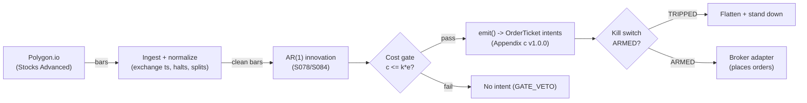

# T052 — AR/ARMA Innovation Trader

Intraday mean-reversion on forecast innovations (surprises), with a trade–quote VAR check that the surprise is liquidity noise rather than informed flow. Provenance **D/SR**.

> Tag law: every numeric literal in prose carries one of `[documented]
> [default] [example] [unverified] [internal-est] [measured]` (legend: Appendix
> i v1.0.0). Bibliographic years, volumes, pages, arXiv IDs, section numbers,
> rule codes (C1–C10), fail-safe codes (F1–F5), module IDs, and machine-parsed
> §0 data fields are identifiers, not literals, and are exempt.

## §1 Five-minute reviewer card

| Row | Value |
|---|---|
| Module | T052 — AR/ARMA Innovation Trader, v1.0.0 |
| Edge verdict | `NO-DOCUMENTED-EDGE` — gross edges of a few basis points vs ~1 bp round-trip costs; the chapter's toy prints `−$66.00` [documented] on two textbook setups — a cost-dominated micro-edge |
| After-cost | `BEFORE-COST` — one-sentence verdict: short-horizon AR predictability on mid-prices is among the most crowded micro-edges in equities; no published after-cost Sharpe for the standalone fade |
| Build cost | Tier M+ · `40–100` h [internal-est] · `$6,000–15,000` loaded [internal-est] |
| Data cost | Research `~$30–200`/mo [unverified]; production `~$200 + usage`/mo [unverified] — bands indicative, verify before budgeting |
| latency_class | bar / 1-minute |
| risk_class | medium |
| Capacity | `$1–5`M/day notional [example] — edge per trade is a few bps; costs dominate without turnover discipline |
| Executability | Feasible: AR(1) on 1-min bars is trivial; honest VAR needs L1/trade-sign data (Tier 2) |
| Risk summary | Adverse selection: fading at the touch provides liquidity exactly when informed flow may be taking it; AR coefficients flip in microstructure regime changes |
| When it dies | informed flow (flow-aligned moves); AR(1) phi flips sign intraday; innovation variance doubles vs trailing [example]; wide spreads |
| Regime gates | Provisional: provisional: skip bars where |LRI| exceeds its 70th percentile of trailing 30 days [example] (informed-flow veto) |
| Emits | `order_intents` (Appendix c v1.0.0) — intents only, never orders |

## §1.5 Cheapest / least-build path

1. **Prototype hour band:** `40–100` h [internal-est] — AR(1) innovation layer + VAR validation + cost/risk harness + fixture.
2. **Cheapest-source row:** min_tier = Polygon.io Stocks Advanced — cheapest data source candidate [internal-est]; latency_class = bar / 1-minute; required_fields = 1-min OHLCV bars (mids), corporate actions; price_band = `~$30–200`/mo [unverified] (indicative — verify before budgeting); build_or_buy = **build the AR/innovation layer on retail bars, buy L1/trade-sign data for an honest VAR**.
3. **Resource budget:** `1` core, `<4` GB RAM for `200` names on 1-min bars [internal-est]; compute pattern `per_bar`.
4. **Skip list:** tick-level VAR; colocated deployment; Rust ingest.
5. **DO-NOT-CUT list:** causality assertions (`assert fill_event > signal_event`, no-signal-bar-fills test); COST block + callable `expected_cost_bps`; F1–F5 fail-safes + module-state enum; kill-switch state machine + re-arm checklist; decision-log audit records; bona-fide-intent + self-trade prevention; provenance tags on every numeric literal; fixtures + `test_cmd`; secrets via env only.
6. **Escalation gate:** upgrade from cheapest when any holds — universe `>200` names [default]; VAR re-estimated intraday [default]; cost gate fails on `[measured]` costs.

## §T0 Module contract

### T0.1 Typed signature

```python
def emit(state: ModuleState, signals: list[SignalVector], cfg: Config) -> list[OrderTicket]:
```

`OrderTicket` per Appendix c v1.0.0 — **intents only**; the strategy never
places orders, never holds broker/exchange sessions, never nets intents into
orders. `state` is the module-owned named state vector (`position`,
`sleeve_weights`, `cooldown_until`, `kill_state`, `module_state`); `signals`
are canonical SignalVectors (Appendix b v1.0.0), newest last. The function
handles documented edge cases: empty signals → `UNKNOWN`; halt/auction bars →
freeze per the market-state table; stale inputs → `UNKNOWN` (F4), never
interpolate.

### T0.2 Config dataclass

| Parameter | Type | Default | Range | Status |
|---|---|---|---|---|
| `z_entry` | float | `2.0` | `1.0`–`4.0` | default |
| `sigma_eps_bp` | float | `3.0` | calibrated | calibrate |
| `phi` | float | `0.15` | re-estimated nightly | calibrate |
| `lri_pct` | float | `0.70` | `0.5`–`0.9` | default |
| `cost_thr` | float | `0.027` | `0.01`–`0.10` | default |
| `fixed_qty` | int | `800` | `100`–`5,000` | default |
| `time_stop_bars` | int | `5` | `2`–`20` | default |
| `cooldown_bars` | int | `1` | `0`–`10` | default |
| `cost_gate_k` | float | `0.5` | `0.1`–`2.0` | default |

All defaults tagged per the tag law (status `default` ⇒ `[default]`).

### T0.3 Canonical schema mapping

Vendor columns → canonical Bar schema (Appendix a v1.0.0), stated once here:

| Vendor (Polygon.io Stocks Advanced) | Canonical |
|---|---|
| bar open timestamp | `event_ts` (int64 ns UTC, bar open time) |
| `o/h/l/c`, `v` | `open/high/low/close`, `volume` |
| symbol | `symbol` (exchange-qualified) |
| signal value | `sig` (strategy-defined score, Appendix b `value`) |
| gate flag | `gate` ∈ {0, 1} (confirmation gate) |

### T0.4 Time contract

> Time contract: clock domain UTC, int64 ns; authoritative causality clock =
> `event_ts`; max_skew = `1` ms [default]; jitter budget = `500` µs [default];
> bar-label = open time; staleness TTL = `3`× cadence [default] (F4); gap
> policy = mask, no interpolation; halt/auction → discard contributions
> across reopen.

**Timing box:** `signal@t (per_bar-1min, America/New_York) → earliest fill @open(t+1)`

### T0.5 Market-state table

| State | Module behavior |
|---|---|
| CONTINUOUS_TRADING | Evaluate entries/exits per §T2; emit intents |
| HALTED | Freeze state; emit nothing; `UNKNOWN` on held signals |
| AUCTION | No new entries; exits only via auction-aware intents (MOO/MOC); state `DEGRADED` |
| CLOSED | Emit nothing; state `OFF` |

### T0.6 Module-state enum + error taxonomy

States per Appendix k v1.0.0: `OK | DEGRADED | UNKNOWN | OFF`. Invalid input →
`UNKNOWN`, never interpolate (Appendix f v1.0.0, F1–F5).

| Failure | State | Alert |
|---|---|---|
| Missing/stale input (TTL `3`× cadence [default]) | `UNKNOWN` | page |
| Non-finite / non-positive price reaching module (F2) | `UNKNOWN` | page |
| `event_ts` non-monotonic (F2) | `UNKNOWN` | page |
| Kill-switch TRIPPED | `OFF` (no new intents) | page |
| Halt/auction | `UNKNOWN` / `DEGRADED` (per table) | log |
| Feed anomaly (per §T9 row 1) | `DEGRADED` | notify |
| Anything unmapped | `UNKNOWN` | page |

### T0.7 Risk contract + kill switch

```yaml
risk_contract:
  per_trade_R: `600`            # [example] — vol-scaled form q = $600/(sigma_eps x price)
  max_adverse_per_trade: `3.0`x sigma_eps [example]   # [example]
  daily_loss_stop: `-1.5`% NAV [example]          # [example]
  max_gross: `1.0`x [example]                # [example] — small-edge, high-turnover book; leverage amplifies cost bleed
  kill_conditions:                        # any one trips -> TRIPPED
  - "AR(1) phi flips sign intraday -> TRIPPED"
  - "innovation variance doubles vs trailing -> TRIPPED"
  - "daily loss <= -1.5% NAV -> TRIPPED"
  enforcement: intraday-hard              # breach flattens; no review-only mode
```

**Calibration recipe:** `per_trade_R` is the sizing input in §T2 (dollar-risk
`N = ⌊R/stop_dist⌋` or the confidence-scaled equivalent); re-estimate `R`
from the trailing `60`-day [default] per-trade P&L distribution so that a
`3`σ [default] adverse day stays inside `daily_loss_stop`. `max_gross` is
checked pre-emit on every ticket (C4). Kill-switch state machine:

```
ARMED → TRIPPED → RECOVERY → ARMED
```

- `ARMED → TRIPPED`: any kill condition fires → cancel all working intents
  (idempotent cancels), flatten at marketable limits, set module state `OFF`,
  write a `KILL_TRIP` decision record (Appendix g v1.0.0).
- `TRIPPED → RECOVERY`: re-arm checklist **all green** — `1.` feed healthy
  (no stale bars); `2.` decision log reconciled against broker ledger, no
  orphan tickets; `3.` root cause of the trip identified and the offending
  config reverted or re-calibrated; `4.` risk owner sign-off recorded.
- `RECOVERY → ARMED`: one clean evaluation pass over the fixture
  (`test_cmd` green) with no new trip, then resume.

### T0.8 Ops tail

- **Schedule:** RTH `09:30`–`16:00` [documented]; owner: stat-arb on-call.
- **Health checks:** fixture replay (`test_cmd`) green on deploy; live
  staleness watchdog at `3`× cadence; kill-switch drill monthly [default].
- **Alert table:** page on `UNKNOWN` > `30` s [default], on any kill trip, or
  bounds violation; notify on `DEGRADED`; log on single dropped bars.
- **Resource budget:** `1` vCPU, `4` GB RAM [internal-est]; state is O(`1`) per symbol.
- **Runbook stub:** `1.` confirm feed; `2.` replay fixture; `3.` if red → set
  `OFF`, page; `4.` reconcile decision log before re-arm; `5.` complete the
  re-arm checklist (§T0.7) before `ARMED`.

### T0.9 Secrets (env-only)

`POLYGON_API_KEY` via environment only. No secrets in this file, fixtures, or logs
(CI secrets-grep).

### T0.10 May / must-NOT

> **May:** emit `OrderTicket` intents per Appendix c v1.0.0; track intent-side
> state; issue cancel-replace via new tickets. **Must-NOT:** place orders on
> any venue, hold broker/exchange sessions, net intents into orders inside the
> strategy, or treat the intent-side state machine as broker wire truth.

## §T1 Legacy (subsumed by §1)

Legacy §T1 content is the §1 reviewer card above; this header is retained so
section numbering stays frozen.

## §T2 Specification

### Universe

US large-cap equities, RTH, 1-min bars; ADV above `$100`M [example]; exclude the first `15` minutes, earnings days, and halts. Mid-prices only — never trade prices.

### Entry rule (Boolean — no prose-only conditions)

```
ENTER_LONG  := (z < -z_entry) AND (sign(flow) != sign(r))
               AND (|eps| * price > cost_thr) AND (now >= cooldown_until)
               AND (expected_cost_bps(...) <= cost_gate_k * edge_bps)
ENTER_SHORT := (z > +z_entry) AND (sign(flow) != sign(r))
               AND (|eps| * price > cost_thr) AND (now >= cooldown_until)
               AND (locate_ok) AND (expected_cost_bps(...) <= cost_gate_k * edge_bps)
FLAT        := otherwise
```

### Exits (with post-exit cooldown)

```
EXIT := (z crosses 0 against the position)   # the surprise has unwound
        OR (bars_held >= time_stop_bars)              # 5 bars [example]
        OR (adverse move > 3 * sigma_eps)              # [example]
ON_EXIT: cooldown_until = now + cooldown_bars * bar_ns   # C10
```

### Position sizing (fenced function)

```python
def size_shares(price, sigma_eps=0.0003, risk_usd=600.0, fixed=800):  # defaults [default]
    # Vol-scaled: q = risk$ / (sigma_eps * price); fixed 800-share reference. [example]
    q_vol = int(risk_usd / max(sigma_eps * price, 1e-9))
    return int(min(fixed, q_vol))  # reference build uses the fixed leg
```

### Risk limits

| Limit | Value |
|---|---|
| Max notional per name | `$200`k [example] |
| Max concurrent positions | `10` [example] |
| Daily loss stop | `−1.5`% NAV [example] |
| Max gross leverage | `1.0`× [example] |

### COST block (single source of truth)

| Component | Value (bps) | Basis |
|---|---|---|
| Spread | `0.80` | [example] — 2¢ effective spread on a `$250` stock |
| Fees | `0.28` | [example] — $0.0035/share/side |
| Borrow | `0.0` | [default] — reference build; shorts add C7 locate cost |
| Impact | `0.0` | [example] — modeled as psi*sigma*sqrt(q/V) with psi=0.5 [example]; set to 0 in the toy, disclosed optimistic |
| **Total reference** | `1.08` | [example] |

`fee_schedule_as_of`: `2026-09-01` [unverified] — placeholder; pin the real
venue schedule before production. `side: taker` [default];
venue/tier/source: XNAS / Polygon.io Stocks Advanced [example]. `borrow_bps_per_day`: `0.0`
[default] — no borrow in the reference build.

Re-stating cost numbers outside
this block is a validation failure.

```python
def expected_cost_bps(notional, adv_pct, venue, side, urgency) -> float:
    '''Callable cost model — single source of truth (this block).'''
    spread_bps = 0.8   # [example] — 2¢ effective spread on a `$250` stock
    fee_bps = 0.28         # [example] — $0.0035/share/side
    borrow_bps = 0.0   # [default]
    impact_bps = 0.0   # [example] — modeled as psi*sigma*sqrt(q/V) with psi=0.5 [example]; set to 0 in the toy, disclosed optimistic
    if side == "maker":
        fee_bps = -abs(fee_bps) * 0.5  # rebate proxy [example]
    return spread_bps + fee_bps + borrow_bps + impact_bps
```

### Execution / fill model table

| Aspect | Assumption |
|---|---|
| Latency | Signal→intent `≤1` s on 1-min bars [example] |
| Entries | Limit orders at the touch; 30-second fill-or-kill discipline [example], then cancel — a stale fade is not filled |
| Exits | Marketable limits on zero-cross |
| Partial fills | Per Appendix c v1.0.0 FIFO |
| Adverse fill | Fading at the touch = providing liquidity to possibly informed takers; toy fills ignore this [example] |

### Robustness

phi, z_entry, and the LRI percentile are selected on purged/embargoed walk-forward (S088), never on the evaluation window. sigma_eps re-estimated nightly on a `60`-bar rolling window [example].

### Compliance sub-block (C1–C10+)

| Code | Rule: trigger → check → action → log |
|---|---|
| C1 | Self-match / STP: every ticket carries self-trade-prevention instructions for the broker adapter; trigger = two tickets same symbol opposite side within `1` s [default] → check resting-interest overlap → action = cancel the newer ticket → log `COMPLIANCE_BLOCK` |
| C2 | Bona-fide intent: every entry intent must pass the cost gate (`expected_cost_bps(...) <= k * edge_bps`) and fit risk limits; trigger = gate fail → check = re-evaluate → action = no ticket emitted → log `GATE_VETO` |
| C3 | Message-rate / cancel-to-trade: trigger = `>50` intents/symbol/min [default] or cancel-to-trade `>10:1` [default] → check venue thresholds → action = throttle to `5`/min [default] + alert → log `COMPLIANCE_BLOCK` |
| C4 | Pre-trade fat-finger trio: price collar `±5`% vs reference [default] → reject; max notional per ticket `$2,000,000` [default] → reject; max `50` tickets/symbol/`5` min [default] → throttle; all rejections logged |
| C5 | Decision-log schema compliance (Appendix g v1.0.0): every intent, veto, cancel-replace, kill transition logged with inputs_hash/params_hash, hash-chained; trigger = missing record → action = halt to `UNKNOWN` |
| C6 | Halt/auction state table: per §T0.5 — HALTED freezes, AUCTION blocks new entries, CLOSED emits nothing; trigger = state change → check market-state table → action = freeze/cancel per table → log |
| C7 | Locate check (short sales): trigger = SHORT intent → check = easy-to-borrow list or live locate obtained pre-emit → action = block intent without locate → log `GATE_VETO`; Reg-SHO threshold securities never shorted |
| C8 | Public-dissemination gate: no signal/intent data published externally without review; trigger = export request → check = review sign-off → action = block until signed |
| C9 | Data-entitlement assertions per dataset (Appendix j v1.0.0): trigger = entitlement-class change or unlicensed symbol → check §T5 data-rights row → action = stand down affected symbols → log |
| C10 | Post-exit cooldown: trigger = exit or compliance block → check `now < cooldown_until` → action = no re-entry until ``1`` bars [default] elapse → log |
| C11 | Innovation freshness: entries only within `30` s [example] of the bar close — a fade that cannot get filled at the touch is stale → check fill-or-kill timer → action = cancel → log `CANCEL` |

### Parameter table

| Parameter | Symbol | Value | Tag | Sensitivity |
|---|---|---|---|---|
| Innovation z entry | `z_entry` | `2.0` | [example] | high |
| Innovation sigma | `sigma_eps_bp` | `3.0` bp | [example] | high |
| LRI veto percentile | `lri_pct` | `70`th | [example] | medium |
| Cost threshold | `cost_thr` | `$0.027`/share | [example] | high |
| Fixed size | `fixed_qty` | `800` sh | [example] | medium |
| Time stop | `time_stop_bars` | `5` bars | [example] | medium |
| Cost-gate k | `cost_gate_k` | `0.5` | [default] | high |

### Timing box

`signal@t (per_bar-1min, America/New_York) → earliest fill @open(t+1)`

## §T3 Math + normative pseudocode

On 1-min mid-price log returns $r_t$: AR(1) $\hat{f}_t = c + \phi\,r_{t-1}$
[example]; innovation $\hat{\varepsilon}_t = r_t - \hat{f}_t$, standardized
$z_t = \hat{\varepsilon}_t/\hat{\sigma}_\varepsilon$ with
$\hat{\sigma}_\varepsilon = 3.0$ bp [example]. Hasbrouck trade–quote VAR
$x_t = c + \sum_{\ell=1}^{p} A_\ell x_{t-\ell} + u_t$ on
$x_t = (\Delta m_t, q_t)^\top$; long-run impact
$\mathrm{LRI} = e_m^\top (I - \sum A_\ell)^{-1} e_q$ [documented form].
Enter only if the bar's move is flow-opposed (toy proxy for the S084 LRI
check); production form skips bars with $|\mathrm{LRI}|$ above its 70th
percentile of trailing 30 days [example].

**Normative pseudocode** (pseudocode is normative; prose is commentary):

```
function emit(state, signals, cfg) -> list[OrderTicket]:
    assert signals non-empty else return UNKNOWN                    # F1
    for bar t in signals (newest last):
        s = innovation z-score z = (r - f_hat)/sigma_eps                                            # data <= t only
        assert isfinite(s) else return UNKNOWN                      # F2
        edge_bps = abs(z) * 1.5                                   # [example] — modeled per-trade edge in bps
        cost = expected_cost_bps(notional, adv_pct, venue, side, urgency)
        cost_ok = expected_cost_bps(...) <= k * edge_bps
        # ^^^ normative cost-gate predicate: expected_cost_bps(...) <= k * edge_bps
        if state.position is None and state.module_state == OK:
            if (((z <= -2.0) or (z >= 2.0)) and flow_opposed and (abs(eps)*price > 0.027)) and cost_ok:
                ticket = OrderTicket(symbol, side, qty, limit, tif,
                                     ticket_id=uuid(), parent_signal="S078@t",
                                     intent_ts=t.event_ts, state=NEW)
                log_decision(ticket, inputs_hash, params_hash)     # C5 / Appendix g
                assert fill_event > signal_event                    # t->t+1 causality
        else if state.position is not None:
            if ((z crosses 0 against position) or (bars_held >= 5)):
                emit exit intent (cancel-replace rules, Appendix c) # C1
                state.cooldown_until = t + cooldown_bars            # C10
                assert fill_event > signal_event
    return tickets
```

Causality: every quantity at bar `t` uses only data `≤ t`; the earliest fill
is bar `t+1`'s open. Mandatory unit test: no-signal-bar fills
(`assert fill_event > signal_event`).

## §T4 Worked example (fixture-backed)

- Tape: `modules/fixtures/T052_tape.csv` — `# TYPE: validation-run`;
  `12` bars [example], all numbers synthetic, seed `10052` [example];
  `event_ts` int64 ns UTC, bar-labeled by open time.
- Expected outputs: `modules/fixtures/T052_expected.csv` — per-ticket
  intents with the cost-function call recorded (inputs → bps → $);
  tolerance `1e-6` [default] on floats.
- Acceptance tests (`modules/tests/test_T052.py`, `6` tests):
  `1.` fixture replays to expected (hand-checked rows below); `2.` cost-gate
  predicate passes on the fixture's large edges and blocks a tiny-edge
  counter-case (`k = 0.5` [default]); `3.` no-signal-bar fills
  (`fill_ts > signal_ts` on every ticket); `4.` kill-switch trips on the
  breach scenario and re-arms through the checklist
  (`ARMED → TRIPPED → RECOVERY → ARMED`); `5.` invalid input (non-positive
  price) → `UNKNOWN`, never interpolated; `6.` hand-check literals
  (qty / bps / $) match the generation run.
- `test_cmd`: `python3 -m pytest modules/tests/test_T052.py -q` → exits `0`.

**Cost-function calls on the fixture** (inputs → bps → $, from the harness run):

| ticket | notional ($) | adv_pct | side | edge_bps | cost_bps | cost_$ | gate |
|---|---|---|---|---|---|---|---|
| T-T052-3-0 | 199975.76 | 0.0200 | taker | 3.9000 | 1.0800 | 21.5974 | PASS |
| T-T052-4-X | 200026.48 | 0.0200 | taker | 0.0000 | 1.0800 | 21.6029 | N/A |
| T-T052-6-0 | 199989.52 | 0.0200 | taker | 4.2000 | 1.0800 | 21.5989 | PASS |
| T-T052-7-X | 199955.04 | 0.0200 | taker | 0.0000 | 1.0800 | 21.5951 | N/A |
| T-T052-9-0 | 200031.68 | 0.0200 | taker | 3.4500 | 1.0800 | 21.6034 | PASS |
| T-T052-10-X | 199947.68 | 0.0200 | taker | 0.0000 | 1.0800 | 21.5943 | N/A |

**Where the example is optimistic:** market impact set to `$0` [example] in the toy (psi-model disclosed); fills at next-bar open ignore adverse selection at the touch; VAR gate uses the flow-opposition toy proxy, not estimated LRI



## §T5 Dependencies & data

Generated-from-`deps.yaml` shape (CI symmetry); hand-listed:

| Module | Role | Version pin |
|---|---|---|
| S078 — AR(1)/ARMA forecast & innovation | Primary trigger (direction + timing) | 1.0.0 |
| S084 — Hasbrouck trade–quote VAR | Informed-flow veto | 1.0.0 |
| S088 — Purged / embargoed CV | Offline validator | 1.0.0 |

| Field | Type | Granularity | Source tier | Notes |
|---|---|---|---|---|
| 1-min mid OHLCV | float/int | 1-min bars | Tier 1 | mids only |
| Signed trade flow (toy) / L1 trade+quote (production) | int/float | per trade | Tier 1/2 | toy uses bar flow-sign proxy |

**Family note:** family `B` = statistical / time-series strategies.

**Data rights row** (Appendix j v1.0.0): US equities 1-min bars via Polygon.io
Stocks Advanced, `rights: licensed`; license scope = research + stated
production symbol count; raw ticks never leave our systems — fixtures are
synthetic; entitlement = professional/internal, no display; retention per
vendor terms, purge path in runbook. Entitlement-class change → §1.5
escalation gate.

## §T6 Local build (M5 Max / 128 GB)

Feasible on the M5 Max (Tier M+, `40–100` h ≈ `$6k–15k` eng + `~$200`/mo data per notes/cost-model.md §5); AR(1) per bar is O(`1`) [documented]. Bottleneck is the honest VAR (needs L1/trade-sign data, Tier 2). Breaks if the VAR is re-estimated per bar on full depth (batch it hourly [default]).

## §T7 Buy vs build

Build the AR/innovation layer on retail bars; buy L1/trade-sign data if you want an honest VAR rather than the toy flow proxy. Verdict: the fade logic is `~100` lines [internal-est]; the value is the informed-flow veto and the cost gate.

## §T8 Efficacy — documented evidence

| Study / source | Market & period | Metric | Before/after cost | Caveat |
|---|---|---|---|---|
| Hasbrouck (1991), J. Finance | NYSE stocks | trades carry significant information; quote revisions respond to trade innovations with measurable permanent impact [documented] | `BEFORE-COST` (econometric) | the LRI machinery, not a trading rule |
| Roll (1984), J. Finance | Efficient-market model | under constant spread s, Cov(Δp_t,Δp_{t-1}) = −s²/4 — the AR(1) coefficient on trade prices [documented] | `BEFORE-COST` | trade prices, not mids |
| Bouchaud, Gefen, Potters & Wyart (2004), Quant. Finance | Paris Bourse | price response to trades is concave and largely permanent [documented] | `BEFORE-COST` | supports fading only liquidity-driven moves |

Selection disclosure: these are the sources surfaced by the chapter's research
pass (Stage 152/200). **Honest bottom line.** As a standalone trigger the AR(1) fade is a cost-dominated micro-edge: the toy's `−$66.00` [documented] on two textbook setups is representative — gross edges of a few basis points vs round-trip costs of the same order.

## §T9 Failure modes & pitfalls

| # | Trigger → Detect → Action → Recovery | check: |
|---|---|---|
| 1 | Informed flow faded: price moved with signed flow → detect: flow-opposed check fails → action: veto entry → recovery: none | `check: sign(flow) != sign(r)` |
| 2 | Phi regime flip: AR(1) coefficient changes sign intraday → detect: re-estimated phi sign flip → action: kill-switch TRIP, flatten → recovery: re-calibrate overnight | `check: sign(phi_t) == sign(phi_{t-1})` |
| 3 | Innovation variance doubles → detect: trailing variance ratio → action: TRIP → recovery: re-estimate sigma_eps | `check: var_ratio <= 2.0` |
| 4 | Stale fade: fill-or-kill 30 s expires → detect: timer → action: cancel → recovery: next bar | `check: fill within 30 s` |
| 5 | Cost blowup → detect: cost gate fails on [measured] costs → action: stand down → recovery: re-pin fee schedule | `check: expected_cost_bps(...) <= k * edge_bps` |
| 6 | Lookahead: innovation uses unclosed bar → detect: causality audit → action: halt, fix finalization → recovery: re-run test | `check: all(fill_ts > signal_ts)` |

## §T10 Source log + unverified leads

**Sources** (citable facts only):

1. Hasbrouck, J. (1991) [documented]. "Measuring the Information Content of Stock Trades." *Journal of Finance* 46(1): 179–207. http://ideas.repec.org/a/bla/jfinan/v46y1991i1p179-207.html — the trade–quote VAR and permanent-impact machinery.
2. Roll, R. (1984) [documented]. "A Simple Implicit Measure of the Effective Bid-Ask Spread in an Efficient Market." *Journal of Finance* 39(4): 1127–1139. https://authors.library.caltech.edu/records/afwsc-6bb6 — AR(1) structure of trade-price changes under a constant spread.
3. Bouchaud, J.-P., Gefen, Y., Potters, M. & Wyart, M. (2004) [documented]. "Fluctuations and response in financial markets." *Quantitative Finance* 4(2): 176–190. — concave, largely permanent price response to trades.

**Chatbot source log.** Grok answered Q-TB6-1..3 (2026-09-10); all claims independently verified or labeled unverified.

**Unverified leads** (chatbot-only — never in evidence tables):

- Box, G.E.P. & Jenkins, G.M. (1970). *Time Series Analysis: Forecasting and Control* — canonical AR/ARMA reference per the signal report; edition/URL not verified in this pass.
- Tsay, R.S. (2005). *Analysis of Financial Time Series* — canonical intraday time-series reference per the signal report; URL not verified in this pass.

---

## Appendix — AI build prompt (T052)

Copy-paste into any chat agent:

> Build module **T052 — AR/ARMA Innovation Trader** per `notes/module-template.md` v1.0.0
> and this file's §T0 contract.
> Cheapest path (§1.5): prototype `40–100` h [internal-est]; cheapest data
> candidate Polygon.io Stocks Advanced [internal-est]; compute pattern `per_bar`; skip
> tick-level VAR; colocated deployment; Rust ingest for now.
> Implement `emit(state, signals, cfg) -> list[OrderTicket]`
> (Appendix c v1.0.0) with the §T3 normative pseudocode, including the
> cost-gate predicate `expected_cost_bps(...) <= k * edge_bps` and
> `assert fill_event > signal_event`. Wire F1–F5 (Appendix f v1.0.0): invalid
> input → `UNKNOWN`, never interpolate. Implement the kill-switch state
> machine `ARMED → TRIPPED → RECOVERY → ARMED` with the §T0.7 re-arm
> checklist. Log decisions per Appendix g v1.0.0. Secrets via env only.
> Run the fixture `modules/fixtures/T052_tape.csv`
> (`# TYPE: validation-run`) against `modules/fixtures/T052_expected.csv`
> (tolerance `1e-6` [default]).
> **Definition of done:** `python3 -m pytest modules/tests/test_T052.py -q`
> exits `0`. Tag every numeric literal you add with the unified enum
> (Appendix i v1.0.0); put anything unverifiable in §T10 unverified leads.
