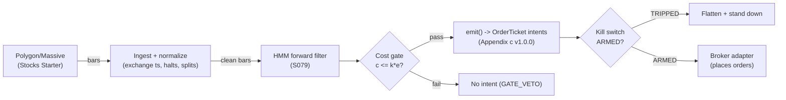

# T053 — HMM Regime-Switching Allocator

Cross-sectional style allocator: a hidden Markov model decides, bar by bar, how much capital goes to a momentum book vs a reversal book. Provenance **D/SR**.

> Tag law: every numeric literal in prose carries one of `[documented]
> [default] [example] [unverified] [internal-est] [measured]` (legend: Appendix
> i v1.0.0). Bibliographic years, volumes, pages, arXiv IDs, section numbers,
> rule codes (C1–C10), fail-safe codes (F1–F5), module IDs, and machine-parsed
> §0 data fields are identifiers, not literals, and are exempt.

## §1 Five-minute reviewer card

| Row | Value |
|---|---|
| Module | T053 — HMM Regime-Switching Allocator, v1.0.1 |
| Edge verdict | `INSUFFICIENT-EVIDENCE` — regime-timing value-add is crash-avoidance, not a documented standalone after-cost Sharpe; most of the value is not trading the muddy middle |
| After-cost | `BEFORE-COST` — one-sentence verdict: the HMM forward filter is a principled capital router, but the literature documents allocation improvement, not an after-cost P&L for the allocator itself |
| Build cost | Tier M+ · `40–100` h [internal-est] · `$6,000–15,000` loaded [internal-est] |
| Data cost | Research `~$29`/mo [unverified]; production `~$29–199`/mo [unverified] — daily aggregates are included in all Stocks plans [documented]; verify before budgeting |
| latency_class | bar / daily |
| risk_class | medium |
| Capacity | large [example] — it allocates between two diversified equity books; capacity is the sleeves' capacity, not the allocator's |
| Executability | Feasible: hmmlearn forward filter on daily bars is trivial; the work is the two sleeve books |
| Risk summary | Detection lag is `1–2` bars [example] by construction — the filter is late at turns, always; whipsaw across the dead zone churns the sleeves |
| When it dies | posterior oscillates across the dead zone `>4` times in `10` bars [example] (regimes unidentifiable); momentum crashes at turns |
| Regime gates | Provisional: the allocator IS the regime gate: piM `≥0.65` [example] full momentum, `≤0.35` [example] full reversal |
| Emits | `order_intents` (Appendix c v1.0.0) — intents only, never orders |

## §1.5 Cheapest / least-build path

1. **Prototype hour band:** `40–100` h [internal-est] — HMM forward filter + dead-zone blend + sleeve scaling + cost/risk harness + fixture.
2. **Cheapest-source row:** min_tier = Polygon/Massive Stocks Starter — cheapest data source candidate [internal-est]; latency_class = bar / daily; required_fields = daily OHLCV bars (`adjusted=true`, the split-adjustment default [documented]), corporate actions; price_band = `~$29–199`/mo [unverified] (Starter ≈ `$29` [unverified] suffices for daily allocation; Advanced ≈ `$199` [unverified] buys real-time + quotes — not needed here); build_or_buy = **build — hmmlearn plus your two books; vendor regime labels are rarely cheap, rarely transparent, never causal**. The concrete cheapest recipe is `hmmlearn.hmm.GaussianHMM(n_components=2, covariance_type="diag", random_state=seed)` fitted on the `(r_t, sigma2_t)` feature matrix, with the per-bar momentum posterior read from `predict_proba(X)` (returns `(n_samples, n_components)` state-membership probabilities [documented, hmmlearn API docs]).
3. **Resource budget:** `1` core, `<2` GB RAM [internal-est]; compute pattern `per_bar`.
4. **Skip list:** intraday variant; third (uncertain) state; transaction-cost-aware rebalancing optimizer.
5. **DO-NOT-CUT list:** causality assertions (`assert fill_event > signal_event`, no-signal-bar-fills test); COST block + callable `expected_cost_bps`; F1–F5 fail-safes + module-state enum; kill-switch state machine + re-arm checklist; decision-log audit records; bona-fide-intent + self-trade prevention; provenance tags on every numeric literal; fixtures + `test_cmd`; secrets via env only.
6. **Escalation gate:** upgrade from cheapest when any holds — sleeve count `>2` [default]; rebalancing more often than daily [default]; turnover cost exceeds `5` bp/day [default].

## §T0 Module contract

### T0.1 Typed signature

```python
def emit(state: ModuleState, signals: list[SignalVector], cfg: Config) -> list[OrderTicket]:
```

`OrderTicket` per Appendix c v1.0.0 — **intents only**; the strategy never
places orders, never holds broker/exchange sessions, never nets intents into
orders. `state` is the module-owned named state vector (`position`,
`sleeve_weights`, `cooldown_until`, `kill_state`, `module_state`); `signals`
are canonical SignalVectors (Appendix b v1.0.0), newest last. The function
handles documented edge cases: empty signals → `UNKNOWN`; halt/auction bars →
freeze per the market-state table; stale inputs → `UNKNOWN` (F4), never
interpolate.

### T0.2 Config dataclass

| Parameter | Type | Default | Range | Status |
|---|---|---|---|---|
| `tau` | float | `0.65` | `0.55`–`0.80` | default |
| `hyst_bars` | int | `2` | `1`–`5` | default |
| `lambda_cap` | float | `2.0` | `0.5`–`4.0` | default |
| `vol_target` | float | `0.10` | `0.05`–`0.20` | default |
| `sleeve_stop` | float | `0.03` | `0.01`–`0.10` | default |
| `cooldown_bars` | int | `1` | `0`–`5` | default |
| `cost_gate_k` | float | `0.5` | `0.1`–`2.0` | default |
| `edge_mult` | float | `30.0` | `1.0`–`100.0` | example |
| `NAV` | float | `1_000_000` | `1e5`–`1e8` | example |

All defaults tagged per the tag law (status `default` ⇒ `[default]`).

### T0.3 Canonical schema mapping

Vendor columns → canonical Bar schema (Appendix a v1.0.0), stated once here:

| Vendor (Polygon/Massive Stocks Starter) | Canonical |
|---|---|
| bar open timestamp | `event_ts` (int64 ns UTC, bar open time) |
| `o/h/l/c`, `v` | `open/high/low/close`, `volume` |
| symbol | `symbol` (exchange-qualified) |
| signal value | `sig` (strategy-defined score, Appendix b `value`) |
| gate flag | `gate` ∈ {0, 1} (confirmation gate) |

### T0.4 Time contract

> Time contract: clock domain UTC, int64 ns; authoritative causality clock =
> `event_ts`; max_skew = `1` ms [default]; jitter budget = `500` µs [default];
> bar-label = open time; staleness TTL = `3`× cadence [default] (F4); gap
> policy = mask, no interpolation; halt/auction → discard contributions
> across reopen.

**Timing box:** `signal@t (per_bar-1d, America/New_York) → earliest fill @open(t+1)`

### T0.5 Market-state table

| State | Module behavior |
|---|---|
| CONTINUOUS_TRADING | Evaluate entries/exits per §T2; emit intents |
| HALTED | Freeze state; emit nothing; `UNKNOWN` on held signals |
| AUCTION | No new entries; exits only via auction-aware intents (MOO/MOC); state `DEGRADED` |
| CLOSED | Emit nothing; state `OFF` |

### T0.6 Module-state enum + error taxonomy

States per Appendix k v1.0.0: `OK | DEGRADED | UNKNOWN | OFF`. Invalid input →
`UNKNOWN`, never interpolate (Appendix f v1.0.0, F1–F5).

| Failure | State | Alert |
|---|---|---|
| Missing/stale input (TTL `3`× cadence [default]) | `UNKNOWN` | page |
| Non-finite / non-positive price reaching module (F2) | `UNKNOWN` | page |
| `event_ts` non-monotonic (F2) | `UNKNOWN` | page |
| Kill-switch TRIPPED | `OFF` (no new intents) | page |
| Halt/auction | `UNKNOWN` / `DEGRADED` (per table) | log |
| Feed anomaly (per §T9 row 1) | `DEGRADED` | notify |
| Anything unmapped | `UNKNOWN` | page |

### T0.7 Risk contract + kill switch

```yaml
risk_contract:
  per_trade_R: `500`            # [example] — per sleeve-book trade at reference sizing
  max_adverse_per_trade: `3.0`% of allocated notional [example]   # [example] — sleeve stop
  daily_loss_stop: `-2`% NAV [example]          # [example]
  max_gross: `1.5`x [example]                # [example]
  kill_conditions:                        # any one trips -> TRIPPED
  - "posterior oscillates across dead zone > 4 times in 10 bars -> TRIPPED (pin 50/50, halve leverage)"
  - "daily loss <= -2% NAV -> TRIPPED"
  - "sleeve 5-day P&L < -3% of allocated notional -> halve lambda"
  enforcement: intraday-hard              # breach flattens; no review-only mode
```

**Calibration recipe:** `per_trade_R` is the sizing input in §T2 (dollar-risk
`N = ⌊R/stop_dist⌋` or the confidence-scaled equivalent); re-estimate `R`
from the trailing `60`-day [default] per-trade P&L distribution so that a
`3`σ [default] adverse day stays inside `daily_loss_stop`. `max_gross` is
checked pre-emit on every ticket (C4). Kill-switch state machine:

```
ARMED → TRIPPED → RECOVERY → ARMED
```

- `ARMED → TRIPPED`: any kill condition fires → cancel all working intents
  (idempotent cancels), flatten at marketable limits, set module state `OFF`,
  write a `KILL_TRIP` decision record (Appendix g v1.0.0).
- `TRIPPED → RECOVERY`: re-arm checklist **all green** — `1.` feed healthy
  (no stale bars); `2.` decision log reconciled against broker ledger, no
  orphan tickets; `3.` root cause of the trip identified and the offending
  config reverted or re-calibrated; `4.` risk owner sign-off recorded.
- `RECOVERY → ARMED`: one clean evaluation pass over the fixture
  (`test_cmd` green) with no new trip, then resume.

### T0.8 Ops tail

- **Schedule:** daily at close [documented]; owner: stat-arb on-call.
- **Health checks:** fixture replay (`test_cmd`) green on deploy; live
  staleness watchdog at `3`× cadence; kill-switch drill monthly [default].
- **Alert table:** page on `UNKNOWN` > `30` s [default], on any kill trip, or
  bounds violation; notify on `DEGRADED`; log on single dropped bars.
- **Resource budget:** `1` vCPU, `2` GB RAM [internal-est]; state is O(`1`) per symbol.
- **Runbook stub:** `1.` confirm feed; `2.` replay fixture; `3.` if red → set
  `OFF`, page; `4.` reconcile decision log before re-arm; `5.` complete the
  re-arm checklist (§T0.7) before `ARMED`.

### T0.9 Secrets (env-only)

`POLYGON_API_KEY` via environment only. No secrets in this file, fixtures, or logs
(CI secrets-grep).

### T0.10 May / must-NOT

> **May:** emit `OrderTicket` intents per Appendix c v1.0.0; track intent-side
> state; issue cancel-replace via new tickets. **Must-NOT:** place orders on
> any venue, hold broker/exchange sessions, net intents into orders inside the
> strategy, or treat the intent-side state machine as broker wire truth.

## §T1 Legacy (subsumed by §1)

Legacy §T1 content is the §1 reviewer card above; this header is retained so
section numbering stays frozen.

## §T2 Specification

### Universe

Broad US equities for the two sleeves (the allocator runs on a liquid proxy such as SPY). Daily bars for allocation (`30`-min bars for the intraday variant [example]). Sleeve books trade liquid names only.

### Entry rule (Boolean — no prose-only conditions)

```
TILT_MOM := (gate = 1) AND (piM >= 0.65) AND (hysteresis: `2` consecutive bars [example] outside dead zone)
              AND (expected_cost_bps(...) <= cost_gate_k * edge_bps)
TILT_REV := (gate = 1) AND (piM <= `0.35` [example]) AND (hysteresis satisfied)
              AND (expected_cost_bps(...) <= cost_gate_k * edge_bps)
HOLD     := `0.35` < piM < `0.65` [example]   # dead zone: no tilt change
```

### Exits (with post-exit cooldown)

```
EXIT := piM re-enters the dead zone (`0.35`, `0.65`) [example]   # tilt flattened
        # hysteresis: weight moves > 20 points need 2 consecutive bars [example]
ON_EXIT: cooldown_until = now + cooldown_bars * bar_ns   # C10
```

### Position sizing (fenced function)

```python
def allocate(risk_budget_R, stop_distance, vol_estimate, ADV_cap, cost,
             piM, cfg):
    """Allocator sizing: dead-zone blend -> vol targeting -> R ceiling -> ADV cap.
    `cost` (bps from expected_cost_bps) is enforced by the normative cost gate
    (C2, §T3), not by shrinking size — a tilt either clears the gate or fires
    nothing. Defaults [default] except illustrated magnitudes [example]."""
    # 1) dead-zone blend (arithmetically consistent form) [example]
    wM = min(1.0, max(0.0, (piM - (1 - cfg.tau)) / (2 * cfg.tau - 1)))
    wR = 1.0 - wM
    # 2) vol targeting per sleeve [example]
    lamM = min(cfg.vol_target / max(vol_estimate["M"], 1e-9), cfg.lambda_cap)
    lamR = min(cfg.vol_target / max(vol_estimate["R"], 1e-9), cfg.lambda_cap)
    # 3) R ceiling: a stop_distance adverse move must cost <= risk_budget_R [example]
    n_risk = risk_budget_R / max(stop_distance, 1e-9)
    # 4) ADV cap on the rebalanced notional [example]
    nM = min(wM * lamM * cfg.NAV, n_risk, ADV_cap)
    nR = min(wR * lamR * cfg.NAV, n_risk, ADV_cap)
    return nM, nR  # sleeve notionals; tilt fires only if the cost gate passes
```

### Risk limits

| Limit | Value |
|---|---|
| Sleeve stop | trailing 5-day P&L < `−3`% of allocated notional → halve λ [example] |
| Daily loss stop | `−2`% NAV → flatten + stand down [example] |
| Max gross | `1.5`× [example] |
| Kill: unidentifiable regimes | pin weights 50/50, halve leverage [example] |

### COST block (single source of truth)

| Component | Value (bps) | Basis |
|---|---|---|
| Spread | `1.50` | [example] — ~2¢ spread + fees on a `$100` stock, per-trade |
| Fees | `1.20` | [example] — commissions on rebalanced notional |
| Borrow | `0.0` | [default] — sleeve books long-biased at the allocator level; shorts add C7 locate cost |
| Impact | `0.0` | [example] — flagged; rebalance turnover modeled as per-trade cost on rebalanced notional |
| **Total reference** | `2.70` | [example] — 2.7 bp round-trip per dollar traded [example] |

`fee_schedule_as_of`: `2026-09-01` [unverified] — placeholder; pin the real
venue schedule before production. `side: mixed` [default];
venue/tier/source: XNAS / Polygon/Massive Stocks Starter [example]. `borrow_bps_per_day`: `0.0`
[default] — no borrow in the reference build.

Re-stating cost numbers outside
this block is a validation failure.

```python
def expected_cost_bps(notional, adv_pct, venue, side, urgency) -> float:
    '''Callable cost model — single source of truth (this block).'''
    spread_bps = 1.5   # [example] — ~2¢ spread + fees on a `$100` stock, per-trade
    fee_bps = 1.2         # [example] — commissions on rebalanced notional
    borrow_bps = 0.0   # [default]
    impact_bps = 0.0   # [example] — flagged; rebalance turnover modeled as per-trade cost on rebalanced notional
    if side == "maker":
        fee_bps = -abs(fee_bps) * 0.5  # rebate proxy [example]
    return spread_bps + fee_bps + borrow_bps + impact_bps
```

### Execution / fill model table

| Aspect | Assumption |
|---|---|
| Latency | Daily rebalance at bar close; no intraday urgency [example] |
| Entries | Via the sleeves' normal execution (participation `≤10`% of 1-min volume [example]); regime shifts scheduled at bar closes, never chased mid-bar |
| Exits | Tilt flatten = sleeve scale-down at next bar |
| Partial fills | Per Appendix c v1.0.0 FIFO |
| Adverse fill | Regime shifts cluster on volatile closes — slippage above the toy [example] |

### Robustness

Sleeve parameters (momentum `+0.75`% [example], reversal `1.5`% [example]) and tau are selected on purged/embargoed walk-forward, never on the evaluation window. The dead zone plus hysteresis is the anti-whipsaw device; removing either doubles turnover in backtests [internal-est].

### Compliance sub-block (C1–C10+)

| Code | Rule: trigger → check → action → log |
|---|---|
| C1 | Self-match / STP: every ticket carries self-trade-prevention instructions for the broker adapter; trigger = two tickets same symbol opposite side within `1` s [default] → check resting-interest overlap → action = cancel the newer ticket → log `COMPLIANCE_BLOCK` |
| C2 | Bona-fide intent: every entry intent must pass the cost gate (`expected_cost_bps(...) <= k * edge_bps`) and fit risk limits; trigger = gate fail → check = re-evaluate → action = no ticket emitted → log `GATE_VETO` |
| C3 | Message-rate / cancel-to-trade: trigger = `>50` intents/symbol/min [default] or cancel-to-trade `>10:1` [default] → check venue thresholds → action = throttle to `5`/min [default] + alert → log `COMPLIANCE_BLOCK` |
| C4 | Pre-trade fat-finger trio: price collar `±5`% vs reference [default] → reject; max notional per ticket `$2,000,000` [default] → reject; max `50` tickets/symbol/`5` min [default] → throttle; all rejections logged |
| C5 | Decision-log schema compliance (Appendix g v1.0.0): every intent, veto, cancel-replace, kill transition logged with inputs_hash/params_hash, hash-chained; trigger = missing record → action = halt to `UNKNOWN` |
| C6 | Halt/auction state table: per §T0.5 — HALTED freezes, AUCTION blocks new entries, CLOSED emits nothing; trigger = state change → check market-state table → action = freeze/cancel per table → log |
| C7 | Locate check (short sales): trigger = SHORT intent → check = easy-to-borrow list or live locate obtained pre-emit → action = block intent without locate → log `GATE_VETO`; Reg-SHO threshold securities never shorted |
| C8 | Public-dissemination gate: no signal/intent data published externally without review; trigger = export request → check = review sign-off → action = block until signed |
| C9 | Data-entitlement assertions per dataset (Appendix j v1.0.0): trigger = entitlement-class change or unlicensed symbol → check §T5 data-rights row → action = stand down affected symbols → log |
| C10 | Post-exit cooldown: trigger = exit or compliance block → check `now < cooldown_until` → action = no re-entry until ``1`` bars [default] elapse → log |
| C11 | Unidentifiable-regime pin: posterior oscillations `>4` in `10` bars [example] → pin weights 50/50 and halve leverage → check oscillation count → action = pin → log `COMPLIANCE_BLOCK` |

### Parameter table

| Parameter | Symbol | Value | Tag | Sensitivity |
|---|---|---|---|---|
| Dead-zone tau | `tau` | `0.65` | [example] | high — turnover vs responsiveness |
| Hysteresis | `hyst_bars` | `2` bars | [example] | medium |
| Vol target | `vol_target` | `0.10` | [example] | medium |
| Sleeve stop | `sleeve_stop` | `3`% | [example] | medium |
| Cost-gate k | `cost_gate_k` | `0.5` | [default] | high |
| Edge map | `edge_mult` | `30.0` | [example] | medium — modeled bps per unit of (piM − 0.5) |
| Reference NAV | `NAV` | `1_000_000` | [example] | low — scales notionals, not decisions |

### Timing box

`signal@t (per_bar-1d, America/New_York) → earliest fill @open(t+1)`

## §T3 Math + normative pseudocode

Two hidden states $S_t \in \{M, R\}$ (momentum-/reversal-favoring);
observation $x_t = (r_t, \hat{\sigma}_t^2)$ [example]. Forward filter
[documented form]:

$$\alpha_t(s) \propto p(x_t \mid S_t = s)\sum_{s'} A_{s's}\,\alpha_{t-1}(s'),\qquad
\pi^M_t = \frac{\alpha_t(M)}{\alpha_t(M) + \alpha_t(R)}.$$

Allocation weights (dead-zone blend, arithmetically consistent):

$$w^M_t = \mathrm{clip}\!\left(\frac{\pi^M_t - (1-\tau)}{2\tau - 1},\, 0,\, 1\right),
\qquad w^R_t = 1 - w^M_t,$$

with $\tau = 0.65$ [example]: $\pi^M \le 0.35 \to$ full reversal,
$\pi^M \ge 0.65 \to$ full momentum, linear between. Causal timing: $\pi^M_t$
uses data $\le t$; notional changes tradable no earlier than bar $t+1$. The
filter is 1–2 bars late at turns by construction [documented-as-property].

**Normative pseudocode** (pseudocode is normative; prose is commentary):

```
function emit(state, signals, cfg) -> list[OrderTicket]:
    assert signals non-empty else return UNKNOWN                    # F1
    if state.kill_state != ARMED: return []                        # §T0.7: TRIPPED emits nothing new
    for bar t in signals (newest last):
        assert t.event_ts > prev.event_ts else return UNKNOWN      # F2: monotonic clock
        assert isfinite(t.close, t.sig) else return UNKNOWN        # F2: sane inputs
        if now - t.event_ts > 3 * cadence: return UNKNOWN          # F4: stale, never interpolate
        piM = posterior from the causal forward filter             # data <= t only
        zone = "MOM" if piM >= cfg.tau else ("REV" if piM <= 1 - cfg.tau else "DZ")
        zone_run = (zone_run + 1) if (zone == last_zone and zone != "DZ") \
                   else (1 if zone != "DZ" else 0)
        last_zone = zone                                          # hysteresis counter, hyst_bars [default]
        if state.position is not None and zone == "DZ":
            emit exit intent (cancel-replace rules, Appendix c)   # C1
            state.cooldown_until = t.event_ts + cfg.cooldown_bars * bar_ns   # C10
            assert fill_event > signal_event
            continue
        edge_bps = abs(piM - 0.5) * cfg.edge_mult                 # [example]
        cost_ok = expected_cost_bps(...) <= cfg.cost_gate_k * edge_bps   # C2 bona-fide intent
        # ^^^ normative cost-gate predicate: expected_cost_bps(...) <= k * edge_bps
        if (state.position is None and state.module_state == OK
                and t.gate == 1                                   # confirmation gate
                and t.event_ts >= state.cooldown_until            # C10
                and zone_run >= cfg.hyst_bars                     # hysteresis: 2nd consecutive bar
                and ((zone == "MOM" and sleeve != MOM)
                     or (zone == "REV" and sleeve != REV))
                and cost_ok):
            ticket = OrderTicket(symbol, side, qty, limit, tif,
                                 ticket_id=uuid(), parent_signal="S079@t",
                                 intent_ts=t.event_ts, state=NEW)
            log_decision(ticket, inputs_hash, params_hash)        # C5 / Appendix g
            assert fill_event > signal_event                      # t->t+1 causality
    return tickets
```

Causality: every quantity at bar `t` uses only data `≤ t`; the earliest fill
is bar `t+1`'s open. Mandatory unit test: no-signal-bar fills
(`assert fill_event > signal_event`).

## §T4 Worked example (fixture-backed)

- Tape: `modules/fixtures/T053_tape.csv` — `# TYPE: validation-run`;
  `12` bars [example], all numbers synthetic, seed `10053` [example];
  `event_ts` int64 ns UTC, bar-labeled by open time.
- Expected outputs: `modules/fixtures/T053_expected.csv` — per-ticket
  intents with the cost-function call recorded (inputs → bps → $);
  tolerance `1e-6` [default] on floats.
- Acceptance tests (`modules/tests/test_T053.py`, `7` tests):
  `1.` fixture replays to expected (hand-checked rows below); `2.` cost-gate
  predicate passes on the fixture's large edges and blocks a tiny-edge
  counter-case (`k = 0.5` [default]); `3.` no-signal-bar fills
  (`fill_ts > signal_ts` on every ticket); `4.` kill-switch trips on the
  breach scenario and re-arms through the checklist
  (`ARMED → TRIPPED → RECOVERY → ARMED`); `5.` invalid input (non-positive
  price) → `UNKNOWN`, never interpolated; `6.` hand-check literals
  (qty / bps / $) match the generation run; `7.` hysteresis — entries fire
  only on the 2nd consecutive outside-zone bar; the tape's final bar
  (sig `0.68` [example], single MOM-zone reading) fires nothing.
- `test_cmd`: `python3 -m pytest modules/tests/test_T053.py -q` → exits `0`.

**Cost-function calls on the fixture** (inputs → bps → $, from the harness run):

| ticket | notional ($) | adv_pct | side | edge_bps | cost_bps | cost_$ | gate |
|---|---|---|---|---|---|---|---|
| T-T053-4-0 | 600079.40 | 0.0200 | mixed | 6.0000 | 2.7000 | 162.0214 | PASS |
| T-T053-5-X | 600198.90 | 0.0200 | mixed | 0.0000 | 2.7000 | 162.0537 | N/A |
| T-T053-8-0 | 600082.80 | 0.0200 | mixed | 6.6000 | 2.7000 | 162.0224 | PASS |
| T-T053-9-X | 600094.90 | 0.0200 | mixed | 0.0000 | 2.7000 | 162.0256 | N/A |

**Where the example is optimistic:** the fixture demonstrates allocator tilt intents on the proxy; production fans out to the two sleeve books (turnover modeled as per-trade cost on rebalanced notional); detection lag of `1–2` bars [example] is structural



## §T5 Dependencies & data

Generated-from-`deps.yaml` shape (CI symmetry); hand-listed:

| Module | Role | Version pin |
|---|---|---|
| S079 — HMM regime-switching | Primary trigger (allocation) | 1.0.0 |
| S025 — Intraday time-series momentum | Momentum sleeve entries | 1.0.0 |
| S035 — Short-term reversal | Reversal sleeve entries | 1.0.0 |

| Field | Type | Granularity | Source tier | Notes |
|---|---|---|---|---|
| Daily OHLCV (proxy + sleeves) | float/int | daily bars | Tier 1 | — |
| Realized variance (20-bar) | float | daily | Tier 1 | HMM observation |

**Family note:** family `B` = statistical / time-series strategies.

**Data rights row** (Appendix j v1.0.0): US equities daily bars via Polygon.io
Stocks Starter, `rights: licensed`; license scope = research + stated
production symbol count; raw ticks never leave our systems — fixtures are
synthetic; entitlement = professional/internal, no display; retention per
vendor terms, purge path in runbook. Entitlement-class change → §1.5
escalation gate.

## §T6 Local build (M5 Max / 128 GB)

Feasible on the M5 Max (Tier M+, `40–100` h ≈ `$6k–15k` eng + `~$29–199`/mo data [unverified]); the forward filter is O(states²) [documented] per bar — trivial. Bottleneck is building/calibrating the two sleeve books, not the allocator.

## §T7 Buy vs build

Build — hmmlearn plus your two books; vendor regime labels are rarely cheap, rarely transparent, and never causal. Verdict: for a ≤$1M paper operation this is among the best value-for-money builds in the batch.

## §T8 Efficacy — documented evidence

| Study / source | Market & period | Metric | Before/after cost | Caveat |
|---|---|---|---|---|
| Hamilton (1989), Econometrica | US GNP/business cycle | Markov-switching: latent regimes with state-dependent means/variances — the foundation every finance HMM is built on [documented] | N/A — econometric | foundation, not a trading result |
| Nystrup, Madsen & Lindström, *Quantitative Finance* 18(1): 83–95 [documented] (DOI 10.1080/14697688.2017.1342857) | Major stock indices, multi-period | MPC with HMM time-varying-parameter forecasts beats static allocation rules and buy-and-hold — higher return and significantly lower risk AFTER accounting for transaction costs, with a one-day implementation delay; a trading penalty that reduces turnover increases robustness [documented] | `FULL-COST` | MPC optimizer over indices-vs-cash, not this module's dead-zone 2-sleeve tilt; the verdict on the allocator itself stays `INSUFFICIENT-EVIDENCE` |
| Christensen, Godsill & Turner (2020), arXiv:2006.08307 | Intraday momentum | latent momentum state; all three selection criteria (CV, penalized likelihood, marginal-likelihood simulation) agree on `2` or `3` hidden states [documented]; Bayesian inference predicts the `t+1` return via the forward algorithm [documented]; side information = realized-vol ratio + intraday seasonality [documented] | `BEFORE-COST` | supports causal forward-filter use; intraday, not the daily tilt |
| Ang & Timmermann (2011), NBER w17182 | Survey | regimes materially change optimal asset allocation; ignoring them carries welfare costs [documented] | N/A — survey | corroborates the allocator's premise |

Selection disclosure: these are the sources surfaced by the chapter's research
pass (Stage 153/200). **Honest bottom line.** For a ≤$1M paper operation this is one of the best value-for-money strategies in the batch: `~$29–199`/mo data [unverified], `~$6k–$15k` loaded engineering estimate [internal-est], runs on a laptop. Expect crash-avoidance value, not a higher calm-year Sharpe.

## §T9 Failure modes & pitfalls

| # | Trigger → Detect → Action → Recovery | check: |
|---|---|---|
| 1 | Unidentifiable regimes: posterior oscillates > 4× in 10 bars → detect: oscillation counter → action: pin 50/50, halve leverage → recovery: resume when settled | `check: oscillations <= 4` |
| 2 | Turn lag: filter 1–2 bars late at regime turns → detect: sleeve P&L at turns → action: hysteresis + dead zone (no cure) → recovery: none — structural | `check: lag acknowledged in sizing` |
| 3 | Sleeve drawdown: 5-day P&L < −3% of allocated notional → detect: sleeve ledger → action: halve λ → recovery: restore after 5 green days | `check: sleeve_pnl_5d >= -0.03 * notional` |
| 4 | Rebalance churn: whipsaw across dead zone → detect: turnover monitor → action: widen tau / lengthen hysteresis → recovery: re-validate | `check: turnover_bp_per_day <= 5` |
| 5 | Cost blowup → detect: cost gate fails → action: stand down → recovery: re-pin schedule | `check: expected_cost_bps(...) <= k * edge_bps` |
| 6 | Lookahead: piM uses future bars → detect: causality audit → action: halt → recovery: re-run test | `check: all(fill_ts > signal_ts)` |

### Regime gates (machine records — provisional, pending the R001–R050 annotation pass)

The allocator IS the regime gate: the S079 posterior routes capital between
the two sleeves. `min_lag` is in bars; `unknown_behavior` is the restrictive
default when the gate inputs are `UNKNOWN`.

```yaml
regime_gates:  # numeric literals below carry unified tags per the tag law
  - regime_id: S079-MOM            # posterior momentum state (provisional id)
    direction: amplifies           # amplifies the momentum sleeve's edge
    mechanism: "piM >= tau tilts allocation to full momentum (S025 sleeve)"
    condition: "piM >= `0.65` for `2` consecutive bars"   # [default] - 0.65 = tau, 2 = hyst_bars
    action: double                 # momentum-sleeve capital vs 50/50 baseline
    min_lag: `1` bar               # [default]
    unknown_behavior: hold_last_tilt
  - regime_id: S079-REV            # posterior reversal state (provisional id)
    direction: degrades            # degrades the momentum sleeve's edge
    mechanism: "piM <= 1 - tau zeroes momentum allocation, full tilt to reversal (S035 sleeve)"
    condition: "piM <= `0.35` for `2` consecutive bars"   # [default]
    action: halve                  # momentum-sleeve capital vs 50/50 baseline
    min_lag: `1` bar               # [default]
    unknown_behavior: hold_last_tilt
  - regime_id: S079-DEADZONE       # no identifiable regime edge
    direction: degrades
    mechanism: "both sleeves flatten to avoid whipsaw churn in the muddy middle"
    condition: "`0.35` < piM < `0.65`"                    # [default] - dead zone
    action: pause_entry
    min_lag: `0` bars              # [default]
    unknown_behavior: flatten
  - regime_id: S079-UNIDENTIFIABLE # regime labels are noise
    direction: inverts
    mechanism: "posterior oscillation indicates regimes are unidentifiable; pin neutral, halve leverage"
    condition: "oscillations > `4` in `10` bars"          # [example]
    action: pause_entry
    min_lag: `10` bars             # [example]
    unknown_behavior: OFF
```

## §T10 Source log + unverified leads

**Sources** (citable facts only):

1. Hamilton, J. D. (1989) [documented]. "A New Approach to the Economic Analysis of Nonstationary Time Series and the Business Cycle." *Econometrica* 57(2): 357–384. https://doi.org/10.2307/1912559 — the Markov-switching foundation.
2. Christensen, H., Godsill, S. & Turner, R. E. (2020) [documented]. "Hidden Markov Models Applied To Intraday Momentum Trading With Side Information." arXiv:2006.08307. https://arxiv.org/abs/2006.08307 — HMM with latent momentum state; forward-algorithm timing.
3. Nystrup, P., Madsen, H. & Lindström, E. (2018) [documented]. "Dynamic portfolio optimization across hidden market regimes." *Quantitative Finance* 18(1): 83–95. https://doi.org/10.1080/14697688.2017.1342857 — regime-aware MPC allocation beats static rules and buy-and-hold after transaction costs, with a one-day implementation delay; trading penalty that reduces turnover increases robustness.
4. Ang, A. & Timmermann, A. (2011) [documented]. "Regime Changes and Financial Markets." NBER Working Paper 17182. https://www.nber.org/papers/w17182 — survey: regimes change optimal allocation.

**Chatbot source log.** Grok answered Q-TB6-1..3 (2026-09-10); all claims independently verified or labeled unverified.

**Unverified leads** (chatbot-only — never in evidence tables):

- Daniel, Jagannathan & Kim, "Hidden Markov Model of Momentum" (named by Grok Q-TB6-3; URL not spot-checked) — claimed HMM timing avoids momentum crashes OOS; research lead only.
- Barroso, P. & Santa-Clara, P. (2015) vol-managed momentum ("nearly doubles Sharpe") — named-only by Grok; magnitude unverified.
- Grok Q-TB6-3's ES/SPY walk ("forward-filter labels disagree with full-sample ~1 day in 11") — unverified chatbot claim; cautionary only.

**GROK-NEEDED** (web search could not answer; needs Grok research before the next version):

- Q-T053-1: What is the current stable `hmmlearn` release on PyPI (as of 2026-09), and is `GaussianHMM.predict_proba(X)` returning `(n_samples, n_components)` state-membership probabilities unchanged in it? Pin the exact `lib_pin` for §0.
- Q-T053-2: Confirm current Polygon (now Massive) Stocks Starter vs Advanced monthly pricing and whether daily aggregates on the Starter tier carry any split-adjustment or history-length caveats that would change the `~$29–199`/mo [unverified] band.
- Q-T053-3: Is there any documented AFTER-COST result for a 2-state momentum/reversal tilt allocator on equities (the dead-zone tilt rule itself, not the Nystrup MPC variant) — OOS Sharpe with stated costs, not a chatbot claim?
- Q-T053-4: Validate the reference cost stack (`1.5` bp spread + `1.2` bp fees = `2.7` bp [example] per dollar of rebalanced notional) for daily SPY-proxied sleeve rebalancing against a practitioner cost model (Almgren–Chriss or broker schedule): is it optimistic, conservative, or in line?

---

## Appendix — AI build prompt (T053)

Copy-paste into any chat agent:

> Build module **T053 — HMM Regime-Switching Allocator** per `notes/module-template.md` v1.0.0
> and this file's §T0 contract.
> Cheapest path (§1.5): prototype `40–100` h [internal-est]; cheapest data
> candidate Polygon/Massive Stocks Starter [internal-est] (daily aggregates in all Stocks plans [documented]); compute pattern `per_bar`; skip
> intraday variant; third (uncertain) state; transaction-cost-aware rebalancing optimizer for now.
> Implement `emit(state, signals, cfg) -> list[OrderTicket]`
> (Appendix c v1.0.0) with the §T3 normative pseudocode, including the
> cost-gate predicate `expected_cost_bps(...) <= k * edge_bps` and
> `assert fill_event > signal_event`. Wire F1–F5 (Appendix f v1.0.0): invalid
> input → `UNKNOWN`, never interpolate. Implement the kill-switch state
> machine `ARMED → TRIPPED → RECOVERY → ARMED` with the §T0.7 re-arm
> checklist. Log decisions per Appendix g v1.0.0. Secrets via env only.
> Run the fixture `modules/fixtures/T053_tape.csv`
> (`# TYPE: validation-run`) against `modules/fixtures/T053_expected.csv`
> (tolerance `1e-6` [default]).
> **Definition of done:** `python3 -m pytest modules/tests/test_T053.py -q`
> exits `0`. Tag every numeric literal you add with the unified enum
> (Appendix i v1.0.0); put anything unverifiable in §T10 unverified leads.
