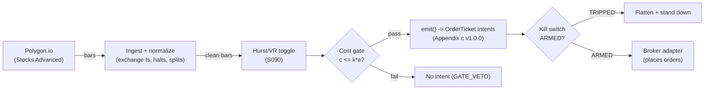

# T054 — Hurst/Variance-Ratio Regime Toggle

Intraday regime-toggled blend: a momentum sleeve armed only in persistent (trending) regimes, a mean-reversion sleeve armed only in anti-persistent regimes, dark in the random-walk dead zone. Provenance **D/SR**.

> Tag law: every numeric literal in prose carries one of `[documented]
> [default] [example] [unverified] [internal-est] [measured]` (legend: Appendix
> i v1.0.0). Bibliographic years, volumes, pages, arXiv IDs, section numbers,
> rule codes (C1–C10), fail-safe codes (F1–F5), module IDs, and machine-parsed
> §0 data fields are identifiers, not literals, and are exempt.

## §1 Five-minute reviewer card

| Row | Value |
|---|---|
| Module | T054 — Hurst/Variance-Ratio Regime Toggle, v1.0.0 |
| Edge verdict | `NO-DOCUMENTED-EDGE` — the literature documents return-predictability statistics (variance ratios), not after-cost toggled P&L — that gap is the whole story |
| After-cost | `BEFORE-COST` — one-sentence verdict: a risk-management overlay with no documented positive after-cost edge as a standalone book; the toggle rations capacity, it does not create it |
| Build cost | Tier M+ · `40–100` h [internal-est] · `$6,000–15,000` loaded [internal-est] |
| Data cost | Research `~$30–200`/mo [unverified]; production `~$200 + usage`/mo [unverified] — bands indicative, verify before budgeting |
| latency_class | bar / 1-minute |
| risk_class | medium |
| Capacity | moderate [example] — the toggle is a risk control, not a capacity unlock; capacity is set by the sleeves |
| Executability | Feasible: VR/Hurst on 1-min bars is cheap; the work is the two sleeves |
| Risk summary | Estimation noise in H chatters the toggle — hysteresis is load-bearing; regime misclassification arms the wrong sleeve at turns |
| When it dies | H hovers near `0.5` [example] (dead zone — dark, no edge); estimation window too short; sleeve crowding |
| Regime gates | Provisional: the toggle IS the gate: H `≥0.55` [example] momentum armed, `≤0.45` [example] reversion armed, else dark |
| Emits | `order_intents` (Appendix c v1.0.0) — intents only, never orders |

## §1.5 Cheapest / least-build path

1. **Prototype hour band:** `40–100` h [internal-est] — VR/Hurst estimator + toggle + sleeve entries + cost/risk harness + fixture.
2. **Cheapest-source row:** min_tier = Polygon.io Stocks Advanced — cheapest data source candidate [internal-est]; latency_class = bar / 1-minute; required_fields = 1-min OHLCV bars; price_band = `~$30–200`/mo [unverified] (indicative — verify before budgeting); build_or_buy = **build the toggle on bought 1-minute bars; no packaged regime product can be audited for t→t+1 causality**.
3. **Resource budget:** `1` core, `<4` GB RAM [internal-est]; compute pattern `per_bar`.
4. **Skip list:** R/S estimator variant; multi-horizon VR; colocated deployment.
5. **DO-NOT-CUT list:** causality assertions (`assert fill_event > signal_event`, no-signal-bar-fills test); COST block + callable `expected_cost_bps`; F1–F5 fail-safes + module-state enum; kill-switch state machine + re-arm checklist; decision-log audit records; bona-fide-intent + self-trade prevention; provenance tags on every numeric literal; fixtures + `test_cmd`; secrets via env only.
6. **Escalation gate:** upgrade from cheapest when any holds — toggle chatter `>2` flips/day [default]; sleeve universe `>200` names [default].

## §T0 Module contract

### T0.1 Typed signature

```python
def emit(state: ModuleState, signals: list[SignalVector], cfg: Config) -> list[OrderTicket]:
```

`OrderTicket` per Appendix c v1.0.0 — **intents only**; the strategy never
places orders, never holds broker/exchange sessions, never nets intents into
orders. `state` is the module-owned named state vector (`position`,
`sleeve_weights`, `cooldown_until`, `kill_state`, `module_state`); `signals`
are canonical SignalVectors (Appendix b v1.0.0), newest last. The function
handles documented edge cases: empty signals → `UNKNOWN`; halt/auction bars →
freeze per the market-state table; stale inputs → `UNKNOWN` (F4), never
interpolate.

### T0.2 Config dataclass

| Parameter | Type | Default | Range | Status |
|---|---|---|---|---|
| `H_trend` | float | `0.55` | `0.52`–`0.65` | default |
| `H_rev` | float | `0.45` | `0.35`–`0.48` | default |
| `hyst_bars` | int | `2` | `1`–`5` | default |
| `R_usd` | float | `500` | `100`–`2,000` | default |
| `sleeve_cap` | float | `2000000` | `500000`–`10000000` | default |
| `time_stop_bars` | int | `30` | `5`–`60` | default |
| `cooldown_bars` | int | `2` | `0`–`10` | default |
| `cost_gate_k` | float | `0.5` | `0.1`–`2.0` | default |

All defaults tagged per the tag law (status `default` ⇒ `[default]`).

### T0.3 Canonical schema mapping

Vendor columns → canonical Bar schema (Appendix a v1.0.0), stated once here:

| Vendor (Polygon.io Stocks Advanced) | Canonical |
|---|---|
| bar open timestamp | `event_ts` (int64 ns UTC, bar open time) |
| `o/h/l/c`, `v` | `open/high/low/close`, `volume` |
| symbol | `symbol` (exchange-qualified) |
| signal value | `sig` (strategy-defined score, Appendix b `value`) |
| gate flag | `gate` ∈ {0, 1} (confirmation gate) |

### T0.4 Time contract

> Time contract: clock domain UTC, int64 ns; authoritative causality clock =
> `event_ts`; max_skew = `1` ms [default]; jitter budget = `500` µs [default];
> bar-label = open time; staleness TTL = `3`× cadence [default] (F4); gap
> policy = mask, no interpolation; halt/auction → discard contributions
> across reopen.

**Timing box:** `signal@t (per_bar-1min, America/New_York) → earliest fill @open(t+1)`

### T0.5 Market-state table

| State | Module behavior |
|---|---|
| CONTINUOUS_TRADING | Evaluate entries/exits per §T2; emit intents |
| HALTED | Freeze state; emit nothing; `UNKNOWN` on held signals |
| AUCTION | No new entries; exits only via auction-aware intents (MOO/MOC); state `DEGRADED` |
| CLOSED | Emit nothing; state `OFF` |

### T0.6 Module-state enum + error taxonomy

States per Appendix k v1.0.0: `OK | DEGRADED | UNKNOWN | OFF`. Invalid input →
`UNKNOWN`, never interpolate (Appendix f v1.0.0, F1–F5).

| Failure | State | Alert |
|---|---|---|
| Missing/stale input (TTL `3`× cadence [default]) | `UNKNOWN` | page |
| Non-finite / non-positive price reaching module (F2) | `UNKNOWN` | page |
| `event_ts` non-monotonic (F2) | `UNKNOWN` | page |
| Kill-switch TRIPPED | `OFF` (no new intents) | page |
| Halt/auction | `UNKNOWN` / `DEGRADED` (per table) | log |
| Feed anomaly (per §T9 row 1) | `DEGRADED` | notify |
| Anything unmapped | `UNKNOWN` | page |

### T0.7 Risk contract + kill switch

```yaml
risk_contract:
  per_trade_R: `500`            # [example] — N = floor(R/stop_dist), R = $500 per trade
  max_adverse_per_trade: `1.0`x stop distance [example]   # [example]
  daily_loss_stop: `-3000` USD [example]          # [example] — then dark for the day
  max_gross: `10`M USD portfolio [example]                # [example]
  kill_conditions:                        # any one trips -> TRIPPED
  - "feed anomaly (T5 safe mode) -> TRIPPED"
  - "daily loss <= -$3,000 -> TRIPPED"
  - "H estimator non-finite -> TRIPPED"
  enforcement: intraday-hard              # breach flattens; no review-only mode
```

**Calibration recipe:** `per_trade_R` is the sizing input in §T2 (dollar-risk
`N = ⌊R/stop_dist⌋` or the confidence-scaled equivalent); re-estimate `R`
from the trailing `60`-day [default] per-trade P&L distribution so that a
`3`σ [default] adverse day stays inside `daily_loss_stop`. `max_gross` is
checked pre-emit on every ticket (C4). Kill-switch state machine:

```
ARMED → TRIPPED → RECOVERY → ARMED
```

- `ARMED → TRIPPED`: any kill condition fires → cancel all working intents
  (idempotent cancels), flatten at marketable limits, set module state `OFF`,
  write a `KILL_TRIP` decision record (Appendix g v1.0.0).
- `TRIPPED → RECOVERY`: re-arm checklist **all green** — `1.` feed healthy
  (no stale bars); `2.` decision log reconciled against broker ledger, no
  orphan tickets; `3.` root cause of the trip identified and the offending
  config reverted or re-calibrated; `4.` risk owner sign-off recorded.
- `RECOVERY → ARMED`: one clean evaluation pass over the fixture
  (`test_cmd` green) with no new trip, then resume.

### T0.8 Ops tail

- **Schedule:** RTH `09:30`–`16:00` [documented]; owner: stat-arb on-call.
- **Health checks:** fixture replay (`test_cmd`) green on deploy; live
  staleness watchdog at `3`× cadence; kill-switch drill monthly [default].
- **Alert table:** page on `UNKNOWN` > `30` s [default], on any kill trip, or
  bounds violation; notify on `DEGRADED`; log on single dropped bars.
- **Resource budget:** `1` vCPU, `4` GB RAM [internal-est]; state is O(`1`) per symbol.
- **Runbook stub:** `1.` confirm feed; `2.` replay fixture; `3.` if red → set
  `OFF`, page; `4.` reconcile decision log before re-arm; `5.` complete the
  re-arm checklist (§T0.7) before `ARMED`.

### T0.9 Secrets (env-only)

`POLYGON_API_KEY` via environment only. No secrets in this file, fixtures, or logs
(CI secrets-grep).

### T0.10 May / must-NOT

> **May:** emit `OrderTicket` intents per Appendix c v1.0.0; track intent-side
> state; issue cancel-replace via new tickets. **Must-NOT:** place orders on
> any venue, hold broker/exchange sessions, net intents into orders inside the
> strategy, or treat the intent-side state machine as broker wire truth.

## §T1 Legacy (subsumed by §1)

Legacy §T1 content is the §1 reviewer card above; this header is retained so
section numbering stays frozen.

## §T2 Specification

### Universe

Liquid US large-caps on 1-min bars (`30`-bar momentum lookback [example], Bollinger(`20`,`2.0`) [example] for the reversion sleeve). RTH only.

### Entry rule (Boolean — no prose-only conditions)

```
ARM_MOM := (H >= 0.55) AND (2 consecutive readings [example])
              AND (expected_cost_bps(...) <= cost_gate_k * edge_bps)
ARM_REV := (H <= 0.45) AND (2 consecutive readings [example])
              AND (expected_cost_bps(...) <= cost_gate_k * edge_bps)
DARK    := `0.45` < H < `0.55` [example]   # random-walk dead zone: no sleeve armed
```

### Exits (with post-exit cooldown)

```
EXIT := H re-enters the dead zone (`0.45`, `0.55`) [example]
        OR (bars_held >= time_stop_bars)   # 30 bars [default]
ON_EXIT: cooldown_until = now + cooldown_bars * bar_ns   # C10
```

### Position sizing (fenced function)

```python
def size_shares(R_usd=500.0, stop_dist=1.0, sleeve_cap=2_000_000, price=100.0):  # defaults [default]
    # Dollar-risk sizing with a per-name sleeve gross cap. [example]
    n = int(R_usd // max(stop_dist, 1e-9))
    return int(min(n, sleeve_cap // max(price, 1e-9)))
```

### Risk limits

| Limit | Value |
|---|---|
| Per-trade risk | `$500` [example] |
| Daily loss stop | `−$3,000` → dark for the day [example] |
| Portfolio gross cap | `$10`M [example] |
| Sleeve gross cap per name | `±$2`M [example] |

### COST block (single source of truth)

| Component | Value (bps) | Basis |
|---|---|---|
| Spread | `2.50` | [example] — 1.25 bp half-spread per aggressive leg ×2 |
| Fees | `0.40` | [example] — $0.005/share/side on a `$250` stock |
| Borrow | `0.0` | [default] — reference build; shorts add C7 locate cost |
| Impact | `0.0` | [example] — flagged; stress-tested with doubled spread in §T9 |
| **Total reference** | `2.90` | [example] |

`fee_schedule_as_of`: `2026-09-01` [unverified] — placeholder; pin the real
venue schedule before production. `side: taker` [default];
venue/tier/source: XNAS / Polygon.io Stocks Advanced [example]. `borrow_bps_per_day`: `0.0`
[default] — no borrow in the reference build.

Re-stating cost numbers outside
this block is a validation failure.

```python
def expected_cost_bps(notional, adv_pct, venue, side, urgency) -> float:
    '''Callable cost model — single source of truth (this block).'''
    spread_bps = 2.5   # [example] — 1.25 bp half-spread per aggressive leg ×2
    fee_bps = 0.4         # [example] — $0.005/share/side on a `$250` stock
    borrow_bps = 0.0   # [default]
    impact_bps = 0.0   # [example] — flagged; stress-tested with doubled spread in §T9
    if side == "maker":
        fee_bps = -abs(fee_bps) * 0.5  # rebate proxy [example]
    return spread_bps + fee_bps + borrow_bps + impact_bps
```

### Execution / fill model table

| Aspect | Assumption |
|---|---|
| Latency | Signal→intent `≤1` s on 1-min bars [example] |
| Entries | Momentum sleeve: marketable limits with the trend; reversion sleeve: tag-and-reenter limits |
| Exits | Marketable limits when H re-enters the dead zone |
| Partial fills | Per Appendix c v1.0.0 FIFO |
| Adverse fill | Toggle flips cluster at turns — fills are worst exactly when the regime call is most uncertain [example] |

### Robustness

H re-estimated every `5` minutes [example]; hysteresis (`2` consecutive readings [example]) is load-bearing against estimation chatter. VR window `40` bars [example]; thresholds mined thresholds get the Deflated Sharpe Ratio treatment (Bailey & López de Prado 2014).

### Compliance sub-block (C1–C10+)

| Code | Rule: trigger → check → action → log |
|---|---|
| C1 | Self-match / STP: every ticket carries self-trade-prevention instructions for the broker adapter; trigger = two tickets same symbol opposite side within `1` s [default] → check resting-interest overlap → action = cancel the newer ticket → log `COMPLIANCE_BLOCK` |
| C2 | Bona-fide intent: every entry intent must pass the cost gate (`expected_cost_bps(...) <= k * edge_bps`) and fit risk limits; trigger = gate fail → check = re-evaluate → action = no ticket emitted → log `GATE_VETO` |
| C3 | Message-rate / cancel-to-trade: trigger = `>50` intents/symbol/min [default] or cancel-to-trade `>10:1` [default] → check venue thresholds → action = throttle to `5`/min [default] + alert → log `COMPLIANCE_BLOCK` |
| C4 | Pre-trade fat-finger trio: price collar `±5`% vs reference [default] → reject; max notional per ticket `$2,000,000` [default] → reject; max `50` tickets/symbol/`5` min [default] → throttle; all rejections logged |
| C5 | Decision-log schema compliance (Appendix g v1.0.0): every intent, veto, cancel-replace, kill transition logged with inputs_hash/params_hash, hash-chained; trigger = missing record → action = halt to `UNKNOWN` |
| C6 | Halt/auction state table: per §T0.5 — HALTED freezes, AUCTION blocks new entries, CLOSED emits nothing; trigger = state change → check market-state table → action = freeze/cancel per table → log |
| C7 | Locate check (short sales): trigger = SHORT intent → check = easy-to-borrow list or live locate obtained pre-emit → action = block intent without locate → log `GATE_VETO`; Reg-SHO threshold securities never shorted |
| C8 | Public-dissemination gate: no signal/intent data published externally without review; trigger = export request → check = review sign-off → action = block until signed |
| C9 | Data-entitlement assertions per dataset (Appendix j v1.0.0): trigger = entitlement-class change or unlicensed symbol → check §T5 data-rights row → action = stand down affected symbols → log |
| C10 | Post-exit cooldown: trigger = exit or compliance block → check `now < cooldown_until` → action = no re-entry until ``2`` bars [default] elapse → log |
| C11 | Toggle-chatter cap: `>2` sleeve flips per day [default] → widen the dead zone / lengthen hysteresis → check flip count → action = widen → log `COMPLIANCE_BLOCK` |

### Parameter table

| Parameter | Symbol | Value | Tag | Sensitivity |
|---|---|---|---|---|
| Trend threshold | `H_trend` | `0.55` | [example] | high |
| Reversion threshold | `H_rev` | `0.45` | [example] | high |
| Hysteresis | `hyst_bars` | `2` readings | [example] | high — anti-chatter |
| Per-trade R | `R_usd` | `$500` | [example] | medium |
| Time stop | `time_stop_bars` | `30` bars | [default] | low |
| Cost-gate k | `cost_gate_k` | `0.5` | [default] | high |

### Timing box

`signal@t (per_bar-1min, America/New_York) → earliest fill @open(t+1)`

## §T3 Math + normative pseudocode

The Hurst exponent $\hat{H}$ maps the Lo–MacKinlay variance ratio onto a
0–1 scale [documented mapping]: $\hat{H} > 0.5$ persistent (trending),
$\hat{H} < 0.5$ anti-persistent (mean-reverting), $\hat{H} = 0.5$ random walk.
Classification [example]: trend if $\hat{H} \ge 0.55$, reversion if
$\hat{H} \le 0.45$, dark otherwise. Momentum sleeve (S025-style):
$\mathrm{Sig}_t = \mathrm{sign}(\sum_{i=0}^{29} w_i r_{t-i})$ over trailing 30
one-minute bars [example]; vol-targeted size
$\mathrm{pos}_t = \mathrm{Sig}_t \cdot \sigma_{\mathrm{target}}/\hat{\sigma}_t$
[example]. Reversion sleeve (S041-style): Bollinger(20, 2.0) tag-and-reenter
[example]. Hysteresis: a regime change needs two consecutive 5-minute readings
in the new regime [example].

**Normative pseudocode** (pseudocode is normative; prose is commentary):

```
function emit(state, signals, cfg) -> list[OrderTicket]:
    assert signals non-empty else return UNKNOWN                    # F1
    for bar t in signals (newest last):
        s = Hurst exponent H mapped from the variance ratio                                            # data <= t only
        assert isfinite(s) else return UNKNOWN                      # F2
        edge_bps = abs(H - 0.5) * 80.0                                   # [example] — modeled per-trade edge in bps
        cost = expected_cost_bps(notional, adv_pct, venue, side, urgency)
        cost_ok = expected_cost_bps(...) <= k * edge_bps
        # ^^^ normative cost-gate predicate: expected_cost_bps(...) <= k * edge_bps
        if state.position is None and state.module_state == OK:
            if ((H >= 0.55) or (H <= 0.45)) and cost_ok:
                ticket = OrderTicket(symbol, side, qty, limit, tif,
                                     ticket_id=uuid(), parent_signal="S090@t",
                                     intent_ts=t.event_ts, state=NEW)
                log_decision(ticket, inputs_hash, params_hash)     # C5 / Appendix g
                assert fill_event > signal_event                    # t->t+1 causality
        else if state.position is not None:
            if (H re-enters (0.45, 0.55) or bars_held >= 30):
                emit exit intent (cancel-replace rules, Appendix c) # C1
                state.cooldown_until = t + cooldown_bars            # C10
                assert fill_event > signal_event
    return tickets
```

Causality: every quantity at bar `t` uses only data `≤ t`; the earliest fill
is bar `t+1`'s open. Mandatory unit test: no-signal-bar fills
(`assert fill_event > signal_event`).

## §T4 Worked example (fixture-backed)

- Tape: `modules/fixtures/T054_tape.csv` — `# TYPE: validation-run`;
  `12` bars [example], all numbers synthetic, seed `10054` [example];
  `event_ts` int64 ns UTC, bar-labeled by open time.
- Expected outputs: `modules/fixtures/T054_expected.csv` — per-ticket
  intents with the cost-function call recorded (inputs → bps → $);
  tolerance `1e-6` [default] on floats.
- Acceptance tests (`modules/tests/test_T054.py`, `6` tests):
  `1.` fixture replays to expected (hand-checked rows below); `2.` cost-gate
  predicate passes on the fixture's large edges and blocks a tiny-edge
  counter-case (`k = 0.5` [default]); `3.` no-signal-bar fills
  (`fill_ts > signal_ts` on every ticket); `4.` kill-switch trips on the
  breach scenario and re-arms through the checklist
  (`ARMED → TRIPPED → RECOVERY → ARMED`); `5.` invalid input (non-positive
  price) → `UNKNOWN`, never interpolated; `6.` hand-check literals
  (qty / bps / $) match the generation run.
- `test_cmd`: `python3 -m pytest modules/tests/test_T054.py -q` → exits `0`.

**Cost-function calls on the fixture** (inputs → bps → $, from the harness run):

| ticket | notional ($) | adv_pct | side | edge_bps | cost_bps | cost_$ | gate |
|---|---|---|---|---|---|---|---|
| T-T054-1-0 | 100048.48 | 0.0200 | taker | 6.4000 | 2.9000 | 29.0141 | PASS |
| T-T054-4-X | 100013.24 | 0.0200 | taker | 0.0000 | 2.9000 | 29.0038 | N/A |
| T-T054-6-0 | 99994.76 | 0.0200 | taker | 6.4000 | 2.9000 | 28.9985 | PASS |
| T-T054-9-X | 100015.84 | 0.0200 | taker | 0.0000 | 2.9000 | 29.0046 | N/A |
| T-T054-11-0 | 99978.12 | 0.0200 | taker | 8.0000 | 2.9000 | 28.9937 | PASS |

**Where the example is optimistic:** the fixture demonstrates the toggle's sleeve-arm intents; production sleeve entries (momentum sign sum, Bollinger tag-and-reenter) fan out per sleeve logic; estimation chatter is suppressed by hysteresis in the sketch



## §T5 Dependencies & data

Generated-from-`deps.yaml` shape (CI symmetry); hand-listed:

| Module | Role | Version pin |
|---|---|---|
| S090 — Hurst / variance-ratio | Regime toggle (trigger) | 1.0.0 |
| S025 — Intraday time-series momentum | Momentum sleeve | 1.0.0 |
| S041 — Bollinger tag-and-reenter | Reversion sleeve | 1.0.0 |

| Field | Type | Granularity | Source tier | Notes |
|---|---|---|---|---|
| 1-min OHLCV | float/int | 1-min bars | Tier 1 | `40`-bar VR window [example] |

**Family note:** family `B` = statistical / time-series strategies.

**Data rights row** (Appendix j v1.0.0): US equities 1-min bars via Polygon.io
Stocks Advanced, `rights: licensed`; license scope = research + stated
production symbol count; raw ticks never leave our systems — fixtures are
synthetic; entitlement = professional/internal, no display; retention per
vendor terms, purge path in runbook. Entitlement-class change → §1.5
escalation gate.

## §T6 Local build (M5 Max / 128 GB)

Feasible on the M5 Max (Tier M+, `40–100` h ≈ `$6k–15k` eng + `~$200`/mo data per notes/cost-model.md §5); VR/Hurst per bar is O(window) [documented] — trivial. Bottleneck is sleeve calibration, not the toggle.

## §T7 Buy vs build

Build the toggle on bought 1-minute bars (Tier 2); no packaged regime product can be audited for t→t+1 causality on your universe. Verdict: the toggle is `~50` lines [internal-est]; the sleeves are the product.

## §T8 Efficacy — documented evidence

| Study / source | Market & period | Metric | Before/after cost | Caveat |
|---|---|---|---|---|
| Lo & MacKinlay (1988), RFS | US weekly returns 1962–1985 | variance-ratio test rejects the random walk (VR ≠ 1) [documented] | `BEFORE-COST` (statistical test) | rejection of a random walk ≠ proof of tradable trend |
| Hurst (1951), Trans. ASCE | Hydrology (Nile) | R/S analysis; H ≠ 0.5 in natural series [documented] | n/a (not markets) | origin of the exponent, not market evidence |
| Bailey & López de Prado (2014), J. Portfolio Mgmt | General | Deflated Sharpe Ratio corrects for multiple-testing selection bias and non-normal returns [documented] | methodological | applies to the toggle's mined thresholds |

Selection disclosure: these are the sources surfaced by the chapter's research
pass (Stage 154/200). **Honest bottom line.** For a ≤$1M paper operation: T054 is a risk-management overlay with no documented positive after-cost edge as a standalone book — the papers show returns aren't random walks, not that a toggled book makes money after costs.

## §T9 Failure modes & pitfalls

| # | Trigger → Detect → Action → Recovery | check: |
|---|---|---|
| 1 | H misestimation: short-window H chatters → detect: flip counter → action: widen dead zone / lengthen hysteresis → recovery: re-validate | `check: flips_per_day <= 2` |
| 2 | Dead-zone drift: H hovers at 0.5 all day → detect: armed fraction → action: stay dark (correct behavior) → recovery: none | `check: dark is a valid state` |
| 3 | Wrong sleeve at turns: regime flips mid-position → detect: H re-enters dead zone → action: exit → recovery: re-arm on 2 readings | `check: exit on dead_zone` |
| 4 | Threshold mining: H_trend/H_rev overfit → detect: DSR on walk-forward → action: shrink thresholds toward 0.5 → recovery: re-validate | `check: dsr > 0` |
| 5 | Cost blowup (doubled-spread stress) → detect: cost gate fails → action: stand down → recovery: re-pin | `check: expected_cost_bps(...) <= k * edge_bps` |
| 6 | Lookahead: H uses future bars → detect: causality audit → action: halt → recovery: re-run test | `check: all(fill_ts > signal_ts)` |

## §T10 Source log + unverified leads

**Sources** (citable facts only):

1. Lo, A. W. & MacKinlay, A. C. (1988) [documented]. "Stock Market Prices Do Not Follow Random Walks: Evidence from a Simple Specification Test." *Review of Financial Studies* 1(1): 41–66. — the variance-ratio test the toggle is built on.
2. Hurst, H. E. (1951) [documented]. "Long-Term Storage Capacity of Reservoirs." *Transactions of the American Society of Civil Engineers* 116: 770–799. DOI 10.1061/TACEAT.0006518 — R/S analysis; origin of the exponent.
3. Bailey, D. H. & López de Prado, M. (2014) [documented]. "The Deflated Sharpe Ratio: Correcting for Selection Bias, Backtest Overfitting and Non-Normality." *Journal of Portfolio Management* 40(5): 94–107. — selection-bias correction for the mined thresholds.

**Chatbot source log.** Grok answered Q-TB6-1..3 (2026-09-10); all claims independently verified or labeled unverified.

**Unverified leads** (chatbot-only — never in evidence tables):

- Grok Q-TB6-3: purged/embargoed CV and CPCV as the validation standard for the toggle's thresholds — standard practice per the cited AFML literature, but the TB6 rendering is chatbot-sourced; kept as a lead.
- Vendor pricing in the chapter's buy-vs-build (Massive/Polygon ~$199/mo class, Databento ~$200/mo + usage) — planning bands, indicative — verify before budgeting.

---

## Appendix — AI build prompt (T054)

Copy-paste into any chat agent:

> Build module **T054 — Hurst/Variance-Ratio Regime Toggle** per `notes/module-template.md` v1.0.0
> and this file's §T0 contract.
> Cheapest path (§1.5): prototype `40–100` h [internal-est]; cheapest data
> candidate Polygon.io Stocks Advanced [internal-est]; compute pattern `per_bar`; skip
> R/S estimator variant; multi-horizon VR; colocated deployment for now.
> Implement `emit(state, signals, cfg) -> list[OrderTicket]`
> (Appendix c v1.0.0) with the §T3 normative pseudocode, including the
> cost-gate predicate `expected_cost_bps(...) <= k * edge_bps` and
> `assert fill_event > signal_event`. Wire F1–F5 (Appendix f v1.0.0): invalid
> input → `UNKNOWN`, never interpolate. Implement the kill-switch state
> machine `ARMED → TRIPPED → RECOVERY → ARMED` with the §T0.7 re-arm
> checklist. Log decisions per Appendix g v1.0.0. Secrets via env only.
> Run the fixture `modules/fixtures/T054_tape.csv`
> (`# TYPE: validation-run`) against `modules/fixtures/T054_expected.csv`
> (tolerance `1e-6` [default]).
> **Definition of done:** `python3 -m pytest modules/tests/test_T054.py -q`
> exits `0`. Tag every numeric literal you add with the unified enum
> (Appendix i v1.0.0); put anything unverifiable in §T10 unverified leads.
