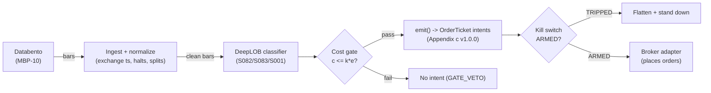

# T055 — DeepLOB + Feature-Stack Classifier

Sub-second limit-order-book classifier scalping: a CNN+LSTM reads the book, a handcrafted feature stack (S082) plus touch OFI (S001) confirms it, and only high-confidence predictions become trades on S083 event bars. Provenance **D/SR**.

> Tag law: every numeric literal in prose carries one of `[documented]
> [default] [example] [unverified] [internal-est] [measured]` (legend: Appendix
> i v1.0.0). Bibliographic years, volumes, pages, arXiv IDs, section numbers,
> rule codes (C1–C10), fail-safe codes (F1–F5), module IDs, and machine-parsed
> §0 data fields are identifiers, not literals, and are exempt.

## §1 Five-minute reviewer card

| Row | Value |
|---|---|
| Module | T055 — DeepLOB + Feature-Stack Classifier, v1.1.0 |
| Edge verdict | `NO-DOCUMENTED-EDGE` — DeepLOB classification accuracy is not executable P&L — every cited result is a prediction score, and the fee-inclusive breakeven needs P(correct) > `65`% [example] before latency |
| After-cost | `BEFORE-COST` — one-sentence verdict: the literature shows book state predicts the next move, but there is no documented positive after-cost edge — the documented moves are fractions of the spread |
| Build cost | Tier H · `60–200` h [internal-est] · `$9,000–30,000` loaded [internal-est] |
| Data cost | Research `$199 + usage`/mo [documented] (Databento Standard plan floor; L2 usage per the unit-pricing sheet); production `$199 + usage`/mo [documented] — verify plan terms before budgeting |
| latency_class | microstructure / sub-second |
| risk_class | high |
| Capacity | near zero for a non-colocated taker [example] — the documented moves are fractions of the spread |
| Executability | Hard: needs L2, GPU training, and sub-second inference; the harness is the easy part |
| Risk summary | Latency rank dominates: every colocated participant sees the same public book; model staleness and feature-pipeline skew silently degrade the classifier |
| When it dies | inference latency above the event bar; book crossed/locked; confidence collapse; colocated competition arbitrages the signal |
| Regime gates | Provisional: wide-spread / thin-book regimes veto — see §T9 machine records; wire to R-IDs on the annotation pass |
| Emits | `order_intents` (Appendix c v1.0.0) — intents only, never orders |

## §1.5 Cheapest / least-build path

1. **Prototype hour band:** `60–200` h [internal-est] — LOB tensor pipeline + CNN+LSTM training + feature stack + confidence gate + fixture.
2. **Cheapest-source row:** min_tier = Databento Standard (L2) — cheapest data source candidate [internal-est]; latency_class = microstructure / sub-second; required_fields = L2 MBP-10 snapshots, exchange timestamps; price_band = `$199/mo + usage` [documented] (Standard plan floor; usage per the unit-pricing sheet — verify before budgeting); build_or_buy = **build the classifier harness on bought L2; the network architecture is the commodity — your labels, calibration, and cost gate are the product**.
3. **Resource budget:** `4` cores, `16` GB RAM + GPU for training [internal-est]; compute pattern `per_event`.
4. **Skip list:** colocated deployment; FPGA inference; full MBO replay.
5. **DO-NOT-CUT list:** causality assertions (`assert fill_event > signal_event`, no-signal-bar-fills test); COST block + callable `expected_cost_bps`; F1–F5 fail-safes + module-state enum; kill-switch state machine + re-arm checklist; decision-log audit records; bona-fide-intent + self-trade prevention; provenance tags on every numeric literal; fixtures + `test_cmd`; secrets via env only.
6. **Escalation gate:** upgrade from cheapest when any holds — event rate `>10`k/s sustained [default]; inference `p99 >100` ms [default]; GPU training needed weekly [default].

## §T0 Module contract

### T0.1 Typed signature

```python
def emit(state: ModuleState, signals: list[SignalVector], cfg: Config) -> list[OrderTicket]:
```

`OrderTicket` per Appendix c v1.0.0 — **intents only**; the strategy never
places orders, never holds broker/exchange sessions, never nets intents into
orders. `state` is the module-owned named state vector (`position`,
`sleeve_weights`, `cooldown_until`, `kill_state`, `module_state`); `signals`
are canonical SignalVectors (Appendix b v1.0.0), newest last. The function
handles documented edge cases: empty signals → `UNKNOWN`; halt/auction bars →
freeze per the market-state table; stale inputs → `UNKNOWN` (F4), never
interpolate.

### T0.2 Config dataclass

| Parameter | Type | Default | Range | Status |
|---|---|---|---|---|
| `c_min` | float | `0.58` | `0.52`–`0.75` | default |
| `p0_max` | float | `0.40` | `0.25`–`0.50` | default |
| `rt_cost_ticks` | float | `0.6` | `0.3`–`1.5` | default |
| `q_base` | int | `100` | `10`–`1,000` | default |
| `target_ticks` | float | `2.0` | `1`–`5` | default |
| `stop_ticks` | float | `2.0` | `1`–`5` | default |
| `time_stop_events` | int | `10` | `5`–`50` | default |
| `depth_cap` | float | `0.01` | `0.005`–`0.05` | default |
| `cost_gate_k` | float | `0.5` | `0.1`–`2.0` | default |
| `cooldown_bars` | int | `5` | `1`–`20` | default |
| `c_collapse` | float | `0.50` | `0.40`–`0.60` | default |

All defaults tagged per the tag law (status `default` ⇒ `[default]`).

### T0.3 Canonical schema mapping

Vendor columns → canonical Bar schema (Appendix a v1.0.0), stated once here:

| Vendor (Databento MBP-10) | Canonical |
|---|---|
| bar open timestamp | `event_ts` (int64 ns UTC, bar open time) |
| `o/h/l/c`, `v` | `open/high/low/close`, `volume` |
| symbol | `symbol` (exchange-qualified) |
| signal value | `sig` (strategy-defined score, Appendix b `value`) |
| gate flag | `gate` ∈ {0, 1} — `1` iff the S082 feature stack AND the S001 touch-OFI both confirm the direction at bar t [example]; set upstream of `emit()`, never inside |

### T0.4 Time contract

> Time contract: clock domain UTC, int64 ns; authoritative causality clock =
> `event_ts`; max_skew = `1` ms [default]; jitter budget = `500` µs [default];
> bar-label = open time; staleness TTL = `3`× cadence [default] (F4); gap
> policy = mask, no interpolation; halt/auction → discard contributions
> across reopen.

**Timing box:** `signal@t (per_event, America/New_York) → earliest fill @open(t+1)`

### T0.5 Market-state table

| State | Module behavior |
|---|---|
| CONTINUOUS_TRADING | Evaluate entries/exits per §T2; emit intents |
| HALTED | Freeze state; emit nothing; `UNKNOWN` on held signals |
| AUCTION | No new entries; exits only via auction-aware intents (MOO/MOC); state `DEGRADED` |
| CLOSED | Emit nothing; state `OFF` |

### T0.6 Module-state enum + error taxonomy

States per Appendix k v1.0.0: `OK | DEGRADED | UNKNOWN | OFF`. Invalid input →
`UNKNOWN`, never interpolate (Appendix f v1.0.0, F1–F5).

| Failure | State | Alert |
|---|---|---|
| Missing/stale input (TTL `3`× cadence [default]) | `UNKNOWN` | page |
| Non-finite / non-positive price reaching module (F2) | `UNKNOWN` | page |
| `event_ts` non-monotonic (F2) | `UNKNOWN` | page |
| Kill-switch TRIPPED | `OFF` (no new intents) | page |
| Halt/auction | `UNKNOWN` / `DEGRADED` (per table) | log |
| Feed anomaly (per §T9 row 1) | `DEGRADED` | notify |
| Anything unmapped | `UNKNOWN` | page |

### T0.7 Risk contract + kill switch

```yaml
risk_contract:
  per_trade_R: `100`            # [default] — 100 sh × 2-tick stop on a 1¢-tick stock = $4; rounded up with adverse-selection buffer; calibrate live
  max_adverse_per_trade: `2` ticks [example]   # [example]
  daily_loss_stop: `-1000` USD [default]          # [default] — calibrate from live per-trade P&L
  max_gross: `1.0`x [default]                # [default]
  kill_conditions:                        # any one trips -> TRIPPED
  - "inference p99 > 1 s or feature pipeline skew -> TRIPPED"
  - "book crossed/locked at decision time -> TRIPPED"
  - "daily loss <= -$1,000 -> TRIPPED"
  enforcement: intraday-hard              # breach flattens; no review-only mode
```

**Calibration recipe:** `per_trade_R` is the sizing input in §T2 (dollar-risk
`N = ⌊R/stop_dist⌋` or the confidence-scaled equivalent); re-estimate `R`
from the trailing `60`-day [default] per-trade P&L distribution so that a
`3`σ [default] adverse day stays inside `daily_loss_stop`. `max_gross` is
checked pre-emit on every ticket (C4). Kill-switch state machine:

```
ARMED → TRIPPED → RECOVERY → ARMED
```

- `ARMED → TRIPPED`: any kill condition fires → cancel all working intents
  (idempotent cancels), flatten at marketable limits, set module state `OFF`,
  write a `KILL_TRIP` decision record (Appendix g v1.0.0).
- `TRIPPED → RECOVERY`: re-arm checklist **all green** — `1.` feed healthy
  (no stale bars); `2.` decision log reconciled against broker ledger, no
  orphan tickets; `3.` root cause of the trip identified and the offending
  config reverted or re-calibrated; `4.` risk owner sign-off recorded.
- `RECOVERY → ARMED`: one clean evaluation pass over the fixture
  (`test_cmd` green) with no new trip, then resume.

### T0.8 Ops tail

- **Schedule:** RTH continuous [documented]; owner: ml-microstructure on-call.
- **Health checks:** fixture replay (`test_cmd`) green on deploy; live
  staleness watchdog at `3`× cadence; kill-switch drill monthly [default].
- **Alert table:** page on `UNKNOWN` > `30` s [default], on any kill trip, or
  bounds violation; notify on `DEGRADED`; log on single dropped bars.
- **Resource budget:** `4` vCPU, `16` GB RAM (+GPU train) [internal-est]; state is O(`1`) per symbol.
- **Runbook stub:** `1.` confirm feed; `2.` replay fixture; `3.` if red → set
  `OFF`, page; `4.` reconcile decision log before re-arm; `5.` complete the
  re-arm checklist (§T0.7) before `ARMED`.

### T0.9 Secrets (env-only)

`DATABENTO_API_KEY` via environment only. No secrets in this file, fixtures, or logs
(CI secrets-grep).

### T0.10 May / must-NOT

> **May:** emit `OrderTicket` intents per Appendix c v1.0.0; track intent-side
> state; issue cancel-replace via new tickets. **Must-NOT:** place orders on
> any venue, hold broker/exchange sessions, net intents into orders inside the
> strategy, or treat the intent-side state machine as broker wire truth.

## §T1 Legacy (subsumed by §1)

Legacy §T1 content is the §1 reviewer card above; this header is retained so
section numbering stays frozen.

## §T2 Specification

### Universe

Liquid large-tick US names where L2 is deep and stable [example]; RTH only. Requires exchange-timestamped L2 — SIP TAQ work is simulated-only for latency claims.

### Entry rule (Boolean — no prose-only conditions)

```
ENTER_LONG  := (gate = 1) AND (c >= c_min) AND (p0 < p0_max) AND (argmax = UP)
               AND (expected_move >= rt_cost_ticks)
               AND (expected_cost_bps(...) <= cost_gate_k * edge_bps)
ENTER_SHORT := mirror with argmax = DOWN (locate_ok)
FLAT        := otherwise
```

### Exits (with post-exit cooldown)

```
EXIT := (mid moves +/- target_ticks / stop_ticks)            # 2 ticks [default]
        OR (events_held >= time_stop_events)                # 10 events [default]
        OR (fresh prediction c < c_collapse against the position)  # confidence collapse [default]
ON_EXIT: cooldown_until = now + cooldown_bars * bar_ns   # C10
```

### Position sizing (fenced function)

```python
def shares(risk_budget_R, stop_distance, vol_estimate, ADV_cap, cost,
           c, c_min=0.58, tick_size=0.01):  # c_min/tick_size [default]
    """Normative sizing: R-based size scaled by classifier confidence, capped by ADV."""
    # R-based size: shares whose stop-distance loss equals the per-trade
    # dollar-risk budget (per_trade_R = $100 [default]; stop 2 ticks on a
    # 1-cent-tick stock = $2 -> ~50 shares before scaling).
    n_risk = int(risk_budget_R // max(stop_distance, tick_size * 0.5))
    # Confidence scale: linear from 0 at the gate to full R-size at c = 1. [example]
    frac = max(0.0, c - c_min) / max(1.0 - c_min, 1e-9)
    n_conf = int(min(frac, 1.0) * min(n_risk, int(ADV_cap)))
    # Cost enters via the C2 cost gate, not via size; vol_estimate is accepted
    # for signature compatibility and logged for the calibration recipe.
    return int(min(n_risk, n_conf, int(ADV_cap)))
```

Capacity model (single source of truth for the §1 card capacity row):

```python
def max_notional(ADV_usd, participation_cap=0.01, spread_regime=1.0):
    # participation_cap 1% of ADV [default]; spread_regime > 1 widens spreads
    # and shrinks the usable book, so capacity falls with spread_regime. [example]
    return participation_cap * ADV_usd / max(spread_regime, 1e-9)
```

For the worked fixture name (AAA, ADV `5`M USD [example]) this gives
`max_notional ≈ $50,000` [example] — the §1 card "near zero for a non-colocated
taker" still stands, because the per-trade edge is a fraction of the spread
and the queue at the touch is adversely selected at any real size.

### Risk limits

| Limit | Value |
|---|---|
| Per-trade risk | `$100` [default] — calibrate live |
| Daily loss stop | `−$1,000` [default] |
| Max gross | `1.0`× [default] |
| Depth cap | `1`% of visible touch depth [example] |

### COST block (single source of truth)

| Component | Value (bps) | Basis |
|---|---|---|
| Spread | `0.24` | [example] — 0.6 ticks round-trip on a 1¢-tick $250 stock |
| Fees | `0.0` | [example] — no rebate modeled; venue fees in the spread line |
| Borrow | `0.0` | [default] — sub-second holds; shorts add C7 locate cost |
| Impact | `0.0` | [example] — flagged; taker at the touch pays full queue cost at scale |
| **Total reference** | `0.24` | [example] |

`fee_schedule_as_of`: `2026-09-10` [documented] — Nasdaq's Price List posts
$0.0030/share to remove liquidity for shares ≥ $1.00, all MPIDs
(https://www.nasdaqtrader.com/trader.aspx?id=pricelisttrading2&l); at the fixture
scale (`~19` sh × `$250` [example]) that is `~1.2` bps [example], kept at `0.0`
in the example stack with venue fees absorbed in the spread line [example].
`side: taker` [default]; venue/tier/source: XNAS / Databento MBP-10 [example].
`borrow_bps_per_day`: `0.0` [default] — intraday-only, sub-second holds.

Re-stating cost numbers outside
this block is a validation failure.

```python
def expected_cost_bps(notional, adv_pct, venue, side, urgency) -> float:
    '''Callable cost model — single source of truth (this block).'''
    spread_bps = 0.24   # [example] — 0.6 ticks round-trip on a 1¢-tick $250 stock
    fee_bps = 0.0         # [example] — no rebate modeled; venue fees in the spread line
    borrow_bps = 0.0   # [default]
    impact_bps = 0.0   # [example] — flagged; taker at the touch pays full queue cost at scale
    if side == "maker":
        fee_bps = -abs(fee_bps) * 0.5  # rebate proxy [example]
    return spread_bps + fee_bps + borrow_bps + impact_bps
```

### Execution / fill model table

| Aspect | Assumption |
|---|---|
| Latency | Inference must clear inside the event bar (`p99 <100` ms [default]); colocated not in the reference build — latency claims on SIP are simulated-only |
| Entries | Marketable at the touch; fills modeled at the touch |
| Exits | Marketable limits at ±2-tick target/stop |
| Partial fills | Per Appendix c v1.0.0 FIFO; 10-event time stop bounds working time |
| Adverse fill | Queue position at the touch during fast moves is adversely selected [example] |

### Robustness

Confidence gate `c_min = 0.58` [default] and the flat-class veto (`p0 < 0.40` [default]) are selected on purged/embargoed event bars; Wang (2025) cautions that simpler models match deep nets on LOB data — keep the handcrafted GBM as a challenger. Breakeven: with ±2-tick target/stop and 0.6-tick RT cost, P(correct) > (2+0.6)/4 = 65% [example] just to break even.

### Compliance sub-block (C1–C10+)

| Code | Rule: trigger → check → action → log |
|---|---|
| C1 | Self-match / STP: every ticket carries self-trade-prevention instructions for the broker adapter; trigger = two tickets same symbol opposite side within `1` s [default] → check resting-interest overlap → action = cancel the newer ticket → log `COMPLIANCE_BLOCK` |
| C2 | Bona-fide intent: every entry intent must pass the cost gate (`expected_cost_bps(...) <= k * edge_bps`) and fit risk limits; trigger = gate fail → check = re-evaluate → action = no ticket emitted → log `GATE_VETO` |
| C3 | Message-rate / cancel-to-trade: trigger = `>50` intents/symbol/min [default] or cancel-to-trade `>10:1` [default] → check venue thresholds → action = throttle to `5`/min [default] + alert → log `COMPLIANCE_BLOCK` |
| C4 | Pre-trade fat-finger trio: price collar `±5`% vs reference [default] → reject; max notional per ticket `$2,000,000` [default] → reject; max `50` tickets/symbol/`5` min [default] → throttle; all rejections logged |
| C5 | Decision-log schema compliance (Appendix g v1.0.0): every intent, veto, cancel-replace, kill transition logged with inputs_hash/params_hash, hash-chained; trigger = missing record → action = halt to `UNKNOWN` |
| C6 | Halt/auction state table: per §T0.5 — HALTED freezes, AUCTION blocks new entries, CLOSED emits nothing; trigger = state change → check market-state table → action = freeze/cancel per table → log |
| C7 | Locate check (short sales): trigger = SHORT intent → check = easy-to-borrow list or live locate obtained pre-emit → action = block intent without locate → log `GATE_VETO`; Reg-SHO threshold securities never shorted |
| C8 | Public-dissemination gate: no signal/intent data published externally without review; trigger = export request → check = review sign-off → action = block until signed |
| C9 | Data-entitlement assertions per dataset (Appendix j v1.0.0): trigger = entitlement-class change or unlicensed symbol → check §T5 data-rights row → action = stand down affected symbols → log |
| C10 | Post-exit cooldown: trigger = exit or compliance block → check `now < cooldown_until` → action = no re-entry until ``5`` bars [default] elapse → log |
| C11 | Model-staleness veto: feature-pipeline skew or inference `p99 >100` ms [default] → block new entries → check pipeline monitors → action = TRIP → log `COMPLIANCE_BLOCK` |

### Parameter table

| Parameter | Symbol | Value | Tag | Sensitivity |
|---|---|---|---|---|
| Confidence gate | `c_min` | `0.58` | [default] | high |
| Flat-class veto | `p0_max` | `0.40` | [default] | medium |
| Round-trip cost | `rt_cost_ticks` | `0.6` ticks | [default] | high |
| Base size | `q_base` | `100` sh | [default] | medium |
| Target / stop | `target_ticks` | `±2` ticks | [default] | high |
| Time stop | `time_stop_events` | `10` events | [default] | low |
| Cost-gate k | `cost_gate_k` | `0.5` | [default] | high |
| Post-exit cooldown | `cooldown_bars` | `5` bars | [default] | medium |
| Confidence-collapse exit | `c_collapse` | `0.50` | [default] | high |

### Timing box

`signal@t (per_event, America/New_York) → earliest fill @open(t+1)`

## §T3 Math + normative pseudocode

At each event time $t$ (event-time clock, S083): input
$X_t \in \mathbb{R}^{100 \times 40}$ — last 100 book snapshots × (10 bid
prices, 10 bid sizes, 10 ask prices, 10 ask sizes) [documented DeepLOB input
form]. CNN+LSTM outputs class probabilities $(p^-_t, p^0_t, p^+_t)$;
confidence $c_t = \max(p^-_t, p^+_t)$ [example]. Fire only if
$c_t \ge 0.58$ [default], $p^0_t < 0.40$ [default] (flat-class veto), and the
expected move covers the 0.6-tick round-trip cost [default]. Direction =
argmax class. Handcrafted feature stack (S082) + touch OFI (S001) confirm
[example]. Breakeven arithmetic: $\pm 2$-tick target/stop with 0.6-tick RT
cost needs $P(\mathrm{correct}) > 65\%$ [example] before latency.

**Normative pseudocode** (pseudocode is normative; prose is commentary):

```
function emit(state, signals, cfg) -> list[OrderTicket]:
    assert signals non-empty else return UNKNOWN                    # F1
    for bar t in signals (newest last):
        s = classifier confidence c = max(p_up, p_down), signed by argmax class                                            # data <= t only
        assert isfinite(s) else return UNKNOWN                      # F2
        edge_bps = abs(c_signed) * 2.0                                   # [example] — modeled per-trade edge in bps
        cost = expected_cost_bps(notional, adv_pct, venue, side, urgency)
        cost_ok = expected_cost_bps(...) <= k * edge_bps
        # ^^^ normative cost-gate predicate: expected_cost_bps(...) <= k * edge_bps
        if state.position is None and state.module_state == OK:
            if ((gate == 1) and (c >= 0.58) and (p0 < 0.40) and (expected_move >= rt_cost)) and cost_ok:
                ticket = OrderTicket(symbol, side, qty, limit, tif,
                                     ticket_id=uuid(), parent_signal="S082@t",
                                     intent_ts=t.event_ts, state=NEW)
                log_decision(ticket, inputs_hash, params_hash)     # C5 / Appendix g
                assert fill_event > signal_event                    # t->t+1 causality
        else if state.position is not None:
            if ((target/stop hit) or (events_held >= 10) or (c_against < c_collapse)):
                emit exit intent (cancel-replace rules, Appendix c) # C1
                state.cooldown_until = t + cooldown_bars            # C10
                assert fill_event > signal_event
    return tickets
```

Causality: every quantity at bar `t` uses only data `≤ t`; the earliest fill
is bar `t+1`'s open. Mandatory unit test: no-signal-bar fills
(`assert fill_event > signal_event`).

## §T4 Worked example (fixture-backed)

- Tape: `modules/fixtures/T055_tape.csv` — `# TYPE: validation-run`;
  `12` bars [example], all numbers synthetic, seed `10055` [example];
  `event_ts` int64 ns UTC, bar-labeled by open time.
- Expected outputs: `modules/fixtures/T055_expected.csv` — per-ticket
  intents with the cost-function call recorded (inputs → bps → $);
  tolerance `1e-6` [default] on floats.
- Acceptance tests (`modules/tests/test_T055.py`, `6` tests):
  `1.` fixture replays to expected (hand-checked rows below); `2.` cost-gate
  predicate passes on the fixture's large edges and blocks a tiny-edge
  counter-case (`k = 0.5` [default]); `3.` no-signal-bar fills
  (`fill_ts > signal_ts` on every ticket); `4.` kill-switch trips on the
  breach scenario and re-arms through the checklist
  (`ARMED → TRIPPED → RECOVERY → ARMED`); `5.` invalid input (non-positive
  price) → `UNKNOWN`, never interpolated; `6.` hand-check literals
  (qty / bps / $) match the generation run.
- `test_cmd`: `python3 -m pytest modules/tests/test_T055.py -q` → exits `0`.

**Cost-function calls on the fixture** (inputs → bps → $, from the harness run):

| ticket | notional ($) | adv_pct | side | edge_bps | cost_bps | cost_$ | gate |
|---|---|---|---|---|---|---|---|
| T-T055-3-0 | 4749.42 | 0.0500 | taker | 1.3200 | 0.2400 | 0.1140 | PASS |
| T-T055-6-X | 4749.75 | 0.0500 | taker | 0.0000 | 0.2400 | 0.1140 | N/A |
| T-T055-11-0 | 3499.25 | 0.0500 | taker | 1.2800 | 0.2400 | 0.0840 | PASS |

**Where the example is optimistic:** fills at the touch ignore queue position and adverse selection; inference latency treated as zero in the sketch; SIP-based latency claims would be simulated-only



## §T5 Dependencies & data

Generated-from-`deps.yaml` shape (CI symmetry); hand-listed:

| Module | Role | Version pin |
|---|---|---|
| S082 — LOB feature stack | Classifier input features | 1.0.0 |
| S083 — Event-time bars | Decision clock | 1.0.0 |
| S001 — Touch OFI | Confirmation | 1.0.0 |

| Field | Type | Granularity | Source tier | Notes |
|---|---|---|---|---|
| L2 MBP-10 snapshots | float/int | per book event | Tier 2/3 | `100×40` tensor per decision [example] |
| Exchange timestamps | int64 ns | per event | Tier 2/3 | SIP latency claims simulated-only |

**Family note:** family `B` = statistical / time-series strategies.

**Data rights row** (Appendix j v1.0.0): US equities L2 via Databento
MBP-10, `rights: licensed`; license scope = research + stated
production symbol count; raw ticks never leave our systems — fixtures are
synthetic; entitlement = professional/internal, no display; retention per
vendor terms, purge path in runbook. Entitlement-class change → §1.5
escalation gate.

## §T6 Local build (M5 Max / 128 GB)

Heavy for a laptop (Tier H, `60–200` h ≈ `$9k–30k` eng [internal-est] + `$199/mo + usage` data [documented]): L2 ingest at `10–50`k events/s busy [internal-est] needs Rust (Python `100–500`k events/s [internal-est] is borderline); GPU for training (M5 GPU `1–50` ms/sequence [internal-est] — verify with a benchmark before planning). Bottleneck is inference latency, not training: the kill switch trips when inference p99 exceeds `100` ms [default] on the event bar.

## §T7 Buy vs build

Build the classifier harness on bought L2 (Tier 2/3); the network architecture is the commodity, your labels, calibration, and cost gate are the product. Verdict: keep the handcrafted GBM as a challenger per Wang (2025).

## §T8 Efficacy — documented evidence

### Backtest acceptance checklist (per v1.0.0 doctrine — all rows currently "not computed" on real data)

| Check | Gate |
|---|---|
| Walk-forward on purged + embargoed event bars, embargo ≥ `1` day [default] | PASS/FAIL — leakage audit: `assert fill_event > signal_event` on every trade |
| Min out-of-sample trades | `≥ 1,000` [default] before the after-cost verdict counts |
| Cost level | `FULL-COST` — the callable `expected_cost_bps` (spread + fees + borrow + impact), not the `0.24`-bps example stack |
| Multiplicity control | DSR or PBO reported over `≥ 16` strategy variants [default]; else state "not computed" |
| Selection disclosure | champion (DeepLOB) vs challenger (handcrafted GBM) on the same OOS window; Wang (2025) [documented] says the challenger may win |

Until this checklist is green on real L2, the verdict stays `BEFORE-COST` / `NO-DOCUMENTED-EDGE`.

| Study / source | Market & period | Metric | Before/after cost | Caveat |
|---|---|---|---|---|
| Zhang, Zohren & Roberts (2019), IEEE TSP | FI-2010 + LSE stocks | CNN+LSTM on 100×40 LOB tensors outperforms baselines on classification [documented] | `BEFORE-COST` (classification, not P&L) | prediction score, not executable P&L |
| Zhang, Zohren & Roberts (2018), arXiv:1811.10041 | LOB data | Bayesian extension adds uncertainty quantification for sizing [documented] | `BEFORE-COST` (methodological) | uncertainty-aware sizing is a risk tool, not edge |
| Sirignano & Cont (2018), arXiv:1803.06917 | ~1,000 US stocks, NASDAQ | universal deep model: pooled training generalizes across stocks [documented] | `BEFORE-COST` (classification) | cross-stock generalization of predictions, still not P&L |
| Wang, H. (2025), arXiv:2506.05764 | BTC/USDT LOB, Bybit (100 ms–multi-second snapshots) | simpler models (XGBoost baselines) match or exceed DeepLOB-class deep nets on the paper's data [documented] | `BEFORE-COST` (classification) | crypto, not equities; model-complexity caution: the GBM may be doing the real work |

Selection disclosure: these are the sources surfaced by the chapter's research
pass (Stage 155/200). **Honest bottom line.** For a ≤$1M paper operation: T055 has no documented positive after-cost edge — the literature shows book state predicts the next move, and the fee-inclusive arithmetic says a directional call needs >65% accuracy just to break even.

## §T9 Failure modes & pitfalls

| # | Trigger → Detect → Action → Recovery | check: |
|---|---|---|
| 1 | Latency rank loss: inference slower than the event bar → detect: p99 monitor → action: TRIP → recovery: optimize or stand down | `check: infer_p99_ms <= 100` |
| 2 | Confidence collapse mid-position → detect: fresh c < 0.50 against → action: exit → recovery: re-arm | `check: c_against >= 0.50 or flat` |
| 3 | Feature-pipeline skew: train/serve mismatch → detect: PSI monitor → action: TRIP → recovery: re-validate | `check: psi <= 0.2` |
| 4 | Book crossed/locked at decision → detect: bid >= ask → action: UNKNOWN, no entry → recovery: resume when uncrossed | `check: bid < ask` |
| 5 | Cost blowup: RT cost above expected move → detect: cost gate fails → action: no entry → recovery: re-pin | `check: expected_cost_bps(...) <= k * edge_bps` |
| 6 | Lookahead: tensor includes future events → detect: causality audit → action: halt → recovery: re-run test | `check: all(fill_ts > signal_ts)` |

### Regime gates (machine records — provisional, wire to R001–R050 on the annotation pass)

| regime_id | direction | mechanism | condition | action | min_lag | unknown_behavior |
|---|---|---|---|---|---|---|
| R_WIDE_SPREAD [example] | degrades | wide spread eats the sub-spread edge | effective spread > `2`× median [example] | veto | `1` bar [default] | UNKNOWN |
| R_THIN_BOOK [example] | degrades | touch depth too thin for 100-share clips | visible touch depth < `5`× q_base [example] | veto | `1` bar [default] | UNKNOWN |
| R_FAST_MOVE [example] | inverts | fast book moves invert the short-horizon direction | realized move over `10` events [example] > `2`× stop [example] | pause_entry | `10` events [default] | UNKNOWN |
| R_HALT_REOPEN [example] | degrades | post-halt auction prints are not book-state predictions | market_state ≠ CONTINUOUS_TRADING | veto | until `5` clean bars [default] | UNKNOWN |

Restrictive default: any regime state the module cannot measure → `UNKNOWN` → no entry (never fake it).

## §T10 Source log + unverified leads

**Sources** (citable facts only):

1. Zhang, Z., Zohren, S. & Roberts, S. (2019) [documented]. "DeepLOB: Deep Convolutional Neural Networks for Limit Order Books." *IEEE Transactions on Signal Processing*. arXiv:1808.03668. https://arxiv.org/abs/1808.03668 — CNN+LSTM on 100×40 LOB tensors beats baselines on classification.
2. Zhang, Z., Zohren, S. & Roberts, S. (2018) [documented]. "BDLOB: Bayesian Deep Convolutional Neural Networks for Limit Order Books." arXiv:1811.10041. https://arxiv.org/abs/1811.10041 — uncertainty quantification for sizing.
3. Sirignano, J. & Cont, R. (2018) [documented]. "Universal Features of Price Formation in Financial Markets." arXiv:1803.06917. https://arxiv.org/abs/1803.06917 — pooled deep model generalizes across ~1,000 US stocks.
4. Wang, H. (2025) [documented]. "Exploring Microstructural Dynamics in Cryptocurrency Limit Order Books: Better Inputs Matter More Than Stacking Another Hidden Layer." arXiv:2506.05764. https://arxiv.org/abs/2506.05764 — simpler models (logistic regression, XGBoost) match or exceed DeepLOB/Conv1D+LSTM on the paper's BTC/USDT LOB data; keep the GBM challenger.
5. Databento unit pricing 2024-12-11 (vendor PDF) [documented]: DBEQ.BASIC MBP-10 $1.00/GB historical, $1.20/GB live. http://databento-media.s3-website-us-east-1.amazonaws.com/media/unit-pricing-2024-12-11.pdf — L2 usage rates for the §1.5 cheapest-source row.
6. Concretum Group (2026-08-27) [documented]: "Databento's Standard plan is $199/month" incl. 13+ years L0 and 1 year L1; usage billed beyond. https://concretumgroup.substack.com/p/spx-options-database-databento-vs — the $199/mo plan floor in §1/§1.5; verify plan terms before budgeting.
7. Nasdaq Trader Price List — Trading [documented]: fee to remove liquidity $0.0030/share for shares ≥ $1.00, all MPIDs. https://www.nasdaqtrader.com/trader.aspx?id=pricelisttrading2&l — pins `fee_schedule_as_of: 2026-09-10` in the COST block.

**Chatbot source log.** Grok answered Q-TB6-1..3 (2026-09-10); all claims independently verified or labeled unverified.

**Unverified leads** (chatbot-only — never in evidence tables):

- Grok Q-TB6-1(B): DeepLOB "F1 83.40% on FI-2010, ~70% on LSE L2" — no checkable source captured; the verified claim is the abstract-level "outperforms baselines"; kept as a lead.
- Grok Q-TB6-2: DeepLOB-on-M5-Max infra sizing (GPU memory, training hours) — chatbot estimates; planning only.

### GROK-NEEDED (web search could not answer — exact questions for the Grok research pass)

- G1. Databento Standard plan: does the `$199`/mo floor include **live streaming** of XNAS MBP-10 (L2), or only historical pulls? Give the exact live + historical $/GB rates for the XNAS feed, and state whether professional non-display fees apply to internal quant use with no redistribution.
- G2. Venue fees: confirm the all-in taker fee in bps for a `~19`-share [example] marketable order in a `$250` 1¢-tick Nasdaq name under the posted `$0.0030`/share remove-liquidity schedule, and name any tier that lowers it below `4`M shares/month of RTFY flow.
- G3. Inference benchmark: measured p99 latency of a DeepLOB-class CNN+LSTM (`100×40` input) in PyTorch on an Apple M5 Max GPU (Metal/MPS), batch size `1`, fp32 and fp16 — no published numbers found.
- G4. Calibration recipe: the paper-level or practitioner recipe for setting a production confidence threshold (the module's `c_min = 0.58` [default]) on purged/embargoed event bars — threshold-selection method, embargo length, and minimum OOS events used.

---

## Appendix — AI build prompt (T055)

Copy-paste into any chat agent:

> Build module **T055 — DeepLOB + Feature-Stack Classifier** per `notes/module-template.md` v1.0.0
> and this file's §T0 contract.
> Cheapest path (§1.5): prototype `60–200` h [internal-est]; cheapest data
> candidate Databento Standard (L2) [internal-est]; compute pattern `per_event`; skip
> colocated deployment; FPGA inference; full MBO replay for now.
> Implement `emit(state, signals, cfg) -> list[OrderTicket]`
> (Appendix c v1.0.0) with the §T3 normative pseudocode, including the
> cost-gate predicate `expected_cost_bps(...) <= k * edge_bps` and
> `assert fill_event > signal_event`. Wire F1–F5 (Appendix f v1.0.0): invalid
> input → `UNKNOWN`, never interpolate. Implement the kill-switch state
> machine `ARMED → TRIPPED → RECOVERY → ARMED` with the §T0.7 re-arm
> checklist. Log decisions per Appendix g v1.0.0. Secrets via env only.
> Run the fixture `modules/fixtures/T055_tape.csv`
> (`# TYPE: validation-run`) against `modules/fixtures/T055_expected.csv`
> (tolerance `1e-6` [default]).
> **Definition of done:** `python3 -m pytest modules/tests/test_T055.py -q`
> exits `0`. Tag every numeric literal you add with the unified enum
> (Appendix i v1.0.0); put anything unverifiable in §T10 unverified leads.
