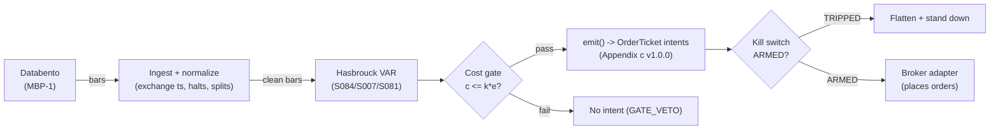

# T056 — Hasbrouck Trade–Quote VAR Predictor

Trade-by-trade vector-autoregression (VAR) predictor: Hasbrouck's model of how trades move quotes forecasts the next trade's price impact, with signed-volume and trade-direction filters cleaning the input. Provenance **D/SR**.

> Tag law: every numeric literal in prose carries one of `[documented]
> [default] [example] [unverified] [internal-est] [measured]` (legend: Appendix
> i v1.0.0). Bibliographic years, volumes, pages, arXiv IDs, section numbers,
> rule codes (C1–C10), fail-safe codes (F1–F5), module IDs, and machine-parsed
> §0 data fields are identifiers, not literals, and are exempt.

## §1 Five-minute reviewer card

| Row | Value |
|---|---|
| Module | T056 — Hasbrouck Trade–Quote VAR Predictor, v1.1.0 |
| Edge verdict | `NO-DOCUMENTED-EDGE` — the literature documents information content in trade flow, not after-cost per-trade P&L — the worked session's `+$5.00` gross vs `$10.00`/trade cost [documented] is representative |
| After-cost | `BEFORE-COST` — one-sentence verdict: the VAR's forecasts can be directionally right and still lose after costs — the predicted moves are fractions of the tick per trade |
| Build cost | Tier M+ · `40–100` h [internal-est] · `$6,000–15,000` loaded [internal-est] |
| Data cost | Research: Databento Standard `$199`/mo [documented] + DBEQ.BASIC MBP-1 historical `$2.00`/GB [documented, Databento 2024-12-11 unit-pricing PDF — verify current schedule]; each new team gets `$125` free historical credits [documented]; a 2-name × 60-day tick pull is `~5–15` GB [internal-est], i.e. `~$10–30` [internal-est] of historical pulls. Production: same venue, usage-scaled — verify before budgeting |
| latency_class | microstructure / trade-time |
| risk_class | high |
| Capacity | tiny [example] — the predicted moves are fractions of the tick on a per-trade basis |
| Executability | Feasible on ticks for 1–2 names; the VAR is ~100 lines of least squares [internal-est]; gating is the product |
| Risk summary | Burst regimes: faster trading → larger price impact (Dufour & Engle) — the burst veto is load-bearing; Lee–Ready accuracy `81.05`% [documented] overall (Ellis–Michaely–O'Hara 2000), dropping to `~60`%/`~55`% [documented] for midpoint / inside-quote trades |
| When it dies | trade bursts (veto); VAR coefficients unstable; wide spreads; Lee–Ready accuracy degrades |
| Regime gates | Provisional machine records (§T5): R010 veto (wide spreads), R013 veto (trade bursts), R014 halve (toxicity), R015 amplify gate (tick-constrained names), R038 veto (thin liquidity) |
| Emits | `order_intents` (Appendix c v1.0.0) — intents only, never orders |

## §1.5 Cheapest / least-build path

1. **Prototype hour band:** `40–100` h [internal-est] — VAR(2) estimation + Lee–Ready classifier + imbalance filter + burst veto + fixture.
2. **Cheapest-source row:** min_tier = Databento Standard — cheapest data source candidate [internal-est]; latency_class = microstructure / trade-time; required_fields = tick trades + quotes with exchange timestamps (Lee–Ready needs quote context per trade); price_band = Standard `$199`/mo [documented] + DBEQ.BASIC MBP-1 historical `$2.00`/GB [documented, 2024-12-11 unit-pricing PDF — verify current schedule]; `$125` free historical credits per new team [documented]; a 2-name × 60-day tick pull is `~5–15` GB [internal-est] (`~$10–30` [internal-est]); build_or_buy = **buy tick data; build the VAR — it is ~100 lines of least squares, and the value is your gating, not the model**.
3. **Resource budget:** `2` cores [internal-est], `8` GB RAM [internal-est] for `2` names [example] tick-time; compute pattern `per_event`.
4. **Skip list:** more than `2` names [example]; colocated deployment; Hawkes microstructure layer.
5. **DO-NOT-CUT list:** causality assertions (`assert fill_event > signal_event`, no-signal-bar-fills test); COST block + callable `expected_cost_bps`; F1–F5 fail-safes + module-state enum; kill-switch state machine + re-arm checklist; decision-log audit records; bona-fide-intent + self-trade prevention; provenance tags on every numeric literal; fixtures + `test_cmd`; secrets via env only.
6. **Escalation gate:** upgrade from cheapest when any holds — trade rate `>500`/s sustained [default]; VAR re-estimation needed intraday [default].

## §T0 Module contract

### T0.1 Typed signature

```python
def emit(state: ModuleState, signals: list[SignalVector], cfg: Config) -> list[OrderTicket]:
```

`OrderTicket` per Appendix c v1.0.0 — **intents only**; the strategy never
places orders, never holds broker/exchange sessions, never nets intents into
orders. `state` is the module-owned named state vector (`position`,
`sleeve_weights`, `cooldown_until`, `kill_state`, `module_state`); `signals`
are canonical SignalVectors (Appendix b v1.0.0), newest last. The function
handles documented edge cases: empty signals → `UNKNOWN`; halt/auction bars →
freeze per the market-state table; stale inputs → `UNKNOWN` (F4), never
interpolate.

### T0.2 Config dataclass

| Parameter | Type | Default | Range | Status |
|---|---|---|---|---|
| `f_min_cents` | float | `0.75` | `0.25`–`2.0` | default |
| `var_lags` | int | `2` | `1`–`5` | default |
| `burst_max` | float | `3.0` | `2.0`–`10.0` | default |
| `fixed_qty` | int | `500` | `100`–`2,000` | default |
| `exit_trades` | int | `3` | `2`–`5` | default |
| `stop_cents` | float | `1.5` | `0.5`–`5.0` | default |
| `risk_budget_R` | float | `8.0` | `2.0`–`50.0` | default |
| `cooldown_bars` | int | `5` | `0`–`20` | default |
| `cost_gate_k` | float | `0.5` | `0.1`–`2.0` | default |

All defaults tagged per the tag law (status `default` ⇒ `[default]`).
`risk_budget_R` is the dollar risk budget in the normative sizing function
(§T2); operating mode is `fixed_qty` [default] unless risk mode is
explicitly enabled (see §T2). `fixed_qty` of `500` shares [default] ≈
`$8` [example] per-trade risk at `1.5`¢ stop [example] — the fixture uses
fixed mode.

### T0.3 Canonical schema mapping

Vendor columns → canonical Bar schema (Appendix a v1.0.0), stated once here:

| Vendor (Databento MBP-1) | Canonical |
|---|---|
| bar open timestamp | `event_ts` (int64 ns UTC, bar open time) |
| `o/h/l/c`, `v` | `open/high/low/close`, `volume` |
| symbol | `symbol` (exchange-qualified) |
| signal value | `sig` (strategy-defined score, Appendix b `value`): one-step-ahead VAR forecast `f_t` in **cents**, signed [example] |
| gate flag | `gate` ∈ {0, 1} (confirmation gate) |
| per-share stop distance | `stop_dist` ($/share) → `stop_distance` — risk-mode sizing input (§T2) |

### T0.4 Time contract

> Time contract: clock domain UTC, int64 ns; authoritative causality clock =
> `event_ts`; max_skew = `1` ms [default]; jitter budget = `500` µs [default];
> bar-label = open time; staleness TTL = `3`× cadence [default] (F4); gap
> policy = mask, no interpolation; halt/auction → discard contributions
> across reopen.

**Timing box:** `signal@t (per_event, America/New_York) → earliest fill @open(t+1)`

### T0.5 Market-state table

| State | Module behavior |
|---|---|
| CONTINUOUS_TRADING | Evaluate entries/exits per §T2; emit intents |
| HALTED | Freeze state; emit nothing; `UNKNOWN` on held signals |
| AUCTION | No new entries; exits only via auction-aware intents (MOO/MOC); state `DEGRADED` |
| CLOSED | Emit nothing; state `OFF` |

### T0.6 Module-state enum + error taxonomy

States per Appendix k v1.0.0: `OK | DEGRADED | UNKNOWN | OFF`. Invalid input →
`UNKNOWN`, never interpolate (Appendix f v1.0.0, F1–F5).

| Failure | State | Alert |
|---|---|---|
| Missing/stale input (TTL `3`× cadence [default]) | `UNKNOWN` | page |
| Non-finite / non-positive price reaching module (F2) | `UNKNOWN` | page |
| `event_ts` non-monotonic (F2) | `UNKNOWN` | page |
| Kill-switch TRIPPED | `OFF` (no new intents) | page |
| Halt/auction | `UNKNOWN` / `DEGRADED` (per table) | log |
| Feed anomaly (per §T9 row 1) | `DEGRADED` | notify |
| Anything unmapped | `UNKNOWN` | page |

### T0.7 Risk contract + kill switch

```yaml
risk_contract:
  per_trade_R: `8`            # [example] — 500 sh × 1.5¢ stop = $7.50 ≈ $8
  max_adverse_per_trade: `1.5`¢ [example]
  daily_loss_stop: `-500` USD [default]          # [default] — calibrate from live per-trade P&L
  max_gross: `1.0`x [default]                # [default]
  kill_conditions:                        # any one trips -> TRIPPED
  - "VAR coefficients unstable across re-estimations -> TRIPPED"
  - "trade burst beyond burst_max with no veto -> TRIPPED"
  - "daily loss <= -$500 -> TRIPPED"
  enforcement: intraday-hard              # breach flattens; no review-only mode
```

**Calibration recipe:** `per_trade_R` is the sizing input in §T2 (dollar-risk
`N = ⌊R/stop_dist⌋` or the confidence-scaled equivalent); re-estimate `R`
from the trailing `60`-day [default] per-trade P&L distribution so that a
`3`σ [default] adverse day stays inside `daily_loss_stop`. `max_gross` is
checked pre-emit on every ticket (C4). Kill-switch state machine:

```
ARMED → TRIPPED → RECOVERY → ARMED
```

- `ARMED → TRIPPED`: any kill condition fires → cancel all working intents
  (idempotent cancels), flatten at marketable limits, set module state `OFF`,
  write a `KILL_TRIP` decision record (Appendix g v1.0.0).
- `TRIPPED → RECOVERY`: re-arm checklist **all green** — `1.` feed healthy
  (no stale bars); `2.` decision log reconciled against broker ledger, no
  orphan tickets; `3.` root cause of the trip identified and the offending
  config reverted or re-calibrated; `4.` risk owner sign-off recorded.
- `RECOVERY → ARMED`: one clean evaluation pass over the fixture
  (`test_cmd` green) with no new trip, then resume.

### T0.8 Ops tail

- **Schedule:** RTH `09:45`–`15:45` [documented]; owner: microstructure on-call.
- **Health checks:** fixture replay (`test_cmd`) green on deploy; live
  staleness watchdog at `3`× cadence; kill-switch drill monthly [default].
- **Alert table:** page on `UNKNOWN` > `30` s [default], on any kill trip, or
  bounds violation; notify on `DEGRADED`; log on single dropped bars.
- **Resource budget:** `2` vCPU, `8` GB RAM [internal-est]; state is O(`1`) per symbol.
- **Runbook stub:** `1.` confirm feed; `2.` replay fixture; `3.` if red → set
  `OFF`, page; `4.` reconcile decision log before re-arm; `5.` complete the
  re-arm checklist (§T0.7) before `ARMED`.

### T0.9 Secrets (env-only)

`DATABENTO_API_KEY` via environment only. No secrets in this file, fixtures, or logs
(CI secrets-grep).

### T0.10 May / must-NOT

> **May:** emit `OrderTicket` intents per Appendix c v1.0.0; track intent-side
> state; issue cancel-replace via new tickets. **Must-NOT:** place orders on
> any venue, hold broker/exchange sessions, net intents into orders inside the
> strategy, or treat the intent-side state machine as broker wire truth.

## §T1 Legacy (subsumed by §1)

Legacy §T1 content is the §1 reviewer card above; this header is retained so
section numbering stays frozen.

## §T2 Specification

### Universe

`1–2` liquid large-tick names where per-trade dynamics are stable [example]; RTH `09:45`–`15:45` ET [example]; flat by `15:45` ET. Tick data (every trade and quote, exchange-timestamped) required.

### Entry rule (Boolean — no prose-only conditions)

```
ENTER_LONG  := (|f_t| >= f_min_cents) AND (sign(f_t) > 0)
               AND (imbalance filter passes) AND (burst veto passes)
               AND (expected_cost_bps(...) <= cost_gate_k * edge_bps)
ENTER_SHORT := mirror with sign(f_t) < 0 (locate_ok)
FLAT        := otherwise
```

### Exits (with post-exit cooldown)

```
EXIT := (trades_held >= exit_trades)     # 2–5 trades [example]
        OR (adverse move > stop_cents)             # 1.5¢ [example]
ON_EXIT: cooldown_until = now + cooldown_bars * bar_ns   # C10
```

### Position sizing (fenced function)

```python
def size_shares(risk_budget_R, stop_distance, vol_estimate, ADV_cap,
                cost_bps, fixed_qty=500, sizing_mode="fixed", qty_cap=2000):
    """Normative sizing: shares = f(risk_budget_R, stop_distance, vol_estimate, ADV_cap, cost).

    risk_budget_R: dollar risk budget per trade (cfg.risk_budget_R, $8.0 [default]).
    stop_distance: $/share distance to stop (canonical stop_dist, $0.015 [example]).
    vol_estimate: $/share adverse-move estimate, same role as stop_distance here [example].
    ADV_cap: max shares from the ADV participation cap [example].
    cost_bps: expected_cost_bps(...) for the ticket — sizing is cost-aware
              through the §T2 entry cost gate (C2 bona-fide intent).
    Operating default: sizing_mode="fixed" -> fixed_qty [default]; risk mode is
    the calibrated alternative (status: default).
    """
    if sizing_mode == "fixed":
        return min(int(fixed_qty), int(qty_cap))
    risk_shares = int(risk_budget_R // max(stop_distance, 1e-9))   # N = floor(R / stop_dist)
    adv_shares = int(ADV_cap)                                        # e.g. 0.1% of ADV in shares [example]
    n = min(risk_shares, adv_shares, int(qty_cap))
    # cost_bps is consumed by the §T2 entry cost gate (C2 bona-fide intent),
    # not here — sizing stays cost-aware through the gate. ADV cap [example].
    return max(n, 0)
```

Notes: risk mode with the reference inputs gives
`⌊8.0 / 0.015⌋ = 533` shares [example] (fixed mode `500` [default] governs
the fixture). `ADV_cap` = `0.001 × ADV` shares [example] — the venue is
XNAS; the fixture's notional is `~$15k` [example] so the cap never binds in
the demo.

### Risk limits

| Limit | Value |
|---|---|
| Per-trade risk | `$8` [example] — 500 sh × 1.5¢ stop |
| Daily loss stop | `−$500` [default] |
| Max gross | `1.0`× [default] |

### COST block (single source of truth)

| Component | Value (bps) | Basis |
|---|---|---|
| Spread | `3.33` | [example] — 0.50¢/share half-spread on a `$30` stock |
| Fees | `3.33` | [example] — $0.005/share/side on a `$30` stock — **conservative** vs the documented XNAS standard take fee of `$0.0030`/share [documented] (Nasdaq Equity VII §118; SEC SR-NASDAQ filings); a research-scale taker with ≤500-share tickets qualifies for no volume tier, so the standard `$0.0030` [documented] = `1.0` bps [example] applies; the stack keeps `$0.005` as margin |
| Borrow | `0.0` | [default] — reference build holds `2–5` trades only, flat by `15:45` ET; no overnight borrow accrual; short-locate cost is priced through C7, not the per-day borrow line |
| Impact | `0.0` | [example] — fills modeled at the mid with the spread charged explicitly; optimistic |
| **Total reference** | `6.67` | [example] — $10.00 round-trip on 500 shares [example] |

`fee_schedule_as_of`: `2026-09-10` — XNAS Equity VII Section 118 standard
take fee `$0.0030`/share [documented]. `side: taker` [default];
venue/tier/source: XNAS standard tier / Databento MBP-1 [example].
`borrow_bps_per_day`: `0.0` [default] — reason: intraday-only holds (flat by
`15:45` ET), so no overnight borrow accrues; short-locate fees are handled
per-ticket via C7, not in this per-day accrual.

Re-stating cost numbers outside
this block is a validation failure.

```python
def expected_cost_bps(notional, adv_pct, venue, side, urgency) -> float:
    '''Callable cost model — single source of truth (this block).'''
    spread_bps = 3.33   # [example] — 0.50¢/share half-spread on a `$30` stock
    fee_bps = 3.33         # [example] — $0.005/share/side conservative vs $0.0030/share [documented] standard take fee
    borrow_bps = 0.0   # [default] — intraday-only holds, flat by 15:45 ET; no overnight accrual
    impact_bps = 0.0   # [example] — fills modeled at the mid with the spread charged explicitly; optimistic
    if side == "maker":
        fee_bps = -abs(fee_bps) * 0.5  # rebate proxy [example]
    return spread_bps + fee_bps + borrow_bps + impact_bps
```

### Execution / fill model table

| Aspect | Assumption |
|---|---|
| Latency | Trade-time decisions; SIP TAQ latency claims are simulated-only |
| Entries | Marketable at the touch; fills modeled at the mid with spread charged explicitly (optimistic) [example] |
| Exits | `2–5` trades after entry [example] |
| Partial fills | Per Appendix c v1.0.0 FIFO |
| Adverse fill | Burst regimes widen impact beyond the VAR's linear prediction [example] |

### Robustness

VAR(2) on x_t = (Δm_t, q_t) [example]; Lee–Ready tick rule for trade direction (S007) with the S081 imbalance cross-check. Burst veto: no entries when trading accelerates beyond `3`× median pace [example] (Dufour & Engle: faster trading → larger impact).

### Compliance sub-block (C1–C10+)

| Code | Rule: trigger → check → action → log |
|---|---|
| C1 | Self-match / STP: every ticket carries self-trade-prevention instructions for the broker adapter; trigger = two tickets same symbol opposite side within `1` s [default] → check resting-interest overlap → action = cancel the newer ticket → log `COMPLIANCE_BLOCK` |
| C2 | Bona-fide intent: every entry intent must pass the cost gate (`expected_cost_bps(...) <= k * edge_bps`) and fit risk limits; trigger = gate fail → check = re-evaluate → action = no ticket emitted → log `GATE_VETO` |
| C3 | Message-rate / cancel-to-trade: trigger = `>50` intents/symbol/min [default] or cancel-to-trade `>10:1` [default] → check venue thresholds → action = throttle to `5`/min [default] + alert → log `COMPLIANCE_BLOCK` |
| C4 | Pre-trade fat-finger trio: price collar `±5`% vs reference [default] → reject; max notional per ticket `$2,000,000` [default] → reject; max `50` tickets/symbol/`5` min [default] → throttle; all rejections logged |
| C5 | Decision-log schema compliance (Appendix g v1.0.0): every intent, veto, cancel-replace, kill transition logged with inputs_hash/params_hash, hash-chained; trigger = missing record → action = halt to `UNKNOWN` |
| C6 | Halt/auction state table: per §T0.5 — HALTED freezes, AUCTION blocks new entries, CLOSED emits nothing; trigger = state change → check market-state table → action = freeze/cancel per table → log |
| C7 | Locate check (short sales): trigger = SHORT intent → check = easy-to-borrow list or live locate obtained pre-emit → action = block intent without locate → log `GATE_VETO`; Reg-SHO threshold securities never shorted |
| C8 | Public-dissemination gate: no signal/intent data published externally without review; trigger = export request → check = review sign-off → action = block until signed |
| C9 | Data-entitlement assertions per dataset (Appendix j v1.0.0): trigger = entitlement-class change or unlicensed symbol → check §T5 data-rights row → action = stand down affected symbols → log |
| C10 | Post-exit cooldown: trigger = exit or compliance block → check `now < cooldown_until` → action = no re-entry until `cooldown_bars` (`5` [default]) elapse → log |
| C11 | Burst veto: inter-trade pace `>3`× trailing median [example] → block entries → check pace monitor → action = veto → log `GATE_VETO` |

### Parameter table

| Parameter | Symbol | Value | Tag | Sensitivity |
|---|---|---|---|---|
| Forecast minimum | `f_min_cents` | `0.75`¢ | [example] | high |
| VAR lags | `var_lags` | `2` | [example] | medium |
| Burst veto | `burst_max` | `3`× pace | [example] | high |
| Fixed size | `fixed_qty` | `500` sh | [default] | medium |
| Risk budget | `risk_budget_R` | `$8` | [default] | high |
| Exit trades | `exit_trades` | `3` | [example] | medium |
| Stop | `stop_cents` | `1.5`¢ | [example] | high |
| Cooldown | `cooldown_bars` | `5` bars | [default] | low |
| Cost-gate k | `cost_gate_k` | `0.5` | [default] | high |

### Timing box

`signal@t (per_event, America/New_York) → earliest fill @open(t+1)`

## §T3 Math + normative pseudocode

Trade–quote VAR [documented Hasbrouck form]:
$x_t = c + \sum_{\ell=1}^{p} A_\ell x_{t-\ell} + u_t$ on
$x_t = (\Delta m_t, q_t)^\top$ (mid change, Lee–Ready sign [documented]).
One-step-ahead forecast $f_t$ in cents uses data through the last completed
trade. Long-run impact
$\mathrm{LRI} = e_m^\top (I - \sum A_\ell)^{-1} e_q$ [documented form]
decomposes permanent vs transitory impact. Fire only if $|f_t| \ge 0.75$¢
[example], the S081 imbalance filter agrees, and the burst veto passes.

**Normative pseudocode** (pseudocode is normative; prose is commentary):

```
function emit(state, signals, cfg) -> list[OrderTicket]:
    assert signals non-empty else return UNKNOWN                    # F1
    for bar t in signals (newest last):
        s = one-step-ahead VAR forecast f_t (cents), signed                                            # data <= t only
        assert isfinite(s) else return UNKNOWN                      # F2
        edge_bps = abs(s) * 20.0                                    # [example] — modeled per-trade edge in bps
        cost = expected_cost_bps(notional, adv_pct, venue, side, urgency)
        cost_ok = expected_cost_bps(...) <= cfg.cost_gate_k * edge_bps
        # ^^^ normative cost-gate predicate: expected_cost_bps(...) <= k * edge_bps
        imbalance_ok = S081 imbalance filter agrees                # cfg-driven; gate bar blocks without it
        burst_ok = inter_trade_pace <= cfg.burst_max * median_pace # [example] — Dufour & Engle
        if state.position is None and state.module_state == OK:
            if ((abs(f_t) >= cfg.f_min_cents) and imbalance_ok and burst_ok) and cost_ok:
                qty = size_shares(cfg.risk_budget_R, cfg.stop_cents/100.0, vol_est, adv_cap, cost,
                                  fixed_qty=cfg.fixed_qty, sizing_mode="fixed")  # §T2 normative sizing
                # vol_est: $/share adverse-move estimate from live quotes; adv_cap: ADV participation-cap shares
                ticket = OrderTicket(symbol, side, qty, limit, tif,
                                     ticket_id=uuid(), parent_signal="S084@t",
                                     intent_ts=t.event_ts, state=NEW)
                log_decision(ticket, inputs_hash, params_hash)     # C5 / Appendix g
                assert fill_event > signal_event                    # t->t+1 causality
        else if state.position is not None:
            if ((trades_held >= cfg.exit_trades) or (adverse > cfg.stop_cents)):
                emit exit intent (cancel-replace rules, Appendix c) # C1
                state.cooldown_until = t + cfg.cooldown_bars        # C10
                assert fill_event > signal_event
    return tickets
```

Causality: every quantity at bar `t` uses only data `≤ t`; the earliest fill
is bar `t+1`'s open. Mandatory unit test: no-signal-bar fills
(`assert fill_event > signal_event`).

## §T4 Worked example (fixture-backed)

- Tape: `modules/fixtures/T056_tape.csv` — `# TYPE: validation-run`;
  `12` bars [example], all numbers synthetic, seed `10056` [example];
  `event_ts` int64 ns UTC, bar-labeled by open time.
- Expected outputs: `modules/fixtures/T056_expected.csv` — per-ticket
  intents with the cost-function call recorded (inputs → bps → $);
  tolerance `1e-6` [default] on floats.
- Acceptance tests (`modules/tests/test_T056.py`, `7` tests):
  `1.` fixture replays to expected (hand-checked rows below); `2.` cost-gate
  predicate passes on the fixture's large edges and blocks a tiny-edge
  counter-case (`k = 0.5` [default]); `3.` no-signal-bar fills
  (`fill_ts > signal_ts` on every ticket); `4.` kill-switch trips on the
  breach scenario and re-arms through the checklist
  (`ARMED → TRIPPED → RECOVERY → ARMED`); `5.` invalid input (non-positive
  price) → `UNKNOWN`, never interpolated; `6.` hand-check literals
  (qty / bps / $) match the generation run; `7.` risk-mode sizing:
  `size_shares(R=$8, stop_dist=$0.015) = ⌊8/0.015⌋ = 533` shares [example]
  respects the risk budget, ADV cap, and qty cap.
- `test_cmd`: `python3 -m pytest modules/tests/test_T056.py -q` → exits `0`.

**Cost-function calls on the fixture** (inputs → bps → $, from the harness run):

| ticket | notional ($) | adv_pct | side | edge_bps | cost_bps | cost_$ | gate |
|---|---|---|---|---|---|---|---|
| T-T056-2-0 | 15003.45 | 0.0500 | taker | 18.0000 | 6.6600 | 9.9923 | PASS |
| T-T056-5-X | 15004.95 | 0.0500 | taker | 0.0000 | 6.6600 | 9.9933 | N/A |
| T-T056-7-0 | 14996.65 | 0.0500 | taker | 16.0000 | 6.6600 | 9.9878 | PASS |
| T-T056-10-X | 14996.10 | 0.0500 | taker | 0.0000 | 6.6600 | 9.9874 | N/A |

**Where the example is optimistic:** fills modeled at the mid with the spread charged explicitly — optimistic; burst-regime impact beyond the linear VAR is not modeled; Lee–Ready misclassification ignored in the sketch



## §T5 Dependencies & data

Generated-from-`deps.yaml` shape (CI symmetry); hand-listed:

| Module | Role | Version pin |
|---|---|---|
| S084 — Hasbrouck trade–quote VAR | Forecast (trigger) | 1.0.0 |
| S007 — Trade-direction classifier | Signed input | 1.0.0 |
| S081 — Signed-volume imbalance | Confirmation filter | 1.0.0 |

| Field | Type | Granularity | Source tier | Notes |
|---|---|---|---|---|
| Tick trades + quotes | float/int | per trade | Tier 2 | exchange-timestamped |
| Lee–Ready signs | int ±1 | per trade | Tier 2 | S007 |

**Family note:** family `B` = statistical / time-series strategies.

**Data rights row** (Appendix j v1.0.0): US equities tick data via Databento
DBEQ.BASIC MBP-1, `rights: licensed`; license scope = research + stated
production symbol count; raw ticks never leave our systems — fixtures are
synthetic; entitlement = professional/internal, no display; retention per
vendor terms, purge path in runbook. Entitlement-class change → §1.5
escalation gate.

### Regime gates — machine records (provisional; restrictive default)

`{regime_id, direction, mechanism, condition, action, min_lag, unknown_behavior}`.
When the regime is unknown, the restrictive default applies (veto / halve, never
amplify — the cheap stack cannot measure R014/R010 with confidence, so it emits
`UNKNOWN` and stands down rather than faking a gate [default]).

| regime_id | direction | mechanism | condition | action | min_lag | unknown_behavior |
|---|---|---|---|---|---|---|
| R010 | degrades | quoted spread widens → sub-tick forecast edges vanish | quoted spread > `2`× trailing median [example] | veto | `0` bars [default] | veto |
| R013 | degrades | trade bursts → price impact beyond the linear VAR (Dufour & Engle) | inter-trade pace > `3`× trailing median [example] | veto | `0` bars [default] | veto |
| R014 | degrades | informed-flow toxicity → adverse selection on filled intents | VPIN > threshold [unverified] (threshold uncalibrated) | halve | `0` bars [default] | veto (no measurement ⇒ stand down) |
| R015 | amplifies | tick-constrained names → more predictable tick-time quote revisions | name tick-constrained per R015 [example] | none (allow base size) | `0` bars [default] | no amplification (hold base size) |
| R038 | degrades | thin book → impact + effective spread blow up | displayed depth < minimum [example] | veto | `0` bars [default] | veto |

## §T6 Local build (M5 Max / 128 GB)

Feasible on the M5 Max (Tier M+, `40–100` h [internal-est] ≈ `$6k–15k` eng [internal-est] + `$199`/mo data [documented] + usage per notes/cost-model.md §5); the VAR is `~100` lines of least squares [internal-est] on `1–2` names. Bottleneck is tick ingest at busy bursts (`10–200`/s [internal-est] per cost-model §2 — fine in Python).

## §T7 Buy vs build

Buy tick data (Tier 2); build the VAR — it is ~100 lines of least squares, and the value is your gating, not the model. Verdict: the burst veto and imbalance filter are the product.

## §T8 Efficacy — documented evidence

| Study / source | Market & period | Metric | Before/after cost | Caveat |
|---|---|---|---|---|
| Hasbrouck (1991), J. Finance | NYSE, 1989 | VAR shows trades have significant permanent price impact — information in order flow [documented] | `BEFORE-COST` (econometric) | measurement, not a trading rule |
| Lee & Ready (1991), J. Finance | NYSE, 1988 | tick-rule trade-direction algorithm [documented] | `BEFORE-COST` (methodological) | Ellis–Michaely–O'Hara (2000) measured `81.05`% [documented] correct on Nasdaq (tick rule alone `77.66`%, quote rule `76.4`%), but accuracy falls to `~60`% for midpoint trades and `~55`% for trades inside the quotes but off-midpoint [documented] — the module's universe targets tick-constrained names where the quote test is strongest |
| Ellis, Michaely & O'Hara (2000) | Nasdaq, `313` stocks [documented], 1996–97 | out-of-sample accuracy of trade-direction rules [documented] | `BEFORE-COST` (methodological) | `81.05`% Lee–Ready correct; inside-quote degradation per above |
| Dufour & Engle (2000), J. Finance | NYSE, 1996–97 | VAR with time-between-trades: faster trading → larger price impact [documented] | `BEFORE-COST` (econometric) | supports the burst veto |

Selection disclosure: these are the sources surfaced by the chapter's research
pass (Stage 156/200). **Honest bottom line.** For a ≤$1M paper operation: T056 has no documented positive after-cost edge as a standalone taker strategy — the literature proves information in order flow, and the worked session shows the arithmetic honestly: directionally right often enough for `+$5.00` gross [documented], but `$10.00`/trade costs [documented] dominate.

## §T9 Failure modes & pitfalls

| # | Trigger → Detect → Action → Recovery | check: |
|---|---|---|
| 1 | Burst regime: pace > `3`× median [example] → detect: pace monitor → action: veto entries → recovery: resume when pace normalizes | `check: pace <= 3 * median` |
| 2 | VAR instability: coefficients drift across re-estimations → detect: coefficient monitor → action: TRIP → recovery: re-estimate | `check: coef_stable` |
| 3 | Lee–Ready misclassification in ambiguous quotes → detect: imbalance cross-check disagreement → action: veto → recovery: next trade | `check: lr_agrees_with_imbalance` |
| 4 | Spread blowup → detect: cost gate fails → action: no entry → recovery: re-pin | `check: expected_cost_bps(...) <= k * edge_bps` |
| 5 | Lookahead: forecast uses the trade being predicted → detect: causality audit → action: halt → recovery: re-run test | `check: all(fill_ts > signal_ts)` |
| 6 | Stale ticks: quote feed lags → detect: staleness TTL → action: UNKNOWN → recovery: resume | `check: asof_ts - event_ts <= jitter_budget` |
| 7 | Kill re-arm blocked: checklist item red → detect: re-arm check → action: stay TRIPPED, no intents, state OFF → recovery: fix root cause, re-run fixture green | `check: all(checklist.values())` |

## §T10 Source log + unverified leads

**Sources** (citable facts only):

1. Hasbrouck, J. (1991) [documented]. "Measuring the Information Content of Stock Trades." *Journal of Finance* 46(1): 179–207. DOI 10.1111/j.1540-6261.1991.tb03749.x — the trade–quote VAR; trades carry information about future quote revisions.
2. Lee, C. M. C. & Ready, M. J. (1991) [documented]. "Inferring Trade Direction from Intraday Data." *Journal of Finance* 46(2): 733–746. DOI 10.1111/j.1540-6261.1991.tb02683.x — the tick-rule trade-direction classifier.
3. Dufour, A. & Engle, R. F. (2000) [documented]. "Time and the Price Impact of a Trade." *Journal of Finance* 55(6): 2467–2498. — VAR with time-between-trades; faster trading → larger impact (burst veto).
4. Ellis, K., Michaely, R. & O'Hara, M. (2000) [documented]. "The Accuracy of Trade Classification Rules: Evidence from Nasdaq." — tick rule `77.66`% correct, quote rule `76.4`%, Lee–Ready `81.05`% on 313 Nasdaq stocks (1996–97); drops to `~60`% / `~55`% for midpoint / inside-quote trades.

**Chatbot source log.** Grok answered Q-TB6-1..3 (2026-09-10); all claims independently verified or labeled unverified.

**Unverified leads** (chatbot-only — never in evidence tables):

- Bacry, E. et al. (2013). "Modelling Microstructure Noise with Mutually Exciting Point Processes." *Quantitative Finance* 13(1). — Hawkes order-flow clustering; justifies the burst veto; not independently opened in this pass; research lead.

---

**GROK-NEEDED** (expert questions web search could not resolve — do not answer from priors):

1. "For a US-equities research build doing ≤500-share taker tickets on XNAS, is the standard `$0.0030`/share remove fee (Nasdaq Equity VII §118) the correct all-in take fee, or is there a reduced take-fee tier this volume qualifies for — pin the venue price-list tier row and the net $/share all-in."
2. "What is the empirically reported per-trade edge (cents per trade, after Lee–Ready misclassification at ~81% accuracy) of a trade–quote VAR(2) on liquid US large caps — does `f_min_cents = 0.75¢` [example] sit above or below the documented one-step-ahead edge, and does the edge vary materially by spread/tick bucket?"
3. "For intraday shorts held `2–5` trades on a US retail/pro broker, what is the typical locate/HTB fee schedule, and can per-ticket locate cost ever exceed the `3.33` bps [example] reference — is `borrow_bps_per_day = 0.0` [default] with C7 locate-only pricing defensible for sub-minute holds?"
4. "What fraction of US equity trades does Databento DBEQ.BASIC MBP-1 cover (venues/exchanges included), and is Lee–Ready direction computed on that subset sufficient for the trade–quote VAR — or is full SIP/ITCH required, and at what documented cost delta?"

---

## Appendix — AI build prompt (T056)

Copy-paste into any chat agent:

> Build module **T056 — Hasbrouck Trade–Quote VAR Predictor** per `notes/module-template.md` v1.0.0
> and this file's §T0 contract (module version v1.1.0).
> Cheapest path (§1.5): prototype `40–100` h [internal-est]; cheapest data
> candidate Databento Standard `$199`/mo [documented] + DBEQ.BASIC MBP-1
> historical `$2.00`/GB [documented, verify current schedule]; compute
> pattern `per_event`; skip more than `2` names; colocated deployment;
> Hawkes microstructure layer for now.
> Implement `emit(state, signals, cfg) -> list[OrderTicket]`
> (Appendix c v1.0.0) with the §T3 normative pseudocode, including the
> cost-gate predicate `expected_cost_bps(...) <= k * edge_bps` and
> `assert fill_event > signal_event`. Implement the §T2 normative
> `size_shares(risk_budget_R, stop_distance, vol_estimate, ADV_cap, cost)`
> (fixed mode default `500` [default]; risk mode `⌊8/0.015⌋ = 533`
> [example]). Wire F1–F5 (Appendix f v1.0.0): invalid
> input → `UNKNOWN`, never interpolate. Implement the kill-switch state
> machine `ARMED → TRIPPED → RECOVERY → ARMED` with the §T0.7 re-arm
> checklist. Apply the §T5 regime-gate machine records (R010/R013/R014/R015/R038)
> with the restrictive default. Log decisions per Appendix g v1.0.0. Secrets via env only.
> Run the fixture `modules/fixtures/T056_tape.csv`
> (`# TYPE: validation-run`) against `modules/fixtures/T056_expected.csv`
> (tolerance `1e-6` [default]).
> **Definition of done:** `python3 -m pytest modules/tests/test_T056.py -q`
> exits `0` (`7` tests). Tag every numeric literal you add with the unified enum
> (Appendix i v1.0.0); put anything unverifiable in §T10 unverified leads.
