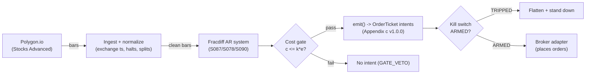

# T057 — Fractional-Differentiation Memory Trader

Stationarity-with-memory trader: fractionally differentiated prices (S087) sit in the sweet spot between non-stationary raw prices and over-differentiated returns, feeding a causal AR momentum system (S078) with a Hurst persistence gate (S090). Provenance **D/SR**.

> Tag law: every numeric literal in prose carries one of `[documented]
> [default] [example] [unverified] [internal-est] [measured]` (legend: Appendix
> i v1.0.0). Bibliographic years, volumes, pages, arXiv IDs, section numbers,
> rule codes (C1–C10), fail-safe codes (F1–F5), module IDs, and machine-parsed
> §0 data fields are identifiers, not literals, and are exempt.

## §1 Five-minute reviewer card

| Row | Value |
|---|---|
| Module | T057 — Fractional-Differentiation Memory Trader, v1.0.0 |
| Edge verdict | `INSUFFICIENT-EVIDENCE` — the literature documents stationarity and memory properties, not after-cost trading performance — the ADF-vs-memory frontier is a feature-engineering claim, not a P&L |
| After-cost | `BEFORE-COST` — one-sentence verdict: fracdiff is a principled feature transform, but no cited paper documents after-cost P&L for trading on it — treat it as an input, not an edge |
| Build cost | Tier M+ · `40–100` h [internal-est] · `$6,000–15,000` loaded [internal-est] |
| Data cost | Research `~$50–500`/mo [unverified]; production `~$50–500`/mo [unverified] — bands indicative, verify before budgeting |
| latency_class | bar / daily |
| risk_class | medium |
| Capacity | large [example] — daily bars, liquid equities |
| Executability | Easy: fracdiff is a weighted-sum filter (~50 lines [internal-est]); AR fitting is least squares |
| Risk summary | d mined on training data shifts the sweet spot out of sample; memory looks like trend but is not tradable persistence |
| When it dies | d estimates unstable; Hurst gate hovers at `0.5` [example]; AR on fracdiff lags at turns |
| Regime gates | Provisional: S090 Hurst gate: H `≥0.53` [example] to trade the memory signal |
| Emits | `order_intents` (Appendix c v1.0.0) — intents only, never orders |

## §1.5 Cheapest / least-build path

1. **Prototype hour band:** `40–100` h [internal-est] — fracdiff filter + ADF/memory frontier + AR momentum + cost/risk harness + fixture.
2. **Cheapest-source row:** min_tier = Polygon.io Stocks Advanced — cheapest data source candidate [internal-est]; latency_class = bar / daily; required_fields = daily OHLCV bars; price_band = `~$50–500`/mo [unverified] (indicative — verify before budgeting); build_or_buy = **build — the fracdiff filter is ~50 lines; vendor ADF/memory statistics are rarely disclosed with methodology**.
3. **Resource budget:** `1` core, `<2` GB RAM [internal-est]; compute pattern `per_bar`.
4. **Skip list:** tick-level fracdiff; structural-break AR; multi-d grid search in production.
5. **DO-NOT-CUT list:** causality assertions (`assert fill_event > signal_event`, no-signal-bar-fills test); COST block + callable `expected_cost_bps`; F1–F5 fail-safes + module-state enum; kill-switch state machine + re-arm checklist; decision-log audit records; bona-fide-intent + self-trade prevention; provenance tags on every numeric literal; fixtures + `test_cmd`; secrets via env only.
6. **Escalation gate:** upgrade from cheapest when any holds — d grid `>10` values [default]; estimation window `<60` bars [default].

## §T0 Module contract

### T0.1 Typed signature

```python
def emit(state: ModuleState, signals: list[SignalVector], cfg: Config) -> list[OrderTicket]:
```

`OrderTicket` per Appendix c v1.0.0 — **intents only**; the strategy never
places orders, never holds broker/exchange sessions, never nets intents into
orders. `state` is the module-owned named state vector (`position`,
`sleeve_weights`, `cooldown_until`, `kill_state`, `module_state`); `signals`
are canonical SignalVectors (Appendix b v1.0.0), newest last. The function
handles documented edge cases: empty signals → `UNKNOWN`; halt/auction bars →
freeze per the market-state table; stale inputs → `UNKNOWN` (F4), never
interpolate.

### T0.2 Config dataclass

| Parameter | Type | Default | Range | Status |
|---|---|---|---|---|
| `d` | float | `0.35` | `0.10`–`0.90` | default |
| `adf_pmax` | float | `0.01` | `0.001`–`0.05` | default |
| `H_gate` | float | `0.53` | `0.51`–`0.60` | default |
| `ar_k` | int | `4` | `1`–`12` | default |
| `theta` | float | `0.5` | `0.1`–`2.0` | default |
| `R_usd` | float | `500` | `100`–`2,000` | default |
| `time_stop_bars` | int | `5` | `3`–`20` | default |
| `cooldown_bars` | int | `1` | `0`–`5` | default |
| `cost_gate_k` | float | `0.5` | `0.1`–`2.0` | default |

All defaults tagged per the tag law (status `default` ⇒ `[default]`).

### T0.3 Canonical schema mapping

Vendor columns → canonical Bar schema (Appendix a v1.0.0), stated once here:

| Vendor (Polygon.io Stocks Advanced) | Canonical |
|---|---|
| bar open timestamp | `event_ts` (int64 ns UTC, bar open time) |
| `o/h/l/c`, `v` | `open/high/low/close`, `volume` |
| symbol | `symbol` (exchange-qualified) |
| signal value | `sig` (strategy-defined score, Appendix b `value`) |
| gate flag | `gate` ∈ {0, 1} (confirmation gate) |

### T0.4 Time contract

> Time contract: clock domain UTC, int64 ns; authoritative causality clock =
> `event_ts`; max_skew = `1` ms [default]; jitter budget = `500` µs [default];
> bar-label = open time; staleness TTL = `3`× cadence [default] (F4); gap
> policy = mask, no interpolation; halt/auction → discard contributions
> across reopen.

**Timing box:** `signal@t (per_bar-1d, America/New_York) → earliest fill @open(t+1)`

### T0.5 Market-state table

| State | Module behavior |
|---|---|
| CONTINUOUS_TRADING | Evaluate entries/exits per §T2; emit intents |
| HALTED | Freeze state; emit nothing; `UNKNOWN` on held signals |
| AUCTION | No new entries; exits only via auction-aware intents (MOO/MOC); state `DEGRADED` |
| CLOSED | Emit nothing; state `OFF` |

### T0.6 Module-state enum + error taxonomy

States per Appendix k v1.0.0: `OK | DEGRADED | UNKNOWN | OFF`. Invalid input →
`UNKNOWN`, never interpolate (Appendix f v1.0.0, F1–F5).

| Failure | State | Alert |
|---|---|---|
| Missing/stale input (TTL `3`× cadence [default]) | `UNKNOWN` | page |
| Non-finite / non-positive price reaching module (F2) | `UNKNOWN` | page |
| `event_ts` non-monotonic (F2) | `UNKNOWN` | page |
| Kill-switch TRIPPED | `OFF` (no new intents) | page |
| Halt/auction | `UNKNOWN` / `DEGRADED` (per table) | log |
| Feed anomaly (per §T9 row 1) | `DEGRADED` | notify |
| Anything unmapped | `UNKNOWN` | page |

### T0.7 Risk contract + kill switch

```yaml
risk_contract:
  per_trade_R: `500`            # [example] — N = floor(R/stop_dist), R = $500 per trade
  max_adverse_per_trade: `1.0`x stop distance [example]   # [example]
  daily_loss_stop: `-2000` USD [example]          # [example]
  max_gross: `5`M USD [example]                # [example]
  kill_conditions:                        # any one trips -> TRIPPED
  - "ADF rejects stationarity at current d -> TRIPPED"
  - "d re-estimate drifts outside [0.10, 0.90] -> TRIPPED"
  - "daily loss <= -$2,000 -> TRIPPED"
  enforcement: intraday-hard              # breach flattens; no review-only mode
```

**Calibration recipe:** `per_trade_R` is the sizing input in §T2 (dollar-risk
`N = ⌊R/stop_dist⌋` or the confidence-scaled equivalent); re-estimate `R`
from the trailing `60`-day [default] per-trade P&L distribution so that a
`3`σ [default] adverse day stays inside `daily_loss_stop`. `max_gross` is
checked pre-emit on every ticket (C4). Kill-switch state machine:

```
ARMED → TRIPPED → RECOVERY → ARMED
```

- `ARMED → TRIPPED`: any kill condition fires → cancel all working intents
  (idempotent cancels), flatten at marketable limits, set module state `OFF`,
  write a `KILL_TRIP` decision record (Appendix g v1.0.0).
- `TRIPPED → RECOVERY`: re-arm checklist **all green** — `1.` feed healthy
  (no stale bars); `2.` decision log reconciled against broker ledger, no
  orphan tickets; `3.` root cause of the trip identified and the offending
  config reverted or re-calibrated; `4.` risk owner sign-off recorded.
- `RECOVERY → ARMED`: one clean evaluation pass over the fixture
  (`test_cmd` green) with no new trip, then resume.

### T0.8 Ops tail

- **Schedule:** daily at close [documented]; owner: stat-arb on-call.
- **Health checks:** fixture replay (`test_cmd`) green on deploy; live
  staleness watchdog at `3`× cadence; kill-switch drill monthly [default].
- **Alert table:** page on `UNKNOWN` > `30` s [default], on any kill trip, or
  bounds violation; notify on `DEGRADED`; log on single dropped bars.
- **Resource budget:** `1` vCPU, `2` GB RAM [internal-est]; state is O(`1`) per symbol.
- **Runbook stub:** `1.` confirm feed; `2.` replay fixture; `3.` if red → set
  `OFF`, page; `4.` reconcile decision log before re-arm; `5.` complete the
  re-arm checklist (§T0.7) before `ARMED`.

### T0.9 Secrets (env-only)

`POLYGON_API_KEY` via environment only. No secrets in this file, fixtures, or logs
(CI secrets-grep).

### T0.10 May / must-NOT

> **May:** emit `OrderTicket` intents per Appendix c v1.0.0; track intent-side
> state; issue cancel-replace via new tickets. **Must-NOT:** place orders on
> any venue, hold broker/exchange sessions, net intents into orders inside the
> strategy, or treat the intent-side state machine as broker wire truth.

## §T1 Legacy (subsumed by §1)

Legacy §T1 content is the §1 reviewer card above; this header is retained so
section numbering stays frozen.

## §T2 Specification

### Universe

Liquid US large-caps on daily bars. Fractionally differentiated log price with `d = 0.35` [example] (min d with ADF p `< 0.01` [example]) feeding a causal AR(`4`) [example] momentum system; Hurst gate `H ≥ 0.53` [example] required.

### Entry rule (Boolean — no prose-only conditions)

```
ENTER_LONG  := (f_t >= theta) AND (H >= `0.53` [example]) AND (ADF stationary at d)
               AND (expected_cost_bps(...) <= cost_gate_k * edge_bps)
ENTER_SHORT := (f_t <= -theta) AND (H >= `0.53` [example]) AND (ADF stationary at d)
               AND (expected_cost_bps(...) <= cost_gate_k * edge_bps)
FLAT        := otherwise
```

### Exits (with post-exit cooldown)

```
EXIT := (f_t crosses 0) OR (bars_held >= time_stop_bars)   # 5 bars [example]
        OR (H < 0.53)                                                # persistence gate lost [example]
ON_EXIT: cooldown_until = now + cooldown_bars * bar_ns   # C10
```

### Position sizing (fenced function)

```python
def size_shares(R_usd=500.0, stop_dist=1.0):  # defaults [default]
    # Dollar-risk sizing. [example]
    return int(R_usd // max(stop_dist, 1e-9))
```

### Risk limits

| Limit | Value |
|---|---|
| Per-trade risk | `$500` [example] |
| Daily loss stop | `−$2,000` [example] |
| Portfolio gross cap | `$5`M [example] |

### COST block (single source of truth)

| Component | Value (bps) | Basis |
|---|---|---|
| Spread | `1.50` | [example] — ~2¢ spread + fees on a `$100` stock, per-trade |
| Fees | `1.20` | [example] — commissions |
| Borrow | `0.0` | [default] — reference build long-biased; shorts add C7 locate cost |
| Impact | `0.0` | [example] — flagged; daily-bar participation ~2% ADV [example] |
| **Total reference** | `2.70` | [example] |

`fee_schedule_as_of`: `2026-09-01` [unverified] — placeholder; pin the real
venue schedule before production. `side: mixed` [default];
venue/tier/source: XNAS / Polygon.io Stocks Advanced [example]. `borrow_bps_per_day`: `0.0`
[default] — no borrow in the reference build.

Re-stating cost numbers outside
this block is a validation failure.

```python
def expected_cost_bps(notional, adv_pct, venue, side, urgency) -> float:
    '''Callable cost model — single source of truth (this block).'''
    spread_bps = 1.5   # [example] — ~2¢ spread + fees on a `$100` stock, per-trade
    fee_bps = 1.2         # [example] — commissions
    borrow_bps = 0.0   # [default]
    impact_bps = 0.0   # [example] — flagged; daily-bar participation ~2% ADV [example]
    if side == "maker":
        fee_bps = -abs(fee_bps) * 0.5  # rebate proxy [example]
    return spread_bps + fee_bps + borrow_bps + impact_bps
```

### Execution / fill model table

| Aspect | Assumption |
|---|---|
| Latency | Daily bars; no intraday urgency [example] |
| Entries | Next-day entries via the AR forecast at the close; participation `≤10`% of 1-min volume [example] |
| Exits | Forecast sign flip or 5-bar time stop |
| Partial fills | Per Appendix c v1.0.0 FIFO |
| Adverse fill | Fracdiff memory lags at turns — entries chase the memory [example] |

### Robustness

d selected on a `60`-bar estimation window [example] by minimum-d-with-ADF-p<0.01, re-estimated monthly (not per bar — mining d per bar is the overfit path). AR(4) on the stationary series with purged/embargoed walk-forward. Hurst gate `H ≥ 0.53` [example] keeps the book dark when memory has no tradable persistence.

### Compliance sub-block (C1–C10+)

| Code | Rule: trigger → check → action → log |
|---|---|
| C1 | Self-match / STP: every ticket carries self-trade-prevention instructions for the broker adapter; trigger = two tickets same symbol opposite side within `1` s [default] → check resting-interest overlap → action = cancel the newer ticket → log `COMPLIANCE_BLOCK` |
| C2 | Bona-fide intent: every entry intent must pass the cost gate (`expected_cost_bps(...) <= k * edge_bps`) and fit risk limits; trigger = gate fail → check = re-evaluate → action = no ticket emitted → log `GATE_VETO` |
| C3 | Message-rate / cancel-to-trade: trigger = `>50` intents/symbol/min [default] or cancel-to-trade `>10:1` [default] → check venue thresholds → action = throttle to `5`/min [default] + alert → log `COMPLIANCE_BLOCK` |
| C4 | Pre-trade fat-finger trio: price collar `±5`% vs reference [default] → reject; max notional per ticket `$2,000,000` [default] → reject; max `50` tickets/symbol/`5` min [default] → throttle; all rejections logged |
| C5 | Decision-log schema compliance (Appendix g v1.0.0): every intent, veto, cancel-replace, kill transition logged with inputs_hash/params_hash, hash-chained; trigger = missing record → action = halt to `UNKNOWN` |
| C6 | Halt/auction state table: per §T0.5 — HALTED freezes, AUCTION blocks new entries, CLOSED emits nothing; trigger = state change → check market-state table → action = freeze/cancel per table → log |
| C7 | Locate check (short sales): trigger = SHORT intent → check = easy-to-borrow list or live locate obtained pre-emit → action = block intent without locate → log `GATE_VETO`; Reg-SHO threshold securities never shorted |
| C8 | Public-dissemination gate: no signal/intent data published externally without review; trigger = export request → check = review sign-off → action = block until signed |
| C9 | Data-entitlement assertions per dataset (Appendix j v1.0.0): trigger = entitlement-class change or unlicensed symbol → check §T5 data-rights row → action = stand down affected symbols → log |
| C10 | Post-exit cooldown: trigger = exit or compliance block → check `now < cooldown_until` → action = no re-entry until ``1`` bars [default] elapse → log |
| C11 | Stationarity hygiene: ADF p `>0.01` at current d → no entries → check ADF monitor → action = hold FLAT → log `GATE_VETO` |

### Parameter table

| Parameter | Symbol | Value | Tag | Sensitivity |
|---|---|---|---|---|
| Fractional order | `d` | `0.35` | [example] | high — the sweet-spot parameter |
| ADF p-max | `adf_pmax` | `0.01` | [example] | medium |
| Hurst gate | `H_gate` | `0.53` | [example] | medium |
| AR order | `ar_k` | `4` | [example] | medium |
| Signal threshold | `theta` | `0.5` | [example] | high |
| Cost-gate k | `cost_gate_k` | `0.5` | [default] | high |

### Timing box

`signal@t (per_bar-1d, America/New_York) → earliest fill @open(t+1)`

## §T3 Math + normative pseudocode

Fractional differencing operator [documented AFML form]:
$$\tilde{X}_t = \sum_{k=0}^{\infty} \omega_k X_{t-k},\qquad
\omega = \{1, -d, \tfrac{d(d-1)}{2!}, \tfrac{d(d-1)(d-2)}{3!}, \dots\}.$$

Minimum d with ADF p-value $< 0.01$ [example] trades off stationarity against
memory. Causal AR($k$) momentum system (S078) on $\tilde{X}_t$:
$f_t = \sum_{j=1}^{k} \phi_j \tilde{X}_{t-j}$ uses data $\le t$ only; Hurst
gate $H \ge 0.53$ [example] (S090) requires persistence before trading the
memory signal. Entries at bar $t+1$ or later.

**Normative pseudocode** (pseudocode is normative; prose is commentary):

```
function emit(state, signals, cfg) -> list[OrderTicket]:
    assert signals non-empty else return UNKNOWN                    # F1
    for bar t in signals (newest last):
        s = AR(4) forecast f_t on fractionally differentiated log price                                            # data <= t only
        assert isfinite(s) else return UNKNOWN                      # F2
        edge_bps = abs(f) * 10.0                                   # [example] — modeled per-trade edge in bps
        cost = expected_cost_bps(notional, adv_pct, venue, side, urgency)
        cost_ok = expected_cost_bps(...) <= k * edge_bps
        # ^^^ normative cost-gate predicate: expected_cost_bps(...) <= k * edge_bps
        if state.position is None and state.module_state == OK:
            if ((f_t >= 0.5 and H >= 0.53 and ADF_stationary) or (f_t <= -0.5 and ...)) and cost_ok:
                ticket = OrderTicket(symbol, side, qty, limit, tif,
                                     ticket_id=uuid(), parent_signal="S087@t",
                                     intent_ts=t.event_ts, state=NEW)
                log_decision(ticket, inputs_hash, params_hash)     # C5 / Appendix g
                assert fill_event > signal_event                    # t->t+1 causality
        else if state.position is not None:
            if ((f_t crosses 0) or (bars_held >= 5) or (H < 0.53)):
                emit exit intent (cancel-replace rules, Appendix c) # C1
                state.cooldown_until = t + cooldown_bars            # C10
                assert fill_event > signal_event
    return tickets
```

Causality: every quantity at bar `t` uses only data `≤ t`; the earliest fill
is bar `t+1`'s open. Mandatory unit test: no-signal-bar fills
(`assert fill_event > signal_event`).

## §T4 Worked example (fixture-backed)

- Tape: `modules/fixtures/T057_tape.csv` — `# TYPE: validation-run`;
  `12` bars [example], all numbers synthetic, seed `10057` [example];
  `event_ts` int64 ns UTC, bar-labeled by open time.
- Expected outputs: `modules/fixtures/T057_expected.csv` — per-ticket
  intents with the cost-function call recorded (inputs → bps → $);
  tolerance `1e-6` [default] on floats.
- Acceptance tests (`modules/tests/test_T057.py`, `6` tests):
  `1.` fixture replays to expected (hand-checked rows below); `2.` cost-gate
  predicate passes on the fixture's large edges and blocks a tiny-edge
  counter-case (`k = 0.5` [default]); `3.` no-signal-bar fills
  (`fill_ts > signal_ts` on every ticket); `4.` kill-switch trips on the
  breach scenario and re-arms through the checklist
  (`ARMED → TRIPPED → RECOVERY → ARMED`); `5.` invalid input (non-positive
  price) → `UNKNOWN`, never interpolated; `6.` hand-check literals
  (qty / bps / $) match the generation run.
- `test_cmd`: `python3 -m pytest modules/tests/test_T057.py -q` → exits `0`.

**Cost-function calls on the fixture** (inputs → bps → $, from the harness run):

| ticket | notional ($) | adv_pct | side | edge_bps | cost_bps | cost_$ | gate |
|---|---|---|---|---|---|---|---|
| T-T057-2-0 | 100022.88 | 0.0200 | mixed | 6.0000 | 2.7000 | 27.0062 | PASS |
| T-T057-7-X | 99977.52 | 0.0200 | mixed | 0.0000 | 2.7000 | 26.9939 | N/A |
| T-T057-8-0 | 100013.80 | 0.0200 | mixed | 6.0000 | 2.7000 | 27.0037 | PASS |

**Where the example is optimistic:** the fixture folds the fracdiff/AR/Hurst stack into the signed forecast series; production recomputes the filter causally per bar; the memory signal lags at turns by construction



## §T5 Dependencies & data

Generated-from-`deps.yaml` shape (CI symmetry); hand-listed:

| Module | Role | Version pin |
|---|---|---|
| S087 — Fractional differentiation | Feature transform | 1.0.0 |
| S078 — AR innovation | Causal forecast | 1.0.0 |
| S090 — Hurst / variance-ratio | Persistence gate | 1.0.0 |

| Field | Type | Granularity | Source tier | Notes |
|---|---|---|---|---|
| Daily OHLCV | float/int | daily bars | Tier 1 | `60`-bar ADF window [example] |
| Realized variance / Hurst | float | daily | Tier 1 | S090 gate |

**Family note:** family `B` = statistical / time-series strategies.

**Data rights row** (Appendix j v1.0.0): US equities daily bars via Polygon.io
Stocks Advanced, `rights: licensed`; license scope = research + stated
production symbol count; raw ticks never leave our systems — fixtures are
synthetic; entitlement = professional/internal, no display; retention per
vendor terms, purge path in runbook. Entitlement-class change → §1.5
escalation gate.

## §T6 Local build (M5 Max / 128 GB)

Feasible on the M5 Max (Tier M+, `40–100` h ≈ `$6k–15k` eng + `~$50–500`/mo data per notes/cost-model.md §5); the fracdiff filter is `~50` lines [internal-est] and AR fitting is least squares. Bottleneck is avoiding d-mining, not compute.

## §T7 Buy vs build

Build — the fracdiff filter is ~50 lines; vendor ADF/memory statistics are rarely disclosed with methodology. Verdict: a feature-engineering module, not a strategy product.

## §T8 Efficacy — documented evidence

| Study / source | Market & period | Metric | Before/after cost | Caveat |
|---|---|---|---|---|
| López de Prado (2018), Ch. 5 | General | fractionally differentiated features preserve memory while achieving stationarity — the ADF-vs-memory frontier [documented] | `BEFORE-COST` (feature engineering) | a transform, not a trading edge |
| Lindström et al. (2021) | Various financial series | Hurst-exponent estimation comparison across financial time series [documented] | `BEFORE-COST` (methodological) | estimation-method choice, not P&L |
| Christensen, Godsill & Turner (2020) | Intraday momentum | HMM with latent momentum state; forward-algorithm timing [documented] | `BEFORE-COST` | supports causal use, not the fracdiff edge |

Selection disclosure: these are the sources surfaced by the chapter's research
pass (Stage 157/200). **Honest bottom line.** For a ≤$1M paper operation: T057 is a feature-engineering module, not a documented strategy edge — the literature documents stationarity and memory properties, not after-cost trading performance.

## §T9 Failure modes & pitfalls

| # | Trigger → Detect → Action → Recovery | check: |
|---|---|---|
| 1 | d instability: re-estimate drifts outside [0.10, 0.90] → detect: d monitor → action: TRIP → recovery: re-estimate monthly | `check: 0.10 <= d <= 0.90` |
| 2 | Non-stationary at d: ADF p > 0.01 → detect: ADF monitor → action: hold FLAT → recovery: raise d | `check: adf_p <= 0.01` |
| 3 | Hurst gate lost: H < 0.53 → detect: H monitor → action: exit → recovery: re-arm | `check: H >= 0.53 or flat` |
| 4 | d mining: grid too wide / per-bar re-estimate → detect: review → action: shrink grid, monthly re-estimate → recovery: re-validate | `check: re-estimate == monthly` |
| 5 | Cost blowup → detect: cost gate fails → action: stand down → recovery: re-pin | `check: expected_cost_bps(...) <= k * edge_bps` |
| 6 | Lookahead: filter uses future bars → detect: causality audit → action: halt → recovery: re-run test | `check: all(fill_ts > signal_ts)` |

## §T10 Source log + unverified leads

**Sources** (citable facts only):

1. Bailey, D. H. & López de Prado, M. (2020) [documented]. "Features from the AFML book." In *Advances in Financial Machine Learning*, Chapter 5: Fractionally Differentiated Features. — the ADF-vs-memory frontier; minimum d with ADF p < threshold.
2. Lindström, E. et al. (2021) [documented]. "A Comparison of the Estimation and Forecasting of the Hurst Exponent of Various Financial Time Series." — Hurst-estimation method comparison for the persistence gate.
3. Christensen, H., Godsill, S. & Turner, R. E. (2020) [documented]. "Hidden Markov Models Applied To Intraday Momentum Trading With Side Information." arXiv:2006.08307. — causal forward-algorithm timing precedent.

**Chatbot source log.** Grok answered Q-TB6-1..3 (2026-09-10); all claims independently verified or labeled unverified.

**Unverified leads** (chatbot-only — never in evidence tables):

- Grok Q-TB6-2: fracdiff on tick data (d stable at high frequency) — chatbot claim, unverified; the reference build stays on daily bars.
- Grok Q-TB6-3: AR(4)-on-fracdiff backtest summary — unverified; kept as a lead for the build phase.

---

## Appendix — AI build prompt (T057)

Copy-paste into any chat agent:

> Build module **T057 — Fractional-Differentiation Memory Trader** per `notes/module-template.md` v1.0.0
> and this file's §T0 contract.
> Cheapest path (§1.5): prototype `40–100` h [internal-est]; cheapest data
> candidate Polygon.io Stocks Advanced [internal-est]; compute pattern `per_bar`; skip
> tick-level fracdiff; structural-break AR; multi-d grid search in production for now.
> Implement `emit(state, signals, cfg) -> list[OrderTicket]`
> (Appendix c v1.0.0) with the §T3 normative pseudocode, including the
> cost-gate predicate `expected_cost_bps(...) <= k * edge_bps` and
> `assert fill_event > signal_event`. Wire F1–F5 (Appendix f v1.0.0): invalid
> input → `UNKNOWN`, never interpolate. Implement the kill-switch state
> machine `ARMED → TRIPPED → RECOVERY → ARMED` with the §T0.7 re-arm
> checklist. Log decisions per Appendix g v1.0.0. Secrets via env only.
> Run the fixture `modules/fixtures/T057_tape.csv`
> (`# TYPE: validation-run`) against `modules/fixtures/T057_expected.csv`
> (tolerance `1e-6` [default]).
> **Definition of done:** `python3 -m pytest modules/tests/test_T057.py -q`
> exits `0`. Tag every numeric literal you add with the unified enum
> (Appendix i v1.0.0); put anything unverifiable in §T10 unverified leads.
