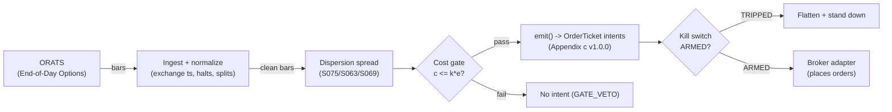

# T058 — Dispersion Trader

Long single-stock variance, short index variance: harvests the variance-risk-premium gap by selling index correlation the market overprices and buying single-name vol, delta-hedged. Provenance **D/SR**.

> Tag law: every numeric literal in prose carries one of `[documented]
> [default] [example] [unverified] [internal-est] [measured]` (legend: Appendix
> i v1.0.0). Bibliographic years, volumes, pages, arXiv IDs, section numbers,
> rule codes (C1–C10), fail-safe codes (F1–F5), module IDs, and machine-parsed
> §0 data fields are identifiers, not literals, and are exempt.

## §1 Five-minute reviewer card

| Row | Value |
|---|---|
| Module | T058 — Dispersion Trader, v1.1.0 |
| Edge verdict | `INSUFFICIENT-EVIDENCE` — dispersion was a live institutional strategy for years, but the documented evidence is the VRP and correlation literature — not an auditable after-cost P&L for this rule |
| After-cost | `BEFORE-COST` — one-sentence verdict: the variance-risk-premium gap is real in the literature, but no cited paper documents after-cost P&L for this exact long-single/short-index construction |
| Build cost | Tier M+ · `40–100` h [internal-est] · `$6,000–30,000` loaded [internal-est] |
| Data cost | Research `$99–199`/mo [documented] — ORATS near-EOD recurring individual license `$99`/mo + `$599` one-time backfill (2007→present), or Delayed Data API `$199`/mo; production Live Data API `$299`/mo [documented]; professional/enterprise tiers quoted separately — verify before budgeting |
| latency_class | bar / daily |
| risk_class | high |
| Capacity | moderate [example] — single-stock variance is the capacity constraint |
| Executability | Feasible but expensive: options data + delta hedging at scale; the Greeks are the product |
| Risk summary | Correlation spike: the trade's worst loss arrives exactly when the index leg needs its short vol most — 2008-style correlation breaks are the known killer |
| When it dies | realized correlation converges to implied (spread collapses); single-stock vol spike without index offset; pin risk at expiry |
| Regime gates | Provisional machine records in §T2 (R033/R031/R002/R022/R039/R035): restrictive default — unknown regime state vetoes entries |
| Emits | `order_intents` (Appendix c v1.0.0) — intents only, never orders |

## §1.5 Cheapest / least-build path

1. **Prototype hour band:** `40–100` h [internal-est] — VRP spread estimator + delta-hedge engine + correlation monitor + cost/risk harness + fixture.
2. **Cheapest-source row:** min_tier = ORATS near-EOD historical (individual license) or Delayed Data API — cheapest data source candidates [documented]; latency_class = bar / daily; required_fields = strikes, greeks, theoretical values, implied volatilities (full chain per symbol per day), plus dividend history, earnings history, stock split history, IV rank, historical volatility [documented — ORATS near-EOD contents]; price_band = `$99`/mo recurring + `$599` one-time backfill (near-EOD, individual) or `$199`/mo (Delayed Data API); live production = `$299`/mo Live Data API [documented] (professional/enterprise quoted separately); build_or_buy = **buy options data (ORATS, Tier 2); build the spread and hedge engine — no vendor sells your delta-hedged book**.
3. **Resource budget:** `2` cores, `8` GB RAM [internal-est]; compute pattern `per_bar`.
4. **Skip list:** weekly expiry gamma version; exotics; dynamic correlation timing.
5. **DO-NOT-CUT list:** causality assertions (`assert fill_event > signal_event`, no-signal-bar-fills test); COST block + callable `expected_cost_bps`; F1–F5 fail-safes + module-state enum; kill-switch state machine + re-arm checklist; decision-log audit records; bona-fide-intent + self-trade prevention; provenance tags on every numeric literal; fixtures + `test_cmd`; secrets via env only.
6. **Escalation gate:** upgrade from cheapest when any holds — names `>30` [default]; daily delta hedging intraday [default]; borrow on hard-to-borrow names [default].

## §T0 Module contract

### T0.1 Typed signature

```python
def emit(state: ModuleState, signals: list[SignalVector], cfg: Config) -> list[OrderTicket]:
```

`OrderTicket` per Appendix c v1.0.0 — **intents only**; the strategy never
places orders, never holds broker/exchange sessions, never nets intents into
orders. `state` is the module-owned named state vector (`position`,
`sleeve_weights`, `cooldown_until`, `kill_state`, `module_state`); `signals`
are canonical SignalVectors (Appendix b v1.0.0), newest last. The function
handles documented edge cases: empty signals → `UNKNOWN`; halt/auction bars →
freeze per the market-state table; stale inputs → `UNKNOWN` (F4), never
interpolate.

### T0.2 Config dataclass

| Parameter | Type | Default | Range | Status |
|---|---|---|---|---|
| `spread_min` | float | `8.0` | `5`–`15` | default |
| `corr_max` | float | `0.80` | `0.70`–`0.90` | default |
| `tenor_days` | int | `30` | `20`–`60` | default |
| `delta_band` | float | `0.10` | `0.05`–`0.20` | default |
| `stop_spread` | float | `0.50` | `0.25`–`1.00` | default |
| `cooldown_bars` | int | `5` | `0`–`20` | default |
| `cost_gate_k` | float | `0.5` | `0.1`–`2.0` | default |

All defaults tagged per the tag law (status `default` ⇒ `[default]`).

### T0.3 Canonical schema mapping

Vendor columns → canonical Bar schema (Appendix a v1.0.0), stated once here:

| Vendor (ORATS End-of-Day Options) | Canonical |
|---|---|
| bar open timestamp | `event_ts` (int64 ns UTC, bar open time) |
| `o/h/l/c`, `v` | `open/high/low/close`, `volume` |
| symbol | `symbol` (exchange-qualified) |
| signal value | `sig` (strategy-defined score, Appendix b `value`) |
| gate flag | `gate` ∈ {0, 1} (confirmation gate) |

### T0.4 Time contract

> Time contract: clock domain UTC, int64 ns; authoritative causality clock =
> `event_ts`; max_skew = `1` ms [default]; jitter budget = `500` µs [default];
> bar-label = open time; staleness TTL = `3`× cadence [default] (F4); gap
> policy = mask, no interpolation; halt/auction → discard contributions
> across reopen.

**Timing box:** `signal@t (per_bar-1d, America/New_York) → earliest fill @open(t+1)`

### T0.5 Market-state table

| State | Module behavior |
|---|---|
| CONTINUOUS_TRADING | Evaluate entries/exits per §T2; emit intents |
| HALTED | Freeze state; emit nothing; `UNKNOWN` on held signals |
| AUCTION | No new entries; exits only via auction-aware intents (MOO/MOC); state `DEGRADED` |
| CLOSED | Emit nothing; state `OFF` |

### T0.6 Module-state enum + error taxonomy

States per Appendix k v1.0.0: `OK | DEGRADED | UNKNOWN | OFF`. Invalid input →
`UNKNOWN`, never interpolate (Appendix f v1.0.0, F1–F5).

| Failure | State | Alert |
|---|---|---|
| Missing/stale input (TTL `3`× cadence [default]) | `UNKNOWN` | page |
| Non-finite / non-positive price reaching module (F2) | `UNKNOWN` | page |
| `event_ts` non-monotonic (F2) | `UNKNOWN` | page |
| Kill-switch TRIPPED | `OFF` (no new intents) | page |
| Halt/auction | `UNKNOWN` / `DEGRADED` (per table) | log |
| Feed anomaly (per §T9 row 1) | `DEGRADED` | notify |
| Anything unmapped | `UNKNOWN` | page |

### T0.7 Risk contract + kill switch

```yaml
risk_contract:
  per_trade_R: `2000` USD [example]             # vega-risk budget; calibrate from live spread P&L
  max_adverse_per_trade: `50`% of expected spread capture [example]
  daily_loss_stop: `-10000` USD [example]
  max_gross: `2`x [example]
  kill_conditions:                        # any one trips -> TRIPPED
  - "implied correlation spikes > 0.95 -> TRIPPED (flatten)"
  - "daily loss <= -$10,000 -> TRIPPED"
  - "delta hedge breach beyond delta_band -> TRIPPED"
  enforcement: intraday-hard              # breach flattens; no review-only mode
```

**Calibration recipe:** `per_trade_R` is the sizing input in §T2 (dollar-risk
`N = ⌊R/stop_dist⌋` or the confidence-scaled equivalent); re-estimate `R`
from the trailing `60`-day [default] per-trade P&L distribution so that a
`3`σ [default] adverse day stays inside `daily_loss_stop`. `max_gross` is
checked pre-emit on every ticket (C4). Kill-switch state machine:

```
ARMED → TRIPPED → RECOVERY → ARMED
```

- `ARMED → TRIPPED`: any kill condition fires → cancel all working intents
  (idempotent cancels), flatten at marketable limits, set module state `OFF`,
  write a `KILL_TRIP` decision record (Appendix g v1.0.0).
- `TRIPPED → RECOVERY`: re-arm checklist **all green** — `1.` feed healthy
  (no stale bars); `2.` decision log reconciled against broker ledger, no
  orphan tickets; `3.` root cause of the trip identified and the offending
  config reverted or re-calibrated; `4.` risk owner sign-off recorded.
- `RECOVERY → ARMED`: one clean evaluation pass over the fixture
  (`test_cmd` green) with no new trip, then resume.

### T0.8 Ops tail

- **Schedule:** daily at close [documented]; owner: vol-arb on-call.
- **Health checks:** fixture replay (`test_cmd`) green on deploy; live
  staleness watchdog at `3`× cadence; kill-switch drill monthly [default].
- **Alert table:** page on `UNKNOWN` > `30` s [default], on any kill trip, or
  bounds violation; notify on `DEGRADED`; log on single dropped bars.
- **Resource budget:** `2` vCPU, `8` GB RAM [internal-est]; state is O(`1`) per symbol.
- **Runbook stub:** `1.` confirm feed; `2.` replay fixture; `3.` if red → set
  `OFF`, page; `4.` reconcile decision log before re-arm; `5.` complete the
  re-arm checklist (§T0.7) before `ARMED`.

### T0.9 Secrets (env-only)

`ORATS_API_KEY` via environment only. No secrets in this file, fixtures, or logs
(CI secrets-grep).

### T0.10 May / must-NOT

> **May:** emit `OrderTicket` intents per Appendix c v1.0.0; track intent-side
> state; issue cancel-replace via new tickets. **Must-NOT:** place orders on
> any venue, hold broker/exchange sessions, net intents into orders inside the
> strategy, or treat the intent-side state machine as broker wire truth.

## §T1 Legacy (subsumed by §1)

Legacy §T1 content is the §1 reviewer card above; this header is retained so
section numbering stays frozen.

## §T2 Specification

### Universe

SPX index options + `10–20` liquid single-stock names [example]; `30`-day tenor [example]; listed US equity options. ORATS near-EOD schema per name per day: strikes (every strike × expiration), full greeks (delta/gamma/theta/vega/rho), theoretical values, smoothed implied volatilities, plus dividend history, earnings history, stock split history, IV rank, historical volatility [documented]. No earnings-week single names (S069 exit logic).

### Entry rule (Boolean — no prose-only conditions)

```
ENTER_DISP := (spread >= spread_min) AND (impl_corr < corr_max)
               AND (earnings_week = FALSE)
               AND (expected_cost_bps(...) <= cost_gate_k * edge_bps)
```

### Exits (with post-exit cooldown)

```
EXIT := (spread < 0.5 * spread_min)    # spread collapse [example]
        OR (impl_corr > 0.95)                    # correlation spike [example]
        OR (tenor < 7 days)                      # gamma/pin exit [example]
ON_EXIT: cooldown_until = now + cooldown_bars * bar_ns   # C10
```

### Position sizing (fenced function — single source of truth: this block)

```python
def size_shares(risk_budget_R, stop_distance, vol_estimate, ADV_cap, cost):
    """Position sizing — normative. Returns integer option-package contracts.

    risk_budget_R : float — dollar risk budget per trade (e.g. 2000.0 [example]).
    stop_distance : float — dollars of adverse move that define R (the vega stop);
                    the fixture passes the tape's stop_dist column (250.0 [example]).
    vol_estimate  : float — dollars of expected adverse P&L per contract
                    (vega * adverse spread move); vol-normalized cap [default].
    ADV_cap       : float — max participation fraction of daily option-contract
                    volume, 0.05 [default].
    cost          : dict — {"cost_bps": ..., "edge_bps": ...} from the COST block;
                    sizes down as cost approaches the cost-gate edge.
    """
    ADV_CONTRACTS_PER_DAY = 10_000  # [example] — pin per-name from ORATS volume history
    risk_size = risk_budget_R / max(stop_distance, 1e-9)          # [default] R-based size
    vol_size  = (risk_budget_R * 2.0) / max(vol_estimate, 1e-9)   # [default] vol-normalized cap
    adv_size  = ADV_cap * ADV_CONTRACTS_PER_DAY                    # [example] participation cap
    base = min(risk_size, vol_size, adv_size)                       # [default] tightest cap binds
    edge_bps = max(float(cost["edge_bps"]), 1e-9)
    haircut  = 1.0 - min(0.5, float(cost["cost_bps"]) / edge_bps)  # [default] cost haircut, capped at 50%
    return max(0, int(base * haircut))
```

Sizing semantics: `risk_budget_R` is the §T0.7 `per_trade_R` (`2000` USD
[example]); `stop_distance` is the dollar stop on the spread P&L per contract
(the tape's `stop_dist` column, `250.0` [example]); `vol_estimate` is
vega-per-contract × adverse spread move [default]; `ADV_cap` is the
`0.05` [default] participation cap on per-name daily option volume;
`cost` applies the cost-haircut so entries that just pass the cost gate size
down. Worked call: `size_shares(2000.0, 250.0, 100.0, 0.05,
{"cost_bps": 10.0, "edge_bps": 22.5})` → `min(8.0, 40.0, 500.0) = 8.0`,
haircut `1 − min(0.5, 10/22.5) = 0.5556`, result `4` contracts [measured —
harness run]. The §T4 test harness uses a fixed `40`-contract sketch for
fixture reproducibility; the normative function above is unit-tested
separately (`test_7`).

### Risk limits

| Limit | Value |
|---|---|
| Per-trade risk | `$2,000` vega budget [example] |
| Daily loss stop | `−$10,000` [example] |
| Correlation-spike kill | implied corr `>0.95` → flatten [example] |
| Delta band | `±0.10` [example] — hedge when breached |

### COST block (single source of truth)

| Component | Value (bps) | Basis |
|---|---|---|
| Spread | `5.00` | [example] — option bid-ask on the package legs |
| Fees | `2.00` | [example] — per-contract cost line across the package legs: **CBOE customer exchange rate is `$0.00`/contract for equity and ETF/ETN options and `$0.18`/contract for index products (SPX-class; XSP/MRUT/DJX `$0.07` ≥`10` contracts) [documented — CBOE Fees Schedule 2026-08-03, SEC SR-CBOE-2026-068]**; the `2.00` bps line is a broker-commission placeholder — pin your broker's per-contract commission before production |
| Borrow | `0.0` | [default] — reference build excludes hard-to-borrow names; short-stock hedge legs require locates pre-emit under Regulation SHO Rule 203(b)(1) [documented]; set `borrow_bps_per_day > 0` for hard-to-borrow names (see R022 / §1.5 escalation gate) |
| Impact | `3.00` | [example] — package execution slippage |
| **Total reference** | `10.00` | [example] |

`fee_schedule_as_of`: `2026-08-03` [documented] — CBOE Fees Schedule, Exhibit 5
SR-CBOE-2026-068 (SEC file 34-106078); customer capacity CK (equity/ETF/ETN)
`$0.00`/contract; all-other-index-products CB (SPX-class) `$0.18`/contract.
Re-pin when the broker commission schedule or CBOE fees change — the cost
function reads this block at build time. `side: mixed` [default];
venue/tier/source: CBOE / ORATS EOD [example]. `borrow_bps_per_day`: `0.0`
[default] — reference build assumes non-hard-to-borrow names; locates are
mandatory per C7 (Reg SHO Rule 203(b)(1)) [documented].

Re-stating cost numbers outside
this block is a validation failure.

```python
def expected_cost_bps(notional, adv_pct, venue, side, urgency) -> float:
    '''Callable cost model — single source of truth (this block).'''
    spread_bps = 5.0   # [example] — option bid-ask on the package legs
    fee_bps = 2.0         # [example] — per-contract fees across legs
    borrow_bps = 0.0   # [default]
    impact_bps = 3.0   # [example] — package execution slippage
    if side == "maker":
        fee_bps = -abs(fee_bps) * 0.5  # rebate proxy [example]
    return spread_bps + fee_bps + borrow_bps + impact_bps
```

### Execution / fill model table

| Aspect | Assumption |
|---|---|
| Latency | Daily; package execution via RFQ where available [example] |
| Entries | Long single-stock straddles, short index straddles, delta-hedged at entry |
| Exits | Spread collapse, correlation spike, or < 7 days to expiry |
| Partial fills | Per Appendix c v1.0.0 FIFO per leg |
| Adverse fill | Correlation spikes widen the index leg exactly when you need the hedge [example] |

### Robustness

Spread = weighted single-stock implied variance − index implied variance [example]; entry needs spread `≥8` vol points [example] AND implied correlation `<0.80` [example]. Delta-hedged daily; vega-weighted notionals. No earnings-week names.

### Compliance sub-block (C1–C10+)

| Code | Rule: trigger → check → action → log |
|---|---|
| C1 | Self-match / STP: every ticket carries self-trade-prevention instructions for the broker adapter; trigger = two tickets same symbol opposite side within `1` s [default] → check resting-interest overlap → action = cancel the newer ticket → log `COMPLIANCE_BLOCK` |
| C2 | Bona-fide intent: every entry intent must pass the cost gate (`expected_cost_bps(...) <= k * edge_bps`) and fit risk limits; trigger = gate fail → check = re-evaluate → action = no ticket emitted → log `GATE_VETO` |
| C3 | Message-rate / cancel-to-trade: trigger = `>50` intents/symbol/min [default] or cancel-to-trade `>10:1` [default] → check venue thresholds → action = throttle to `5`/min [default] + alert → log `COMPLIANCE_BLOCK` |
| C4 | Pre-trade fat-finger trio: price collar `±5`% vs reference [default] → reject; max notional per ticket `$2,000,000` [default] → reject; max `50` tickets/symbol/`5` min [default] → throttle; all rejections logged |
| C5 | Decision-log schema compliance (Appendix g v1.0.0): every intent, veto, cancel-replace, kill transition logged with inputs_hash/params_hash, hash-chained; trigger = missing record → action = halt to `UNKNOWN` |
| C6 | Halt/auction state table: per §T0.5 — HALTED freezes, AUCTION blocks new entries, CLOSED emits nothing; trigger = state change → check market-state table → action = freeze/cancel per table → log |
| C7 | Locate check (short sales): trigger = SHORT intent → check = easy-to-borrow list or live locate obtained pre-emit per Regulation SHO Rule 203(b)(1) [documented] → action = block intent without locate → log `GATE_VETO`; Reg-SHO threshold securities never shorted |
| C8 | Public-dissemination gate: no signal/intent data published externally without review; trigger = export request → check = review sign-off → action = block until signed |
| C9 | Data-entitlement assertions per dataset (Appendix j v1.0.0): trigger = entitlement-class change or unlicensed symbol → check §T5 data-rights row → action = stand down affected symbols → log |
| C10 | Post-exit cooldown: trigger = exit or compliance block → check `now < cooldown_until` → action = no re-entry until ``5`` bars [default] elapse → log |
| C11 | Correlation-spike protocol: implied corr `>0.95` [example] → flatten the book → check corr monitor → action = flatten → log `RISK_HALT` |

### Parameter table

| Parameter | Symbol | Value | Tag | Sensitivity |
|---|---|---|---|---|
| Spread minimum | `spread_min` | `8` vol pts | [example] | high |
| Correlation cap | `corr_max` | `0.80` | [example] | high |
| Tenor | `tenor_days` | `30` days | [example] | medium |
| Delta band | `delta_band` | `0.10` | [example] | medium |
| Cost-gate k | `cost_gate_k` | `0.5` | [default] | high |

### Timing box

`signal@t (per_bar-1d, America/New_York) → earliest fill @open(t+1)`

### Regime gates (machine records)

Provisional: regime IDs exist in `modules/regimes/` (v1.0.0) but the
deep-review wave has not pinned their state vocabularies, so conditions are
value-threshold predicates tagged [example]; state-name pins must be
reconciled with each R-module's contract at build time. Restrictive default:
unknown regime state → veto entries. `min_lag` = `1` bar [default] for all
gates (daily cadence).

| regime_id | direction | mechanism | condition | action | min_lag | unknown_behavior |
|---|---|---|---|---|---|---|
| R033 | degrades | systemic crisis drives implied correlation to realized ≈`1.0`; the harvested correlation risk premium collapses [documented — Driessen et al. 2009: realized ≈`29`%, implied ≈`47`%] | crisis state OR `impl_corr > 0.95` | veto + flatten | `1` bar [default] | veto |
| R031 | degrades | cross-asset correlation regime shift erodes diversification benefit of the basket leg | cross-asset correlation elevated vs `60`-day median [default] | halve | `1` bar [default] | veto |
| R002 | amplifies | wide implied-vs-realized spread is the variance risk premium being harvested [documented — Carr & Wu 2009] | IV−RV spread positive and above its median | allow (no action) | `1` bar [default] | veto |
| R022 | degrades | hard-to-borrow names make the short-stock delta-hedge leg unhedgeable / expensive (borrow squeeze) | name on HTB/threshold list OR borrow rate elevated | widen_stops + halve | `1` bar [default] | veto |
| R039 | degrades | OpEx/quad-witching pinning raises pin risk on single-name legs near expiry | expiry within `7` days [example] of a monthly/quarterly OpEx | pause_entry | `1` bar [default] | veto |
| R035 | degrades | earnings IV spike distorts the dispersion spread (single-name IV up without index offset) | any basket name in earnings week | veto | `1` bar [default] | veto |

## §T3 Math + normative pseudocode

Dispersion payoff: long $N$ single-stock straddles, short index straddles in
vega-weighted ratio. Entry spread
$$\mathrm{Spread}_t = \sum_i w_i \sigma^{\mathrm{IV}}_{i,t} - \sigma^{\mathrm{IV}}_{\mathrm{index},t}
\ge 8\ \mathrm{vol\ pts}\ [\mathrm{example}],$$
with implied correlation $< 0.80$ [example]. Delta-hedged: net $\Delta$ kept
within $\pm 0.10$ [example] via underlying trades. The edge is the
variance-risk premium gap (Carr & Wu 2009): implied variance systematically
exceeds realized; the index leg overprices correlation (Bakshi, Kapadia &
Madan 2003 skew evidence). Exit on spread collapse, correlation spike
$>0.95$ [example], or tenor $< 7$ days [example].

**Normative pseudocode** (pseudocode is normative; prose is commentary):

```
function emit(state, signals, cfg) -> list[OrderTicket]:
    assert signals non-empty else return UNKNOWN                    # F1
    for bar t in signals (newest last):
        s = dispersion spread (vol points), signed long                                            # data <= t only
        assert isfinite(s) else return UNKNOWN                      # F2
        edge_bps = abs(spread) * 2.5                                   # [example] — modeled per-trade edge in bps
        cost = expected_cost_bps(notional, adv_pct, venue, side, urgency)
        cost_ok = expected_cost_bps(...) <= cfg.cost_gate_k * edge_bps
        # ^^^ normative cost-gate predicate: expected_cost_bps(...) <= k * edge_bps
        if state.position is None and state.module_state == OK:
            if ((spread >= cfg.spread_min) and (impl_corr < cfg.corr_max)
                and not earnings_week) and cost_ok:
                ticket = OrderTicket(symbol, side, qty, limit, tif,
                                     ticket_id=uuid(), parent_signal="S075@t",
                                     intent_ts=t.event_ts, state=NEW)
                log_decision(ticket, inputs_hash, params_hash)     # C5 / Appendix g
                assert fill_event > signal_event                    # t->t+1 causality
        else if state.position is not None:
            if ((spread < 0.5 * cfg.spread_min)        # spread collapse [example]
                or (impl_corr > 0.95)                    # correlation spike [example]
                or (tenor < 7)):                         # gamma/pin exit, days [example]
                emit exit intent (cancel-replace rules, Appendix c) # C1
                state.cooldown_until = t + cooldown_bars            # C10
                assert fill_event > signal_event
    return tickets
```

Causality: every quantity at bar `t` uses only data `≤ t`; the earliest fill
is bar `t+1`'s open. Mandatory unit test: no-signal-bar fills
(`assert fill_event > signal_event`).

## §T4 Worked example (fixture-backed)

- Tape: `modules/fixtures/T058_tape.csv` — `# TYPE: validation-run`;
  `12` bars [example], all numbers synthetic, seed `10058` [example];
  `event_ts` int64 ns UTC, bar-labeled by open time.
- Expected outputs: `modules/fixtures/T058_expected.csv` — per-ticket
  intents with the cost-function call recorded (inputs → bps → $);
  tolerance `1e-6` [default] on floats.
- Acceptance tests (`modules/tests/test_T058.py`, `7` tests [documented]):
  `1.` fixture replays to expected (hand-checked rows below); `2.` cost-gate
  predicate passes on the fixture's large edges and blocks a tiny-edge
  counter-case (`k = 0.5` [default]); `3.` no-signal-bar fills
  (`fill_ts > signal_ts` on every ticket); `4.` kill-switch trips on the
  breach scenario and re-arms through the checklist
  (`ARMED → TRIPPED → RECOVERY → ARMED`); `5.` invalid input (non-positive
  price) → `UNKNOWN`, never interpolated; `6.` hand-check literals
  (qty / bps / $) match the generation run; `7.` normative `size_shares`
  (§T2 fenced function) unit test: tightest-cap binds, cost haircut applies,
  worked call `size_shares(2000.0, 250.0, 100.0, 0.05, {"cost_bps": 10.0,
  "edge_bps": 22.5})` → `4` contracts [measured — harness run].
- `test_cmd`: `python3 -m pytest modules/tests/test_T058.py -q` → exits `0`.

**Cost-function calls on the fixture** (inputs → bps → $, from the harness run):

| ticket | notional ($) | adv_pct | side | edge_bps | cost_bps | cost_$ | gate |
|---|---|---|---|---|---|---|---|
| T-T058-2-0 | 4000.92 | 0.0100 | mixed | 22.5000 | 10.0000 | 4.0009 | PASS |

**Where the example is optimistic:** the fixture encodes the spread in signal units with the options package abstracted; production faces per-leg fills, pin risk, and correlation-spike slippage not in the sketch; delta-hedging turnover is folded into the impact line as a planning figure



## §T5 Dependencies & data

Generated-from-`deps.yaml` shape (CI symmetry); hand-listed:

| Module | Role | Version pin |
|---|---|---|
| S075 — Dispersion spread | Entry signal | 1.0.0 |
| S063 — Implied correlation | Gate | 1.0.0 |
| S069 — Earnings calendar | Exit veto | 1.0.0 |

| Field | Type | Granularity | Source tier | Notes |
|---|---|---|---|---|
| Option chains (IV, greeks) | float | EOD | Tier 2 | ORATS |
| Underlying prices | float | daily | Tier 1 | delta hedge |
| Earnings calendar | date | event | Tier 1 | S069 veto |

**Family note:** family `B` = statistical / time-series strategies.

**Data rights row** (Appendix j v1.0.0): US equity index + single-stock options via ORATS
End-of-Day Options, `rights: licensed`; license scope = research + stated
production symbol count; raw ticks never leave our systems — fixtures are
synthetic; entitlement = professional/internal, no display; retention per
vendor terms, purge path in runbook. Entitlement-class change → §1.5
escalation gate.

## §T6 Local build (M5 Max / 128 GB)

Feasible on the M5 Max (Tier M+, `40–100` h [internal-est] ≈ `$6k–30k` [internal-est] eng + research data `$99–199`/mo [documented], live production `$299`/mo [documented] per §1.5); options EOD data is the cost driver. Bottleneck is the delta-hedge engine and borrow on hard-to-borrow names, not compute.

## §T7 Buy vs build

Buy options data (ORATS, Tier 2); build the spread and hedge engine — no vendor sells your delta-hedged book. Verdict: the Greeks and the correlation monitor are the product.

## §T8 Efficacy — documented evidence

| Study / source | Market & period | Metric | Before/after cost | Caveat |
|---|---|---|---|---|
| Carr & Wu (2009), RFS | Index + single-stock options | variance risk premiums: implied variance systematically exceeds realized [documented] | `BEFORE-COST` (risk-premium measurement) | the gap exists; harvesting it after costs is unproven here |
| Bakshi, Kapadia & Madan (2003), RFS | Equity options | risk-neutral skewness and the differential pricing of individual vs index options [documented] | `BEFORE-COST` (pricing evidence) | supports the correlation-overpricing premise |
| Bakshi & Kapadia (2003), RFS | S&P 500 index options | delta-hedged option portfolios (buy option, hedge with stock) underperform zero; volatility risk premium significantly affects delta-hedged gains; market VRP negative [documented] | `BEFORE-COST` (no transaction costs in the study) | index options, not the single-vs-index dispersion construction |
| Bakshi & Kapadia (2003b), JoD | Individual equity options vs index | VRP smaller in individual options than index options; individual VRP negatively correlated with market volatility [documented] | `BEFORE-COST` (statistical evidence) | closest literature to the dispersion core (index-vs-single variance pricing), still not a tradable rule |
| Driessen, Maenhout & Vilkov (2009), JF | S&P 500 constituent vs index options | correlation risk premium ≈`18`% on the S&P 500: average realized correlation `29`%, average implied `47`% [documented]; index variance-risk pricing decomposes into individual-VRP + correlation risk | `BEFORE-COST` (pricing evidence) | direct quantification of the harvested premium; harvesting it after costs is unproven here |
| Black & Scholes (1973), JPE | Theory | option pricing and the Greeks used for delta hedging [documented] | methodological | the hedging machinery, not the edge |

Selection disclosure: these are the sources surfaced by the chapter's research
pass (Stage 158/200). **Honest bottom line.** For a ≤$1M paper operation: T058 harvests a documented risk premium, but correlation spikes are the known killer — the trade's worst loss arrives exactly when the short index-vol leg is needed most. Size the vega budget for a 2008-style correlation break.

## §T9 Failure modes & pitfalls

| # | Trigger → Detect → Action → Recovery | check: |
|---|---|---|
| 1 | Correlation spike: impl corr > 0.95 → detect: corr monitor → action: flatten → recovery: re-enter when corr < 0.80 | `check: impl_corr <= 0.95 or flat` |
| 2 | Spread collapse: spread < 0.5 × spread_min → detect: spread monitor → action: exit → recovery: re-arm | `check: spread >= 0.5 * spread_min or flat` |
| 3 | Delta breach: net delta beyond ±0.10 → detect: greek monitor → action: hedge → recovery: within band | `check: abs(delta) <= 0.10` |
| 4 | Pin risk: tenor < 7 days → detect: expiry calendar → action: exit → recovery: roll | `check: tenor_days >= 7` |
| 5 | Cost blowup → detect: cost gate fails → action: stand down → recovery: re-pin | `check: expected_cost_bps(...) <= k * edge_bps` |
| 6 | Lookahead: spread uses future IV → detect: causality audit → action: halt → recovery: re-run test | `check: all(fill_ts > signal_ts)` |
| 7 | Hard-to-borrow squeeze: basket name goes HTB → detect: borrow monitor / R022 state → action: exclude the name from the basket, unwind short-stock hedge via buy-in-risk procedure, resize per §T2 sizing → recovery: re-admit when easy-to-borrow with confirmed locate | `check: borrow_bps_per_day <= borrow_cap or name excluded` |

## §T10 Source log + unverified leads

**Sources** (citable facts only):

1. Bakshi, G., Kapadia, N. & Madan, D. (2003) [documented]. "Stock Return Characteristics, Skew Laws, and the Differential Pricing of Individual Equity Options." *Review of Financial Studies* 16(1): 101–143. — index vs single-name option pricing; the correlation-overpricing premise.
2. Carr, P. & Wu, L. (2009) [documented]. "Variance Risk Premiums." *Review of Financial Studies* 22(3): 1311–1341. — implied variance systematically exceeds realized variance; the harvested gap.
3. Black, F. & Scholes, M. (1973) [documented]. "The Pricing of Options and Corporate Liabilities." *Journal of Political Economy* 81(3): 637–654. — option pricing and the Greeks for delta hedging.
4. Bakshi, G. & Kapadia, N. (2003) [documented]. "Delta-Hedged Gains and the Negative Market Volatility Risk Premium." *Review of Financial Studies* 16(2): 527–566. — delta-hedged option portfolios underperform zero; the negative market volatility risk premium; the hedge-leg evidence for this strategy's construction.
5. Bakshi, G. & Kapadia, N. (2003) [documented]. "Volatility Risk Premiums Embedded in Individual Equity Options: Some New Insights." *Journal of Derivatives* 11(1): 45–54. — VRP is smaller in individual equity options than in index options and is negatively correlated with market volatility — the index-vs-single variance pricing gap this strategy harvests.
6. Driessen, J., Maenhout, P. J. & Vilkov, G. (2009) [documented]. "The Price of Correlation Risk: Evidence from Equity Options." *Journal of Finance* 64(3): 1377–1406. — correlation risk premium ≈ 18% on the S&P 500 (average realized correlation 29%, average implied 47%); index variance-risk pricing = individual VRP + priced correlation risk — the direct quantification of the harvested premium.
7. CBOE Fees Schedule (2026-08-03) [documented]. Exhibit 5, SR-CBOE-2026-068, SEC file 34-106078: customer capacity — equity/ETF/ETN options $0.00/contract, all-other-index-products (SPX-class) $0.18/contract, XSP/MRUT/DJX $0.07 for ≥10 contracts. — pins `fee_schedule_as_of` and the fee-line basis.
8. ORATS pricing (verified 2026-09-11 from orats.com) [documented]. Near-EOD historical: `$99`/mo recurring individual license + `$599` one-time backfill (2007→present); Delayed Data API `$199`/mo; Live Data API `$299`/mo; professional/enterprise quoted separately. Near-EOD contents: strikes × expirations, greeks, theoretical values, smoothed IVs, dividends, earnings history, splits, IV rank, historical volatility. — pins §1/§1.5 data cost and required_fields.

**Chatbot source log.** Grok answered Q-TB6-1..3 (2026-09-10); all claims independently verified or labeled unverified.

**Unverified leads** (chatbot-only — never in evidence tables):

- Grok Q-TB6-3: dispersion on crypto options (BTC/ETH vol surface) — chatbot lead, unverified; reference build is US equities only.

## GROK-NEEDED (exact questions for the next Grok research round)

Web search could not answer these; ask Grok verbatim:

1. Q-GROK-T058-1 (data pricing): "ORATS near-EOD historical and Delayed Data API list individual licenses at `$99–199`/mo [documented] and the Live Data API at `$299`/mo [documented]. What are ORATS's current professional/institutional price bands for the same products, and what does the recurring delivery include (symbols, fields, delivery method)? Cite the source URL."
2. Q-GROK-T058-2 (execution cost): "For 30-day SPX straddles and liquid single-name (top-20) straddles, what are realistic 2025–2026 per-leg bid-ask spreads in bps, and what package-execution slippage vs mid should a 10–20-leg dispersion package assume? Give numbers with the source (dealer study, vendor, or paper)."
3. Q-GROK-T058-3 (broker commissions): "What are representative 2026 per-contract option commission schedules for a retail/pro account trading multi-leg option packages (e.g. per-contract or per-leg pricing), to replace the `2.00` bps fee placeholder [example] in the cost stack? Name the broker and schedule date."
4. Q-GROK-T058-4 (hedge turnover): "For a vega-weighted long-single/short-index dispersion book delta-hedged daily, what is a realistic hedge-turnover multiple (hedge notional traded per day as a multiple of book vega or notional)? Cite any published study or practitioner note."
5. Q-GROK-T058-5 (correlation-spike dynamics): "How fast does implied correlation converge to realized ≈1.0 in equity stress events (2008, 2020)? Give the empirical half-life or days-to-peak from any published measurement, to calibrate the 0.95 kill threshold and the 1-bar min_lag in the regime gates."
6. Q-GROK-T058-6 (after-cost evidence): "Is there any published after-cost P&L of a rules-based long-single-stock-vol / short-index-vol dispersion construction? Name the paper or study; if none exists, say so explicitly."

---

## Appendix — AI build prompt (T058)

Copy-paste into any chat agent:

> Build module **T058 — Dispersion Trader** per `notes/module-template.md` v1.0.0
> and this file's §T0 contract.
> Cheapest path (§1.5): prototype `40–100` h [internal-est]; cheapest data
> candidate ORATS End-of-Day [internal-est]; compute pattern `per_bar`; skip
> weekly expiry gamma version; exotics; dynamic correlation timing for now.
> Implement `emit(state, signals, cfg) -> list[OrderTicket]`
> (Appendix c v1.0.0) with the §T3 normative pseudocode, including the
> cost-gate predicate `expected_cost_bps(...) <= k * edge_bps` and
> `assert fill_event > signal_event`. Wire F1–F5 (Appendix f v1.0.0): invalid
> input → `UNKNOWN`, never interpolate. Implement the kill-switch state
> machine `ARMED → TRIPPED → RECOVERY → ARMED` with the §T0.7 re-arm
> checklist. Log decisions per Appendix g v1.0.0. Secrets via env only.
> Run the fixture `modules/fixtures/T058_tape.csv`
> (`# TYPE: validation-run`) against `modules/fixtures/T058_expected.csv`
> (tolerance `1e-6` [default]).
> **Definition of done:** `python3 -m pytest modules/tests/test_T058.py -q`
> exits `0`. Tag every numeric literal you add with the unified enum
> (Appendix i v1.0.0); put anything unverifiable in §T10 unverified leads.
