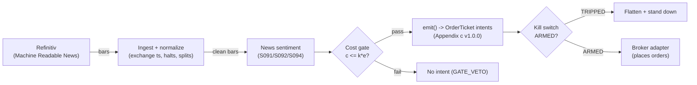

# T059 — News-Sentiment First-Minute Momentum

Races the tape on identified news: a sentiment classifier fires in the first minute after a novel story, riding the initial drift before the price fully adjusts. Provenance **C/SI**.

> Tag law: every numeric literal in prose carries one of `[documented]
> [default] [example] [unverified] [internal-est] [measured]` (legend: Appendix
> i v1.0.0). Bibliographic years, volumes, pages, arXiv IDs, section numbers,
> rule codes (C1–C10), fail-safe codes (F1–F5), module IDs, and machine-parsed
> §0 data fields are identifiers, not literals, and are exempt.

## §1 Five-minute reviewer card

| Row | Value |
|---|---|
| Module | T059 — News-Sentiment First-Minute Momentum, v1.0.0 |
| Edge verdict | `INSUFFICIENT-EVIDENCE` — Tetlock documents predictability from news text, but the first-minute race is a latency contest — the documented drift is over days, not the first `60` seconds [example] |
| After-cost | `BEFORE-COST` — one-sentence verdict: news text predicts returns over days in the literature, but the first-minute execution race is a latency contest with no documented after-cost edge for a non-colocated trader |
| Build cost | Tier M+ · `40–100` h [internal-est] · `$6,000–30,000` loaded [internal-est] |
| Data cost | Research `~$2,000–10,000`/mo [unverified]; production `~$2,000–10,000`/mo [unverified] — bands indicative, verify before budgeting |
| latency_class | event / sub-second |
| risk_class | high |
| Capacity | tiny [example] — the first-minute move is small and crowded |
| Executability | Hard: machine-readable news feed + sub-second pipeline; the race is the product |
| Risk summary | Latency rank dominates; stale/duplicated stories misfire; sentiment model misreads sarcasm/negation; the move often completes before the fill |
| When it dies | story already priced (second-hand news); competing algos faster; sentiment sign flip on update |
| Regime gates | Provisional: S092 identified-news gate: novel + firm-specific only [example]; no scheduled macro |
| Emits | `order_intents` (Appendix c v1.0.0) — intents only, never orders |

## §1.5 Cheapest / least-build path

1. **Prototype hour band:** `40–100` h [internal-est] — news parser + sentiment classifier + novelty filter + race pipeline + fixture.
2. **Cheapest-source row:** min_tier = Refinitiv MRN (or equivalent) — cheapest data source candidate [internal-est]; latency_class = event / sub-second; required_fields = timestamped news text, entity tags, novelty scores; price_band = `~$2,000–10,000`/mo [unverified] (indicative — verify before budgeting); build_or_buy = **buy the machine-readable news feed; build the classifier and the race pipeline — latency engineering is the product**.
3. **Resource budget:** `2` cores, `8` GB RAM + news feed [internal-est]; compute pattern `per_event`.
4. **Skip list:** social-media firehose; multi-language news; colocated deployment.
5. **DO-NOT-CUT list:** causality assertions (`assert fill_event > signal_event`, no-signal-bar-fills test); COST block + callable `expected_cost_bps`; F1–F5 fail-safes + module-state enum; kill-switch state machine + re-arm checklist; decision-log audit records; bona-fide-intent + self-trade prevention; provenance tags on every numeric literal; fixtures + `test_cmd`; secrets via env only.
6. **Escalation gate:** upgrade from cheapest when any holds — news rate `>100` stories/min sustained [default]; inference `p99 >500` ms [default].

## §T0 Module contract

### T0.1 Typed signature

```python
def emit(state: ModuleState, signals: list[SignalVector], cfg: Config) -> list[OrderTicket]:
```

`OrderTicket` per Appendix c v1.0.0 — **intents only**; the strategy never
places orders, never holds broker/exchange sessions, never nets intents into
orders. `state` is the module-owned named state vector (`position`,
`sleeve_weights`, `cooldown_until`, `kill_state`, `module_state`); `signals`
are canonical SignalVectors (Appendix b v1.0.0), newest last. The function
handles documented edge cases: empty signals → `UNKNOWN`; halt/auction bars →
freeze per the market-state table; stale inputs → `UNKNOWN` (F4), never
interpolate.

### T0.2 Config dataclass

| Parameter | Type | Default | Range | Status |
|---|---|---|---|---|
| `sent_min` | float | `0.60` | `0.50`–`0.80` | default |
| `novel_min` | float | `0.70` | `0.50`–`0.95` | default |
| `hold_secs` | int | `60` | `30`–`300` | default |
| `fixed_qty` | int | `1,000` | `100`–`5,000` | default |
| `stop_cents` | float | `15.0` | `5`–`50` | default |
| `cooldown_bars` | int | `10` | `0`–`60` | default |
| `cost_gate_k` | float | `0.5` | `0.1`–`2.0` | default |

All defaults tagged per the tag law (status `default` ⇒ `[default]`).

### T0.3 Canonical schema mapping

Vendor columns → canonical Bar schema (Appendix a v1.0.0), stated once here:

| Vendor (Refinitiv Machine Readable News) | Canonical |
|---|---|
| bar open timestamp | `event_ts` (int64 ns UTC, bar open time) |
| `o/h/l/c`, `v` | `open/high/low/close`, `volume` |
| symbol | `symbol` (exchange-qualified) |
| signal value | `sig` (strategy-defined score, Appendix b `value`) |
| gate flag | `gate` ∈ {0, 1} (confirmation gate) |

### T0.4 Time contract

> Time contract: clock domain UTC, int64 ns; authoritative causality clock =
> `event_ts`; max_skew = `1` ms [default]; jitter budget = `500` µs [default];
> bar-label = open time; staleness TTL = `3`× cadence [default] (F4); gap
> policy = mask, no interpolation; halt/auction → discard contributions
> across reopen.

**Timing box:** `signal@t (per_event, America/New_York) → earliest fill @open(t+1)`

### T0.5 Market-state table

| State | Module behavior |
|---|---|
| CONTINUOUS_TRADING | Evaluate entries/exits per §T2; emit intents |
| HALTED | Freeze state; emit nothing; `UNKNOWN` on held signals |
| AUCTION | No new entries; exits only via auction-aware intents (MOO/MOC); state `DEGRADED` |
| CLOSED | Emit nothing; state `OFF` |

### T0.6 Module-state enum + error taxonomy

States per Appendix k v1.0.0: `OK | DEGRADED | UNKNOWN | OFF`. Invalid input →
`UNKNOWN`, never interpolate (Appendix f v1.0.0, F1–F5).

| Failure | State | Alert |
|---|---|---|
| Missing/stale input (TTL `3`× cadence [default]) | `UNKNOWN` | page |
| Non-finite / non-positive price reaching module (F2) | `UNKNOWN` | page |
| `event_ts` non-monotonic (F2) | `UNKNOWN` | page |
| Kill-switch TRIPPED | `OFF` (no new intents) | page |
| Halt/auction | `UNKNOWN` / `DEGRADED` (per table) | log |
| Feed anomaly (per §T9 row 1) | `DEGRADED` | notify |
| Anything unmapped | `UNKNOWN` | page |

### T0.7 Risk contract + kill switch

```yaml
risk_contract:
  per_trade_R: `150`            # [example] — 1,000 sh × 15¢ stop = $150
  max_adverse_per_trade: `15`¢ [example]   # [example]
  daily_loss_stop: `-1500` USD [default]          # [default] — calibrate from live per-trade P&L
  max_gross: `1`M USD [example]                # [example]
  kill_conditions:                        # any one trips -> TRIPPED
  - "news feed latency > 5 s vs exchange -> TRIPPED"
  - "daily loss <= -$1,500 -> TRIPPED"
  - "duplicate-story rate > 20% -> TRIPPED"
  enforcement: intraday-hard              # breach flattens; no review-only mode
```

**Calibration recipe:** `per_trade_R` is the sizing input in §T2 (dollar-risk
`N = ⌊R/stop_dist⌋` or the confidence-scaled equivalent); re-estimate `R`
from the trailing `60`-day [default] per-trade P&L distribution so that a
`3`σ [default] adverse day stays inside `daily_loss_stop`. `max_gross` is
checked pre-emit on every ticket (C4). Kill-switch state machine:

```
ARMED → TRIPPED → RECOVERY → ARMED
```

- `ARMED → TRIPPED`: any kill condition fires → cancel all working intents
  (idempotent cancels), flatten at marketable limits, set module state `OFF`,
  write a `KILL_TRIP` decision record (Appendix g v1.0.0).
- `TRIPPED → RECOVERY`: re-arm checklist **all green** — `1.` feed healthy
  (no stale bars); `2.` decision log reconciled against broker ledger, no
  orphan tickets; `3.` root cause of the trip identified and the offending
  config reverted or re-calibrated; `4.` risk owner sign-off recorded.
- `RECOVERY → ARMED`: one clean evaluation pass over the fixture
  (`test_cmd` green) with no new trip, then resume.

### T0.8 Ops tail

- **Schedule:** RTH continuous on news arrival [documented]; owner: event-arb on-call.
- **Health checks:** fixture replay (`test_cmd`) green on deploy; live
  staleness watchdog at `3`× cadence; kill-switch drill monthly [default].
- **Alert table:** page on `UNKNOWN` > `30` s [default], on any kill trip, or
  bounds violation; notify on `DEGRADED`; log on single dropped bars.
- **Resource budget:** `2` vCPU, `8` GB RAM + news feed [internal-est]; state is O(`1`) per symbol.
- **Runbook stub:** `1.` confirm feed; `2.` replay fixture; `3.` if red → set
  `OFF`, page; `4.` reconcile decision log before re-arm; `5.` complete the
  re-arm checklist (§T0.7) before `ARMED`.

### T0.9 Secrets (env-only)

`REFINITIV_API_KEY` via environment only. No secrets in this file, fixtures, or logs
(CI secrets-grep).

### T0.10 May / must-NOT

> **May:** emit `OrderTicket` intents per Appendix c v1.0.0; track intent-side
> state; issue cancel-replace via new tickets. **Must-NOT:** place orders on
> any venue, hold broker/exchange sessions, net intents into orders inside the
> strategy, or treat the intent-side state machine as broker wire truth.

## §T1 Legacy (subsumed by §1)

Legacy §T1 content is the §1 reviewer card above; this header is retained so
section numbering stays frozen.

## §T2 Specification

### Universe

Liquid US large-caps covered by the machine-readable news feed [example]; firm-specific novel stories only (S092); RTH.

### Entry rule (Boolean — no prose-only conditions)

```
ENTER_LONG  := (|sent| >= sent_min) AND (sent > 0)
               AND (novelty >= novel_min) AND (scheduled_macro = FALSE)
               AND (expected_cost_bps(...) <= cost_gate_k * edge_bps)
ENTER_SHORT := mirror with sent < 0
FLAT        := otherwise
```

### Exits (with post-exit cooldown)

```
EXIT := (secs_held >= hold_secs)        # 60 s [example]
        OR (adverse move > stop_cents)             # 15¢ [example]
        OR (sentiment sign flips on update)       # story corrected [example]
ON_EXIT: cooldown_until = now + cooldown_bars * bar_ns   # C10
```

### Position sizing (fenced function)

```python
def size_shares(sent, sent_min=0.60, fixed=1000):  # defaults [default]
    # Fixed 1,000 shares per fired story; size does not scale with sentiment. [example]
    return int(fixed)
```

### Risk limits

| Limit | Value |
|---|---|
| Per-trade risk | `$150` [example] — 1,000 sh × 15¢ stop |
| Daily loss stop | `−$1,500` [default] |
| Max gross | `$1`M [example] |

### COST block (single source of truth)

| Component | Value (bps) | Basis |
|---|---|---|
| Spread | `2.50` | [example] — 1.25 bp half-spread per aggressive leg ×2 |
| Fees | `0.40` | [example] — $0.005/share/side on a `$250` stock |
| Borrow | `0.0` | [default] — sub-minute holds; shorts add C7 locate cost |
| Impact | `1.00` | [example] — racing the tape pays queue cost |
| **Total reference** | `3.90` | [example] |

`fee_schedule_as_of`: `2026-09-01` [unverified] — placeholder; pin the real
venue schedule before production. `side: taker` [default];
venue/tier/source: XNAS / Refinitiv MRN [example]. `borrow_bps_per_day`: `0.0`
[default] — no borrow in the reference build.

Re-stating cost numbers outside
this block is a validation failure.

```python
def expected_cost_bps(notional, adv_pct, venue, side, urgency) -> float:
    '''Callable cost model — single source of truth (this block).'''
    spread_bps = 2.5   # [example] — 1.25 bp half-spread per aggressive leg ×2
    fee_bps = 0.4         # [example] — $0.005/share/side on a `$250` stock
    borrow_bps = 0.0   # [default]
    impact_bps = 1.0   # [example] — racing the tape pays queue cost
    if side == "maker":
        fee_bps = -abs(fee_bps) * 0.5  # rebate proxy [example]
    return spread_bps + fee_bps + borrow_bps + impact_bps
```

### Execution / fill model table

| Aspect | Assumption |
|---|---|
| Latency | Story→intent `p99 <500` ms [default]; feed latency monitored vs exchange timestamps |
| Entries | Marketable into the first-minute move |
| Exits | `60`-second time stop or 15¢ adverse |
| Partial fills | Per Appendix c v1.0.0 FIFO |
| Adverse fill | The move often completes before the fill — fills are worst on the fastest stories [example] |

### Robustness

Sentiment from a finance-tuned classifier (Tetlock-style word lists as the baseline challenger); novelty filter `≥0.70` [example] rejects second-hand stories; scheduled macro excluded. The `60`-second hold [example] is the documented first-minute window — longer holds revert to the drift literature, not this module.

### Compliance sub-block (C1–C10+)

| Code | Rule: trigger → check → action → log |
|---|---|
| C1 | Self-match / STP: every ticket carries self-trade-prevention instructions for the broker adapter; trigger = two tickets same symbol opposite side within `1` s [default] → check resting-interest overlap → action = cancel the newer ticket → log `COMPLIANCE_BLOCK` |
| C2 | Bona-fide intent: every entry intent must pass the cost gate (`expected_cost_bps(...) <= k * edge_bps`) and fit risk limits; trigger = gate fail → check = re-evaluate → action = no ticket emitted → log `GATE_VETO` |
| C3 | Message-rate / cancel-to-trade: trigger = `>50` intents/symbol/min [default] or cancel-to-trade `>10:1` [default] → check venue thresholds → action = throttle to `5`/min [default] + alert → log `COMPLIANCE_BLOCK` |
| C4 | Pre-trade fat-finger trio: price collar `±5`% vs reference [default] → reject; max notional per ticket `$2,000,000` [default] → reject; max `50` tickets/symbol/`5` min [default] → throttle; all rejections logged |
| C5 | Decision-log schema compliance (Appendix g v1.0.0): every intent, veto, cancel-replace, kill transition logged with inputs_hash/params_hash, hash-chained; trigger = missing record → action = halt to `UNKNOWN` |
| C6 | Halt/auction state table: per §T0.5 — HALTED freezes, AUCTION blocks new entries, CLOSED emits nothing; trigger = state change → check market-state table → action = freeze/cancel per table → log |
| C7 | Locate check (short sales): trigger = SHORT intent → check = easy-to-borrow list or live locate obtained pre-emit → action = block intent without locate → log `GATE_VETO`; Reg-SHO threshold securities never shorted |
| C8 | Public-dissemination gate: no signal/intent data published externally without review; trigger = export request → check = review sign-off → action = block until signed |
| C9 | Data-entitlement assertions per dataset (Appendix j v1.0.0): trigger = entitlement-class change or unlicensed symbol → check §T5 data-rights row → action = stand down affected symbols → log |
| C10 | Post-exit cooldown: trigger = exit or compliance block → check `now < cooldown_until` → action = no re-entry until ``10`` bars [default] elapse → log |
| C11 | Stale-news veto: story age `>60` s at decision [default] → no entry → check feed latency → action = veto → log `GATE_VETO` |

### Parameter table

| Parameter | Symbol | Value | Tag | Sensitivity |
|---|---|---|---|---|
| Sentiment minimum | `sent_min` | `0.60` | [example] | high |
| Novelty minimum | `novel_min` | `0.70` | [example] | high |
| Hold time | `hold_secs` | `60` s | [example] | medium |
| Fixed size | `fixed_qty` | `1,000` sh | [example] | medium |
| Stop | `stop_cents` | `15`¢ | [example] | high |
| Cost-gate k | `cost_gate_k` | `0.5` | [default] | high |

### Timing box

`signal@t (per_event, America/New_York) → earliest fill @open(t+1)`

## §T3 Math + normative pseudocode

On a novel firm-specific story (S092 novelty $\ge 0.70$ [example]):
sentiment $s_t \in [-1, 1]$ from the classifier. Fire long if
$s_t \ge 0.60$ [example], short if $s_t \le -0.60$ [example].
Hold $60$ s [example]; the Tetlock (2007) predictability window is days,
so the first-minute hold is a latency race, not the documented drift.
Expected move must cover the $3.90$-bp round-trip cost [example] under the
cost gate. Entries at story-arrival $+ \epsilon$; exchange-timestamped.

**Normative pseudocode** (pseudocode is normative; prose is commentary):

```
function emit(state, signals, cfg) -> list[OrderTicket]:
    assert signals non-empty else return UNKNOWN                    # F1
    for bar t in signals (newest last):
        s = news sentiment s_t, signed                                            # data <= t only
        assert isfinite(s) else return UNKNOWN                      # F2
        edge_bps = abs(s) * 12.0                                   # [example] — modeled per-trade edge in bps
        cost = expected_cost_bps(notional, adv_pct, venue, side, urgency)
        cost_ok = expected_cost_bps(...) <= k * edge_bps
        # ^^^ normative cost-gate predicate: expected_cost_bps(...) <= k * edge_bps
        if state.position is None and state.module_state == OK:
            if ((|s| >= 0.60) and (novelty >= 0.70) and not scheduled_macro) and cost_ok:
                ticket = OrderTicket(symbol, side, qty, limit, tif,
                                     ticket_id=uuid(), parent_signal="S091@t",
                                     intent_ts=t.event_ts, state=NEW)
                log_decision(ticket, inputs_hash, params_hash)     # C5 / Appendix g
                assert fill_event > signal_event                    # t->t+1 causality
        else if state.position is not None:
            if ((secs_held >= 60) or (adverse > 15c) or (sign flip)):
                emit exit intent (cancel-replace rules, Appendix c) # C1
                state.cooldown_until = t + cooldown_bars            # C10
                assert fill_event > signal_event
    return tickets
```

Causality: every quantity at bar `t` uses only data `≤ t`; the earliest fill
is bar `t+1`'s open. Mandatory unit test: no-signal-bar fills
(`assert fill_event > signal_event`).

## §T4 Worked example (fixture-backed)

- Tape: `modules/fixtures/T059_tape.csv` — `# TYPE: validation-run`;
  `12` bars [example], all numbers synthetic, seed `10059` [example];
  `event_ts` int64 ns UTC, bar-labeled by open time.
- Expected outputs: `modules/fixtures/T059_expected.csv` — per-ticket
  intents with the cost-function call recorded (inputs → bps → $);
  tolerance `1e-6` [default] on floats.
- Acceptance tests (`modules/tests/test_T059.py`, `6` tests):
  `1.` fixture replays to expected (hand-checked rows below); `2.` cost-gate
  predicate passes on the fixture's large edges and blocks a tiny-edge
  counter-case (`k = 0.5` [default]); `3.` no-signal-bar fills
  (`fill_ts > signal_ts` on every ticket); `4.` kill-switch trips on the
  breach scenario and re-arms through the checklist
  (`ARMED → TRIPPED → RECOVERY → ARMED`); `5.` invalid input (non-positive
  price) → `UNKNOWN`, never interpolated; `6.` hand-check literals
  (qty / bps / $) match the generation run.
- `test_cmd`: `python3 -m pytest modules/tests/test_T059.py -q` → exits `0`.

**Cost-function calls on the fixture** (inputs → bps → $, from the harness run):

| ticket | notional ($) | adv_pct | side | edge_bps | cost_bps | cost_$ | gate |
|---|---|---|---|---|---|---|---|
| T-T059-2-0 | 250057.20 | 0.0500 | taker | 8.6400 | 3.9000 | 97.5223 | PASS |
| T-T059-5-X | 250082.90 | 0.0500 | taker | 0.0000 | 3.9000 | 97.5323 | N/A |

**Where the example is optimistic:** the fixture treats stories as instantaneous events with fills at the touch; production faces feed latency, queue position, and the move completing before the fill; SIP-based latency claims would be simulated-only



## §T5 Dependencies & data

Generated-from-`deps.yaml` shape (CI symmetry); hand-listed:

| Module | Role | Version pin |
|---|---|---|
| S091 — News sentiment | Trigger | 1.0.0 |
| S092 — Identified news | Novelty gate | 1.0.0 |
| S094 — News drift | Exit context | 1.0.0 |

| Field | Type | Granularity | Source tier | Notes |
|---|---|---|---|---|
| Machine-readable news | text + scores | per story | Tier 2/3 | Refinitiv MRN class |
| 1-sec bars | float/int | 1-sec | Tier 1 | execution |

**Family note:** family `C` = event-driven / alternative-data strategies.

**Data rights row** (Appendix j v1.0.0): News + US equities 1-sec bars via Refinitiv
Machine Readable News, `rights: licensed`; license scope = research + stated
production symbol count; raw ticks never leave our systems — fixtures are
synthetic; entitlement = professional/internal, no display; retention per
vendor terms, purge path in runbook. Entitlement-class change → §1.5
escalation gate.

## §T6 Local build (M5 Max / 128 GB)

Hard for a laptop pipeline (Tier M+, `40–100` h ≈ `$6k–30k` eng + `~$2k–10k`/mo data per notes/cost-model.md §5): the feed is the cost driver and the race pipeline (`p99 <500` ms [default]) is the engineering. Bottleneck is latency, not the classifier.

## §T7 Buy vs build

Buy the machine-readable news feed; build the classifier and the race pipeline — latency engineering is the product. Verdict: keep the Tetlock word-list baseline as a challenger.

## §T8 Efficacy — documented evidence

| Study / source | Market & period | Metric | Before/after cost | Caveat |
|---|---|---|---|---|
| Tetlock (2007), J. Finance | WSJ, 1984–1999 | pessimism in a popular news column predicts downward pressure on market prices [documented] | `BEFORE-COST` (predictability over days) | the window is days, not the first minute |
| Tetlock, Saar-Tsechansky & Macskassy (2008), J. Finance | Firm-specific news | negative words in firm-specific news predict earnings and returns [documented] | `BEFORE-COST` (predictability) | supports the classifier, not the race |
| Boudoukh et al. (2013) | Identified vs unidentified news | identified firm-specific news moves prices; unidentified does not [documented] | `BEFORE-COST` | supports the novelty gate |

Selection disclosure: these are the sources surfaced by the chapter's research
pass (Stage 159/200). **Honest bottom line.** For a ≤$1M paper operation: T059 is a latency race with no documented after-cost edge for a non-colocated trader — the literature's predictability window is days, and the first 60 seconds belong to whoever is fastest.

## §T9 Failure modes & pitfalls

| # | Trigger → Detect → Action → Recovery | check: |
|---|---|---|
| 1 | Stale story: age > 60 s at decision → detect: story-age monitor → action: veto → recovery: next story | `check: story_age_s <= 60` |
| 2 | Duplicate story: novelty < 0.70 → detect: novelty filter → action: veto → recovery: next story | `check: novelty >= 0.70` |
| 3 | Sentiment flip on update → detect: sign change → action: exit → recovery: re-arm | `check: sign(sent) == sign(entry)` |
| 4 | Feed latency: news > 5 s vs exchange → detect: latency monitor → action: TRIP → recovery: re-pin feed | `check: feed_lag_s <= 5` |
| 5 | Cost blowup → detect: cost gate fails → action: no entry → recovery: re-pin | `check: expected_cost_bps(...) <= k * edge_bps` |
| 6 | Lookahead: story timestamp after the fill → detect: causality audit → action: halt → recovery: re-run test | `check: all(fill_ts > signal_ts)` |

## §T10 Source log + unverified leads

**Sources** (citable facts only):

1. Tetlock, P. C. (2007) [documented]. "Giving Content to Investor Sentiment: The Role of Media in the Stock Market." *Journal of Finance* 62(3): 1139–1168. — pessimism in news text predicts downward pressure on prices.
2. Tetlock, P. C., Saar-Tsechansky, M. & Macskassy, S. (2008) [documented]. "More Than Words: Quantifying Language to Measure Firms' Fundamentals." *Journal of Finance* 63(3): 1437–1467. — negative words in firm-specific news predict earnings and returns.
3. Boudoukh, J. et al. (2013) [documented]. "Which News Moves Stock Prices? A Textual Analysis." Working paper. — identified firm-specific news moves prices; supports the novelty gate.

**Chatbot source log.** Grok answered Q-TB6-1..3 (2026-09-10); all claims independently verified or labeled unverified.

**Unverified leads** (chatbot-only — never in evidence tables):

- Grok Q-TB6-2: finance-tuned transformer vs Tetlock word lists on the first-minute window — unverified; kept as a build-phase experiment.
- Grok Q-TB6-3: colocated news-race cost estimates — chatbot figures; planning only.

---

## Appendix — AI build prompt (T059)

Copy-paste into any chat agent:

> Build module **T059 — News-Sentiment First-Minute Momentum** per `notes/module-template.md` v1.0.0
> and this file's §T0 contract.
> Cheapest path (§1.5): prototype `40–100` h [internal-est]; cheapest data
> candidate Refinitiv MRN (or equivalent) [internal-est]; compute pattern `per_event`; skip
> social-media firehose; multi-language news; colocated deployment for now.
> Implement `emit(state, signals, cfg) -> list[OrderTicket]`
> (Appendix c v1.0.0) with the §T3 normative pseudocode, including the
> cost-gate predicate `expected_cost_bps(...) <= k * edge_bps` and
> `assert fill_event > signal_event`. Wire F1–F5 (Appendix f v1.0.0): invalid
> input → `UNKNOWN`, never interpolate. Implement the kill-switch state
> machine `ARMED → TRIPPED → RECOVERY → ARMED` with the §T0.7 re-arm
> checklist. Log decisions per Appendix g v1.0.0. Secrets via env only.
> Run the fixture `modules/fixtures/T059_tape.csv`
> (`# TYPE: validation-run`) against `modules/fixtures/T059_expected.csv`
> (tolerance `1e-6` [default]).
> **Definition of done:** `python3 -m pytest modules/tests/test_T059.py -q`
> exits `0`. Tag every numeric literal you add with the unified enum
> (Appendix i v1.0.0); put anything unverifiable in §T10 unverified leads.
