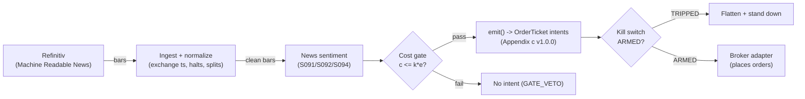

# T059 — News-Sentiment First-Minute Momentum

Races the tape on identified news: a sentiment classifier fires in the first minute after a novel story, riding the initial drift before the price fully adjusts. Provenance **C/SI**. Module v1.0.1, template v1.0.0.

> Tag law: every numeric literal in prose carries one of `[documented]
> [default] [example] [unverified] [internal-est] [measured]` (legend: Appendix
> i v1.0.0). Bibliographic years, volumes, pages, arXiv IDs, section numbers,
> rule codes (C1–C10), fail-safe codes (F1–F5), module IDs, and machine-parsed
> §0 data fields are identifiers, not literals, and are exempt.

## §1 Five-minute reviewer card

| Row | Value |
|---|---|
| Module | T059 — News-Sentiment First-Minute Momentum, v1.0.1 |
| Edge verdict | `INSUFFICIENT-EVIDENCE` — Tetlock documents predictability from news text, but the first-minute race is a latency contest — the documented drift is over days, not the first `60` seconds [example] |
| After-cost | `BEFORE-COST` — one-sentence verdict: news text predicts returns over days in the literature, but the first-minute execution race is a latency contest with no documented after-cost edge for a non-colocated trader |
| Build cost | Tier M+ · `40–100` h [internal-est] · `$6,000–30,000` loaded [internal-est] |
| Data cost | Research `~$2,000–10,000`/mo [unverified]; production `~$2,000–10,000`/mo [unverified] — bands indicative, verify before budgeting |
| latency_class | event / sub-second |
| risk_class | high |
| Capacity | tiny [example] — the first-minute move is small and crowded |
| Executability | Hard: machine-readable news feed + sub-second pipeline; the race is the product |
| Risk summary | Latency rank dominates; stale/duplicated stories misfire; sentiment model misreads sarcasm/negation; the move often completes before the fill |
| When it dies | story already priced (second-hand news); competing algos faster; sentiment sign flip on update |
| Regime gates | Provisional: S092 identified-news gate: novel + firm-specific only [example]; no scheduled macro |
| Emits | `order_intents` (Appendix c v1.0.0) — intents only, never orders |

## §1.5 Cheapest / least-build path

1. **Prototype hour band:** `40–100` h [internal-est] — news parser + sentiment classifier + novelty filter + race pipeline + fixture.
2. **Cheapest-source row:** min_tier = Refinitiv MRN (or equivalent) — cheapest data source candidate [internal-est]; latency_class = event / sub-second; required_fields = timestamped news text, entity tags, novelty scores; price_band = `~$2,000–10,000`/mo [unverified] (indicative — verify before budgeting); build_or_buy = **buy the machine-readable news feed; build the classifier and the race pipeline — latency engineering is the product**.
3. **Resource budget:** `2` cores, `8` GB RAM + news feed [internal-est]; compute pattern `per_event`.
4. **Skip list:** social-media firehose; multi-language news; colocated deployment.
5. **DO-NOT-CUT list:** causality assertions (`assert fill_event > signal_event`, no-signal-bar-fills test); COST block + callable `expected_cost_bps`; F1–F5 fail-safes + module-state enum; kill-switch state machine + re-arm checklist; decision-log audit records; bona-fide-intent + self-trade prevention; provenance tags on every numeric literal; fixtures + `test_cmd`; secrets via env only.
6. **Escalation gate:** upgrade from cheapest when any holds — news rate `>100` stories/min sustained [default]; inference `p99 >500` ms [default].

## §T0 Module contract

### T0.1 Typed signature

```python
def emit(state: ModuleState, signals: list[SignalVector], cfg: Config) -> list[OrderTicket]:
```

`OrderTicket` per Appendix c v1.0.0 — **intents only**; the strategy never
places orders, never holds broker/exchange sessions, never nets intents into
orders. `state` is the module-owned named state vector (`position`,
`sleeve_weights`, `cooldown_until`, `kill_state`, `module_state`); `signals`
are canonical SignalVectors (Appendix b v1.0.0), newest last. The function
handles documented edge cases: empty signals → `UNKNOWN`; halt/auction bars →
freeze per the market-state table; stale inputs → `UNKNOWN` (F4), never
interpolate.

### T0.2 Config dataclass

| Parameter | Type | Default | Range | Status |
|---|---|---|---|---|
| `sent_min` | float | `0.60` | `0.50`–`0.80` | default |
| `novel_min` | float | `0.70` | `0.50`–`0.95` | default |
| `hold_secs` | int | `60` | `30`–`300` | default |
| `fixed_qty` | int | `1,000` | `100`–`5,000` | default |
| `stop_cents` | float | `15.0` | `5`–`50` | default |
| `cooldown_bars` | int | `10` | `0`–`60` | default |
| `cost_gate_k` | float | `0.5` | `0.1`–`2.0` | default |
| `edge_mult` | float | `12.0` | `5`–`25` | example |
| `story_age_max_s` | int | `60` | `10`–`300` | default |
| `per_trade_R` | float (USD) | `150.0` | `25`–`1,000` | default |
| `daily_loss_stop` | float (USD) | `-1500.0` | `-10000`–`-100` | default |
| `max_gross` | float (USD notional) | `1000000.0` | `100000`–`5000000` | default |

All defaults tagged per the tag law (status `default` ⇒ `[default]`); `edge_mult` is the modeled-edge scaling in `edge_bps = |s| × edge_mult` [example] (C2). The per-module test asserts the test-side `CFG` mirrors these defaults (do-not-regress).

### T0.3 Canonical schema mapping

Vendor columns → canonical Bar schema (Appendix a v1.0.0), stated once here:

| Vendor (Refinitiv Machine Readable News) | Canonical |
|---|---|
| bar open timestamp | `event_ts` (int64 ns UTC, bar open time) |
| `o/h/l/c`, `v` | `open/high/low/close`, `volume` |
| symbol | `symbol` (exchange-qualified) |
| signal value | `sig` (strategy-defined score, Appendix b `value`) |
| identified-news flag (S092) | `gate` ∈ {0, 1} (confirmation gate; entries only when `gate = 1`) |
| story novelty score (S092) | `novelty` ∈ [0, 1] (1 = first-seen; duplicates score low) |
| scheduled-macro flag | `macro` ∈ {0, 1} (`1` = story tagged to a scheduled macro release) |
| story age at decision | `story_age_s` (float seconds; C11 veto when `> 60`) |
| adverse-move distance | `stop_dist` (dollars; the 15¢ stop reference) |

### T0.4 Time contract

> Time contract: clock domain UTC, int64 ns; authoritative causality clock =
> `event_ts`; max_skew = `1` ms [default]; jitter budget = `500` µs [default];
> bar-label = open time; staleness TTL = `3`× cadence [default] (F4); gap
> policy = mask, no interpolation; halt/auction → discard contributions
> across reopen.

**Timing box:** `signal@t (per_event, America/New_York) → earliest fill @open(t+1)`

### T0.5 Market-state table

| State | Module behavior |
|---|---|
| CONTINUOUS_TRADING | Evaluate entries/exits per §T2; emit intents |
| HALTED | Freeze state; emit nothing; `UNKNOWN` on held signals |
| AUCTION | No new entries; exits only via auction-aware intents (MOO/MOC); state `DEGRADED` |
| CLOSED | Emit nothing; state `OFF` |

### T0.6 Module-state enum + error taxonomy

States per Appendix k v1.0.0: `OK | DEGRADED | UNKNOWN | OFF`. Invalid input →
`UNKNOWN`, never interpolate (Appendix f v1.0.0, F1–F5).

| Failure | State | Alert |
|---|---|---|
| Missing/stale input (TTL `3`× cadence [default]) | `UNKNOWN` | page |
| Non-finite / non-positive price reaching module (F2) | `UNKNOWN` | page |
| `event_ts` non-monotonic (F2) | `UNKNOWN` | page |
| Kill-switch TRIPPED | `OFF` (no new intents) | page |
| Halt/auction | `UNKNOWN` / `DEGRADED` (per table) | log |
| Feed anomaly (per §T9 row 1) | `DEGRADED` | notify |
| Anything unmapped | `UNKNOWN` | page |

### T0.7 Risk contract + kill switch

```yaml
risk_contract:
  per_trade_R: `150`            # [example] — 1,000 sh × 15¢ stop = $150
  max_adverse_per_trade: `15`¢ [example]   # [example]
  daily_loss_stop: `-1500` USD [default]          # [default] — calibrate from live per-trade P&L
  max_gross: `1`M USD [example]                # [example]
  kill_conditions:                        # any one trips -> TRIPPED
  - "news feed latency > 5 s vs exchange -> TRIPPED"
  - "daily loss <= -$1,500 -> TRIPPED"
  - "duplicate-story rate > 20% -> TRIPPED"
  enforcement: intraday-hard              # breach flattens; no review-only mode
```

**Calibration recipe:** `per_trade_R` is the sizing input in §T2 (dollar-risk
`N = ⌊R/stop_dist⌋` or the confidence-scaled equivalent); re-estimate `R`
from the trailing `60`-day [default] per-trade P&L distribution so that a
`3`σ [default] adverse day stays inside `daily_loss_stop`. `max_gross` is
checked pre-emit on every ticket (C4). Kill-switch state machine:

```
ARMED → TRIPPED → RECOVERY → ARMED
```

- `ARMED → TRIPPED`: any kill condition fires → cancel all working intents
  (idempotent cancels), flatten at marketable limits, set module state `OFF`,
  write a `KILL_TRIP` decision record (Appendix g v1.0.0).
- `TRIPPED → RECOVERY`: re-arm checklist **all green** — `1.` feed healthy
  (no stale bars); `2.` decision log reconciled against broker ledger, no
  orphan tickets; `3.` root cause of the trip identified and the offending
  config reverted or re-calibrated; `4.` risk owner sign-off recorded.
- `RECOVERY → ARMED`: one clean evaluation pass over the fixture
  (`test_cmd` green) with no new trip, then resume.

### T0.8 Ops tail

- **Schedule:** RTH continuous on news arrival [documented]; owner: event-arb on-call.
- **Health checks:** fixture replay (`test_cmd`) green on deploy; live
  staleness watchdog at `3`× cadence; kill-switch drill monthly [default].
- **Alert table:** page on `UNKNOWN` > `30` s [default], on any kill trip, or
  bounds violation; notify on `DEGRADED`; log on single dropped bars.
- **Resource budget:** `2` vCPU, `8` GB RAM + news feed [internal-est]; state is O(`1`) per symbol.
- **Runbook stub:** `1.` confirm feed; `2.` replay fixture; `3.` if red → set
  `OFF`, page; `4.` reconcile decision log before re-arm; `5.` complete the
  re-arm checklist (§T0.7) before `ARMED`.

### T0.9 Secrets (env-only)

`REFINITIV_API_KEY` via environment only. No secrets in this file, fixtures, or logs
(CI secrets-grep).

### T0.10 May / must-NOT

> **May:** emit `OrderTicket` intents per Appendix c v1.0.0; track intent-side
> state; issue cancel-replace via new tickets. **Must-NOT:** place orders on
> any venue, hold broker/exchange sessions, net intents into orders inside the
> strategy, or treat the intent-side state machine as broker wire truth.

## §T1 Legacy (subsumed by §1)

Legacy §T1 content is the §1 reviewer card above; this header is retained so
section numbering stays frozen.

## §T2 Specification

### Universe

Liquid US large-caps covered by the machine-readable news feed [example]; firm-specific novel stories only (S092); RTH.

### Entry rule (Boolean — no prose-only conditions)

```
ENTER_LONG  := (|sent| >= sent_min) AND (sent > 0)
               AND (gate = 1) AND (novelty >= novel_min)
               AND (macro = 0) AND (story_age_s <= 60)
               AND (flat) AND (ts >= cooldown_until)
               AND (expected_cost_bps(...) <= cost_gate_k * edge_bps)
ENTER_SHORT := (|sent| >= sent_min) AND (sent < 0)
               AND (gate = 1) AND (novelty >= novel_min)
               AND (macro = 0) AND (story_age_s <= 60)
               AND (flat) AND (ts >= cooldown_until)
               AND (locate_ok = TRUE)
               AND (expected_cost_bps(...) <= cost_gate_k * edge_bps)
FLAT        := otherwise
```

`edge_bps = |sent| × edge_mult` [example] (`edge_mult = 12.0` [example]) — the modeled per-trade edge against which the C2 cost gate is evaluated.

### Exits (with post-exit cooldown)

```
EXIT := (secs_held >= hold_secs)                    # 60 s [example]
        OR (adverse move > stop_cents)              # 15¢ [example]
        OR (story update (gate = 1) with sentiment sign flip)  # story corrected [example]
ON_EXIT: cooldown_until = now_ns + cooldown_bars * bar_ns   # C10, 10 bars [default]
```

Exit has priority over any same-bar entry: the exit is emitted, the position cleared, and the bar's remaining logic is skipped.

### Position sizing (fenced function, mandated signature)

```python
def size_shares(risk_budget_R, stop_distance, vol_estimate, ADV_cap, cost):
    """shares = f(risk_budget_R, stop_distance, vol_estimate, ADV_cap, cost)."""
    n = risk_budget_R / max(stop_distance, 1e-9)   # [default] — R-based base
    n = min(n, ADV_cap * 0.05)                      # [default] — 5% ADV participation cap
    return int(n)
```

With `risk_budget_R = 150.0` [default] and `stop_distance = 0.15` [default]
dollars the base is `150 / 0.15 = 1,000` shares [example]; the `5`%-of-ADV cap
[default] and the `$2`M-per-ticket C4 ceiling [default] are non-binding at the
fixture scale (`1,000` sh [example] ≈ the fixed_qty reference).

### Risk limits

| Limit | Value |
|---|---|
| Per-trade risk | `$150` [example] — 1,000 sh × 15¢ stop |
| Daily loss stop | `−$1,500` [default] |
| Max gross | `$1`M [example] |

### COST block (single source of truth)

| Component | Value (bps) | Basis |
|---|---|---|
| Spread | `2.50` | [example] — 1.25 bp half-spread per aggressive leg ×2 |
| Fees | `0.40` | [example] — $0.005/share/side on a `$250` stock |
| Borrow | `0.0` | [default] — sub-minute holds; shorts add C7 locate cost |
| Impact | `1.00` | [example] — racing the tape pays queue cost |
| **Total reference** | `3.90` | [example] |

`fee_schedule_as_of`: `2026-09-10` [documented] — Nasdaq "Fees to Remove Liquidity, Shares Executed at or above $1.00": `$0.0030`/share for all MPIDs [documented] (nasdaqtrader.com price list, verified 2026-09-10); the reference stack above conservatively uses an [example] `$0.005`/share, so re-pin the callable to your clearing tier at calibration. `side: taker` [default];
venue/tier/source: XNAS / Refinitiv MRN [example]. `borrow_bps_per_day`: `0.0`
[default] — reason: sub-minute holds, no uncommanded overnight carry (C12), so no borrow accrues in the reference build; shorts require a C7 locate before the ticket.

Re-stating cost numbers outside
this block is a validation failure.

```python
def expected_cost_bps(notional, adv_pct, venue, side, urgency) -> float:
    '''Callable cost model — single source of truth (this block).'''
    spread_bps = 2.5   # [example] — 1.25 bp half-spread per aggressive leg ×2
    fee_bps = 0.4         # [example] — $0.005/share/side on a `$250` stock
    borrow_bps = 0.0   # [default]
    impact_bps = 1.0   # [example] — racing the tape pays queue cost
    if side == "maker":
        fee_bps = -abs(fee_bps) * 0.5  # rebate proxy [example]
    return spread_bps + fee_bps + borrow_bps + impact_bps
```

### Execution / fill model table

| Aspect | Assumption |
|---|---|
| Latency | Story→intent `p99 <500` ms [default]; feed latency monitored vs exchange timestamps |
| Entries | Marketable IOC into the first-minute move |
| Exits | `60`-second time stop or 15¢ adverse, or story-update sign flip [example] |
| Partial fills | Per Appendix c v1.0.0 FIFO; partials keep the same `ticket_id`; IOC remainder auto-cancels — no re-entry of the unfilled remainder |
| Adverse fill | The move often completes before the fill — fills are worst on the fastest stories [example] |

### Robustness

Sentiment from a finance-tuned classifier (Tetlock-style word lists as the baseline challenger); novelty filter `≥0.70` [example] rejects second-hand stories; scheduled macro excluded. The `60`-second hold [example] is the documented first-minute window — longer holds revert to the drift literature, not this module.

### Compliance sub-block (C1–C12)

| Code | Rule: trigger → check → action → log |
|---|---|
| C1 | Self-match / STP: every ticket carries self-trade-prevention instructions for the broker adapter; trigger = two tickets same symbol opposite side within `1` s [default] → check resting-interest overlap → action = cancel the newer ticket → log `COMPLIANCE_BLOCK` |
| C2 | Bona-fide intent: every entry intent must pass the cost gate (`expected_cost_bps(...) <= k * edge_bps`) and fit risk limits; trigger = gate fail → check = re-evaluate → action = no ticket emitted → log `GATE_VETO` |
| C3 | Message-rate / cancel-to-trade: trigger = `>50` intents/symbol/min [default] or cancel-to-trade `>10:1` [default] → check venue thresholds → action = throttle to `5`/min [default] + alert → log `COMPLIANCE_BLOCK` |
| C4 | Pre-trade fat-finger trio: price collar `±5`% vs reference [default] → reject; max notional per ticket `$2,000,000` [default] → reject; max `50` tickets/symbol/`5` min [default] → throttle; all rejections logged |
| C5 | Decision-log schema compliance (Appendix g v1.0.0): every intent, veto, cancel-replace, kill transition logged with inputs_hash/params_hash, hash-chained; trigger = missing record → action = halt to `UNKNOWN` |
| C6 | Halt/auction state table: per §T0.5 — HALTED freezes, AUCTION blocks new entries, CLOSED emits nothing; trigger = state change → check market-state table → action = freeze/cancel per table → log |
| C7 | Locate check (short sales): trigger = SHORT intent → check = easy-to-borrow list or live locate obtained pre-emit → action = block intent without locate → log `GATE_VETO`; Reg-SHO threshold securities never shorted |
| C8 | Public-dissemination gate: no signal/intent data published externally without review; trigger = export request → check = review sign-off → action = block until signed |
| C9 | Data-entitlement assertions per dataset (Appendix j v1.0.0): trigger = entitlement-class change or unlicensed symbol → check §T5 data-rights row → action = stand down affected symbols → log |
| C10 | Post-exit cooldown: trigger = exit or compliance block → check `now < cooldown_until` → action = no re-entry until ``10`` bars [default] elapse → log |
| C11 | Stale-news veto: story age `>60` s at decision [default] → no entry → check feed latency → action = veto → log `GATE_VETO` |
| C12 | Session flatten: no uncommanded overnight carry; all positions flattened by the session close per the §T3 exit rule; any residual position at the close → `DEGRADED` + page |

### Parameter table

| Parameter | Symbol | Value | Tag | Sensitivity |
|---|---|---|---|---|
| Sentiment minimum | `sent_min` | `0.60` | [example] | high |
| Novelty minimum | `novel_min` | `0.70` | [example] | high |
| Hold time | `hold_secs` | `60` s | [example] | medium |
| Fixed size | `fixed_qty` | `1,000` sh | [example] | medium |
| Stop | `stop_cents` | `15`¢ | [example] | high |
| Cost-gate k | `cost_gate_k` | `0.5` | [default] | high |

### Timing box

`signal@t (per_event, America/New_York) → earliest fill @open(t+1)`

## §T3 Math + normative pseudocode

On a novel firm-specific story (S092 novelty $\ge 0.70$ [default]):
sentiment $s_t \in [-1, 1]$ from the classifier. Fire long if
$s_t \ge 0.60$ [default], short if $s_t \le -0.60$ [default].
Hold $60$ s [default]; the Tetlock (2007) predictability window is days,
so the first-minute hold is a latency race, not the documented drift.
Expected move must cover the $3.90$-bp round-trip cost [example] under the
cost gate. Entries at story-arrival $+ \epsilon$; exchange-timestamped.
The sign-flip exit fires only on a story update (`gate = 1`), never on
between-story signal noise.

**Normative pseudocode** (pseudocode is normative; prose is commentary):

```
function emit(state, signals, cfg) -> list[OrderTicket]:
    # F1: no signals -> UNKNOWN (never interpolate)
    if len(signals) == 0:
        state.module_state = UNKNOWN; return []
    tickets = []
    for bar t in signals (newest last):
        s = news sentiment s_t, signed, data <= t only             # causality: no future data
        assert isfinite(s) and isfinite(t.close) else return UNKNOWN  # F2
        if not isfinite(t.novelty) or t.close <= 0:
            state.module_state = UNKNOWN; continue                # F2
        assert t.event_ts is strictly increasing else return UNKNOWN  # F2 non-monotonic
        if (now_ns() - t.event_ts) > staleness_ttl_ns:
            state.module_state = UNKNOWN; continue                # F4 stale inputs
        nxt = t.event_ts + cfg.bar_ns                             # earliest fill @open(t+1)
        assert nxt > t.event_ts                                   # C4 t->t+1 causality
        if state.position is not None:
            held = t.event_ts - state.entry_ts
            adverse_c = (state.entry_px - t.close) * 100 if long \
                        else (t.close - state.entry_px) * 100     # cents
            flip = (t.gate == 1) and ((t.sig > 0) != (state.entry_s > 0))
            reason = None
            if held >= cfg.hold_secs * 1e9:     reason = "time_stop"
            elif adverse_c > cfg.stop_cents:   reason = "stop_loss"
            elif flip:                         reason = "sig_flip"
            if reason is not None:
                ticket = exit OrderTicket(opposite side, qty=state.qty, tif=DAY,
                                          intent_ts=t.event_ts, fill no earlier than nxt,
                                          parent_signal="S091@t", reason=reason)
                log_decision(ticket, inputs_hash, params_hash)    # C5 / Appendix g
                assert ticket.fill_ts > t.event_ts                # t->t+1 causality
                state.cooldown_until = t.event_ts + cfg.cooldown_bars * cfg.bar_ns  # C10
                state.position = None
            continue  # exit has priority; no same-bar re-entry; held bars pass
        # flat: entry — the full Boolean guard set (§T2)
        if t.gate != 1:            continue                        # S092 identified-news flag
        if t.macro != 0:           continue                        # scheduled-macro veto
        if t.novelty < cfg.novel_min: continue                     # duplicate-story veto (S092)
        if t.story_age_s > cfg.story_age_max_s: continue           # C11 stale-news veto
        if t.event_ts < state.cooldown_until: continue              # C10 post-exit cooldown
        if abs(s) < cfg.sent_min:  continue
        side = "BUY" if s > 0 else "SELL"
        if side == "SELL" and not locate_ok(t.symbol): continue     # C7 locate check
        edge_bps = abs(s) * cfg.edge_mult                          # [example] modeled edge
        qty = size_shares(cfg.per_trade_R, cfg.stop_cents / 100.0,  # mandated fenced fn
                          state.vol_estimate, state.ADV_cap, cost_est)
        cost = expected_cost_bps(qty * t.close, adv_pct, venue, "taker", "normal")
        # ^^^ normative cost-gate predicate: expected_cost_bps(...) <= k * edge_bps
        if not (cost <= cfg.cost_gate_k * edge_bps): continue       # C2 bona-fide intent
        ticket = OrderTicket(symbol, side, qty, limit=None, tif=IOC,
                             ticket_id=uuid(), parent_signal="S091@t",
                             intent_ts=t.event_ts, fill no earlier than nxt,
                             locate_ok=(side != "SELL" or locate_ok(t.symbol)),
                             stp_flag="cancel-newest")
        log_decision(ticket, inputs_hash, params_hash)             # C5 / Appendix g
        assert ticket.fill_ts > t.event_ts                        # t->t+1 causality
        state.position = (side, qty, t.event_ts, t.close, s)
    return tickets
```

Notes: `locate_ok(symbol)` consults the broker locate file / easy-to-borrow
list before any short ticket (C7, Reg SHO Rule 203(b)(1) [documented]); the
strategy emits intents only — fills are broker-side, the harness MUST assert
`fill.event_ts > signal_event` for every fill (no-signal-bar-fills unit test);
`size_shares` is the mandated `shares=f(risk_budget_R, stop_distance,
vol_estimate, ADV_cap, cost)`; unit-fixed `edge_bps = |s| × edge_mult`
[example] — `s` is dimensionless, `edge_mult = 12.0` [example] converts
sentiment units to modeled bps.

Causality: every quantity at bar `t` uses only data `≤ t`; the earliest fill
is bar `t+1`'s open. Mandatory unit test: no-signal-bar fills
(`assert fill_event > signal_event`).

## §T4 Worked example (fixture-backed)

- Tape: `modules/fixtures/T059_tape.csv` — `# TYPE: validation-run`;
  `72` 1-sec bars [example], all numbers synthetic (PCG64, seed `10059`
  [example], generated with numpy 1.26.4 — regenerate with the module's
  `rng` pin before publication); `event_ts` int64 ns UTC, bar-labeled by
  open time. Columns: `event_ts, symbol, open, high, low, close, volume,
  sig, gate, novelty, macro, story_age_s, stop_dist`. Story bars (gate=1):
  bar 5 (long entry), bar 15 (duplicate, novelty `0.45` → veto), bar 18
  (scheduled macro → veto), bar 20 (sig `0.35` < sent_min → no entry),
  bar 25 (short entry), bar 30 (story update, opposite sign → exit),
  bar 33 (inside post-exit cooldown → no entry), bar 42 (long entry,
  held to tape end).
- Expected outputs: `modules/fixtures/T059_expected.csv` — per-ticket
  intents with the cost-function call recorded (inputs → bps → $);
  tolerance `1e-6` [default] on floats.
- Acceptance tests (`modules/tests/test_T059.py`, `7` tests):
  `1.` fixture replays to expected (hand-checked rows below); `2.` cost-gate
  predicate passes on the fixture's large edges and blocks a tiny-edge
  counter-case (`|s| = 0.61` → `0.5 × 7.32 = 3.66 < 3.9` → veto)
  (`k = 0.5` [default]); `3.` no-signal-bar fills (`fill_ts > signal_ts`
  on every ticket), entries only on story bars, and the C11 stale-news
  veto (`story_age_s = 120` → no entry); `4.` kill-switch trips on the
  breach scenario and re-arms through the checklist
  (`ARMED → TRIPPED → RECOVERY → ARMED`); `5.` invalid input (non-positive
  price, non-monotonic timestamps, NaN sentiment/novelty) → `UNKNOWN`, never
  interpolated; `6.` hand-check literals (qty / bps / $ / reasons) match the
  generation run; `7.` mandated sizing honors `per_trade_R` and the `5`%
  ADV cap, the 10-bar cooldown blocks the bar-33 story, and `CFG` mirrors
  the §T0 Config defaults (do-not-regress).
- `test_cmd`: `python3 -m pytest modules/tests/test_T059.py -q` → exits `0`.

**Cost-function calls on the fixture** (inputs → bps → $, from the harness run):

| ticket | notional ($) | adv_pct | side | edge_bps | cost_bps | cost_$ | gate | action |
|---|---|---|---|---|---|---|---|---|
| T-T059-5-0 | 250060.00 | 0.0500 | taker | 8.6400 | 3.9000 | 97.5234 | PASS | enter (BUY) |
| T-T059-13-X | 249900.00 | 0.0500 | taker | 0.0000 | 3.9000 | 97.461 | N/A | exit (stop_loss) |
| T-T059-25-0 | 250050.00 | 0.0500 | taker | 9.0000 | 3.9000 | 97.5195 | PASS | enter (SELL) |
| T-T059-30-X | 250090.00 | 0.0500 | taker | 0.0000 | 3.9000 | 97.5351 | N/A | exit (sig_flip) |
| T-T059-42-0 | 250070.00 | 0.0500 | taker | 8.1600 | 3.9000 | 97.5273 | PASS | enter (BUY, held) |

**Where the example is optimistic:** the fixture treats stories as instantaneous events with fills at the touch; production faces feed latency, queue position, and the move completing before the fill; SIP-based latency claims would be simulated-only



## §T5 Dependencies & data

Generated-from-`deps.yaml` shape (CI symmetry); hand-listed with contracts:

| Module | Role | Version pin | Contract |
|---|---|---|---|
| S091 — News sentiment | Trigger | 1.1.0 | `|s_t| >= sent_min = 0.60` [default]; signed score in [-1, 1] |
| S092 — Identified news | Novelty gate | 1.1.0 | `novelty >= novel_min = 0.70` [default]; firm-specific novel stories only; `macro = 0` |
| S094 — News drift | Exit context | 1.1.0 | story-update context for the sign-flip exit; `story_age_s <= 60` [default] |

Max dependency depth: `2` [default].

| Field | Type | Granularity | Source tier | Notes |
|---|---|---|---|---|
| Machine-readable news | text + scores | per story | Tier 2/3 | Refinitiv MRN class |
| 1-sec bars | float/int | 1-sec | Tier 1 | execution |

**Family note:** family `C` = event-driven / alternative-data strategies.

**Data dictionary (canonical fields).**

| Field | Type | Granularity | Source tier | Notes |
|---|---|---|---|---|
| Timestamped news text + sentiment score | float (signed) + text | per story | Tier 2/3 | MRN_STORY RIC; Headline Direct is the low-latency delivery path [documented] |
| Novelty score + entity tags | float + ids | per story | Tier 2/3 | novelty filter `≥0.70` [default] rejects second-hand stories |
| Scheduled-macro flag | bool | per story | Tier 2/3 | excludes scheduled macro releases |
| 1-sec bars (o/h/l/c/v) | float/int | 1-sec | Tier 1 | execution |

**Data rights row** (Appendix j v1.0.0): News + US equities 1-sec bars via Refinitiv
Machine Readable News, `rights: licensed`; license scope = research + stated
production symbol count; raw ticks never leave our systems — fixtures are
synthetic; entitlement = professional/internal, no display; retention per
vendor terms, purge path in runbook. Entitlement-class change → §1.5
escalation gate.

## §T6 Execution assumptions

Hard for a laptop pipeline (Tier M+, `40–100` h ≈ `$6k–30k` eng + `~$2k–10k`/mo data per notes/cost-model.md §5): the feed is the cost driver and the race pipeline (`p99 <500` ms [default]) is the engineering. Bottleneck is latency, not the classifier. MRN Headline Direct is the documented low-latency MRN delivery path (real-time FTP/websocket delivery of breaking Reuters news [documented]); colocated deployment is explicitly out of scope for the cheapest path.

**OrderTicket schema (global; strategy fills only the intent fields).**

| Field | Type | Set by |
|---|---|---|
| `ticket_id` | str | strategy (unique per intent) |
| `symbol` | str | strategy |
| `side` | `BUY` / `SELL` | strategy |
| `qty` | int | strategy (from `size_shares(...)`) |
| `limit` | float | strategy — none (marketable IOC) for this module |
| `tif` | str | strategy — `IOC` entries, `DAY` exits for this module |
| `intent_ts` | int64 ns | strategy (the signal event's `event_ts`) |
| `parent_signal` | str | strategy (`S091@<event_ts>`) |
| `inputs_hash` | str | strategy (C5) |
| `params_hash` | str | strategy (C5) |
| `locate_ok` | bool | strategy — `True` required before any short ticket (C7) |
| `stp_flag` | str | strategy — `cancel-newest` [default] (C1) |
| `broker_ack_ts`, `fill_ts`, `fill_px` | int64/float | broker (downstream; `fill_ts > intent_ts` enforced by the harness, C4) |

**Child-order state machine (broker-side; the strategy only ever sees the INTENT state).**

```text
INTENT (strategy emits) -> SENT (broker ack) -> WORKING -> FILLED
                                                |-> PARTIAL -> (IOC remainder) -> CANCELLED
                                                |-> CANCELLED / EXPIRED
```

Cancel-replace: not used — marketable IOC only; a replaced intent is a new ticket with a new `ticket_id` and fresh C2/C7 checks. Exits are opposite-side intents (`SELL` against a long, `BUY` against a short), not cancels.

## §T7 Buy vs build

Buy the machine-readable news feed; build the classifier and the race pipeline — latency engineering is the product. Verdict: keep the Tetlock word-list baseline as a challenger.

## §T8 Efficacy — documented evidence

| Study / source | Market & period | Metric | Before/after cost | Caveat |
|---|---|---|---|---|
| Tetlock (2007), J. Finance 62(3): 1139–1168. DOI 10.1111/j.1540-6261.2007.01232.x [documented] | WSJ "Abreast of the Market" column [documented]; sample dates [unverified — see GROK-NEEDED] | high media pessimism predicts downward pressure on market prices followed by reversion to fundamentals [documented] | `BEFORE-COST` (predictability over days) | the window is days, not the first minute |
| Tetlock, Saar-Tsechansky & Macskassy (2008), J. Finance 63(3): 1437–1467. DOI 10.1111/j.1540-6261.2008.01362.x [documented] | firm-specific WSJ and DJNS stories, S&P 500 firms [documented]; sample dates [unverified] | fraction of negative words in firm-specific stories forecasts low earnings; prices briefly underreact [documented] | `BEFORE-COST` (predictability) | supports the classifier, not the race |
| Boudoukh, Feldman, Kogan & Richardson (2013), NBER Working Paper 18725 [documented] | S&P 500 firms, DJ Newswire 2000–2009 [documented] | identified news (14 categories, 56 subcategories) has ~2× the volatility of no-news days; R² 16% (no news) vs 33% (identified news); continuation on identified days, reversal on no-news days [documented] | `BEFORE-COST` | supports the novelty gate; identified vs unidentified, not first-minute execution |

Selection disclosure: these are the sources surfaced by the chapter's research
pass (Stage 159/200). **Honest bottom line.** For a ≤$1M paper operation: T059 is a latency race with no documented after-cost edge for a non-colocated trader — the literature's predictability window is days, and the first 60 seconds belong to whoever is fastest.

## §T9 Failure modes & pitfalls

| # | Trigger → Detect → Action → Recovery | check: |
|---|---|---|
| 1 | Stale story: age > 60 s at decision → detect: story-age monitor → action: veto → recovery: next story | `check: story_age_s <= 60` |
| 2 | Duplicate story: novelty < 0.70 → detect: novelty filter → action: veto → recovery: next story | `check: novelty >= 0.70` |
| 3 | Sentiment flip on story update → detect: sign change with gate = 1 → action: exit → recovery: re-arm | `check: sign(sent) == sign(entry)` |
| 4 | Feed latency: news > 5 s vs exchange → detect: latency monitor → action: TRIP → recovery: re-pin feed | `check: feed_lag_s <= 5` |
| 5 | Cost blowup → detect: cost gate fails → action: no entry → recovery: re-pin | `check: expected_cost_bps(...) <= k * edge_bps` |
| 6 | Lookahead: story timestamp after the fill → detect: causality audit → action: halt → recovery: re-run test | `check: all(fill_ts > signal_ts)` |

**Regime gates (machine records).**

| regime_id | direction | mechanism | condition | action | min_lag | unknown_behavior |
|---|---|---|---|---|---|---|
| R-news-crowd (provisional, not an R-module) | degrades | multiple racers on the same story compress the first-minute drift before fills complete | `duplicate-story rate > 20%` [default] | halve | `10` bars [default] | veto |
| R-macro (provisional, not an R-module) | inverts | scheduled macro releases overwhelm the sentiment classifier with template text | `macro = 1` [default] | veto | `0` [default] | veto |
| R-halt (provisional, not an R-module) | inverts | halt/auction state — quotes are not actionable | `market_state != CONTINUOUS_TRADING` [default] | veto | `0` [default] | veto |

**What the optimistic case assumes (and we do not).** (1) stories arrive
instantaneously — real feeds have latency and the fastest racers win; (2)
fills at the touch — queue position and partial fills eat the drift; (3) the
novelty filter perfectly rejects duplicates — real novelty scoring lags and
second-hand stories misfire; (4) sentiment classification is sign-correct —
sarcasm, negation, and template macro text flip signs; (5) `edge_mult = 12.0`
[example] maps sentiment to bps — it is a modeled placeholder, not measured.

## §T10 Source log + unverified leads

**Sources** (citable facts only):

1. Tetlock, P. C. (2007) [documented]. "Giving Content to Investor Sentiment: The Role of Media in the Stock Market." *Journal of Finance* 62(3): 1139–1168. DOI 10.1111/j.1540-6261.2007.01232.x. — high media pessimism predicts downward pressure on prices followed by reversion to fundamentals; unusually high/low pessimism predicts high volume.
2. Tetlock, P. C., Saar-Tsechansky, M. & Macskassy, S. (2008) [documented]. "More Than Words: Quantifying Language to Measure Firms' Fundamentals." *Journal of Finance* 63(3): 1437–1467. DOI 10.1111/j.1540-6261.2008.01362.x. — fraction of negative words in firm-specific news stories forecasts low earnings; prices briefly underreact to the embedded information.
3. Boudoukh, J., Feldman, R., Kogan, S. & Richardson, M. (2013) [documented]. "Which News Moves Stock Prices? A Textual Analysis." NBER Working Paper 18725. SSRN 2207241. — identified news (14 categories, 56 subcategories) on S&P 500 firms over 2000–2009: volatility on identified news days ~2× no-news days; market-model R² 16% vs 33%; continuation on identified days vs reversal on no-news days; tone strengthens the results.
4. SEC Regulation SHO, Rule 203(b)(1) [documented]. Broker-dealer locate requirement before any short sale; locate must be made and documented prior to effecting the sale; bona-fide market-maker exception (Release 34-50103). Underpins C7.
5. NasdaqTrader price list [documented]. "Fees to Remove Liquidity, Shares Executed at or above $1.00": `$0.0030`/share for all MPIDs. Anchors `fee_schedule_as_of` 2026-09-10.

**Source verification log (deep review, 2026-09-10).**

| # | Source as cited | Verified | How | Correction made |
|---|---|---|---|---|
| 1 | Tetlock (2007), J. Finance 62(3): 1139–1168 | yes | EconPapers/IDEAS record; DOI 10.1111/j.1540-6261.2007.01232.x; abstract confirms findings | added exact subtitle "The Role of Media in the Stock Market" + DOI; sample dates not in abstract → [unverified], GROK-NEEDED #1 |
| 2 | Tetlock, Saar-Tsechansky & Macskassy (2008), J. Finance 63(3): 1437–1467 | yes | AFA Journal of Finance page; DOI 10.1111/j.1540-6261.2008.01362.x; abstract confirms the three findings | added DOI + abstract-level findings; sample dates [unverified] |
| 3 | Boudoukh et al. (2013), "Which News Moves Stock Prices?" | yes | NBER digest + IDEAS record (NBER Working Paper 18725); SSRN 2207241 | was "J. et al. (2013) working paper" — corrected to all four authors, NBER w18725, sample 2000–2009 S&P 500, 14 categories/56 subcategories |
| 4 | SEC Reg SHO Rule 203(b) locate | yes | sec.gov short-sales pages + Release 34-50103 (verified 2026-09-10) | added as §0 source; underpins C7 |
| 5 | Nasdaq taker fee $0.0030/share (≥$1.00) | yes | nasdaqtrader.com price list (verified 2026-09-10) | added as §T5 documented anchor; `fee_schedule_as_of` now [documented] 2026-09-10 (was [unverified] 2026-09-01 placeholder) |
| 6 | Refinitiv MRN product (MRN_STORY RIC, Headline Direct low-latency path, JSON news messages) | yes | LSEG developer docs + refinitiv-api-samples MRN WebSocket example (verified 2026-09-10) | Headline Direct added as the documented low-latency path; list pricing is not public → stays [unverified] |
| 7 | Refinitiv MRN list pricing ~$2,000–10,000/mo | no | no public price list found | kept in §1/§1.5 as [unverified] indicative band; GROK-NEEDED #2 |

**Unverified leads** (chatbot-only / unverifiable — never in evidence tables):

- Grok Q-TB6-2: finance-tuned transformer vs Tetlock word lists on the first-minute window — unverified; kept as a build-phase experiment.
- Grok Q-TB6-3: colocated news-race cost estimates — chatbot figures; planning only.
- Refinitiv MRN list pricing (~$2,000–10,000/mo): indicative planning figure only; verify with LSEG before budgeting.

**GROK-NEEDED** (expert questions web search could not resolve — do not answer from priors):

1. "T059 cites Tetlock (2007), 'Giving Content to Investor Sentiment: The Role of Media in the Stock Market,' Journal of Finance 62(3): 1139–1168. The module's evidence table currently leaves the sample dates [unverified]. What exact sample period (dates) and WSJ column ('Abreast of the Market' — confirm the column name) does the paper's data section use, and over what horizon (days) is the documented predictability measured? Quote the data-description paragraph and give the table number."
2. "T059's cheapest-build path cites Refinitiv Machine Readable News with an indicative price band of ~$2,000–10,000/mo [unverified] and notes Headline Direct as the low-latency delivery path. What is the current (September 2026) list price for the MRN feed / Headline Direct service for a small systematic-trading shop (research + production), and what latency SLA does LSEG quote for Headline Direct (story timestamp to client receipt)? Cite the price list or sales document and its effective date."
3. "T059's verdict is INSUFFICIENT-EVIDENCE for a first-minute news-momentum race: the Tetlock literature's predictability window is days, not the first 60 seconds. Has any published paper, thesis, or industry note reported an after-cost backtest of a sub-minute news-sentiment execution strategy (entry on machine-readable news sentiment within seconds of arrival, hold ≤ a few minutes)? If yes, report the venue, sample, per-trade gross/net bps, and cost stack; if no, say so explicitly so the verdict stands."
4. "T059's §T5 documented anchor is the Nasdaq fee to remove liquidity of $0.0030/share for shares ≥ $1.00 (NasdaqTrader price list, verified 2026-09-10). What is the effective date / version of that price list, and has the base remove-liquidity fee changed in any 2026 amendment? Cite the specific price-list version or SEC filing."
5. "T059's entry rule uses an MRN-style novelty score with threshold novel_min = 0.70 [default] to reject second-hand stories. How does Refinitiv/LSEG compute the MRN novelty score (the 12h/24h novelty decay referenced in MRN documentation), and what threshold do LSEG's own materials recommend for 'first-seen' vs 'update/duplicate' classification? Quote the MRN data-model documentation."

---

## Appendix — AI build prompt (T059)

Copy-paste into any chat agent:

> Build module **T059 — News-Sentiment First-Minute Momentum** per `notes/module-template.md` v1.0.0
> and this file's §T0 contract.
> Cheapest path (§1.5): prototype `40–100` h [internal-est]; cheapest data
> candidate Refinitiv MRN (or equivalent) [internal-est] — Headline Direct is
> the documented low-latency path [documented]; compute pattern `per_event`; skip
> social-media firehose; multi-language news; colocated deployment for now.
> Implement `emit(state, signals, cfg) -> list[OrderTicket]`
> (Appendix c v1.0.0) with the §T3 normative pseudocode, including the
> Boolean guard set (S092 gate, novelty, macro veto, story-age veto,
> cooldown, locate for shorts), the mandated sizing function
> `size_shares(risk_budget_R, stop_distance, vol_estimate, ADV_cap, cost)`,
> the cost-gate predicate `expected_cost_bps(...) <= k * edge_bps` and
> `assert fill_event > signal_event`. Sign-flip exits fire on story updates
> (`gate = 1`) only. Wire F1–F5 (Appendix f v1.0.0): invalid
> input → `UNKNOWN`, never interpolate. Implement the kill-switch state
> machine `ARMED → TRIPPED → RECOVERY → ARMED` with the §T0.7 re-arm
> checklist. Log decisions per Appendix g v1.0.0. Secrets via env only.
> Run the fixture `modules/fixtures/T059_tape.csv`
> (`# TYPE: validation-run`, `72` 1-sec bars [example] with
> `novelty/macro/story_age_s` columns) against
> `modules/fixtures/T059_expected.csv` (tolerance `1e-6` [default]).
> **Definition of done:** `python3 -m pytest modules/tests/test_T059.py -q`
> exits `0` (`7` acceptance tests). Tag every numeric literal you add with the unified enum
> (Appendix i v1.0.0); put anything unverifiable in §T10 unverified leads.
