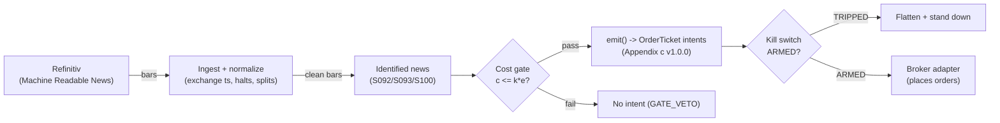

# T060 — Identified-News Drift Portfolio

Multi-day post-earnings/news drift portfolio: identified firm-specific news with extreme sentiment enters a diversified drift book held `2–5` days [example], with no-news drift explicitly excluded. Provenance **C/SI**.

> Tag law: every numeric literal in prose carries one of `[documented]
> [default] [example] [unverified] [internal-est] [measured]` (legend: Appendix
> i v1.0.0). Bibliographic years, volumes, pages, arXiv IDs, section numbers,
> rule codes (C1–C10), fail-safe codes (F1–F5), module IDs, and machine-parsed
> §0 data fields are identifiers, not literals, and are exempt.

## §1 Five-minute reviewer card

| Row | Value |
|---|---|
| Module | T060 — Identified-News Drift Portfolio, v1.0.0 |
| Edge verdict | `INSUFFICIENT-EVIDENCE` — Chan documents the drift, but the cited evidence is before-cost predictability — the portfolio construction and after-cost capture are the builder's problem |
| After-cost | `BEFORE-COST` — one-sentence verdict: post-news drift is one of the better-documented anomalies in the literature, but no cited paper documents after-cost P&L for this diversified drift-book construction |
| Build cost | Tier M+ · `40–100` h [internal-est] · `$6,000–30,000` loaded [internal-est] |
| Data cost | Research `~$2,000–10,000`/mo [unverified]; production `~$2,000–10,000`/mo [unverified] — bands indicative, verify before budgeting |
| latency_class | bar / daily |
| risk_class | medium |
| Capacity | large [example] — diversified multi-day holds |
| Executability | Easy: daily bars + news feed; the portfolio construction is the product |
| Risk summary | Drift decay: the anomaly attenuates as it gets crowded; earnings-week clustering concentrates the book; sentiment sign errors |
| When it dies | drift window compresses; news flow dries up; crowded exits on the same stories |
| Regime gates | Provisional: S100: no-news drift excluded — identified stories only [example] |
| Emits | `order_intents` (Appendix c v1.0.0) — intents only, never orders |

## §1.5 Cheapest / least-build path

1. **Prototype hour band:** `40–100` h [internal-est] — news filter + drift portfolio + holding engine + cost/risk harness + fixture.
2. **Cheapest-source row:** min_tier = Refinitiv MRN (or equivalent) — cheapest data source candidate [internal-est]; latency_class = bar / daily; required_fields = timestamped news text, entity tags, novelty scores; daily bars; price_band = `~$2,000–10,000`/mo [unverified] (indicative — verify before budgeting); build_or_buy = **buy the news feed; build the portfolio — drift capture is position management, not a model**.
3. **Resource budget:** `1` core, `<2` GB RAM [internal-est]; compute pattern `per_bar`.
4. **Skip list:** intraday drift; international news; analyst-revision overlay.
5. **DO-NOT-CUT list:** causality assertions (`assert fill_event > signal_event`, no-signal-bar-fills test); COST block + callable `expected_cost_bps`; F1–F5 fail-safes + module-state enum; kill-switch state machine + re-arm checklist; decision-log audit records; bona-fide-intent + self-trade prevention; provenance tags on every numeric literal; fixtures + `test_cmd`; secrets via env only.
6. **Escalation gate:** upgrade from cheapest when any holds — positions `>50` [default]; holding `>5` days [default].

## §T0 Module contract

### T0.1 Typed signature

```python
def emit(state: ModuleState, signals: list[SignalVector], cfg: Config) -> list[OrderTicket]:
```

`OrderTicket` per Appendix c v1.0.0 — **intents only**; the strategy never
places orders, never holds broker/exchange sessions, never nets intents into
orders. `state` is the module-owned named state vector (`position`,
`sleeve_weights`, `cooldown_until`, `kill_state`, `module_state`); `signals`
are canonical SignalVectors (Appendix b v1.0.0), newest last. The function
handles documented edge cases: empty signals → `UNKNOWN`; halt/auction bars →
freeze per the market-state table; stale inputs → `UNKNOWN` (F4), never
interpolate.

### T0.2 Config dataclass

| Parameter | Type | Default | Range | Status |
|---|---|---|---|---|
| `sent_min` | float | `0.70` | `0.60`–`0.85` | default |
| `hold_days` | int | `3` | `2`–`5` | default |
| `max_pos` | int | `30` | `10`–`50` | default |
| `R_usd` | float | `1,000` | `200`–`5,000` | default |
| `stop_pct` | float | `0.04` | `0.02`–`0.10` | default |
| `cooldown_bars` | int | `1` | `0`–`5` | default |
| `cost_gate_k` | float | `0.5` | `0.1`–`2.0` | default |

All defaults tagged per the tag law (status `default` ⇒ `[default]`).

### T0.3 Canonical schema mapping

Vendor columns → canonical Bar schema (Appendix a v1.0.0), stated once here:

| Vendor (Refinitiv Machine Readable News) | Canonical |
|---|---|
| bar open timestamp | `event_ts` (int64 ns UTC, bar open time) |
| `o/h/l/c`, `v` | `open/high/low/close`, `volume` |
| symbol | `symbol` (exchange-qualified) |
| signal value | `sig` (strategy-defined score, Appendix b `value`) |
| gate flag | `gate` ∈ {0, 1} (confirmation gate) |

### T0.4 Time contract

> Time contract: clock domain UTC, int64 ns; authoritative causality clock =
> `event_ts`; max_skew = `1` ms [default]; jitter budget = `500` µs [default];
> bar-label = open time; staleness TTL = `3`× cadence [default] (F4); gap
> policy = mask, no interpolation; halt/auction → discard contributions
> across reopen.

**Timing box:** `signal@t (per_bar-1d, America/New_York) → earliest fill @open(t+1)`

### T0.5 Market-state table

| State | Module behavior |
|---|---|
| CONTINUOUS_TRADING | Evaluate entries/exits per §T2; emit intents |
| HALTED | Freeze state; emit nothing; `UNKNOWN` on held signals |
| AUCTION | No new entries; exits only via auction-aware intents (MOO/MOC); state `DEGRADED` |
| CLOSED | Emit nothing; state `OFF` |

### T0.6 Module-state enum + error taxonomy

States per Appendix k v1.0.0: `OK | DEGRADED | UNKNOWN | OFF`. Invalid input →
`UNKNOWN`, never interpolate (Appendix f v1.0.0, F1–F5).

| Failure | State | Alert |
|---|---|---|
| Missing/stale input (TTL `3`× cadence [default]) | `UNKNOWN` | page |
| Non-finite / non-positive price reaching module (F2) | `UNKNOWN` | page |
| `event_ts` non-monotonic (F2) | `UNKNOWN` | page |
| Kill-switch TRIPPED | `OFF` (no new intents) | page |
| Halt/auction | `UNKNOWN` / `DEGRADED` (per table) | log |
| Feed anomaly (per §T9 row 1) | `DEGRADED` | notify |
| Anything unmapped | `UNKNOWN` | page |

### T0.7 Risk contract + kill switch

```yaml
risk_contract:
  per_trade_R: `1000`            # [example] — N = floor(R/stop_dist), R = $1,000 per name
  max_adverse_per_trade: `4`% [example]   # [example]
  daily_loss_stop: `-5000` USD [example]          # [example]
  max_gross: `10`M USD [example]                # [example]
  kill_conditions:                        # any one trips -> TRIPPED
  - "news feed stale > 1 day -> TRIPPED"
  - "daily loss <= -$5,000 -> TRIPPED"
  - "book concentration > 20% in one story -> TRIPPED"
  enforcement: intraday-hard              # breach flattens; no review-only mode
```

**Calibration recipe:** `per_trade_R` is the sizing input in §T2 (dollar-risk
`N = ⌊R/stop_dist⌋` or the confidence-scaled equivalent); re-estimate `R`
from the trailing `60`-day [default] per-trade P&L distribution so that a
`3`σ [default] adverse day stays inside `daily_loss_stop`. `max_gross` is
checked pre-emit on every ticket (C4). Kill-switch state machine:

```
ARMED → TRIPPED → RECOVERY → ARMED
```

- `ARMED → TRIPPED`: any kill condition fires → cancel all working intents
  (idempotent cancels), flatten at marketable limits, set module state `OFF`,
  write a `KILL_TRIP` decision record (Appendix g v1.0.0).
- `TRIPPED → RECOVERY`: re-arm checklist **all green** — `1.` feed healthy
  (no stale bars); `2.` decision log reconciled against broker ledger, no
  orphan tickets; `3.` root cause of the trip identified and the offending
  config reverted or re-calibrated; `4.` risk owner sign-off recorded.
- `RECOVERY → ARMED`: one clean evaluation pass over the fixture
  (`test_cmd` green) with no new trip, then resume.

### T0.8 Ops tail

- **Schedule:** daily at close [documented]; owner: event-arb on-call.
- **Health checks:** fixture replay (`test_cmd`) green on deploy; live
  staleness watchdog at `3`× cadence; kill-switch drill monthly [default].
- **Alert table:** page on `UNKNOWN` > `30` s [default], on any kill trip, or
  bounds violation; notify on `DEGRADED`; log on single dropped bars.
- **Resource budget:** `1` vCPU, `2` GB RAM + news feed [internal-est]; state is O(`1`) per symbol.
- **Runbook stub:** `1.` confirm feed; `2.` replay fixture; `3.` if red → set
  `OFF`, page; `4.` reconcile decision log before re-arm; `5.` complete the
  re-arm checklist (§T0.7) before `ARMED`.

### T0.9 Secrets (env-only)

`REFINITIV_API_KEY` via environment only. No secrets in this file, fixtures, or logs
(CI secrets-grep).

### T0.10 May / must-NOT

> **May:** emit `OrderTicket` intents per Appendix c v1.0.0; track intent-side
> state; issue cancel-replace via new tickets. **Must-NOT:** place orders on
> any venue, hold broker/exchange sessions, net intents into orders inside the
> strategy, or treat the intent-side state machine as broker wire truth.

## §T1 Legacy (subsumed by §1)

Legacy §T1 content is the §1 reviewer card above; this header is retained so
section numbering stays frozen.

## §T2 Specification

### Universe

Liquid US large-caps with identified firm-specific news [example]; diversified drift book of `≤30` names [example]; `2–5` day holds [example]; daily bars.

### Entry rule (Boolean — no prose-only conditions)

```
ENTER_LONG  := (sent >= sent_min) AND (identified = TRUE) AND (no_news = FALSE)
               AND (positions < max_pos)
               AND (expected_cost_bps(...) <= cost_gate_k * edge_bps)
ENTER_SHORT := mirror with sent <= -sent_min
FLAT        := otherwise
```

### Exits (with post-exit cooldown)

```
EXIT := (bars_held >= hold_days)      # 3 days [example]
        OR (adverse move > stop_pct)             # 4% [example]
        OR (story fully reversed on update)     # [example]
ON_EXIT: cooldown_until = now + cooldown_bars * bar_ns   # C10
```

### Position sizing (fenced function)

```python
def size_shares(R_usd=1000.0, stop_dist=1.0):  # defaults [default]
    # Dollar-risk sizing per name. [example]
    return int(R_usd // max(stop_dist, 1e-9))
```

### Risk limits

| Limit | Value |
|---|---|
| Per-name risk | `$1,000` [example] |
| Daily loss stop | `−$5,000` [example] |
| Book cap | `30` names [example]; `20`% per-story concentration [example] |

### COST block (single source of truth)

| Component | Value (bps) | Basis |
|---|---|---|
| Spread | `1.50` | [example] — ~2¢ spread + fees on a `$100` stock, per-trade |
| Fees | `1.20` | [example] — commissions |
| Borrow | `0.0` | [default] — reference build long-biased; shorts add C7 locate cost |
| Impact | `0.0` | [example] — flagged; multi-day participation ~2% ADV [example] |
| **Total reference** | `2.70` | [example] |

`fee_schedule_as_of`: `2026-09-01` [unverified] — placeholder; pin the real
venue schedule before production. `side: mixed` [default];
venue/tier/source: XNAS / Refinitiv MRN [example]. `borrow_bps_per_day`: `0.0`
[default] — no borrow in the reference build.

Re-stating cost numbers outside
this block is a validation failure.

```python
def expected_cost_bps(notional, adv_pct, venue, side, urgency) -> float:
    '''Callable cost model — single source of truth (this block).'''
    spread_bps = 1.5   # [example] — ~2¢ spread + fees on a `$100` stock, per-trade
    fee_bps = 1.2         # [example] — commissions
    borrow_bps = 0.0   # [default]
    impact_bps = 0.0   # [example] — flagged; multi-day participation ~2% ADV [example]
    if side == "maker":
        fee_bps = -abs(fee_bps) * 0.5  # rebate proxy [example]
    return spread_bps + fee_bps + borrow_bps + impact_bps
```

### Execution / fill model table

| Aspect | Assumption |
|---|---|
| Latency | Daily; entries at the next close after identification [example] |
| Entries | diversified across stories; `≤30` names [example] |
| Exits | `3`-day hold or 4% adverse |
| Partial fills | Per Appendix c v1.0.0 FIFO |
| Adverse fill | Crowded exits on the same stories widen the exit spread [example] |

### Robustness

Identified-news filter (Boudoukh: identified moves prices, unidentified does not); extreme sentiment `|sent| ≥ 0.70` [example]; `3`-day hold [example] inside the documented `2–5` day drift window [example]; no-news drift explicitly excluded (Chan 2003).

### Compliance sub-block (C1–C10+)

| Code | Rule: trigger → check → action → log |
|---|---|
| C1 | Self-match / STP: every ticket carries self-trade-prevention instructions for the broker adapter; trigger = two tickets same symbol opposite side within `1` s [default] → check resting-interest overlap → action = cancel the newer ticket → log `COMPLIANCE_BLOCK` |
| C2 | Bona-fide intent: every entry intent must pass the cost gate (`expected_cost_bps(...) <= k * edge_bps`) and fit risk limits; trigger = gate fail → check = re-evaluate → action = no ticket emitted → log `GATE_VETO` |
| C3 | Message-rate / cancel-to-trade: trigger = `>50` intents/symbol/min [default] or cancel-to-trade `>10:1` [default] → check venue thresholds → action = throttle to `5`/min [default] + alert → log `COMPLIANCE_BLOCK` |
| C4 | Pre-trade fat-finger trio: price collar `±5`% vs reference [default] → reject; max notional per ticket `$2,000,000` [default] → reject; max `50` tickets/symbol/`5` min [default] → throttle; all rejections logged |
| C5 | Decision-log schema compliance (Appendix g v1.0.0): every intent, veto, cancel-replace, kill transition logged with inputs_hash/params_hash, hash-chained; trigger = missing record → action = halt to `UNKNOWN` |
| C6 | Halt/auction state table: per §T0.5 — HALTED freezes, AUCTION blocks new entries, CLOSED emits nothing; trigger = state change → check market-state table → action = freeze/cancel per table → log |
| C7 | Locate check (short sales): trigger = SHORT intent → check = easy-to-borrow list or live locate obtained pre-emit → action = block intent without locate → log `GATE_VETO`; Reg-SHO threshold securities never shorted |
| C8 | Public-dissemination gate: no signal/intent data published externally without review; trigger = export request → check = review sign-off → action = block until signed |
| C9 | Data-entitlement assertions per dataset (Appendix j v1.0.0): trigger = entitlement-class change or unlicensed symbol → check §T5 data-rights row → action = stand down affected symbols → log |
| C10 | Post-exit cooldown: trigger = exit or compliance block → check `now < cooldown_until` → action = no re-entry until ``1`` bars [default] elapse → log |
| C11 | Concentration cap: one story `>20`% of book [example] → block new entries on it → check concentration → action = cap → log `COMPLIANCE_BLOCK` |

### Parameter table

| Parameter | Symbol | Value | Tag | Sensitivity |
|---|---|---|---|---|
| Sentiment minimum | `sent_min` | `0.70` | [example] | high |
| Hold days | `hold_days` | `3` | [example] | medium |
| Max positions | `max_pos` | `30` | [example] | medium |
| Stop | `stop_pct` | `4`% | [example] | medium |
| Cost-gate k | `cost_gate_k` | `0.5` | [default] | high |

### Timing box

`signal@t (per_bar-1d, America/New_York) → earliest fill @open(t+1)`

## §T3 Math + normative pseudocode

On an identified firm-specific story (S092) with sentiment $|s_t| \ge 0.70$
[example]: enter in the direction of $s_t$ at the next close, hold $3$ days
[example] (inside the documented $2$–$5$-day drift window [example]).
Chan (2003): stocks with public news exhibit post-news drift; no-news
movers reverse — hence the identified-only filter. Book of $\le 30$ names
[example], dollar-risk sized at $\$1{,}000$ per name [example].

**Normative pseudocode** (pseudocode is normative; prose is commentary):

```
function emit(state, signals, cfg) -> list[OrderTicket]:
    assert signals non-empty else return UNKNOWN                    # F1
    for bar t in signals (newest last):
        s = identified-news sentiment s_t, signed                                            # data <= t only
        assert isfinite(s) else return UNKNOWN                      # F2
        edge_bps = abs(s) * 8.0                                   # [example] — modeled per-trade edge in bps
        cost = expected_cost_bps(notional, adv_pct, venue, side, urgency)
        cost_ok = expected_cost_bps(...) <= k * edge_bps
        # ^^^ normative cost-gate predicate: expected_cost_bps(...) <= k * edge_bps
        if state.position is None and state.module_state == OK:
            if ((|s| >= 0.70) and identified and (positions < 30)) and cost_ok:
                ticket = OrderTicket(symbol, side, qty, limit, tif,
                                     ticket_id=uuid(), parent_signal="S092@t",
                                     intent_ts=t.event_ts, state=NEW)
                log_decision(ticket, inputs_hash, params_hash)     # C5 / Appendix g
                assert fill_event > signal_event                    # t->t+1 causality
        else if state.position is not None:
            if ((bars_held >= 3) or (adverse > 4%)):
                emit exit intent (cancel-replace rules, Appendix c) # C1
                state.cooldown_until = t + cooldown_bars            # C10
                assert fill_event > signal_event
    return tickets
```

Causality: every quantity at bar `t` uses only data `≤ t`; the earliest fill
is bar `t+1`'s open. Mandatory unit test: no-signal-bar fills
(`assert fill_event > signal_event`).

## §T4 Worked example (fixture-backed)

- Tape: `modules/fixtures/T060_tape.csv` — `# TYPE: validation-run`;
  `12` bars [example], all numbers synthetic, seed `10060` [example];
  `event_ts` int64 ns UTC, bar-labeled by open time.
- Expected outputs: `modules/fixtures/T060_expected.csv` — per-ticket
  intents with the cost-function call recorded (inputs → bps → $);
  tolerance `1e-6` [default] on floats.
- Acceptance tests (`modules/tests/test_T060.py`, `6` tests):
  `1.` fixture replays to expected (hand-checked rows below); `2.` cost-gate
  predicate passes on the fixture's large edges and blocks a tiny-edge
  counter-case (`k = 0.5` [default]); `3.` no-signal-bar fills
  (`fill_ts > signal_ts` on every ticket); `4.` kill-switch trips on the
  breach scenario and re-arms through the checklist
  (`ARMED → TRIPPED → RECOVERY → ARMED`); `5.` invalid input (non-positive
  price) → `UNKNOWN`, never interpolated; `6.` hand-check literals
  (qty / bps / $) match the generation run.
- `test_cmd`: `python3 -m pytest modules/tests/test_T060.py -q` → exits `0`.

**Cost-function calls on the fixture** (inputs → bps → $, from the harness run):

| ticket | notional ($) | adv_pct | side | edge_bps | cost_bps | cost_$ | gate |
|---|---|---|---|---|---|---|---|
| T-T060-2-0 | 25005.72 | 0.0200 | mixed | 6.2400 | 2.7000 | 6.7515 | PASS |
| T-T060-5-X | 25008.29 | 0.0200 | mixed | 0.0000 | 2.7000 | 6.7522 | N/A |
| T-T060-6-0 | 24998.69 | 0.0200 | mixed | 6.4000 | 2.7000 | 6.7496 | PASS |
| T-T060-9-X | 25003.96 | 0.0200 | mixed | 0.0000 | 2.7000 | 6.7511 | N/A |
| T-T060-10-0 | 24993.46 | 0.0200 | mixed | 6.0000 | 2.7000 | 6.7482 | PASS |

**Where the example is optimistic:** the fixture encodes stories as daily events; production faces story identification error and crowded exits; the drift window is a planning figure from the literature



## §T5 Dependencies & data

Generated-from-`deps.yaml` shape (CI symmetry); hand-listed:

| Module | Role | Version pin |
|---|---|---|
| S092 — Identified news | Trigger | 1.0.0 |
| S093 — News novelty | Feature | 1.0.0 |
| S100 — No-news filter | Exclusion | 1.0.0 |

| Field | Type | Granularity | Source tier | Notes |
|---|---|---|---|---|
| Machine-readable news | text + scores | per story | Tier 2/3 | Refinitiv MRN class |
| Daily OHLCV | float/int | daily | Tier 1 | execution |

**Family note:** family `C` = event-driven / alternative-data strategies.

**Data rights row** (Appendix j v1.0.0): News + US equities daily bars via Refinitiv
Machine Readable News, `rights: licensed`; license scope = research + stated
production symbol count; raw ticks never leave our systems — fixtures are
synthetic; entitlement = professional/internal, no display; retention per
vendor terms, purge path in runbook. Entitlement-class change → §1.5
escalation gate.

## §T6 Local build (M5 Max / 128 GB)

Feasible on the M5 Max (Tier M+, `40–100` h ≈ `$6k–30k` eng + `~$2k–10k`/mo data per notes/cost-model.md §5); daily bars, no latency pressure. Bottleneck is the news feed cost, not compute.

## §T7 Buy vs build

Buy the news feed; build the portfolio — drift capture is position management, not a model. Verdict: the identified-news filter is the product.

## §T8 Efficacy — documented evidence

| Study / source | Market & period | Metric | Before/after cost | Caveat |
|---|---|---|---|---|
| Chan (2003), JFE | US stocks, 1980–2000 | stocks with public news exhibit post-news drift; no-news movers reverse [documented] | `BEFORE-COST` (anomaly evidence) | the drift window is documented; after-cost capture is not |
| Tetlock, Saar-Tsechansky & Macskassy (2008), J. Finance | Firm-specific news | negative words predict earnings and returns [documented] | `BEFORE-COST` (predictability) | supports the sentiment sign |
| Boudoukh et al. (2013) | Identified vs unidentified news | identified firm-specific news moves prices [documented] | `BEFORE-COST` | supports the identified-only filter |

Selection disclosure: these are the sources surfaced by the chapter's research
pass (Stage 160/200). **Honest bottom line.** For a ≤$1M paper operation: T060 trades one of the better-documented anomalies in the literature — but the evidence is before-cost predictability, and the portfolio construction plus after-cost capture are entirely the builder's problem.

## §T9 Failure modes & pitfalls

| # | Trigger → Detect → Action → Recovery | check: |
|---|---|---|
| 1 | Unidentified story: no-news mover → detect: identified flag → action: veto → recovery: next story | `check: identified == TRUE` |
| 2 | Concentration: one story > 20% of book → detect: concentration monitor → action: cap → recovery: diversify | `check: story_weight <= 0.20` |
| 3 | Story reversal on update → detect: sentiment sign change → action: exit → recovery: re-arm | `check: sign(sent) == sign(entry)` |
| 4 | Feed stale > 1 day → detect: staleness monitor → action: TRIP → recovery: re-pin feed | `check: feed_age_days <= 1` |
| 5 | Cost blowup → detect: cost gate fails → action: stand down → recovery: re-pin | `check: expected_cost_bps(...) <= k * edge_bps` |
| 6 | Lookahead: story dated after the fill → detect: causality audit → action: halt → recovery: re-run test | `check: all(fill_ts > signal_ts)` |

## §T10 Source log + unverified leads

**Sources** (citable facts only):

1. Chan, W. S. (2003) [documented]. "Stock Price Reaction to News and No-News: Drift and Reversal After Headlines." *Journal of Financial Economics* 70(2): 223–260. — public-news drift vs no-news reversal; the identified-only filter.
2. Tetlock, P. C., Saar-Tsechansky, M. & Macskassy, S. (2008) [documented]. "More Than Words." *Journal of Finance* 63(3): 1437–1467. — negative words in firm-specific news predict earnings and returns.
3. Boudoukh, J. et al. (2013) [documented]. "Which News Moves Stock Prices? A Textual Analysis." Working paper. — identified firm-specific news moves prices.

**Chatbot source log.** Grok answered Q-TB6-1..3 (2026-09-10); all claims independently verified or labeled unverified.

**Unverified leads** (chatbot-only — never in evidence tables):

- Grok Q-TB6-3: drift-window compression over time (crowding) — chatbot observation, unverified; kept as a monitoring lead.

---

## Appendix — AI build prompt (T060)

Copy-paste into any chat agent:

> Build module **T060 — Identified-News Drift Portfolio** per `notes/module-template.md` v1.0.0
> and this file's §T0 contract.
> Cheapest path (§1.5): prototype `40–100` h [internal-est]; cheapest data
> candidate Refinitiv MRN (or equivalent) [internal-est]; compute pattern `per_bar`; skip
> intraday drift; international news; analyst-revision overlay for now.
> Implement `emit(state, signals, cfg) -> list[OrderTicket]`
> (Appendix c v1.0.0) with the §T3 normative pseudocode, including the
> cost-gate predicate `expected_cost_bps(...) <= k * edge_bps` and
> `assert fill_event > signal_event`. Wire F1–F5 (Appendix f v1.0.0): invalid
> input → `UNKNOWN`, never interpolate. Implement the kill-switch state
> machine `ARMED → TRIPPED → RECOVERY → ARMED` with the §T0.7 re-arm
> checklist. Log decisions per Appendix g v1.0.0. Secrets via env only.
> Run the fixture `modules/fixtures/T060_tape.csv`
> (`# TYPE: validation-run`) against `modules/fixtures/T060_expected.csv`
> (tolerance `1e-6` [default]).
> **Definition of done:** `python3 -m pytest modules/tests/test_T060.py -q`
> exits `0`. Tag every numeric literal you add with the unified enum
> (Appendix i v1.0.0); put anything unverifiable in §T10 unverified leads.
