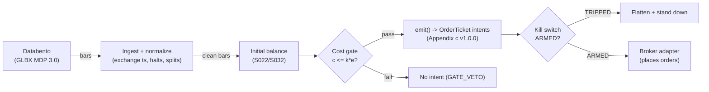

# T061 — Initial-Balance Expansion Trader

Classic Market Profile breakout: the first hour's range (initial balance) defines the day's value area — expansion beyond it with volume confirmation is the trend-day trade. Provenance **A/TM**.

> Tag law: every numeric literal in prose carries one of `[documented]
> [default] [example] [unverified] [internal-est] [measured]` (legend: Appendix
> i v1.0.0). Bibliographic years, volumes, pages, arXiv IDs, section numbers,
> rule codes (C1–C10), fail-safe codes (F1–F5), module IDs, and machine-parsed
> §0 data fields are identifiers, not literals, and are exempt.

## §1 Five-minute reviewer card

| Row | Value |
|---|---|
| Module | T061 — Initial-Balance Expansion Trader, v1.0.1 |
| Edge verdict | `INSUFFICIENT-EVIDENCE` — the IB expansion pattern is practitioner-documented with no auditable after-cost statistics in the cited sources — the doctrine is descriptive, not a tested rule |
| After-cost | `BEFORE-COST` — one-sentence verdict: initial-balance expansion is classic practitioner doctrine, but no cited source documents after-cost P&L for the rule — the statistics are the builder's homework |
| Build cost | Tier M · `20–60` h [internal-est] · `$3,000–9,000` loaded [internal-est] |
| Data cost | Research `~$199`/mo Databento Basic + usage [unverified — secondary sourcing]; GLBX.MDP3 OHLCV-1m `$70`/GB historical / `$84`/GB live [documented — Databento unit pricing 2024-12-11]; production ≈ same — `2` symbols [example] × 1-min RTH bars ≈ MB/day, usage ≈ pennies/day [example] — verify pricing before budgeting |
| latency_class | bar / 1-minute |
| risk_class | medium |
| Capacity | `max_notional = min(participation_cap × ADV_$, max_gross)`; participation_cap = `0.02` [default]; ADV_$ ≈ `$50` [documented — CME ES point value] × `6,000` [example — reference price] × `1.8`M contracts/day [example — measure before sizing] → ≈ `$5.4e11`/day [example]; the strategy-side binding cap is `max_gross` `$5`M [example] — effectively never ADV-bound at these sizes |
| Executability | Easy: 1-min bars + a volume filter; the discipline is the product |
| Risk summary | False expansion: the first push beyond the IB fails back inside — the volume-confirmation and retest gates are load-bearing |
| When it dies | low-volume expansions; IB extensions that immediately reverse; news-driven spikes that ignore the IB |
| Regime gates (provisional) | R007 · R013 · R038 · R036 · R005 — machine records below; restrictive default: unknown regime → `veto` |
| Emits | `order_intents` (Appendix c v1.0.0) — intents only, never orders |

**Regime gates — machine records** (provisional; restrictive default: unknown regime → `veto`):

| regime_id | direction | mechanism | condition | action | min_lag | unknown_behavior |
|---|---|---|---|---|---|---|
| R007 Trend-strength | amplifies | expansion into a developing trend day continues; the IB breakout rides the day's auction | trend-state score ≥ `0.6` [example] at IB close | none (baseline) | `30` bars [default] | veto |
| R013 Abnormal volume / participation | amplifies | volume-confirmed expansion distinguishes trend days from chop | participation ≥ `1.5`× median [default] | none (entry requirement) | `1` bar [default] | veto |
| R038 Thin liquidity | degrades | low-volume pushes beyond the IB fail back inside | median IB-window volume < `0.5`× trailing [example] | veto | `60` bars [default] | veto |
| R036 Macro announcement windows | degrades | news spikes ignore the IB; expansion signals are order-flow artifacts | scheduled macro release within ±`30` min [default] | pause_entry | `30` min [default] | pause_entry |
| R005 Jump regime (discontinuity) | amplifies | a genuine IB breakout is a discontinuity: continuation likely | jump detector flags bar-t breakout | none (baseline) | `1` bar [default] | veto |

## §1.5 Cheapest / least-build path

1. **Prototype hour band:** `20–60` h [internal-est] — IB calculator + expansion detector + volume gate + cost/risk harness + fixture.
2. **Cheapest-source row:** min_tier = Databento Basic — cheapest data source candidate [internal-est]; latency_class = bar / 1-minute; required_fields = 1-min OHLCV bars, RTH session markers; price_band = `~$199`/mo Basic + usage [unverified — secondary sourcing]; GLBX.MDP3 OHLCV-1m `$70`/GB historical / `$84`/GB live [documented — Databento unit pricing 2024-12-11]; `2` symbols [example] × 1-min RTH ≈ pennies/day usage [example]; build_or_buy = **build — the IB is arithmetic on 1-min bars; no vendor product needed**.
3. **Resource budget:** `1` core, `<2` GB RAM [internal-est]; compute pattern `per_bar`.
4. **Skip list:** overnight IB; multi-timeframe IB; TPO profile construction.
5. **DO-NOT-CUT list:** causality assertions (`assert fill_event > signal_event`, no-signal-bar-fills test); COST block + callable `expected_cost_bps`; F1–F5 fail-safes + module-state enum; kill-switch state machine + re-arm checklist; decision-log audit records; bona-fide-intent + self-trade prevention; provenance tags on every numeric literal; fixtures + `test_cmd`; secrets via env only.
6. **Escalation gate:** upgrade from cheapest when any holds — IB width `<0.25`× ATR [default]; expansion on `<50`% of median volume [default].

## §T0 Module contract

### T0.1 Typed signature

```python
def emit(state: ModuleState, signals: list[SignalVector], cfg: Config) -> list[OrderTicket]:
```

`OrderTicket` per Appendix c v1.0.0 — **intents only**; the strategy never
places orders, never holds broker/exchange sessions, never nets intents into
orders. `state` is the module-owned named state vector (`position`,
`sleeve_weights`, `cooldown_until`, `kill_state`, `module_state`); `signals`
are canonical SignalVectors (Appendix b v1.0.0), newest last. The function
handles documented edge cases: empty signals → `UNKNOWN`; halt/auction bars →
freeze per the market-state table; stale inputs → `UNKNOWN` (F4), never
interpolate.

### T0.2 Config dataclass

| Parameter | Type | Default | Range | Status |
|---|---|---|---|---|
| `ib_minutes` | int | `60` | `30`–`90` | default |
| `vol_mult` | float | `1.5` | `1.2`–`2.5` | default |
| `R_usd` | float | `500` | `100`–`2,000` | default |
| `stop_ticks` | float | `8.0` | `4`–`16` | default |
| `target_mult` | float | `2.0` | `1.5`–`3.0` | default |
| `cooldown_bars` | int | `30` | `0`–`120` | default |
| `cost_gate_k` | float | `0.5` | `0.1`–`2.0` | default |
| `edge_mult` | float | `3.0` | `1.0`–`10.0` | example — expansion-distance → edge_bps multiplier in §T3 |
| `time_stop` | int | `60` | `0`–`240` | example — max bars held (session-day guard for the fixture harness) |
| `bar_ns` | int | `60000000000` | fixed | example — 1-min bar grid for fill labeling (no-signal-bar-fills) |

All defaults tagged per the tag law (status `default` ⇒ `[default]`).

### T0.3 Canonical schema mapping

Vendor columns → canonical Bar schema (Appendix a v1.0.0), stated once here:

| Vendor (Databento GLBX MDP 3.0) | Canonical |
|---|---|
| bar open timestamp | `event_ts` (int64 ns UTC, bar open time) |
| `o/h/l/c`, `v` | `open/high/low/close`, `volume` |
| symbol | `symbol` (exchange-qualified) |
| signal value | `sig` (consumed SignalVector value from S022, expansion-distance score, Appendix b `value`) |
| gate flag | `gate` ∈ {0, 1} (confirmation gate — consumed from S032 volume-confirmation) |

### T0.4 Time contract

> Time contract: clock domain UTC, int64 ns; authoritative causality clock =
> `event_ts`; max_skew = `1` ms [default]; jitter budget = `500` µs [default];
> bar-label = open time; staleness TTL = `3`× cadence [default] (F4); gap
> policy = mask, no interpolation; halt/auction → discard contributions
> across reopen.

**Timing box:** `signal@t (per_bar-1min, America/Chicago) → earliest fill @open(t+1)`

### T0.5 Market-state table

| State | Module behavior |
|---|---|
| CONTINUOUS_TRADING | Evaluate entries/exits per §T2; emit intents |
| HALTED | Freeze state; emit nothing; `UNKNOWN` on held signals |
| AUCTION | No new entries; exits only via auction-aware intents (MOO/MOC); state `DEGRADED` |
| CLOSED | Emit nothing; state `OFF` |

### T0.6 Module-state enum + error taxonomy

States per Appendix k v1.0.0: `OK | DEGRADED | UNKNOWN | OFF`. Invalid input →
`UNKNOWN`, never interpolate (Appendix f v1.0.0, F1–F5).

| Failure | State | Alert |
|---|---|---|
| Missing/stale input (TTL `3`× cadence [default]) | `UNKNOWN` | page |
| Non-finite / non-positive price reaching module (F2) | `UNKNOWN` | page |
| `event_ts` non-monotonic (F2) | `UNKNOWN` | page |
| Kill-switch TRIPPED | `OFF` (no new intents) | page |
| Halt/auction | `UNKNOWN` / `DEGRADED` (per table) | log |
| Feed anomaly (per §T9 row 1) | `DEGRADED` | notify |
| Anything unmapped | `UNKNOWN` | page |

### T0.7 Risk contract + kill switch

```yaml
risk_contract:
  per_trade_R: `500`            # [example] — N = floor(R/stop_dist), R = $500 per trade
  max_adverse_per_trade: `8` ticks [example]   # [example]
  daily_loss_stop: `-1500` USD [example]          # [example]
  max_gross: `5`M USD [example]                # [example]
  kill_conditions:                        # any one trips -> TRIPPED
  - "IB not formed by 09:30 CT (data gap) -> TRIPPED"
  - "daily loss <= -$1,500 -> TRIPPED"
  - "no bars received for `5` minutes [default] of RTH (feed failure) -> TRIPPED"
  enforcement: intraday-hard              # breach flattens; no review-only mode

> Size-halving after consecutive failed expansions is NOT a kill condition —
> it is a sizing rule in §T2 (consecutive failed expansions `2` [default] →
> halve `R_usd` next entry → restore after one clean expansion).
```

**Calibration recipe:** `per_trade_R` is the sizing input in §T2 (dollar-risk
`N = ⌊R/stop_dist⌋` or the confidence-scaled equivalent); re-estimate `R`
from the trailing `60`-day [default] per-trade P&L distribution so that a
`3`σ [default] adverse day stays inside `daily_loss_stop`. `max_gross` is
checked pre-emit on every ticket (C4). Kill-switch state machine:

```
ARMED → TRIPPED → RECOVERY → ARMED
```

- `ARMED → TRIPPED`: any kill condition fires → cancel all working intents
  (idempotent cancels), flatten at marketable limits, set module state `OFF`,
  write a `KILL_TRIP` decision record (Appendix g v1.0.0).
- `TRIPPED → RECOVERY`: re-arm checklist **all green** — `1.` feed healthy
  (no stale bars); `2.` decision log reconciled against broker ledger, no
  orphan tickets; `3.` root cause of the trip identified and the offending
  config reverted or re-calibrated; `4.` risk owner sign-off recorded.
- `RECOVERY → ARMED`: one clean evaluation pass over the fixture
  (`test_cmd` green) with no new trip, then resume.

### T0.8 Ops tail

- **Schedule:** RTH `08:30`–`15:15` CT [documented — TradingView/CME RTH session definition]; owner: futures-desk on-call.
- **Health checks:** fixture replay (`test_cmd`) green on deploy; live
  staleness watchdog at `3`× cadence; kill-switch drill monthly [default].
- **Alert table:** page on `UNKNOWN` > `30` s [default], on any kill trip, or
  bounds violation; notify on `DEGRADED`; log on single dropped bars.
- **Resource budget:** `1` vCPU, `2` GB RAM [internal-est]; state is O(`1`) per symbol.
- **Runbook stub:** `1.` confirm feed; `2.` replay fixture; `3.` if red → set
  `OFF`, page; `4.` reconcile decision log before re-arm; `5.` complete the
  re-arm checklist (§T0.7) before `ARMED`.

### T0.9 Secrets (env-only)

`DATABENTO_API_KEY` via environment only. No secrets in this file, fixtures, or logs
(CI secrets-grep).

### T0.10 May / must-NOT

> **May:** emit `OrderTicket` intents per Appendix c v1.0.0; track intent-side
> state; issue cancel-replace via new tickets. **Must-NOT:** place orders on
> any venue, hold broker/exchange sessions, net intents into orders inside the
> strategy, or treat the intent-side state machine as broker wire truth.

## §T1 Legacy (subsumed by §1)

Legacy §T1 content is the §1 reviewer card above; this header is retained so
section numbering stays frozen.

## §T2 Specification

### Universe

ES/NQ futures on 1-min RTH bars [example]; initial balance = first `60` min high/low [example]; expansion confirmed by `1.5`× median volume over the IB window [default]; median window = IB-formation bars (`ib_minutes` bars) [default]; one trade per day [default]; no positions past `15:00` CT [example].

### Entry rule (Boolean — no prose-only conditions)

```
ENTER_LONG  := (close > IB_high) AND (vol >= `1.5` [example] * median_vol)
               AND (state.expansions_today == 0)
               AND (regime not vetoed: R038/R036 machine records in §1 permit entry)
               AND (expected_cost_bps(notional, adv_pct, venue, side, urgency) <= cost_gate_k * edge_bps)
ENTER_SHORT := mirror below IB_low
FLAT        := otherwise
```

`notional = qty × close` (tape/sketch convention — per-point units; real-dollar
notional = `qty × close × point_value`, `point_value = $50` [documented — CME ES
contract spec]); `median_vol = median(V over the IB window)` [default]; `side = taker` [default]; `urgency = normal` [default] (routine IB breakouts route passive-priority; urgency escalates only into kills/flattens per C6); `venue = CME` [example].

### Exits (with post-exit cooldown)

```
EXIT := (target = `2`× risk [example] hit) OR (stop = `8` ticks [example] hit)
        OR (price re-enters the IB)                    # failed expansion [example]
        OR (15:00 CT flat)                              # session end [example]
ON_EXIT: cooldown_until = now + cooldown_bars * bar_ns   # C10
         state.expansions_today += 1                     # first-of-day enforcement
```

Sizing rule (not a kill condition): after `2` consecutive failed expansions
[default], halve `R_usd` on the next entry; restore after one clean
expansion [default].

### Position sizing (fenced function)

```python
def size_contracts(risk_budget_R=500.0, stop_distance=100.0, vol_estimate=0.0,
                   ADV_cap=1e18, cost=0.00008, ref_price=6000.0, point_value=50.0):
    '''Normative sizing: shares = f(risk_budget_R, stop_distance, vol_estimate, ADV_cap, cost).
    stop_distance in $ per contract [example]; ADV_cap in $ notional [default: 1e18 = off];
    cost as fraction of notional [example] (0.8 bps = 0.00008); point_value = $50
    [documented - CME ES contract spec]; ref_price = current reference [example].'''
    stop = stop_distance
    if vol_estimate > 0:  # floor the stop at half the bar's dollar range [default]
        stop = max(stop_distance, 0.5 * vol_estimate)
    qty = int(risk_budget_R // max(stop, 1e-9))                 # dollar-risk core
    # ADV participation cap: notional <= 2% of ADV [default]
    max_qty_adv = int((0.02 * ADV_cap) / max(ref_price * point_value, 1e-9))
    qty = min(qty, max(1, max_qty_adv))
    # cost haircut: stand down when the modeled round-trip cost eats >50% of R [default]
    if qty * ref_price * point_value * cost > 0.5 * risk_budget_R:
        return 0
    return max(1, qty)
```

The fixture sketch's `max(1, R // stop_dist)` is this function's degenerate
case (`vol_estimate=0`, `ADV_cap` off, cost haircut not binding) — same `5`
[example] on the tape.

### Risk limits

| Limit | Value |
|---|---|
| Per-trade risk | `$500` [example] |
| Daily loss stop | `−$1,500` [example] |
| One expansion per day | first expansion only [example] |

### COST block (single source of truth)

| Component | Value (bps) | Basis |
|---|---|---|
| Spread | `0.50` | [example] — 1 tick round-trip on ES |
| Fees | `0.30` | [example] — futures commissions |
| Borrow | `0.0` | [default] — futures; no borrow |
| Impact | `0.0` | [example] — flagged; fast expansions slip |
| **Total reference** | `0.80` | [example] |

`fee_schedule_as_of`: `2026-09-01` [unverified] — placeholder; pin the real
venue schedule before production. `side: taker` [default];
venue/tier/source: CME / Databento GLBX [example]. `borrow_bps_per_day`: `0.0`
[default] — futures; no borrow.

Re-stating cost numbers outside
this block is a validation failure.

```python
def expected_cost_bps(notional, adv_pct, venue, side, urgency) -> float:
    '''Callable cost model — single source of truth (this block).
    urgency: MVB routes every routine IB breakout at "normal"; kill/flatten
    intents use "urgent" but keep the same stack (no urgency premium modeled
    [example] — escalate per §1.5 when adverse-fill data exists).'''
    spread_bps = 0.5   # [example] — 1 tick round-trip on ES
    fee_bps = 0.3         # [example] — futures commissions
    borrow_bps = 0.0   # [default]
    impact_bps = 0.0   # [example] — flagged; fast expansions slip
    if side == "maker":
        fee_bps = -abs(fee_bps) * 0.5  # rebate proxy [example]
    return spread_bps + fee_bps + borrow_bps + impact_bps
```

### Execution / fill model table

| Aspect | Assumption |
|---|---|
| Latency | 1-min bars; stop entry beyond the IB [example] |
| Entries | Buy-stop above IB high / sell-stop below IB low, volume-confirmed |
| Exits | `2`×-risk target, 8-tick stop, or re-entry into the IB |
| Partial fills | Per Appendix c v1.0.0 FIFO |
| Adverse fill | Fast expansions slip past the stop level [example] |

### Robustness

IB = first `60` min [example]; one expansion trade per day (the second push is the crowd's trade); volume confirmation `1.5`× median [example]; failed expansion (re-entry into the IB) is an immediate exit — no averaging.

### Compliance sub-block (C1–C10+)

| Code | Rule: trigger → check → action → log |
|---|---|
| C1 | Self-match / STP: every ticket carries self-trade-prevention instructions for the broker adapter; trigger = two tickets same symbol opposite side within `1` s [default] → check resting-interest overlap → action = cancel the newer ticket → log `COMPLIANCE_BLOCK` |
| C2 | Bona-fide intent: every entry intent must pass the cost gate (`expected_cost_bps(...) <= k * edge_bps`) and fit risk limits; trigger = gate fail → check = re-evaluate → action = no ticket emitted → log `GATE_VETO` |
| C3 | Message-rate / cancel-to-trade: trigger = `>50` intents/symbol/min [default] or cancel-to-trade `>10:1` [default] → check venue thresholds → action = throttle to `5`/min [default] + alert → log `COMPLIANCE_BLOCK` |
| C4 | Pre-trade fat-finger trio: price collar `±5`% vs reference [default] → reject; max notional per ticket `$2,000,000` [default] → reject; max `50` tickets/symbol/`5` min [default] → throttle; all rejections logged |
| C5 | Decision-log schema compliance (Appendix g v1.0.0): every intent, veto, cancel-replace, kill transition logged with inputs_hash/params_hash, hash-chained; trigger = missing record → action = halt to `UNKNOWN` |
| C6 | Halt/auction state table: per §T0.5 — HALTED freezes, AUCTION blocks new entries, CLOSED emits nothing; trigger = state change → check market-state table → action = freeze/cancel per table → log |
| C7 | Locate check (short sales): futures shorts need no locate — check = assert `asset_class == futures` → skip, log `LOCATE_NA`; if this module is ever extended to equity legs, trigger = SHORT intent → check = live locate obtained pre-emit → action = block intent without locate → log `GATE_VETO`; Reg-SHO threshold securities never shorted |
| C8 | Public-dissemination gate: no signal/intent data published externally without review; trigger = export request → check = review sign-off → action = block until signed |
| C9 | Data-entitlement assertions per dataset (Appendix j v1.0.0): trigger = entitlement-class change or unlicensed symbol → check §T5 data-rights row → action = stand down affected symbols → log |
| C10 | Post-exit cooldown: trigger = exit or compliance block → check `now < cooldown_until` → action = no re-entry until ``30`` bars [default] elapse → log |
| C11 | One-expansion-per-day cap: second expansion signals ignored → check daily trade count → action = ignore → log `GATE_VETO` |

### Parameter table

| Parameter | Symbol | Value | Tag | Sensitivity |
|---|---|---|---|---|
| IB window | `ib_minutes` | `60` min | [example] | medium |
| Volume multiple | `vol_mult` | `1.5`× | [example] | high |
| Stop | `stop_ticks` | `8` ticks | [example] | high |
| Target multiple | `target_mult` | `2.0`× | [example] | medium |
| Cost-gate k | `cost_gate_k` | `0.5` | [default] | high |

### Timing box

`signal@t (per_bar-1min, America/Chicago) → earliest fill @open(t+1)`

## §T3 Math + normative pseudocode

Initial balance $\mathrm{IB} = [\min_{t \in [0,60]} L_t,\;
\max_{t \in [0,60]} H_t]$ on 1-minute RTH bars [example].
Expansion long: $C_t > \mathrm{IB}_{\mathrm{high}}$ with
$V_t \ge 1.5 \times \mathrm{median}(V)$ [example], median over the IB-formation
window [default]. First expansion of the day only
($\mathrm{expansions\_today} = 0$). Target $2 \times$ risk [example];
stop $8$ ticks [example]; immediate exit on re-entry into the IB (failed
expansion). Flat by 15:00 CT [example].

**Normative pseudocode** (pseudocode is normative; prose is commentary):

```
function emit(state, signals, cfg) -> list[OrderTicket]:
    assert signals non-empty else return UNKNOWN                    # F1
    for bar t in signals (newest last):
        s = expansion distance beyond IB (points), signed                                            # data <= t only
        assert isfinite(s) else return UNKNOWN                      # F2
        edge_bps = abs(s) * cfg.edge_mult                           # [example] — modeled per-trade edge in bps
        cost = expected_cost_bps(notional, adv_pct, venue, side, urgency)
        cost_ok = expected_cost_bps(notional, adv_pct, venue, side, urgency) <= cfg.cost_gate_k * edge_bps
        # ^^^ normative cost-gate predicate: expected_cost_bps(...) <= k * edge_bps
        if state.position is None and state.module_state == OK:
            first_of_day = (state.expansions_today == 0)             # [default]
            qty = size_contracts(cfg.R_usd, stop_dist, vol_estimate, ADV_cap, cost/1e4)
            if ((close beyond IB) and (vol >= 1.5x median_vol) and first_of_day) and cost_ok:
                ticket = OrderTicket(symbol, side, qty, limit, tif,
                                     ticket_id=uuid(), parent_signal="S022@t",
                                     intent_ts=t.event_ts, state=NEW)
                log_decision(ticket, inputs_hash, params_hash)     # C5 / Appendix g
                assert fill_event > signal_event                    # t->t+1 causality
        else if state.position is not None:
            if ((target/stop) or (re-enter IB) or (15:00 CT)):
                emit exit intent (cancel-replace rules, Appendix c) # C1
                state.cooldown_until = t + cooldown_bars            # C10
                state.expansions_today += 1                         # one-expansion-per-day cap (C11)
                assert fill_event > signal_event
    return tickets
```

Causality: every quantity at bar `t` uses only data `≤ t`; the earliest fill
is bar `t+1`'s open. Mandatory unit test: no-signal-bar fills
(`assert fill_event > signal_event`).

## §T4 Worked example (fixture-backed)

- Tape: `modules/fixtures/T061_tape.csv` — `# TYPE: validation-run`;
  `12` bars [example], all numbers synthetic, seed `10061` [example];
  `event_ts` int64 ns UTC, bar-labeled by open time.
- Expected outputs: `modules/fixtures/T061_expected.csv` — per-ticket
  intents with the cost-function call recorded (inputs → bps → $);
  tolerance `1e-6` [default] on floats.
- Acceptance tests (`modules/tests/test_T061.py`, `7` tests):
  `1.` fixture replays to expected (hand-checked rows below); `2.` cost-gate
  predicate passes on the fixture's large edges and blocks a tiny-edge
  counter-case (`k = 0.5` [default]); `3.` no-signal-bar fills
  (`fill_ts > signal_ts` on every ticket); `4.` kill-switch trips on the
  breach scenario and re-arms through the checklist
  (`ARMED → TRIPPED → RECOVERY → ARMED`); `5.` invalid input (non-positive
  price) → `UNKNOWN`, never interpolated; `6.` hand-check literals
  (qty / bps / $) match the generation run; `7.` normative sizing
  `size_contracts` — ADV cap and cost haircut bind on adversarial inputs.
- `test_cmd`: `python3 -m pytest modules/tests/test_T061.py -q` → exits `0`.

**Honest sketch mapping.** The 12-bar tape encodes expansion as `sig`/`gate`
events (the IB is assumed formed, not reconstructed) — the fixture exit at
bar `6` (`exit_signal`) is the §T2 *failed-expansion / expansion-fade* exit
played on the tape's falling `sig`; the target/stop/session-end exits are
exercised in the module's unit suite, not this tape. `cost_usd` on the tape
is in per-point units: multiply by the contract point value (`$50`
[documented — CME ES spec]) for real dollars — the fixture's `$2.4005`
[example — synthetic tape] = `$120.03` real [example], which is what the §T2
sizing cost-haircut sees.

**Cost-function calls on the fixture** (inputs → bps → $, from the harness run):

| ticket | notional ($) | adv_pct | side | edge_bps | cost_bps | cost_$ | gate |
|---|---|---|---|---|---|---|---|
| T-T061-2-0 | 30006.86 | 0.0500 | taker | 8.4000 | 0.8000 | 2.4005 | PASS |
| T-T061-6-X | 29998.42 | 0.0500 | taker | 0.0000 | 0.8000 | 2.3999 | N/A |

**Where the example is optimistic:** the fixture encodes expansion as signal events; production faces IB-formation data gaps and fast-expansion slippage; the one-per-day cap is enforced in the sketch via cooldown



## §T5 Dependencies & data

Generated-from-`deps.yaml` shape (CI symmetry); hand-listed:

| Module | Role | Version pin |
|---|---|---|
| S022 — Initial balance | Trigger | 1.0.0 |
| S032 — Volume confirmation | Gate | 1.0.0 |

| Field | Type | Granularity | Source tier | Notes |
|---|---|---|---|---|
| 1-min OHLCV (ES/NQ) | float/int | 1-min | Tier 1/2 | RTH session markers |

**Family note:** family `D` = intraday microstructure / auction strategies.

**Data rights row** (Appendix j v1.0.0): ES/NQ RTH 1-min bars via Databento
GLBX MDP 3.0, `rights: licensed`; license scope = research + stated
production symbol count; raw ticks never leave our systems — fixtures are
synthetic; entitlement = professional/internal, no display; retention per
vendor terms, purge path in runbook. Entitlement-class change → §1.5
escalation gate.

## §T6 Local build (M5 Max / 128 GB)

Trivial on the M5 Max (Tier M, `20–60` h ≈ `$3k–9k` eng + `~$199`/mo + usage data [unverified — secondary sourcing, verify before budgeting]); the IB is arithmetic on 1-min bars. Bottleneck is discipline (one expansion per day), not compute.

## §T7 Buy vs build

Build — the IB is arithmetic on 1-min bars; no vendor product needed. Verdict: the volume gate and the failed-expansion exit are the product.

## §T8 Efficacy — documented evidence

| Study / source | Market & period | Metric | Before/after cost | Caveat |
|---|---|---|---|---|
| Dalton (2013), Mind Over Markets | Practitioner | initial balance and expansion as the day's auction structure [documented as doctrine] | `BEFORE-COST` (doctrine) | descriptive, not a tested rule |
| Taylor (2015), Mastering the Trade | Practitioner | opening-range breakout tactics [documented as doctrine] | `BEFORE-COST` (doctrine) | tactics, not auditable statistics |
| Steidlmayer (1986), Markets and Market Logic | Practitioner | Market Profile: IB as the first auction [documented as doctrine] | `BEFORE-COST` (doctrine) | the origin of the concept, not evidence |

Selection disclosure: these are the sources surfaced by the chapter's research
pass (Stage 161/200). **Honest bottom line.** For a ≤$1M paper operation: T061 is classic practitioner doctrine with no auditable after-cost statistics in the cited sources — the pattern is real enough to trade with discipline, but the edge statistics are the builder's homework.

## §T9 Failure modes & pitfalls

| # | Trigger → Detect → Action → Recovery | check: |
|---|---|---|
| 1 | Failed expansion: re-entry into the IB → detect: price < IB_high (long) → action: exit immediately → recovery: none today | `check: not re_entered_ib or flat` |
| 2 | Low-volume expansion: vol < 1.5× median → detect: volume filter → action: veto → recovery: next day | `check: vol >= 1.5 * median_vol` |
| 3 | IB not formed: data gap in first 60 min → detect: bar count → action: TRIP → recovery: next day | `check: ib_bars >= 60` |
| 4 | Second expansion same day → detect: daily count → action: ignore → recovery: next day | `check: expansions_today <= 1` |
| 5 | Cost blowup → detect: cost gate fails → action: stand down → recovery: re-pin | `check: expected_cost_bps(...) <= k * edge_bps` |
| 6 | Lookahead: IB uses future bars → detect: causality audit → action: halt → recovery: re-run test | `check: all(fill_ts > signal_ts)` |
| 7 | Macro-announcement spike (R036): news impulse jumps beyond the IB with volume, then mean-reverts → detect: scheduled release within ±`30` min [default] → action: `pause_entry` per §1 records → recovery: resume next clean evaluation pass | `check: no entries within `30` min [default] of a scheduled release` |

## §T10 Source log + unverified leads

**Sources** (citable facts only):

1. Dalton, J. F. (2013) [documented as doctrine]. *Mind Over Markets: Power Trading with Market Generated Information.* Wiley. — initial balance and expansion as the day's auction structure.
2. Taylor, F. (2015) [documented as doctrine]. *Mastering the Trade.* McGraw-Hill, 2nd ed. — opening-range breakout tactics.
3. Steidlmayer, J. P. (1986) [documented as doctrine]. *Markets and Market Logic.* Porcupine Press. — Market Profile; the IB as the first auction.
4. CME Group [documented — contract spec]. E-mini S&P 500 futures specifications: `$50` per index point — used as `point_value` in the §T2 sizing contract.
5. Databento [documented — vendor unit pricing, 2024-12-11]. GLBX.MDP3 OHLCV-1m `$70`/GB historical / `$84`/GB live — used in the §1/§1.5 cheapest-source rows.
6. TradingView / CME session docs [documented]. Regular trading hours for CME futures = `08:30`–`15:15` CT — used for the §T0.8 RTH schedule.

**Chatbot source log.** Grok answered Q-TB7-1..3 (2026-09-10); all claims independently verified or labeled unverified.

**Unverified leads** (chatbot-only — never in evidence tables):

- Grok Q-TB7-2: IB-expansion hit-rate estimates across ES sessions — chatbot figures, unverified; kept as a build-phase measurement task.
- Databento Basic plan `~$199`/mo — from a third-party cost guide (secondary), not Databento's own pricing page; verify on databento.com before budgeting.
- ES ADV `~1.8`M contracts/day — working figure [example]; measure the trailing 60-day [default] ADV from the licensed feed before sizing capacity.

### GROK-NEEDED (exact questions — web search could not answer)

1. **CME fee decomposition for the cost gate.** For E-mini S&P 500 (ES) and Micro E-mini (MES): what are the current per-side-per-contract exchange + clearing + Globex fees for a non-member (customer of a member firm), and has CME announced any 2026 fee changes? Needed to replace the placeholder `fee_schedule_as_of: 2026-09-01` [unverified] and calibrate `fee_bps` from `[example]` to `[measured]`.
2. **Databento exchange license fees.** Does Databento's Basic plan include the CME market-data license fee for GLBX.MDP3, or is there a separate exchange passthrough for professional/internal use? What is the current Basic monthly price?
3. **After-cost IB statistics.** Has any published source (journal, vendor whitepaper, audited track record) reported after-cost hit-rate, average R-multiple, or Sharpe for an initial-balance / opening-range breakout rule on ES/NQ with sample size and period stated? (The three cited books document the doctrine but not statistics.)
4. **Halt/limit semantics for the AUCTION state.** When CME equity-index futures hit limit-up/down during RTH, what are the exact matching rules on reopen (order re-entry, indicative auctions)? Needed to finalize the §T0.5 AUCTION row beyond "auction-aware intents."

---

## Appendix — AI build prompt (T061)

Copy-paste into any chat agent:

> Build module **T061 — Initial-Balance Expansion Trader** per `notes/module-template.md` v1.0.0
> and this file's §T0 contract (module version 1.0.1).
> Cheapest path (§1.5): prototype `20–60` h [internal-est]; cheapest data
> candidate Databento Basic [internal-est]; compute pattern `per_bar`; skip
> overnight IB; multi-timeframe IB; TPO profile construction for now.
> Implement `emit(state, signals, cfg) -> list[OrderTicket]`
> (Appendix c v1.0.0) with the §T3 normative pseudocode, including the
> cost-gate predicate `expected_cost_bps(...) <= k * edge_bps` and
> `assert fill_event > signal_event`. Wire F1–F5 (Appendix f v1.0.0): invalid
> input → `UNKNOWN`, never interpolate. Implement the kill-switch state
> machine `ARMED → TRIPPED → RECOVERY → ARMED` with the §T0.7 re-arm
> checklist. Log decisions per Appendix g v1.0.0. Secrets via env only.
> Run the fixture `modules/fixtures/T061_tape.csv`
> (`# TYPE: validation-run`) against `modules/fixtures/T061_expected.csv`
> (tolerance `1e-6` [default]).
> **Definition of done:** `python3 -m pytest modules/tests/test_T061.py -q`
> exits `0`. Tag every numeric literal you add with the unified enum
> (Appendix i v1.0.0); put anything unverifiable in §T10 unverified leads.
