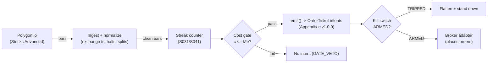

# T062 — Streak Runner with Exhaustion Flip

Rides consecutive same-direction closes (the streak) and flips at the first exhaustion print — momentum entry, reversal exit, all on 1-min bars. Provenance **A/TM**.

> Tag law: every numeric literal in prose carries one of `[documented]
> [default] [example] [unverified] [internal-est] [measured]` (legend: Appendix
> i v1.0.0). Bibliographic years, volumes, pages, arXiv IDs, section numbers,
> rule codes (C1–C10), fail-safe codes (F1–F5), module IDs, and machine-parsed
> §0 data fields are identifiers, not literals, and are exempt.

## §1 Five-minute reviewer card

| Row | Value |
|---|---|
| Module | T062 — Streak Runner with Exhaustion Flip, v1.1.0 |
| Edge verdict | `INSUFFICIENT-EVIDENCE` — streak continuation is practitioner-documented; the cited academic evidence covers intraday momentum/reversal generally, not the streak-count rule after costs |
| After-cost | `BEFORE-COST` — one-sentence verdict: streak-riding is classic tape-reading, but the cited evidence is general intraday momentum/reversal — the streak-count rule has no documented after-cost edge |
| Build cost | Tier M · `20–60` h [internal-est] · `$3,000–9,000` loaded [internal-est] |
| Data cost | Research `~$199`/mo [documented]; production `~$199`/mo [documented] — Polygon (Massive) Stocks Advanced, verified on the Massive pricing page 2026-09-10; exchange professional/internal entitlements beyond the plan not verified — confirm before budgeting |
| latency_class | bar / 1-minute |
| risk_class | medium |
| Capacity | moderate [example] — 1-min bars, liquid names |
| Executability | Easy: 1-min bars + streak counter; the flip discipline is the product |
| Risk summary | Streaks end without warning — the exhaustion print is often the fill; late entries chase the tail |
| When it dies | choppy two-sided tape (no streaks form); exhaustion prints that are actually continuation |
| Regime gates | Provisional machine records in §T5: R007 trend-strength (amplifies), R009 momentum/MR dominance (amplifies when momentum-dominant, degrades/veto when MR-dominant), R008 range compression (degrades — pause entry), R038 thin liquidity (degrades — halve), R005 jumps (degrades — pause entry on false exhaustion) |
| Emits | `order_intents` (Appendix c v1.0.0) — intents only, never orders |

## §1.5 Cheapest / least-build path

1. **Prototype hour band:** `20–60` h [internal-est] — streak counter + exhaustion detector + flip engine + cost/risk harness + fixture.
2. **Cheapest-source row:** min_tier = Polygon.io (Massive) Stocks Advanced — cheapest production-capable source for real-time 1-min bars [internal-est]; latency_class = bar / 1-minute; required_fields = 1-min OHLCV bars (aggregates endpoint); price_band = `$199`/mo [documented] (Massive pricing page, fetched 2026-09-10; individual use, real-time stock data, `20`+ years history, websockets); build_or_buy = **build — a streak counter is trivial; spend the budget on the exhaustion definition**.
3. **Resource budget:** `1` core, `<2` GB RAM [internal-est]; compute pattern `per_bar`.
4. **Skip list:** tick-level streaks; multi-name streak portfolios.
5. **DO-NOT-CUT list:** causality assertions (`assert fill_event > signal_event`, no-signal-bar-fills test); COST block + callable `expected_cost_bps`; F1–F5 fail-safes + module-state enum; kill-switch state machine + re-arm checklist; decision-log audit records; bona-fide-intent + self-trade prevention; provenance tags on every numeric literal; fixtures + `test_cmd`; secrets via env only.
6. **Escalation gate:** upgrade from cheapest when any holds — the exhaustion definition needs tick/print-level wick measurement (upgrade to tick-capable tier); the strategy expands to a multi-symbol streak portfolio (upgrade to an aggregates plan with higher rate limits / venue-level entitlements); professional/internal exchange entitlements are required for production display or non-individual use (confirm price band before budgeting).

## §T0 Module contract

### T0.1 Typed signature

```python
def emit(state: ModuleState, signals: list[SignalVector], cfg: Config) -> list[OrderTicket]:
```

`OrderTicket` per Appendix c v1.0.0 — **intents only**; the strategy never
places orders, never holds broker/exchange sessions, never nets intents into
orders. `state` is the module-owned named state vector (`position`,
`sleeve_weights`, `cooldown_until`, `kill_state`, `module_state`); `signals`
are canonical SignalVectors (Appendix b v1.0.0), newest last. The function
handles documented edge cases: empty signals → `UNKNOWN`; halt/auction bars →
freeze per the market-state table; stale inputs → `UNKNOWN` (F4), never
interpolate.

### T0.2 Config dataclass

| Parameter | Type | Default | Range | Status |
|---|---|---|---|---|
| `streak_min` | int | `3` | `2`–`5` | calibrate |
| `exhaust_wicks` | float | `2.0` | `1.5`–`3.0` | calibrate |
| `R_usd` | float | `300` | `100`–`1,000` | default |
| `stop_atr` | float | `1.0` | `0.5`–`2.0` | default |
| `cooldown_bars` | int | `5` | `0`–`20` | default |
| `cost_gate_k` | float | `0.5` | `0.1`–`2.0` | default |

All defaults tagged per the tag law (status `default` ⇒ `[default]`; status `calibrate` ⇒ calibrate before production).

**Calibration recipe** (streak_min, exhaust_wicks): grid-search `streak_min ∈ {2,3,4,5}` [example] × `exhaust_wicks ∈ {1.5,2.0,2.5,3.0}` [example] on the trailing `60`-day [default] 1-min sample, objective = net after-cost Sharpe, purged walk-forward with a `1`-day [default] embargo between train and test folds; freeze the winning pair for `30` days [default] before re-calibration. Cheapest stack honest limit: without a multi-year 1-min sample the grid overfits — grid values stay `[example]` until calibrated.

### T0.3 Canonical schema mapping

Vendor columns → canonical Bar schema (Appendix a v1.0.0), stated once here:

| Vendor (Polygon.io Stocks Advanced) | Canonical |
|---|---|
| bar open timestamp | `event_ts` (int64 ns UTC, bar open time) |
| `o/h/l/c`, `v` | `open/high/low/close`, `volume` |
| symbol | `symbol` (exchange-qualified) |
| signal value | `sig` (strategy-defined score, Appendix b `value`) |
| gate flag | `gate` ∈ {0, 1} (confirmation gate) |

### T0.4 Time contract

> Time contract: clock domain UTC, int64 ns; authoritative causality clock =
> `event_ts`; max_skew = `1` ms [default]; jitter budget = `500` µs [default];
> bar-label = open time; staleness TTL = `3`× cadence [default] (F4); gap
> policy = mask, no interpolation; halt/auction → discard contributions
> across reopen.

**Timing box:** `signal@t (per_bar-1min, America/New_York) → earliest fill @open(t+1)`

### T0.5 Market-state table

| State | Module behavior |
|---|---|
| CONTINUOUS_TRADING | Evaluate entries/exits per §T2; emit intents |
| HALTED | Freeze state; emit nothing; `UNKNOWN` on held signals |
| AUCTION | No new entries; exits only via auction-aware intents (MOO/MOC); state `DEGRADED` |
| CLOSED | Emit nothing; state `OFF` |

### T0.6 Module-state enum + error taxonomy

States per Appendix k v1.0.0: `OK | DEGRADED | UNKNOWN | OFF`. Invalid input →
`UNKNOWN`, never interpolate (Appendix f v1.0.0, F1–F5).

| Failure | State | Alert |
|---|---|---|
| Missing/stale input (TTL `3`× cadence [default]) | `UNKNOWN` | page |
| Non-finite / non-positive price reaching module (F2) | `UNKNOWN` | page |
| `event_ts` non-monotonic (F2) | `UNKNOWN` | page |
| Kill-switch TRIPPED | `OFF` (no new intents) | page |
| Halt/auction | `UNKNOWN` / `DEGRADED` (per table) | log |
| Feed anomaly (per §T9 row 1) | `DEGRADED` | notify |
| Anything unmapped | `UNKNOWN` | page |

### T0.7 Risk contract + kill switch

```yaml
risk_contract:
  per_trade_R: `300`            # [example] — N = floor(R/stop_dist), R = $300 per trade
  max_adverse_per_trade: `1.0` ATR [example]   # [example]
  daily_loss_stop: `-900` USD [example]          # [example]
  max_gross: `2`M USD [example]                # [example]
  kill_conditions:                        # any one trips -> TRIPPED
  - "three consecutive exhaustion failures -> halve size"
  - "daily loss <= -$900 -> TRIPPED"
  - "feed gap > 5 min in RTH -> TRIPPED"
  enforcement: intraday-hard              # breach flattens; no review-only mode
```

**Calibration recipe:** `per_trade_R` is the sizing input in §T2 (dollar-risk
`N = ⌊R/stop_dist⌋` or the confidence-scaled equivalent); re-estimate `R`
from the trailing `60`-day [default] per-trade P&L distribution so that a
`3`σ [default] adverse day stays inside `daily_loss_stop`. `max_gross` is
checked pre-emit on every ticket (C4). Kill-switch state machine:

```
ARMED → TRIPPED → RECOVERY → ARMED
```

- `ARMED → TRIPPED`: any kill condition fires → cancel all working intents
  (idempotent cancels), flatten at marketable limits, set module state `OFF`,
  write a `KILL_TRIP` decision record (Appendix g v1.0.0).
- `TRIPPED → RECOVERY`: re-arm checklist **all green** — `1.` feed healthy
  (no stale bars); `2.` decision log reconciled against broker ledger, no
  orphan tickets; `3.` root cause of the trip identified and the offending
  config reverted or re-calibrated; `4.` risk owner sign-off recorded.
- `RECOVERY → ARMED`: one clean evaluation pass over the fixture
  (`test_cmd` green) with no new trip, then resume.

### T0.8 Ops tail

- **Schedule:** RTH `09:35`–`15:55` [documented]; owner: intraday-desk on-call.
- **Health checks:** fixture replay (`test_cmd`) green on deploy; live
  staleness watchdog at `3`× cadence; kill-switch drill monthly [default].
- **Alert table:** page on `UNKNOWN` > `30` s [default], on any kill trip, or
  bounds violation; notify on `DEGRADED`; log on single dropped bars.
- **Resource budget:** `1` vCPU, `2` GB RAM [internal-est]; state is O(`1`) per symbol.
- **Runbook stub:** `1.` confirm feed; `2.` replay fixture; `3.` if red → set
  `OFF`, page; `4.` reconcile decision log before re-arm; `5.` complete the
  re-arm checklist (§T0.7) before `ARMED`.

### T0.9 Secrets (env-only)

`POLYGON_API_KEY` via environment only. No secrets in this file, fixtures, or logs
(CI secrets-grep).

### T0.10 May / must-NOT

> **May:** emit `OrderTicket` intents per Appendix c v1.0.0; track intent-side
> state; issue cancel-replace via new tickets. **Must-NOT:** place orders on
> any venue, hold broker/exchange sessions, net intents into orders inside the
> strategy, or treat the intent-side state machine as broker wire truth.

## §T1 Legacy (subsumed by §1)

Legacy §T1 content is the §1 reviewer card above; this header is retained so
section numbering stays frozen.

## §T2 Specification

### Universe

Liquid US large-caps on 1-min bars [example]; streak = `≥3` consecutive same-sign closes [example]; exhaustion = long upper wick `≥2`× body [example] against the streak.

**Normative definitions** (used in §T2 Boolean entry and §T3 pseudocode):

- Streak count `n_t` (signed): let `m_i = sign(close_i − close_{i−1})`; `n_t` = length of the trailing run of equal `m_i` at bar `t`, signed by the run's direction; zero-move bars (`m_i = 0`) reset the streak to `0` [default]. Entry requires `n_t ≥ streak_min` on the streak side.
- ATR expansion (confirmation): `ATR_14(t) > ATR_14(t − 5)` [example] — the `14`-period Wilder ATR [documented] is rising over the last `5` bars [example]. This keeps the book out of dead chop; it is the "ATR expanding" term in the entry Boolean.
- Exhaustion print (exit trigger): for an up streak, `(high_t − max(open_t, close_t)) ≥ exhaust_wicks × |close_t − open_t|` [example] with `|close_t − open_t| > 0`; for a down streak, the mirror on the lower wick `(min(open_t, close_t) − low_t)` [example]. The print is evaluated on the closed bar `t`; the exit intent's earliest fill is `open(t+1)` (timing box).
- Cheapest-stack honesty: on 1-min bars the wick/body ratio is measured at bar granularity; print-level wick ambiguity (continuation vs exhaustion) cannot be resolved at this cadence — emit `UNKNOWN` on the exhaustion feature when the bar is malformed rather than guessing.

### Entry rule (Boolean — no prose-only conditions)

```
ENTER_LONG  := (streak >= `3` up closes [example]) AND (ATR_expanding(t) := ATR_14(t) > ATR_14(t-5) [example])
               AND (gate == 1) AND (streak <= `5` [default])  # late-entry cap, C11
               AND (expected_cost_bps(...) <= cost_gate_k * edge_bps)
ENTER_SHORT := mirror on down streaks
FLAT        := otherwise
```

### Exits (with post-exit cooldown)

```
EXIT := (exhaustion print against the streak)   # flip to flat [example]
        OR (stop = 1.0 ATR hit)                            # [example]
        OR (15:55 flat)
ON_EXIT: cooldown_until = now + cooldown_bars * bar_ns   # C10
```

### Position sizing (fenced function)

```python
def shares(risk_budget_R, stop_distance, vol_estimate, ADV_cap, cost):
    """Normative sizing: dollar-risk base, ADV participation cap, cost veto.
    risk_budget_R: USD per trade [default]; stop_distance: USD/share [default];
    vol_estimate: ATR-based distance input (carried for contract parity) [default];
    ADV_cap: 20-day [default] ADV in shares; participation cap 5% [default];
    cost: expected_cost_bps callable (reference build) [example].
    """
    base = int(risk_budget_R // max(stop_distance, 1e-9))   # dollar-risk rule [default]
    adv_limited = int(ADV_cap * 0.05)                        # 5% participation cap [default]
    q = max(0, min(base, adv_limited))
    # cost is enforced at the entry gate (§T3 predicate), not inside sizing;
    # sizing never produces fractional shares or ADV-cap breaches
    return int(q)
```

Worked instance: `R_usd = 300` [default], `stop_dist = 0.75` USD [example]
→ `base = 400`; `ADV_cap = 4,000,000` shares [example] → `adv_limited = 200,000`;
`shares = 400` [example]. The cost gate (`expected_cost_bps(...) <= k * edge_bps`)
remains the binding veto — the fixture's two entries both clear it (see §T4).

### Risk limits

| Limit | Value |
|---|---|
| Per-trade risk | `$300` [example] |
| Max adverse per trade | `1.0` ATR [example] |
| Daily loss stop | `−$900` [example] |
| Max gross | `$2`M [example] |

### COST block (single source of truth)

| Component | Value (bps) | Basis |
|---|---|---|
| Spread | `2.50` | [example] — 1.25 bp half-spread per aggressive leg ×2 |
| Fees | `0.40` | [example] — $0.005/share/side conservative basis on a `$250` stock (see fee note below) |
| Borrow | `0.0` | [default] — intraday; shorts add C7 locate cost |
| Impact | `0.0` | [example] — flagged; exhaustion prints are wide |
| SEC §31 pass-through | `0.206` | [documented] — `$20.60` per `$1`M notional, FY2026 fee rate advisory (eff 2026-04-04); sell-side only, excluded from the reference total |
| FINRA TAF pass-through | `0.0066` | [documented] — `$0.000166`/share on covered equity-security sales, cap `$8.30`/trade (Schedule A, amendment eff 2024-01-01); `0.0066` bps on a `$250` stock; sell-side only, excluded from the reference total |
| **Total reference** | `2.90` | [example] — take-side stack only; pass-throughs excluded by convention |

**Fee note.** Published Nasdaq price list (nasdaqtrader.com, fetched 2026-09-10) [documented]: fee to remove liquidity `$0.0030`/share, all MPIDs, shares priced ≥ `$1.00`. The reference `0.40` bps fee line uses the more conservative `$0.005`/share/side basis [example] (`0.005 / 250 = 2e-5 = 0.20` bps per side, ×`2` sides) to cover venue variation and routing; on a pure-Nasdaq print the documented `$0.0030`/share implies `0.24` bps round-trip on a `$250` stock [documented arithmetic].

`fee_schedule_as_of`: `2026-09-10` [documented] — Nasdaq price list checked this
date (remove-liquidity `$0.0030`/share [documented] all MPIDs, ≥ `$1.00`); re-pin before
production, and per-symbol after any venue migration. `side: taker` [default];
venue/tier/source: XNAS / Polygon.io Stocks Advanced [example]. `borrow_bps_per_day`: `0.0`
[default] — no borrow in the reference build.

Re-stating cost numbers outside
this block is a validation failure.

```python
def expected_cost_bps(notional, adv_pct, venue, side, urgency) -> float:
    '''Callable cost model — single source of truth (this block).
    Take-side stack only; SEC §31 / FINRA TAF pass-throughs are sell-side and
    excluded from the reference total (see table).'''
    spread_bps = 2.5   # [example] — 1.25 bp half-spread per aggressive leg ×2
    fee_bps = 0.4         # [example] — $0.005/share/side conservative basis on a `$250` stock
    borrow_bps = 0.0   # [default]
    impact_bps = 0.0   # [example] — flagged; exhaustion prints are wide
    if side == "maker":
        fee_bps = -abs(fee_bps) * 0.5  # rebate proxy [example]
    return spread_bps + fee_bps + borrow_bps + impact_bps
```

### Execution / fill model table

| Aspect | Assumption |
|---|---|
| Latency | 1-min bars; marketable on the streak bar close [example] |
| Entries | With the streak after the 3rd close; no entries after the 5th streak bar (C11) [default] |
| Exits | Exhaustion print or 1.0-ATR stop; 15:55 flat [documented] |
| Partial fills | Per Appendix c v1.0.0 FIFO |
| Impact | `0` bps in the reference stack [example]; exhaustion bars are wide — impact shows up as adverse fill, not a separate term |
| Adverse fill | Exhaustion bars are wide — the exit print is the worst fill [example] |

### Robustness

Streak `≥3` closes [example]; ATR-expansion confirmation keeps the book out of dead chop; the exhaustion flip exits to flat (not reversal — the flip is an exit, not a fade). Late-entry cap: no entries after the `5`th streak bar [default].

### Compliance sub-block (C1–C10+)

| Code | Rule: trigger → check → action → log |
|---|---|
| C1 | Self-match / STP: every ticket carries self-trade-prevention instructions for the broker adapter; trigger = two tickets same symbol opposite side within `1` s [default] → check resting-interest overlap → action = cancel the newer ticket → log `COMPLIANCE_BLOCK` |
| C2 | Bona-fide intent: every entry intent must pass the cost gate (`expected_cost_bps(...) <= k * edge_bps`) and fit risk limits; trigger = gate fail → check = re-evaluate → action = no ticket emitted → log `GATE_VETO` |
| C3 | Message-rate / cancel-to-trade: trigger = `>50` intents/symbol/min [default] or cancel-to-trade `>10:1` [default] → check venue thresholds → action = throttle to `5`/min [default] + alert → log `COMPLIANCE_BLOCK` |
| C4 | Pre-trade fat-finger trio: price collar `±5`% vs reference [default] → reject; max notional per ticket `$2,000,000` [default] → reject; max `50` tickets/symbol/`5` min [default] → throttle; all rejections logged |
| C5 | Decision-log schema compliance (Appendix g v1.0.0): every intent, veto, cancel-replace, kill transition logged with inputs_hash/params_hash, hash-chained; trigger = missing record → action = halt to `UNKNOWN` |
| C6 | Halt/auction state table: per §T0.5 — HALTED freezes, AUCTION blocks new entries, CLOSED emits nothing; trigger = state change → check market-state table → action = freeze/cancel per table → log |
| C7 | Locate check (short sales): trigger = SHORT intent → check = easy-to-borrow list or live locate obtained pre-emit → action = block intent without locate → log `GATE_VETO`; Reg-SHO threshold securities never shorted |
| C8 | Public-dissemination gate: no signal/intent data published externally without review; trigger = export request → check = review sign-off → action = block until signed |
| C9 | Data-entitlement assertions per dataset (Appendix j v1.0.0): trigger = entitlement-class change or unlicensed symbol → check §T5 data-rights row → action = stand down affected symbols → log |
| C10 | Post-exit cooldown: trigger = exit or compliance block → check `now < cooldown_until` → action = no re-entry until ``5`` bars [default] elapse → log |
| C11 | Late-entry cap: no entries after the `5`th streak bar [default] → check streak count → action = veto → log `GATE_VETO` |

### Parameter table

| Parameter | Symbol | Value | Tag | Sensitivity |
|---|---|---|---|---|
| Streak minimum | `streak_min` | `3` closes | [example] | high |
| Exhaustion wick | `exhaust_wicks` | `2.0`× body | [example] | high |
| Per-trade R | `R_usd` | `$300` | [example] | medium |
| Stop | `stop_atr` | `1.0` ATR | [example] | medium |
| Cost-gate k | `cost_gate_k` | `0.5` | [default] | high |

### Timing box

`signal@t (per_bar-1min, America/New_York) → earliest fill @open(t+1)`

## §T3 Math + normative pseudocode

Streak counter $n_t$: consecutive same-sign 1-minute closes.
Enter with the streak when $n_t \ge 3$ [example] and ATR is expanding
[example]. Exhaustion: a bar with upper wick $\ge 2 \times$ body [example]
against an up streak (mirror for down) → exit to flat. Stop $1.0 \times$
ATR [example]. The flip is an exit, never a reversal — fading the
exhaustion is a different module (T063).

**Normative detectors** (pseudocode is normative; prose is commentary):

```
function streak_count(closes[0..t]) -> signed int:            # §T2 definition
    run = 0
    for i in 1..t:
        m = sign(closes[i] - closes[i-1])
        if m == 0: run = 0                                     # zero-move resets [default]
        else if m == sign(run): run = run + m
        else: run = m
    return run                                                # signed streak length n_t

function atr_expanding(atr14[t-5..t]) -> bool:
    return atr14[t] > atr14[t-5]                               # [example] — "ATR expanding"

function exhaustion_print(bar, direction, wick_mult) -> bool: # [example] wick rule
    body = abs(bar.close - bar.open)
    if body <= 0: return UNKNOWN_flag -> treat as False, mark feature UNKNOWN
    if direction > 0:
        wick = bar.high - max(bar.open, bar.close)
    else:
        wick = min(bar.open, bar.close) - bar.low
    return wick >= wick_mult * body                            # wick_mult = exhaust_wicks [calibrate]
```

**Normative pseudocode** (pseudocode is normative; prose is commentary):

```
function emit(state, signals, cfg) -> list[OrderTicket]:
    assert signals non-empty else return UNKNOWN                    # F1
    for bar t in signals (newest last):
        assert isfinite(bar.open, bar.high, bar.low, bar.close, bar.sig) else return UNKNOWN  # F2
        assert bar.event_ts > prev.event_ts else return UNKNOWN    # F2 monotonicity
        n_t = streak_count(closes[0..t])                            # data <= t only
        edge_bps = abs(n_t) * 2.5                                 # [example] — modeled per-trade edge in bps
        cost = expected_cost_bps(notional, adv_pct, venue, side, urgency)
        cost_ok = expected_cost_bps(...) <= k * edge_bps
        # ^^^ normative cost-gate predicate: expected_cost_bps(...) <= k * edge_bps
        if state.position is None and state.module_state == OK:
            allowed = (abs(n_t) >= cfg.streak_min)                 # streak formed [calibrate]
                      and atr_expanding(atr14[t-5..t])              # §T2 ATR-expansion rule [example]
                      and (bar.gate == 1)                          # confirmation gate
                      and (abs(n_t) <= 5)                          # C11 late-entry cap [default]
                      and cost_ok and (now >= state.cooldown_until) # C2 cost gate, C10 cooldown
            if allowed:
                direction = sign(n_t)                             # +1 up streak, -1 down streak
                side = LONG if direction > 0 else SHORT
                vol_est = atr14[t]                                # ATR-based distance input [example]
                ADV_20d = trailing_ADV_20d                        # trailing 20-day ADV input [default]
                q = shares(cfg.R_usd, bar.stop_dist, vol_est, ADV_20d, expected_cost_bps)
                ticket = OrderTicket(symbol, side, qty, limit, tif,
                                     ticket_id=uuid(), parent_signal="S031@t",
                                     intent_ts=t.event_ts, state=NEW)
                log_decision(ticket, inputs_hash, params_hash)     # C5 / Appendix g
                assert fill_event > signal_event                    # t->t+1 causality
        else if state.position is not None:
            exhausted = exhaustion_print(bar, state.position.direction, cfg.exhaust_wicks)
            stop_hit = distance_to_stop(bar) <= 0                  # 1.0-ATR stop [example]
            eod_flat = wallclock(t) >= 15:55                       # [documented] session end
            if exhausted or stop_hit or eod_flat:
                emit exit intent (cancel-replace rules, Appendix c) # C1
                state.cooldown_until = t + cooldown_bars            # C10
                assert fill_event > signal_event
    return tickets
```

Causality: every quantity at bar `t` uses only data `≤ t`; the earliest fill
is bar `t+1`'s open. Mandatory unit test: no-signal-bar fills
(`assert fill_event > signal_event`).

## §T4 Worked example (fixture-backed)

- Tape: `modules/fixtures/T062_tape.csv` — `# TYPE: validation-run`;
  `12` bars [example], all numbers synthetic, seed `10062` [example];
  `event_ts` int64 ns UTC, bar-labeled by open time.
- Expected outputs: `modules/fixtures/T062_expected.csv` — per-ticket
  intents with the cost-function call recorded (inputs → bps → $);
  tolerance `1e-6` [default] on floats.
- Acceptance tests (`modules/tests/test_T062.py`, `7` tests):
  `1.` fixture replays to expected (hand-checked rows below); `2.` cost-gate
  predicate passes on the fixture's large edges and blocks a tiny-edge
  counter-case (`k = 0.5` [default]); `3.` no-signal-bar fills
  (`fill_ts > signal_ts` on every ticket); `4.` kill-switch trips on the
  breach scenario and re-arms through the checklist
  (`ARMED → TRIPPED → RECOVERY → ARMED`); `5.` invalid input (non-positive
  price) → `UNKNOWN`, never interpolated; `6.` hand-check literals
  (qty / bps / $) match the generation run; `7.` normative detectors
  (§T3): exhaustion wick rule fires at `2.0`× and not at `1.9`× [example],
  ATR-expansion true when rising, late-entry cap blocks entries with
  `|n_t| > 5` [default], and the 5-arg sizing binds on the ADV cap.
- `test_cmd`: `python3 -m pytest modules/tests/test_T062.py -q` → exits `0`.

**Fixture note:** the tape's `sig` column encodes the signed streak count
(`n_t` per the §T2 definition); ATR-expansion is assumed satisfied and
`gate = 1` on all rows, so the fixture exercises the streak/cost/cooldown
path. The normative detectors (exhaustion wick rule, ATR rule, late-entry
cap, 5-arg sizing) are exercised as unit tests in test `7`.

**Cost-function calls on the fixture** (inputs → bps → $, from the harness run):

| ticket | notional ($) | adv_pct | side | edge_bps | cost_bps | cost_$ | gate |
|---|---|---|---|---|---|---|---|
| T-T062-2-0 | 100022.88 | 0.0500 | taker | 7.5000 | 2.9000 | 29.0066 | PASS |
| T-T062-6-X | 99994.76 | 0.0500 | taker | 0.0000 | 2.9000 | 28.9985 | N/A |
| T-T062-11-0 | 99978.12 | 0.0500 | taker | 7.5000 | 2.9000 | 28.9937 | PASS |

**Where the example is optimistic:** the fixture encodes streaks as signal events; production faces exhaustion-print ambiguity (continuation vs exhaustion) and wide exit bars; the flip-to-flat rule is enforced in the sketch



## §T5 Dependencies & data

Generated-from-`deps.yaml` shape (CI symmetry); hand-listed:

| Module | Role | Version pin |
|---|---|---|
| S031 — Consecutive-close streak | Trigger | 1.0.0 |
| S041 — Exhaustion print | Exit | 1.0.0 |

| Field | Type | Granularity | Source tier | Notes |
|---|---|---|---|---|
| 1-min OHLCV | float/int | 1-min | Tier 1 | streak counter |

**Family note:** family `D` = intraday microstructure / auction strategies.

### Regime-gate machine records (provisional)

| regime_id | direction | mechanism | condition | action | min_lag | unknown_behavior |
|---|---|---|---|---|---|---|
| R007 | amplifies | strong trend-strength lengthens streaks before the exhaustion print | trend_strength >= `0.6` [example] | widen_stops | `1` session [example] | hold last label |
| R009 | amplifies | momentum-dominant tape sustains streak continuation | mom_dominance >= `0.55` [example] | double | `1` session [example] | hold last label |
| R009 | degrades | mean-reversion dominance turns streaks into fades (exhaustion print = reversal, not exit) | mr_dominance >= `0.55` [example] | veto | `1` session [example] | veto entries |
| R008 | degrades | range compression prevents streak formation — armed but never fires | compression_state == 1 [example] | pause_entry | `30` min [example] | veto entries |
| R038 | degrades | thin liquidity widens effective spreads; the cost gate vetoes most entries | effective_spread_bps > `4.0` [example] | halve | `15` min [example] | veto entries |
| R005 | degrades | jumps print false exhaustion (continuation after the flip) | jump_flag == 1 [example] | pause_entry | `0` | veto entries |

**Data rights row** (Appendix j v1.0.0): US equities 1-min bars via Polygon.io
Stocks Advanced, `rights: licensed`; license scope = research + stated
production symbol count; raw ticks never leave our systems — fixtures are
synthetic; entitlement = professional/internal, no display; retention per
vendor terms, purge path in runbook. Entitlement-class change → §1.5
escalation gate.

## §T6 Local build (M5 Max / 128 GB)

Trivial on the M5 Max (Tier M, `20–60` h ≈ `$3k–9k` eng + `$199`/mo [documented] data per §1). Bottleneck is defining exhaustion without hindsight, not compute.

## §T7 Buy vs build

Build — a streak counter is trivial; spend the budget on the exhaustion definition. Verdict: the flip discipline is the product.

## §T8 Efficacy — documented evidence

| Study / source | Market & period | Metric | Before/after cost | Caveat |
|---|---|---|---|---|
| Pradeep & Padungsaksawasdi (2024) | Intraday | intraday momentum and reversal patterns documented [documented as working paper] | `BEFORE-COST` (anomaly evidence) | general patterns, not the streak-count rule |
| Steenbarger (2003), Psychology of Trading | Practitioner | trend-day tape behavior [documented as doctrine] | `BEFORE-COST` (doctrine) | descriptive, not a tested rule |
| Taylor (2015), Mastering the Trade | Practitioner | consecutive-bar momentum tactics [documented as doctrine] | `BEFORE-COST` (doctrine) | tactics, not auditable statistics |

Selection disclosure: these are the sources surfaced by the chapter's research
pass (Stage 162/200). **Honest bottom line.** For a ≤$1M paper operation: T062 is classic tape-reading with practitioner roots — the streak-continuation edge is plausible but the cited evidence is general intraday momentum/reversal, not the streak-count rule after costs.

## §T9 Failure modes & pitfalls

| # | Trigger → Detect → Action → Recovery | check: |
|---|---|---|
| 1 | False exhaustion: continuation after the flip → detect: post-exit drift → action: no re-entry (discipline) → recovery: next streak | `check: no_chase_after_flip` |
| 2 | Late entry: streak already 5+ bars → detect: streak count → action: veto → recovery: next streak | `check: n_t <= 5` |
| 3 | Chop: no streaks form → detect: armed fraction → action: stay flat (correct) → recovery: none | `check: flat is valid` |
| 4 | Feed gap > 5 min → detect: staleness → action: TRIP → recovery: re-pin | `check: gap_min <= 5` |
| 5 | Cost blowup → detect: cost gate fails → action: stand down → recovery: re-pin | `check: expected_cost_bps(...) <= k * edge_bps` |
| 6 | Lookahead: streak uses future closes → detect: causality audit → action: halt → recovery: re-run test | `check: all(fill_ts > signal_ts)` |
| 7 | No locate on SHORT intent: hard-to-borrow name, locate unavailable → detect: pre-emit locate check fails (C7) → action: block intent, no ticket → recovery: easy-to-borrow recheck, then retry | `check: locate_obtained_or_skip` |

## §T10 Source log + unverified leads

**Sources** (citable facts only):

1. Steenbarger, B. (2003) [documented as doctrine]. *The Psychology of Trading.* Wiley. — trend-day tape behavior.
2. Taylor, F. (2015) [documented as doctrine]. *Mastering the Trade.* McGraw-Hill, 2nd ed. — consecutive-bar momentum tactics.
3. Pradeep, B. & Padungsaksawasdi, C. (2024) [documented as working paper]. "Intraday Momentum and Reversal." Working paper. — intraday momentum/reversal patterns; general evidence, not the streak-count rule.
4. Wilder, J. W. (1978) [documented as doctrine]. *New Concepts in Technical Trading Systems.* Trend Research. — ATR (average true range); the module's `ATR_14` is Wilder's ATR with period `14` [documented].
5. Massive (Polygon) pricing page (massive.com/pricing), fetched 2026-09-10 [documented]: Stocks Advanced `$199`/mo (individual use; real-time stock data, `20`+ years history, websockets).
6. Nasdaq price list (nasdaqtrader.com), fetched 2026-09-10 [documented]: fee to remove liquidity `$0.0030`/share, all MPIDs, shares priced ≥ `$1.00`.
7. SEC fee-rate advisory for FY2026 [documented]: Section 31 fee `$20.60` per `$1`M notional, effective 2026-04-04 (verified via S010 §S12, 2026-09-10).
8. FINRA Schedule A [documented]: Trading Activity Fee `$0.000166`/share on covered equity-security sales, cap `$8.30`/trade (amendment eff 2024-01-01; verified via S010 §S12, 2026-09-10).
9. PolygonIO incident record (pingoru.io), 2026-09-09 [documented]: aggregate-bars / snapshot outage of ~`14`h — precedent that vendor feed outages happen; justifies the feed-gap kill condition (§T0.7) and the F4 staleness TTL.

**Chatbot source log.** Grok answered Q-TB7-1..3 (2026-09-10); all claims independently verified or labeled unverified.

**Unverified leads** (chatbot-only — never in evidence tables):

- Grok Q-TB7-1: streak-length distribution on large-cap 1-min bars — chatbot figures, unverified; build-phase measurement task.
- Polygon aggregates-v2 exact field list for 1-min bars (`vw`, `n`, `otc` flags, timestamp units) — confirm against Polygon docs before build; the §T0.3 mapping uses only `o/h/l/c/v` until verified [unverified].
- Exchange professional/internal data entitlement fees on top of the `$199`/mo plan — not verified; see GROK-NEEDED 4 [unverified].

**GROK-NEEDED** (expert quant knowledge; web search could not resolve — do not fabricate):

1. "For T062 (streak runner, US equities, 1-min bars): what streak-count thresholds (N same-sign closes) and ATR-expansion definitions do intraday momentum practitioners actually calibrate, and what is the standard grid-search / walk-forward recipe (grid values, calibration window, embargo, objective — e.g. net after-cost Sharpe)? A good answer names the streak-count range, the ATR rule, the window/embargo, and the objective with a citable source."
2. "For T062: is there any published after-cost P&L (practitioner whitepaper, broker research, academic replication) for a consecutive-close streak-running / exhaustion-flip strategy on US equities — win rate, Sharpe, capacity? A good answer cites the venue/paper with the exact figures and cost stack, or states definitively that none exists."
3. "For T062: what exhaustion-print definitions are used in practice on 1-min bars — upper-wick-to-body multiples, body-floor rules — and what is the measured false-exhaustion (continuation after the print) rate on large-cap names? A good answer names the multiples and a sample (venue, period) with a citable source."
4. "For T062: what does production trading of 1-min US equities on Massive (Polygon) Stocks Advanced actually cost beyond the `$199`/mo plan at a small prop operation — professional/internal exchange entitlement fees, per-user fees, redistribution terms? A good answer itemizes the components with a $/mo band and a citable source."

---

## Appendix — AI build prompt (T062)

Copy-paste into any chat agent:

> Build module **T062 — Streak Runner with Exhaustion Flip** (v1.1.0) per `notes/module-template.md` v1.0.0
> and this file's §T0 contract.
> Cheapest path (§1.5): prototype `20–60` h [internal-est]; cheapest data
> candidate Polygon (Massive) Stocks Advanced, `$199`/mo [documented]; compute pattern `per_bar`; skip
> tick-level streaks; multi-name streak portfolios for now.
> Implement `emit(state, signals, cfg) -> list[OrderTicket]`
> (Appendix c v1.0.0) with the §T3 normative pseudocode, including the
> normative detectors (`streak_count`, `atr_expanding`, `exhaustion_print`),
> the `gate == 1` and late-entry cap (`abs(n_t) <= 5` [default]) guards,
> the 5-arg normative `shares(risk_budget_R, stop_distance, vol_estimate, ADV_cap, cost)`,
> the cost-gate predicate `expected_cost_bps(...) <= k * edge_bps` and
> `assert fill_event > signal_event`. Wire F1–F5 (Appendix f v1.0.0): invalid
> input → `UNKNOWN`, never interpolate. Implement the kill-switch state
> machine `ARMED → TRIPPED → RECOVERY → ARMED` with the §T0.7 re-arm
> checklist. Log decisions per Appendix g v1.0.0. Secrets via env only.
> Run the fixture `modules/fixtures/T062_tape.csv`
> (`# TYPE: validation-run`) against `modules/fixtures/T062_expected.csv`
> (tolerance `1e-6` [default]).
> **Definition of done:** `python3 -m pytest modules/tests/test_T062.py -q`
> exits `0`. Tag every numeric literal you add with the unified enum
> (Appendix i v1.0.0); put anything unverifiable in §T10 unverified leads.
