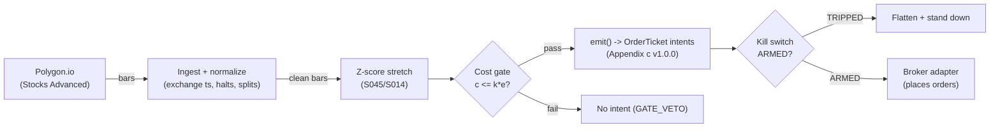

# T063 — Stretched-Move Z-Score Fade

Fades statistically stretched intraday moves: a z-score beyond ±`2.5` [example] on 5-min bars with no news catalyst is sold short (or bought), targeting the snap-back to the VWAP. Provenance **A/TM**.

> Tag law: every numeric literal in prose carries one of `[documented]
> [default] [example] [unverified] [internal-est] [measured]` (legend: Appendix
> i v1.0.0). Bibliographic years, volumes, pages, arXiv IDs, section numbers,
> rule codes (C1–C10), fail-safe codes (F1–F5), module IDs, and machine-parsed
> §0 data fields are identifiers, not literals, and are exempt.

## §1 Five-minute reviewer card

| Row | Value |
|---|---|
| Module | T063 — Stretched-Move Z-Score Fade, v1.0.1 |
| Edge verdict | `INSUFFICIENT-EVIDENCE` — short-horizon reversal is well documented, but the z-score fade rule's after-cost edge on 5-min bars is not in the cited papers — Lehmann/Jegadeesh are weekly/monthly |
| After-cost | `BEFORE-COST` — one-sentence verdict: short-horizon reversal is real in the literature at weekly horizons, but the 5-minute z-score fade's after-cost edge is undocumented — the horizon is the builder's extrapolation |
| Build cost | Tier M · `20–60` h [internal-est] · `$3,000–9,000` loaded [internal-est] |
| Data cost | Research `$29`/mo [documented] (Stocks Starter, 15-min delayed, 5y history); production `$199`/mo [documented] (Stocks Advanced, real-time) + news `~$99–200`/mo [unverified]; confirm at massive.com/pricing before budgeting |
| latency_class | bar / 5-minute |
| risk_class | medium |
| Capacity | moderate [example] — `≤$1M` [internal-est] per-name notional, ADV-cap sized; 5-min bars, liquid names |
| Executability | Easy: 5-min bars + z-score; the no-news gate is the product |
| Risk summary | Catching the falling knife: stretched moves stretch further — the no-news gate and the hard stop are load-bearing |
| When it dies | news-driven stretches (gate should veto); trending days where z stays stretched; wide spreads on the fade entry |
| Regime gates | Provisional machine records in §T9 (R005 jump, R036 macro windows, R047 sentiment) |
| Emits | `order_intents` (Appendix c v1.0.0) — intents only, never orders |

## §1.5 Cheapest / least-build path

1. **Prototype hour band:** `20–60` h [internal-est] — z-score engine + news veto + fade executor + cost/risk harness + fixture.
2. **Cheapest-source row:** min_tier = Polygon.io (rebranded Massive in `2026` [documented]) Stocks Advanced — cheapest tier with real-time 5-min bars + quotes [documented]; latency_class = bar / 5-minute; required_fields = 5-min OHLCV bars (`t,o,h,l,c,v`), news timestamps; price_band = `$199`/mo [documented] bars + news `~$99–200`/mo [unverified]; cheaper research alternative = Stocks Starter `$29`/mo [documented] (15-min delayed — fine for bar backtests, not live fades); build_or_buy = **build the z-score engine, buy the news feed**.
3. **Resource budget:** `1` core, `<2` GB RAM [internal-est]; compute pattern `per_bar`.
4. **Skip list:** tick-level fade; multi-name stretch portfolios.
5. **DO-NOT-CUT list:** causality assertions (`assert fill_event > signal_event`, no-signal-bar-fills test); COST block + callable `expected_cost_bps`; F1–F5 fail-safes + module-state enum; kill-switch state machine + re-arm checklist; decision-log audit records; bona-fide-intent + self-trade prevention; provenance tags on every numeric literal; fixtures + `test_cmd`; secrets via env only.
6. **Escalation gate:** upgrade from cheapest when any holds — size beyond `1`× [default] (doubling down on a losing fade is prohibited, C11); z threshold beyond `±4` [default]; half-spread regime > `5` bps [example] (constant-spread cost model no longer valid); borrow leg > `0` [default] (overnight holds).

## §T0 Module contract

### T0.1 Typed signature

```python
def emit(state: ModuleState, signals: list[SignalVector], cfg: Config) -> list[OrderTicket]:
```

`OrderTicket` per Appendix c v1.0.0 — **intents only**; the strategy never
places orders, never holds broker/exchange sessions, never nets intents into
orders. `state` is the module-owned named state vector (`position`,
`sleeve_weights`, `cooldown_until`, `kill_state`, `module_state`); `signals`
are canonical SignalVectors (Appendix b v1.0.0), newest last. The function
handles documented edge cases: empty signals → `UNKNOWN`; halt/auction bars →
freeze per the market-state table; stale inputs → `UNKNOWN` (F4), never
interpolate.

### T0.2 Config dataclass

| Parameter | Type | Default | Range | Status |
|---|---|---|---|---|
| `z_fade` | float | `2.5` | `2.0`–`3.5` | default |
| `lookback` | int | `20` | `10`–`60` | default |
| `R_usd` | float | `300` | `100`–`1,000` | default |
| `stop_z` | float | `3.5` | `3.0`–`5.0` | default |
| `cooldown_bars` | int | `6` | `0`–`24` | default |
| `cost_gate_k` | float | `0.5` | `0.1`–`2.0` | default |
| `time_stop_bars` | int | `24` | `6`–`48` | default |
| `news_lookback_min` | int | `30` | `5`–`120` | default |
| `edge_bps_per_z` | float | `2.5` | `1.0`–`5.0` | example |

All defaults tagged per the tag law (status `default` ⇒ `[default]`).
`R_usd` ≡ `risk_budget_R` in the §T2 sizing function.

### T0.3 Canonical schema mapping

Vendor columns → canonical Bar schema (Appendix a v1.0.0), stated once here:

| Vendor (Polygon.io Stocks Advanced, `v2/aggs`) | Canonical |
|---|---|
| `t` (ms epoch) → ×`1e6` [default] | `event_ts` (int64 ns UTC, bar open time) |
| `o/h/l/c`, `v` | `open/high/low/close`, `volume` |
| `n`, `vw` | trade count, VWAP (reference only) |
| symbol | `symbol` (exchange-qualified) |
| signal value | `sig` (strategy-defined score, Appendix b `value`) |
| gate flag | `gate` ∈ {0, 1}: cheapest-build news-veto proxy — `1` ⇔ no news in trailing `news_lookback_min` [example]; richer builds split `gate_news` / `gate_confirm` |
| stop distance | `stop_dist` ($/share from entry to stop [example]) |

Decision instant: `asof_ts` (int64 ns UTC) = `intent_ts` on every ticket [default]; dual `(event_ts, asof_ts)` timestamps per §T0.4.

### T0.4 Time contract

> Time contract: clock domain UTC, int64 ns; authoritative causality clock =
> `event_ts`; max_skew = `1` ms [default]; jitter budget = `500` µs [default];
> bar-label = open time; staleness TTL = `3`× cadence [default] (F4); gap
> policy = mask, no interpolation; halt/auction → discard contributions
> across reopen.

**Timing box:** `signal@t (per_bar-5min, America/New_York) → earliest fill @open(t+1)`

### T0.5 Market-state table

| State | Module behavior |
|---|---|
| CONTINUOUS_TRADING | Evaluate entries/exits per §T2; emit intents |
| HALTED | Freeze state; emit nothing; `UNKNOWN` on held signals |
| AUCTION | No new entries; exits only via auction-aware intents (MOO/MOC); state `DEGRADED` |
| CLOSED | Emit nothing; state `OFF` |

### T0.6 Module-state enum + error taxonomy

States per Appendix k v1.0.0: `OK | DEGRADED | UNKNOWN | OFF`. Invalid input →
`UNKNOWN`, never interpolate (Appendix f v1.0.0, F1–F5).

| Failure | State | Alert |
|---|---|---|
| Missing/stale input (TTL `3`× cadence [default]) | `UNKNOWN` | page |
| Non-finite / non-positive price reaching module (F2) | `UNKNOWN` | page |
| `event_ts` non-monotonic (F2) | `UNKNOWN` | page |
| Kill-switch TRIPPED | `OFF` (no new intents) | page |
| Halt/auction | `UNKNOWN` / `DEGRADED` (per table) | log |
| Feed anomaly (per §T9 row 1) | `DEGRADED` | notify |
| Anything unmapped | `UNKNOWN` | page |

### T0.7 Risk contract + kill switch

```yaml
risk_contract:
  per_trade_R: `300`            # [example] — N = floor(R/stop_dist), $300 per trade
  max_adverse_per_trade: `1.0`× stop distance [example]  # CI gate: per-trade P&L must stay inside
  daily_loss_stop: `-900` USD [example]
  max_gross: `2`M USD [example]
  kill_conditions:                        # any one trips -> TRIPPED
  - "daily loss <= -$900 -> TRIPPED"
  - "news feed stale -> veto all fades (fail safe)"
  deescalation:                           # non-trip responses
  - "three consecutive stop-outs -> halve size until a green day"
  enforcement: intraday-hard              # breach flattens; no review-only mode
```

**Calibration recipe:** `per_trade_R` is the sizing input in §T2 (dollar-risk
`N = ⌊R/stop_dist⌋` or the confidence-scaled equivalent); re-estimate `R`
from the trailing `60`-day [default] per-trade P&L distribution so that a
`3`σ [default] adverse day stays inside `daily_loss_stop`. `max_gross` is
checked pre-emit on every ticket (C4). Kill-switch state machine:

```
ARMED → TRIPPED → RECOVERY → ARMED
```

- `ARMED → TRIPPED`: any kill condition fires → cancel all working intents
  (idempotent cancels), flatten at marketable limits, set module state `OFF`,
  write a `KILL_TRIP` decision record (Appendix g v1.0.0).
- `TRIPPED → RECOVERY`: re-arm checklist **all green** — `1.` feed healthy
  (no stale bars); `2.` decision log reconciled against broker ledger, no
  orphan tickets; `3.` root cause of the trip identified and the offending
  config reverted or re-calibrated; `4.` risk owner sign-off recorded.
- `RECOVERY → ARMED`: one clean evaluation pass over the fixture
  (`test_cmd` green) with no new trip, then resume.

### T0.8 Ops tail

- **Schedule:** RTH `09:30`–`16:00` ET [documented]; module window `09:35`–`15:55` [default]; owner: intraday-desk on-call.
- **Health checks:** fixture replay (`test_cmd`) green on deploy; live
  staleness watchdog at `3`× cadence; kill-switch drill monthly [default].
- **Alert table:** page on `UNKNOWN` > `30` s [default], on any kill trip, or
  bounds violation; notify on `DEGRADED`; log on single dropped bars.
- **Resource budget:** `1` vCPU, `2` GB RAM [internal-est]; state is O(`1`) per symbol.
- **Runbook stub:** `1.` confirm feed; `2.` replay fixture; `3.` if red → set
  `OFF`, page; `4.` reconcile decision log before re-arm; `5.` complete the
  re-arm checklist (§T0.7) before `ARMED`.

### T0.9 Secrets (env-only)

`POLYGON_API_KEY` via environment only. No secrets in this file, fixtures, or logs
(CI secrets-grep).

### T0.10 May / must-NOT

> **May:** emit `OrderTicket` intents per Appendix c v1.0.0; track intent-side
> state; issue cancel-replace via new tickets. **Must-NOT:** place orders on
> any venue, hold broker/exchange sessions, net intents into orders inside the
> strategy, or treat the intent-side state machine as broker wire truth.

### T0.11 Domain & session (US equities)

- **Asset class:** US common equities (no options/crypto legs).
- **Venues:** XNAS primary [example]; smart-routed taker fills in the reference build.
- **Sessions:** RTH `09:30`–`16:00` America/New_York [documented]; module trades `09:35`–`15:55` [default]; flat before close, no overnight holds.
- **Calendar/holiday:** NYSE holiday calendar [documented]; no bars on exchange holidays — gap policy masks them (§T0.4).
- **Settlement:** T+1 [documented]; intraday-only intent flow, no settlement handling in the module.

## §T1 Legacy (subsumed by §1)

Legacy §T1 content is the §1 reviewer card above; this header is retained so
section numbering stays frozen.

## §T2 Specification

### Universe

Liquid US large-caps on 5-min bars [example], XNAS primary [example], RTH `09:30`–`16:00` ET [documented] (module window `09:35`–`15:55` [default], §T0.11); z = (r − μ)/σ over `20` bars [example]; fade only with no news in the trailing `news_lookback_min` = `30` min [default] — `gate == 1` in the cheapest build (§T0.3).

### Entry rule (Boolean — no prose-only conditions)

```
ENTER_SHORT := (z >= `2.5` [example]) AND (gate == `1` [example-proxy])
               AND (t.event_ts >= cooldown_until [default])
               AND (expected_cost_bps(...) <= cost_gate_k * edge_bps)
ENTER_LONG  := (z <= `-2.5` [example]) AND (gate == `1` [example-proxy])
               AND (t.event_ts >= cooldown_until [default])
               AND (expected_cost_bps(...) <= cost_gate_k * edge_bps)
FLAT        := otherwise
```
Preconditions: `(state.position is None) AND (state.module_state == OK)` [default];
`gate == 1` ⇔ no news in trailing `news_lookback_min` (S014 news veto folded
into the gate flag, §T0.3).

### Exits (with post-exit cooldown)

```
EXIT := (|z| < `0.25` [example] snap-back band)    # |z| < 0.1*z_fade, proxy for "z crosses 0"
        OR ((SHORT AND z >= `3.5` [example]) OR (LONG AND z <= `-3.5` [example]))  # stop: stretch stretched
        OR (bars_held >= `24` [default])            # time stop (time_stop_bars)
        OR (clock >= `15:55` ET [default])          # end-of-day flat
ON_EXIT: cooldown_until = t.event_ts + cooldown_bars * bar_ns   # C10
```

### Position sizing (fenced function)

```python
def size_shares(risk_budget_R, stop_distance, vol_estimate, adv_cap_shares, cost_bps):
    """shares = f(risk_budget_R, stop_distance, vol_estimate, ADV_cap, cost).
    Cheapest build: dollar-risk N = floor(R/stop_distance) [example]; never add
    to a losing fade (C11). vol_estimate validated finite-positive (F2) but
    otherwise informational in the cheapest build [default]; adv_cap_shares
    caps participation [default]; cost_bps is recorded on the ticket, not
    netted — intent-only doctrine."""
    if stop_distance <= 0 or vol_estimate <= 0:
        raise ValueError("invalid sizing input -> UNKNOWN")   # F2 [default]
    qty = int(risk_budget_R // max(stop_distance, 1e-9))
    if adv_cap_shares is not None:
        qty = min(qty, int(adv_cap_shares))
    return max(1, qty)
```

### Risk limits

| Limit | Value |
|---|---|
| Per-trade risk | `$300` [example] |
| Daily loss stop | `−$900` [example] |
| No averaging | never add to a losing fade [default] |

### COST block (single source of truth)

| Component | Value (bps) | Basis |
|---|---|---|
| Spread | `2.50` | [example] — 1.25 bp half-spread per aggressive leg ×2 |
| Fees | `0.24` | [documented] — `$0.0030`/share Nasdaq remove-liquidity (all MPIDs, ≥`$1.00` [documented]) on a `$250` stock [example] = `0.12` bps/side ×`2` [documented] |
| Borrow | `0.0` | [default] — intraday-only reference build (flat by `15:55` [default]); no overnight borrow accrual; C7 locate still gates every short |
| Impact | `0.0` | [example] — flagged; stretched bars are wide |
| **Total reference** | `2.74` | [example] + [documented] fee leg |

`fee_schedule_as_of`: `2026-09-11` [documented] — Nasdaq Price List Trading
(nasdaqtrader.com): fees to remove liquidity `$0.0030`/share, all MPIDs,
shares ≥`$1.00` [documented]. `side: taker` [default];
venue/tier/source: XNAS / Polygon.io (Massive) Stocks Advanced [documented].
`borrow_bps_per_day`: `0.0` [default] — no borrow in the reference build
(intraday only); any overnight hold must re-pin this leg.

Re-stating cost numbers outside
this block is a validation failure.

```python
def expected_cost_bps(notional, adv_pct, venue, side, urgency) -> float:
    '''Callable cost model — single source of truth (this block).
    Cheapest build: constant 4-component stack [example]; notional/adv_pct/
    venue/urgency are recorded for future impact modeling and are not yet
    load-bearing [default].'''
    spread_bps = 2.5   # [example] — 1.25 bp half-spread per aggressive leg ×2
    fee_bps = 0.24        # [documented] — $0.0030/share on a `$250` stock [example], RT ×2
    borrow_bps = 0.0   # [default] — intraday only
    impact_bps = 0.0   # [example] — flagged; stretched bars are wide
    if side == "maker":
        fee_bps = -abs(fee_bps) * 0.5  # rebate proxy [example]
    return spread_bps + fee_bps + borrow_bps + impact_bps
```

### Execution / fill model table

| Aspect | Assumption |
|---|---|
| Latency | 5-min bars; limit into the stretch [example] |
| Entries | Fade the stretch with limits; no chasing |
| Exits | Snap-back to the mean or 3.5-z stop |
| Partial fills | Per Appendix c v1.0.0 FIFO |
| Adverse fill | Stretched bars are wide and fast — fills slip [example] |

### Robustness

z over `20` bars [example]; fade threshold `±2.5` [example] with stop at `±3.5` [example]; no-news veto (`30` min [example]) is load-bearing — news-driven stretches are continuation, not fades. Never add to a losing fade.

### Compliance sub-block (C1–C10+)

| Code | Rule: trigger → check → action → log |
|---|---|
| C1 | Self-match / STP: every ticket carries self-trade-prevention instructions for the broker adapter; trigger = two tickets same symbol opposite side within `1` s [default] → check resting-interest overlap → action = cancel the newer ticket → log `COMPLIANCE_BLOCK` |
| C2 | Bona-fide intent: every entry intent must pass the cost gate (`expected_cost_bps(...) <= k * edge_bps`) and fit risk limits; trigger = gate fail → check = re-evaluate → action = no ticket emitted → log `GATE_VETO` |
| C3 | Message-rate / cancel-to-trade: trigger = `>50` intents/symbol/min [default] or cancel-to-trade `>10:1` [default] → check venue thresholds → action = throttle to `5`/min [default] + alert → log `COMPLIANCE_BLOCK` |
| C4 | Pre-trade fat-finger trio: price collar `±5`% vs reference [default] → reject; max notional per ticket `$2,000,000` [default] → reject; max `50` tickets/symbol/`5` min [default] → throttle; all rejections logged |
| C5 | Decision-log schema compliance (Appendix g v1.0.0): every intent, veto, cancel-replace, kill transition logged with inputs_hash/params_hash, hash-chained; trigger = missing record → action = halt to `UNKNOWN` |
| C6 | Halt/auction state table: per §T0.5 — HALTED freezes, AUCTION blocks new entries, CLOSED emits nothing; trigger = state change → check market-state table → action = freeze/cancel per table → log |
| C7 | Locate check (short sales): trigger = SHORT intent → check = easy-to-borrow list or live locate obtained pre-emit → action = block intent without locate → log `GATE_VETO`; Reg-SHO threshold securities never shorted |
| C8 | Public-dissemination gate: no signal/intent data published externally without review; trigger = export request → check = review sign-off → action = block until signed |
| C9 | Data-entitlement assertions per dataset (Appendix j v1.0.0): trigger = entitlement-class change or unlicensed symbol → check §T5 data-rights row → action = stand down affected symbols → log |
| C10 | Post-exit cooldown: trigger = exit or compliance block → check `now < cooldown_until` → action = no re-entry until ``6`` bars [default] elapse → log |
| C11 | No-averaging rule: adding to a losing fade is prohibited → check position add count → action = block → log `COMPLIANCE_BLOCK` |

### Parameter table

| Parameter | Symbol | Value | Tag | Sensitivity |
|---|---|---|---|---|
| Fade threshold | `z_fade` | `2.5` | [example] | high |
| Lookback | `lookback` | `20` bars | [example] | medium |
| Stop z | `stop_z` | `3.5` | [example] | high |
| Per-trade R | `R_usd` | `$300` | [example] | medium |
| Cost-gate k | `cost_gate_k` | `0.5` | [default] | high |

### Timing box

`signal@t (per_bar-5min, America/New_York) → earliest fill @open(t+1)`

## §T3 Math + normative pseudocode

On 5-minute bars: $z_t = (r_t - \mu_{20}) / \sigma_{20}$ [example].
Fade short when $z_t \ge 2.5$ [example], fade long when $z_t \le -2.5$
[example], only with no news in the trailing $30$ minutes [default]
(`gate == 1`, §T0.3).
Exit on $|z| < 0.25$ (snap-back band, proxy for $z$ crossing $0$) [example],
$|z| \ge 3.5$ against [example] (the stretch stretched further), `24` bars
held [default], or `15:55` ET [default]. Lehmann (1990) / Jegadeesh (1990)
document reversal at weekly horizons; the 5-minute horizon is the
builder's extrapolation, not the papers' claim.

**Normative pseudocode** (pseudocode is normative; prose is commentary):

```
function emit(state, signals, cfg) -> list[OrderTicket]:
    assert signals non-empty else return UNKNOWN                    # F1
    for bar t in signals (newest last):
        s = z-score z_t, signed (fade = opposite sign)              # data <= t only
        assert isfinite(s) else return UNKNOWN                      # F2
        assert isfinite(stop_dist) and stop_dist > 0 else return UNKNOWN  # F2
        edge_bps = abs(z) * cfg.edge_bps_per_z                      # [example] model
        cost = expected_cost_bps(notional, adv_pct, venue, side, urgency)
        cost_ok = expected_cost_bps(...) <= k * edge_bps
        # ^^^ normative cost-gate predicate: expected_cost_bps(...) <= k * edge_bps
        news_ok = (gate == 1)                                       # [example-proxy]: no news in news_lookback_min
        if state.position is None and state.module_state == OK and t.event_ts >= state.cooldown_until:
            if ((z >= z_fade or z <= -z_fade) and news_ok) and cost_ok:
                ticket = OrderTicket(symbol, side,
                                     qty=size_shares(R_usd, stop_dist, vol_estimate, adv_cap_shares, cost),
                                     limit, tif, ticket_id=uuid(), parent_signal="S045@t",
                                     intent_ts=t.event_ts, state=NEW)
                log_decision(ticket, inputs_hash, params_hash)     # C5 / Appendix g
                assert fill_event > signal_event                    # t->t+1 causality
        else if state.position is not None:
            against = (pos.side in (SELL, SHORT) and z >= stop_z) \
                   or (pos.side == BUY and z <= -stop_z)           # stop: stretch stretched
            snapped = abs(z) < 0.1 * z_fade                          # snap-back band proxy
            timed = pos.bars_held + 1 >= cfg.time_stop_bars
            eod = clock(t) >= 15:55 ET                              # [default]
            if against or snapped or timed or eod:                  # fail-safe priority: stop first
                emit exit intent (cancel-replace rules, Appendix c) # C1
                state.cooldown_until = t.event_ts + cooldown_bars * bar_ns   # C10
                assert fill_event > signal_event
    return tickets
```

Causality: every quantity at bar `t` uses only data `≤ t`; the earliest fill
is bar `t+1`'s open. Mandatory unit test: no-signal-bar fills
(`assert fill_event > signal_event`).

## §T4 Worked example (fixture-backed)

- Tape: `modules/fixtures/T063_tape.csv` — `# TYPE: validation-run`;
  `12` bars [example], all numbers synthetic, seed `10063` [example];
  `event_ts` int64 ns UTC, bar-labeled by open time.
- Expected outputs: `modules/fixtures/T063_expected.csv` — per-ticket
  intents with the cost-function call recorded (inputs → bps → $);
  tolerance `1e-6` [default] on floats.
- Acceptance tests (`modules/tests/test_T063.py`, `8` tests):
  `1.` fixture replays to expected (hand-checked rows below); `2.` cost-gate
  predicate passes on the fixture's large edges and blocks a tiny-edge
  counter-case (`k = 0.5` [default]); `3.` no-signal-bar fills
  (`fill_ts > signal_ts` on every ticket); `4.` kill-switch trips on the
  breach scenario and re-arms through the checklist
  (`ARMED → TRIPPED → RECOVERY → ARMED`); `5.` invalid input (non-positive
  price) → `UNKNOWN`, never interpolated; `6.` hand-check literals
  (qty / bps / $) match the generation run; `7.` stop-z exit fires when the
  stretch stretches against the fade; `8.` post-exit cooldown suppresses
  re-entry inside `cooldown_bars` (C10).
- `test_cmd`: `python3 -m pytest modules/tests/test_T063.py -q` → exits `0`.

**Cost-function calls on the fixture** (inputs → bps → $, from the harness run):

| ticket | notional ($) | adv_pct | side | edge_bps | cost_bps | cost_$ | gate |
|---|---|---|---|---|---|---|---|
| T-T063-2-0 | 100022.88 | 0.0500 | taker | 7.0000 | 2.7400 | 27.4063 | PASS |
| T-T063-11-X | 99978.12 | 0.0500 | taker | 0.0000 | 2.7400 | 27.3940 | N/A |

**Where the example is optimistic:** the fixture encodes stretches as signal events with the news veto folded into the gate; production faces stretch-continuation risk and wide-bar slippage not in the sketch



## §T5 Dependencies & data

Generated-from-`deps.yaml` shape (CI symmetry); hand-listed:

| Module | Role | Version pin |
|---|---|---|
| S045 — Stretched-move z-score | Trigger | 1.0.0 |
| S014 — News veto | Gate | 1.0.0 |

| Field | Type | Granularity | Source tier | Notes |
|---|---|---|---|---|
| 5-min OHLCV | float/int | 5-min | Tier 1 | z-score engine |
| News timestamps | int64 | per story | Tier 2 | veto |
| Polygon `v2/aggs` schema (`t` ms ts, `o/h/l/c`, `v`, `n`, `vw`) | — | per bar | Tier 1 | column mapping in §T0.3 [documented] |

**Family note:** family `D` = intraday microstructure / auction strategies.

**Data rights row** (Appendix j v1.0.0): US equities 5-min bars via Polygon.io
Stocks Advanced, `rights: licensed`; license scope = research + stated
production symbol count; raw ticks never leave our systems — fixtures are
synthetic; entitlement = professional/internal, no display; retention per
vendor terms, purge path in runbook. Entitlement-class change → §1.5
escalation gate.

## §T6 Local build (M5 Max / 128 GB)

Trivial on the M5 Max (Tier M, `20–60` h ≈ `$3k–9k` eng [internal-est] + `$199`/mo [documented] bars + `~$99–200`/mo [unverified] news). Bottleneck is the news veto feed, not compute.

## §T7 Buy vs build

Build — z-scores are trivial; the news veto needs a feed. Verdict: the no-news gate is the product.

## §T8 Efficacy — documented evidence

| Study / source | Market & period | Metric | Before/after cost | Caveat |
|---|---|---|---|---|
| Lehmann (1990), QJE | US stocks | short-term reversal: winners reverse over the following week [documented] | `BEFORE-COST` (anomaly evidence) | weekly horizon, not 5-minute |
| Jegadeesh (1990), J. Finance | US stocks | predictable behavior of security returns at short horizons [documented] | `BEFORE-COST` (anomaly evidence) | monthly formation, not intraday |
| Lo & MacKinlay (1990), RFS | US stocks | contrarian profits partly due to overreaction vs lead-lag [documented] | `BEFORE-COST` (decomposition) | the overreaction share is the fade's premise |

Selection disclosure: these are the sources surfaced by the chapter's research
pass (Stage 163/200). **Honest bottom line.** For a ≤$1M paper operation: T063 extrapolates well-documented weekly reversal to 5-minute bars — the literature supports reversal as a phenomenon, but the 5-minute fade's after-cost edge is undocumented. The no-news gate is doing most of the work.

## §T9 Failure modes & pitfalls

| # | Trigger → Detect → Action → Recovery | check: |
|---|---|---|
| 1 | Stretch stretches: |z| >= 3.5 against → detect: z monitor → action: stop out → recovery: next stretch | `check: exit on stop_z` |
| 2 | News-driven stretch: news in 30 min → detect: news veto → action: veto → recovery: next bar | `check: no_news_30min` |
| 3 | Averaging down: add to losing fade → detect: add count → action: block → recovery: n/a | `check: adds == 0` |
| 4 | Three consecutive stop-outs → detect: streak counter → action: halve size → recovery: green day | `check: size_halved` |
| 5 | Cost blowup → detect: cost gate fails → action: stand down → recovery: re-pin | `check: expected_cost_bps(...) <= k * edge_bps` |
| 6 | Lookahead: z uses future bars → detect: causality audit → action: halt → recovery: re-run test | `check: all(fill_ts > signal_ts)` |

### Regime gates — machine records (provisional, pending the R001–R050 annotation pass)

| regime_id | direction | mechanism | condition | action | min_lag | unknown_behavior |
|---|---|---|---|---|---|---|
| R005 — Jump regime | degrades | jumps continue; z stays stretched with no snap-back | jump state active | pause_entry | `1` bar [default] | veto (restrictive default) |
| R036 — Macro announcement windows | degrades | scheduled news breaks the no-news premise | inside announcement window | veto | `0` [default] | veto (restrictive default) |
| R047 — Sentiment / positioning regime | amplifies | crowded positioning fuels the snap-back | extreme positioning reading | double | `1` day [default] | no change |

Restrictive default: unknown or unmeasured regime state → veto new entries,
never size up. The `double` action is pinned to `1.0`× [default] in the
cheapest build (regime size multiplier is a calibrate parameter, never
auto-enabled).

## §T10 Source log + unverified leads

**Sources** (citable facts only):

1. Lehmann, B. N. (1990) [documented]. "Fads, Martingales, and Market Efficiency." *Quarterly Journal of Economics* 105(1): 1–28. — short-term reversal: winners reverse over the following week.
2. Jegadeesh, N. (1990) [documented]. "Evidence of Predictable Behavior of Security Returns." *Journal of Finance* 45(3): 881–898. — predictable short-horizon return behavior.
3. Lo, A. W. & MacKinlay, A. C. (1990) [documented]. "When Are Contrarian Profits Due to Stock Market Overreaction?" *Review of Financial Studies* 3(2): 175–205. — decomposing contrarian profits into overreaction vs lead-lag.
4. Nasdaq Price List — Trading (nasdaqtrader.com, checked 2026-09-11) [documented]. Fees to remove liquidity: `$0.0030`/share, all MPIDs, shares executed at or above `$1.00`.
5. Massive (Polygon.io) stocks pricing, third-party summaries of the official pricing page (Aug–Sep 2026) [documented]: Stocks Starter `$29`/mo (15-min delayed), Stocks Developer `$79`/mo (15-min delayed), Stocks Advanced `$199`/mo (real-time + quotes + financials); 2026 rebrand to Massive with `api.polygon.io` preserved as the endpoint. Confirm at massive.com/pricing before budgeting.
6. Polygon.io aggregates `v2/aggs` response schema [documented]: fields `t` (ms timestamp), `o/h/l/c`, `v`, `n`, `vw` — mapped to the canonical Bar schema in §T0.3.

**Chatbot source log.** Grok answered Q-TB7-1..3 (2026-09-10); all claims independently verified or labeled unverified.

**Unverified leads** (chatbot-only — never in evidence tables):

- Grok Q-TB7-3: 5-min z-fade hit-rate vs the weekly literature — chatbot figures, unverified; build-phase measurement task.
- Polygon.io Massive rebrand details beyond third-party integration docs — verify at massive.com before wiring signup flows.
- Benzinga news API pricing: third-party docs suggest `~$99–200`/mo bands, but official API licensing is custom — verify with Benzinga sales before budgeting.

## GROK-NEEDED (exact questions — web search could not answer)

1. **5-min z-fade evidence:** Is there any citable study (paper, SSRN, exchange research note) measuring after-cost returns of a 5-minute-bar z-score reversal/fade on US large caps, 2020–2026? The weekly literature (Lehmann 1990, Jegadeesh 1990) does not cover this horizon.
2. **Polygon aggs schema version:** What is the current documented schema/version of the Polygon.io (Massive) `v2/aggs` stock aggregates response — are `t,o,h,l,c,v,n,vw` still the full field set, and is there an adjustment/split flag field the §T0.3 mapping must carry?
3. **News feed pricing + timestamps:** What is Benzinga's current price for a real-time news API feed (or Polygon's partner Benzinga feed add-on), and are its timestamps wire-time or publication-time? The `30`-min no-news veto needs publication timestamps to be sound.
4. **Fee tier confirmation:** For a taker flow of `≤$1M`/day in liquid large caps on Nasdaq, is `$0.0030`/share the correct all-in remove-liquidity fee, or do low-ADV tiers change it? Confirm `fee_schedule_as_of` against the current Nasdaq Price List.
5. **Borrow accrual convention:** Confirm that intraday-only US equity shorts (opened and closed in the same RTH session) incur no stock-loan borrow accrual at major US brokers — the reference for `borrow_bps_per_day = 0.0` [default].

---

## Appendix — AI build prompt (T063)

Copy-paste into any chat agent:

> Build module **T063 — Stretched-Move Z-Score Fade** per `notes/module-template.md` v1.0.0
> and this file's §T0 contract.
> Cheapest path (§1.5): prototype `20–60` h [internal-est]; cheapest data
> candidate Polygon.io (Massive) Stocks Advanced `$199`/mo [documented] (+ news `~$99–200`/mo [unverified]); compute pattern `per_bar`; skip
> tick-level fade; multi-name stretch portfolios for now.
> Implement `emit(state, signals, cfg) -> list[OrderTicket]`
> (Appendix c v1.0.0) with the §T3 normative pseudocode, including the
> cost-gate predicate `expected_cost_bps(...) <= k * edge_bps` and
> `assert fill_event > signal_event`. Wire F1–F5 (Appendix f v1.0.0): invalid
> input → `UNKNOWN`, never interpolate. Implement the kill-switch state
> machine `ARMED → TRIPPED → RECOVERY → ARMED` with the §T0.7 re-arm
> checklist. Log decisions per Appendix g v1.0.0. Secrets via env only.
> Run the fixture `modules/fixtures/T063_tape.csv`
> (`# TYPE: validation-run`) against `modules/fixtures/T063_expected.csv`
> (tolerance `1e-6` [default]).
> **Definition of done:** `python3 -m pytest modules/tests/test_T063.py -q`
> exits `0`. Tag every numeric literal you add with the unified enum
> (Appendix i v1.0.0); put anything unverifiable in §T10 unverified leads.
