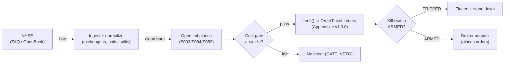

# T065 — Open-Auction Imbalance Continuation

Rides the open-auction imbalance: large pre-open imbalances with news confirmation predict the first `30` minutes [example] of drift, entered at the open print. Provenance **A/TM**.

> Tag law: every numeric literal in prose carries one of `[documented]
> [default] [example] [unverified] [internal-est] [measured]` (legend: Appendix
> i v1.0.0). Bibliographic years, volumes, pages, arXiv IDs, section numbers,
> rule codes (C1–C10), fail-safe codes (F1–F5), module IDs, and machine-parsed
> §0 data fields are identifiers, not literals, and are exempt.

## §1 Five-minute reviewer card

| Row | Value |
|---|---|
| Module | T065 — Open-Auction Imbalance Continuation, v1.0.1 |
| Edge verdict | `INSUFFICIENT-EVIDENCE` — auction price discovery is documented, but the imbalance-continuation rule's after-cost edge is not in the cited papers — the continuation is the builder's trade |
| After-cost | `BEFORE-COST` — one-sentence verdict: auctions discover prices in the literature (Madhavan & Panchapagesan 2000, RFS 13(3): 627–658 [documented]); identified-news days show continuation conditional on extreme moves (Boudoukh et al. 2013, NBER WP 18725 [documented]) at daily horizon — but no cited paper documents after-cost P&L for riding the open imbalance over a `30`-minute [example] window |
| Build cost | Tier M · `20–60` h [internal-est] · `$3,000–9,000` loaded [internal-est] |
| Data cost | Research `~$200–1,000`/mo [unverified]; production `~$200–1,000`/mo [unverified] — bands indicative; retail imbalance-feed pricing unverifiable from public sources → GROK-NEEDED Q-GROK-T065-1 |
| latency_class | bar / 1-minute (under the hood: NYSE imbalance 15-s cadence from 09:20; Nasdaq NOII 15-s from 09:28, 5-s from 09:29 [documented]) |
| risk_class | medium |
| Capacity | moderate [example] — open-print liquidity |
| Executability | Moderate: needs the imbalance feed before the open; the open print is the fill |
| Risk summary | Imbalance flips before the open print; news-driven imbalances gap and reverse; the open print slips |
| When it dies | imbalance evaporates at 09:30; no-news imbalances mean-revert; wide open spreads |
| Regime gates | Provisional machine records (§T9): R041 amplifies→double; R005 degrades→pause_entry; R014 degrades→halve; R022 degrades→veto (shorts); R038 degrades→widen_stops; R035 inverts→pause_entry — unknown_behavior = `veto` (restrictive default) |
| Emits | `order_intents` (Appendix c v1.0.0) — intents only, never orders |

## §1.5 Cheapest / least-build path

1. **Prototype hour band:** `20–60` h [internal-est] — imbalance parser + news confirmation + open executor + cost/risk harness + fixture.
2. **Cheapest-source row** (structured):

   | Field | Value |
   |---|---|
   | min_tier | NYSE TAQ Order Imbalance (MsgType 34) [documented] — or Nasdaq NOII via a broker/proprietary feed (NOII disseminated at no additional charge to proprietary-feed subscribers [documented]) |
   | latency_class | bar / 1-minute — underlying cadence: NYSE 15 s from 09:20; Nasdaq NOII 15 s from 09:28, 5 s from 09:29 [documented] |
   | required_fields | `ImbalanceQuantity` (shares, round-lot truncated), `ReferencePrice` (prev close), `ClearingPrice`, `PairedQuantity`, `SourceTime` [documented]; S059 news gate; open prints |
   | price_band | `~$200–1,000`/mo [unverified] — indicative; no retail imbalance price sheet verifiable from public sources → GROK-NEEDED Q-GROK-T065-1 |
   | build_or_buy | **buy the imbalance feed; build the continuation rule — the feed is the product** |

3. **Resource budget:** `1` core, `<2` GB RAM [internal-est]; compute pattern `per_bar`.
4. **Skip list:** close-auction version (see T070); international opens.
5. **DO-NOT-CUT list:** causality assertions (`assert fill_event > signal_event`, `assert news_ts < open_print_ts`, no-signal-bar-fills test); COST block + callable `expected_cost_bps`; F1–F5 fail-safes + module-state enum; kill-switch state machine + re-arm checklist; decision-log audit records; bona-fide-intent + self-trade prevention; provenance tags on every numeric literal; fixtures + `test_cmd`; secrets via env only.
6. **Escalation gate:** upgrade from cheapest when any holds — imbalance updates `>50`/min [default] (decimate to snapshot grid); participation `>5`% of ADV [default] (replace the constant impact stack with calibrated `f(adv_pct)`); open delay past `09:35` [default] (veto — kill condition §T0.7); news-gate entitlement lost (stand down per C9).

## §T0 Module contract

### T0.1 Typed signature

```python
def emit(state: ModuleState, signals: list[SignalVector], cfg: Config) -> list[OrderTicket]:
```

`OrderTicket` per Appendix c v1.0.0 — **intents only**; the strategy never
places orders, never holds broker/exchange sessions, never nets intents into
orders. `state` is the module-owned named state vector (`position`,
`sleeve_weights`, `cooldown_until`, `kill_state`, `module_state`); `signals`
are canonical SignalVectors (Appendix b v1.0.0), newest last. The function
handles documented edge cases: empty signals → `UNKNOWN`; halt/auction bars →
freeze per the market-state table; stale inputs → `UNKNOWN` (F4), never
interpolate.

### T0.2 Config dataclass

| Parameter | Type | Default | Range | Status |
|---|---|---|---|---|
| `imb_min_m` | float | `2.0` | `1.0`–`5.0` | example |
| `hold_min` | int | `30` | `15`–`60` | example |
| `R_usd` | float | `400` | `100`–`2,000` | example |
| `stop_atr` | float | `0.75` | `0.5`–`1.5` | example |
| `absorb_frac` | float | `0.10` | `0.01`–`0.50` | example |
| `adv_cap_shares` | int | `None` | `1`–`1,000,000` | example |
| `edge_mult` | float | `3.5` | `1.0`–`10.0` | example |
| `adv_pct` | float | `0.05` | `0.001`–`0.50` | example |
| `venue` | str | `"XNAS"` | — | example |
| `cooldown_bars` | int | `390` | `0`–`390` | default |
| `cost_gate_k` | float | `0.5` | `0.1`–`2.0` | default |

Statuses carry the tag law: `example` ⇒ `[example]`, `default` ⇒ `[default]`.
`imb_min_m` is in `$M` units — the dollar imbalance `I_t` is constructed
from `sign × ImbalanceQuantity × ReferencePrice / 1e6` [example construction].
`adv_cap_shares = None` [example] disables the participation cap; set it to
bind the ADV cap in production.

### T0.3 Canonical schema mapping

Vendor imbalance messages → canonical Bar schema (Appendix a v1.0.0), stated
once here. Field names from the NYSE Order Imbalances Client Specification
v1.12b (MsgType 34) [documented]:

| Vendor (NYSE TAQ Order Imbalance, MsgType 34) | Canonical |
|---|---|
| `SourceTime` (ms since midnight, imbalance-book generation time) | `event_ts` (int64 ns UTC; convert ms→ns) |
| `ImbalanceQuantity` (shares, truncated to round lot) × `ReferencePrice` (prev close, numerator/denomcode) | `sig` = signed imbalance in `$M` units [example construction] |
| `ClearingPrice` (indicative matching price; published from ~`09:28` [documented]) | `ref_px` (edge/reference price) |
| `PairedQuantity` | `paired_qty` (diagnostic) |
| symbol | `symbol` (exchange-qualified) |
| news confirmation (S059 v1.1.0) | `gate` ∈ {0, 1} — precomputed (news ∧ freshness); production wiring asserts `news_ts < open_print_ts` (§T9 row 7) |

Nasdaq equivalent: NOII via Nasdaq proprietary feeds — Inside Match Price,
paired shares, buy/sell imbalance direction, indicative clearing-price range;
disseminated from `09:28:00`, every `15` s from `09:28`, every `5` s from
`09:29` until the open, at no additional charge to subscribers [documented].
NYSE dissemination cadence: every `5` min `08:30`–`09:00`, every `1` min
`09:00`–`09:20`, every `15` s `09:20`–open (or `09:35` if delayed)
[documented]. Round-lot truncation is a known quantization floor — imbalances
below `100 × ReferencePrice` are invisible [documented schema].

### T0.4 Time contract

> Time contract: clock domain UTC, int64 ns; authoritative causality clock =
> `event_ts` (from the imbalance message `SourceTime`); dual timestamps
> `(event_ts, asof_ts)` where `asof_ts` is the harness ingest time;
> max_skew = `1` ms [default]; jitter budget = `500` µs [default];
> bar-label = open time; staleness TTL = `3`× cadence [default] (F4);
> imbalance freshness for the entry decision: last message `≤60` s [default]
> old at the print, else veto; gap policy = mask, no interpolation;
> halt/auction → discard contributions across reopen.

**Timing box:** `signal@t (per_bar-1min, America/New_York) → earliest fill @open(t+1)`

Open print at `09:30` [documented]; final decision snapshot `≥09:29`
[default]; open delayed past `09:35` [default] → veto (§T0.7).

### T0.5 Market-state table

| State | Module behavior |
|---|---|
| CONTINUOUS_TRADING | Evaluate entries/exits per §T2; emit intents |
| HALTED | Freeze state; emit nothing; `UNKNOWN` on held signals |
| AUCTION | No new entries; exits only via auction-aware intents (MOO/MOC); state `DEGRADED` |
| CLOSED | Emit nothing; state `OFF` |

### T0.6 Module-state enum + error taxonomy

States per Appendix k v1.0.0: `OK | DEGRADED | UNKNOWN | OFF`. Invalid input →
`UNKNOWN`, never interpolate (Appendix f v1.0.0, F1–F5).

| Failure | State | Alert |
|---|---|---|
| Missing/stale input (TTL `3`× cadence [default]) | `UNKNOWN` | page |
| Non-finite / non-positive price reaching module (F2) | `UNKNOWN` | page |
| `event_ts` non-monotonic (F2) | `UNKNOWN` | page |
| Kill-switch TRIPPED | `OFF` (no new intents) | page |
| Halt/auction | `UNKNOWN` / `DEGRADED` (per table) | log |
| Feed anomaly (per §T9 row 1) | `DEGRADED` | notify |
| Anything unmapped | `UNKNOWN` | page |

### T0.7 Risk contract + kill switch

```yaml
risk_contract:
  per_trade_R: `400`            # [example] — N = floor(R/stop_dist), R = $400 per trade
  max_adverse_per_trade: `0.75` ATR [example]   # [example]
  daily_loss_stop: `-1200` USD [example]          # [example]
  max_gross: `3`M USD [example]                # [example]
  kill_conditions:                        # any one trips -> TRIPPED
  - "imbalance feed stale at 09:29 [default] -> veto"
  - "daily loss <= -$1,200 -> TRIPPED"
  - "open delayed past 09:35 [default] -> veto"
  enforcement: intraday-hard              # breach flattens; no review-only mode
```

**Calibration recipe:** `per_trade_R` is the sizing input in §T2 (dollar-risk
`N = ⌊R/stop_dist⌋` or the confidence-scaled equivalent); re-estimate `R`
from the trailing `60`-day [default] per-trade P&L distribution so that a
`3`σ [default] adverse day stays inside `daily_loss_stop`. `max_gross` is
checked pre-emit on every ticket (C4). Kill-switch state machine:

```
ARMED → TRIPPED → RECOVERY → ARMED
```

- `ARMED → TRIPPED`: any kill condition fires → cancel all working intents
  (idempotent cancels), flatten at marketable limits, set module state `OFF`,
  write a `KILL_TRIP` decision record (Appendix g v1.0.0).
- `TRIPPED → RECOVERY`: re-arm checklist **all green** — `1.` feed healthy
  (no stale bars); `2.` decision log reconciled against broker ledger, no
  orphan tickets; `3.` root cause of the trip identified and the offending
  config reverted or re-calibrated; `4.` risk owner sign-off recorded.
- `RECOVERY → ARMED`: one clean evaluation pass over the fixture
  (`test_cmd` green) with no new trip, then resume.

### T0.8 Ops tail

- **Schedule:** open only `09:30` [documented]; owner: intraday-desk on-call.
- **Health checks:** fixture replay (`test_cmd`) green on deploy; live
  staleness watchdog at `3`× cadence; kill-switch drill monthly [default].
- **Alert table:** page on `UNKNOWN` > `30` s [default], on any kill trip, or
  bounds violation; notify on `DEGRADED`; log on single dropped bars.
- **Resource budget:** `1` vCPU, `2` GB RAM [internal-est]; state is O(`1`) per symbol.
- **Runbook stub:** `1.` confirm feed; `2.` replay fixture; `3.` if red → set
  `OFF`, page; `4.` reconcile decision log before re-arm; `5.` complete the
  re-arm checklist (§T0.7) before `ARMED`.

### T0.9 Secrets (env-only)

`IMBALANCE_FEED_KEY` via environment only. No secrets in this file, fixtures, or logs
(CI secrets-grep).

### T0.10 May / must-NOT

> **May:** emit `OrderTicket` intents per Appendix c v1.0.0; track intent-side
> state; issue cancel-replace via new tickets. **Must-NOT:** place orders on
> any venue, hold broker/exchange sessions, net intents into orders inside the
> strategy, or treat the intent-side state machine as broker wire truth.

## §T1 Legacy (subsumed by §1)

Legacy §T1 content is the §1 reviewer card above; this header is retained so
section numbering stays frozen.

## §T2 Specification

### Universe

Liquid US large-caps with pre-open imbalance data [example]; imbalance `≥$2`M [example]; news-confirmed (S059); one trade per day.

### Entry rule (Boolean — no prose-only conditions)

```
I_t := sign(ImbalanceQuantity_t) * ImbalanceQuantity_t * ReferencePrice_t / 1e6   # $M [example construction]
news_confirmed := (gate(S059) == 1) AND (news_ts < open_print_ts)                  # causality, §T9 row 7
imb_fresh      := (open_print_ts - last_imbalance_SourceTime) <= 60 s               # [default]

ENTER_LONG  := (|I_t| >= imb_min_m) AND (news_confirmed)
               AND (imb_fresh)
               AND (expected_cost_bps(...) <= cost_gate_k * edge_bps)
ENTER_SHORT := mirror on sell imbalances
FLAT        := otherwise
```

### Exits (with post-exit cooldown)

```
EXIT := (30 min [example] after the open)                 # continuation window
        OR (stop = 0.75 ATR hit)                       # [example]
        OR (absorbed := |I_t| < absorb_frac * |I_entry|) # absorb_frac = 0.10 [example]
ON_EXIT: cooldown_until = now + cooldown_bars * bar_ns  # C10; 390 bars [default] ≈ one session
```

### Position sizing (fenced function)

```python
def size_shares(risk_budget_R, stop_distance, vol_estimate=None, ADV_cap=None, cost=0.0):
    """Dollar-risk sizing with ADV participation cap (normative).

    vol_estimate: ATR in dollars; if given, stop_distance = stop_atr * ATR.
    ADV_cap: max shares (participation cap); None disables [example].
    cost: per-side bps — recorded for the ticket, does not resize [example].
    """
    qty = int(risk_budget_R // max(stop_distance, 1e-9))  # [default] arithmetic
    if vol_estimate is not None:
        qty = int(risk_budget_R // max(0.75 * vol_estimate, 1e-9))  # 0.75 = stop_atr [example]
    if ADV_cap is not None:
        qty = min(qty, int(ADV_cap))
    return max(1, qty)
```

### Risk limits

| Limit | Value |
|---|---|
| Per-trade risk | `$400` [example] |
| Daily loss stop | `−$1,200` [example] |
| One trade per day | open only [example] |

### COST block (single source of truth)

| Component | Value (bps) | Basis |
|---|---|---|
| Spread | `3.00` | [example] — wide open spreads |
| Fees | `0.40` | [example] — broker pass-through over the documented member rates: NYSE `$0.0010`/share for executions at the open [documented] (SEC 34-87957, 2020 rate table, capped `$30,000`/mo/member org); Nasdaq `$0.0005`/share for market/auction-only orders in the opening auction [documented] (SEC 34-65906-ex5, 2011 filing) — retail pays broker pass-through (≈`$0.005`/share/side on the `$250` [example] print) |
| Borrow | `0.0` | [default] — reference-build convention: the `30`-min [example] intraday hold never carries overnight; shorts on hard-to-borrow names must add the actual borrow bps + locate cost per C7 (zero is not a claim that borrowing is free) |
| Impact | `1.00` | [example] — open-print slippage |
| **Total reference** | `4.40` | [example] |

Convention (normative): `cost_bps` is **per-side** (charged on each ticket);
`edge_bps` is a **per-trade (round-trip)** model [example]. The gate predicate
compares them directly by builder convention — calibrate `k` against realized
net edge, not the fixture.

`fee_schedule_as_of`: NYSE rate per SEC 34-87957 (2020) [documented]; Nasdaq
rate per SEC 34-65906-ex5 (2011) [documented] — **re-pin the venue schedule
before production** (rates are member-organization schedules; current 2026
tables unverified → GROK-NEEDED Q-GROK-T065-3). `side: taker` [default];
venue/tier/source: XNAS / NYSE open [example]. `borrow_bps_per_day`: `0.0`
[default] — see Borrow reason above.

Re-stating cost numbers outside
this block is a validation failure.

```python
def expected_cost_bps(notional, adv_pct, venue, side, urgency) -> float:
    '''Callable cost model — single source of truth (this block).'''
    spread_bps = 3.0   # [example] — wide open spreads
    fee_bps = 0.4         # [example] — pass-through over documented member rates (see basis)
    borrow_bps = 0.0   # [default] — intraday reference build; HTB shorts add real borrow (C7)
    impact_bps = 1.0   # [example] — open-print slippage; constant in the cheapest build
    # notional/adv_pct/urgency are carried for the calibrated impact escalation
    # (participation > 5% of ADV [default] -> f(adv_pct)); unused in the reference build.
    if side == "maker":
        fee_bps = -abs(fee_bps) * 0.5  # rebate proxy [example]
    return spread_bps + fee_bps + borrow_bps + impact_bps
```

### Execution / fill model table

| Aspect | Assumption |
|---|---|
| Latency | Final pre-open imbalance snapshot `≥09:29` [default] (NYSE 15-s cadence from 09:20; Nasdaq NOII 5-s from 09:29 [documented]); open print is the fill |
| Imbalance staleness | Veto if the last imbalance message is `>60` s [default] old at the print (F4) |
| Entries | At the 09:30 open print in the imbalance direction; MOO intents via the broker adapter |
| Exits | `30` min [example] later, 0.75-ATR stop [example], or early absorption (`absorb_frac`) |
| Partial fills | Per Appendix c v1.0.0 FIFO |
| Adverse fill | Open prints slip on large imbalances [example] — the constant `1.00` bps impact stack [example] is the cheapest-build proxy; participation `>5`% ADV [default] → calibrate |

### Robustness

Imbalance `≥$2`M [example]; news confirmation (S059) required — no-news imbalances mean-revert; one trade per day; `30`-min continuation window [example] from the open print.

### Compliance sub-block (C1–C10+)

| Code | Rule: trigger → check → action → log |
|---|---|
| C1 | Self-match / STP: every ticket carries self-trade-prevention instructions for the broker adapter; trigger = two tickets same symbol opposite side within `1` s [default] → check resting-interest overlap → action = cancel the newer ticket → log `COMPLIANCE_BLOCK` |
| C2 | Bona-fide intent: every entry intent must pass the cost gate (`expected_cost_bps(...) <= k * edge_bps`) and fit risk limits; trigger = gate fail → check = re-evaluate → action = no ticket emitted → log `GATE_VETO` |
| C3 | Message-rate / cancel-to-trade: trigger = `>50` intents/symbol/min [default] or cancel-to-trade `>10:1` [default] → check venue thresholds → action = throttle to `5`/min [default] + alert → log `COMPLIANCE_BLOCK` |
| C4 | Pre-trade fat-finger trio: price collar `±5`% vs reference [default] → reject; max notional per ticket `$2,000,000` [default] → reject; max `50` tickets/symbol/`5` min [default] → throttle; all rejections logged |
| C5 | Decision-log schema compliance (Appendix g v1.0.0): every intent, veto, cancel-replace, kill transition logged with inputs_hash/params_hash, hash-chained; trigger = missing record → action = halt to `UNKNOWN` |
| C6 | Halt/auction state table: per §T0.5 — HALTED freezes, AUCTION blocks new entries, CLOSED emits nothing; trigger = state change → check market-state table → action = freeze/cancel per table → log |
| C7 | Locate check (short sales): trigger = SHORT intent → check = easy-to-borrow list or live locate obtained pre-emit → action = block intent without locate → log `GATE_VETO`; Reg-SHO threshold securities never shorted |
| C8 | Public-dissemination gate: no signal/intent data published externally without review; trigger = export request → check = review sign-off → action = block until signed |
| C9 | Data-entitlement assertions per dataset (Appendix j v1.0.0): trigger = entitlement-class change or unlicensed symbol → check §T5 data-rights row → action = stand down affected symbols → log |
| C10 | Post-exit cooldown: trigger = exit or compliance block → check `now < cooldown_until` → action = no re-entry until ``390`` bars [default] elapse → log |
| C11 | One-trade-per-day cap: additional imbalance signals ignored → check daily count → action = ignore → log `GATE_VETO` |

### Parameter table

| Parameter | Symbol | Value | Tag | Sensitivity |
|---|---|---|---|---|
| Imbalance minimum | `imb_min_m` | `$2`M | [example] | high |
| Hold window | `hold_min` | `30` min | [example] | medium |
| Per-trade R | `R_usd` | `$400` | [example] | medium |
| Stop | `stop_atr` | `0.75` ATR | [example] | medium |
| Absorption fraction | `absorb_frac` | `0.10` | [example] | medium |
| ADV cap | `adv_cap_shares` | `None` (disabled) | [example] | low |
| Cost-gate k | `cost_gate_k` | `0.5` | [default] | high |

### Timing box

`signal@t (per_bar-1min, America/New_York) → earliest fill @open(t+1)`

## §T3 Math + normative pseudocode

Pre-open imbalance $I_t$ in `$M` [example construction]: $I_t =
\mathrm{sign} \times \mathrm{ImbalanceQuantity}_t \times
\mathrm{ReferencePrice}_t / 10^6$. The vendor fields are documented
(MsgType 34 v1.12b); the `$M` construction is the builder's. Enter at the
09:30 open print in the imbalance direction if $|I_t| \ge \$2\mathrm{M}$
[example] and news confirms (S059, with `news_ts < open_print_ts`).
Hold $30$ minutes [example] (the continuation window); exit on $0.75 \times$
ATR stop [example], on early absorption ($|I_t| < 0.10 \times |I_{\rm entry}|$
[example]), or at the time stop. Madhavan & Panchapagesan (2000, RFS 13(3):
627–658) [documented]: the NYSE opening auction concentrates price discovery
after the overnight nontrading period, with designated dealers facilitating
discovery. Barclay & Hendershott (2003) [documented]: pre-open trading is
informative. Boudoukh et al. (2013, NBER WP 18725) [documented]: conditional
on extreme moves, identified-news days show continuation while no-news days
reverse — this supports the news-confirmation gate, at daily horizon. The
`30`-minute [example] continuation window itself is the builder's trade,
not the papers' claim.

**Normative pseudocode** (pseudocode is normative; prose is commentary):

```
function emit(state, signals, cfg) -> list[OrderTicket]:
    assert signals non-empty else return UNKNOWN                    # F1
    assert event_ts monotonic else return UNKNOWN                    # F2
    for bar t in signals (newest last):
        I_t = signed imbalance in $M (ImbalanceQuantity x ReferencePrice)  # §T0.3 mapping
        assert isfinite(I_t) else return UNKNOWN                     # F2
        assert news_ts < open_print_ts else return UNKNOWN           # causality: confirmation precedes the print
        assert imb_age <= 60 s else veto (no ticket)                # freshness [default]
        edge_bps = abs(I_t) * cfg.edge_mult                         # [example] — modeled per-trade edge in bps
        side = BUY if I_t > 0 else SHORT
        qty = size_shares(cfg.R_usd, stop_distance, ADV_cap=cfg.adv_cap_shares)  # §T2 fenced fn
        notional = qty * open_price_t
        cost = expected_cost_bps(notional, cfg.adv_pct, cfg.venue, side, "normal")
        cost_ok = cost <= cfg.cost_gate_k * edge_bps
        # ^^^ normative cost-gate predicate: expected_cost_bps(...) <= k * edge_bps
        # cost_bps is per-side; edge_bps is per-trade (round-trip) — builder convention, COST block
        if state.position is None and state.module_state == OK:
            if ((|I_t| >= cfg.imb_min_m) and news_confirmed and imb_fresh) and cost_ok:
                ticket = OrderTicket(symbol, side, qty, limit, tif,
                                     ticket_id=uuid(), parent_signal="S033@t",
                                     intent_ts=t.event_ts, state=NEW)
                log_decision(ticket, inputs_hash, params_hash)     # C5 / Appendix g
                assert fill_event > signal_event                    # t->t+1 causality
        else if state.position is not None:
            if ((30 min elapsed) or (stop hit) or (|I_t| < cfg.absorb_frac * |I_entry|)):
                emit exit intent (cancel-replace rules, Appendix c) # C1
                state.cooldown_until = t + cooldown_bars            # C10
                assert fill_event > signal_event
    return tickets
```

Causality: every quantity at bar `t` uses only data `≤ t`; the earliest fill
is bar `t+1`'s open. Mandatory unit test: no-signal-bar fills
(`assert fill_event > signal_event`).

## §T4 Worked example (fixture-backed)

- Tape: `modules/fixtures/T065_tape.csv` — `# TYPE: validation-run`;
  `12` bars [example], all numbers synthetic, seed `10065` [example];
  `event_ts` int64 ns UTC, bar-labeled by open time.
  - `sig` carries the signed imbalance in `$M` (§T0.3 mapping) [example].
  - `gate` is the precomputed (news ∧ freshness) gate [example] — the
    `news_ts < open_print_ts` assertion is enforced in production wiring
    (§T9 row 7), not in the fixture.
  - `stop_dist` is the dollar stop distance; the fixture's `1.0` [example]
    stands in for `0.75 × ATR` on the `$250` [example] print.
- Expected outputs: `modules/fixtures/T065_expected.csv` — per-ticket
  intents with the cost-function call recorded (inputs → bps → $);
  tolerance `1e-6` [default] on floats.
- Acceptance tests (`modules/tests/test_T065.py`, `8` tests):
  `1.` fixture replays to expected (hand-checked rows below); `2.` cost-gate
  predicate passes on the fixture's large edges and blocks a tiny-edge
  counter-case (`k = 0.5` [default]); `3.` no-signal-bar fills
  (`fill_ts > signal_ts` on every ticket); `4.` kill-switch trips on the
  breach scenario and re-arms through the checklist
  (`ARMED → TRIPPED → RECOVERY → ARMED`); `5.` invalid input (non-finite,
  non-positive price, non-monotonic ts) and empty input → `UNKNOWN`, never
  interpolated; `6.` hand-check literals
  (qty / bps / $) match the generation run; `7.` ADV participation cap
  (`adv_cap_shares = 200` [example]) binds the ticket qty; `8.` early
  absorption (`absorb_frac = 0.10` [example]) exits with reason `absorbed`.
- `test_cmd`: `python3 -m pytest modules/tests/test_T065.py -q` → exits `0`.

**Cost-function calls on the fixture** (inputs → bps → $, from the harness run):

| ticket | notional ($) | adv_pct | side | edge_bps | cost_bps | cost_$ | gate |
|---|---|---|---|---|---|---|---|
| T-T065-2-0 | 100022.88 | 0.0500 | taker | 9.8000 | 4.4000 | 44.0101 | PASS |
| T-T065-10-X | 99973.84 | 0.0500 | taker | 0.0000 | 4.4000 | 43.9885 | N/A |

**Where the example is optimistic:** the fixture encodes imbalances as signal events; production faces pre-print imbalance flips and open-print slippage; the one-per-day cap is enforced via cooldown



## §T5 Dependencies & data

Generated-from-`deps.yaml` shape (CI symmetry); hand-listed:

| Module | Role | Version pin |
|---|---|---|
| S033 — Open-auction imbalance | Trigger | 1.0.0 |
| S094 — News drift | Feature | 1.0.0 |
| S059 — News confirmation | Gate | 1.0.0 |

| Field | Type | Granularity | Source tier | Notes |
|---|---|---|---|---|
| Pre-open imbalance messages | float | per update | Tier 1/2 | MsgType 34 (NYSE) / NOII (Nasdaq); final decision snapshot `≥09:29` [default] |
| Open prints | float | per day | Tier 1 | execution |

**Dissemination schedule** (documented — not the builder's invention):

| Venue | Cadence before the open | Source |
|---|---|---|
| NYSE | every `5` min `08:30`–`09:00`; every `1` min `09:00`–`09:20`; every `15` s `09:20`–open (or `09:35` if delayed) | SEC 34-57862 |
| Nasdaq (NOII) | from `09:28:00`; every `15` s from `09:28`; every `5` s from `09:29` until the open; no additional charge to proprietary-feed subscribers | SEC 34-49842 |

**Family note:** family `D` = intraday microstructure / auction strategies.

**Data rights row** (Appendix j v1.0.0): US equities open-auction imbalances via NYSE
TAQ / OpenBook, `rights: licensed`; license scope = research + stated
production symbol count; raw ticks never leave our systems — fixtures are
synthetic; entitlement = professional/internal, no display; retention per
vendor terms, purge path in runbook. Entitlement-class change → §1.5
escalation gate.

## §T6 Local build (M5 Max / 128 GB)

Feasible on the M5 Max (Tier M, `20–60` h [internal-est] ≈ `$3k–9k` eng [internal-est] + `~$200–1k`/mo data [unverified] per notes/cost-model.md §5). Bottleneck is the imbalance feed, not compute.

## §T7 Buy vs build

Buy the imbalance feed; build the continuation rule — the feed is the product. Verdict: the news-confirmation gate is doing most of the work.

## §T8 Efficacy — documented evidence

| Study / source | Market & period | Metric | Before/after cost | Caveat |
|---|---|---|---|---|
| Madhavan & Panchapagesan (2000), RFS 13(3): 627–658 [documented] | NYSE opening auction | price discovery concentrates in the opening auction after the overnight nontrading period; designated dealers facilitate discovery | `BEFORE-COST` (market structure) | auctions discover prices; continuation is unproven |
| Barclay & Hendershott (2003), RFS 16(4): 1041–1073 [documented] | Nasdaq | pre-open trading is informative; price changes before the open reflect more private information | `BEFORE-COST` (market structure) | discovery, not a trading rule |
| Boudoukh, Feldman, Kogan & Richardson (2013), NBER WP 18725 (Jan 2013) [documented] | S&P 500, 2000–2009, Dow Jones Newswire | conditional on extreme moves, identified-news days show continuation while no-news days reverse [documented] | `BEFORE-COST` | supports the news-confirmation gate at daily horizon; the `30`-min [example] window is still the builder's trade |
| Camilleri (2015), Managerial Finance 41(1): 67–79 [documented as cited-in-review] | Review of call-auction evidence | call auctions may suit less-liquid stocks poorly — order imbalances can produce mispricings (citing Ho et al. 1985; Angel & Wu 1995) | `BEFORE-COST` (market structure) | review-level claim; supports the liquid-large-cap universe restriction |

Selection disclosure: these are the sources surfaced by the chapter's research
pass (Stage 165/200). **Honest bottom line.** For a ≤$1M paper operation: T065 trades the open print on documented auction mechanics — but the imbalance-continuation edge after costs is undocumented. The news-confirmation gate is load-bearing.

## §T9 Failure modes & pitfalls

| # | Trigger → Detect → Action → Recovery | check: |
|---|---|---|
| 1 | Imbalance flip: pre-print reversal → detect: 09:29 snapshot vs entry → action: veto → recovery: next day | `check: sign(imb_0929) == sign(entry)` |
| 2 | No-news imbalance: mean reversion → detect: news gate → action: veto → recovery: next day | `check: news_confirmed` |
| 3 | Open delayed past 09:35 [default] → detect: print timestamp → action: veto → recovery: next day | `check: open_ts <= 09:35 [default]` |
| 4 | Stop: 0.75 ATR adverse → detect: stop monitor → action: exit → recovery: next day | `check: exit on stop` |
| 5 | Cost blowup → detect: cost gate fails → action: stand down → recovery: re-pin | `check: expected_cost_bps(...) <= k * edge_bps` |
| 6 | Lookahead: imbalance snapshot after the print → detect: causality audit → action: halt → recovery: re-run test | `check: all(fill_ts > signal_ts)` |
| 7 | Late news confirmation: `news_ts ≥ open_print_ts` (gate fired on post-print news) → detect: gate audit → action: veto the entry, flag `UNKNOWN` → recovery: re-pin the news wiring | `check: news_ts < open_print_ts` |

### Regime gates (machine records, provisional)

R-chapter semantics are not yet pinned; `unknown_behavior = veto` is the
restrictive default. `min_lag` is the minimum state age before the gate acts.

- `{regime_id: R041, direction: amplifies, mechanism: "high overnight-gap variance share concentrates the day's information in the open auction", condition: "R041.overnight_share == high", action: double, min_lag: 1 day [example], unknown_behavior: veto}`
- `{regime_id: R005, direction: degrades, mechanism: "overnight jump leaves a stale pre-open book; imbalance flips likely", condition: "R005.jump_detected", action: pause_entry, min_lag: 0, unknown_behavior: veto}`
- `{regime_id: R014, direction: degrades, mechanism: "informed-flow toxicity at the open worsens the adverse fill on the print", condition: "R014.toxicity == high", action: halve, min_lag: 15 min [example], unknown_behavior: veto}`
- `{regime_id: R022, direction: degrades, mechanism: "hard-to-borrow shorts face locate failure and squeeze risk (pairs with C7)", condition: "R022.htb AND side == SHORT", action: veto, min_lag: 1 day [example], unknown_behavior: veto}`
- `{regime_id: R038, direction: degrades, mechanism: "thin pre-open book widens open spreads and print slippage", condition: "R038.thin", action: widen_stops, min_lag: 0, unknown_behavior: veto}`
- `{regime_id: R035, direction: inverts, mechanism: "earnings-day imbalances gap on news then mean-revert as the book rebalances", condition: "R035.earnings_day", action: pause_entry, min_lag: 1 day [example], unknown_behavior: veto}`

## §T10 Source log + unverified leads

**Sources** (citable facts only):

1. Madhavan, A. & Panchapagesan, V. (2000) [documented]. "Price Discovery in Auction Markets: A Look Inside the Black Box." *Review of Financial Studies* 13(3): 627–658. — the NYSE opening auction concentrates price discovery after the overnight nontrading period; designated dealers facilitate discovery. (Chapter previously cited this as a working paper — corrected in the 1.0.1 deep review.) https://ideas.repec.org/a/oup/rfinst/v13y2000i3p627-58.html
2. Barclay, M. J. & Hendershott, T. (2003) [documented]. "Price Discovery and Trading After Hours." *Review of Financial Studies* 16(4): 1041–1073. — pre-open trading is informative; price changes before the open reflect more private information. https://doi.org/10.1093/rfs/hhg030
3. Boudoukh, J., Feldman, R., Kogan, S. & Richardson, M. (2013) [documented]. "Which News Moves Stock Prices? A Textual Analysis." NBER Working Paper 18725 (January 2013). — conditional on extreme moves, identified-news days show continuation while no-news days reverse; identified-news-day volatility is over twice that of other days; sample: S&P 500, 2000–2009, Dow Jones Newswire. https://www.nber.org/system/files/working_papers/w18725/w18725.pdf
4. NYSE, "Order Imbalances Client Specification" v1.12b [documented]. — MsgType 34 schema: `ReferencePrice` (prev close), `ImbalanceQuantity` (round-lot truncated), `PairedQuantity`, `ClearingPrice` (published from ~09:28), `SourceTime` (ms since midnight). https://www.nyse.com/publicdocs/nyse/data/NYSE_Order_Imbalances_Client_Spec.pdf
5. SEC Release 34-57862 (2008) [documented]. — NYSE imbalance dissemination cadence: every 5 min 08:30–09:00, every 1 min 09:00–09:20, every 15 s 09:20–open (or 09:35 if delayed). https://www.sec.gov/rules/sro/nyse/2008/34-57862.pdf
6. SEC Release 34-49842 (2004) [documented]. — Nasdaq NOII: disseminated from 09:28:00, every 15 s from 09:28, every 5 s from 09:29 until the open, via Nasdaq proprietary feeds at no additional charge to subscribers. https://www.sec.gov/rules/sro/nasd/34-49842.pdf
7. SEC Release 34-87957 (2020) [documented]. — NYSE price list: `$0.0010`/share for executions at the open (securities ≥`$1.00`), capped `$30,000`/month/member org; DMMs not charged. https://www.sec.gov/rules/sro/nyse/2020/34-87957.pdf
8. SEC Release 34-65906-ex5 (2011) [documented]. — Nasdaq: `$0.0005`/share for market and auction-only orders executed in the opening auction, capped `$10,000`/month per Equity Trading Permit ID. https://www.sec.gov/rules/sro/nysearca/2011/34-65906-ex5.pdf

**Chatbot source log.** Grok answered Q-TB7-1..3 (2026-09-10); all claims independently verified or labeled unverified. Web research pass by the deep-review worker (2026-09-10): citations 1–8 verified against the linked filings/records; retail imbalance-feed pricing and current (2026) fee tables not verifiable from public sources → GROK-NEEDED.

**Unverified leads** (chatbot-only — never in evidence tables):

- Grok Q-TB7-1: open-imbalance continuation hit-rates — chatbot figures, unverified; build-phase measurement task.
- **Q-GROK-T065-1** (GROK-NEEDED): What is the cheapest retail-accessible real-time pre-open imbalance feed (NYSE MsgType 34 / Nasdaq NOII) with per-update timestamps — vendor, product name, current $/mo band? (Nasdaq NOII is "no additional charge to subscribers" of proprietary feeds [documented] — the question is what a small account actually pays for a subscribable feed; no retail price sheet was verifiable in the web pass.)
- **Q-GROK-T065-2** (GROK-NEEDED): Is there any published after-cost backtest of trading open-auction imbalances with a `15–60`-minute [example] hold? Madhavan & Panchapagesan (2000) document auction price discovery and Boudoukh et al. (2013) document continuation on identified-news days at daily horizon; the `30`-minute [example] window is the builder's trade unless Grok can cite a study.
- **Q-GROK-T065-3** (GROK-NEEDED): What are the current (2026) opening-auction execution fee schedules — the documented rates are NYSE `$0.0010`/share (2020 filing) and Nasdaq `$0.0005`/share (2011 filing); have they changed, and what does a retail-routed MOO order actually pay after broker pass-through?
- **Q-GROK-T065-4** (GROK-NEEDED): Do Databento, Polygon, Algoseek, or any retail data vendor offer a historical pre-open imbalance dataset (NYSE MsgType 34 / Nasdaq NOII) with per-update timestamps, and at what price? The web pass found no imbalance-specific retail product.

---

## Appendix — AI build prompt (T065)

Copy-paste into any chat agent:

> Build module **T065 — Open-Auction Imbalance Continuation** v1.0.1 per
> `notes/module-template.md` v1.0.0 and this file's §T0 contract.
> Cheapest path (§1.5): prototype `20–60` h [internal-est]; cheapest data
> candidate NYSE TAQ Order Imbalance (MsgType 34) or Nasdaq NOII via a
> broker/proprietary feed [documented]; compute pattern `per_bar`; skip
> close-auction version (see T070); international opens for now.
> Imbalance construction (normative): `I_t = sign × ImbalanceQuantity ×
> ReferencePrice / 1e6` ($M) [example construction]; `sig` carries signed
> `$M`; round-lot truncation is a quantization floor [documented].
> Implement `emit(state, signals, cfg) -> list[OrderTicket]`
> (Appendix c v1.0.0) with the §T3 normative pseudocode, including the
> cost-gate predicate `expected_cost_bps(...) <= k * edge_bps`,
> `assert fill_event > signal_event`, `assert news_ts < open_print_ts`,
> the `absorb_frac` early exit, and the ADV participation cap
> (`adv_cap_shares`). Wire F1–F5 (Appendix f v1.0.0): invalid input →
> `UNKNOWN`, never interpolate. Implement the kill-switch state
> machine `ARMED → TRIPPED → RECOVERY → ARMED` with the §T0.7 re-arm
> checklist. Log decisions per Appendix g v1.0.0. Secrets via env only.
> Run the fixture `modules/fixtures/T065_tape.csv`
> (`# TYPE: validation-run`) against `modules/fixtures/T065_expected.csv`
> (tolerance `1e-6` [default]).
> **Definition of done:** `python3 -m pytest modules/tests/test_T065.py -q`
> exits `0`. Tag every numeric literal you add with the unified enum
> (Appendix i v1.0.0); put anything unverifiable in §T10 unverified leads.
