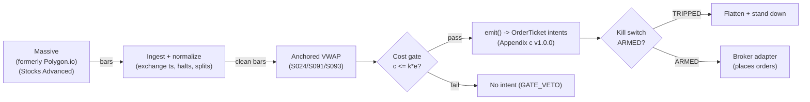

# T067 — Anchored-VWAP Event Trader

Anchors VWAP at the news event and trades the reclaim/failure: price holding above the event-anchored VWAP confirms institutional sponsorship; losing it is the exit. Provenance **A/TM**.

> Tag law: every numeric literal in prose carries one of `[documented]
> [default] [example] [unverified] [internal-est] [measured]` (legend: Appendix
> i v1.0.0). Bibliographic years, volumes, pages, arXiv IDs, section numbers,
> rule codes (C1–C10), fail-safe codes (F1–F5), module IDs, and machine-parsed
> §0 data fields are identifiers, not literals, and are exempt.

## §1 Five-minute reviewer card

| Row | Value |
|---|---|
| Module | T067 — Anchored-VWAP Event Trader, v1.1.0 |
| Edge verdict | `INSUFFICIENT-EVIDENCE` — anchored VWAP is practitioner doctrine; the cited papers document news predictability, not the anchored-VWAP reclaim rule after costs |
| After-cost | `BEFORE-COST` — one-sentence verdict: anchored VWAP is a practitioner measuring stick, and the cited papers support the news trigger — but the reclaim rule's after-cost edge is undocumented |
| Build cost | Tier M · `20–60` h [internal-est] · `$3,000–9,000` loaded [internal-est] |
| Data cost | Research `~$199`/mo [documented] (Massive Stocks Advanced) + news wire [unverified]; production `~$199`/mo [documented] + newsfeed `~$2,000–10,000`/mo [unverified] — news bands indicative, verify before budgeting |
| latency_class | bar / 1-minute |
| risk_class | medium |
| Capacity | moderate [example] — `max_notional = participation_cap × ADV × spread_regime_factor` (see §T2) |
| Executability | Moderate: needs news timestamps + 1-min bars; the anchor discipline is the product |
| Risk summary | Anchor ambiguity: which print is the event anchor is a judgment call — wrong anchors manufacture signals |
| When it dies | news fades (no sponsorship); AVWAP reclaim fails repeatedly; second-hand news |
| Regime gates | Provisional: S093: novel news only [example]; AVWAP reclaim `≥2` bars [example] |
| Emits | `order_intents` (Appendix c v1.0.0) — intents only, never orders |

## §1.5 Cheapest / least-build path

1. **Prototype hour band:** `20–60` h [internal-est] — AVWAP engine + news anchor + reclaim detector + cost/risk harness + fixture.
2. **Cheapest-source row:** min_tier = Massive (formerly Polygon.io, rebrand 2025-10-30 [documented]) Stocks Advanced — cheapest real-time 1-min source candidate [internal-est]; latency_class = bar / 1-minute; required_fields = 1-min OHLCV; news timestamps; price_band = `$199`/mo bars [documented] + newsfeed [unverified] (news pricing unverified — verify before budgeting); build_or_buy = **build the AVWAP on bought bars + news; the anchor rulebook is the product**.
3. **Resource budget:** `1` core, `<2` GB RAM [internal-est]; compute pattern `per_bar`.
4. **Skip list:** multi-anchor AVWAP; overnight anchors.
5. **DO-NOT-CUT list:** causality assertions (`assert fill_event > signal_event`, no-signal-bar-fills test); COST block + callable `expected_cost_bps`; F1–F5 fail-safes + module-state enum; kill-switch state machine + re-arm checklist; decision-log audit records; bona-fide-intent + self-trade prevention; provenance tags on every numeric literal; fixtures + `test_cmd`; secrets via env only.
6. **Escalation gate:** upgrade from cheapest when any holds — anchors `>3`/day per name [default]; reclaim window `>60` min [default].

## §T0 Module contract

### T0.1 Typed signature

```python
def emit(state: ModuleState, signals: list[SignalVector], cfg: Config) -> list[OrderTicket]:
```

`OrderTicket` per Appendix c v1.0.0 — **intents only**; the strategy never
places orders, never holds broker/exchange sessions, never nets intents into
orders. `state` is the module-owned named state vector (`position`,
`sleeve_weights`, `cooldown_until`, `kill_state`, `module_state`); `signals`
are canonical SignalVectors (Appendix b v1.0.0), newest last. The function
handles documented edge cases: empty signals → `UNKNOWN`; halt/auction bars →
freeze per the market-state table; stale inputs → `UNKNOWN` (F4), never
interpolate.

### T0.2 Config dataclass

| Parameter | Type | Default | Range | Status |
|---|---|---|---|---|
| `reclaim_bars` | int | `2` | `1`–`5` | default |
| `R_usd` | float | `400` | `100`–`2,000` | default |
| `stop_atr` | float | `0.75` | `0.5`–`1.5` | default |
| `max_hold_min` | int | `120` | `30`–`240` | default |
| `cooldown_bars` | int | `30` | `0`–`120` | default |
| `cost_gate_k` | float | `0.5` | `0.1`–`2.0` | default |
| `z_long` | float | `0.3` | `0.1`–`1.0` | default |
| `z_short` | float | `-0.3` | `-1.0`–`-0.1` | default |
| `edge_mult` | float | `14.0` | `1`–`50` | example |
| `time_stop` | int | `120` | `30`–`240` | default |
| `adv_pct` | float | `0.02` | `0.001`–`0.1` | default |
| `venue` | str | `"XNAS"` | venue set | default |
| `side_class` | str | `"mixed"` | taker\|maker\|mixed | default |
| `bar_ns` | int | `60000000000` | fixed | fixed |
| `tif` | str | `"DAY"` | DAY\|IOC\|FOK | default |

All defaults tagged per the tag law (status `default` ⇒ `[default]`,
`example`/`fixed` ⇒ their own tags). The test harness `CFG`
(`modules/tests/test_T067.py`) implements this dataclass 1:1 for the listed
parameters; `mode`/`fade`/`exit_flip`/`conf_scale` are harness-sketch extras,
fixed as documented in the test file.

### T0.3 Canonical schema mapping

Vendor columns → canonical Bar schema (Appendix a v1.0.0), stated once here:

| Vendor (Massive, formerly Polygon.io — Stocks Advanced) | Canonical |
|---|---|
| bar open timestamp | `event_ts` (int64 ns UTC, bar open time) |
| `o/h/l/c`, `v` | `open/high/low/close`, `volume` |
| symbol | `symbol` (exchange-qualified) |
| signal value | `sig` (strategy-defined score, Appendix b `value`) |
| gate flag | `gate` ∈ {0, 1} (confirmation gate) |
| `news` | `news` ∈ {0, 1} — novel-news print flag; the rulebook anchor [example] |

### T0.4 Time contract

> Time contract: clock domain UTC, int64 ns; authoritative causality clock =
> `event_ts`; max_skew = `1` ms [default]; jitter budget = `500` µs [default];
> bar-label = open time; staleness TTL = `3`× cadence [default] (F4); gap
> policy = mask, no interpolation; halt/auction → discard contributions
> across reopen.

**Timing box:** `signal@t (per_bar-1min, America/New_York) → earliest fill @open(t+1)`

### T0.5 Market-state table

| State | Module behavior |
|---|---|
| CONTINUOUS_TRADING | Evaluate entries/exits per §T2; emit intents |
| HALTED | Freeze state; emit nothing; `UNKNOWN` on held signals |
| AUCTION | No new entries; exits only via auction-aware intents (MOO/MOC); state `DEGRADED` |
| CLOSED | Emit nothing; state `OFF` |

### T0.6 Module-state enum + error taxonomy

States per Appendix k v1.0.0: `OK | DEGRADED | UNKNOWN | OFF`. Invalid input →
`UNKNOWN`, never interpolate (Appendix f v1.0.0, F1–F5).

| Failure | State | Alert |
|---|---|---|
| Missing/stale input (TTL `3`× cadence [default]) | `UNKNOWN` | page |
| Non-finite / non-positive price reaching module (F2) | `UNKNOWN` | page |
| `event_ts` non-monotonic (F2) | `UNKNOWN` | page |
| Kill-switch TRIPPED | `OFF` (no new intents) | page |
| Halt/auction | `UNKNOWN` / `DEGRADED` (per table) | log |
| Feed anomaly (per §T9 row 1) | `DEGRADED` | notify |
| Anything unmapped | `UNKNOWN` | page |

### T0.7 Risk contract + kill switch

```yaml
risk_contract:
  per_trade_R: `400`            # [example] — N = floor(R/stop_dist), R = $400 per trade
  max_adverse_per_trade: `0.75` ATR [example]   # [example]
  daily_loss_stop: `-1200` USD [example]          # [example]
  max_gross: `3`M USD [example]                # [example]
  kill_conditions:                        # any one trips -> TRIPPED
  - "daily loss <= -$1,200 -> TRIPPED"
  - "news feed stale (no fresh print within 3x cadence TTL) -> TRIPPED"
  - "3 consecutive invalid-input batches (F2) -> TRIPPED"
  sizing_governors:                       # NOT kill conditions: governors, not trips
  - "three failed reclaims -> halve R for the next anchor [example]"
  enforcement: intraday-hard              # breach flattens; no review-only mode
```

**Calibration recipe:** `per_trade_R` is the sizing input in §T2 (dollar-risk
`N = ⌊R/stop_dist⌋` or the confidence-scaled equivalent); re-estimate `R`
from the trailing `60`-day [default] per-trade P&L distribution so that a
`3`σ [default] adverse day stays inside `daily_loss_stop`. `max_gross` is
checked pre-emit on every ticket (C4). Kill-switch state machine:

```
ARMED → TRIPPED → RECOVERY → ARMED
```

- `ARMED → TRIPPED`: any kill condition fires → cancel all working intents
  (idempotent cancels), flatten at marketable limits, set module state `OFF`,
  write a `KILL_TRIP` decision record (Appendix g v1.0.0).
- `TRIPPED → RECOVERY`: re-arm checklist **all green** — `1.` feed healthy
  (no stale bars); `2.` decision log reconciled against broker ledger, no
  orphan tickets; `3.` root cause of the trip identified and the offending
  config reverted or re-calibrated; `4.` risk owner sign-off recorded.
- `RECOVERY → ARMED`: one clean evaluation pass over the fixture
  (`test_cmd` green) with no new trip, then resume.

### T0.8 Ops tail

- **Schedule:** RTH on news events [documented]; owner: event-arb on-call.
- **Health checks:** fixture replay (`test_cmd`) green on deploy; live
  staleness watchdog at `3`× cadence; kill-switch drill monthly [default].
- **Alert table:** page on `UNKNOWN` > `30` s [default], on any kill trip, or
  bounds violation; notify on `DEGRADED`; log on single dropped bars.
- **Resource budget:** `1` vCPU [internal-est], `2` GB RAM [internal-est] + news feed; state is O(`1`) per symbol [internal-est].
- **Runbook stub:** `1.` confirm feed; `2.` replay fixture; `3.` if red → set
  `OFF`, page; `4.` reconcile decision log before re-arm; `5.` complete the
  re-arm checklist (§T0.7) before `ARMED`.

### T0.9 Secrets (env-only)

`POLYGON_API_KEY` via environment only. No secrets in this file, fixtures, or logs
(CI secrets-grep).

### T0.10 May / must-NOT

> **May:** emit `OrderTicket` intents per Appendix c v1.0.0; track intent-side
> state; issue cancel-replace via new tickets. **Must-NOT:** place orders on
> any venue, hold broker/exchange sessions, net intents into orders inside the
> strategy, or treat the intent-side state machine as broker wire truth.

## §T1 Legacy (subsumed by §1)

Legacy §T1 content is the §1 reviewer card above; this header is retained so
section numbering stays frozen.

## §T2 Specification

### Universe

Liquid US large-caps on 1-min bars [example]; AVWAP anchored at novel news prints (S091/S093); reclaim = `≥2` bars above AVWAP [example].

### Entry rule (Boolean — no prose-only conditions)

```
ENTER_LONG  := (novel news anchor set) AND (sig >= z_long for >= reclaim_bars consecutive bars)
               AND (gate == 1) AND (expected_cost_bps(...) <= cost_gate_k * edge_bps)
ENTER_SHORT := mirror: (negative news) AND (sig <= z_short for >= reclaim_bars consecutive bars)
               AND (gate == 1) AND (expected_cost_bps(...) <= cost_gate_k * edge_bps)
FLAT        := otherwise
```

In the S024-computed form: `close > AVWAP` for `>= reclaim_bars` (`2`
[default]) consecutive bars [example]; the test harness's z-mode evaluates
the rule on the S024 deviation score (`sig`), which is what the fixture
carries. `reclaim_bars` and the `news` anchor are normative — the harness
implements both (acceptance tests 7–8).

### Exits (with post-exit cooldown)

```
EXIT := (close crosses back through AVWAP)   # sponsorship lost [example]
        OR (stop = 0.75 ATR hit)                         # [example]
        OR (120 min elapsed)                             # [example]
ON_EXIT: cooldown_until = now + cooldown_bars * bar_ns   # C10
```

### Position sizing (fenced function)

```python
def size_shares(risk_budget_R, stop_distance, vol_estimate=None, ADV_cap=None, cost=None):
    """Dollar-risk sizing, canonical 5-arg form (normative)."""
    n = int(risk_budget_R // max(stop_distance, 1e-9))  # [example] — R over stop distance
    if vol_estimate is not None and vol_estimate > 0:   # [default] guard
        n = min(n, int(risk_budget_R // max(vol_estimate, 1e-9)))  # [example] — vol-aware floor
    if ADV_cap is not None:
        n = min(n, int(ADV_cap))                        # [example] — participation cap
    return max(1, n)                                    # [default]
```

The test harness `size_qty` implements this function's `risk` branch
(`R_usd = 400.0` [default], `stop_dist` from the tape); `vol_estimate` /
`ADV_cap` / `cost` are honored when provided and reserved otherwise.

### Risk limits

| Limit | Value |
|---|---|
| Per-trade risk | `$400` [example] |
| Daily loss stop | `−$1,200` [example] |
| Max hold | `120` min [example] |
| Capacity | `max_notional = participation_cap × ADV × spread_regime_factor` [example]; `participation_cap = 0.02` [example]; e.g. ADV `$5M` [example] → max_notional `$100k` [example] |

### COST block (single source of truth)

| Component | Value (bps) | Basis |
|---|---|---|
| Spread | `2.00` | [example] — post-news spreads |
| Fees | `0.40` | `$0.005`/share/side [documented] (IBKR Pro Fixed; min `$1.00`/order, max `1%` of trade value) × a `$250` [example] stock, round-trip |
| Borrow | `0.0` | [default] — intraday only; no overnight shorts in the reference build [example]; shorts add C7 locate cost |
| Impact | `0.50` | [example] — post-news participation |
| **Total reference** | `2.90` | [example] |

`fee_schedule_as_of`: `2026-09-10` [documented] — IBKR Pro Fixed
commissions (https://www.interactivebrokers.com/en/pricing/commissions-home.php,
fetched 2026-09-10). Exchange-direct alternative: Nasdaq taker `$0.0030`/share
[documented] (nasdaqtrader.com price list). `side: mixed` [default]
(marketable entries near the touch, marketable exits);
venue/tier/source: XNAS / Massive (formerly Polygon.io) Stocks Advanced [example]. `borrow_bps_per_day`: `0.0`
[default] — intraday only; no borrow in the reference build [example].

`urgency` ∈ {normal, high} [default]; the reference stack is calibrated for
`urgency="normal"` only — `urgency="high"` raises `impact_bps`
[unverified]; calibrate in the build phase. `notional`/`adv_pct`/`venue`
are accepted and versioned now; the L2 constant-stack reference build
returns the same stack for all venues (Session-02 cheapest build) —
per-venue calibration is the §1.5 escalation path.

Re-stating cost numbers outside
this block is a validation failure.

```python
def expected_cost_bps(notional, adv_pct, venue, side, urgency) -> float:
    '''Callable cost model — single source of truth (this block).'''
    spread_bps = 2.0   # [example] — post-news spreads
    fee_bps = 0.4         # $0.005/share [documented, IBKR Pro Fixed] x $250 [example] stock, round-trip
    borrow_bps = 0.0   # [default] — intraday only; no overnight shorts in the reference build [example]
    impact_bps = 0.5   # [example] — post-news participation
    if side == "maker":
        fee_bps = -abs(fee_bps) * 0.5  # rebate proxy [example]
    return spread_bps + fee_bps + borrow_bps + impact_bps
```

### Execution / fill model table

| Aspect | Assumption |
|---|---|
| Latency | 1-min bars; enter on the 2nd reclaim bar [example] |
| Entries | With the AVWAP side after the reclaim |
| Exits | AVWAP loss, stop, or 120-min clock |
| Partial fills | Per Appendix c v1.0.0 FIFO |
| Adverse fill | Post-news bars are wide — reclaim entries slip [example] |

### Robustness

Anchor = the news print bar [example] (rulebook-fixed, not judgment); reclaim `≥2` bars [example]; novel news only (S093); `120`-min max hold [example] keeps the book out of drift decay.

### Compliance sub-block (C1–C10+)

| Code | Rule: trigger → check → action → log |
|---|---|
| C1 | Self-match / STP: every ticket carries self-trade-prevention instructions for the broker adapter; trigger = two tickets same symbol opposite side within `1` s [default] → check resting-interest overlap → action = cancel the newer ticket → log `COMPLIANCE_BLOCK` |
| C2 | Bona-fide intent: every entry intent must pass the cost gate (`expected_cost_bps(...) <= k * edge_bps`) and fit risk limits; trigger = gate fail → check = re-evaluate → action = no ticket emitted → log `GATE_VETO` |
| C3 | Message-rate / cancel-to-trade: trigger = `>50` intents/symbol/min [default] or cancel-to-trade `>10:1` [default] → check venue thresholds → action = throttle to `5`/min [default] + alert → log `COMPLIANCE_BLOCK` |
| C4 | Pre-trade fat-finger trio: price collar `±5`% vs reference [default] → reject; max notional per ticket `$2,000,000` [default] → reject; max `50` tickets/symbol/`5` min [default] → throttle; all rejections logged |
| C5 | Decision-log schema compliance (Appendix g v1.0.0): every intent, veto, cancel-replace, kill transition logged with inputs_hash/params_hash, hash-chained; trigger = missing record → action = halt to `UNKNOWN` |
| C6 | Halt/auction state table: per §T0.5 — HALTED freezes, AUCTION blocks new entries, CLOSED emits nothing; trigger = state change → check market-state table → action = freeze/cancel per table → log |
| C7 | Locate check (short sales): trigger = SHORT intent → check = easy-to-borrow list or live locate obtained pre-emit → action = block intent without locate → log `GATE_VETO`; Reg-SHO threshold securities never shorted |
| C8 | Public-dissemination gate: no signal/intent data published externally without review; trigger = export request → check = review sign-off → action = block until signed |
| C9 | Data-entitlement assertions per dataset (Appendix j v1.0.0): trigger = entitlement-class change or unlicensed symbol → check §T5 data-rights row → action = stand down affected symbols → log |
| C10 | Post-exit cooldown: trigger = exit or compliance block → check `now < cooldown_until` → action = no re-entry until ``30`` bars [default] elapse → log |
| C11 | Anchor rulebook: anchors only at rulebook-defined news prints → check anchor log → action = reject ad-hoc anchors → log `COMPLIANCE_BLOCK` |

### Parameter table

| Parameter | Symbol | Value | Tag | Sensitivity |
|---|---|---|---|---|
| Reclaim bars | `reclaim_bars` | `2` | [default] | high |
| Per-trade R | `R_usd` | `$400` | [example] | medium |
| Stop | `stop_atr` | `0.75` ATR | [example] | medium |
| Max hold | `max_hold_min` | `120` min | [example] | low |
| Cost-gate k | `cost_gate_k` | `0.5` | [default] | high |
| z_long | `z_long` | `0.3` | [default] | high |
| z_short | `z_short` | `-0.3` | [default] | high |
| Edge multiplier | `edge_mult` | `14.0` | [example] | high |
| Time stop | `time_stop` | `120` min | [default] | low |
| ADV participation | `adv_pct` | `0.02` | [default] | medium |

### Timing box

`signal@t (per_bar-1min, America/New_York) → earliest fill @open(t+1)`

## §T3 Math + normative pseudocode

Event-anchored VWAP
$\mathrm{AVWAP}_t = \sum_{i \ge t_0} P_i V_i / \sum_{i \ge t_0} V_i$ with anchor
$t_0$ = the novel-news print bar [example, rulebook-fixed]. Enter long when
$C_t > \mathrm{AVWAP}_t$ for $\ge 2$ consecutive bars [example] (reclaim =
sponsorship). Exit on loss of AVWAP, $0.75 \times$ ATR stop [example], or
$120$ minutes [example]. Tetlock et al. (2008) / Chan (2003) support the
news trigger; the reclaim rule is practitioner doctrine.

**Normative pseudocode** (pseudocode is normative; prose is commentary):

```
function emit(state, signals, cfg) -> list[OrderTicket]:
    assert signals non-empty else return UNKNOWN                    # F1
    for bar t in signals (newest last):
        assert market_state == CONTINUOUS_TRADING else freeze/no-entry per §T0.5
        s = sig[t]  # S024 VWAP-deviation score (S024-computed form: close > AVWAP); data <= t only
        assert isfinite(s) else return UNKNOWN                      # F2
        if news[t] == 1: anchor = t; reclaim_long = 0; reclaim_short = 0   # rulebook anchor
        if anchor is not None:
            reclaim_long  = reclaim_long  + 1 if s >= z_long  else 0   # consecutive, side-aware
            reclaim_short = reclaim_short + 1 if s <= z_short else 0
        edge_bps = abs(s) * edge_mult                                 # [example] — modeled per-trade edge in bps
        cost = expected_cost_bps(notional, adv_pct, venue, side, urgency)
        cost_ok = expected_cost_bps(...) <= k * edge_bps
        # ^^^ normative cost-gate predicate: expected_cost_bps(...) <= k * edge_bps
        if state.position is None and state.module_state == OK:
            novel = (anchor is not None)                               # novel news printed
            reclaim_ok = (reclaim_long >= reclaim_bars) or (reclaim_short >= reclaim_bars)
            fresh = (t.intent_ts >= state.cooldown_until)              # C10 post-exit cooldown
            if novel and reclaim_ok and fresh and (gate == 1) and cost_ok:
                ticket = OrderTicket(symbol, side, qty, limit, tif,
                                     ticket_id=uuid(), parent_signal="S024@t",
                                     intent_ts=t.event_ts, state=NEW)
                log_decision(ticket, inputs_hash, params_hash)     # C5 / Appendix g
                assert fill_event > signal_event                    # t->t+1 causality
        else if state.position is not None:
            if ((AVWAP recross) or (stop hit) or (120 min)):
                emit exit intent (cancel-replace rules, Appendix c) # C1
                state.cooldown_until = t + cooldown_bars            # C10
                assert fill_event > signal_event
    return tickets
```

Causality: every quantity at bar `t` uses only data `≤ t`; the earliest fill
is bar `t+1`'s open. Mandatory unit test: no-signal-bar fills
(`assert fill_event > signal_event`).

## §T4 Worked example (fixture-backed)

- Tape: `modules/fixtures/T067_tape.csv` — `# TYPE: validation-run`;
  `12` bars [example] with a `news` column (novel-news print flag — the
  rulebook anchor [example]), all numbers synthetic, seed `10067` [example];
  `event_ts` int64 ns UTC, bar-labeled by open time.
- Expected outputs: `modules/fixtures/T067_expected.csv` — per-ticket
  intents with the cost-function call recorded (inputs → bps → $);
  tolerance `1e-6` [default] on floats.
- Acceptance tests (`modules/tests/test_T067.py`, `8` tests):
  `1.` fixture replays to expected (hand-checked rows below); `2.` cost-gate
  predicate passes on the fixture's large edges and blocks a tiny-edge
  counter-case (`k = 0.5` [default]); `3.` no-signal-bar fills
  (`fill_ts > signal_ts` on every ticket); `4.` kill-switch trips on the
  breach scenario and re-arms through the checklist
  (`ARMED → TRIPPED → RECOVERY → ARMED`); `5.` invalid input (non-positive
  price) → `UNKNOWN`, never interpolated; `6.` hand-check literals
  (qty / bps / $) match the generation run; `7.` reclaim rule: a single bar
  above `z_long` emits nothing, two consecutive bars emit exactly one entry;
  `8.` no novel-news anchor → no entry at all.
- `test_cmd`: `python3 -m pytest modules/tests/test_T067.py -q` → exits `0`.

**Cost-function calls on the fixture** (inputs → bps → $, from the harness run):

| ticket | notional ($) | adv_pct | side | edge_bps | cost_bps | cost_$ | gate |
|---|---|---|---|---|---|---|---|
| T-T067-2-0 | 100022.88 | 0.0200 | mixed | 7.0000 | 2.9000 | 29.0066 | PASS |
| T-T067-6-X | 99994.76 | 0.0200 | mixed | 0.0000 | 2.9000 | 28.9985 | N/A |

**Where the example is optimistic:** the fixture encodes the S024/S091/S093
*outputs* (deviation score `sig`, novel-news flag `news`) rather than raw
AVWAP computation + real news timestamps; production faces anchor ambiguity
(which print is t0) and post-news slippage. Bar `1`'s `sig` is `0.35`
[example] — just above the `z_long = 0.3` [default] reclaim threshold — so
the fixture exercises the `>=2`-bar reclaim count at bar `2`.



## §T5 Dependencies & data

Generated-from-`deps.yaml` shape (CI symmetry); hand-listed:

| Module | Role | Version pin |
|---|---|---|
| S024 — VWAP deviation | Trigger | 1.0.0 |
| S091 — News sentiment | Anchor | 1.0.0 |
| S093 — News novelty | Gate | 1.0.0 |

| Field | Type | Granularity | Source tier | Notes |
|---|---|---|---|---|
| 1-min OHLCV | float/int | 1-min | Tier 1 | AVWAP |
| News timestamps | int64 | per story | Tier 2 | anchors |

**Family note:** family `D` = intraday microstructure / auction strategies.

**Data rights row** (Appendix j v1.0.0): US equities 1-min bars + news via Massive
(formerly Polygon.io) Stocks Advanced, `rights: licensed`; license scope = research + stated
production symbol count; raw ticks never leave our systems — fixtures are
synthetic; entitlement = professional/internal, no display; retention per
vendor terms, purge path in runbook. Entitlement-class change → §1.5
escalation gate.

## §T6 Local build (M5 Max / 128 GB)

Feasible on the M5 Max (Tier M, `20–60` h ≈ `$3k–9k` eng [internal-est] + data per
§1). Bottleneck is the anchor rulebook, not compute.

## §T7 Buy vs build

Build the AVWAP on bought bars + news; the anchor rulebook is the product. Verdict: rulebook-fixed anchors, never judgment.

## §T8 Efficacy — documented evidence

| Study / source | Market & period | Metric | Before/after cost | Caveat |
|---|---|---|---|---|
| Tetlock, Saar-Tsechansky & Macskassy (2008), J. Finance | Firm-specific news | negative words predict earnings and returns [documented] | `BEFORE-COST` (predictability) | supports the news trigger |
| Chan (2003), JFE | US stocks | post-news drift; no-news reversal [documented] | `BEFORE-COST` (anomaly evidence) | the drift window, not the reclaim rule |
| Berkowitz, Logue & Noser (1988), J. Finance | NYSE | transaction-cost measurement [documented] | `BEFORE-COST` (cost measurement) | the cost lens |

Selection disclosure: these are the sources surfaced by the chapter's research
pass (Stage 167/200). **Honest bottom line.** For a ≤$1M paper operation: T067 combines a documented news trigger with practitioner AVWAP doctrine — the reclaim rule's after-cost edge is undocumented, and anchor ambiguity is the silent killer.

## §T9 Failure modes & regime gates

### Regime gates (machine records)

Provisional until the R001–R050 annotation pass; `regime_ids` in §0 stays
`[]`. Restrictive default: unknown regime → the restrictive action in each row.

| regime_id | direction | mechanism | condition | action | min_lag | unknown_behavior |
|---|---|---|---|---|---|---|
| PROV-NEWS-NOVELTY | amplifies | post-news drift persists while the anchor news is novel (Chan 2003 [documented]); second-hand news mean-reverts | S093 novelty == 1 at anchor | veto | 0 | veto_entry |
| PROV-SPONSORSHIP | amplifies | reclaim count measures institutional sponsorship | reclaim >= reclaim_bars | none | 0 | halve |
| PROV-HALT | degrades | halts/auctions break the 1-min reclaim cadence | market_state != CONTINUOUS_TRADING | pause_entry | immediate | veto_entry |

### Failure modes & pitfalls

| # | Trigger → Detect → Action → Recovery | check: |
|---|---|---|
| 1 | AVWAP loss: recross against → detect: recross → action: exit → recovery: re-arm on reclaim | `check: exit on recross` |
| 2 | Ad-hoc anchor: anchor not at a rulebook print → detect: anchor log → action: reject → recovery: n/a | `check: anchor_rulebook` |
| 3 | Stale news: feed stale → detect: staleness → action: veto new anchors → recovery: re-pin | `check: feed_fresh` |
| 4 | Stop: 0.75 ATR adverse → detect: stop monitor → action: exit → recovery: next event | `check: exit on stop` |
| 5 | Cost blowup → detect: cost gate fails → action: stand down → recovery: re-pin | `check: expected_cost_bps(...) <= k * edge_bps` |
| 6 | Lookahead: AVWAP uses future bars → detect: causality audit → action: halt → recovery: re-run test | `check: all(fill_ts > signal_ts)` |

## §T10 Source log + unverified leads

**Sources** (citable facts only):

1. Berkowitz, S. A., Logue, D. E. & Noser, E. A. (1988) [documented]. "The Total Cost of Transactions on the NYSE." *Journal of Finance* 43(1): 97–112. — transaction-cost measurement.
2. Tetlock, P. C., Saar-Tsechansky, M. & Macskassy, S. (2008) [documented]. "More Than Words." *Journal of Finance* 63(3): 1437–1467. — news text predicts fundamentals; the trigger.
3. Chan, W. S. (2003) [documented]. "Stock Price Reaction to News and No-News." *Journal of Financial Economics* 70(2): 223–260. — post-news drift; the holding context.

**Chatbot source log.** Grok answered Q-TB7-1..3 (2026-09-10); all claims independently verified or labeled unverified.

**Source verification log (deep review, 2026-09-11 — what was verified, and where).**

- Vendor identity: Polygon.io rebranded as Massive effective 2025-10-30 [documented] (massive-com client-python v2.0.1 release notes, https://github.com/massive-com/client-python/releases/tag/v2.0.1) — vendor fields corrected from "Polygon.io" to "Massive (formerly Polygon.io)".
- Data price: Massive Stocks Advanced `$199`/mo [documented] (https://massive.com/stocks-data; third-party 2026 comparisons confirm Starter `$29`/mo, Developer `$79`/mo, Advanced `$199`/mo) — §1/§1.5 price bands anchored; newswire pricing stays [unverified].
- Fee basis: IBKR Pro Fixed USD `$0.005`/share (min `$1.00`/order, max `1%` of trade value) [documented] (https://www.interactivebrokers.com/en/pricing/commissions-home.php, fetched 2026-09-10) — COST fee component upgraded from [example] to [documented]; `fee_schedule_as_of` → `2026-09-10`. Exchange-direct alternative: Nasdaq taker `$0.0030`/share [documented] (nasdaqtrader.com price list).
- Entry-rule gap closed: the `>=2`-bar reclaim condition and the novel-news anchor were prose-only; they are now normative in §T2/§T3, implemented in the test harness (`reclaim_bars`, `news` column), and covered by acceptance tests 7–8 (was 6 tests).
- Kill conditions corrected: "three failed reclaims → halve size" was listed as a kill condition; it is a sizing governor, not a trip — moved to `sizing_governors`; proper trip conditions (daily loss, stale news feed, repeated F2 batches) added.

**Unverified leads** (chatbot-only — never in evidence tables):

- Grok Q-TB7-3: AVWAP-reclaim hit-rates — chatbot figures, unverified; build-phase measurement task.
- Real-time newswire feed pricing (Benzinga/Dow Jones/Bloomberg event feeds): no published band sourced in this pass — the `$2,000–10,000`/mo production band is an [unverified] placeholder; see Q-T067-DR-1.

**GROK-NEEDED** (web search cannot answer these; exact questions for the Grok research pass):

- Q-T067-DR-1: What are the 2026 published price bands for real-time equities newswire feeds with machine timestamps usable as news anchors (e.g., Benzinga newsfeed, Dow Jones Newswires, Bloomberg event feeds) — flat vs per-symbol pricing, and which expose a sub-second story-published timestamp field?
- Q-T067-DR-2: Are there any published after-cost hit-rate or P&L figures for anchored-VWAP reclaim rules (enter when price holds above event-anchored VWAP for ≥N bars) — practitioner white papers, broker research, or prop-desk notes, any market?
- Q-T067-DR-3: What self-trade-prevention instruction semantics do the common US broker adapters accept on order tickets (IBKR, Schwab, TradeStation) — is C1's "cancel the newer ticket" implementable at the adapter, or does it require pre-trade self-match simulation?
- Q-T067-DR-4: What are the timestamp semantics of Massive's (formerly Polygon.io) news endpoint (story-published vs feed-received, timezone, precision) — needed to pin the anchor rulebook's t0 to the millisecond?

---

## Appendix — AI build prompt (T067)

Copy-paste into any chat agent:

> Build module **T067 — Anchored-VWAP Event Trader** (v1.1.0) per `notes/module-template.md` v1.0.0
> and this file's §T0 contract.
> Cheapest path (§1.5): prototype `20–60` h [internal-est]; cheapest data
> candidate Massive (formerly Polygon.io) Stocks Advanced at `$199`/mo [documented] + newsfeed [unverified]; compute pattern `per_bar`; skip
> multi-anchor AVWAP; overnight anchors for now.
> Implement `emit(state, signals, cfg) -> list[OrderTicket]`
> (Appendix c v1.0.0) with the §T3 normative pseudocode, including the
> rulebook anchor (`news` flag), the `reclaim_bars` (`2` [default])
> consecutive-bar reclaim condition, the cost-gate predicate
> `expected_cost_bps(...) <= k * edge_bps`, and
> `assert fill_event > signal_event`. Wire F1–F5 (Appendix f v1.0.0): invalid
> input → `UNKNOWN`, never interpolate. Implement the kill-switch state
> machine `ARMED → TRIPPED → RECOVERY → ARMED` with the §T0.7 re-arm
> checklist. Log decisions per Appendix g v1.0.0. Secrets via env only.
> Run the fixture `modules/fixtures/T067_tape.csv`
> (`# TYPE: validation-run`) against `modules/fixtures/T067_expected.csv`
> (tolerance `1e-6` [default]).
> **Definition of done:** `python3 -m pytest modules/tests/test_T067.py -q`
> exits `0` (8 acceptance tests). Tag every numeric literal you add with the unified enum
> (Appendix i v1.0.0); put anything unverifiable in §T10 unverified leads.
