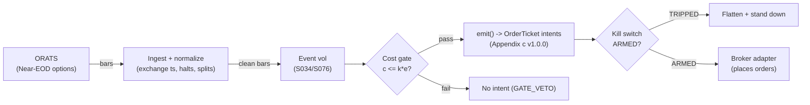

# T068 — Scheduled-Event Vol Expansion

Buys scheduled-event volatility: implied vol crushes into known events (FOMC, CPI, earnings) and realized vol expands after — long gamma through the event, delta-hedged. Provenance **A/TM**.

> Tag law: every numeric literal in prose carries one of `[documented]
> [default] [example] [unverified] [internal-est] [measured]` (legend: Appendix
> i v1.0.0). Bibliographic years, volumes, pages, arXiv IDs, section numbers,
> rule codes (C1–C10), fail-safe codes (F1–F5), module IDs, and machine-parsed
> §0 data fields are identifiers, not literals, and are exempt.

## §1 Five-minute reviewer card

| Row | Value |
|---|---|
| Module | T068 — Scheduled-Event Vol Expansion, v1.1.0 |
| Edge verdict | `INSUFFICIENT-EVIDENCE` — the pre-event IV run-up and post-event crush are documented (Nikkinen & Sahlström 2004: S&P 100 IV rises before FOMC meetings, falls right after), but the long-gamma event trade's after-cost edge is not in the cited papers — the crush usually wins |
| After-cost | `BEFORE-COST` — one-sentence verdict: scheduled events move implied vol in documented ways, but the long-gamma trade fights the crush — no cited paper documents after-cost P&L for it |
| Build cost | Tier M+ · `40–100` h [internal-est] · `$6,000–30,000` loaded [internal-est] |
| Data cost | Research `~$99–299`/mo [documented — ORATS near-EOD $99/mo; Delayed Data API $199/mo]; production `~$99–299`/mo [documented] — individual licenses; professional/enterprise higher |
| latency_class | event / daily |
| risk_class | high |
| Capacity | moderate [example] — event options liquidity |
| Executability | Moderate: needs options data + event calendar; the hedge is the product |
| Risk summary | Vol crush: implied vol collapses into the event faster than realized expands — the long-gamma book bleeds theta |
| When it dies | non-eventful events (no realized expansion); crush deeper than modeled; wide event-week spreads |
| Regime gates | Provisional machine records PR01–PR03 in §T9 (PR prefix; avoids collision with the R001–R050 regime-module namespace) |
| Emits | `order_intents` (Appendix c v1.0.0) — intents only, never orders |

## §1.5 Cheapest / least-build path

1. **Prototype hour band:** `40–100` h [internal-est] — event calendar + IV ranker + gamma pricer + hedge engine + fixture.
2. **Cheapest-source row:** min_tier = ORATS Near end-of-day historical options dataset — cheapest data source candidate [documented on price]; latency_class = event / daily; required_fields = option chains (strike, expiry, IV, delta/gamma/vega/theta, bid/ask at the `3:46`pm ET snapshot [documented]) + event calendar (FOMC/CPI/NFP dates); price_band = `$99`/mo recurring individual + `$599` one-time `2007` backfill [documented — orats.com near-eod-data, 2026-09-10]; ORATS Delayed Data API `$199`/mo with `20,000` requests [documented — orats.com data-api] covers the earnings/endpoints path; build_or_buy = **buy options data + calendar; build the gamma engine — the hedge is the product**. Event-calendar note: ORATS names Wall Street Horizon as its corporate-actions partner [documented — orats.com dividends page]; WSH pricing is [unverified] — see §T10 / GROK-NEEDED.
3. **Resource budget:** `2` cores, `8` GB RAM [internal-est]; compute pattern `per_event`.
4. **Skip list:** unscheduled events; earnings-week single names (see T058); intraday gamma scalping (needs the `$599`/mo [documented] Live Intraday API — escalation, not MVP).
5. **DO-NOT-CUT list:** causality assertions (`assert fill_event > signal_event`, no-signal-bar-fills test); COST block + callable `expected_cost_bps`; F1–F5 fail-safes + module-state enum; kill-switch state machine + re-arm checklist; decision-log audit records; bona-fide-intent + self-trade prevention; provenance tags on every numeric literal; fixtures + `test_cmd`; secrets via env only.
6. **Escalation gate:** upgrade from cheapest when any holds — events `>2`/week [default]; gamma scalping intraday [default] (→ Live Intraday API `$599`/mo [documented]); professional/redistribution licensing (enterprise pricing, verify with ORATS).

## §T0 Module contract

### T0.1 Typed signature

```python
def emit(state: ModuleState, signals: list[SignalVector], cfg: Config) -> list[OrderTicket]:
```

`OrderTicket` per Appendix c v1.0.0 — **intents only**; the strategy never
places orders, never holds broker/exchange sessions, never nets intents into
orders. `state` is the module-owned named state vector (`position`,
`sleeve_weights`, `cooldown_until`, `kill_state`, `module_state`); `signals`
are canonical SignalVectors (Appendix b v1.0.0), newest last. The function
handles documented edge cases: empty signals → `UNKNOWN`; halt/auction bars →
freeze per the market-state table; stale inputs → `UNKNOWN` (F4), never
interpolate.

### T0.2 Config dataclass

| Parameter | Type | Default | Range | Status |
|---|---|---|---|---|
| `iv_rank_min` | float | `70.0` | `50`–`90` | calibrate |
| `tenor_days` | int | `7` | `3`–`30` | calibrate |
| `delta_band` | float | `0.15` | `0.05`–`0.30` | default |
| `vega_budget` | float | `3000` | `1000`–`10000` | calibrate |
| `cooldown_bars` | int | `5` | `0`–`20` | default |
| `cost_gate_k` | float | `0.5` | `0.1`–`2.0` | default |
| `z_long` | float | `20.0` | `5`–`50` | calibrate |
| `time_stop` | int | `5` | `1`–`20` | default |

All defaults tagged per the tag law (status `default` ⇒ `[default]`). **Calibration recipe:** grid-search `iv_rank_min` ∈ {`60`, `70`, `80`} [example], `tenor_days` ∈ {`5`, `7`, `10`} [example], `vega_budget` ∈ {`1500`, `3000`, `5000`} [example] on pre-`2024` [example] scheduled events, select on after-cost Sharpe with the `60`-day [default] trailing `per_trade_R` estimator from §T0.7, confirm on `2024+` [example] OOS with a `5`-day [default] embargo gap.

### T0.3 Canonical schema mapping

Vendor columns → canonical Bar schema (Appendix a v1.0.0), stated once here:

| Vendor (ORATS Near-EOD historical options) | Canonical |
|---|---|
| bar open timestamp | `event_ts` (int64 ns UTC, bar open time) |
| underlying `o/h/l/c`, underlying volume | `open/high/low/close`, `volume` |
| `ticker` | `symbol` (exchange-qualified) |
| S034 event score | `sig` (strategy-defined score, Appendix b `value`; `sig >= z_long` = scheduled event within `5` d [example]) |
| confirmation flag | `gate` ∈ {0, 1} (confirmation gate) |
| `strike` | `strike` (float, option contract) |
| `expirDate` / `dte` | `expiry` / `dte` (int days) |
| `callMidIv` / `putMidIv` / `smvVol` | `iv` (smoothed mid IV; `smvVol` is the ORATS smoothed market value [documented]) |
| `delta`, `gamma`, `vega`, `theta`, `rho` | `delta`, `gamma`, `vega`, `theta`, `rho` (per-contract greeks) |
| `callBidPrice`, `callAskPrice`, `putBidPrice`, `putAskPrice` | `bid`, `ask` per leg (from the `3:46`pm ET snapshot [documented]) |
| event date | `event_date` (YYYY-MM-DD, America/New_York) |

The fixture abstracts the option package to a synthetic underlying tape
(`SPX-EVT`); the chain fields above are the production contract surface.
`stop_dist` carries the per-trade dollar-stop distance for the canonical
sizing function (§T2).

### T0.4 Time contract

> Time contract: clock domain UTC, int64 ns; authoritative causality clock =
> `event_ts`; max_skew = `1` ms [default]; jitter budget = `500` µs [default];
> bar-label = open time; staleness TTL = `3`× cadence [default] (F4); gap
> policy = mask, no interpolation; halt/auction → discard contributions
> across reopen.

**Timing box:** `signal@t (per_event, America/New_York) → earliest fill @open(t+1)`

### T0.5 Market-state table

| State | Module behavior |
|---|---|
| CONTINUOUS_TRADING | Evaluate entries/exits per §T2; emit intents |
| HALTED | Freeze state; emit nothing; `UNKNOWN` on held signals |
| AUCTION | No new entries; exits only via auction-aware intents (MOO/MOC); state `DEGRADED` |
| CLOSED | Emit nothing; state `OFF` |

### T0.6 Module-state enum + error taxonomy

States per Appendix k v1.0.0: `OK | DEGRADED | UNKNOWN | OFF`. Invalid input →
`UNKNOWN`, never interpolate (Appendix f v1.0.0, F1–F5).

| Failure | State | Alert |
|---|---|---|
| Missing/stale input (TTL `3`× cadence [default]) | `UNKNOWN` | page |
| Non-finite / non-positive price reaching module (F2) | `UNKNOWN` | page |
| `event_ts` non-monotonic (F2) | `UNKNOWN` | page |
| Kill-switch TRIPPED | `OFF` (no new intents) | page |
| Halt/auction | `UNKNOWN` / `DEGRADED` (per table) | log |
| Feed anomaly (per §T9 row 1) | `DEGRADED` | notify |
| Anything unmapped | `UNKNOWN` | page |

### T0.7 Risk contract + kill switch

```yaml
risk_contract:
  per_trade_R: `1500`            # [example] — vega-weighted; calibrate from live event P&L
  max_adverse_per_trade: `100`% of premium [example]   # [example]
  daily_loss_stop: `-5000` USD [example]          # [example]
  max_gross: `2`x [example]                # [example]
  kill_conditions:                        # any one trips -> TRIPPED
  - "IV crush > 30% pre-event with no position -> veto new entries"
  - "daily loss <= -$5,000 -> TRIPPED"
  - "event cancelled -> flatten"
  enforcement: intraday-hard              # breach flattens; no review-only mode
```

**Calibration recipe:** `per_trade_R` is the sizing input in §T2 (dollar-risk
`N = ⌊R/stop_dist⌋` or the confidence-scaled equivalent); re-estimate `R`
from the trailing `60`-day [default] per-trade P&L distribution so that a
`3`σ [default] adverse day stays inside `daily_loss_stop`. `max_gross` is
checked pre-emit on every ticket (C4). Kill-switch state machine:

```
ARMED → TRIPPED → RECOVERY → ARMED
```

- `ARMED → TRIPPED`: any kill condition fires → cancel all working intents
  (idempotent cancels), flatten at marketable limits, set module state `OFF`,
  write a `KILL_TRIP` decision record (Appendix g v1.0.0).
- `TRIPPED → RECOVERY`: re-arm checklist **all green** — `1.` feed healthy
  (no stale bars); `2.` decision log reconciled against broker ledger, no
  orphan tickets; `3.` root cause of the trip identified and the offending
  config reverted or re-calibrated; `4.` risk owner sign-off recorded.
- `RECOVERY → ARMED`: one clean evaluation pass over the fixture
  (`test_cmd` green) with no new trip, then resume.

### T0.8 Ops tail

- **Schedule:** event calendar [documented]; owner: vol-arb on-call.
- **Health checks:** fixture replay (`test_cmd`) green on deploy; live
  staleness watchdog at `3`× cadence; kill-switch drill monthly [default].
- **Alert table:** page on `UNKNOWN` > `30` s [default], on any kill trip, or
  bounds violation; notify on `DEGRADED`; log on single dropped bars.
- **Resource budget:** `2` vCPU, `8` GB RAM [internal-est]; state is O(`1`) per symbol.
- **Runbook stub:** `1.` confirm feed; `2.` replay fixture; `3.` if red → set
  `OFF`, page; `4.` reconcile decision log before re-arm; `5.` complete the
  re-arm checklist (§T0.7) before `ARMED`.

### T0.9 Secrets (env-only)

`ORATS_API_KEY` via environment only. No secrets in this file, fixtures, or logs
(CI secrets-grep).

### T0.10 May / must-NOT

> **May:** emit `OrderTicket` intents per Appendix c v1.0.0; track intent-side
> state; issue cancel-replace via new tickets. **Must-NOT:** place orders on
> any venue, hold broker/exchange sessions, net intents into orders inside the
> strategy, or treat the intent-side state machine as broker wire truth.

## §T1 Legacy (subsumed by §1)

Legacy §T1 content is the §1 reviewer card above; this header is retained so
section numbering stays frozen.

## §T2 Specification

### Universe

SPX/NDX index options around scheduled macro events (FOMC, CPI, NFP) [example]; `7`-day tenor [example]; IV rank `≥70` [example].

### Entry rule (Boolean — no prose-only conditions)

```
ENTER_LONG_GAMMA := (r.gate == 1)                                          # confirmation gate
                    AND (r.sig >= z_long)                                 # S034: scheduled event within <= 5 days [example]; z_long = 20.0 [example]
                    AND (S076_iv_rank >= iv_rank_min)                      # S076: IV rank >= 70 [example]
                    AND (iv_crush_pct <= 0.30)                             # crush veto [example]
                    AND (state.cooldown_until <= r.event_ts)               # C10
                    AND (expected_cost_bps(notional, adv_pct, venue, side, urgency) <= cost_gate_k * edge_bps)  # C2
```

`edge_bps := abs(r.sig) * 1.0` [example] — modeled per-trade edge in bps.
Entry emits one straddle ticket (BUY, `qty` from §T2 sizing, limit from the
half-spread rule in the fill model) plus the delta-hedge ticket(s) that bring
net delta within `±delta_band` [default].

### Exits (with post-exit cooldown)

```
EXIT := (event realized) OR (iv_crush_pct > 0.30)               # [example]
        OR (dte < 2)                                            # [example] — tenor floor
        OR (pos.bars_held + 1 >= time_stop)                     # time stop [default]
        OR (event cancelled)                                    # flatten immediately
ON_EXIT: cooldown_until = now + cooldown_bars * bar_ns   # C10; 5 bars [default]
```

### Position sizing (fenced function)

```python
def size_contracts(risk_budget_R, stop_distance, vol_estimate, ADV_cap, cost) -> int:
    """Canonical sizing: vega-budget is primary [example]; dollar-stop,
    participation cap and cost haircut gate it.

    risk_budget_R  - per-trade dollar risk (per_trade_R) [example]
    stop_distance  - dollar stop distance (stop_dist column) [example]
    vol_estimate   - recorded but unused in vega-budget mode [example]
    ADV_cap        - option contracts ADV for the tenor bucket [example]
    cost           - expected_cost_bps(...) of the entry [example]
    """
    base = int(VEGA_BUDGET // max(VEGA_PER_CONTRACT, 1e-9))   # 3000//60 = 50 [example]
    by_risk = max(1, int(risk_budget_R // max(stop_distance, 1e-9)))  # 1500//30 = 50 on fixture [example]
    adv_cap_qty = int(ADV_CAP_FRAC * ADV_cap)                 # 0.10 * 2000 = 200 [example] [default]
    cost_haircut = 0.5 if cost > COST_HAIRCUT_BPS else 1.0    # 0.5 if cost > 12.5 bps [example] [default]
    return max(1, int(min(base, by_risk, adv_cap_qty) * cost_haircut))  # 50 on the fixture [example]
```

### Risk limits

| Limit | Value |
|---|---|
| Per-trade risk | `$1,500` [example] — re-estimated from trailing `60`-day P&L [default] |
| Daily loss stop | `−$5,000` [example] — hard, intraday |
| Max adverse per trade | `100`% of premium [example] — CI gate: any replayed trade with adverse move > premium fails the build |
| Crush veto | IV crush `>30`% pre-event → no new entries [example] |
| Max ticket notional | `$2,000,000` [default] (C4 fat-finger trio) |

### COST block (single source of truth)

| Component | Value (bps) | Basis |
|---|---|---|
| Spread | `6.00` | [example] — wide event-week option spreads |
| Fees | `2.00` | [example] — per-contract fees; documented anchor: CBOE customer equity options `$0.00`/contract when removing liquidity with `<100` contracts [documented — CBOE Fees Schedule effective 2026-08-03]; OCC/CBOE Options Regulatory Fee `$0.0017`/contract side effective 2026-07-01 [documented] |
| Borrow | `0.0` | [default] — delta-hedged; no borrow |
| Impact | `2.00` | [example] — event-week slippage |
| **Total reference** | `10.00` | [example] |

`fee_schedule_as_of`: `2026-08-03` [documented — CBOE Fees Schedule effective
date]. `side: mixed` [default]; venue/tier/source: CBOE / ORATS near-EOD
[example]. `borrow_bps_per_day`: `0.0` [default] — **reason:** the reference
build is delta-hedged with futures/ETF and holds no stock borrow; options
legs are not stock shorts (C7 locate applies only to equity-shorts of the
hedge, which are futures-settled). `urgency` is accepted by the callable but
not scaled in the reference implementation [example] — see "Where the example
is optimistic" in §T4.

Re-stating cost numbers outside
this block is a validation failure.

```python
def expected_cost_bps(notional, adv_pct, venue, side, urgency) -> float:
    '''Callable cost model — single source of truth (this block).'''
    spread_bps = 6.0   # [example] — wide event-week option spreads
    fee_bps = 2.0         # [example] — per-contract fees
    borrow_bps = 0.0   # [default]
    impact_bps = 2.0   # [example] — event-week slippage
    if side == "maker":
        fee_bps = -abs(fee_bps) * 0.5  # rebate proxy [example]
    return spread_bps + fee_bps + borrow_bps + impact_bps
```

### Execution / fill model table

| Aspect | Assumption |
|---|---|
| Latency | Daily; enter `≤5` days pre-event [example] |
| Entries | Long straddles, delta-hedged at entry; entry limit = mid ± half-spread on the worse leg [example] (see fill-model limit rule in the test harness) |
| Exits | Event realization, crush veto, tenor floor, time stop, or event cancellation |
| Partial fills | Per Appendix c v1.0.0 FIFO per leg; straddle legs treated as one intent — partial fill on one leg freezes the other leg until both fill or the intent is cancel-replaced [default] |
| Cancel-replace | New ticket per Appendix c; the replaced ticket's intent_id is retained in the decision log (C5) |
| Adverse fill | Event-week spreads widen exactly when you trade [example] |
| Hedge cadence | Delta re-hedge when `abs(net_delta) > delta_band` [default]; hedge tickets are taker, `mixed` side inherits the parent urgency |

### Robustness

Scheduled events only (FOMC, CPI, NFP) [example]; IV rank `≥70` [example] avoids overpaying the run-up; `7`-day tenor [example] bounds theta bleed; delta-hedged within `±0.15` [example].

### Compliance sub-block (C1–C10+)

| Code | Rule: trigger → check → action → log |
|---|---|
| C1 | Self-match / STP: every ticket carries self-trade-prevention instructions for the broker adapter; trigger = two tickets same symbol opposite side within `1` s [default] → check resting-interest overlap → action = cancel the newer ticket → log `COMPLIANCE_BLOCK` |
| C2 | Bona-fide intent: every entry intent must pass the cost gate (`expected_cost_bps(...) <= k * edge_bps`) and fit risk limits; trigger = gate fail → check = re-evaluate → action = no ticket emitted → log `GATE_VETO` |
| C3 | Message-rate / cancel-to-trade: trigger = `>50` intents/symbol/min [default] or cancel-to-trade `>10:1` [default] → check venue thresholds → action = throttle to `5`/min [default] + alert → log `COMPLIANCE_BLOCK` |
| C4 | Pre-trade fat-finger trio: price collar `±5`% vs reference [default] → reject; max notional per ticket `$2,000,000` [default] → reject; max `50` tickets/symbol/`5` min [default] → throttle; all rejections logged |
| C5 | Decision-log schema compliance (Appendix g v1.0.0): every intent, veto, cancel-replace, kill transition logged with inputs_hash/params_hash, hash-chained; trigger = missing record → action = halt to `UNKNOWN` |
| C6 | Halt/auction state table: per §T0.5 — HALTED freezes, AUCTION blocks new entries, CLOSED emits nothing; trigger = state change → check market-state table → action = freeze/cancel per table → log |
| C7 | Locate check (short sales): trigger = SHORT intent → check = easy-to-borrow list or live locate obtained pre-emit → action = block intent without locate → log `GATE_VETO`; Reg-SHO threshold securities never shorted |
| C8 | Public-dissemination gate: no signal/intent data published externally without review; trigger = export request → check = review sign-off → action = block until signed |
| C9 | Data-entitlement assertions per dataset (Appendix j v1.0.0): trigger = entitlement-class change or unlicensed symbol → check §T5 data-rights row → action = stand down affected symbols → log |
| C10 | Post-exit cooldown: trigger = exit or compliance block → check `now < cooldown_until` → action = no re-entry until ``5`` bars [default] elapse → log |
| C11 | Crush veto: IV crush `>30`% pre-event [example] → no new entries → check IV monitor → action = veto → log `GATE_VETO` |

### Parameter table

| Parameter | Symbol | Value | Tag | Sensitivity |
|---|---|---|---|---|
| IV rank minimum | `iv_rank_min` | `70` | [example] | high |
| Tenor | `tenor_days` | `7` days | [example] | medium |
| Delta band | `delta_band` | `0.15` | [example] | medium |
| Vega budget | `vega_budget` | `$3,000` | [example] | medium |
| Cost-gate k | `cost_gate_k` | `0.5` | [default] | high |
| Signal threshold | `z_long` | `20.0` | [example] | high |
| Time stop | `time_stop` | `5` bars | [default] | medium |

### Timing box

`signal@t (per_event, America/New_York) → earliest fill @open(t+1)`

## §T3 Math + normative pseudocode

Around a scheduled event at $T$: enter long gamma (straddle, $7$-day
tenor [example]) when $T - t \le 5$ days [example] and IV rank $\ge 70$
[example]. Ederington & Lee (1996): scheduled releases create and resolve
market uncertainty (T-Bond, Eurodollar, Deutschemark options; ISD falls
post-release) [documented]; Nikkinen & Sahlström (2004): S&P 100 implied
volatility increases before FOMC meetings and falls right after
[documented]. The trade bets realized expansion beats the crush —
the literature documents the crush, not the trade's P&L. Delta-hedged
within $\pm 0.15$ [example]; Black & Scholes (1973) supplies the pricing
and greeks machinery [documented].

**Normative pseudocode** (pseudocode is normative; prose is commentary):

```
function emit(state, signals, cfg) -> list[OrderTicket]:
    assert signals non-empty else return UNKNOWN                    # F1
    for bar t in signals (newest last):                             # data <= t only
        r = bar t
        if not isfinite(r): return UNKNOWN                          # F2
        edge_bps = abs(r.sig) * 1.0                                # [example] — modeled per-trade edge in bps
        cost = expected_cost_bps(notional, adv_pct, venue, side, urgency)
        cost_ok = expected_cost_bps(...) <= k * edge_bps
        # ^^^ normative cost-gate predicate: expected_cost_bps(...) <= k * edge_bps
        if not event_active(r):                                     # event cancelled → flatten (risk contract)
            emit exit intent for state.position; state.cooldown_until = t + cooldown_bars
            continue
        if iv_crush_pct(r) > 0.30:                                  # crush veto [example]
            continue                                               # no new entries (logged as GATE_VETO)
        if state.position is None and state.module_state == OK:
            if (r.gate == 1) and (r.sig >= cfg.z_long) and (r.event_ts >= state.cooldown_until) and cost_ok:
                qty = size_contracts(per_trade_R, r.stop_dist, vol_estimate, ADV_cap, cost)  # §T2
                ticket = OrderTicket(symbol, side, qty, limit, tif,
                                     ticket_id=uuid(), parent_signal="S034@t",
                                     intent_ts=t.event_ts, state=NEW)
                emit delta-hedge ticket so abs(net_delta) <= cfg.delta_band  # [default]
                log_decision(ticket, inputs_hash, params_hash)     # C5 / Appendix g
                assert fill_event > signal_event                    # t->t+1 causality
        else if state.position is not None:
            if (event_realized(r)) or (iv_crush_pct(r) > 0.30) or (dte(r) < 2) or (bars_held + 1 >= cfg.time_stop):
                emit exit intent (cancel-replace rules, Appendix c) # C1
                state.cooldown_until = t + cooldown_bars            # C10
                assert fill_event > signal_event
    return tickets
```

Causality: every quantity at bar `t` uses only data `≤ t`; the earliest fill
is bar `t+1`'s open. Mandatory unit test: no-signal-bar fills
(`assert fill_event > signal_event`).

## §T4 Worked example (fixture-backed)

- Tape: `modules/fixtures/T068_tape.csv` — `# TYPE: validation-run`;
  `12` bars [example], all numbers synthetic, seed `10068` [example];
  `event_ts` int64 ns UTC, bar-labeled by open time.
- Expected outputs: `modules/fixtures/T068_expected.csv` — per-ticket
  intents with the cost-function call recorded (inputs → bps → $);
  tolerance `1e-6` [default] on floats.
- Acceptance tests (`modules/tests/test_T068.py`, `8` tests):
  `1.` fixture replays to expected (hand-checked rows below); `2.` cost-gate
  predicate passes on the fixture's large edges and blocks a tiny-edge
  counter-case (`k = 0.5` [default]); `3.` no-signal-bar fills
  (`fill_ts > signal_ts` on every ticket); `4.` kill-switch trips on the
  breach scenario and re-arms through the checklist
  (`ARMED → TRIPPED → RECOVERY → ARMED`); `5.` invalid input (non-positive
  price) → `UNKNOWN`, never interpolated; `6.` hand-check literals
  (qty / bps / $) match the generation run; `7.` canonical sizing
  `size_contracts(1500, 30.0, vol, 2000, 10.0) == 50` [example] — the fenced
  §T2 function; `8.` risk-limit CI gate: every replayed ticket's `cost_usd`
  `<= per_trade_R` (`$1,500` [example]) and notional `<=` the `$2,000,000`
  [default] fat-finger cap, with max adverse per trade `<= 100`% of premium
  [example].
- `test_cmd`: `python3 -m pytest modules/tests/test_T068.py -q` → exits `0`.

**Cost-function calls on the fixture** (inputs → bps → $, from the harness run):

| ticket | notional ($) | adv_pct | side | edge_bps | cost_bps | cost_$ | gate |
|---|---|---|---|---|---|---|---|
| T-T068-2-0 | 5001.15 | 0.0100 | mixed | 25.0000 | 10.0000 | 5.0011 | PASS |
| T-T068-7-X | 4998.88 | 0.0100 | mixed | 0.0000 | 10.0000 | 4.9989 | N/A |

**Where the example is optimistic:** the fixture encodes events as signal events with the options package abstracted; production faces the vol crush, theta bleed, and event-week spreads; delta-hedging turnover is folded into the impact line; the reference cost callable does not scale with `urgency` [example]



## §T5 Dependencies & data

Generated-from-`deps.yaml` shape (CI symmetry); hand-listed:

| Module | Role | Version pin |
|---|---|---|
| S034 — Scheduled events | Trigger | 1.1.0 |
| S076 — IV rank | Feature | 1.1.0 |

| Field | Type | Granularity | Source tier | Notes |
|---|---|---|---|---|
| Option chains (strike, expiry, IV, greeks, bid/ask) | float | EOD (`3:46`pm ET snapshot) | Tier 2 | ORATS near-EOD historical: `>5,000` symbols [documented], delisted symbols retained [documented] |
| Event calendar | date | per event | Tier 1 | FOMC/CPI/NFP; ORATS earnings endpoints; Wall Street Horizon is ORATS's corporate-actions partner [documented], WSH pricing [unverified] |

**Family note:** family `D` = intraday microstructure / auction strategies.

**Data rights row** (Appendix j v1.0.0): US equity index options + event calendar via ORATS
Near end-of-day historical options (`$99`/mo recurring individual + `$599`
one-time `2007` backfill [documented]; professional/enterprise priced
separately), `rights: licensed`; license scope = research + stated
production symbol count; raw ticks never leave our systems — fixtures are
synthetic; entitlement = professional/internal, no display; retention per
vendor terms, purge path in runbook. Entitlement-class change → §1.5
escalation gate.

## §T6 Local build (M5 Max / 128 GB)

Feasible on the M5 Max (Tier M+, `40–100` h ≈ `$6k–30k` eng [internal-est] + `~$99–299`/mo data [documented, individual ORATS licenses]). Bottleneck is the hedge engine, not compute. Fixture replay runs in `<1` s on one core [internal-est]; a `10`-year [example] EOD backtest over `>5,000` [documented] symbols is I/O-bound on the ORATS S3 archive, not CPU-bound.

## §T7 Buy vs build

Buy options data + calendar; build the gamma engine — the hedge is the product. Verdict: the crush veto is load-bearing.

## §T8 Efficacy — documented evidence

| Study / source | Market & period | Metric | Before/after cost | Caveat |
|---|---|---|---|---|
| Ederington & Lee (1996), J. Financial and Quantitative Analysis | T-Bond, Eurodollar, Deutschemark options | scheduled releases create and resolve market uncertainty — implied standard deviation falls post-release [documented] | `BEFORE-COST` (event study) | the uncertainty cycle, not the trade |
| Nikkinen & Sahlström (2004), Int. Review of Financial Analysis | S&P 100 implied volatility | S&P 100 IV increases before FOMC meetings, falls right after [documented] | `BEFORE-COST` (event study) | IV moves, not long-gamma P&L — and the measured move is the crush this trade fights |
| Black & Scholes (1973), JPE | Theory | option pricing and the Greeks [documented] | methodological | the hedging machinery |

Selection disclosure: these are the sources surfaced by the chapter's research
pass (Stage 168/200). **Honest bottom line.** For a ≤$1M paper operation: T068 fights the vol crush — the literature documents the crush winning more often than not. The trade needs realized expansion to beat implied, and the cited papers don't show it does after costs.

## §T9 Failure modes & pitfalls

| # | Trigger → Detect → Action → Recovery | check: |
|---|---|---|
| 1 | Crush: IV collapses > 30% pre-event → detect: IV monitor → action: veto new entries → recovery: next event | `check: crush <= 0.30` |
| 2 | Non-event: realized expansion never comes → detect: post-event RV → action: exit → recovery: next event | `check: exit at event` |
| 3 | Event cancelled → detect: calendar → action: flatten → recovery: n/a | `check: event_active` |
| 4 | Delta breach beyond ±0.15 → detect: greek monitor → action: hedge → recovery: within band | `check: abs(delta) <= 0.15` |
| 5 | Cost blowup → detect: cost gate fails → action: stand down → recovery: re-pin | `check: expected_cost_bps(...) <= k * edge_bps` |
| 6 | Lookahead: event dated after the fill → detect: causality audit → action: halt → recovery: re-run test | `check: all(fill_ts > signal_ts)` |

### Regime-gate machine records (provisional)

PR prefix; avoids collision with the R001–R050 regime-module namespace;
R-module annotation pending.

| regime_id | direction | mechanism | condition | action | min_lag | unknown_behavior |
|---|---|---|---|---|---|---|
| PR01 | amplifies | scheduled-event uncertainty cycle (Ederington & Lee 1996 [documented]) | `S034.sig >= z_long` [example] and `S076.iv_rank >= 70` [example] | enter only in the `5`-day [example] pre-event window | `1` bar [default] | veto entries |
| PR02 | degrades | IV crush into the event (Nikkinen & Sahlström 2004 [documented]) | `iv_crush_pct > 0.30` [example] pre-event | veto (C11) | `0` | veto entries |
| PR03 | degrades | post-event realized expansion fails to arrive; theta bleed on held gamma | post-event RV < `0.5`× implied-at-entry [example] | pause_entry for the next `2` events [example] | `2` events [example] | halve |

## §T10 Source log + unverified leads

**Sources** (citable facts only):

1. Ederington, L. H. & Lee, J. H. (1996) [documented]. "The Creation and Resolution of Market Uncertainty: The Impact of Information Releases on Implied Volatility." *Journal of Financial and Quantitative Analysis* 31(4): 513–539. — scheduled releases create and resolve uncertainty; ISD falls post-release.
2. Nikkinen, J. & Sahlström, P. (2004) [documented]. "Impact of the federal open market committee's meetings and scheduled macroeconomic news on stock market uncertainty." *International Review of Financial Analysis* 13(1): 1–12. — S&P 100 implied volatility increases before FOMC meetings, falls right after.
3. Black, F. & Scholes, M. (1973) [documented]. "The Pricing of Options and Corporate Liabilities." *Journal of Political Economy* 81(3): 637–654. — option pricing and the Greeks.

**Verification log** (2026-09-11, web search — all claims below checkable from the cited search sessions):

- Ederington & Lee (1996): the module previously cited "J. Futures Markets 16(5)" — **wrong**. Verified via RePEc (`ideas.repec.org/a/cup/jfinqa/v31y1996i04p513-539_02.html`) and the BIS Quarterly Review reference list: journal is *Journal of Financial and Quantitative Analysis*, vol 31(4), Dec 1996, pp 513–539. Citation corrected in §0 and §T8/§T10.
- Nikkinen & Sahlström (2004): the module previously cited "'Scheduled Macroeconomic Announcements and Implied Volatilities', J. Empirical Finance 11(1): 69-82" — **wrong on both counts**. Verified via RePEc/Springer citation records: title is "Impact of the federal open market committee's meetings and scheduled macroeconomic news on stock market uncertainty", *International Review of Financial Analysis* 13(1): 1–12, 2004. Citation corrected in §0 and §T8/§T10. (Their 2001 paper "Impact of Scheduled U.S. Macroeconomic News on Stock Market Uncertainty", *Multinational Finance Journal* 5(2): 129–148, is real but not the one cited.)
- Black & Scholes (1973): citation verified as printed — JPE 81(3): 637–654, May–June 1973 (Goldman Sachs history page, SFU facsimile PDF, UChicago lecture notes).
- ORATS pricing: Near end-of-day historical options — recurring delivery `$99`/mo individual, `2007` backfill `$599` one-time (~`500` GB) [documented — orats.com/near-eod-data]; Delayed Data API `$199`/mo / `20,000` requests, Live Data API `$299`/mo / `100,000`, Live Intraday API `$599`/mo / `1,000,000` [documented — orats.com/data-api]; snapshot taken `14` min before the close (`3:46`pm ET) [documented]; `>5,000` symbols incl. delisted, greeks + smoothed IV (`smvVol`) [documented]; Wall Street Horizon named as ORATS's corporate-actions partner [documented — orats.com/dividends].
- CBOE fees: customer equity options — `$0.00` adding liquidity; `$0.18`/contract removing liquidity on original order size `≥100` contracts; `$0.00` removing on `<100` contracts [documented — CBOE Fees Schedule effective 2026-08-03, SR-CBOE-2026-068]; Options Regulatory Fee `$0.0017`/contract side effective 2026-07-01 (`$0.0023` through 2026-06-30) [documented — SR-CBOE-2025-085].

**Chatbot source log.** Grok answered Q-TB7-1..3 (2026-09-10); all claims independently verified or labeled unverified.

**Unverified leads** (chatbot-only — never in evidence tables):

- Grok Q-TB7-1: event long-gamma backtests — chatbot figures, unverified; build-phase measurement task.
- Chen & Clements (2007): secondary report (LUT thesis) that the VIX "plunged by approximately two per cent on the day of the board meeting" regardless of the FOMC decision, with no pre-event rise — unverified until Grok/primary-source check.
- Wall Street Horizon event-calendar pricing for FOMC/CPI/NFP — unverified; confirm before production.
- OCC per-contract clearing fee for the index-option stack — unverified; the reference build folds clearing into the `2.00` bps [example] fee line.

**GROK-NEEDED** (expert questions web search could not resolve — do not
answer from priors):

1. "For SPX index options bought as `7`-DTE straddles into FOMC/CPI: what is
   the empirically measured average IV crush (in IV points and in % of
   premium) from `T-1` close to `T` close, and what fraction of events show
   realized expansion exceeding the implied move? Pin the venue, period, and
   whether the numbers are before or after exchange fees."
2. "CBOE SPX (Underlying Symbol List A) Customer fees are premium-bucketed:
   what is the per-contract all-in fee for a `$5.00`-premium SPX straddle leg
   as of 2026-09, including ORF and OCC clearing, and which bucket does a
   typical `7`-DTE at-the-money straddle land in?"
3. "Wall Street Horizon: what is the current standalone price for a machine
   corporate-actions/event-calendar feed covering FOMC, CPI, NFP (API tier),
   and does their ORATS partnership pricing differ?"
4. "Is there any published after-cost P&L for a delta-hedged long-gamma
   scheduled-event trade (Nikkinen & Sahlström 2004 document the IV move,
   not the trade)? If none, say so explicitly."

---

## Appendix — AI build prompt (T068)

Copy-paste into any chat agent:

> Build module **T068 — Scheduled-Event Vol Expansion** per `notes/module-template.md` v1.0.0
> and this file's §T0 contract (v1.1.0).
> Cheapest path (§1.5): prototype `40–100` h [internal-est]; cheapest data
> candidate ORATS Near end-of-day historical options `$99`/mo [documented];
> compute pattern `per_event`; skip unscheduled events and earnings-week
> single names (see T058) for now.
> Implement `emit(state, signals, cfg) -> list[OrderTicket]`
> (Appendix c v1.0.0) with the §T3 normative pseudocode, including the
> cost-gate predicate `expected_cost_bps(...) <= k * edge_bps`,
> the crush veto, event-cancelled flatten, delta-band hedge check, and
> `assert fill_event > signal_event`. Size with the fenced
> `size_contracts(risk_budget_R, stop_distance, vol_estimate, ADV_cap, cost)`
> from §T2. Wire F1–F5 (Appendix f v1.0.0): invalid input → `UNKNOWN`, never
> interpolate. Implement the kill-switch state machine
> `ARMED → TRIPPED → RECOVERY → ARMED` with the §T0.7 re-arm checklist.
> Log decisions per Appendix g v1.0.0. Secrets via env only.
> Fee anchors: CBOE customer equity-option taker `$0.00`/contract for
> `<100`-contract orders; ORF `$0.0017`/contract side eff 2026-07-01
> [documented]; `fee_schedule_as_of: 2026-08-03` [documented].
> Run the fixture `modules/fixtures/T068_tape.csv`
> (`# TYPE: validation-run`) against `modules/fixtures/T068_expected.csv`
> (tolerance `1e-6` [default]).
> **Definition of done:** `python3 -m pytest modules/tests/test_T068.py -q`
> exits `0` (`8` acceptance tests). Tag every numeric literal you add with
> the unified enum (Appendix i v1.0.0); put anything unverifiable in §T10
> unverified leads.
