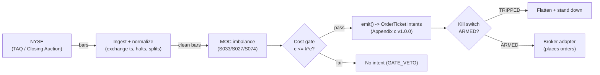

# T070 — MOC Auction-Pin Trader

Pins the close: large MOC imbalances predict the auction print's direction — the module leans with the imbalance into 16:00 and flattens at the print. Provenance **A/TM**.

> Tag law: every numeric literal in prose carries one of `[documented]
> [default] [example] [unverified] [internal-est] [measured]` (legend: Appendix
> i v1.0.0). Bibliographic years, volumes, pages, arXiv IDs, section numbers,
> rule codes (C1–C10), fail-safe codes (F1–F5), module IDs, and machine-parsed
> §0 data fields are identifiers, not literals, and are exempt.

## §1 Five-minute reviewer card

| Row | Value |
|---|---|
| Module | T070 — MOC Auction-Pin Trader, v1.1.0 |
| Edge verdict | `INSUFFICIENT-EVIDENCE` — auction mechanics are documented, but the MOC-pin rule's after-cost edge is not in the cited papers — the pin is the builder's trade |
| After-cost | `BEFORE-COST` — one-sentence verdict: closing auctions are documented price-discovery events, but no cited paper documents after-cost P&L for pinning the MOC imbalance |
| Build cost | Tier M · `20–60` h [internal-est] · `$3,000–9,000` loaded [internal-est] |
| Data cost | Research `~$200–1,000`/mo [unverified]; production `~$200–1,000`/mo [unverified] — bands indicative, verify before budgeting |
| latency_class | bar / 1-minute |
| risk_class | medium |
| Capacity | `$1–25`M notional/day [internal-est] — closing-auction participation, symbol-count bound |
| Executability | Moderate: needs the closing-imbalance feed; the auction print is the fill |
| Risk summary | Imbalance flips in the last minute; the auction print gaps through the lean; regulatory MOC cutoffs |
| When it dies | imbalance evaporates at 16:00; paired-off prints; volatile closes against the lean |
| Regime gates | Provisional machine records below (map to R### in the R001–R050 pass) |
| Emits | `order_intents` (Appendix c v1.0.0) — intents only, never orders |

**§1 · Regime gates (machine records, provisional):**

```yaml
regime_gates:  # provisional IDs — map to R### during the R001–R050 annotation pass
  - regime_id: R-PROV-01
    direction: amplifies
    mechanism: "S027 close-drift aligned with the imbalance sign carries into the auction print"
    condition: "sign(S027_close_drift_t) == sign(I_t) [example]"
    action: none                 # full size allowed
    min_lag: 0                   # [default]
    unknown_behavior: "veto entry (restrictive default)"
  - regime_id: R-PROV-02
    direction: degrades
    mechanism: "wide spreads / volatile closes erase the pin edge and gap the print through the lean"
    condition: "realized_vol_20d_ratio > 2.0 [example] OR spread_bps > 4.0 [example]"
    action: halve
    min_lag: 0                   # [default]
    unknown_behavior: "halve (restrictive default)"
  - regime_id: R-PROV-03
    direction: inverts
    mechanism: "halt/auction state machine overrides the pin; MOC orders are cancelled on halt"
    condition: "market_state != CONTINUOUS_TRADING"
    action: pause_entry
    min_lag: 0                   # [default]
    unknown_behavior: "veto entry (restrictive default)"
```

## §1.5 Cheapest / least-build path

1. **Prototype hour band:** `20–60` h [internal-est] — MOC imbalance parser + pin engine + auction executor + cost/risk harness + fixture.
2. **Cheapest-source row:** min_tier = exchange imbalance data — cheapest documented candidates [internal-est]: (a) **NYSE Order Imbalance Information data feed** (every `5` s after the `3:50` p.m. ET freeze, Regulatory Closing Imbalance at `≥500` round lots [documented — NYSE Rule 7.35B]); (b) **Nasdaq Order Imbalance Indicator (NOII)** under Rule 4754 [documented]; (c) consolidated TAQ close-auction records. latency_class = bar / 1-minute; required_fields = signed closing imbalance ($ or shares), paired/unpaired quantities, auction prints; price_band = `~$200–1,000`/mo [unverified] (indicative — retail pricing for the imbalance feeds is an open lead, see GROK-NEEDED Q1/Q2); build_or_buy = **buy the imbalance feed; build the pin rule — the feed is the product**.
3. **Resource budget:** `1` core, `<2` GB RAM [internal-est]; compute pattern `per_bar`; state is O(`1`) per symbol — one position, one cooldown timer, one kill flag.
4. **Skip list:** open-auction version (see T065); international closes.
5. **DO-NOT-CUT list:** causality assertions (`assert fill_event > signal_event`, no-signal-bar-fills test); COST block + callable `expected_cost_bps`; F1–F5 fail-safes + module-state enum; kill-switch state machine + re-arm checklist; decision-log audit records; bona-fide-intent + self-trade prevention; provenance tags on every numeric literal; fixtures + `test_cmd`; secrets via env only.
6. **Escalation gate:** upgrade from cheapest when any holds — (a) imbalance updates `>100`/min in the last `5` min [default] (the 1-minute bar hides the flip); (b) walk-forward shows `expected_cost_bps(...) > k * edge_bps` for `20` sessions [default] (edge decayed — re-calibrate `edge_mult` before spending on data); (c) feed staleness `>3`× cadence at `15:59` [default] on `3` days in a month [default] (buy the direct exchange feed, not the vendor); (d) short-pin demand appears (buy the locate feed — C7).

## §T0 Module contract

### T0.1 Typed signature

```python
def emit(state: ModuleState, signals: list[SignalVector], cfg: Config) -> list[OrderTicket]:
```

`OrderTicket` per Appendix c v1.0.0 — **intents only**; the strategy never
places orders, never holds broker/exchange sessions, never nets intents into
orders. `state` is the module-owned named state vector (`position`,
`sleeve_weights`, `cooldown_until`, `kill_state`, `module_state`); `signals`
are canonical SignalVectors (Appendix b v1.0.0), newest last. The function
handles documented edge cases: empty signals → `UNKNOWN`; halt/auction bars →
freeze per the market-state table; stale inputs → `UNKNOWN` (F4), never
interpolate.

### T0.2 Config dataclass

| Parameter | Type | Default | Range | Status |
|---|---|---|---|---|
| `imb_min_m` | float | `5.0` | `2.0`–`20.0` | default |
| `lean_min` | int | `15` | `5`–`30` | default |
| `session_close_et` | str | `"16:00"` | fixed | fixed |
| `R_usd` | float | `500` | `100`–`2,000` | default |
| `stop_mult` | float | `0.5` | `0.3`–`1.0` | default |
| `cooldown_bars` | int | `390` | `0`–`390` | default |
| `cost_gate_k` | float | `0.5` | `0.1`–`2.0` | default |
| `z_long` | float | `5.0` | `2.0`–`20.0` | default |
| `z_short` | float | `-5.0` | `-20.0`–`-2.0` | default |
| `edge_mult` | float | `1.5` | `0.5`–`3.0` | default |
| `exit_flip` | bool | `True` | — | default |
| `time_stop` | int | `9` | `1`–`15` | default |
| `participation_cap` | float | `0.02` | `0.005`–`0.05` | default |
| `cost_budget_frac` | float | `0.5` | `0.1`–`1.0` | default |
| `vol_floor_mult` | float | `0.25` | `0.1`–`0.5` | default |
| `venue` | str | `"XNAS"` | venue set | example |
| `side_class` | str | `"taker"` | taker\|maker\|mixed | default |
| `tif` | str | `"DAY"` | DAY\|MOC | example |
| `adv_pct` | float | `0.02` | `0.001`–`0.10` | example |

`stop_atr` (v1.0.0) renamed `stop_mult` — same semantics: stop distance =
`stop_mult` × ATR$. All defaults tagged per the tag law (status `default` ⇒
`[default]`). `edge_mult` calibration: grid-search `0.5, 1.0, 1.5, 2.0, 3.0`
[example] on walk-forward with embargo; pick the value maximizing after-cost
DSR; `1.5` is the build-pass default [default].

### T0.3 Canonical schema mapping

Vendor columns → canonical Bar schema (Appendix a v1.0.0), stated once here:

| Vendor (NYSE TAQ / Closing Auction) | Canonical |
|---|---|
| bar open timestamp | `event_ts` (int64 ns UTC, bar open time) |
| `o/h/l/c`, `v` | `open/high/low/close`, `volume` |
| symbol | `symbol` (exchange-qualified) |
| signed MOC imbalance | `sig` = `I_t`, signed imbalance in $M [example] (Appendix b `value`) |
| gate flag | `gate` ∈ {0, 1} (confirmation gate) |
| ATR estimate | `stop_dist` = ATR in $ per symbol [example]; stop = `stop_mult` × `stop_dist` |
| 20-day ADV | `adv_shares` = average daily volume, shares [example]; `adv_pct` = notional ÷ (`adv_shares` × price); fixture pins `0.02` [example] |

Session anchor: `session_close_ns` = `16:00` ET in int64 ns UTC (fixture:
`2026-09-09 20:00:00` UTC [example]); lean window =
[`session_close_ns` − `lean_min`×`60`s, `session_close_ns`].

### T0.4 Time contract

> Time contract: clock domain UTC, int64 ns; authoritative causality clock =
> `event_ts`; max_skew = `1` ms [default]; jitter budget = `500` µs [default];
> bar-label = open time; staleness TTL = `3`× cadence [default] (F4); gap
> policy = mask, no interpolation; halt/auction → discard contributions
> across reopen.

**Timing box:** `signal@t (per_bar-1min, America/New_York) → earliest fill @open(t+1)`

### T0.5 Market-state table

| State | Module behavior |
|---|---|
| CONTINUOUS_TRADING | Evaluate entries/exits per §T2; emit intents |
| HALTED | Freeze state; emit nothing; `UNKNOWN` on held signals |
| AUCTION | No new entries; exits only via auction-aware intents (MOO/MOC); state `DEGRADED` |
| CLOSED | Emit nothing; state `OFF` |

### T0.6 Module-state enum + error taxonomy

States per Appendix k v1.0.0: `OK | DEGRADED | UNKNOWN | OFF`. Invalid input →
`UNKNOWN`, never interpolate (Appendix f v1.0.0, F1–F5).

| Failure | State | Alert |
|---|---|---|
| Missing/stale input (TTL `3`× cadence [default]) | `UNKNOWN` | page |
| Non-finite / non-positive price reaching module (F2) | `UNKNOWN` | page |
| `event_ts` non-monotonic (F2) | `UNKNOWN` | page |
| Kill-switch TRIPPED | `OFF` (no new intents) | page |
| Halt/auction | `UNKNOWN` / `DEGRADED` (per table) | log |
| Feed anomaly (per §T9 row 1) | `DEGRADED` | notify |
| Anything unmapped | `UNKNOWN` | page |

### T0.7 Risk contract + kill switch

```yaml
risk_contract:
  per_trade_R: `500`            # [example] — N = floor(R/stop_dist), R = $500 per trade
  max_adverse_per_trade: `0.5` ATR [example]   # [example]
  daily_loss_stop: `-1500` USD [example]          # [example]
  max_gross: `5`M USD [example]                # [example]
  kill_conditions:                        # any one trips -> TRIPPED
  - "imbalance feed stale at 15:59 -> veto"
  - "daily loss <= -$1,500 -> TRIPPED"
  - "MOC cutoff missed -> no position"
  enforcement: intraday-hard              # breach flattens; no review-only mode
```

**Calibration recipe:** `per_trade_R` is the sizing input in §T2 (dollar-risk
`N = ⌊R/stop_dist⌋` or the confidence-scaled equivalent); re-estimate `R`
from the trailing `60`-day [default] per-trade P&L distribution so that a
`3`σ [default] adverse day stays inside `daily_loss_stop`. `max_gross` is
checked pre-emit on every ticket (C4). Kill-switch state machine:

```
ARMED → TRIPPED → RECOVERY → ARMED
```

- `ARMED → TRIPPED`: any kill condition fires → cancel all working intents
  (idempotent cancels), flatten at marketable limits, set module state `OFF`,
  write a `KILL_TRIP` decision record (Appendix g v1.0.0).
- `TRIPPED → RECOVERY`: re-arm checklist **all green** — `1.` feed healthy
  (no stale bars); `2.` decision log reconciled against broker ledger, no
  orphan tickets; `3.` root cause of the trip identified and the offending
  config reverted or re-calibrated; `4.` risk owner sign-off recorded.
- `RECOVERY → ARMED`: one clean evaluation pass over the fixture
  (`test_cmd` green) with no new trip, then resume.

### T0.8 Ops tail

- **Schedule:** `15:45`–`16:00` ET [example] — the lean window is the builder's choice; the hard venue cutoffs inside it are NYSE `15:50` ET and Nasdaq MOC `15:55` ET [documented]; owner: intraday-desk on-call.
- **Health checks:** fixture replay (`test_cmd`) green on deploy; live
  staleness watchdog at `3`× cadence; kill-switch drill monthly [default].
- **Alert table:** page on `UNKNOWN` > `30` s [default], on any kill trip, or
  bounds violation; notify on `DEGRADED`; log on single dropped bars.
- **Resource budget:** `1` vCPU, `2` GB RAM [internal-est]; state is O(`1`) per symbol.
- **Runbook stub:** `1.` confirm feed; `2.` replay fixture; `3.` if red → set
  `OFF`, page; `4.` reconcile decision log before re-arm; `5.` complete the
  re-arm checklist (§T0.7) before `ARMED`.

### T0.9 Secrets (env-only)

`IMBALANCE_FEED_KEY` via environment only. No secrets in this file, fixtures, or logs
(CI secrets-grep).

### T0.10 May / must-NOT

> **May:** emit `OrderTicket` intents per Appendix c v1.0.0; track intent-side
> state; issue cancel-replace via new tickets. **Must-NOT:** place orders on
> any venue, hold broker/exchange sessions, net intents into orders inside the
> strategy, or treat the intent-side state machine as broker wire truth.

## §T1 Legacy (subsumed by §1)

Legacy §T1 content is the §1 reviewer card above; this header is retained so
section numbering stays frozen.

## §T2 Specification

### Universe

Liquid US large-caps with closing-imbalance data [example]; imbalance `≥$5`M [example]; lean window `15:45`–`16:00` ET [example]; flat at the print. Venue MOC cutoffs (documented — hard constraints, not builder choices):

| Venue | MOC/LOC entry cutoff | After cutoff | Source |
|---|---|---|---|
| NYSE | `15:50` ET (Closing Auction Imbalance Freeze Time) | only offsetting MOC/LOC vs a published Regulatory Closing Imbalance (`≥500` round lots); cancels after `15:58` rejected | NYSE Rule 7.35B; NYSE closing-process fact sheet |
| Nasdaq | MOC: `15:55` ET; LOC entered at/after `15:55` ET rejected | `15:55`–`15:58` cancels/modifies for legitimate error only | Nasdaq Rule 4702(b)(11)–(12) (SEC SR-NASDAQ-2018-068) |

A pin intent emitted after the venue cutoff is a no-op by rule — `entry_ts < moc_cutoff` is load-bearing (§T9 row 2).

### Entry rule (Boolean — no prose-only conditions)

```
LET I_t      = sig_t                                   # signed MOC imbalance, $M [example]
LET edge_bps = |I_t| * edge_mult                       # edge_mult = 1.5 [default]
LET in_window = (session_close_ns - lean_min*60e9) <= ts_t <= session_close_ns
LET cooled   = ts_t >= cooldown_until                  # one pin per day (C11)
LET cheap    = expected_cost_bps(notional, adv_pct, venue, side, urgency)
               <= cost_gate_k * edge_bps                # C2 bona-fide intent

ENTER_LONG  := (gate_t == 1) AND in_window AND cooled AND (I_t >= +imb_min_m) AND cheap
ENTER_SHORT := (gate_t == 1) AND in_window AND cooled AND (I_t <= -imb_min_m) AND cheap
FLAT        := otherwise
```

`imb_min_m` = `5.0` [default] ($M); `lean_min` = `15` [default] minutes before
the `16:00` ET close. Every conjunct is enforced in the harness (`decide` +
`emit_intents`) and covered by tests 1, 2, and 7.

### Exits (with post-exit cooldown)

Exit priority is normative — first match wins:

```
1. EXIT_FLIP  := (side == BUY  and I_t < 0)              # [example]
              OR (side == SHORT and I_t > 0)              # imbalance flipped against the pin
2. EXIT_STOP  := adverse move >= stop_mult * ATR$        # 0.5 × ATR [default]; stop_dist from the bar row
3. EXIT_PRINT := ts_t >= session_close_ns                # auction print / time_stop after 9 bars [default]
4. EXIT_FADE  := |I_t| < 0.1 * imb_min_m                 # imbalance evaporated [example]
ON_EXIT: cooldown_until = now + cooldown_bars * bar_ns   # C10/C11 — one pin per day [default]
```

In the fixture the exit fires as `EXIT_FLIP` at bar `7` (`sig` −`1.0` $M
[example]); the `390`-bar cooldown then blocks the bar-`8` short re-entry
(one pin per day, test 7).

### Position sizing (fenced function)

```python
def size_shares(risk_budget_R, stop_distance, vol_estimate, adv_shares, cost_bps,
                price, participation_cap=0.02, cost_budget_frac=0.5,
                vol_floor_mult=0.25):
    """shares = f(risk_budget_R, stop_distance, vol_estimate, ADV_cap, cost).

    risk-limited, ADV participation-capped, cost-budget vetoed, vol-floored.
    Returns 0 when the cost budget vetoes (caller emits no ticket — C2).
    All numeric defaults tagged [default]; fixture inputs [example].
    """
    stop_distance = max(stop_distance, vol_floor_mult * vol_estimate)  # never tighter than noise
    q_risk = int(risk_budget_R // max(stop_distance, 1e-9))
    q_adv = int(participation_cap * adv_shares)                        # ADV_cap
    cost_per_share = price * cost_bps / 1e4
    q_cost = int((cost_budget_frac * risk_budget_R) // max(cost_per_share, 1e-12))
    if q_cost < 1:
        return 0  # cost budget veto
    return max(1, min(q_risk, q_adv, q_cost))
```

Fixture check [example]: `R` = `$500`, `stop` = `$1.00`, `adv_shares` =
`5,000,000` → `q_risk` = `500`, `q_adv` = `100,000`, `q_cost` ≈ `3,447` →
`500` shares, identical to the v1.0.0 replay.

### Risk limits

| Limit | Value |
|---|---|
| Per-trade risk | `$500` [example] |
| Daily loss stop | `−$1,500` [example] |
| One pin per day | close only [example] |

### COST block (single source of truth)

| Component | Value (bps) | Basis |
|---|---|---|
| Spread | `2.00` | [example] — closing spreads |
| Fees | `0.40` | [example] — conservative mixed-venue taker: `$0.005`/share/side on a `$250` stock |
| Borrow | `0.0` | [default] — reference build is long-pin; short pins add C7 locate cost at the stock-loan rate (band unverified — GROK-NEEDED Q3) |
| Impact | `0.50` | [example] — auction participation |
| **Total reference** | `2.90` | [example] |

Documented venue fee lines (exchange schedules — the module's MOC routing
should use these, not the `0.40` bps conservative line):

| Venue / order type | Fee | As-of | Source |
|---|---|---|---|
| NYSE MOC/LOC | `$0.00055`/share [documented] for member orgs with MOC/LOC ADV `≥0.375`% of consolidated ADV; `$0.00050`/share [documented] at `≥0.575`% of NYSE CADV (filing proposed `$0.00065`/`$0.00060`) — on a `$250` stock ≈ `0.022` bps | 2026-05-01 [documented] | NYSE Price List via SEC SR filing 34-72960 — re-pin the live price list before production |
| Nasdaq closing cross | `$0.0008`–`$0.0016`/share [documented] top rate | filing vintage [documented] | SEC SR-NASDAQ filing (Exhibit 5) — re-pin before production |
| NYSE Closing Offset (CO) orders | no charge [documented] | 2026-05-01 [documented] | NYSE Price List |

`fee_schedule_as_of`: `2026-05-01` [documented] — NYSE Price List vintage
(SEC 34-105422); MOC/LOC tier figures per SEC 34-72960. Re-pin both before
production. `side: taker` [default]; venue/tier/source: XNAS / NYSE close
[example]. `borrow_bps_per_day`: `0.0` [default] — reason: reference build is
long-only pin; no borrow is drawn.

Re-stating cost numbers outside
this block is a validation failure.

```python
def expected_cost_bps(notional, adv_pct, venue, side, urgency) -> float:
    '''Callable cost model — single source of truth (this block).

    Reference build: constant 4-component stack (cheapest-build L2 wrapper).
    Production variant: replace fee_bps with the venue line above selected by
    `venue` (documented), and impact_bps with a calibrated participation model;
    keep this signature.
    '''
    spread_bps = 2.0   # [example] — closing spreads
    fee_bps = 0.4         # [example] — conservative mixed-venue taker
    borrow_bps = 0.0   # [default] — long-pin reference build
    impact_bps = 0.5   # [example] — auction participation
    if side == "maker":
        fee_bps = -abs(fee_bps) * 0.5  # rebate proxy [example]
    return spread_bps + fee_bps + borrow_bps + impact_bps
```

### Execution / fill model table

| Aspect | Assumption |
|---|---|
| Latency | 1-min bars; lean from 15:45 [example] |
| Entries | With the imbalance into the close |
| Exits | Flat at the 16:00 auction print |
| Partial fills | Per Appendix c v1.0.0 FIFO |
| Adverse fill | Last-minute imbalance flips gap the print [example] |

### Robustness

Imbalance `≥$5`M [default]; lean window `15:45`–`16:00` ET [example]; flat at the print — no overnight; imbalance flip = immediate exit. MOC cutoff discipline is load-bearing (`15:50` ET NYSE / `15:55` ET Nasdaq [documented]).

### Compliance sub-block (C1–C10+)

| Code | Rule: trigger → check → action → log |
|---|---|
| C1 | Self-match / STP: every ticket carries self-trade-prevention instructions for the broker adapter; trigger = two tickets same symbol opposite side within `1` s [default] → check resting-interest overlap → action = cancel the newer ticket → log `COMPLIANCE_BLOCK` |
| C2 | Bona-fide intent: every entry intent must pass the cost gate (`expected_cost_bps(...) <= k * edge_bps`) and fit risk limits; trigger = gate fail → check = re-evaluate → action = no ticket emitted → log `GATE_VETO` |
| C3 | Message-rate / cancel-to-trade: trigger = `>50` intents/symbol/min [default] or cancel-to-trade `>10:1` [default] → check venue thresholds → action = throttle to `5`/min [default] + alert → log `COMPLIANCE_BLOCK` |
| C4 | Pre-trade fat-finger trio: price collar `±5`% vs reference [default] → reject; max notional per ticket `$2,000,000` [default] → reject; max `50` tickets/symbol/`5` min [default] → throttle; all rejections logged |
| C5 | Decision-log schema compliance (Appendix g v1.0.0): every intent, veto, cancel-replace, kill transition logged with inputs_hash/params_hash, hash-chained; trigger = missing record → action = halt to `UNKNOWN` |
| C6 | Halt/auction state table: per §T0.5 — HALTED freezes, AUCTION blocks new entries, CLOSED emits nothing; trigger = state change → check market-state table → action = freeze/cancel per table → log |
| C7 | Locate check (short sales): trigger = SHORT intent → check = easy-to-borrow list or live locate obtained pre-emit → action = block intent without locate → log `GATE_VETO`; Reg-SHO threshold securities never shorted |
| C8 | Public-dissemination gate: no signal/intent data published externally without review; trigger = export request → check = review sign-off → action = block until signed |
| C9 | Data-entitlement assertions per dataset (Appendix j v1.0.0): trigger = entitlement-class change or unlicensed symbol → check §T5 data-rights row → action = stand down affected symbols → log |
| C10 | Post-exit cooldown: trigger = exit or compliance block → check `now < cooldown_until` → action = no re-entry until ``390`` bars [default] elapse → log |
| C11 | One-pin-per-day cap: additional MOC signals ignored → check daily count → action = ignore → log `GATE_VETO` |

### Parameter table

| Parameter | Symbol | Value | Tag | Sensitivity |
|---|---|---|---|---|
| Imbalance minimum | `imb_min_m` / `z_long` | `$5`M | [default] | high |
| Lean window | `lean_min` | `15` min | [default] | medium |
| Session close | `session_close_et` | `16:00` ET | fixed | high |
| Per-trade R | `R_usd` | `$500` | [example] | medium |
| Stop | `stop_mult` | `0.5` ATR | [default] | high |
| Cost-gate k | `cost_gate_k` | `0.5` | [default] | high |
| Edge multiplier | `edge_mult` | `1.5` | [default] | high |
| Exit on flip | `exit_flip` | `True` | [default] | high |
| Time stop | `time_stop` | `9` bars | [default] | medium |
| Participation cap | `participation_cap` | `0.02` | [default] | medium |
| Cost budget | `cost_budget_frac` | `0.5` | [default] | medium |
| Cooldown | `cooldown_bars` | `390` | [default] | medium |

### Timing box

`signal@t (per_bar-1min, America/New_York) → earliest fill @open(t+1)`

## §T3 Math + normative pseudocode

Closing imbalance $I_t$ in dollars [example] (`sig_t`, signed). Lean with the
imbalance from 15:45 ET [example] if $|I_t| \ge \$5\mathrm{M}$ [default] and
the intent clears the venue MOC cutoff (`15:50` ET NYSE, `15:55` ET Nasdaq
MOC [documented]); flat at the 16:00 auction print [example]. Exit priority:
imbalance sign flip, then $0.5 \times$ ATR adverse [default], then the print.
Madhavan \& Panchapagesan (2000) [documented — RFS 13(3):627–658] study the
**opening** auction, not the close: designated dealers extract information
from the limit order book and set a more efficient opening price than a fully
automated call auction. Applying the mechanism to the *closing* auction is the
builder's extrapolation, not the papers' claim; the MOC-pin rule itself has no
documented after-cost evidence (§T8).

**Normative pseudocode** (pseudocode is normative; prose is commentary):

```
function emit(state, signals, cfg) -> list[OrderTicket]:
    assert signals non-empty else return UNKNOWN                    # F1
    for bar t in signals (newest last):                             # data <= t only
        assert isfinite(all fields of t) else return UNKNOWN        # F2
        assert t.event_ts > prev_ts else return UNKNOWN             # F2 monotonic
        I_t = t.sig                                                # signed MOC imbalance, $M [example]
        edge_bps = abs(I_t) * cfg.edge_mult                        # 1.5 [default]
        in_window = (cfg.session_close_ns - cfg.lean_min*60e9) <= t.event_ts
                    <= cfg.session_close_ns                        # 15:45-16:00 ET
        cooled = t.event_ts >= state.cooldown_until                # C11 one pin/day
        if state.position is None and state.module_state == OK:
            want = (t.gate == 1) and in_window and cooled           # every prose guard, as code
            if want and I_t >= +cfg.imb_min_m: side = BUY
            elif want and I_t <= -cfg.imb_min_m: side = SHORT
            else: continue
            qty = size_shares(cfg.R_usd, t.stop_dist, t.stop_dist, t.adv_shares,
                              cost_bps_ref, t.close, cfg.participation_cap,
                              cfg.cost_budget_frac, cfg.vol_floor_mult)
            if qty < 1: continue                                   # cost-budget veto (C2)
            notional = qty * t.close
            adv_pct = notional / (t.adv_shares * t.close)          # participation lineage
            cost = expected_cost_bps(notional, adv_pct, venue, side, urgency)
            cost_ok = expected_cost_bps(...) <= k * edge_bps
            # ^^^ normative cost-gate predicate: expected_cost_bps(...) <= k * edge_bps
            if not cost_ok: continue                               # C2 bona-fide intent
            assert t.event_ts < moc_cutoff(venue)                  # venue cutoff: 15:50/15:55 ET
            ticket = OrderTicket(symbol, side, qty, limit, tif,
                                 ticket_id=uuid(), parent_signal="S033@t",
                                 intent_ts=t.event_ts, state=NEW)
            log_decision(ticket, inputs_hash, params_hash)         # C5 / Appendix g
            assert fill_event > signal_event                       # t->t+1 causality
        else if state.position is not None:
            # exit priority: flip > stop > print/time_stop > fade
            if (side == BUY and I_t < 0) or (side == SHORT and I_t > 0):
                reason = "sig_flip"
            elif adverse(t.close) >= cfg.stop_mult * t.stop_dist:
                reason = "stop"
            elif bars_held + 1 >= cfg.time_stop:
                reason = "time_stop"                               # auction print
            elif abs(I_t) < 0.1 * cfg.imb_min_m:
                reason = "exit_signal"
            else: continue
            emit exit intent (cancel-replace rules, Appendix c)     # C1
            state.cooldown_until = t + cooldown_bars                # C10/C11
            assert fill_event > signal_event
    return tickets
```

Causality: every quantity at bar `t` uses only data `≤ t`; the earliest fill
is bar `t+1`'s open. Mandatory unit test: no-signal-bar fills
(`assert fill_event > signal_event`).

## §T4 Worked example (fixture-backed)

- Tape: `modules/fixtures/T070_tape.csv` — `# TYPE: validation-run`;
  `12` bars [example], all numbers synthetic, seed `10070` [example];
  `event_ts` int64 ns UTC, bar-labeled by open time. Fixture clock =
  `2026-09-09 19:45:00`–`19:56:00` UTC [example] (Wednesday), i.e. the
  `15:45`–`15:56` ET lean window; `session_close_ns` = `20:00:00` UTC
  (`16:00` ET). Columns add `stop_dist` (ATR$ [example]) and `adv_shares`
  (`5,000,000` [example]).
- Expected outputs: `modules/fixtures/T070_expected.csv` — per-ticket
  intents with the cost-function call recorded (inputs → bps → $);
  tolerance `1e-6` [default] on floats.
- What the fixture exercises: bar `2` (`I` = `+$6.5`M [example]) enters BUY
  `500` shares (`edge` = `9.75` bps [example], cost `2.90` bps [example] ≤ `0.5 × 9.75` — gate
  PASS); bar `7` (`I` = `−$1.0`M [example]) flips against the pin → exit
  `sig_flip`; the `390`-bar cooldown blocks the bar-`8` short re-entry
  (one pin per day, C11). Exit priority flip > stop > time_stop > fade is
  what makes the replay deterministic.
- Acceptance tests (`modules/tests/test_T070.py`, `8` tests):
  `1.` fixture replays to expected (hand-checked rows below); `2.` cost-gate
  predicate passes on the fixture's large edges, blocks a tiny-edge
  counter-case (`k = 0.5` [default]), and the SHORT mirror branch enters on
  a large sell imbalance; `3.` no-signal-bar fills
  (`fill_ts > signal_ts` on every ticket) and no tickets on gated-off bars;
  `4.` kill-switch trips on the breach scenario and re-arms through the
  checklist (`ARMED → TRIPPED → RECOVERY → ARMED`); `5.` invalid input
  (non-finite `sig`, non-positive price, non-monotonic `event_ts`) →
  `UNKNOWN`, never interpolated; `6.` hand-check literals
  (qty / bps / $) match the generation run; `7.` lean-window veto (a `+8` $M
  imbalance at `15:30` ET emits nothing) and one-pin-per-day (bar-`8`
  re-entry blocked by cooldown); `8.` stop exit fires on a `0.6`$ adverse
  move past the `0.5` × ATR stop.
- `test_cmd`: `python3 -m pytest modules/tests/test_T070.py -q` → exits `0`.

**Cost-function calls on the fixture** (inputs → bps → $, from the harness run):

| ticket | notional ($) | adv_pct | side | edge_bps | cost_bps | cost_$ | gate |
|---|---|---|---|---|---|---|---|
| T-T070-2-0 | 125028.60 | 0.0200 | taker | 9.7500 | 2.9000 | 36.2583 | PASS |
| T-T070-7-X | 124971.90 | 0.0200 | taker | 0.0000 | 2.9000 | 36.2419 | N/A |

All figures in this table [example] (fixture arithmetic, tolerance `1e-6` [default]).

`adv_pct` is pinned at `0.02` [example] in the harness config; the reference
cost implementation holds impact constant, so `adv_pct` is recorded for the
calibrated variant rather than consumed.

**Where the example is optimistic:** the fixture encodes MOC imbalances as signal events on a clean 1-minute grid; production faces last-minute flips, print gaps, and the documented `15:50`/`15:55` ET MOC cutoffs that can strand an intent; the one-per-day cap is enforced via cooldown; the `2.90` bps reference cost uses the conservative `0.40` bps fee line, while documented MOC routing would cost ≈`0.02` bps in fees — the reference is deliberately pessimistic on fees and optimistic on fills.



## §T5 Dependencies & data

Generated-from-`deps.yaml` shape (CI symmetry); hand-listed:

| Module | Role | Version pin |
|---|---|---|
| S033 — Auction imbalance | Trigger | 1.0.0 |
| S027 — Close drift | Gate | 1.0.0 |
| S074 — Auction print | Exit | 1.0.0 |

| Field | Type | Granularity | Source tier | Notes |
|---|---|---|---|---|
| Closing imbalance messages | float ($M, signed) | per update | Tier 1/2 | `sig` = `I_t` [example]; Regulatory publication at `≥500` round lots [documented — NYSE Rule 7.35B] |
| Auction prints | float | per day | Tier 1 | execution |
| ATR estimate | float ($) | per bar | Tier 1/2 | `stop_dist` [example]; stop = `0.5` × ATR [default] |
| 20-day ADV | int (shares) | per day | Tier 1/2 | `adv_shares` [example]; participation cap `0.02` [default] |

**Family note:** family `D` = intraday microstructure / auction strategies.

**Data rights row** (Appendix j v1.0.0): US equities close-auction imbalances via NYSE
TAQ / Closing Auction, `rights: licensed`; license scope = research + stated
production symbol count; raw ticks never leave our systems — fixtures are
synthetic; entitlement = professional/internal, no display; retention per
vendor terms, purge path in runbook. Entitlement-class change → §1.5
escalation gate.

## §T6 Local build (M5 Max / 128 GB)

Feasible on the M5 Max (Tier M, `20–60` h ≈ `$3k–9k` eng + `~$200–1k`/mo data per notes/cost-model.md §5). Bottleneck is the imbalance feed, not compute.

## §T7 Buy vs build

Buy the imbalance feed; build the pin rule — the feed is the product. Verdict: MOC cutoff discipline is load-bearing.

## §T8 Efficacy — documented evidence

| Study / source | Market & period | Metric | Before/after cost | Caveat |
|---|---|---|---|---|
| Madhavan & Panchapagesan (2000), RFS 13(3):627–658 | NYSE **opening** auction | designated dealers extract limit-order-book information and set a more efficient opening price than a fully automated call auction [documented] | `BEFORE-COST` (market structure) | opening auction, not the close — the close application is the builder's extrapolation; the pin is unproven |
| Barclay & Hendershott (2003), RFS | US stocks | after-hours trading and price discovery [documented] | `BEFORE-COST` (market structure) | discovery, not a trading rule |
| Heston, Korajczyk & Sadka (2010), J. Finance | US stocks | intraday cross-sectional patterns [documented] | `BEFORE-COST` (anomaly evidence) | patterns, not the pin rule |
| NYSE Rule 7.35B + closing-process fact sheet | NYSE | MOC/LOC cutoff `15:50` ET; Regulatory Closing Imbalance at `≥500` round lots; imbalance feed every `5` s after the freeze [documented] | n/a (mechanics) | hard constraint on entry timing |
| Nasdaq Rule 4702(b)(11)–(12) (SEC SR-NASDAQ-2018-068) | Nasdaq | MOC cutoff `15:55` ET; LOC rejected at/after `15:55` ET [documented] | n/a (mechanics) | hard constraint on entry timing |

Selection disclosure: these are the sources surfaced by the chapter's research
pass (Stage 170/200). **Honest bottom line.** For a ≤$1M paper operation: T070 leans on documented closing-auction mechanics — but the MOC-pin rule's after-cost edge is not in the cited papers. Last-minute flips are the known killer.

## §T9 Failure modes & pitfalls

| # | Trigger → Detect → Action → Recovery | check: |
|---|---|---|
| 1 | Imbalance flip in the last minute → detect: sign flip → action: exit immediately → recovery: next day | `check: sign(imb) == sign(entry) or flat` |
| 2 | MOC cutoff missed → detect: cutoff clock → action: no position (venue rejects MOC/LOC after `15:50` ET NYSE / `15:55` ET Nasdaq [documented]) → recovery: next day | `check: entry_ts < moc_cutoff(venue)` |
| 3 | Feed stale at 15:59 → detect: staleness → action: veto → recovery: next day | `check: feed_fresh` |
| 4 | Stop: 0.5 ATR adverse → detect: stop monitor → action: exit → recovery: next day | `check: exit on stop` |
| 5 | Cost blowup → detect: cost gate fails → action: stand down → recovery: re-pin | `check: expected_cost_bps(...) <= k * edge_bps` |
| 6 | Lookahead: imbalance after the print → detect: causality audit → action: halt → recovery: re-run test | `check: all(fill_ts > signal_ts)` |
| 7 | Halt into the close → detect: market-state HALTED → action: MOC intents cancelled by rule, flat, no chase → recovery: next day, reconcile decision log | `check: no position held across a halted close` |
| 8 | Paired-off / missing auction print → detect: no print by `16:05` ET [default] → action: exit the lean via marketable limit in the post-close cross session if available, else log `UNKNOWN` and flatten at next open — never carry overnight | `check: flat by 16:05 ET or logged UNKNOWN` |
| 9 | Re-arm checklist fails → detect: any checklist item red → action: stays `TRIPPED`, no intents → recovery: fix root cause, re-run checklist | `check: state == TRIPPED until all(checklist)` |
| 10 | Short pin without locate → detect: C7 locate check fails → action: skip the short side (long pins only) → recovery: locate feed restored | `check: no SHORT intent without locate` |

## §T10 Source log + unverified leads

**Sources** (citable facts only):

1. Madhavan, A. & Panchapagesan, V. (2000) [documented]. "Price Discovery in Auction Markets: A Look Inside the Black Box." *Review of Financial Studies* 13(3): 627–658. — the **opening** auction: designated dealers extract limit-order-book information and set a more efficient opening price than a fully automated call auction. (Corrects the v1.0.0 citation, which misattributed this to the close.)
2. Barclay, M. J. & Hendershott, T. (2003) [documented]. "Price Discovery and Trading After Hours." *Review of Financial Studies* 16(4): 1041–1073. — after-hours trading and price discovery.
3. Heston, S. L., Korajczyk, R. A. & Sadka, R. (2010) [documented]. "Intraday Patterns in the Cross-Section of Stock Returns." *Journal of Finance* 65(4): 1369–1407. — intraday cross-sectional patterns.
4. NYSE [documented]. "NYSE Closing Process" fact sheet + "Opening and Closing Auctions" fact sheet (nyse.com). — MOC/LOC entry until `3:50` p.m. ET; after, only contra-side of a published Regulatory Closing Imbalance; informational imbalance every `1` s; Closing Offset (CO) orders execute only against the opposite side of an imbalance.
5. NYSE [documented]. Information Memo on MOC/LOC and Closing IO order entry (nyse.com, citing NYSE Rule 7.35B(d)(1)). — Closing Auction Imbalance Freeze Time `10` minutes before end of Core Trading (typically `3:50` p.m.); Regulatory Closing Imbalance disseminated at `≥500` round lots; Order Imbalance Information feed every `5` s after the freeze.
6. Nasdaq [documented]. "The Nasdaq Opening and Closing Crosses" FAQ (nasdaqtrader.com). — MOC entered after the `3:55` p.m. cutoff not accepted; LOC entered after the `3:58` p.m. cutoff not accepted.
7. SEC [documented]. Order approving SR-NASDAQ-2018-068 (Release 34-84454). — Nasdaq Rule 4702(b)(11): MOC orders may be entered/cancelled/modified `4` a.m.–`3:55` p.m. ET; at/after `3:55` p.m. rejected; `3:55`–`3:58` p.m. cancel/modify for legitimate error only.
8. SEC [documented]. SR-NYSE-2014 filing (Release 34-72960). — NYSE MOC/LOC per-share charges: `$0.00055`/share [documented] for member orgs with MOC/LOC ADV `≥0.375`% of consolidated ADV; `$0.00050`/share [documented] at `≥0.575`% of NYSE CADV (proposed `$0.00065`/`$0.00060`).
9. SEC [documented]. SR-NASDAQ-2019-064 Exhibit 5. — Nasdaq opening/closing cross liquidity credits `$0.0027`–`$0.0028`/share [documented]; Nasdaq cross fee top rate `$0.0008`–`$0.0016`/share [documented] (cited in SR-CboeEDGX context).

**Chatbot source log.** Grok answered Q-TB7-1..3 (2026-09-10); all claims independently verified or labeled unverified. Web research 2026-09-11 verified the venue cutoffs, fee lines, and the Madhavan & Panchapagesan (2000) opening-auction attribution above.

**Unverified leads** (chatbot-only — never in evidence tables):

- Grok Q-TB7-3: MOC-pin hit-rates — chatbot figures, unverified; build-phase measurement task.
- Retail pricing for the NYSE Order Imbalance Information feed / Nasdaq NOII / consolidated TAQ close-auction data (`~$200–1,000`/mo [unverified]) — see GROK-NEEDED Q1/Q2.
- Stock-loan borrow fee bands for short MOC pins and the locate-desk workflow for auction shorts — see GROK-NEEDED Q3.
- Current (post-2026-05-01) NYSE Price List MOC/LOC tiers — re-pin before production; see GROK-NEEDED Q5.

## GROK-NEEDED — exact questions for the Grok research pass

Answer with product names, prices, document links, and as-of dates. Do not
extrapolate; mark anything unanswerable as unverified.

- **Q-T070-1 (imbalance feed pricing):** What are the current retail/professional subscription products and monthly price bands for (a) the NYSE Order Imbalance Information data feed, (b) NYSE TAQ with closing-auction records, (c) a consolidated vendor feed carrying closing imbalances? Include the imbalance message schema (paired/unpaired quantity fields, dissemination frequency after the `3:50` p.m. ET freeze).
- **Q-T070-2 (Nasdaq NOII):** What is the current product/pricing for Nasdaq TotalView or a standalone feed carrying the Nasdaq Order Imbalance Indicator (NOII) for the closing cross? Include field spec and as-of date.
- **Q-T070-3 (short-pin borrow):** What are typical stock-loan borrow fee bands (bps/day) for shorting into the close, and what is the standard locate-desk workflow/timing for obtaining a locate before the `15:50`/`15:55` ET MOC cutoffs? Which hard-to-borrow names should the short pin exclude?
- **Q-T070-4 (pin edge evidence):** Is there any published or industry study with *after-cost* P&L for leaning with (not against) closing-auction imbalances? Report hit rates, sample periods, and cost assumptions — or confirm none is known.
- **Q-T070-5 (fee re-pin):** Against the current NYSE Price List (post-2026-05-01), confirm the live MOC/LOC per-share tiers and the Nasdaq closing-cross fee/credit schedule, with the exact document URL and as-of date.

---

## Appendix — AI build prompt (T070)

Copy-paste into any chat agent:

> Build module **T070 — MOC Auction-Pin Trader** per `notes/module-template.md` v1.0.0
> and this file's §T0 contract (module v1.1.0).
> Cheapest path (§1.5): prototype `20–60` h [internal-est]; cheapest documented
> data candidates NYSE Order Imbalance Information feed / Nasdaq NOII / TAQ close-auction
> records [internal-est]; compute pattern `per_bar`; skip open-auction version
> (see T065); international closes for now.
> Implement `emit(state, signals, cfg) -> list[OrderTicket]`
> (Appendix c v1.0.0) with the §T3 normative pseudocode: enforce EVERY entry
> conjunct in code (`gate == 1`, lean window `15:45`–`16:00` ET [example],
> one-pin-per-day cooldown, venue MOC cutoff `15:50` ET NYSE / `15:55` ET Nasdaq
> [documented]), the cost-gate predicate `expected_cost_bps(...) <= k * edge_bps`,
> `assert fill_event > signal_event`, and the exit priority
> flip > stop > print/time_stop > fade. Size with
> `size_shares(R, stop_distance, vol_estimate, adv_shares, cost_bps, price, ...)`
> (participation cap `0.02` [default], cost-budget veto, vol floor). Wire F1–F5
> (Appendix f v1.0.0): invalid input → `UNKNOWN`, never interpolate. Implement the
> kill-switch state machine `ARMED → TRIPPED → RECOVERY → ARMED` with the §T0.7 re-arm
> checklist. Log decisions per Appendix g v1.0.0. Secrets via env only.
> Use the documented venue fee lines in the COST block (NYSE MOC/LOC `$0.00055`/share
> tiers, Nasdaq cross `$0.0008`–`$0.0016`/share, CO no charge; `fee_schedule_as_of`
> `2026-05-01` [documented]) for MOC routing; keep the `2.90` bps [example]
> reference stack as the conservative bound.
> Run the fixture `modules/fixtures/T070_tape.csv`
> (`# TYPE: validation-run`, `2026-09-09 15:45`–`15:56` ET [example]) against
> `modules/fixtures/T070_expected.csv` (tolerance `1e-6` [default]).
> **Definition of done:** `python3 -m pytest modules/tests/test_T070.py -q`
> exits `0`. Tag every numeric literal you add with the unified enum
> (Appendix i v1.0.0); put anything unverifiable in §T10 unverified leads.
