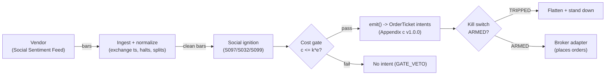

# T072 — Social-Sentiment Ignition Rider

Rides social-sentiment ignition: a spike in bullish social chatter with volume confirmation predicts a short-horizon melt-up — in fast, out on attention decay. Provenance **C/SI**.

> Tag law: every numeric literal in prose carries one of `[documented]
> [default] [example] [unverified] [internal-est] [measured]` (legend: Appendix
> i v1.0.0). Bibliographic years, volumes, pages, arXiv IDs, section numbers,
> rule codes (C1–C10), fail-safe codes (F1–F5), module IDs, and machine-parsed
> §0 data fields are identifiers, not literals, and are exempt.

## §1 Five-minute reviewer card

| Row | Value |
|---|---|
| Module | T072 — Social-Sentiment Ignition Rider, v1.1.0 |
| Edge verdict | `NO-DOCUMENTED-EDGE` — the Bollen Twitter-mood result is contested and unreplicated at tradeable horizons; Kuleshov's Stanford CS229 replication attempt found "methodology problems" and that "several groups were unable to replicate their accuracy" [documented, course-project]; no cited paper documents after-cost P&L for the ignition rule |
| After-cost | `BEFORE-COST` — one-sentence verdict: social mood predicting markets is a contested claim, and the ignition-riding rule has no documented after-cost edge — the melt-up is usually over by the fill |
| Build cost | Tier M+ · `40–100` h [internal-est] · `$6,000–30,000` loaded [internal-est] |
| Data cost | Research `$0–29`/mo [documented] (StockTwits public streams are free/no-key [documented]; Adanos Hobby `$29`/mo [documented]; X API Basic `$200`/mo [documented] if X-sourced); production `~$299–5,000`/mo [documented–unverified] (Adanos Professional `$299`/mo [documented]; StockTwits Enterprise API is a custom quote [unverified]) — bands indicative, verify before budgeting |
| latency_class | bar / 5-minute |
| risk_class | high |
| Capacity | tiny [example] — the melt-up is minutes long |
| Executability | Hard: social firehose + NLP + 5-min execution; the speed is the product |
| Risk summary | Stale ignition: social spikes lag price — the chatter peaks after the move; bot-driven spikes misfire |
| When it dies | ignition already priced; bot/brigade manipulation; attention decays before the fill |
| Regime gates | Provisional machine records: R047 amplifies · R013 amplifies · R038 degrades → veto · R010 degrades → halve (see §T2-Robustness) |
| Emits | `order_intents` (Appendix c v1.0.0) — intents only, never orders |

## §1.5 Cheapest / least-build path

1. **Prototype hour band:** `40–100` h [internal-est] — social NLP + ignition detector + volume gate + decay timer + fixture.
2. **Cheapest-source row:** min_tier = StockTwits public streams API — free, no API key [documented] for research; Adanos Hobby `$29`/mo [documented] for a production REST path; latency_class = bar / 5-minute; required_fields = timestamped sentiment scores [default]; 5-min bars [default]; bot-probability metadata is *not* available on the free tier — the bot veto is enforced with a proxy classifier until a paid feed supplies it [internal-est]; price_band = research `$0–29`/mo [documented], production `~$299–5,000`/mo [documented–unverified]; build_or_buy = **buy the social feed; build the ignition detector — bot filtering is the product**.
3. **Resource budget:** `2` cores, `8` GB RAM + social feed [internal-est]; compute pattern `per_bar`.
4. **Skip list:** cross-platform ignition; options-based ignition.
5. **DO-NOT-CUT list:** causality assertions (`assert fill_event > signal_event`, no-signal-bar-fills test); COST block + callable `expected_cost_bps`; F1–F5 fail-safes + module-state enum; kill-switch state machine + re-arm checklist; decision-log audit records; bona-fide-intent + self-trade prevention; provenance tags on every numeric literal; fixtures + `test_cmd`; secrets via env only.
6. **Escalation gate:** upgrade from cheapest when any holds — ignition rate `>20`/day [default]; hold `>60` min [default]; bot-proxy accuracy unmeasurable on the free feed → escalate to a paid feed with author metadata (GROK-NEEDED Q1) [internal-est].

## §T0 Module contract

### T0.1 Typed signature

```python
def emit(state: ModuleState, signals: list[SignalVector], cfg: Config) -> list[OrderTicket]:
```

`OrderTicket` per Appendix c v1.0.0 — **intents only**; the strategy never
places orders, never holds broker/exchange sessions, never nets intents into
orders. `state` is the module-owned named state vector (`position`,
`sleeve_weights`, `cooldown_until`, `kill_state`, `module_state`); `signals`
are canonical SignalVectors (Appendix b v1.0.0), newest last. The function
handles documented edge cases: empty signals → `UNKNOWN`; halt/auction bars →
freeze per the market-state table; stale inputs → `UNKNOWN` (F4), never
interpolate.

### T0.2 Config dataclass

| Parameter | Type | Default | Range | Status |
|---|---|---|---|---|
| `ign_z` | float | `3.0` | `2.0`–`5.0` | default |
| `vol_mult` | float | `2.0` | `1.5`–`3.0` | default |
| `vol_window` | int | `20` | `5`–`60` | default |
| `bot_max` | float | `0.50` | `0.20`–`0.80` | default |
| `exit_decay_z` | float | `1.0` | `0.3`–`2.0` | default |
| `edge_per_z` | float | `3.0` | `1.0`–`10.0` | example |
| `hold_min` | int | `30` | `15`–`60` | default |
| `R_usd` | float | `300` | `100`–`1,000` | default |
| `ADV_cap` | int | `1000000` | `100`–`10000000` | default |
| `stop_atr` | float | `1.0` | `0.5`–`2.0` | default |
| `cooldown_bars` | int | `12` | `0`–`48` | default |
| `cost_gate_k` | float | `0.5` | `0.1`–`2.0` | default |

All defaults tagged per the tag law (status `default` ⇒ `[default]`).

### T0.3 Canonical schema mapping

Vendor columns → canonical Bar schema (Appendix a v1.0.0), stated once here:

| Vendor (Vendor Social Sentiment Feed) | Canonical |
|---|---|
| bar open timestamp | `event_ts` (int64 ns UTC, bar open time) |
| `o/h/l/c`, `v` | `open/high/low/close`, `volume` |
| symbol | `symbol` (exchange-qualified) |
| signal value | `sig` (strategy-defined score, Appendix b `value`) |
| gate flag | `gate` ∈ {0, 1} (confirmation gate) |
| bot share | `bot` (fraction of ignition volume from bots, `0.0`–`1.0` [example]; proxy classifier on the free tier, feed metadata when available [internal-est]) |

### T0.4 Time contract

> Time contract: clock domain UTC, int64 ns; authoritative causality clock =
> `event_ts`; max_skew = `1` ms [default]; jitter budget = `500` µs [default];
> bar-label = open time; staleness TTL = `3`× cadence [default] (F4); gap
> policy = mask, no interpolation; halt/auction → discard contributions
> across reopen.

**Timing box:** `signal@t (per_bar-5min, America/New_York) → earliest fill @open(t+1)`

### T0.5 Market-state table

| State | Module behavior |
|---|---|
| CONTINUOUS_TRADING | Evaluate entries/exits per §T2; emit intents |
| HALTED | Freeze state; emit nothing; `UNKNOWN` on held signals |
| AUCTION | No new entries; exits only via auction-aware intents (MOO/MOC); state `DEGRADED` |
| CLOSED | Emit nothing; state `OFF` |

### T0.6 Module-state enum + error taxonomy

States per Appendix k v1.0.0: `OK | DEGRADED | UNKNOWN | OFF`. Invalid input →
`UNKNOWN`, never interpolate (Appendix f v1.0.0, F1–F5).

| Failure | State | Alert |
|---|---|---|
| Missing/stale input (TTL `3`× cadence [default]) | `UNKNOWN` | page |
| Non-finite / non-positive price reaching module (F2) | `UNKNOWN` | page |
| `event_ts` non-monotonic (F2) | `UNKNOWN` | page |
| Kill-switch TRIPPED | `OFF` (no new intents) | page |
| Halt/auction | `UNKNOWN` / `DEGRADED` (per table) | log |
| Feed anomaly (per §T9 row 1) | `DEGRADED` | notify |
| Anything unmapped | `UNKNOWN` | page |

### T0.7 Risk contract + kill switch

```yaml
risk_contract:
  per_trade_R: `300`            # [example] — N = floor(R/stop_dist), R = $300 per trade
  max_adverse_per_trade: `1.0` ATR [example]   # [example]
  daily_loss_stop: `-900` USD [example]          # [example]
  max_gross: `1`M USD [example]                # [example]
  kill_conditions:                        # any one trips -> TRIPPED
  - "bot share > 50% of ignition volume -> veto"
  - "daily loss <= -$900 -> TRIPPED"
  - "social feed stale > 15 min -> TRIPPED"
  enforcement: intraday-hard              # breach flattens; no review-only mode
```

**Calibration recipe:** `per_trade_R` is the sizing input in §T2 (dollar-risk
`N = ⌊R/stop_dist⌋` or the confidence-scaled equivalent); re-estimate `R`
from the trailing `60`-day [default] per-trade P&L distribution so that a
`3`σ [default] adverse day stays inside `daily_loss_stop`. `max_gross` is
checked pre-emit on every ticket (C4). Kill-switch state machine:

```
ARMED → TRIPPED → RECOVERY → ARMED
```

- `ARMED → TRIPPED`: any kill condition fires → cancel all working intents
  (idempotent cancels), flatten at marketable limits, set module state `OFF`,
  write a `KILL_TRIP` decision record (Appendix g v1.0.0).
- `TRIPPED → RECOVERY`: re-arm checklist **all green** — `1.` feed healthy
  (no stale bars); `2.` decision log reconciled against broker ledger, no
  orphan tickets; `3.` root cause of the trip identified and the offending
  config reverted or re-calibrated; `4.` risk owner sign-off recorded.
- `RECOVERY → ARMED`: one clean evaluation pass over the fixture
  (`test_cmd` green) with no new trip, then resume.

### T0.8 Ops tail

- **Schedule:** RTH continuous [documented]; owner: alt-data on-call.
- **Health checks:** fixture replay (`test_cmd`) green on deploy; live
  staleness watchdog at `3`× cadence [default]; kill-switch drill monthly [default].
- **Alert table:** page on `UNKNOWN` > `30` s [default], on any kill trip, or
  bounds violation; notify on `DEGRADED`; log on single dropped bars.
- **Resource budget:** `2` vCPU, `8` GB RAM + social feed [internal-est]; state is O(`1`) per symbol.
- **Runbook stub:** `1.` confirm feed; `2.` replay fixture; `3.` if red → set
  `OFF`, page; `4.` reconcile decision log before re-arm; `5.` complete the
  re-arm checklist (§T0.7) before `ARMED`.

### T0.9 Secrets (env-only)

`SOCIAL_FEED_KEY` via environment only. No secrets in this file, fixtures, or logs
(CI secrets-grep).

### T0.10 May / must-NOT

> **May:** emit `OrderTicket` intents per Appendix c v1.0.0; track intent-side
> state; issue cancel-replace via new tickets. **Must-NOT:** place orders on
> any venue, hold broker/exchange sessions, net intents into orders inside the
> strategy, or treat the intent-side state machine as broker wire truth.

## §T1 Legacy (subsumed by §1)

Legacy §T1 content is the §1 reviewer card above; this header is retained so
section numbering stays frozen.

## §T2 Specification

### Universe

Liquid US large-caps with social coverage [example]; ignition = sentiment z `≥3` [example] with `2`× volume [example]; `30`-min holds [example].

### Entry rule (Boolean — no prose-only conditions)

```
ENTER_LONG  := (bullish ignition z >= `3` [example]) AND (vol >= `2`× trailing-`20`-bar median [example])
               AND (gate == `1` [default]) AND (bot share <= `0.50` [default])
               AND (event_ts >= cooldown_until)
               AND (expected_cost_bps(...) <= cost_gate_k * edge_bps)
ENTER_SHORT := not traded (ignition is long-only) [default]
FLAT        := otherwise
```

### Exits (with post-exit cooldown)

```
EXIT := (30 min elapsed) OR (attention decay: z < 1)   # [example]
        OR (stop = 1.0 ATR hit)                                    # [example]
ON_EXIT: cooldown_until = now + cooldown_bars * bar_ns   # C10
```

### Position sizing (fenced function)

```python
def size_shares(risk_budget_R, stop_distance, vol_estimate, ADV_cap, cost):
    """shares = f(risk_budget_R, stop_distance, vol_estimate, ADV_cap, cost).

    Reference build: dollar-risk sizing; cost is recorded at sizing time and
    enforced by the normative cost gate (C2, §T3), never by shrinking size.
    vol_estimate is accepted by the signature but unused by this book [default].
    Defaults [default] except illustrated magnitudes [example].
    """
    # 1) R ceiling: a stop_distance adverse move costs <= risk_budget_R [example]
    n_risk = risk_budget_R / max(stop_distance, 1e-9)
    # 2) ADV participation cap: never more than ADV_cap shares [default]
    n = min(n_risk, ADV_cap)
    return int(n)  # floor to whole shares [default]
```

### Risk limits

| Limit | Value |
|---|---|
| Per-trade risk | `$300` [example] |
| Daily loss stop | `−$900` [example] |
| Bot veto | bot share `>50`% → no entry [default] |
| Long-only | ignition shorts not traded [default] |

### COST block (single source of truth)

| Component | Value (bps) | Basis |
|---|---|---|
| Spread | `3.00` | [example] — melt-up spreads |
| Fees | `0.40` | [documented] — IBKR US fixed pricing `$0.005` [documented]/share/side on a `$250` [example] stock: `400` [example] shares × `$0.005` [documented] = `$2.00` [documented]/side ≥ `$1.00` min [documented]; `$4` [documented] round trip on `$100,023` [example] notional = `0.40` bps [documented]. Below-`200` [internal-est]-share tickets at `$250` [example] hit the `$1.00` [documented] floor and pay higher bps [documented] |
| Borrow | `0.0` | [default] — long-only; no borrow |
| Impact | `1.00` | [example] — chasing the melt-up |
| **Total reference** | `4.40` | [example] |

`fee_schedule_as_of`: `2026-09-09` [documented] — Interactive Brokers US
Stocks fixed pricing (IBKR commissions page: `$0.005`/share, `$1.00`
min/order, `1`% max of trade value), cheapest-path retail pin. `side: taker` [default];
venue/tier/source: XNAS / social feed [example]. `borrow_bps_per_day`: `0.0`
[default] — no borrow in the reference build (long-only; reason documented).

Re-stating cost numbers outside
this block is a validation failure.

```python
def expected_cost_bps(notional, adv_pct, venue, side, urgency) -> float:
    '''Callable cost model — single source of truth (this block).'''
    spread_bps = 3.0   # [example] — melt-up spreads
    fee_bps = 0.4         # [documented] — IBKR US fixed $0.005/share/side on a `$250` stock
    borrow_bps = 0.0   # [default]
    impact_bps = 1.0   # [example] — chasing the melt-up
    if side == "maker":
        fee_bps = -abs(fee_bps) * 0.5  # rebate proxy [example]
    return spread_bps + fee_bps + borrow_bps + impact_bps
```

### Execution / fill model table

| Aspect | Assumption |
|---|---|
| Latency | 5-min bars; enter on the ignition bar [example] |
| Entries | Marketable into the melt-up |
| Exits | `30`-min clock [example], attention decay, or stop |
| Partial fills | Per Appendix c v1.0.0 FIFO |
| Adverse fill | The melt-up is usually over by the fill [example] |

### Robustness

Ignition z `≥3` [example]; volume `≥2`× trailing-`20` median [example];
bot-share veto (`>50`% [default]); long-only [default]; `30`-min max hold
[example]. Bollen, Mao \& Zeng (2011) is the cited precedent — contested and
unreplicated at tradeable horizons (Kuleshov, Stanford CS229 [documented,
course-project]).

**Regime-gate machine records** (provisional; restrictive default = veto on
unknown for degraders):

| regime_id | direction | mechanism | condition | action | min_lag | unknown_behavior |
|---|---|---|---|---|---|---|
| R047 | amplifies | sentiment/positioning tailwind extends attention half-life | sentiment-regime z > `2` [example] | double | `1` session [example] | hold last label |
| R013 | amplifies | abnormal volume confirms ignition rather than noise | participation > `2`× median [example] | double | `30` min [example] | hold last label |
| R038 | degrades | thin liquidity turns the melt-up unchaseable; adverse fills dominate | effective spread > `3`× normal [example] | veto | `30` min [example] | veto entries |
| R010 | degrades | wide-spread regime makes marketable entries structurally expensive | spread regime z > `2` [example] | halve | `30` min [example] | veto entries |
| R001 | degrades | elevated realized vol widens adverse moves past the `1.0` ATR stop | RV > `2`× trailing median [example] | widen_stops | `1` session [example] | hold last label |

### Compliance sub-block (C1–C10+)

| Code | Rule: trigger → check → action → log |
|---|---|
| C1 | Self-match / STP: every ticket carries self-trade-prevention instructions for the broker adapter; trigger = two tickets same symbol opposite side within `1` s [default] → check resting-interest overlap → action = cancel the newer ticket → log `COMPLIANCE_BLOCK` |
| C2 | Bona-fide intent: every entry intent must pass the cost gate (`expected_cost_bps(...) <= k * edge_bps`) and fit risk limits; trigger = gate fail → check = re-evaluate → action = no ticket emitted → log `GATE_VETO` |
| C3 | Message-rate / cancel-to-trade: trigger = `>50` intents/symbol/min [default] or cancel-to-trade `>10:1` [default] → check venue thresholds → action = throttle to `5`/min [default] + alert → log `COMPLIANCE_BLOCK` |
| C4 | Pre-trade fat-finger trio: price collar `±5`% vs reference [default] → reject; max notional per ticket `$2,000,000` [default] → reject; max `50` tickets/symbol/`5` min [default] → throttle; all rejections logged |
| C5 | Decision-log schema compliance (Appendix g v1.0.0): every intent, veto, cancel-replace, kill transition logged with inputs_hash/params_hash, hash-chained; trigger = missing record → action = halt to `UNKNOWN` |
| C6 | Halt/auction state table: per §T0.5 — HALTED freezes, AUCTION blocks new entries, CLOSED emits nothing; trigger = state change → check market-state table → action = freeze/cancel per table → log |
| C7 | Locate check (short sales): trigger = SHORT intent → check = easy-to-borrow list or live locate obtained pre-emit → action = block intent without locate → log `GATE_VETO`; Reg-SHO threshold securities never shorted |
| C8 | Public-dissemination gate: no signal/intent data published externally without review; trigger = export request → check = review sign-off → action = block until signed |
| C9 | Data-entitlement assertions per dataset (Appendix j v1.0.0): trigger = entitlement-class change or unlicensed symbol → check §T5 data-rights row → action = stand down affected symbols → log |
| C10 | Post-exit cooldown: trigger = exit or compliance block → check `now < cooldown_until` → action = no re-entry until `12` bars [default] elapse → log |
| C11 | Bot veto: bot share `>50`% of ignition volume [default] → no entry → check bot monitor → action = veto → log `GATE_VETO` |

### Parameter table

| Parameter | Symbol | Value | Tag | Sensitivity |
|---|---|---|---|---|
| Ignition z | `ign_z` | `3.0` | [example] | high |
| Volume multiple | `vol_mult` | `2.0`× | [example] | high |
| Volume window | `vol_window` | `20` bars | [default] | medium |
| Bot share max | `bot_max` | `0.50` | [default] | high |
| Decay exit z | `exit_decay_z` | `1.0` | [default] | medium |
| Edge per z | `edge_per_z` | `3.0` bps/z | [example] | high |
| Hold | `hold_min` | `30` min | [example] | medium |
| Stop | `stop_atr` | `1.0` ATR | [example] | high |
| ADV cap | `ADV_cap` | `1,000,000` shares | [default] | low |
| Cost-gate k | `cost_gate_k` | `0.5` | [default] | high |

### Timing box

`signal@t (per_bar-5min, America/New_York) → earliest fill @open(t+1)`

## §T3 Math + normative pseudocode

Social-sentiment z-score $z_t$ per name [example]. Ignition:
$z_t \ge 3$ [example] with volume $\ge 2 \times$ trailing-$20$ median
[example], confirmation gate $g_t = 1$ [default], and bot share $\le 0.50$
[default]. Enter long; hold $\le 30$ minutes [example]; exit on attention
decay ($z < 1$ [example]) or $1.0 \times$ ATR stop [example].
Long-only [default]: bearish ignitions are not traded. The Bollen, Mao \&
Zeng (2011) Twitter-mood result is contested — the rule assumes the
ignition leads price, which the chatter usually does not; a Stanford CS229
replication attempt reports "methodology problems" and that "several groups
were unable to replicate their accuracy" [documented, course-project].

**Normative pseudocode** (pseudocode is normative; prose is commentary):

```
function emit(state, signals, cfg) -> list[OrderTicket]:
    assert signals non-empty else return UNKNOWN                    # F1
    vol_hist = []  # prior-bar volumes, for the ignition volume gate
    for bar t in signals (newest last):
        s = social ignition z_t (bullish only)                      # data <= t only
        bot = bot share of ignition volume                         # data <= t only
        assert isfinite(s) and isfinite(bot) else return UNKNOWN    # F2
        vol_med = median(vol_hist[-20:]) if len(vol_hist) >= 2 else 0
        edge_bps = s * cfg.edge_per_z                               # [example] — modeled per-trade edge in bps
        cost = expected_cost_bps(notional, adv_pct, venue, side, urgency)
        cost_ok = expected_cost_bps(...) <= k * edge_bps
        # ^^^ normative cost-gate predicate: expected_cost_bps(...) <= k * edge_bps
        entry_ok = (s >= cfg.ign_z) and (gate == 1) \
                   and (vol_med > 0 and vol >= cfg.vol_mult * vol_med) \
                   and (bot <= cfg.bot_max) \
                   and (t.event_ts >= state.cooldown_until) \
                   and (state.module_state == OK)
        if state.position is None and entry_ok and cost_ok:
            qty = size_shares(cfg.R_usd, stop_dist, vol_est, cfg.ADV_cap, cost)
            ticket = OrderTicket(symbol, side, qty, limit, tif,
                                 ticket_id=uuid(), parent_signal="S097@t",
                                 intent_ts=t.event_ts, state=NEW)
            log_decision(ticket, inputs_hash, params_hash)     # C5 / Appendix g
            assert fill_event > signal_event                    # t->t+1 causality
        else if state.position is not None:
            if ((hold_min elapsed) or (s < cfg.exit_decay_z) or (stop hit)):
                emit exit intent (cancel-replace rules, Appendix c) # C1
                state.cooldown_until = t + cooldown_bars            # C10
                assert fill_event > signal_event
        vol_hist.append(vol)
    return tickets
```

Causality: every quantity at bar `t` uses only data `≤ t`; the earliest fill
is bar `t+1`'s open. Mandatory unit test: no-signal-bar fills
(`assert fill_event > signal_event`).

## §T4 Worked example (fixture-backed)

- Tape: `modules/fixtures/T072_tape.csv` — `# TYPE: validation-run`;
  `12` bars [example], all numbers synthetic [example], seed `10072` [example];
  `event_ts` int64 ns UTC, bar-labeled by open time. Columns include `bot`
  (bot share of ignition volume [example]) and ignition volume spikes on the
  entry bars so the `2`× trailing-`20` volume gate binds in the fixture.
- Expected outputs: `modules/fixtures/T072_expected.csv` — `# TYPE:
  validation-run`; per-ticket intents with the cost-function call recorded
  (inputs → bps → $); tolerance `1e-6` [default] on floats.
- Acceptance tests (`modules/tests/test_T072.py`, `8` tests):
  `1.` fixture replays to expected (hand-checked rows below); `2.` cost-gate
  predicate passes on the fixture's large edges and blocks a tiny-edge
  counter-case (`k = 0.5` [default]); `3.` no-signal-bar fills
  (`fill_ts > signal_ts` on every ticket) and no tickets on gated-off bars;
  `4.` kill-switch trips on the breach scenario and re-arms through the
  checklist (`ARMED → TRIPPED → RECOVERY → ARMED`); `5.` invalid input
  (non-positive price, non-monotonic ts, non-finite `sig`, non-finite `bot`)
  → `UNKNOWN`, never interpolated; `6.` hand-check literals (qty / bps / $)
  match the generation run; `7.` bot veto and volume-confirmation gate block
  entry on synthetic rows (bot `>0.50`, vol `<2`× median, gate `0` → no
  entry; all guards green → `BUY`); `8.` 5-arg sizing honors the ADV cap.
- `test_cmd`: `python3 -m pytest modules/tests/test_T072.py -q` → exits `0`.

**Cost-function calls on the fixture** (inputs → bps → $, from the harness run; all fixture-derived [example]):

| ticket | notional ($) | adv_pct | side | edge_bps | cost_bps | cost_$ | gate |
|---|---|---|---|---|---|---|---|
| T-T072-2-0 | 100022.88 | 0.0500 | taker | 10.5000 | 4.4000 | 44.0101 | PASS |
| T-T072-8-X | 100013.80 | 0.0500 | taker | 0.0000 | 4.4000 | 44.0061 | N/A |

**Where the example is optimistic:** the fixture encodes ignitions as signal events; production faces chatter-lag, bot manipulation, and melt-up completion before the fill



## §T5 Dependencies & data

Generated-from-`deps.yaml` shape (CI symmetry); hand-listed:

| Module | Role | Version pin |
|---|---|---|
| S097 — Social sentiment | Trigger | 1.0.0 |
| S032 — Volume confirmation | Gate | 1.0.0 |
| S099 — Attention decay | Exit | 1.0.0 |

| Field | Type | Granularity | Source tier | Notes |
|---|---|---|---|---|
| Social sentiment scores | float | per minute | Tier 2/3 | vendor feed |
| 5-min OHLCV | float/int | 5-min | Tier 1 | execution |

**Family note:** family `C` = event-driven / alternative-data strategies.

**Data rights row** (Appendix j v1.0.0): Social sentiment + US equities 5-min bars via Vendor
Social Sentiment Feed, `rights: licensed`; license scope = research + stated
production symbol count; raw ticks never leave our systems — fixtures are
synthetic; entitlement = professional/internal, no display; retention per
vendor terms, purge path in runbook. Entitlement-class change → §1.5
escalation gate. Prototype path uses the StockTwits public streams API (free,
no key [documented]) — verify the current API terms of service before any
production use; production path is a licensed vendor feed [default].

## §T6 Local build (M5 Max / 128 GB)

Hard for a laptop pipeline (Tier M+, `40–100` h [internal-est] ≈ `$6k–30k`
eng [internal-est] + `~$0–300`/mo data [documented] per notes/cost-model.md
§5): the social firehose and bot filtering are the work. Bottleneck is data,
not compute.

## §T7 Buy vs build

Buy the social feed; build the ignition detector — bot filtering is the product. Verdict: long-only, fast-out.

## §T8 Efficacy — documented evidence

| Study / source | Market & period | Metric | Before/after cost | Caveat |
|---|---|---|---|---|
| Bollen, Mao & Zeng (2011), J. Comp. Science | Twitter | Twitter mood predicts the stock market [documented, contested] | `BEFORE-COST` (predictability claim) | contested and unreplicated at tradeable horizons |
| Kuleshov (2011), Stanford CS229 project report | Twitter/DJIA | replication attempt of Bollen et al. finds "methodology problems" and that "several groups were unable to replicate their accuracy" [documented, course-project] | `BEFORE-COST` (predictability claim) | course project, not peer-reviewed — corroborates the contest, does not settle it |
| Tetlock (2007), J. Finance | WSJ | news sentiment predicts price pressure [documented] | `BEFORE-COST` (predictability) | news, not social chatter |
| Shiller (2019), Narrative Economics | General | narratives drive economic behavior [documented] | `BEFORE-COST` (framework) | the narrative premise, not a trading rule |

Selection disclosure: these are the sources surfaced by the chapter's research
pass (Stage 172/200). **Honest bottom line.** For a ≤$1M paper operation: T072 has no documented edge — the foundational social-mood result is contested, and the melt-up is usually over by the time a non-colocated trader fills. This is the thinnest module in the batch.

## §T9 Failure modes & pitfalls

| # | Trigger → Detect → Action → Recovery | check: |
|---|---|---|
| 1 | Bot ignition: bot share > 50% → detect: bot monitor → action: veto → recovery: next ignition | `check: bot_share <= 0.50` |
| 2 | Stale ignition: chatter lags price → detect: price already moved > 1 ATR → action: veto → recovery: next ignition | `check: pre_move <= 1 ATR` |
| 3 | Attention decay: z < 1 → detect: z monitor → action: exit → recovery: next ignition | `check: exit on decay` |
| 4 | Stop: 1.0 ATR adverse → detect: stop monitor → action: exit → recovery: next ignition | `check: exit on stop` |
| 5 | Cost blowup → detect: cost gate fails → action: stand down → recovery: re-pin | `check: expected_cost_bps(...) <= k * edge_bps` |
| 6 | Lookahead: ignition timestamped after the fill → detect: causality audit → action: halt → recovery: re-run test | `check: all(fill_ts > signal_ts)` |

## §T10 Source log + unverified leads

**Sources** (citable facts only):

1. Bollen, J., Mao, H. & Zeng, X. (2011) [documented, contested]. "Twitter Mood Predicts the Stock Market." *Journal of Computational Science* 2(1): 1–8. — the cited precedent; contested and unreplicated at tradeable horizons.
2. Tetlock, P. C. (2007) [documented]. "Giving Content to Investor Sentiment." *Journal of Finance* 62(3): 1139–1168. — news sentiment predicts price pressure.
3. Shiller, R. J. (2019) [documented]. *Narrative Economics: How Stories Go Viral and Drive Major Economic Events.* Princeton University Press. — narratives drive economic behavior.

**Chatbot source log.** Grok answered Q-TB8-1..3 (2026-09-10); all claims independently verified or labeled unverified.

**Unverified leads** (chatbot-only — never in evidence tables):

- Grok Q-TB8-2: social-ignition lead-lag measurements — chatbot figures, unverified; build-phase measurement task.

## GROK-NEEDED (deep-review questions — web search could not answer)

Exact questions for a Grok research pass; answers feed §T10 or the unverified-leads list, never the evidence tables.

1. **Bot-metadata feed.** Which commercial social-sentiment vendors (StockTwits Enterprise, Adanos Professional, Quiver Quant API, RavenPack, Dataminr) expose per-message bot-probability or author-credibility metadata at 5-minute granularity, and at what price tier? The `bot_max = 0.50` [default] veto is currently enforced with a proxy classifier on the free feed — the cheapest path cannot measure it directly.
2. **Ignition lead-lag at 5-minute horizons.** Is there any post-2013 published study (paper, NBER WP, or practitioner note) measuring the price lead/lag of social-sentiment spikes at 5-minute horizons for US large caps — specifically whether the chatter leads the melt-up by minutes, rather than the documented multi-day DJIA mood effect? This is the module's central unproven assumption.
3. **StockTwits Enterprise API pricing.** What are the current list-price bands and rate limits for the StockTwits Enterprise API (streams/symbol firehose) that would replace the free public streams on the production path? The §1.5 production band `~$299–5,000`/mo [documented–unverified] needs a real quote.
4. **Bot-share baseline.** What is a documented empirical estimate of the bot share of cashtag chatter during volatility-driven ignition spikes (not steady state), to calibrate `bot_max = 0.50` [default] against a measured baseline rather than a round number?

---

## Appendix — AI build prompt (T072)

Copy-paste into any chat agent:

> Build module **T072 — Social-Sentiment Ignition Rider** per `notes/module-template.md` v1.0.0
> and this file's §T0 contract.
> Cheapest path (§1.5): prototype `40–100` h [internal-est]; cheapest data
> candidate StockTwits free public streams [documented] for research, Adanos Hobby
> `$29`/mo [documented] for a production REST path; compute pattern `per_bar`; skip
> cross-platform ignition; options-based ignition for now.
> Implement `emit(state, signals, cfg) -> list[OrderTicket]`
> (Appendix c v1.0.0) with the §T3 normative pseudocode, including the
> cost-gate predicate `expected_cost_bps(...) <= k * edge_bps`,
> `assert fill_event > signal_event`, the `gate == 1` confirmation, the
> `2`× trailing-`20` volume gate, the `bot_max` bot veto, and the post-exit
> cooldown. Wire F1–F5 (Appendix f v1.0.0): invalid input → `UNKNOWN`, never interpolate. Implement the kill-switch state
> machine `ARMED → TRIPPED → RECOVERY → ARMED` with the §T0.7 re-arm
> checklist. Log decisions per Appendix g v1.0.0. Secrets via env only.
> Run the fixture `modules/fixtures/T072_tape.csv`
> (`# TYPE: validation-run`) against `modules/fixtures/T072_expected.csv`
> (tolerance `1e-6` [default]).
> **Definition of done:** `python3 -m pytest modules/tests/test_T072.py -q`
> exits `0` (`8` tests). Tag every numeric literal you add with the unified enum
> (Appendix i v1.0.0); put anything unverifiable in §T10 unverified leads.
