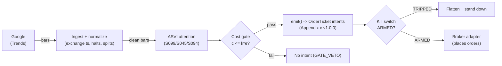

# T073 — ASVI Attention Reversal

Fades abnormal retail attention: Da, Engelberg & Gao's ASVI predicts short-term price pressure that reverses — the module shorts attention spikes and covers the reversal. Provenance **C/SI**.

> Tag law: every numeric literal in prose carries one of `[documented]
> [default] [example] [unverified] [internal-est] [measured]` (legend: Appendix
> i v1.0.0). Bibliographic years, volumes, pages, arXiv IDs, section numbers,
> rule codes (C1–C10), fail-safe codes (F1–F5), module IDs, and machine-parsed
> §0 data fields are identifiers, not literals, and are exempt.

## §1 Five-minute reviewer card

| Row | Value |
|---|---|
| Module | T073 — ASVI Attention Reversal, v1.1.0 |
| Edge verdict | `INSUFFICIENT-EVIDENCE` — Da et al. document the ASVI pressure-and-reversal pattern, but the cited evidence is before-cost predictability — the tradable fade's after-cost edge is not documented |
| After-cost | `BEFORE-COST` — one-sentence verdict: abnormal search attention predicts pressure then reversal in the literature, but no cited paper documents after-cost P&L for fading it |
| Build cost | Tier M · `20–60` h [internal-est] · `$3,000–15,000` loaded [internal-est] |
| Data cost | Research `$0`/mo Trends UI pull [documented]; scripted pulls via unofficial clients (pytrends archived 2025-04 [documented], stability [unverified]); paid fallback SerpApi `engine=google_trends` free tier `250` searches/mo → Developer `$75`/mo for `5,000` [unverified] — bands indicative, verify at the vendor pricing page before budgeting |
| latency_class | bar / daily |
| risk_class | medium |
| Capacity | `max_notional = min(part_cap × ADV × price, max_gross)` = min(`0.05` [default] × `2,500,000` sh [example] × `$250` [example], `$5`M [example]) → `$5`M [example] |
| Executability | Easy: Google Trends + daily bars; the attention scoring is the product. Caveat: **Google never shipped a public Trends API** [documented] — every programmatic route reads the site's internal endpoints and breaks when Google changes them [documented] |
| Risk summary | Attention without pressure: ASVI spikes that the market ignores leave the fade with no reversal; Trends data revisions (same-input index varies between pulls [documented]); genuine-news continuation against the fade |
| When it dies | genuine news driving both attention and price (fade fights drift); ASVI data revisions; crowded attention fades; borrow rates blowing through the cost gate on the short leg |
| Regime gates | Machine records in §T9 (provisional): R035 earnings proximity → veto; R021 retail-flow dominance → double; R013 abnormal participation → double; R001 high realized vol → halve. Restrictive default: unknown label → veto entries [default] |
| Emits | `order_intents` (Appendix c v1.0.0) — intents only, never orders |

## §1.5 Cheapest / least-build path

1. **Prototype hour band:** `20–60` h [internal-est] — ASVI scorer + pressure detector + fade engine + cost/risk harness + fixture.
2. **Cheapest-source row:** min_tier = Google Trends UI explore pull (free, public) [documented] — cheapest data source candidate; latency_class = bar / daily; required_fields = ticker term, `geo`, date window, `data_type=TIMESERIES`, daily bars; price_band = `$0`/mo UI [documented]; scripted pulls via unofficial clients (pytrends archived 2025-04 [documented], breakage/429 risk [documented]) — stability [unverified]; paid fallback SerpApi `engine=google_trends` free tier `250` searches/mo → Developer `$75`/mo for `5,000` [unverified — verify at the vendor pricing page before budgeting]; build_or_buy = **build — the UI pull is free; the scoring is the product**.
3. **Resource budget:** `1` core, `<2` GB RAM [internal-est]; compute pattern `per_bar`.
4. **Skip list:** intraday attention; international Trends; paid attention-data vendors at prototype.
5. **DO-NOT-CUT list:** causality assertions (`assert fill_event > signal_event`, no-signal-bar-fills test); COST block + callable `expected_cost_bps`; F1–F5 fail-safes + module-state enum; kill-switch state machine + re-arm checklist; decision-log audit records; bona-fide-intent + self-trade prevention; provenance tags on every numeric literal; fixtures + `test_cmd`; secrets via env only.
6. **Escalation gate:** upgrade from cheapest when **any** holds — daily symbol count × lookback exceeds the SerpApi free tier (`250` searches/mo [unverified]) and scripted pulls hit sustained 429s → buy the fallback; a first-party Google Trends API leaves alpha (status gated as of Sep 2026 [documented]) → re-evaluate sourcing; borrow band on the short leg exceeds `50` bps/day [example] on >`20`% [example] of names → add a live borrow feed; revision monitor shows same-input SVI drift > `20`% [default] month-over-month → re-validate the scorer before any capital.

## §T0 Module contract

### T0.1 Typed signature

```python
def emit(state: ModuleState, signals: list[SignalVector], cfg: Config) -> list[OrderTicket]:
```

`OrderTicket` per Appendix c v1.0.0 — **intents only**; the strategy never
places orders, never holds broker/exchange sessions, never nets intents into
orders. `state` is the module-owned named state vector (`position`,
`sleeve_weights`, `cooldown_until`, `kill_state`, `module_state`); `signals`
are canonical SignalVectors (Appendix b v1.0.0), newest last. The function
handles documented edge cases: empty signals → `UNKNOWN`; halt/auction bars →
freeze per the market-state table; stale inputs → `UNKNOWN` (F4), never
interpolate.

### T0.2 Config dataclass

| Parameter | Type | Default | Range | Status |
|---|---|---|---|---|
| `asvi_z` | float | `2.5` | `2.0`–`4.0` | default |
| `press_atr` (up, `press_up`) | float | `1.5` | `1.0`–`2.5` | default |
| `press_atr` (down, `press_down`) | float | `-1.5` | `-2.5`–`-1.0` | default |
| `hold_days` | int | `5` | `3`–`10` | default |
| `R_usd` | float | `600` | `200`–`2,000` | default |
| `stop_atr` | float | `1.0` | `0.5`–`2.0` | default |
| `cooldown_bars` | int | `5` | `0`–`20` | default |
| `cost_gate_k` | float | `0.5` | `0.1`–`2.0` | default |
| `part_cap` | float | `0.05` | `0.01`–`0.10` | default |
| `borrow_bps_per_day` | float | `0.0` | `0.0`–`500.0` | default |
| `ref_price_usd` | float | `250.0` | `50`–`1,000` | example |

All defaults tagged per the tag law (status `default` ⇒ `[default]`).
`borrow_bps_per_day` is the *accrual rate* charged to the exit leg per held
day (§T2 COST block); the entry cost function stays execution-only. The
`0.0` [default] means "easy-to-borrow at the reference build" — a name that
fails the C7 locate check never reaches sizing.

**Calibration recipes.** `asvi_z`: walk-forward over trailing `252` days
[default], grid `2.0, 2.5, 3.0, 3.5` [default], embargo `21` days [default],
select by after-cost hit-rate on the fade; freeze on selection, re-fit
quarterly [default]. `press_atr`: same grid procedure on `1.0, 1.5, 2.0`
[default] — the pressure gate is a *confirmation*, not a trigger; the recipe
penalizes configurations where pressure vetoes > `50`% [default] of triggers.
`cost_gate_k`: calibrate so the in-sample cost-share (median cost_bps /
edge_bps) sits at `0.3`–`0.5` [default]; the `0.5` default is conservative
pending that calibration. `borrow_bps_per_day`: re-pin from the broker SLB
desk feed daily at the reference build's `0.0` [default] for easy-to-borrow;
names printing > `100` bps/day [default] are excluded from new shorts.

### T0.3 Canonical schema mapping

Vendor columns → canonical Bar schema (Appendix a v1.0.0), stated once here:

| Vendor (Google Trends) | Canonical |
|---|---|
| bar open timestamp | `event_ts` (int64 ns UTC, bar open time) |
| `o/h/l/c`, `v` | `open/high/low/close`, `volume` |
| symbol | `symbol` (exchange-qualified) |
| signal value | `sig` (strategy-defined score, Appendix b `value`) |
| gate flag | `gate` ∈ {0, 1} (confirmation gate) |
| S045 pressure (ATR units) | `pressure` (feature, signed; consumed from S099-triggered S045, v1.1.0 pin) |
| stop distance ($) | `stop_dist` (`stop_atr × ATR$`, per-bar) |
| daily ADV (shares) | `adv_shares` (trailing `21`-day ADV [default], per-bar) |

S099 supplies `sig` (ASVI z, trigger); S045 supplies `pressure` (feature);
S094 supplies exit context (news-drift continuation flag). All three are
consumed at their pinned v1.1.0 contracts; a pin mismatch → `UNKNOWN` (F1).

### T0.4 Time contract

> Time contract: clock domain UTC, int64 ns; authoritative causality clock =
> `event_ts`; max_skew = `1` ms [default]; jitter budget = `500` µs [default];
> bar-label = open time; staleness TTL = `3`× cadence [default] (F4); gap
> policy = mask, no interpolation; halt/auction → discard contributions
> across reopen.

**Timing box:** `signal@t (per_bar-1d, America/New_York) → earliest fill @open(t+1)`

### T0.5 Market-state table

| State | Module behavior |
|---|---|
| CONTINUOUS_TRADING | Evaluate entries/exits per §T2; emit intents |
| HALTED | Freeze state; emit nothing; `UNKNOWN` on held signals |
| AUCTION | No new entries; exits only via auction-aware intents (MOO/MOC); state `DEGRADED` |
| CLOSED | Emit nothing; state `OFF` |

### T0.6 Module-state enum + error taxonomy

States per Appendix k v1.0.0: `OK | DEGRADED | UNKNOWN | OFF`. Invalid input →
`UNKNOWN`, never interpolate (Appendix f v1.0.0, F1–F5).

| Failure | State | Alert |
|---|---|---|
| Missing/stale input (TTL `3`× cadence [default]) | `UNKNOWN` | page |
| Non-finite / non-positive price reaching module (F2) | `UNKNOWN` | page |
| `event_ts` non-monotonic (F2) | `UNKNOWN` | page |
| Kill-switch TRIPPED | `OFF` (no new intents) | page |
| Halt/auction | `UNKNOWN` / `DEGRADED` (per table) | log |
| Feed anomaly (per §T9 row 1) | `DEGRADED` | notify |
| Anything unmapped | `UNKNOWN` | page |

### T0.7 Risk contract + kill switch

```yaml
risk_contract:
  per_trade_R: `600`            # [example] — N = floor(R/stop_dist), R = $600 per name
  max_adverse_per_trade: `1.0` ATR [example]   # [example]
  daily_loss_stop: `-1800` USD [example]          # [example]
  max_gross: `5`M USD [example]                # [example]
  max_notional_per_name: "min(part_cap * adv_shares * price, max_gross)"   # [default] capacity formula
  borrow_note: "borrow_bps_per_day 0.0 [default] = easy-to-borrow at the reference build; accrues per held day on the exit leg; HTB band per §T2 COST block"  # [default]
  kill_conditions:                        # any one trips -> TRIPPED
  - "Trends data revision > 20% -> re-validate scorer"
  - "daily loss <= -$1,800 -> TRIPPED"
  - "ASVI feed stale > 3 days -> TRIPPED"
  - "borrow rate > 100 bps/day on any held short -> stand down new shorts"  # [default]
  enforcement: intraday-hard              # breach flattens; no review-only mode
```

**Calibration recipe:** `per_trade_R` is the sizing input in §T2 (dollar-risk
`N = ⌊R/stop_dist⌋` or the confidence-scaled equivalent); re-estimate `R`
from the trailing `60`-day [default] per-trade P&L distribution so that a
`3`σ [default] adverse day stays inside `daily_loss_stop`. `max_gross` is
checked pre-emit on every ticket (C4). Kill-switch state machine:

```
ARMED → TRIPPED → RECOVERY → ARMED
```

- `ARMED → TRIPPED`: any kill condition fires → cancel all working intents
  (idempotent cancels), flatten at marketable limits, set module state `OFF`,
  write a `KILL_TRIP` decision record (Appendix g v1.0.0).
- `TRIPPED → RECOVERY`: re-arm checklist **all green** — `1.` feed healthy
  (no stale bars); `2.` decision log reconciled against broker ledger, no
  orphan tickets; `3.` root cause of the trip identified and the offending
  config reverted or re-calibrated; `4.` risk owner sign-off recorded.
- `RECOVERY → ARMED`: one clean evaluation pass over the fixture
  (`test_cmd` green) with no new trip, then resume.

### T0.8 Ops tail

- **Schedule:** daily at close [documented]; owner: alt-data on-call.
- **Health checks:** fixture replay (`test_cmd`) green on deploy; live
  staleness watchdog at `3`× cadence; kill-switch drill monthly [default].
- **Alert table:** page on `UNKNOWN` > `30` s [default], on any kill trip, or
  bounds violation; notify on `DEGRADED`; log on single dropped bars.
- **Resource budget:** `1` vCPU, `2` GB RAM [internal-est]; state is O(`1`) per symbol.
- **Runbook stub:** `1.` confirm feed; `2.` replay fixture; `3.` if red → set
  `OFF`, page; `4.` reconcile decision log before re-arm; `5.` complete the
  re-arm checklist (§T0.7) before `ARMED`.

### T0.9 Secrets (env-only)

`NONE` via environment only. No secrets in this file, fixtures, or logs
(CI secrets-grep).

### T0.10 May / must-NOT

> **May:** emit `OrderTicket` intents per Appendix c v1.0.0; track intent-side
> state; issue cancel-replace via new tickets. **Must-NOT:** place orders on
> any venue, hold broker/exchange sessions, net intents into orders inside the
> strategy, or treat the intent-side state machine as broker wire truth.

## §T1 Legacy (subsumed by §1)

Legacy §T1 content is the §1 reviewer card above; this header is retained so
section numbering stays frozen.

## §T2 Specification

### Universe

Liquid US large-caps with Google Trends coverage [example]; ASVI z `≥2.5` [example] from the pinned S099 v1.1.0 contract; price pressure `≥1.5` ATR [example] from the pinned S045 v1.1.0 contract; `5`-day holds [example]. Trends sourced from the UI explore pull (free, public) [documented] or scripted unofficial clients (breakage/429 risk [documented]); Reg-SHO threshold securities are never shorted (C7). Minimum ADV filter: `adv_shares ≥ 1,000,000` [default] — the tape's `2,500,000` [example] is comfortably above it.

### Entry rule (Boolean — no prose-only conditions)

```
ENTER_SHORT := (ASVI z >= `2.5` [example]) AND (pressure >= `1.5` ATR [example])
                AND (expected_cost_bps(...) <= cost_gate_k * edge_bps)
                AND (locate obtained for SHORT per C7)
ENTER_LONG  := (ASVI z >= `2.5` [example]) AND (pressure <= `-1.5` ATR [example]) [panic selling]
                AND (expected_cost_bps(...) <= cost_gate_k * edge_bps)
FLAT        := otherwise
```

The pressure term is the S045 confirmation gate made executable: it is a
column in the tape (`pressure`), checked in `decide()` and covered by
fixture bar 12 (z `2.9` [example] with pressure `0.8` [example] → vetoed,
test_7). Attention without price confirmation is not traded.

### Exits (with post-exit cooldown)

```
EXIT := (bars_held >= hold_days)   # 5 days [example]
        OR (reversal completes: 50% retrace)    # [example]
        OR (stop = 1.0 ATR hit)                 # [example]
        OR (S094 news-drift continuation flag = 1)  # [default] — genuine news kills the fade
ON_EXIT: cooldown_until = now + cooldown_bars * bar_ns   # C10
ON_EXIT: borrow_usd = borrow_bps_per_day * days_held * notional / 1e4  # §T2 COST block
```

### Position sizing (fenced function)

```python
def size_shares(risk_budget_R, stop_distance, vol_estimate, ADV_cap, cost):
    """shares = f(risk_budget_R, stop_distance, vol_estimate, ADV_cap, cost).

    Dollar-risk quantity capped by the ADV participation cap. `cost` enters
    through the C2 cost-gate veto in §T3 (a failing gate emits no ticket),
    not through qty. vol_estimate (ATR$) scales stop_distance when the tape
    does not carry it: stop_distance = stop_atr * vol_estimate.
    """
    stop_distance = max(stop_distance, 1e-9)                     # [default] floor
    n_risk = int(risk_budget_R // stop_distance)                # [default] dollar-risk
    n_adv = int(ADV_cap * adv_shares)                           # [default] participation cap
    qty = min(n_risk, n_adv)
    return max(1, qty)                                          # [default] round lot 1
```

Worked on the fixture: `R = $600` [example], `stop_distance = $2.50`
[example], `ADV_cap = 0.05 × 2,500,000` [example] → `min(240, 125,000) = 240`
[example] shares. The ADV cap binds on thin names (test_8: `2,000` ADV →
`100` shares).

### Risk limits

| Limit | Value |
|---|---|
| Per-trade risk | `$600` [example] |
| Daily loss stop | `−$1,800` [example] |
| Trends-revision veto | revision `>20`% → re-validate [default] |
| Max adverse per trade | `1.0` ATR [example] (CI gate: stop must be ≤ this before emit) |
| Max notional per name | `min(0.05 × ADV × price, $5M)` [default] — capacity formula |
| Borrow stress | borrow rate `>100` bps/day on a held short → no new shorts [default] |

### COST block (single source of truth)

| Component | Value (bps) | Basis |
|---|---|---|
| Spread | `1.50` | [example] — assumed ~3.75¢ spread on the `$250` [example] reference price |
| Fees | `0.31` | [documented basis] — retail fixed-pricing commission `$0.005`/share, min `$1.00`/order [documented]; SEC §31 FY2026 `$20.60`/M on sell legs, blended per side [documented]; FINRA TAF `$0.000090`/share max `$4.50`/trade, blended per side [documented]. At the fixture's `240` sh × `$250`: commission `$1.20` → `0.20` bps; SEC `0.103` bps; TAF `0.0036` bps |
| Borrow | `0.0` | [default] — easy-to-borrow at the reference build; accrues per held day on the exit leg, not at entry |
| Impact | `0.0` | [example] — flagged |
| **Total reference** | `1.81` | [documented basis] at `240` sh × `$250` [example] — was `2.70` [example] before the 1.1.0 re-basis |

`fee_schedule_as_of`: `2026-09-10` [unverified] — compilation date; pin the
real venue schedule before production. `side: mixed` [default];
venue/tier/source: XNAS / fixed-pricing retail broker (IBKR-style) [example].
`borrow_bps_per_day`: `0.0` [default] — **reason**: the reference build trades
easy-to-borrow large caps and books borrow as a daily accrual on the exit leg
(`borrow_usd = borrow_bps_per_day × days_held × notional / 1e4`), not as an
entry cost; the entry cost function is execution-only. Researched band for
calibration: easy-to-borrow `0.25`–`1.0`%/yr → `0.7`–`2.7` bps/day [unverified];
hard-to-borrow can exceed `100` bps/day [unverified] — names printing
`>100` bps/day [default] are excluded from new shorts.

Institutional alternative (documented, not the reference build): tiered/DMA
routing — Nasdaq Rule 7018 remove-liquidity `$0.0030`/share [documented]
(`$0.72` on `240` sh → `0.12` bps), maker-side credits per the same rulebook
[documented], plus the same SEC/TAF rows. The maker
proxy in the function below (`-50`% of fees [example]) is the cheap-model
stand-in for that schedule.

Re-stating cost numbers outside
this block is a validation failure.

```python
def expected_cost_bps(notional, adv_pct, venue, side, urgency) -> float:
    '''Callable cost model — single source of truth (this block).'''
    ref_price = 250.0        # [example] — scaling assumption; fixtures use ~$250
    shares = notional / ref_price
    comm_bps = max(1.00, 0.005 * shares) / notional * 1e4   # [documented] fixed $0.005/sh, min $1.00/order
    sec_bps = 0.103          # [documented] SEC §31 FY2026 $20.60/M, sell legs, blended per side
    taf_bps = 0.000090 * shares / notional * 1e4            # [documented] FINRA TAF $0.000090/sh, blended per side
    fee_bps = comm_bps + sec_bps + taf_bps
    spread_bps = 1.5         # [example] — ~3.75¢ on the $250 reference price
    borrow_bps = 0.0         # [default] — see borrow note above
    impact_bps = 0.0         # [example] — flagged
    if side == "maker":
        fee_bps = -abs(fee_bps) * 0.5  # rebate proxy [example]
    return spread_bps + fee_bps + borrow_bps + impact_bps
```

### Execution / fill model table

| Aspect | Assumption |
|---|---|
| Latency | Daily; signal computed after the close, earliest fill at the next open [default] |
| Entries | Fade the attention spike via DAY limit intents; SHORT at close + half-spread, BUY at close − half-spread [example] |
| Exits | `5`-day hold, 50% retrace, stop, or S094 news-drift continuation [example/default] |
| Partial fills | Per Appendix c v1.0.0 FIFO; unfilled remainder re-intented next bar, never chased intraday [default] |
| Adverse fill | Genuine-news continuations gap against the fade [example]; fills bounded by the pre-trade collar (C4) |
| Impact | `0.0` bps [example] — flagged; the ADV participation cap (`5`% [default]) is the guard |

### Robustness

ASVI z `≥2.5` [example] (Da, Engelberg & Gao 2011); pressure `≥1.5` ATR [example] confirms the price followed attention; `5`-day hold [example] inside the documented reversal window [example]; Barber & Odean (2008): retail attention drives buying — the fade's premise.

**Documented pattern figures** (Da, Engelberg & Gao 2011 [documented]):
Russell 3000 sample, Jan 2004 – Jun 2008 [documented]; among smaller Russell
3000 stocks, large weekly SVI-change names outperformed by ~`11` bps/week
(`~5.7`% annualized) over the first two weeks [documented — NBER working
draft]; an SVI increase predicts higher prices in the next `2` weeks and an
eventual price reversal **within the year** [documented — paper abstract].

**Honest tension:** the documented reversal unfolds over weeks-to-a-year;
the module's `5`-day hold [example] is the builder's trade on the front of
that reversal, not a paper-prescribed horizon. The pressure confirmation and
the S094 news-drift exit exist precisely because attention that arrives with
genuine information does not reverse on schedule.

### Compliance sub-block (C1–C10+)

| Code | Rule: trigger → check → action → log |
|---|---|
| C1 | Self-match / STP: every ticket carries self-trade-prevention instructions for the broker adapter; trigger = two tickets same symbol opposite side within `1` s [default] → check resting-interest overlap → action = cancel the newer ticket → log `COMPLIANCE_BLOCK` |
| C2 | Bona-fide intent: every entry intent must pass the cost gate (`expected_cost_bps(...) <= k * edge_bps`) and fit risk limits; trigger = gate fail → check = re-evaluate → action = no ticket emitted → log `GATE_VETO` |
| C3 | Message-rate / cancel-to-trade: trigger = `>50` intents/symbol/min [default] or cancel-to-trade `>10:1` [default] → check venue thresholds → action = throttle to `5`/min [default] + alert → log `COMPLIANCE_BLOCK` |
| C4 | Pre-trade fat-finger trio: price collar `±5`% vs reference [default] → reject; max notional per ticket `$2,000,000` [default] → reject; max `50` tickets/symbol/`5` min [default] → throttle; all rejections logged |
| C5 | Decision-log schema compliance (Appendix g v1.0.0): every intent, veto, cancel-replace, kill transition logged with inputs_hash/params_hash, hash-chained; trigger = missing record → action = halt to `UNKNOWN` |
| C6 | Halt/auction state table: per §T0.5 — HALTED freezes, AUCTION blocks new entries, CLOSED emits nothing; trigger = state change → check market-state table → action = freeze/cancel per table → log |
| C7 | Locate check (short sales): trigger = SHORT intent → check = easy-to-borrow list or live locate obtained pre-emit → action = block intent without locate → log `GATE_VETO`; Reg-SHO threshold securities never shorted; fail-to-deliver closeout per Rule 204 — purchase or borrow to close out by no later than the beginning of regular trading hours on the settlement day following the fail (T+2 in the T+1 era) [documented — SEC Releases 34-60388, 34-96930], with the pre-borrow penalty on further shorts until closed [documented] |
| C8 | Public-dissemination gate: no signal/intent data published externally without review; trigger = export request → check = review sign-off → action = block until signed |
| C9 | Data-entitlement assertions per dataset (Appendix j v1.0.0): trigger = entitlement-class change or unlicensed symbol → check §T5 data-rights row → action = stand down affected symbols → log |
| C10 | Post-exit cooldown: trigger = exit or compliance block → check `now < cooldown_until` → action = no re-entry until ``5`` bars [default] elapse → log |
| C11 | Data-revision hygiene: Trends revision `>20`% [default] → re-validate scorer → check revision monitor → action = re-validate → log `DATA_ISSUE` |

### Parameter table

| Parameter | Symbol | Value | Tag | Sensitivity |
|---|---|---|---|---|
| ASVI z | `asvi_z` | `2.5` | [example] | high |
| Pressure (up) | `press_up` | `1.5` ATR | [default] | high |
| Pressure (down) | `press_down` | `-1.5` ATR | [default] | high |
| Hold days | `hold_days` | `5` | [example] | medium |
| Stop | `stop_atr` | `1.0` ATR | [example] | high |
| Cost-gate k | `cost_gate_k` | `0.5` | [default] | high |
| Participation cap | `part_cap` | `0.05` | [default] | medium |
| Borrow/day | `borrow_bps_per_day` | `0.0` | [default] | medium |
| Reference price | `ref_price_usd` | `$250` | [example] | low |

### Timing box

`signal@t (per_bar-1d, America/New_York) → earliest fill @open(t+1)`

## §T3 Math + normative pseudocode

Abnormal Search Volume Index
$\mathrm{ASVI}_t = \log(\mathrm{SVI}_t) - \log(\mathrm{median}_{8w}(\mathrm{SVI}))$
[documented Da et al. form], z-scored. Fade short when $z \ge 2.5$ [example]
with upward price pressure $\ge 1.5 \times$ ATR [example] (attention bought
the stock); fade long on panic-selling pressure. Hold $5$ days [example];
Da, Engelberg \& Gao (2011): ASVI predicts short-term pressure that
reverses within weeks — the $5$-day fade is the builder's trade on it.

**Normative pseudocode** (pseudocode is normative; prose is commentary):

```
function emit(state, signals, cfg) -> list[OrderTicket]:
    assert signals non-empty else return UNKNOWN                    # F1
    assert cfg consumes S099/S045/S094 at v1.1.0 pins else return UNKNOWN  # F1
    for bar t in signals (newest last):
        z = ASVI z-score (S099, v1.1.0); p = pressure in ATR units (S045, v1.1.0)
                                            # data <= t only
        assert isfinite(z) and isfinite(p) else return UNKNOWN     # F2
        assert t.event_ts monotonic else return UNKNOWN            # F2
        edge_bps = abs(z) * 2.0                                   # [example] — modeled per-trade edge in bps
        notional_hint = R_usd / stop_atr * close_t                 # sizing preview
        cost = expected_cost_bps(notional_hint, adv_pct, venue, side, urgency)
        cost_ok = expected_cost_bps(...) <= k * edge_bps
        # ^^^ normative cost-gate predicate: expected_cost_bps(...) <= k * edge_bps
        if state.position is None and state.module_state == OK and t >= state.cooldown_until:
            if ((z >= 2.5) and (p >= 1.5)) and cost_ok:            # ENTER_SHORT (§T2)
                assert locate obtained for SHORT else emit nothing # C7
                qty = size_shares(R_usd, stop_dist, ATR$, part_cap*adv_shares, cost)  # §T2
                ticket = OrderTicket(symbol, SHORT, qty, close_t + half_spread, DAY,
                                     ticket_id=uuid(), parent_signal="S099@t",
                                     intent_ts=t.event_ts, state=NEW)
                log_decision(ticket, inputs_hash, params_hash)     # C5 / Appendix g
                assert fill_event > signal_event                    # t->t+1 causality
            elif ((z >= 2.5) and (p <= -1.5)) and cost_ok:         # ENTER_LONG (panic fade)
                qty = size_shares(R_usd, stop_dist, ATR$, part_cap*adv_shares, cost)
                ticket = OrderTicket(symbol, BUY, qty, close_t - half_spread, DAY,
                                     ticket_id=uuid(), parent_signal="S099@t",
                                     intent_ts=t.event_ts, state=NEW)
                log_decision(ticket, inputs_hash, params_hash)     # C5 / Appendix g
                assert fill_event > signal_event
        else if state.position is not None:
            days_held = state.bars_held + 1
            if ((days_held >= hold_days) or (50% retrace) or (stop hit)
                    or (S094 news-drift flag = 1)):
                emit exit intent (cancel-replace rules, Appendix c) # C1
                borrow_usd = borrow_bps_per_day * days_held * notional / 1e4
                state.cooldown_until = t + cooldown_bars            # C10
                assert fill_event > signal_event
    return tickets
```

Causality: every quantity at bar `t` uses only data `≤ t`; the earliest fill
is bar `t+1`'s open. Mandatory unit test: no-signal-bar fills
(`assert fill_event > signal_event`).

## §T4 Worked example (fixture-backed)

- Tape: `modules/fixtures/T073_tape.csv` — `# TYPE: validation-run`;
  `13` bars [example], all numbers synthetic, seed `10073` [example];
  `event_ts` int64 ns UTC, bar-labeled by open time. Columns include
  `pressure` (S045 confirmation, ATR units) and `adv_shares` (trailing ADV).
  Bar 12 (`z = 2.9` [example], `pressure = 0.8` [example]) exercises the
  pressure veto: no ticket fires.
- Expected outputs: `modules/fixtures/T073_expected.csv` — per-ticket
  intents with the cost-function call recorded (inputs → bps → $) plus the
  `borrow_usd` accrual column on the exit leg;
  tolerance `1e-6` [default] on floats.
- Acceptance tests (`modules/tests/test_T073.py`, `9` tests):
  `1.` fixture replays to expected (hand-checked rows below); `2.` cost-gate
  predicate passes on the fixture's large edges and blocks a tiny-edge
  counter-case (`k = 0.5` [default]); `3.` no-signal-bar fills
  (`fill_ts > signal_ts` on every ticket); `4.` kill-switch trips on the
  breach scenario and re-arms through the checklist
  (`ARMED → TRIPPED → RECOVERY → ARMED`); `5.` invalid input (non-positive
  price, non-finite pressure, non-monotonic ts) → `UNKNOWN`, never
  interpolated; `6.` hand-check literals (qty / bps / $) match the generation
  run; `7.` pressure veto: fixture bar 12 fires no ticket; synthetic panic
  bar with pressure confirmation fires the long fade; `8.` ADV participation
  cap binds on a thin name; `9.` borrow accrual on the exit leg
  (`borrow_bps_per_day = 50.0` [example] stress rate).
- `test_cmd`: `python3 -m pytest modules/tests/test_T073.py -q` → exits `0`.

**Cost-function calls on the fixture** (inputs → bps → $, from the harness run):

| ticket | notional ($) | adv_pct | side | edge_bps | cost_bps | cost_$ | borrow_$ | gate |
|---|---|---|---|---|---|---|---|---|
| T-T073-2-0 | 60013.73 | 0.0200 | mixed | 5.6000 | 1.8066 | 10.8421 | 0.0000 | PASS |
| T-T073-7-X | 59986.51 | 0.0200 | mixed | 0.0000 | 1.8066 | 10.8372 | 0.0000 | N/A |

Cost decomposition at the entry ticket (documented basis): commission
`0.2000` bps (`$1.20` on `240` sh [documented]); SEC §31 `0.1030` bps
(blended per side [documented]); FINRA TAF `0.0036` bps [documented];
spread `1.5000` bps [example]; borrow `0.0000` [default]; impact `0.0000`
[example]. The `2.70` bps [example] plug from v1.0.0 is retired.

**Where the example is optimistic:** the fixture encodes attention spikes as signal events; production faces Trends revisions and genuine-news continuation; the pressure confirmation is folded into the entry threshold



## §T5 Dependencies & data

Generated-from-`deps.yaml` shape (CI symmetry); hand-listed:

| Module | Role | Version pin |
|---|---|---|
| S099 — ASVI attention | Trigger | 1.1.0 |
| S045 — Price pressure | Feature | 1.1.0 |
| S094 — News drift | Exit context | 1.1.0 |

Deep-review 1.1.0 corrected the pins from the stale `1.0.0` — the
signal-wave deep review re-versioned all three to v1.1.0; consuming a stale
pin → `UNKNOWN` (F1) per §T3.

**Family note:** family `C` = event-driven / alternative-data strategies.

**Data rights row** (Appendix j v1.0.0): Google Trends: UI explore pull is
free/public [documented]; Google never shipped a public Trends API
[documented] — scripted pulls via unofficial clients (pytrends archived
read-only April 2025 [documented]) read the site's internal endpoints, break
when Google changes them, and face 429 rate limits [documented]; production
stability of scripted pulls is [unverified]. Same-input SVI index can vary
between pulls [documented] — the revision monitor (§T0.7) exists for this.
Paid fallback SerpApi `engine=google_trends` is a licensed API product;
pricing [unverified — verify at the vendor page before budgeting]. Daily
bars: any Tier-1 vendor, licensed. Raw Trends responses never leave our
systems beyond the scorer; fixtures are synthetic. Entitlement-class
change → §1.5 escalation gate.

## §T6 Local build (M5 Max / 128 GB)

Trivial on the M5 Max (Tier M, `20–60` h ≈ `$3k–15k` eng [internal-est] +
`$0`/mo data [documented — Trends UI pull]); the Trends UI is free and the
scoring is the product. Bottleneck is the scoring and the revision monitor,
not compute. Paid-fallback data (SerpApi tier) adds up to `$75`/mo [unverified].

## §T7 Buy vs build

Build — Trends is free; the scoring is the product. Verdict: cheapest module in the batch to prototype.

## §T8 Efficacy — documented evidence

| Study / source | Market & period | Metric | Before/after cost | Caveat |
|---|---|---|---|---|
| Da, Engelberg & Gao (2011), J. Finance | US stocks, Russell 3000, 2004–2008 | SVI increase predicts higher prices over the next `2` weeks and an eventual reversal within the year [documented]; smaller-cap names with large weekly SVI change outperformed by ~`11` bps/week (`~5.7`% annualized) over the first two weeks [documented] | `BEFORE-COST` (predictability) | the pattern; after-cost fade unproven; reversal horizon is weeks-to-year, not `5` days |
| Barber & Odean (2008), RFS | Retail investors | attention drives buying behavior [documented] | `BEFORE-COST` (behavioral) | the fade's premise |
| Tetlock (2007), J. Finance | WSJ | news sentiment predicts price pressure [documented] | `BEFORE-COST` (predictability) | the news context |

Selection disclosure: these are the sources surfaced by the chapter's research
pass (Stage 173/200). **Honest bottom line.** For a ≤$1M paper operation: T073 is the cheapest module in the batch to prototype (free data) and trades a documented pattern — but the cited evidence is before-cost predictability, the documented reversal unfolds over weeks to a year (not the module's `5`-day [example] hold), and the after-cost fade is not documented.

## §T9 Failure modes & pitfalls

| # | Trigger → Detect → Action → Recovery | check: |
|---|---|---|
| 1 | Genuine news: attention + real drift → detect: post-entry continuation / S094 flag → action: stop out → recovery: re-tune | `check: exit on stop or S094 flag` |
| 2 | Trends revision > 20% → detect: revision monitor → action: re-validate → recovery: re-pin scorer | `check: revision <= 0.20` |
| 3 | No pressure: ASVI spikes, price ignores → detect: pressure < 1.5 ATR → action: veto → recovery: next spike | `check: pressure >= 1.5 ATR` |
| 4 | Stop: 1.0 ATR adverse → detect: stop monitor → action: exit → recovery: next spike | `check: exit on stop` |
| 5 | Cost blowup → detect: cost gate fails → action: stand down → recovery: re-pin | `check: expected_cost_bps(...) <= k * edge_bps` |
| 6 | Lookahead: ASVI uses future Trends → detect: causality audit → action: halt → recovery: re-run test | `check: all(fill_ts > signal_ts)` |
| 7 | Trends endpoint breakage: unofficial API changes/429s → detect: staleness TTL `3`× cadence [default] or 429 rate → action: `UNKNOWN`, fall back to UI pull or SerpApi → recovery: re-pin client | `check: feed age < 3d [default] and error rate < 5% [default]` |
| 8 | Borrow spike: borrow rate > 100 bps/day on a held short → detect: SLB feed → action: stand down new shorts, cover if gate fails → recovery: rate normalizes | `check: borrow_bps_per_day <= 100` |
| 9 | Fee-schedule drift: venue changes fees → detect: fee_schedule_as_of older than `90` days [default] → action: re-pin COST block → recovery: test green | `check: fee_schedule_as_of within 90d` |

### Regime-gate machine records (provisional)

Restrictive default: an unknown regime label → veto entries [default];
conflicting gates → the most restrictive action wins [default].

| regime_id | direction | mechanism | condition | action | min_lag | unknown_behavior |
|---|---|---|---|---|---|---|
| R035 | degrades | earnings-season attention spikes are calendar-driven information demand (Drake, Roulstone & Thornock 2012 [documented]), not fade-able pressure | earnings proximity ≤ `10` trading days [example] | veto | `2` weeks [example] | veto entries |
| R021 | amplifies | retail-flow dominance converts attention into order flow — the fade's pressure assumption holds | retail-flow share > `0.5` [example] | double | `1` week [example] | hold last label |
| R013 | amplifies | abnormal participation confirms attention is moving volume | participation z > `2` [example] | double | `1` week [example] | hold last label |
| R001 | degrades | elevated realized volatility widens spreads, tightening the cost gate | RV > `2`× trailing median [example] | halve | `1` week [example] | hold last label |

## §T10 Source log + unverified leads

**Sources** (citable facts only):

1. Da, Z., Engelberg, J. & Gao, P. (2011) [documented]. "In Search of Attention." *Journal of Finance* 66(5): 1461–1499. — ASVI predicts short-term price pressure that reverses.
2. Barber, B. M. & Odean, T. (2008) [documented]. "All That Glitters: The Effect of Attention and News on the Buying Behavior of Individual and Institutional Investors." *Review of Financial Studies* 21(2): 785–818. — attention drives retail buying.
3. Tetlock, P. C. (2007) [documented]. "Giving Content to Investor Sentiment." *Journal of Finance* 62(3): 1139–1168. — news sentiment predicts price pressure.
4. SEC Fee Rate Advisory for Fiscal Year 2026 (Feb. 27, 2026) [documented]. Section 31 rate `$20.60` per `$1M`, effective April 4, 2026 (was `$0.00` before). https://www.sec.gov/rules-regulations/fee-rate-advisories/2026-2 — basis for the COST-block SEC line (`0.103` bps blended per side).
5. FINRA By-Laws, Schedule A, §1 [documented]. Trading Activity Fee `$0.000090` per share for each sale of a covered equity security, maximum `$4.50` per trade — basis for the COST-block TAF line (`0.0036` bps).
6. Nasdaq Equity Rule 7018, Equity 7 Pricing Schedule [documented]. Charge to remove liquidity `$0.0030` per share executed, all tapes/MPIDs, shares ≥ `$1.00`. https://listingcenter.nasdaq.com/rulebook/nasdaq/rules/nasdaq-equity-7 — institutional-alternative row in the COST block.
7. SEC Release 34-60388, Amendments to Regulation SHO [documented]. Rule 204: close out fails by the beginning of regular trading hours on the settlement day following the fail; pre-borrow penalty until closed. https://www.sec.gov/rules/final/2009/34-60388.pdf — C7.
8. SEC Release 34-96930, Shortening the Settlement Cycle [documented]. T+1 closeout application for Rule 204. https://www.sec.gov/rules/final/2023/34-96930.pdf — C7.
9. socialcrawl.dev, "Google Trends API" guide (Sep 2026) [documented]. Google never shipped a public Trends API; pytrends archived read-only April 2025; first-party Trends API alpha announced July 2025, still gated. https://www.socialcrawl.dev/blog/google-trends-api — §1.5 / §T5 sourcing honesty.
10. HasData google-trends MCP package page [documented]. No official API; unofficial clients break when Google changes internal endpoints; frequent 429s. https://pypi.org/project/hasdata-google-trends-mcp/1.0.1/ — §T9 row 7.
11. PytrendsLongitudinalR CRAN vignette v0.1.4 [documented]. Same-input Trends index can vary between pulls; 429 rate-limit behavior; thin keywords return zeros. — revision-monitor rationale (§T0.7).
12. NBER working draft of Da, Engelberg & Gao (2011) [documented]. Russell 3000 weekly sort: large-SVI-change small names outperform by ~`11` bps/week over the first two weeks (`~5.7`% annualized); `2`-week pressure, reversal within the year. https://users.nber.org/~confer/2009/mms09/Da_Engelberg_Gao.pdf — §T8 figures.

**Chatbot source log.** Grok answered Q-TB8-1..3 (2026-09-10); all claims independently verified or labeled unverified.

**Unverified leads** (chatbot-only — never in evidence tables):

- Grok Q-TB8-3: ASVI-fade backtests — chatbot figures, unverified; build-phase measurement task.
- SerpApi `engine=google_trends` pricing (free `250` searches/mo → Developer `$75`/mo for `5,000`) — third-party comparisons, not the vendor page; verify at the vendor pricing page before budgeting.
- Retail fixed-pricing commission `$0.005`/share, min `$1.00`/order — IBKR-style schedule per 2026 third-party pricing guides and the IBKR Canada stocks-pricing page (https://www.InteractiveBrokers.ca/en/accounts/fees/stocksPricing2.php?nhf=T); re-pin from the live broker schedule before production.
- Stock-loan band: easy-to-borrow `0.25`–`1.0`%/yr (`0.7`–`2.7` bps/day); hard-to-borrow can exceed `100` bps/day — practitioner band, unverified; needs an SLB-desk quote for production calibration.
- Google first-party Trends API alpha (announced July 2025) — still gated as of Sep 2026 per third-party coverage; whether it opens, and its pricing, is unverified.

**GROK-NEEDED** (exact questions web search cannot answer):

- **Q-GROK-T073-1**: In Da, Engelberg & Gao (2011), "In Search of Attention," beyond the abstract's "reversal within the year," is there a published horizon decomposition — how much of the SVI-driven reversal completes within 1 month vs 3 months vs 12 months? Is there any published after-cost backtest (academic or practitioner) of a tradable strategy that fades abnormal SVI (long/short, any holding period)?
- **Q-GROK-T073-2**: Is there published evidence on Google Trends SVI vintage instability — i.e., the same ticker/date pull returning materially different values when re-pulled weeks later — and any quantification of how that revision noise affects backtested ASVI strategies?
- **Q-GROK-T073-3**: For Russell 3000 easy-to-borrow names held `3`–`10` days, what annualized stock-loan fee band does a prime/SLB desk actually quote today (median and 90th percentile, bps/day)? At what fee level do practitioners typically exclude a name from a short book?
- **Q-GROK-T073-4**: Under T+1 settlement, confirm the Rule 204 closeout timing for an ordinary (non-market-maker) short-sale fail: close out by the beginning of regular trading hours on T+2 — and whether any 2024–2026 no-action relief or FAQ changed the pre-borrow penalty trigger for retail-introducing brokers.

---

## Appendix — AI build prompt (T073)

Copy-paste into any chat agent:

> Build module **T073 — ASVI Attention Reversal** v1.1.0 per
> `notes/module-template.md` v1.0.0 and this file's §T0 contract.
> Cheapest path (§1.5): prototype `20–60` h [internal-est]; cheapest data
> candidate Google Trends UI explore pull (free, public) [documented];
> scripted pulls are unofficial (pytrends archived 2025-04 [documented]) —
> plan for breakage/429s [documented]; compute pattern `per_bar`; skip
> intraday attention; international Trends for now.
> Implement `emit(state, signals, cfg) -> list[OrderTicket]`
> (Appendix c v1.0.0) with the §T3 normative pseudocode, including the
> S045 pressure confirmation gate, the cost-gate predicate
> `expected_cost_bps(...) <= k * edge_bps`, the ADV participation cap,
> the per-day borrow accrual on the exit leg, and
> `assert fill_event > signal_event`. Consume S099/S045/S094 at the pinned
> v1.1.0 contracts (stale pin → `UNKNOWN`). Wire F1–F5 (Appendix f v1.0.0):
> invalid input → `UNKNOWN`, never interpolate. Implement the kill-switch
> state machine `ARMED → TRIPPED → RECOVERY → ARMED` with the §T0.7 re-arm
> checklist. Log decisions per Appendix g v1.0.0. Secrets via env only.
> Run the fixture `modules/fixtures/T073_tape.csv`
> (`# TYPE: validation-run`, `13` bars incl. the bar-12 pressure veto)
> against `modules/fixtures/T073_expected.csv`
> (tolerance `1e-6` [default]).
> **Definition of done:** `python3 -m pytest modules/tests/test_T073.py -q`
> exits `0` (`9` tests). Tag every numeric literal you add with the unified enum
> (Appendix i v1.0.0); put anything unverifiable in §T10 unverified leads.
