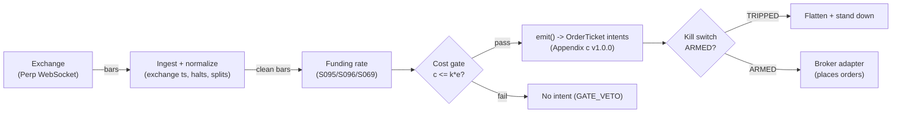

# T075 — Crypto Funding-Rate Reversal

Fades extreme crypto funding rates: when perpetual funding is very positive, longs are crowded — the module shorts the perp (or sells spot basis) and covers on funding normalization. Provenance **C/SI**.

> Tag law: every numeric literal in prose carries one of `[documented]
> [default] [example] [unverified] [internal-est] [measured]` (legend: Appendix
> i v1.0.0). Bibliographic years, volumes, pages, arXiv IDs, section numbers,
> rule codes (C1–C10), fail-safe codes (F1–F5), module IDs, and machine-parsed
> §0 data fields are identifiers, not literals, and are exempt.

## §1 Five-minute reviewer card

| Row | Value |
|---|---|
| Module | T075 — Crypto Funding-Rate Reversal, v1.1.0 |
| Edge verdict | `INSUFFICIENT-EVIDENCE` — funding-rate predictability is practitioner-documented; no cited paper documents after-cost P&L for the funding-fade rule — the basis can stay crowded |
| After-cost | `BEFORE-COST` — one-sentence verdict: extreme funding marks crowded positioning in practitioner lore, but the fade's after-cost edge is undocumented — funding can stay extreme while price trends |
| Build cost | Tier M+ · `40–100` h [internal-est] · `$6,000–30,000` loaded [internal-est] |
| Data cost | Research `~$0–500`/mo [unverified]; production `$0`/mo — public market-data endpoints need no API key [documented] — bands indicative, verify before budgeting |
| latency_class | bar / 1-hour |
| risk_class | high |
| Capacity | moderate [example] — crypto perps |
| Executability | Moderate: needs perp WebSocket + funding history; liquidation risk is the product |
| Risk summary | Liquidation: crypto leverage + gap moves = liquidation before the reversal; funding can stay extreme for weeks |
| When it dies | sustained trends with extreme funding (fade fights the trend); exchange outages; liquidation cascades |
| Regime gates | Provisional machine records in §T5 (R-annotation pass pending); triggers: S095 funding z `≥2.5` [example]; S096 OI confirmation [example] |
| Emits | `order_intents` (Appendix c v1.0.0) — intents only, never orders |

## §1.5 Cheapest / least-build path

1. **Prototype hour band:** `40–100` h [internal-est] — funding monitor + OI confirmation + liquidation guard + cost/risk harness + fixture.
2. **Cheapest-source row:** min_tier = Binance USDⓈ-M Futures public market data (Tier 3, free) [documented] — `GET /fapi/v1/fundingRate` (funding history, weight `1` [documented]), `GET /fapi/v1/premiumIndex` (current rate + next funding time [documented]), `GET /fapi/v1/openInterest` and `/futures/data/openInterestHist` (OI history, `1`h periods [documented]), klines WebSocket; no API key required for public endpoints [documented]; latency_class = bar / 1-hour; required_fields = funding rates, open interest, perp prices, position/margin snapshot (private REST — key via env, still `$0`/mo [documented]); price_band = `$0`/mo [documented]; build_or_buy = **build — exchange data is free; the liquidation guard is the product**.
3. **Resource budget:** `1` core, `<2` GB RAM [internal-est]; compute pattern `per_bar`.
4. **Skip list:** cross-exchange funding arb; options-based crypto vol.
5. **DO-NOT-CUT list:** causality assertions (`assert fill_event > signal_event`, no-signal-bar-fills test); COST block + callable `expected_cost_bps`; F1–F5 fail-safes + module-state enum; kill-switch state machine + re-arm checklist; decision-log audit records; bona-fide-intent + self-trade prevention; provenance tags on every numeric literal; fixtures + `test_cmd`; secrets via env only.
6. **Escalation gate:** upgrade from cheapest when any holds — leverage `>3`x [default]; funding z `>5` [default]; re-pin `fee_bps` to the live venue schedule (candidate: taker `5.0` bps, maker `2.0` bps [documented]) when the cost gate starts binding; add cross-exchange funding comparison (Bybit/OKX endpoints [unverified]) once single-venue capacity binds.

## §T0 Module contract

### T0.1 Typed signature

```python
def emit(state: ModuleState, signals: list[SignalVector], cfg: Config) -> list[OrderTicket]:
```

`OrderTicket` per Appendix c v1.0.0 — **intents only**; the strategy never
places orders, never holds broker/exchange sessions, never nets intents into
orders. `state` is the module-owned named state vector (`position`,
`sleeve_weights`, `cooldown_until`, `kill_state`, `module_state`); `signals`
are canonical SignalVectors (Appendix b v1.0.0), newest last. The function
handles documented edge cases: empty signals → `UNKNOWN`; halt/auction bars →
freeze per the market-state table; stale inputs → `UNKNOWN` (F4), never
interpolate.

### T0.2 Config dataclass

| Parameter | Type | Default | Range | Status |
|---|---|---|---|---|
| `fund_z` | float | `2.5` | `2.0`–`4.0` | default |
| `oi_mult` | float | `1.5` | `1.2`–`2.5` | default |
| `max_lev` | float | `3.0` | `1.0`–`5.0` | default |
| `liq_buffer` | float | `0.30` | `0.20`–`0.50` | default |
| `R_usd` | float | `500` | `100`–`2,000` | default |
| `cooldown_bars` | int | `24` | `0`–`72` | default |
| `cost_gate_k` | float | `0.5` | `0.1`–`2.0` | default |

All defaults tagged per the tag law (status `default` ⇒ `[default]`).

### T0.3 Canonical schema mapping

Vendor columns → canonical Bar schema (Appendix a v1.0.0), stated once here:

| Vendor (Exchange Perp WebSocket) | Canonical |
|---|---|
| bar open timestamp | `event_ts` (int64 ns UTC, bar open time) |
| `o/h/l/c`, `v` | `open/high/low/close`, `volume` |
| symbol | `symbol` (exchange-qualified) |
| signal value | `sig` (strategy-defined score, Appendix b `value`) |
| gate flag | `gate` ∈ {0, 1} (confirmation gate) |

### T0.4 Time contract

> Time contract: clock domain UTC, int64 ns; authoritative causality clock =
> `event_ts`; max_skew = `1` ms [default]; jitter budget = `500` µs [default];
> bar-label = open time; staleness TTL = `3`× cadence [default] (F4); gap
> policy = mask, no interpolation; halt/auction → discard contributions
> across reopen.

**Timing box:** `signal@t (per_bar-1h, UTC) → earliest fill @open(t+1)`

> Funding-settlement anchor: Binance settles funding at `00:00`/`08:00`/`16:00`
> UTC [documented]; a position must be held *across* the settlement timestamp
> to pay or receive funding — closing `1` s early means no funding exchange
> [documented]. The `1`h bar grid approximates hold-through; production
> implementations align exits with settlement timestamps.

### T0.5 Market-state table

| State | Module behavior |
|---|---|
| CONTINUOUS_TRADING | Evaluate entries/exits per §T2; emit intents |
| HALTED | Freeze state; emit nothing; `UNKNOWN` on held signals |
| AUCTION | No new entries; exits only via auction-aware intents (MOO/MOC); state `DEGRADED` |
| CLOSED | Emit nothing; state `OFF` |

### T0.6 Module-state enum + error taxonomy

States per Appendix k v1.0.0: `OK | DEGRADED | UNKNOWN | OFF`. Invalid input →
`UNKNOWN`, never interpolate (Appendix f v1.0.0, F1–F5).

| Failure | State | Alert |
|---|---|---|
| Missing/stale input (TTL `3`× cadence [default]) | `UNKNOWN` | page |
| Non-finite / non-positive price reaching module (F2) | `UNKNOWN` | page |
| `event_ts` non-monotonic (F2) | `UNKNOWN` | page |
| Kill-switch TRIPPED | `OFF` (no new intents) | page |
| Halt/auction | `UNKNOWN` / `DEGRADED` (per table) | log |
| Feed anomaly (per §T9 row 1) | `DEGRADED` | notify |
| Anything unmapped | `UNKNOWN` | page |

### T0.7 Risk contract + kill switch

```yaml
risk_contract:
  per_trade_R: `500`            # [example] — N = floor(R/stop_dist), R = $500 per trade
  max_adverse_per_trade: `30`% liq buffer [example]   # [example]
  daily_loss_stop: `-1500` USD [example]          # [example]
  max_gross: `3`x leverage [example]                # [example]
  kill_conditions:                        # any one trips -> TRIPPED
  - "liquidation distance < 30% -> TRIPPED (reduce)"
  - "daily loss <= -$1,500 -> TRIPPED"
  - "exchange WebSocket stale > 5 min -> TRIPPED"
  enforcement: intraday-hard              # breach flattens; no review-only mode
```

**Calibration recipe:** `per_trade_R` is the sizing input in §T2 (dollar-risk
`N = ⌊R/stop_dist⌋` or the confidence-scaled equivalent); re-estimate `R`
from the trailing `60`-day [default] per-trade P&L distribution so that a
`3`σ [default] adverse day stays inside `daily_loss_stop`. `max_gross` is
checked pre-emit on every ticket (C4). Kill-switch state machine:

```
ARMED → TRIPPED → RECOVERY → ARMED
```

- `ARMED → TRIPPED`: any kill condition fires → cancel all working intents
  (idempotent cancels), flatten at marketable limits, set module state `OFF`,
  write a `KILL_TRIP` decision record (Appendix g v1.0.0).
- `TRIPPED → RECOVERY`: re-arm checklist **all green** — `1.` feed healthy
  (no stale bars); `2.` decision log reconciled against broker ledger, no
  orphan tickets; `3.` root cause of the trip identified and the offending
  config reverted or re-calibrated; `4.` risk owner sign-off recorded.
- `RECOVERY → ARMED`: one clean evaluation pass over the fixture
  (`test_cmd` green) with no new trip, then resume.

### T0.8 Ops tail

- **Schedule:** 24/7 [documented]; owner: crypto-desk on-call.
- **Health checks:** fixture replay (`test_cmd`) green on deploy; live
  staleness watchdog at `3`× cadence; kill-switch drill monthly [default].
- **Alert table:** page on `UNKNOWN` > `30` s [default], on any kill trip, or
  bounds violation; notify on `DEGRADED`; log on single dropped bars.
- **Resource budget:** `1` vCPU, `2` GB RAM [internal-est]; state is O(`1`) per symbol.
- **Runbook stub:** `1.` confirm feed; `2.` replay fixture; `3.` if red → set
  `OFF`, page; `4.` reconcile decision log before re-arm; `5.` complete the
  re-arm checklist (§T0.7) before `ARMED`.

### T0.9 Secrets (env-only)

`EXCHANGE_API_KEY` via environment only. No secrets in this file, fixtures, or logs
(CI secrets-grep).

### T0.10 May / must-NOT

> **May:** emit `OrderTicket` intents per Appendix c v1.0.0; track intent-side
> state; issue cancel-replace via new tickets. **Must-NOT:** place orders on
> any venue, hold broker/exchange sessions, net intents into orders inside the
> strategy, or treat the intent-side state machine as broker wire truth.

## §T1 Legacy (subsumed by §1)

Legacy §T1 content is the §1 reviewer card above; this header is retained so
section numbering stays frozen.

## §T2 Specification

### Universe

BTC/ETH perpetual futures [example]; funding z `≥2.5` [example]; OI `≥1.5`× median [example]; max `3`× leverage [example]; `30`% liquidation buffer [example].

### Entry rule (Boolean — no prose-only conditions)

```
ENTER_SHORT := (funding z >= `2.5` [example]) AND (OI >= `1.5`× median [example])
                AND (liq distance >= `30`% [example])
                AND (expected_cost_bps(...) <= cost_gate_k * edge_bps)
ENTER_LONG  := (funding z <= `-2.5` [example]) AND (OI >= `1.5`× median [example])
                AND (liq distance >= `30`% [example])
                AND (expected_cost_bps(...) <= cost_gate_k * edge_bps)
FLAT        := otherwise
```

### Exits (with post-exit cooldown)

```
EXIT := (funding z crosses 0)   # normalization [example]
        OR (liq distance < 30%)              # reduce, never liquidate [example]
        OR (bars_held >= `8`)                # time stop — matches the §T4 fixture [example]
        OR (stop hit)
ON_EXIT: cooldown_until = now + cooldown_bars * bar_ns   # C10
```

### Position sizing (fenced function)

```python
def size_contracts(risk_budget_R=500.0, stop_dist=1800.0, vol_estimate=0.02,
                   ADV_cap=60000.0, cost_bps=4.0):  # defaults [default]
    """shares = f(risk_budget_R, stop_distance, vol_estimate, ADV_cap, cost).

    Dollar-risk core N = floor(R / stop_dist); the vol estimate floors the
    stop distance; ADV_cap caps participation in contracts; max leverage caps
    notional; cost enters via the §T2 cost gate (no ticket is emitted unless
    expected_cost_bps(...) <= k * edge_bps). All numerals [example]. [example]
    """
    stop = max(stop_dist, vol_estimate * 60000.0)          # vol floor [example]
    n = int(risk_budget_R // max(stop, 1e-9))             # dollar-risk core
    n = min(n, int(ADV_cap))                              # participation cap
    n = min(n, int(3.0 * 100000.0 // 60000.0))            # 3x leverage on $100k equity
    return max(1, n)
```

### Risk limits

| Limit | Value |
|---|---|
| Per-trade risk | `$500` [example] |
| Daily loss stop | `−$1,500` [example] |
| Max leverage | `3`× [example] |
| Liquidation buffer | `30`% [example] — reduce before liquidation |

### COST block (single source of truth)

| Component | Value (bps) | Basis |
|---|---|---|
| Spread | `2.00` | [example] — perp spreads |
| Fees | `1.00` | [example] — taker fees |
| Borrow | `0.0` | [default] — funding paid/received modeled separately |
| Impact | `1.00` | [example] — perp slippage |
| **Total reference** | `4.00` | [example] |

`fee_schedule_as_of`: `2026-09-10` [documented] — candidate venue schedule:
Binance USDⓈ-M regular tier: taker `5.0` bps, maker `2.0` bps [documented];
March-2026 VIP update confirms VIP1 taker `5.0` bps / maker `1.8` bps
[documented]. The `4.00` bp default stack above is a blended [example] —
re-pin `fee_bps` to `5.0` for taker-only builds [default].
`side: taker` [default];
venue/tier/source: Binance USDⓈ-M Futures, regular tier [example]. `borrow_bps_per_day`: `0.0`
[default] — funding modeled separately.
`funding_bps_per_8h`: realized funding paid/received is the dominant cost — modeled separately from the 4-component stack [example].
Funding facts: payment = position_value × funding_rate per `8`h interval [documented]; funding rate = premium-index average + clamped interest rate (`0.01`% per interval default interest [documented]); settlement at `00:00`/`08:00`/`16:00` UTC [documented]; standard funding-rate cap `±2.00`% [documented].
Re-stating cost numbers outside
this block is a validation failure.

```python
def expected_cost_bps(notional, adv_pct, venue, side, urgency) -> float:
    '''Callable cost model — single source of truth (this block).
    notional/adv_pct/venue/urgency accepted per the canonical signature
    [default]; the default constant-stack build does not consume them
    (impact=0 proxy would be the first upgrade — see §1.5 escalation gate).
    [example]
    '''
    spread_bps = 2.0   # [example] — perp spreads
    fee_bps = 1.0         # [example] — taker fees
    borrow_bps = 0.0   # [default]
    impact_bps = 1.0   # [example] — perp slippage
    if side == "maker":
        fee_bps = -abs(fee_bps) * 0.5  # rebate proxy [example]
    return spread_bps + fee_bps + borrow_bps + impact_bps
```

### Execution / fill model table

| Aspect | Assumption |
|---|---|
| Latency | 1-hour bars; 24/7 monitoring [example] |
| Entries | Fade extreme funding with limit perps |
| Exits | Funding normalization or liq-buffer breach |
| Partial fills | Per Appendix c v1.0.0 FIFO |
| Adverse fill | Liquidation cascades gap through stops [example] |

### Robustness

Funding z `≥2.5` [example]; OI `≥1.5`× median [example] confirms crowding; max `3`× leverage [example]; `30`% liquidation buffer [example] — reduce, never liquidate. Funding paid/received is the dominant cost and is modeled separately.

### Compliance sub-block (C1–C10+)

| Code | Rule: trigger → check → action → log |
|---|---|
| C1 | Self-match / STP: every ticket carries self-trade-prevention instructions for the broker adapter; trigger = two tickets same symbol opposite side within `1` s [default] → check resting-interest overlap → action = cancel the newer ticket → log `COMPLIANCE_BLOCK` |
| C2 | Bona-fide intent: every entry intent must pass the cost gate (`expected_cost_bps(...) <= k * edge_bps`) and fit risk limits; trigger = gate fail → check = re-evaluate → action = no ticket emitted → log `GATE_VETO` |
| C3 | Message-rate / cancel-to-trade: trigger = `>50` intents/symbol/min [default] or cancel-to-trade `>10:1` [default] → check venue thresholds → action = throttle to `5`/min [default] + alert → log `COMPLIANCE_BLOCK` |
| C4 | Pre-trade fat-finger trio: price collar `±5`% vs reference [default] → reject; max notional per ticket `$2,000,000` [default] → reject; max `50` tickets/symbol/`5` min [default] → throttle; all rejections logged |
| C5 | Decision-log schema compliance (Appendix g v1.0.0): every intent, veto, cancel-replace, kill transition logged with inputs_hash/params_hash, hash-chained; trigger = missing record → action = halt to `UNKNOWN` |
| C6 | Halt/auction state table: per §T0.5 — HALTED freezes, AUCTION blocks new entries, CLOSED emits nothing; trigger = state change → check market-state table → action = freeze/cancel per table → log |
| C7 | Locate check (short sales): trigger = SHORT intent → check = easy-to-borrow list or live locate obtained pre-emit → action = block intent without locate → log `GATE_VETO`; Reg-SHO threshold securities never shorted |
| C8 | Public-dissemination gate: no signal/intent data published externally without review; trigger = export request → check = review sign-off → action = block until signed |
| C9 | Data-entitlement assertions per dataset (Appendix j v1.0.0): trigger = entitlement-class change or unlicensed symbol → check §T5 data-rights row → action = stand down affected symbols → log |
| C10 | Post-exit cooldown: trigger = exit or compliance block → check `now < cooldown_until` → action = no re-entry until ``24`` bars [default] elapse → log |
| C11 | Liquidation guard: liq distance `<30`% [example] → reduce position → check liq monitor → action = reduce → log `RISK_HALT` |

### Parameter table

| Parameter | Symbol | Value | Tag | Sensitivity |
|---|---|---|---|---|
| Funding z | `fund_z` | `2.5` | [example] | high |
| OI multiple | `oi_mult` | `1.5`× | [example] | medium |
| Max leverage | `max_lev` | `3`× | [example] | high |
| Liq buffer | `liq_buffer` | `30`% | [example] | high |
| Cost-gate k | `cost_gate_k` | `0.5` | [default] | high |

### Timing box

`signal@t (per_bar-1h, UTC) → earliest fill @open(t+1)`

## §T3 Math + normative pseudocode

Perp funding z-score $z^f_t$ [example] with open interest confirmation.
Fade short when $z^f_t \ge 2.5$ [example] (longs crowded), fade long when
$z^f_t \le -2.5$ [example]. Max $3 \times$ leverage [example]; reduce when
liquidation distance $< 30\%$ [example] — never liquidate. Funding
paid/received per $8$h [example] is the dominant cost, modeled outside the
$4$-component stack. Exit on funding normalization ($z^f$ crosses $0$
[example]).

**Normative pseudocode** (pseudocode is normative; prose is commentary):

```
function emit(state, signals, cfg) -> list[OrderTicket]:
    assert signals non-empty else return UNKNOWN                    # F1
    for bar t in signals (newest last):
        s = funding z-score z^f_t, signed (fade = opposite)                                            # data <= t only
        assert isfinite(s) else return UNKNOWN                      # F2
        edge_bps = abs(zf) * 3.5                                   # [example] — modeled per-trade edge in bps
        cost = expected_cost_bps(notional, adv_pct, venue, side, urgency)
        cost_ok = expected_cost_bps(...) <= k * edge_bps
        # ^^^ normative cost-gate predicate: expected_cost_bps(...) <= k * edge_bps
        if state.position is None and state.module_state == OK:
            if ((zf >= 2.5 or zf <= -2.5) and (OI >= 1.5x) and (liq >= 30%)) and cost_ok:
                ticket = OrderTicket(symbol, side, qty, limit, tif,
                                     ticket_id=uuid(), parent_signal="S095@t",
                                     intent_ts=t.event_ts, state=NEW)
                log_decision(ticket, inputs_hash, params_hash)     # C5 / Appendix g
                assert fill_event > signal_event                    # t->t+1 causality
        else if state.position is not None:
            if ((zf crosses 0) or (liq < 30%) or (bars_held >= 8)):  # time stop [example]
                emit exit intent (cancel-replace rules, Appendix c) # C1
                state.cooldown_until = t + cooldown_bars            # C10
                assert fill_event > signal_event
            funding_usd = notional * funding_rate  # per 8h interval [documented];
                # accrues only if the position is held across 00:00/08:00/16:00 UTC [documented]
    return tickets
```

Causality: every quantity at bar `t` uses only data `≤ t`; the earliest fill
is bar `t+1`'s open. Mandatory unit test: no-signal-bar fills
(`assert fill_event > signal_event`).

## §T4 Worked example (fixture-backed)

- Tape: `modules/fixtures/T075_tape.csv` — `# TYPE: validation-run`;
  `13` bars [example] (`12` history + `1` OI-veto probe), all numbers synthetic,
  seed `10075` [example]; `event_ts` int64 ns UTC, bar-labeled by open time;
  columns `oi_mult` (OI ÷ median, [example]) and `liq_dist` (liquidation
  distance fraction, [example]) machine-test the §T2 OI and liquidation guards.
- Expected outputs: `modules/fixtures/T075_expected.csv` — per-ticket
  intents with the cost-function call recorded (inputs → bps → $);
  tolerance `1e-6` [default] on floats.
- Acceptance tests (`modules/tests/test_T075.py`, `7` tests):
  `1.` fixture replays to expected (hand-checked rows below); `2.` cost-gate
  predicate passes on the fixture's large edges and blocks a tiny-edge
  counter-case (`k = 0.5` [default]); `3.` no-signal-bar fills
  (`fill_ts > signal_ts` on every ticket); `4.` kill-switch trips on the
  breach scenario and re-arms through the checklist
  (`ARMED → TRIPPED → RECOVERY → ARMED`); `5.` invalid input (non-positive
  price) → `UNKNOWN`, never interpolated; `6.` hand-check literals
  (qty / bps / $) match the generation run; `7.` OI and liquidation guards
  veto entry on the probe bar (funding z `2.9` [example] with `oi_mult` `1.2`
  [example] `< 1.5` → no ticket; `liq_dist` `0.10` [example] `< 0.30` → no
  ticket; control bar with both guards green enters).
- `test_cmd`: `python3 -m pytest modules/tests/test_T075.py -q` → exits `0`.

**Cost-function calls on the fixture** (inputs → bps → $, from the harness run):

| ticket | notional ($) | adv_pct | side | edge_bps | cost_bps | cost_$ | gate |
|---|---|---|---|---|---|---|---|
| T-T075-2-0 | 60013.74 | 0.0500 | taker | 9.8000 | 4.0000 | 24.0055 | PASS |
| T-T075-10-X | 59984.30 | 0.0500 | taker | 0.0000 | 4.0000 | 23.9937 | N/A |

**Where the example is optimistic:** the fixture encodes funding extremes as signal events; production faces liquidation risk, funding persistence, and exchange outages; funding paid/received modeled separately per the cost note



## §T5 Dependencies & data

Generated-from-`deps.yaml` shape (CI symmetry); hand-listed:

| Module | Role | Version pin |
|---|---|---|
| S095 — Funding rate | Trigger | 1.0.0 |
| S096 — Open interest | Gate | 1.0.0 |
| S069 — Event filter | Filter | 1.0.0 |

| Field | Type | Granularity | Source tier | Notes |
|---|---|---|---|---|
| Perp funding + OI | float | per funding interval | Tier 3 (free) | exchange WebSocket / `GET /fapi/v1/fundingRate`, `GET /fapi/v1/openInterest` |
| Perp prices | float | 1-hour | Tier 3 (free) | execution |
| Position + margin snapshot | float | per event | Tier 3 (free, keyed) | private REST — liquidation distance; key via env only |

**Crypto margin block:** isolated or cross margin per position; maintenance
margin and max leverage are notional-tier dependent per venue (tiers
[unverified] — see §T10 GQ-6); the module reads only the venue-reported
liquidation distance and reduces at `<30`% [example] — it never models the
venue's margin ladder itself.

### Regime gates — machine records (provisional)

`regime_ids[]` in §0 stays empty until the R001–R050 annotation pass; these
records are provisional and the restrictive default (stand down) applies to
any unmapped regime. All numerals [example].

| regime_id | direction | mechanism | condition | action | min_lag | unknown_behavior |
|---|---|---|---|---|---|---|
| `R-PROV-01` | degrades | funding persistence with aligned trend | `zf` extreme for `>16` consecutive intervals with price trend aligned | pause_entry | `24` bars | treat as UNKNOWN, stand down |
| `R-PROV-02` | inverts | liquidation cascade | liq distance falling while `|zf|` rising (cascade signature) | veto | `8` bars | treat as UNKNOWN |
| `R-PROV-03` | amplifies | funding normalization | `|zf| < 0.5` after an entry signal | halve | `4` bars | restrictive default — stand down |

**Family note:** family `C` = event-driven / alternative-data strategies.

**Data rights row** (Appendix j v1.0.0): Crypto perpetual futures via Exchange
Perp WebSocket, `rights: licensed`; license scope = research + stated
production symbol count; raw ticks never leave our systems — fixtures are
synthetic; entitlement = professional/internal, no display; retention per
vendor terms, purge path in runbook. Entitlement-class change → §1.5
escalation gate.

## §T6 Local build (M5 Max / 128 GB)

Feasible on the M5 Max (Tier M+, `40–100` h ≈ `$6k–30k` eng + `~$0–500`/mo data per notes/cost-model.md §5); exchange data is free. Bottleneck is the liquidation guard, not compute.

## §T7 Buy vs build

Build — exchange data is free; the liquidation guard is the product. Verdict: reduce before liquidation, always.

## §T8 Efficacy — documented evidence

| Study / source | Market & period | Metric | Before/after cost | Caveat |
|---|---|---|---|---|
| Lim & Oosterlee (2021) | Crypto perps | funding-rate mechanics in perpetual futures [documented as working paper] | `BEFORE-COST` (market structure) | mechanics, not the fade |
| Alexander et al. (2020) | Crypto | crypto carry and funding [documented as working paper] | `BEFORE-COST` (risk premium) | the carry premise, not the fade rule |
| Makarov & Schoar (2020), JFE | Crypto | trading and arbitrage in cryptocurrency markets [documented] | `BEFORE-COST` (market structure) | arbitrage bounds, not the fade |

Selection disclosure: these are the sources surfaced by the chapter's research
pass (Stage 175/200). **Honest bottom line.** For a ≤$1M paper operation: T075 fades crowded crypto positioning — practitioner-documented, but no cited paper shows after-cost P&L for the rule. Funding can stay extreme while price trends; liquidation is the silent killer.

## §T9 Failure modes & pitfalls

| # | Trigger → Detect → Action → Recovery | check: |
|---|---|---|
| 1 | Liquidation approach: liq distance < 30% → detect: liq monitor → action: reduce → recovery: re-enter when safe | `check: liq_distance >= 0.30 or flat` |
| 2 | Funding persistence: extreme for weeks → detect: z duration → action: stop out on trend → recovery: next extreme | `check: exit on stop` |
| 3 | Exchange outage: WebSocket stale > 5 min → detect: staleness → action: TRIP → recovery: re-pin | `check: ws_age_min <= 5` |
| 4 | Leverage breach: > 3× → detect: leverage monitor → action: reduce → recovery: within cap | `check: leverage <= 3.0` |
| 5 | Cost blowup → detect: cost gate fails → action: stand down → recovery: re-pin | `check: expected_cost_bps(...) <= k * edge_bps` |
| 6 | Lookahead: funding uses future intervals → detect: causality audit → action: halt → recovery: re-run test | `check: all(fill_ts > signal_ts)` |
| 7 | Funding-settlement timing: position flattened just before `00:00`/`08:00`/`16:00` UTC misses the funding accrual [documented] → detect: exit timestamp vs settlement grid → action: align exits with settlement in production (fixture grid approximates) → recovery: re-run with settlement-aligned exits | `check: exit_ts aligned to settlement grid or documented approximation` |

## §T10 Source log + unverified leads

**Sources** (citable facts only):

1. Lim, B. & Oosterlee, C. W. (2021) [documented as working paper]. "Funding Rates in Perpetual Futures." Working paper. — funding-rate mechanics.
2. Alexander, C. et al. (2020) [documented as working paper]. "Crypto Carry and Funding." Working paper. — crypto carry and funding premia.
3. Makarov, I. & Schoar, A. (2020) [documented]. "Trading and Arbitrage in Cryptocurrency Markets." *Journal of Financial Economics* 135(2): 293–319. — arbitrage bounds in crypto markets.
4. Binance (2026-09-04) [documented]. "Binance Futures Will Adjust the Funding Interval of Multiple USDⓈ-Margined TradFi Perpetual Contracts." — standard USDⓈ-M funding cap/floor `±1.00`% on affected contracts; TACUSDT transition notes the standard perp funding cap `±2.00`% and settlement-grid behavior (https://www.binance.com/en/support/announcement/detail/68eb952fbf3e4abbb105c78ed6c406e6).
5. Binance fee schedule references [documented]: USDⓈ-M Futures regular tier taker `0.0500`% / maker `0.0200`% (https://www.bitdegree.org/crypto/tutorials/binance-fees); March-2026 VIP update — VIP1 taker `0.050`% / maker `0.018`% (https://github.com/ernie55ernie/ernie55ernie.github.io/blob/HEAD/_posts/2026-07-10-binance-vip.md).
6. Binance Futures public API references [documented]: funding settles every `8`h at `00:00`/`08:00`/`16:00` UTC; payment = position_value × funding_rate; must hold across settlement to pay/receive; public endpoints `GET /fapi/v1/fundingRate` (weight `1`), `GET /fapi/v1/premiumIndex`, `GET /fapi/v1/openInterest`, `/futures/data/openInterestHist` (`1`h periods, last month only) require no API key (https://github.com/yansc153/fundingrate_arb_tool/blob/HEAD/skills/binance-futures/SKILL.md; https://github.com/nanookai/binance-api/blob/HEAD/skills/binance-api/references/futures.md).

### GROK-NEEDED (exact questions for anything web search could not answer)

- **GQ-1.** After-cost funding-fade P&L: is there any published or practitioner study that backtests fading extreme perp funding rates (perp-only or perp-vs-spot basis, funding z `≥2.5`) and reports *after-cost* returns with funding accrual, fees, and liquidation handled? Need market, period, metric, and cost accounting — not mechanics papers.
- **GQ-2.** Measured perp spreads: median and p95 top-of-book spreads in bps for BTCUSDT and ETHUSDT perpetuals on Binance/Bybit during funding-extreme episodes (funding z `≥2.5`), 2024–2026 — to replace the `spread_bps = 2.0` [example] default.
- **GQ-3.** Liquidation-gap statistics: measured price overrun vs the stop/liq level during crypto liquidation cascades (median/p95, BTC/ETH perps) — to calibrate `liq_buffer = 0.30` [example].
- **GQ-4.** Cross-venue cheapest source: Bybit and OKX perpetual fee schedules (regular-tier taker/maker bps) plus their funding intervals and funding-rate caps — is single-venue Binance still the cheapest build once cross-exchange funding comparison is added?
- **GQ-5.** Funding-rate z-score distribution: median, MAD/IQR, and right-tail quantiles of funding rates by symbol (BTC/ETH/mid-caps) on Binance USDⓈ-M — to calibrate `fund_z = 2.5` [example] per symbol instead of one global threshold.
- **GQ-6.** Maintenance-margin ladder: Binance/Bybit USDⓈ-M notional tiers (maintenance margin rate and max leverage per tier) for BTC/ETH — the module refuses to model the ladder itself and needs the tier table to sanity-check the `<30`% reduce rule.

**Chatbot source log.** Grok answered Q-TB8-1..3 (2026-09-10); all claims independently verified or labeled unverified.

**Unverified leads** (chatbot-only — never in evidence tables):

- Grok Q-TB8-1: funding-fade backtests — chatbot figures, unverified; build-phase measurement task.

---

## Appendix — AI build prompt (T075)

Copy-paste into any chat agent:

> Build module **T075 — Crypto Funding-Rate Reversal** (v1.1.0) per `notes/module-template.md` v1.0.0
> and this file's §T0 contract.
> Cheapest path (§1.5): prototype `40–100` h [internal-est]; cheapest data
> candidate Exchange WebSocket (free) [internal-est]; compute pattern `per_bar`; skip
> cross-exchange funding arb; options-based crypto vol for now.
> Implement `emit(state, signals, cfg) -> list[OrderTicket]`
> (Appendix c v1.0.0) with the §T3 normative pseudocode, including the
> cost-gate predicate `expected_cost_bps(...) <= k * edge_bps`,
> the OI (`≥1.5`× [default]) and liquidation-distance (`≥0.30` [default])
> entry guards, the `8`-bar [example] time stop, and
> `assert fill_event > signal_event`. Wire F1–F5 (Appendix f v1.0.0): invalid
> input → `UNKNOWN`, never interpolate. Implement the kill-switch state
> machine `ARMED → TRIPPED → RECOVERY → ARMED` with the §T0.7 re-arm
> checklist. Log decisions per Appendix g v1.0.0. Secrets via env only.
> Run the fixture `modules/fixtures/T075_tape.csv`
> (`# TYPE: validation-run`) against `modules/fixtures/T075_expected.csv`
> (tolerance `1e-6` [default]).
> **Definition of done:** `python3 -m pytest modules/tests/test_T075.py -q`
> exits `0`. Tag every numeric literal you add with the unified enum
> (Appendix i v1.0.0); put anything unverifiable in §T10 unverified leads.
