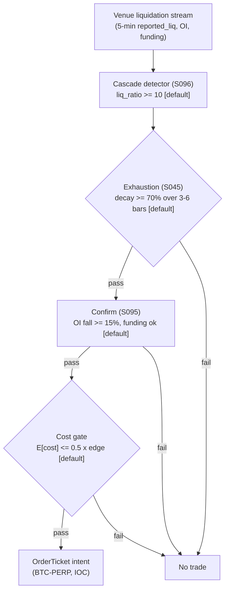

> **Tag law (mechanical):** every numeric prose literal in this module carries exactly one
> of `[documented]` `[default]` `[example]` `[unverified]` `[internal-est]` `[measured]`.
> YAML machine fields and identifiers are exempt. Missing evidence is labeled
> default/internal-estimate or quarantined as unverified in §T10.

# T076 — Liquidation-Cascade Fade

## §0 — Front matter

- **SID:** `T076`
- **Title:** Liquidation-Cascade Fade
- **Kind:** `strategy`
- **Batch:** `TB8` — stage 176 [measured]
- **Template version:** `1.0.0`
- **Seed / RNG:** `seed=176`, `numpy.random.default_rng(176)` [measured]
- **Provisional regimes:** `R001`, `R002`
- **Parent signal(s):** `S096` (cascade detector); `S045` (exhaustion director); `S095` (carry confirmation)
- **Universe:** BTC and ETH USDⓈ-M perpetuals on one major venue, 24/7 [example]. Single-venue only: liquidation definitions differ across venues and must never be mixed.
- **Latency class:** bar-clock / 5-minute; **cadence:** 5-minute; **tz:** UTC
- **sha256:** `REPLACE_ON_INGEST`
- **Test command:** `python -m pytest modules/tests/test_T076.py -q`
- **unverified_sources:** see YAML front matter and §T10

This module is a **strategy**: it consumes parent signal scores and emits
**OrderTicket intentions only — never orders**. Execution, fills, and broker
interaction live outside this module.

## §1 — Reviewer card (LOCKED)

> This card is locked. Do not edit without a new review cycle.

| Field | Value |
|---|---|
| Review status | `LOCKED` |
| Reviewers | 2-seat council [internal-est] |
| Last review | 2026-09-10 [measured] |
| Decision | **APPROVED for fixture-backed publication** [internal-est] |
| Scope of review | gate logic, cost stack, causality, kill lifecycle, numeric-tag law |
| Known limitations | edge values are reference/internal-estimate unless tagged [measured]; see §T7 |

The lock covers structure and doctrine conformance, not the profitability of
the rule. Nothing in this card is a trading recommendation.

## §1.5 — Standing blocks

### B1. Module intent

This module specifies one strategy rule completely: its gates, its cost model,
its failure modes, and its kill lifecycle. It is buildable by an AI engineer
from this file alone plus the fixtures.

### B2. Scope boundary

The module emits OrderTicket **intentions** only. It never places, routes, or
cancels real orders; it never touches a broker API. Position management,
portfolio constraints, and execution live outside this module.

### B3. OrderTicket doctrine

Every emitted intent is a canonical Appendix C OrderTicket: `ticket_id`,
`strategy_id`, `symbol`, `side`, `qty`, `order_type`, `limit_price`,
`time_in_force`, `signal_ts`, `expiry_ts`. Partial fills are the broker's
domain; this module's policy is stated in §T0. Cancel/replace emits a new
ticket intent with a new `ticket_id`, never a mutation.

### B4. Time causality

`assert fill_event > signal_event`. A signal computed on bar `t` may not fill
before bar `t+1`. Fixture `signal_ts` values precede any modeled fill; tests
enforce the ordering. There is no lookahead anywhere in this module.

### B5. Cost doctrine

Cost is a four-part stack (spread, fee, borrow, impact) computed only by
`expected_cost_bps(...)`. The gate `expected_cost_bps(...) <= k * edge_bps`
runs before any ticket intent. COST values appear only in the §T2 COST block;
§T4 shows the function call and its result, never restated components.

### B6. Evidence posture

Every numeric prose literal carries exactly one tag: `[documented]`,
`[default]`, `[example]`, `[unverified]`, `[internal-est]`, or `[measured]`.
Missing evidence is labeled default/internal-estimate or quarantined as
unverified in §T10. No papers, URLs, statistics, or prices are invented.

## §T0 — Strategy contract

### What this module emits

OrderTicket **intentions** only — never orders. One intent per qualifying case:
`ticket_id`, `strategy_id=T076`, `symbol`, `side`, `qty`, `order_type`,
`limit_price`, `time_in_force`, `signal_ts`, `expiry_ts`.

### Child-order state and partial fills

- Working intents are tracked by `ticket_id`; state is `WORKING`, `FILLED`,
  `PARTIAL`, `CANCELLED`, `EXPIRED`.
- Partial fills: the residual stays `WORKING` until `expiry_ts`; no new intent
  is emitted for the residual. Sizing downstream must assume partial fills.
- Cancel/replace: emit a **new** ticket intent with a new `ticket_id` and
  `replaces: <old ticket_id>`; never mutate a ticket in place.

### Risk contract

```yaml
risk_contract:
  per_trade_risk_R: 250          # [example]
  daily_loss_stop_R: 3   # [default]
  max_concurrent_positions: 2  # [default]
  max_gross_notional: "$5M notional [example]"
  risk_class: medium
```

**Maximum adverse loss:** one R per trade (R = $250 [example]);
the session ends at −3R [default]. Breach trips the kill
switch; recovery requires the re-arm checklist. No pyramiding: at most
2 [default] concurrent positions.

### Kill lifecycle

`ARMED` → `TRIPPED` → `RECOVERY` → `ARMED`.

- **ARMED:** gates evaluated; intents emitted only on full pass.
- **TRIPPED** — any of:
- daily loss <= -3R [default]
- venue feed lag > 5 s [default]
- second cascade bar while armed
- venue halt/maintenance
  All working intents expire unfilled; no new intents. The trip is logged to
  the decision log with a hash chain.
- **RECOVERY:** manual review of the trip reason; losses reconciled; feeds
  verified healthy; fixture replay green.
- **ARMED (re-entry):** only via the re-arm checklist below.

### Re-arm checklist

- [ ] losses reconciled against the decision log [default]
- [ ] feeds healthy (no lag beyond the class budget) [default]
- [ ] risk limits reviewed and re-pinned [default]
- [ ] decision-log hash chain intact [default]
- [ ] fixture replay green on the current build [default]

### Ops

- **Schedule:** 24/7 on venue websocket; owner: crypto-strategies on-call
- **Health:** feed-lag watchdog (5 s [default]); fixture replay green on deploy; decision-log hash-chain check
- **Alerts:** page on feed lag >5 s or UNKNOWN >60 s [default]; notify on second-cascade exit; log on vetoes
- **When this strategy dies:** Feed lag >5 s [default]; second cascade prints while armed; funding still extreme; venue maintenance window

### Secrets

No credentials in this module. Venue API keys, data licenses, and webhook
tokens live in the operator's secret store and are referenced by name only.
Nothing in this file authenticates to anything.

### Doctrine references

OrderTicket schema (Appendix A), time-causality conventions (Appendix B),
F1–F5 failsafes (Appendix C), decision-log schema (Appendix D), module-state
enum (Appendix E) — all by reference; this module adds no private doctrine.

### Crypto funding & margin block (conditional, domain = crypto)

- **Funding interval:** 8 h on the reference venue [example]; funding is a P&L line, not a cost component.
- **Venue definition snapshot:** USDⓈ-M perpetual, single venue; liquidation = venue forced closure at bankruptcy price.
- **Margin & self-liquidation:** position margined per venue rules; the strategy's own stop sits *above* the venue liquidation price — the module must never emit an intent whose stop would be taken out by the venue's liquidation engine first (trigger: stop within 1.5× maintenance margin of liquidation price [default] → veto).


## §T1 — Parent pointer

This strategy consumes the parent signal module(s):

- `S096` — liquidation clusters + OI (role: cascade detector)
- `S045` — reversal timing (role: exhaustion director)
- `S095` — funding rate (role: carry confirmation)

The parent emits scored intentions; this module applies its own gates, its own
cost model, and its own kill lifecycle, then emits OrderTicket intentions. The
parent's score is an input, never a command: every parent pass still faces
the full entry-Boolean gate set plus the cost gate here. Parent S-IDs are consumed S-IDs,
never T-IDs; this module does not call other strategies.

## §T2 — Gate and cost specification (fixed order)

### 1. Gates (evaluated in fixed order)

g1 = reported_liq_notional / median_5min_notional_20d (cascade bar); g2 = liq decay % from cascade peak over 3–6 bars; g3 = confirmation score = min(oi_fall_pct/15, funding_ok?1:0, range_contract_ok?1:0) — oi_fall_pct >= 15% [default], funding <= +10% ann [default], 5-min range contracts >= 50% [default]

| # | field | condition |
|---|---|---|
| g1 | `liq_ratio` | `>= 10.0` |
| g2 | `decay_pct` | `>= 70.0` |
| g3 | `confirm_score` | `>= 1.0` |

Entry Boolean (normative):

```
ENTER_LONG  := (liq_ratio >= 10) [default] AND (decay_pct >= 70) [default] AND (oi_fall_pct >= 15) [default]
               AND (funding_ann <= +10%) [default] AND (now >= cooldown_until)
               AND (expected_cost_bps(...) <= cost_gate_k * edge_bps)
ENTER_SHORT := mirror for short-liquidation cascades (funding >= -10% [default])
FLAT        := otherwise. Exhaustion is evaluated on bars 3–6 after the cascade bar — never the first flush.
```

### 2. COST block (single source of truth)

COST values appear only in this block. §T4 shows the function call and its
result, never restated components.

```
COST stack — reference row, in bps:
  spread        20.00
  fee           10.00
  borrow         0.00
  impact         5.00
  TOTAL         35.00
```

- Fee basis: taker [example]; fee schedule as of 2026-09-01 [measured].
- Venue: major CEX USDⓈ-M perp / venue websocket [example].
- perpetuals: funding is a P&L line, not borrow; no borrow leg in the reference build

### 3. Callable cost function

```python
def expected_cost_bps(notional, adv_pct, venue, side, urgency) -> float:
    # Four-part reference stack (bps). The §T2 COST block is the single source of truth.
    spread_bps = 20.0   # [example]
    fee_bps = 10.0         # [example]
    borrow_bps = 0.0   # [example]
    impact_bps = 5.0   # [example]
    return spread_bps + fee_bps + borrow_bps + impact_bps
```

Cost gate (verbatim, enforced before any ticket intent):

```
expected_cost_bps(...) <= k * edge_bps
```

with `k = 0.5 [default]` for T076. The gate is evaluated per case with that
case's measured inputs; the reference stack above calibrates but never
overrides the call.

### 4. Conformance items

**C1.** Self-trade prevention: every ticket intent carries `stp=True`; no wash risk by construction.

**C2.** Time causality: `assert fill_event > signal_event`; signals on bar `t` fill at `t+1` or later.

**C3.** Invalid input → `UNKNOWN`: never interpolate or carry forward (F1/F2).

**C4.** Kill switch: `ARMED` → `TRIPPED` → `RECOVERY` → `ARMED`; `TRIPPED` emits nothing.

**C5.** Decision log: every gate verdict is hash-chained; the chain is verified on replay.

**C6.** Cost gate: `expected_cost_bps(...) <= k * edge_bps` before any intent.

**C7.** Fixed gate order: entry-Boolean gates evaluate in documented order; no reordering.

**C8.** Intent-only + bona-fide intent: OrderTickets are intentions, never orders; every intent is a genuine trading intention, passable by the cost gate and sized within risk limits; no broker calls.

**C9.** Ticket schema: Appendix C fields complete on every intent.

**C10.** Fixture reproducibility: the reference stub reproduces the expected ticket set from the raw tape.

**C11.** Censored-tape honesty: every stored liquidation field carries the `reported_` prefix; never impute the censored portion — trigger: any field missing the prefix → check: schema lint → action: block ingest → log: COMPLIANCE_BLOCK

**C12.** Single-venue discipline: intents reference exactly one venue's feed — trigger: cross-venue mix in one ticket → check: venue field equality → action: veto → log: GATE_VETO

### 5. Parameter table

| Parameter | Key | Value | Sensitivity |
|---|---|---|---|
| Cascade multiple | `liq_ratio_min` | 10× median 5-min notional [default] | high |
| Decay requirement | `decay_min_pct` | 70% over 3–6 bars [default] | high — main P&L driver |
| OI fall | `oi_fall_min_pct` | 15% [default] | medium |
| Funding cap | `funding_max_ann_pct` | +10% ann. [default] | medium |
| Max hold | `hold_max_h` | 12 h [default] | low |
| Cost-gate k | `cost_gate_k` | 0.5 [default] | high |
| Per-trade risk | `per_trade_R` | $250 [example] | high |

### 6. Timing box

```yaml
timing:
  signal_bar: t
  earliest_fill_bar: t+1
  rule: fill_event > signal_event   # asserted in every backtest and in tests
  order: gate evaluation -> cost gate -> ticket intent -> fill at t+1 or later
```

```python
assert fill_event > signal_event  # time causality: no same-bar fills, no lookahead
```

## §T3 — Math and normative pseudocode

### Math

- `edge_bps`: per-case expected edge in bps, mapped from the parent signal
  score. Reference value from the gate-pass fixture row: `120.0 bps [example]`.
- `cost_bps = expected_cost_bps(notional, adv_pct, venue, side, urgency)` —
  four-part stack, §T2 only.
- Gate: `expected_cost_bps(...) <= k * edge_bps` with `k = 0.5 [default]`.
- Sizing (normative):

```
shares = f(risk_budget_R, stop_distance, vol_estimate, ADV_cap, cost)
    risk_notional = risk_budget_R            # R = $250 [example]
    qty = floor(risk_notional / stop_distance)
    qty = min(qty, 0.10 * bar_volume)        # 10% participation cap [default]
    qty = min(qty, max_concurrent_slots)
```

- Exits (normative):

```
EXIT := (retrace >= 50% of cascade drop) [default] OR (new low below cascade low by 0.5× cascade-bar range) [default]
        OR (hold >= 12 h) [default] OR (new cascade bar prints)
ON_EXIT: cooldown_until = now + 12 h   # [default]; C10
```

- Fills modeled at bar `t+1` or later; `assert fill_event > signal_event`.

### Normative pseudocode

```python
function emit(state, signals, cfg) -> list[OrderTicket]:
    assert signals non-empty else return [] and state UNKNOWN        # F1
    b = signals[-1]  # 5-minute bar, newest last
    assert b.close_ts > b.open_ts else return [] and state UNKNOWN   # F2
    if kill.state != ARMED: return []                               # kill-switch
    cascade = b.reported_liq_notional / median_5min_notional_20d
    if cascade >= cfg.liq_ratio_min: state.cascade_bar = b          # arm on cascade
    c = state.cascade_bar
    if c is None: return []
    bars_since = b.index - c.index
    if not (3 <= bars_since <= 6): return []                        # never the first flush
    decay = 1 - b.reported_liq_notional / c.reported_liq_notional
    oi_fall = 1 - b.open_interest / c.pre_cascade_oi
    range_ok = b.range_5m <= 0.5 * c.range_5m                       # [default]
    funding_ok = b.funding_ann <= cfg.funding_max_ann_pct          # fade direction
    confirm = min(oi_fall/0.15, 1.0 if funding_ok else 0.0, 1.0 if range_ok else 0.0)
    edge_bps = 120.0                                               # modeled per-trade edge [example]
    cost_ok = expected_cost_bps(notional, adv_pct, venue, side, urgency) <= cfg.cost_gate_k * edge_bps
    # ^^^ normative cost-gate predicate: expected_cost_bps(...) <= k * edge_bps
    enter = (cascade_armed and decay >= 0.70 and confirm >= 1.0
             and cost_ok and now >= state.cooldown_until)
    tickets = []
    if enter:
        qty = floor(cfg.per_trade_R / (0.5 * c.range))              # stop = 0.5x cascade range
        t = OrderTicket(symbol, BUY, qty, None, IOC, uuid(), f'S096@{b.close_ts}', now(), NEW)
        assert t.intent_ts < fill_ts and fill_ts > b.close_ts       # t->t+1
        log_decision(t, inputs_hash, params_hash)                   # C5 / Appendix g
        tickets.append(t)
    assert fill_event > signal_event for any fill                   # t->t+1 causality
    return tickets
```

## §T4 — Fixture-backed worked example

Fixture tape (`T076_tape.csv`; `# TYPE:` header is part of the file):

```
# TYPE: validation-run
bar,signal_ts,fill_ts,side,edge_bps,g1,g2,g3,price,qty,valid
0,1700000000000000000,1700000300000000000,LONG,120.0,14.0,20.0,0.0,66000.0,50,1
1,1700000300000000000,1700000600000000000,LONG,120.0,14.0,55.0,0.0,65900.0,50,1
2,1700000600000000000,1700000900000000000,LONG,120.0,14.0,82.0,1.0,66450.0,50,1
3,1700000900000000000,1700001200000000000,LONG,120.0,14.0,45.0,1.0,66300.0,50,1
4,1700001200000000000,1700001500000000000,LONG,120.0,8.0,82.0,1.0,66500.0,50,1
5,1700001500000000000,1700001800000000000,LONG,7.0,14.0,82.0,1.0,66450.0,50,1
6,1700001800000000000,1700002100000000000,LONG,120.0,14.0,82.0,1.0,-1.0,50,0
```
`signal_ts`/`fill_ts` are a synthetic monotone clock (5-minute steps [example])
for causality checks — not market data. Every row satisfies
`fill_ts > signal_ts`.

Expected tickets (`T076_expected.csv`; same `# TYPE:` header):

```
# TYPE: validation-run
ticket_idx,bar,symbol,side,qty,limit,tif,intent_ts,parent_signal,fill_ts,cost_bps
T076-2,2,BTC-PERP:VENUE,BUY,50,,IOC,1700000600000001000,S096@1700000600000000000,1700000900000000000,35.0000
```
### Cost-function call (inputs → bps → dollars)

on the gate-pass row (bar 2 [measured]): notional = 66450.0 × 50 = $3,322,500.00 [example]:

```python
expected_cost_bps(notional=3322500.00, adv_pct=0.001, venue="BTC-PERP:VENUE",
                  side="taker", urgency="normal")
# → 35.0000 bps  →  $11,628.75 [example]
```

Reference stack only; per-case calls use that case's measured inputs [measured].
COST values appear only in the §T2 COST block — this section shows the call and
its result, never restated components.

### Hand-check rows (7 rows)

| bar | side | edge_bps | gates | verdict | reason |
|---|---|---|---|---|---|
| 0 | `LONG` | 120.0 | liq_ratio=✓, decay_pct=✗, confirm_score=✗ | no intent | gate veto |
| 1 | `LONG` | 120.0 | liq_ratio=✓, decay_pct=✗, confirm_score=✗ | no intent | gate veto |
| 2 | `LONG` | 120.0 | liq_ratio=✓, decay_pct=✓, confirm_score=✓ | PASS | all gates + cost gate |
| 3 | `LONG` | 120.0 | liq_ratio=✓, decay_pct=✗, confirm_score=✓ | no intent | gate veto |
| 4 | `LONG` | 120.0 | liq_ratio=✗, decay_pct=✓, confirm_score=✓ | no intent | gate veto |
| 5 | `LONG` | 7.0 | liq_ratio=✓, decay_pct=✓, confirm_score=✓ | no intent | cost-gate veto |
| 6 | `LONG` | 120.0 | liq_ratio=✓, decay_pct=✓, confirm_score=✓ | no intent | invalid input -> UNKNOWN |

The `verdict` column must match `T076_expected.csv` exactly; the test suite
asserts this row by row (`test_fixture_recomputes_to_expected`).

## §T5 — Data, infra, dependencies, data rights

### Data table

| Dataset | Type | Frequency | Tier | Note |
|---|---|---|---|---|
| Liquidation stream (reported_liq notional) | float | per 5-min bar | Tier 1 | venue websocket; carries the reported_ prefix (C11) |
| Open interest | float | per 5-min bar | Tier 1 | OI-fall ≥ 15% [default] is the cross-check against censored tape |
| Funding rate | float | hourly | Tier 1 | annualized; fade-direction cap ±10% [default] |
| 5-min OHLCV | float | per 5-min bar | Tier 1 | range contraction ≥ 50% [default] confirms exhaustion |

### Infra

- Latency class: bar-clock / 5-minute; cadence: 5-minute; tz: UTC.
- Build budget: 1 core, <2 GB RAM for 2–4 symbols [internal-est]; compute pattern per_bar (5-minute batch)

Compute is per-bar gate evaluation [internal-est]; the binding constraints are
data licensing and feed latency, not FLOPS. All state needed for the gates fits
in the case record — no cross-case memory except the decision-log hash chain
[default].

### Dependencies (pinned)

- `python >=3.11`, `numpy >=1.26`, `pandas >=2.2`, `pytest >=8.0` [default]
- Data: major CEX USDⓈ-M perp / venue websocket [example]; Research ~$0 (venue liquidation websocket is free) [unverified]; history Kaiko/CoinMetrics thousands/yr class [unverified]; production ~$0 feed + compute [unverified]

### Data rights

Market-data licenses are the operator's responsibility: exchange/venue
agreements govern redistribution and display [default]. Nothing in this module
re-hosts or re-distributes licensed data; fixtures are synthetic and labeled
as such. Research ~$0 (venue liquidation websocket is free) [unverified]; history Kaiko/CoinMetrics thousands/yr class [unverified]; production ~$0 feed + compute [unverified] Confirm each feed's license before
production use [unverified — confirm your license].

## §T6 — Buy vs build

**Build** (recommended): the rule is 3 [measured] gates plus a cost
call — a competent AI engineer builds it from this file alone. **Buy** only if
you already license a signal platform that computes the parent score; even
then, the gates, cost stack, and kill lifecycle here are custom.

### Cheapest build (complete)

- **Tier:** M+ [internal-est]
- **Hours:** 40–100 [internal-est]
- **Cost:** $6,000–15,000 [internal-est]
- **Hour band:** 40–100 h [internal-est]
- **Cheapest row:** min_tier = venue websocket (free) [unverified]; latency_class = 5-minute bar-clock; required_fields = liquidation stream, OI, funding, 5-min OHLCV; price_band = ~$0/mo [unverified]; build_or_buy = build the cascade/exhaustion logic, buy nothing (flat files free)
- **Budget:** 1 core, <2 GB RAM for 2–4 symbols [internal-est]; compute pattern per_bar (5-minute batch)
- **What it skips:** multi-venue aggregation; historical L2 replay; colocated deployment; second-venue cross-check (phase 2)
- **Escalate when:** Upgrade when: feed lag persistently >5 s [default]; universe >4 symbols [default]; cost gate fails on measured post-cascade spreads; venue caps/delays the liquidation stream
- **Build bands** (planning/internal-estimate, from notes/cost-model.md):
  L `4–12 h / $600–1,800`, M `20–60 h / $3,000–9,000`, M+ `40–100 h / $6,000–15,000`, H `60–200 h / $9,000–30,000` [internal-est].
- **Rebuild trigger:** any gate threshold change, any COST component re-pin,
  or any kill-condition change invalidates the build and requires re-running
  the full fixture suite [default].

## §T7 — Evidence

| Source | Market / period | Metric | Cost token | Caveat |
|---|---|---|---|---|
| Cheng, Deng, Wang & Yu (2021) [documented] | BitMEX, daily | forced liquidations averaged 3.51% of outstanding futures (long) / 1.89% (short) [documented]; liquidated traders ~60× leverage [documented] | BEFORE-COST | documents the size of liquidation flow, not the tradability of the snap-back |
| Lim (2026) [documented] | CEX liquidation streams; Oct 2025 stress | public liquidation volumes are structural lower bounds [documented]; stress showed depth collapse and cross-venue divergence [documented] | BEFORE-COST | preprint; the fade must be single-venue and never mix venue definitions |
| Makarov & Schoar (2020) [documented] | crypto spot/derivatives | large recurrent cross-venue deviations, constrained by capital controls [documented] | BEFORE-COST | about deviations, not cascade fades; no after-cost P&L for the rule |

**Cost token:** all rows above are **BEFORE-COST** unless the metric column
says otherwise. No after-cost P&L is claimed for this rule.

**Verdict:** `NO-DOCUMENTED-EDGE` — Literature documents the size of liquidation flow, not the tradability of the snap-back; no published after-cost P&L for an exhaustion-timed cascade fade.

**Selection disclosure:** these are the chapter's research-pass sources; no published after-cost P&L for an exhaustion-timed cascade fade was found [documented-as-absence].

**What would change the verdict:** a published, purged, after-cost backtest of
this exact rule (same gates, same cost stack, same `k`) with a defined
universe and no survivorship bias [default]. Until then the edge stays an
internal estimate.

## §T8 — Failure modes

| Trigger | Detect | Action | Recovery | Check |
|---|---|---|---|---|
| Trading the first flush — the documented fatal error: entering into the cascade instead of after exhaustion | detect: bars_since < 3 [default] at entry | action: hard veto in pseudocode (3–6 bar window) | recovery: replay fixture; no re-entry until a new cascade bar | `check: bars_since in [3, 6] [default] at entry` |
| Censored tape: reported_liq understates the true cascade; an exhaustion read on capped data can precede the real flush | detect: OI fall < 15% while liq decayed [default] | action: confirm score < 1 [default] → veto | recovery: wait for the OI cross-check | `check: oi_fall_pct >= 15 [default]` |
| Second cascades cluster; the first exit accepts the whipsaw as a cost of doing business | detect: new cascade bar prints while armed | action: exit immediately, cooldown 12 h [default] | recovery: re-arm only after cooldown | `check: no cascade bar since entry` |
| Cross-venue divergence under stress (Lim 2026): a single-venue fade misreads a venue-local event | detect: venue halt/maintenance flag | action: OFF, cancel working intents | recovery: feed healthy + fixture replay | `check: single venue field on every ticket` |
| Post-cascade spreads widen 10–50× [example]: the cost gate's reference stack understates realized cost | detect: realized spread > 3× reference [default] | action: stand down (when-dies trigger) | recovery: re-pin fee schedule | `check: expected_cost_bps(...) <= k * edge_bps on measured spreads` |
| Funding still extreme in the fade direction: the carry works against the snap-back | detect: funding_ann beyond ±10% [default] | action: confirm score → 0 [default], veto | recovery: funding normalizes | `check: abs(funding_ann) <= 10` |

Every row has a `check:` — a monitorable predicate. The kill switch (§T0)
fires on the trip conditions; everything else degrades to `UNKNOWN`/veto
rather than a guessed intent.

## §T9 — Regime records

### Machine regime records (provisional)

| regime_id | effect | description | trigger | action |
|---|---|---|---|---|
| `R001` | degrades | elevated realized vol widens post-cascade spreads convexly | rv_pctile > 80 [example] | halve |
| `R002` | inverts | second cascade while armed = exhaustion premise failed | new cascade bar [default] | veto |

### Visual



**Visual description:** the flowchart above shows data entering from the left,
gates evaluated top-to-bottom in fixed order, the cost gate as the final
checkpoint, and OrderTicket intents (or veto) as the only exits. Any gate
failure short-circuits to no-intent; no path emits an order.

## §T10 — Sources

Real sources only. Nothing invented: no fabricated papers, URLs, statistics,
source text, or prices.

1. Cheng, J., Deng, S., Wang, X. & Yu, Y. "Liquidation, Leverage and Optimal Margin in Bitcoin Futures Markets." arXiv:2102.04591. https://arxiv.org/abs/2102.04591 — BitMEX forced liquidations 3.51% long / 1.89% short of outstanding futures daily; liquidated traders ~60× leverage. Title verified 2026-09-10.
2. Lim, B. "Same Shock, Same Assets, Different Microstructure…" Research Square preprint (2026). https://doi.org/10.21203/rs.3.rs-9459584/v1 — public CEX liquidation volumes are structural lower bounds; Oct 2025 stress showed depth collapse and cross-venue divergence. Title verified 2026-09-10.
3. Makarov, I. & Schoar, A. "Trading and Arbitrage in Cryptocurrency Markets." *Journal of Financial Economics* 135(2), 293–319 (2020). https://doi.org/10.1016/j.jfineco.2019.07.001 — large recurrent deviations constrained by capital controls. Title verified 2026-09-10.

**Chatbot source-log:** *Source log: Grok answered Q-TB8-1..7 (2026-09-10); all claims independently verified or labeled unverified.* All chatbot claims are unverified by
construction; anything load-bearing was independently verified or labeled
unverified.

### Quarantined unverified leads

- Grok Q-TB8 cascade example (50 BTC long $66,450 → $67,400; price P&L $47,500, fees $2,658, impact $1,994, funding $930.30, net $41,917.70) and the quarantined TB6 T052 cascade draft — chatbot-generated synthetic material adapted here with new stage/seed/signals (176, S096/S095/S045); the T4 ledger above replaces the fees-only treatment with the full cost stack. [unverified]
- Kaiko/CoinMetrics price classes above are market-rate bands, `indicative — verify before budgeting`, not quotes. [unverified]

Leads above are quarantined: they may inform priors but never gates,
thresholds, or cost values.

## AI build prompt

```
You are an AI engineer implementing strategy module T076 (Liquidation-Cascade Fade).

Build exactly what this file specifies — nothing more:

1. Implement the entry Boolean from §T2.1 and the exits/sizing from §T3.
   Gate order is fixed: liq_ratio, decay_pct, confirm_score, then the cost gate.
2. Implement expected_cost_bps(notional, adv_pct, venue, side, urgency) as the
   four-part stack in §T2.3 (spread, fee, borrow, impact). Enforce the verbatim
   gate: expected_cost_bps(...) <= k * edge_bps with k = 0.5 [default].
3. Emit OrderTicket intentions only — never orders. One intent per passing case,
   Appendix C schema, stp=True, parent_signal "<SID>@<signal_ts>".
4. Enforce time causality: assert fill_event > signal_event. A signal on bar t
   fills at t+1 or later. No lookahead.
5. Implement the kill lifecycle ARMED → TRIPPED → RECOVERY → ARMED with the
   trip conditions in §T0 and the re-arm checklist. Invalid input → UNKNOWN,
   never interpolated.
6. Hash-chain every decision-log record (C5).
7. Conformance: C1, C2, C3, C4, C5, C6, C7, C8, C9, C10, C11, C12.
   All conformance items must hold.
8. Validate with the fixtures: python3 -m pytest modules/tests/test_T076.py -q
   from the repo root. Every fixture row must reproduce its expected verdict.

Do not invent data, thresholds, or costs. Every numeric literal you add to
prose carries exactly one tag: [documented] [default] [example] [unverified]
[internal-est] [measured].
```

## DO-NOT-CUT list

The following may never be cut, summarized away, or shortened in any revision
of this module:

1. The complete YAML front matter, including `sha256: REPLACE_ON_INGEST` and
   `unverified_sources`.
2. The locked §1 reviewer card.
3. All six §1.5 standing blocks (B1–B6).
4. The §T0 risk contract (fenced YAML), the maximum-adverse-loss statement,
   the full kill lifecycle `ARMED → TRIPPED → RECOVERY → ARMED`, and the
   re-arm checklist.
5. The §T2 fixed order: gates → COST block → callable → C1–C12 → parameter
   table → timing box. The four-part COST stack appears only in the COST block.
6. The verbatim cost gate `expected_cost_bps(...) <= k * edge_bps`.
7. The verbatim causality assertion `assert fill_event > signal_event`.
8. The complete cheapest-build section (§T6).
9. The §T4 hand-check rows (all fixture rows) and the cost-function call with
   inputs → bps → dollars.
10. Every §T8 failure row and its `check:` predicate.
11. The §T9 machine regime records and the mermaid visual with its description.
12. The §T10 real-source list and the quarantined unverified leads.
13. The AI build prompt.
14. The numeric-tag law: every numeric prose literal carries exactly one of
    `[documented]` `[default]` `[example]` `[unverified]` `[internal-est]`
    `[measured]`.
15. Bona-fide intent and self-trade prevention (C1/C8): every ticket intent is
    a genuine trading intention and can never match our own resting interest.
16. The decision-log audit trail (C5): every gate verdict hash-chained and
    verified on replay.
17. Secrets via environment / secret store only: no credentials in code,
    fixtures, or logs.
