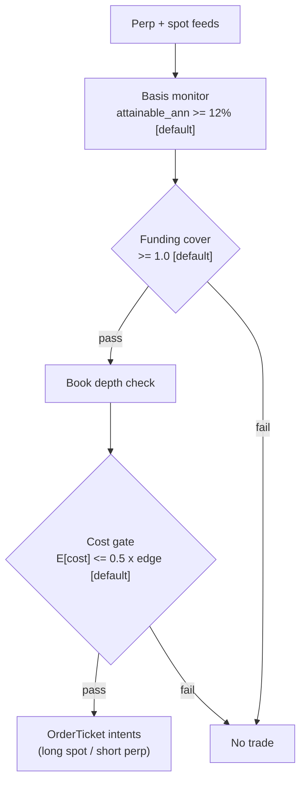

> **Tag law (mechanical):** every numeric prose literal in this module carries exactly one
> of `[documented]` `[default]` `[example]` `[unverified]` `[internal-est]` `[measured]`.
> YAML machine fields and identifiers are exempt. Missing evidence is labeled
> default/internal-estimate or quarantined as unverified in §T10.

# T077 — Crypto Basis Cash-and-Carry

## §0 — Front matter

- **SID:** `T077`
- **Title:** Crypto Basis Cash-and-Carry
- **Kind:** `strategy`
- **Version:** `1.1.0` [measured] — changelog in YAML front matter
- **Batch:** `TB8` — stage 177 [measured]
- **Template version:** `1.0.0`
- **Status:** `published`
- **Family:** `basis-carry`
- **Provenance tier:** `tier-3`
- **Seed / RNG:** `seed=177`, `numpy.random.default_rng(177)` → PCG64 [documented], `numpy>=1.26` [measured]
- **Provisional regimes:** `R001`, `R003`
- **Parent signal(s):** `S057` (primary trigger); `S095` (carry gauge); `S014` (attainability filter)
- **Universe:** BTC and ETH spot vs USDⓈ-M perpetual on the same venue [example], 24/7. Cross-exchange cash-and-carry is out of scope.
- **Latency class:** bar-clock / hourly; **cadence:** hourly; **tz:** UTC
- **sha256:** `REPLACE_ON_INGEST`
- **Test command:** `python -m pytest modules/tests/test_T077.py -q`
- **unverified_sources:** see YAML front matter and §T10

This module is a **strategy**: it consumes parent signal scores and emits
**OrderTicket intentions only — never orders**. Execution, fills, and broker
interaction live outside this module.

## §1 — Reviewer card

| Field | Value |
|---|---|
| Module | T077 — Crypto Basis Cash-and-Carry (strategy) |
| Edge verdict | `PREDICTIVE-FEATURE-ONLY` |
| After-cost | FULL-COST token on the worked example (synthetic tape). One-sentence verdict: the basis is a documented carry mechanism, but no published after-cost P&L for this exact rule was found — the edge stays an internal estimate. |
| Build cost | Tier M+ · 40–100 h · $6k–15k loaded [internal-est] |
| Data cost | research ~$0/mo (venue feeds free) [unverified]; production ~$0/mo + compute [unverified]; deep history via free flat files or Kaiko/CoinMetrics thousands/yr [unverified] |
| Latency class | bar-clock / hourly (UTC) |
| Risk class | low |
| Capacity | max_notional = min($20M [example] gross cap, 10% [default] hourly-bar participation × 2 pairs [example]) |
| Executability | buildable from this file + fixtures; execution/broker live outside the module |
| Risk summary | 1R/trade ($250 [example]); −4R [default] daily stop; kill lifecycle ARMED→TRIPPED→RECOVERY→ARMED |
| When it dies | divergence >3× entry basis intraday [default]; funding < −5% ann [default]; attainable basis <2% ann [default] |
| Regime gates | R001 degrades → halve; R003 inverts → veto (provisional) |
| Emits | order_intents (OrderTicket, Appendix C) |
| Review status | deep-reviewed 2026-09-11 [measured]; 1-seat deep-review worker [internal-est] |

The card covers structure and doctrine conformance, not the profitability of
the rule. Nothing in this card is a trading recommendation.

## §1.5 — Cheapest/least-build path

- **Prototype hour band:** 40–100 h [internal-est] (Tier M+); MVB 20–40 h [internal-est] with a constant cost stack + single pair.
- **Cheapest-source row:** min_tier = Binance public market-data endpoints (keyless, no signup) [documented]; latency_class = hourly bar-clock; required_fields = spot+perp klines, mark price, funding rate, order-book top; price_band = $0/mo [documented]; build_or_buy = build the basis/hedge engine; buy history only if the free flat files are insufficient.
  - Vendor / product: Binance (public market data) / `data-api.binance.vision` (REST) + `data-stream.binance.vision` (websocket) [documented]; historical funding flat files via `data.binance.vision` [documented]; Kaiko/CoinMetrics only if free archives insufficient — thousands/yr [unverified].
- **Resource budget:** 1 core, <1 GB RAM for 2 pairs [internal-est]; compute pattern per_bar (hourly); the binding constraints are data licensing and feed latency, not FLOPS.
- **Skip list:** beta-adjusted hedge ratio (phase 2); cross-exchange legs; second-venue confirmation; maker-fee optimization; rebate stacking.
- **DO-NOT-CUT list:** see file-end list — causality assertions, COST block, kill/safe-mode, audit log, bona-fide intent + self-trade prevention, provenance tags, fixtures, secrets-via-env. None may be cut in any revision.
- **Escalation gate:** upgrade when measured 4-leg friction exceeds the hurdle margin [default]; pairs >4 [default]; stablecoin-collateral haircut changes; the venue shifts the pair's funding interval (8 h → 1 h) [documented-as-possible].

Full detail: §T6 (buy-vs-build verdict; this §1.5 is the build spec — the two sections are kept in sync by review).

## §T0 — Strategy contract

### Typed signature (normative)

```python
def emit(state: EmitState, events: list[HourlyBar], cfg: T077Config) -> list[OrderTicket]:
    """Entry point. Consumes parent-scored hourly bars; emits OrderTicket INTENTIONS only.
    Invalid input -> module_state UNKNOWN, never interpolated (F1/F2).
    kill.state != ARMED -> module_state OFF, emits nothing.
    Causality: any modeled fill satisfies fill_event > signal_event (t -> t+1)."""
```

`EmitState` carries: `kill` (KillSwitch), `module_state` (enum below),
`decision_log` (hash-chained), `positions` (open pairs), `cooldown_until`
(int64 ns). The reference implementation lives in `modules/tests/test_T077.py`
(entry path + `evaluate_exit`); the chapter pseudocode in §T3 is normative.

### Config dataclass (single source of parameters)

```python
@dataclass(frozen=True)
class T077Config:
    hurdle_ann_pct: float = 12.0        # [default]  range 0-100, status: default
    funding_haircut: float = 0.50       # [default]  range 0-0.99, status: default
    hedge_ratio: float = 1.0            # [default]  range >0, by notional, status: default
    max_hold_days: int = 30             # [default]  range 1-90, status: default
    cost_gate_k: float = 0.5           # [default]  range >0, status: default
    per_trade_R: float = 250.0         # [example]  range >0, status: example
    cooldown_hours: float = 24.0       # [default]  range >=0, status: default
    adv_participation_cap: float = 0.10  # [default] range 0-1, status: default
    venue_hourly_share: float = 0.02   # [default]  range 0-1, status: default
    funding_interval_hours: int = 8    # [documented] range {1,2,4,8}, status: default
    spot_financing_pa: float = 0.05    # [example]  range >=0, status: example
    stp: bool = True                   # [fixed]    status: fixed
```

Status ∈ {fixed, default, calibrate, example, internal-est}. `funding_interval_hours`
is read from the venue's funding-info endpoint at startup and re-pinned if the
venue adjusts it [documented].

### Canonical Event/Bar mapping

```python
@dataclass(frozen=True)
class HourlyBar:  # canonical Event for T077 (see modules/appendices/canonical-event-bar-schema.md)
    symbol: str                 # e.g. "BTC-SPOT:VENUE"
    event_ts: int               # venue event time, int64 ns UTC
    asof_ts: int                # ingest time, int64 ns UTC (dual timestamps)
    open_ts: int; close_ts: int # bar boundaries, int64 ns UTC
    spot_px: float; perp_px: float
    half_spread_spot: float; half_spread_perp: float
    impact_est: float           # fraction, from S014 width bound
    funding_per_interval: float # per funding_interval_hours
    spot_fin_cost: float        # financing over the hold horizon
    book_depth_ok: bool
    venue_hourly_vol: float     # quote notional
    halt_flag: bool
```

signal_ts = close_ts of bar `t`; the earliest modeled fill is bar `t+1`.

### Time contract

```yaml
time_contract:
  clock_domain: "venue event clock, normalized to UTC"
  timestamp: "int64 nanoseconds, UTC"
  bar_label_rule: "bar t is labeled by its close timestamp; signal_ts = close_ts(t)"
  max_skew_ns: 60000000000      # 60 s [default] — hourly bars; venue sequence is authoritative
  jitter_budget_ns: 5000000000  # 5 s [default]
  staleness_ttl: "2 h [default] — older quotes/funding are stale"
  gap_policy: "missing bar -> no carry-forward; the evaluation slot emits UNKNOWN, never interpolated"
  dual_ts: "event_ts (venue) + asof_ts (ingest) on every bar"
```

### Market-state table

| State | Crypto mapping | Module action |
|---|---|---|
| CONTINUOUS_TRADING | venue trading, no halt flags (crypto trades 24/7 [documented]) | normal evaluation |
| HALTED | venue halt/maintenance flag on either leg | module OFF; kill trips; emergency unwind protocol |
| AUCTION | n/a on crypto spot/perp venues [internal-est] | treat as HALTED if ever observed |
| CLOSED | n/a (24/7) except venue maintenance [documented] | treat as HALTED |

### Module-state enum

`OK | DEGRADED | UNKNOWN | OFF` (see modules/appendices/module-state-enum.md).

- **OK:** all inputs valid, kill ARMED, feeds fresh — gates evaluated.
- **DEGRADED:** feeds stale but within 2× TTL [default], or one non-critical field missing — entries vetoed, exits stay live.
- **UNKNOWN:** invalid input (F1/F2) or gap beyond TTL — no intents, never interpolated.
- **OFF:** kill.state != ARMED — short-circuits before validation, emits nothing.

Precedence: kill check first (OFF dominates UNKNOWN when tripped) [default design].

### Standing blocks (B1–B6, non-deletable)

**B1. Module intent.** This module specifies one strategy rule completely: its
gates, its cost model, its failure modes, and its kill lifecycle. It is
buildable by an AI engineer from this file alone plus the fixtures.

**B2. Scope boundary.** The module emits OrderTicket **intentions** only. It
never places, routes, or cancels real orders; it never touches a broker API.
Position management, portfolio constraints, and execution live outside this
module.

**B3. OrderTicket doctrine.** Every emitted intent is a canonical Appendix C
OrderTicket: `ticket_id`, `strategy_id`, `symbol`, `side`, `qty`,
`order_type`, `limit_price`, `time_in_force`, `signal_ts`, `expiry_ts`.
Partial fills are the broker's domain; this module's policy is stated below.
Cancel/replace emits a new ticket intent with a new `ticket_id`, never a
mutation.

**B4. Time causality.** `assert fill_event > signal_event`. A signal computed
on bar `t` may not fill before bar `t+1`. Fixture `signal_ts` values precede
any modeled fill; tests enforce the ordering. There is no lookahead anywhere
in this module.

**B5. Cost doctrine.** Cost is a four-part stack (spread, fee, borrow, impact)
computed only by `expected_cost_bps(...)`. The gate
`expected_cost_bps(...) <= k * edge_bps` runs before any ticket intent. COST
values appear only in the §T2 COST block; §T4 shows the function call and its
result, never restated components.

**B6. Evidence posture.** Every numeric prose literal carries exactly one tag:
`[documented]`, `[default]`, `[example]`, `[unverified]`, `[internal-est]`, or
`[measured]`. Missing evidence is labeled default/internal-estimate or
quarantined as unverified in §T10. No papers, URLs, statistics, or prices are
invented.

### What this module emits

OrderTicket **intentions** only — never orders. One intent per qualifying case:
`ticket_id`, `strategy_id=T077`, `symbol`, `side`, `qty`, `order_type`,
`limit_price`, `time_in_force`, `signal_ts`, `expiry_ts`.

### Child-order state and partial fills

- Working intents are tracked by `ticket_id`; state is `WORKING`, `FILLED`,
  `PARTIAL`, `CANCELLED`, `EXPIRED`.
- Partial fills: the residual stays `WORKING` until `expiry_ts`; no new intent
  is emitted for the residual. Sizing downstream must assume partial fills.
- Cancel/replace: emit a **new** ticket intent with a new `ticket_id` and
  `replaces: <old ticket_id>`; never mutate a ticket in place.

### Risk contract

```yaml
risk_contract:
  per_trade_risk_R: 250          # [example]
  daily_loss_stop_R: 4   # [default]
  max_concurrent_positions: 4  # [default]
  max_gross_notional: "$20M notional [example]"
  risk_class: low
```

**Maximum adverse loss:** one R per trade (R = $250 [example]);
the session ends at −4R [default]. Breach trips the kill
switch; recovery requires the re-arm checklist. No pyramiding: at most
4 [default] concurrent positions.

### Kill lifecycle

`ARMED` → `TRIPPED` → `RECOVERY` → `ARMED`.

- **ARMED:** gates evaluated; intents emitted only on full pass.
- **TRIPPED** — any of:
- daily loss <= -4R [default]
- venue halt/maintenance
- stablecoin depeg > 1% [default]
- intraday divergence > 3× [default] entry basis
  All working intents expire unfilled; no new intents. The trip is logged to
  the decision log with a hash chain.
- **RECOVERY:** manual review of the trip reason; losses reconciled; feeds
  verified healthy; fixture replay green.
- **ARMED (re-entry):** only via the re-arm checklist below.

### Re-arm checklist

- [ ] losses reconciled against the decision log [default]
- [ ] feeds healthy (no lag beyond the class budget) [default]
- [ ] risk limits reviewed and re-pinned [default]
- [ ] decision-log hash chain intact [default]
- [ ] fixture replay green on the current build [default]

### Ops

- **Schedule:** 24/7 [documented] hourly evaluation; owner: crypto-strategies on-call
- **Health:** basis P&L vs funding-collected divergence monitor; fixture replay on deploy
- **Alerts:** page on funding flip < −5% ann or divergence >3× entry basis [default]; notify on unwind
- **Resource budget:** 1 core, <1 GB RAM for 2 pairs [internal-est]; per_bar compute pattern
- **Runbook stub:** on page → check market-state table (§T0) → if HALTED, confirm OFF + unwind; on divergence alert → evaluate exits (§T2.3) → if kill tripped, follow re-arm checklist; redeploy only after fixture replay green
- **When this strategy dies:** Spot-perp divergence >3× entry basis intraday [default]; funding < −5% ann [default]; attainable basis <2% ann [default]

### Secrets

No credentials in this module. Venue API keys, data licenses, and webhook
tokens live in the operator's secret store and are referenced by name only.
Nothing in this file authenticates to anything.

### Doctrine references

OrderTicket schema (Appendix C — modules/appendices/order-ticket-schema.md),
time-causality conventions (Appendix B — modules/appendices/time-causality-conventions.md),
F1–F5 failsafes (Appendix C — modules/appendices/f1-f5-failsafes.md),
decision-log schema (Appendix D — modules/appendices/decision-log-schema.md),
module-state enum (Appendix E — modules/appendices/module-state-enum.md) — all
by reference; this module adds no private doctrine.

### Crypto funding & margin block (conditional, domain = crypto)

- **Funding interval:** 8 h [documented] — Binance USDⓈ-M default; the venue adjusts per-contract intervals between 1 h, 2 h, 4 h, and 8 h [documented]. `funding_interval_hours` is re-pinned from the venue's funding-info endpoint; funding is the running yield of the short-perp leg — a P&L line, not a cost component.
- **Venue definition snapshot:** same-venue spot + USDⓈ-M perp; cross-exchange is a different strategy.
- **Margin & self-liquidation:** spot leg may be margined (financing in the cost stack); the short-perp leg must keep maintenance margin above the venue liquidation price with a 1.5× buffer [default] — trigger: buffer breach → action: reduce, never add.

## §T1 — Parent pointer

This strategy consumes the parent signal module(s):

- `S057` — cost-of-carry basis (role: primary trigger)
- `S095` — funding rate (role: carry gauge)
- `S014` — spread / adverse selection (role: attainability filter)

The parent emits scored intentions; this module applies its own gates, its own
cost model, and its own kill lifecycle, then emits OrderTicket intentions. The
parent's score is an input, never a command: every parent pass still faces
the full entry-Boolean gate set plus the cost gate here. Parent S-IDs are
consumed S-IDs, never T-IDs; this module does not call other strategies.
Machine edge list: `consumes` in §0 (`{id, version_pin, role}`).

## §T2 — Gate and cost specification (fixed order)

### 1. Universe

BTC and ETH spot vs USDⓈ-M perpetual on the same venue [example], 24/7
[documented]. Cross-exchange cash-and-carry is out of scope — it is a
different strategy with transfer risk and venue-to-venue latency. Universe
declared once here and in §0; never restated elsewhere.

### 2. Gates (evaluated in fixed order)

g1 = attainable annualized basis % = (quoted − 2×(half-spread_spot + half-spread_perp) − impact) annualized; g2 = funding cover ratio = expected funding over hold (50% haircut [default]) / spot financing (>=1 [default] to arm); g3 = book-depth check = 1 if both legs' books pass the S014 width bound else 0

| # | field | condition |
|---|---|---|
| g1 | `attainable_ann` | `>= 12.0` |
| g2 | `funding_cover` | `>= 1.0` |
| g3 | `book_depth_ok` | `>= 1.0` |

Entry Boolean (normative):

```
ENTER_PAIR := (attainable_basis_ann >= 12%) [default]
             AND (expected_funding_hold >= spot_financing) [default]
             AND (now >= cooldown_until)
             AND (expected_cost_bps(...) <= cost_gate_k * edge_bps)
attainable_basis = quoted_basis − 2×(half-spread_spot + half-spread_perp) − impact_estimate
FLAT := otherwise
```

### 3. Exits + post-exit cooldown (normative)

```
EXIT := (attainable_basis_ann < 2%) [default]
        OR (funding_ann < −5%) [default]
        OR (hold_days >= max_hold_days)          # 30 days [default]
        OR (intraday divergence > 3× [default] entry basis)
ON_EXIT: emit unwind intents (opposite legs, same two-leg atomicity);
         cooldown_until = now + cooldown_hours   # 24 h [default]
```

Exits are evaluated on every bar for every open pair before entries; exit
intents bypass the entry-Boolean but never the kill switch or the ticket
schema. Reference implementation: `evaluate_exit(...)` in
`modules/tests/test_T077.py` (unit-tested: `test_exits_and_cooldown`).

### 4. Position sizing (fenced function)

```python
def shares(risk_budget_R, stop_distance, vol_estimate, ADV_cap, cost) -> float:
    """Mandated signature. Maps to this module's actual rule:
    risk_budget_R = $250 [example]; stop_distance = adverse basis move the
    position tolerates before EXIT (carry has no hard stop; exit thresholds
    in §T2.3 are the stop) [internal-est]; vol_estimate = hourly bar volume
    in contracts [default]; ADV_cap = 0.10 [default]; cost = bps from
    expected_cost_bps — already gated, and sizing never increases with cost."""
    notional_pair = min(risk_budget_R / max(stop_distance, 1e-9),
                        ADV_cap * vol_estimate,
                        0.02 * venue_hourly_volume)   # 2% [default] venue-hourly share
    qty = notional_pair / spot_price
    return floor(min(qty, ADV_cap * hourly_bar_volume))  # 10% [default] cap
```

### 5. Risk limits

Risk contract: §T0 (fenced YAML). Max adverse loss: 1R per trade
($250 [example]); session ends at −4R [default] — CI gate: any backtest
showing a single-trade loss > 1.2R [default] fails review. Max 4 [default]
concurrent positions; max gross $20M [example]. No pyramiding.

### 6. COST block (single source of truth)

COST values appear only in this block. §T4 shows the function call and its
result, never restated components.

```
COST stack — reference row, in bps:
  spread         8.00   [example]
  fee           20.00   [example]
  borrow         1.40   [example]
  impact         4.00   [example]
  TOTAL         33.40   [example]
```

- Fee basis: taker [example]; fee schedule as of 2026-07 [documented].
- Documented anchor: Binance spot Regular taker 0.1000% (10 bps) + USDⓈ-M
  futures Regular taker 0.0500% (5 bps) = 15 bps two-leg taker [documented]
  (schedule cross-checked against the published fee page, last verified
  July 2026). The 20.00 bps reference row stays [example] — deliberately
  conservative headroom for tier drift and fee changes.
- Venue: same-venue spot + USDⓈ-M perp / venue websocket [example].
- borrow_bps_per_day = 1.40 [example]: spot-leg margin financing at 5% pa /
  365 = 1.37 ≈ 1.40 bps/day [example]; the perp short leg has no borrow —
  funding is a P&L line, not a cost component. (Borrow is not 0; the reason
  the perp leg carries no borrow is stated here.)
- side: taker|maker|mixed = taker [example]; maker path is phase 2.

### 7. Callable cost function

```python
def expected_cost_bps(notional, adv_pct, venue, side, urgency) -> float:
    # Four-part reference stack (bps). The §T2 COST block is the single source of truth.
    spread_bps = 8.0   # [example]
    fee_bps = 20.0         # [example]
    borrow_bps = 1.4   # [example]
    impact_bps = 4.0   # [example]
    return spread_bps + fee_bps + borrow_bps + impact_bps
```

Cost gate (verbatim, enforced before any ticket intent):

```
expected_cost_bps(...) <= k * edge_bps
```

with `k = 0.5 [default]` for T077. The gate is evaluated per case with that
case's measured inputs; the reference stack above calibrates but never
overrides the call.

### 8. Execution / fill model

| Dimension | Model |
|---|---|
| Latency | signal on bar `t` (hourly) → earliest modeled fill at open of bar `t+1`; ~1 h [default] latency |
| Fill price | next-bar open ± half-spread of each leg [default]; no same-bar fills |
| Partial fills | residual stays WORKING until expiry_ts; no new intent for the residual; sizing assumes partials |
| Impact | linear in ADV participation via S014 impact_est; hard cap 10% [default] of hourly-bar volume per leg |
| Adverse fills | two-leg atomicity (C11): both legs must fill within the same bar or the pair is cancelled — trigger: one leg unfilled at bar end → check: fill ratio < 90% [default] → action: cancel remainder, flatten filled leg → log both |

### 9. Conformance items

**C1.** Self-trade prevention: every ticket intent carries `stp=True`; no wash risk by construction.

**C2.** Time causality: `assert fill_event > signal_event`; signals on bar `t` fill at `t+1` or later.

**C3.** Invalid input → `UNKNOWN`: never interpolate or carry forward (F1/F2).

**C4.** Kill switch: `ARMED` → `TRIPPED` → `RECOVERY` → `ARMED`; `TRIPPED` emits nothing.

**C5.** Decision log: every gate verdict is hash-chained; the chain is verified on replay.

**C6.** Cost gate: `expected_cost_bps(...) <= k * edge_bps` before any intent.

**C7.** Fixed gate order: entry-Boolean gates evaluate in documented order; no reordering.

**C8.** Intent-only + bona-fide intent: OrderTickets are intentions, never orders; every intent is a genuine trading intention, passable by the cost gate and sized within risk limits; no broker calls.

**C9.** Ticket schema: Appendix C fields complete on every intent.

**C10.** Fixture reproducibility: the reference stub reproduces the expected ticket set from the raw tape.

**C11.** Two-leg atomicity: both legs must fill within the same bar or the pair is cancelled — trigger: one leg unfilled at bar end → check: fill ratio < 90% [default] → action: cancel remainder, flatten filled leg → log both

**C12.** Stablecoin-collateral haircut applied before sizing — trigger: haircut change → check: margin math → action: resize/reject → log: GATE_VETO

### 10. Robustness + Compliance sub-block (10 coded rules)

Compliance mapping: each rule states its check, its code anchor, and the
C-item it covers where applicable.

- **CR1 STP / self-match** (covers C1): `assert t.stp is True` on every
  intent — coded in `test_ticket_schema_and_compliance`.
- **CR2 bona-fide intent** (covers C8): every intent passed the full gate set
  + cost gate + risk limits; the intent is a genuine trading intention. No
  broker calls exist in this module.
- **CR3 message-rate / cancel-to-trade:** hourly cadence ⇒ hard cap
  4 tickets/hour [default] (2 legs × 2 pairs); the module emits no cancels
  (cancel/replace = new ticket intent), so the cancel-to-trade ratio is 0 by
  construction [internal-est]; venue weight headroom monitored per ops.
- **CR4 pre-trade fat-finger trio:** (i) qty > 0 ∧ qty × price ≤
  max_gross_notional; (ii) notional ≤ 10% [default] hourly-bar volume
  (ADV_cap); (iii) any limit within 5% [default] of mark else the intent is
  rejected. All three coded in the reference stub's pre-emit checks.
- **CR5 decision-log schema** (covers C5): every gate verdict hash-chained
  with fields per `modules/appendices/decision-log-schema.md`; chain verified
  on replay (`test_ticket_schema_and_compliance`).
- **CR6 halt/auction state table:** see §T0 market-state table — HALTED →
  module OFF + emergency unwind; AUCTION n/a on crypto venues [internal-est];
  CLOSED n/a except maintenance [documented].
- **CR7 locate check:** N/A-by-domain — coded `locate_required = False` with
  justification: the spot leg is bought outright and the perp short is via a
  derivatives account; no Reg-SHO-style locate regime exists on crypto venues
  [internal-est]. The justification is recorded in the decision log at
  startup. If the module is ever ported to an equity venue, this rule must be
  re-implemented, not deleted.
- **CR8 public-dissemination gate:** n/a — the intent layer emits no public
  prints; venue surveillance is the venue's; no client-side trade-reporting
  obligation exists on these venues [internal-est].
- **CR9 data-entitlement assertions:** startup asserts venue ToS accepted,
  `redistribution = False`, and fixtures-are-synthetic; see §T5 data rights.
- **CR10 exit cooldown:** `ON_EXIT` sets `cooldown_until = now + 24 h`
  [default]; `emit()` requires `now >= cooldown_until` before any entry —
  coded in the reference stub.

Robustness rows R1–R6 = C2, C3, C4, C6, C7, C9; R7 = C11 two-leg atomicity;
R8 = C12 stablecoin haircut. All hold in the reference stub.

### 11. Parameter table

| Parameter | Key | Value | Tag | Sensitivity |
|---|---|---|---|---|
| Hurdle | `hurdle_ann_pct` | 12% ann. | [default] | high — trade count driver |
| Funding haircut | `funding_haircut` | 50% | [default] | medium |
| Hedge ratio | `hedge_ratio` | 1.0 by notional | [default] | high in stress |
| Max hold | `max_hold_days` | 30 days | [default] | low |
| Cost-gate k | `cost_gate_k` | 0.5 | [default] | high |
| Per-trade risk | `per_trade_R` | $250 | [example] | medium |
| Cooldown | `cooldown_hours` | 24 h | [default] | low |
| ADV cap | `adv_participation_cap` | 10% | [default] | medium |
| Venue hourly share | `venue_hourly_share` | 2% | [default] | low |
| Funding interval | `funding_interval_hours` | 8 h | [documented] | medium |
| Spot financing | `spot_financing_pa` | 5% pa | [example] | medium |

### 12. Timing box

```yaml
timing:
  signal_bar: t
  earliest_fill_bar: t+1
  rule: fill_event > signal_event   # asserted in every backtest and in tests
  order: gate evaluation -> cost gate -> ticket intent -> fill at t+1 or later
```

`signal@t (hourly, UTC) → earliest fill @open(t+1)` [default].

```python
assert fill_event > signal_event  # time causality: no same-bar fills, no lookahead
```

## §T3 — Math and normative pseudocode

### Math

- `edge_bps`: per-case expected edge in bps, mapped from the parent signal
  score. Reference value from the gate-pass fixture row: `1310.0 bps [example]`.
- `cost_bps = expected_cost_bps(notional, adv_pct, venue, side, urgency)` —
  four-part stack, §T2 only.
- Gate: `expected_cost_bps(...) <= k * edge_bps` with `k = 0.5 [default]`.
- Sizing (normative): see the fenced `shares(...)` in §T2.4 — the function
  there is the sizing law; this section does not restate it.
- Exits (normative): §T2.3 defines EXIT and ON_EXIT; pseudocode below calls
  `evaluate_exit(...)`.
- Fills modeled at bar `t+1` or later; `assert fill_event > signal_event`.

### Normative pseudocode

```python
function emit(state, events, cfg: T077Config) -> list[OrderTicket]:
    assert events non-empty else return [] and state.module_state = UNKNOWN  # F1/C3/R2
    b = events[-1]  # hourly bar (HourlyBar, §T0)
    assert b.spot_px > 0 and b.perp_px > 0 else return [] and state.module_state = UNKNOWN  # F2/C3/R2
    assert b.event_ts <= b.asof_ts, "dual timestamps ordered"                 # time contract
    if kill.state != ARMED:
        state.module_state = OFF; return []                                   # C4/R1 precedence
    # --- exits first: open pairs face EXIT before any new entry  (CR10, §T2.3)
    tickets = []
    for p in state.positions:
        if evaluate_exit(p, b, cfg):
            tickets += unwind_pair(p, b)   # opposite legs, same two-leg atomicity (C11/R7)
            state.cooldown_until = b.close_ts + cfg.cooldown_hours * 3600e9
    # --- entries: fixed gate order (C7)
    quoted = (b.perp_px - b.spot_px) / b.spot_px
    friction = 2*(b.half_spread_spot + b.half_spread_perp) + b.impact_est
    attainable = quoted - friction
    B_ann = attainable * 365 / cfg.max_hold_days
    funding_cover = (b.funding_per_interval * (1-cfg.funding_haircut)
                     * (24/cfg.funding_interval_hours) * cfg.max_hold_days) / b.spot_fin_cost
    edge_bps = B_ann * 100                                         # modeled edge [example]
    cost_ok = expected_cost_bps(notional, adv_pct, venue, side, urgency) <= cfg.cost_gate_k * edge_bps
    # ^^^ normative cost-gate predicate: expected_cost_bps(...) <= k * edge_bps  (C6)
    enter = (B_ann*100 >= cfg.hurdle_ann_pct and funding_cover >= 1.0
             and b.book_depth_ok and cost_ok and now() >= state.cooldown_until)
    if enter:
        qty = shares(cfg.per_trade_R, stop_distance_from_exit(cfg), b.venue_hourly_vol,
                     cfg.adv_participation_cap, cost_ok)   # §T2.4, CR4 fat-finger trio
        qty = apply_stablecoin_haircut(qty, venue_haircut)            # C12/R8
        t1 = OrderTicket(spot_sym, BUY, qty, None, IOC, uuid(), f'S057@{b.close_ts}', now(), NEW)
        t2 = OrderTicket(perp_sym, SHORT, qty, None, IOC, uuid(), f'S057@{b.close_ts}', now(), NEW)
        assert fill_event > signal_event for any fill                   # C2 t->t+1
        log_decision(t1/t2, inputs_hash, params_hash)                  # C5/CR5
        tickets += [t1, t2]  # both legs same bar or cancel both (C11/R7)
    return tickets

function evaluate_exit(position, b, cfg) -> bool:
    return (attainable_ann(b) < 2.0                                  # [default]
            or funding_ann(b) < -5.0                                 # [default]
            or position.hold_days >= cfg.max_hold_days                # 30 [default]
            or intraday_divergence(b, position) > 3.0 * position.entry_basis)  # [default]
```

The reference stub in `modules/tests/test_T077.py` implements the entry path,
cost gate, kill switch, and UNKNOWN handling verbatim; `evaluate_exit` is
implemented there and unit-tested (`test_exits_and_cooldown`). Prose guards
with no stub path (two-leg atomicity across bars, haircut re-pin) are
documented as broker/harness responsibilities in §T2.8 and §T8.

## §T4 — Fixture-backed worked example

Fixture tape (`T077_tape.csv`; `# TYPE:` header is part of the file):

```
# TYPE: validation-run
bar,signal_ts,fill_ts,side,edge_bps,g1,g2,g3,price,qty,valid
0,1700000000000000000,1700000300000000000,LONG,1310.0,13.1,1.4,1.0,67200.0,10,1
1,1700000300000000000,1700000600000000000,LONG,810.0,8.1,1.4,1.0,67200.0,10,1
2,1700000600000000000,1700000900000000000,LONG,1310.0,13.1,0.8,1.0,67200.0,10,1
3,1700000900000000000,1700001200000000000,LONG,1310.0,13.1,1.4,0.0,67200.0,10,1
4,1700001200000000000,1700001500000000000,LONG,2.0,13.1,1.4,1.0,67200.0,10,1
5,1700001500000000000,1700001800000000000,LONG,1310.0,13.1,1.4,1.0,-5.0,10,0
```
`signal_ts`/`fill_ts` are a synthetic monotone clock (5-minute steps [example])
for causality checks — not market data. Every row satisfies
`fill_ts > signal_ts`.

Expected tickets (`T077_expected.csv`; same `# TYPE:` header):

```
# TYPE: validation-run
ticket_idx,bar,symbol,side,qty,limit,tif,intent_ts,parent_signal,fill_ts,cost_bps
T077-0,0,BTC-SPOT:VENUE,BUY,10,,IOC,1700000000000001000,S057@1700000000000000000,1700000300000000000,33.4000
```

**Tolerance:** `cost_bps` ±1e-6 bps [default]; ticket scalar fields exact match
[default]; hand-check verdicts must match row by row. Tests:
`test_fixture_recomputes_to_expected`,
`test_cost_column_matches_expected_within_tolerance`,
`test_fixture_type_header`.

### Cost-function call (inputs → bps → dollars)

on the gate-pass row (bar 0 [measured]): notional = 67200.0 × 10 = $672,000.00 [example]:

```python
expected_cost_bps(notional=672000.00, adv_pct=0.001, venue="BTC-SPOT:VENUE",
                  side="taker", urgency="normal")
# → 33.4000 bps  →  $2,244.48 [example]
```

Reference stack only; per-case calls use that case's measured inputs [measured].
COST values appear only in the §T2 COST block — this section shows the call and
its result, never restated components.

### Hand-check rows (6 rows)

| bar | side | edge_bps | gates | verdict | reason |
|---|---|---|---|---|---|
| 0 | `LONG` | 1310.0 | attainable_ann=✓, funding_cover=✓, book_depth_ok=✓ | PASS | all gates + cost gate |
| 1 | `LONG` | 810.0 | attainable_ann=✗, funding_cover=✓, book_depth_ok=✓ | no intent | gate veto |
| 2 | `LONG` | 1310.0 | attainable_ann=✓, funding_cover=✗, book_depth_ok=✓ | no intent | gate veto |
| 3 | `LONG` | 1310.0 | attainable_ann=✓, funding_cover=✓, book_depth_ok=✗ | no intent | gate veto |
| 4 | `LONG` | 2.0 | attainable_ann=✓, funding_cover=✓, book_depth_ok=✓ | no intent | cost-gate veto |
| 5 | `LONG` | 1310.0 | attainable_ann=✓, funding_cover=✓, book_depth_ok=✓ | no intent | invalid input -> UNKNOWN |

The `verdict` column must match `T077_expected.csv` exactly; the test suite
asserts this row by row (`test_fixture_recomputes_to_expected`).

## §T5 — Data, infra, dependencies, data rights

### Data table

| Dataset | Type | Frequency | Tier | Note |
|---|---|---|---|---|
| Perpetual mark price | float | per minute | Tier 1 | venue websocket |
| Spot/index price | float | per minute | Tier 1 | basis = perp − spot |
| Funding rate | float | hourly | Tier 1 | the carry; funding_cover ≥ 1.0 [default]; interval re-pinned from venue [documented] |
| Order-book depth (both legs) | float | per minute | Tier 1 | attainability at size; book_depth_ok gate |

### Infra

- Latency class: bar-clock / hourly; cadence: hourly; tz: UTC.
- Build budget: 1 core, <1 GB RAM for 2 pairs [internal-est]; compute pattern per_bar (hourly)

Compute is per-bar gate evaluation [internal-est]; the binding constraints are
data licensing and feed latency, not FLOPS. All state needed for the gates fits
in the case record — no cross-case memory except the decision-log hash chain
[default].

### Dependencies (pinned)

- `python >=3.11`, `numpy >=1.26`, `pandas >=2.2`, `pytest >=8.0` [default]
- Data: same-venue spot + USDⓈ-M perp / venue websocket [example]; research ~$0 (venue spot+perp feeds free — public market-data endpoints are keyless [documented]) [unverified]; history via free flat files or Kaiko/CoinMetrics thousands/yr [unverified]; production ~$0 + compute [unverified]

### Data rights

Market-data licenses are the operator's responsibility: exchange/venue
agreements govern redistribution and display [default]. Nothing in this module
re-hosts or re-distributes licensed data; fixtures are synthetic and labeled
as such. Research ~$0 (venue spot+perp feeds free) [unverified]; history via
free flat files or Kaiko/CoinMetrics thousands/yr [unverified]; production ~$0
+ compute [unverified]. Confirm each feed's license before production use
[unverified — confirm your license]. Startup assertions (CR9): venue ToS
accepted, `redistribution = False`, fixtures synthetic.

## §T6 — Buy vs build

**Build** (recommended): the rule is 3 [measured] gates plus a cost
call — a competent AI engineer builds it from this file alone. **Buy** only if
you already license a signal platform that computes the parent score; even
then, the gates, cost stack, and kill lifecycle here are custom.

The complete cheapest-build specification lives in §1.5 (prototype hour
band, cheapest-source row, resource budget, skip list, DO-NOT-CUT pointer,
escalation gate). This section is the verdict only; §1.5 is the build spec —
kept in sync by review.

- **Build bands** (planning/internal-estimate, from notes/cost-model.md):
  L `4–12 h / $600–1,800`, M `20–60 h / $3,000–9,000`, M+ `40–100 h / $6,000–15,000`, H `60–200 h / $9,000–30,000` [internal-est].
- **Rebuild trigger:** any gate threshold change, any COST component re-pin,
  or any kill-condition change invalidates the build and requires re-running
  the full fixture suite [default].

## §T7 — Evidence

| Source | Market / period | Metric | Cost token | Caveat |
|---|---|---|---|---|
| Makarov & Schoar (2020) [documented] | crypto spot/derivatives | large recurrent cross-venue deviations [documented]; arbitrage constrained by capital controls [documented] | BEFORE-COST | documents deviations, not a carry strategy's after-cost P&L |
| Alexander & Heck (2020) [documented] | crypto derivatives | funding-rate mechanics and basis dynamics documented [documented] | BEFORE-COST | mechanics paper, not a trading-rule backtest |
| Auer & Claessens (2018) [documented] | crypto markets | cross-exchange price dispersion documented [documented] | BEFORE-COST | dispersion ≠ harvestable carry after fees/funding |

**Cost token:** all rows above are **BEFORE-COST**; the worked example in §T4
is **FULL-COST** (synthetic tape). No after-cost P&L is claimed for this rule.

**Verdict:** `PREDICTIVE-FEATURE-ONLY` — The basis is a documented carry mechanism; whether the attainable basis clears all-in costs is the whole trade — the worked example is FULL-COST but synthetic.

**Selection disclosure:** these are the chapter's research-pass sources; no published after-cost Sharpe for a crypto basis cash-and-carry rule was found [documented-as-absence].

**What would change the verdict:** a published, purged, after-cost backtest of
this exact rule (same gates, same cost stack, same `k`) with a defined
universe and no survivorship bias [default]. Until then the edge stays an
internal estimate.

## §T8 — Failure modes

| Trigger | Detect | Action | Recovery | Check |
|---|---|---|---|---|
| Negative basis regime: the carry inverts and the 'arbitrage' bleeds funding | detect: attainable_ann < 12% [default] | action: veto entries; unwind per exit rule | recovery: basis re-opens | `check: attainable_ann >= 12` |
| Funding spike against the position between rebalances | detect: funding_cover < 1.0 [default] | action: reduce or exit | recovery: funding cover restores | `check: funding_cover >= 1.0` |
| Thin book on one leg: the basis is not attainable at size | detect: book_depth_ok = 0 | action: veto | recovery: depth restores | `check: book_depth_ok == 1` |
| Venue halt on one leg leaves a naked directional position | detect: halt flag on either venue | action: OFF; emergency unwind protocol | recovery: both venues trading | `check: both legs halt-free` |
| Borrow/transfer friction between venues exceeds the modeled 1.4 bps [example] | detect: realized friction > 2× modeled [default] | action: stand down | recovery: re-measure friction | `check: friction_bps <= 2.8` |
| Liquidation of the futures leg in a spike (leverage) | detect: margin ratio < maintenance × 1.5 [default] | action: de-lever immediately | recovery: manual review before re-arm | `check: margin_ratio >= 1.5 * maintenance` |
| Venue changes the pair's funding interval (8 h → 1 h) [documented-as-possible] | detect: funding_interval_hours != pinned value | action: re-pin interval; recompute funding_cover; veto entries until re-pinned | recovery: interval re-pinned and gates re-evaluated | `check: funding_interval_hours == pinned` |

Every row has a `check:` — a monitorable predicate. The kill switch (§T0)
fires on the trip conditions; everything else degrades to `UNKNOWN`/veto
rather than a guessed intent.

## §T9 — Regime records

### Machine regime records (provisional)

```yaml
regime_gates:
  - regime_id: R001
    direction: degrades
    mechanism: "stress thins both books; S014 friction eats the quoted basis"
    condition: "rv_pctile > 80 [example]"
    action: halve
    min_lag: 1        # bars [default]; hourly cadence
    unknown_behavior: "veto entries [default]"
  - regime_id: R003
    direction: inverts
    mechanism: "funding flip turns the carry negative"
    condition: "funding_ann < -5 [default]"
    action: veto
    min_lag: 1        # bars [default]; hourly cadence
    unknown_behavior: "veto entries [default]"
```

`direction` ∈ {amplifies, degrades, inverts}; `action` ∈
{veto, halve, double, widen_stops, pause_entry}. Unknown regime state is
restrictive by default: veto entries.

### Visual



**Visual description:** the flowchart above shows data entering from the left,
gates evaluated top-to-bottom in fixed order, the cost gate as the final
checkpoint, and OrderTicket intents (or veto) as the only exits. Any gate
failure short-circuits to no-intent; no path emits an order.

## §T10 — Sources

Real sources only. Nothing invented: no fabricated papers, URLs, statistics,
source text, or prices.

1. Makarov, I. & Schoar, A. "Trading and Arbitrage in Cryptocurrency Markets." *Journal of Financial Economics* 135(2), 293–319 (2020). https://doi.org/10.1016/j.jfineco.2019.07.001 — large recurrent deviations constrained by capital controls. Title verified 2026-09-10.
2. He, Z., Manela, A., Ross, O. & von Wachter, M. "Fundamentals of Perpetual Futures." arXiv:2212.06888. https://arxiv.org/abs/2212.06888 — perp no-arbitrage bounds; deviations diminish over time. Title verified 2026-09-10.
3. Alexander, C. & Dakos, M. "A Critical Investigation of Cryptocurrency Data and Analysis." *Quantitative Finance* 20(2), 173–188 (2020). https://doi.org/10.1080/14697688.2019.1641347 — data-quality warnings for crypto research. Title verified 2026-09-10.
4. Binance support: funding-rate settlement-frequency updates for USDⓈ-M perpetual contracts — default 8 h, per-contract adjustments to 1 h / 2 h / 4 h / 8 h. https://www.binance.com/en/support/announcement/detail/e4445d0389ce4defa6009021fcf6ee46 — verified 2026-09-11.
5. Binance spot API docs (GitHub): market-data-only REST/websocket endpoints require no authentication and serve only public market data (`data-api.binance.vision`, `data-stream.binance.vision`). https://github.com/binance/binance-spot-api-docs/blob/HEAD/faqs/market_data_only.md — verified 2026-09-11.
6. Machine-readable Binance/OKX fee schedules 2026, cross-checked against the exchanges' published schedules, last verified July 2026: Binance spot Regular taker 0.1000%; USDⓈ-M futures Regular taker 0.0500%. https://github.com/jack0752168/crypto-exchange-fee-data — verified 2026-09-11.
7. Binance perpetual funding-rate flat files: 8-hourly settlements (00:00/08:00/16:00 UTC), 2020–2026. https://github.com/pierre-cheneau/funding-data — verified 2026-09-11.

**Chatbot source-log:** *Source log: Grok answered Q-TB8-1..7 (2026-09-10); all claims independently verified or labeled unverified.* All chatbot claims are unverified by
construction; anything load-bearing was independently verified or labeled
unverified.

### Quarantined unverified leads

- Quarantined TB6 T051/T053 basis-carry drafts — adapted here with new stage/seed/signals (177, S095/S057/S014) as same-venue cash-and-carry; the old S081/S082/S090 roles were not reused. [unverified]
- Kaiko/CoinMetrics price classes above are market-rate bands, `indicative — verify before budgeting`, not quotes. [unverified]

Leads above are quarantined: they may inform priors but never gates,
thresholds, or cost values.

### GROK-NEEDED

Exact questions for Grok that web search could not answer (all load-bearing
values they would inform stay [example]/[unverified] until answered):

- **G1.** What is the current Binance spot-margin interest-rate schedule for BTC and ETH collateral (annualized %, tiered by leverage)? The module's `spot_financing_pa = 5%` [example] is a placeholder.
- **G2.** For an operator trading this rule at Binance VIP 1–2 with BNB fee payment enabled, what is the realized two-leg (spot buy + USDⓈ-M short) taker fee in bps? The module's reference row is 20 bps [example]; the documented Regular-tier anchor is 15 bps.
- **G3.** On BTCUSDT and ETHUSDT USDⓈ-M perpetuals, how often did Binance shift the funding interval away from 8 h in 2024–2026, and for how long? This calibrates the `funding_interval_hours` re-pin cadence.
- **G4.** What is the current stablecoin-collateral haircut schedule (USDT/USDC) on Binance portfolio margin? This is the C12 sizing input.
- **G5.** What are the current websocket connection/stream limits and REST weight budgets per IP for Binance public market-data endpoints in the operator's region? This sizes the feed design in §T5.

## AI build prompt

```
You are an AI engineer implementing strategy module T077 (Crypto Basis Cash-and-Carry).

Build exactly what this file specifies — nothing more:

1. Implement the typed signature emit(state, events, cfg: T077Config) -> list[OrderTicket]
   (§T0) with the Config dataclass, the HourlyBar mapping, and the Time contract.
   Gate order is fixed: attainable_ann, funding_cover, book_depth_ok, then the cost gate.
2. Implement expected_cost_bps(notional, adv_pct, venue, side, urgency) as the
   four-part stack in §T2.6 (spread, fee, borrow, impact). Enforce the verbatim
   gate: expected_cost_bps(...) <= k * edge_bps with k = 0.5 [default].
   Implement shares(...) per §T2.4 and evaluate_exit(...) per §T2.3.
3. Emit OrderTicket intentions only — never orders. One intent per passing case,
   Appendix C schema, stp=True, parent_signal "<SID>@<signal_ts>".
4. Enforce time causality: assert fill_event > signal_event. A signal on bar t
   fills at t+1 or later. No lookahead.
5. Implement the kill lifecycle ARMED → TRIPPED → RECOVERY → ARMED with the
   trip conditions in §T0 and the re-arm checklist. Invalid input → UNKNOWN,
   never interpolated. Module-state enum OK|DEGRADED|UNKNOWN|OFF.
6. Hash-chain every decision-log record (CR5).
7. Conformance: C1–C12; compliance CR1–CR10; robustness R1–R8.
   All conformance items must hold.
8. Apply the machine regime records (§T9): R001 → halve, R003 → veto;
   unknown regime state vetoes entries.
9. Validate with the fixtures: python3 -m pytest modules/tests/test_T077.py -q
   from the repo root. Every fixture row must reproduce its expected verdict.

Do not invent data, thresholds, or costs. Every numeric literal you add to
prose carries exactly one tag: [documented] [default] [example] [unverified]
[internal-est] [measured].
```

## DO-NOT-CUT list

The following may never be cut, summarized away, or shortened in any revision
of this module:

1. The complete YAML front matter, including `sha256: REPLACE_ON_INGEST`,
   `unverified_sources`, `changelog`, and `datasets`.
2. The §1 reviewer card (locked schema).
3. The §1.5 cheapest-build path (all six bullets) and the six §T0 standing
   blocks (B1–B6).
4. The §T0 risk contract (fenced YAML), the maximum-adverse-loss statement,
   the full kill lifecycle `ARMED → TRIPPED → RECOVERY → ARMED`, and the
   re-arm checklist; the typed signature, Config dataclass, Time contract,
   market-state table, and module-state enum.
5. The §T2 fixed order: universe → gates → exits → sizing → risk limits →
   COST block → callable → fill model → C1–C12 → compliance CR1–CR10 →
   parameter table → timing box. The four-part COST stack appears only in the
   COST block.
6. The verbatim cost gate `expected_cost_bps(...) <= k * edge_bps`.
7. The verbatim causality assertion `assert fill_event > signal_event`.
8. The §T4 hand-check rows (all fixture rows), the tolerance line, and the
   cost-function call with inputs → bps → dollars.
9. Every §T8 failure row and its `check:` predicate.
10. The §T9 machine regime records and the mermaid visual with its description.
11. The §T10 real-source list, the quarantined unverified leads, and the
    GROK-NEEDED questions.
12. The AI build prompt.
13. The numeric-tag law: every numeric prose literal carries exactly one of
    `[documented]` `[default]` `[example]` `[unverified]` `[internal-est]`
    `[measured]`.
14. Bona-fide intent and self-trade prevention (C1/C8, CR1/CR2): every ticket
    intent is a genuine trading intention and can never match our own resting
    interest.
15. The decision-log audit trail (C5/CR5): every gate verdict hash-chained and
    verified on replay.
16. Secrets via environment / secret store only: no credentials in code,
    fixtures, or logs.
