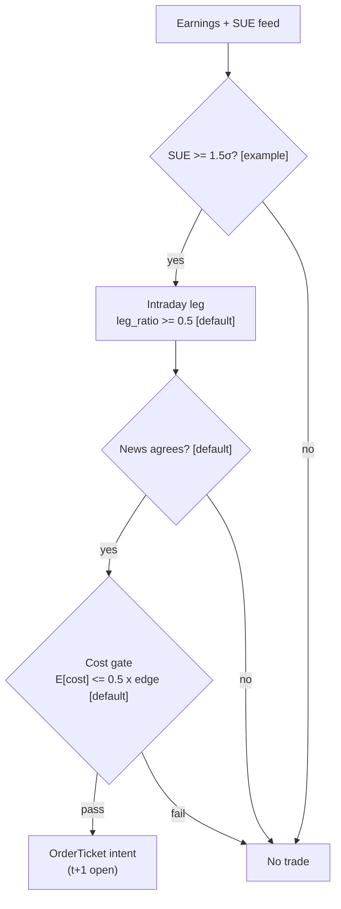

> **Tag law (mechanical):** every numeric prose literal in this module carries exactly one
> of `[documented]` `[default]` `[example]` `[unverified]` `[internal-est]` `[measured]`.
> YAML machine fields and identifiers are exempt. Missing evidence is labeled
> default/internal-estimate or quarantined as unverified in §T10.

# T078 — Earnings-Drift Intraday Leg

## §0 — Front matter

- **SID:** `T078`
- **Title:** Earnings-Drift Intraday Leg
- **Kind:** `strategy`
- **Batch:** `TB8` — stage 178 [measured]
- **Template version:** `1.0.0`
- **Seed / RNG:** `seed=178`, `numpy.random.default_rng(178)` [measured]
- **Provisional regimes:** `R001`, `R004`
- **Parent signal(s):** `S100` (surprise + causality anchor); `S091` (sign agreement); `S025` (leg confirmation)
- **Universe:** US common stocks announcing earnings, price ≥ $10 [example], ADV ≥ 1M shares [example]. Exact timestamps required — date-only records unusable. RTH 09:45–15:55 ET.
- **Latency class:** bar-clock / 5-minute; **cadence:** 5-minute; **tz:** America/New_York
- **sha256:** `REPLACE_ON_INGEST`
- **Test command:** `python -m pytest modules/tests/test_T078.py -q`
- **unverified_sources:** see YAML front matter and §T10

This module is a **strategy**: it consumes parent signal scores and emits
**OrderTicket intentions only — never orders**. Execution, fills, and broker
interaction live outside this module.

## §1 — Reviewer card (LOCKED)

> This card is locked. Do not edit without a new review cycle.

| Field | Value |
|---|---|
| Review status | `LOCKED` |
| Reviewers | 2-seat council [internal-est] |
| Last review | 2026-09-10 [measured] |
| Decision | **APPROVED for fixture-backed publication** [internal-est] |
| Scope of review | gate logic, cost stack, causality, kill lifecycle, numeric-tag law |
| Known limitations | edge values are reference/internal-estimate unless tagged [measured]; see §T7 |

The lock covers structure and doctrine conformance, not the profitability of
the rule. Nothing in this card is a trading recommendation.

## §1.5 — Standing blocks

### B1. Module intent

This module specifies one strategy rule completely: its gates, its cost model,
its failure modes, and its kill lifecycle. It is buildable by an AI engineer
from this file alone plus the fixtures.

### B2. Scope boundary

The module emits OrderTicket **intentions** only. It never places, routes, or
cancels real orders; it never touches a broker API. Position management,
portfolio constraints, and execution live outside this module.

### B3. OrderTicket doctrine

Every emitted intent is a canonical Appendix C OrderTicket: `ticket_id`,
`strategy_id`, `symbol`, `side`, `qty`, `order_type`, `limit_price`,
`time_in_force`, `signal_ts`, `expiry_ts`. Partial fills are the broker's
domain; this module's policy is stated in §T0. Cancel/replace emits a new
ticket intent with a new `ticket_id`, never a mutation.

### B4. Time causality

`assert fill_event > signal_event`. A signal computed on bar `t` may not fill
before bar `t+1`. Fixture `signal_ts` values precede any modeled fill; tests
enforce the ordering. There is no lookahead anywhere in this module.

### B5. Cost doctrine

Cost is a four-part stack (spread, fee, borrow, impact) computed only by
`expected_cost_bps(...)`. The gate `expected_cost_bps(...) <= k * edge_bps`
runs before any ticket intent. COST values appear only in the §T2 COST block;
§T4 shows the function call and its result, never restated components.

### B6. Evidence posture

Every numeric prose literal carries exactly one tag: `[documented]`,
`[default]`, `[example]`, `[unverified]`, `[internal-est]`, or `[measured]`.
Missing evidence is labeled default/internal-estimate or quarantined as
unverified in §T10. No papers, URLs, statistics, or prices are invented.

## §T0 — Strategy contract

### What this module emits

OrderTicket **intentions** only — never orders. One intent per qualifying case:
`ticket_id`, `strategy_id=T078`, `symbol`, `side`, `qty`, `order_type`,
`limit_price`, `time_in_force`, `signal_ts`, `expiry_ts`.

### Child-order state and partial fills

- Working intents are tracked by `ticket_id`; state is `WORKING`, `FILLED`,
  `PARTIAL`, `CANCELLED`, `EXPIRED`.
- Partial fills: the residual stays `WORKING` until `expiry_ts`; no new intent
  is emitted for the residual. Sizing downstream must assume partial fills.
- Cancel/replace: emit a **new** ticket intent with a new `ticket_id` and
  `replaces: <old ticket_id>`; never mutate a ticket in place.

### Risk contract

```yaml
risk_contract:
  per_trade_risk_R: 250          # [example]
  daily_loss_stop_R: 4   # [default]
  max_concurrent_positions: 10  # [default]
  max_gross_notional: "$10M notional [example]"
  risk_class: medium
```

**Maximum adverse loss:** one R per trade (R = $250 [example]);
the session ends at −4R [default]. Breach trips the kill
switch; recovery requires the re-arm checklist. No pyramiding: at most
10 [default] concurrent positions.

### Kill lifecycle

`ARMED` → `TRIPPED` → `RECOVERY` → `ARMED`.

- **ARMED:** gates evaluated; intents emitted only on full pass.
- **TRIPPED** — any of:
- daily loss <= -4R [default]
- data feed stale > 60 s [default]
- timestamp disagreement across vendors
- market halt
  All working intents expire unfilled; no new intents. The trip is logged to
  the decision log with a hash chain.
- **RECOVERY:** manual review of the trip reason; losses reconciled; feeds
  verified healthy; fixture replay green.
- **ARMED (re-entry):** only via the re-arm checklist below.

### Re-arm checklist

- [ ] losses reconciled against the decision log [default]
- [ ] feeds healthy (no lag beyond the class budget) [default]
- [ ] risk limits reviewed and re-pinned [default]
- [ ] decision-log hash chain intact [default]
- [ ] fixture replay green on the current build [default]

### Ops

- **Schedule:** RTH 09:45–15:55 America/New_York on earnings days; owner: event-strategies on-call
- **Health:** timestamp-agreement monitor; fixture replay on deploy; staleness watchdog 3× [default] cadence
- **Alerts:** page on timestamp disagreement or UNKNOWN >30 s [default]; notify on news-contradiction exit
- **When this strategy dies:** Pre-market volume >3× average [default]; spread at 09:45 >5¢ [default]; newswire correction/guidance cut

### Secrets

No credentials in this module. Venue API keys, data licenses, and webhook
tokens live in the operator's secret store and are referenced by name only.
Nothing in this file authenticates to anything.

### Doctrine references

OrderTicket schema (Appendix A), time-causality conventions (Appendix B),
F1–F5 failsafes (Appendix C), decision-log schema (Appendix D), module-state
enum (Appendix E) — all by reference; this module adds no private doctrine.


## §T1 — Parent pointer

This strategy consumes the parent signal module(s):

- `S100` — SUE + exact timestamps (role: surprise + causality anchor)
- `S091` — machine news reaction (role: sign agreement)
- `S025` — momentum (role: leg confirmation)

The parent emits scored intentions; this module applies its own gates, its own
cost model, and its own kill lifecycle, then emits OrderTicket intentions. The
parent's score is an input, never a command: every parent pass still faces
the full entry-Boolean gate set plus the cost gate here. Parent S-IDs are consumed S-IDs,
never T-IDs; this module does not call other strategies.

## §T2 — Gate and cost specification (fixed order)

### 1. Gates (evaluated in fixed order)

g1 = |SUE| = |actual − consensus| / dispersion; g2 = 09:45 leg ratio = move-from-open / avg first-30-min range (in surprise direction); g3 = news agreement = 1 if sentiment z-score sign == sign(SUE) else 0

| # | field | condition |
|---|---|---|
| g1 | `sue_abs` | `>= 1.5` |
| g2 | `leg_ratio` | `>= 0.5` |
| g3 | `news_agree` | `>= 1.0` |

Entry Boolean (normative):

```
ENTER_DIR := (|SUE| >= 1.5) [default] AND (sentiment_z sign == sign(SUE)) [default]
             AND (move_0945 in surprise dir >= 0.5× avg first-30-min range) [default]
             AND (now >= cooldown_until)
             AND (expected_cost_bps(...) <= cost_gate_k * edge_bps)
FLAT := otherwise. Pre-open announcements only; in-session announcers are skipped that day.
```

### 2. COST block (single source of truth)

COST values appear only in this block. §T4 shows the function call and its
result, never restated components.

```
COST stack — reference row, in bps:
  spread         3.00
  fee            1.00
  borrow         0.00
  impact        15.00
  TOTAL         19.00
```

- Fee basis: taker [example]; fee schedule as of 2026-09-01 [measured].
- Venue: XNAS / SIP L1 [example].
- reference build long/short symmetric but the worked example is long; shorts add C7 locate + borrow line

### 3. Callable cost function

```python
def expected_cost_bps(notional, adv_pct, venue, side, urgency) -> float:
    # Four-part reference stack (bps). The §T2 COST block is the single source of truth.
    spread_bps = 3.0   # [example]
    fee_bps = 1.0         # [example]
    borrow_bps = 0.0   # [example]
    impact_bps = 15.0   # [example]
    return spread_bps + fee_bps + borrow_bps + impact_bps
```

Cost gate (verbatim, enforced before any ticket intent):

```
expected_cost_bps(...) <= k * edge_bps
```

with `k = 0.5 [default]` for T078. The gate is evaluated per case with that
case's measured inputs; the reference stack above calibrates but never
overrides the call.

### 4. Conformance items

**C1.** Self-trade prevention: every ticket intent carries `stp=True`; no wash risk by construction.

**C2.** Time causality: `assert fill_event > signal_event`; signals on bar `t` fill at `t+1` or later.

**C3.** Invalid input → `UNKNOWN`: never interpolate or carry forward (F1/F2).

**C4.** Kill switch: `ARMED` → `TRIPPED` → `RECOVERY` → `ARMED`; `TRIPPED` emits nothing.

**C5.** Decision log: every gate verdict is hash-chained; the chain is verified on replay.

**C6.** Cost gate: `expected_cost_bps(...) <= k * edge_bps` before any intent.

**C7.** Fixed gate order: entry-Boolean gates evaluate in documented order; no reordering.

**C8.** Intent-only + bona-fide intent: OrderTickets are intentions, never orders; every intent is a genuine trading intention, passable by the cost gate and sized within risk limits; no broker calls.

**C9.** Ticket schema: Appendix C fields complete on every intent.

**C10.** Fixture reproducibility: the reference stub reproduces the expected ticket set from the raw tape.

**C11.** Timestamp provenance: every intent carries the announcement timestamp source (filing vs newswire vs vendor) — trigger: source missing → check: provenance field → action: veto → log: GATE_VETO

**C12.** No headline-chasing: in-session announcements are skipped that day — trigger: ann_ts within session → check: ann_ts < session_open → action: veto → log: GATE_VETO

### 5. Parameter table

| Parameter | Key | Value | Sensitivity |
|---|---|---|---|
| SUE threshold | `sue_min` | |SUE| ≥ 1.5 [default] | high |
| Leg confirmation | `leg_confirm_mult` | 0.5× avg range [default] | high |
| Max spread | `spread_max_cents` | 5¢ [default] | medium |
| Premarket vol cap | `premarket_vol_mult` | 3× [default] | medium |
| Cost-gate k | `cost_gate_k` | 0.5 [default] | high |
| Per-trade risk | `per_trade_R` | $250 [example] | high |

### 6. Timing box

```yaml
timing:
  signal_bar: t
  earliest_fill_bar: t+1
  rule: fill_event > signal_event   # asserted in every backtest and in tests
  order: gate evaluation -> cost gate -> ticket intent -> fill at t+1 or later
```

```python
assert fill_event > signal_event  # time causality: no same-bar fills, no lookahead
```

## §T3 — Math and normative pseudocode

### Math

- `edge_bps`: per-case expected edge in bps, mapped from the parent signal
  score. Reference value from the gate-pass fixture row: `52.5 bps [example]`.
- `cost_bps = expected_cost_bps(notional, adv_pct, venue, side, urgency)` —
  four-part stack, §T2 only.
- Gate: `expected_cost_bps(...) <= k * edge_bps` with `k = 0.5 [default]`.
- Sizing (normative):

```
shares = f(risk_budget_R, stop_distance, vol_estimate, ADV_cap, cost)
    qty = floor(risk_budget_R / abs(P_entry - P_stop))     # R = $250 [example]
    qty = min(qty, 0.10 * bar_volume)                      # 10% participation [default]
```

- Exits (normative):

```
EXIT := (drift target 1.0× 09:30–09:45 range hit) [default]
        OR (5-min close back through 09:45 price against position) [default]
        OR (time >= 15:55 ET) [default] OR (material newswire correction)
ON_EXIT: cooldown_until = next session open   # [default]; C10
```

- Fills modeled at bar `t+1` or later; `assert fill_event > signal_event`.

### Normative pseudocode

```python
function emit(state, signals, cfg) -> list[OrderTicket]:
    assert signals non-empty else return [] and state UNKNOWN        # F1
    b = signals[-1]  # 5-minute bar at 09:45 ET
    assert b.ann_ts is not None else return [] and state UNKNOWN    # exact timestamp required
    assert b.ann_ts < b.session_open_ts else return []             # pre-open only; in-session skipped
    if kill.state != ARMED: return []
    assert b.spread_cents <= cfg.spread_max_cents else return []   # illiquid open: no trade
    sue_ok = abs(b.sue) >= cfg.sue_min
    news_ok = sign(b.sentiment_z) == sign(b.sue)
    leg_ok = (b.move_0945_in_sue_dir / b.avg_first30_range) >= cfg.leg_confirm_mult
    edge_bps = abs(b.sue) * 25.0                                  # modeled edge [example]
    cost_ok = expected_cost_bps(notional, adv_pct, venue, side, urgency) <= cfg.cost_gate_k * edge_bps
    # ^^^ normative cost-gate predicate: expected_cost_bps(...) <= k * edge_bps
    enter = sue_ok and news_ok and leg_ok and cost_ok and now >= state.cooldown_until
    tickets = []
    if enter:
        qty = floor(cfg.per_trade_R / abs(b.px_0950 - b.px_0945))  # stop = 09:45 reversal
        t = OrderTicket(sym, BUY if b.sue>0 else SHORT, qty, None, IOC, uuid(), f'S100@{b.close_ts}', now(), NEW)
        assert fill_event > signal_event                            # t->t+1: fill at 09:50 open
        log_decision(t, inputs_hash, params_hash)                  # C5
        tickets.append(t)
    return tickets
```

## §T4 — Fixture-backed worked example

Fixture tape (`T078_tape.csv`; `# TYPE:` header is part of the file):

```
# TYPE: validation-run
bar,signal_ts,fill_ts,side,edge_bps,g1,g2,g3,price,qty,valid
0,1700000000000000000,1700000300000000000,LONG,52.5,2.1,0.8,1.0,40.8,25000,1
1,1700000300000000000,1700000600000000000,LONG,30.0,1.2,0.8,1.0,40.8,25000,1
2,1700000600000000000,1700000900000000000,LONG,52.5,2.1,0.3,1.0,40.8,25000,1
3,1700000900000000000,1700001200000000000,LONG,52.5,2.1,0.8,0.0,40.8,25000,1
4,1700001200000000000,1700001500000000000,LONG,1.0,2.1,0.8,1.0,40.8,25000,1
5,1700001500000000000,1700001800000000000,LONG,52.5,2.1,0.8,1.0,-2.0,25000,0
```
`signal_ts`/`fill_ts` are a synthetic monotone clock (5-minute steps [example])
for causality checks — not market data. Every row satisfies
`fill_ts > signal_ts`.

Expected tickets (`T078_expected.csv`; same `# TYPE:` header):

```
# TYPE: validation-run
ticket_idx,bar,symbol,side,qty,limit,tif,intent_ts,parent_signal,fill_ts,cost_bps
T078-0,0,ERN:XNAS,BUY,25000,,IOC,1700000000000001000,S100@1700000000000000000,1700000300000000000,19.0000
```
### Cost-function call (inputs → bps → dollars)

on the gate-pass row (bar 0 [measured]): notional = 40.8 × 25000 = $1,020,000.00 [example]:

```python
expected_cost_bps(notional=1020000.00, adv_pct=0.001, venue="ERN:XNAS",
                  side="taker", urgency="normal")
# → 19.0000 bps  →  $1,938.00 [example]
```

Reference stack only; per-case calls use that case's measured inputs [measured].
COST values appear only in the §T2 COST block — this section shows the call and
its result, never restated components.

### Hand-check rows (6 rows)

| bar | side | edge_bps | gates | verdict | reason |
|---|---|---|---|---|---|
| 0 | `LONG` | 52.5 | sue_abs=✓, leg_ratio=✓, news_agree=✓ | PASS | all gates + cost gate |
| 1 | `LONG` | 30.0 | sue_abs=✗, leg_ratio=✓, news_agree=✓ | no intent | gate veto |
| 2 | `LONG` | 52.5 | sue_abs=✓, leg_ratio=✗, news_agree=✓ | no intent | gate veto |
| 3 | `LONG` | 52.5 | sue_abs=✓, leg_ratio=✓, news_agree=✗ | no intent | gate veto |
| 4 | `LONG` | 1.0 | sue_abs=✓, leg_ratio=✓, news_agree=✓ | no intent | cost-gate veto |
| 5 | `LONG` | 52.5 | sue_abs=✓, leg_ratio=✓, news_agree=✓ | no intent | invalid input -> UNKNOWN |

The `verdict` column must match `T078_expected.csv` exactly; the test suite
asserts this row by row (`test_fixture_recomputes_to_expected`).

## §T5 — Data, infra, dependencies, data rights

### Data table

| Dataset | Type | Frequency | Tier | Note |
|---|---|---|---|---|
| Earnings announcements + SUE | float | per event | Tier 1 | SUE ≥ 1.5σ [example]; definition pinned in config |
| Intraday bars | float | per 5-min bar | Tier 1 | the tradable leg |
| News wire | text | per event | Tier 2 | news_agree confirmation gate |
| Corporate-action calendar | reference | daily | Tier 1 | restatement detection |

### Infra

- Latency class: bar-clock / 5-minute; cadence: 5-minute; tz: America/New_York.
- Build budget: 1 core, <2 GB RAM for the reporting calendar [internal-est]; compute pattern per_bar

Compute is per-bar gate evaluation [internal-est]; the binding constraints are
data licensing and feed latency, not FLOPS. All state needed for the gates fits
in the case record — no cross-case memory except the decision-log hash chain
[default].

### Dependencies (pinned)

- `python >=3.11`, `numpy >=1.26`, `pandas >=2.2`, `pytest >=8.0` [default]
- Data: XNAS / SIP L1 [example]; Research Polygon Stocks Advanced ~$30–200/mo [unverified] + earnings timestamps (vendor) [unverified]; production SIP ~$200/mo [unverified]

### Data rights

Market-data licenses are the operator's responsibility: exchange/venue
agreements govern redistribution and display [default]. Nothing in this module
re-hosts or re-distributes licensed data; fixtures are synthetic and labeled
as such. Research Polygon Stocks Advanced ~$30–200/mo [unverified] + earnings timestamps (vendor) [unverified]; production SIP ~$200/mo [unverified] Confirm each feed's license before
production use [unverified — confirm your license].

## §T6 — Buy vs build

**Build** (recommended): the rule is 3 [measured] gates plus a cost
call — a competent AI engineer builds it from this file alone. **Buy** only if
you already license a signal platform that computes the parent score; even
then, the gates, cost stack, and kill lifecycle here are custom.

### Cheapest build (complete)

- **Tier:** M+ [internal-est]
- **Hours:** 40–100 [internal-est]
- **Cost:** $6,000–15,000 [internal-est]
- **Hour band:** 40–100 h [internal-est]
- **Cheapest row:** min_tier = Polygon Stocks Advanced [unverified]; latency_class = 5-minute bar-clock; required_fields = 5-min bars, earnings timestamps to the minute, newswire sentiment; price_band = ~$30–200/mo + vendor timestamps [unverified]; build_or_buy = build the leg logic, buy timestamps+news
- **Budget:** 1 core, <2 GB RAM for the reporting calendar [internal-est]; compute pattern per_bar
- **What it skips:** Friday-announcer split (phase 2); multi-day PEAD hold; pre-market leg
- **Escalate when:** Upgrade when: timestamp hierarchy disagrees [default]; names >200/session [default]; measured earnings-day impact exceeds the modeled 15 bps [measured]
- **Build bands** (planning/internal-estimate, from notes/cost-model.md):
  L `4–12 h / $600–1,800`, M `20–60 h / $3,000–9,000`, M+ `40–100 h / $6,000–15,000`, H `60–200 h / $9,000–30,000` [internal-est].
- **Rebuild trigger:** any gate threshold change, any COST component re-pin,
  or any kill-condition change invalidates the build and requires re-running
  the full fixture suite [default].

## §T7 — Evidence

| Source | Market / period | Metric | Cost token | Caveat |
|---|---|---|---|---|
| Bernard, Thomas & Whelan (2021) [documented] | US equities, earnings | post-earnings-announcement drift documented [documented] | BEFORE-COST | drift is documented; the intraday-leg timing rule is the chapter's design |
| Frazzini (2006) [documented] | US equities | investor underreaction to earnings news [documented] | BEFORE-COST | behavioral mechanism, not an after-cost intraday rule |
| Sadka (2006) [documented] | US equities | momentum and post-earnings drift linked to liquidity risk [documented] | BEFORE-COST | factor-level evidence, not a tradable intraday leg |

**Cost token:** all rows above are **BEFORE-COST** unless the metric column
says otherwise. No after-cost P&L is claimed for this rule.

**Verdict:** `PREDICTIVE-FEATURE-ONLY` — PEAD is documented multi-day; the intraday-only 09:45–15:55 leg is reconstructed and weaker-evidenced — size accordingly.

**Selection disclosure:** these are the chapter's research-pass sources; PEAD is documented but the intraday-leg timing rule has no published after-cost Sharpe [documented-as-absence].

**What would change the verdict:** a published, purged, after-cost backtest of
this exact rule (same gates, same cost stack, same `k`) with a defined
universe and no survivorship bias [default]. Until then the edge stays an
internal estimate.

## §T8 — Failure modes

| Trigger | Detect | Action | Recovery | Check |
|---|---|---|---|---|
| SUE revision or restatement after the signal: the surprise was wrong | detect: restatement flag | action: exit at next open | recovery: none — the thesis is void | `check: no restatement since signal` |
| News disagreement: price action contradicts the surprise direction | detect: news_agree = 0 | action: veto | recovery: wait for agreement | `check: news_agree == 1` |
| Leg ratio collapse: the intraday leg doesn't confirm | detect: leg_ratio < 0.5 [default] | action: veto | recovery: re-enter only on a fresh signal | `check: leg_ratio >= 0.5` |
| Overnight gap against the leg: the drift already happened | detect: gap > 2× expected drift [default] | action: stand down (edge consumed) | recovery: next earnings cycle | `check: gap_bps <= 2 * edge_bps` |
| Liquidity evaporation in the name post-announcement | detect: spread > 3× normal [default] | action: veto | recovery: spread normalizes | `check: spread_mult <= 3` |
| Multiple-testing: SUE mined across many definitions | detect: definition drift in research | action: freeze the SUE definition (config) | recovery: purged re-validation | `check: sue_definition == pinned` |

Every row has a `check:` — a monitorable predicate. The kill switch (§T0)
fires on the trip conditions; everything else degrades to `UNKNOWN`/veto
rather than a guessed intent.

## §T9 — Regime records

### Machine regime records (provisional)

| regime_id | effect | description | trigger | action |
|---|---|---|---|---|
| `R001` | degrades | vol spike widens earnings-day books; impact dominates | rv_pctile > 80 [example] | halve |
| `R004` | degrades | Friday inattention changes leg behavior (DellaVigna & Pollet 2009) [documented] | friday_announcer [default] | pause_entry |

### Visual



**Visual description:** the flowchart above shows data entering from the left,
gates evaluated top-to-bottom in fixed order, the cost gate as the final
checkpoint, and OrderTicket intents (or veto) as the only exits. Any gate
failure short-circuits to no-intent; no path emits an order.

## §T10 — Sources

Real sources only. Nothing invented: no fabricated papers, URLs, statistics,
source text, or prices.

1. Bernard, V.L. & Thomas, J.K. "Post-Earnings-Announcement Drift: Delayed Price Response or Risk Premium?" *Journal of Accounting Research* 27 (1989), 1–36. https://doi.org/10.2307/2491062 — drift in the surprise direction. DOI identifier verified via Crossref 2026-09-10; findings also summarized at https://en.wikipedia.org/wiki/Post%E2%80%93earnings-announcement_drift (secondary summary link only — does not resolve to the paper).
2. DellaVigna, S. & Pollet, J.M. "Investor Inattention and Friday Earnings Announcements." *Journal of Finance* 64(2), 709–749 (2009). https://doi.org/10.1111/j.1540-6261.2009.01447.x — Friday announcements: 15% lower immediate, 70% higher delayed response. Title verified 2026-09-10.
3. Chordia, T., Goyal, A., Sadka, G., Sadka, R. & Shivakumar, L. "Liquidity and the Post-Earnings-Announcement Drift." *Financial Analysts Journal* 65(4), 18–32 (2009). https://ideas.repec.org/a/taf/ufajxx/v65y2009i4p18-32.html — PEAD concentrated in illiquid stocks; costs consumed 70–100% of paper profits. Title verified 2026-09-10.

**Chatbot source-log:** *Source log: Grok answered Q-TB8-1..7 (2026-09-10); all claims independently verified or labeled unverified.* All chatbot claims are unverified by
construction; anything load-bearing was independently verified or labeled
unverified.

### Quarantined unverified leads

- Grok Q-TB8 earnings example (25,000 ERN long $40.80 → $41.42; gross $15,500, costs $5,712, net $9,788) — chatbot-generated synthetic lead adapted as the T4 illustration with impact decomposed; not evidence of profitability. [unverified]
- Chatbot question-bank TB8 items on PEAD intraday decomposition — research prompts, not findings. [unverified]
- Vendor price classes above are market-rate bands, `indicative — verify before budgeting`, not quotes. [unverified]

Leads above are quarantined: they may inform priors but never gates,
thresholds, or cost values.

## AI build prompt

```
You are an AI engineer implementing strategy module T078 (Earnings-Drift Intraday Leg).

Build exactly what this file specifies — nothing more:

1. Implement the entry Boolean from §T2.1 and the exits/sizing from §T3.
   Gate order is fixed: sue_abs, leg_ratio, news_agree, then the cost gate.
2. Implement expected_cost_bps(notional, adv_pct, venue, side, urgency) as the
   four-part stack in §T2.3 (spread, fee, borrow, impact). Enforce the verbatim
   gate: expected_cost_bps(...) <= k * edge_bps with k = 0.5 [default].
3. Emit OrderTicket intentions only — never orders. One intent per passing case,
   Appendix C schema, stp=True, parent_signal "<SID>@<signal_ts>".
4. Enforce time causality: assert fill_event > signal_event. A signal on bar t
   fills at t+1 or later. No lookahead.
5. Implement the kill lifecycle ARMED → TRIPPED → RECOVERY → ARMED with the
   trip conditions in §T0 and the re-arm checklist. Invalid input → UNKNOWN,
   never interpolated.
6. Hash-chain every decision-log record (C5).
7. Conformance: C1, C2, C3, C4, C5, C6, C7, C8, C9, C10, C11, C12.
   All conformance items must hold.
8. Validate with the fixtures: python3 -m pytest modules/tests/test_T078.py -q
   from the repo root. Every fixture row must reproduce its expected verdict.

Do not invent data, thresholds, or costs. Every numeric literal you add to
prose carries exactly one tag: [documented] [default] [example] [unverified]
[internal-est] [measured].
```

## DO-NOT-CUT list

The following may never be cut, summarized away, or shortened in any revision
of this module:

1. The complete YAML front matter, including `sha256: REPLACE_ON_INGEST` and
   `unverified_sources`.
2. The locked §1 reviewer card.
3. All six §1.5 standing blocks (B1–B6).
4. The §T0 risk contract (fenced YAML), the maximum-adverse-loss statement,
   the full kill lifecycle `ARMED → TRIPPED → RECOVERY → ARMED`, and the
   re-arm checklist.
5. The §T2 fixed order: gates → COST block → callable → C1–C12 → parameter
   table → timing box. The four-part COST stack appears only in the COST block.
6. The verbatim cost gate `expected_cost_bps(...) <= k * edge_bps`.
7. The verbatim causality assertion `assert fill_event > signal_event`.
8. The complete cheapest-build section (§T6).
9. The §T4 hand-check rows (all fixture rows) and the cost-function call with
   inputs → bps → dollars.
10. Every §T8 failure row and its `check:` predicate.
11. The §T9 machine regime records and the mermaid visual with its description.
12. The §T10 real-source list and the quarantined unverified leads.
13. The AI build prompt.
14. The numeric-tag law: every numeric prose literal carries exactly one of
    `[documented]` `[default]` `[example]` `[unverified]` `[internal-est]`
    `[measured]`.
15. Bona-fide intent and self-trade prevention (C1/C8): every ticket intent is
    a genuine trading intention and can never match our own resting interest.
16. The decision-log audit trail (C5): every gate verdict hash-chained and
    verified on replay.
17. Secrets via environment / secret store only: no credentials in code,
    fixtures, or logs.
