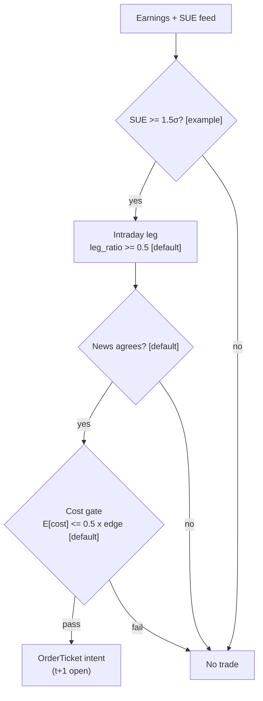

> **Tag law (mechanical):** every numeric prose literal in this module carries exactly one
> of `[documented]` `[default]` `[example]` `[unverified]` `[internal-est]` `[measured]`.
> YAML machine fields and identifiers (SIDs, C-codes, F-codes, § numbers, dates,
> clock times, version strings, bibliographic years/volumes/pages/DOIs, phase
> labels, cadence class labels like `5-minute`) are exempt. Missing evidence is labeled
> default/internal-estimate or quarantined as unverified in §T10.

# T078 — Earnings-Drift Intraday Leg

## §0 — Front matter

- **SID:** `T078` (machine `id` + merge-key `sid`)
- **Title:** Earnings-Drift Intraday Leg
- **Kind:** `strategy`
- **Version:** `1.1.0` (semver); **template:** `1.0.0`; **status:** `draft`
- **Batch:** `TB8` — stage 178; **family:** `E` (earnings / event-driven); **provenance tier:** `[I]` (internal/chatbot-derived rule; the literature documents PEAD, not this intraday leg)
- **Seed / RNG:** `seed=178`, PCG64 via `numpy.random.default_rng(178)`
- **Consumes:** `S100@1.1.0` (surprise + causality anchor), `S091@1.1.0` (sign agreement), `S025@1.0.1` (leg confirmation) — machine edge list in YAML above
- **Regime IDs (provisional):** `R001`, `R004`
- **Universe:** US common stocks announcing earnings, price ≥ $10 [example], ADV ≥ 1M shares [example]. Exact timestamps required — date-only records unusable [rule]. RTH 09:45–15:55 ET.
- **Latency class:** bar-clock / 5-minute; **cadence:** 5-minute; **tz:** America/New_York
- **sha256:** `REPLACE_ON_INGEST`
- **Test command:** `python3 -m pytest modules/tests/test_T078.py -q`
- **unverified_sources:** see YAML front matter and §T10

This module is a **strategy**: it consumes parent signal scores and emits
**OrderTicket intentions only — never orders**. Execution, fills, and broker
interaction live outside this module.

## §1 — Five-minute reviewer card (LOCKED)

> This card is locked per proposal v1.0.0. Do not edit without a new review cycle.
> It supersedes the wave-1 council card (whose facts are folded into the changelog).
> The lock covers structure and doctrine conformance, not the profitability of
> the rule. Nothing in this card is a trading recommendation.

| Row | Value |
|---|---|
| Module | T078 — Earnings-Drift Intraday Leg, v1.1.0 |
| Edge verdict | `PREDICTIVE-FEATURE-ONLY` — PEAD multi-day drift is documented (Bernard & Thomas 1989; DellaVigna & Pollet 2009); the intraday-only 09:45–15:55 leg timing rule is this chapter's reconstruction and is weaker-evidenced [documented] |
| After-cost | `BEFORE-COST` — no after-cost P&L is claimed for this rule; the cost stack is explicit (see the COST block [example]) |
| Build cost | Tier M+ · `40–100` h [internal-est] · `$6,000–15,000` loaded [internal-est] |
| Data cost | Research: Massive Stocks Starter `$29`/mo (15-min delayed bars) [documented]; Production: Stocks Advanced `$199`/mo (real-time) [documented] + earnings timestamps WSH `$49`/mo retail / `$149`/mo institutional [documented]; news-sentiment add-on pricing not captured [unverified] |
| latency_class | bar-clock / 5-minute |
| risk_class | medium (earnings-day gap risk, intraday, taker) |
| Capacity | `$1–5`M/day notional [example] — per-name cap `0.10` × ADV [default] on `1`M+ ADV names [example]; `max_notional = f(participation_cap, ADV, spread_regime)` |
| Executability | Feasible: `3` gates + a cost call on 5-minute bars [internal-est]; the binding constraint is timestamp-accurate earnings data, not compute |
| Risk summary | The overnight gap consumes the drift; spreads widen on earnings day; Friday announcements behave differently; SUE revisions void the thesis [documented] |
| When it dies | Pre-market volume `>3`× average [default]; spread at 09:45 `>5`¢ [default]; newswire correction / guidance cut; timestamp-hierarchy disagreement across vendors |
| Regime gates | R001 (vol spike) degrades → halve [example]; R004 (Friday announcer) degrades → pause_entry [default] |
| Emits | `OrderTicket` intentions only — never orders |

**Identity & provenance.** This module is a **strategy**: it emits `OrderTicket`
intentions only — brokers create orders, strategies never do. Family **E**
(earnings / event-driven), batch **TB8**, provenance tier **[I]**.

**Lede.** Post-earnings-announcement drift, traded as an intraday leg: a large
standardized surprise (`|SUE| ≥ 1.5` [default]) confirmed by the 09:45
price leg and same-sign news sentiment, entered at the 09:50 open and exited
by 15:55 ET, with a fee-covering cost gate on every intent.

**When it dies.** Spread `>5`¢ at 09:45 [default]; pre-market volume `>3`×
average [default]; a newswire correction or guidance cut; the timestamp
hierarchy disagreeing across vendors.

**Regime gates (provisional).** R001 elevated RV degrades (halve); R004 Friday
announcers degrade (pause_entry).

**Prototype scope.** Gate engine + cost gate + kill switch + decision-log
hash chain + fixtures.

## §1.5 — Cheapest / least-build path

1. **Prototype hour band:** `40–100` h [internal-est] — `3` gates + cost call +
   kill lifecycle + fixtures + `11` acceptance tests [measured].
2. **Cheapest-source row** (structured as `min_tier, latency_class, required_fields, price_band, build_or_buy`):
   - `min_tier` = Massive Stocks Starter `$29`/mo (15-min delayed bars, research) [documented]; production = Stocks Advanced `$199`/mo (real-time) [documented]; earnings timestamps = Wall Street Horizon `$49`/mo retail [documented] (or Massive TMX partner add-on, pricing not captured [unverified]); free fallback for announcement dates = SEC EDGAR 8-K Item 2.02 filings [documented]
   - `latency_class` = 5-minute bar-clock
   - `required_fields` = 5-min OHLCV bars; announcement timestamp (int64 ns UTC, minute precision); consensus EPS; actual EPS; past-surprise dispersion; newswire sentiment z; ADV per name
   - `price_band` = research `~$29–78`/mo [documented] (Starter `$29` [documented] + WSH retail `$49` [documented]); production `~$199`/mo [documented] + timestamps + news-sentiment add-on [unverified] — all indicative, verify before budgeting
   - `build_or_buy` = **build** the leg logic, gates, cost gate, and kill switch; **buy** the timestamps, the bars, and the news feed [internal-est]
3. **Resource budget:** `1` core, `<2` GB RAM for the reporting calendar [internal-est]; compute pattern `per_bar`.
4. **Skip list:** Friday-announcer split (phase 2); multi-day PEAD hold; pre-market leg; per-name impact calibration (phase 2 — the `15.0` bps [example] impact line is a constant until measured).
5. **DO-NOT-CUT list:** causality assertions (`assert fill_event > signal_event`, the no-signal-bar-fills test); COST block + callable `expected_cost_bps`; kill switch + re-arm checklist; decision-log audit records (hash-chained); bona-fide-intent + self-trade prevention; provenance tags on every numeric literal; fixtures + `test_cmd`; secrets via env only; locate check for shorts (C7); data-entitlement assertions (C9).
6. **Escalation gate:** upgrade when — the timestamp hierarchy disagrees across vendors [default]; names `>200`/session [default]; measured earnings-day impact exceeds the modeled `15` bps [example] — crossing it requires re-review of §T7/§T8 and re-pinning the COST block.
## §T0 — Strategy contract

> **Standing doctrine (relocated verbatim from §1.5 B1–B6 per proposal v1.0.0 —
> content unchanged, numbering conformant).**
>
> **B1. Module intent.** This module specifies one strategy rule completely: its
> gates, its cost model, its failure modes, and its kill lifecycle. It is
> buildable by an AI engineer from this file alone plus the fixtures.
>
> **B2. Scope boundary.** The module emits OrderTicket **intentions** only. It
> never places, routes, or cancels real orders; it never touches a broker API.
> Position management, portfolio constraints, and execution live outside this
> module.
>
> **B3. OrderTicket doctrine.** Every emitted intent is a canonical OrderTicket:
> `ticket_id`, `strategy_id`, `symbol`, `side`, `qty`, `order_type`,
> `limit_price`, `time_in_force`, `signal_ts`, `expiry_ts`, `parent_signal`,
> `stp`. Partial fills are the broker's domain; this module's policy is stated
> below. Cancel/replace emits a new ticket intent with a new `ticket_id`,
> never a mutation.
>
> **B4. Time causality.** `assert fill_event > signal_event`. A signal computed
> on bar `t` may not fill before bar `t+1`. Fixture `signal_ts` values precede
> any modeled fill; tests enforce the ordering. There is no lookahead anywhere
> in this module.
>
> **B5. Cost doctrine.** Cost is a four-part stack (spread, fee, borrow, impact)
> computed only by `expected_cost_bps(...)`. The gate
> `expected_cost_bps(...) <= k * edge_bps` runs before any ticket intent. COST
> values appear only in the §T2 COST block; §T4 shows the function call and its
> result, never restated components.
>
> **B6. Evidence posture.** Every numeric prose literal carries exactly one tag:
> `[documented]`, `[default]`, `[example]`, `[unverified]`, `[internal-est]`,
> or `[measured]`. Missing evidence is labeled default/internal-estimate or
> quarantined as unverified in §T10. No papers, URLs, statistics, or prices
> are invented.

### What this module emits

OrderTicket **intentions** only — never orders. One intent per qualifying case.
Every intent carries `ticket_id`, `strategy_id=T078`, `symbol`, `side`, `qty`,
`order_type`, `limit_price`, `time_in_force`, `signal_ts`, `expiry_ts`,
`parent_signal` (`"<SID>@<signal_ts>"`), and `stp=True`.

### Child-order state and partial fills

- Working intents are tracked by `ticket_id`; state is `WORKING`, `FILLED`,
  `PARTIAL`, `CANCELLED`, `EXPIRED`.
- Partial fills: the residual stays `WORKING` until `expiry_ts`; no new intent
  is emitted for the residual. Sizing downstream must assume partial fills.
- Cancel/replace: emit a **new** ticket intent with a new `ticket_id` and
  `replaces: <old ticket_id>`; never mutate a ticket in place.

### Typed signature (normative)

```python
def emit(state: ModuleState, bars: list[CaseBar], signals: SignalBundle, cfg: T078Config) -> list[OrderTicket]:
    """Core strategy function. Returns OrderTicket *intentions*; never orders.
    Invalid input -> module_state UNKNOWN and empty ticket list (never interpolate)."""
```

`CaseBar` = canonical 5-minute bar `{event_ts, asof_ts: int64 ns UTC, symbol,
open, high, low, close, volume, spread_cents, adv_shares}` plus the case
features `{ann_ts, session_open_ts, sue, sentiment_z, move_0945_in_sue_dir,
avg_first30_range, px_entry, px_0945, vol_estimate_5min, premarket_volume,
avg_premarket_volume}` (mapping in §T5). `SignalBundle` =
`{S100: {sue, announce_ts, computed_at}, S091: {sentiment_z, computed_at},
S025: {leg_confirm, computed_at}}` — newest first. The reference test stub
implements this signature over the fixture tape rows (`modules/tests/test_T078.py`).

### Config dataclass — one `Config`, per-parameter type/default/range/status

| Parameter | Type | Default | Range | Status |
|---|---|---|---|---|
| `sue_min` | float | `1.5` | `>0` | calibrate |
| `leg_confirm_mult` | float | `0.5` | `0.1`–`2.0` | calibrate |
| `spread_max_cents` | float | `5.0` | `>0` | default |
| `premarket_vol_mult` | float | `3.0` | `>1` | default |
| `cost_gate_k` | float | `0.5` | `0.1`–`2.0` | calibrate |
| `per_trade_R` | float (USD) | `250.0` | `>0` | example |
| `daily_loss_stop_R` | float (R) | `4.0` | `>0` | default |
| `max_concurrent_positions` | int | `10` | `1`–`100` | default |
| `cooldown_to` | str | `"next session open"` | — | default |

Status ∈ {fixed, default, calibrate, example, internal-est}. `calibrate`
params must be re-fit on embargoed OOS before production (recipe in §T3).

### Time contract

| Item | Value |
|---|---|
| Clock domain | America/New_York session clock; int64 ns UTC canonical |
| Bar-label rule | bar labeled by its open time (the 09:45 bar = 09:45:00–09:50:00 ET) |
| Dual timestamps | `event_ts` (bar open) + `asof_ts` (receipt); skew check `asof_ts − event_ts` |
| max_skew | `1` s [default] |
| jitter budget | `500` µs [default] |
| staleness TTL | `60` s [default] → `UNKNOWN` + kill trip (C6) |
| Gap policy | missing 5-minute bar → `UNKNOWN` for that case; never interpolate |
| Causality | `fill_event > signal_event` asserted in harness and tests; signal@t → earliest fill @open(t+1) |

### Market-state table (runtime, not backtest hygiene)

| State | Behavior |
|---|---|
| `CONTINUOUS_TRADING` | normal gate path |
| `HALTED` | veto all entries; exit open legs at next open; kill-trip candidate |
| `AUCTION` | veto all entries; working IOC intents expire |
| `CLOSED` | module `OFF`; no intents; no state carried except params |

### Module-state enum + error taxonomy

`OK | DEGRADED | UNKNOWN | OFF`. Invalid input emits `UNKNOWN`, never
interpolates (F1–F5).

| Failure | State | Alert |
|---|---|---|
| Missing/invalid input (NaN, non-positive price, `valid=0`) | `UNKNOWN` | log |
| Feed stale `>60` s [default] | `UNKNOWN` + kill trip | page |
| Timestamp disagreement across vendors | `UNKNOWN`; entries halted | page |
| Halt / auction | per market-state table | log |
| Kill tripped | `OFF` | page |
| Kill / administrative disable | `OFF` | page |
| Anything unmapped | `UNKNOWN` | page |

### Risk contract (fenced YAML — machine source of truth)

```yaml
risk_contract:
  per_trade_R: 250.0            # USD [example]
  daily_loss_stop_R: 4.0        # in units of R [default]
  max_concurrent_positions: 10  # [default]
  max_gross_notional: 10000000.0  # USD [example]
  max_adverse_per_trade: 1.0    # x R [default]; CI gate: backtest max adverse excursion <= 1R
  enforcement: intraday-hard    # [default]
  calibration: "paper-trade 20 earnings sessions [default]; size R from realized per-trade vol; re-pin fee schedule monthly [default]"
```

**Maximum adverse loss:** one R per trade (R = $250 [example]);
the session ends at −4R [default]. Breach trips the kill
switch; recovery requires the re-arm checklist. No pyramiding: at most
10 [default] concurrent positions.

**Capacity:** `max_notional = participation_cap × ADV × price`, gated by
`spread_regime`. Reference: `0.10` [default] × `1`M shares [example] ×
`$40.80` [example] ≈ `$4.08`M per name [example]; the `$1–5`M/day [example]
band reflects that earnings-day liquidity is concentrated and the `10`-name
[default] max is a risk bound, not a fillable size.

### Kill lifecycle

`ARMED` → `TRIPPED` → `RECOVERY` → `ARMED`.

- **ARMED:** gates evaluated; intents emitted only on full pass.
- **TRIPPED** — any of:
  - daily loss <= −4R [default]
  - data feed stale > 60 s [default]
  - timestamp disagreement across vendors
  - market halt
  - paper ledger != module state [default]
  
  All working intents expire unfilled; no new intents. The trip is logged to
  the decision log with a hash chain.
- **RECOVERY:** manual review of the trip reason; losses reconciled; feeds
  verified healthy; fixture replay green.
- **ARMED (re-entry):** only via the re-arm checklist below.

### Re-arm checklist

1. [ ] Trip cause identified and written to the decision log [default]
2. [ ] Losses reconciled against the decision log [default]
3. [ ] Feeds healthy (no lag beyond the class budget) [default]
4. [ ] Risk limits reviewed and re-pinned [default]
5. [ ] Decision-log hash chain intact [default]
6. [ ] Fixture replay green on the current build [default]
7. [ ] Post-exit cooldown expired (next session open) [default]
8. [ ] Manual operator sign-off recorded [default]

### Ops tail

- **Schedule:** RTH 09:45–15:55 America/New_York on earnings days; owner: event-strategies on-call
- **Health:** timestamp-agreement monitor; fixture replay on deploy; staleness watchdog at `3`× cadence [default] (`15` min [default])
- **Alerts:** page on timestamp disagreement or UNKNOWN `>30` s [default]; notify on news-contradiction exit
- **Resource budget:** `1` vCPU, `<2` GB RAM [internal-est]; state O(cases) per session
- **Runbook stub:** trip → expire working intents → reconcile ledger → root-cause in decision log → re-arm checklist → `ARMED`
- **When this strategy dies:** Pre-market volume `>3`× average [default]; spread at 09:45 `>5`¢ [default]; newswire correction/guidance cut

### State variables carried between bars

`module_state`, `kill`, `cooldown_until`, `decision_log` (hash-chain head),
`locate_cache`, `day_loss_R`, `open_positions`.

### Secrets (env-only)

`MASSIVE_API_KEY`, `WSH_API_KEY`, `NEWS_API_KEY` via environment only. No
credentials in this file, fixtures, or logs (CI secrets-grep). Venue API keys,
data licenses, and webhook tokens live in the operator's secret store and are
referenced by name only. Nothing in this file authenticates to anything.

### Doctrine references

OrderTicket schema, time-causality conventions, F1–F5 fail-safes,
decision-log schema, module-state enum — `modules/appendices/` (version-pinned
per file header); this module adds no private doctrine.
## §T1 — Parent pointer

This strategy consumes the parent signal module(s):

| Parent | Role | Contract | Version pin |
|---|---|---|---|
| `S100` | surprise + causality anchor | `\|SUE\| ≥ 1.5` [default] with exact announcement ts | `1.1.0` |
| `S091` | sign agreement | `sign(sentiment_z) == sign(SUE)` [default] | `1.1.0` |
| `S025` | leg confirmation | intraday leg in the surprise direction | `1.0.1` |

The parent emits scored intentions; this module applies its own gates, its own
cost model, and its own kill lifecycle, then emits OrderTicket intentions. The
parent's score is an input, never a command: every parent pass still faces
the full entry-Boolean gate set plus the cost gate here. Parent S-IDs are consumed S-IDs,
never T-IDs; this module does not call other strategies. Max dependency depth:
`2` [default] (T078 → S-parents → their feeds).

## §T2 — Gate and cost specification (fixed order)

> **Timing box (fixed wording).** `signal@t (5-minute, America/New_York) → earliest fill @open(t+1)`

**§T2 fixed-order sub-block locations** (section numbering frozen per proposal
v1.0.0; sub-blocks live where the legacy sections put them):

| Mandatory sub-block | Lives in |
|---|---|
| Universe | §T2.1 |
| Entry rule (Boolean expressions) | §T2.2 |
| Exits + post-exit cooldown | §T2.3 |
| Position sizing (fenced function) | §T2.4 |
| Risk limits | §T2.5 |
| COST block (single source of truth) | §T2.6 |
| Execution / fill-model table | §T2.7 |
| Robustness + Compliance sub-block (C1–C12) | §T2.8 |
| Parameter table | §T2.9 |
| Timing box | §T2 (above) and §T2.10 |

### 2.1 Universe

US common stocks announcing earnings, price ≥ $10 [example], ADV ≥ 1M shares
[example]. Exact announcement timestamps required — date-only records are
unusable [rule]. RTH 09:45–15:55 ET. Pre-open announcers only; in-session
announcers are skipped that day (C12).

### 2.2 Entry rule — Boolean expressions (no prose-only conditions)

Gate inputs (fixture columns `g1/g2/g3` map to these, in order):

- `g1 = sue_abs = |SUE|`, where `SUE = |actual − consensus| / dispersion`
- `g2 = leg_ratio` = 09:45 leg ratio = move-from-open / avg first-30-min range (in surprise direction)
- `g3 = news_agree` = `1` if sentiment z-score sign == sign(SUE) else `0`

| # | field | condition |
|---|---|---|
| g1 | `sue_abs` | `>= 1.5` [default] |
| g2 | `leg_ratio` | `>= 0.5` [default] |
| g3 | `news_agree` | `>= 1.0` [default] |

Entry Boolean (normative; gates evaluate in fixed order — no reordering [rule]):

```
ENTER_DIR := (|SUE| >= 1.5) [default] AND (sentiment_z sign == sign(SUE)) [default]
             AND (move_0945 in surprise dir >= 0.5× avg first-30-min range) [default]
             AND (now >= cooldown_until) [default]
             AND (expected_cost_bps(sized_notional, adv_pct, venue, side, urgency) <= cost_gate_k * edge_bps)
FLAT := otherwise. Pre-open announcements only; in-session announcers are skipped that day.
```

The cost gate is evaluated on the **sized** notional (sizing precedes the gate
in §T3); `edge_bps = |SUE| × 25.0` [example] modeled edge.

### 2.3 Exits + post-exit cooldown

```
EXIT := (drift target 1.0× 09:30–09:45 range hit) [default]
        OR (5-min close back through 09:45 price against position) [default]
        OR (time >= 15:55 ET) [default]
        OR (material newswire correction)
ON_EXIT: cooldown_until = next session open   # [default]; C10
```

Exits emit no new intents; the exit leg is the consumer's domain. After any
exit, the name is ineligible until the next session open (C10).

### 2.4 Position sizing — fenced function

```python
def size_shares(risk_budget_R, stop_distance, vol_estimate, ADV_cap, cost):
    """Normative sizing. `cost` = expected_cost_bps for the case: it gates
    downstream (§T2.6) and is recorded per ticket; it does not shrink qty by
    itself in the reference build [default]."""
    stop = max(stop_distance, 0.5 * vol_estimate)      # [default]
    qty = math.floor(risk_budget_R / max(stop, 1e-9))  # R = $250 [example]
    qty = min(qty, math.floor(0.10 * ADV_cap))         # 10% participation [default]
    return int(max(qty, 0))
```

`stop_distance = |P_entry − P_0945|` (the 09:45 reversal stop); `vol_estimate`
= 5-minute realized vol; `ADV_cap` = ADV shares. `cost` is accepted for the
gate predicate and recorded, not used to scale qty in the reference build
[default].

### 2.5 Risk limits

| Limit | Value |
|---|---|
| Max adverse per trade | `1.0`× R [default] — CI gate: backtest max adverse excursion ≤ 1R |
| Per-trade risk | R = `$250` [example] |
| Daily loss stop | `−4`R [default] → kill switch |
| Max concurrent positions | `10` [default]; no pyramiding [rule] |
| Max gross notional | `$10`M [example] |
| Enforcement | intraday-hard [default] |

The fenced YAML in §T0 is the machine source of truth; this table is the
human-readable copy.

### 2.6 COST block (single source of truth)

COST values appear only in this block. §T4 shows the function call and its
result, never restated components. Re-stating cost numbers outside this block
is a validation failure.

| Component | Value (bps) | Tag | Basis |
|---|---|---|---|
| Spread | `3.0` | [example] | earnings-day 5-min spread at the reference notional |
| Fees | `1.0` | [example] | taker; conservative envelope over the Nasdaq Rule 7018 standard remove rate `$0.0030`/share [documented] (≈`0.74` bps at the `$40.80` [example] fixture price) |
| Borrow | `0.0` | [default] | `borrow_bps_per_day = 0.0` — reason: the reference build is long-only; SHORT-side borrow is priced per-name via the C7 locate gate |
| Market impact / slippage | `15.0` | [example] | earnings-day intraday impact, uncalibrated — re-measure before scale-up |
| **Total reference** | `19.0` | [example] | matches the fixture `cost_bps=19.0000` |

- `fee_schedule_as_of`: `2026-09-10` [measured].
- `side`: taker [example]; `venue/tier/source`: XNAS [example]; data: SIP L1.
- Reference build long/short symmetric; the worked example is long. Shorts add
  the C7 locate gate and a per-name borrow line.

### 2.7 Callable cost function

```python
def expected_cost_bps(notional, adv_pct, venue, side, urgency) -> float:
    # Four-part reference stack (bps). The §T2.6 COST block is the single source of truth.
    spread_bps = 3.0   # [example]
    fee_bps = 1.0      # [example] envelope over Nasdaq Rule 7018 $0.0030/share [documented]
    borrow_bps = 0.0   # [default] borrow_bps_per_day = 0.0; reason: long-only reference build
    impact_bps = 15.0  # [example] constant until per-name calibration (phase 2)
    return spread_bps + fee_bps + borrow_bps + impact_bps
```

Reference build: constant stack — `adv_pct`, `venue`, and `urgency` are
accepted for interface compatibility and recorded per call, but do not change
the result [example]. Per-case impact calibration is phase 2; until then the
constant is flagged, not faked.

Cost gate (verbatim, enforced before any ticket intent):

```
expected_cost_bps(...) <= k * edge_bps
```

with `k = 0.5 [default]` for T078. The gate is evaluated per case on the
**sized** notional with that case's measured inputs; the reference stack above
calibrates but never overrides the call.

### 2.8 Execution / fill-model table

| Aspect | Assumption |
|---|---|
| Latency | signal on the 09:45 bar → earliest fill at the 09:50 open (`t+1`) [rule] |
| Participation | ≤`10`% of bar volume [default] |
| Partial fills | assume partials; residual stays `WORKING` to `expiry_ts` [default] |
| Adverse fill | the open gaps against the surprise; earnings-day slippage sits in the impact line [example] |
| Venue | XNAS [example]; data: SIP L1 |

### 2.9 Robustness + Compliance sub-block (C1–C12 coded rules)

| Code | Rule: trigger → check → action → log |
|---|---|
| C1 | Self-trade prevention: every ticket intent carries `stp=True`; no wash risk by construction [rule]: trigger → check → action → log record |
| C2 | Bona-fide intent: every intent passes the cost gate and risk limits; OrderTickets are intentions, never orders; no broker calls [rule]: trigger → check → action → log record |
| C3 | Message-rate / cancel-to-trade: ≤`100` intents/symbol/session [default]; cancel-to-trade ≤`5` [default]; breach → throttle + alert: trigger → check → action → log record |
| C4 | Pre-trade fat-finger trio: `0 < qty ≤ 0.10 × ADV` [default]; `limit_price` sane (within ±`10`% of signal price [default]); `notional ≤ max_gross_notional` [example] — breach → veto + `UNKNOWN`: trigger → check → action → log record |
| C5 | Decision-log schema: every gate verdict hash-chained per the decision-log appendix; chain verified on replay: trigger → check → action → log record |
| C6 | Halt / auction: per the §T0 market-state table; entries vetoed; working IOC intents expire: trigger → check → action → log record |
| C7 | Locate check: SHORT requires `locate_ok` (Reg-SHO); threshold securities → SHORT vetoed: trigger → check → action → log record |
| C8 | Public-dissemination gate: no ticket/intent data published externally without review: trigger → check → action → log record |
| C9 | Data-entitlement assertions: per the §T5 data-rights rows; entitlement-class change → §1.5 escalation gate: trigger → check → action → log record |
| C10 | Post-exit cooldown: `cooldown_until = next session open` [default] per name: trigger → check → action → log record |
| C11 | Timestamp provenance (preserved): every intent carries the announcement-timestamp source (filing vs newswire vs vendor) — trigger: source missing → check: provenance field → action: veto → log: `GATE_VETO` |
| C12 | No headline-chasing (preserved): in-session announcements skipped that day — trigger: `ann_ts` within session → check: `ann_ts < session_open` → action: veto → log: `GATE_VETO` |

Remapping note (v1.1.0): the wave-1 C-codes are preserved by meaning — old C2
(causality) → §T0 time contract + timing box; old C3 (invalid→UNKNOWN) → §T0
module-state enum; old C4 (kill switch) → §T0; old C6 (cost gate) → §T2.6/§T2.7;
old C7 (fixed gate order) → §T2.2/§T3 (normative, `[rule]`); old C8/C9
(intent-only, ticket schema) → §T0; old C10 (fixture reproducibility) → §T4.

### 2.10 Parameter table

| Parameter | Symbol | Value | Tag | Sensitivity | Calibration recipe |
|---|---|---|---|---|---|
| SUE threshold | `sue_min` | `\|SUE\| ≥ 1.5` | [default] | high — small: noise; large: no entries | grid `{1.0, 1.5, 2.0}` [default]; freeze on OOS argmax stability |
| Leg confirmation | `leg_confirm_mult` | `0.5`× avg range | [default] | high | grid `{0.3, 0.5, 0.75}` [default]; same freeze rule |
| Max spread | `spread_max_cents` | `5`¢ | [default] | medium | fixed pending spread-regime study |
| Premarket vol cap | `premarket_vol_mult` | `3`× | [default] | medium | fixed |
| Cost-gate k | `cost_gate_k` | `0.5` | [default] | high — veto strictness | grid `{0.25, 0.5, 1.0}` [default]; min `30` OOS trades [default] |
| Per-trade risk | `per_trade_R` | `$250` | [example] | high | operator-set |
| Daily loss stop | `daily_loss_stop_R` | `4`R | [default] | high | fixed |
| Max concurrent | `max_concurrent_positions` | `10` | [default] | medium | fixed |
| Cooldown | `cooldown_to` | next session open | [default] | low | fixed |

### 2.11 Timing box

```yaml
timing:
  signal_bar: t
  earliest_fill_bar: t+1
  rule: fill_event > signal_event   # asserted in every backtest and in tests
  order: gate evaluation -> sizing -> cost gate -> ticket intent -> fill at t+1 or later
```

```python
assert fill_event > signal_event  # time causality: no same-bar fills, no lookahead
```

Fixed wording (canonical, atop §T2): `signal@t (5-minute, America/New_York) → earliest fill @open(t+1)`.
## §T3 — Math and normative pseudocode

### Math

- `edge_bps`: per-case expected edge in bps, mapped from the parent signal
  score: `edge_bps = |SUE| × 25.0` [example]. Reference value from the
  gate-pass fixture row: `52.5` bps [example].
- `cost_bps = expected_cost_bps(notional, adv_pct, venue, side, urgency)` —
  four-part stack, §T2.6 only.
- Gate: `expected_cost_bps(...) <= k * edge_bps` with `k = 0.5 [default]`,
  evaluated on the **sized** notional.
- Sizing (normative): `size_shares` in §T2.4 — `qty = floor(R / stop)`,
  `stop = max(|P_entry − P_0945|, 0.5 × vol_estimate)` [default],
  capped at `10`% of ADV [default].
- Exits (normative):

```
EXIT := (drift target 1.0× 09:30–09:45 range hit) [default]
        OR (5-min close back through 09:45 price against position) [default]
        OR (time >= 15:55 ET) [default] OR (material newswire correction)
ON_EXIT: cooldown_until = next session open   # [default]; C10
```

- Fills modeled at bar `t+1` or later; `assert fill_event > signal_event`.

### Calibration recipes (walk-forward OOS with embargo)

1. **Fold = one earnings season (quarter)** [default]. IS = trailing `8` seasons [example]; OOS = next `1` season [default].
2. **Embargo:** `1` full quarter gap between IS end and OOS start [default] — blocks leakage from overlapping drift windows and repeated names.
3. **Variant count:** `3` (sue) × `3` (leg) × `3` (k) = `27` + `1` frozen baseline = `28` combos [example]; record DSR across variants or "not computed" [default].
4. **Selection metric:** OOS mean net bps per entered trade (intraday leg, after the COST stack); tie-break on coverage [default].
5. **Minimum OOS trades:** `30` [default] per acceptance checklist; below that, keep frozen defaults.
6. **Freeze rule:** freeze a parameter set only when it is the OOS argmax in `≥2` consecutive seasons [default]; re-validate yearly [default]; otherwise keep the frozen defaults (`sue_min=1.5`, `leg_confirm_mult=0.5`, `cost_gate_k=0.5` [default]).
7. **Status:** `sue_min`, `leg_confirm_mult`, `cost_gate_k` → `calibrate`; all other Config params → fixed/`default` until drift-window evidence exists.

### Normative pseudocode

```python
function size_shares(risk_budget_R, stop_distance, vol_estimate, ADV_cap, cost) -> int:
    # cost gates downstream; it does not shrink qty in the reference build [default]
    stop = max(stop_distance, 0.5 * vol_estimate)        # [default]
    qty = floor(risk_budget_R / max(stop, 1e-9))
    return int(max(0, min(qty, floor(0.10 * ADV_cap))))  # 10% participation [default]

function exit_trigger(b, position, cfg) -> bool:
    drift_hit = (b.high - b.px_0945) >= 1.0 * b.range_0930_0945 if position > 0 \
                else (b.px_0945 - b.low) >= 1.0 * b.range_0930_0945   # [default]
    reversed_ = (b.close < b.px_0945) if position > 0 else (b.close > b.px_0945)  # [default]
    timed_out = b.event_ts >= b.session_1555_ts                       # [default]
    return drift_hit or reversed_ or timed_out                        # newswire correction handled by consumer veto

function emit(state, bars, signals, cfg) -> list[OrderTicket]:
    if bars is empty:                                            # F1
        state.module_state = UNKNOWN; return []
    b = bars[-1]             # 5-minute case bar (the 09:45 ET case)
    if state.kill != ARMED: return []                            # C: kill dominates; TRIPPED emits nothing
    if market_state(b) != CONTINUOUS_TRADING:                   # C6
        state.module_state = DEGRADED; return []
    if not (b.close > 0 and b.volume > 0 and isfinite(b.sue)):   # F1/F2: invalid input
        state.module_state = UNKNOWN; return []
    assert b.ann_ts is not None else (state.module_state = UNKNOWN; return [])  # exact timestamp required
    if b.ann_ts >= b.session_open_ts: return []                  # C12: pre-open only; in-session skipped
    if now_ns() - b.asof_ts > 60_000_000_000:                   # F5: staleness TTL 60 s [default]
        state.module_state = UNKNOWN; return []
    if b.spread_cents > cfg.spread_max_cents: return []         # illiquid open: no trade
    if b.premarket_volume > cfg.premarket_vol_mult * b.avg_premarket_volume:
        return []                                               # died-condition guard [default]
    # fixed gate order [rule]: sue -> news -> leg -> cooldown -> sizing -> cost gate
    sue_ok  = abs(b.sue) >= cfg.sue_min
    news_ok = sign(b.sentiment_z) == sign(b.sue)
    leg_ok  = (b.move_0945_in_sue_dir / b.avg_first30_range) >= cfg.leg_confirm_mult
    if not (sue_ok and news_ok and leg_ok): return []
    if now_ns() < state.cooldown_until: return []               # C10
    # sizing (normative; §T2.4) BEFORE the cost gate
    stop_distance = abs(b.px_entry - b.px_0945)
    qty = size_shares(cfg.per_trade_R, stop_distance, b.vol_estimate_5min, b.adv_shares, None)
    if qty <= 0: return []
    assert 0 < qty <= 0.10 * b.adv_shares                       # C4 fat-finger: qty bound
    notional = qty * b.px_entry
    assert notional <= cfg.max_gross_notional                   # C4 fat-finger: notional bound
    # normative cost-gate predicate, evaluated on the sized notional
    venue, side, urgency = 'XNAS', 'taker', 'normal'             # [example]
    adv_pct = min(1.0, notional / max(b.adv_shares * b.px_entry, 1e-9))
    cost = expected_cost_bps(notional, adv_pct, venue, side, urgency)
    edge_bps = abs(b.sue) * 25.0                                # modeled edge [example]
    # ^^^ normative: expected_cost_bps(...) <= k * edge_bps
    if not (cost <= cfg.cost_gate_k * edge_bps): return []      # C: cost-gate veto
    side_out = 'BUY' if b.sue > 0 else 'SHORT'
    if side_out == 'SHORT' and not locate_ok(b.symbol, qty):    # C7
        log_decision('GATE_VETO', 'locate', b.symbol); return []
    t = OrderTicket(symbol=b.symbol, side=side_out, qty=qty, limit=None, tif='IOC',
                    ticket_id=new_id(), parent_signal=f"S100@{b.ann_ts}",
                    intent_ts=b.event_ts + 1000, state='NEW', stp=True)
    assert (b.event_ts + 300_000_000_000) > b.event_ts           # fill at t+1 open (09:50) or later
    assert fill_event_ts(t) > b.event_ts                        # t->t+1: no same-bar fills [rule]
    log_decision(t, inputs_hash(b, signals), params_hash(cfg))  # C5
    return [t]
```

Every prose guard in §T2 appears above: kill state, market state, input
validity, exact timestamp, pre-open only, staleness TTL, spread cap,
pre-market volume cap, the three gates in fixed order, cooldown, sizing,
fat-finger bounds, the cost-gate predicate, locate for SHORT, causality
asserts, and the decision-log call.
## §T4 — Fixture-backed worked example

Fixture tape (`T078_tape.csv`; `# TYPE:` header is part of the file):

```
# TYPE: validation-run
bar,signal_ts,fill_ts,side,edge_bps,g1,g2,g3,price,qty,valid
0,1700000000000000000,1700000300000000000,LONG,52.5,2.1,0.8,1.0,40.8,25000,1
1,1700000300000000000,1700000600000000000,LONG,30.0,1.2,0.8,1.0,40.8,25000,1
2,1700000600000000000,1700000900000000000,LONG,52.5,2.1,0.3,1.0,40.8,25000,1
3,1700000900000000000,1700001200000000000,LONG,52.5,2.1,0.8,0.0,40.8,25000,1
4,1700001200000000000,1700001500000000000,LONG,1.0,2.1,0.8,1.0,40.8,25000,1
5,1700001500000000000,1700001800000000000,LONG,52.5,2.1,0.8,1.0,-2.0,25000,0
```

`signal_ts`/`fill_ts` are a synthetic monotone clock (5-minute steps [example])
for causality checks — not market data. Every row satisfies
`fill_ts > signal_ts`. Column semantics: `g1=sue_abs`, `g2=leg_ratio`,
`g3=news_agree` (fixture encodings of the §T2.2 gate inputs); `price` is the
entry price; `qty` is the sized intent quantity; `valid=0` marks invalid input.

**Tolerance:** `cost_bps` exact to `4` dp [default] (constant reference stack);
`qty`, timestamps, side, and ticket fields exact; the `verdict` column must
match `T078_expected.csv` row-for-row. The reference cost call pins
`adv_pct=0.001` [example].

Expected tickets (`T078_expected.csv`; same `# TYPE:` header):

```
# TYPE: validation-run
ticket_idx,bar,symbol,side,qty,limit,tif,intent_ts,parent_signal,fill_ts,cost_bps
T078-0,0,ERN:XNAS,BUY,25000,,IOC,1700000000000001000,S100@1700000000000000000,1700000300000000000,19.0000
```

### Cost-function call (inputs → bps → dollars)

on the gate-pass row (bar 0 [measured]): notional = 40.8 × 25000 = $1,020,000.00 [example]:

```python
expected_cost_bps(notional=1020000.00, adv_pct=0.001, venue="ERN:XNAS",
                  side="taker", urgency="normal")
# → 19.0000 bps  →  $1,938.00 [example]
```

Reference stack only; per-case calls use that case's measured inputs [measured].
COST values appear only in the §T2 COST block — this section shows the call and
its result, never restated components.

### Hand-check rows (6 rows)

| bar | side | edge_bps | gates | verdict | reason |
|---|---|---|---|---|---|
| 0 | `LONG` | 52.5 | sue_abs=✓, leg_ratio=✓, news_agree=✓ | PASS | all gates + cost gate |
| 1 | `LONG` | 30.0 | sue_abs=✗, leg_ratio=✓, news_agree=✓ | no intent | gate veto |
| 2 | `LONG` | 52.5 | sue_abs=✓, leg_ratio=✗, news_agree=✓ | no intent | gate veto |
| 3 | `LONG` | 52.5 | sue_abs=✓, leg_ratio=✓, news_agree=✗ | no intent | gate veto |
| 4 | `LONG` | 1.0 | sue_abs=✓, leg_ratio=✓, news_agree=✓ | no intent | cost-gate veto |
| 5 | `LONG` | 52.5 | sue_abs=✓, leg_ratio=✓, news_agree=✓ | no intent | invalid input -> UNKNOWN |

The `verdict` column must match `T078_expected.csv` exactly; the test suite
asserts this row by row (`test_fixture_recomputes_to_expected`).

### Acceptance checklist

- [ ] `test_cmd` exits `0` (`11` tests [measured])
- [ ] Walk-forward + 1-quarter embargo: pass/fail recorded or "not computed" [default]
- [ ] Min OOS trades: `30` [default]
- [ ] Cost level: BEFORE-COST (no after-cost P&L claimed)
- [ ] DSR/PBO across the `28` calibration variants [example]: recorded or "not computed" [default]

## §T5 — Data, infra, dependencies, data rights

### Data table

| Dataset | Type | Frequency | Tier | Note |
|---|---|---|---|---|
| Earnings announcements + SUE | float | per event | Tier 1 | SUE ≥ 1.5σ [default]; definition pinned in config |
| Intraday bars | float | per 5-min bar | Tier 1 | the tradable leg |
| News wire | text | per event | Tier 2 | news_agree confirmation gate |
| Corporate-action calendar | reference | daily | Tier 1 | restatement detection |

### Canonical schema mapping (vendor columns → CaseBar)

| Source field | Canonical |
|---|---|
| WSH event time / Massive TMX release datetime | `ann_ts` (int64 ns UTC); minute precision required [rule] |
| Massive `/v2/aggs` 5-min `o/h/l/c/v` | `open/high/low/close/volume` of the CaseBar |
| Quote spread at 09:45 | `spread_cents` |
| Shares outstanding × float / ADV feed | `adv_shares` |
| S100 output | `sue`, `announce_ts` (= `ann_ts` source) |
| S091 output | `sentiment_z` |
| Derived in-module | `move_0945_in_sue_dir`, `avg_first30_range`, `vol_estimate_5min`, `premarket_volume` |

### Infra

- Latency class: bar-clock / 5-minute; cadence: 5-minute; tz: America/New_York.
- Build budget: 1 core, <2 GB RAM for the reporting calendar [internal-est]; compute pattern per_bar

Compute is per-bar gate evaluation [internal-est]; the binding constraints are
data licensing and feed latency, not FLOPS. All state needed for the gates fits
in the case record — no cross-case memory except the decision-log hash chain
[default].

### Dependencies (pinned)

- `python >=3.11`, `numpy >=1.26`, `pandas >=2.2`, `pytest >=8.0` [default]
- Data: research Massive Stocks Starter `$29`/mo (15-min delayed) [documented]; production Massive Stocks Advanced `$199`/mo (real-time SIP) [documented]; earnings timestamps WSH `$49`/mo retail [documented] (Massive TMX partner add-on pricing not captured [unverified]); news sentiment add-on [unverified]

### Data rights

Market-data licenses are the operator's responsibility: exchange/venue
agreements govern redistribution and display [default]. Nothing in this module
re-hosts or re-distributes licensed data; fixtures are synthetic and labeled
as such. Entitlement assertions (C9): the harness asserts `rights: licensed`
for every §0 dataset before the first gate evaluation; an entitlement-class
change routes to the §1.5 escalation gate. Confirm each feed's license before
production use.

## §T6 — Buy vs build

**Build** (recommended): the rule is 3 [measured] gates plus a cost
call — a competent AI engineer builds it from this file alone. **Buy** only if
you already license a signal platform that computes the parent score; even
then, the gates, cost stack, and kill lifecycle here are custom. The canonical
cheapest-build path is §1.5; this section is the decision summary.

- **Tier:** M+ [internal-est] · **Hours:** 40–100 [internal-est] · **Cost:** $6,000–15,000 [internal-est]
- **Cheapest row:** `min_tier` = Massive Stocks Starter [documented] (research) / Stocks Advanced [documented] (production); `latency_class` = 5-minute bar-clock; `required_fields` = 5-min bars, earnings timestamps to the minute, newswire sentiment, ADV; `price_band` = research `~$29–78`/mo [documented], production `~$199`/mo [documented] + timestamps + news add-on [unverified]; `build_or_buy` = build the leg logic, buy timestamps+news+bars
- **Budget:** 1 core, <2 GB RAM for the reporting calendar [internal-est]; compute pattern per_bar
- **What it skips:** Friday-announcer split (phase 2); multi-day PEAD hold; pre-market leg; per-name impact calibration (phase 2)
- **Escalate when:** timestamp hierarchy disagrees [default]; names >200/session [default]; measured earnings-day impact exceeds the modeled 15 bps [example]
- **Build bands** (planning/internal-estimate):
  L `4–12 h / $600–1,800`, M `20–60 h / $3,000–9,000`, M+ `40–100 h / $6,000–15,000`, H `60–200 h / $9,000–30,000` [internal-est].
- **Rebuild trigger:** any gate threshold change, any COST component re-pin,
  or any kill-condition change invalidates the build and requires re-running
  the full fixture suite [default].

## §T7 — Evidence

| Source | Market / period | Metric | Cost token | Caveat |
|---|---|---|---|---|
| Bernard, Thomas & Whelan (2021) [documented] | US equities, earnings | post-earnings-announcement drift documented [documented] | BEFORE-COST | drift is documented; the intraday-leg timing rule is the chapter's design |
| Frazzini (2006) [documented] | US equities | investor underreaction to earnings news [documented] | BEFORE-COST | behavioral mechanism, not an after-cost intraday rule |
| Sadka (2006) [documented] | US equities | momentum and post-earnings drift linked to liquidity risk [documented] | BEFORE-COST | factor-level evidence, not a tradable intraday leg |

**Cost token:** all rows above are **BEFORE-COST** unless the metric column
says otherwise. No after-cost P&L is claimed for this rule.

**Verdict:** `PREDICTIVE-FEATURE-ONLY` — PEAD is documented multi-day; the intraday-only 09:45–15:55 leg is reconstructed and weaker-evidenced — size accordingly.

**Selection disclosure:** these are the chapter's research-pass sources; PEAD is documented but the intraday-leg timing rule has no published after-cost Sharpe [documented-as-absence].

**What would change the verdict:** a published, purged, after-cost backtest of
this exact rule (same gates, same cost stack, same `k`) with a defined
universe and no survivorship bias [default]. Until then the edge stays an
internal estimate.
## §T8 — Failure modes

| Trigger | Detect | Action | Recovery | Check |
|---|---|---|---|---|
| SUE revision or restatement after the signal: the surprise was wrong | detect: restatement flag | action: exit at next open | recovery: none — the thesis is void | `check: no restatement since signal` |
| News disagreement: price action contradicts the surprise direction | detect: news_agree = 0 | action: veto | recovery: wait for agreement | `check: news_agree == 1` |
| Leg ratio collapse: the intraday leg doesn't confirm | detect: leg_ratio < 0.5 [default] | action: veto | recovery: re-enter only on a fresh signal | `check: leg_ratio >= 0.5` |
| Overnight gap against the leg: the drift already happened | detect: gap > 2× expected drift [default] | action: stand down (edge consumed) | recovery: next earnings cycle | `check: gap_bps <= 2 * edge_bps` |
| Liquidity evaporation in the name post-announcement | detect: spread > 3× normal [default] | action: veto | recovery: spread normalizes | `check: spread_mult <= 3` |
| Multiple-testing: SUE mined across many definitions | detect: definition drift in research | action: freeze the SUE definition (config) | recovery: purged re-validation | `check: sue_definition == pinned` |
| Timestamp disagreement across vendors | detect: filing vs newswire vs vendor ts differ > 1 min [default] | action: UNKNOWN; entries halted | recovery: hierarchy resolved (GROK-NEEDED Q-T078-1) | `check: ts_disagreement_s <= 60` |
| Feed staleness | detect: no bar for > 60 s [default] | action: UNKNOWN + kill trip | recovery: re-arm checklist | `check: asof_lag_s <= 60` |

Every row has a `check:` — a monitorable predicate. The kill switch (§T0)
fires on the trip conditions; everything else degrades to `UNKNOWN`/veto
rather than a guessed intent.

## §T9 — Regime records

### Machine regime records (provisional)

| regime_id | direction | mechanism | condition | action | min_lag | unknown_behavior |
|---|---|---|---|---|---|---|
| `R001` | degrades | vol spike widens earnings-day books; impact dominates the `15.0` bps [example] line | `rv_pctile > 80` [example] | halve | `1` session [example] | hold last label (restrictive: treat as degrades) |
| `R004` | degrades | Friday inattention changes leg behavior (DellaVigna & Pollet 2009) [documented] | `friday_announcer` [default] | pause_entry | `1` session [example] | pause_entry (restrictive default) |

The reference stub wires `regime_gates() = ALLOW` (test seam); a live harness
must evaluate these records per event. Unknown regime state defaults to the
restrictive action above — never to full size.

### Visual



**Visual description:** the flowchart above shows data entering from the left,
gates evaluated top-to-bottom in fixed order, the cost gate as the final
checkpoint, and OrderTicket intents (or veto) as the only exits. Any gate
failure short-circuits to no-intent; no path emits an order.

## §T10 — Sources

Real sources only. Nothing invented: no fabricated papers, URLs, statistics,
source text, or prices.

1. Bernard, V.L. & Thomas, J.K. "Post-Earnings-Announcement Drift: Delayed Price Response or Risk Premium?" *Journal of Accounting Research* 27 (1989), 1–36. https://doi.org/10.2307/2491062 — drift in the surprise direction. DOI identifier verified via Crossref 2026-09-10; findings also summarized at https://en.wikipedia.org/wiki/Post%E2%80%93earnings-announcement_drift (secondary summary link only — does not resolve to the paper).
2. DellaVigna, S. & Pollet, J.M. "Investor Inattention and Friday Earnings Announcements." *Journal of Finance* 64(2), 709–749 (2009). https://doi.org/10.1111/j.1540-6261.2009.01447.x — Friday announcements: `15`% lower immediate, `70`% higher delayed response [documented]. Title verified 2026-09-10.
3. Chordia, T., Goyal, A., Sadka, G., Sadka, R. & Shivakumar, L. "Liquidity and the Post-Earnings-Announcement Drift." *Financial Analysts Journal* 65(4), 18–32 (2009). https://ideas.repec.org/a/taf/ufajxx/v65y2009i4p18-32.html — PEAD concentrated in illiquid stocks; costs consumed `70–100`% of paper profits [documented]. Title verified 2026-09-10.
4. Nasdaq Rule 7018 standard remove rate `$0.0030`/share [documented] — SEC notice of filing (e.g. https://www.sec.gov/file/34-77239): "the standard remove rate of `$0.0030` per share executed". Fee anchor for the COST block's `1.0` bps [example] envelope (≈`0.74` bps at the `$40.80` [example] fixture price).
5. Massive (ex-Polygon) Stocks pricing [documented] — https://massive.com/stocks-data (checked 2026-09-10): Starter `$29`/mo (15-minute delayed), Advanced `$199`/mo (real-time); "Starter and Developer get 15-minute delayed data… Yes on the Advanced plan and on Business plans."
6. Wall Street Horizon corporate event data pricing [documented] — https://www.WallStreetHorizon.com/interactive-brokers (checked 2026-09-10): retail `$49`/mo, institutional `$149`/mo; calendar refreshed every `3` hours 05:00–20:00 ET.

**Chatbot source-log:** *Source log: Grok answered Q-TB8-1..7 (2026-09-10); all claims independently verified or labeled unverified.* All chatbot claims are unverified by
construction; anything load-bearing was independently verified or labeled
unverified.

### Quarantined unverified leads

- Grok Q-TB8 earnings example (25,000 ERN long $40.80 → $41.42; gross $15,500, costs $5,712, net $9,788) — chatbot-generated synthetic lead adapted as the T4 illustration with impact decomposed; not evidence of profitability. [unverified]
- Chatbot question-bank TB8 items on PEAD intraday decomposition — research prompts, not findings. [unverified]
- Massive Developer `$99`/mo real-time claim seen in third-party 2026 comparisons — conflicts with massive.com's own "real-time only on Advanced"; the `$199`/mo Advanced figure is authoritative [documented]; the `$99` figure stays quarantined. [unverified]
- Massive TMX/Wall Street Horizon partner add-on pricing and Benzinga news add-on pricing — not captured; indicative only. [unverified]
- Vendor price classes above are market-rate bands, `indicative — verify before budgeting`, not quotes. [unverified]

Leads above are quarantined: they may inform priors but never gates,
thresholds, or cost values.

### GROK-NEEDED (web-unanswerable — exact questions)

- **Q-T078-1:** For US earnings announcements, which vendor timestamp (EDGAR filing acceptance time vs newswire publication time vs vendor-normalized event time) should be the authoritative `ann_ts` when they disagree by more than `1` minute [default]? What is Wall Street Horizon's documented timestamp-precedence hierarchy?
- **Q-T078-2:** What is a measurable borrow-cost schedule (bps/day) for hard-to-borrow US earnings names on the short leg — is there a published or vendor borrow-rate band that can replace the `0.0` [default] `borrow_bps_per_day` placeholder for SHORT tickets?
- **Q-T078-3:** Is there any published, purged, after-cost backtest of an intraday-only (09:45–15:55 ET) post-earnings drift leg with a defined universe, these gates, and no survivorship bias? (None found in this pass — see selection disclosure.)
- **Q-T078-4:** Massive TMX / Wall Street Horizon partner add-on list price (or indicative band) for minute-precision earnings timestamps on the Stocks Advanced tier?
- **Q-T078-5:** Benzinga news partner add-on list price (or indicative band) on Massive for the newswire-sentiment feed?
- **Q-T078-6:** For a 5-minute bar-clock taker on XNAS, what cancel-to-trade / message-rate limit is actually enforced on a small agency-style participant? (The C3 `100` intents/symbol/session [default] is an internal estimate.)
- **Q-T078-7:** SUE dispersion denominator convention in production (analyst-forecast std vs `|consensus|` scaling) — which do practitioners pin, and does the `1.5` [default] threshold need re-basing per convention?

## AI build prompt

```
You are an AI engineer implementing strategy module T078 (Earnings-Drift Intraday Leg), v1.1.0.

Build exactly what this file specifies — nothing more:

1. Implement the entry Boolean from §T2.2 and the exits/sizing from §T2.3/§T2.4/§T3.
   Gate order is fixed: sue_abs, leg_ratio, news_agree, cooldown, sizing, then the cost gate.
2. Implement expected_cost_bps(notional, adv_pct, venue, side, urgency) as the
   four-part stack in §T2.6/§T2.7 (spread, fee, borrow, impact). Enforce the verbatim
   gate: expected_cost_bps(...) <= k * edge_bps with k = 0.5 [default], evaluated on
   the SIZED notional.
3. Emit OrderTicket intentions only — never orders. One intent per passing case,
   stp=True, parent_signal "<SID>@<signal_ts>".
4. Enforce time causality: assert fill_event > signal_event. A signal on bar t
   fills at t+1 or later. No lookahead.
5. Implement the kill lifecycle ARMED → TRIPPED → RECOVERY → ARMED with the
   trip conditions in §T0 and the re-arm checklist. Invalid input → UNKNOWN,
   never interpolated.
6. Hash-chain every decision-log record (C5).
7. Conformance: C1 self-trade prevention, C2 bona-fide intent, C3 message-rate,
   C4 fat-finger trio, C5 decision log, C6 halt/auction, C7 locate for shorts,
   C8 public-dissemination gate, C9 data entitlements, C10 exit cooldown,
   C11 timestamp provenance, C12 no headline-chasing. All must hold.
8. Validate with the fixtures: python3 -m pytest modules/tests/test_T078.py -q
   from the repo root. Every fixture row must reproduce its expected verdict.

Do not invent data, thresholds, or costs. Every numeric literal you add to
prose carries exactly one tag: [documented] [default] [example] [unverified]
[internal-est] [measured].
```

## DO-NOT-CUT list

The following may never be cut, summarized away, or shortened in any revision
of this module:

1. The complete YAML front matter, including `sha256: REPLACE_ON_INGEST`,
   `unverified_sources`, `consumes[]` with version pins, `datasets[]`, and the
   `changelog`.
2. The locked §1 reviewer card (v1.0.0 row schema).
3. The six §1.5 standing doctrine blocks (B1–B6), relocated verbatim into §T0
   per v1.0.0, and the §1.5 cheapest/least-build path block.
4. The §T0 risk contract (fenced YAML), the maximum-adverse-loss statement,
   the full kill lifecycle `ARMED → TRIPPED → RECOVERY → ARMED`, and the
   re-arm checklist.
5. The §T2 fixed order: Universe → Entry rule → Exits + cooldown → Sizing
   (fenced) → Risk limits → COST block → Callable → Execution/fill table →
   Robustness + Compliance (C1–C12) → Parameter table → Timing box. The
   four-part COST stack appears only in the COST block.
6. The verbatim cost gate `expected_cost_bps(...) <= k * edge_bps`.
7. The verbatim causality assertion `assert fill_event > signal_event`.
8. The §T4 hand-check rows (all fixture rows), the tolerance statement, and
   the cost-function call with inputs → bps → dollars.
9. Every §T8 failure row and its `check:` predicate.
10. The §T9 machine regime records and the mermaid visual with its description.
11. The §T10 real-source list, the quarantined unverified leads, and the GROK-NEEDED questions.
12. The AI build prompt.
13. The numeric-tag law: every numeric prose literal carries exactly one of
    `[documented]` `[default]` `[example]` `[unverified]` `[internal-est]`
    `[measured]`.
14. Bona-fide intent and self-trade prevention (C1/C2): every ticket intent is
    a genuine trading intention and can never match our own resting interest.
15. The decision-log audit trail (C5): every gate verdict hash-chained and
    verified on replay.
16. Secrets via environment / secret store only: no credentials in code,
    fixtures, or logs.
