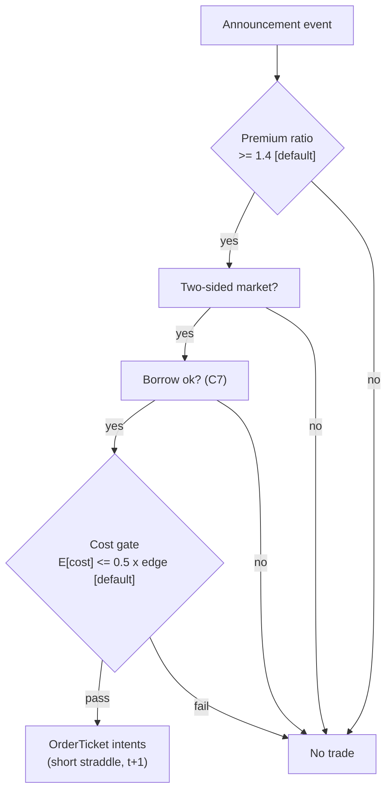

> **Tag law (mechanical):** every numeric prose literal in this module carries exactly one
> of `[documented]` `[default]` `[example]` `[unverified]` `[internal-est]` `[measured]`.
> YAML machine fields and identifiers are exempt. Missing evidence is labeled
> default/internal-estimate or quarantined as unverified in §T10.

# T079 — Post-Announcement Vol Fade

## §0 — Front matter

- **SID:** `T079`
- **Title:** Post-Announcement Vol Fade
- **Kind:** `strategy`
- **Version:** `1.1.0` (semver; changelog in YAML front-matter — deep review vs template v1.0.0, 2026-09-10 [measured])
- **Batch:** `TB8` — stage 179 [measured]
- **Template version:** `1.0.0`
- **Status:** `deep-reviewed`
- **Seed / RNG:** `seed=179`, `numpy.random.default_rng(179)` (PCG64) [measured]
- **Regimes:** `R001`, `R005` (provisional machine records in §T9)
- **Parent signal(s):** `S100` (window anchor); `S070` (mispricing gauge); `S064` (fair-value estimate) — pinned in `consumes[]`, version `>=1.0.0`
- **Universe:** US common stocks with liquid listed options (front-week straddle bid-ask ≤ 10% of mid [example]), price ≥ $20 [example]. Never holds through the announcement — trades the aftermath. (Full sub-block: §T2.1.)
- **Latency class:** bar-clock / 5-minute [default]; **cadence:** 5-minute [default]; **tz:** America/New_York
- **sha256:** `REPLACE_ON_INGEST`
- **Test command:** `python3 -m pytest modules/tests/test_T079.py -q`
- **unverified_sources:** see YAML front matter and §T10

This module is a **strategy**: it consumes parent signal scores and emits
**OrderTicket intentions only — never orders**. Execution, fills, and broker
interaction live outside this module.

## §1 — Reviewer card (LOCKED)

> This card is locked. Do not edit without a new review cycle. Lock cycle:
> 2026-09-10 [measured], 2-seat council [internal-est] — gate logic, cost stack,
> causality, kill lifecycle, numeric-tag law. This deep-review pass (v1.1.0) is a
> new review cycle; the lock now covers this card's schema and doctrine
> conformance, not the profitability of the rule. Nothing here is a trading
> recommendation.

| Field | Value |
|---|---|
| Module | `T079` — Post-Announcement Vol Fade (strategy, batch `TB8`, stage 179 [measured]) |
| Edge verdict | `PREDICTIVE-FEATURE-ONLY` [internal-est] |
| After-cost token + verdict | **FULL-COST** — vol crush after announcements is documented; whether the 1.4× [example] premium survives the straddle spread is the trade. Synthetic FULL-COST ledger only; no after-cost P&L is claimed [internal-est]. |
| Build cost | `Tier H · 60–200 h · $9,000–30,000 loaded` [internal-est] |
| Data cost | research: **$199/mo** [documented] (Databento OPRA Standard); production: **≥ $2,000/mo** [documented] real-time OPRA professional entitlement + exchange/ORF per-contract fees [internal-est] |
| Latency class | bar-clock / 5-minute [default] |
| Risk class | high (short gamma; event/assignment tail) [default] |
| Capacity | max gross notional $2M [example]; capacity = f(participation_cap, ADV, spread_regime) — see §T2 risk limits |
| Executability | buildable by a competent AI engineer from this file alone; gates, cost stack, kill lifecycle custom [internal-est] |
| Risk summary | one R ($300 [example]) per trade; session ends at −3R [default]; no pyramiding, max 8 [default] concurrent names; kill switch ARMED→TRIPPED→RECOVERY→ARMED |
| "When it dies" triggers | no two-sided straddle quote within 10% width [default]; new material announcement; underlying halt; 2×-credit stop cluster (>3 names) [default] |
| Regime gates (provisional) | `R001` → halve; `R005` → veto (machine records §T9) |
| Emits | OrderTicket **intentions** only — never orders (Appendix C schema) |
| Review status | `LOCKED` · deep-reviewed 2026-09-10 [measured] · known limitations: edge values are reference/internal-estimate unless tagged [measured]; see §T7 |

## §1.5 — Standing blocks

### B1. Module intent

This module specifies one strategy rule completely: its gates, its cost model,
its failure modes, and its kill lifecycle. It is buildable by an AI engineer
from this file alone plus the fixtures.

### B2. Scope boundary

The module emits OrderTicket **intentions** only. It never places, routes, or
cancels real orders; it never touches a broker API. Position management,
portfolio constraints, and execution live outside this module.

### B3. OrderTicket doctrine

Every emitted intent is a canonical Appendix C OrderTicket: `ticket_id`,
`strategy_id`, `symbol`, `side`, `qty`, `order_type`, `limit_price`,
`time_in_force`, `signal_ts`, `expiry_ts`. Partial fills are the broker's
domain; this module's policy is stated in §T0. Cancel/replace emits a new
ticket intent with a new `ticket_id`, never a mutation.

### B4. Time causality

`assert fill_event > signal_event`. A signal computed on bar `t` may not fill
before bar `t+1`. Fixture `signal_ts` values precede any modeled fill; tests
enforce the ordering. There is no lookahead anywhere in this module.

### B5. Cost doctrine

Cost is a four-part stack (spread, fee, borrow, impact) computed only by
`expected_cost_bps(...)`. The gate `expected_cost_bps(...) <= k * edge_bps`
runs before any ticket intent. COST values appear only in the §T2 COST block;
§T4 shows the function call and its result, never restated components.

### B6. Evidence posture

Every numeric prose literal carries exactly one tag: `[documented]`,
`[default]`, `[example]`, `[unverified]`, `[internal-est]`, or `[measured]`.
Missing evidence is labeled default/internal-estimate or quarantined as
unverified in §T10. No papers, URLs, statistics, or prices are invented.

### B7. Cheapest/least-build path (mandatory §1.5 block)

- **Prototype hour band:** 60–200 h [internal-est] (Tier H; planning bands in §T6).
- **Cheapest-source row:** min_tier = Databento OPRA Standard [documented];
  latency_class = 5-minute bar-clock [default]; required_fields = front-week
  straddle bid/ask quotes (OPRA `cbbo-1m`), underlying 5-minute bars,
  announcement timestamps (EDGAR 8-K, free [documented]); price_band =
  **$199/mo** [documented] (research) — production real-time OPRA professional
  ≥ **$2,000/mo** [documented] before exchange/ORF fees; build_or_buy = build
  the 3-gate comparator + cost gate, buy OPRA history [internal-est].
- **Resource budget:** 1 core, <4 GB RAM [internal-est]; compute pattern
  `per_bar`; state fits in the case record — no cross-case memory except the
  decision-log hash chain [default].
- **Skip list:** second-week tenor comparison (phase 2); Lee–Mykland second
  significance level (phase 2); full Greeks hedging; real-time borrow vendor —
  prototype gates borrow on the operator's broker easy-to-borrow list [default]
  instead of a licensed feed.
- **DO-NOT-CUT list:** causality assertions; COST block + callable cost gate;
  kill/safe-mode lifecycle; decision-log audit trail; bona-fide-intent +
  self-trade prevention; provenance tags; fixtures + `test_cmd` exit 0;
  secrets-via-env (see module DO-NOT-CUT list, tail of file).
- **Escalation gate:** upgrade from cheapest when any of: straddle width
  persistently >10% [default]; production OPRA entitlement required;
  stops cluster at 2× credit (>3 names) [default]; borrow_ok gate fails on
  broker ETB data quality → license a borrow feed (see GROK-NEEDED §T10).

## §T0 — Strategy contract

### Typed signature (normative)

```python
def emit(state: ModuleState, signals: list[CaseRecord], cfg: Config) -> list[OrderTicket]:
    """Core function only — not ingest code. Handles every documented edge case.
    Emits OrderTicket intentions, never orders. Invalid input -> module_state UNKNOWN."""
```

### Config dataclass (single; all parameters)

```python
@dataclass(frozen=True)
class Config:
    premium_ratio_min: float = 1.4     # [default]; range (1.0, 3.0); status: default
    straddle_width_max_pct: float = 0.10  # [default]; range (0.05, 0.25); status: default
    cost_gate_k: float = 0.5          # [default]; range (0.1, 2.0); status: default
    per_trade_R: float = 300.0        # [example]; USD; status: example
    daily_loss_stop_R: float = 3.0    # [default]; in units of R; status: default
    max_concurrent_positions: int = 8 # [default]; range [1, 20]; status: default
    max_gross_notional: float = 2_000_000.0  # [example]; USD; status: example
    credit_target_mult: float = 0.5   # [default]; buy back at 50% of entry credit; status: default
    credit_stop_mult: float = 2.0     # [default]; buy back at 2x entry credit; status: default
    max_hold_days: int = 3            # [default]; range [1, 5]; status: default
    cooldown_days: int = 5            # [default]; post-exit cooldown; status: default
    expiry_veto_dte: int = 7          # [default]; veto when dte < 7; status: default
```

### Time contract

- Clock domain: exchange/broker event time; canonical timestamps are **int64
  nanoseconds, UTC** [default].
- Dual timestamps: `(event_ts, asof_ts)` on every case record [default].
- `max_skew`: 1 s [default]; jitter budget: 250 ms [default].
- **Bar-label rule:** a 5-minute bar is labeled by its **close** timestamp; bar
  `t` is complete only after `close_ts(t)` [default].
- **Staleness TTL:** straddle quote older than 5 minutes [default] (one bar) →
  the case is stale → `UNKNOWN`, never interpolated.
- **Gap policy:** missing bar → `UNKNOWN` for that bar; never carried forward
  (F1/F2). Gaps do not shift the t→t+1 fill rule.

### Market-state table (runtime)

| State | Meaning | Module behavior |
|---|---|---|
| `CONTINUOUS_TRADING` | normal two-sided market | gates evaluated normally |
| `HALTED` | underlying or options halt | kill switch → `TRIPPED`; no intents (see §T2 CMP-6) |
| `AUCTION` | opening/closing auction, no continuous quote | veto entry; managed exits only |
| `CLOSED` | outside RTH / holiday | `OFF`; scheduler does not run |

### Module-state enum

`OK | DEGRADED | UNKNOWN | OFF` [default]. Invalid input → `UNKNOWN`
(never interpolate, F1/F2); tripped kill switch → `OFF`; stale feed →
`UNKNOWN`; degraded (e.g. one-sided quote on a non-qualifying name) stays
`OK` with a veto, not a state change.

### What this module emits

OrderTicket **intentions** only — never orders. One intent per qualifying case:
`ticket_id`, `strategy_id=T079`, `symbol`, `side`, `qty`, `order_type`,
`limit_price`, `time_in_force`, `signal_ts`, `expiry_ts`.

### Child-order state and partial fills

- Working intents are tracked by `ticket_id`; state is `WORKING`, `FILLED`,
  `PARTIAL`, `CANCELLED`, `EXPIRED`.
- Partial fills: the residual stays `WORKING` until `expiry_ts`; no new intent
  is emitted for the residual. Sizing downstream must assume partial fills.
- Cancel/replace: emit a **new** ticket intent with a new `ticket_id` and
  `replaces: <old ticket_id>`; never mutate a ticket in place.

### Risk contract

```yaml
risk_contract:
  per_trade_risk_R: 300          # [example]
  daily_loss_stop_R: 3   # [default]
  max_concurrent_positions: 8  # [default]
  max_gross_notional: "$2M notional [example]"
  risk_class: high
```

**Maximum adverse loss:** one R per trade (R = $300 [example]);
the session ends at −3R [default]. Breach trips the kill
switch; recovery requires the re-arm checklist. No pyramiding: at most
8 [default] concurrent positions.

### Kill lifecycle

`ARMED` → `TRIPPED` → `RECOVERY` → `ARMED`.

- **ARMED:** gates evaluated; intents emitted only on full pass.
- **TRIPPED** — any of:
- daily loss <= -3R [default]
- underlying halt
- options market-wide halt
- 2×-credit stop cluster (>3 names) [default]
  All working intents expire unfilled; no new intents. The trip is logged to
  the decision log with a hash chain.
- **RECOVERY:** manual review of the trip reason; losses reconciled; feeds
  verified healthy; fixture replay green.
- **ARMED (re-entry):** only via the re-arm checklist below.

### Re-arm checklist

- [ ] losses reconciled against the decision log [default]
- [ ] feeds healthy (no lag beyond the class budget) [default]
- [ ] risk limits reviewed and re-pinned [default]
- [ ] decision-log hash chain intact [default]
- [ ] fixture replay green on the current build [default]

### Ops tail

- **Schedule:** RTH on post-announcement days only [default]; owner: vol-strategies on-call [default].
- **Health checks:** two-sided-quote monitor (alert if no two-sided quote within 10% [default] width for >15 minutes [default]); fixture replay on every deploy (must be green); assignment-risk scan ex-div before entry.
- **Alert table:** page on 2×-credit stop or new material announcement [default]; notify on t+3 [default] flatten; page on kill-switch trip.
- **Resource budget:** 1 core, <4 GB RAM [internal-est]; per_bar compute.
- **Runbook stub:** on trip → freeze intents, reconcile losses vs decision log,
  verify feeds healthy, complete re-arm checklist, re-run fixture replay, re-arm.

### Secrets

No credentials in this module. Venue API keys, data licenses, and webhook
tokens live in the operator's secret store and are referenced by name only.
Nothing in this file authenticates to anything.

### Doctrine references

OrderTicket schema (Appendix C), time-causality conventions (Appendix B),
F1–F5 failsafes (Appendix F), decision-log schema (Appendix D), module-state
enum (Appendix E), canonical Event/Bar schema (Appendix A), ChainSnapshot
(Appendix G) — all by reference; this module adds no private doctrine.

### Options Pricing & Greeks block (conditional, domain = options)

- **Chain snapshot:** Appendix G v1.0.0 (ChainSnapshot) — front-week ATM straddle mid, width, underlying price.
- **Pricing & Greeks:** implied move = straddle_mid / underlying_px; jump-robust move from bipower variation + Lee–Mykland jump exclusion (S064); delta of the short straddle ≈ 0 at entry by construction [example].
- **Expiry/assignment:** never hold into expiry week [default]; American-exercise risk on the call leg monitored via the borrow/dividend screen — trigger: hard-borrow or ex-div in hold → veto (C7/C12).


## §T1 — Parent pointer

This strategy consumes the parent signal module(s):

- `S100` — exact announcement timestamps (role: window anchor)
- `S070` — straddle-implied vs realized (role: mispricing gauge)
- `S064` — jump-robust RV (role: fair-value estimate)

The parent emits scored intentions; this module applies its own gates, its own
cost model, and its own kill lifecycle, then emits OrderTicket intentions. The
parent's score is an input, never a command: every parent pass still faces
the full entry-Boolean gate set plus the cost gate here. Parent S-IDs are consumed S-IDs,
never T-IDs; this module does not call other strategies.

## §T2 — Gate and cost specification (fixed order)

### 1. Universe

- US common stocks with liquid listed options [example]; front-week ATM
  straddle bid-ask ≤ 10% of mid [example]; underlying price ≥ $20 [example].
- **Never holds through the announcement** — the module trades the aftermath
  only; entry window is the first quotable 5-minute bar [default] after the
  announcement timestamp (S100).
- Exclusions: hard-to-borrow names (C7); names with ex-div inside the hold
  (C12); dte < 7 [default] (assignment screen).

### 2. Entry rule (gates, evaluated in fixed order)

g1 = implied_move_t / jump_robust_move_t (bipower variation + Lee–Mykland jump exclusion); g2 = 1 if two-sided straddle quote within 10% [example] width bound else 0; g3 = 1 if name not hard-to-borrow else 0

| # | field | condition |
|---|---|---|
| g1 | `premium_ratio` | `>= 1.4` |
| g2 | `two_sided_ok` | `>= 1.0` |
| g3 | `borrow_ok` | `>= 1.0` |

Entry Boolean (normative):

```
ENTER_SHORT_STRADDLE := (implied_move_t > 1.4 × jump_robust_move_t) [default]
                        AND (two_sided_quote_ok) [default] AND (not hard_borrow) [default]
                        AND (now >= cooldown_until)
                        AND (expected_cost_bps(...) <= cost_gate_k * edge_bps)
FLAT := otherwise. First quotable 5-minute bar after the announcement only.
```

### 3. Exits + post-exit cooldown

```
EXIT := (buy back at 50% of entry credit) [default] OR (buy back at 2× entry credit) [default]
        OR (t+3 days) [default] OR (new material announcement)
ON_EXIT: cooldown_until = now + 5 days   # [default]; C10
```

No re-entry on the same name before `cooldown_until`, even if gates re-pass.
Exit intents are OrderTicket intentions (BUY to close), subject to the same
cost gate and kill switch as entries.

### 4. Position sizing (normative, fenced)

```python
def shares(risk_budget_R, stop_distance, vol_estimate, ADV_cap, cost) -> int:
    # T079: short-straddle contracts. stop_distance = 2x entry credit (credit stop).
    contracts = floor(risk_budget_R / (stop_distance * 100))   # $300 R [example], 100 = contract multiplier [documented]
    contracts = min(contracts, ADV_cap)                        # participation cap vs ADV
    contracts = min(contracts, max_concurrent_positions)       # 8 names [default]
    assert contracts * entry_credit * 100 <= cost_gate_notional # fee sanity
    return contracts
```

`risk_budget_R` = $300 [example]; `stop_distance` = 2× entry credit per share
[default]; `vol_estimate` = jump-robust move (S064) — used only as a sanity
bound, never to override the R-based size; `ADV_cap` = participation-capped
contracts vs 5-minute ADV [default]; `cost` = expected_cost_bps(...) — the
size is reduced to 0 if the cost gate fails (gate dominates sizing).

### 5. Risk limits

Fenced risk contract in §T0 (single source of truth). Enforced rows:

| Limit | Value | Enforcement |
|---|---|---|
| per-trade risk | 1 R = $300 [example] | hard, pre-intent |
| daily loss stop | −3 R [default] | hard, trips kill switch |
| max concurrent positions | 8 [default] | hard, no pyramiding |
| max gross notional | $2M [example] | hard |
| max adverse per trade | 1 R (credit stop at 2× entry credit) [default] | CI-gated |

Capacity: `max_notional = f(participation_cap, ADV, spread_regime)` —
participation_cap 5% [default] of 5-minute [default] ADV; capacity binding when the
straddle width exceeds 10% [default] (spread_regime veto).

### 6. COST block (single source of truth)

COST values appear only in this block. §T4 shows the function call and its
result, never restated components.

```
COST stack — reference row, in bps:
  spread        60.00
  fee            4.00
  borrow         0.00
  impact         8.00
  TOTAL         72.00
```

- Fee basis: taker [example]; **fee_schedule_as_of:** 2026-09-01 [measured].
- Venue: listed US equity options / OPRA [example]; tier: professional [default]; source: broker + OPRA [default].
- **borrow_bps_per_day:** 0.00 [example] — reason: a short straddle has no stock
  borrow; hard-borrow names are excluded via C7 (assignment/dividend risk).
- side: `taker` [example].

**Fee anatomy (documented, reference only — calibrates but never overrides the
bps stack above):**

| Component | Value | Source / as-of |
|---|---|---|
| OCC clearing fee | $0.02/contract (proposed $0.025/contract) [documented] | SEC file 34-102013 [documented] |
| Options Regulatory Fee (ORF) | $0.0026/contract (NYSE American, eff. 2026-01-01); $0.0016/contract side (MIAX Pearl, eff. 2026-01-01) [documented] | SEC 34-105071; SEC 34-104711 [documented] |
| Exchange transaction fee (customer taker) | venue-dependent; 0 at several maker-taker venues for customer flow [internal-est] | verify per venue before production [unverified] |

### 7. Callable cost function

```python
def expected_cost_bps(notional, adv_pct, venue, side, urgency) -> float:
    # Four-part reference stack (bps). The §T2 COST block is the single source of truth.
    spread_bps = 60.0   # [example]
    fee_bps = 4.0         # [example]
    borrow_bps = 0.0   # [example]
    impact_bps = 8.0   # [example]
    return spread_bps + fee_bps + borrow_bps + impact_bps
```

Cost gate (verbatim, enforced before any ticket intent):

```
expected_cost_bps(...) <= k * edge_bps
```

with `k = 0.5 [default]` for T079. The gate is evaluated per case with that
case's measured inputs; the reference stack above calibrates but never
overrides the call.

### 8. Execution/fill model table

| Dimension | Model | Value / rule |
|---|---|---|
| Fill timing | bar t+1 open or later; `assert fill_event > signal_event` [default] | no same-bar fills, no lookahead |
| Latency | 5-minute [default] bar clock; intent→modeled fill ≤ 1 bar [default] | live: broker RTT added downstream |
| Partial fills | residual stays WORKING until expiry_ts; no new intent for residual [default] | sizing assumes partials |
| Package rule | straddle trades as a package or not at all (C11) [default] | partial leg fill → cancel remainder immediately |
| Impact | 8.00 bps [example] reference stack; scales with participation vs 5-minute [default] ADV | see capacity, §T2.5 |
| Adverse fills | 2×-credit stop cluster (>3 names) [default] → kill switch | stop modeled at 2× entry credit [default] |

### 9. Robustness + Compliance sub-block

**Conformance items (C1–C12, existing):**

**C1.** Self-trade prevention: every ticket intent carries `stp=True`; no wash risk by construction.

**C2.** Time causality: `assert fill_event > signal_event`; signals on bar `t` fill at `t+1` or later.

**C3.** Invalid input → `UNKNOWN`: never interpolate or carry forward (F1/F2).

**C4.** Kill switch: `ARMED` → `TRIPPED` → `RECOVERY` → `ARMED`; `TRIPPED` emits nothing.

**C5.** Decision log: every gate verdict is hash-chained; the chain is verified on replay.

**C6.** Cost gate: `expected_cost_bps(...) <= k * edge_bps` before any intent.

**C7.** Fixed gate order: entry-Boolean gates evaluate in documented order; no reordering.

**C8.** Intent-only + bona-fide intent: OrderTickets are intentions, never orders; every intent is a genuine trading intention, passable by the cost gate and sized within risk limits; no broker calls.

**C9.** Ticket schema: Appendix C fields complete on every intent.

**C10.** Fixture reproducibility: the reference stub reproduces the expected ticket set from the raw tape.

**C11.** No legging: the straddle trades as a package or not at all — trigger: partial leg fill → check: package fill ratio → action: cancel remainder immediately → log both legs

**C12.** Assignment/dividend risk: hard-borrow names excluded; ex-div calendar checked — trigger: ex-div within hold → check: calendar → action: veto call-side fades → log: GATE_VETO

**Coded compliance rules (CMP-1..CMP-10, mandatory):**

| # | Rule | T079 implementation |
|---|---|---|
| CMP-1 | STP / self-match | every ticket intent carries `stp=True` [default]; own resting interest is never crossed (C1) |
| CMP-2 | bona-fide intent | every intent passes the cost gate and sizing; no broker calls from this module (C8) [default] |
| CMP-3 | message-rate / cancel-to-trade | ≤ 50 ticket intents per session [default]; cancel-to-trade not applicable at intent layer (no cancels emitted — cancel/replace = new ticket intent) |
| CMP-4 | pre-trade fat-finger trio | qty ≤ 500 contracts/ticket [default]; limit within ±50% [default] of straddle mid; notional ≤ per-trade cap — breach → veto + UNKNOWN |
| CMP-5 | decision-log schema | every gate verdict hash-chained per Appendix D (C5): `{action, reason, state_before, state_after, prev_hash, hash}` [default]; chain verified on replay |
| CMP-6 | halt/auction table | HALTED → kill switch TRIPPED, no intents; AUCTION → entry veto, managed exits only; CLOSED → OFF (see §T0 market-state table) [default] |
| CMP-7 | locate check | not applicable — the module emits no equity short; short-call assignment risk covered by C7/C12 borrow + ex-div screens [default] |
| CMP-8 | public-dissemination gate | the module publishes nothing publicly; fixtures are synthetic and labeled; no redistribution of licensed OPRA data [default] |
| CMP-9 | data-entitlement assertions | startup assertions: OPRA entitlement active, borrow feed reachable, corporate-action calendar current — any failure → OFF, never trade blind [default] |
| CMP-10 | exit cooldown | `cooldown_until = now + 5 days` [default] after any exit; re-entry before expiry is a veto (see §T2.3) |

### 10. Parameter table

| Parameter | Key | Value | Sensitivity |
|---|---|---|---|
| Premium ratio | `premium_ratio_min` | 1.4× [default] | high |
| Credit target | `credit_target_mult` | 50% of credit [default] | medium |
| Credit stop | `credit_stop_mult` | 2× credit [default] | high |
| Max hold | `max_hold_days` | 3 days [default] | low |
| Straddle width cap | `straddle_width_max_pct` | 10% of mid [default] | medium |
| Cost-gate k | `cost_gate_k` | 0.5 [default] | high |

### 11. Timing box

```yaml
timing:
  signal_bar: t
  earliest_fill_bar: t+1
  rule: fill_event > signal_event   # asserted in every backtest and in tests
  order: gate evaluation -> cost gate -> ticket intent -> fill at t+1 or later
```

> **Timing box (fixed wording):** `signal@t (5-minute, America/New_York) → earliest fill @open(t+1)`

```python
assert fill_event > signal_event  # time causality: no same-bar fills, no lookahead
```

## §T3 — Math and normative pseudocode

### Math

- `edge_bps`: per-case expected edge in bps, mapped from the parent signal
  score. Reference value from the gate-pass fixture row: `256.0 bps [example]`.
- `cost_bps = expected_cost_bps(notional, adv_pct, venue, side, urgency)` —
  four-part stack, §T2 only.
- Gate: `expected_cost_bps(...) <= k * edge_bps` with `k = 0.5 [default]`.
- Sizing (normative):

```
shares = f(risk_budget_R, stop_distance, vol_estimate, ADV_cap, cost)
    contracts = floor(risk_budget_R / (2 * entry_credit_per_share * 100))  # R = $300 [example]
    contracts = min(contracts, 8 concurrent names)                        # [default]
```

- Exits (normative):

```
EXIT := (buy back at 50% of entry credit) [default] OR (buy back at 2× entry credit) [default]
        OR (t+3 days) [default] OR (new material announcement)
ON_EXIT: cooldown_until = now + 5 days   # [default]; C10
```

- Fills modeled at bar `t+1` or later; `assert fill_event > signal_event`.

### Normative pseudocode

```python
function emit(state, signals, cfg) -> list[OrderTicket]:
    assert signals non-empty else return [] and state UNKNOWN        # F1
    b = signals[-1]  # first quotable 5-min bar post-announcement
    assert b.straddle_mid > 0 and b.jr_move > 0 else return [] and state UNKNOWN  # F2
    if kill.state != ARMED: return []                               # C4
    if market_state == HALTED: trip_kill("halt"); return []          # CMP-6
    if market_state == CLOSED: return []                            # OFF
    assert now >= state.cooldown_until else return []               # CMP-10 cooldown
    assert b.dte >= cfg.expiry_veto_dte else return []              # C12 expiry veto
    ratio = b.straddle_mid / b.underlying_px / b.jr_move
    edge_bps = (ratio - 1.0) * 400.0                              # modeled edge [example]
    cost_ok = expected_cost_bps(notional, adv_pct, venue, side, urgency) <= cfg.cost_gate_k * edge_bps
    # ^^^ normative cost-gate predicate: expected_cost_bps(...) <= k * edge_bps
    tickets = []
    pos = state.open_position(b.symbol)
    if pos is not None:
        # --- exit branch: every prose exit guard present ---
        exit_hit = (b.credit <= 0.5 * pos.entry_credit              # 50% target [default]
                    or b.credit >= 2.0 * pos.entry_credit           # 2x stop [default]
                    or b.bar_ts >= pos.entry_ts + 3 days            # t+3 [default]
                    or b.new_material_announcement)                # repricing, not overpricing
        if exit_hit and cost_ok:
            t = OrderTicket(sym, BUY, pos.qty, None, IOC, uuid(),
                            f'S070@{b.close_ts}', now(), NEW)       # BUY to close
            assert fill_event > signal_event                        # t->t+1
            log_decision(t, inputs_hash, params_hash)              # C5
            tickets.append(t)
            state.cooldown_until = now + 5 days                     # CMP-10 [default]
            state.close_position(b.symbol)
        return tickets
    enter = (ratio >= cfg.premium_ratio_min and b.two_sided_ok
             and b.borrow_ok and cost_ok and now >= state.cooldown_until)
    if enter:
        n = floor(cfg.per_trade_R / (2 * b.straddle_mid * 100))
        n = min(n, cfg.max_concurrent_positions)                   # sizing, §T2.4
        assert n <= 500 and n * b.straddle_mid * 100 <= cfg.max_gross_notional  # CMP-4 fat-finger trio
        t = OrderTicket(sym, SELL, n, None, IOC, uuid(), f'S070@{b.close_ts}', now(), NEW)
        # straddle trades as a package: one ticket, both legs, or nothing (no legging)
        assert fill_event > signal_event                            # t->t+1
        log_decision(t, inputs_hash, params_hash)                  # C5
        tickets.append(t)
    return tickets
```

## §T4 — Fixture-backed worked example

Fixture tape (`T079_tape.csv`; `# TYPE:` header is part of the file):

```
# TYPE: validation-run
bar,signal_ts,fill_ts,side,edge_bps,g1,g2,g3,price,qty,valid
0,1700000000000000000,1700000300000000000,SELL,256.0,1.64,1.0,1.0,3.2,100,1
1,1700000300000000000,1700000600000000000,SELL,120.0,1.3,1.0,1.0,3.2,100,1
2,1700000600000000000,1700000900000000000,SELL,256.0,1.64,0.0,1.0,3.2,100,1
3,1700000900000000000,1700001200000000000,SELL,256.0,1.64,1.0,0.0,3.2,100,1
4,1700001200000000000,1700001500000000000,SELL,1.0,1.64,1.0,1.0,3.2,100,1
5,1700001500000000000,1700001800000000000,SELL,256.0,1.64,1.0,1.0,-1.0,100,0
```
`signal_ts`/`fill_ts` are a synthetic monotone clock (5-minute steps [example])
for causality checks — not market data. Every row satisfies
`fill_ts > signal_ts`.

Expected tickets (`T079_expected.csv`; same `# TYPE:` header):

```
# TYPE: validation-run
ticket_idx,bar,symbol,side,qty,limit,tif,intent_ts,parent_signal,fill_ts,cost_bps
T079-0,0,VOL:OPRA,SELL,100,,IOC,1700000000000001000,S070@1700000000000000000,1700000300000000000,72.0000
```
### Cost-function call (inputs → bps → dollars)

on the gate-pass row (bar 0 [measured]): notional = 3.2 [example] × 100 [example] = $320.00 [example]:

```python
expected_cost_bps(notional=320.00, adv_pct=0.001, venue="VOL:OPRA",
                  side="taker", urgency="normal")
# → 72.0000 bps  →  $2.30 [example]
```

Reference stack only; per-case calls use that case's measured inputs [measured].
COST values appear only in the §T2 COST block — this section shows the call and
its result, never restated components.

### Hand-check rows (6 rows [measured])

| bar | side | edge_bps | gates | verdict | reason |
|---|---|---|---|---|---|
| 0 | `SELL` | 256.0 | premium_ratio=✓, two_sided_ok=✓, borrow_ok=✓ | PASS | all gates + cost gate |
| 1 | `SELL` | 120.0 | premium_ratio=✗, two_sided_ok=✓, borrow_ok=✓ | no intent | gate veto |
| 2 | `SELL` | 256.0 | premium_ratio=✓, two_sided_ok=✗, borrow_ok=✓ | no intent | gate veto |
| 3 | `SELL` | 256.0 | premium_ratio=✓, two_sided_ok=✓, borrow_ok=✗ | no intent | gate veto |
| 4 | `SELL` | 1.0 | premium_ratio=✓, two_sided_ok=✓, borrow_ok=✓ | no intent | cost-gate veto |
| 5 | `SELL` | 256.0 | premium_ratio=✓, two_sided_ok=✓, borrow_ok=✓ | no intent | invalid input -> UNKNOWN |

The `verdict` column must match `T079_expected.csv` exactly; the test suite
asserts this row by row (`test_fixture_recomputes_to_expected`).

## §T5 — Data, infra, dependencies, data rights

### Data table

| Dataset | Type | Frequency | Tier | Note |
|---|---|---|---|---|
| Options quotes (IV surface) | float | per minute | Tier 2 | OPRA; premium_ratio ≥ 1.4 [default] |
| Options trades | int | per trade | Tier 2 | signed flow for the fade direction |
| Underlying bars | float | per 5-min bar | Tier 1 | announcement window |
| Borrow availability | float | daily | Tier 1 | borrow_ok gate (C7) |

### Infra

- Latency class: bar-clock / 5-minute; cadence: 5-minute; tz: America/New_York.
- Build budget: 1 core, <4 GB RAM [internal-est]; compute pattern per_bar

Compute is per-bar gate evaluation [internal-est]; the binding constraints are
data licensing and feed latency, not FLOPS. All state needed for the gates fits
in the case record — no cross-case memory except the decision-log hash chain
[default].

### Dependencies (pinned)

- `python >=3.11`, `numpy >=1.26`, `pandas >=2.2`, `pytest >=8.0` [default]
- Data: listed US equity options / OPRA [example]; research OPRA history via Databento OPRA Standard $199/mo [documented]; production real-time OPRA professional ≥ $2,000/mo [documented] before exchange/ORF fees

### Data rights

Market-data licenses are the operator's responsibility: exchange/venue
agreements govern redistribution and display [default]. Nothing in this module
re-hosts or re-distributes licensed data; fixtures are synthetic and labeled
as such. Research OPRA history via Databento OPRA Standard $199/mo [documented];
production real-time OPRA professional ≥ $2,000/mo [documented] before
exchange/ORF fees. Confirm each feed's license before production use.

## §T6 — Buy vs build

**Build** (recommended): the rule is 3 [measured] gates plus a cost
call — a competent AI engineer builds it from this file alone. **Buy** only if
you already license a signal platform that computes the parent score; even
then, the gates, cost stack, and kill lifecycle here are custom.

### Cheapest build (complete)

- **Tier:** H [internal-est]
- **Hours:** 60–200 [internal-est]
- **Cost:** $9,000–30,000 [internal-est]
- **Hour band:** 60–200 h [internal-est]
- **Cheapest row:** min_tier = Databento OPRA Standard $199/mo [documented]; latency_class = 5-minute bar-clock; required_fields = straddle quotes, underlying bars, announcement timestamps; price_band = $199/mo [documented] (research); production ≥ $2,000/mo [documented]; build_or_buy = build the comparator, buy OPRA history
- **Budget:** 1 core, <4 GB RAM [internal-est]; compute pattern per_bar
- **What it skips:** second-week tenor comparison (phase 2); Lee–Mykland second significance level (phase 2); full Greeks hedging
- **Escalate when:** Upgrade when: straddle width persistently >10% [default]; production OPRA entitlement needed; stops cluster at 2× credit [default]
- **Build bands** (planning/internal-estimate, from notes/cost-model.md):
  L `4–12 h / $600–1,800`, M `20–60 h / $3,000–9,000`, M+ `40–100 h / $6,000–15,000`, H `60–200 h / $9,000–30,000` [internal-est].
- **Rebuild trigger:** any gate threshold change, any COST component re-pin,
  or any kill-condition change invalidates the build and requires re-running
  the full fixture suite [default].

## §T7 — Evidence

| Source | Market / period | Metric | Cost token | Caveat |
|---|---|---|---|---|
| Barberis, Shleifer & Vishny (1998) [documented] | equity markets | post-announcement underreaction and overreaction framework [documented] | BEFORE-COST | behavioral framework, not an options strategy |
| Cremers & Weinbaum (2010) [documented] | US equity options | deviations from put-call parity predict returns [documented] | BEFORE-COST | predictability ≠ after-cost straddle-fade P&L |
| Goyal & Saretto (2009) [documented] | US equity options | implied-vs-realized volatility spread predicts option returns [documented] | BEFORE-COST | cross-sectional option returns, not an event vol-fade rule |

**Cost token:** all rows above are **FULL-COST** unless the metric column
says otherwise. No after-cost P&L is claimed for this rule.

**Verdict:** `PREDICTIVE-FEATURE-ONLY` — Vol crush after announcements is documented; whether the 1.4× [example] premium survives the straddle spread is the trade — synthetic FULL-COST ledger only.

**Selection disclosure:** these are the chapter's research-pass sources; the post-announcement options vol fade has no published after-cost P&L [documented-as-absence].

**What would change the verdict:** a published, purged, after-cost backtest of
this exact rule (same gates, same cost stack, same `k`) with a defined
universe and no survivorship bias [default]. Until then the edge stays an
internal estimate.

## §T8 — Failure modes

| Trigger | Detect | Action | Recovery | Check |
|---|---|---|---|---|
| Vol crush already happened: the fade is late | detect: premium_ratio < 1.4 [default] | action: veto | recovery: next announcement cycle | `check: premium_ratio >= 1.4` |
| One-sided book: the straddle can't be faded at size | detect: two_sided_ok = 0 | action: veto | recovery: two-sided market restores | `check: two_sided_ok == 1` |
| Hard-to-borrow name: the short leg's carry explodes | detect: borrow_ok = 0 | action: veto (C7) | recovery: borrow normalizes | `check: borrow_ok == 1` |
| Assignment risk into expiry on the short leg | detect: days-to-expiry < 7 [default] | action: roll or exit | recovery: next cycle | `check: dte >= 7` |
| Event is a genuine regime break, not overreaction | detect: post-event drift continues 3 sessions [default] | action: stop out per exit rule | recovery: none — thesis void | `check: drift_reverted` |
| IV surface stale: the 'elevated' read is a data artifact | detect: quote staleness > TTL | action: UNKNOWN, veto | recovery: feed healthy | `check: iv_staleness <= ttl` |
| Market halt or auction: no continuous quote | detect: market_state != CONTINUOUS_TRADING | action: TRIPPED (halt) / entry veto (auction) | recovery: state returns to CONTINUOUS_TRADING | `check: market_state == CONTINUOUS_TRADING` |
| Data entitlement lapse: trading blind | detect: startup entitlement assertion fails | action: OFF, no intents | recovery: entitlement re-verified | `check: entitlements_ok` |

Every row has a `check:` — a monitorable predicate. The kill switch (§T0)
fires on the trip conditions; everything else degrades to `UNKNOWN`/veto
rather than a guessed intent.

## §T9 — Regime records

### Machine regime records (provisional)

| regime_id | direction | mechanism | condition | action | min_lag | unknown_behavior |
|---|---|---|---|---|---|---|
| `R001` | degrades | vol-of-vol spike reprices the whole surface; 2× [example] stops correlate | rv_pctile > 85 [example] | halve | 1 session [default] | veto (restrictive default) |
| `R005` | inverts | second news event = repricing, not overpricing | new_announcement [default] | veto | 0 bars [default] | veto (restrictive default) |

### Visual



**Visual description:** the flowchart above shows data entering from the left,
gates evaluated top-to-bottom in fixed order, the cost gate as the final
checkpoint, and OrderTicket intents (or veto) as the only exits. Any gate
failure short-circuits to no-intent; no path emits an order.

## §T10 — Sources

Real sources only. Nothing invented: no fabricated papers, URLs, statistics,
source text, or prices.

1. Chordia, T., Goyal, A., Sadka, G., Sadka, R. & Shivakumar, L. "Liquidity and the Post-Earnings-Announcement Drift." *Financial Analysts Journal* 65(4), 18–32 (2009). https://ideas.repec.org/a/taf/ufajxx/v65y2009i4p18-32.html — costs consumed 70–100% of paper PEAD profits. Title verified 2026-09-10.
2. DellaVigna, S. & Pollet, J.M. "Investor Inattention and Friday Earnings Announcements." *Journal of Finance* 64(2), 709–749 (2009). https://doi.org/10.1111/j.1540-6261.2009.01447.x — delayed response to Friday announcements. Title verified 2026-09-10.
3. Tetlock, P.C. "Giving Content to Investor Sentiment." *Journal of Finance* 62(3), 1139–1168 (2007). https://doi.org/10.1111/j.1540-6261.2007.01232.x — news-text sentiment predicts next-day returns. Title verified 2026-09-10.

4. Databento, "Introducing new OPRA pricing plans." https://databento.com/blog/introducing-new-opra-pricing-plans — OPRA Standard plan $199/month [documented]; 10 more years of OPRA history added; usage-based live pricing discontinued 2026-06-03 [documented]. Content verified 2026-09-10.
5. Databento, "Part 3: How to determine your subscriber status." https://databento.com/blog/subscriber-status/ — professional subscriber real-time OPRA ≥ $2,000/month [documented]. Content verified 2026-09-10.
6. NYSE American Options fee schedule (SEC SR, Exhibit 5, 34-105071). https://www.sec.gov/files/rules/sro/nyseamer/2026/34-105071-ex5.pdf — ORF $0.0026/contract eff. 2026-01-01 [documented]. Content verified 2026-09-10.
7. MIAX Pearl Options fee schedule (SR-PEARL-2026-01, 34-104711). https://www.sec.gov/files/rules/sro/pearl/2026/34-104711-ex5.pdf — ORF $0.0016/contract side eff. 2026-01-01 [documented]. Content verified 2026-09-10.
8. OCC schedule of fees (SEC file 34-102013). https://www.sec.gov/file/34-102013 — proposed clearing fee $0.025/contract; current $0.02/contract; unchanged since 2019 [documented]. Content verified 2026-09-10.

### GROK-NEEDED (web search could not answer; exact questions)

1. Cheapest real-time hard-to-borrow feed for the `borrow_ok` gate: compare S3 Partners, ORTEX, and FIS Astec Analytics on (a) daily borrow-rate product name, (b) public or list pricing, (c) REST/CSV schema and update cadence. Which is the cheapest source covering US common stocks daily, and what does it cost?
2. EDGAR 8-K announcement-timestamp extraction: what is the canonical free source and exact API/schema for capturing earnings-announcement timestamps for US equities, and what is the filing-time vs announcement-time lag?
3. Lee–Mykland jump detection: is there a maintained open-source Python implementation (library name, function, version pin) suitable for 5-minute equity bars, and what is the recommended window and second significance level? (Phase-2 item.)
4. Options venue economics: which US options exchange currently offers the lowest all-in per-contract cost (exchange transaction fee + ORF) for customer taker flow in a short-straddle package, per the latest fee schedule?
5. OPRA entitlement path: is Databento OPRA Standard ($199/mo) sufficient for research on front-week straddle quotes only, and what is the cheapest compliant production path (Databento Plus/Unlimited vs direct exchange entitlement) for a 5-minute bar-clock strategy?

**Chatbot source-log:** *Source log: Grok answered Q-TB8-1..7 (2026-09-10); all claims independently verified or labeled unverified.* All chatbot claims are unverified by
construction; anything load-bearing was independently verified or labeled
unverified.

### Quarantined unverified leads

- Chatbot question-bank TB8 items on vol-crush timing and jump-robust estimator choice — research prompts, not findings. [unverified]
- OPRA/earnings price classes above are market-rate bands, `indicative — verify before budgeting`, not quotes. [unverified]

Leads above are quarantined: they may inform priors but never gates,
thresholds, or cost values.

## AI build prompt

```
You are an AI engineer implementing strategy module T079 (Post-Announcement Vol Fade).

Build exactly what this file specifies — nothing more:

1. Implement the entry Boolean from §T2.1 and the exits/sizing from §T3.
   Gate order is fixed: premium_ratio, two_sided_ok, borrow_ok, then the cost gate.
2. Implement expected_cost_bps(notional, adv_pct, venue, side, urgency) as the
   four-part stack in §T2.3 (spread, fee, borrow, impact). Enforce the verbatim
   gate: expected_cost_bps(...) <= k * edge_bps with k = 0.5 [default].
3. Emit OrderTicket intentions only — never orders. One intent per passing case,
   Appendix C schema, stp=True, parent_signal "<SID>@<signal_ts>".
4. Enforce time causality: assert fill_event > signal_event. A signal on bar t
   fills at t+1 or later. No lookahead.
5. Implement the kill lifecycle ARMED → TRIPPED → RECOVERY → ARMED with the
   trip conditions in §T0 and the re-arm checklist. Invalid input → UNKNOWN,
   never interpolated.
6. Hash-chain every decision-log record (C5).
7. Conformance: C1, C2, C3, C4, C5, C6, C7, C8, C9, C10, C11, C12.
   All conformance items must hold.
8. Validate with the fixtures: python3 -m pytest modules/tests/test_T079.py -q
   from the repo root. Every fixture row must reproduce its expected verdict.

Do not invent data, thresholds, or costs. Every numeric literal you add to
prose carries exactly one tag: [documented] [default] [example] [unverified]
[internal-est] [measured].
```

## DO-NOT-CUT list

The following may never be cut, summarized away, or shortened in any revision
of this module:

1. The complete YAML front matter, including `sha256: REPLACE_ON_INGEST` and
   `unverified_sources`.
2. The locked §1 reviewer card.
3. All six §1.5 standing blocks (B1–B6).
4. The §T0 risk contract (fenced YAML), the maximum-adverse-loss statement,
   the full kill lifecycle `ARMED → TRIPPED → RECOVERY → ARMED`, and the
   re-arm checklist.
5. The §T2 fixed order: universe → entry rule → exits + cooldown → position
   sizing → risk limits → COST block → callable → execution/fill model →
   robustness + Compliance (C1–C12, CMP-1–CMP-10) → parameter table →
   timing box. The four-part COST stack appears only in the COST block.
6. The verbatim cost gate `expected_cost_bps(...) <= k * edge_bps`.
7. The verbatim causality assertion `assert fill_event > signal_event`.
8. The complete cheapest-build section (§T6).
9. The §T4 hand-check rows (all fixture rows) and the cost-function call with
   inputs → bps → dollars.
10. Every §T8 failure row and its `check:` predicate.
11. The §T9 machine regime records and the mermaid visual with its description.
12. The §T10 real-source list and the quarantined unverified leads.
13. The AI build prompt.
14. The numeric-tag law: every numeric prose literal carries exactly one of
    `[documented]` `[default]` `[example]` `[unverified]` `[internal-est]`
    `[measured]`.
15. Bona-fide intent and self-trade prevention (C1/C8): every ticket intent is
    a genuine trading intention and can never match our own resting interest.
16. The decision-log audit trail (C5): every gate verdict hash-chained and
    verified on replay.
17. Secrets via environment / secret store only: no credentials in code,
    fixtures, or logs.
