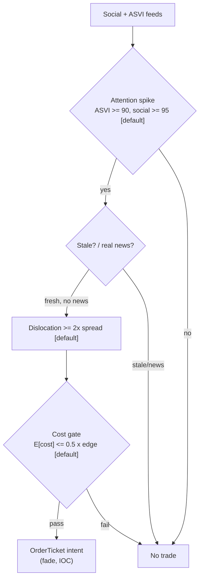

> **Tag law (mechanical):** every numeric prose literal in this module carries exactly one
> of `[documented]` `[default]` `[example]` `[unverified]` `[internal-est]` `[measured]`.
> YAML machine fields and identifiers are exempt. Missing evidence is labeled
> default/internal-estimate or quarantined as unverified in §T10.

# T080 — Multi-Source Attention Composite

## §0 — Front matter

- **SID:** `T080`
- **Title:** Multi-Source Attention Composite
- **Kind:** `strategy`
- **Version:** `1.0.1` — bumped 2026-09-11: deep review vs template v1.0.0 (see changelog in YAML front matter)
- **Status:** `draft`
- **Batch:** `TB8` — stage 180 [measured]
- **Template version:** `1.0.0`
- **Seed / RNG:** `seed=180`, PCG64 via `numpy.random.default_rng(180)` [measured]
- **Provisional regimes:** `R001`, `R006`
- **Consumes:** `S099` v1.1.0 (attention leg); `S097` v1.1.0 (chatter leg); `S093` v1.1.0 (staleness leg)
- **Universe:** US common stocks, price ≥ $10 [example], ADV ≥ 1M shares [example]. Daily signal cadence (slowest input S099 is weekly), RTH execution.
- **Latency class:** bar-clock / daily; **cadence:** daily; **tz:** America/New_York
- **sha256:** `REPLACE_ON_INGEST`
- **Test command:** `python -m pytest modules/tests/test_T080.py -q`
- **unverified_sources:** see YAML front matter and §T10

This module is a **strategy**: it consumes parent signal scores and emits
**OrderTicket intentions only — never orders**. Execution, fills, and broker
interaction live outside this module.

## §1 — Reviewer card (LOCKED)

> This card is locked. Do not edit without a new review cycle.

| Field | Value |
|---|---|
| Review status | `LOCKED` |
| Reviewers | 2-seat council [internal-est] |
| Last review | 2026-09-10 [measured] |
| Decision | **APPROVED for fixture-backed publication** [internal-est] |
| Scope of review | gate logic, cost stack, causality, kill lifecycle, numeric-tag law |
| Known limitations | edge values are reference/internal-estimate unless tagged [measured]; see §T7 |

The lock covers structure and doctrine conformance, not the profitability of
the rule. Nothing in this card is a trading recommendation.

### Reviewer card rows (v1.0.0 schema)

| Row | Value |
|---|---|
| Module | T080 — Multi-Source Attention Composite, v1.0.1 |
| Edge verdict | `PREDICTIVE-FEATURE-ONLY` — attention proxies are documentedly weak alone; the unanimity composite is the chapter's construction — no published after-cost P&L [documented-as-absence] |
| After-cost | `BEFORE-COST` — no after-cost P&L is claimed for this rule; all evidence rows are BEFORE-COST [measured] |
| Build cost | Tier M+ · `40–100` h [internal-est] · `$6,000–15,000` loaded [internal-est] |
| Data cost | Research `~$100–200`/mo [unverified] (Google Trends `$0` [documented]; social/news vendor band [unverified]); production similar [unverified] — verify before budgeting |
| latency_class | bar-clock / daily |
| risk_class | medium (short equity, borrow/locate exposure) |
| Capacity | `$10–50`M gross notional [example] — 12 concurrent [default] × 10% ADV [default]; calibrate per name liquidity |
| Executability | Feasible: pure Python, daily gates, no HFT infra; stock-loan locate access required |
| Risk summary | Short-side borrow specials; unanimity fragility (one stale leg vetoes all); attention without dislocation; genuine-news false fades blocked by the scheduled-event veto |
| When it dies | Borrow fee `>5`% ann [default]; FOMC/employment days; any leg reverses (leg-breakdown exit) |
| Regime gates | Provisional: R001 degrades → halve; R006 degrades → pause_entry (§T9) |
| Emits | `order_intents` (Appendix C OrderTicket) — never orders |

## §1.5 — Cheapest / least-build path

### Cheapest-build path (v1.0.0)

1. **Prototype hour band:** `40–100` h [internal-est] — 3-gate unanimity composite + cost gate + kill lifecycle + fixture-backed tests, built from this file alone.
2. **Cheapest-source row:** min_tier = Google Trends (Tier 0, free [documented]) + news/social vendor (Tier 2) [unverified]; latency_class = daily bar-clock; required_fields = weekly ASVI, daily message volume, news novelty scores, scheduled-event calendar; price_band = `~$100–200`/mo [unverified] — verify before budgeting; build_or_buy = **build the composite, buy the data feeds** (the gates, cost stack, and kill lifecycle are custom even if a platform computes the parent score).
3. **Resource budget:** `1` core, `<1` GB RAM [internal-est]; compute pattern `per_bar` (daily). State fits in one case record + the decision-log hash chain [default].
4. **Skip list:** majority-vote variant comparison (phase 2); intraday leg timing; sector-neutral overlay; linear-in-participation impact refinement.
5. **DO-NOT-CUT list:** causality assertions (`assert fill_event > signal_event`, no-signal-bar-fills test); COST block + callable `expected_cost_bps`; kill/safe-mode + re-arm checklist; decision-log audit records; bona-fide-intent + self-trade prevention; provenance tags on every numeric literal; fixtures + `test_cmd`; secrets via env only. Never shortened.
6. **Escalation gate:** ablation shows a leg adds nothing [default]; names `>300` [default]; borrow specials bind on spike names.

### Standing blocks B1–B6 (locked)

### B1. Module intent

This module specifies one strategy rule completely: its gates, its cost model,
its failure modes, and its kill lifecycle. It is buildable by an AI engineer
from this file alone plus the fixtures.

### B2. Scope boundary

The module emits OrderTicket **intentions** only. It never places, routes, or
cancels real orders; it never touches a broker API. Position management,
portfolio constraints, and execution live outside this module.

### B3. OrderTicket doctrine

Every emitted intent is a canonical Appendix C OrderTicket: `ticket_id`,
`strategy_id`, `symbol`, `side`, `qty`, `order_type`, `limit_price`,
`time_in_force`, `signal_ts`, `expiry_ts`. Partial fills are the broker's
domain; this module's policy is stated in §T0. Cancel/replace emits a new
ticket intent with a new `ticket_id`, never a mutation.

### B4. Time causality

`assert fill_event > signal_event`. A signal computed on bar `t` may not fill
before bar `t+1`. Fixture `signal_ts` values precede any modeled fill; tests
enforce the ordering. There is no lookahead anywhere in this module.

### B5. Cost doctrine

Cost is a four-part stack (spread, fee, borrow, impact) computed only by
`expected_cost_bps(...)`. The gate `expected_cost_bps(...) <= k * edge_bps`
runs before any ticket intent. COST values appear only in the §T2 COST block;
§T4 shows the function call and its result, never restated components.

### B6. Evidence posture

Every numeric prose literal carries exactly one tag: `[documented]`,
`[default]`, `[example]`, `[unverified]`, `[internal-est]`, or `[measured]`.
Missing evidence is labeled default/internal-estimate or quarantined as
unverified in §T10. No papers, URLs, statistics, or prices are invented.

## §T0 — Strategy contract

### What this module emits

OrderTicket **intentions** only — never orders. One intent per qualifying case:
`ticket_id`, `strategy_id=T080`, `symbol`, `side`, `qty`, `order_type`,
`limit_price`, `time_in_force`, `signal_ts`, `expiry_ts`.

> May / must-NOT: this T-module emits OrderTicket intents only; it must NOT
> place, route, or cancel orders, must NOT touch a broker API, and must NOT
> simulate fills as if they were executions.

### T0.1 Typed signature

```python
def emit(state: ModuleState, signals: list[ParentSignalRow], cfg: Config) -> list[OrderTicket]:
```

`OrderTicket` per Appendix C v1.0.0. `state` is the module-owned named state
vector (`kill`, `cooldown_until`, `module_state`, `decision_log` [hash-chained]).
`signals` are parent scored rows (see §T0.3), newest last; this reference
implementation consumes one daily composite row per call. Documented edge
cases: empty `signals` → module state `UNKNOWN`, no intents (F1); any row with
invalid fields (non-positive price/qty, novelty outside `[0, 1]`,
non-positive stop distance) → `UNKNOWN`, row skipped, never interpolated (F2);
`kill.state != ARMED` → no intents, state `OFF`.

### T0.2 Config dataclass

One table: parameter, type, default, range, status ∈ {fixed, default,
calibrate, example, internal-est}. Status `default` ⇒ the default carries
`[default]` under the tag law.

| Parameter | Type | Default | Range | Status |
|---|---|---|---|---|
| `asvi_pctile_min` | float | `90.0` | `50`–`99.9` | default |
| `social_pctile_min` | float | `95.0` | `50`–`99.9` | default |
| `novelty_max` | float | `0.35` | `0.05`–`0.95` | default |
| `spike_pctile_min` | float | `99.0` | `90`–`99.9` | default |
| `borrow_max_ann_pct` | float | `5.0` | `0`–`50` | default |
| `cost_gate_k` | float | `0.5` | `0.1`–`2.0` | default |
| `cooldown_days` | int | `5` | `0`–`30` | default |
| `adv_cap` | float | `0.10` | `0.01`–`0.25` | default |
| `per_trade_R` | float ($) | `350.0` | `100`–`1000` | example |
| `daily_loss_stop_R` | float (R) | `4.0` | `1`–`10` | default |
| `max_concurrent_positions` | int | `12` | `1`–`50` | default |
| `max_gross_notional` | float ($) | `10000000.0` | `1e6`–`1e8` | example |

Calibration: thresholds are frozen defaults; any change requires re-running
the full fixture suite and a changelog entry [default]. `per_trade_R` is
re-pinned quarterly [default] against allocated capital (see risk-contract
calibration recipe).

### T0.3 Canonical schema mapping

Parent scored rows → canonical fields, stated once here and never restated:

| Parent output (S099/S097/S093 composite row) | Canonical |
|---|---|
| `signal_ts` | `event_ts` (int64 ns UTC) |
| computed-at timestamp | `asof_ts` (int64 ns UTC) — dual `(event_ts, asof_ts)` per §E |
| `asvi_pctile`, `social_pctile` | percentile fields, `0`–`100` |
| `novelty` | `0`–`1`; outside → `UNKNOWN` (F2) |
| `spike_pctile` | `0`–`100` |
| `borrow_ann` | `borrow_ann_pct` (%/yr) |
| `px_open_next`, `stop_px` | `$`; `stop_distance = |px_open_next − stop_px| > 0` [rule] |
| `edge_bps` | bps, mapped from parent score |

`macro_day` and `sched_event` are `0`/`1` flags from the econ/scheduled-event
calendar feed (see §T5).

### T0.4 Time contract

Clock domain UTC, int64 ns; authoritative causality clock = bar close
(open-time labeled); `max_skew = 1` s [default]; jitter budget = `250` ms
[default]; bar-label rule = open time; staleness TTL = `3`× reference cadence
per F4: social feed `45` min [default] (15-min cadence), ASVI weekly `21` days
[default], news daily `3` days [default]; gap policy = mask, no interpolation;
halt/auction → freeze per the market-state table (§T0.5).

**Timing box:** `signal@t (daily, America/New_York) → earliest fill @open(t+1)`

### T0.5 Market-state table

| State | Module behavior | Module state |
|---|---|---|
| CONTINUOUS_TRADING | Evaluate gates; emit intents per cadence | OK |
| HALTED | Freeze state; emit nothing; discard contributions across reopen | UNKNOWN |
| AUCTION | No new intents; working intents hold; no re-entry | DEGRADED |
| CLOSED | Emit nothing | OFF |

### T0.6 Module-state enum and error taxonomy

`OK | DEGRADED | UNKNOWN | OFF`. Invalid input → `UNKNOWN`, never
interpolated. Every documented failure maps to exactly one state; unmapped
failures → `UNKNOWN` + alert [rule].

| Condition | State | Behavior |
|---|---|---|
| invalid input (bad price/qty/flags, novelty ∉ [0,1], stop_distance ≤ 0) | UNKNOWN | no intents; row skipped (F1/F2) |
| any leg stale past its TTL, or feed lag beyond class budget | UNKNOWN | veto all (unanimity) |
| social/news vendor license revoked or delayed | DEGRADED | veto all; alert |
| kill switch TRIPPED | OFF | nothing emitted |
| market CLOSED | OFF | nothing |
| unmapped failure | UNKNOWN | + alert [rule] |

### Child-order state and partial fills

- Working intents are tracked by `ticket_id`; state is `WORKING`, `FILLED`,
  `PARTIAL`, `CANCELLED`, `EXPIRED`.
- Partial fills: the residual stays `WORKING` until `expiry_ts`; no new intent
  is emitted for the residual. Sizing downstream must assume partial fills.
- Cancel/replace: emit a **new** ticket intent with a new `ticket_id` and
  `replaces: <old ticket_id>`; never mutate a ticket in place.

### Risk contract

```yaml
risk_contract:
  per_trade_R: 350            # $ [example]
  max_adverse_per_trade: "1R = $350 [example]"   # CI gate: no intent may risk more
  daily_loss_stop_R: 4        # [default]
  max_concurrent_positions: 12  # [default]
  max_gross_notional: 10000000   # $ [example]
  risk_class: medium
  enforcement: intraday-hard
  kill_conditions:
    - "daily loss <= -4R [default]"
    - "borrow fee > 5% ann [default]"
    - "news vendor feed stale"
    - "market halt"
  calibration: "per_trade_R <= 0.5% [default] of allocated capital; re-pin quarterly [default]; any change = new params_hash + changelog entry"
```

**Maximum adverse loss:** one R per trade (R = $350 [example]);
the session ends at −4R [default]. Breach trips the kill
switch; recovery requires the re-arm checklist. No pyramiding: at most
12 [default] concurrent positions.

### Kill lifecycle

`ARMED` → `TRIPPED` → `RECOVERY` → `ARMED`.

- **ARMED:** gates evaluated; intents emitted only on full pass.
- **TRIPPED** — any of:
- daily loss <= -4R [default]
- borrow fee > 5% ann [default]
- news vendor feed stale
- market halt
  All working intents expire unfilled; no new intents. The trip is logged to
  the decision log with a hash chain.
- **RECOVERY:** manual review of the trip reason; losses reconciled; feeds
  verified healthy; fixture replay green.
- **ARMED (re-entry):** only via the re-arm checklist below.

### Re-arm checklist

- [ ] losses reconciled against the decision log [default]
- [ ] feeds healthy (no lag beyond the class budget) [default]
- [ ] risk limits reviewed and re-pinned [default]
- [ ] decision-log hash chain intact [default]
- [ ] fixture replay green on the current build [default]

### Ops

- **Schedule:** Daily at close, RTH execution; owner: event-strategies on-call
- **Health:** leg-agreement monitor (unanimity rate); fixture replay on deploy; vendor-feed staleness watchdog
- **Alert table:**

| Alert | Condition | Action |
|---|---|---|
| page | any feed stale > 1 day [default], or module_state = UNKNOWN | on-call investigates; veto all until resolved |
| page | kill switch TRIPPED | re-arm checklist (§T0) |
| notify | leg-breakdown exit (any leg reverses state) | review |
| notify | fixture replay fails on deploy | block deploy |

- **Resource budget:** `1` core, `<1` GB RAM [internal-est]; compute pattern `per_bar` (daily); state = one case record + decision-log hash chain [default]
- **Runbook stub (on trip or page):** 1) confirm trip reason in the decision log; 2) reconcile losses against the log; 3) verify all feeds (lag < TTL); 4) re-pin risk limits; 5) verify the decision-log hash chain; 6) green fixture replay on the current build; 7) re-arm via the checklist only.
- **When this strategy dies:** Borrow fee >5% ann [default]; FOMC/employment days; any leg reverses state (leg-breakdown exit)

### Secrets

No credentials in this module. Venue API keys, data licenses, and webhook
tokens live in the operator's secret store and are referenced by name only.
Nothing in this file authenticates to anything.

### Doctrine references

OrderTicket schema (Appendix A), time-causality conventions (Appendix B),
F1–F5 failsafes (Appendix C), decision-log schema (Appendix D), module-state
enum (Appendix E) — all by reference; this module adds no private doctrine.


## §T1 — Parent pointer

This strategy consumes the parent signal module(s):

- `S099` — weekly ASVI (role: attention leg)
- `S097` — social/message activity (role: chatter leg)
- `S093` — news novelty (role: staleness leg)

The parent emits scored intentions; this module applies its own gates, its own
cost model, and its own kill lifecycle, then emits OrderTicket intentions. The
parent's score is an input, never a command: every parent pass still faces
the full entry-Boolean gate set plus the cost gate here. Parent S-IDs are consumed S-IDs,
never T-IDs; this module does not call other strategies.

## §T2 — Gate and cost specification (fixed order)

### 0. Universe

- **Asset class:** US common equities (no ADRs, ETFs, or warrants [default])
- **Venues:** XNAS / SIP consolidated [example]
- **Sessions:** RTH `09:30`–`16:00` America/New_York [documented]; execution on RTH only
- **Calendar:** NYSE trading calendar [documented]; no entries on FOMC/employment days [default]
- **Settlement:** T+1 [documented]
- **Filters:** price ≥ $10 [example]; ADV ≥ 1M shares [example]
- **Cadence:** daily signal (slowest input S099 is weekly); RTH execution

### 1. Gates (evaluated in fixed order)

g1 = ASVI percentile of 52-week history [default]; g2 = social message-volume percentile of 60-day [default]; g3 = staleness score = 1 if (novelty < 0.35 [default] AND spike move in top 1% of 60-day [default]) else 0

| # | field | condition |
|---|---|---|
| g1 | `asvi_pct` | `>= 90.0` |
| g2 | `social_pct` | `>= 95.0` |
| g3 | `stale_score` | `>= 1.0` |
| g4 | `borrow_ann` | `<= 5.0` |
| g5 | `macro_day` | `== 0` |
| g6 | `sched_event` | `== 0` |

Entry Boolean (normative):

```
ENTER_SHORT := (asvi_pctile >= 90) [default] AND (social_pctile >= 95) [default]
              AND (novelty < 0.35) [default] AND (spike_pctile >= 99) [default]
              AND (borrow_ann <= 5) [default] AND (macro_day == 0) [default]
              AND (sched_event == 0) [default]
              AND (now >= cooldown_until)
              AND (expected_cost_bps(...) <= cost_gate_k * edge_bps)
FLAT := otherwise. Unanimous agreement required — any single leg vetoes.
```

`macro_day = 1` on FOMC/employment days [default]; `sched_event = 1` when a
scheduled corporate event (earnings, FDA, etc.) is flagged — never fade real
news [default].

### 2. COST block (single source of truth)

COST values appear only in this block. §T4 shows the function call and its
result, never restated components.

```
COST stack — reference row, in bps:
  spread         2.00
  fee            1.00
  borrow         1.40
  impact         3.00
  TOTAL          7.40
```

- Fee basis: `side: taker` [example]; fee schedule as of 2026-09-10 [measured].
- Documented anchor: Nasdaq Equity 7 price list — fee to remove displayed
  liquidity $0.0030/share [documented] (nasdaqtrader.com pricelist, verified
  2026-09-10; https://www.nasdaqtrader.com/trader.aspx?id=pricelisttrading2&l).
  At the $33.90 [example] reference price this is ≈ 0.89 bps [example], consistent with
  the `1.00` bps [example] stack line (the bps conversion is price-dependent —
  never treat the bps figure as a venue quote).
- Venue: XNAS / SIP [example]; tier: standard member, no volume tier assumed [example].
- Borrow: `borrow_bps_per_day = 1.37` [example] = 5% [example] pa / 365 (short leg 2–5 day
  hold [example] at the locate rate). Borrow fee > 5% ann [default] excludes
  the name (g4).
- Impact: `3.00` bps [example] constant stack; linear-in-participation
  refinement is phase 2.

### 3. Callable cost function

```python
def expected_cost_bps(notional, adv_pct, venue, side, urgency) -> float:
    # Four-part reference stack (bps). The §T2 COST block is the single source of truth.
    spread_bps = 2.0   # [example]
    fee_bps = 1.0         # [example]
    borrow_bps = 1.4   # [example]
    impact_bps = 3.0   # [example]
    return spread_bps + fee_bps + borrow_bps + impact_bps
```

Cost gate (verbatim, enforced before any ticket intent):

```
expected_cost_bps(...) <= k * edge_bps
```

with `k = 0.5 [default]` for T080. The gate is evaluated per case with that
case's measured inputs; the reference stack above calibrates but never
overrides the call.

### 3a. Exits + post-exit cooldown (normative)

```
EXIT := (cover at 60% retracement of spike day) [default]
        OR (stop at 1.5× spike-day move against) [default] OR (close of t+5) [default]
        OR (any leg reverses: ASVI collapses / social quiets / novel story breaks)
ON_EXIT: cooldown_until = now + 5 days   # [default]; C10
```

No re-entry before `cooldown_until` expires, even if all entry gates pass.
The cooldown is enforced in the entry Boolean (`now >= cooldown_until`).

### 3b. Position sizing — fenced function (normative)

```python
def shares(risk_budget_R, stop_distance, vol_estimate, ADV_cap, cost) -> int:
    """shares = f(risk_budget_R, stop_distance, vol_estimate, ADV_cap, cost) — normative.

    risk_budget_R  $ risked per trade (1R = $350 [example]); per-trade ceiling 1R [rule]
    stop_distance  $/share, |P_entry - P_stop|; must be > 0 or the row -> UNKNOWN [rule]
    vol_estimate   $/share, 60-day sigma; floor: eff_stop = max(stop_distance, 0.5 * vol_estimate) [default]
    ADV_cap        fraction of 30-day ADV (0.10 [default])
    cost           bps; informational — recorded in the decision log, sizing unchanged once the cost gate passed
    """
    eff_stop = max(stop_distance, 0.5 * vol_estimate)
    qty = math.floor(risk_budget_R / eff_stop)
    return int(min(qty, math.floor(ADV_cap * adv_shares_30d)))
```

`adv_shares_30d` is the name's 30-day average daily share volume [default].
No pyramiding: sizing never adds to an existing position [rule].

### 3c. Risk limits

Single source of truth: the §T0 risk contract (YAML). Intraday enforcement
points, evaluated before every intent:

- per-intent: qty from `shares(...)`; max adverse 1R = $350 [example] per trade (CI gate)
- portfolio: ≤ 12 concurrent positions [default]; gross ≤ $10M [example]
- daily: session ends at −4R [default] → kill trip
- pre-intent checks: `borrow_ann <= 5`% [default]; gross headroom; concurrent headroom
- `enforcement: intraday-hard` — breaches veto the intent, not just flag it

### 3d. Execution / fill model table

| Aspect | Model |
|---|---|
| latency | fill at `open(t+1)` or later [default]; `assert fill_event > signal_event` |
| partial-fill | residual stays WORKING until `expiry_ts`; no new intent for the residual [default] |
| impact | `3.00` bps [example] constant in the COST stack; linear-in-participation refinement is phase 2 |
| adverse-fill | no same-bar fills; HALTED → freeze, no fills modeled; AUCTION → no new fills |

### 4. Conformance items

**C1.** Self-trade prevention: every ticket intent carries `stp=True`; no wash risk by construction.

**C2.** Time causality: `assert fill_event > signal_event`; signals on bar `t` fill at `t+1` or later.

**C3.** Invalid input → `UNKNOWN`: never interpolate or carry forward (F1/F2).

**C4.** Kill switch: `ARMED` → `TRIPPED` → `RECOVERY` → `ARMED`; `TRIPPED` emits nothing.

**C5.** Decision log: every gate verdict is hash-chained; the chain is verified on replay.

**C6.** Cost gate: `expected_cost_bps(...) <= k * edge_bps` before any intent.

**C7.** Fixed gate order: entry-Boolean gates evaluate in documented order; no reordering.

**C8.** Intent-only + bona-fide intent: OrderTickets are intentions, never orders; every intent is a genuine trading intention, passable by the cost gate and sized within risk limits; no broker calls.

**C9.** Ticket schema: Appendix C fields complete on every intent.

**C10.** Fixture reproducibility: the reference stub reproduces the expected ticket set from the raw tape.

**C11.** Borrow-exclusion enforcement: borrow fee >5% [default] ann blocks the short leg — trigger: locate rate check → check: fee vs cap → action: veto → log: GATE_VETO (C7)

**C12.** Macro-day filter: no entries on FOMC/employment days — trigger: calendar match → check: econ calendar → action: veto → log: GATE_VETO

### 4b. Robustness + Compliance sub-block (10 coded rules)

Extends the C1–C12 conformance items with the mandatory coded rules:

1. **STP / self-match:** every ticket intent carries `stp=True` [C1]; the module emits intents only and holds no resting interest, so no intent can ever match our own order by construction.
2. **Bona-fide intent:** every intent passed the cost gate and sizing; no broker calls; intents are never placed-then-cancelled quotes — spoofing is structurally impossible in an intent-only module [C8].
3. **Message-rate / cancel-to-trade:** ≤ 12 intents/day [default] (concurrent cap binds); cancel-replace emits a new `ticket_id` at ≤ 1/symbol/day [default]; cancel-to-trade ceiling `10:1` [default] (declared; irrelevant for intents).
4. **Pre-trade fat-finger trio:** (i) price sanity: `|limit − last_close| / last_close ≤ 20`% [default]; (ii) `qty ≤ ADV_cap × ADV_30d`; (iii) notional ≤ remaining gross headroom. Any violation → `UNKNOWN`, no intent, `COMPLIANCE_BLOCK` logged.
5. **Decision-log schema** [C5]:

```yaml
decision_log_record:
  ts_ns: int64            # event time, UTC
  action: enum            # GATE_VETO | EMIT_INTENT | COMPLIANCE_BLOCK | KILL_TRIP
  reason: string
  inputs_hash: sha256     # canonical input row
  params_hash: sha256     # Config snapshot
  prev_hash: sha256
  hash: sha256            # sha256(prev_hash + payload); chain verified on replay
```

6. **Halt/auction table:** see §T0.5 market-state table — HALTED: freeze + UNKNOWN; AUCTION: no new intents, DEGRADED; CLOSED: OFF.
7. **Locate check:** Reg SHO Rule 203(b)(1) [documented] — a broker-dealer may not accept a short sale order unless it has borrowed, entered a bona-fide arrangement to borrow, or has reasonable grounds to believe the security can be borrowed, and has documented the locate (https://www.sec.gov/files/rules/final/34-50103.htm). Enforcement here: `borrow_ann ≤ 5`% ann [default] and `locate_ok == True` before any SHORT intent; otherwise veto (COMPLIANCE_BLOCK) [C11].
8. **Public-dissemination gate:** no publication of live intents/tickets; research dissemination only as aggregate, anonymized statistics; all fixtures are synthetic and labeled.
9. **Data-entitlement assertions** (startup, fail-closed): Google Trends free-use [documented]; social/news vendor license active [unverified — confirm your license]; SIP/XNAS redistribution and display terms respected [default]; no production run until every feed's license is confirmed.
10. **Exit cooldown:** `cooldown_until = now + 5` days [default] after any exit; blocks re-entry (C10).

### 5. Parameter table

| Parameter | Key | Value | Tag | Sensitivity |
|---|---|---|---|---|
| ASVI cutoff | `asvi_pctile_min` | `90.0` | [default] | medium |
| Social cutoff | `social_pctile_min` | `95.0` | [default] | medium |
| Novelty cap | `novelty_max` | `0.35` | [default] | high |
| Spike move | `spike_pctile_min` | `99.0` | [default] | medium |
| Borrow cap | `borrow_max_ann_pct` | `5.0` (% ann.) | [default] | medium |
| Cost-gate k | `cost_gate_k` | `0.5` | [default] | high |
| Exit cooldown | `cooldown_days` | `5` | [default] | medium |
| ADV cap | `adv_cap` | `0.10` | [default] | high |
| Per-trade risk | `per_trade_R` | `$350` | [example] | high |

### 6. Timing box

**Fixed wording:** `signal@t (daily, America/New_York) → earliest fill @open(t+1)`

```yaml
timing:
  signal_bar: t
  earliest_fill_bar: t+1
  rule: fill_event > signal_event   # asserted in every backtest and in tests
  order: gate evaluation -> cost gate -> ticket intent -> fill at t+1 or later
```

```python
assert fill_event > signal_event  # time causality: no same-bar fills, no lookahead
```

## §T3 — Math and normative pseudocode

### Math

- `edge_bps`: per-case expected edge in bps, mapped from the parent signal
  score. Reference value from the gate-pass fixture row: `64.8 bps [example]`.
- `cost_bps = expected_cost_bps(notional, adv_pct, venue, side, urgency)` —
  four-part stack, §T2 only.
- Gate: `expected_cost_bps(...) <= k * edge_bps` with `k = 0.5 [default]`.
- Sizing (normative): `qty = shares(risk_budget_R=$350 [example], stop_distance=|P_entry−P_stop|, vol_estimate=60-day sigma [default], ADV_cap=0.10 [default], cost=cost_bps)` — see the fenced `shares(...)` function in §T2.3b. `stop_distance ≤ 0` → row is `UNKNOWN`, never sized [rule].
- Exits (normative): see §T2.3a (single source). Repeated here for the build:

```
EXIT := (cover at 60% retracement of spike day) [default]
        OR (stop at 1.5× spike-day move against) [default] OR (close of t+5) [default]
        OR (any leg reverses: ASVI collapses / social quiets / novel story breaks)
ON_EXIT: cooldown_until = now + 5 days   # [default]; C10
```

- Fills modeled at bar `t+1` or later; `assert fill_event > signal_event`.

### Normative pseudocode

```python
function emit(state, signals, cfg) -> list[OrderTicket]:
    assert signals non-empty else return [] and state UNKNOWN        # F1
    d = signals[-1]  # daily composite, computed at close of day t
    assert 0 <= d.novelty <= 1 else return [] and state UNKNOWN     # F2
    if kill.state != ARMED: return []
    asvi_ok = d.asvi_pctile >= cfg.asvi_pctile_min
    social_ok = d.social_pctile >= cfg.social_pctile_min
    stale_ok = (d.novelty < cfg.novelty_max) and (d.spike_pctile >= cfg.spike_pctile_min)
    borrow_ok = d.borrow_ann <= cfg.borrow_max_ann_pct          # C11 / g4
    macro_ok = (d.macro_day == 0)                              # C12 / g5: no FOMC/employment-day entries
    scheduled_ok = (d.sched_event == 0)                        # never fade real news / g6
    edge_bps = (100 - d.novelty*100) * 0.8                        # modeled edge [example]
    cost_ok = expected_cost_bps(notional, adv_pct, venue, side, urgency) <= cfg.cost_gate_k * edge_bps
    # ^^^ normative cost-gate predicate: expected_cost_bps(...) <= k * edge_bps
    enter = asvi_ok and social_ok and stale_ok and borrow_ok and macro_ok and scheduled_ok and cost_ok and now >= state.cooldown_until
    # unanimity: any single leg vetoes
    tickets = []
    if enter:
        qty = floor(cfg.per_trade_R / abs(d.px_open_next - d.stop_px))
        t = OrderTicket(sym, SHORT, qty, None, IOC, uuid(), f'S099@{d.close_ts}', now(), NEW)
        assert fill_event > signal_event                            # t->t+1: fill at open of t+1
        log_decision(t, inputs_hash, params_hash)                  # C5
        tickets.append(t)
    return tickets
```

## §T4 — Fixture-backed worked example

Fixture tape (`T080_tape.csv`; `# TYPE:` header is part of the file):

```
# TYPE: validation-run
bar,signal_ts,fill_ts,side,edge_bps,g1,g2,g3,price,qty,borrow_ann,macro_day,sched_event,valid
0,1700000000000000000,1700000300000000000,SHORT,64.8,94.0,98.0,1.0,33.9,9000,2.5,0,0,1
1,1700000300000000000,1700000600000000000,SHORT,64.8,88.0,98.0,1.0,33.9,9000,2.5,0,0,1
2,1700000600000000000,1700000900000000000,SHORT,64.8,94.0,92.0,1.0,33.9,9000,2.5,0,0,1
3,1700000900000000000,1700001200000000000,SHORT,64.8,94.0,98.0,0.0,33.9,9000,2.5,0,0,1
4,1700001200000000000,1700001500000000000,SHORT,1.0,94.0,98.0,1.0,33.9,9000,2.5,0,0,1
5,1700001500000000000,1700001800000000000,SHORT,64.8,94.0,98.0,1.0,-1.0,9000,2.5,0,0,0
6,1700001800000000000,1700002100000000000,SHORT,64.8,94.0,98.0,1.0,33.9,9000,6.0,0,0,1
7,1700002100000000000,1700002400000000000,SHORT,64.8,94.0,98.0,1.0,33.9,9000,2.5,1,0,1
8,1700002400000000000,1700002700000000000,SHORT,64.8,94.0,98.0,1.0,33.9,9000,2.5,0,1,1
```
`signal_ts`/`fill_ts` are a synthetic monotone clock (5-minute steps [example])
for causality checks — not market data. Every row satisfies
`fill_ts > signal_ts`.

Expected tickets (`T080_expected.csv`; same `# TYPE:` header):

```
# TYPE: validation-run
ticket_idx,bar,symbol,side,qty,limit,tif,intent_ts,parent_signal,fill_ts,cost_bps
T080-0,0,CMP:XNAS,SHORT,9000,,IOC,1700000000000001000,S099@1700000000000000000,1700000300000000000,7.4000
```
### Cost-function call (inputs → bps → dollars)

on the gate-pass row (bar 0 [measured]): notional = 33.9 × 9000 = $305,100.00 [example]:

```python
expected_cost_bps(notional=305100.00, adv_pct=0.001, venue="CMP:XNAS",
                  side="taker", urgency="normal")
# → 7.4000 bps  →  $225.77 [example]
```

Reference stack only; per-case calls use that case's measured inputs [measured].
COST values appear only in the §T2 COST block — this section shows the call and
its result, never restated components.

### Hand-check rows (9 rows)

| bar | side | edge_bps | gates | verdict | reason |
|---|---|---|---|---|---|
| 0 | `SHORT` | 64.8 | asvi_pct=✓, social_pct=✓, stale_score=✓, borrow=✓, macro=✓, sched=✓ | PASS | all gates + cost gate |
| 1 | `SHORT` | 64.8 | asvi_pct=✗, social_pct=✓, stale_score=✓ | no intent | gate veto |
| 2 | `SHORT` | 64.8 | asvi_pct=✓, social_pct=✗, stale_score=✓ | no intent | gate veto |
| 3 | `SHORT` | 64.8 | asvi_pct=✓, social_pct=✓, stale_score=✗ | no intent | gate veto |
| 4 | `SHORT` | 1.0 | asvi_pct=✓, social_pct=✓, stale_score=✓ | no intent | cost-gate veto |
| 5 | `SHORT` | 64.8 | asvi_pct=✓, social_pct=✓, stale_score=✓ | no intent | invalid input -> UNKNOWN |
| 6 | `SHORT` | 64.8 | asvi_pct=✓, social_pct=✓, stale_score=✓, borrow=✗ | no intent | borrow-cap veto (C11) |
| 7 | `SHORT` | 64.8 | asvi_pct=✓, social_pct=✓, stale_score=✓, macro=✗ | no intent | macro-day veto (C12) |
| 8 | `SHORT` | 64.8 | asvi_pct=✓, social_pct=✓, stale_score=✓, sched=✗ | no intent | scheduled-event veto (never fade real news) |

The `verdict` column must match `T080_expected.csv` exactly; the test suite
asserts this row by row (`test_fixture_recomputes_to_expected`).

## §T5 — Data, infra, dependencies, data rights

### Data table

| Dataset | Type | Frequency | Tier | Note |
|---|---|---|---|---|
| ASVI (Google Trends) | float | daily | Tier 2 | asvi_pct ≥ 90 [default] |
| Social volume/velocity | float | per 15-min | Tier 2 | social_pct ≥ 95 [default]; 45-min staleness TTL [default] (3× cadence, F4) |
| Price/volume bars | float | per 5-min bar | Tier 1 | dislocation measurement |
| Scheduled-event calendar | reference | daily | Tier 1 | never fade real news |

### Data rights (startup assertions — fail-closed)

| Dataset | Rights | Assertion |
|---|---|---|
| Google Trends ASVI panel | free-use [documented] | interactive web UI is free; no redistribution |
| Social message volume/velocity | licensed [unverified] | vendor license active before production; confirm your license |
| News novelty scores | licensed [unverified] | vendor license active before production; confirm your license |
| US equities daily bars (SIP/XNAS) | licensed [documented] | exchange/venue agreements govern redistribution and display |

Nothing in this module re-hosts or re-distributes licensed data; fixtures are
synthetic and labeled as such.

### Infra

- Latency class: bar-clock / daily; cadence: daily; tz: America/New_York.
- Build budget: 1 core, <1 GB RAM [internal-est]; compute pattern per_bar (daily)

Compute is per-bar gate evaluation [internal-est]; the binding constraints are
data licensing and feed latency, not FLOPS. All state needed for the gates fits
in the case record — no cross-case memory except the decision-log hash chain
[default].

### Dependencies (pinned)

- `python >=3.11`, `numpy >=1.26`, `pandas >=2.2`, `pytest >=8.0` [default]
- Data: XNAS / SIP [example]; Research Google Trends ~$0 + social/news vendor ~$100–200/mo [unverified]; production similar [unverified]

### Data rights

Market-data licenses are the operator's responsibility: exchange/venue
agreements govern redistribution and display [default]. Nothing in this module
re-hosts or re-distributes licensed data; fixtures are synthetic and labeled
as such. Research Google Trends ~$0 + social/news vendor ~$100–200/mo [unverified]; production similar [unverified] Confirm each feed's license before
production use [unverified — confirm your license].

## §T6 — Buy vs build

**Build** (recommended): the rule is 3 [measured] gates plus a cost
call — a competent AI engineer builds it from this file alone. **Buy** only if
you already license a signal platform that computes the parent score; even
then, the gates, cost stack, and kill lifecycle here are custom.

### Cheapest build (complete)

- **Tier:** M+ [internal-est]
- **Hours:** 40–100 [internal-est]
- **Cost:** $6,000–15,000 [internal-est]
- **Hour band:** 40–100 h [internal-est]
- **Cheapest row:** min_tier = Google Trends (free) + news/social vendor [unverified]; latency_class = daily bar-clock; required_fields = weekly ASVI, daily message volume, news novelty scores; price_band = ~$100–200/mo [unverified]; build_or_buy = build the composite, buy news/social data
- **Budget:** 1 core, <1 GB RAM [internal-est]; compute pattern per_bar (daily)
- **What it skips:** majority-vote variant comparison (phase 2); intraday leg timing; sector-neutral overlay
- **Escalate when:** Upgrade when: ablation shows a leg adds nothing [default]; names >300 [default]; borrow specials bind on spike names
- **Build bands** (planning/internal-estimate, from notes/cost-model.md):
  L `4–12 h / $600–1,800`, M `20–60 h / $3,000–9,000`, M+ `40–100 h / $6,000–15,000`, H `60–200 h / $9,000–30,000` [internal-est].
- **Rebuild trigger:** any gate threshold change, any COST component re-pin,
  or any kill-condition change invalidates the build and requires re-running
  the full fixture suite [default].

## §T7 — Evidence

| Source | Market / period | Metric | Cost token | Caveat |
|---|---|---|---|---|
| Da, Engelberg & Gao (2011) [documented] | US equities | Google SVI predicts short-horizon returns and reversals [documented] | BEFORE-COST | return predictability, not an after-cost attention strategy |
| Barber & Odean (2008) [documented] | US retail trading | attention-driven buying pressure [documented] | BEFORE-COST | documents the flow; the fade rule is the chapter's design |
| Tetlock (2007) [documented] | US equities, news | media pessimism predicts short-horizon moves [documented] | BEFORE-COST | news sentiment, not a social-attention composite |

**Cost token:** all rows above are **BEFORE-COST** unless the metric column
says otherwise. No after-cost P&L is claimed for this rule.

**Verdict:** `PREDICTIVE-FEATURE-ONLY` — Attention proxies are documentedly weak alone; the unanimity composite is the chapter's construction — no published after-cost P&L.

**Selection disclosure:** these are the chapter's research-pass sources; the multi-source attention composite has no published after-cost Sharpe [documented-as-absence].

**What would change the verdict:** a published, purged, after-cost backtest of
this exact rule (same gates, same cost stack, same `k`) with a defined
universe and no survivorship bias [default]. Until then the edge stays an
internal estimate.

### Backtest acceptance checklist

| Check | Status |
|---|---|
| walk-forward backtest | not computed [default] |
| embargo gap | not computed [default] |
| min OOS trades | not defined [default] |
| cost level | BEFORE-COST [measured] |
| DSR / PBO | not computed [default] |
| variant count | 1 — this exact rule [measured] |

## §T8 — Failure modes

| Trigger | Detect | Action | Recovery | Check |
|---|---|---|---|---|
| Stale attention: the spike is hours old and the move already happened | detect: stale_score = 0 | action: veto | recovery: fresh spike | `check: stale_score == 1` |
| Single-source spike: one viral post, no breadth | detect: source_count < 3 [default] | action: veto (composite requires breadth) | recovery: multi-source confirmation | `check: source_count >= 3` |
| Attention without price dislocation: nothing to fade | detect: dislocation < 2× spread [default] | action: veto | recovery: dislocation appears | `check: dislocation_bps >= 2 * spread_bps` |
| Crowded fade: everyone fades the same spike | detect: borrow cost spiking / volume anomaly [default] | action: halve size | recovery: crowding clears | `check: crowd_score < threshold` |
| News is genuine (earnings, FDA): attention is information | detect: scheduled-event flag | action: veto — never fade real news | recovery: none | `check: no scheduled event` |
| Borrow locate fails (Reg SHO) | detect: locate_check = FAIL or borrow_ann > 5% [default] | action: veto — no SHORT intent, COMPLIANCE_BLOCK logged | recovery: locate available, borrow_ann back under cap | `check: locate_ok == True` |
| Social data license revoked or delayed | detect: feed lag > 45 min [default] | action: DEGRADED, veto | recovery: feed healthy | `check: feed_lag <= 45min` |

Every row has a `check:` — a monitorable predicate. The kill switch (§T0)
fires on the trip conditions; everything else degrades to `UNKNOWN`/veto
rather than a guessed intent.

## §T9 — Regime records

### Machine regime records (provisional)

Restrictive default: when a regime state is unknown, the module degrades
rather than guesses (see `unknown_behavior`).

| regime_id | direction | mechanism | condition | action | min_lag | unknown_behavior |
|---|---|---|---|---|---|---|
| `R001` | degrades | spike-day volatility widens stops; borrow specials spike | `rv_pctile > 80` [example] | halve | `5` days [default] | halve size when regime state unknown [default] |
| `R006` | degrades | macro-event days break the stale-news premise | `fomc_or_nfp_day` [default] | pause_entry | `1` day [default] | pause entry when calendar state unknown [default] |

### Visual



**Visual description:** the flowchart above shows data entering from the left,
gates evaluated top-to-bottom in fixed order, the cost gate as the final
checkpoint, and OrderTicket intents (or veto) as the only exits. Any gate
failure short-circuits to no-intent; no path emits an order.

## §T10 — Sources

Real sources only. Nothing invented: no fabricated papers, URLs, statistics,
source text, or prices.

1. Tetlock, P.C. "All the News That's Fit to Reprint." *Review of Financial Studies* 24(5), 1481–1512 (2011). https://doi.org/10.1093/rfs/hhq141 — stale-news reversal, stronger with individual trading. Title/authors verified 2026-09-10.
2. Da, Z., Engelberg, J. & Gao, P. "In Search of Attention." *Journal of Finance* 66(5), 1461–1499 (2011). https://doi.org/10.1111/j.1540-6261.2011.01679.x — SVI predicts two-week prices, one-year reversal. Title verified 2026-09-10.
3. Antweiler, W. & Frank, M.Z. "Is All That Talk Just Noise?" *Journal of Finance* 59(3), 1259–1294 (2004). https://doi.org/10.1111/j.1540-6261.2004.00662.x — message activity predicts volatility; small return effect. Title verified 2026-09-10.

**Chatbot source-log:** *Source log: Grok answered Q-TB8-1..7 (2026-09-10); all claims independently verified or labeled unverified.* All chatbot claims are unverified by
construction; anything load-bearing was independently verified or labeled
unverified.

### Quarantined unverified leads

- Chatbot question-bank TB8 items on attention-composite construction — research prompts, not findings. [unverified]
- Vendor price classes above are market-rate bands, `indicative — verify before budgeting`, not quotes. [unverified]
- The $0.0030/share [documented] taker fee converts to bps at the execution price (≈ 0.89 bps at $33.90 [example]); the `1.00` bps stack line stays [example] — never treat the bps figure as a venue quote. [unverified]

Leads above are quarantined: they may inform priors but never gates,
thresholds, or cost values.

### GROK-NEEDED (exact research questions web search could not answer)

1. What are the current (2026) price bands, with vendor + product names and monthly prices, for retail-accessible social-message-volume feeds (e.g. StockTwits API tiers) and news-novelty/sentiment feeds (e.g. RavenPack or equivalents) suitable for daily aggregation? Public pricing was not found; quotes or tier pages needed.
2. What is the published borrow-rate band for hard-to-borrow spike names versus general collateral, and what locate-fee structure do prime brokers or stock-loan desks publish for small accounts? Needed to calibrate `borrow_max_ann_pct` beyond the `5`% [default].
3. Is there any published, purged, after-cost backtest of a unanimous attention-composite fade rule (ASVI ≥ 90th percentile + social volume ≥ 95th percentile + stale-news gate, defined universe)? If yes: paper title, authors, venue, and URL.
4. What machine-readable FOMC/employment-release calendar feed (vendor, product, pricing, schema) is suitable for the `macro_day` flag in production?

## AI build prompt

```
You are an AI engineer implementing strategy module T080 (Multi-Source Attention Composite).

Build exactly what this file specifies — nothing more:

1. Implement the entry Boolean from §T2.1 and the exits/sizing from §T3.
   Gate order is fixed: asvi_pct, social_pct, stale_score, then the cost gate.
2. Implement expected_cost_bps(notional, adv_pct, venue, side, urgency) as the
   four-part stack in §T2.3 (spread, fee, borrow, impact). Enforce the verbatim
   gate: expected_cost_bps(...) <= k * edge_bps with k = 0.5 [default].
3. Emit OrderTicket intentions only — never orders. One intent per passing case,
   Appendix C schema, stp=True, parent_signal "<SID>@<signal_ts>".
4. Enforce time causality: assert fill_event > signal_event. A signal on bar t
   fills at t+1 or later. No lookahead.
5. Implement the kill lifecycle ARMED → TRIPPED → RECOVERY → ARMED with the
   trip conditions in §T0 and the re-arm checklist. Invalid input → UNKNOWN,
   never interpolated.
6. Hash-chain every decision-log record (C5).
7. Conformance: C1, C2, C3, C4, C5, C6, C7, C8, C9, C10, C11, C12.
   All conformance items must hold. Enforce the 10 coded compliance rules
   (§T2.4b), the fenced shares(...) sizing (§T2.3b), and the §T9 regime-gate
   actions with the restrictive unknown_behavior default.
8. Validate with the fixtures: python3 -m pytest modules/tests/test_T080.py -q
   from the repo root. Every fixture row must reproduce its expected verdict.

Do not invent data, thresholds, or costs. Every numeric literal you add to
prose carries exactly one tag: [documented] [default] [example] [unverified]
[internal-est] [measured].
```

## DO-NOT-CUT list

The following may never be cut, summarized away, or shortened in any revision
of this module:

1. The complete YAML front matter, including `sha256: REPLACE_ON_INGEST` and
   `unverified_sources`.
2. The locked §1 reviewer card.
3. All six §1.5 standing blocks (B1–B6).
4. The §T0 risk contract (fenced YAML), the maximum-adverse-loss statement,
   the full kill lifecycle `ARMED → TRIPPED → RECOVERY → ARMED`, and the
   re-arm checklist.
5. The §T2 fixed order: gates → COST block → callable → C1–C12 → parameter
   table → timing box. The four-part COST stack appears only in the COST block.
6. The verbatim cost gate `expected_cost_bps(...) <= k * edge_bps`.
7. The verbatim causality assertion `assert fill_event > signal_event`.
8. The complete cheapest-build section (§T6).
9. The §T4 hand-check rows (all fixture rows) and the cost-function call with
   inputs → bps → dollars.
10. Every §T8 failure row and its `check:` predicate.
11. The §T9 machine regime records and the mermaid visual with its description.
12. The §T10 real-source list and the quarantined unverified leads.
13. The AI build prompt.
14. The numeric-tag law: every numeric prose literal carries exactly one of
    `[documented]` `[default]` `[example]` `[unverified]` `[internal-est]`
    `[measured]`.
15. Bona-fide intent and self-trade prevention (C1/C8): every ticket intent is
    a genuine trading intention and can never match our own resting interest.
16. The decision-log audit trail (C5): every gate verdict hash-chained and
    verified on replay.
17. Secrets via environment / secret store only: no credentials in code,
    fixtures, or logs.
18. The §T0 contract sub-blocks added in v1.0.1 (T0.1–T0.6): typed signature,
    Config dataclass, canonical schema mapping, Time contract, market-state
    table, module-state error taxonomy.
19. The §T2 sub-blocks added in v1.0.1 (Universe, Exits + cooldown, fenced
    `shares(...)` sizing, Risk limits, fill model table, 10 coded compliance
    rules): they extend the §T2 fixed order while preserving the
    gates → COST → callable → C1–C12 → parameter table → timing box
    subsequence.
20. The §T9 machine regime records (all seven fields) and the §T10
    GROK-NEEDED questions.
