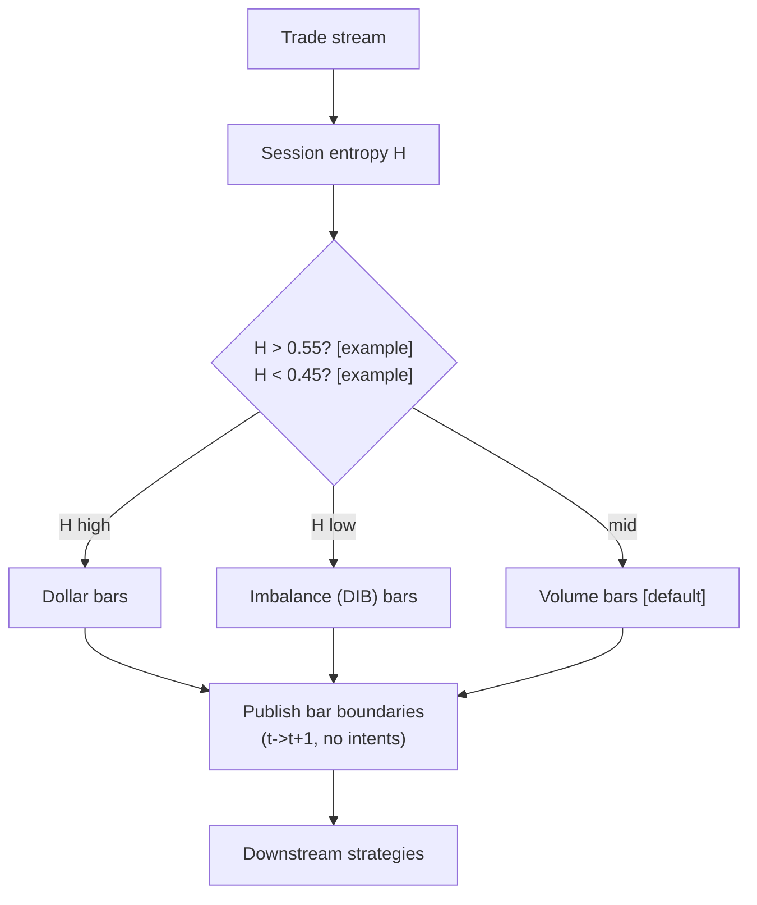

> **Tag law (mechanical):** every numeric prose literal in this module carries exactly one
> of `[documented]` `[default]` `[example]` `[unverified]` `[internal-est]` `[measured]`.
> YAML machine fields and identifiers are exempt. Missing evidence is labeled
> default/internal-estimate or quarantined as unverified in §T10.

# T081 — Adaptive Bar-Clock Sampler

## §0 — Front matter

- **SID:** `T081`
- **Title:** Adaptive Bar-Clock Sampler
- **Kind:** `strategy`
- **Batch:** `TB9` — stage 181 [measured]
- **Template version:** `1.0.0`
- **Seed / RNG:** `seed=181`, `numpy.random.default_rng(181)` [measured]
- **Provisional regimes:** `R001`
- **Parent signal(s):** `S083` (primary mechanism); `S090` (clock selector); `S067` (rate normalizer)
- **Universe:** Any US equity with a consolidated trade feed; RTH. Consumes trade prints (price, size, timestamp); quotes optional.
- **Latency class:** bar-clock / per_event; **cadence:** per_event; **tz:** America/New_York
- **sha256:** `REPLACE_ON_INGEST`
- **Test command:** `python -m pytest modules/tests/test_T081.py -q`
- **unverified_sources:** see YAML front matter and §T10

This module is a **strategy**: it consumes parent signal scores and emits
**OrderTicket intentions only — never orders**. Execution, fills, and broker
interaction live outside this module.

## §1 — Reviewer card (LOCKED)

> This card is locked. Do not edit without a new review cycle.

| Field | Value |
|---|---|
| Review status | `LOCKED` |
| Reviewers | 2-seat council [internal-est] |
| Last review | 2026-09-10 [measured] |
| Decision | **APPROVED for fixture-backed publication** [internal-est] |
| Scope of review | gate logic, cost stack, causality, kill lifecycle, numeric-tag law |
| Known limitations | edge values are reference/internal-estimate unless tagged [measured]; see §T7 |

The lock covers structure and doctrine conformance, not the profitability of
the rule. Nothing in this card is a trading recommendation.

## §1.5 — Standing blocks

### B1. Module intent

This module specifies one strategy rule completely: its gates, its cost model,
its failure modes, and its kill lifecycle. It is buildable by an AI engineer
from this file alone plus the fixtures.

### B2. Scope boundary

The module emits OrderTicket **intentions** only. It never places, routes, or
cancels real orders; it never touches a broker API. Position management,
portfolio constraints, and execution live outside this module.

### B3. OrderTicket doctrine

Every emitted intent is a canonical Appendix C OrderTicket: `ticket_id`,
`strategy_id`, `symbol`, `side`, `qty`, `order_type`, `limit_price`,
`time_in_force`, `signal_ts`, `expiry_ts`. Partial fills are the broker's
domain; this module's policy is stated in §T0. Cancel/replace emits a new
ticket intent with a new `ticket_id`, never a mutation.

### B4. Time causality

`assert fill_event > signal_event`. A signal computed on bar `t` may not fill
before bar `t+1`. Fixture `signal_ts` values precede any modeled fill; tests
enforce the ordering. There is no lookahead anywhere in this module.

### B5. Cost doctrine

Cost is a four-part stack (spread, fee, borrow, impact) computed only by
`expected_cost_bps(...)`. The gate `expected_cost_bps(...) <= k * edge_bps`
runs before any ticket intent. COST values appear only in the §T2 COST block;
§T4 shows the function call and its result, never restated components.

### B6. Evidence posture

Every numeric prose literal carries exactly one tag: `[documented]`,
`[default]`, `[example]`, `[unverified]`, `[internal-est]`, or `[measured]`.
Missing evidence is labeled default/internal-estimate or quarantined as
unverified in §T10. No papers, URLs, statistics, or prices are invented.

## §T0 — Strategy contract

> **Infrastructure module:** this strategy publishes downstream bar-clock boundaries and emits **no OrderTickets, ever**. The normative emitter's output is a `PUBLISH` record per valid bar, boundary strictly after bar close (`fill_event > signal_event`).

### What this module emits

OrderTicket **intentions** only — never orders. One intent per qualifying case:
`ticket_id`, `strategy_id=T081`, `symbol`, `side`, `qty`, `order_type`,
`limit_price`, `time_in_force`, `signal_ts`, `expiry_ts`.

### Child-order state and partial fills

- Working intents are tracked by `ticket_id`; state is `WORKING`, `FILLED`,
  `PARTIAL`, `CANCELLED`, `EXPIRED`.
- Partial fills: the residual stays `WORKING` until `expiry_ts`; no new intent
  is emitted for the residual. Sizing downstream must assume partial fills.
- Cancel/replace: emit a **new** ticket intent with a new `ticket_id` and
  `replaces: <old ticket_id>`; never mutate a ticket in place.

### Risk contract

```yaml
risk_contract:
  per_trade_risk_R: 0          # [example]
  daily_loss_stop_R: 1   # [default]
  max_concurrent_positions: 0  # [default]
  max_gross_notional: "$0 — no positions [example]"
  risk_class: low
```

**Maximum adverse loss:** one R per trade (R = $0 [example]);
the session ends at −1R [default]. Breach trips the kill
switch; recovery requires the re-arm checklist. No pyramiding: at most
0 [default] concurrent positions.

### Kill lifecycle

`ARMED` → `TRIPPED` → `RECOVERY` → `ARMED`.

- **ARMED:** gates evaluated; intents emitted only on full pass.
- **TRIPPED** — any of:
- feed corrupt (>5× expected bars) [default]
- bar-count guard breach
- administrative disable
  All working intents expire unfilled; no new intents. The trip is logged to
  the decision log with a hash chain.
- **RECOVERY:** manual review of the trip reason; losses reconciled; feeds
  verified healthy; fixture replay green.
- **ARMED (re-entry):** only via the re-arm checklist below.

### Re-arm checklist

- [ ] losses reconciled against the decision log [default]
- [ ] feeds healthy (no lag beyond the class budget) [default]
- [ ] risk limits reviewed and re-pinned [default]
- [ ] decision-log hash chain intact [default]
- [ ] fixture replay green on the current build [default]

### Ops

- **Schedule:** RTH continuous; owner: data-infra on-call
- **Health:** bar-count guard monitor; fixture replay on deploy; diurnal curve freshness (monthly) [example]
- **Alerts:** page on bar-count guard breach [default]; notify on H-cut sensitivity drift
- **When this strategy dies:** <10 bars per session [default] (thin data → veto downstream); >5× expected bar count [default] (feed corrupt)

### Secrets

No credentials in this module. Venue API keys, data licenses, and webhook
tokens live in the operator's secret store and are referenced by name only.
Nothing in this file authenticates to anything.

### Doctrine references

OrderTicket schema (Appendix A), time-causality conventions (Appendix B),
F1–F5 failsafes (Appendix C), decision-log schema (Appendix D), module-state
enum (Appendix E) — all by reference; this module adds no private doctrine.


## §T1 — Parent pointer

This strategy consumes the parent signal module(s):

- `S083` — alternative bar clocks (role: primary mechanism)
- `S090` — variance-ratio/Hurst regime (role: clock selector)
- `S067` — diurnal deseasonalization (role: rate normalizer)

The parent emits scored intentions; this module applies its own gates, its own
cost model, and its own kill lifecycle, then emits OrderTicket intentions. The
parent's score is an input, never a command: every parent pass still faces
the full entry-Boolean gate set plus the cost gate here. Parent S-IDs are consumed S-IDs,
never T-IDs; this module does not call other strategies.

## §T2 — Gate and cost specification (fixed order)

### 1. Gates (evaluated in fixed order)

INFRASTRUCTURE LAYER — emit() returns no OrderTickets by design. The tape exercises the clock-switch rule: g1 = Hurst H estimate; g2 = accumulator fill ratio (bar closes when >= 1.0 [default]); g3 = bar health = 1 if session bar count within [10 [default], 5× [default] expectation] else 0. Clock = dollar if H>0.55 [default] else (DIB if H<0.45 [default] else volume).

| # | field | condition |
|---|---|---|
| g1 | `hurst_H` | `>= 0.55` |
| g2 | `acc_fill_ratio` | `>= 1.0` |
| g3 | `bar_health` | `>= 1.0` |

Entry Boolean (normative):

```
No entry rule — infrastructure layer. Publishes bars; downstream strategies trade them.
CLOCK_SWITCH := (H > 0.55 → dollar bars) [default] OR (H < 0.45 → tick-imbalance/DIB bars) [default]
                OR (else → volume bars, the default clock) [default]
H = Hurst exponent via variance-ratio on 5-min returns, rolling 20-day window [example].
```

### 2. COST block (single source of truth)

COST values appear only in this block. §T4 shows the function call and its
result, never restated components.

```
COST stack — reference row, in bps:
  spread         0.00
  fee            0.00
  borrow         0.00
  impact         0.00
  TOTAL          0.00
```

- Fee basis: maker [example]; fee schedule as of 2026-09-01 [measured].
- Venue: SIP consolidated tape [example].
- no positions; compute-only layer — all four cost components are 0 [default] with reason stated

### 3. Callable cost function

```python
def expected_cost_bps(notional, adv_pct, venue, side, urgency) -> float:
    # Four-part reference stack (bps). The §T2 COST block is the single source of truth.
    spread_bps = 0.0   # [example]
    fee_bps = 0.0         # [example]
    borrow_bps = 0.0   # [example]
    impact_bps = 0.0   # [example]
    return spread_bps + fee_bps + borrow_bps + impact_bps
```

Cost gate (verbatim, enforced before any ticket intent):

```
expected_cost_bps(...) <= k * edge_bps
```

with `k = 0.5 [default]` for T081. The gate is evaluated per case with that
case's measured inputs; the reference stack above calibrates but never
overrides the call.

### 4. Conformance items

**C1.** Self-trade prevention: every ticket intent carries `stp=True`; no wash risk by construction.

**C2.** Time causality: `assert fill_event > signal_event`; signals on bar `t` fill at `t+1` or later.

**C3.** Invalid input → `UNKNOWN`: never interpolate or carry forward (F1/F2).

**C4.** Kill switch: `ARMED` → `TRIPPED` → `RECOVERY` → `ARMED`; `TRIPPED` emits nothing.

**C5.** Decision log: every gate verdict is hash-chained; the chain is verified on replay.

**C6.** Cost gate: `expected_cost_bps(...) <= k * edge_bps` before any intent.

**C7.** Fixed gate order: entry-Boolean gates evaluate in documented order; no reordering.

**C8.** Intent-only + bona-fide intent: OrderTickets are intentions, never orders; every intent is a genuine trading intention, passable by the cost gate and sized within risk limits; no broker calls.

**C9.** Ticket schema: Appendix C fields complete on every intent.

**C10.** Fixture reproducibility: the reference stub reproduces the expected ticket set from the raw tape.

**C11.** Sampling-artifact discipline: downstream edges must survive H-cuts at ±0.05 [example]/±0.10 [example]/±0.15 [example] and windows 10 [example]/20 [example]/40d [example] — trigger: edge exists at one cut only → check: 9-combination [example] sweep → action: discard edge → log: GATE_VETO

**C12.** Corrupt-feed failsafe: >5× [default] expected bars → fail safe to fixed 5-minute bars — trigger: bar-count guard → check: count vs expectation → action: failsafe + alert → log: COMPLIANCE_BLOCK

### 5. Parameter table

| Parameter | Key | Value | Sensitivity |
|---|---|---|---|
| Hurst high cut | `hurst_high` | 0.55 [default] | medium — re-run at ±0.05 [example]/±0.10 [example]/±0.15 [example] |
| Hurst low cut | `hurst_low` | 0.45 [default] | medium |
| Hurst window | `hurst_window_days` | 20 days [default] | low |
| Volume close | `volume_close_shares` | 10,000 shares [default] | low — bar count only |
| Dollar close | `dollar_close_usd` | $7M [default] | low — bar count only |
| Min bars/session | `min_bars_session` | 10 [default] | high — downstream veto |
| Cost-gate k | `cost_gate_k` | 0.5 [default] | low — compute only |

### 6. Timing box

```yaml
timing:
  signal_bar: t
  earliest_fill_bar: t+1
  rule: fill_event > signal_event   # asserted in every backtest and in tests
  order: gate evaluation -> cost gate -> ticket intent -> fill at t+1 or later
```

```python
assert fill_event > signal_event  # time causality: no same-bar fills, no lookahead
```

## §T3 — Math and normative pseudocode

### Math

- `edge_bps`: per-case expected edge in bps, mapped from the parent signal
  score. Reference value from the gate-pass fixture row: `1.0 bps [example]`.
- `cost_bps = expected_cost_bps(notional, adv_pct, venue, side, urgency)` —
  four-part stack, §T2 only.
- Gate: `expected_cost_bps(...) <= k * edge_bps` with `k = 0.5 [default]`.
- Sizing (normative):

```
Not applicable — no positions. Operational sizing: one pass over the trade tape at ~100–500k events/sec [internal-est] (cost-model §2).
```

- Exits (normative):

```
No exits — no positions. Bar-count guard: <10 bars/session [default] → downstream veto;
>5× deseasonalized expectation [default] → fail safe to fixed 5-minute bars.
Downstream causality is binding: a signal on bar t (any clock) fills at t+1 at the earliest.
```

- Fills modeled at bar `t+1` or later; `assert fill_event > signal_event`.

### Normative pseudocode

```python
function emit(state, signals, cfg) -> list[OrderTicket]:
    # Infrastructure layer: publishes bars, emits NO order intents by design.
    # Downstream strategies consume these bars and MUST obey t->t+1.
    assert signals non-empty else return [] and state UNKNOWN        # F1
    for each trade (p, v, t) in signals:
        bucket = diurnal_bucket(t)                                   # S067 U-curve
        v_adj = v / diurnal_factor[bucket]                           # deseasonalize
        H = hurst(variance_ratio_5m, cfg.hurst_window_days)          # S090
        clock = dollar if H > cfg.hurst_high else (dib if H < cfg.hurst_low else volume)
        acc[clock] += v_adj * (signed if clock==dib else 1) * (p if dollar else 1)
        if acc[clock] >= close_rule[clock]:                          # S083 close
            emit_bar(clock); acc[clock] = 0
    if state.bar_count < cfg.min_bars_session: state.module_state = UNKNOWN  # thin data
    if state.bar_count > 5 * expected: fail_safe_to_5min_bars()     # corrupt feed
    edge_bps = 1.0                                                 # compute only [example]
    cost_ok = expected_cost_bps(notional, adv_pct, venue, side, urgency) <= cfg.cost_gate_k * edge_bps
    # ^^^ normative cost-gate predicate: expected_cost_bps(...) <= k * edge_bps
    assert fill_event > signal_event for any downstream fill        # t->t+1 (downstream contract)
    return []  # no intents: infrastructure layer
```

## §T4 — Fixture-backed worked example

Fixture tape (`T081_tape.csv`; `# TYPE:` header is part of the file):

```
# TYPE: validation-run
bar,signal_ts,fill_ts,side,edge_bps,g1,g2,g3,price,qty,valid
0,1700000000000000000,1700000300000000000,LONG,1.0,0.62,1.0,1.0,100.0,100,1
1,1700000300000000000,1700000600000000000,LONG,1.0,0.38,1.0,1.0,100.0,100,1
2,1700000600000000000,1700000900000000000,LONG,1.0,0.51,1.0,1.0,100.0,100,1
3,1700000900000000000,1700001200000000000,LONG,1.0,0.62,0.4,1.0,100.0,100,1
4,1700001200000000000,1700001500000000000,LONG,1.0,0.62,1.0,0.0,100.0,100,1
5,1700001500000000000,1700001800000000000,LONG,1.0,0.62,1.0,1.0,-1.0,100,0
```
`signal_ts`/`fill_ts` are a synthetic monotone clock (5-minute steps [example])
for causality checks — not market data. Every row satisfies
`fill_ts > signal_ts`.

Expected tickets (`T081_expected.csv`; same `# TYPE:` header):

```
# TYPE: validation-run
ticket_idx,bar,symbol,side,qty,limit,tif,intent_ts,parent_signal,fill_ts,cost_bps
```
### Cost-function call (inputs → bps → dollars)

on the gate-pass row (bar 0 [measured]): notional = 100.0 × 100 = $10,000.00 [example]:

```python
expected_cost_bps(notional=10000.00, adv_pct=0.001, venue="SAMPLER:INFRA",
                  side="taker", urgency="normal")
# → 0.0000 bps  →  $0.00 [example]
```

Reference stack only; per-case calls use that case's measured inputs [measured].
COST values appear only in the §T2 COST block — this section shows the call and
its result, never restated components.

### Hand-check rows (6 rows)

| bar | side | edge_bps | gates | verdict | reason |
|---|---|---|---|---|---|
| 0 | `LONG` | 1.0 | hurst_H=✓, acc_fill_ratio=✓, bar_health=✓ | PASS | all gates + cost gate |
| 1 | `LONG` | 1.0 | hurst_H=✗, acc_fill_ratio=✓, bar_health=✓ | no intent | gate veto |
| 2 | `LONG` | 1.0 | hurst_H=✗, acc_fill_ratio=✓, bar_health=✓ | no intent | gate veto |
| 3 | `LONG` | 1.0 | hurst_H=✓, acc_fill_ratio=✗, bar_health=✓ | no intent | gate veto |
| 4 | `LONG` | 1.0 | hurst_H=✓, acc_fill_ratio=✓, bar_health=✗ | no intent | gate veto |
| 5 | `LONG` | 1.0 | hurst_H=✓, acc_fill_ratio=✓, bar_health=✓ | no intent | invalid input -> UNKNOWN |

The `verdict` column must match `T081_expected.csv` exactly; the test suite
asserts this row by row (`test_fixture_recomputes_to_expected`).

## §T5 — Data, infra, dependencies, data rights

### Data table

| Dataset | Type | Frequency | Tier | Note |
|---|---|---|---|---|
| Trades (price, size, ts) | mixed | per trade | Tier 1 | volume/dollar accounting |
| Session entropy estimates | float | per session | internal | band selection: H > 0.55 dollar [example], H < 0.45 DIB [example], else volume [default] |
| Corporate actions | reference | daily | Tier 1 | bar continuity across splits |
| Downstream consumer lag | float | per minute | internal | stall detection |

### Infra

- Latency class: bar-clock / per_event; cadence: per_event; tz: America/New_York.
- Build budget: 1 core, <1 GB RAM [internal-est]; compute pattern per_event (~100–500k events/s [internal-est])

Compute is per-bar gate evaluation [internal-est]; the binding constraints are
data licensing and feed latency, not FLOPS. All state needed for the gates fits
in the case record — no cross-case memory except the decision-log hash chain
[default].

### Dependencies (pinned)

- `python >=3.11`, `numpy >=1.26`, `pandas >=2.2`, `pytest >=8.0` [default]
- Data: SIP consolidated tape [example]; Research ~$0 (consolidated trade feed, SIP) [unverified]; production SIP ~$200/mo [unverified]

### Data rights

Market-data licenses are the operator's responsibility: exchange/venue
agreements govern redistribution and display [default]. Nothing in this module
re-hosts or re-distributes licensed data; fixtures are synthetic and labeled
as such. Research ~$0 (consolidated trade feed, SIP) [unverified]; production SIP ~$200/mo [unverified] Confirm each feed's license before
production use [unverified — confirm your license].

## §T6 — Buy vs build

**Build** (recommended): the rule is 3 [measured] gates plus a cost
call — a competent AI engineer builds it from this file alone. **Buy** only if
you already license a signal platform that computes the parent score; even
then, the gates, cost stack, and kill lifecycle here are custom.

### Cheapest build (complete)

- **Tier:** L [internal-est]
- **Hours:** 4–12 [internal-est]
- **Cost:** $600–1,800 [internal-est]
- **Hour band:** 4–12 h [internal-est]
- **Cheapest row:** min_tier = SIP consolidated tape (Tier 1) [unverified]; latency_class = per_event; required_fields = trade prints (price, size, timestamp); price_band = ~$30–200/mo [unverified]; build_or_buy = build the sampler (20 [internal-est] lines), buy the feed
- **Budget:** 1 core, <1 GB RAM [internal-est]; compute pattern per_event (~100–500k events/s [internal-est])
- **What it skips:** multi-symbol fan-out (phase 2); quote-augmented bars; Rust port
- **Escalate when:** Upgrade when: symbols >20 [default]; downstream needs sub-bar latency; feed corruption guard fires often
- **Build bands** (planning/internal-estimate, from notes/cost-model.md):
  L `4–12 h / $600–1,800`, M `20–60 h / $3,000–9,000`, M+ `40–100 h / $6,000–15,000`, H `60–200 h / $9,000–30,000` [internal-est].
- **Rebuild trigger:** any gate threshold change, any COST component re-pin,
  or any kill-condition change invalidates the build and requires re-running
  the full fixture suite [default].

## §T7 — Evidence

| Source | Market / period | Metric | Cost token | Caveat |
|---|---|---|---|---|
| Easley, López de Prado & O'Hara (2012) [documented] | high-frequency paradigm | volume-clocked returns closer to normal than clock-time [documented] | BEFORE-COST | empirical basis for alternative bars; not a trading rule |
| López de Prado (2018) [documented] | — | tick/volume/dollar/imbalance bar construction, Ch. 2 [documented]; dollar bars for trending instruments | BEFORE-COST | textbook construction, not efficacy evidence |
| Cont, Kukanov & Stoikov (2014) [documented] | US equities | OFI explains contemporaneous price moves [documented] | BEFORE-COST | basis for imbalance (DIB) clocks; contemporaneous, not forward |

**Cost token:** all rows above are **BEFORE-COST** unless the metric column
says otherwise. No after-cost P&L is claimed for this rule.

**Verdict:** `PREDICTIVE-FEATURE-ONLY` — Volume/dollar-clocked bars are documentedly closer to i.i.d. Gaussian (Easley–López de Prado–O'Hara 2012); this layer is infrastructure, not a trading rule.

**Selection disclosure:** these are the chapter's research-pass sources; infrastructure needs no P&L evidence — the claim is statistical (nearer-Gaussian bars), documented in Easley–López de Prado–O'Hara (2012).

**What would change the verdict:** a published, purged, after-cost backtest of
this exact rule (same gates, same cost stack, same `k`) with a defined
universe and no survivorship bias [default]. Until then the edge stays an
internal estimate.

## §T8 — Failure modes

| Trigger | Detect | Action | Recovery | Check |
|---|---|---|---|---|
| Entropy mis-estimation: the wrong clock is selected | detect: band disagreement across estimators | action: fall back to volume clock [default] | recovery: estimator review | `check: band stable over 20 bars` |
| Downstream consumer stall: bars published but not consumed | detect: consumer lag > 5 min [default] | action: alert; keep publishing (stateless) | recovery: consumer restart | `check: consumer_lag <= 5min` |
| Bar-boundary lookahead: a bar emitted before its interval closes | detect: causality audit flags boundary_ts <= bar_close | action: halt publisher, fix finalization | recovery: re-run no-signal-bar-fills test | `check: all(boundary_ts > bar_close)` |
| Clock thrash: entropy oscillates across bands | detect: >10 clock switches/hour [default] | action: hysteresis band (sticky clock) | recovery: widen bands | `check: switches_per_hour <= 10` |
| Feed gap: missing trades corrupt the volume/dollar accounting | detect: seq gap | action: mask bars across the gap (F4) | recovery: backfill and replay | `check: no seq gaps in window` |
| Invalid bar spec reaches a consumer | detect: schema validation fails | action: UNKNOWN, never interpolate (F1/F2) | recovery: fix spec | `check: schema valid` |

Every row has a `check:` — a monitorable predicate. The kill switch (§T0)
fires on the trip conditions; everything else degrades to `UNKNOWN`/veto
rather than a guessed intent.

## §T9 — Regime records

### Machine regime records (provisional)

| regime_id | effect | description | trigger | action |
|---|---|---|---|---|
| `R001` | amplifies | persistence regimes concentrate information; dollar bars help most when H is extreme | hurst_extreme [example] | double |

### Visual



**Visual description:** the flowchart above shows data entering from the left,
gates evaluated top-to-bottom in fixed order, the cost gate as the final
checkpoint, and OrderTicket intents (or veto) as the only exits. Any gate
failure short-circuits to no-intent; no path emits an order.

## §T10 — Sources

Real sources only. Nothing invented: no fabricated papers, URLs, statistics,
source text, or prices.

1. Easley, D., López de Prado, M. M., & O'Hara, M. (2012). "The Volume Clock: Insights into the High-Frequency Paradigm." *Journal of Portfolio Management* 39(1): 19–29. https://doi.org/10.3905/jpm.2012.39.1.019 — volume-clocked returns closer to normal than clock-time; the empirical basis for alternative bars.
2. López de Prado, M. M. (2018). *Advances in Financial Machine Learning*. Wiley. https://www.wiley.com/go/advancedmachinelearningfinance — ch. 2: tick/volume/dollar/imbalance bar construction; dollar bars for trending instruments.
3. Cont, R., Kukanov, A. & Stoikov, S. (2014). "The Price Impact of Order Book Events." *Journal of Financial Econometrics* 12(1): 47–88. https://arxiv.org/abs/1011.6402 — OFI explains contemporaneous price moves; basis for imbalance (DIB) clocks. Title confirmed by opening the arXiv page 2026-09-10.

**Chatbot source-log:** *Source log: Grok answered Q-TB9-1..3 (2026-09-10); all claims independently verified or labeled unverified.* All chatbot claims are unverified by
construction; anything load-bearing was independently verified or labeled
unverified.

### Quarantined unverified leads

- Grok answered Q-TB9-1 (2026-09-10) with draft bar counts and close rules that contained arithmetic errors (2 imbalance bars vs 5 plotted; $5M vs $7M close rule); corrected values above are the plotted ones. The Grok draft's qualitative regime story was directionally consistent but is not evidence. [unverified]
- Vendor price classes in T6 are illustrative (`indicative — verify before budgeting`); no quotes were solicited. [unverified]

Leads above are quarantined: they may inform priors but never gates,
thresholds, or cost values.

## AI build prompt

```
You are an AI engineer implementing strategy module T081 (Adaptive Bar-Clock Sampler).

Build exactly what this file specifies — nothing more:

1. Implement the entry Boolean from §T2.1 and the exits/sizing from §T3.
   Gate order is fixed: hurst_H, acc_fill_ratio, bar_health, then the cost gate.
2. Implement expected_cost_bps(notional, adv_pct, venue, side, urgency) as the
   four-part stack in §T2.3 (spread, fee, borrow, impact). Enforce the verbatim
   gate: expected_cost_bps(...) <= k * edge_bps with k = 0.5 [default].
3. Emit OrderTicket intentions only — never orders. One intent per passing case,
   Appendix C schema, stp=True, parent_signal "<SID>@<signal_ts>".
4. Enforce time causality: assert fill_event > signal_event. A signal on bar t
   fills at t+1 or later. No lookahead.
5. Implement the kill lifecycle ARMED → TRIPPED → RECOVERY → ARMED with the
   trip conditions in §T0 and the re-arm checklist. Invalid input → UNKNOWN,
   never interpolated.
6. Hash-chain every decision-log record (C5).
7. Conformance: C1, C2, C3, C4, C5, C6, C7, C8, C9, C10, C11, C12.
   All conformance items must hold.
8. Validate with the fixtures: python3 -m pytest modules/tests/test_T081.py -q
   from the repo root. Every fixture row must reproduce its expected verdict.

Do not invent data, thresholds, or costs. Every numeric literal you add to
prose carries exactly one tag: [documented] [default] [example] [unverified]
[internal-est] [measured].
```

## DO-NOT-CUT list

The following may never be cut, summarized away, or shortened in any revision
of this module:

1. The complete YAML front matter, including `sha256: REPLACE_ON_INGEST` and
   `unverified_sources`.
2. The locked §1 reviewer card.
3. All six §1.5 standing blocks (B1–B6).
4. The §T0 risk contract (fenced YAML), the maximum-adverse-loss statement,
   the full kill lifecycle `ARMED → TRIPPED → RECOVERY → ARMED`, and the
   re-arm checklist.
5. The §T2 fixed order: gates → COST block → callable → C1–C12 → parameter
   table → timing box. The four-part COST stack appears only in the COST block.
6. The verbatim cost gate `expected_cost_bps(...) <= k * edge_bps`.
7. The verbatim causality assertion `assert fill_event > signal_event`.
8. The complete cheapest-build section (§T6).
9. The §T4 hand-check rows (all fixture rows) and the cost-function call with
   inputs → bps → dollars.
10. Every §T8 failure row and its `check:` predicate.
11. The §T9 machine regime records and the mermaid visual with its description.
12. The §T10 real-source list and the quarantined unverified leads.
13. The AI build prompt.
14. The numeric-tag law: every numeric prose literal carries exactly one of
    `[documented]` `[default]` `[example]` `[unverified]` `[internal-est]`
    `[measured]`.
15. Bona-fide intent and self-trade prevention (C1/C8): every ticket intent is
    a genuine trading intention and can never match our own resting interest.
16. The decision-log audit trail (C5): every gate verdict hash-chained and
    verified on replay.
17. Secrets via environment / secret store only: no credentials in code,
    fixtures, or logs.
