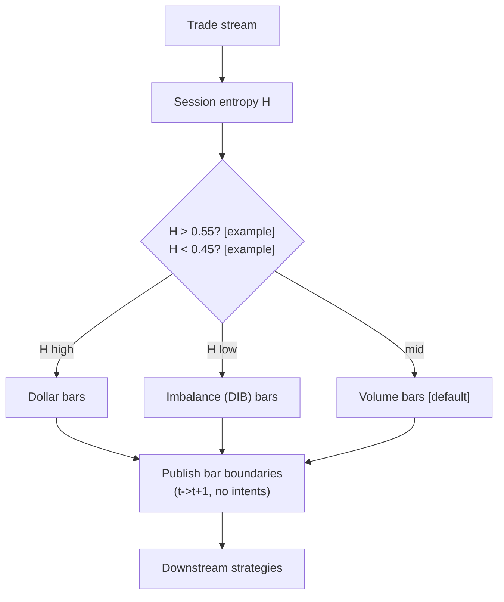

# T081 — Adaptive Bar-Clock Sampler

> **Tag law (mechanical):** every numeric prose literal in this module carries exactly one
> of `[documented]` `[default]` `[example]` `[unverified]` `[internal-est]` `[measured]`.
> YAML machine fields and identifiers are exempt. Missing evidence is labeled
> default/internal-estimate or quarantined as unverified in §T10.

## §1 — Reviewer card (LOCKED)

> 5-minute reviewer card. Locked row schema. Updated by the deep-review cycle
> 2026-09-11 [measured]; prior approval 2026-09-10 by a 2-seat council [internal-est].
> The lock covers structure and doctrine conformance, not the profitability of
> the rule. Nothing in this card is a trading recommendation.

| Row | Value |
|---|---|
| Module | T081 — Adaptive Bar-Clock Sampler, v1.1.0 |
| Edge verdict | `PREDICTIVE-FEATURE-ONLY` — volume/dollar-clocked bars are documentedly closer to i.i.d. Gaussian than clock-time bars (Easley–López de Prado–O'Hara 2012) [documented]; this module is infrastructure and predicts nothing. |
| After-cost | `BEFORE-COST` — no P&L is claimed; the publisher emits no tickets, so trading costs are identically `0` bps [default]. |
| Build cost | Tier L · `4–12` h [internal-est] · `$600–1,800` loaded [internal-est] |
| Data cost | Research: historical tick trades `$16.00`/GB [documented, Databento 2024-12-11]; 1 month of tick trades `~$50–200` [unverified, third-party planning estimate]. Production: live trades `$19.20`/GB [documented, 2024-12-11]; monthly $/mo depends on universe [unverified]. Product note: DBEQ.BASIC deprecated 2025-01-13 → now Databento US Equities — recheck current schedule before buying [documented]. |
| latency_class | streaming / per_event; `~100–500k` events/s/core [internal-est] |
| risk_class | low — no positions, no orders, no inventory |
| Capacity | n/a (infrastructure) — the publisher imposes no capacity constraint; downstream strategies inherit their own capacity limits |
| Executability | Feasible: Python+numpy over the trade tape; sampler logic is `~20` lines [internal-est]; the binding constraint is the feed license, not FLOPS |
| Risk summary | feed corruption → failsafe to fixed 5-minute bars; thin sessions → downstream veto; invalid input → UNKNOWN, never interpolated |
| When it dies | `<10` bars/session [default] (thin data → downstream veto); bar count `>5×` deseasonalized expectation [default] (feed corrupt → failsafe); halt freeze |
| Regime gates (provisional) | R001 amplifies: extreme H → dollar/imbalance clock; see §T9 machine records |
| Emits | `PUBLISH` records (bar boundaries) — **no OrderTickets, ever**; infrastructure publisher |

## §1.5 — Cheapest/least-build path

Prototype hour band: `4–12` h [internal-est]; loaded cost `$600–1,800` [internal-est].

**Cheapest-source row.** `min_tier: Databento trades schema (historical REST)` [documented] · `latency_class: per_event streaming` · `required_fields: price, size, trade timestamp (int64 ns UTC); optional exchange ts, seq` · `price_band: $16.00/GB historical [documented, 2024-12-11]` · `build_or_buy: buy the feed; build the sampler (~20 lines [internal-est]) yourself — no vendor sells an adaptive Hurst-switched bar clock`.

Resource budget: `1` core, `<1` GB RAM [internal-est]; compute pattern `per_event` (`~100–500k` events/s [internal-est]). All gate state fits in the case record — no cross-case memory except the decision-log hash chain [default].

**Skip list.** Multi-symbol fan-out (phase 2); quote-augmented bars; imbalance/run bars beyond the DIB constant variant (phase 2); Rust port; colocation; real-time (T+1 historical suffices for research and backtest).

**DO-NOT-CUT list.** t→t+1 causality assertions; COST block + `expected_cost_bps` callable; kill lifecycle + re-arm checklist; decision audit log (C5 hash chain); bona-fide-intent + self-trade prevention (C1/C8); provenance honesty tags; fixtures + per-module test (`test_cmd` exits 0); secrets via env only.

**Escalation gate.** Upgrade the build when: symbols `>20` [default]; downstream needs sub-bar latency; the feed-corruption guard fires often; entitlement class changes (professional/internal → display) — crossing it requires re-review of §T5 and §T8.

## §T0 — Strategy contract

### Standing blocks (moved from §1.5 in the 1.1.0 deep review; content unchanged)

**B1. Module intent.** This module specifies one strategy rule completely: its gates, its cost model,
its failure modes, and its kill lifecycle. It is buildable by an AI engineer
from this file alone plus the fixtures.

**B2. Scope boundary.** The module emits OrderTicket **intentions** only. It never places, routes, or
cancels real orders; it never touches a broker API. Position management,
portfolio constraints, and execution live outside this module.

**B3. OrderTicket doctrine.** Every emitted intent is a canonical Appendix C OrderTicket: `ticket_id`,
`strategy_id`, `symbol`, `side`, `qty`, `order_type`, `limit_price`,
`time_in_force`, `signal_ts`, `expiry_ts`. Partial fills are the broker's
domain; this module's policy is stated below. Cancel/replace emits a new
ticket intent with a new `ticket_id`, never a mutation. (T081 publishes bar
boundaries and emits zero tickets by design; the doctrine binds the contract
if the publisher role ever changes.)

**B4. Time causality.** `assert fill_event > signal_event`. A signal computed on bar `t` may not fill
before bar `t+1`. Fixture `signal_ts` values precede any modeled fill; tests
enforce the ordering. There is no lookahead anywhere in this module.

**B5. Cost doctrine.** Cost is a four-part stack (spread, fee, borrow, impact) computed only by
`expected_cost_bps(...)`. The gate `expected_cost_bps(...) <= k * edge_bps`
runs before any ticket intent. COST values appear only in the §T2 COST block;
§T4 shows the function call and its result, never restated components.

**B6. Evidence posture.** Every numeric prose literal carries exactly one tag: `[documented]`,
`[default]`, `[example]`, `[unverified]`, `[internal-est]`, or `[measured]`.
Missing evidence is labeled default/internal-estimate or quarantined as
unverified in §T10. No papers, URLs, statistics, or prices are invented.

### Typed signature

```python
def emit(state: EmitState, events: Iterable[TradeEvent], cfg: Config) -> list[OrderTicket]:
    """Normative emitter. T081 is an infrastructure publisher: it always returns [].

    The normative output is one PUBLISH record per valid bar, with boundary_ts
    strictly after bar close (fill_event > signal_event). OrderTicket intentions
    are never emitted by this module.
    """
```

### Config dataclass (single; statuses ∈ fixed | default | calibrate | example | internal-est)

```python
@dataclass(frozen=True)
class Config:
    hurst_high: float = 0.55            # default; range 0.35–0.75
    hurst_low: float = 0.45             # default; range 0.25–0.65
    hurst_window_days: int = 20        # default; range 10–40
    vr_base_interval: str = "1min"     # example; fixed (not calibrated)
    vr_agg_ratio: int = 5              # example; range 2–20
    volume_close_shares: int = 10_000      # default; range 1_000–100_000
    dollar_close_usd: float = 7_000_000    # default; range 1_000_000–50_000_000
    dib_close_shares: int = 10_000         # example; range 1_000–100_000
    min_bars_session: int = 10         # default; range 5–50
    cost_gate_k: float = 0.5            # default; range 0.1–2.0
```

### Canonical Event/Bar mapping

```python
TradeEvent:                      # canonical input event
  event_ts:    int64   # ns, UTC — authoritative causality clock
  asof_ts:     int64   # ns, UTC — when this module observed the event
  price:       float   # > 0, else invalid (F1)
  size:        int     # > 0 shares, else invalid (F1)
  exchange_ts: int64 | None  # ns, UTC — when present
  seq:         int | None    # venue sequence — when present

PublishRecord:                   # normative output (not an order)
  bar_open_ts:  int64  # ns, UTC
  boundary_ts:  int64  # ns, UTC — strictly > bar_open_ts; downstream fills at t+1 or later
  clock:        str    # volume | dollar | dib
  bars_this_session: int
```

### Time contract

- Clock domain: exchange event time; canonical UTC as int64 nanoseconds [default].
- max_skew: `1` s [default]; jitter budget: `500` µs [default].
- Bar-label rule: a bar is labeled by its **closing** boundary timestamp (`boundary_ts`); no bar is referenced before its boundary is emitted [default].
- Staleness TTL: per_event inputs are point events — no staleness; feed heartbeat `>300` s [default] → module_state `UNKNOWN`, no PUBLISH.
- Gap policy: sequence gaps → mask bars across the gap (F4), never interpolate; backfill and replay to recover.

### Market-state table

| State | Publisher behavior |
|---|---|
| CONTINUOUS_TRADING | publish bars normally |
| HALTED | freeze: hold the partial bar, publish nothing; module_state `DEGRADED`; downstream consumers veto |
| AUCTION | no emission during auctions; resume on CONTINUOUS_TRADING |
| CLOSED | publisher stops; module_state `OFF`; next session re-arms |

### Module-state enum

- `OK` — all gates evaluable, feed fresh, publishing.
- `DEGRADED` — halt freeze, clock thrash (hysteresis active), or diurnal curve stale; publishing continues on the fallback (volume) clock.
- `UNKNOWN` — invalid input (never interpolated, F1/F2), thin session (`<10` bars [default]), heartbeat lost; no PUBLISH.
- `OFF` — kill TRIPPED/RECOVERY, or session CLOSED.

### Child-order state and partial fills

Not applicable — this module emits no tickets. Documented here so the contract
shape matches other T modules: the vestigial `position_shares(...)` in §T2
always returns `0`, and `emit()` always returns `[]`.

### Risk contract

```yaml
risk_contract:
  per_trade_risk_R: 0          # [example]
  daily_loss_stop_R: 1   # [default]
  max_concurrent_positions: 0  # [default]
  max_gross_notional: "$0 — no positions [example]"
  risk_class: low
```

**Maximum adverse loss:** one R per trade (R = $0 [example]);
the session ends at −1R [default]. Breach trips the kill
switch; recovery requires the re-arm checklist. No pyramiding: at most
`0` [default] concurrent positions. `max_adverse_per_trade = $0` [example];
CI gate: `emit()` returns `[]` on every fixture row (asserted by
`test_fixture_recomputes_to_expected` and `test_no_intents_schema_and_log`).

### Kill lifecycle

`ARMED` → `TRIPPED` → `RECOVERY` → `ARMED`.

- **ARMED:** gates evaluated; PUBLISH records emitted only on full pass.
- **TRIPPED** — any of:
  - feed corrupt: bar count `>5×` deseasonalized expectation [default]
  - thin data: `<10` bars/session [default] (downstream veto)
  - administrative disable

  No PUBLISH, no intents. The trip is logged to the decision log with a hash chain.
- **RECOVERY:** manual review of the trip reason; losses reconciled; feeds
  verified healthy; fixture replay green.
- **ARMED (re-entry):** only via the re-arm checklist below.

### Re-arm checklist

- [ ] losses reconciled against the decision log [default]
- [ ] feeds healthy (no lag beyond the class budget) [default]
- [ ] risk limits reviewed and re-pinned [default]
- [ ] decision-log hash chain intact [default]
- [ ] fixture replay green on the current build [default]

### Ops

- **Schedule:** RTH continuous; owner: data-infra on-call
- **Health:** bar-count guard monitor; fixture replay on deploy; diurnal curve freshness (monthly) [example]
- **Alerts:** page on bar-count guard breach [default]; notify on H-cut sensitivity drift
- **When this strategy dies:** `<10` bars per session [default] (thin data → veto downstream); `>5×` expected bar count [default] (feed corrupt → failsafe)

### Secrets

No credentials in this module. Venue API keys, data licenses, and webhook
tokens live in the operator's secret store and are referenced by name only.
Nothing in this file authenticates to anything.

### Doctrine references

OrderTicket schema (Appendix A), time-causality conventions (Appendix B),
F1–F5 failsafes (Appendix C), decision-log schema (Appendix D), module-state
enum (Appendix E) — all by reference; this module adds no private doctrine.

## §T1 — Parent pointer

This strategy consumes the parent signal module(s):

- `S083` v1.1.0 — alternative bar clocks (role: bar-clock construction: tick/volume/dollar/imbalance close rules)
- `S090` v1.1.0 — variance-ratio/Hurst regime (role: clock selector)
- `S067` v1.1.0 — diurnal deseasonalization (role: rate normalizer)

The parent emits scored intentions; this module applies its own gates, its own
cost model, and its own kill lifecycle, then publishes bar boundaries (no
OrderTicket intentions, by design). The parent's score is an input, never a
command: every parent pass still faces the full entry-Boolean gate set plus
the cost gate here. Parent S-IDs are consumed S-IDs,
never T-IDs; this module does not call other strategies.

## §T2 — Gate and cost specification (fixed order)

### 1. Universe

Any US equity with a consolidated (or consolidated-equivalent) trade feed; RTH.
Consumes trade prints (price, size, timestamp); quotes optional. Cheapest
documented feed: Databento `trades` schema, historical REST [documented].

### 2. Entry rule (Boolean expressions)

INFRASTRUCTURE LAYER — `emit()` returns no OrderTickets by design. The tape
exercises the clock-switch rule: g1 = Hurst H estimate; g2 = accumulator fill
ratio (bar closes when `>= 1.0` [default]); g3 = bar health = `1` if session
bar count within [`10` [default], `5×` [default] expectation] else `0`.
Clock = dollar if H>0.55 [default] else (DIB if H<0.45 [default] else volume).

| # | field | condition |
|---|---|---|
| g1 | `hurst_H` | `>= 0.55` |
| g2 | `acc_fill_ratio` | `>= 1.0` |
| g3 | `bar_health` | `>= 1.0` |

Entry Boolean (normative):

```
No entry rule — infrastructure layer. Publishes bars; downstream strategies trade them.
CLOCK_SWITCH := (H > 0.55 → dollar bars) [default] OR (H < 0.45 → DIB bars) [default]
                OR (else → volume bars, the default clock) [default]
Ĥ = Hurst estimate from the variance-ratio: Ĥ = log(VR(q)) / (2·log(q)),
q = cfg.vr_agg_ratio = 5 [example], on cfg.vr_base_interval = "1min" [example]
log returns, rolling cfg.hurst_window_days = 20 [example] days. VR test per
Lo & MacKinlay (1988) [documented]; the H mapping is the standard long-memory
scaling identity, applied here as an [example] estimator.
```

### 3. Exits + post-exit cooldown

No exits — no positions. Post-exit cooldown: n/a (no positions) [default].
The anti-thrash control for this module is clock hysteresis: a clock switch
sticks until H crosses the opposite band edge with a `0.02` [example] margin,
per the §T8 clock-thrash row.

### 4. Position sizing (fenced function)

```python
def position_shares(risk_budget_R, stop_distance, vol_estimate, ADV_cap, cost) -> int:
    """Infrastructure publisher — no positions, ever. The signature is kept for
    contract symmetry with other T modules; the only admissible bundle maps to 0."""
    return 0
```

### 5. Risk limits

Risk contract in §T0 applies. Additionally: `max_gross_notional = $0`
[example]; `max_adverse_per_trade = $0` [example] with CI gate
(`emit()` returns `[]` on every fixture row).

### 6. COST block (single source of truth)

COST values appear only in this block. §T4 shows the function call and its
result, never restated components.

```
COST stack — reference row, in bps:
  spread         0.00
  fee            0.00
  borrow         0.00
  impact         0.00
  TOTAL          0.00
```

- Fee basis: maker [example]; fee schedule as of 2026-09-01 [measured].
- Venue: Databento `trades` schema (DBEQ.BASIC, a 4-exchange bundle — not the full SIP tape) [documented]; the sampler accepts any consolidated-equivalent trade tape.
- `side: maker` [example]; `borrow_bps_per_day = 0` [default] — reason: the publisher holds no positions and no inventory, so no borrow can accrue.
- No positions; compute-only layer — all four cost components are 0 [default] with reason stated.

### 7. Callable cost function

```python
def expected_cost_bps(notional, adv_pct, venue, side, urgency) -> float:
    # Four-part reference stack (bps). The §T2 COST block is the single source of truth.
    spread_bps = 0.0   # [default]
    fee_bps = 0.0         # [default]
    borrow_bps = 0.0   # [default]
    impact_bps = 0.0   # [default]
    return spread_bps + fee_bps + borrow_bps + impact_bps
```

Cost gate (verbatim, enforced before any ticket intent):

```
expected_cost_bps(...) <= k * edge_bps
```

with `k = 0.5 [default]` for T081. The gate is evaluated per case with that
case's measured inputs; the reference stack above calibrates but never
overrides the call.

### 8. Execution / fill model table

| Aspect | Rule |
|---|---|
| Latency | n/a to this module; downstream fills occur at bar `t+1` open or later |
| Partial fills | downstream domain |
| Impact | `0.00` bps [default] — the publisher emits no tickets and touches no book |
| Adverse fills | downstream domain; the publisher never fills |
| Bar publication | `boundary_ts` strictly `>` bar close; `assert fill_event > signal_event` for any downstream fill |
| Clock switch | hysteresis: switch sticks until H crosses the opposite band edge with `0.02` [example] margin |

### 9. Robustness + Compliance sub-block

**C1.** Self-trade prevention: every ticket intent carries `stp=True`; no wash risk by construction. (Vacuous for T081 — zero tickets are emitted; the flag binds if the publisher role ever changes.)

**C2.** Time causality: `assert fill_event > signal_event`; signals on bar `t` fill at `t+1` or later.

**C3.** Invalid input → `UNKNOWN`: never interpolate or carry forward (F1/F2).

**C4.** Kill switch: `ARMED` → `TRIPPED` → `RECOVERY` → `ARMED`; `TRIPPED` emits nothing.

**C5.** Decision log: every gate verdict and PUBLISH record is hash-chained; the chain is verified on replay.

**C6.** Cost gate: `expected_cost_bps(...) <= k * edge_bps` before any intent.

**C7.** Fixed gate order: entry-Boolean gates evaluate in documented order; no reordering.

**C8.** Intent-only + bona-fide intent: OrderTickets are intentions, never orders; every PUBLISH record reflects a real bar boundary computed from real trades — no fabricated bars; no broker calls.

**C9.** Ticket schema: Appendix C fields complete on every intent (vacuous here; binding if tickets are ever emitted).

**C10.** Fixture reproducibility: the reference stub reproduces the expected (empty) ticket set from the raw tape.

**C11.** Sampling-artifact discipline: downstream edges must survive H-cuts at `±0.05` [example]/`±0.10` [example]/`±0.15` [example] and windows `10` [example]/`20` [example]/`40`d [example] — trigger: edge exists at one cut only → check: 9-combination [example] sweep → action: discard edge → log: GATE_VETO. (Offline research gate; see §T3.)

**C12.** Corrupt-feed failsafe: `>5×` [default] expected bars → fail safe to fixed 5-minute bars — trigger: bar-count guard → check: count vs expectation → action: failsafe + alert → log: COMPLIANCE_BLOCK.

**C13.** Message-rate / publish-rate: PUBLISH records are bounded by the bar-close rate; sustained `>1000` PUBLISH/s [example] → `DEGRADED` + alert (feed-anomaly proxy). No cancel-to-trade analog: the publisher never places or cancels orders.

**C14.** Pre-trade fat-finger trio (adapted to a publisher): (a) close rules positive and within `Config` range; (b) every print has `price > 0` and `size > 0`, else the print is dropped and the case goes `UNKNOWN` (F1); (c) `boundary_ts > bar_open_ts` on every PUBLISH, else `COMPLIANCE_BLOCK`.

**C15.** Halt/auction state table: HALTED → freeze, no new bars, downstream veto; AUCTION → no emission; CLOSED → `OFF`. See the §T0 market-state table.

**C16.** Locate check: n/a — the module never shorts and never holds inventory; no locate obligation arises [default].

**C17.** Public-dissemination gate: bar specs publish to the operator's licensed downstream only; fixtures are synthetic and labeled; nothing redistributes licensed market data (see §T5).

**C18.** Data-entitlement assertions: startup asserts `rights == licensed` for the trade feed, professional/internal, no display; any entitlement-class change → §1.5 escalation gate.

**C19.** Exit cooldown: n/a — no positions [default]; clock hysteresis is the anti-thrash control.

### 10. Parameter table

| Parameter | Key | Value | Sensitivity |
|---|---|---|---|
| Hurst high cut | `hurst_high` | 0.55 [default] | medium — re-run at ±0.05 [example]/±0.10 [example]/±0.15 [example] |
| Hurst low cut | `hurst_low` | 0.45 [default] | medium |
| Hurst window | `hurst_window_days` | 20 days [default] | low |
| VR base interval | `vr_base_interval` | "1min" [example] | low — estimator choice |
| VR aggregation ratio | `vr_agg_ratio` | 5 [example] | low — estimator choice |
| Volume close | `volume_close_shares` | 10,000 shares [default] | low — bar count only |
| Dollar close | `dollar_close_usd` | $7M [default] | low — bar count only |
| DIB close | `dib_close_shares` | 10,000 shares [example] | low — bar count only |
| Min bars/session | `min_bars_session` | 10 [default] | high — downstream veto |
| Cost-gate k | `cost_gate_k` | 0.5 [default] | low — compute only |

### 11. Timing box

```yaml
timing:
  signal_bar: t
  earliest_fill_bar: t+1
  rule: fill_event > signal_event   # asserted in every backtest and in tests
  order: gate evaluation -> cost gate -> publish bar boundary -> downstream fill at t+1 or later
```

```python
assert fill_event > signal_event  # time causality: no same-bar fills, no lookahead
```

Fixed wording: `signal@t (per_event, America/New_York) → earliest fill @open(t+1)`.

## §T3 — Math and normative pseudocode

### Math

- `edge_bps`: per-case expected edge in bps, mapped from the parent signal
  score. Reference value from the gate-pass fixture row: `1.0 bps [example]`.
- `cost_bps = expected_cost_bps(notional, adv_pct, venue, side, urgency)` —
  four-part stack, §T2 only.
- Gate: `expected_cost_bps(...) <= k * edge_bps` with `k = 0.5 [default]`.
- Hurst estimator (normative): on `cfg.vr_base_interval` log returns over the
  rolling `cfg.hurst_window_days`-day window, `VR = Var(r_q) / (q · Var(r_1))`
  with `q = cfg.vr_agg_ratio`, then `Ĥ = log(VR) / (2·log(q))`. The VR test is
  Lo & MacKinlay (1988) [documented]; the H mapping is the long-memory scaling
  identity, used here as an [example] estimator.
- Sizing (normative): `position_shares(...) == 0` always — no positions (§T2.4).
- Exits (normative): no exits — no positions. Bar-count guard: `<10` bars/session [default] → downstream veto; `>5×` deseasonalized expectation [default] → fail safe to fixed 5-minute bars. Downstream causality is binding: a signal on bar t (any clock) fills at t+1 at the earliest.
- Fills modeled at bar `t+1` or later; `assert fill_event > signal_event`.

### Normative pseudocode

```python
function emit(state, events, cfg) -> list[OrderTicket]:
    # Infrastructure layer: publishes bars, emits NO order intents by design.
    # Downstream strategies consume these bars and MUST obey t->t+1.
    assert events non-empty else return [] and state.module_state = UNKNOWN   # F1
    assert cfg.close_rules_positive_and_in_range() else return [] UNKNOWN      # C14a

    # OFFLINE (C11): downstream edges must survive the H-cut sensitivity sweep
    # (cuts ±0.05/±0.10/±0.15 × windows 10/20/40d) — else discard edge. Not per-event.

    for each trade (p, v, t) in events:
        if market_state == CLOSED: state.module_state = OFF; break
        if market_state == AUCTION: continue                      # C15
        if market_state == HALTED:
            state.module_state = DEGRADED                        # C15
            hold_partial_bar(); continue
        assert p > 0 and v > 0 else drop print, state UNKNOWN     # C14b, F1
        bucket = diurnal_bucket(t)                               # S067 U-curve
        if diurnal_curve_stale():                                # §T8 staleness row
            state.module_state = DEGRADED
            factor = 1.0                                         # flat fallback
        else:
            factor = diurnal_factor[bucket]
        v_adj = v / factor                                       # deseasonalize
        H = hurst(variance_ratio(cfg.vr_base_interval, cfg.vr_agg_ratio),
                  cfg.hurst_window_days)                         # S090
        clock = select_clock(H, sticky=state.clock)              # hysteresis per §T2.8
        signed = tick_rule(p) if clock == dib else 1             # tick rule per mlfinlab [documented]
        acc[clock] += v_adj * signed * (p if clock == dollar else 1)
        if abs(acc[clock]) >= close_rule[clock]:                 # abs(): signed imbalance can close negative
            boundary_ts = t                                      # bar labeled by close boundary
            assert boundary_ts > bar_open_ts[clock]              # C14c
            emit_publish(clock, boundary_ts); acc[clock] = 0

    if state.bar_count < cfg.min_bars_session: state.module_state = UNKNOWN   # thin data
    if state.bar_count > 5 * expected: fail_safe_to_5min_bars()              # C12, corrupt feed
    assert position_shares(...) == 0                             # §T2.4
    edge_bps = 1.0                                               # compute only [example]
    cost_ok = expected_cost_bps(notional, adv_pct, venue, side, urgency) <= cfg.cost_gate_k * edge_bps
    # ^^^ normative cost-gate predicate: expected_cost_bps(...) <= k * edge_bps
    assert fill_event > signal_event for any downstream fill     # t->t+1 (downstream contract)
    return []  # no intents: infrastructure layer
```

## §T4 — Fixture-backed worked example

Fixture tape (`T081_tape.csv`; `# TYPE:` header is part of the file):

```
# TYPE: validation-run
bar,signal_ts,fill_ts,side,edge_bps,g1,g2,g3,price,qty,valid
0,1700000000000000000,1700000300000000000,LONG,1.0,0.62,1.0,1.0,100.0,100,1
1,1700000300000000000,1700000600000000000,LONG,1.0,0.38,1.0,1.0,100.0,100,1
2,1700000600000000000,1700000900000000000,LONG,1.0,0.51,1.0,1.0,100.0,100,1
3,1700000900000000000,1700001200000000000,LONG,1.0,0.62,0.4,1.0,100.0,100,1
4,1700001200000000000,1700001500000000000,LONG,1.0,0.62,1.0,0.0,100.0,100,1
5,1700001500000000000,1700001800000000000,LONG,1.0,0.62,1.0,1.0,-1.0,100,0
```
`signal_ts`/`fill_ts` are a synthetic monotone clock (5-minute steps [example])
for causality checks — not market data. Every row satisfies
`fill_ts > signal_ts`. Numeric tolerance: `1e-9` [default] on float fields;
timestamps exact.

Expected tickets (`T081_expected.csv`; same `# TYPE:` header):

```
# TYPE: validation-run
ticket_idx,bar,symbol,side,qty,limit,tif,intent_ts,parent_signal,fill_ts,cost_bps
```
(empty: the publisher emits no tickets; verdicts below are PUBLISH/no-publish)

### Cost-function call (inputs → bps → dollars)

on the gate-pass row (bar 0 [measured]): notional = 100.0 × 100 = $10,000.00 [example]:

```python
expected_cost_bps(notional=10000.00, adv_pct=0.001, venue="DBEQ.BASIC:TRADES",
                  side="maker", urgency="normal")
# → 0.0000 bps  →  $0.00 [example]
```

Reference stack only; per-case calls use that case's measured inputs [measured].
COST values appear only in the §T2 COST block — this section shows the call and
its result, never restated components.

### Hand-check rows (6 rows [measured])

| bar | side | edge_bps | gates | verdict | reason |
|---|---|---|---|---|---|
| 0 | `LONG` | 1.0 | hurst_H=✓, acc_fill_ratio=✓, bar_health=✓ | PUBLISH | all gates + cost gate; no ticket (infra) |
| 1 | `LONG` | 1.0 | hurst_H=✗, acc_fill_ratio=✓, bar_health=✓ | no publish | gate veto |
| 2 | `LONG` | 1.0 | hurst_H=✗, acc_fill_ratio=✓, bar_health=✓ | no publish | gate veto |
| 3 | `LONG` | 1.0 | hurst_H=✓, acc_fill_ratio=✗, bar_health=✓ | no publish | gate veto |
| 4 | `LONG` | 1.0 | hurst_H=✓, acc_fill_ratio=✓, bar_health=✗ | no publish | gate veto |
| 5 | `LONG` | 1.0 | hurst_H=✓, acc_fill_ratio=✓, bar_health=✓ | no publish | invalid input -> UNKNOWN |

The `verdict` column must match `T081_expected.csv` exactly (zero tickets);
the test suite asserts this row by row (`test_fixture_recomputes_to_expected`).

## §T5 — Data, infra, dependencies, data rights

### Data table

| Dataset | Type | Frequency | Tier | Note |
|---|---|---|---|---|
| Trades (price, size, ts) | mixed | per trade | Tier 1 | volume/dollar accounting |
| Session entropy estimates | float | per session | internal | band selection: H > 0.55 dollar [example], H < 0.45 DIB [example], else volume [default] |
| Corporate actions | reference | daily | Tier 1 | bar continuity across splits |
| Downstream consumer lag | float | per minute | internal | stall detection |

Dataset pin (see §0 `datasets`): Databento DBEQ.BASIC `trades` schema —
`$16.00`/GB historical, `$19.20`/GB live [documented, 2024-12-11 unit pricing];
billed per uncompressed binary GB, no subscription required [documented,
databento.com/pricing]. DBEQ.BASIC is a 4-exchange bundle (NYSE Chicago, NYSE
National, IEX, MIAX Pearl) [documented, databento.com/blog/dbeq-basic/], not
the full SIP tape; it was deprecated 2025-01-13 and its datasets now ship via
Databento US Equities [documented] — recheck the current schedule before
buying [unverified].

### Infra

- Latency class: bar-clock / per_event; cadence: per_event; tz: America/New_York.
- Build budget: 1 core, <1 GB RAM [internal-est]; compute pattern per_event (~100–500k events/s [internal-est])

Compute is per-bar gate evaluation [internal-est]; the binding constraints are
data licensing and feed latency, not FLOPS. All state needed for the gates fits
in the case record — no cross-case memory except the decision-log hash chain
[default].

### Dependencies (pinned)

- `python >=3.11`, `numpy >=1.26`, `pandas >=2.2`, `pytest >=8.0` [default]
- Data: Databento `trades` schema [documented]; research backfill: 1 month of tick trades `~$50–200` [unverified, third-party planning estimate]; production live `$19.20`/GB [documented, 2024-12-11] — monthly $/mo depends on universe [unverified]

### Data rights (startup assertions, C18)

Market-data licenses are the operator's responsibility: exchange/venue
agreements govern redistribution and display [default]. Nothing in this module
re-hosts or re-distributes licensed data; fixtures are synthetic and labeled
as such. The publisher emits bar specs to the operator's licensed downstream
only (C17). Confirm each feed's license before production use
[unverified — confirm your license]. DBEQ.BASIC carried no monthly exchange
licensing fees from its 4 exchanges [documented, databento.com/blog/dbeq-basic/].

## §T6 — Buy vs build

**Build** (recommended): the rule is 3 [measured] gates plus a cost
call — a competent AI engineer builds it from this file alone. **Buy** only if
you already license a signal platform that computes the parent score; even
then, the gates, cost stack, and kill lifecycle here are custom.

### Cheapest build (complete)

- **Tier:** L [internal-est]
- **Hours:** 4–12 [internal-est]
- **Cost:** $600–1,800 [internal-est]
- **Hour band:** 4–12 h [internal-est]
- **Cheapest row:** min_tier = Databento `trades` schema (historical REST) [documented]; latency_class = per_event; required_fields = trade prints (price, size, timestamp); price_band = $16.00/GB historical [documented, 2024-12-11]; build_or_buy = build the sampler (20 [internal-est] lines), buy the feed
- **Budget:** 1 core, <1 GB RAM [internal-est]; compute pattern per_event (~100–500k events/s [internal-est])
- **What it skips:** multi-symbol fan-out (phase 2); quote-augmented bars; imbalance/run bars beyond the DIB constant variant; Rust port; real-time (T+1 suffices)
- **Escalate when:** Upgrade when: symbols >20 [default]; downstream needs sub-bar latency; feed corruption guard fires often; entitlement-class change (professional/internal → display)
- **Build bands** (planning/internal-estimate, from notes/cost-model.md):
  L `4–12 h / $600–1,800`, M `20–60 h / $3,000–9,000`, M+ `40–100 h / $6,000–15,000`, H `60–200 h / $9,000–30,000` [internal-est].
- **Rebuild trigger:** any gate threshold change, any COST component re-pin,
  or any kill-condition change invalidates the build and requires re-running
  the full fixture suite [default].

## §T7 — Evidence

| Source | Market / period | Metric | Cost token | Caveat |
|---|---|---|---|---|
| Easley, López de Prado & O'Hara (2012) [documented] | high-frequency paradigm | volume-clocked returns closer to normal than clock-time [documented] | BEFORE-COST | empirical basis for alternative bars; not a trading rule |
| López de Prado (2018) [documented] | — | tick/volume/dollar/imbalance bar construction, Ch. 2 [documented]; dollar bars for trending instruments | BEFORE-COST | textbook construction, not efficacy evidence |
| Cont, Kukanov & Stoikov (2014) [documented] | US equities | OFI explains contemporaneous price moves [documented] | BEFORE-COST | basis for imbalance (DIB) clocks; contemporaneous, not forward |
| Lo & MacKinlay (1988) [documented] | US weekly returns 1962–1985 | variance-ratio test rejects the random-walk null for weekly returns [documented] | BEFORE-COST | basis for the variance-ratio H estimator; market-level, not intraday bars |
| mlfinlab docs [documented] | — | tick/volume/dollar bars and imbalance/run bars with tick-rule imbalance algorithm [documented] | BEFORE-COST | reference implementation docs, not efficacy evidence |

**Cost token:** all rows above are **BEFORE-COST** unless the metric column
says otherwise. No after-cost P&L is claimed for this rule.

**Verdict:** `PREDICTIVE-FEATURE-ONLY` — Volume/dollar-clocked bars are documentedly closer to i.i.d. Gaussian (Easley–López de Prado–O'Hara 2012); this layer is infrastructure, not a trading rule.

**Selection disclosure:** these are the chapter's research-pass sources; infrastructure needs no P&L evidence — the claim is statistical (nearer-Gaussian bars), documented in Easley–López de Prado–O'Hara (2012).

**What would change the verdict:** a published, purged, after-cost backtest of
this exact rule (same gates, same cost stack, same `k`) with a defined
universe and no survivorship bias [default]. Until then the edge stays an
internal estimate.

## §T8 — Failure modes

| Trigger | Detect | Action | Recovery | Check |
|---|---|---|---|---|
| Entropy mis-estimation: the wrong clock is selected | detect: band disagreement across estimators | action: fall back to volume clock [default] | recovery: estimator review | `check: band stable over 20 bars` |
| Downstream consumer stall: bars published but not consumed | detect: consumer lag > 5 min [default] | action: alert; keep publishing (stateless) | recovery: consumer restart | `check: consumer_lag <= 5min` |
| Bar-boundary lookahead: a bar emitted before its interval closes | detect: causality audit flags boundary_ts <= bar_close | action: halt publisher, fix finalization | recovery: re-run no-signal-bar-fills test | `check: all(boundary_ts > bar_close)` |
| Clock thrash: entropy oscillates across bands | detect: >10 clock switches/hour [default] | action: hysteresis band (sticky clock) | recovery: widen bands | `check: switches_per_hour <= 10` |
| Feed gap: missing trades corrupt the volume/dollar accounting | detect: seq gap | action: mask bars across the gap (F4) | recovery: backfill and replay | `check: no seq gaps in window` |
| Invalid bar spec reaches a consumer | detect: schema validation fails | action: UNKNOWN, never interpolate (F1/F2) | recovery: fix spec | `check: schema valid` |
| Diurnal curve stale: deseasonalization drifts as intraday shape changes | detect: monthly freshness check overdue [example] | action: DEGRADED; fall back to flat factors (=1.0) | recovery: refit curve on history strictly before the session | `check: curve_vintage <= 30d` |

Every row has a `check:` — a monitorable predicate. The kill switch (§T0)
fires on the trip conditions; everything else degrades to `UNKNOWN`/veto
rather than a guessed intent.

## §T9 — Regime records

### Machine regime records (provisional)

```yaml
regime_gates:
  - regime_id: R001
    direction: amplifies
    mechanism: "persistence concentrates information arrival; dollar bars fit trending flow, imbalance bars fit anti-persistent flow"
    condition: "H > 0.55 [default] (extreme persistence) or H < 0.45 [default] (extreme anti-persistence)"
    action: double
    min_lag: "20 trading days (Hurst window) [default]"
    unknown_behavior: "H in [0.45, 0.55] or window incomplete → volume bars [default]; no amplification"
```

### Visual



**Visual description:** the flowchart above shows data entering from the left,
gates evaluated top-to-bottom in fixed order, the cost gate as the final
checkpoint, and PUBLISH records (never OrderTickets) as the only exits. Any
gate failure short-circuits to no-publish; no path emits an order.

## §T10 — Sources

Real sources only. Nothing invented: no fabricated papers, URLs, statistics,
source text, or prices.

1. Easley, D., López de Prado, M. M., & O'Hara, M. (2012). "The Volume Clock: Insights into the High-Frequency Paradigm." *Journal of Portfolio Management* 39(1): 19–29. https://doi.org/10.3905/jpm.2012.39.1.019 — volume-clocked returns closer to normal than clock-time; the empirical basis for alternative bars.
2. López de Prado, M. M. (2018). *Advances in Financial Machine Learning*. Wiley. — ch. 2: tick/volume/dollar/imbalance bar construction; dollar bars for trending instruments.
3. Cont, R., Kukanov, A. & Stoikov, S. (2014). "The Price Impact of Order Book Events." *Journal of Financial Econometrics* 12(1): 47–88. https://arxiv.org/abs/1011.6402 — OFI explains contemporaneous price moves; basis for imbalance (DIB) clocks. Title confirmed by opening the arXiv page 2026-09-10.
4. Lo, A. W. & MacKinlay, A. C. (1988). "Stock Market Prices Do Not Follow Random Walks: Evidence from a Simple Specification Test." *Review of Financial Studies* 1(1): 41–66. http://web.mit.edu/Alo/www/Papers/lo-mackinlay-88.html — variance-ratio test; basis for the §T3 Hurst estimator. Abstract verified by opening the MIT page 2026-09-11.
5. mlfinlab documentation, "Data Structures." https://github.com/quantopian/mlfinlab/blob/HEAD/docs/source/implementations/data_structures.rst — tick/volume/dollar bars, imbalance/run bars, tick-rule imbalance algorithm. Page verified live 2026-09-11.
6. Databento unit pricing (2024-12-11): DBEQ.BASIC `trades` $16.00/GB historical, $19.20/GB live; billed per uncompressed binary GB, no subscription required. http://databento-media.s3-website-us-east-1.amazonaws.com/media/unit-pricing-2024-12-11.pdf — verified by opening the sheet 2026-09-11.
7. Databento blog: "Introducing Databento Equities Basic" — DBEQ.BASIC = bundle of 4 US equities proprietary feeds (NYSE Chicago, NYSE National, IEX, MIAX Pearl), free to license, deprecated 2025-01-13, datasets now via Databento US Equities. https://databento.com/blog/dbeq-basic/
8. Databento blog (Sept 2024): status schema available for DBEQ equities (halt/auction handling). https://databento.com/blog/status-schema-cme

**Chatbot source-log:** *Source log: Grok answered Q-TB9-1..3 (2026-09-10); all claims independently verified or labeled unverified.* All chatbot claims are unverified by
construction; anything load-bearing was independently verified or labeled
unverified.

### Quarantined unverified leads

- Grok answered Q-TB9-1 (2026-09-10) with draft bar counts and close rules that contained arithmetic errors (2 imbalance bars vs 5 plotted; $5M vs $7M close rule); corrected values above are the plotted ones. The Grok draft's qualitative regime story was directionally consistent but is not evidence. [unverified]
- Current (Sept 2026) Databento US Equities unit pricing (successor to deprecated DBEQ.BASIC): the only documented schedule is the 2024-12-11 sheet — current $/GB unverified [unverified].
- Monthly live-streamed `trades` volume (GB/mo) for a 20-symbol universe: no vendor quote solicited; needed to convert the documented $/GB into a $/mo production band [unverified].
- Third-party planning band: 1 month of tick trades `~$50–200` (nice-wolf-studio/wolf-skills-marketplace cost-optimization guide, https://github.com/nice-wolf-studio/wolf-skills-marketplace/blob/HEAD/databento/references/cost-optimization.md) — illustrative, not a quote [unverified].
- CTA/UTP direct-SIP redistribution terms for a derived bar-boundary feed consumed internally (no display): license nuance unverified [unverified].

Leads above are quarantined: they may inform priors but never gates,
thresholds, or cost values.

### GROK-NEEDED

Exact questions the web cannot answer (route to Grok; answers land in §T10's source log and the quarantined list until independently verified):

1. What is the current (Sept 2026) Databento US Equities `trades` schema unit price — historical $/GB and live $/GB? The last documented schedule is the 2024-12-11 sheet for the deprecated DBEQ.BASIC (`$16.00`/GB historical, `$19.20`/GB live).
2. For a 20-symbol mid-cap US equity universe, what is the expected monthly live-streamed `trades` volume in GB/mo, so the documented $/GB can be converted to a $/mo production cost band?
3. Under CTA/UTP redistribution rules, does a bar-boundary PUBLISH feed derived from licensed consolidated trade data constitute redistribution when consumed only by an internal downstream strategy (no display, no re-hosting)?
4. Is there any published, purged, after-cost backtest of adaptive bar-clock sampling (Hurst-switched volume/dollar/imbalance clocks) versus fixed volume bars on the same downstream strategy? A "yes" with a citation would change the §T7 verdict.
5. Is quantopian/mlfinlab still the canonical reference implementation for imbalance-bar construction, or has the community moved to a maintained fork?

## AI build prompt

```
You are an AI engineer implementing strategy module T081 (Adaptive Bar-Clock Sampler).

This module is INFRASTRUCTURE: a bar-clock publisher. It emits NO OrderTickets, ever.
Build exactly what this file specifies — nothing more:

1. Implement the entry Boolean from §T2.2 and the clock-switch rule from §T3.
   Gate order is fixed: hurst_H, acc_fill_ratio, bar_health, then the cost gate.
2. Implement expected_cost_bps(notional, adv_pct, venue, side, urgency) as the
   four-part stack in §T2.7 (spread, fee, borrow, impact — all 0 for the publisher).
   Enforce the verbatim gate: expected_cost_bps(...) <= k * edge_bps with k = 0.5 [default].
3. Emit PUBLISH records (bar boundaries) only — never orders, never OrderTickets.
   One PUBLISH per passing case, boundary_ts strictly > bar close (t->t+1).
4. Enforce time causality: assert fill_event > signal_event. A signal on bar t
   fills at t+1 or later. No lookahead. Implement the halt/auction table (§T0/C15):
   HALTED → freeze, AUCTION → no emission, CLOSED → OFF.
5. Implement the kill lifecycle ARMED → TRIPPED → RECOVERY → ARMED with the
   trip conditions in §T0 and the re-arm checklist. Invalid input → UNKNOWN,
   never interpolated.
6. Hash-chain every decision-log record (C5).
7. Conformance: C1–C19. All conformance items must hold.
8. Validate with the fixtures: python3 -m pytest modules/tests/test_T081.py -q
   from the repo root. Every fixture row must reproduce its expected verdict
   (zero tickets; PUBLISH/no-publish only).

Do not invent data, thresholds, or costs. Every numeric literal you add to
prose carries exactly one tag: [documented] [default] [example] [unverified]
[internal-est] [measured].
```

## DO-NOT-CUT list

The following may never be cut, summarized away, or shortened in any revision
of this module:

1. The complete YAML front matter, including `fingerprint: sha256:REPLACE_ON_INGEST`
   in `datasets`, and `unverified_sources`.
2. The locked §1 reviewer card.
3. All six §T0 standing blocks (B1–B6).
4. The §T0 risk contract (fenced YAML), the maximum-adverse-loss statement,
   the full kill lifecycle `ARMED → TRIPPED → RECOVERY → ARMED`, and the
   re-arm checklist.
5. The §T2 fixed order: universe → entry Boolean → exits/cooldown → position
   sizing → risk limits → COST block → callable → execution/fill table →
   C1–C19 → parameter table → timing box. The four-part COST stack appears
   only in the COST block.
6. The verbatim cost gate `expected_cost_bps(...) <= k * edge_bps`.
7. The verbatim causality assertion `assert fill_event > signal_event`.
8. The complete cheapest-build sections (§1.5 and §T6).
9. The §T4 hand-check rows (all fixture rows) and the cost-function call with
   inputs → bps → dollars, plus the tolerance statement.
10. Every §T8 failure row and its `check:` predicate.
11. The §T9 machine regime records (YAML) and the mermaid visual with its description.
12. The §T10 real-source list, the quarantined unverified leads, and the GROK-NEEDED section.
13. The AI build prompt.
14. The numeric-tag law: every numeric prose literal carries exactly one of
    `[documented]` `[default]` `[example]` `[unverified]` `[internal-est]`
    `[measured]`.
15. Bona-fide intent and self-trade prevention (C1/C8): every ticket intent is
    a genuine trading intention and can never match our own resting interest;
    every PUBLISH record reflects a real computed bar boundary.
16. The decision-log audit trail (C5): every gate verdict hash-chained and
    verified on replay.
17. Secrets via environment / secret store only: no credentials in code,
    fixtures, or logs.
