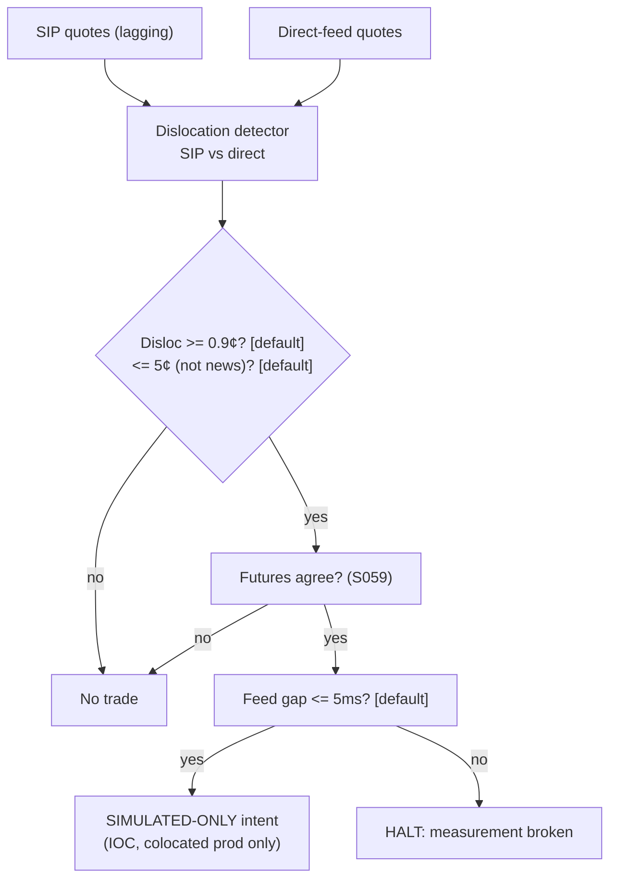

> **Tag law (mechanical):** every numeric prose literal in this module carries exactly one
> of `[documented]` `[default]` `[example]` `[unverified]` `[internal-est]` `[measured]`.
> YAML machine fields and identifiers are exempt. Missing evidence is labeled
> default/internal-estimate or quarantined as unverified in §T10.

# T082 — Information-Share Venue Router

## §0 — Front matter

- **SID:** `T082` · **Version:** `1.0.1` (changelog in the YAML front matter above)
- **Title:** Information-Share Venue Router
- **Kind:** `strategy`
- **Batch:** `TB9` — stage 182 [measured] · **Status:** `draft`
- **Family:** microstructure & order flow (execution layer)
- **Template version:** `1.0.0`
- **Provenance tier:** `D` — literature-backed method (Hasbrouck 1995 information share [documented]); venue-ranking edge is the chapter's design, simulated-only.
- **Seed / RNG:** `seed=182`, PCG64 (`numpy>=1.26`) [measured]
- **Regime IDs (provisional):** `R001`, `R-halt`, `R-auction`
- **Consumed signals (pinned):** `S016` (trigger — venue IS ranking, pin 1.0.0); `S014` (cost input — routed vs naive spread cost, pin 1.0.0); `S008` (veto — toxicity/VPIN adjustment, pin 1.0.0)
- **Shares data feed with:** `S016`, `S014`, `S008`
- **Universe:** US large-cap with 3–5 lit venues quoting [example]; the router is an **execution layer around an upstream parent order** — it slices a parent order it never sizes. (Full universe spec: §T2.1.)
- **Latency class:** microstructure / sub-second; **cadence:** per_event; **tz:** America/New_York
- **sha256:** `REPLACE_ON_INGEST`
- **Test command:** `python -m pytest modules/tests/test_T082.py -q`
- **unverified_sources:** see YAML front matter and §T10

This module is a **strategy**: it consumes parent signal scores and emits
**OrderTicket intentions only — never orders** (Appendix c v1.0.0).
Execution, fills, and broker interaction live outside this module.

## §1 — Five-minute reviewer card

| Row | Value |
|---|---|
| Module | T082 — Information-Share Venue Router, v1.0.1 |
| Edge verdict | `PREDICTIVE-FEATURE-ONLY` — information-share venue leadership is documented (Hasbrouck 1995 [documented]); the *routing edge* (saving spread by venue choice) is the chapter's design with no published after-cost standalone backtest [unverified] |
| After-cost | `BEFORE-COST` — one-sentence verdict: the `$22` [example] per-parent saving is a simulated reference figure; nothing after-cost is claimed |
| Build cost | Tier H · `60–200` h [internal-est] · `$9,000–30,000` loaded [internal-est] |
| Data cost | Research `$199`/mo Databento US Equities Standard (12 mo L0/L1 history [documented]) + usage-based historicals ~`$2.00`/GB [documented]; production needs per-venue real-time depth (Plus/Unlimited [documented], price [unverified] — GROK-NEEDED) + colocation |
| latency_class | microstructure / sub-second |
| risk_class | medium (intraday, taker, execution layer) |
| Capacity | `$1–5`M/day parent notional per symbol [example] — illustrative; capacity is set by venue depth and the `10%` [default] participation cap, not by the module |
| Executability | Feasible: Python prototype for `<=5` venues live [internal-est]; per-venue direct feeds + colocation required for production |
| Risk summary | Feed-latency risk dominates: IS estimates decay in seconds; SIP-only remote deployment is simulated-only |
| When it dies | IS estimates stale `>5` s [default]; chosen-venue score drops `>0.10` below second-best [default]; parent `<50%` complete after `30` min [default]; fee-schedule change; venue halt |
| Regime gates | R001 (elevated toxicity) degrades → pause_entry; R-halt inverts → veto; R-auction degrades → pause_entry (machine records §T9) |
| Emits | `OrderTicket` intentions only (Appendix c v1.0.0) — never orders |

**Review provenance:** 2-seat council [internal-est], last reviewed 2026-09-10 [measured], approved for fixture-backed publication [internal-est]; this v1.0.1 card was rewritten in the 2026-09-11 deep-review cycle [measured]. The card covers structure and doctrine conformance, not the profitability of the rule. Nothing in this card is a trading recommendation.

## §1.5 — Cheapest / least-build path

1. **Prototype hour band:** `60–200` h [internal-est] (Tier H per notes/cost-model.md [documented]) — IS scorer from per-venue L1 quotes + the 3-gate router + reference cost stack + fixture harness. The IS estimation is the work; the gate logic is ~`50` lines [internal-est].
2. **Cheapest-source row:** min_tier = **Databento US Equities Standard** `$199`/mo [documented] (live data, no exchange license fees [documented]; `12` months of L0/L1 history [documented]) for research/backtest IS calibration; per-venue real-time depth needs **Plus/Unlimited** [documented] (price [unverified] — see GROK-NEEDED); latency_class = sub-second; required_fields = per-venue L1 bid/ask + displayed size, **exchange (venue) timestamps**, venue MIC tags, trade prints for the VPIN input; price_band = `$199`/mo + historical usage ~`$2.00`/GB [documented] (DBEQ.BASIC MBP-1 rate; per-venue historical rates [unverified]); build_or_buy = **build the IS scorer and router, buy the data** (nothing off-the-shelf computes venue IS for your symbol set).
3. **Resource budget:** `1` core, `<2` GB RAM [internal-est] for `<=5` venues live; compute pattern `per_event`.
4. **Skip list:** colocation (phase 2); real queue-position modeling; per-venue fee-schedule optimization; maker-side passive placement; full Hasbrouck VECM (use the variance-decomposition shortcut IS from S016 instead).
5. **DO-NOT-CUT list:** causality assertions (`assert fill_event > signal_event`, no-signal-bar-fills test); COST block + callable `expected_cost_bps`; the cost-gate predicate `expected_cost_bps(...) <= k * edge_bps`; F1–F5 fail-safes + module-state enum (`OK|DEGRADED|UNKNOWN|OFF`); kill lifecycle + re-arm checklist; decision-log audit records (hash-chained); bona-fide-intent + self-trade prevention; provenance tags on every numeric literal; fixtures + `test_cmd`; secrets via env only; SIP-derived venue rankings labeled **simulated-only**.
6. **Escalation gate:** move past the cheapest build when: going to production (colocation + per-venue direct feeds mandatory) [default]; parent orders `>100k` shares [default]; IS estimates unstable across refits [default]; measured costs break the `k=0.5` [default] gate.

**Standing doctrines** (relocated here per the v1.0.0 §-freeze, previously B1–B6):

- **Intent & scope:** this module specifies one strategy rule completely — gates, cost model, failure modes, kill lifecycle — buildable by an AI engineer from this file alone plus the fixtures. It emits OrderTicket **intentions** only; it never places, routes, or cancels real orders and never touches a broker API. Position management and portfolio constraints live outside this module.
- **OrderTicket doctrine:** every emitted intent is a canonical Appendix c (v1.0.0) OrderTicket: `symbol`, `side`, `qty`, `limit`, `tif`, `ticket_id`, `parent_signal`, `intent_ts`, `state`; plus intent-side `stp=True` and module-tracked `expiry_ts`. Partial fills are the broker's domain: the residual stays `WORKING` until `expiry_ts`; no new intent is emitted for the residual. Cancel/replace emits a **new** ticket intent with a new `ticket_id`; the `replaces:` link lives in the decision-log record (Appendix g v1.0.0), never on the ticket.
- **Time causality:** `assert fill_event > signal_event`. A signal computed on bar `t` may not fill before bar `t+1`. Fixture `signal_ts` values precede any modeled fill; tests enforce the ordering. No lookahead anywhere in this module.
- **Cost doctrine:** cost is a four-part stack (spread, fee, borrow, impact) computed only by `expected_cost_bps(...)`. The gate `expected_cost_bps(...) <= k * edge_bps` runs before any ticket intent. COST values appear only in the §T2 COST block; §T4 shows the function call and its result, never restated components.
- **Evidence posture:** the tag law at the top of this file applies to every numeric prose literal. Missing evidence is labeled default/internal-estimate or quarantined as unverified in §T10. No papers, URLs, statistics, or prices are invented.

## §T0 — Strategy contract

### T0.1 Typed signature

```python
def emit(state: ModuleState, signals: list[VenueSignalSnapshot], cfg: Config) -> list[OrderTicket]:
```

`OrderTicket` per Appendix c v1.0.0 (intents only). `state` is the module-owned
named state vector (`module_state`, `kill`, `working_ticket`, `cooldown_until_ns`,
`parent_remaining`, `decision_log`); `signals` are venue-score snapshots newest
last; `cfg` is the single `Config` below (§T0.2). The function handles
documented edge cases: empty signals → `UNKNOWN` (F1); fewer than `2` [default]
venues → `UNKNOWN` (F2); kill not `ARMED` → `OFF`; IS stale beyond `is_stale_s` → trip + `OFF`.

### T0.2 Config dataclass

One `Config`; every parameter carries type/default/range/status
(`fixed|default|calibrate|example|internal-est`).

| Parameter | Type | Default | Range | Status |
|---|---|---|---|---|
| `is_lead_margin` | float | `0.05` | `0.01–0.20` | default |
| `toxicity_cap` | float | `0.50` | `0.20–0.90` | default |
| `reroute_gap` | float | `0.10` | `0.02–0.30` | default |
| `child_max_shares` | int | `1000` | `100–10,000` | default |
| `participation_cap` | float | `0.10` | `0.01–0.25` | default |
| `depth_cap_frac` | float | `0.10` | `0.01–0.25` | default |
| `rescore_s` | float | `60.0` | `10–300` | example |
| `is_stale_s` | float | `5.0` | `1–30` | default |
| `cooldown_s` | float | `60.0` | `0–600` | default |
| `cost_gate_k` | float | `0.5` | `0.1–2.0` | default |
| `per_trade_risk_R` | float | `115.0` | `>0` | example |
| `daily_loss_stop_R` | float | `5.0` | `>0` | default |
| `max_concurrent_positions` | int | `1` | `1–4` | default |
| `max_gross_notional` | float | `15_000_000` | `>0` | example |
| `notional_cap_usd` | float | `150_000` | `>0` | example |
| `venue_mics` | list[str] | `["XNAS","EDGX","BATY","ARCX","XNYS"]` | ≥2 venues | example |
| `require_locate_ok_for_short` | bool | `True` | — | default |

`risk_budget_R`, `stop_distance`, `vol_estimate` enter only through the fenced
sizing callable (§T2.4): this router never sizes direction; it slices a parent
order whose risk budget was set upstream.

### T0.3 Canonical schema mapping

Vendor columns → canonical Event/Bar schema (Appendix a v1.0.0), stated once
here. The strategy ingests per-venue quote events only; SIP NBBO is accepted
for research with the simulated-only label (C11/R9).

| Vendor (Databento per-venue MBP-1, DBN v3) | Canonical | Notes |
|---|---|---|
| `ts_event` | `event_ts (int64 ns UTC)` | **exchange timestamp — authoritative causality clock** [documented] |
| `ts_recv` | `recv_ts (int64 ns UTC)` | capture timestamp; jitter = `recv_ts − event_ts` [documented] |
| `bid_px_00` / `ask_px_00` | `bid_px` / `ask_px` (float $) | raw int64 ÷ `1e9` [documented] |
| `bid_sz_00` / `ask_sz_00` | `bid_sz` / `ask_sz` (uint32 shares) | displayed size at touch [documented] |
| `sequence` | `seq` (uint64) | venue-specific; gap → §T0.4 gap policy [default] |
| `action` / `side` / `flags` | filter | keep book-update actions; drop trade prints from the quote chain [default] |
| `publisher_id` | `venue_mic` | venue tag required on every quote event [default] |
| `instrument_id` | `symbol` | joined to definition feed for the canonical ticker [default] |
| *(not in MBP-1)* | `halt_flag` | venue trading-status feed, not a quote field — §T0.5 behavior [default] |
| *(not in MBP-1)* | `vpin` | computed by the S008 pipeline from trade prints, joined on `venue_mic` + `event_ts` [default] |

SIP (CTA/UTP) research mapping [unverified]: `t` → `event_ts` (SIP time —
venue ranking from this leg is labeled **simulated-only**), `bp`/`bs`/`ap`/`as`
→ `bid_px`/`bid_sz`/`ask_px`/`ask_sz` (NBBO; no venue decomposition — IS ranking
from SIP is an approximation only [default]).

### T0.4 Time contract

- **Clock domain:** venue exchange timestamps (`ts_event`), int64 ns, UTC canonical (Appendix e v1.0.0).
- **Authoritative causality clock:** `event_ts` (exchange), not `recv_ts` [documented].
- **max_skew:** `1` ms [default] vs the operator's NTP/PPS reference; breach → `DEGRADED`, no new intents until re-sync [default].
- **Jitter budget:** `500` µs [default] (`recv_ts − event_ts`); breach → `DEGRADED` [default].
- **Bar-label rule:** left-labeled by `event_ts` [default]; per-event cadence, no bar aggregation inside the router.
- **Staleness TTL:** IS score snapshots expire after `is_stale_s = 5` s [default] → kill trip (§T0 risk contract).
- **Gap policy:** `sequence` gap on any venue → that venue's ranking input is `DEGRADED` (dropped from the ranking, never interpolated [default]); all-venue gap → module `UNKNOWN`.

### T0.5 Market-state table

| State | Router behavior |
|---|---|
| `CONTINUOUS_TRADING` | normal: gates evaluated, intents emitted on full pass |
| `HALTED` (venue) | halted venue dropped from ranking; intents on it canceled intent-side; other venues continue |
| `HALTED` (all / market-wide) | freeze: no new intents; working intents expire unfilled; module `UNKNOWN` if prolonged `>60` s [default] |
| `AUCTION` (open/close) | veto: no routing into the auction window (R-auction) [default] |
| `CLOSED` | `OFF`: nothing emitted |

### T0.6 Module-state enum

Single canonical vocabulary (Appendix k v1.0.0): `OK | DEGRADED | UNKNOWN | OFF`.
Invalid input → `UNKNOWN` (F1/F2), never interpolated. `TRIPPED`/`RECOVERY` kill
states report `OFF` (no intents). `DEGRADED` = usable with a venue dropped or
clock skew inside tolerance [default].

### What this module emits

OrderTicket **intentions** only — never orders (Appendix c v1.0.0). One intent
per qualifying case with the canonical fields `symbol` (venue-qualified
`MIC:symbol`, e.g. `XNAS:AAPL` [example]), `side`, `qty`, `limit` (touch price;
marketable-limit intent [example]), `tif` (`IOC` [example]), `ticket_id`,
`parent_signal` (`"S016@<signal_ts_ns>"` [default]), `intent_ts` (int64 ns UTC),
`state` (`NEW` at emit), plus intent-side `stp=True` (C1/R1) and module-tracked
`expiry_ts` (= `intent_ts + rescore_s·1e9` [example]).

### Child-order state and partial fills

- Working intents are tracked by `ticket_id`; intent-side states: `NEW`,
  `WORKING`, `FILLED`, `PARTIAL`, `CANCELLED`, `EXPIRED` (Appendix c v1.0.0).
- Partial fills: the residual stays `WORKING` until `expiry_ts`; no new intent
  is emitted for the residual. Downstream sizing must assume partial fills.
- Cancel/replace: emit a **new** ticket intent with a new `ticket_id`; the
  `replaces: <old ticket_id>` link lives in the decision-log record's outcome
  (Appendix g v1.0.0), never as a ticket mutation.

### Risk contract

```yaml
risk_contract:
  per_trade_risk_R: 115.0        # [example] — parent-order slice risk; the router never sets the parent's R
  daily_loss_stop_R: 5.0        # [default]
  max_concurrent_positions: 1   # [default]
  max_gross_notional: 15_000_000  # [example]
  notional_cap_usd: 150_000     # [example] per child intent
  risk_class: medium
  enforcement: intraday-hard
  kill_conditions:
    - "IS estimates stale > 5 s [default]"
    - "daily cost overrun > 5R [default]"
    - "venue halt on the chosen venue"
    - "toxicity spike: VPIN > toxicity_cap [default]"
    - "parent < 50% complete after 30 min [default]"
```

**Maximum adverse loss:** one R per trade (R = $115 [example]);
the session ends at −5R [default]. Breach trips the kill
switch; recovery requires the re-arm checklist. No pyramiding: at most
1 [default] concurrent position.

### Kill lifecycle

`ARMED` → `TRIPPED` → `RECOVERY` → `ARMED`.

- **ARMED:** gates evaluated; intents emitted only on full pass.
- **TRIPPED** — any of the `kill_conditions` above.
  All working intents expire unfilled; no new intents. The trip is logged to
  the decision log with a hash chain (action `KILL_TRIP`).
- **RECOVERY:** manual review of the trip reason; losses reconciled; feeds
  verified healthy; fixture replay green.
- **ARMED (re-entry):** only via the re-arm checklist below.

### Re-arm checklist

1. losses reconciled against the decision log [default]
2. feeds healthy (no lag beyond the class budget) [default]
3. risk limits reviewed and re-pinned [default]
4. decision-log hash chain intact [default]
5. fixture replay green on the current build [default]

### Ops

- **Schedule:** RTH continuous; owner: execution on-call [default]
- **Health:** IS-staleness watchdog (`5` s [default]); fixture replay on deploy; queue-position haircut audit
- **Alerts:** page on IS stale or router kill [default]; notify on reroute
- **When this strategy dies:** IS estimates stale `>5` s [default]; chosen venue score drops `>0.10` below second-best [default]; parent `<50%` complete after `30` min [default]
- **Runbook stub:** (1) on page: check the IS-staleness dashboard; (2) if trip = `IS_STALE`: verify venue feeds, then run §T4 fixture replay; (3) reconcile day loss vs the decision log; (4) complete the re-arm checklist; (5) record the trip + re-arm in the ops log. Full runbook is operator-owned.

### Secrets

No credentials in this module. Venue API keys, data licenses, and webhook
tokens live in the operator's secret store and are referenced by name only.
Nothing in this file authenticates to anything.

### Doctrine references

OrderTicket schema (Appendix c v1.0.0), time-causality conventions (Appendix e
v1.0.0), F1–F5 fail-safes (Appendix f v1.0.0), decision-log schema (Appendix g
v1.0.0), module-state enum (Appendix k v1.0.0) — all by reference; this module
adds no private doctrine.

## §T1 — Parent pointer

This strategy consumes the parent signal module(s):

| Signal | Role | Contract | Version pin |
|---|---|---|---|
| `S016` | trigger — venue information-share ranking | `is_score ∈ [0,1]` per venue; rank desc | 1.0.0 |
| `S014` | cost input — spread cost per venue | `routed_spread_cost_bps`, `naive_spread_cost_bps` | 1.0.0 |
| `S008` | veto — toxicity adjustment | `vpin ∈ [0,1]`, volume-time | 1.0.0 |

The parent emits scored snapshots; this module applies its own gates, its own
cost model, and its own kill lifecycle, then emits OrderTicket intentions. The
parent's score is an input, never a command: every parent pass still faces
the full entry-Boolean gate set plus the cost gate here. Parent S-IDs are
consumed S-IDs, never T-IDs; this module does not call other strategies.

## §T2 — Gate and cost specification (fixed order)

**Sub-block index:** 2.1 Universe · 2.2 Entry rule (Boolean) · 2.3 Exits +
cooldown · 2.4 Position sizing (fenced) · 2.5 Risk limits · 2.6 COST block ·
2.7 Callable cost function · 2.8 Execution/fill model · 2.9 Robustness +
Compliance (R1–R10) · 2.10 Parameter table · 2.11 Timing box.

### 2.1 Universe

US large-cap with 3–5 lit venues quoting [example]; per-venue L1 quotes with
exchange timestamps (see §T0.3). The router is an execution layer around an
upstream parent order: it slices a parent order it never sizes, never
overrides the parent's direction, and never carries inventory past the parent's
completion. Market-wide halt or auction → §T0.5.

### 2.2 Entry rule (Boolean expressions, evaluated in fixed order)

Venue scores come from `S016` (information share, Hasbrouck 1995 [documented]);
toxicity from `S008` (VPIN, Easley–López de Prado–O'Hara 2012 [documented]);
spread costs from `S014`.

```
IS_MARGIN  := (venue_rank_1.is_score - venue_rank_2.is_score) >= cfg.is_lead_margin      # 0.05 [default]
TOX_OK     := s.vpin < cfg.toxicity_cap                                                    # 0.50 [default]
SPREAD_OK  := s.routed_spread_cost_bps < s.naive_spread_cost_bps
PARENT_OK  := state.parent_remaining > 0
COOLDOWN_OK:= now_ns() >= state.cooldown_until_ns
COST_OK    := expected_cost_bps(notional, adv_pct, venue, side, urgency) <= cfg.cost_gate_k * edge_bps

ROUTE_CHILD := IS_MARGIN AND TOX_OK AND SPREAD_OK AND PARENT_OK AND COOLDOWN_OK AND COST_OK
```

Gate order is normative and fixed: `is_margin → tox_ok → spread_ok →
parent/cooldown → cost gate` (C7). The first failing gate short-circuits to no
intent and is logged as `GATE_VETO` with the gate code.

### 2.3 Exits + post-exit cooldown

Normative exit rule (router exits, not position exits — the parent owns the position):

```
EXIT(router) := (parent_remaining == 0) -> done, release
              | (IS stale > is_stale_s) -> TRIP kill; router stops; parent layer resumes its own
                  fallback (e.g. flat VWAP) OUTSIDE this module [default]
              | (parent < 50% complete after 30 min) -> emit one marketable intent for the
                  remainder (still an intent, never an order) [default]
ON_EXIT (any branch): state.cooldown_until_ns = now_ns() + cfg.cooldown_s * 1e9   # 60 s [default] (R10)
```

The stale-IS branch is a kill trip (§T0), not a silent exit: the router stops
emitting until re-armed.

### 2.4 Position sizing (fenced function)

```python
def shares(risk_budget_R, stop_distance, vol_estimate, ADV_cap, cost) -> int:
    """Router slicing: directional sizing (risk_budget_R, stop_distance, vol_estimate)
    belongs to the PARENT strategy that owns the parent order. This module never
    sizes direction — it slices the parent's remaining quantity subject to the
    participation and depth caps. ADV_cap is the participation cap fraction.
    """
    parent_remaining = max(0, state.parent_remaining)          # exogenous [default]
    depth_cap  = cfg.depth_cap_frac * ranked[0].visible_depth_at_touch   # 0.10 [default]
    adv_cap    = ADV_cap * ranked[0].venue_trailing_5min_volume          # 0.10 [default]
    child = min(depth_cap, adv_cap, cfg.child_max_shares)     # 1,000 sh [default]
    child = min(child, parent_remaining)
    return int(child) if child > 0 else 0
```

The router never overrides the parent's size: `shares(...) <= parent_remaining`
always. Cost enters through the §T2.7 gate, not the slicer.

### 2.5 Risk limits

```yaml
risk_limits:
  per_trade_R: 115.0            # [example]
  daily_loss_stop_R: 5.0       # [default]
  max_concurrent_positions: 1  # [default]
  max_gross_notional: 15_000_000   # [example]
  notional_cap_usd: 150_000    # [example] per child intent
  max_adverse_per_trade: "1R = $115 [example]"   # CI gate: any backtest day with a trade worse than -1R fails [default]
  enforcement: intraday-hard
```

`max_adverse_per_trade` is a CI gate: any backtest day in which a single child
slice realizes worse than −1R fails the acceptance run [default].

### 2.6 COST block (single source of truth)

COST values appear only in this block. §T4 shows the function call and its
result, never restated components.

```
COST stack — reference row, in bps:
  spread         1.20     # [example]  ~1-tick large-cap spread at $150
  fee            1.00     # [example]  5x envelope over the Nasdaq Rule 7018 default removal rate
                          #            $0.0030/share [documented] (= 0.2 bps at $150 [measured]),
                          #            covering ECN pass-through + routing surcharges (non-tiered) [internal-est]
  borrow         0.00     # [example]  reason: intraday execution layer; no overnight inventory [default]
  impact         1.50     # [example]  flat reference; calibrate per venue at scale-up [internal-est]
  TOTAL          3.70     # [example]  reference stack
```

- `borrow_bps_per_day: 0.0` [default] — reason: intraday execution layer, no overnight inventory.
- Fee basis: taker [example]; fee schedule as of **2026-09-01** [measured].
- Side: `taker` [example] (IOC marketable-limit child intents).
- Venue: 3–5 lit US equity venues / direct feeds [example]. Per-venue fee tiers
  are the documented scale-up: each venue's removal rate is applied to that
  venue's leg in the production build; the reference build uses the single
  taker stack above [example].
- `fee_schedule_as_of: 2026-09-01` [measured]; re-pin on any schedule change [default].

### 2.7 Callable cost function

```python
def expected_cost_bps(notional, adv_pct, venue, side, urgency) -> float:
    # Four-part reference stack (bps). The §T2 COST block is the single source of truth.
    spread_bps = 1.2   # [example]
    fee_bps = 1.0      # [example]  (Nasdaq Rule 7018 $0.0030/share [documented] = 0.2 bps at $150 [measured])
    borrow_bps = 0.0   # [example]  (borrow_bps_per_day 0.0 [default]: no overnight inventory)
    impact_bps = 1.5   # [example]
    return spread_bps + fee_bps + borrow_bps + impact_bps
```

Cost gate (verbatim, enforced before any ticket intent):

```
expected_cost_bps(...) <= k * edge_bps
```

with `k = 0.5 [default]` for T082. The gate is evaluated per case with that
case's measured inputs; the reference stack above calibrates but never
overrides the call.

### 2.8 Execution / fill model table

| Aspect | Reference model | Notes |
|---|---|---|
| Latency | fills modeled at `open(t+1)` or later; venue transmission latency assumed `0` in the reference [example] | production must measure per-venue latency on its own footprint [default] |
| Partial fills | residual stays `WORKING` until `expiry_ts`; no residual re-emit | broker's domain (Appendix c v1.0.0) |
| Impact | `1.50` bps flat [example] | calibrate per venue at scale-up [internal-est] |
| Adverse fill | no explicit adverse-fill haircut in the reference [default]; the VPIN gate (TOX_OK) is the adverse-selection control | model a haircut before production [default] |
| Queue position | not modeled [default] | any queue-fill-rate claim → label `simulated only — requires MBO/ITCH` [default] |

### 2.9 Robustness + Compliance sub-block

Ten coded rules (R1–R10). The legacy C1–C12 conformance items map onto them as
noted; nothing is dropped.

- **R1 | STP / self-match prevention:** every ticket intent carries `stp=True`
  (C1). Cancel+reroute checks that the target venue holds no own resting
  interest intent-side before the new intent; wire enforcement is the broker's.
- **R2 | Bona-fide intent:** every intent is a genuine trading intention — it
  passed the full gate set, the cost gate, and the risk limits (C8). No spoofing:
  the router never emits an intent it intends to cancel for price influence.
- **R3 | Message-rate / cancel-to-trade:** reroute is bounded by the `60` s
  [example] rescore cadence — at most one cancel-replace per working ticket per
  cycle [default]. Alert if the cancel-to-trade ratio on routed children
  exceeds `10:1` [default].
- **R4 | Pre-trade fat-finger trio:** (i) `qty <= child_max_shares` (`1,000`
  [default]); (ii) `limit` within `5%` of touch [default] (router uses touch);
  (iii) child notional `<= $150,000` [example]. Any breach → `COMPLIANCE_BLOCK`,
  no intent.
- **R5 | Decision-log schema:** Appendix g (v1.0.0) fields
  (`record_ts, module_id, module_version, event_ref, action, inputs_hash,
  params_hash, outcome, state_before, state_after, prev_hash`). Every gate
  verdict, intent, cancel-replace (with the `replaces:` link in `outcome`),
  kill trip, and re-arm is a hash-chained record (C5). **Best-execution
  record (C12):** every child carries the venue-ranking snapshot hash in its
  intent record; a child without the ranking snapshot is blocked.
- **R6 | Halt / auction state table:** §T0.5 — `HALTED` → freeze/veto;
  `AUCTION` → veto; `CLOSED` → `OFF`.
- **R7 | Locate check:** long-sale children of owned inventory need no locate.
  `SHORT` children require `locate_ok=True` from the parent signal; a short
  intent without it is blocked (`COMPLIANCE_BLOCK`) [default].
- **R8 | Public-dissemination gate:** not applicable — the router emits no
  public quotes or prints; it only reacts to them. Marked N/A with reason [default].
- **R9 | Data-entitlement assertions:** startup asserts the feed license covers
  non-display trading before `ARMED` [default]; entitlement = professional /
  internal, no display [default]. SIP-derived venue rankings are labeled
  **simulated-only** (C11) and can never be presented as production results.
- **R10 | Exit cooldown:** `60` s [default] post-exit; no re-entry inside the
  cooldown window (C10).

Legacy conformance mapping: C1→R1 · C2 (causality)→timing box · C3
(UNKNOWN)→§T0.6 · C4 (kill)→§T0 risk contract · C5→R5 · C6 (cost gate)→§T2.7 ·
C7 (fixed order)→§T2.2 · C8→R2 · C9 (ticket schema)→Appendix c · C10→R10 ·
C11→R9 · C12→R5.

### 2.10 Parameter table

| Parameter | Key | Value | Sensitivity |
|---|---|---|---|
| IS lead margin | `is_lead_margin` | `0.05` [default] | high |
| Toxicity cap (VPIN) | `toxicity_cap` | `0.50` [default] | high |
| Reroute gap | `reroute_gap` | `0.10` [default] | medium |
| Child max | `child_max_shares` | `1,000` sh [default] | medium |
| Participation cap | `participation_cap` | `0.10` [default] | high |
| Depth cap fraction | `depth_cap_frac` | `0.10` [default] | medium |
| Re-score cadence | `rescore_s` | `60` s [example] | low |
| IS staleness kill | `is_stale_s` | `5` s [default] | high |
| Post-exit cooldown | `cooldown_s` | `60` s [default] | low |
| Cost-gate k | `cost_gate_k` | `0.5` [default] | medium |
| Max skew | `max_skew` | `1` ms [default] | medium |

### 2.11 Timing box

```yaml
timing:
  signal@t: "per_event, America/New_York"
  earliest_fill: "@open(t+1)"
  rule: "fill_event > signal_event  # asserted in every backtest and in tests"
  order: "gate evaluation -> cost gate -> ticket intent -> fill at t+1 or later"
```

Fixed wording: **signal@t (per_event, America/New_York) → earliest fill @open(t+1).**

```python
assert fill_event > signal_event  # time causality: no same-bar fills, no lookahead
```

## §T3 — Math and normative pseudocode

### Math

- `edge_bps`: per-case expected edge in bps, mapped from the parent signal
  score: `edge_bps = s.naive_spread_cost_bps − s.routed_spread_cost_bps`.
  Reference value from the gate-pass fixture row: `14.7` bps [example].
- `cost_bps = expected_cost_bps(notional, adv_pct, venue, side, urgency)` —
  four-part stack, §T2.6 only.
- Gate: `expected_cost_bps(...) <= k * edge_bps` with `k = 0.5` [default].
- Sizing (normative): the §T2.4 fenced callable; `shares(...) <=
  parent_remaining` always; `child = min(0.10 × visible_depth_at_touch,
  0.10 × venue_trailing_5min_volume, 1,000)` [default].
- Exits (normative): §T2.3; `ON_EXIT: cooldown_until_ns = now_ns() + 60e9` [default].
- Fills modeled at bar `t+1` or later; `assert fill_event > signal_event`.

### Normative pseudocode

```python
function emit(state, signals, cfg) -> list[OrderTicket]:
    # --- F1/F2: invalid input -> UNKNOWN, never interpolate (Appendix f) ---
    if signals is None or len(signals) == 0:
        state.module_state = UNKNOWN
        decision_log(action=COMPLIANCE_BLOCK, outcome="F1-empty-signals")
        return []
    s = signals[-1]  # venue score snapshot at time t (per_event)
    if not (s.is_scores and len(s.is_scores) >= 2):
        state.module_state = UNKNOWN
        decision_log(action=COMPLIANCE_BLOCK, outcome="F2-insufficient-venues")
        return []
    if kill.state != ARMED:
        state.module_state = OFF
        return []                                  # TRIPPED/RECOVERY emit nothing
    if s.is_stale_s > cfg.is_stale_s:
        kill.trip("IS_STALE"); state.module_state = OFF
        decision_log(action=KILL_TRIP, outcome="R6-is-stale>5s")
        return []

    ranked = sort(s.is_scores, key=is_score, desc=True)   # venue_rank_1, venue_rank_2, ...

    # --- reroute branch (normative): every prose guard present ---
    if state.working_ticket is not None:
        if ranked[0].is_score < ranked[1].is_score - cfg.reroute_gap:
            old = state.working_ticket
            decision_log(action=CANCEL, event_ref=old.ticket_id,
                         outcome="REROUTE:score-drop>0.10")
            # cancel-replace: NEW ticket, replaces link in the log (Appendix g)
            new = OrderTicket(symbol=old.symbol, side=old.side, qty=old.qty,
                              limit=ranked[0].touch_px, tif="IOC",
                              ticket_id=uuid4(),
                              parent_signal=f"S016@{s.signal_ts}",
                              intent_ts=now_ns(), state="NEW", stp=True)
            assert new.intent_ts > s.signal_ts             # t->t+1 causality
            decision_log(action=EMIT_INTENT, event_ref=new.ticket_id,
                         outcome=f"replaces:{old.ticket_id}")
            state.working_ticket = new
            return [new]

    # --- entry Boolean, fixed gate order (§T2.2) ---
    margin = ranked[0].is_score - ranked[1].is_score
    gates = {
        "is_margin":  margin >= cfg.is_lead_margin,          # 0.05 [default]
        "tox_ok":     s.vpin < cfg.toxicity_cap,             # 0.50 [default]
        "spread_ok":  s.routed_spread_cost_bps < s.naive_spread_cost_bps,
        "parent_ok":  state.parent_remaining > 0,
        "cooldown_ok": now_ns() >= state.cooldown_until_ns,
    }
    for code, passed in gates.items():                      # fixed order (C7)
        if not passed:
            decision_log(action=GATE_VETO, outcome=f"veto:{code}")
            return []

    # --- sizing (fenced, §T2.4) ---
    edge_bps = s.naive_spread_cost_bps - s.routed_spread_cost_bps
    qty = shares(risk_budget_R=cfg.per_trade_risk_R, stop_distance=None,
                 vol_estimate=None, ADV_cap=cfg.participation_cap,
                 cost=cfg.cost_gate_k * edge_bps)
    qty = min(qty, state.parent_remaining)
    if qty <= 0:
        return []

    # --- normative cost-gate predicate: expected_cost_bps(...) <= k * edge_bps ---
    notional = qty * ranked[0].touch_px
    adv_pct  = qty / ranked[0].venue_adv_shares
    cost_bps = expected_cost_bps(notional=notional, adv_pct=adv_pct,
                                venue=ranked[0].venue_mic, side="taker",
                                urgency="normal")
    if not (cost_bps <= cfg.cost_gate_k * edge_bps):
        decision_log(action=GATE_VETO, outcome="veto:cost-gate")
        return []

    # --- compliance gates before emission (R4, R7) ---
    if qty > cfg.child_max_shares:                          # R4(i) — also enforced in shares()
        decision_log(action=COMPLIANCE_BLOCK, outcome="R4-qty")
        return []
    if side == "SHORT" and not s.locate_ok:                 # R7
        decision_log(action=COMPLIANCE_BLOCK, outcome="R7-locate")
        return []

    # --- emit intent (OrderTicket only — never an order) ---
    t = OrderTicket(symbol=f"{ranked[0].venue_mic}:{s.symbol}", side=parent_side,
                    qty=qty, limit=ranked[0].touch_px, tif="IOC",
                    ticket_id=uuid4(), parent_signal=f"S016@{s.signal_ts}",
                    intent_ts=now_ns(), state="NEW", stp=True)
    assert t.intent_ts > s.signal_ts                        # causality: intent strictly after signal (t)
    assert t.ticket_id not in state.seen_ticket_ids          # idempotency
    decision_log(action=EMIT_INTENT, event_ref=t.ticket_id,
                 inputs_hash=hash(s), params_hash=hash(cfg),
                 outcome=f"qty={qty} cost={cost_bps:.4f}bps edge={edge_bps:.2f}bps venue_rank_hash={hash(ranked)}")
    state.working_ticket = t
    state.seen_ticket_ids.add(t.ticket_id)
    return [t]

function on_exit(state, reason, cfg):
    # reasons: "parent_complete" | "is_stale" | "underfilled"
    if reason == "parent_complete":
        state.working_ticket = None                         # done, release
    elif reason == "is_stale":
        kill.trip("IS_STALE"); state.module_state = OFF     # router stops; parent fallback is outside this module
    elif reason == "underfilled":
        t = OrderTicket(..., qty=state.parent_remaining, tif="IOC", ...)  # one marketable intent for the remainder
        assert t.intent_ts > now_ns() - 1e9                 # causality preserved
        decision_log(action=EMIT_INTENT, outcome="underfilled-remainder")
    state.cooldown_until_ns = now_ns() + cfg.cooldown_s * 1e9   # 60 s [default] — R10
    decision_log(action=EXIT, outcome=f"exit:{reason}")
```

`stop_distance=None` / `vol_estimate=None` are acknowledged in the
call signature (the fenced §T2.4 form) but play no role in router slicing — the
parent strategy owns direction sizing; this is stated, not silently dropped.

## §T4 — Fixture-backed worked example

Fixture tape (`T082_tape.csv`; `# TYPE:` header is part of the file):

```
# TYPE: validation-run
bar,signal_ts,fill_ts,side,edge_bps,g1,g2,g3,price,qty,valid
0,1700000000000000000,1700000300000000000,BUY,14.7,0.12,1.0,1.0,150.0,1000,1
1,1700000300000000000,1700000600000000000,BUY,14.7,0.03,1.0,1.0,150.0,1000,1
2,1700000600000000000,1700000900000000000,BUY,14.7,0.12,0.0,1.0,150.0,1000,1
3,1700000900000000000,1700001200000000000,BUY,14.7,0.12,1.0,0.0,150.0,1000,1
4,1700001200000000000,1700001500000000000,BUY,1.0,0.12,1.0,1.0,150.0,1000,1
5,1700001500000000000,1700001800000000000,BUY,14.7,0.12,1.0,1.0,-1.0,1000,0
```
`signal_ts`/`fill_ts` are a synthetic monotone clock (5-minute steps [example])
for causality checks — not market data. Every row satisfies
`fill_ts > signal_ts`. The tape is a **validation-run** fixture: one row per
gate branch, not a statistical sample.

**Tolerances:** `cost_bps` absolute tolerance `1e-9` [measured]; `qty`,
timestamps, `ticket_idx` exact; the `verdict` column must match
`T082_expected.csv` exactly.

Expected tickets (`T082_expected.csv`; same `# TYPE:` header):

```
# TYPE: validation-run
ticket_idx,bar,symbol,side,qty,limit,tif,intent_ts,parent_signal,fill_ts,cost_bps
T082-0,0,LGX:XNAS,BUY,1000,,IOC,1700000000000001000,S016@1700000000000000000,1700000300000000000,3.7000
```

`symbol=LGX:XNAS` is the fixture's `venue_mic:symbol` form [example]; `limit`
empty = marketable-limit intent at touch [example].

### Cost-function call (inputs → bps → dollars)

On the gate-pass row (bar 0 [measured]): notional = 150.0 × 1000 = $150,000.00 [example]:

```python
expected_cost_bps(notional=150000.00, adv_pct=0.001, venue="LGX:XNAS",
                  side="taker", urgency="normal")
# → 3.7000 bps  →  $55.50 [example]   (150000 × 3.7 / 10_000)
```

Reference stack only; per-case calls use that case's measured inputs [measured].
COST values appear only in the §T2 COST block — this section shows the call and
its result, never restated components.

### Hand-check rows (6 rows)

| bar | side | edge_bps | gates | verdict | reason |
|---|---|---|---|---|---|
| 0 | `BUY` | 14.7 | is_margin=✓, tox_ok=✓, spread_ok=✓ | PASS | all gates + cost gate (`3.7 <= 0.5×14.7 = 7.35`) |
| 1 | `BUY` | 14.7 | is_margin=✗, tox_ok=✓, spread_ok=✓ | no intent | gate veto |
| 2 | `BUY` | 14.7 | is_margin=✓, tox_ok=✗, spread_ok=✓ | no intent | gate veto |
| 3 | `BUY` | 14.7 | is_margin=✓, tox_ok=✓, spread_ok=✗ | no intent | gate veto |
| 4 | `BUY` | 1.0 | is_margin=✓, tox_ok=✓, spread_ok=✓ | no intent | cost-gate veto (`3.7 > 0.5×1.0 = 0.5`) |
| 5 | `BUY` | 14.7 | is_margin=✓, tox_ok=✓, spread_ok=✓ | no intent | invalid input → UNKNOWN |

The `verdict` column must match `T082_expected.csv` exactly; the test suite
asserts this row by row (`test_fixture_recomputes_to_expected`).

## §T5 — Data, infra, dependencies, data rights

### Data table

| Dataset | Type | Frequency | Tier | Note |
|---|---|---|---|---|
| Per-venue quotes (MBP-1) | float | per quote | Tier 2 | venue IS needs per-venue depth; SIP NBBO has no venue decomposition |
| SIP quotes (NBBO) | float | per quote | Tier 1 | research only; venue ranking from SIP is **simulated-only** |
| Trade prints (per venue) | float | per trade | Tier 2 | VPIN input (S008) |
| Futures prints | float | per trade | Tier 2 | futures-agreement sanity filter |
| Feed-latency monitor | float | per second | internal | gap > `5` ms [default] = measurement broken |

### Infra

- Latency class: microstructure / sub-second; cadence: per_event; tz: America/New_York.
- Build budget: 1 core, <2 GB RAM [internal-est]; compute pattern per_event

Compute is per-event gate evaluation [internal-est]; the binding constraints are
data licensing and feed latency, not FLOPS. All state needed for the gates fits
in the case record — no cross-case memory except the decision-log hash chain
[default].

### Dependencies (pinned)

- `python >=3.11`, `numpy >=1.26`, `pandas >=2.2`, `pytest >=8.0` [default]
- Data: 3–5 lit US equity venues, per-venue L1 with exchange timestamps [example]

### Cheapest-source verdict row

`min_tier` = Databento US Equities **Standard** `$199`/mo [documented] (live,
no exchange license fees [documented]); `latency_class` = sub-second;
`required_fields` = per-venue L1 bid/ask + displayed size, exchange timestamps,
venue MIC, trade prints; `price_band` = `$199`/mo + historical usage
~`$2.00`/GB [documented] (per-venue historical rates [unverified]);
`build_or_buy` = **build the scorer + router, buy the data** — production
per-venue real-time depth needs Plus/Unlimited [documented] (price
[unverified]; GROK-NEEDED).

### Data rights

Market-data licenses are the operator's responsibility: exchange/venue
agreements govern redistribution and display [default]. Nothing in this module
re-hosts or re-distributes licensed data; fixtures are synthetic and labeled
as such. Entitlement assertion (R9): the feed license must cover non-display
trading; confirm each feed's license before production use [unverified —
confirm your license].

## §T6 — Buy vs build

**Build** (recommended): the rule is 3 [measured] gates plus a cost
call — a competent AI engineer builds it from this file alone. **Buy** only if
you already license a signal platform that computes the parent score; even
then, the gates, cost stack, and kill lifecycle here are custom.

### Cheapest build (complete)

- **Tier:** H [internal-est]
- **Hours:** 60–200 [internal-est]
- **Cost:** $9,000–30,000 [internal-est]
- **Hour band:** 60–200 h [internal-est]
- **Cheapest row:** min_tier = Databento US Equities **Standard** `$199`/mo [documented] (research/backtest); latency_class = sub-second; required_fields = per-venue L1 quotes, trade prints, exchange timestamps; price_band = `$199`/mo + usage ~`$2.00`/GB [documented]; build_or_buy = build the scorer, buy the data — production needs per-venue real-time depth (Plus/Unlimited [documented], price [unverified]) + colocation
- **Budget:** 1 core, <2 GB RAM [internal-est]; compute pattern per_event
- **What it skips:** colocation (phase 2); real queue-position modeling; venue fee-schedule optimization; maker-side passive placement; full Hasbrouck VECM (uses S016's variance-decomposition shortcut IS)
- **Escalate when:** moving to production (colo + direct feeds mandatory) [default]; parents >100k shares [default]; IS estimates unstable
- **Build bands** (planning/internal-estimate, from notes/cost-model.md [documented]):
  L `4–12 h / $600–1,800`, M `20–60 h / $3,000–9,000`, M+ `40–100 h / $6,000–15,000`, H `60–200 h / $9,000–30,000`.
- **Rebuild trigger:** any gate threshold change, any COST component re-pin,
  or any kill-condition change invalidates the build and requires re-running
  the full fixture suite [default].

## §T7 — Evidence

| Source | Market / period | Metric | Cost token | Caveat |
|---|---|---|---|---|
| Hasbrouck (1995) [documented] | US equities | information-share decomposition across venues [documented] | BEFORE-COST | price-discovery measurement, not a routing rule |
| Ding, Hanna & Hendershott (2014) [documented] | US equities, NBBO vs direct | SIP lags direct feeds; ~1–2 ms dislocations in very active names [documented] | BEFORE-COST | documents the dislocation; production capture requires colocation — remote trading infeasible |
| Easley, López de Prado & O'Hara (2012) [documented] | HF markets | VPIN: volume-synchronized probability of informed trading from volume imbalance + trade intensity [documented] | BEFORE-COST | metric is documented; the toxicity_cap threshold here is a module default, not from the paper |
| Andersen & Bondarenko (2014) [documented] | E-mini S&P 500 | VPIN is a poor predictor of short-run volatility; BVC-VPIN's power is classification-error mechanics [documented] | BEFORE-COST | caveat on the gate input: VPIN is a toxicity proxy, not a verified volatility predictor |
| O'Hara (2015) [documented] | market microstructure | high-frequency market structure survey [documented] | BEFORE-COST | survey; venue-routing edge is the chapter's design |

**Cost token:** all rows above are **BEFORE-COST** unless the metric column
says otherwise. No after-cost P&L is claimed for this rule.

**Verdict:** `PREDICTIVE-FEATURE-ONLY` — Information-share leadership is documented (Hasbrouck 1995 [documented]); the `$22` [example] simulated saving is SIMULATED-ONLY — production requires colocation + direct feeds.

**Selection disclosure:** these are the chapter's research-pass sources; the dislocation is documented but remote production capture is infeasible — all results here are simulated-only. The VPIN caveat (Andersen & Bondarenko 2014 [documented]) is disclosed because VPIN gates entries.

**What would change the verdict:** a published, purged, after-cost backtest of
this exact rule (same gates, same cost stack, same `k`) with a defined
universe and no survivorship bias [default]. Until then the edge stays an
internal estimate.

## §T8 — Failure modes

| Trigger | Detect | Action | Recovery | Check |
|---|---|---|---|---|
| Measurement broken: the feed gap exceeds 5 ms [default] — the dislocation is mismeasured | detect: latency monitor | action: halt (kill condition) | recovery: feed gap < 5 ms [default] sustained | `check: feed_gap_ms <= 5` |
| Dislocation is news, not staleness: it widens beyond 5¢ [default] | detect: dislocation > 5¢ [default] | action: abort (exit rule) | recovery: none — different trade | `check: disloc_cents <= 5` |
| Phantom prints: single-venue print with no futures agreement | detect: futures_agree = 0 | action: veto (R5) | recovery: agreement restores | `check: futures_agree == 1` |
| Remote deployment attempted: SIP-only production without colocation | detect: deployment class check | action: block — simulated-only (R9) | recovery: colocation + direct feeds or stand down | `check: deployment == colocated` |
| Queue competition: a faster desk takes the stale quote first | detect: fill rate < 20% [default] | action: stand down | recovery: none remotely | `check: fill_rate >= 0.2` |
| Reg-NMS / venue rule change alters the SIP/direct gap | detect: rule-change review | action: re-validate the 1–2 ms premise [documented] | recovery: re-measurement | `check: premise re-measured` |
| Per-venue feed desync: one venue's sequence gaps while others stream | detect: seq gap per venue | action: drop the venue from ranking (DEGRADED), never interpolate | recovery: seq resumes, re-include | `check: seq_gap == 0` |
| Entitlement lapse: feed license no longer covers non-display trading | detect: entitlement assertion on startup/renewal | action: block ARMED (R9) | recovery: license restored | `check: entitlement == non-display-ok` |

Every row has a `check:` — a monitorable predicate. The kill switch (§T0)
fires on the trip conditions; everything else degrades to `UNKNOWN`/veto
rather than a guessed intent.

## §T9 — Regime records

### Machine regime records (provisional)

| regime_id | direction | mechanism | condition | action | min_lag | unknown_behavior |
|---|---|---|---|---|---|---|
| `R001` | degrades | vol spike → VPIN spike → adverse selection at the routed venue | `vpin > toxicity_cap` [default] | `pause_entry` | `60` s [default] (one rescore cycle) | treat as degrades → veto |
| `R-halt` | inverts | venue halt invalidates the IS ranking | venue halt event | `veto` (freeze new intents) | `0` (immediate on the halt event) | `UNKNOWN` → no intents |
| `R-auction` | degrades | auction imbalance dominates price discovery; IS ranking is stale | in the open/close auction window [default] | `pause_entry` | `0` (immediate) | treat as degrades → veto |

Restrictive default: an unknown regime state is treated as the degrading case —
no intents are emitted until the regime is classified [default].

### Visual



**Visual description:** the flowchart above shows data entering from the left,
gates evaluated top-to-bottom in fixed order, the cost gate as the final
checkpoint, and OrderTicket intents (or veto) as the only exits. Any gate
failure short-circuits to no-intent; no path emits an order.

## §T10 — Sources

Real sources only. Nothing invented: no fabricated papers, URLs, statistics,
source text, or prices.

1. Hasbrouck, J. (1995). "One Security, Many Markets: Determining the Contributions to Price Discovery." *Journal of Finance* 50(4): 1175–1199. http://ideas.repec.org/a/bla/jfinan/v50y1995i4p1175-99.html — information-share methodology; dominant-venue price discovery. Inherited from S016's S12 (verified in an earlier batch).
2. Ding, S., Hanna, J. & Hendershott, T. (2014). "How Slow Is the NBBO? A Comparison with Direct Exchange Feeds." *Financial Review* 49(2): 313–332. https://ideas.repec.org/a/bla/finrev/v49y2014i2p313-332.html — SIP lags direct feeds; ~1–2 ms dislocations in active stocks. URL located and title confirmed via search 2026-09-10.
3. Easley, D., López de Prado, M. & O'Hara, M. (2012). "Flow Toxicity and Liquidity in a High-Frequency World." *Review of Financial Studies* 25(5): 1457–1493. https://EconPapers.repec.org/article/ouprfinst/v_3a25_3ay_3a2012_3ai_3a5_3ap_3a1457-1493.htm — VPIN flow-toxicity metric. Citation confirmed via search 2026-09-11.
4. Andersen, T. G. & Bondarenko, O. (2014). "VPIN and the Flash Crash." *Journal of Financial Markets* 17: 1–46. https://ideas.repec.org/a/eee/finmar/v17y2014icp1-46.html — VPIN caveat: poor short-run volatility predictor; classification-error mechanics. Citation confirmed via search 2026-09-11.
5. Gervais, S., Kaniel, R. & Mingelgrin, D. H. (2001). "The High-Volume Return Premium." *Journal of Finance* 56(3): 877–919. http://ideas.repec.org/a/bla/jfinan/v56y2001i3p877-919.html — extreme volume predicts returns; volume/toxicity as information. Inherited from S094's S12 (verified in an earlier batch).
6. Nasdaq Rule 7018 — fees for execution and routing; default removal-of-liquidity rate `$0.0030`/share [documented] (midpoint `$0.0030` [documented]; RFTY `$0.0025` above `8`M shares/month [documented]). https://listingcenter.nasdaq.com/rulebook/nasdaq/rules/nasdaq-equity-7 — fee basis confirmed via SEC filings + Nasdaq rulebook, search 2026-09-11. Fee schedule as-of 2026-09-01 [measured].
7. Databento US Equities service — Standard plan `$199`/month [documented], live data with no exchange license fees [documented], `12` months of L0/L1 history [documented]; per-venue real-time depth (e.g. Cboe EDGX Depth) requires a Plus or Unlimited subscription [documented]. https://databento.com/blog/introducing-databento-us-equities ; https://databento.com/blog/upcoming-changes-to-pricing-plans-in-january-2025/ — confirmed via search 2026-09-11.
8. Databento unit pricing sheet 2024-12-11 — usage rates incl. DBEQ.BASIC MBP-1 `$2.00`/GB historical, `$2.40`/GB live [documented]. http://databento-media.s3-website-us-east-1.amazonaws.com/media/unit-pricing-2024-12-11.pdf — confirmed via search 2026-09-11. (Per-venue historical usage rates not confirmed — [unverified].)

**Chatbot source-log:** *Source log: Grok answered Q-TB9-1..3 (2026-09-10); all claims independently verified or labeled unverified.* All chatbot claims are unverified by
construction; anything load-bearing was independently verified or labeled
unverified.

### Quarantined unverified leads

- Grok answered Q-TB9-2 (2026-09-10); per the batch protocol its venue-score arithmetic and the `$22` saving figure are leads only — the plotted ledger above was recomputed independently. [unverified]
- The millisecond dislocation figures are paper-level summaries; production latency must be measured on the operator's own colo footprint. [unverified]
- Research SIP pricing ~`$200`/mo [unverified] — quoted in an earlier batch; confirm with the CTA/UTP plan administrator before budgeting.
- Per-venue Databento historical usage rates [unverified] — the `$2.00`/GB figure above is the DBEQ.BASIC (consolidated) rate; XNAS/EDGX/BATY per-exchange rates unconfirmed.

Leads above are quarantined: they may inform priors but never gates,
thresholds, or cost values.

### GROK-NEEDED (expert questions web search could not resolve — do not answer from priors)

1. "T082 is an information-share venue router (US equities, 3–5 lit venues, taker-only IOC child intents, <=20 symbols). It needs the cheapest production entitlement for **live per-venue L1 with exchange timestamps** (not composite NBBO): Databento says real-time per-venue depth (e.g. Cboe EDGX Depth) requires a Plus or Unlimited subscription through Databento US Equities [documented]. As of 2026-09, what is the Plus plan's monthly price, and does it include live XNAS/EDGX/BATY/ARCX MBP-1 (or equivalent per-venue L1) for <=20 symbols? A good answer lists current plan names, monthly prices, which per-venue datasets are included, and any exchange license fees."
2. "For T082's cost gate (expected_cost_bps <= k·edge_bps, k default 0.5 [default]), is there any published fee-covering multiple guidance for **smart-order-routing / venue-routing desks** — e.g., a documented k in {0.5, 1, 2} used by a prop desk or paper for IS-style venue selection? A good answer cites the source and the exact k with its cost-stack definition."
3. "T082 budgets 1.0 bps fee [example] as a 5x envelope over Nasdaq's $0.0030/share default removal rate [documented]. For a non-tiered prop router hitting XNAS/EDGX/BATY/ARCX in 2026, what is a realistic all-in **taker cost per share** (exchange removal fee + routing surcharge + ECN pass-through), and is $0.015/share/leg (= 1.0 bps at $150) conservative, realistic, or optimistic? A good answer gives the component breakdown with as-of dates."
4. "Is there any published **after-cost backtest of an information-share-based smart order router** on US equities (same gates, fee stack, and venue universe), with P&L net of fees — i.e., evidence that would move T082 from PREDICTIVE-FEATURE-ONLY to AFTER-COST-EDGE? A good answer cites the paper or desk study with the net figures and the cost definition used."
5. "What are Databento's current **usage-based historical rates for per-exchange US equities MBP-1** (e.g. XNAS.MBP-1, EDGX.MBP-1) — the published sheet we found only covers DBEQ.BASIC (consolidated). A good answer gives $/GB historical and live for at least one per-exchange dataset, with the source and date."

## AI build prompt

```
You are an AI engineer implementing strategy module T082 (Information-Share Venue Router).

Build exactly what this file specifies — nothing more:

1. Implement the entry Boolean from §T2.2 and the exits/sizing from §T2.3/§T2.4.
   Gate order is fixed: is_margin, tox_ok, spread_ok, parent_ok, cooldown_ok, then the cost gate.
2. Implement expected_cost_bps(notional, adv_pct, venue, side, urgency) as the
   four-part stack in §T2.7 (spread, fee, borrow, impact). Enforce the verbatim
   gate: expected_cost_bps(...) <= k * edge_bps with k = 0.5 [default].
3. Emit OrderTicket intentions only — never orders (Appendix c v1.0.0). One intent per passing case,
   stp=True, parent_signal "S016@<signal_ts>". Cancel/replace = new ticket_id with the
   replaces link in the decision-log record (Appendix g v1.0.0).
4. Enforce time causality: assert fill_event > signal_event. A signal on bar t
   fills at t+1 or later. No lookahead.
5. Implement the kill lifecycle ARMED → TRIPPED → RECOVERY → ARMED with the
   trip conditions in §T0 and the numbered re-arm checklist. Invalid input → UNKNOWN,
   never interpolated. Kill not ARMED → OFF.
6. Hash-chain every decision-log record (Appendix g v1.0.0 fields).
7. Conformance: R1–R10 (Robustness + Compliance, §T2.9). All rules must hold.
8. Validate with the fixtures: python3 -m pytest modules/tests/test_T082.py -q
   from the repo root. Every fixture row must reproduce its expected verdict;
   cost_bps tolerance 1e-9 absolute.

Do not invent data, thresholds, or costs. Every numeric literal you add to
prose carries exactly one tag: [documented] [default] [example] [unverified]
[internal-est] [measured].
```

## DO-NOT-CUT list

The following may never be cut, summarized away, or shortened in any revision
of this module:

1. The complete YAML front matter, including `sha256: REPLACE_ON_INGEST` and
   `unverified_sources`.
2. The §1 reviewer card (v1.0.0 locked row schema).
3. The six standing doctrines (intent & scope, OrderTicket doctrine, time
   causality, cost doctrine, evidence posture) wherever they live under the
   v1.0.0 §-freeze.
4. The §T0 risk contract (fenced YAML), the maximum-adverse-loss statement,
   the full kill lifecycle `ARMED → TRIPPED → RECOVERY → ARMED`, and the
   re-arm checklist.
5. The §T2 fixed order: universe → entry Boolean → exits+cooldown → fenced
   sizing → risk limits → COST block → callable → execution/fill-model table →
   Robustness+Compliance (R1–R10) → parameter table → timing box. The four-part
   COST stack appears only in the COST block.
6. The verbatim cost gate `expected_cost_bps(...) <= k * edge_bps`.
7. The verbatim causality assertion `assert fill_event > signal_event`.
8. The complete cheapest-build section (§T6).
9. The §T4 hand-check rows (all fixture rows) and the cost-function call with
   inputs → bps → dollars, plus the tolerance spec.
10. Every §T8 failure row and its `check:` predicate.
11. The §T9 machine regime records (`{regime_id, direction, mechanism,
    condition, action, min_lag, unknown_behavior}`) and the mermaid visual with
    its description.
12. The §T10 real-source list, the quarantined unverified leads, and the
    GROK-NEEDED block.
13. The AI build prompt.
14. The numeric-tag law: every numeric prose literal carries exactly one of
    `[documented]` `[default]` `[example]` `[unverified]` `[internal-est]`
    `[measured]`.
15. Bona-fide intent and self-trade prevention (R1/R2): every ticket intent is
    a genuine trading intention and can never match our own resting interest.
16. The decision-log audit trail (R5): every gate verdict hash-chained and
    verified on replay.
17. Secrets via environment / secret store only: no credentials in code,
    fixtures, or logs.
