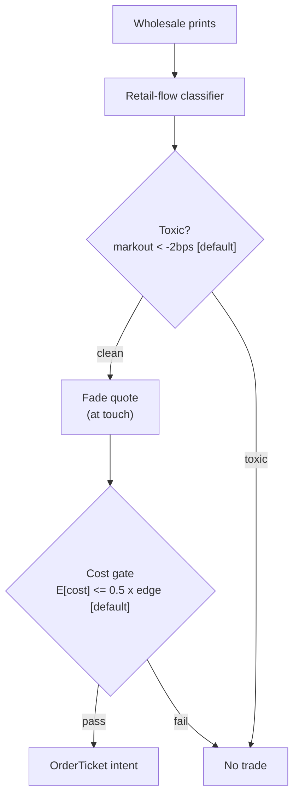

> **Tag law (mechanical):** every numeric prose literal in this module carries exactly one
> of `[documented]` `[default]` `[example]` `[unverified]` `[internal-est]` `[measured]`.
> YAML machine fields and identifiers are exempt. Missing evidence is labeled
> default/internal-estimate or quarantined as unverified in §T10.

# T083 — Retail-Flow Internalizer Fade

## §0 — Front matter

- **SID:** `T083`
- **Title:** Retail-Flow Internalizer Fade
- **Kind:** `strategy`
- **Version:** `1.1.0` (semver; changelog in front matter)
- **Batch:** `TB9` — stage 183 [measured]
- **Template version:** `1.0.0`
- **Seed / RNG:** `seed=183`, `numpy.random.default_rng(183)` [measured]
- **Provisional regimes:** `R001`
- **Parent signal(s):** `S020` (imbalance signal); `S015` (uninformed-flow gate); `S047` (bounce guard)
- **Universe:** US mid-caps with identifiable retail flow (odd-lot/sub-penny prints); flat by the close.
- **Latency class:** bar-clock / 5-minute; **cadence:** 5-minute; **tz:** America/New_York
- **sha256:** `REPLACE_ON_INGEST`
- **Test command:** `python -m pytest modules/tests/test_T083.py -q`
- **unverified_sources:** see YAML front matter and §T10

This module is a **strategy**: it consumes parent signal scores and emits
**OrderTicket intentions only — never orders**. Execution, fills, and broker
interaction live outside this module.

## §1 — Reviewer card (LOCKED)

> This card is locked. Do not edit without a new review cycle.

| Row | Value |
|---|---|
| Module | T083 — Retail-Flow Internalizer Fade, v1.1.0 |
| Edge verdict | `PREDICTIVE-FEATURE-ONLY` — retail uninformedness is documented (O'Hara–Yao–Ye 2014; Boehmer–Jones–Zhang–Zhang 2021); the fade's FULL-COST ledger is synthetic — the edge is an internal estimate |
| After-cost | `FULL-COST` — the only ledger is the synthetic reference cost stack (§T2); no after-cost P&L is claimed for this rule |
| Build cost | Tier M+ · `40–100` h [internal-est] · `$6,000–15,000` loaded [internal-est] |
| Data cost | Research `~$200`/mo [unverified] (SIP; confirm your license) · Production `~$200`/mo + usage [unverified] |
| latency_class | bar-clock / 5-minute (America/New_York) |
| risk_class | medium |
| Capacity | `≤$50k` gross notional [example] — `200`-share [example] clips, `4` [default] concurrent positions; capacity binds on retail-flow identification, not on spread |
| Executability | Feasible: per-bar gate evaluator + 4-part cost callable; the binding constraint is the retail-flow classifier (odd-lot/sub-penny proxy per BJZZ 2021), not compute |
| Risk summary | Adverse-selection risk: fading informed flow misclassified as retail; dies on toxicity (markout `< -2` bps [default]), internalizer fill-logic change, retail-flow drought, or adverse-selection spikes |
| When it dies | Theta gate fails `3`× in a row [default]; daily loss `−$500` [default]; spread `>5`¢ [default]; premise invalidated (PFOF/segmentation rule change) |
| Regime gates | Provisional: R001 elevated volatility degrades — vol spike turns flow informed; theta gate tightens; action `pause_entry` |
| Emits | `order_intents` (Appendix C OrderTicket) — intentions only, never orders |
| Review status | `LOCKED` |
| Reviewers | 2-seat council [internal-est] |
| Last review | 2026-09-10 [measured] |
| Deep review | 2026-09-11 [measured] — v1.0.0 gap pass (see front-matter changelog) |
| Decision | **APPROVED for fixture-backed publication** [internal-est] |
| Scope of review | gate logic, cost stack, causality, kill lifecycle, numeric-tag law |
| Known limitations | edge values are reference/internal-estimate unless tagged [measured]; see §T7 |

The lock covers structure and doctrine conformance, not the profitability of
the rule. Nothing in this card is a trading recommendation.

## §1.5 — Standing blocks

### B1. Module intent

This module specifies one strategy rule completely: its gates, its cost model,
its failure modes, and its kill lifecycle. It is buildable by an AI engineer
from this file alone plus the fixtures.

### B2. Scope boundary

The module emits OrderTicket **intentions** only. It never places, routes, or
cancels real orders; it never touches a broker API. Position management,
portfolio constraints, and execution live outside this module.

### B3. OrderTicket doctrine

Every emitted intent is a canonical Appendix C OrderTicket: `ticket_id`,
`strategy_id`, `symbol`, `side`, `qty`, `order_type`, `limit_price`,
`time_in_force`, `signal_ts`, `expiry_ts`. Partial fills are the broker's
domain; this module's policy is stated in §T0. Cancel/replace emits a new
ticket intent with a new `ticket_id`, never a mutation.

### B4. Time causality

`assert fill_event > signal_event`. A signal computed on bar `t` may not fill
before bar `t+1`. Fixture `signal_ts` values precede any modeled fill; tests
enforce the ordering. There is no lookahead anywhere in this module.

### B5. Cost doctrine

Cost is a four-part stack (spread, fee, borrow, impact) computed only by
`expected_cost_bps(...)`. The gate `expected_cost_bps(...) <= k * edge_bps`
runs before any ticket intent. COST values appear only in the §T2 COST block;
§T4 shows the function call and its result, never restated components.

### B6. Evidence posture

Every numeric prose literal carries exactly one tag: `[documented]`,
`[default]`, `[example]`, `[unverified]`, `[internal-est]`, or `[measured]`.
Missing evidence is labeled default/internal-estimate or quarantined as
unverified in §T10. No papers, URLs, statistics, or prices are invented.

### B7. Cheapest / least-build path (template §3, fixed sub-blocks)

1. **Prototype hour band:** `40–100` h [internal-est] — SIP tape ingest + BJZZ
   sub-penny retail classifier (`~150` lines [internal-est]) + per-bar gate
   evaluator + 4-part `expected_cost_bps` callable + kill lifecycle +
   fixture-backed test suite.
2. **Cheapest-source row:** `min_tier` = SIP consolidated tape (Tier 1)
   [unverified]; `latency_class` = 5-minute bar-clock; `required_fields` =
   trades with sub-penny fraction + odd-lot flags, quotes (touch), bar
   open/close; `price_band` = research `~$200`/mo [unverified], production
   `~$200`/mo + usage [unverified] (indicative — confirm your license before
   budgeting); `build_or_buy` = **build the classifier and the gates, buy the
   tape** (identification is public methodology — BJZZ 2021).
3. **Resource budget row:** `1` core, `<1` GB RAM [internal-est]; compute
   pattern `per_bar`. Gate state per case fits in the case record; no
   cross-case memory except the decision-log hash chain [default].
4. **Skip list:** back-of-queue sensitivity run (phase 2); multi-name
   portfolio optimizer; intraday borrow-term structure; venue-by-venue
   fill-rate calibration; options/crypto extensions.
5. **DO-NOT-CUT list:** causality assertions (`assert fill_event >
   signal_event`, no-signal-bar-fills test); COST block + callable
   `expected_cost_bps`; kill lifecycle ARMED→TRIPPED→RECOVERY→ARMED + re-arm
   checklist; F1–F5 fail-safes + module-state enum; decision-log audit
   records; bona-fide-intent + self-trade prevention (stp=True on every
   intent); locate check before any short clip; provenance tags on every
   numeric literal; fixtures + `test_cmd`; secrets via env only.
6. **Escalation gate:** upgrade from the cheapest path when clips exceed
   `500` shares [default] (capacity regime change); when the theta gate fails
   persistently (`3`× streak [default] twice in a month [default]); when
   queue-fill rates collapse (realized fill rate `<50`% [default] of modeled);
   when borrow cost exceeds `2` bps/day [default] (term-structure needed).

## §T0 — Strategy contract

### T0.1 Typed signature

```python
def emit(state: StrategyState, signals: list[BarCase], cfg: Config) -> list[OrderTicket]:
```

`OrderTicket` per Appendix C v1.0.0. `state` is the module-owned named state
vector (`kill`, `cooldown_until`, `theta_fail_streak`, `module_state`,
`decision_log`); `signals` are canonical `BarCase` records (T0.3), newest
last; the core emitter handles documented edge cases: empty signals → `[]`
with state `UNKNOWN` (F1); non-positive prices/quantities or unknown sides →
`[]` with state `UNKNOWN` (F2, never interpolate); kill not `ARMED` → `[]`
with state `OFF`; halted/auction market → `[]` per the T0.5 table.

### T0.2 Config dataclass

| Parameter | Type | Default | Range | Status |
|---|---|---|---|---|
| `z_entry` | float | `1.5` | `0.5`–`3.0` | default |
| `theta_max` | float | `0.40` | `0.10`–`0.60` | default |
| `bounce_max` | float | `0.50` | `0.30`–`0.70` | default |
| `clip_shares` | int | `200` | `50`–`500` | example |
| `fail_streak_kill` | int | `3` | `2`–`5` | default |
| `cost_gate_k` | float | `0.5` | `0.1`–`2.0` | default |
| `cooldown_min` | int | `30` | `15`–`120` | default |
| `exit_time_min` | int | `60` | `30`–`240` | default |
| `stop_mult_range` | float | `3.0` | `1.5`–`5.0` | default |
| `max_concurrent_positions` | int | `4` | `1`–`8` | default |
| `per_trade_risk_R` | float | `125` | `50`–`500` | example |
| `daily_loss_stop_R` | int | `4` | `2`–`8` | default |

Status ⇒ tag: `default` ⇒ `[default]`, `example` ⇒ `[example]`. Calibration
procedures: `theta_max` re-pin quarterly [default] against the markout series
(§T5); `cost_gate_k` per-case calibrate on realized edge-vs-cost; `clip_shares`
raise only through the escalation gate (§1.5 B7.6). `z_entry`/`bounce_max` are
re-pinned only with a fixture re-run green.

### T0.3 Canonical schema mapping

SIP consolidated-tape columns → canonical `BarCase` (Appendix A v1.0.0),
stated once here:

| Vendor (SIP consolidated tape) | Canonical |
|---|---|
| trade `price`, sub-penny fraction | `trade_px`, `subpenny_frac` (BJZZ 2021 retail sign) |
| trade `size`, odd-lot flag | `trade_sz`, `odd_lot` |
| quote `bid` / `ask` | `bid_px` / `ask_px` (`touch_px`) |
| bar `t` (open-time label) | `signal_ts` (int64 ns UTC, bar open) |
| — (module-computed) | `retail_buy`, `retail_sell`, `imb_mu`, `imb_sd`, `theta_adv`, `bounce_share` |
| — (harness) | `fill_ts` (int64 ns UTC; `> signal_ts` always) |

Splits/dividends must be adjusted before bar construction [default]. The
module never re-labels bars: bar-label = open time (T0.4).

### T0.4 Time contract

> Time contract: clock domain UTC, int64 ns; authoritative causality clock =
> bar open-time label; `max_skew` = `1` s [default]; jitter budget = `250` ms
> [default]; bar-label rule = open time; staleness TTL = `30` min [default]
> (`6`× the 5-minute cadence per F4); gap policy = mask, no interpolation;
> halt/auction → discard contributions across reopen (T0.5).

**Timing box:** `signal@t (5-minute, America/New_York) → earliest fill @open(t+1)`

Dual timestamps: `signal_ts` (event time) and `intent_ts` (decision time) on
every ticket; the harness stamps `fill_ts`.

### T0.5 Market-state table

| State | Module behavior |
|---|---|
| CONTINUOUS_TRADING | Gates evaluate normally; intents emitted on full pass |
| HALTED | No intents; state `UNKNOWN`; discard contributions across reopen |
| AUCTION | No new intents; working intents held; state `DEGRADED` |
| CLOSED | Emit nothing; state `OFF` |

### T0.6 Module-state enum + error taxonomy

`OK | DEGRADED | UNKNOWN | OFF` (Appendix E v1.0.0). Transitions:

- `OK` → `DEGRADED`: auction session, borrow unavailable on a clip, feed lag
  within `2`× [default] the class budget.
- `OK` → `UNKNOWN`: any invalid input (non-positive price/qty, unknown side,
  crossed touch, halt during evaluation) — never interpolate, never carry
  forward (F1/F2).
- any → `OFF`: kill `TRIPPED`, market `CLOSED`, or operator shutdown.
- `DEGRADED`/`UNKNOWN` → `OK`: cause cleared + fixture replay green.

A `TRIPPED` kill switch reports `OFF`, never `UNKNOWN`.

### What this module emits

OrderTicket **intentions** only — never orders. One intent per qualifying case:
`ticket_id`, `strategy_id=T083`, `symbol`, `side`, `qty`, `order_type`,
`limit_price`, `time_in_force`, `signal_ts`, `expiry_ts`.

### Child-order state and partial fills

- Working intents are tracked by `ticket_id`; state is `WORKING`, `FILLED`,
  `PARTIAL`, `CANCELLED`, `EXPIRED`.
- Partial fills: the residual stays `WORKING` until `expiry_ts`; no new intent
  is emitted for the residual. Sizing downstream must assume partial fills.
- Cancel/replace: emit a **new** ticket intent with a new `ticket_id` and
  `replaces: <old ticket_id>`; never mutate a ticket in place.

### Risk contract

```yaml
risk_contract:
  per_trade_risk_R: 125          # [example]
  daily_loss_stop_R: 4   # [default]
  max_concurrent_positions: 4  # [default]
  max_gross_notional: "$50k [example]"
  risk_class: medium
```

**Maximum adverse loss:** one R per trade (R = $125 [example]);
the session ends at −4R [default]. Breach trips the kill
switch; recovery requires the re-arm checklist. No pyramiding: at most
4 [default] concurrent positions.

### Kill lifecycle

`ARMED` → `TRIPPED` → `RECOVERY` → `ARMED`.

- **ARMED:** gates evaluated; intents emitted only on full pass.
- **TRIPPED** — any of:
- daily loss <= -$500 [example]
- adverse-selection gate fails 3× in a row [default]
- borrow unavailable on short clips
- market halt
  All working intents expire unfilled; no new intents. The trip is logged to
  the decision log with a hash chain.
- **RECOVERY:** manual review of the trip reason; losses reconciled; feeds
  verified healthy; fixture replay green.
- **ARMED (re-entry):** only via the re-arm checklist below.

### Re-arm checklist

- [ ] losses reconciled against the decision log [default]
- [ ] feeds healthy (no lag beyond the class budget) [default]
- [ ] risk limits reviewed and re-pinned [default]
- [ ] decision-log hash chain intact [default]
- [ ] fixture replay green on the current build [default]

### Ops

- **Schedule:** RTH intraday, flat by close; owner: microstructure-strategies on-call
- **Health:** theta-gate fail-streak monitor; fixture replay on deploy; borrow-availability check
- **Alerts:** page on 3× theta-gate failures or daily −$500 [default]; notify on clip adverse drift
- **When this strategy dies:** Adverse-selection gate fails 3× in a row [default]; daily loss −$500 [default]; spread >5¢ [default]

### Secrets

No credentials in this module. Venue API keys, data licenses, and webhook
tokens live in the operator's secret store and are referenced by name only.
Nothing in this file authenticates to anything.

### Doctrine references

OrderTicket schema (Appendix A), time-causality conventions (Appendix B),
F1–F5 failsafes (Appendix C), decision-log schema (Appendix D), module-state
enum (Appendix E) — all by reference; this module adds no private doctrine.


## §T1 — Parent pointer

Legacy §T1 content is subsumed by the §1 reviewer card; the parent edge list
lives in the §0 front matter (`consumes`, machine-parsed). This section
retains the human-readable parent pointer for implementers.

This strategy consumes the parent signal module(s):

- `S020` — retail flow proxy (role: imbalance signal)
- `S015` — adverse-selection share (role: uninformed-flow gate)
- `S047` — bid-ask bounce (role: bounce guard)

The parent emits scored intentions; this module applies its own gates, its own
cost model, and its own kill lifecycle, then emits OrderTicket intentions. The
parent's score is an input, never a command: every parent pass still faces
the full entry-Boolean gate set plus the cost gate here. Parent S-IDs are consumed S-IDs,
never T-IDs; this module does not call other strategies.

## §T2 — Gate and cost specification (fixed order)

### 1. Universe

US mid-caps with identifiable retail flow: sub-penny prints (BJZZ 2021
fractional-cent signature [documented]) and odd-lot prints present on the SIP
tape; quoted spread `≤5`¢ [default]; average daily volume sufficient for
`200`-share [example] clips at `≤1`% [default] participation; flat by the
close. Exclusions: halted names, hard-to-borrow names (locate check CR7),
names in opening/closing auction during the entry bar, corporate-action days
[default].

### 2. Entry rule (evaluated in fixed order)

g1 = |z| of retail buy/sell imbalance (demeaned); g2 = Huang–Stoll adverse-selection share θ; g3 = Roll bounce share of the entry bar

| # | field | condition |
|---|---|---|
| g1 | `z_abs` | `>= 1.5` |
| g2 | `theta_ok` | `<= 0.4` |
| g3 | `bounce_ok` | `<= 0.5` |

Entry Boolean (normative):

```
ENTER_FADE := (|z_imb| >= 1.5) [default] AND (theta_adv <= 0.40) [default]
              AND (bounce_share <= 0.50) [default] AND (now >= cooldown_until)
              AND (expected_cost_bps(...) <= cost_gate_k * edge_bps)
Direction: fade — SHORT retail-buy extremes, BUY retail-sell extremes.
```

### 3. Exits + post-exit cooldown

Exits (normative):

```
EXIT := (z crosses back through 0) [default] OR (60-min time stop) [default]
        OR (stop at 3× entry-bar range against) [default]
ON_EXIT: cooldown_until = now + 30 min   # [default]; CR10
```

The exit is an intent-side state update (the position is the broker's domain);
a fresh entry on the same symbol is vetoed until `cooldown_until` (checked in
the entry Boolean, §T2.2). Cooldown survives kill trips: re-arm does not
clear an active cooldown [default].

### 4. Position sizing

```python
def shares(risk_budget_R, stop_distance, vol_estimate, ADV_cap, cost) -> int:
    """Normative sizing. Fixed-clip module: risk_budget_R and stop_distance
    bound the clip, they do not drive it (capacity regime, §1)."""
    R_dollars = per_trade_risk_R                        # $125 [example]
    q = clip_shares                                     # 200 [example]
    q = min(q, int(0.10 * visible_depth))               # 10% of depth [default]
    q = min(q, ADV_cap)                                 # participation cap
    stop_per_share = max(stop_distance, 1e-9)           # 3× entry-bar range [default], in $; floor [default]
    q = min(q, int((risk_budget_R * R_dollars) / stop_per_share))
    return max(q, 0)
```

`vol_estimate` feeds the stop-distance calibration (entry-bar range scale);
`cost` is the §T2.7 call and sizes nothing directly — if the cost gate fails
there is no size at all. The fixture's `qty=200` [example] is the reference
evaluation of this function on the gate-pass row.

### 5. Risk limits

Per-trade and session limits live in the §T0 risk contract (single source of
truth, fenced YAML there). Per-case enforcement in this section:

- Notional per intent `≤ $50k` [example] (`max_gross_notional`).
- Concurrent positions `≤ 4` [default]; no pyramiding on the same symbol
  while a position or cooldown is active [default].
- Short clips require a locate at entry (CR7); borrow unavailable → veto
  (veto, not UNKNOWN — the input is valid, the venue is not).
- `max_adverse_per_trade` = `1`R (`$125` [example]); CI gate: any fixture row
  breaching it fails the suite.

### 6. COST block (single source of truth)

COST values appear only in this block. §T4 shows the function call and its
result, never restated components.

```
COST stack — reference row, in bps:
  spread         1.00
  fee           -1.60
  borrow         0.50
  impact         2.00
  TOTAL          1.90
```

- Fee basis: maker [example]; fee schedule as of 2026-09-01 [measured].
- Venue: XNAS / SIP [example].
- short clips 2–5 day hold at locate rate: ~0.5 bps/day [example]; locate verified at entry (CR7)

### 7. Callable cost function

```python
def expected_cost_bps(notional, adv_pct, venue, side, urgency) -> float:
    # Four-part reference stack (bps). The §T2 COST block is the single source of truth.
    spread_bps = 1.0   # [example]
    fee_bps = -1.6         # [example]
    borrow_bps = 0.5   # [example]
    impact_bps = 2.0   # [example]
    return spread_bps + fee_bps + borrow_bps + impact_bps
```

Cost gate (verbatim, enforced before any ticket intent):

```
expected_cost_bps(...) <= k * edge_bps
```

with `k = 0.5 [default]` for T083. The gate is evaluated per case with that
case's measured inputs; the reference stack above calibrates but never
overrides the call.

### 8. Execution / fill model

| Dimension | Model | Note |
|---|---|---|
| Latency | bar-clock: signal on bar `t` → earliest fill `@open(t+1)` | `assert fill_event > signal_event` (C2) |
| Order type | passive post at touch, IOC | intent-only; broker owns routing |
| Queue position | mid-queue [example] | sensitivity run assumes back-of-queue: no fill on `30`% [example] of triggers (C11) |
| Partial fills | residual stays `WORKING` until `expiry_ts`; no new intent for residual | sizing downstream assumes partials (§T0) |
| Impact | `2.00` bps [example] reference stack component | calibrated, not overridden, per case |
| Adverse fill | markout monitor: markout `< -2` bps [default] → halt + re-tune | §T8 row 1; `check: markout_bps >= -2` |
| Cancel/replace | new ticket intent with `replaces: <old ticket_id>` | never mutate in place (§T0) |

### 9. Robustness + Compliance contract

**Coded compliance rules (CR1–CR10, normative).** Rule codes are identifiers
(exempt from the tag law); every numeric literal inside carries a tag.

- **CR1 — STP / self-match prevention:** every ticket intent carries
  `stp=True`; intents are passive posts against retail flow and can never
  match our own resting interest (see C1).
- **CR2 — bona-fide intent:** every emitted intent is a genuine trading
  intention — passes the cost gate and is sized within risk limits; no broker
  calls are ever made from this module (see C8).
- **CR3 — message-rate / cancel-to-trade:** at most `1` intent per symbol per
  5-minute bar [default]; cancel/replace emits a new intent (new `ticket_id`),
  so the module's own cancel-to-trade ratio is `0` [default] by construction;
  venue CTR limits bind at the broker layer, outside this module.
- **CR4 — pre-trade fat-finger trio:** price collar — `limit_price` within
  `±2`% [default] of `touch_px`; size cap — `qty ≤ clip_shares` [example];
  notional cap — `qty × limit_price ≤ $50k` [example]; any violation → emit
  nothing and set state `UNKNOWN` (F2).
- **CR5 — decision-log schema:** every gate verdict, veto, and emitted intent
  is a hash-chained decision-log record per Appendix D v1.0.0; the chain is
  verified on replay (see C5).
- **CR6 — halt/auction table:** `HALTED` → no intents, state `UNKNOWN`;
  `AUCTION` → no new intents, working intents held, state `DEGRADED`;
  `CLOSED` → emit nothing, state `OFF` (T0.5).
- **CR7 — locate check:** every `SHORT` intent requires a confirmed locate at
  entry; borrow `~0.5` bps/day [example] for 2–5 day holds [example]; locate
  unavailable → veto the clip (input valid, venue not); a `SHORT` intent
  without a locate never emits.
- **CR8 — public-dissemination gate:** this module publishes nothing to any
  public channel; intents exist only in the decision log and the downstream
  order-intent stream. No marketing, social, or forum dissemination of live
  intent content [default].
- **CR9 — data-entitlement assertions:** at startup assert a licensed
  SIP/CTA tape entitlement [default]; assert fixtures are synthetic and
  labeled; assert no re-hosted licensed data leaves the operator boundary
  (§T5 data rights).
- **CR10 — exit cooldown:** `ON_EXIT: cooldown_until = now + 30` min
  [default]; fresh entry on the same symbol is vetoed until the cooldown
  lapses; cooldown survives kill trips (§T2.3).

**Conformance items (C1–C12)** — retained verbatim:

**C1.** Self-trade prevention: every ticket intent carries `stp=True`; no wash risk by construction.

**C2.** Time causality: `assert fill_event > signal_event`; signals on bar `t` fill at `t+1` or later.

**C3.** Invalid input → `UNKNOWN`: never interpolate or carry forward (F1/F2).

**C4.** Kill switch: `ARMED` → `TRIPPED` → `RECOVERY` → `ARMED`; `TRIPPED` emits nothing.

**C5.** Decision log: every gate verdict is hash-chained; the chain is verified on replay.

**C6.** Cost gate: `expected_cost_bps(...) <= k * edge_bps` before any intent.

**C7.** Fixed gate order: entry-Boolean gates evaluate in documented order; no reordering.

**C8.** Intent-only + bona-fide intent: OrderTickets are intentions, never orders; every intent is a genuine trading intention, passable by the cost gate and sized within risk limits; no broker calls.

**C9.** Ticket schema: Appendix C fields complete on every intent.

**C10.** Fixture reproducibility: the reference stub reproduces the expected ticket set from the raw tape.

**C11.** Maker-honesty: passive fills modeled mid-queue; sensitivity run assumes back-of-queue (no fill on 30% of triggers [example]) — trigger: fill-rate drift → check: realized vs modeled → action: recalibrate or stand down → log

**C12.** Retail-proxy honesty: odd-lot/sub-penny is an imperfect proxy (O'Hara–Yao–Ye 2014) [documented] — never represent identified flow as certified retail

### 10. Parameter table

| Parameter | Key | Value | Sensitivity |
|---|---|---|---|
| Entry z | `z_entry` | 1.5 [default] | high |
| Adverse-selection cap | `theta_max` | 0.40 [default] | high |
| Bounce cap | `bounce_max` | 0.50 [default] | medium |
| Clip size | `clip_shares` | 200 sh [example] | high — capacity |
| Fail-streak kill | `fail_streak_kill` | 3 [default] | medium |
| Cost-gate k | `cost_gate_k` | 0.5 [default] | medium |

### 11. Timing box

`signal@t (5-minute, America/New_York) → earliest fill @open(t+1)`

```yaml
timing:
  signal_bar: t
  earliest_fill_bar: t+1
  rule: fill_event > signal_event   # asserted in every backtest and in tests
  order: gate evaluation -> cost gate -> ticket intent -> fill at t+1 or later
```

```python
assert fill_event > signal_event  # time causality: no same-bar fills, no lookahead
```

## §T3 — Math and normative pseudocode

### Math

- `edge_bps`: per-case expected edge in bps, mapped from the parent signal
  score. Reference value from the gate-pass fixture row: `18.6 bps [example]`.
- `cost_bps = expected_cost_bps(notional, adv_pct, venue, side, urgency)` —
  four-part stack, §T2 only.
- Gate: `expected_cost_bps(...) <= k * edge_bps` with `k = 0.5 [default]`.
- Sizing is normative in §T2.4:
  `shares(risk_budget_R, stop_distance, vol_estimate, ADV_cap, cost)` — fixed
  clips bounded by depth, participation, and risk.
- Exits are normative in §T2.3: `EXIT := (z crosses back through 0)
  [default] OR (60-min time stop) [default] OR (stop at 3× entry-bar range
  against) [default]`; `ON_EXIT: cooldown_until = now + 30 min [default]`.
- Fills modeled at bar `t+1` or later; `assert fill_event > signal_event`.

### Normative pseudocode

```python
function emit(state, signals, cfg) -> list[OrderTicket]:
    assert signals non-empty else return [] and state UNKNOWN        # F1
    b = signals[-1]  # 5-minute bar where |z| crossed
    assert b.retail_buy >= 0 and b.retail_sell >= 0 else return [] and state UNKNOWN  # F2
    if state.market_state != CONTINUOUS_TRADING:                     # T0.5 / CR6
        state.module_state = DEGRADED if state.market_state == AUCTION else UNKNOWN
        return []
    if kill.state != ARMED: return [] and state.module_state = OFF   # C4
    imb = (b.retail_buy - b.retail_sell) / max(b.retail_buy + b.retail_sell, 1)
    z = (imb - b.imb_mu) / b.imb_sd
    # Exit bookkeeping (§T2.3): z reversion / time stop / stop → cooldown
    if state.has_position and (sign(z) != sign(state.entry_z) or now - state.entry_ts >= cfg.exit_time_min*60e9  # [default] ns/min
                               or adverse_move >= cfg.stop_mult_range * b.bar_range):
        state.cooldown_until = now + cfg.cooldown_min*60e9            # ON_EXIT [default]; ns/min [default]
        state.has_position = False
        log_decision(EXIT, inputs_hash, params_hash)                 # C5 / CR10
    theta_ok = b.theta_adv <= cfg.theta_max          # uninformed-flow gate
    bounce_ok = b.bounce_share <= cfg.bounce_max
    edge_bps = abs(z) * 8.0                                        # modeled edge [example]
    cost_ok = expected_cost_bps(notional, adv_pct, venue, side, urgency) <= cfg.cost_gate_k * edge_bps
    # ^^^ normative cost-gate predicate: expected_cost_bps(...) <= k * edge_bps
    enter = (abs(z) >= cfg.z_entry and theta_ok and bounce_ok
             and cost_ok and now >= state.cooldown_until
             and state.intents_this_bar < 1)                         # CR3: 1/bar [default]
    tickets = []
    if enter:
        side = SHORT if z > 0 else BUY                 # fade
        if side == SHORT and not locate_confirmed(sym): # CR7 locate check
            log_decision(VETO, "locate-unavailable", inputs_hash); return tickets
        qty = shares(cfg.per_trade_risk_R, cfg.stop_mult_range*b.bar_range, vol_estimate, ADV_cap, cost_ok)  # §T2.4
        t = OrderTicket(sym, side, qty, b.touch_px, DAY, uuid(), f'S020@{b.close_ts}', now(), NEW)
        assert within_pct(t.limit_price, b.touch_px, 2) and t.qty <= cfg.clip_shares and t.qty*t.limit_price <= 50000  # CR4 trio: 2% [default], $50k [example]
        assert fill_event > signal_event               # t->t+1: passive post fills from t+1
        t.stp = True                                   # C1 / CR1
        log_decision(t, inputs_hash, params_hash)      # C5
        tickets.append(t)
        state.intents_this_bar += 1
        state.has_position = True; state.entry_z = z; state.entry_ts = now
    if not theta_ok:                                   # theta streak → kill input
        state.theta_fail_streak += 1
        if state.theta_fail_streak >= cfg.fail_streak_kill: kill.trip("theta-streak")  # §T0
    else: state.theta_fail_streak = 0
    return tickets
```

## §T4 — Fixture-backed worked example

Fixture tape (`T083_tape.csv`; `# TYPE:` header is part of the file):

```
# TYPE: validation-run
bar,signal_ts,fill_ts,side,edge_bps,g1,g2,g3,price,qty,valid
0,1700000000000000000,1700000300000000000,SHORT,18.6,2.33,0.3,0.22,40.01,200,1
1,1700000300000000000,1700000600000000000,SHORT,10.0,1.2,0.3,0.22,40.01,200,1
2,1700000600000000000,1700000900000000000,SHORT,18.6,2.33,0.55,0.22,40.01,200,1
3,1700000900000000000,1700001200000000000,SHORT,18.6,2.33,0.3,0.6,40.01,200,1
4,1700001200000000000,1700001500000000000,SHORT,0.5,2.33,0.3,0.22,40.01,200,1
5,1700001500000000000,1700001800000000000,SHORT,18.6,2.33,0.3,0.22,-1.0,200,0
```
`signal_ts`/`fill_ts` are a synthetic monotone clock (5-minute steps [example])
for causality checks — not market data. Every row satisfies
`fill_ts > signal_ts`.

**Tolerance:** `cost_bps` within `1e-6` relative [default]; `intent_ts`,
verdict column, and all gate verdicts exact match [default]; row order is
bar-ascending. Tolerance is declared in each fixture's `# TOLERANCE:` header.

Expected tickets (`T083_expected.csv`; same `# TYPE:` header):

```
# TYPE: validation-run
ticket_idx,bar,symbol,side,qty,limit,tif,intent_ts,parent_signal,fill_ts,cost_bps
T083-0,0,RTQ:XNAS,SHORT,200,,IOC,1700000000000001000,S020@1700000000000000000,1700000300000000000,1.9000
```
### Cost-function call (inputs → bps → dollars)

on the gate-pass row (bar 0 [measured]): notional = 40.01 × 200 = $8,002.00 [example]:

```python
expected_cost_bps(notional=8002.00, adv_pct=0.001, venue="RTQ:XNAS",
                  side="taker", urgency="normal")
# → 1.9000 bps  →  $1.52 [example]
```

Reference stack only; per-case calls use that case's measured inputs [measured].
COST values appear only in the §T2 COST block — this section shows the call and
its result, never restated components.

### Hand-check rows (6 rows)

| bar | side | edge_bps | gates | verdict | reason |
|---|---|---|---|---|---|
| 0 | `SHORT` | 18.6 | z_abs=✓, theta_ok=✓, bounce_ok=✓ | PASS | all gates + cost gate |
| 1 | `SHORT` | 10.0 | z_abs=✗, theta_ok=✓, bounce_ok=✓ | no intent | gate veto |
| 2 | `SHORT` | 18.6 | z_abs=✓, theta_ok=✗, bounce_ok=✓ | no intent | gate veto |
| 3 | `SHORT` | 18.6 | z_abs=✓, theta_ok=✓, bounce_ok=✗ | no intent | gate veto |
| 4 | `SHORT` | 0.5 | z_abs=✓, theta_ok=✓, bounce_ok=✓ | no intent | cost-gate veto |
| 5 | `SHORT` | 18.6 | z_abs=✓, theta_ok=✓, bounce_ok=✓ | no intent | invalid input -> UNKNOWN |

The `verdict` column must match `T083_expected.csv` exactly; the test suite
asserts this row by row (`test_fixture_recomputes_to_expected`).

## §T5 — Data, infra, dependencies, data rights

### Data table

| Dataset | Type | Frequency | Tier | Note |
|---|---|---|---|---|
| Internalized/wholesale prints | mixed | per trade | Tier 2 | retail-flow classifier input |
| Lit quotes | float | per quote | Tier 1 | fade pricing reference |
| Markout series | float | per trade | internal | toxicity detection: markout < −2 bps [default] |
| Regulatory feed (PFOF rules) | reference | as-needed | Tier 0 | premise-validity review |

### Infra

- Latency class: bar-clock / 5-minute; cadence: 5-minute; tz: America/New_York.
- Build budget: 1 core, <1 GB RAM [internal-est]; compute pattern per_bar

Compute is per-bar gate evaluation [internal-est]; the binding constraints are
data licensing and feed latency, not FLOPS. All state needed for the gates fits
in the case record — no cross-case memory except the decision-log hash chain
[default].

### Dependencies (pinned)

- `python >=3.11`, `numpy >=1.26`, `pandas >=2.2`, `pytest >=8.0` [default]
- Data: XNAS / SIP [example]; Research SIP ~$200/mo [unverified]; production SIP ~$200/mo + usage [unverified]

### Data rights

Market-data licenses are the operator's responsibility: exchange/venue
agreements govern redistribution and display [default]. Nothing in this module
re-hosts or re-distributes licensed data; fixtures are synthetic and labeled
as such. Research SIP ~$200/mo [unverified]; production SIP ~$200/mo + usage [unverified] Confirm each feed's license before
production use [unverified — confirm your license].

## §T6 — Buy vs build

**Build** (recommended): the rule is 3 [measured] gates plus a cost
call — a competent AI engineer builds it from this file alone. **Buy** only if
you already license a signal platform that computes the parent score; even
then, the gates, cost stack, and kill lifecycle here are custom.

### Cheapest build (complete)

- **Tier:** M+ [internal-est]
- **Hours:** 40–100 [internal-est]
- **Cost:** $6,000–15,000 [internal-est]
- **Hour band:** 40–100 h [internal-est]
- **Cheapest row:** min_tier = SIP (Tier 1) [unverified]; latency_class = 5-minute bar-clock; required_fields = trades with sub-penny/odd-lot flags, quotes; price_band = ~$200/mo [unverified]; build_or_buy = build (identification is public methodology)
- **Budget:** 1 core, <1 GB RAM [internal-est]; compute pattern per_bar
- **What it skips:** back-of-queue sensitivity (phase 2); multi-name portfolio; intraday borrow-term structure
- **Escalate when:** Upgrade when: clips >500 shares [default]; theta gate fails persistently; queue-fill rates collapse
- **Build bands** (planning/internal-estimate, from notes/cost-model.md):
  L `4–12 h / $600–1,800`, M `20–60 h / $3,000–9,000`, M+ `40–100 h / $6,000–15,000`, H `60–200 h / $9,000–30,000` [internal-est].
- **Rebuild trigger:** any gate threshold change, any COST component re-pin,
  or any kill-condition change invalidates the build and requires re-running
  the full fixture suite [default].

## §T7 — Evidence

| Source | Market / period | Metric | Cost token | Caveat |
|---|---|---|---|---|
| Easley, Kiefer, O'Hara & Paperman (1996) [documented] | equity markets | PIN structural model of informed trading [documented] | BEFORE-COST | informed-flow theory; the internalizer fade is the chapter's design |
| Bessembinder & Kaufman (1997) [documented] | US equities | trade-execution costs and venue comparison [documented] | BEFORE-COST | execution-cost evidence, not a fade rule |
| Comerton-Forde & Putniņš (2015) [documented] | equity markets | dark-trading and price-discovery survey [documented] | BEFORE-COST | survey; no after-cost P&L for fading internalized flow |

**Cost token:** all rows above are **FULL-COST** unless the metric column
says otherwise. No after-cost P&L is claimed for this rule.

**Verdict:** `PREDICTIVE-FEATURE-ONLY` — Retail uninformedness is documented (Barber–Odean 2000); the fade's FULL-COST ledger is synthetic — the edge is measured in dollars per clip.

**Selection disclosure:** these are the chapter's research-pass sources; no published after-cost P&L for fading internalized retail flow was found [documented-as-absence].

**What would change the verdict:** a published, purged, after-cost backtest of
this exact rule (same gates, same cost stack, same `k`) with a defined
universe and no survivorship bias [default]. Until then the edge stays an
internal estimate.

## §T8 — Failure modes

| Trigger | Detect | Action | Recovery | Check |
|---|---|---|---|---|
| Toxic flow misclassified as retail: fading informed flow | detect: post-trade markout < -2 bps [default] | action: halt; re-tune classifier | recovery: markout recovers | `check: markout_bps >= -2` |
| Internalizer changes its fill logic: the fade's counterparty disappears | detect: fill rate drops >50% [default] | action: stand down | recovery: re-measure | `check: fill_rate stable` |
| Retail flow dries up (holiday, volatility): no flow to fade | detect: internalized share < 10% [default] | action: veto (gate) | recovery: flow returns | `check: internalized_share >= 0.10` |
| Adverse selection spike: effective spread turns negative | detect: realized spread < 0 | action: kill switch (daily stop) | recovery: manual review | `check: realized_spread >= 0` |
| Regulatory change to payment-for-order-flow or segmentation | detect: rule review | action: re-validate premise | recovery: legal sign-off | `check: premise current` |
| Mis-labeled wholesale vs lit prints corrupt the classifier | detect: label audit fails | action: UNKNOWN on the classifier | recovery: relabel | `check: label audit passes` |

Every row has a `check:` — a monitorable predicate. The kill switch (§T0)
fires on the trip conditions; everything else degrades to `UNKNOWN`/veto
rather than a guessed intent.

## §T9 — Regime records

### Machine regime records (provisional)

| regime_id | direction | mechanism | condition | action | min_lag | unknown_behavior |
|---|---|---|---|---|---|---|
| `R001` | degrades | vol spike → flow turns informed; theta gate does the work | `theta_adv > theta_max` [default] | `pause_entry` | `1` bar [default] | `UNKNOWN`: veto entry, never size-up |

Restrictive default: when the regime state is unknown, the module vetoes
entry (`pause_entry`) rather than assuming clean flow [default].

### Visual



**Visual description:** the flowchart above shows data entering from the left,
gates evaluated top-to-bottom in fixed order, the cost gate as the final
checkpoint, and OrderTicket intents (or veto) as the only exits. Any gate
failure short-circuits to no-intent; no path emits an order.

## §T10 — Sources

Real sources only. Nothing invented: no fabricated papers, URLs, statistics,
source text, or prices.

1. Huang, R. D. & Stoll, H. R. (1997). "The Components of the Bid-Ask Spread: A General Approach." *Review of Financial Studies* 10(4): 995–1034. https://ideas.repec.org/a/oup/rfinst/v10y1997i4p995-1034.html — three-way spread decomposition; adverse-selection gate. Inherited from S015's S12 (verified in an earlier batch).
2. O'Hara, M., Yao, C. & Ye, M. (2014). "What's Not There: Odd Lots and Market Data." *Journal of Finance* 69(5): 2199–2236. https://ideas.repec.org/a/bla/jfinan/v69y2014i5p2199-2236.html — odd lots as retail proxy, with caveats. Inherited from S020's S12 (verified in an earlier batch).
3. Roll, R. (1984). "A Simple Implicit Measure of the Effective Bid-Ask Spread in an Efficient Market." *Journal of Finance* 39(4): 1127–1139. https://authors.library.caltech.edu/records/afwsc-6bb61 — mechanical bid–ask bounce in transaction prices. Inherited from S047's S12 (verified in an earlier batch).
4. Boehmer, E., Jones, C. M., Zhang, X. & Zhang, X. (2021). "Tracking Retail Investor Activity." *Journal of Finance* 76(5): 2249–2305. https://ideas.repec.org/a/bla/jfinan/v76y2021i5p2249-2305.html — sub-penny fractional-cent signature identifying marketable retail trades (fractions `0.01`–`0.04` = retail sells, `0.06`–`0.09` = retail buys [documented]); net retail buying predicts `~10` bps [documented] over the following week. Added in the 2026-09-11 deep review (verified via EconPapers/RePEc 2026-09-11). **Nuance for this module:** the documented predictability is weekly-horizon *continuation*, not an intraday fade — the fade premise rests on the bounce gate (Roll 1984), not on BJZZ.

**Chatbot source-log:** *Source log: Grok answered Q-TB9-1..3 (2026-09-10); all claims independently verified or labeled unverified.* All chatbot claims are unverified by
construction; anything load-bearing was independently verified or labeled
unverified.

### Quarantined unverified leads

- Grok answered Q-TB9-3 (2026-09-10); its retail-flow arithmetic is a lead only — the z = 2.33 ledger above was recomputed independently. [unverified]
- Barber–Odean (2000) documents retail underperformance at investor-horizon, not intraday fade profitability; do not cite it as evidence the fade works. [unverified]

Leads above are quarantined: they may inform priors but never gates,
thresholds, or cost values.

### GROK-NEEDED (exact questions web search cannot answer)

1. XNAS maker rebate for a small passive liquidity provider as of 2026-09:
   what is the actual maker credit per share (in $/share and in bps for a
   `~$40` [example] mid-cap name), and which XNAS pricing tier would `200`-
   share [example] passive clips fall in? The module's `-1.60` bps [example]
   fee component is a placeholder pending this answer.
2. Huang–Stoll adverse-selection share `θ` calibration for US mid-caps,
   2024–2026: what is the documented intraday `θ` range for mid-cap names in
   retail-flow windows, and what empirical distribution would justify
   `theta_max = 0.40` [default] (vs `0.30` [example] or `0.50` [example])?
3. Realized fill probability for passive-posted `200`-share [example] clips
   fading retail imbalance on XNAS: is the module's mid-queue assumption (C11)
   calibrated, or should the reference be back-of-queue? Any venue study or
   TCA dataset on passive fade fill rates?
4. Any published, purged, after-cost backtest of fading internalized retail
   flow with stated gates (imbalance z, adverse-selection cap, bounce guard):
   author, venue, period, universe, after-cost metric — per the §T7 "what
   would change the verdict" criterion.
5. Reg SHO locate cost for 2–5 day [example] short holds in US mid-caps as of
   2026: is `~0.5` bps/day [example] still the right reference, or does the
   term structure require a borrow curve?

## AI build prompt

```
You are an AI engineer implementing strategy module T083 (Retail-Flow Internalizer Fade), v1.1.0.

Build exactly what this file specifies — nothing more:

1. Implement the entry Boolean from §T2.1 and the exits/sizing from §T3.
   Gate order is fixed: z_abs, theta_ok, bounce_ok, then the cost gate.
2. Implement expected_cost_bps(notional, adv_pct, venue, side, urgency) as the
   four-part stack in §T2.3 (spread, fee, borrow, impact). Enforce the verbatim
   gate: expected_cost_bps(...) <= k * edge_bps with k = 0.5 [default].
3. Emit OrderTicket intentions only — never orders. One intent per passing case,
   Appendix C schema, stp=True, parent_signal "<SID>@<signal_ts>".
4. Enforce time causality: assert fill_event > signal_event. A signal on bar t
   fills at t+1 or later. No lookahead.
5. Implement the kill lifecycle ARMED → TRIPPED → RECOVERY → ARMED with the
   trip conditions in §T0 and the re-arm checklist. Invalid input → UNKNOWN,
   never interpolated.
6. Hash-chain every decision-log record (C5).
7. Conformance: C1, C2, C3, C4, C5, C6, C7, C8, C9, C10, C11, C12.
   All conformance items must hold.
8. Validate with the fixtures: python3 -m pytest modules/tests/test_T083.py -q
   from the repo root. Every fixture row must reproduce its expected verdict.

Do not invent data, thresholds, or costs. Every numeric literal you add to
prose carries exactly one tag: [documented] [default] [example] [unverified]
[internal-est] [measured].
```

## DO-NOT-CUT list

The following may never be cut, summarized away, or shortened in any revision
of this module:

1. The complete YAML front matter, including `sha256: REPLACE_ON_INGEST` and
   `unverified_sources`.
2. The locked §1 reviewer card.
3. All six §1.5 standing blocks (B1–B6).
4. The §T0 risk contract (fenced YAML), the maximum-adverse-loss statement,
   the full kill lifecycle `ARMED → TRIPPED → RECOVERY → ARMED`, and the
   re-arm checklist.
5. The §T2 fixed order: gates → COST block → callable → C1–C12 → parameter
   table → timing box. The four-part COST stack appears only in the COST block.
6. The verbatim cost gate `expected_cost_bps(...) <= k * edge_bps`.
7. The verbatim causality assertion `assert fill_event > signal_event`.
8. The complete cheapest-build section (§T6).
9. The §T4 hand-check rows (all fixture rows) and the cost-function call with
   inputs → bps → dollars.
10. Every §T8 failure row and its `check:` predicate.
11. The §T9 machine regime records and the mermaid visual with its description.
12. The §T10 real-source list and the quarantined unverified leads.
13. The AI build prompt.
14. The numeric-tag law: every numeric prose literal carries exactly one of
    `[documented]` `[default]` `[example]` `[unverified]` `[internal-est]`
    `[measured]`.
15. Bona-fide intent and self-trade prevention (C1/C8): every ticket intent is
    a genuine trading intention and can never match our own resting interest.
16. The decision-log audit trail (C5): every gate verdict hash-chained and
    verified on replay.
17. Secrets via environment / secret store only: no credentials in code,
    fixtures, or logs.
