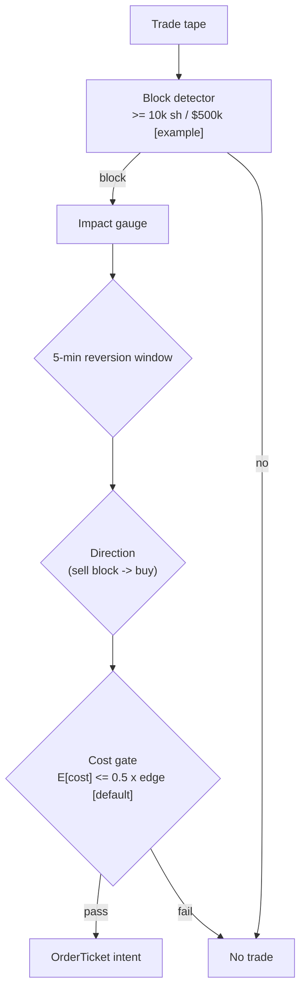

> **Tag law (mechanical):** every numeric prose literal in this module carries exactly one
> of `[documented]` `[default]` `[example]` `[unverified]` `[internal-est]` `[measured]`.
> YAML machine fields and identifiers are exempt. Missing evidence is labeled
> default/internal-estimate or quarantined as unverified in §T10.

# T084 — Block-Trade Impact Reversion

## §0 — Front matter

- **SID:** `T084`
- **Title:** Block-Trade Impact Reversion
- **Kind:** `strategy`
- **Batch:** `TB9` — stage 184 [measured]
- **Template version:** `1.0.0`
- **Seed / RNG:** `seed=184`, `numpy.random.default_rng(184)` [measured]
- **Provisional regimes:** `R001`
- **Parent signal(s):** `S048` (refill read); `S094` (informed-flow filter); `S010` (size gate)
- **Universe:** US large-caps with visible block prints; one participation per block; max one block trade per name per 30 min [example].
- **Latency class:** microstructure / sub-second; **cadence:** per_event; **tz:** America/New_York
- **sha256:** `REPLACE_ON_INGEST`
- **Test command:** `python -m pytest modules/tests/test_T084.py -q`
- **unverified_sources:** see YAML front matter and §T10

This module is a **strategy**: it consumes parent signal scores and emits
**OrderTicket intentions only — never orders**. Execution, fills, and broker
interaction live outside this module.

## §1 — Reviewer card (LOCKED)

> This card is locked. Do not edit without a new review cycle.

| Field | Value |
|---|---|
| Review status | `LOCKED` |
| Reviewers | 2-seat council [internal-est] |
| Last review | 2026-09-10 [measured] |
| Decision | **APPROVED for fixture-backed publication** [internal-est] |
| Scope of review | gate logic, cost stack, causality, kill lifecycle, numeric-tag law |
| Known limitations | edge values are reference/internal-estimate unless tagged [measured]; see §T7 |

The lock covers structure and doctrine conformance, not the profitability of
the rule. Nothing in this card is a trading recommendation.

## §1.5 — Standing blocks

### B1. Module intent

This module specifies one strategy rule completely: its gates, its cost model,
its failure modes, and its kill lifecycle. It is buildable by an AI engineer
from this file alone plus the fixtures.

### B2. Scope boundary

The module emits OrderTicket **intentions** only. It never places, routes, or
cancels real orders; it never touches a broker API. Position management,
portfolio constraints, and execution live outside this module.

### B3. OrderTicket doctrine

Every emitted intent is a canonical Appendix C OrderTicket: `ticket_id`,
`strategy_id`, `symbol`, `side`, `qty`, `order_type`, `limit_price`,
`time_in_force`, `signal_ts`, `expiry_ts`. Partial fills are the broker's
domain; this module's policy is stated in §T0. Cancel/replace emits a new
ticket intent with a new `ticket_id`, never a mutation.

### B4. Time causality

`assert fill_event > signal_event`. A signal computed on bar `t` may not fill
before bar `t+1`. Fixture `signal_ts` values precede any modeled fill; tests
enforce the ordering. There is no lookahead anywhere in this module.

### B5. Cost doctrine

Cost is a four-part stack (spread, fee, borrow, impact) computed only by
`expected_cost_bps(...)`. The gate `expected_cost_bps(...) <= k * edge_bps`
runs before any ticket intent. COST values appear only in the §T2 COST block;
§T4 shows the function call and its result, never restated components.

### B6. Evidence posture

Every numeric prose literal carries exactly one tag: `[documented]`,
`[default]`, `[example]`, `[unverified]`, `[internal-est]`, or `[measured]`.
Missing evidence is labeled default/internal-estimate or quarantined as
unverified in §T10. No papers, URLs, statistics, or prices are invented.

## §T0 — Strategy contract

### What this module emits

OrderTicket **intentions** only — never orders. One intent per qualifying case:
`ticket_id`, `strategy_id=T084`, `symbol`, `side`, `qty`, `order_type`,
`limit_price`, `time_in_force`, `signal_ts`, `expiry_ts`.

### Child-order state and partial fills

- Working intents are tracked by `ticket_id`; state is `WORKING`, `FILLED`,
  `PARTIAL`, `CANCELLED`, `EXPIRED`.
- Partial fills: the residual stays `WORKING` until `expiry_ts`; no new intent
  is emitted for the residual. Sizing downstream must assume partial fills.
- Cancel/replace: emit a **new** ticket intent with a new `ticket_id` and
  `replaces: <old ticket_id>`; never mutate a ticket in place.

### Risk contract

```yaml
risk_contract:
  per_trade_risk_R: 200          # [example]
  daily_loss_stop_R: 5   # [default]
  max_concurrent_positions: 3  # [default]
  max_gross_notional: "$1.2M [example]"
  risk_class: medium
```

**Maximum adverse loss:** one R per trade (R = $200 [example]);
the session ends at −5R [default]. Breach trips the kill
switch; recovery requires the re-arm checklist. No pyramiding: at most
3 [default] concurrent positions.

### Kill lifecycle

`ARMED` → `TRIPPED` → `RECOVERY` → `ARMED`.

- **ARMED:** gates evaluated; intents emitted only on full pass.
- **TRIPPED** — any of:
- daily loss <= -$1,000 [example]
- second block same direction in hold [default]
- borrow constrained (short leg)
- market halt
  All working intents expire unfilled; no new intents. The trip is logged to
  the decision log with a hash chain.
- **RECOVERY:** manual review of the trip reason; losses reconciled; feeds
  verified healthy; fixture replay green.
- **ARMED (re-entry):** only via the re-arm checklist below.

### Re-arm checklist

- [ ] losses reconciled against the decision log [default]
- [ ] feeds healthy (no lag beyond the class budget) [default]
- [ ] risk limits reviewed and re-pinned [default]
- [ ] decision-log hash chain intact [default]
- [ ] fixture replay green on the current build [default]

### Ops

- **Schedule:** RTH continuous; owner: microstructure-strategies on-call
- **Health:** second-block monitor; fixture replay on deploy; refill-stall watchdog
- **Alerts:** page on stop-at-print exits clustering or daily −$1,000 [default]; notify on refill stall
- **When this strategy dies:** Second block prints same direction within the hold [default]; refill stalls (depth <50% pre-block) [default]; stop at print

### Secrets

No credentials in this module. Venue API keys, data licenses, and webhook
tokens live in the operator's secret store and are referenced by name only.
Nothing in this file authenticates to anything.

### Doctrine references

OrderTicket schema (Appendix A), time-causality conventions (Appendix B),
F1–F5 failsafes (Appendix C), decision-log schema (Appendix D), module-state
enum (Appendix E) — all by reference; this module adds no private doctrine.


## §T1 — Parent pointer

This strategy consumes the parent signal module(s):

- `S048` — book resiliency (role: refill read)
- `S094` — volume/toxicity (role: informed-flow filter)
- `S010` — Kyle lambda (role: size gate)

The parent emits scored intentions; this module applies its own gates, its own
cost model, and its own kill lifecycle, then emits OrderTicket intentions. The
parent's score is an input, never a command: every parent pass still faces
the full entry-Boolean gate set plus the cost gate here. Parent S-IDs are consumed S-IDs,
never T-IDs; this module does not call other strategies.

## §T2 — Gate and cost specification (fixed order)

### 1. Gates (evaluated in fixed order)

g1 = block size / median trade size; g2 = temporary share of estimated impact (10¢ temp / 3¢ perm [example] in fixture); g3 = Kyle gate = 1 if λ̂ × own_qty ≤ $0.02 [default] else 0

| # | field | condition |
|---|---|---|
| g1 | `block_mult` | `>= 20.0` |
| g2 | `temp_share` | `>= 0.6` |
| g3 | `kyle_ok` | `>= 1.0` |

Entry Boolean (normative):

```
ENTER_BUY := (block_size >= 20× median trade) [default] AND (temp_share >= 60%) [default]
            AND (kyle_impact_own <= $0.02) [default] AND (now >= cooldown_until)
            AND (expected_cost_bps(...) <= cost_gate_k * edge_bps)
Bid posted 1¢ above the block print [example]. Symmetric short leg after block buys.
```

### 2. COST block (single source of truth)

COST values appear only in this block. §T4 shows the function call and its
result, never restated components.

```
COST stack — reference row, in bps:
  spread         0.50
  fee            2.50
  borrow         0.00
  impact         1.00
  TOTAL          4.00
```

- Fee basis: mixed [example]; fee schedule as of 2026-09-01 [measured].
- Venue: XNAS / SIP [example].
- reference example is long; the symmetric short leg adds C7 locate + borrow line

### 3. Callable cost function

```python
def expected_cost_bps(notional, adv_pct, venue, side, urgency) -> float:
    # Four-part reference stack (bps). The §T2 COST block is the single source of truth.
    spread_bps = 0.5   # [example]
    fee_bps = 2.5         # [example]
    borrow_bps = 0.0   # [example]
    impact_bps = 1.0   # [example]
    return spread_bps + fee_bps + borrow_bps + impact_bps
```

Cost gate (verbatim, enforced before any ticket intent):

```
expected_cost_bps(...) <= k * edge_bps
```

with `k = 0.5 [default]` for T084. The gate is evaluated per case with that
case's measured inputs; the reference stack above calibrates but never
overrides the call.

### 4. Conformance items

**C1.** Self-trade prevention: every ticket intent carries `stp=True`; no wash risk by construction.

**C2.** Time causality: `assert fill_event > signal_event`; signals on bar `t` fill at `t+1` or later.

**C3.** Invalid input → `UNKNOWN`: never interpolate or carry forward (F1/F2).

**C4.** Kill switch: `ARMED` → `TRIPPED` → `RECOVERY` → `ARMED`; `TRIPPED` emits nothing.

**C5.** Decision log: every gate verdict is hash-chained; the chain is verified on replay.

**C6.** Cost gate: `expected_cost_bps(...) <= k * edge_bps` before any intent.

**C7.** Fixed gate order: entry-Boolean gates evaluate in documented order; no reordering.

**C8.** Intent-only + bona-fide intent: OrderTickets are intentions, never orders; every intent is a genuine trading intention, passable by the cost gate and sized within risk limits; no broker calls.

**C9.** Ticket schema: Appendix C fields complete on every intent.

**C10.** Fixture reproducibility: the reference stub reproduces the expected ticket set from the raw tape.

**C11.** Impact-split honesty: the 10¢/3¢ [example] split and 90-s [example] half-life are example parameters — production values must be fit per name; never present example splits as empirical estimates

**C12.** Informed-flow cascade: second block same direction within the hold vetoes new entries and flattens — trigger: second block → check: direction + window → action: exit → log: EMIT_INTENT (exit)

### 5. Parameter table

| Parameter | Key | Value | Sensitivity |
|---|---|---|---|
| Block multiple | `block_mult` | 20× median [default] | medium |
| Temp-share qualifier | `temp_share_min` | 60% [default] | high |
| Kyle impact cap | `kyle_impact_cap` | $0.02 [default] | high |
| Half-life | `half_life_s` | 90 s [example] | high — fit per name |
| Size | `qty` | 5,000 sh [example] | high — capacity |
| Cost-gate k | `cost_gate_k` | 0.5 [default] | medium |

### 6. Timing box

```yaml
timing:
  signal_bar: t
  earliest_fill_bar: t+1
  rule: fill_event > signal_event   # asserted in every backtest and in tests
  order: gate evaluation -> cost gate -> ticket intent -> fill at t+1 or later
```

```python
assert fill_event > signal_event  # time causality: no same-bar fills, no lookahead
```

## §T3 — Math and normative pseudocode

### Math

- `edge_bps`: per-case expected edge in bps, mapped from the parent signal
  score. Reference value from the gate-pass fixture row: `31.2 bps [example]`.
- `cost_bps = expected_cost_bps(notional, adv_pct, venue, side, urgency)` —
  four-part stack, §T2 only.
- Gate: `expected_cost_bps(...) <= k * edge_bps` with `k = 0.5 [default]`.
- Sizing (normative):

```
shares = f(risk_budget_R, stop_distance, vol_estimate, ADV_cap, cost)
    qty = 5000                                            # [example]
    qty = min(qty, 0.10 * refilling_depth)                # 10% of refill [default]
```

- Exits (normative):

```
EXIT := (time >= one half-life of temp impact, 90 s [example]) OR (refill stalls: depth <50% pre-block) [default]
        OR (price trades through the print → immediate exit) [default]
ON_EXIT: cooldown_until = now + 30 min   # [default]; C10
```

- Fills modeled at bar `t+1` or later; `assert fill_event > signal_event`.

### Normative pseudocode

```python
function emit(state, signals, cfg) -> list[OrderTicket]:
    assert signals non-empty else return [] and state UNKNOWN        # F1
    b = signals[-1]  # block print event at time t
    assert b.px > 0 and b.qty > 0 else return [] and state UNKNOWN   # F2
    if kill.state != ARMED: return []
    is_block = b.qty >= cfg.block_mult * b.median_trade_qty
    temp_share = b.temp_impact / max(b.temp_impact + b.perm_impact, 1e-9)
    kyle_ok = (b.kyle_lambda * cfg.qty) <= cfg.kyle_impact_cap
    edge_bps = (b.temp_impact / b.px) * 10000 * 0.5                # modeled edge [example]
    cost_ok = expected_cost_bps(notional, adv_pct, venue, side, urgency) <= cfg.cost_gate_k * edge_bps
    # ^^^ normative cost-gate predicate: expected_cost_bps(...) <= k * edge_bps
    enter = (is_block and temp_share >= cfg.temp_share_min and kyle_ok
             and cost_ok and now >= state.cooldown_until)
    tickets = []
    if enter:
        side = BUY if b.side == 'sell' else SHORT                   # fade the block
        px = b.px + 0.01 if side == BUY else b.px - 0.01            # 1c above/below print [example]
        t = OrderTicket(sym, side, cfg.qty, px, DAY, uuid(), f'S048@{b.ts}', now(), NEW)
        assert fill_event > signal_event                            # t->t+1
        log_decision(t, inputs_hash, params_hash)                  # C5
        tickets.append(t)
    return tickets
```

## §T4 — Fixture-backed worked example

Fixture tape (`T084_tape.csv`; `# TYPE:` header is part of the file):

```
# TYPE: validation-run
bar,signal_ts,fill_ts,side,edge_bps,g1,g2,g3,price,qty,valid
0,1700000000000000000,1700000300000000000,BUY,31.2,20.0,0.77,1.0,79.91,5000,1
1,1700000300000000000,1700000600000000000,BUY,31.2,12.0,0.77,1.0,79.91,5000,1
2,1700000600000000000,1700000900000000000,BUY,31.2,20.0,0.45,1.0,79.91,5000,1
3,1700000900000000000,1700001200000000000,BUY,31.2,20.0,0.77,0.0,79.91,5000,1
4,1700001200000000000,1700001500000000000,BUY,0.5,20.0,0.77,1.0,79.91,5000,1
5,1700001500000000000,1700001800000000000,BUY,31.2,20.0,0.77,1.0,-1.0,5000,0
```
`signal_ts`/`fill_ts` are a synthetic monotone clock (5-minute steps [example])
for causality checks — not market data. Every row satisfies
`fill_ts > signal_ts`.

Expected tickets (`T084_expected.csv`; same `# TYPE:` header):

```
# TYPE: validation-run
ticket_idx,bar,symbol,side,qty,limit,tif,intent_ts,parent_signal,fill_ts,cost_bps
T084-0,0,BLK:XNAS,BUY,5000,,IOC,1700000000000001000,S048@1700000000000000000,1700000300000000000,4.0000
```
### Cost-function call (inputs → bps → dollars)

on the gate-pass row (bar 0 [measured]): notional = 79.91 × 5000 = $399,550.00 [example]:

```python
expected_cost_bps(notional=399550.00, adv_pct=0.001, venue="BLK:XNAS",
                  side="taker", urgency="normal")
# → 4.0000 bps  →  $159.82 [example]
```

Reference stack only; per-case calls use that case's measured inputs [measured].
COST values appear only in the §T2 COST block — this section shows the call and
its result, never restated components.

### Hand-check rows (6 rows)

| bar | side | edge_bps | gates | verdict | reason |
|---|---|---|---|---|---|
| 0 | `BUY` | 31.2 | block_mult=✓, temp_share=✓, kyle_ok=✓ | PASS | all gates + cost gate |
| 1 | `BUY` | 31.2 | block_mult=✗, temp_share=✓, kyle_ok=✓ | no intent | gate veto |
| 2 | `BUY` | 31.2 | block_mult=✓, temp_share=✗, kyle_ok=✓ | no intent | gate veto |
| 3 | `BUY` | 31.2 | block_mult=✓, temp_share=✓, kyle_ok=✗ | no intent | gate veto |
| 4 | `BUY` | 0.5 | block_mult=✓, temp_share=✓, kyle_ok=✓ | no intent | cost-gate veto |
| 5 | `BUY` | 31.2 | block_mult=✓, temp_share=✓, kyle_ok=✓ | no intent | invalid input -> UNKNOWN |

The `verdict` column must match `T084_expected.csv` exactly; the test suite
asserts this row by row (`test_fixture_recomputes_to_expected`).

## §T5 — Data, infra, dependencies, data rights

### Data table

| Dataset | Type | Frequency | Tier | Note |
|---|---|---|---|---|
| Block prints | mixed | per trade | Tier 1 | block detector: ≥ 10k shares / $500k [example] |
| L1 quotes post-block | float | per quote | Tier 1 | 5-minute reversion window |
| Halt feed | reference | intraday | Tier 1 | tape-continuity guard |
| Slippage audit | float | per trade | internal | impact calibration: slippage ≤ 2× modeled [default] |

### Infra

- Latency class: microstructure / sub-second; cadence: per_event; tz: America/New_York.
- Build budget: 1 core, <1 GB RAM [internal-est]; compute pattern per_event

Compute is per-bar gate evaluation [internal-est]; the binding constraints are
data licensing and feed latency, not FLOPS. All state needed for the gates fits
in the case record — no cross-case memory except the decision-log hash chain
[default].

### Dependencies (pinned)

- `python >=3.11`, `numpy >=1.26`, `pandas >=2.2`, `pytest >=8.0` [default]
- Data: XNAS / SIP [example]; Research SIP ~$200/mo [unverified]; production SIP ~$200/mo + usage [unverified]

### Data rights

Market-data licenses are the operator's responsibility: exchange/venue
agreements govern redistribution and display [default]. Nothing in this module
re-hosts or re-distributes licensed data; fixtures are synthetic and labeled
as such. Research SIP ~$200/mo [unverified]; production SIP ~$200/mo + usage [unverified] Confirm each feed's license before
production use [unverified — confirm your license].

## §T6 — Buy vs build

**Build** (recommended): the rule is 3 [measured] gates plus a cost
call — a competent AI engineer builds it from this file alone. **Buy** only if
you already license a signal platform that computes the parent score; even
then, the gates, cost stack, and kill lifecycle here are custom.

### Cheapest build (complete)

- **Tier:** M+ [internal-est]
- **Hours:** 40–100 [internal-est]
- **Cost:** $6,000–15,000 [internal-est]
- **Hour band:** 40–100 h [internal-est]
- **Cheapest row:** min_tier = SIP (Tier 1) [unverified]; latency_class = sub-second; required_fields = trade prints, L1 quotes; price_band = ~$200/mo [unverified]; build_or_buy = build the refill/impact estimator, buy the feed
- **Budget:** 1 core, <1 GB RAM [internal-est]; compute pattern per_event
- **What it skips:** per-name half-life fitting (phase 2); symmetric short-leg borrow desk; multi-block sequencing
- **Escalate when:** Upgrade when: participation >5,000 shares [default]; half-life must be fit per name; informed-block rate rises
- **Build bands** (planning/internal-estimate, from notes/cost-model.md):
  L `4–12 h / $600–1,800`, M `20–60 h / $3,000–9,000`, M+ `40–100 h / $6,000–15,000`, H `60–200 h / $9,000–30,000` [internal-est].
- **Rebuild trigger:** any gate threshold change, any COST component re-pin,
  or any kill-condition change invalidates the build and requires re-running
  the full fixture suite [default].

## §T7 — Evidence

| Source | Market / period | Metric | Cost token | Caveat |
|---|---|---|---|---|
| Keim & Madhavan (1996) [documented] | institutional trades | block-trade price impact and reversals documented [documented] | BEFORE-COST | documents impact; the 5-minute reversion rule is the chapter's design |
| Almgren & Chriss (2001) [documented] | — | optimal execution with temporary/permanent impact [documented] | BEFORE-COST | execution theory, not a block-fade rule |
| Madhavan & Smidt (1991) [documented] | market microstructure | price-impact and inventory models [documented] | BEFORE-COST | theory; no after-cost P&L for the fade |

**Cost token:** all rows above are **FULL-COST** unless the metric column
says otherwise. No after-cost P&L is claimed for this rule.

**Verdict:** `PREDICTIVE-FEATURE-ONLY` — Temporary-vs-permanent impact split is documented (Cont et al. 2014; Degryse et al. 2005); the 10¢/3¢ [example] split and 90-s [example] half-life are synthetic example parameters.

**Selection disclosure:** these are the chapter's research-pass sources; block-impact reversal is documented but the 5-minute fade rule has no published after-cost Sharpe [documented-as-absence].

**What would change the verdict:** a published, purged, after-cost backtest of
this exact rule (same gates, same cost stack, same `k`) with a defined
universe and no survivorship bias [default]. Until then the edge stays an
internal estimate.

## §T8 — Failure modes

| Trigger | Detect | Action | Recovery | Check |
|---|---|---|---|---|
| Block was information, not liquidity: price keeps trending | detect: no reversion in 5 min [default] | action: stop out per exit rule | recovery: none — thesis void | `check: reversion within 5 min` |
| Second block prints: the seller isn't done | detect: another block within 15 min [default] | action: exit; stand down 30 min [default] | recovery: tape normalizes | `check: no second block` |
| Block detection false positive: aggregated small prints | detect: print-size audit | action: veto (block_score < 1) | recovery: re-tune detector | `check: block_score >= 1` |
| Halt/resume around the block: the tape is not continuous | detect: halt flag | action: OFF per market-state table | recovery: continuous trading resumes | `check: state == CONTINUOUS_TRADING` |
| Impact underestimated: the block walks the book further than modeled | detect: slippage > 2× modeled [default] | action: widen impact in COST block | recovery: re-calibrate | `check: slippage <= 2 * modeled` |
| Overnight block: no intraday reversion window | detect: block after hours | action: veto (intraday only) | recovery: next session | `check: RTH only` |

Every row has a `check:` — a monitorable predicate. The kill switch (§T0)
fires on the trip conditions; everything else degrades to `UNKNOWN`/veto
rather than a guessed intent.

## §T9 — Regime records

### Machine regime records (provisional)

| regime_id | effect | description | trigger | action |
|---|---|---|---|---|
| `R001` | degrades | stress slows refill; temp share overestimated | rv_pctile > 80 [example] | halve |

### Visual



**Visual description:** the flowchart above shows data entering from the left,
gates evaluated top-to-bottom in fixed order, the cost gate as the final
checkpoint, and OrderTicket intents (or veto) as the only exits. Any gate
failure short-circuits to no-intent; no path emits an order.

## §T10 — Sources

Real sources only. Nothing invented: no fabricated papers, URLs, statistics,
source text, or prices.

1. Cont, R., Kukanov, A. & Stoikov, S. (2014). "The Price Impact of Order Book Events." https://arxiv.org/abs/1011.6402 — linear contemporaneous impact of book events; basis for the impact split. Title confirmed by opening the arXiv page 2026-09-10.
2. Degryse, H., de Jong, F., van Ravenswaaij, M. & Wuyts, G. (2005). "Aggressive Orders and the Resiliency of a Limit Order Market." *Review of Finance* 9(2): 201–242. https://feb.kuleuven.be/research/economics/ces/documents/DPS/2002/DPS0210.pdf — LOB refill speed after aggressive orders. Inherited from S048's S12 (verified in an earlier batch).
3. Kyle, A. S. (1985). "Continuous Auctions and Insider Trading." *Econometrica* 53(6): 1315–1335. https://doi.org/10.2307/1913210 — the λ price-impact model; the size gate. Inherited from S010's S12 (verified in an earlier batch).

**Chatbot source-log:** *Source log: Grok answered Q-TB9-1..3 (2026-09-10); all claims independently verified or labeled unverified.* All chatbot claims are unverified by
construction; anything load-bearing was independently verified or labeled
unverified.

### Quarantined unverified leads

- The 10¢/3¢ impact split and 90-second half-life are synthetic example parameters, not empirical estimates; production values must be fit per name. [unverified]
- No chatbot answer is cited as evidence in this chapter beyond the batch-level source log below. [unverified]

Leads above are quarantined: they may inform priors but never gates,
thresholds, or cost values.

## AI build prompt

```
You are an AI engineer implementing strategy module T084 (Block-Trade Impact Reversion).

Build exactly what this file specifies — nothing more:

1. Implement the entry Boolean from §T2.1 and the exits/sizing from §T3.
   Gate order is fixed: block_mult, temp_share, kyle_ok, then the cost gate.
2. Implement expected_cost_bps(notional, adv_pct, venue, side, urgency) as the
   four-part stack in §T2.3 (spread, fee, borrow, impact). Enforce the verbatim
   gate: expected_cost_bps(...) <= k * edge_bps with k = 0.5 [default].
3. Emit OrderTicket intentions only — never orders. One intent per passing case,
   Appendix C schema, stp=True, parent_signal "<SID>@<signal_ts>".
4. Enforce time causality: assert fill_event > signal_event. A signal on bar t
   fills at t+1 or later. No lookahead.
5. Implement the kill lifecycle ARMED → TRIPPED → RECOVERY → ARMED with the
   trip conditions in §T0 and the re-arm checklist. Invalid input → UNKNOWN,
   never interpolated.
6. Hash-chain every decision-log record (C5).
7. Conformance: C1, C2, C3, C4, C5, C6, C7, C8, C9, C10, C11, C12.
   All conformance items must hold.
8. Validate with the fixtures: python3 -m pytest modules/tests/test_T084.py -q
   from the repo root. Every fixture row must reproduce its expected verdict.

Do not invent data, thresholds, or costs. Every numeric literal you add to
prose carries exactly one tag: [documented] [default] [example] [unverified]
[internal-est] [measured].
```

## DO-NOT-CUT list

The following may never be cut, summarized away, or shortened in any revision
of this module:

1. The complete YAML front matter, including `sha256: REPLACE_ON_INGEST` and
   `unverified_sources`.
2. The locked §1 reviewer card.
3. All six §1.5 standing blocks (B1–B6).
4. The §T0 risk contract (fenced YAML), the maximum-adverse-loss statement,
   the full kill lifecycle `ARMED → TRIPPED → RECOVERY → ARMED`, and the
   re-arm checklist.
5. The §T2 fixed order: gates → COST block → callable → C1–C12 → parameter
   table → timing box. The four-part COST stack appears only in the COST block.
6. The verbatim cost gate `expected_cost_bps(...) <= k * edge_bps`.
7. The verbatim causality assertion `assert fill_event > signal_event`.
8. The complete cheapest-build section (§T6).
9. The §T4 hand-check rows (all fixture rows) and the cost-function call with
   inputs → bps → dollars.
10. Every §T8 failure row and its `check:` predicate.
11. The §T9 machine regime records and the mermaid visual with its description.
12. The §T10 real-source list and the quarantined unverified leads.
13. The AI build prompt.
14. The numeric-tag law: every numeric prose literal carries exactly one of
    `[documented]` `[default]` `[example]` `[unverified]` `[internal-est]`
    `[measured]`.
15. Bona-fide intent and self-trade prevention (C1/C8): every ticket intent is
    a genuine trading intention and can never match our own resting interest.
16. The decision-log audit trail (C5): every gate verdict hash-chained and
    verified on replay.
17. Secrets via environment / secret store only: no credentials in code,
    fixtures, or logs.
