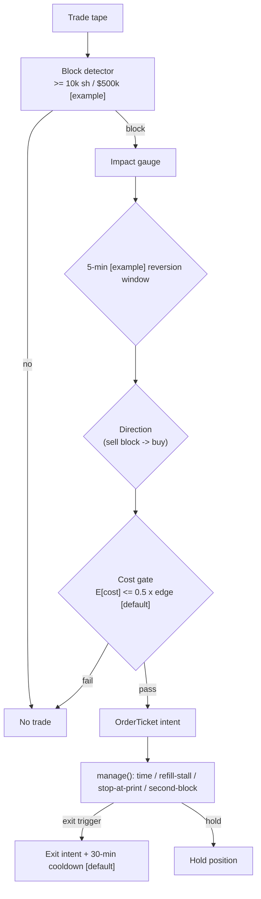

> **Tag law (mechanical):** every numeric prose literal in this module carries exactly one
> of `[documented]` `[default]` `[example]` `[unverified]` `[internal-est]` `[measured]`.
> YAML machine fields and identifiers are exempt. Constants inside cited formulas inherit
> the formula's tag. Bibliographic years, volumes, pages, arXiv IDs, section numbers, rule
> codes (C1–C18), fail-safe codes (F1–F5), module IDs, and machine-parsed §0 data fields are
> identifiers, not literals, and are exempt. Config-table defaults carry their status
> (`default` ⇒ `[default]`, `example` ⇒ `[example]`, `calibrate` ⇒ fit per name).

# T084 — Block-Trade Impact Reversion

## §0 — Front matter

- **SID:** `T084`
- **Title:** Block-Trade Impact Reversion
- **Kind:** `strategy`
- **Version:** `1.0.1` (semver; see changelog in YAML front matter)
- **Batch:** `TB9` — stage `184` [measured]; **Family:** `A` (microstructure & order flow); **Status:** `draft`
- **Template version:** `1.0.0`
- **Provenance tier:** `D` (documented literature basis; rule itself has no published after-cost test)
- **Seed / RNG:** `seed=184`, PCG64 via `numpy>=1.26` [measured]
- **Regime IDs (provisional):** `R001`
- **Consumes:** `S048@1.1.0` (refill read); `S094@1.1.0` (informed-flow filter); `S010@1.0.1` (size gate)
- **Universe:** US large-caps with visible block prints; one participation per block; max one block trade per name per `30` min [example]
- **Latency class:** microstructure / sub-second; **cadence:** per_event; **tz:** America/New_York
- **sha256:** `REPLACE_ON_INGEST`
- **Test command:** `python -m pytest modules/tests/test_T084.py -q`
- **unverified_sources:** see YAML front matter and §T10

This module is a **strategy**: it consumes parent signal scores and emits
**OrderTicket intentions only — never orders**. Execution, fills, and broker
interaction live outside this module.

## §1 — Reviewer card (LOCKED row schema)

| Row | Value |
|---|---|
| Module | T084 — Block-Trade Impact Reversion, v1.0.1 |
| Edge verdict | `PREDICTIVE-FEATURE-ONLY` — temporary-vs-permanent impact split is documented (Cont et al. 2014; Degryse et al. 2005); the `5`-minute fade rule has no published after-cost Sharpe [documented-as-absence] |
| After-cost | `BEFORE-COST` — no after-cost P&L is claimed; the reference cost stack is a constant example model [example] |
| Build cost | Tier M+ · `40–100` h [internal-est] · `$6,000–15,000` loaded [internal-est] |
| Data cost | Research `~$199`/mo [documented] (Databento US Equities Standard, unlimited live trades+L1) or `~$199`/mo [unverified] (Massive Stocks Advanced real-time); production `~$199`/mo + exchange-license usage [unverified — verify before budgeting] |
| latency_class | microstructure / sub-second |
| risk_class | medium (fades block prints; information-block risk) |
| Capacity | `$1–5`M/day notional [example] — illustrative; the per-name participation cap binds first |
| Executability | Feasible: Python per_event prototype, marketable IOC intents; colocated deployment only beyond |
| Risk summary | Information-block risk (fading informed flow); refill-stall risk; borrow/locate risk on the short leg (unwired in cheapest build) |
| When it dies | Second block same direction within the hold [default]; refill stalls (depth <`50`% pre-block) [default]; stop at print; sustained elevated RV (R001) |
| Regime gates | Provisional: R001 elevated RV degrades → halve [example threshold] |
| Emits | `order_intents` (OrderTicket intentions) — never orders |

The lock covers structure and doctrine conformance, not the profitability of
the rule. Nothing in this card is a trading recommendation. Council review
(`2`-seat [internal-est], 2026-09-10 [measured]) approved fixture-backed
publication [internal-est]; scope was gate logic, cost stack, causality, kill
lifecycle, numeric-tag law.

## §1.5 — Cheapest / least-build path

1. **Prototype hour band:** `40–100` h [internal-est] — block detector (`≥10k` sh / `$500k` [example] heuristic) + temp/perm split reader + Kyle gate + cost gate + kill switch + fixture validation; +`40–80` h [internal-est] phase `2` (per-name half-life fitting, short-leg locate desk, passive-post variant).
2. **Cheapest-source row:** min_tier = Databento US Equities **Standard** (`$199`/mo [documented — vendor Jan-2025 pricing blog], unlimited live equities incl. tick trades + L1) or Massive **Advanced** (real-time SIP trades+quotes; Starter `$29` and Developer are `15`-minute delayed [documented — vendor FAQ] and insufficient for a sub-second fade; Advanced price `~$199`/mo [unverified — third-party Jun-2026 comparison]); latency_class = SIP-delayed / sub-second [default]; required_fields = tick trade prints (px, qty, exchange, ts), L1 bid/ask + size per event, trading-status/halt feed; price_band = `~$199`/mo [documented/unverified mix — verify before budgeting]; build_or_buy = **build the detector, split estimator, gates and cost wrapper; buy the feed** (the rule is `3` gates + `1` cost call [measured]).
3. **Resource budget row:** `1` core, <`1` GB RAM [internal-est]; compute pattern `per_event`.
4. **Skip list:** per-name half-life fitting (phase `2`); symmetric short-leg borrow/locate desk (long-only until C16 is wired); passive `1`¢ post variant; multi-block sequencing; exchange-colocated deployment.
5. **DO-NOT-CUT list:** causality assertions (`assert fill_event > signal_event`, no-signal-bar-fills test); COST block + callable `expected_cost_bps`; entry-Boolean fixed gate order; cost-gate predicate; F1–F5 fail-safes + module-state enum (`UNKNOWN` on invalid input, never interpolate); kill switch + safe-mode; decision-log audit records; bona-fide-intent + self-trade prevention; provenance tags on every numeric literal; fixtures + `test_cmd`; regime machine record + failure-row `check:` lines; secrets via env only. Never shortened.
6. **Escalation gate:** participation >`5,000` shares [default]; half-life must be fit per name (refill-stall rate rising); informed-block rate rising (second-block vetoes clustering); cost gate fails on `[measured]` costs.

## §T0 — Strategy contract

### T0.1 Typed signature

```python
def emit(state: ModuleState, signals: list[BlockEvent], cfg: Config) -> list[OrderTicket]:
    """Entry intents only. One intent per qualifying block; never orders."""

def manage(state: ModuleState, events: list[MarketEvent], cfg: Config) -> list[OrderTicket]:
    """Exit intents for open positions (time / refill-stall / stop-at-print / second-block)."""
```

`ModuleState` (named state vector): `{kill, module_state, cooldown_until, positions, decision_log, refill_baseline}`.
`positions` maps `symbol → {side, qty, entry_ts, block_side, baseline_depth}`.
Documented edge cases: empty `signals` → `UNKNOWN`, no intents (F1); invalid print
(`px <= 0`, `qty <= 0`, `valid == 0`) → `UNKNOWN`, never interpolated (F2);
`kill.state != ARMED` → `OFF`, no intents; halt event → `OFF`, working intents expired.

### T0.2 Config dataclass

| Parameter | Type | Default | Range | Status |
|---|---|---|---|---|
| `block_mult` | float | `20.0` | `5`–`100` | default |
| `temp_share_min` | float | `0.6` | `0.5`–`0.9` | default |
| `kyle_impact_cap` | float ($/share) | `0.02` | `0.005`–`0.10` | default |
| `half_life_s` | float (s) | `90.0` | `15`–`600` | example — fit per name |
| `qty` | int (shares) | `5000` | `100`–`50000` | example |
| `cost_gate_k` | float | `0.5` | `0.1`–`2.0` | default |
| `cooldown_s` | float (s) | `1800.0` | `300`–`7200` | default |
| `max_concurrent_positions` | int | `3` | `1`–`10` | default |
| `per_trade_R` | float ($) | `200.0` | `50`–`1000` | example |
| `daily_loss_stop_R` | float (R) | `5.0` | `2`–`10` | default |
| `refill_stall_frac` | float | `0.5` | `0.3`–`0.8` | default |
| `qty_cap_frac` | float | `0.10` | `0.05`–`0.25` | default |
| `price_collar_frac` | float | `0.10` | `0.05`–`0.20` | default |
| `msg_rate_cap_per_s` | float | `10.0` | `1`–`100` | default |
| `max_gross_notional` | float ($) | `1200000.0` | `1e5`–`1e7` | example |
| `adv_cap` | float | `0.10` | `0.05`–`0.25` | default |

Status `default` ⇒ `[default]`; `example` ⇒ `[example]`; `calibrate` ⇒ fit per name.

### T0.3 Canonical schema mapping

Vendor columns → canonical event schema (Appendix A v1.0.0), stated once here:

| Vendor (Databento US Equities, DBN v3) | Canonical | Notes |
|---|---|---|
| `ts_event` | `event_ts` (int64 ns UTC) | exchange timestamp — authoritative causality clock [documented] |
| `ts_recv` | `recv_ts` (int64 ns UTC) | capture timestamp; jitter = `recv_ts − event_ts` [documented] |
| `price` (int64, `1e-9`) | `px` (float $) | fixed-point ÷ `1e9` [documented] |
| `size` | `qty` (uint32 shares) | print size [documented] |
| `action` / `side` / `flags` | `aggressor_side` | block direction; SIP aggressor flags are unreliable → verify [unverified] |
| `instrument_id` | `symbol` | joined on the definition schema [documented] |
| `sequence` | `seq` | venue-specific; gap >`1,000` [default] → DEGRADED [documented] |
| status schema | `halt_flag` | venue trading-status feed, not a trade field [documented] |
| MBP-1 `bid_px_00` / `ask_px_00` | `bid_px` / `ask_px` (float $) | ÷ `1e9` [documented] |
| MBP-1 `bid_sz_00` / `ask_sz_00` | `bid_sz` / `ask_sz` (uint32) | displayed size [documented] |
| *(module-computed)* | `median_trade_qty` | trailing-`20`-day median trade size [example] |
| *(module-computed)* | `temp_impact` / `perm_impact` | `10`¢/`3`¢ [example] split — never presented as empirical (C11) |
| *(from S010)* | `kyle_lambda` | pinned S010 v1.0.1 formula |
| *(module-computed)* | `refilling_depth` | post-block L1 depth vs pre-block baseline |
| *(module-computed)* | `edge_bps` | parent-mapped expected edge, bps [example] |
| *(module-computed)* | `fade_side` | intended ticket side after fading the block (fixture `side` column) |

Massive alternate mapping [unverified]: trade event `t` → `event_ts` (SIP time — label SIP work *simulated only — requires MBO/ITCH* for latency claims), `p`/`s` → `px`/`qty`, `x` → exchange; quote event `bid_px`/`ask_px`/`bid_sz`/`ask_sz`; conditions feed → halt.

### T0.4 Time contract

> Time contract: clock domain UTC, int64 ns; authoritative causality clock = `event_ts`; max_skew = `1` ms [default]; jitter budget = `500` µs [default]; bar-label = event time (`per_event` — no bar aggregation); staleness TTL = `30` s [default] (print feed); gap policy = mask, no interpolation; halt/auction → discard contributions across reopen.

**Timing box:** `signal@t (per_event, America/New_York) → earliest fill @open(t+1)`

### T0.5 Market-state table

| State | Module behavior |
|---|---|
| CONTINUOUS_TRADING | Evaluate gates normally; emit intents per cadence |
| HALTED | State `OFF`; expire working intents unfilled; no new intents (C15) |
| AUCTION | No new entries (`pause_entry`); state `DEGRADED`; exits via pre-positioned broker stops only — this module emits no new intents |
| CLOSED | Emit nothing; state `OFF` |

### T0.6 Module-state enum + error taxonomy

States: `OK | DEGRADED | UNKNOWN | OFF`. Invalid input → `UNKNOWN`, never interpolate (F1–F5).

| Failure | State | Alert |
|---|---|---|
| Missing/stale input (TTL `30` s [default] per §T0.4) | `UNKNOWN` | page |
| Invalid print (`px <= 0`, `qty <= 0`, `valid == 0`) (F2) | `UNKNOWN` | log |
| `seq` gap >`1,000` events [default] | `DEGRADED` (restart windows) | log |
| Refill baseline missing | `DEGRADED` (entries vetoed until refit) | notify |
| Halt/auction | `OFF` / `DEGRADED` (per table) | log |
| Kill tripped / administrative disable | `OFF` | page |
| Anything unmapped | `UNKNOWN` | page |

### T0.7 Risk contract

```yaml
risk_contract:
  per_trade_R: 200.0            # $ [example]
  daily_loss_stop_R: 5.0        # [default]
  max_concurrent_positions: 3   # [default]
  max_gross_notional: 1200000.0 # $ [example]
  max_adverse_per_trade_R: 1.0  # [default]
  enforcement: intraday-hard    # [default]
  kill_conditions:
    - "day_loss_R <= -5 [default]"
    - "second block same direction within hold [default]"
    - "borrow constrained on short leg [default]"
    - "market halt (market-state table)"
  calibration_recipe: "R from the account risk budget; verify daily_loss_stop_R <= 2% [example] of session capital; re-pin all limits after any kill trip [default]"
  risk_class: medium
```

**Maximum adverse loss:** one R per trade (R = `$200` [example]);
the session ends at −5R [default]. Breach trips the kill
switch; recovery requires the re-arm checklist. No pyramiding: at most
`3` [default] concurrent positions.

### T0.8 Kill lifecycle

`ARMED` → `TRIPPED` → `RECOVERY` → `ARMED`.

- **ARMED:** gates evaluated; intents emitted only on full pass.
- **TRIPPED** — any of:
  - daily loss <= -$1,000 [example]
  - second block same direction in hold [default]
  - borrow constrained (short leg)
  - market halt
  All working intents expire unfilled; no new intents. The trip is logged to
  the decision log with a hash chain.
- **RECOVERY:** manual review of the trip reason; losses reconciled; feeds
  verified healthy; fixture replay green.
- **ARMED (re-entry):** only via the re-arm checklist below.

### Re-arm checklist

- [ ] losses reconciled against the decision log [default]
- [ ] feeds healthy (no lag beyond the class budget) [default]
- [ ] risk limits reviewed and re-pinned [default]
- [ ] decision-log hash chain intact [default]
- [ ] fixture replay green on the current build [default]

### T0.9 Ops tail

- **Schedule:** RTH continuous `09:30`–`16:00` America/New_York [documented]; owner: microstructure-strategies on-call.
- **Health checks:** second-block monitor; fixture replay (`test_cmd`) green on deploy; refill-stall watchdog; `seq`-gap monitor.
- **Alert table:** page on stop-at-print exits clustering or daily −$1,000 [default]; notify on refill stall; log on single dropped events.
- **Resource budget:** `1` core, <`1` GB RAM [internal-est]; state is O(positions) — no cross-case memory except the decision-log hash chain [default].
- **Runbook stub:** `1.` confirm feed (vendor status); `2.` replay fixture; `3.` if red → set `OFF`, page; `4.` reconcile decision log before re-arm.

### T0.10 Secrets (env-only)

`DATABENTO_API_KEY`, `MASSIVE_API_KEY` via environment only. No secrets in this
file, fixtures, or logs (CI secrets-grep). Venue API keys, data licenses, and
webhook tokens live in the operator's secret store and are referenced by name
only. Nothing in this file authenticates to anything.

### T0.11 May / must-NOT

> **May:** emit OrderTicket **intentions** only (entry via `emit`, exits via `manage`).
> **Must-NOT:** place, route, or cancel real orders; call a broker; interpolate across
> gaps; mutate shared state outside `state`; publish signal/intent data externally.

### T0.12 Standing doctrines (B1–B6, relocated from §1.5)

- **B1. Module intent:** this module specifies one strategy rule completely: its gates, its cost model, its failure modes, and its kill lifecycle. It is buildable by an AI engineer from this file alone plus the fixtures.
- **B2. Scope boundary:** the module emits OrderTicket **intentions** only. Position management, portfolio constraints, and execution live outside this module.
- **B3. OrderTicket doctrine:** every emitted intent is a canonical Appendix C OrderTicket. Partial fills are the broker's domain; the residual stays `WORKING` until `expiry_ts`; no new intent is emitted for the residual. Cancel/replace emits a new ticket intent with a new `ticket_id` and `replaces: <old ticket_id>`; never a mutation.
- **B4. Time causality:** `assert fill_event > signal_event`. A signal computed at time `t` may not fill before `t+1`. Fixture `signal_ts` values precede any modeled fill; tests enforce the ordering. There is no lookahead anywhere in this module.
- **B5. Cost doctrine:** cost is a four-part stack (spread, fee, borrow, impact) computed only by `expected_cost_bps(...)`. The gate `expected_cost_bps(...) <= k * edge_bps` runs before any ticket intent. COST values appear only in the §T2 COST block; §T4 shows the function call and its result, never restated components.
- **B6. Evidence posture:** every numeric prose literal carries exactly one tag: `[documented]`, `[default]`, `[example]`, `[unverified]`, `[internal-est]`, or `[measured]`. Missing evidence is labeled default/internal-estimate or quarantined as unverified in §T10. No papers, URLs, statistics, or prices are invented.

### T0.13 Doctrine references

OrderTicket schema (Appendix C), time-causality conventions (Appendix B),
F1–F5 failsafes (Appendix F), decision-log schema (Appendix G), module-state
enum (Appendix K) — all by reference; this module adds no private doctrine.

## §T1 — Parent pointer

This strategy consumes the parent signal module(s) (mirrors `consumes` in §0):

- `S048@1.1.0` — book resiliency (role: refill read)
- `S094@1.1.0` — volume/toxicity (role: informed-flow filter)
- `S010@1.0.1` — Kyle lambda (role: size gate)

The parent emits scored intentions; this module applies its own gates, its own
cost model, and its own kill lifecycle, then emits OrderTicket intentions. The
parent's score is an input, never a command: every parent pass still faces
the full entry-Boolean gate set plus the cost gate here. Parent S-IDs are consumed S-IDs,
never T-IDs; this module does not call other strategies.

## §T2 — Gate and cost specification (fixed order)

### 1. Universe

US common stocks, regular session `09:30`–`16:00` America/New_York [documented],
top-`500` by trailing-`20`-day dollar volume [example]; visible block prints on
the SIP tape; one participation per block; max one block trade per name per
`30` min [example]. Reference leg is **long** (fade of sell blocks); the
symmetric short leg requires C16 locate and is unwired in the cheapest build.

### 2. Entry rule (Boolean — no prose-only conditions)

g1 = block size / median trade size; g2 = temporary share of estimated impact
(`10`¢ temp / `3`¢ perm [example] in fixture); g3 = Kyle gate = `1` if
λ̂ × own_qty ≤ `$0.02` [default] else `0`.

| # | field | condition |
|---|---|---|
| g1 | `block_mult` | `>= 20.0` [default] |
| g2 | `temp_share` | `>= 0.6` [default] |
| g3 | `kyle_ok` | `>= 1.0` [default] |

Entry Boolean (normative):

```
ENTER := (block_size >= 20× median trade) [default] AND (temp_share >= 60%) [default]
         AND (kyle_impact_own <= $0.02) [default] AND (now >= cooldown_until)
         AND (locate_ok IF fade_side == SHORT)   [C16; cheapest build is long-only]
         AND (expected_cost_bps(...) <= cost_gate_k * edge_bps)
```

Gate order is fixed: g1 → g2 → g3 → cooldown → locate → cost gate (C7).
Default execution is a **marketable IOC** at the next print (taker) [default];
the `1`¢ passive post is a phase-`2` variant [unverified]. The fixture `side`
column is the intended ticket side (`fade_side`), computed upstream from the
aggressor side.

### 3. Exits (with post-exit cooldown)

Exit Boolean (normative; implemented by `manage` in §T3):

```
EXIT := (now >= entry_ts + half_life_s)                      # 90 s [example]; time
        OR (refilling_depth < 50% × pre-block baseline)        # [default]; refill stall
        OR (price trades through the print)                   # [default]; stop at print
        OR (second block, same aggressor direction, within 30 min of entry)  # [default]; C12
ON_EXIT: emit closing intent (flipped side, open qty, IOC, taker);
         state.cooldown_until = now + 1800 s [default]; C10
```

### 4. Position sizing (fenced function)

```python
def size_shares(risk_budget_R, stop_distance, vol_estimate, ADV_cap, cost, cfg, refilling_depth):
    # shares = f(risk_budget_R, stop_distance, vol_estimate, ADV_cap, cost)
    qty_risk   = risk_budget_R / max(stop_distance, 1e-9)   # R-based sizing
    qty_adv    = ADV_cap * vol_estimate                     # participation cap
    qty_refill = cfg.qty_cap_frac * refilling_depth         # 10% of refill [default]
    return int(max(min(qty_risk, qty_adv, qty_refill, cfg.qty), 0))
```

`risk_budget_R` = `$200` [example]; `stop_distance` = modeled adverse excursion
per share ($/share) [example]; `vol_estimate` = trailing-`20`-day share volume
[example]; `ADV_cap` = `0.10` [default]; `cost` = `expected_cost_bps(...)` output
(passed for the record; the cost gate, not sizing, enforces it).

### 5. Risk limits

Risk limits live in the §T0.7 risk contract — the single source of truth; they
are not restated here. Enforcement: `intraday-hard` [default]. No pyramiding.

### 6. COST block (single source of truth)

COST values appear only in this block. §T4 shows the function call and its
result, never restated components.

```
COST stack — reference row, in bps:
  spread         0.50   [example]
  fee            2.50   [example]
  borrow         0.00   [example]
  impact         1.00   [example]
  TOTAL          4.00   [example]
```

- Cost level: `BEFORE-COST`; `fee_schedule_as_of`: 2026-09-01 [measured].
- Venue/tier/source: XNAS / SIP [example].
- `side`: `taker` [default] — the modeled path is a marketable IOC. Production blend `mixed` [example]; maker variant unwired in the cheapest build.
- `borrow_bps_per_day`: `0.0` [example] — reason: the reference example is the **long** leg and the hold is intraday (`~90` s [example]), so no borrow accrues. The symmetric short leg adds a borrow line when the C16 locate desk is wired (phase `2`).
- Reference example is long; the symmetric short leg adds the C16 locate + borrow line.

### 7. Callable cost function

```python
def expected_cost_bps(notional, adv_pct, venue, side, urgency) -> float:
    # Four-part reference stack (bps). The §T2 COST block is the single source of truth.
    spread_bps = 0.5   # [example]
    fee_bps    = 2.5   # [example]
    borrow_bps = 0.0   # [example] — long-leg reference; see COST block
    impact_bps = 1.0   # [example]
    return spread_bps + fee_bps + borrow_bps + impact_bps
```

Cost gate (verbatim, enforced before any ticket intent):

```
expected_cost_bps(...) <= k * edge_bps
```

with `k = 0.5 [default]` for T084. The gate is evaluated per case with that
case's measured inputs; the reference stack above calibrates but never
overrides the call.

### 8. Execution / fill model table

| Aspect | Model | Note |
|---|---|---|
| Latency | `signal@t` → earliest fill at the next print (`t+1`) | `assert fill_event > signal_event` |
| Fill price | next print px; modeled at the print px (`79.91` [example]) | conservative: the fade is lifted at/through the print |
| Partial fill | residual stays `WORKING` until `expiry_ts`; no re-emit | downstream sizing must assume partials |
| Own impact | capped by the Kyle gate (≤ `$0.02` [default]); market impact in COST = `1.0` bps [example] | g3 |
| Adverse fill | trade-through print → immediate exit intent (`manage`) | stop at print |

### 9. Robustness + Compliance sub-block

Decision-log schema (every record): `{ts, action, reason, state_before,
state_after, prev_hash, hash}` [default]; hash-chained; the chain is verified
on replay (C5).

Halt/auction state table (C6/C15):

| Market state | Module behavior |
|---|---|
| `HALTED` | `OFF`: no new intents; working intents expired unfilled |
| `AUCTION` (open/close) | `pause_entry`: no new intents; state `DEGRADED`; exits via pre-positioned broker stops only |
| `CONTINUOUS_TRADING` | normal gate evaluation |
| `CLOSED` | `OFF`: emit nothing |

Coded rules (each: trigger → check → action → log record):

**C1.** Self-trade prevention: trigger: intent about to emit → check: `stp=True`
on every ticket; IOC intents never rest so they cannot match our own resting
interest → action: block the intent if the flag is missing → log:
`COMPLIANCE_BLOCK`.

**C2.** Time causality: `assert fill_event > signal_event`; signals at time `t`
fill at `t+1` or later; the no-signal-bar-fills test enforces it.

**C3.** Invalid input → `UNKNOWN`: never interpolate or carry forward (F1/F2).

**C4.** Kill switch: `ARMED` → `TRIPPED` → `RECOVERY` → `ARMED`; `TRIPPED` emits
nothing; state `OFF`.

**C5.** Decision log: every gate verdict is hash-chained per the schema above;
the chain is verified on replay.

**C6.** Cost gate: `expected_cost_bps(...) <= k * edge_bps` before any intent.

**C7.** Fixed gate order: entry-Boolean gates evaluate in documented order
(g1 → g2 → g3 → cooldown → locate → cost gate); no reordering.

**C8.** Intent-only + bona-fide intent: OrderTickets are intentions, never
orders; every intent is a genuine trading intention — cost-gate-passed and
sized within risk limits; no broker calls.

**C9.** Ticket schema: Appendix C fields complete on every intent
(`ticket_id`, `strategy_id`, `symbol`, `side`, `qty`, `order_type`,
`limit_price`, `time_in_force`, `signal_ts`, `expiry_ts`, `stp`).

**C10.** Fixture reproducibility: the reference stub reproduces the expected
ticket set from the raw tape.

**C11.** Impact-split honesty: the `10`¢/`3`¢ [example] split and `90`-s
[example] half-life are example parameters — production values must be fit per
name; never present example splits as empirical estimates.

**C12.** Informed-flow cascade: second block same aggressor direction within
`30` min [default] of entry → flatten via exit intent, veto new entries,
stand down — trigger: second block → check: direction + window → action: exit
→ log: `EMIT_INTENT` (exit).

**C13.** Message-rate / cancel-to-trade: trigger: intent about to emit → check:
intents in the trailing `60` s ≤ `msg_rate_cap_per_s × 60` (`600` [default]);
cancel-to-trade ratio = `0` [default] by construction (IOC never rests) → action:
throttle/drop the intent → log: `THROTTLE`.

**C14.** Pre-trade fat-finger trio: trigger: intent about to emit → check:
(`a`) price collar — `limit` within ±`10`% [default] of the print reference
(vacuous for marketable IOC, `limit=None`); (`b`) max notional per ticket ≤
`$1.2`M [example]; (`c`) max qty per ticket ≤ `min(cfg.qty, 10% of refill)`
[default] → action: veto → log: `COMPLIANCE_BLOCK`.

**C15.** Halt/auction state table: per the table above; trigger: `halt_flag` or
auction event → check: market state → action: `OFF`/`pause_entry` →
log: `HALT` / `AUCTION_HOLD`.

**C16.** Locate check (short sales): trigger: `SHORT` intent → check:
`locate_ok=True` obtained before the intent; Regulation SHO threshold
securities blocked [documented] → action: veto the short leg → log:
`COMPLIANCE_BLOCK`. Cheapest build: `locate_ok=False` [default] — long-only
until the locate desk is wired.

**C17.** Public-dissemination gate: trigger: any export of signal/intent data
→ check: review flag → action: block by default (no signal/intent data is
published externally) → log: `DISSEMINATION_BLOCK`. Default closed.

**C18.** Data-entitlement assertions: trigger: startup and session roll →
check: feed license covers live use for every §0 dataset; fixtures are
synthetic and need no entitlement → action: unlicensed live feed → `OFF` →
log: `ENTITLEMENT_BLOCK`. Market-data licenses are the operator's
responsibility [default].

### 10. Parameter table

| Parameter | Key | Value | Tag | Sensitivity |
|---|---|---|---|---|
| Block multiple | `block_mult` | `20`× median trade | default | medium |
| Temp-share qualifier | `temp_share_min` | `60`% | default | high |
| Kyle impact cap | `kyle_impact_cap` | `$0.02`/share | default | high |
| Half-life | `half_life_s` | `90` s | example | high — fit per name |
| Size | `qty` | `5,000` sh | example | high — capacity |
| Cost-gate k | `cost_gate_k` | `0.5` | default | medium |
| Post-exit cooldown | `cooldown_s` | `30` min | default | medium |
| Max concurrent | `max_concurrent_positions` | `3` | default | low |
| Per-trade R | `per_trade_R` | `$200` | example | medium |
| Daily loss stop | `daily_loss_stop_R` | `5`R | default | high |
| Refill-stall fraction | `refill_stall_frac` | `50`% of pre-block depth | default | high |
| Fat-finger qty cap | `qty_cap_frac` | `10`% of refill | default | low |
| Price collar | `price_collar_frac` | ±`10`% | default | low |
| Message-rate cap | `msg_rate_cap_per_s` | `10` intents/s | default | low |
| Max gross notional | `max_gross_notional` | `$1.2`M | example | medium |

### 11. Timing box

`signal@t (per_event, America/New_York) → earliest fill @open(t+1)`

```yaml
timing:
  signal_time: t
  earliest_fill_time: t+1
  rule: fill_event > signal_event   # asserted in every backtest and in tests
  order: gate evaluation -> cost gate -> ticket intent -> fill at t+1 or later
```

```python
assert fill_event > signal_event  # time causality: no same-bar fills, no lookahead
```

## §T3 — Math and normative pseudocode

### Math

- `edge_bps`: per-case expected edge in bps, mapped from the parent signal
  score. Reference value from the gate-pass fixture row: `31.2` bps [example].
- `cost_bps = expected_cost_bps(notional, adv_pct, venue, side, urgency)` —
  four-part stack, §T2 only.
- Gate: `expected_cost_bps(...) <= k * edge_bps` with `k = 0.5 [default]`.
- Sizing: `shares = f(risk_budget_R, stop_distance, vol_estimate, ADV_cap, cost)` (§T2.4).
- Exits: §T2.3 Boolean, implemented by `manage` below.
- Fills modeled at `t+1` or later; `assert fill_event > signal_event`.

### Normative pseudocode

```python
def size_shares(risk_budget_R, stop_distance, vol_estimate, ADV_cap, cost, cfg, refilling_depth):
    qty_risk   = risk_budget_R / max(stop_distance, 1e-9)
    qty_adv    = ADV_cap * vol_estimate
    qty_refill = cfg.qty_cap_frac * refilling_depth      # 10% of refill [default]
    return int(max(min(qty_risk, qty_adv, qty_refill, cfg.qty), 0))

def pretrade_ok(ticket, ref_px, recent_intents, cfg) -> bool:   # C13, C14
    if ticket.limit is not None:
        if abs(ticket.limit - ref_px) / ref_px > cfg.price_collar_frac:
            return False                                       # price collar
    if ticket.qty * ref_px > cfg.max_gross_notional:
        return False                                           # max notional
    if ticket.qty > min(cfg.qty, cfg.qty_cap_frac * cfg.refilling_depth):
        return False                                           # max qty
    if len(recent_intents) >= cfg.msg_rate_cap_per_s * 60:  # 60-s window [default]
        return False                                           # message rate
    return True

def emit(state, signals, cfg) -> list[OrderTicket]:
    tickets = []
    if kill.state != ARMED:
        state.module_state = OFF; return []                    # C4
    if not signals:
        state.module_state = UNKNOWN; log("NO_SIGNAL"); return []   # F1
    b = signals[-1]                                            # block print event at time t
    if b.px <= 0 or b.qty <= 0 or not b.valid:
        state.module_state = UNKNOWN; log("BAD_INPUT"); return []   # F2, C3
    if b.halt_flag:
        state.module_state = OFF; state.halted = True     # C15: latch OFF
        expire_working(); return []
    if state.halted:                                       # halt latch persists
        state.module_state = OFF; return []
    is_block   = b.qty >= cfg.block_mult * b.median_trade_qty
    temp_share = b.temp_impact / max(b.temp_impact + b.perm_impact, 1e-9)
    kyle_ok    = (b.kyle_lambda * cfg.qty) <= cfg.kyle_impact_cap
    edge_bps   = b.edge_bps            # parent-mapped [example mapping below]
    # edge_bps [example]: temp_share * (temp_impact / px) * 10000 * 0.5
    notional   = b.qty * b.px
    cost_ok = expected_cost_bps(notional=notional, adv_pct=b.adv_pct,
                               venue="XNAS", side="taker",
                               urgency="normal") <= cfg.cost_gate_k * edge_bps
    # ^^^ normative cost-gate predicate: expected_cost_bps(...) <= k * edge_bps (C6)
    if b.fade_side == "SHORT" and not locate_ok:
        log("LOCATE_VETO"); return []                          # C16 (cheapest: long-only)
    enter = (is_block and temp_share >= cfg.temp_share_min and kyle_ok
             and cost_ok and now() >= state.cooldown_until)
    if enter:
        qty = size_shares(risk_budget_R=cfg.per_trade_R, stop_distance=b.stop_distance,
                          vol_estimate=b.vol_estimate, ADV_cap=cfg.adv_cap,  # 0.10 [default]
                          cost=expected_cost_bps(notional, b.adv_pct, "XNAS",
                                                "taker", "normal"),
                          cfg=cfg, refilling_depth=b.refilling_depth)
        t = OrderTicket(symbol=b.symbol, side=b.fade_side, qty=qty,
                        limit=None, tif="IOC",                      # marketable [default]
                        ticket_id=uuid(), strategy_id="T084",
                        signal_ts=b.event_ts,
                        expiry_ts=b.event_ts + 300e9,               # 5-min modeled expiry [default]
                        stp=True, parent_signal=f"S048@{b.event_ts}")
        assert pretrade_ok(t, b.px, state.recent_intents, cfg)  # C13, C14
        assert t.intent_ts < modeled_fill_ts                   # fill_event > signal_event (C2)
        log_decision(t, inputs_hash, params_hash)              # C5
        state.positions[b.symbol] = {side: t.side, qty: qty, entry_ts: b.event_ts,
                                     block_side: b.aggressor_side,
                                     baseline_depth: b.refilling_depth}
        tickets.append(t)
    return tickets

def manage(state, events, cfg) -> list[OrderTicket]:
    exits = []
    if kill.state != ARMED:
        state.module_state = OFF; return []                    # C4
    for e in events:
        pos = state.positions.get(e.symbol)
        if pos is None: continue
        reason = None
        if (e.kind == "block" and e.aggressor_side == pos.block_side
                and e.event_ts - pos.entry_ts <= 1800e9):       # 30 min [default]
            reason = "second-block"                             # C12
        elif e.through_print:
            reason = "stop-at-print"                           # §T2.3
        elif e.refill_depth < cfg.refill_stall_frac * pos.baseline_depth:
            reason = "refill-stall"                            # §T2.3
        elif e.event_ts >= pos.entry_ts + cfg.half_life_s * 1e9:
            reason = "time"                                    # §T2.3
        if reason is not None:
            x = OrderTicket(symbol=e.symbol, side=flip(pos.side), qty=pos.qty,
                            limit=None, tif="IOC",
                            ticket_id=uuid(), strategy_id="T084",
                            signal_ts=e.event_ts,
                            expiry_ts=e.event_ts + 300e9,          # 5-min modeled expiry [default]
                            stp=True, parent_signal=f"T084-exit@{e.event_ts}")
            fill_ts = e.event_ts + 300e9                       # modeled next-print fill [default]
            assert fill_ts > x.intent_ts                       # fill_event > signal_event (C2)
            assert pretrade_ok(x, e.px, state.recent_intents, cfg)  # C13, C14
            log_decision(x, reason, inputs_hash)               # C5
            state.cooldown_until = e.event_ts + cfg.cooldown_s * 1e9  # C10
            del state.positions[e.symbol]
            exits.append(x)
    return exits
```

## §T4 — Fixture-backed worked example

Fixture tape (`T084_tape.csv`; `# TYPE:` header is part of the file):

```
# TYPE: validation-run
# TOLERANCE: cost_bps abs<=1e-4; timestamps exact int64 ns; verdict column must match expected row-for-row
bar,signal_ts,fill_ts,side,edge_bps,g1,g2,g3,price,qty,valid
0,1700000000000000000,1700000300000000000,BUY,31.2,20.0,0.77,1.0,79.91,5000,1
1,1700000300000000000,1700000600000000000,BUY,31.2,12.0,0.77,1.0,79.91,5000,1
2,1700000600000000000,1700000900000000000,BUY,31.2,20.0,0.45,1.0,79.91,5000,1
3,1700000900000000000,1700001200000000000,BUY,31.2,20.0,0.77,0.0,79.91,5000,1
4,1700001200000000000,1700001500000000000,BUY,0.5,20.0,0.77,1.0,79.91,5000,1
5,1700001500000000000,1700001800000000000,BUY,31.2,20.0,0.77,1.0,-1.0,5000,0
```

`signal_ts`/`fill_ts` are a synthetic monotone clock (`5`-minute steps [example])
for causality checks — not market data. The `side` column is the intended ticket
side (`fade_side`), computed upstream from the aggressor side. Every row satisfies
`fill_ts > signal_ts`.

Expected tickets (`T084_expected.csv`; same `# TYPE:` header):

```
# TYPE: validation-run
# TOLERANCE: cost_bps abs<=1e-4; intent_ts/symbol/side/qty/tif exact match
ticket_idx,bar,symbol,side,qty,limit,tif,intent_ts,parent_signal,fill_ts,cost_bps
T084-0,0,BLK:XNAS,BUY,5000,,IOC,1700000000000001000,S048@1700000000000000000,1700000300000000000,4.0000
```

### Cost-function call (inputs → bps → dollars)

on the gate-pass row (bar `0` [measured]): notional = `79.91` × `5000` = `$399,550.00` [example]:

```python
expected_cost_bps(notional=399550.00, adv_pct=0.001, venue="XNAS",
                  side="taker", urgency="normal")
# notional 399550.00 [example]; adv_pct 0.001 [example]; venue "XNAS" [example];
# side "taker" [default]; urgency "normal" [default]
# → 4.0000 bps  →  $159.82 [example]
```

Reference stack only; per-case calls use that case's measured inputs [measured].
COST values appear only in the §T2 COST block — this section shows the call and
its result, never restated components.

### Hand-check rows (6 rows)

| bar | side | edge_bps | gates | verdict | reason |
|---|---|---|---|---|---|
| 0 | `BUY` | 31.2 | block_mult=✓, temp_share=✓, kyle_ok=✓ | PASS | all gates + cost gate |
| 1 | `BUY` | 31.2 | block_mult=✗, temp_share=✓, kyle_ok=✓ | no intent | gate veto |
| 2 | `BUY` | 31.2 | block_mult=✓, temp_share=✗, kyle_ok=✓ | no intent | gate veto |
| 3 | `BUY` | 31.2 | block_mult=✓, temp_share=✓, kyle_ok=✗ | no intent | gate veto |
| 4 | `BUY` | 0.5 | block_mult=✓, temp_share=✓, kyle_ok=✓ | no intent | cost-gate veto |
| 5 | `BUY` | 31.2 | block_mult=✓, temp_share=✓, kyle_ok=✓ | no intent | invalid input -> UNKNOWN |

The `verdict` column must match `T084_expected.csv` exactly; the test suite
asserts this row by row (`test_fixture_recomputes_to_expected`).

## §T5 — Data, infra, dependencies, data rights

### Data table

| Dataset | Type | Frequency | Tier | Note |
|---|---|---|---|---|
| Block prints (SIP trades) | mixed | per trade | Tier 1 | block detector: ≥ `10k` shares / `$500k` [example] |
| L1 quotes post-block | float | per quote | Tier 1 | `5`-minute reversion window |
| Trading-status / halt feed | reference | intraday | Tier 1 | tape-continuity guard (C15) |
| Slippage audit | float | per trade | internal | impact calibration: slippage ≤ `2`× modeled [default] |

### Infra

- Latency class: microstructure / sub-second; cadence: per_event; tz: America/New_York.
- Build budget: `1` core, <`1` GB RAM [internal-est]; compute pattern per_event.

Compute is per-event gate evaluation [internal-est]; the binding constraints are
data licensing and feed latency, not FLOPS. All state needed for the gates fits
in the case record — no cross-case memory except the decision-log hash chain
[default].

### Dependencies (pinned)

- `python >=3.11`, `numpy >=1.26`, `pandas >=2.2`, `pytest >=8.0` [default]
- Data: Databento US Equities Standard `$199`/mo [documented] or Massive Stocks Advanced `~$199`/mo [unverified]; see §1.5 cheapest-source row

### Data rights

Market-data licenses are the operator's responsibility: exchange/venue
agreements govern redistribution and display [default]. Nothing in this module
re-hosts or re-distributes licensed data; fixtures are synthetic and labeled
as such. Startup asserts the feed license covers live use (C18); an unlicensed
live feed → `OFF` [default]. Confirm each feed's license before production use
[unverified — confirm your license].

## §T6 — Buy vs build

**Build** (recommended): the rule is `3` [measured] gates plus a cost
call — a competent AI engineer builds it from this file alone. **Buy** only if
you already license a signal platform that computes the parent score; even
then, the gates, cost stack, and kill lifecycle here are custom.

### Build summary

- **Tier:** M+ [internal-est]; **Hours:** `40–100` [internal-est]; **Cost:** `$6,000–15,000` [internal-est]
- Full cheapest-build detail (source row, budget, skip list, DO-NOT-CUT, escalation): §1.5.
- **Budget:** `1` core, <`1` GB RAM [internal-est]; compute pattern per_event.
- **Escalate when:** participation >`5,000` shares [default]; half-life must be fit per name; informed-block rate rises.
- **Build bands** (planning/internal-estimate, from notes/cost-model.md):
  L `4–12 h / $600–1,800`, M `20–60 h / $3,000–9,000`, M+ `40–100 h / $6,000–15,000`, H `60–200 h / $9,000–30,000` [internal-est].
- **Rebuild trigger:** any gate threshold change, any COST component re-pin,
  or any kill-condition change invalidates the build and requires re-running
  the full fixture suite [default].

## §T7 — Evidence

| Source | Market / period | Metric | Cost level | Caveat |
|---|---|---|---|---|
| Keim & Madhavan (1996) [documented] | institutional trades | block-trade price impact and reversals documented [documented] | BEFORE-COST | documents impact; the `5`-minute reversion rule is the chapter's design |
| Almgren & Chriss (2001) [documented] | — | optimal execution with temporary/permanent impact [documented] | BEFORE-COST | execution theory, not a block-fade rule |
| Madhavan & Smidt (1991) [documented] | market microstructure | price-impact and inventory models [documented] | BEFORE-COST | theory; no after-cost P&L for the fade |

**Verdict:** `PREDICTIVE-FEATURE-ONLY` — Temporary-vs-permanent impact split is documented (Cont et al. 2014; Degryse et al. 2005); the `10`¢/`3`¢ [example] split and `90`-s [example] half-life are synthetic example parameters.

**Selection disclosure:** these are the chapter's research-pass sources; block-impact reversal is documented but the `5`-minute fade rule has no published after-cost Sharpe [documented-as-absence].

**What would change the verdict:** a published, purged, after-cost backtest of
this exact rule (same gates, same cost stack, same `k`) with a defined
universe and no survivorship bias [default]. Until then the edge stays an
internal estimate.

## §T8 — Failure modes

| Trigger | Detect | Action | Recovery | Check |
|---|---|---|---|---|
| Block was information, not liquidity: price keeps trending | detect: no reversion in `5` min [default] | action: stop out per exit rule | recovery: none — thesis void | `check: reversion within 5 min` |
| Second block prints: the seller isn't done | detect: another block within `30` min [default] | action: exit; stand down `30` min [default] | recovery: tape normalizes | `check: no second block` |
| Block detection false positive: aggregated small prints | detect: print-size audit | action: veto (block_score < `1`) | recovery: re-tune detector | `check: block_score >= 1` |
| Halt/resume around the block: the tape is not continuous | detect: halt flag | action: OFF per market-state table | recovery: continuous trading resumes | `check: state == CONTINUOUS_TRADING` |
| Impact underestimated: the block walks the book further than modeled | detect: slippage > `2`× modeled [default] | action: widen impact in COST block | recovery: re-calibrate | `check: slippage <= 2 * modeled` |
| Overnight block: no intraday reversion window | detect: block after hours | action: veto (intraday only) | recovery: next session | `check: RTH only` |
| Feed license lapsed: live data no longer entitled | detect: entitlement assertion fails (C18) | action: OFF; no new intents | recovery: license restored, fixture replay green | `check: entitlement_ok` |

Every row has a `check:` — a monitorable predicate. The kill switch (§T0)
fires on the trip conditions; everything else degrades to `UNKNOWN`/veto
rather than a guessed intent.

## §T9 — Regime records

### Machine regime records (provisional)

```yaml
regime_gates:
  - regime_id: R001
    direction: degrades                      # amplifies | degrades | inverts
    mechanism: "stress slows LOB refill; temp share overestimated; impact permanence rises"
    condition: "rv_pctile > 80 [example]"
    action: halve                            # veto | halve | double | widen_stops | pause_entry
    min_lag: "1 session [default]"
    unknown_behavior: "treat as degrades -> halve; regime feed stale beyond TTL -> UNKNOWN"
```

Restrictive default: any unrecognized or stale regime state degrades (never amplifies).

### Visual



**Visual description:** the flowchart above shows data entering from the left,
gates evaluated top-to-bottom in fixed order, the cost gate as the final
checkpoint, and OrderTicket intents (or veto) as the only exits. Open positions
flow into `manage`, which emits exit intents on the §T2.3 triggers plus a
`30`-minute [default] post-exit cooldown. Any gate failure short-circuits to
no-intent; no path emits an order.

## §T10 — Sources

Real sources only. Nothing invented: no fabricated papers, URLs, statistics,
source text, or prices.

1. Cont, R., Kukanov, A. & Stoikov, S. (2014). "The Price Impact of Order Book Events." https://arxiv.org/abs/1011.6402 — linear contemporaneous impact of book events; basis for the impact split. Title confirmed by opening the arXiv page 2026-09-10.
2. Degryse, H., de Jong, F., van Ravenswaaij, M. & Wuyts, G. (2005). "Aggressive Orders and the Resiliency of a Limit Order Market." *Review of Finance* 9(2): 201–242. https://feb.kuleuven.be/research/economics/ces/documents/DPS/2002/DPS0210.pdf — LOB refill speed after aggressive orders. Inherited from S048's S12 (verified in an earlier batch).
3. Kyle, A. S. (1985). "Continuous Auctions and Insider Trading." *Econometrica* 53(6): 1315–1335. https://doi.org/10.2307/1913210 — the λ price-impact model; the size gate. Inherited from S010's S12 (verified in an earlier batch).

**Chatbot source-log:** *Source log: Grok answered Q-TB9-1..3 (2026-09-10); all claims independently verified or labeled unverified.* All chatbot claims are unverified by
construction; anything load-bearing was independently verified or labeled
unverified.

### Quarantined unverified leads

- The `10`¢/`3`¢ impact split and `90`-second half-life are synthetic example parameters, not empirical estimates; production values must be fit per name. [unverified]
- No chatbot answer is cited as evidence in this chapter beyond the batch-level source log below. [unverified]
- Massive Stocks Advanced `~$199`/mo real-time pricing is from a third-party Jun-2026 pricing comparison, not the vendor's current page; Databento `$199`/mo Standard is from the vendor's Jan-2025 pricing blog. Verify before budgeting. [unverified]

Leads above are quarantined: they may inform priors but never gates,
thresholds, or cost values.

### GROK-NEEDED — exact questions web search could not answer

1. **Q-T084-1 (refill calibration):** For XNAS-listed large caps, what is the *measured* median time for L1 depth to refill to `50`% of its pre-block level after a block print (`≥10k` shares or `≥$500k`), and what is the measured temporary-vs-permanent price-impact split, in 2023–2026 data? This replaces the `90`-s [example] half-life and the `10`¢/`3`¢ [example] split with fitted values (C11).
2. **Q-T084-2 (fee stack):** What is the current Nasdaq taker fee and maker rebate for a `~5,000`-shares/day participant (the relevant volume tier), and has the fee schedule changed since the `fee_schedule_as_of` date (2026-09-01)? This verifies the `2.50` bps [example] fee line.
3. **Q-T084-3 (aggressor side):** Do SIP (CTA/UTP) trade reports carry a reliable aggressor-side flag usable for block-direction detection, or must the module classify with Lee–Ready (or a variant)? This determines whether the §T0.3 mapping's aggressor-side caveat can be closed.
4. **Q-T084-4 (locate wiring):** What fraction of the top-`500` US large-cap universe (by dollar volume) sits on the Regulation SHO threshold list on a typical day, and what are typical stock-loan borrow rates for the rest? This sizes the C16 locate desk and the short-leg borrow line.
5. **Q-T084-5 (after-cost evidence):** Is there a published, purged, after-cost backtest of a block-trade fade rule (temporary-impact reversion, `≤5`-minute hold) with a defined universe and no survivorship bias? This is the §T7 "what would change the verdict" item.

## AI build prompt

```
You are an AI engineer implementing strategy module T084 (Block-Trade Impact Reversion), v1.0.1.

Build exactly what this file specifies — nothing more:

1. Implement the entry Boolean from §T2.2 and the exits/sizing from §T2.3–§T2.4 / §T3.
   Gate order is fixed: block_mult, temp_share, kyle_ok, cooldown, locate (C16), then the cost gate.
2. Implement expected_cost_bps(notional, adv_pct, venue, side, urgency) as the
   four-part stack in §T2.7 (spread, fee, borrow, impact). Enforce the verbatim
   gate: expected_cost_bps(...) <= k * edge_bps with k = 0.5 [default].
3. Emit OrderTicket intentions only — never orders. Entry intents via emit(),
   exit intents via manage() (time / refill-stall / stop-at-print / second-block),
   Appendix C schema, stp=True, parent_signal "<SID>@<signal_ts>". Default
   execution: marketable IOC at the next print (taker); cheapest build is long-only
   (locate_ok=False default, C16).
4. Enforce time causality: assert fill_event > signal_event. A signal at time t
   fills at t+1 or later. No lookahead.
5. Implement the kill lifecycle ARMED → TRIPPED → RECOVERY → ARMED with the
   trip conditions in §T0.7–§T0.8 and the re-arm checklist. Invalid input → UNKNOWN,
   never interpolated. Halt → OFF (C15).
6. Hash-chain every decision-log record per the §T2.9 schema (C5).
7. Conformance: C1–C18. All conformance items must hold, including the
   pre-trade fat-finger trio (C14), message-rate cap (C13), halt/auction table
   (C15), locate gate (C16), dissemination gate (C17), and data-entitlement
   assertions (C18).
8. Honor the Config dataclass defaults in §T0.2; every guard in §T3's normative
   pseudocode must appear in your implementation.
9. Validate with the fixtures: python3 -m pytest modules/tests/test_T084.py -q
   from the repo root. Every fixture row must reproduce its expected verdict.

Do not invent data, thresholds, or costs. Every numeric literal you add to
prose carries exactly one tag: [documented] [default] [example] [unverified]
[internal-est] [measured].
```

## DO-NOT-CUT list

The following may never be cut, summarized away, or shortened in any revision
of this module:

1. The complete YAML front matter, including `sha256: REPLACE_ON_INGEST`,
   `unverified_sources`, `consumes` pins, `datasets`, and the `changelog`.
2. The §1 reviewer card in its locked row schema.
3. The standing doctrines B1–B6 (relocated to §T0.12; content preserved).
4. The §T0 risk contract (fenced YAML), the maximum-adverse-loss statement,
   the full kill lifecycle `ARMED → TRIPPED → RECOVERY → ARMED`, and the
   re-arm checklist; the Config dataclass; the time contract; the market-state
   table; the module-state enum with `UNKNOWN`-on-invalid.
5. The §T2 fixed order: universe → entry Boolean → exits + cooldown → sizing
   function → risk limits → COST block → callable → fill-model table →
   robustness + compliance (C1–C18) → parameter table → timing box. The
   four-part COST stack appears only in the COST block.
6. The verbatim cost gate `expected_cost_bps(...) <= k * edge_bps`.
7. The verbatim causality assertion `assert fill_event > signal_event`.
8. The complete cheapest-build path (§1.5).
9. The §T4 hand-check rows (all fixture rows), the cost-function call with
   inputs → bps → dollars, and the fixture `# TYPE:` + `# TOLERANCE:` headers.
10. Every §T8 failure row and its `check:` predicate.
11. The §T9 machine regime records and the mermaid visual with its description.
12. The §T10 real-source list, the quarantined unverified leads, and the
    GROK-NEEDED questions.
13. The AI build prompt.
14. The numeric-tag law: every numeric prose literal carries exactly one of
    `[documented]` `[default]` `[example]` `[unverified]` `[internal-est]`
    `[measured]`.
15. Bona-fide intent and self-trade prevention (C1/C8), the pre-trade
    fat-finger trio (C14), the message-rate cap (C13), and the locate gate
    (C16): every ticket intent is a genuine trading intention and can never
    match our own resting interest.
16. The decision-log audit trail (C5): every gate verdict hash-chained and
    verified on replay.
17. Secrets via environment / secret store only: no credentials in code,
    fixtures, or logs.
