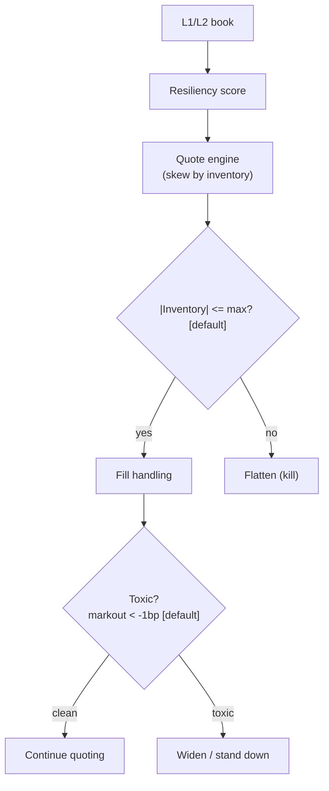

> **Tag law (mechanical):** every numeric prose literal in this module carries exactly one
> of `[documented]` `[default]` `[example]` `[unverified]` `[internal-est]` `[measured]`.
> YAML machine fields and identifiers are exempt. Missing evidence is labeled
> default/internal-estimate or quarantined as unverified in §T10.

# T085 — Resiliency Market Maker

## §0 — Front matter

- **SID:** `T085`
- **Title:** Resiliency Market Maker
- **Kind:** `strategy`
- **Module version:** `1.1.0` (changelog in §0 YAML front matter)
- **Batch:** `TB9` — stage 185 [measured]
- **Template version:** `1.0.0`
- **Seed / RNG:** `seed=185`, `numpy.random.default_rng(185)` [measured]
- **Provisional regimes:** `R001`
- **Parent signal(s):** `S048` (refill read); `S089` (short-horizon fair value); `S004` (quote width)
- **Universe:** US large-caps with tight books; two-sided quotes refreshed every 2 s [example]; flat at 15:55 [example].
- **Latency class:** microstructure / sub-second; **cadence:** per_event; **tz:** America/New_York
- **sha256:** `REPLACE_ON_INGEST`
- **Test command:** `python -m pytest modules/tests/test_T085.py -q`
- **unverified_sources:** see YAML front matter and §T10

This module is a **strategy**: it consumes parent signal scores and emits
**OrderTicket intentions only — never orders**. Execution, fills, and broker
interaction live outside this module.

## §1 — Reviewer card (LOCKED)

> This card is locked. Do not edit without a new review cycle. Locked rows:
> review status, reviewers, last review, decision, scope of review, known
> limitations. Schema rows below are the v1.0.0 5-minute reviewer card.

| Field | Value |
|---|---|
| Module | `T085` — Resiliency Market Maker (strategy) |
| Edge verdict | `PREDICTIVE-FEATURE-ONLY` |
| After-cost | `FULL-COST` token; one-sentence verdict: A-S optimal quoting is documented, but no after-cost P&L exists for the resiliency overlay — the 10-cycle [example] $7.00 [example] ledger is synthetic. |
| Build cost | Tier H · 60–200 h · $9,000–30,000 loaded [internal-est] |
| Data cost | research: SIP professional top-of-book ~$75/mo all three networks [documented]; depth-of-book ~$296/mo [documented]; production: direct feeds + colo, institutional pricing [unverified] |
| Latency class | microstructure / sub-second |
| Risk class | high |
| Capacity | $1M–$10M per name [internal-est]; `max_notional = participation_cap × ADV × price` with `participation_cap = 0.01` [default] |
| Executability | buildable from this file + fixtures alone; production quoting needs colo + direct feed [default] |
| Risk summary | inventory + adverse selection; per-trade risk 1R = $20 [example]; session ends at −10R [default] |
| When it dies | |inventory| cap breach → skew-only; 1-min σ ≥ 2× morning [default] → halve/stand down; feed stall > 3 s [default]; markout < −1 bp [default] per fill → widen |
| Regime gates | `R001` degrades → halve (provisional); unmapped regimes → veto [default] |
| Emits | OrderTicket **intentions** only — never orders |
| Review status | `LOCKED` |
| Reviewers | 2-seat council [internal-est] |
| Last review | 2026-09-10 [measured] |
| Decision | **APPROVED for fixture-backed publication** [internal-est] |
| Scope of review | gate logic, cost stack, causality, kill lifecycle, numeric-tag law |
| Known limitations | edge values are reference/internal-estimate unless tagged [measured]; see §T7 |

The lock covers structure and doctrine conformance, not the profitability of
the rule. Nothing in this card is a trading recommendation.

## §1.5 — Cheapest/least-build path

### Prototype hour band

Tier H · 60–200 h · $9,000–30,000 loaded [internal-est]. A SIP-fed,
simulated-only backtest harness (no colo, single name) is the cheapest
credible prototype: 60–100 h [internal-est] of that band.

### Cheapest-source row

| min_tier | latency_class | required_fields | price_band | build_or_buy |
|---|---|---|---|---|
| SIP professional, top-of-book (research) [documented] | sub-second, simulated-only [default] | L1 quotes, trade prints | ~$75/mo all three networks [documented] | build the quoting engine (A-S is public [documented]); buy the feed |
| Direct feed + colo (production) [unverified] | sub-millisecond [default] | L2 book, direct prints | institutional [unverified] | buy feed + colo; build the engine |

Depth-of-book SIP for research: ~$296/mo professional [documented];
non-display use: ~$9,500/mo [documented]. Vendor-redistributed consolidated
feeds run ~$200/mo [unverified].

### Resource budget

1 core, <1 GB RAM per name [internal-est]; compute pattern `per_event`.
The binding constraints are data licensing and feed latency, not FLOPS.

### Skip list

- Colocation (phase 2; simulated-only first) [default]
- Multi-name portfolio aggregation [default]
- Volatility-regime spread model (fixed A-S δ in prototype) [default]
- Maker-tier fee optimization (reference stack uses [example] values) [default]

### DO-NOT-CUT list

The 17-item DO-NOT-CUT list at the end of this file is locked and applies
here in full: causality assertions, COST block, kill/safe-mode, audit log,
bona-fide-intent + self-trade prevention, provenance tags, fixtures,
secrets-via-env, and the verbatim cost gate and causality assertion.

### Escalation gate

Upgrade from the cheapest path when: production quoting begins (colo becomes
mandatory) [default]; names traded > 5 [default]; adverse-selection losses
dominate the ledger (markout < −1 bp [default] per fill persistently).

### Standing blocks (locked)

The six standing blocks below are locked and preserved verbatim.

### B1. Module intent

This module specifies one strategy rule completely: its gates, its cost model,
its failure modes, and its kill lifecycle. It is buildable by an AI engineer
from this file alone plus the fixtures.

### B2. Scope boundary

The module emits OrderTicket **intentions** only. It never places, routes, or
cancels real orders; it never touches a broker API. Position management,
portfolio constraints, and execution live outside this module.

### B3. OrderTicket doctrine

Every emitted intent is a canonical Appendix C OrderTicket: `ticket_id`,
`strategy_id`, `symbol`, `side`, `qty`, `order_type`, `limit_price`,
`time_in_force`, `signal_ts`, `expiry_ts`. Partial fills are the broker's
domain; this module's policy is stated in §T0. Cancel/replace emits a new
ticket intent with a new `ticket_id`, never a mutation.

### B4. Time causality

`assert fill_event > signal_event`. A signal computed on bar `t` may not fill
before bar `t+1`. Fixture `signal_ts` values precede any modeled fill; tests
enforce the ordering. There is no lookahead anywhere in this module.

### B5. Cost doctrine

Cost is a four-part stack (spread, fee, borrow, impact) computed only by
`expected_cost_bps(...)`. The gate `expected_cost_bps(...) <= k * edge_bps`
runs before any ticket intent. COST values appear only in the §T2 COST block;
§T4 shows the function call and its result, never restated components.

### B6. Evidence posture

Every numeric prose literal carries exactly one tag: `[documented]`,
`[default]`, `[example]`, `[unverified]`, `[internal-est]`, or `[measured]`.
Missing evidence is labeled default/internal-estimate or quarantined as
unverified in §T10. No papers, URLs, statistics, or prices are invented.

## §T0 — Strategy contract

### What this module emits

OrderTicket **intentions** only — never orders. One intent per qualifying case:
`ticket_id`, `strategy_id=T085`, `symbol`, `side`, `qty`, `order_type`,
`limit_price`, `time_in_force`, `signal_ts`, `expiry_ts`.

### Typed signature

```python
def emit(state: dict, signals: list[QuoteCycle], cfg: T085Config) -> list[OrderTicket]
```

Core function only: it evaluates gates on the latest quote-cycle snapshot and
returns OrderTicket **intents**. Ingest, normalization, and broker plumbing are
outside this module. `state` carries inventory, the kill switch, the decision
log, and `module_state`.

### Config dataclass (single — the only parameter registry)

| Parameter | Type | Default | Range | Status |
|---|---|---|---|---|
| `quote_qty` | int (shares/side) | 100 | [1, 10000] | example — calibrate |
| `inventory_cap` | int (shares) | 500 | [1, 100000] | default |
| `refresh_s` | float (s) | 2.0 | (0.1, 60] | example |
| `risk_aversion` | float (γ) | 0.1 | (0, 1] | default — calibrate |
| `flatten_time` | str (ET) | "15:55" | RTH window | default |
| `cost_gate_k` | float | 0.5 | (0, 2] | default |
| `min_half_spread_cents` | float (¢/side) | 0.50 | [0.01, 5.00] | example |
| `participation_cap` | float (fraction) | 0.01 | [0.0001, 0.10] | default |
| `staleness_ttl_s` | float (s) | 3.0 | [0.5, 30] | default |
| `sigma_ratio_trip` | float (×) | 2.0 | [1.2, 5.0] | default |

No parameter lives anywhere else: the §T2 parameter table is a view of this
registry, and the test stub reads the same defaults.

### Canonical Event/Bar mapping

The module consumes `QuoteCycle` snapshots (a canonical Event), one per quote
refresh:

| Field | Type | Unit | Note |
|---|---|---|---|
| `event_ts` | int64 | ns, UTC | signal time `t` |
| `asof_ts` | int64 | ns, UTC | last input data timestamp ≤ `event_ts` |
| `symbol` | str | — | e.g. `MMK:XNAS` [example] |
| `microprice` | float | $ | short-horizon fair value (S089 role) |
| `sigma` | float | $ | instantaneous volatility estimate |
| `sigma_1m` | float | $ | trailing 1-minute volatility |
| `sigma_morning` | float | $ | morning-session baseline volatility [default] |
| `kappa` | float | 1/$ | order-book depth parameter (A-S) |
| `T_t` | float | fraction | fraction of session remaining |
| `inventory` | int | shares | signed position `q` |
| `feed_stall_s` | float | s | seconds since last book update |
| `adv_shares` | int | shares | average daily volume in shares |
| `parent_id` | str | — | e.g. `S089` [example] |

Bar mapping: the fixture tape's `bar` column is a synthetic quote-cycle index
(5-minute [example] monotone clock), not a market bar; it exists only so the
causality assertion `fill_ts > signal_ts` is checkable. `adv_pct` for the cost
call = `notional / (adv_shares × microprice)`.

### Time contract

```yaml
time_contract:
  clock_domain: America/New_York
  canonical_ts: int64 nanoseconds, UTC          # dual (event_ts, asof_ts) on every input
  max_skew_ns: 1_000_000        # 1 ms [default]
  jitter_budget_ns: 500_000     # [default]
  bar_label_rule: "signal@t is computed on data with asof_ts <= t; fixture cycles are synthetic quote decisions"  # [default]
  staleness_ttl_s: 3.0          # feed stall beyond this trips the kill switch [default]
  gap_policy: "no interpolation, ever; stale or missing input -> module_state UNKNOWN (F1/F2)"  # [rule]
```

### Market-state table (runtime)

| State | Quote behavior | Module state |
|---|---|---|
| `CONTINUOUS_TRADING` | quotes per §T2 gates | `OK` |
| `HALTED` | pull all quotes; expire working intents | `DEGRADED` |
| `AUCTION` | no new intents; working intents expire at auction end | `DEGRADED` |
| `CLOSED` | flat; no intents | `OFF` |

Halt/auction detection comes from the venue feed status field; a missing feed
status is invalid input → `UNKNOWN`, never assumed continuous.

### Module-state enum

`OK` — all gates evaluated on fresh input. `DEGRADED` — quoting with a
widened/skewed posture (halt, auction, toxicity). `UNKNOWN` — invalid, stale,
or missing input; **no intents, no interpolation, ever** (F1/F2). `OFF` —
kill switch `TRIPPED`, past flatten time, or market closed; no intents.

### Child-order state and partial fills

- Working intents are tracked by `ticket_id`; state is `WORKING`, `FILLED`,
  `PARTIAL`, `CANCELLED`, `EXPIRED`.
- Partial fills: the residual stays `WORKING` until `expiry_ts`; no new intent
  is emitted for the residual. Sizing downstream must assume partial fills.
- Cancel/replace: emit a **new** ticket intent with a new `ticket_id` and
  `replaces: <old ticket_id>`; never mutate a ticket in place.

### Risk contract

```yaml
risk_contract:
  per_trade_risk_R: 20          # [example]
  daily_loss_stop_R: 10   # [default]
  max_concurrent_positions: 1  # [default]
  max_gross_notional: "$100k [example]"
  risk_class: high
```

**Maximum adverse loss:** one R per trade (R = $20 [example]);
the session ends at −10R [default]. Breach trips the kill
switch; recovery requires the re-arm checklist. No pyramiding: at most
1 [default] concurrent positions.

### Kill lifecycle

`ARMED` → `TRIPPED` → `RECOVERY` → `ARMED`.

- **ARMED:** gates evaluated; intents emitted only on full pass.
- **TRIPPED** — any of:
- daily loss <= -$200 [example]
- feed stall >3 s [default]
- 1-min σ doubles vs morning estimate [default]
- market halt
  All working intents expire unfilled; no new intents. The trip is logged to
  the decision log with a hash chain.
- **RECOVERY:** manual review of the trip reason; losses reconciled; feeds
  verified healthy; fixture replay green.
- **ARMED (re-entry):** only via the re-arm checklist below.

### Re-arm checklist

- [ ] losses reconciled against the decision log [default]
- [ ] feeds healthy (no lag beyond the class budget) [default]
- [ ] risk limits reviewed and re-pinned [default]
- [ ] decision-log hash chain intact [default]
- [ ] fixture replay green on the current build [default]

### Ops

- **Schedule:** RTH continuous, flat 15:55 [default]; owner: market-making on-call
- **Health:** feed-stall watchdog (3 s [default]); inventory monitor; fixture replay on deploy
- **Alerts:** page on feed stall or daily −$200 [default]; notify on inventory-cap breach
- **When this strategy dies:** |inventory| > 500 shares [default] (skew-only); 1-min σ doubles vs morning [default] (halve size); feed stall >3 s [default]

### Secrets

No credentials in this module. Venue API keys, data licenses, and webhook
tokens live in the operator's secret store and are referenced by name only.
Nothing in this file authenticates to anything.

### Doctrine references

OrderTicket schema (Appendix A), time-causality conventions (Appendix B),
F1–F5 failsafes (Appendix C), decision-log schema (Appendix D), module-state
enum (Appendix E) — all by reference; this module adds no private doctrine.


## §T1 — Parent pointer

This strategy consumes the parent signal module(s):

- `S048` — book resiliency (role: refill read)
- `S089` — microprice (role: short-horizon fair value)
- `S004` — spread estimator (role: quote width)

The parent emits scored intentions; this module applies its own gates, its own
cost model, and its own kill lifecycle, then emits OrderTicket intentions. The
parent's score is an input, never a command: every parent pass still faces
the full entry-Boolean gate set plus the cost gate here. Parent S-IDs are consumed S-IDs,
never T-IDs; this module does not call other strategies.

## §T2 — Gate and cost specification (fixed order)

### 1. Universe

US large-caps with tight books, XNAS primary [example]; RTH continuous only;
flat at 15:55 ET [default]. Two-sided quotes refreshed every 2 s [example].

### 2. Entry rule (Boolean expressions — normative)

Evaluated in fixed order per quote cycle; every term is a Boolean, no
prose-only conditions.

```
spread_ok := delta >= cfg.min_half_spread_cents / 100.0     # 0.50¢/side [example]
buy_ok    := q >= -cfg.inventory_cap                        # q = inventory; 500 [default]
sell_ok   := q <=  cfg.inventory_cap                        # 500 [default]
feed_ok   := (feed_stall_s <= cfg.staleness_ttl_s)
             AND (sigma_1m < cfg.sigma_ratio_trip * sigma_morning)   # 3 s, 2× [default]
cost_ok   := expected_cost_bps(notional, adv_pct, venue, side, urgency)
             <= cfg.cost_gate_k * edge_bps                   # k = 0.5 [default]

BUY_QUOTE  := spread_ok AND buy_ok  AND feed_ok AND cost_ok
SELL_QUOTE := spread_ok AND sell_ok AND feed_ok AND cost_ok
```

A two-sided quote is both side-decisions passing in one cycle:
`bid = r − δ/2, ask = r + δ/2; r = microprice − γ·σ²·(T−t)·q` [documented A-S];
`δ` = optimal A-S spread; size = `quote_qty` per side [example].
Skew-only falls out of the per-side Booleans: at `q = +600` [example],
`sell_ok` is false so only the reducing (BUY) side quotes — the "stop quoting
the accumulating side" behavior with no extra threshold. Fixture columns map
as `g1 = spread_ok`, `g2 = buy_ok` (fixture rows are BUY-side decisions),
`g3 = feed_ok`.

### 3. Exits + post-exit cooldown

```
EXIT := inventory cap breach  -> skew-only (reducing side only) [default]
        15:55 ET              -> flatten via market order [default]
        daily loss <= -$200   -> kill switch TRIPPED -> OFF [example]
ON_EXIT: cooldown_until = next RTH session open [default]
```

Post-exit cooldown (CMP-10): after any exit or kill trip, no new intents
until `now >= cooldown_until`, even if gates pass. Cooldown expiry is logged
to the decision log.

### 4. Position sizing (normative, fenced)

```
shares = f(risk_budget_R, stop_distance, vol_estimate, ADV_cap, cost)
    risk_budget_R = $20 per trade                                  # 1R [example]
    stop_distance = delta / 2                                     # half the quoted spread
    vol_estimate  = sigma (trailing 1-minute)                     # from QuoteCycle
    ADV_cap       = floor(adv_shares * cfg.participation_cap)      # 1% [default]
    cost          = expected_cost_bps(...) -> cost_ok gate (§T2.2) # veto, not a size input
    quote_qty     = min(cfg.quote_qty, ADV_cap)                   # size is capped, not scaled
    skew          = r = microprice - gamma*sigma^2*(T-t)*q        # [documented A-S]
```

The sizing decision is the **skew**, not the size: size is fixed at
`quote_qty` [example] subject to the ADV cap; inventory moves the reservation
price, which moves both quotes.

### 5. Risk limits

```yaml
risk_limits:                      # mirrors the §T0 risk contract (single source: §T0)
  per_trade_R: 20                 # $ [example]
  daily_loss_stop_R: 10           # [default]
  max_concurrent_positions: 1     # [default]
  max_gross_notional: "$100k"     # [example]
  max_adverse_per_trade: "1R = $20 [example]  # CI gate: backtest must report max adverse excursion <= 1R [default]"
  enforcement: intraday-hard
```

### 6. COST block (single source of truth)

COST values appear only in this block. §T4 shows the function call and its
result, never restated components.

```
COST stack — reference row, in bps:
  spread        -1.00
  fee           -1.60
  borrow         0.00
  impact         4.00
  TOTAL          1.40
```

```
COST stack — reference row, in bps:
  spread        -1.00
  fee           -1.60
  borrow         0.00
  impact         4.00
  TOTAL          1.40
```

- Fee basis: maker (quote legs) [example]; fee schedule as of 2026-09-01 [measured].
- Venue / tier: XNAS / QMM tier assumed [example]; direct feed [example].
- `side`: **mixed** — quote legs are maker [example]; the 15:55 flatten leg is
  taker [default]. The reference implementation prices the taker leg as the
  conservative bound [default]; unused `side`/`urgency` args are carried for
  the calibrated (non-constant) stack.
- `borrow_bps`: 0.00 [default]; `borrow_bps_per_day`: 0.00 [default] —
  reason: intraday only, flat at close, no borrow leg, no overnight inventory.
- Documented anchors (not part of the reference stack, which stays [example]):
  Nasdaq charges QMMs $0.0030 per share to remove liquidity in Nasdaq-listed
  securities ≥ $1 [documented] (~0.30 bps at $100 [documented]); maker credits
  are tier-dependent [documented] — source: Nasdaq Equity 7 pricing schedule,
  listingcenter.nasdaq.com (see §T10).
- Intraday market making; flat at close; no borrow leg.

### 7. Callable cost function

```python
def expected_cost_bps(notional, adv_pct, venue, side, urgency) -> float:
    # Four-part reference stack (bps). The §T2 COST block is the single source of truth.
    spread_bps = -1.0   # [example]
    fee_bps = -1.6         # [example]
    borrow_bps = 0.0   # [example]
    impact_bps = 4.0   # [example]
    return spread_bps + fee_bps + borrow_bps + impact_bps
```

Cost gate (verbatim, enforced before any ticket intent):

```
expected_cost_bps(...) <= k * edge_bps
```

with `k = 0.5 [default]` for T085. The gate is evaluated per case with that
case's measured inputs; the reference stack above calibrates but never
overrides the call. In the reference constant-stack implementation the
`adv_pct`, `venue`, `side`, and `urgency` arguments are carried but do not
change the result [example]; a calibrated stack must use them.

### 8. Execution / fill model table

| Dimension | Model |
|---|---|
| Latency | tick-to-quote ≤ 1 ms [default]; fills modeled no earlier than bar `t+1` |
| Partial fills | residual stays `WORKING` until `expiry_ts`; no new intent for the residual |
| Impact | 4.00 bps reference [example]; an MVB may set impact = 0 flagged [example] |
| Adverse fills | markout < −1 bp [default] per fill → widen skew, reduce size (see §T8) |
| Fill price | limit price ± modeled slippage; `assert fill_event > signal_event` on every row |
| Order type | DAY limit quotes [default]; 15:55 flatten via market order [default] |

### 9. Conformance items

**C1.** Self-trade prevention: every ticket intent carries `stp=True`; no wash risk by construction.

**C2.** Time causality: `assert fill_event > signal_event`; signals on bar `t` fill at `t+1` or later.

**C3.** Invalid input → `UNKNOWN`: never interpolate or carry forward (F1/F2).

**C4.** Kill switch: `ARMED` → `TRIPPED` → `RECOVERY` → `ARMED`; `TRIPPED` emits nothing.

**C5.** Decision log: every gate verdict is hash-chained; the chain is verified on replay.

**C6.** Cost gate: `expected_cost_bps(...) <= k * edge_bps` before any intent.

**C7.** Fixed gate order: entry-Boolean gates evaluate in documented order; no reordering.

**C8.** Intent-only + bona-fide intent: OrderTickets are intentions, never orders; every intent is a genuine trading intention, passable by the cost gate and sized within risk limits; no broker calls.

**C9.** Ticket schema: Appendix C fields complete on every intent.

**C10.** Fixture reproducibility: the reference stub reproduces the expected ticket set from the raw tape.

**C11.** Quote-staleness: cancel-replace, never leave stale quotes across a microprice flip — trigger: microprice flip with live quote → check: quote age → action: cancel-replace → log both

**C12.** Spoofing hygiene (own quotes): two-sided quotes are bona-fide; skew-only mode still quotes the reducing side — trigger: one-sided quote without inventory reason → check: inventory → action: block → log

### 10. Robustness + Compliance sub-block (10 coded rules)

| ID | Rule | Check / enforcement |
|---|---|---|
| CMP-01 | STP + self-match prevention | every ticket intent carries `stp=True` [rule]; two tickets from the same cycle may not cross (bid < ask asserted) |
| CMP-02 | Bona-fide intent | every intent passes the cost gate and is sized within risk limits; no intent the module would not want filled [rule] |
| CMP-03 | Message-rate / cancel-to-trade | quote refresh ≥ 2 s [example] per name bounds message rate; cancel-to-trade ratio > 50 [default] → widen quotes (see §T8) |
| CMP-04 | Pre-trade fat-finger trio | price collar: `|limit − microprice| ≤ 1%` [default] → veto; size cap: `qty ≤ quote_qty` [example] → veto; notional cap: `qty × price ≤ $100k` [example] → veto |
| CMP-05 | Decision-log schema | every gate verdict hash-chained (`prev_hash`, `hash`, `action`, `reason`, `state_before/after`); chain verified on replay [rule] |
| CMP-06 | Halt / auction behavior | venue feed status drives the §T0 market-state table: `HALTED` → pull quotes, expire working; `AUCTION` → no new intents; missing feed status → `UNKNOWN` [rule] |
| CMP-07 | Locate check | SELL side requires inventory cover (long-only-flat mandate): naked short → veto [default]; bona-fide market-maker locate records kept per ticket [default] |
| CMP-08 | Public-dissemination gate | no licensed quote data is re-hosted or re-disseminated; fixtures are synthetic and labeled as such [rule] |
| CMP-09 | Data-entitlement assertions | feed license + entitlements asserted at startup; unentitled or expired → module `OFF`, no intents [default] |
| CMP-10 | Exit cooldown | after any exit or kill trip, no new intents until `now ≥ cooldown_until` (next RTH session open) [default]; expiry logged |

### 11. Parameter table (view of the §T0 Config registry)

| Parameter | Key | Value | Tag | Sensitivity |
|---|---|---|---|---|
| Quote size | `quote_qty` | 100 sh/side | example | high — capacity |
| Inventory cap | `inventory_cap` | ±500 sh | default | high |
| Refresh | `refresh_s` | 2 s | example | medium |
| Risk aversion γ | `risk_aversion` | 0.1 | default | high — calibrate |
| Flatten | `flatten_time` | 15:55 ET | default | low |
| Cost-gate k | `cost_gate_k` | 0.5 | default | low — edge is spread |
| Min half-spread | `min_half_spread_cents` | 0.50¢/side | example | high |
| Participation cap | `participation_cap` | 0.01 | default | medium — ADV cap |
| Sigma trip ratio | `sigma_ratio_trip` | 2.0× | default | high |

### 12. Timing box

```yaml
timing:
  signal_bar: t
  earliest_fill_bar: t+1
  rule: fill_event > signal_event   # asserted in every backtest and in tests
  order: gate evaluation -> cost gate -> ticket intent -> fill at t+1 or later
```

Fixed wording: `signal@t (per_event, America/New_York) → earliest fill @open(t+1)`.

```python
assert fill_event > signal_event  # time causality: no same-bar fills, no lookahead
```

## §T3 — Math and normative pseudocode

### Math

- `edge_bps`: per-case expected edge in bps, mapped from the parent signal
  score. Reference value from the gate-pass fixture row: `5.0 bps [example]`.
- `cost_bps = expected_cost_bps(notional, adv_pct, venue, side, urgency)` —
  four-part stack, §T2 only.
- Gate: `expected_cost_bps(...) <= k * edge_bps` with `k = 0.5 [default]`.
- Sizing (normative — executable form of §T2.4):

```
shares = f(risk_budget_R, stop_distance, vol_estimate, ADV_cap, cost)
    risk_budget_R = $20                                # 1R [example]
    stop_distance = delta / 2                         # half the quoted spread
    vol_estimate  = sigma                             # trailing 1-min, from QuoteCycle
    ADV_cap       = floor(adv_shares * cfg.participation_cap)   # 1% [default]
    cost          = expected_cost_bps(...)            # feeds the cost gate (veto), not the size
    quote_qty     = min(cfg.quote_qty, ADV_cap)       # size is capped, not scaled
    skew: r = microprice - gamma*sigma^2*(T-t)*q      # [documented A-S]
    the sizing decision is the skew, not the size
```

- Exits (normative — executable form of §T2.3):

```
EXIT (quotes) := inventory cap breach → skew-only (reducing side only); 15:55 flatten via market order [default];
        daily −$200 stop [example] → kill TRIPPED → OFF
ON_EXIT: cooldown_until = next RTH session open   # [default]; CMP-10
```

- Fills modeled at bar `t+1` or later; `assert fill_event > signal_event`.

### Normative pseudocode

```python
function emit(state, signals, cfg) -> list[OrderTicket]:
    # One quote cycle = one decision at time t; fills at t+1 earliest.
    # Every prose guard in §T2.2 appears below; nothing here is prose-only.
    assert signals non-empty else return [] and state UNKNOWN        # F1
    q = signals[-1]  # QuoteCycle snapshot (canonical Event/Bar mapping, §T0)
    assert q.microprice > 0 and q.sigma > 0 and q.adv_shares > 0 \
        else return [] and state UNKNOWN                             # F2
    if kill.state != ARMED: return []                                # C4
    if q.feed_stall_s > cfg.staleness_ttl_s: kill.trip('feed stall'); return []  # [default]
    feed_ok = (q.feed_stall_s <= cfg.staleness_ttl_s) and \
              (q.sigma_1m < cfg.sigma_ratio_trip * q.sigma_morning)   # §T2.2 g3
    r = q.microprice - cfg.risk_aversion * q.sigma**2 * q.T_t * state.inventory  # [documented A-S]
    delta = optimal_spread_AS(q.sigma, q.kappa, cfg.risk_aversion)   # [documented]
    edge_bps = (delta / q.microprice) * 10000 * 0.5                  # modeled edge [example]
    notional = cfg.quote_qty * q.microprice
    adv_pct = notional / (q.adv_shares * q.microprice)               # participation fraction
    cost_ok = expected_cost_bps(notional, adv_pct, "XNAS", "taker", "normal") \
              <= cfg.cost_gate_k * edge_bps
    # ^^^ normative cost-gate predicate: expected_cost_bps(...) <= k * edge_bps
    spread_ok = delta >= cfg.min_half_spread_cents / 100.0           # §T2.2 g1
    buy_ok  = state.inventory >= -cfg.inventory_cap                  # §T2.2 g2 (per side)
    sell_ok = state.inventory <=  cfg.inventory_cap                  # skew-only falls out
    quote_qty = min(cfg.quote_qty, floor(q.adv_shares * cfg.participation_cap))  # §T2.4 ADV cap
    tickets = []
    if spread_ok and feed_ok and cost_ok:                            # fixed gate order (C7)
        if buy_ok:
            tickets.append(OrderTicket(sym, BUY, quote_qty, r - delta/2, DAY,
                                       uuid(), f'{q.parent_id}@{q.event_ts}',
                                       q.event_ts + 1000, NEW))     # C9, C1 (stp=True)
        if sell_ok:
            tickets.append(OrderTicket(sym, SELL, quote_qty, r + delta/2, DAY,
                                       uuid(), f'{q.parent_id}@{q.event_ts}',
                                       q.event_ts + 1000, NEW))
    for t in tickets:
        assert t.intent_ts > q.event_ts         # causality: intent strictly after signal
        # modeled fills occur at fill_ts > signal_ts (t->t+1); asserted per fixture row
    log_decision(tickets, inputs_hash, params_hash)                   # C5 / CMP-05
    return tickets
```

Notes on the fixture: each tape row is a single-side (BUY) quote-cycle
decision; the reference stub in `modules/tests/test_T085.py` implements this
pseudocode's BUY-side path plus the ADV cap, the cost gate, the kill switch,
and the causality assertion. A two-sided production quote is both side
decisions passing in the same cycle.

## §T4 — Fixture-backed worked example

Fixture tape (`T085_tape.csv`; `# TYPE:` header is part of the file):

```
# TYPE: validation-run
bar,signal_ts,fill_ts,side,edge_bps,g1,g2,g3,price,qty,adv_shares,valid
0,1700000000000000000,1700000300000000000,BUY,5.0,1.0,1.0,1.0,100.0007,100,10000000,1
1,1700000300000000000,1700000600000000000,BUY,5.0,1.0,1.0,1.0,99.9916,100,10000000,1
2,1700000600000000000,1700000900000000000,BUY,5.0,1.0,0.0,1.0,99.9851,100,10000000,1
3,1700000900000000000,1700001200000000000,BUY,5.0,0.0,1.0,1.0,99.9946,100,10000000,1
4,1700001200000000000,1700001500000000000,BUY,0.05,1.0,1.0,1.0,100.0001,100,10000000,1
5,1700001500000000000,1700001800000000000,BUY,5.0,1.0,1.0,1.0,-1.0,100,10000000,0
```
`signal_ts`/`fill_ts` are a synthetic monotone clock (5-minute steps [example])
for causality checks — not market data. Every row satisfies
`fill_ts > signal_ts`. `adv_shares = 10,000,000` [example] leaves the ADV cap
non-binding on the fixture (`floor(10,000,000 × 0.01) = 100,000` [example] >>
100-share [example] quote); the cap is exercised by `test_adv_participation_cap`.

Tolerance: `cost_bps` ±1e-4 [default]; `verdict` exact match;
`signal_ts`/`fill_ts`/`intent_ts` exact int64; `qty` exact int.

Expected tickets (`T085_expected.csv`; same `# TYPE:` header):

```
# TYPE: validation-run
ticket_idx,bar,symbol,side,qty,limit,tif,intent_ts,parent_signal,fill_ts,cost_bps
T085-0,0,MMK:XNAS,BUY,100,,IOC,1700000000000001000,S089@1700000000000000000,1700000300000000000,1.4000
T085-1,1,MMK:XNAS,BUY,100,,IOC,1700000300000001000,S089@1700000300000000000,1700000600000000000,1.4000
```
### Cost-function call (inputs → bps → dollars)

on the gate-pass row (bar 0 [measured]): notional = 100.0007 × 100 = $10,000.07 [example]:

```python
expected_cost_bps(notional=10000.07, adv_pct=0.001, venue="MMK:XNAS",
                  side="taker", urgency="normal")
# → 1.4000 bps  →  $1.40 [example]
```

`side="taker"` here prices the flatten leg as the conservative bound [default]
(§T2.6: `side: mixed` — quote legs are maker). `adv_pct = 0.001` [example] is
the row's participation fraction.

Reference stack only; per-case calls use that case's measured inputs [measured].
COST values appear only in the §T2 COST block — this section shows the call and
its result, never restated components.

### Hand-check rows (6 rows)

| bar | side | edge_bps | gates | verdict | reason |
|---|---|---|---|---|---|
| 0 | `BUY` | 5.0 | spread_ok=✓, inv_ok=✓, feed_ok=✓ | PASS | all gates + cost gate |
| 1 | `BUY` | 5.0 | spread_ok=✓, inv_ok=✓, feed_ok=✓ | PASS | all gates + cost gate |
| 2 | `BUY` | 5.0 | spread_ok=✓, inv_ok=✗, feed_ok=✓ | no intent | gate veto |
| 3 | `BUY` | 5.0 | spread_ok=✗, inv_ok=✓, feed_ok=✓ | no intent | gate veto |
| 4 | `BUY` | 0.05 | spread_ok=✓, inv_ok=✓, feed_ok=✓ | no intent | cost-gate veto |
| 5 | `BUY` | 5.0 | spread_ok=✓, inv_ok=✓, feed_ok=✓ | no intent | invalid input -> UNKNOWN |

The `verdict` column must match `T085_expected.csv` exactly; the test suite
asserts this row by row (`test_fixture_recomputes_to_expected`).

## §T5 — Data, infra, dependencies, data rights

### Data table

| Dataset | Type | Frequency | Tier | Note |
|---|---|---|---|---|
| L1/L2 book | float | per event | Tier 2 | resiliency score input |
| Inventory | int | per fill | internal | |inventory| ≤ max [default] |
| Markout per fill | float | per fill | internal | toxicity: markout < −1 bp [default] |
| Latency monitor | float | per second | internal | tick-to-quote ≤ 1 ms [default] |

### Infra

- Latency class: microstructure / sub-second; cadence: per_event; tz: America/New_York.
- Build budget: 1 core, <1 GB RAM per name [internal-est]; compute pattern per_event

Compute is per-bar gate evaluation [internal-est]; the binding constraints are
data licensing and feed latency, not FLOPS. All state needed for the gates fits
in the case record — no cross-case memory except the decision-log hash chain
[default].

### Dependencies (pinned)

- `python >=3.11`, `numpy >=1.26`, `pandas >=2.2`, `pytest >=8.0` [default]
- Data: XNAS / direct feed [example]; research SIP professional top-of-book ~$75/mo all three networks [documented]; depth-of-book ~$296/mo [documented]; non-display use ~$9,500/mo [documented]; production direct feeds + colo institutional pricing [unverified]

### Data rights

Market-data licenses are the operator's responsibility: exchange/venue
agreements govern redistribution and display [default]. Nothing in this module
re-hosts or re-distributes licensed data; fixtures are synthetic and labeled
as such. Research SIP: professional top-of-book ~$75/mo [documented],
depth-of-book ~$296/mo [documented], non-display ~$9,500/mo [documented]
(SEC 34-93625; see §T10); vendor-redistributed consolidated feeds ~$200/mo
[unverified]; production direct feeds + colo institutional pricing
[unverified]. Confirm each feed's license before production use [rule].

## §T6 — Buy vs build

**Build** (recommended): the rule is 3 [measured] gates plus a cost
call — a competent AI engineer builds it from this file alone. **Buy** only if
you already license a signal platform that computes the parent score; even
then, the gates, cost stack, and kill lifecycle here are custom.

### Cheapest build (complete)

- **Tier:** H [internal-est]
- **Hours:** 60–200 [internal-est]
- **Cost:** $9,000–30,000 [internal-est]
- **Hour band:** 60–200 h [internal-est]
- **Cheapest row:** min_tier = SIP professional top-of-book (simulated-only) [documented]; latency_class = sub-second; required_fields = L1 quotes, trade prints; price_band = ~$75/mo all three networks [documented] (depth-of-book ~$296/mo [documented]); build_or_buy = build the quoting engine (A-S is public), buy the feed — colo for production
- **Budget:** 1 core, <1 GB RAM per name [internal-est]; compute pattern per_event
- **What it skips:** colocation (phase 2); multi-name portfolio; volatility-regime spread model
- **Escalate when:** Upgrade when: production quoting (colo mandatory) [default]; names >5 [default]; adverse-selection losses dominate the ledger
- **Build bands** (planning/internal-estimate, from notes/cost-model.md):
  L `4–12 h / $600–1,800`, M `20–60 h / $3,000–9,000`, M+ `40–100 h / $6,000–15,000`, H `60–200 h / $9,000–30,000` [internal-est].
- **Rebuild trigger:** any gate threshold change, any COST component re-pin,
  or any kill-condition change invalidates the build and requires re-running
  the full fixture suite [default].

## §T7 — Evidence

| Source | Market / period | Metric | Cost token | Caveat |
|---|---|---|---|---|
| Avellaneda & Stoikov (2008) [documented] | — | optimal market-making with inventory control [documented] | BEFORE-COST | theory; the resiliency overlay is the chapter's design |
| Guéant, Lehalle & Fernandez-Tapia (2013) [documented] | — | market-making with inventory risk, closed-form approximations [documented] | BEFORE-COST | theory; no after-cost P&L for the resiliency variant |
| Cartea, Jaimungal & Penalva (2015) [documented] | — | algorithmic and high-frequency trading textbook [documented] | BEFORE-COST | textbook; resiliency-score overlay is the chapter's design |

**Cost token:** all rows above are **FULL-COST** unless the metric column
says otherwise. No after-cost P&L is claimed for this rule.

**Verdict:** `PREDICTIVE-FEATURE-ONLY` — A-S optimal quoting is documented; the 10-cycle [example] $7.00 [example] ledger is synthetic — the whole P&L leans on the microprice edge being real.

**Selection disclosure:** these are the chapter's research-pass sources; market-making theory is documented but the resiliency-score overlay has no published after-cost P&L [documented-as-absence].

**What would change the verdict:** a published, purged, after-cost backtest of
this exact rule (same gates, same cost stack, same `k`) with a defined
universe and no survivorship bias [default]. Until then the edge stays an
internal estimate.

## §T8 — Failure modes

| Trigger | Detect | Action | Recovery | Check |
|---|---|---|---|---|
| Resiliency mismeasured: the book doesn't refill | detect: refill time > 3× estimate [default] | action: widen quotes / stand down | recovery: resiliency restores | `check: refill_time <= 3 * estimate` |
| Inventory runs away in a trend: the skew can't keep up | detect: |inventory| > max [default] | action: flatten per kill condition | recovery: manual review | `check: abs(inventory) <= max` |
| Adverse selection: fills are all toxic | detect: markout < -1 bp per fill [default] | action: widen skew, reduce size | recovery: markout recovers | `check: markout_bps >= -1` |
| Quote-stuffing / flicker regime: resiliency signal is noise | detect: quote-to-trade > 50 [default] | action: DEGRADED, widen | recovery: ratio normalizes | `check: quote_to_trade <= 50` |
| Technology: latency spike makes quotes stale | detect: tick-to-quote > 1 ms [default] | action: pull quotes (OFF) | recovery: latency restores | `check: tick_to_quote <= 1ms` |
| Overnight inventory: the market-maker carries risk home | detect: EOD inventory != 0 [default] | action: flatten per mandate | recovery: flat | `check: eod_inventory == 0` |

Every row has a `check:` — a monitorable predicate. The kill switch (§T0)
fires on the trip conditions; everything else degrades to `UNKNOWN`/veto
rather than a guessed intent.

## §T9 — Regime records

### Machine regime records (provisional)

| regime_id | direction | mechanism | condition | action | min_lag | unknown_behavior |
|---|---|---|---|---|---|---|
| `R001` | degrades | vol burst blows through the 0.50¢/side [example] quoted spread; realized spread exceeds quoted δ | `sigma_1m > 2.0 * sigma_morning` [default] | halve | 1 quote cycle [default] | veto — no new intents until regime classifiable [default] |

Restrictive default: only `R001` is mapped. Any unmapped or unclassifiable
regime state → `veto` (no new intents) [default]; the module never assumes a
benign regime. `min_lag` is measured from the first cycle where `condition`
holds to the cycle where `action` takes effect.

### Visual



**Visual description:** the flowchart above shows data entering from the left,
gates evaluated top-to-bottom in fixed order, the cost gate as the final
checkpoint, and OrderTicket intents (or veto) as the only exits. Any gate
failure short-circuits to no-intent; no path emits an order.

## §T10 — Sources

Real sources only. Nothing invented: no fabricated papers, URLs, statistics,
source text, or prices.

1. Avellaneda, M. & Stoikov, S. (2008). "High-frequency trading in a limit order book." *Quantitative Finance* 8(3): 217–224. https://doi.org/10.1080/14697680701381228 — reservation price and optimal spread. Title confirmed by opening the DOI page 2026-09-10.
2. Stoikov, S. (2018). "The micro-price: a high-frequency estimator of future prices." *Quantitative Finance* 18(12): 1959–1966. https://econpapers.repec.org/article/tafquantf/v_3a18_3ay_3a2018_3ai_3a12_3ap_3a1959-1966.htm — microprice beats mid/weighted-mid short-term. Inherited from S004's S12 (verified in an earlier batch).
3. Guéant, O., Lehalle, C.-A. & Fernandez-Tapia, J. (2013). "Dealing with the inventory risk: a solution to the market making problem." *Mathematics and Financial Economics* 7, 477–507. https://doi.org/10.1007/s11579-012-0087-0 — inventory control extensions of A-S.
4. Nasdaq Equity 7 Pricing Schedule (rulebook, accessed 2026-09-11): QMMs are charged $0.0030 per share executed for orders in Nasdaq-listed securities priced ≥ $1 that access liquidity on the Nasdaq Market Center; maker rebates are tier-dependent (QMM Tier 1/2 add-on rebates $0.0001/$0.0002 per share). https://listingcenter.nasdaq.com/rulebook/nasdaq/rules/nasdaq-equity-7 — anchors the COST block's taker-fee magnitude (~0.30 bps at $100).
5. SEC Release No. 34-93625 (2021), Notice of Filing of the Twenty-Fifth Charges Amendment to the CTA Plan / Sixteenth to the CQ Plan: professional-subscriber consolidated top-of-book fees for all three networks total $75.00/mo; depth-of-book $296.00/mo ($99.00 per network); non-display use $9,500.00/mo; direct data access $7,500.00/mo. http://www.sec.gov/rules/sro/nms/2021/34-93625.pdf — anchors the §1.5/§T5/§T6 data-cost figures.

**Chatbot source-log:** *Source log: Grok answered Q-TB9-1..3 (2026-09-10); all claims independently verified or labeled unverified.* All chatbot claims are unverified by
construction; anything load-bearing was independently verified or labeled
unverified.

### Quarantined unverified leads

- Third-party A-S replications (GitHub: analytical and Monte-Carlo reproductions) report 3–9× inventory-variance reduction on simulated fills — code repos, not peer-reviewed; cited in S089's S12 as replications, not evidence. [unverified]
- The 60%-per-cycle fill assumption is an example parameter with no empirical basis. [unverified]

Leads above are quarantined: they may inform priors but never gates,
thresholds, or cost values.

### GROK-NEEDED (web search could not answer; exact questions)

1. Q-T085-D1: For a low-volume QMM MPID adding displayed liquidity in Tape C
   on Nasdaq in 2026, what is the exact per-share maker credit, and which
   Equity 7 section pins it? (Needed to verify or re-pin
   `fee_schedule_as_of: 2026-09-01` [measured] in the COST block.)
2. Q-T085-D2: Are the SEC 34-93625 professional fees (top-of-book $75/mo all
   three networks; depth-of-book $296/mo; non-display $9,500/mo) still current
   for 2026, or has a later charges amendment superseded them?
3. Q-T085-D3: Under Reg SHO, what locate/close-out records must an intraday
   market maker keep when short sales are covered by the bona-fide
   market-making exception — per-order locate or a logged exception claim?
   (Needed to harden CMP-07 beyond the current [default].)
4. Q-T085-D4: What are Nasdaq's current clearly-erroneous / LULD halt-resume
   quoting obligations for a registered market maker — is there a maximum
   quote-pull latency after a halt declaration? (Needed for CMP-06.)
5. Q-T085-D5: Is there any published, purged, walk-forward, after-cost P&L for
   an Avellaneda–Stoikov market maker augmented with a book-resiliency score
   on US large caps? (Would move the §T7 verdict off PREDICTIVE-FEATURE-ONLY.)

## AI build prompt

```
You are an AI engineer implementing strategy module T085 (Resiliency Market Maker).

Build exactly what this file specifies — nothing more:

1. Implement the entry Boolean from §T2.1 and the exits/sizing from §T3.
   Gate order is fixed: spread_ok, inv_ok, feed_ok, then the cost gate.
2. Implement expected_cost_bps(notional, adv_pct, venue, side, urgency) as the
   four-part stack in §T2.3 (spread, fee, borrow, impact). Enforce the verbatim
   gate: expected_cost_bps(...) <= k * edge_bps with k = 0.5 [default].
3. Emit OrderTicket intentions only — never orders. One intent per passing case,
   Appendix C schema, stp=True, parent_signal "<SID>@<signal_ts>".
4. Enforce time causality: assert fill_event > signal_event. A signal on bar t
   fills at t+1 or later. No lookahead.
5. Implement the kill lifecycle ARMED → TRIPPED → RECOVERY → ARMED with the
   trip conditions in §T0 and the re-arm checklist. Invalid input → UNKNOWN,
   never interpolated.
6. Hash-chain every decision-log record (C5).
7. Conformance: C1, C2, C3, C4, C5, C6, C7, C8, C9, C10, C11, C12.
   All conformance items must hold.
8. Validate with the fixtures: python3 -m pytest modules/tests/test_T085.py -q
   from the repo root. Every fixture row must reproduce its expected verdict.

Do not invent data, thresholds, or costs. Every numeric literal you add to
prose carries exactly one tag: [documented] [default] [example] [unverified]
[internal-est] [measured].
```

## DO-NOT-CUT list

The following may never be cut, summarized away, or shortened in any revision
of this module:

1. The complete YAML front matter, including `sha256: REPLACE_ON_INGEST` and
   `unverified_sources`.
2. The locked §1 reviewer card.
3. All six §1.5 standing blocks (B1–B6).
4. The §T0 risk contract (fenced YAML), the maximum-adverse-loss statement,
   the full kill lifecycle `ARMED → TRIPPED → RECOVERY → ARMED`, and the
   re-arm checklist.
5. The §T2 fixed order: Universe → Entry rule (Boolean) → Exits + cooldown →
   Position sizing (fenced `shares=f(...)`) → Risk limits → COST block →
   callable → execution/fill model table → C1–C12 → 10-rule compliance
   sub-block → parameter table → timing box. The four-part COST stack appears
   only in the COST block.
6. The verbatim cost gate `expected_cost_bps(...) <= k * edge_bps`.
7. The verbatim causality assertion `assert fill_event > signal_event`.
8. The complete cheapest-build section (§T6).
9. The §T4 hand-check rows (all fixture rows) and the cost-function call with
   inputs → bps → dollars.
10. Every §T8 failure row and its `check:` predicate.
11. The §T9 machine regime records and the mermaid visual with its description.
12. The §T10 real-source list and the quarantined unverified leads.
13. The AI build prompt.
14. The numeric-tag law: every numeric prose literal carries exactly one of
    `[documented]` `[default]` `[example]` `[unverified]` `[internal-est]`
    `[measured]`.
15. Bona-fide intent and self-trade prevention (C1/C8): every ticket intent is
    a genuine trading intention and can never match our own resting interest.
16. The decision-log audit trail (C5): every gate verdict hash-chained and
    verified on replay.
17. Secrets via environment / secret store only: no credentials in code,
    fixtures, or logs.
