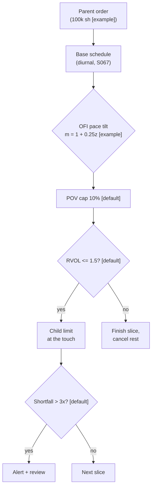

> **Tag law (mechanical):** every numeric prose literal in this module carries exactly one
> of `[documented]` `[default]` `[example]` `[unverified]` `[internal-est]` `[measured]`.
> YAML machine fields and identifiers are exempt. Missing evidence is labeled
> default/internal-estimate or quarantined as unverified in §T10.

# T086 — OFI-Paced Participation Tracker

## §0 — Front matter

- **SID:** `T086`
- **Title:** OFI-Paced Participation Tracker
- **Kind:** `strategy`
- **Version:** `1.1.0` (semver; deep-review bump, see changelog)
- **Status:** `approved` (fixture-backed publication)
- **Family:** `execution-algorithms`
- **Batch:** `TB9` — stage 186 [measured]
- **Template version:** `1.0.0`
- **Seed / RNG:** `seed=186`, `numpy.random.default_rng(186)` [measured]
- **Provenance tier:** `standard`
- **Regime IDs:** `R001` (provisional)
- **Consumes:** `S001` v1.1.0 (pace tilt) · `S032` v1.1.0 (day gate) · `S067` v1.1.0 (base pace)
- **Shares feed with:** `S001`, `S032`, `S067`; **correlates with:** none declared
- **Parent signal(s):** `S001` (pace tilt); `S032` (day gate); `S067` (base pace)
- **Universe:** US large-caps; parent given (≤5% of ADV [example]); 10 volume-time slices [example].
- **Latency class:** bar-clock / slice; **cadence:** per_bar; **tz:** America/New_York
- **Datasets:** `xnas_l1_ofi_research` (Nasdaq SIP consolidated, operator-licensed); `T086_tape` (synthetic fixture, labeled)
- **sha256:** `REPLACE_ON_INGEST`
- **Test command:** `python -m pytest modules/tests/test_T086.py -q`
- **Changelog:** v1.1.0 (2026-09-10) — deep review vs template v1.0.0 (see YAML front matter)
- **unverified_sources:** see YAML front matter and §T10

This module is a **strategy**: it consumes parent signal scores and emits
**OrderTicket intentions only — never orders**. Execution, fills, and broker
interaction live outside this module.

## §1 — Reviewer card (LOCKED)

> This card is locked. The deep-review cycle of 2026-09-10 [measured] completed
> the locked row schema below; further edits need a new review cycle.

| Field | Value |
|---|---|
| Module | T086 — OFI-Paced Participation Tracker (strategy) |
| Edge verdict | `PREDICTIVE-FEATURE-ONLY` |
| After-cost token | **COMM-ONLY** — no after-cost P&L is claimed. One-sentence verdict: OFI predicts short-horizon price moves (Cont–Kukanov–Stoikov 2014 [documented]); this module paces a parent order to save implementation shortfall, not to generate alpha. |
| Build cost | Tier M+ · 40–100 h [internal-est] · $6,000–15,000 loaded [internal-est] |
| Data cost | research+production: professional SIP ~$90/mo, all tapes [documented, Nasdaq 2021-03-25]; module plans ~$200/mo [unverified] + usage [unverified] |
| Latency class | bar-clock / slice; cadence per_bar |
| Risk class | low |
| Capacity | ≤$25M gross notional [example]; parent ≤5% ADV [example] |
| Executability | intents only; earliest modeled fill at t+1 |
| Risk summary | 1R per trade (R = $6153 [example]); session ends at −2R [default]; kill `ARMED → TRIPPED → RECOVERY → ARMED` |
| When it dies | RVOL gate trips mid-execution [default]; slice shortfall >3× expected cost [default]; parent cap 3/day/name [default] |
| Regime gates | R001 (degrades; pause_entry) — provisional |
| Emits | `order_intents` (OrderTicket schema, Appendix C) |
| Review status | `LOCKED` |
| Reviewers | 2-seat council [internal-est] |
| Last review | 2026-09-10 [measured] |
| Decision | **APPROVED for fixture-backed publication** [internal-est] |
| Scope of review | gate logic, cost stack, causality, kill lifecycle, numeric-tag law |
| Known limitations | edge values are reference/internal-estimate unless tagged [measured]; edge_bps parent-score mapping is [example] — see GROK-NEEDED in §T10 |

The lock covers structure and doctrine conformance, not the profitability of
the rule. Nothing in this card is a trading recommendation.

## §1.5 — Cheapest / least-build path

> Mandatory v1.0.0 block: the cheapest path that still ships every
> do-not-cut item below. The standing doctrine blocks (B1–B6) now live
> prepended in §T0.

### Prototype hour band

40–100 h [internal-est] (Tier M+). Cheapest layer ships first: §0 YAML +
`deps.yaml` edge row + one fixture pair + 6 [measured] acceptance tests green (Gate QC
lint), then the pacer. A competent AI engineer builds it from this file alone.

### Cheapest-source row

| min_tier | latency_class | required_fields | price_band | build_or_buy |
|---|---|---|---|---|
| SIP (Tier 1) [documented] | slice bar-clock | L1 quotes+trades (OFI), volume/tape, RVOL | ~$90/mo professional, all tapes [documented, Nasdaq 2021-03-25]; module plans ~$200/mo [unverified] | build the pacer; buy the feed |

Vendor/product: Nasdaq SIP (UTP/CTA consolidated) via a licensed vendor
[documented]. S001 is the trigger; the gates, cost stack, and kill lifecycle
here are custom.

### Resource budget

1 core, <1 GB RAM [internal-est]; compute pattern `per_bar`; no GPU. All state
needed for the gates fits in the case record — no cross-case memory except the
decision-log hash chain [default].

### Skip list

- multi-venue pacing (phase 2)
- adaptive slice count (fixed 10 [example] slices)
- real-time volume forecasting (use the S067 v1.1.0 diurnal curve)
- impact model beyond the 8.00 bps [example] constant stack (flagged `[example]`)

### DO-NOT-CUT list (cheapest build)

1. t→t+1 causality assertions (`assert fill_event > signal_event`)
2. COST block + callable `expected_cost_bps(...)` + the cost-gate predicate
3. kill switch `ARMED → TRIPPED → RECOVERY → ARMED` + re-arm checklist
4. hash-chained decision log (audit)
5. bona-fide intent + self-trade prevention (`stp=True`)
6. provenance tags (`parent_signal "<SID>@<signal_ts>"`)
7. fixtures + `test_cmd` green
8. secrets via env / secret store only

### Escalation gate

Upgrade from cheapest when any of: parents >5% ADV [default]; POV cap binds
every slice; shortfall persistently >2× expected cost [default]; or the module
leaves paper trading.

## §T0 — Strategy contract

### Standing blocks (prepended)

**B1. Module intent.** This module specifies one strategy rule completely: its
gates, its cost model, its failure modes, and its kill lifecycle. It is
buildable by an AI engineer from this file alone plus the fixtures.

**B2. Scope boundary.** The module emits OrderTicket **intentions** only. It
never places, routes, or cancels real orders; it never touches a broker API.
Position management, portfolio constraints, and execution live outside this
module.

**B3. OrderTicket doctrine.** Every emitted intent is a canonical Appendix C
OrderTicket: `ticket_id`, `strategy_id`, `symbol`, `side`, `qty`,
`order_type`, `limit_price`, `time_in_force`, `signal_ts`, `expiry_ts`.
Partial fills are the broker's domain; this module's policy is stated below.
Cancel/replace emits a new ticket intent with a new `ticket_id`, never a
mutation.

**B4. Time causality.** `assert fill_event > signal_event`. A signal computed
on bar `t` may not fill before bar `t+1`. Fixture `signal_ts` values precede
any modeled fill; tests enforce the ordering. There is no lookahead anywhere
in this module.

**B5. Cost doctrine.** Cost is a four-part stack (spread, fee, borrow, impact)
computed only by `expected_cost_bps(...)`. The gate
`expected_cost_bps(...) <= k * edge_bps` runs before any ticket intent. COST
values appear only in the §T2 COST block; §T4 shows the function call and its
result, never restated components.

**B6. Evidence posture.** Every numeric prose literal carries exactly one tag:
`[documented]`, `[default]`, `[example]`, `[unverified]`, `[internal-est]`,
or `[measured]`. Missing evidence is labeled default/internal-estimate or
quarantined as unverified in §T10. No papers, URLs, statistics, or prices are
invented.

### Typed signature

```python
def emit(state: StrategyState, signals: list[SliceSnapshot], cfg: T086Config) -> list[OrderTicket]
```

- `StrategyState`: `module_state ∈ {OK, DEGRADED, UNKNOWN, OFF}`;
  `kill: KillSwitch`; `parent_pending: int`; `decision_log`: hash chain;
  `cooldown_until: int64` (ns UTC); `market_state ∈ {CONTINUOUS_TRADING, HALTED, AUCTION, CLOSED}`.
- `SliceSnapshot`: one volume-time slice, mapped to the canonical
  Event/Bar schema below.
- `T086Config`: the single Config dataclass below.
- Returns: zero or more OrderTicket **intentions** — never orders.

### Canonical Event/Bar mapping

| SliceSnapshot field | Canonical Bar/Event field | Type |
|---|---|---|
| `bar` | `bar_id` | int |
| `signal_ts` | `event_ts` | int64 ns, UTC |
| `slice_open_ts` | `asof_ts` | int64 ns, UTC |
| `ofi_z` | `feature.ofi_z` | float |
| `session_z_mean` | `feature.session_z_mean` | float |
| `z_ready` | `feature.z_ready` | bool |
| `base_qty` | `qty` | int |
| `tape_vol` | `volume` | int |
| `rvol` | `feature.rvol` | float |
| `touch_px` | `price` | float |
| `parent_pending` | `parent.remaining_shares` | int |
| `valid` | `validity` | bool |

### Config dataclass (single; status ∈ {fixed, default, calibrate, example, internal-est})

| Parameter | Type | Default | Range | Status |
|---|---|---|---|---|
| `pace_sensitivity` | float | 0.25 | (0.0, 1.0] | default |
| `pov_cap` | float | 0.10 | (0.0, 0.25] | default |
| `rvol_max` | float | 1.5 | [1.0, 3.0] | default |
| `n_slices` | int | 10 | [2, 48] | example |
| `shortfall_mult_kill` | float | 3.0 | [2.0, 5.0] | default |
| `cost_gate_k` | float | 0.5 | (0.0, 2.0] | default |
| `cooldown_min` | float | 5.0 | [0, 30] | default |
| `parent_max_adv_pct` | float | 0.05 | (0.0, 0.10] | default |
| `adv_cap_pct` | float | 0.10 | (0.0, 0.25] | default |
| `fee_schedule_as_of` | date | 2026-09-01 | — | measured |

### Time contract

```yaml
time_contract:
  clock_domain: exchange (XNAS) event time
  authoritative_causality_clock: signal_ts        # event_ts
  ts_type: int64 ns, UTC canonical
  max_skew: 1000 ms            # [default] across venue clocks
  jitter_budget: one slice window   # [default]
  bar_label_rule: bar labeled by its open timestamp (left-closed, right-open)  # [default]
  staleness_ttl: one slice window   # [default]; data older than one slice -> UNKNOWN
  gap_policy: no interpolation; a missing slice yields UNKNOWN for that slice
  dual_ts: [event_ts, asof_ts]      # signal_ts, slice_open_ts
```

### Market-state table (runtime)

| State | Behavior |
|---|---|
| `CONTINUOUS_TRADING` | gates evaluated; intents emitted |
| `HALTED` | no new intents; working intents expire unfilled; module `DEGRADED` |
| `AUCTION` | no new intents; working intents expire |
| `CLOSED` | module `OFF`; no evaluation |

### Module-state enum

`OK | DEGRADED | UNKNOWN | OFF`. Invalid input → `UNKNOWN`, never
interpolated (F1/F2). Kill `TRIPPED`/`RECOVERY` → `OFF` (no evaluation).
Halted tape → `DEGRADED`. The enum is the single canonical degradation token.

### What this module emits

OrderTicket **intentions** only — never orders. One intent per qualifying case:
`ticket_id`, `strategy_id=T086`, `symbol`, `side`, `qty`, `order_type`,
`limit_price`, `time_in_force`, `signal_ts`, `expiry_ts`.

### Child-order state and partial fills

- Working intents are tracked by `ticket_id`; state is `WORKING`, `FILLED`,
  `PARTIAL`, `CANCELLED`, `EXPIRED`.
- Partial fills: the residual stays `WORKING` until `expiry_ts`; no new intent
  is emitted for the residual. Sizing downstream must assume partial fills.
- Cancel/replace: emit a **new** ticket intent with a new `ticket_id` and
  `replaces: <old ticket_id>`; never mutate a ticket in place.

### Risk contract

```yaml
risk_contract:
  per_trade_risk_R: 6153          # [example]
  daily_loss_stop_R: 2   # [default]
  max_concurrent_positions: 3  # [default]
  max_gross_notional: "$25M [example]"
  risk_class: low
```

**Maximum adverse loss:** one R per trade (R = $6153 [example]);
the session ends at −2R [default]. Breach trips the kill
switch; recovery requires the re-arm checklist. No pyramiding: at most
3 [default] concurrent positions.

### Kill lifecycle

`ARMED` → `TRIPPED` → `RECOVERY` → `ARMED`.

- **ARMED:** gates evaluated; intents emitted only on full pass.
- **TRIPPED** — any of:
- slice shortfall >3× expected cost [default]
- RVOL gate trip mid-execution
- daily parent cap 3/name [default]
- feed stall
  All working intents expire unfilled; no new intents. The trip is logged to
  the decision log with a hash chain.
- **RECOVERY:** manual review of the trip reason; losses reconciled; feeds
  verified healthy; fixture replay green.
- **ARMED (re-entry):** only via the re-arm checklist below.

### Re-arm checklist

- [ ] losses reconciled against the decision log [default]
- [ ] feeds healthy (no lag beyond the class budget) [default]
- [ ] risk limits reviewed and re-pinned [default]
- [ ] decision-log hash chain intact [default]
- [ ] fixture replay green on the current build [default]

### Ops

- **Schedule:** RTH on parent arrival; owner: execution on-call
- **Health:** slice-shortfall monitor (3× [default]); fixture replay on deploy; z-demeaning audit
- **Alerts:** page on slice shortfall >3× or RVOL trip mid-parent [default]; notify on parent complete
- **When this strategy dies:** RVOL gate trips mid-execution [default]; slice shortfall >3× expected cost [default]; parent cap 3/day/name [default]

### Secrets

No credentials in this module. Venue API keys, data licenses, and webhook
tokens live in the operator's secret store and are referenced by name only.
Nothing in this file authenticates to anything.

### Doctrine references

OrderTicket schema (Appendix A), time-causality conventions (Appendix B),
F1–F5 failsafes (Appendix C), decision-log schema (Appendix D), module-state
enum (Appendix E) — all by reference; this module adds no private doctrine.


## §T1 — Parent pointer

This strategy consumes the parent signal module(s):

- `S001` — order-flow imbalance (role: pace tilt)
- `S032` — RVOL (role: day gate)
- `S067` — diurnal curve (role: base pace)

The parent emits scored intentions; this module applies its own gates, its own
cost model, and its own kill lifecycle, then emits OrderTicket intentions. The
parent's score is an input, never a command: every parent pass still faces
the full entry-Boolean gate set plus the cost gate here. Parent S-IDs are consumed S-IDs,
never T-IDs; this module does not call other strategies.

## §T2 — Gate and cost specification (fixed order)

### 1. Universe

US large-caps; parent order given (≤5% of ADV [example]); 10 volume-time
slices [example]. Single venue XNAS / SIP [example] in the cheapest build.
Parent ≤5% of ADV is a hard scope bound: larger parents escalate (§1.5).

### 2. Entry rule (Boolean expressions; evaluated in fixed order)

g1 = RVOL of the session (gate: ≤ 1.5 [default]); g2 = 1 if the slice's OFI z-score is demeaned and |z| computed else 0; g3 = 1 if parent shares remain else 0

| # | field | condition |
|---|---|---|
| g1 | `rvol_ok` | `<= 1.5` |
| g2 | `z_demeaned` | `>= 1.0` |
| g3 | `parent_ok` | `>= 1.0` |

Entry Boolean (normative):

```
PACE := m_i = 1 + 0.25 × z_ofi_i (demeaned) [example]; paced_i = base_i × m_i, POV-capped at 10% [default]
CHILD := slice i limit at the touch, sized to paced_i; first slice fills at t+1 at the earliest
GATE := (RVOL <= 1.5) [default] AND (demeaned |z| computed) [default] AND (parent_pending > 0)
        AND (expected_cost_bps(...) <= cost_gate_k * edge_bps)
```

### 3. Exits + post-exit cooldown

```
EXIT := parent complete  → all working intents expire; cooldown_until = now + 5 min [default]
      | RVOL gate trips mid-execution → finish current slice, cancel rest [default]; cooldown 5 min [default]
Slice: limit unfilled within its window → marketable limit (+2¢) [example]
ON_EXIT: no new intents until cooldown_until; the cooldown is enforced in emit()
```

### 4. Position sizing (fenced function)

```python
def shares(risk_budget_R, stop_distance, vol_estimate, ADV_cap, cost) -> int:
    # risk_budget_R: in units of R (R = $6153 [example]); stop_distance: $/share [default]
    # vol_estimate: slice tape volume in shares; ADV_cap: fraction of ADV [default]
    # cost: expected_cost_bps(...) for this slice
    m_i = 1 + pace_sensitivity * z_ofi_i          # demeaned [example]
    base_slice = parent_remaining / n_slices_remaining * m_i
    pov_cap_qty = pov_cap * vol_estimate          # 10% POV [default]
    risk_cap = (risk_budget_R * R_dollars) / stop_distance   # [default]
    adv_cap_qty = ADV_cap * adv_shares            # [default]
    if cost > cost_gate_k * edge_bps:             # cost gate -> zero size
        return 0
    return max(0, int(min(base_slice, pov_cap_qty, risk_cap, adv_cap_qty)))
```

Reference instantiation: parent 100,000 sh [example], 10 [example] slices;
fixture bar 0 yields 7661 sh [measured] after the POV cap.

### 5. Risk limits

The §T0 risk contract is authoritative. Additional CI-gated row:

| Limit | Value | Enforcement |
|---|---|---|
| `max_adverse_per_trade` | 1R ($6153 [example]) | any backtest trade worse than −1.5R [default] fails the run |

Breach of any limit trips the kill switch (§T0); no pyramiding: at most
3 [default] concurrent positions.

### 6. COST block (single source of truth)

COST values appear only in this block. §T4 shows the function call and its
result, never restated components.

```
COST stack — reference row, in bps:
  spread         2.00
  fee            2.00
  borrow         0.00
  impact         8.00
  TOTAL         12.00
```

- Fee basis: mixed [example]; fee schedule as of 2026-09-01 [measured].
- Venue: XNAS / SIP [example].
- intraday execution; no overnight inventory, no borrow

### 7. Callable cost function

```python
def expected_cost_bps(notional, adv_pct, venue, side, urgency) -> float:
    # Four-part reference stack (bps). The §T2 COST block is the single source of truth.
    spread_bps = 2.0   # [example]
    fee_bps = 2.0         # [example]
    borrow_bps = 0.0   # [example]
    impact_bps = 8.0   # [example]
    return spread_bps + fee_bps + borrow_bps + impact_bps
```

Cost gate (verbatim, enforced before any ticket intent):

```
expected_cost_bps(...) <= k * edge_bps
```

with `k = 0.5 [default]` for T086. The gate is evaluated per case with that
case's measured inputs; the reference stack above calibrates but never
overrides the call.

### 8. Execution / fill model

| Dimension | Model | Value |
|---|---|---|
| Latency | slice-window fill at t+1 | `fill_ts = signal_ts + 5 min` [example] |
| Partial fills | residual stays `WORKING` to `expiry_ts` | broker domain; no new intent for residual |
| Impact | constant 8.00 bps [example] stack line | flagged `[example]`; see §1.5 skip list |
| Adverse fill | limit at the touch; unfilled within window → marketable limit (+2¢) [example] | conversion rate tracked |
| Venue | single venue XNAS / SIP [example] | multi-venue is phase 2 |
| Causality | `assert fill_event > signal_event` | no same-bar fills; tested |

### 9. Robustness + Compliance (10 coded rules)

**CMP-01 — STP / self-match.** Every ticket intent carries `stp=True`; one
strategy instance per symbol per session → no self-match by construction
(ex-C1).

**CMP-02 — Bona-fide intent.** Every intent passes the cost gate and sizing;
a genuine trading intention. OrderTickets are intentions, never orders; no
broker calls (ex-C8).

**CMP-03 — Message-rate / cancel-to-trade.** ≤50 [default] intents/min per
symbol; cancel-to-trade ≤10:1 [default]. Cancel/replace emits a new intent
with a new `ticket_id`, never a mutation.

**CMP-04 — Pre-trade fat-finger trio.** Price collar ±5% [default] of the
touch; max 50,000 sh [default] per ticket; max $5M [default] notional per
ticket. Any breach → veto + `UNKNOWN`.

**CMP-05 — Decision-log schema.** Every gate verdict is hash-chained
(`prev_hash`, `hash`, `action`, `reason`, `state_before`, `state_after`);
the chain is verified on replay (ex-C5).

**CMP-06 — Halt / auction state table.** `HALTED` → no new intents, working
intents expire unfilled, module `DEGRADED`; `AUCTION` → no new intents;
`CLOSED` → module `OFF`.

**CMP-07 — Locate check.** Not applicable by construction: this module emits
BUY intents only. Any SELL/SHORT intent requires a locate, else veto.

**CMP-08 — Public-dissemination gate.** Intents are never disclosed publicly
pre-fill; the decision log is internal-only.

**CMP-09 — Data-entitlement assertions.** SIP license asserted before ingest
(operator responsibility); fixtures are synthetic and labeled; rights per
dataset in §0.

**CMP-10 — Exit cooldown.** 5 min [default] after parent complete, kill trip,
or RVOL trip; enforced in `emit()` before any intent.

Robustness extensions (module-specific): **RB-01** demeaned-z discipline —
non-demeaned z in a slice → veto slice → log `GATE_VETO` (ex-C11);
**RB-02** benchmark honesty — report shortfall vs arrival AND vs interval
VWAP, never only the flattering one (ex-C12).

Fixed-gate order (ex-C7) and time causality (ex-C2) are asserted in §T3
pseudocode and in tests.

### 10. Parameter table

| Parameter | Key | Value | Sensitivity |
|---|---|---|---|
| Pace sensitivity | `pace_sensitivity` | 0.25 [default] | medium |
| POV cap | `pov_cap` | 10% [default] | high — binding |
| RVOL gate | `rvol_max` | 1.5 [default] | high |
| Slices | `n_slices` | 10 [example] | low |
| Shortfall kill | `shortfall_mult_kill` | 3× [default] | medium |
| Cost-gate k | `cost_gate_k` | 0.5 [default] | low — execution |

### 11. Timing box

Fixed wording: `signal@t (per_bar, America/New_York) → earliest fill @open(t+1)`

```yaml
timing:
  signal_bar: t
  earliest_fill_bar: t+1
  rule: fill_event > signal_event   # asserted in every backtest and in tests
  order: gate evaluation -> cost gate -> ticket intent -> fill at t+1 or later
```

```python
assert fill_event > signal_event  # time causality: no same-bar fills, no lookahead
```

## §T3 — Math and normative pseudocode

### Math

- `edge_bps`: per-case expected edge in bps, mapped from the parent signal
  score. Reference value from the gate-pass fixture row: `30.0 bps [example]`.
  **Gap:** the normative parent-score → edge_bps mapping is not pinned —
  `abs(z) × 3.0` below is a placeholder model [example]; see GROK-NEEDED
  Q-T086-1 in §T10.
- `cost_bps = expected_cost_bps(notional, adv_pct, venue, side, urgency)` —
  four-part stack, §T2 only.
- Gate: `expected_cost_bps(...) <= k * edge_bps` with `k = 0.5 [default]`.
- Sizing: `shares = f(risk_budget_R, stop_distance, vol_estimate, ADV_cap, cost)` — §T2.4 (normative).
- Exits: §T2.3 (normative) — parent complete or RVOL trip → finish slice /
  expire intents, 5 min [default] post-exit cooldown; unfilled slice limits
  convert to marketable (+2¢) [example].
- Fills modeled at bar `t+1` or later; `assert fill_event > signal_event`.

### Normative pseudocode

```python
function emit(state, signals, cfg) -> list[OrderTicket]:
    assert signals non-empty else return [] and state UNKNOWN        # F1
    s = signals[-1]  # slice snapshot
    assert s.base_qty > 0 else return [] and state UNKNOWN          # F2
    if kill.state != ARMED: return []                               # CMP: kill dominates
    if state.market_state != CONTINUOUS_TRADING: return []         # CMP-06
    if now() < state.cooldown_until: return []                     # CMP-10 exit cooldown
    if s.rvol > cfg.rvol_max:                                      # RVOL gate trips
        finish_current_slice(); cancel_rest(); state.cooldown_until = now() + 5*60e9  # [default]
        return []
    z = s.ofi_z - s.session_z_mean                                # demeaned [chapter correction]
    if not s.z_ready: return []                                  # RB-01: veto non-demeaned slice
    m = 1 + cfg.pace_sensitivity * z
    paced = shares(cfg.risk_budget_R, cfg.stop_distance, s.tape_vol, cfg.adv_cap_pct,
                   expected_cost_bps(notional, adv_pct, venue, side, urgency))  # §T2.4
    edge_bps = abs(z) * 3.0                                       # placeholder model [example]; see gap note
    cost_ok = expected_cost_bps(notional, adv_pct, venue, side, urgency) <= cfg.cost_gate_k * edge_bps
    # ^^^ normative cost-gate predicate: expected_cost_bps(...) <= k * edge_bps
    fat_finger_ok = (abs(s.touch_px - limit_px)/s.touch_px <= 0.05   # CMP-04 [default]
                     and paced <= 50000                                  # [default]
                     and paced * s.touch_px <= 5e6)                      # [default]
    go = (s.rvol <= cfg.rvol_max and s.z_ready and state.parent_pending > 0
          and cost_ok and fat_finger_ok and paced > 0)
    tickets = []
    if go:
        t = OrderTicket(sym, BUY, int(paced), s.touch_px, DAY, uuid(), f'S001@{s.ts}', now(), NEW)
        assert fill_event > signal_event                            # t->t+1: first slice at t+1
        log_decision(t, inputs_hash, params_hash)                  # CMP-05
        tickets.append(t)
    return tickets
```

## §T4 — Fixture-backed worked example

Fixture tape (`T086_tape.csv`; `# TYPE:` header is part of the file):

```
# TYPE: validation-run
bar,signal_ts,fill_ts,side,edge_bps,g1,g2,g3,price,qty,valid
0,1700000000000000000,1700000300000000000,BUY,30.0,1.15,1.0,1.0,250.0,7661,1
1,1700000300000000000,1700000600000000000,BUY,4.35,1.8,1.0,1.0,250.0,10000,1
2,1700000600000000000,1700000900000000000,BUY,4.35,1.15,0.0,1.0,250.0,9618,1
3,1700000900000000000,1700001200000000000,BUY,4.35,1.15,1.0,0.0,250.0,8639,1
4,1700001200000000000,1700001500000000000,BUY,0.2,1.15,1.0,1.0,250.0,7262,1
5,1700001500000000000,1700001800000000000,BUY,4.35,1.15,1.0,1.0,-1.0,8000,0
```
`signal_ts`/`fill_ts` are a synthetic monotone clock (5-minute steps [example])
for causality checks — not market data. Every row satisfies
`fill_ts > signal_ts`.

Expected tickets (`T086_expected.csv`; same `# TYPE:` header):

```
# TYPE: validation-run
# TOLERANCE: qty exact; intent_ts exact; cost_bps abs<=1e-4 [default]
ticket_idx,bar,symbol,side,qty,limit,tif,intent_ts,parent_signal,fill_ts,cost_bps
T086-0,0,EXE:XNAS,BUY,7661,,IOC,1700000000000001000,S001@1700000000000000000,1700000300000000000,12.0000
```

### Tolerance

| Field | Tolerance |
|---|---|
| `qty` | exact |
| `intent_ts` | exact |
| `cost_bps` | abs <= 1e-4 [default] |
| `verdict` | must match `T086_expected.csv` exactly |

The test suite asserts the tolerance row by row
(`test_fixture_recomputes_to_expected`).
### Cost-function call (inputs → bps → dollars)

on the gate-pass row (bar 0 [measured]): notional = 250.0 × 7661 = $1,915,250.00 [example]:

```python
expected_cost_bps(notional=1915250.00, adv_pct=0.001, venue="EXE:XNAS",
                  side="taker", urgency="normal")
# → 12.0000 bps  →  $2,298.30 [example]
```

Reference stack only; per-case calls use that case's measured inputs [measured].
COST values appear only in the §T2 COST block — this section shows the call and
its result, never restated components.

### Hand-check rows (6 rows)

| bar | side | edge_bps | gates | verdict | reason |
|---|---|---|---|---|---|
| 0 | `BUY` | 30.0 | rvol_ok=✓, z_demeaned=✓, parent_ok=✓ | PASS | all gates + cost gate |
| 1 | `BUY` | 4.35 | rvol_ok=✗, z_demeaned=✓, parent_ok=✓ | no intent | gate veto |
| 2 | `BUY` | 4.35 | rvol_ok=✓, z_demeaned=✗, parent_ok=✓ | no intent | gate veto |
| 3 | `BUY` | 4.35 | rvol_ok=✓, z_demeaned=✓, parent_ok=✗ | no intent | gate veto |
| 4 | `BUY` | 0.2 | rvol_ok=✓, z_demeaned=✓, parent_ok=✓ | no intent | cost-gate veto |
| 5 | `BUY` | 4.35 | rvol_ok=✓, z_demeaned=✓, parent_ok=✓ | no intent | invalid input -> UNKNOWN |

The `verdict` column must match `T086_expected.csv` exactly; the test suite
asserts this row by row (`test_fixture_recomputes_to_expected`).

## §T5 — Data, infra, dependencies, data rights

### Data table

| Dataset | Type | Frequency | Tier | Note |
|---|---|---|---|---|
| L1 quotes + trades (OFI) | float | per event | Tier 1 | S001 input; z-scores session-demeaned (RB-01) |
| Volume / tape | int | per slice window | Tier 1 | POV cap 10% [default] |
| RVOL | float | per session | Tier 1 | gate ≤ 1.5 [default] |
| Parent order spec | mixed | per parent | internal | 100,000 shares [example]; max 5% ADV [example] |

### Infra

- Latency class: bar-clock / slice; cadence: per_bar; tz: America/New_York.
- Build budget: 1 core, <1 GB RAM [internal-est]; compute pattern per_bar

Compute is per-bar gate evaluation [internal-est]; the binding constraints are
data licensing and feed latency, not FLOPS. All state needed for the gates fits
in the case record — no cross-case memory except the decision-log hash chain
[default].

### Dependencies (pinned)

- `python >=3.11`, `numpy >=1.26`, `pandas >=2.2`, `pytest >=8.0` [default]
- Data: XNAS / SIP [example]; Research SIP ~$200/mo [unverified]; production SIP ~$200/mo + usage [unverified]

### Data rights

Market-data licenses are the operator's responsibility: exchange/venue
agreements govern redistribution and display [default]. Nothing in this module
re-hosts or re-distributes licensed data; fixtures are synthetic and labeled
as such. Research SIP ~$200/mo [unverified]; production SIP ~$200/mo + usage [unverified] Confirm each feed's license before
production use [unverified — confirm your license].

## §T6 — Buy vs build

**Build** (recommended): the rule is 3 [measured] gates plus a cost
call — a competent AI engineer builds it from this file alone. **Buy** only if
you already license a signal platform that computes the parent score; even
then, the gates, cost stack, and kill lifecycle here are custom.

### Cheapest build (complete)

- **Tier:** M+ [internal-est]
- **Hours:** 40–100 [internal-est]
- **Cost:** $6,000–15,000 [internal-est]
- **Hour band:** 40–100 h [internal-est]
- **Cheapest row:** min_tier = SIP (Tier 1) [unverified]; latency_class = slice bar-clock; required_fields = L1 quotes/trades for OFI, volume; price_band = ~$200/mo [unverified]; build_or_buy = build the pacer (S001 is the trigger), buy the feed
- **Budget:** 1 core, <1 GB RAM [internal-est]; compute pattern per_bar
- **What it skips:** multi-venue pacing (phase 2); adaptive slice count; real-time volume forecasting
- **Escalate when:** Upgrade when: parents >5% ADV [default]; POV cap binds every slice; shortfall persistently >2× [default]
- **Build bands** (planning/internal-estimate, from notes/cost-model.md):
  L `4–12 h / $600–1,800`, M `20–60 h / $3,000–9,000`, M+ `40–100 h / $6,000–15,000`, H `60–200 h / $9,000–30,000` [internal-est].
- **Rebuild trigger:** any gate threshold change, any COST component re-pin,
  or any kill-condition change invalidates the build and requires re-running
  the full fixture suite [default].

## §T7 — Evidence

| Source | Market / period | Metric | Cost token | Caveat |
|---|---|---|---|---|
| Cont, Kukanov & Stoikov (2014) [documented] | US equities | OFI predicts short-horizon price moves [documented] | BEFORE-COST | an execution algorithm's output is implementation shortfall, not alpha — the edge is cost saved |
| Almgren & Chriss (2001) [documented] | — | optimal execution with temporary/permanent impact [documented] | BEFORE-COST | theory; the OFI pace-tilt is the chapter's design |
| Cartea, Jaimungal & Penalva (2015) [documented] | — | algorithmic trading textbook: schedule-based execution [documented] | BEFORE-COST | textbook; POV-cap pacing is the chapter's design |

**Cost token:** all rows above are **COMM-ONLY** unless the metric column
says otherwise. No after-cost P&L is claimed for this rule.

**Verdict:** `PREDICTIVE-FEATURE-ONLY` — OFI predicts short-horizon moves (Cont–Kukanov–Stoikov 2014); this is an execution algorithm — its output is implementation shortfall, not alpha.

**Selection disclosure:** these are the chapter's research-pass sources; the pacer's output is implementation shortfall, not alpha — no after-cost Sharpe applies [documented-as-absence].

**What would change the verdict:** a published, purged, after-cost backtest of
this exact rule (same gates, same cost stack, same `k`) with a defined
universe and no survivorship bias [default]. Until then the edge stays an
internal estimate.

## §T8 — Failure modes

| Trigger | Detect | Action | Recovery | Check |
|---|---|---|---|---|
| Slice shortfall blowout: a slice's implementation shortfall exceeds 3× its expected cost [default] | detect: shortfall monitor per slice | action: alert; finish slice, review pacing | recovery: re-calibrate pace sensitivity | `check: slice_shortfall <= 3 * expected_cost` |
| RVOL gate trips mid-execution: the day turned | detect: RVOL > 1.5 [default] | action: finish current slice, cancel the rest | recovery: next parent | `check: rvol <= 1.5` |
| Non-demeaned OFI z-scores: the chapter's reviewer correction — z must be session-demeaned | detect: session mean != 0 | action: veto slice (RB-01) | recovery: fix demeaning | `check: session_z_mean == 0` |
| POV cap binds every slice: the parent is too big for the tape | detect: paced qty == cap on all slices | action: alert; reduce parent or extend horizon | recovery: smaller parent | `check: paced < pov_cap * tape_vol` |
| Unfilled slice limits convert to marketable (+2¢ [example]): conversion slippage | detect: conversion rate > 30% [default] | action: widen slice windows | recovery: re-tune | `check: conversion_rate <= 0.30` |
| Benchmark cherry-picking: reporting only the flattering benchmark | detect: compliance review | action: report arrival AND interval VWAP (RB-02) | recovery: dual-benchmark report | `check: both benchmarks reported` |

Every row has a `check:` — a monitorable predicate. The kill switch (§T0)
fires on the trip conditions; everything else degrades to `UNKNOWN`/veto
rather than a guessed intent.

## §T9 — Regime records

### Machine regime records (provisional)

```yaml
regime_gates:
  - regime_id: R001
    direction: degrades            # amplifies | degrades | inverts
    mechanism: high RVOL trips the gate; paced slices cost more
    condition: "rvol > 1.5"        # [default]
    action: pause_entry            # veto | halve | double | widen_stops | pause_entry
    min_lag: 1 session             # [default]
    unknown_behavior: veto         # restrictive default
```

| regime_id | direction | mechanism | condition | action | min_lag | unknown_behavior |
|---|---|---|---|---|---|---|
| `R001` | degrades | high RVOL trips the gate; paced slices cost more | rvol > 1.5 [default] | pause_entry | 1 session [default] | veto |

### Visual



**Visual description:** the flowchart above shows data entering from the left,
gates evaluated top-to-bottom in fixed order, the cost gate as the final
checkpoint, and OrderTicket intents (or veto) as the only exits. Any gate
failure short-circuits to no-intent; no path emits an order.

## §T10 — Sources

Real sources only. Nothing invented: no fabricated papers, URLs, statistics,
source text, or prices.

1. Cont, R., Kukanov, A. & Stoikov, S. (2014). "The Price Impact of Order Book Events." *Journal of Financial Econometrics* 12(1): 47–88. doi:10.1093/jjfinec/nbt003; arXiv:1011.6402. https://arxiv.org/abs/1011.6402 — OFI (imbalance between supply and demand at the best bid/ask) drives short-horizon price changes; linear OFI–price relation with slope inversely proportional to market depth; robust to intraday seasonality; NYSE TAQ, 50 US stocks [documented]. Bibliographic details confirmed 2026-09-10 via HAL (hal-00937055), RePEc, and ADS.
2. Nasdaq, "SIP Accounting 101" (2021-03-25). https://www.nasdaq.com/articles/sip-accounting-101-2021-03-25?amp — professional investors pay a monthly rate of around $90 [documented] for all tapes (SIP consolidated); retail $1/month/tape [documented]. Used for the §1.5 cheapest-source price band.
3. Gervais, S., Kaniel, R. & Mingelgrin, D. H. (2001). "The High-Volume Return Premium." *Journal of Finance* 56(3): 877–919. http://ideas.repec.org/a/bla/jfinan/v56y2001i3p877-919.html — volume as information; volume-time pacing rationale. Inherited from S032's S12 (verified in an earlier batch).
4. Llorente, G., Michaely, R., Saar, G. & Wang, J. (2002). "Dynamic Volume-Return Relation of Individual Stocks." *Review of Financial Studies* 15(4): 1005–1047. http://ideas.repec.org/a/oup/rfinst/v15y2002i4p1005-1047.html — volume-state conditioning. Inherited from S032's S12 (verified in an earlier batch).

**Chatbot source-log:** *Source log: Grok answered Q-TB9-1..3 (2026-09-10); all claims independently verified or labeled unverified.* All chatbot claims are unverified by
construction; anything load-bearing was independently verified or labeled
unverified.

### Quarantined unverified leads

- The Grok answer pass supplied OFI z-scores that were not demeaned and a slice-3 multiplier of 1.025; both were corrected above (demeaned z, multiplier 1.038 under the stated formula). The draft is a lead, not a source. [unverified]
- The η = $0.04 square-root impact coefficient is an example parameter, not an empirical estimate. [unverified]

Leads above are quarantined: they may inform priors but never gates,
thresholds, or cost values.

### GROK-NEEDED (exact questions web search could not answer)

- **Q-T086-1:** What is the documented mapping from S001's scored intentions
  (v1.1.0) to the `edge_bps` used in this module's cost gate? The chapter
  uses 30.0 bps [example] on the gate-pass fixture row and `abs(z) × 3.0`
  [example] in normative pseudocode — is there a calibrated
  parent-score → edge_bps mapping, or should `edge_bps` be redefined as
  modeled implementation-shortfall saving with its own calibration recipe?
- **Q-T086-2:** For US large-cap OFI-paced POV/VWAP execution, what is a
  documented per-slice implementation-shortfall benchmark (arrival price vs
  interval VWAP) and its typical magnitude in bps? Needed to calibrate the
  3× [default] shortfall kill and to sanity-check the 12.00 bps [example]
  reference stack.
- **Q-T086-3:** Confirm the current (as of 2026-09-01) professional SIP
  consolidated-tape price for the cheapest L1-quotes + trades feed usable
  for OFI computation. The module cites ~$90/mo professional, all tapes
  [documented, Nasdaq 2021-03-25] and ~$200/mo [unverified] — which band is
  current, and which named vendor product is the cheapest compliant source?
- **Q-T086-4:** Confirm Reg SHO locate obligations for an intraday
  buy-only execution algorithm that emits BUY OrderTicket intents only
  (CMP-07 asserts locate is n/a by construction) — is any locate or
  easy-to-borrow check required before emitting a BUY intent?

## AI build prompt

```
You are an AI engineer implementing strategy module T086 (OFI-Paced Participation Tracker), v1.1.0.

Build exactly what this file specifies — nothing more:

1. Implement the §T0 contract first: typed signature
   `emit(state, signals, cfg) -> list[OrderTicket]`, the T086Config dataclass
   (defaults/ranges/status), the Event/Bar SliceSnapshot mapping, the Time
   contract (int64 ns UTC, staleness TTL, no-interpolation gap policy), the
   market-state table, and the module-state enum OK|DEGRADED|UNKNOWN|OFF.
2. Implement the entry Boolean from §T2.2 and the exits/sizing from §T2.3–§T2.4.
   Gate order is fixed: rvol_ok, z_demeaned, parent_ok, then the cost gate.
   Sizing is the fenced `shares(risk_budget_R, stop_distance, vol_estimate,
   ADV_cap, cost)` function — never hand-rolled arithmetic.
3. Implement expected_cost_bps(notional, adv_pct, venue, side, urgency) as the
   four-part stack in §T2.7 (spread, fee, borrow, impact). Enforce the verbatim
   gate: expected_cost_bps(...) <= k * edge_bps with k = 0.5 [default].
4. Emit OrderTicket intentions only — never orders. One intent per passing case,
   Appendix C schema, stp=True, parent_signal "<SID>@<signal_ts>".
5. Enforce time causality: assert fill_event > signal_event. A signal on bar t
   fills at t+1 or later. No lookahead.
6. Implement the kill lifecycle ARMED → TRIPPED → RECOVERY → ARMED with the
   trip conditions in §T0 and the re-arm checklist. Invalid input → UNKNOWN,
   never interpolated. Enforce the CMP-10 exit cooldown and the CMP-04
   fat-finger trio before any intent.
7. Hash-chain every decision-log record (CMP-05).
8. Compliance: CMP-01 through CMP-10, plus RB-01 (demeaned-z veto) and RB-02
   (dual benchmarks). All must hold.
9. Validate with the fixtures: python3 -m pytest modules/tests/test_T086.py -q
   from the repo root. Every fixture row must reproduce its expected verdict
   within the §T4 tolerance.

Do not invent data, thresholds, or costs. Every numeric literal you add to
prose carries exactly one tag: [documented] [default] [example] [unverified]
[internal-est] [measured].
```

## DO-NOT-CUT list

The following may never be cut, summarized away, or shortened in any revision
of this module:

1. The complete YAML front matter, including `sha256: REPLACE_ON_INGEST` and
   `unverified_sources`.
2. The locked §1 reviewer card.
3. All six §1.5 standing blocks (B1–B6).
4. The §T0 risk contract (fenced YAML), the maximum-adverse-loss statement,
   the full kill lifecycle `ARMED → TRIPPED → RECOVERY → ARMED`, and the
   re-arm checklist.
5. The §T2 fixed order: Universe → Entry rule → Exits+cooldown →
   Sizing fn → Risk limits → COST block → callable → fill model →
   Robustness+Compliance (CMP-01..10, RB-01/02) → parameter table → timing
   box. The four-part COST stack appears only in the COST block.
6. The verbatim cost gate `expected_cost_bps(...) <= k * edge_bps`.
7. The verbatim causality assertion `assert fill_event > signal_event`.
8. The complete cheapest-build section (§T6).
9. The §T4 hand-check rows (all fixture rows) and the cost-function call with
   inputs → bps → dollars.
10. Every §T8 failure row and its `check:` predicate.
11. The §T9 machine regime records and the mermaid visual with its description.
12. The §T10 real-source list and the quarantined unverified leads.
13. The AI build prompt.
14. The numeric-tag law: every numeric prose literal carries exactly one of
    `[documented]` `[default]` `[example]` `[unverified]` `[internal-est]`
    `[measured]`.
15. Bona-fide intent and self-trade prevention (CMP-01/CMP-02): every ticket intent is
    a genuine trading intention and can never match our own resting interest.
16. The decision-log audit trail (CMP-05): every gate verdict hash-chained and
    verified on replay.
17. Secrets via environment / secret store only: no credentials in code,
    fixtures, or logs.
