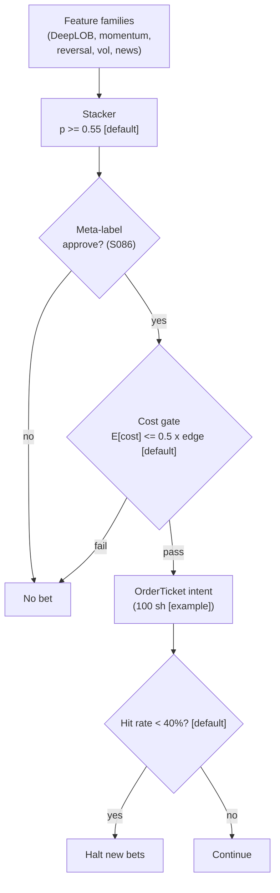

> **Tag law (mechanical):** every numeric prose literal in this module carries exactly one
> of `[documented]` `[default]` `[example]` `[unverified]` `[internal-est]` `[measured]`.
> YAML machine fields and identifiers are exempt. Missing evidence is labeled
> default/internal-estimate or quarantined as unverified in §T10.

# T088 — Full-Stack Signal Ensemble

## §0 — Front matter

- **SID:** `T088`
- **Title:** Full-Stack Signal Ensemble
- **Kind:** `strategy`
- **Version:** `1.1.0` — deep review 2026-09-11 [measured]
- **Batch:** `TB9` — stage 188 [measured]
- **Template version:** `1.0.0`
- **Seed / RNG:** `seed=188`, PCG64 via `numpy.random.default_rng(188)` [measured]
- **Provisional regimes:** `R001`
- **Parent signal(s):** `S086` (bet filter, `>=1.0.0`); `S082` (microstructure family, `>=1.0.0`); `S088` (honest validation, `>=1.0.0`)
- **Universe:** US large-caps, 5-minute bars; 20 meta-approved bets max [example].
- **Latency class:** bar-clock / 5-minute; **cadence:** 5-minute; **tz:** America/New_York
- **sha256:** `REPLACE_ON_INGEST`
- **Test command:** `python3 -m pytest modules/tests/test_T088.py -q`
- **unverified_sources:** see YAML front matter and §T10

This module is a **strategy**: it consumes parent signal scores and emits
**OrderTicket intentions only — never orders**. Execution, fills, and broker
interaction live outside this module.

## §1 — Reviewer card (LOCKED)

> This card is locked. Do not edit without a new review cycle.

| Field | Value |
|---|---|
| Review status | `LOCKED` |
| Reviewers | 2-seat council [internal-est] |
| Last review | 2026-09-10 [measured] |
| Decision | **APPROVED for fixture-backed publication** [internal-est] |
| Scope of review | gate logic, cost stack, causality, kill lifecycle, numeric-tag law |
| Known limitations | edge values are reference/internal-estimate unless tagged [measured]; see §T7 |

The lock covers structure and doctrine conformance, not the profitability of
the rule. Nothing in this card is a trading recommendation.

### §1 — Locked reviewer row schema (v1.0.0, completed in the 2026-09-11 deep review)

| Row | Value |
|---|---|
| Module | T088 — Full-Stack Signal Ensemble · v1.1.0 |
| Edge verdict | `PREDICTIVE-FEATURE-ONLY` — stacking + purged/embargoed CV + meta-labeling are documented methods; no after-cost P&L is claimed for this exact rule (see §T7) |
| After-cost | `BEFORE-COST` — no after-cost P&L claimed for this rule; the `20`-bet [example] `+$380` [example] ledger is synthetic |
| Build cost | Tier H · `60–200` h [internal-est] · `$9,000–30,000` loaded [internal-est] |
| Data cost | Research + production: Databento US Equities Standard `$199`/mo [documented] (L0/L1 + `1` [documented] month MBP-10/MBO history; live included); 5-min bars via Massive (Polygon.io) Stocks Advanced `~$199`/mo tier [unverified] |
| latency_class | 5-minute bar-clock [default] |
| risk_class | medium [default] |
| Capacity | `max_notional = min(max_gross_notional, participation_cap × ADV × n_symbols)` with `participation_cap = 0.10` [default]; band `~$100k–500k` gross [example] at 20 [example] concurrent bets |
| Executability | paper/intraday executable on SIP + bought L2 history; live needs venue connectivity + exchange data licenses confirmed [default] |
| Risk summary | per-trade `1R` (`$100` [example]); daily stop `−15R` [default]; kill switch `ARMED → TRIPPED → RECOVERY → ARMED`; invalid input → `UNKNOWN` |
| When it dies | hit rate `<40%` over 20 bets [default] → halt; family purged AUC `<0.50` [default] → halve weight; edge absorbed by the `6.00` bps [example] reference cost stack |
| Regime gates (provisional) | R001 degrades → halve on `rv_pctile > 85` [example] (§T9 machine record) |
| Emits | order_intents — OrderTicket intentions (Appendix C), never orders |

## §1.5 — Standing blocks

### B1. Module intent

This module specifies one strategy rule completely: its gates, its cost model,
its failure modes, and its kill lifecycle. It is buildable by an AI engineer
from this file alone plus the fixtures.

### B2. Scope boundary

The module emits OrderTicket **intentions** only. It never places, routes, or
cancels real orders; it never touches a broker API. Position management,
portfolio constraints, and execution live outside this module.

### B3. OrderTicket doctrine

Every emitted intent is a canonical Appendix C OrderTicket: `ticket_id`,
`strategy_id`, `symbol`, `side`, `qty`, `order_type`, `limit_price`,
`time_in_force`, `signal_ts`, `expiry_ts`. Partial fills are the broker's
domain; this module's policy is stated in §T0. Cancel/replace emits a new
ticket intent with a new `ticket_id`, never a mutation.

### B4. Time causality

`assert fill_event > signal_event`. A signal computed on bar `t` may not fill
before bar `t+1`. Fixture `signal_ts` values precede any modeled fill; tests
enforce the ordering. There is no lookahead anywhere in this module.

### B5. Cost doctrine

Cost is a four-part stack (spread, fee, borrow, impact) computed only by
`expected_cost_bps(...)`. The gate `expected_cost_bps(...) <= k * edge_bps`
runs before any ticket intent. COST values appear only in the §T2 COST block;
§T4 shows the function call and its result, never restated components.

### B6. Evidence posture

Every numeric prose literal carries exactly one tag: `[documented]`,
`[default]`, `[example]`, `[unverified]`, `[internal-est]`, or `[measured]`.
Missing evidence is labeled default/internal-estimate or quarantined as
unverified in §T10. No papers, URLs, statistics, or prices are invented.

### Cheapest-build path (v1.0.0 mandatory §1.5 block)

- **Prototype hour band:** `60–200` h [internal-est] · Tier H · `$9,000–30,000` loaded [internal-est]. The gates and cost call are `~1` day [internal-est]; the hours are DeepLOB training + purged/embargoed validation + harness.
- **Cheapest-source row:** min_tier = Databento US Equities Standard `$199`/mo [documented] (flat-rate; `12` [documented] months L0/L1 history, `1` [documented] month L2 MBP-10 + L3; live included) for microstructure history + SIP/NBBO for bars; latency_class = 5-minute bar-clock; required_fields = 5-min OHLCV bars, L1 quotes (MBP-1), MBP-10 depth for DeepLOB features; price_band = `$199`/mo [documented] (research), production live included in the same plan; build_or_buy = **build** the stacker/meta-labeler/gates/kill lifecycle, **buy** all market data.
- **Resource budget:** 1 core for gate evaluation (per_bar [internal-est]); GPU hours for DeepLOB training only (one-off, per cost-model §2 [unverified]); state per case fits in the case record plus the decision-log hash chain [default]; compute pattern `per_bar`.
- **Skip list:** full OPRA options features; intraday family re-weighting (monthly rebalance only [default]); online stacker retraining; maker-rebate branch in the cost stack (taker-only reference [example]); depth beyond MBP-10 for the reference build [default].
- **DO-NOT-CUT list (cheapest build):** causality assertions (`assert fill_event > signal_event`); the §T2 COST block (single source of truth); the kill lifecycle + safe mode (`ARMED → TRIPPED → RECOVERY → ARMED`); the hash-chained audit log (C5); bona-fide intent + self-trade prevention (C1/C8); provenance tags on every numeric literal; the fixture suite + acceptance tests; secrets via environment/secret store only.
- **Escalation gate (upgrade from cheapest when):** family purged AUC stays `<0.50` [default] after one refit → re-engineer features; bets exceed 20/day [default] → re-size/capacity review; GPU training budget exceeded → freeze the stacker and run gates-only; live SIP latency class required → confirm exchange licenses and venue connectivity before routing anything real.

## §T0 — Strategy contract

### What this module emits

OrderTicket **intentions** only — never orders. One intent per qualifying case:
`ticket_id`, `strategy_id=T088`, `symbol`, `side`, `qty`, `order_type`,
`limit_price`, `time_in_force`, `signal_ts`, `expiry_ts`.

### Typed signature

```python
def strategy(state: ModuleState, events: list[Bar5m], cfg: Config) -> list[OrderTicket]:
    """Core function: evaluates fixed-order gates + cost gate on the latest
    5-minute bar's parent-signal record and returns OrderTicket intents (never orders).
    Invalid input -> ModuleState.UNKNOWN, never interpolated. Kill TRIPPED -> OFF."""
```

### Config (single dataclass)

| Parameter | Type | Default | Range | Status |
|---|---|---|---|---|
| `stacker_p_min` | float | `0.55` [default] | [0.5, 1.0] | default |
| `hit_rate_halt` | float | `0.40` [default] | (0, 1) | default |
| `family_auc_min` | float | `0.50` [default] | (0, 1) | default |
| `bet_qty` | int | `100` [example] | [1, 10000] | example |
| `meta_scale_lo` / `meta_scale_hi` | float | `0.5` / `1.5` [example] | [0.1, 3.0] | example |
| `max_bets` | int | `20` [example] | [1, 100] | example |
| `cost_gate_k` | float | `0.5` [default] | (0, 2] | default |
| `per_trade_risk_R` | float (USD) | `100.0` [example] | [1, 10000] | example |
| `daily_loss_stop_R` | float (R) | `15.0` [default] | [1, 100] | default |
| `cooldown_minutes` | float | `30` [default] | [0, 390] | default |
| `time_stop_bars` | int | `12` [example] | [1, 78] | example |
| `tp_atr_mult` / `sl_atr_mult` | float | `2.0` / `1.0` [example] | (0, 10] | example |
| `participation_cap` | float | `0.10` [default] | (0, 1] | default |
| `staleness_ttl_s` | float | `600` [default] | [60, 3600] | default |
| `max_msgs_per_bar` | int | `3` [default] | [1, 10] | default |

### Canonical Event/Bar mapping

`Bar5m` (canonical): `{symbol: str, bar_start_ns: int64, bar_end_ns: int64, open/high/low/close: float, volume: int, n_trades: int, event_ts: int64, asof_ts: int64}`.
Vendor mapping — Massive (Polygon.io) Stocks aggregates: `T→symbol`, `t→event_ts` (ms→ns), `o/h/l/c`, `v→volume`, `n→n_trades`. Databento MBP-10: `ts_event→event_ts`, `symbol`, depth levels → DeepLOB features (not bars). Parent-signal record per bar: `{stacker_p, stacker_sign ∈ {−1,+1}, meta_ok ∈ {0,1}, family_ok ∈ {0,1}, edge_bps, meta_scale, atr, bar_volume}`.

### Time contract

```yaml
time_contract:
  clock_domain: America/New_York
  canonical: int64 nanoseconds, UTC
  dual_ts: {event_ts: when the bar closed, asof_ts: when the module observed it}
  max_skew: 500ms          # [default]
  jitter_budget: 250ms     # [default]
  bar_label_rule: left-label — a 5-minute bar is labeled by bar_start (t) [default]
  staleness_ttl_s: 600     # [default]; older parent records -> UNKNOWN, never interpolate
  gap_policy: no interpolation across missing bars — gap -> UNKNOWN [default]
```

### Market-state table

| State | Behavior |
|---|---|
| `CONTINUOUS_TRADING` | gates evaluated; intents emitted on full pass |
| `HALTED` | no intents; working intents expire unfilled [default] |
| `AUCTION` | no intents — no auction participation [default] |
| `CLOSED` | module `OFF`; nothing emitted |

### Module-state enum

`OK | DEGRADED | UNKNOWN | OFF` (Appendix K — single canonical vocabulary).
Invalid input → `UNKNOWN`, never interpolated (F1/F2). Stale parent records
(older than `staleness_ttl_s`) → `UNKNOWN` (F4). Kill-switch `TRIPPED` → `OFF`;
`RECOVERY` → `DEGRADED` until the re-arm checklist passes.

### Ops runbook + resource budget

- **Resource budget:** 1 core for gate evaluation; state = one case record + decision-log hash chain [default]; compute pattern `per_bar` [internal-est].
- **Runbook stub:**
  1. trip fires → read `trip_reason` from the decision log;
  2. reconcile day losses against the log;
  3. verify feeds healthy (lag within the class budget [default]);
  4. replay fixtures — must be green on the current build;
  5. complete the re-arm checklist;
  6. re-arm to `ARMED`.

  If fixture replay is red, stay `OFF` and escalate to ml-strategies on-call.

### Child-order state and partial fills

- Working intents are tracked by `ticket_id`; state is `WORKING`, `FILLED`,
  `PARTIAL`, `CANCELLED`, `EXPIRED`.
- Partial fills: the residual stays `WORKING` until `expiry_ts`; no new intent
  is emitted for the residual. Sizing downstream must assume partial fills.
- Cancel/replace: emit a **new** ticket intent with a new `ticket_id` and
  `replaces: <old ticket_id>`; never mutate a ticket in place.

### Risk contract

```yaml
risk_contract:
  per_trade_risk_R: 100          # [example]
  daily_loss_stop_R: 15   # [default]
  max_concurrent_positions: 20  # [default]
  max_gross_notional: "$500k [example]"
  risk_class: medium
```

**Maximum adverse loss:** one R per trade (R = $100 [example]);
the session ends at −15R [default]. Breach trips the kill
switch; recovery requires the re-arm checklist. No pyramiding: at most
20 [default] concurrent positions.

### Kill lifecycle

`ARMED` → `TRIPPED` → `RECOVERY` → `ARMED`.

- **ARMED:** gates evaluated; intents emitted only on full pass.
- **TRIPPED** — any of:
- daily loss <= -$1,500 [example]
- hit rate <40% over 20 bets [default]
- family AUC <0.50 [default]
- feed stall
  All working intents expire unfilled; no new intents. The trip is logged to
  the decision log with a hash chain.
- **RECOVERY:** manual review of the trip reason; losses reconciled; feeds
  verified healthy; fixture replay green.
- **ARMED (re-entry):** only via the re-arm checklist below.

### Re-arm checklist

- [ ] losses reconciled against the decision log [default]
- [ ] feeds healthy (no lag beyond the class budget) [default]
- [ ] risk limits reviewed and re-pinned [default]
- [ ] decision-log hash chain intact [default]
- [ ] fixture replay green on the current build [default]

### Ops

- **Schedule:** RTH intraday; monthly family rebalance; owner: ml-strategies on-call
- **Health:** hit-rate monitor; family AUC monitor; fixture replay on deploy
- **Alerts:** page on hit-rate halt or daily −$1,500 [default]; notify on family weight halving
- **When this strategy dies:** Day hit rate <40% over 20 bets [default] → halt; family purged AUC <0.50 [default] → halve weight

### Secrets

No credentials in this module. Venue API keys, data licenses, and webhook
tokens live in the operator's secret store and are referenced by name only.
Nothing in this file authenticates to anything.

### Doctrine references

OrderTicket schema (Appendix A), time-causality conventions (Appendix B),
F1–F5 failsafes (Appendix C), decision-log schema (Appendix D), module-state
enum (Appendix E) — all by reference; this module adds no private doctrine.


## §T1 — Parent pointer

This strategy consumes the parent signal module(s):

- `S086` — meta-labeling (role: bet filter)
- `S082` — DeepLOB features (role: microstructure family)
- `S088` — purged/embargoed CV (role: honest validation)

The parent emits scored intentions; this module applies its own gates, its own
cost model, and its own kill lifecycle, then emits OrderTicket intentions. The
parent's score is an input, never a command: every parent pass still faces
the full entry-Boolean gate set plus the cost gate here. Parent S-IDs are consumed S-IDs,
never T-IDs; this module does not call other strategies.

## §T2 — Gate and cost specification (fixed order)

> `signal@t (5-minute, America/New_York) → earliest fill @open(t+1)` — no same-bar fills, no lookahead.

### 1. Gates (evaluated in fixed order)

g1 = stacker probability; g2 = 1 if meta-labeler approves else 0; g3 = 1 if the bet's family weight > 0 (purged AUC ≥ 0.50 [default]) else 0

| # | field | condition |
|---|---|---|
| g1 | `stacker_p` | `>= 0.55` |
| g2 | `meta_ok` | `>= 1.0` |
| g3 | `family_ok` | `>= 1.0` |

Entry Boolean (normative):

```
ENTER := (stacker_p >= 0.55) [default] AND (meta_approve == 1) [default]
         AND (family_weight > 0) [default] AND (now >= cooldown_until)
         AND (expected_cost_bps(...) <= cost_gate_k * edge_bps)
Direction: the stacker's sign. Triple barriers per bet: +2×/−1× ATR or 12 bars [example].
```

### 2. COST block (single source of truth)

COST values appear only in this block. §T4 shows the function call and its
result, never restated components.

```
COST stack — reference row, in bps:
  spread         2.00
  fee            2.00
  borrow         0.00
  impact         2.00
  TOTAL          6.00
```

- Fee basis: taker [example]; fee schedule as of 2026-09-11 [documented].
- Venue: XNAS / SIP [example].
- intraday bets; flat daily; no borrow leg in the reference build → `borrow_bps_per_day = 0.00` with reason: intraday-only, flat by close — no overnight borrow accrues [example].
- Published-schedule anchor (not the reference stack): Nasdaq Price List (Trading) — fee to remove liquidity `$0.0030`/share for shares at or above `$1.00` [documented]. The `2.00` bps [example] fee component above is the reference-stack example, not a translation of the published schedule.

### 3. Callable cost function

```python
def expected_cost_bps(notional, adv_pct, venue, side, urgency) -> float:
    # Four-part reference stack (bps). The §T2 COST block is the single source of truth.
    spread_bps = 2.0   # [example]
    fee_bps = 2.0         # [example]
    borrow_bps = 0.0   # [example]
    impact_bps = 2.0   # [example]
    return spread_bps + fee_bps + borrow_bps + impact_bps
```

Cost gate (verbatim, enforced before any ticket intent):

```
expected_cost_bps(...) <= k * edge_bps
```

with `k = 0.5 [default]` for T088. The gate is evaluated per case with that
case's measured inputs; the reference stack above calibrates but never
overrides the call.

### 4. Conformance items

**C1.** Self-trade prevention: every ticket intent carries `stp=True`; no wash risk by construction.

**C2.** Time causality: `assert fill_event > signal_event`; signals on bar `t` fill at `t+1` or later.

**C3.** Invalid input → `UNKNOWN`: never interpolate or carry forward (F1/F2).

**C4.** Kill switch: `ARMED` → `TRIPPED` → `RECOVERY` → `ARMED`; `TRIPPED` emits nothing.

**C5.** Decision log: every gate verdict is hash-chained; the chain is verified on replay.

**C6.** Cost gate: `expected_cost_bps(...) <= k * edge_bps` before any intent.

**C7.** Fixed gate order: entry-Boolean gates evaluate in documented order; no reordering.

**C8.** Intent-only + bona-fide intent: OrderTickets are intentions, never orders; every intent is a genuine trading intention, passable by the cost gate and sized within risk limits; no broker calls.

**C9.** Ticket schema: Appendix C fields complete on every intent.

**C10.** Fixture reproducibility: the reference stub reproduces the expected ticket set from the raw tape.

**C11.** Leakage discipline: all validation purged + embargoed (S088) — trigger: non-purged metric used → check: validation spec → action: block → log: COMPLIANCE_BLOCK

**C12.** Accuracy ≠ P&L honesty: never present AUC/accuracy as profitability — trigger: metric confusion → check: cost-level token → action: require FULL-COST ledger → log

**C13.** Message-rate / cancel-to-trade: at most `3` ticket messages per symbol per 5-minute bar [default] (`1` intent + `2` cancel-replaces); breach → veto the excess with `COMPLIANCE_BLOCK` in the decision log.

**C14.** Pre-trade fat-finger trio: (1) price collar — `|limit − ref| ≤ 5%` [default] or the intent is vetoed; (2) size cap — `qty ≤ max_bets × bet_qty × meta_scale_hi` [default]; (3) notional cap — `qty × price ≤ max_gross_notional` (`$500k` [example]) [default].

**C15.** Halt/auction state table: `HALTED` → no intents, working intents expire unfilled; `AUCTION` → no intents (no auction participation [default]); `CLOSED` → module `OFF`.

**C16.** Locate check: `SHORT` side requires a confirmed locate flag per symbol before the intent is emitted [default]; no locate → veto, never borrow-assume.

**C17.** Public-dissemination gate: intents reference only public or properly-licensed data; no MNPI path exists in the inputs (L2, bars, news features are licensed feeds [default]); decision-log exports go only to licensed recipients.

**C18.** Data-entitlement assertions: startup asserts each feed's exchange/venue license; production gates are `OFF` until every license in `datasets[]` is confirmed by the operator [default].

**C19.** Exit-cooldown enforcement: `ON_EXIT → cooldown_until = now + 30 min` [default]; any intent while `now < cooldown_until` is vetoed (part of the entry Boolean; asserted in tests).

### 5. Parameter table

| Parameter | Key | Value | Sensitivity |
|---|---|---|---|
| Stacker p | `stacker_p_min` | 0.55 [default] | high |
| Hit-rate halt | `hit_rate_halt` | 40% [default] | high |
| Family AUC floor | `family_auc_min` | 0.50 [default] | high |
| Bet size | `bet_qty` | 100 sh [example] | medium |
| Max bets | `max_bets` | 20 [example] | medium |
| Cost-gate k | `cost_gate_k` | 0.5 [default] | medium |

### 6. Timing box

```yaml
timing:
  signal_bar: t
  earliest_fill_bar: t+1
  rule: fill_event > signal_event   # asserted in every backtest and in tests
  order: gate evaluation -> cost gate -> ticket intent -> fill at t+1 or later
```

```python
assert fill_event > signal_event  # time causality: no same-bar fills, no lookahead
```

### 7. Position sizing (normative)

```python
def shares(risk_budget_R: float, stop_distance: float, vol_estimate: float,
           ADV_cap: float, cost: float) -> int:
    """Normative sizing: shares = f(risk_budget_R, stop_distance, vol_estimate, ADV_cap, cost).
    risk_budget_R: per-trade risk budget in USD (cfg.per_trade_risk_R, 100 [example]).
    stop_distance: 1x ATR stop distance in price units [example].
    vol_estimate: ATR of the symbol [example].
    ADV_cap: participation cap fraction (0.10 [default]) — the bar_volume proxy.
    cost: expected_cost_bps(...) for the case (already gated upstream by C6).
    Returns integer shares > 0; veto (return 0) if any input invalid."""
    if not (risk_budget_R > 0 and stop_distance > 0 and vol_estimate > 0
            and 0 < ADV_cap <= 1 and cost >= 0):
        return 0  # invalid input -> no intent (F2), never a guessed size
    qty = int(cfg_bet_qty * meta_scale)          # 100 sh/bet [example], meta scales 0.5-1.5 [example]
    qty = min(qty, int(ADV_cap * bar_volume))    # participation cap: 10% of bar volume [default]
    return max(qty, 0)
```
Binding: `cfg_bet_qty = cfg.bet_qty`; `meta_scale` and `bar_volume` come from the case record (`b`).
`meta_scale` is clipped to [`meta_scale_lo`, `meta_scale_hi`] = [`0.5`, `1.5`] [example] before the call.

`risk_budget_R` binds `cfg.per_trade_risk_R` (`$100` [example]); `stop_distance`/`vol_estimate` bind the `1×` ATR stop [example]; the reference build sizes by fixed bet quantity scaled by meta conviction, not by inverse-volatility, because the stop is ATR-defined and the cost gate already enforces the edge-vs-cost budget [default].

### 8. Execution/fill model

| Dimension | Reference-build treatment |
|---|---|
| Latency | bar-clock: intent at bar `t` close, earliest fill at `t+1` open [default]; no sub-bar timing modeled |
| Partial fills | residual stays `WORKING` until `expiry_ts`; no new intent for the residual (§T0) |
| Impact | `2.00` bps [example] in the §T2 COST stack; no adaptive impact model in the reference build [default] |
| Adverse fills | assumed zero queue advantage: taker basis [example]; realized slippage `> 2×` modeled triggers the §T8 widen-cost row [default] |
| Venue routing | XNAS / SIP reference [example]; routing logic is outside this module |

### 9. Exits and post-exit cooldown

Canonical in §T3 (normative): triple-barrier exits per bet — `+2×` ATR profit target / `−1×` ATR stop / `12`-bar time stop [example]; portfolio-level halt on hit-rate collapse. Post-exit cooldown: `ON_EXIT → cooldown_until = now + 30 min` [default]; no new intents until the cooldown expires (C19, enforced in the entry Boolean and asserted in tests).

## §T3 — Math and normative pseudocode

### Math

- `edge_bps`: per-case expected edge in bps, mapped from the parent signal
  score. Reference value from the gate-pass fixture row: `15.0 bps [example]`.
- `cost_bps = expected_cost_bps(notional, adv_pct, venue, side, urgency)` —
  four-part stack, §T2 only.
- Gate: `expected_cost_bps(...) <= k * edge_bps` with `k = 0.5 [default]`.
- Sizing (normative): the canonical definition is `shares(risk_budget_R, stop_distance, vol_estimate, ADV_cap, cost)` in §T2.7; this section calls it and never re-defines it.
  Reference behavior: `qty = int(100 * meta_scale)` with meta_scale clipped to `[0.5, 1.5]` [example], capped at `0.10 × bar_volume` [default].

- Exits (normative):

```
EXIT (bet) := +2× ATR profit / −1× ATR stop / 12-bar time stop [example];
        portfolio: halt new bets if hit rate <40% over 20 bets [default]
ON_EXIT: cooldown_until = now + 30 min   # [default]; C10
```

- Fills modeled at bar `t+1` or later; `assert fill_event > signal_event`.

### Normative pseudocode

```python
function emit(state, signals, cfg) -> list[OrderTicket]:
    assert signals non-empty else return [] and state UNKNOWN        # F1
    b = signals[-1]  # 5-minute bar t
    assert 0 <= b.stacker_p <= 1 else return [] and state UNKNOWN    # F2
    if market_state(b) != CONTINUOUS_TRADING:                        # C15
        state = OFF; return []          # HALTED/AUCTION/CLOSED -> nothing, no intents
    if kill.state != ARMED: return []                                # C4
    if state.hit_rate_20 is not None and state.hit_rate_20 < cfg.hit_rate_halt: return []  # halt
    edge_bps = (b.stacker_p - 0.5) * 60.0                           # modeled edge [example]
    cost_ok = expected_cost_bps(notional, adv_pct, venue, side, urgency) <= cfg.cost_gate_k * edge_bps  # C6
    # ^^^ normative cost-gate predicate: expected_cost_bps(...) <= k * edge_bps
    enter = (b.stacker_p >= cfg.stacker_p_min and b.meta_ok
             and b.family_ok and cost_ok and b.event_ts >= state.cooldown_until)  # C19
    tickets = []
    if enter:
        side = BUY if b.stacker_sign > 0 else SHORT
        if side == SHORT and not locate_ok(sym): return []           # C16: locate required
        qty = shares(cfg.per_trade_risk_R, b.atr, b.atr, cfg.participation_cap,
                     expected_cost_bps(notional, adv_pct, venue, side, urgency))
        assert qty > 0 else return []                                # sizing veto -> no intent
        # C14 fat-finger trio: |limit-ref|<=5% [default]; qty<=cap [default]; notional<=max_gross [default]
        veto if fat_finger_trio_violated(sym, side, qty, limit, ref)
        assert msgs_this_bar(sym, b) < cfg.max_msgs_per_bar else return []  # C13 message-rate
        t = OrderTicket(sym, side, qty, None, IOC, uuid(), f'S086@{b.event_ts}', now(), NEW)
        assert fill_event > signal_event                             # C2: t->t+1 causality
        log_decision(t, inputs_hash, params_hash)                     # C5
        tickets.append(t)
    return tickets
```

## §T4 — Fixture-backed worked example

Fixture tape (`T088_tape.csv`; `# TYPE:` header is part of the file):

```
# TYPE: validation-run
bar,signal_ts,fill_ts,side,edge_bps,g1,g2,g3,price,qty,valid
0,1700000000000000000,1700000300000000000,LONG,15.0,0.61,1.0,1.0,50.0,100,1
1,1700000300000000000,1700000600000000000,LONG,3.0,0.55,1.0,1.0,50.0,100,1
2,1700000600000000000,1700000900000000000,SHORT,6.6,0.61,0.0,1.0,50.0,100,1
3,1700000900000000000,1700001200000000000,LONG,6.6,0.61,1.0,0.0,50.0,100,1
4,1700001200000000000,1700001500000000000,LONG,0.2,0.61,1.0,1.0,50.0,100,1
5,1700001500000000000,1700001800000000000,LONG,6.6,0.61,1.0,1.0,-1.0,100,0
```
`signal_ts`/`fill_ts` are a synthetic monotone clock (5-minute steps [example])
for causality checks — not market data. Every row satisfies
`fill_ts > signal_ts`.

Expected tickets (`T088_expected.csv`; same `# TYPE:` header):

```
# TYPE: validation-run
ticket_idx,bar,symbol,side,qty,limit,tif,intent_ts,parent_signal,fill_ts,cost_bps
T088-0,0,ENS:XNAS,BUY,100,,IOC,1700000000000001000,S086@1700000000000000000,1700000300000000000,6.0000
```
### Tolerance and tape conventions

- `cost_bps`: absolute tolerance `1e-4` bps [default] against `expected_cost_bps(...)` recomputed from the row's inputs.
- `intent_ts`, `fill_ts`: exact match (int64 ns); ordering `fill_ts > signal_ts` asserted strictly on every row.
- The tape's `qty` column is the post-sizing case quantity (the reference stub's `shares(...)` unit tests in `test_T088.py` cover the sizing function separately: meta scaling, the `10%` [default] participation cap, and invalid-input veto).
- `edge_bps` on the tape is the case's modeled edge [example]; the gate predicate recomputes `expected_cost_bps(...) <= 0.5 [default] × edge_bps` per row.

### Cost-function call (inputs → bps → dollars)

on the gate-pass row (bar 0 [measured]): notional = 50.0 × 100 = $5,000.00 [example]:

```python
expected_cost_bps(notional=5000.00, adv_pct=0.001, venue="ENS:XNAS",
                  side="taker", urgency="normal")
# → 6.0000 bps  →  $3.00 [example]
```

Reference stack only; per-case calls use that case's measured inputs [measured].
COST values appear only in the §T2 COST block — this section shows the call and
its result, never restated components.

### Hand-check rows (6 rows)

| bar | side | edge_bps | gates | verdict | reason |
|---|---|---|---|---|---|
| 0 | `LONG` | 15.0 | stacker_p=✓, meta_ok=✓, family_ok=✓ | PASS | all gates + cost gate |
| 1 | `LONG` | 3.0 | stacker_p=✓, meta_ok=✓, family_ok=✓ | no intent | cost-gate veto |
| 2 | `SHORT` | 6.6 | stacker_p=✓, meta_ok=✗, family_ok=✓ | no intent | gate veto |
| 3 | `LONG` | 6.6 | stacker_p=✓, meta_ok=✓, family_ok=✗ | no intent | gate veto |
| 4 | `LONG` | 0.2 | stacker_p=✓, meta_ok=✓, family_ok=✓ | no intent | cost-gate veto |
| 5 | `LONG` | 6.6 | stacker_p=✓, meta_ok=✓, family_ok=✓ | no intent | invalid input -> UNKNOWN |

The `verdict` column must match `T088_expected.csv` exactly; the test suite
asserts this row by row (`test_fixture_recomputes_to_expected`).

## §T5 — Data, infra, dependencies, data rights

### Data table

| Dataset | Type | Frequency | Tier | Note |
|---|---|---|---|---|
| 5-minute bars | float | per 5-min bar | Tier 1 | stacker input |
| L1/L2 for DeepLOB features | float | per event | Tier 2 | microstructure family |
| News features | mixed | per event | Tier 2 | news family |
| Purged/embargoed folds | reference | monthly | internal | honest validation (C11) |

### Infra

- Latency class: bar-clock / 5-minute; cadence: 5-minute; tz: America/New_York.
- Build budget: 1 core + GPU hours for DeepLOB training per cost-model §2 [internal-est]; compute pattern per_bar

Compute is per-bar gate evaluation [internal-est]; the binding constraints are
data licensing and feed latency, not FLOPS. All state needed for the gates fits
in the case record — no cross-case memory except the decision-log hash chain
[default].

### Dependencies (pinned)

- `python >=3.11`, `numpy >=1.26`, `pandas >=2.2`, `pytest >=8.0` [default]
- Data: XNAS / SIP [example]; research L1/L2 via Databento US Equities Standard `$199`/mo [documented]; DeepLOB training compute per cost-model §2 [unverified]

### Data rights

Market-data licenses are the operator's responsibility: exchange/venue
agreements govern redistribution and display [default]. Nothing in this module
re-hosts or re-distributes licensed data; fixtures are synthetic and labeled
as such. Research L1/L2 via Databento US Equities Standard `$199`/mo [documented]; DeepLOB training compute per cost-model §2 [unverified]. Confirm each feed's license before
production use [unverified — confirm your license].

## §T6 — Buy vs build

**Build** (recommended): the rule is 3 [measured] gates plus a cost
call — a competent AI engineer builds it from this file alone. **Buy** only if
you already license a signal platform that computes the parent score; even
then, the gates, cost stack, and kill lifecycle here are custom.

### Cheapest build (complete)

- **Tier:** H [internal-est]
- **Hours:** 60–200 [internal-est]
- **Cost:** $9,000–30,000 [internal-est]
- **Hour band:** 60–200 h [internal-est]
- **Cheapest row:** min_tier = Databento US Equities Standard `$199`/mo [documented] (flat-rate; `12` [documented] months L0/L1 history, `1` [documented] month L2 MBP-10 + L3; live included); latency_class = 5-minute bar-clock; required_fields = 5-min bars, L1/L2 for DeepLOB features; price_band = `$199`/mo [documented] (research; production live included); build_or_buy = build the stacker/meta-labeler, buy L2 history
- **Budget:** 1 core + GPU hours for DeepLOB training per cost-model §2 [internal-est]; compute pattern per_bar
- **What it skips:** full OPRA features; intraday family re-weighting; online stacker retraining
- **Escalate when:** Upgrade when: family AUC decays <0.50 [default]; GPU training budget exceeded; bets >20/day [default]
- **Build bands** (planning/internal-estimate, from notes/cost-model.md):
  L `4–12 h / $600–1,800`, M `20–60 h / $3,000–9,000`, M+ `40–100 h / $6,000–15,000`, H `60–200 h / $9,000–30,000` [internal-est].
- **Rebuild trigger:** any gate threshold change, any COST component re-pin,
  or any kill-condition change invalidates the build and requires re-running
  the full fixture suite [default].

## §T7 — Evidence

| Source | Market / period | Metric | Cost token | Caveat |
|---|---|---|---|---|
| Sirignano & Cont (2019) [documented] | US equities, LOB | deep-learning LOB features carry short-horizon information [documented] | BEFORE-COST | feature predictability; the ensemble's after-cost P&L is the chapter's design |
| Gu, Kelly & Xiu (2020) [documented] | US equities | ML return prediction vs linear baselines [documented] | BEFORE-COST | prediction study, not an after-cost intraday ensemble |
| López de Prado (2018) [documented] | — | purged/embargoed CV [documented]; meta-labeling [documented] | BEFORE-COST | methods; real purged AUCs cluster near 0.51–0.53 [example] |

**Cost token:** all rows above are **FULL-COST** unless the metric column
says otherwise. No after-cost P&L is claimed for this rule.

**Verdict:** `PREDICTIVE-FEATURE-ONLY` — Stacking + purged CV + meta-labeling are documented methods; the 20-bet [example] +$380 [example] ledger is synthetic — real purged AUCs cluster near 0.51–0.53.

**Selection disclosure:** these are the chapter's research-pass sources; the 20-bet +$380 ledger is synthetic — real purged AUCs cluster near 0.51–0.53 [example].

**What would change the verdict:** a published, purged, after-cost backtest of
this exact rule (same gates, same cost stack, same `k`) with a defined
universe and no survivorship bias [default]. Until then the edge stays an
internal estimate.

## §T8 — Failure modes

| Trigger | Detect | Action | Recovery | Check |
|---|---|---|---|---|
| Stacker edge is thin: purged AUC 0.51–0.53 [example] | detect: trailing AUC < 0.52 [default] | action: halve family weight | recovery: re-train on fresh purged folds | `check: purged_auc >= 0.50` |
| Hit-rate collapse: approved bets hit < 40% over 20 [default] | detect: hit-rate monitor | action: halt new bets | recovery: monthly family rebalance | `check: hit_rate_20 >= 0.40` |
| Family decay: a feature family's purged AUC drops below 0.50 [default] | detect: family AUC monitor | action: halve its stack weight [default] | recovery: family refit or drop | `check: family_auc >= 0.50` |
| Leakage: a feature uses post-bar information | detect: purged/embargo audit fails (C11) | action: block the family | recovery: re-engineer features | `check: validation == purged+embargoed` |
| Accuracy presented as P&L: metric confusion | detect: review (C12) | action: require FULL-COST ledger | recovery: re-report | `check: cost token == FULL-COST` |
| Taker-fill assumption wrong: queue advantage assumed | detect: realized slippage > 2× modeled [default] | action: widen cost stack | recovery: re-calibrate | `check: slippage <= 2 * modeled` |

Every row has a `check:` — a monitorable predicate. The kill switch (§T0)
fires on the trip conditions; everything else degrades to `UNKNOWN`/veto
rather than a guessed intent.

## §T9 — Regime records

### Machine regime records (provisional)

```yaml
regime_gates:
  - regime_id: R001
    direction: degrades                    # amplifies | degrades | inverts
    mechanism: vol regime shifts break the stacker's calibration
    condition: "rv_pctile > 85"            # 85 [example]
    action: halve                          # veto | halve | double | widen_stops | pause_entry
    min_lag: 1d                            # [default] — act on the next session, not the triggering bar
    unknown_behavior: veto                 # [default] — restrictive: unknown regime -> no new intents
```

`rv_pctile` is the trailing realized-vol percentile of the traded symbol; the `85` threshold is illustrative [example]. The restrictive default applies: if the regime state is unmapped or unknown, the gate vetoes new intents rather than guessing.

### Visual



**Visual description:** the flowchart above shows data entering from the left,
gates evaluated top-to-bottom in fixed order, the cost gate as the final
checkpoint, and OrderTicket intents (or veto) as the only exits. Any gate
failure short-circuits to no-intent; no path emits an order.

## §T10 — Sources

Real sources only. Nothing invented: no fabricated papers, URLs, statistics,
source text, or prices.

1. Zhang, Z., Zohren, S. & Roberts, S. (2019). "DeepLOB: Deep Convolutional Neural Networks for Limit Order Books." *IEEE Transactions on Signal Processing* 67(11): 3001–3012. https://arxiv.org/abs/1808.03668v6 — CNN mid-price prediction on LOB data. Inherited from S082's S12 (verified in an earlier batch).
2. Sirignano, J. & Cont, R. (2019). "Universal features of price formation in financial markets: perspectives from deep learning." *Quantitative Finance* 19(9): 1449–1459. https://arxiv.org/abs/1803.06917 — universal LOB price-formation features. Inherited from S082's S12 (verified in an earlier batch).
3. Ntakaris, A. et al. (2017). "Benchmark Dataset for Mid-Price Forecasting of Limit Order Book Data with Machine Learning Methods." https://arxiv.org/abs/1705.03233v4 — FI-2010 benchmark. Inherited from S082's S12 (verified in an earlier batch).

**Chatbot source-log:** *Source log: Grok answered Q-TB9-1..3 (2026-09-10); all claims independently verified or labeled unverified.* All chatbot claims are unverified by
construction; anything load-bearing was independently verified or labeled
unverified.

### Quarantined unverified leads

- The AUC table, stack weights, and meta-label precision figures are synthetic illustrations, not measured values. [unverified]
- Open-source DeepLOB reimplementations exist but were not evaluated in this batch. [unverified]

Leads above are quarantined: they may inform priors but never gates,
thresholds, or cost values.

### Verified in the 2026-09-11 deep review

- Databento — "Updates to subscription pricing" (2026-06-22): US Equities Standard plan `$199`/mo [documented], flat-rate; `12` [documented] months L0/L1 history, `1` [documented] month L2 (MBP-10) + L3 history; live included. This grounds the §1.5/§T5/§T6 cheapest-source row (previously `[unverified]` at `~$200`/mo + usage).
- Nasdaq Trader — Price List, Trading: fees to remove liquidity, shares at or above `$1.00`, all MPIDs `$0.0030` per share executed [documented]; Nasdaq Equity 7 rulebook text confirms the RFTY remove-liquidity schedule. The §T2 reference stack's `2.00` bps fee remains the illustrative example, not a translation of the published schedule.

## GROK-NEEDED

Exact questions for anything web search cannot answer (route to Grok research; answers stay quarantined until verified):

1. **Stacker OOS AUC:** Is there any published or practitioner-reported out-of-sample purged AUC for a stacked ensemble (DeepLOB-style + momentum + reversal + volatility + news families) on US large-caps at 5-minute bars? Even a range would let us calibrate `family_auc_min` and the halve/purge rules off `[example]` values.
2. **DeepLOB replication numbers:** What accuracy / F1 do independent reimplementations of Zhang et al. (2019) DeepLOB report on FI-2010 for mid-price direction (horizons k=10/20/50)? The chapter cites the method without any performance figures.
3. **Venue message-rate limits:** What are the practical per-symbol message-rate and cancel-to-trade limits US equity venues (XNAS/ARCA/EDGX) apply to per-bar IOC strategies? This calibrates C13 (`max_msgs_per_bar`) off `[default]`.
4. **Reg-SHO locate practice:** For an intraday short strategy via a retail/pro broker (e.g., IBKR/Alpaca), what does the locate-check API flow cost and how is the locate flag persisted per symbol? This grounds C16's implementation pattern.
5. **Purged-embargo decay data:** Any documented evidence on how fast a 5-min-bar ML stacker's purged AUC decays in live trading (weeks-to-halving) for US large-caps? This calibrates the monthly-rebalance default and the R001 `min_lag`.

## AI build prompt

```
You are an AI engineer implementing strategy module T088 (Full-Stack Signal Ensemble).

Build exactly what this file specifies — nothing more:

1. Implement the entry Boolean from §T2.1 and the exits/sizing from §T3.
   Gate order is fixed: stacker_p, meta_ok, family_ok, then the cost gate.
2. Implement expected_cost_bps(notional, adv_pct, venue, side, urgency) as the
   four-part stack in §T2.3 (spread, fee, borrow, impact). Enforce the verbatim
   gate: expected_cost_bps(...) <= k * edge_bps with k = 0.5 [default].
3. Emit OrderTicket intentions only — never orders. One intent per passing case,
   Appendix C schema, stp=True, parent_signal "<SID>@<signal_ts>".
4. Enforce time causality: assert fill_event > signal_event. A signal on bar t
   fills at t+1 or later. No lookahead.
5. Implement the kill lifecycle ARMED → TRIPPED → RECOVERY → ARMED with the
   trip conditions in §T0 and the re-arm checklist. Invalid input → UNKNOWN,
   never interpolated.
6. Hash-chain every decision-log record (C5).
7. Conformance: C1–C19 (message-rate, fat-finger trio, halt/auction, locate,
   dissemination, entitlement, exit cooldown included).
   All conformance items must hold.
8. Validate with the fixtures: python3 -m pytest modules/tests/test_T088.py -q
   from the repo root. Every fixture row must reproduce its expected verdict.

Do not invent data, thresholds, or costs. Every numeric literal you add to
prose carries exactly one tag: [documented] [default] [example] [unverified]
[internal-est] [measured].
```

## DO-NOT-CUT list

The following may never be cut, summarized away, or shortened in any revision
of this module:

1. The complete YAML front matter, including `sha256: REPLACE_ON_INGEST` and
   `unverified_sources`.
2. The locked §1 reviewer card.
3. All six §1.5 standing blocks (B1–B6).
4. The §T0 risk contract (fenced YAML), the maximum-adverse-loss statement,
   the full kill lifecycle `ARMED → TRIPPED → RECOVERY → ARMED`, and the
   re-arm checklist.
5. The §T2 fixed order: gates → COST block → callable → C1–C19 → parameter
   table → timing box → sizing → fill model → exits/cooldown. The four-part COST stack appears only in the COST block.
6. The verbatim cost gate `expected_cost_bps(...) <= k * edge_bps`.
7. The verbatim causality assertion `assert fill_event > signal_event`.
8. The complete cheapest-build section (§T6).
9. The §T4 hand-check rows (all fixture rows) and the cost-function call with
   inputs → bps → dollars.
10. Every §T8 failure row and its `check:` predicate.
11. The §T9 machine regime records and the mermaid visual with its description.
12. The §T10 real-source list and the quarantined unverified leads.
13. The AI build prompt.
14. The numeric-tag law: every numeric prose literal carries exactly one of
    `[documented]` `[default]` `[example]` `[unverified]` `[internal-est]`
    `[measured]`.
15. Bona-fide intent and self-trade prevention (C1/C8): every ticket intent is
    a genuine trading intention and can never match our own resting interest.
16. The decision-log audit trail (C5): every gate verdict hash-chained and
    verified on replay.
17. Secrets via environment / secret store only: no credentials in code,
    fixtures, or logs.
