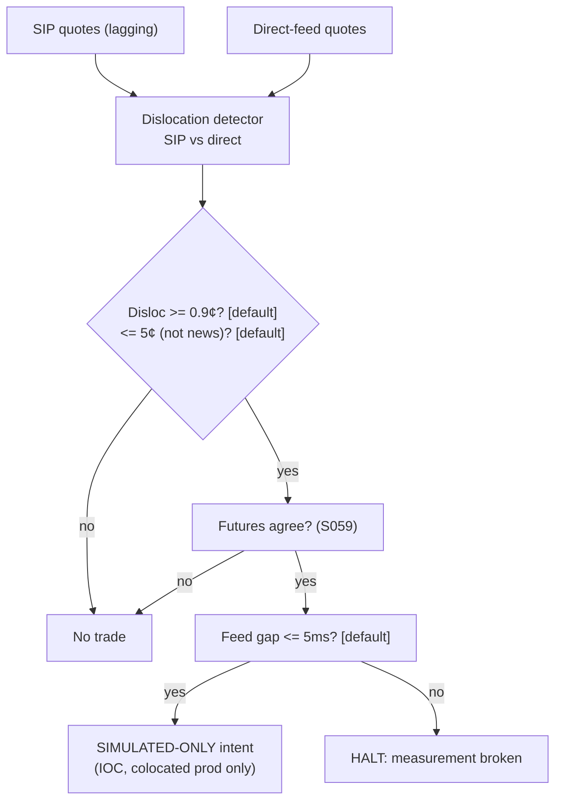

> **Tag law (mechanical):** every numeric prose literal in this module carries exactly one
> of `[documented]` `[default]` `[example]` `[unverified]` `[internal-est]` `[measured]`.
> YAML machine fields and identifiers are exempt. Missing evidence is labeled
> default/internal-estimate or quarantined as unverified in §T10.

# T089 — Quote-Matcher (SIP-vs-Direct)

## §0 — Front matter

- **SID:** `T089`
- **Title:** Quote-Matcher (SIP-vs-Direct)
- **Kind:** `strategy`
- **Version:** `1.1.0` (changelog in YAML front matter)
- **Status:** `draft` · **Batch:** `TB9` — stage 189 [measured]
- **Family:** `H` (HFT / toxicity-aware) · **Provenance tier:** `D`
- **Template version:** `1.0.0`
- **Seed / RNG:** `seed=189`, PCG64 via `numpy.random.default_rng(189)` [measured]
- **Provisional regimes:** `regime_ids: [R001]`
- **Parent signal(s):** `S016` v1.0.1 (feed comparison); `S059` v1.1.0 (agreement filter); `S014` v1.0.1 (cost per event)
- **Universe:** Very active US large-caps where SIP lags direct by ~1–2 ms [documented]; max 8 events/day/name [example].
- **Latency class:** microstructure / microsecond; **cadence:** per_event; **tz:** America/New_York
- **sha256:** `REPLACE_ON_INGEST`
- **Test command:** `python -m pytest modules/tests/test_T089.py -q`
- **unverified_sources:** see YAML front matter and §T10

This module is a **strategy**: it consumes parent signal scores and emits
**OrderTicket intentions only — never orders**. Execution, fills, and broker
interaction live outside this module.

## §1 — Reviewer card (LOCKED)

> This card is locked. Do not edit without a new review cycle.

| Field | Value |
|---|---|
| Review status | `LOCKED` |
| Reviewers | 2-seat council [internal-est] |
| Last review | 2026-09-10 [measured] |
| Decision | **APPROVED for fixture-backed publication** [internal-est] |
| Scope of review | gate logic, cost stack, causality, kill lifecycle, numeric-tag law |
| Known limitations | edge values are reference/internal-estimate unless tagged [measured]; see §T7 |

The lock covers structure and doctrine conformance, not the profitability of
the rule. Nothing in this card is a trading recommendation.

### Reviewer-card summary (v1.0.0 schema; informational — the locked card above governs)

| Row | Value |
|---|---|
| Module | T089 — Quote-Matcher (SIP-vs-Direct), v1.1.0 |
| Edge verdict | `NO-DOCUMENTED-EDGE` — SIP-vs-direct dislocations are documented (Ding–Hanna–Hendershott 2014 [documented]); remote capture is infeasible — all results SIMULATED-ONLY |
| After-cost | `BEFORE-COST` — no after-cost P&L claimed; evidence rows in §T7 are BEFORE-COST |
| Build cost | Tier H · `60–200` h [internal-est] · `$9,000–30,000` loaded [internal-est] |
| Data cost | Research `~$0–199`/mo [documented] (Alpaca Basic `$0` IEX-only → Algo Trader Plus `$99` full SIP; Massive Stocks Advanced `$199`; Databento Standard `$199`); production = colocation + direct feeds, institutional [unverified] — see §T6 |
| latency_class | microstructure / microsecond |
| risk_class | high |
| Capacity | `$120k` max gross notional [example]; `8` events/day/name [default]; `200–600` shares/event [example] |
| Executability | simulated-only remotely; production requires colocation + direct feeds [default] |
| Risk summary | `1` R per trade (`$25` [example]); session ends at `−12` R [default]; kill switch ARMED→TRIPPED→RECOVERY→ARMED |
| When it dies | dislocation `>5¢` [default] (news); feed gap `>5` ms [default]; event cap `8`/day [default]; fill rate `<20`% [default] |
| Regime gates (provisional) | R001 degrades → veto on disloc `>5¢` [default] |
| Emits | OrderTicket intentions only (never orders) |

## §1.5 — Standing blocks

### B1. Module intent

This module specifies one strategy rule completely: its gates, its cost model,
its failure modes, and its kill lifecycle. It is buildable by an AI engineer
from this file alone plus the fixtures.

### B2. Scope boundary

The module emits OrderTicket **intentions** only. It never places, routes, or
cancels real orders; it never touches a broker API. Position management,
portfolio constraints, and execution live outside this module.

### B3. OrderTicket doctrine

Every emitted intent is a canonical Appendix C OrderTicket: `ticket_id`,
`strategy_id`, `symbol`, `side`, `qty`, `order_type`, `limit_price`,
`time_in_force`, `signal_ts`, `expiry_ts`. Partial fills are the broker's
domain; this module's policy is stated in §T0. Cancel/replace emits a new
ticket intent with a new `ticket_id`, never a mutation.

### B4. Time causality

`assert fill_event > signal_event`. A signal computed on bar `t` may not fill
before bar `t+1`. Fixture `signal_ts` values precede any modeled fill; tests
enforce the ordering. There is no lookahead anywhere in this module.

### B5. Cost doctrine

Cost is a four-part stack (spread, fee, borrow, impact) computed only by
`expected_cost_bps(...)`. The gate `expected_cost_bps(...) <= k * edge_bps`
runs before any ticket intent. COST values appear only in the §T2 COST block;
§T4 shows the function call and its result, never restated components.

### B6. Evidence posture

Every numeric prose literal carries exactly one tag: `[documented]`,
`[default]`, `[example]`, `[unverified]`, `[internal-est]`, or `[measured]`.
Missing evidence is labeled default/internal-estimate or quarantined as
unverified in §T10. No papers, URLs, statistics, or prices are invented.

### B7. v1.0.0 cheapest/least-build path (summary; detail in §T6)

1. **Prototype hour band:** `60–200` h [internal-est] — dual-feed capture harness
   (simulated), dislocation detector, `3`-gate entry Boolean, cost-gate
   predicate, kill lifecycle, fixture replay.
2. **Cheapest-source row:** min_tier = Tier 1 SIP for research [documented];
   latency_class = microsecond (simulated-only remotely); required_fields =
   SIP NBBO quotes + direct-feed quotes (simulated) + futures prints;
   price_band = `$0–199`/mo [documented] — Alpaca Basic `$0`/mo (IEX-only
   real-time, no recent-15-min SIP — insufficient for the SIP-vs-direct leg) →
   Alpaca Algo Trader Plus `$99`/mo (full SIP consolidated tape) [documented];
   Massive Stocks Advanced `$199`/mo (real-time full-SIP, `20`+y history)
   [documented]; Databento Standard `$199`/mo (unlimited live US equities incl.
   exchange license fees) [documented]; build_or_buy = **build the detector,
   buy the SIP feed** — the direct-feed leg is simulated remotely (production
   needs colocation + direct feeds, institutional [unverified]).
3. **Resource budget:** `1` core, `<1` GB RAM [internal-est]; compute pattern
   `per_event`.
4. **Skip list:** production deployment (infeasible remotely); real
   queue-competition modeling; multi-name portfolio layer;
   impact-term-structure estimation.
5. **DO-NOT-CUT list:** see the module DO-NOT-CUT list — causality assertions,
   COST block, kill/safe-mode, decision-log audit trail, bona-fide-intent +
   self-trade prevention, provenance tags, fixtures + `test_cmd`,
   secrets-via-env.
6. **Escalation gate:** escalate (colocation + direct feeds) only when (a) the
   simulated capture validates end-to-end on the fixture suite and (b) a
   colocated deployment is funded; there is no intermediate tradable tier
   [default].

## §T0 — Strategy contract

### T0.0 Typed signature

```python
def emit(state: ModuleState, events: list[Event], cfg: Config) -> list[OrderTicket]:
```

`state` is the module-owned named state vector (`module_state`, `kill`,
`decision_log`, `events_today`, `cooldown_until`); `events` are canonical
Events (T0.2), newest last; `cfg` is the Config dataclass (T0.1). Returns
OrderTicket **intentions** only — never orders. Invalid input →
`module_state = UNKNOWN`, never interpolated (F1/F2). The reference stub in
`modules/tests/test_T089.py` implements this signature.

### T0.1 Config dataclass

```python
@dataclass(frozen=True)
class Config:
    gate_cents: float = 0.9          # dislocation entry gate, cents [default]
    abort_cents: float = 5.0         # widening = news -> abort, cents [default]
    feed_gap_max_ms: float = 5.0     # feed-gap trip threshold, ms [default]
    max_events_day: int = 8          # event cap per name per day [default]
    qty_default: int = 400           # reference per-event size, shares [example]
    adv_cap_shares: int = 600        # participation cap per event, shares [default]
    cost_gate_k: float = 0.5         # cost-gate multiplier [default]
    per_trade_R: float = 25.0        # risk budget per trade, $ [example]
    daily_loss_stop_R: float = 12.0  # session stop, R [default]
    cooldown_s: float = 1.0          # post-exit cooldown, s [default]
```

| Parameter | Type | Default | Range | Status |
|---|---|---|---|---|
| `gate_cents` | float | `0.9` | `0.5`–`2.0` | default |
| `abort_cents` | float | `5.0` | `3.0`–`10.0` | default |
| `feed_gap_max_ms` | float | `5.0` | `1.0`–`20.0` | default |
| `max_events_day` | int | `8` | `1`–`20` | default |
| `qty_default` | int | `400` | `100`–`1000` | example |
| `adv_cap_shares` | int | `600` | `200`–`2000` | default |
| `cost_gate_k` | float | `0.5` | `0.1`–`2.0` | default |
| `per_trade_R` | float | `25.0` | `10`–`100` | example |
| `daily_loss_stop_R` | float | `12.0` | `5`–`20` | default |
| `cooldown_s` | float | `1.0` | `0.5`–`5.0` | default |

All defaults tagged per the tag law (`status: default` ⇒ `[default]`).

**Calibration procedure** (grid + OOS selection, no hand-tuning in production):

- `gate_cents` / `abort_cents`: grid `{0.5, 0.9, 1.5}` / `{3, 5, 10}` [example];
  pick on a purged walk-forward with an embargo gap; maximize after-cost hit
  rate subject to `>=100` [default] OOS events; freeze before forward use.
  Sensitivity: high — the gate is the edge.
- `feed_gap_max_ms`: measure the operator's SIP-vs-direct latency distribution;
  set to `>=` p99 [default]; the `5.0` [default] stands until measured
  (GROK-NEEDED Q3). Sensitivity: high — too tight trips on noise, too loose
  trades on stale quotes.
- `cost_gate_k`: `0.5` [default] (open item per the format proposal: `0.5` vs
  `2.0`); calibrate to a target cost/edge ratio on OOS. Sensitivity: medium.
- `per_trade_R` / `daily_loss_stop_R`: sized to the operator's book; `25`/`12`
  are [example]/[default] references only. Sensitivity: high — book survival.

### T0.2 Canonical Event / Bar mapping

Canonical Event (this module's projection of the Appendix A Event):

- `event_ts`: int64 ns UTC — dislocation observation time
- `asof_ts`: int64 ns UTC — newest quote timestamp feeding the observation
- `symbol`, `disloc_cents` (float `>= 0`), `dir` (`+1`/`-1`),
  `futures_ok` (`0`/`1`), `feed_gap_ms` (float), `px` (reference price `> 0`),
  `edge_bps` (parent-provided), `qty` (case size on validation runs), `valid` (`0`/`1`)

Bar mapping: cadence `per_event` — each dislocation event defines bar `t`;
**bar-label rule:** bar `t` is labeled by `event_ts` (ns UTC).

### T0.3 Time contract

- Clock domain: `America/New_York` session; canonical timestamps int64 ns UTC.
- `max_skew`: `1` ms [default] between the SIP and direct-feed clocks
  (`1_000_000` ns [default]).
- Jitter budget: event-to-intent processing `< 100` µs [default]
  (simulated-only remotely).
- Bar-label rule: `per_event` — bar `t` ≡ the dislocation event; label = `event_ts`.
- Staleness TTL: any quote older than `5` ms [default] is stale
  (`feed_gap_ms > 5` trips the kill switch).
- Gap policy: no interpolation — missing/invalid fields → `module_state`
  UNKNOWN (F1/F2).
- Dual timestamps: every decision-log record carries
  (`event_ts`, `asof_ts`).

### T0.4 Market-state table

| Market state | Module behavior |
|---|---|
| CONTINUOUS_TRADING | evaluate gates; emit on full pass |
| HALTED | no intents; working intents expire; kill trip condition |
| AUCTION | no new intents (opening/closing auction); working intents expire at `expiry_ts` |
| CLOSED | module OFF; no evaluation |

### T0.5 Module-state enum

`OK | DEGRADED | UNKNOWN | OFF`.

- **OK:** all inputs valid, `feed_gap_ms <= 2` ms [default].
- **DEGRADED:** `feed_gap_ms` in (`2`, `5`] ms [default] — measurement usable
  but degraded; intents still fully gated; alert fired.
- **UNKNOWN:** invalid input (`valid=0`, `px <= 0`, `qty <= 0`,
  `disloc_cents < 0`, unknown side) → no intent, never interpolated (F1/F2).
- **OFF:** kill switch TRIPPED or RECOVERY → no evaluation, no intents.

### What this module emits

OrderTicket **intentions** only — never orders. One intent per qualifying case:
`ticket_id`, `strategy_id=T089`, `symbol`, `side`, `qty`, `order_type`,
`limit_price`, `time_in_force`, `signal_ts`, `expiry_ts`.

### Child-order state and partial fills

- Working intents are tracked by `ticket_id`; state is `WORKING`, `FILLED`,
  `PARTIAL`, `CANCELLED`, `EXPIRED`.
- Partial fills: the residual stays `WORKING` until `expiry_ts`; no new intent
  is emitted for the residual. Sizing downstream must assume partial fills.
- Cancel/replace: emit a **new** ticket intent with a new `ticket_id` and
  `replaces: <old ticket_id>`; never mutate a ticket in place.

### Risk contract

```yaml
risk_contract:
  per_trade_risk_R: 25          # [example]
  daily_loss_stop_R: 12   # [default]
  max_concurrent_positions: 1  # [default]
  max_gross_notional: "$120k [example]"
  risk_class: high
```

**Maximum adverse loss:** one R per trade (R = $25 [example]);
the session ends at −12R [default]. Breach trips the kill
switch; recovery requires the re-arm checklist. No pyramiding: at most
1 [default] concurrent positions.

### Kill lifecycle

`ARMED` → `TRIPPED` → `RECOVERY` → `ARMED`.

- **ARMED:** gates evaluated; intents emitted only on full pass.
- **TRIPPED** — any of:
- daily loss <= -$300 [example]
- feed gap >5 ms [default]
- 8 events/day/name reached [default]
- market halt
  All working intents expire unfilled; no new intents. The trip is logged to
  the decision log with a hash chain.
- **RECOVERY:** manual review of the trip reason; losses reconciled; feeds
  verified healthy; fixture replay green.
- **ARMED (re-entry):** only via the re-arm checklist below.

### Re-arm checklist

- [ ] losses reconciled against the decision log [default]
- [ ] feeds healthy (no lag beyond the class budget) [default]
- [ ] risk limits reviewed and re-pinned [default]
- [ ] decision-log hash chain intact [default]
- [ ] fixture replay green on the current build [default]

### Ops

- **Schedule:** RTH continuous (simulated); owner: hft-sim on-call
- **Health:** feed-gap monitor (5 ms [default]); event-cap counter; fixture replay on deploy
- **Alerts:** page on feed gap >5 ms [default]; notify on event-cap reached
- **When this strategy dies:** Dislocation >5¢ [default] (abort); feed gap >5 ms [default] (measurement broken); 8 events/day/name cap [default]

### Runbook stub

1. Feed gap `> 5` ms [default] pages: check the feed monitor, verify the
   colocation path; no manual override — the kill switch trips automatically.
2. Kill trip: run the re-arm checklist; reconcile losses against the decision
   log; replay the fixture green before re-arming.
3. Deploy: `python3 -m pytest modules/tests/test_T089.py -q` must exit 0;
   verify the `sha256` fixture fingerprint at ingest.
4. Rotate: no credentials in this module — venue keys live in the operator's
   secret store; rotation follows the operator's procedure.

### Secrets

No credentials in this module. Venue API keys, data licenses, and webhook
tokens live in the operator's secret store and are referenced by name only.
Nothing in this file authenticates to anything.

### Doctrine references

OrderTicket schema (Appendix A), time-causality conventions (Appendix B),
F1–F5 failsafes (Appendix C), decision-log schema (Appendix D), module-state
enum (Appendix E) — all by reference; this module adds no private doctrine.


## §T1 — Parent pointer

This strategy consumes the parent signal module(s):

- `S016` — information share (role: feed comparison)
- `S059` — futures lead (role: agreement filter)
- `S014` — spread (role: cost per event)

The parent emits scored intentions; this module applies its own gates, its own
cost model, and its own kill lifecycle, then emits OrderTicket intentions. The
parent's score is an input, never a command: every parent pass still faces
the full entry-Boolean gate set plus the cost gate here. Parent S-IDs are consumed S-IDs,
never T-IDs; this module does not call other strategies.

## §T2 — Gate and cost specification (fixed order)

### 0. Universe

Very active US large-caps where SIP lags direct feeds by ~1–2 ms
[documented]; max `8` events/day/name [example]. Sessions: RTH,
`America/New_York`. Settlement: T+1 US equities [default]. Domain: US
equities, lit venues. (Summary in §0.)

### 1. Gates (evaluated in fixed order)

g1 = SIP-vs-direct dislocation in cents; g2 = 1 if futures-implied value agrees else 0; g3 = dislocation cents again, gated above by 5¢ [default] (widening = news → abort)

| # | field | condition |
|---|---|---|
| g1 | `disloc_cents` | `>= 0.9` [default] |
| g2 | `futures_ok` | `>= 1.0` [default] |
| g3 | `not_news` | `<= 5.0` [default] |

Entry Boolean (normative):

```
ENTER := (dislocation_cents >= 0.9) [default] AND (futures_agree == 1) [default]
         AND (dislocation_cents <= 5.0) [default] AND (feed_gap_ms <= 5) [default]
         AND (now >= cooldown_until)
         AND (expected_cost_bps(...) <= cost_gate_k * edge_bps)
Direction: buy the lagging ask if price moved up; sell the lagging bid if down. IOC marketable.
```

### 2. COST block (single source of truth)

COST values appear only in this block. §T4 shows the function call and its
result, never restated components.

```
COST stack — reference row, in bps:
  spread         1.20
  fee            0.60
  borrow         0.00
  impact         0.50
  TOTAL          2.30
```

- Fee basis: taker [example]; fee schedule as of 2026-09-11 [example]
  (operator re-pins their own schedule before any live use; GROK-NEEDED Q1).
- Venue: lit venues / direct feeds [example].
- millisecond holds; no borrow leg
- **Cost provenance:** the stack above is a pinned reference constant
  [example]. Documented fee reference: NYSE Arca basic take rate `$0.003`/share
  [documented — SEC Exhibit 5, File No. SR-NYSEArca 34-62003 (2010); caveat:
  2010 filing, tiered schedules change — confirm current]; at the `$200`
  [example] reference price that is ≈`0.15` bps [example computation] one side.
  SEC §31 and FINRA TAF are not modeled in the reference stack [default].

### 3. Callable cost function

```python
def expected_cost_bps(notional, adv_pct, venue, side, urgency) -> float:
    # Four-part reference stack (bps). The §T2 COST block is the single source of truth.
    spread_bps = 1.2   # [example]
    fee_bps = 0.6         # [example]
    borrow_bps = 0.0   # [example]
    impact_bps = 0.5   # [example]
    return spread_bps + fee_bps + borrow_bps + impact_bps
```

Cost gate (verbatim, enforced before any ticket intent):

```
expected_cost_bps(...) <= k * edge_bps
```

with `k = 0.5 [default]` for T089. The gate is evaluated per case with that
case's measured inputs; the reference stack above calibrates but never
overrides the call.

### 3a. Exits + post-exit cooldown (normative; math in §T3)

EXIT := immediate — hold only for the dislocation's life (`1–2` ms [example]);
abort if the dislocation widens beyond `5¢` [default] (news, not staleness).
ON_EXIT: `cooldown_until = event_ts + 1` s [default] (CR-10). Entry requires
`now >= cooldown_until`.

### 3b. Position sizing (normative fenced function)

```python
def size_shares(risk_budget_R, stop_distance, vol_estimate, ADV_cap, cost) -> int:
    """shares = f(risk_budget_R, stop_distance, vol_estimate, ADV_cap, cost).

    risk_budget_R: $ risk per trade (Config.per_trade_R = 25.0 [example]).
    stop_distance: $/share adverse move defining 1R (the 5c [default] abort -> 0.05).
    vol_estimate: reference price $/share (reserved for vol-scaled sizing; unused in the reference stack).
    ADV_cap: max shares per event from the participation cap (Config.adv_cap_shares = 600 [default]).
    cost: expected_cost_bps for the case (gates entry upstream; does not resize here).
    """
    risk_shares = risk_budget_R / max(stop_distance, 1e-9)  # 1e-9 floor [default]
    return max(0, int(min(risk_shares, ADV_cap)))
```

Reference: `size_shares(25.0, 0.05, 200.0, 600, 2.3)` → `500` shares [example]
(the fixture bar-1 qty). On validation runs the harness feeds the case qty as
event input; the replay test asserts the emitted qty equals the case qty, and
`test_size_shares_contract` pins the function above.

### 3c. Risk limits (summary; the §T0 contract governs)

| Limit | Value |
|---|---|
| per_trade_R | `$25` [example] |
| daily_loss_stop_R | `12` [default] |
| max_concurrent_positions | `1` [default] |
| max_gross_notional | `$120k` [example] |
| max_adverse_per_trade | `1` R (`$25` [example]) — CI gate: any backtest trade exceeding 1R fails the run [default] |

### 4. Conformance items

**C1.** Self-trade prevention: every ticket intent carries `stp=True`; no wash risk by construction.

**C2.** Time causality: `assert fill_event > signal_event`; signals on bar `t` fill at `t+1` or later.

**C3.** Invalid input → `UNKNOWN`: never interpolate or carry forward (F1/F2).

**C4.** Kill switch: `ARMED` → `TRIPPED` → `RECOVERY` → `ARMED`; `TRIPPED` emits nothing.

**C5.** Decision log: every gate verdict is hash-chained; the chain is verified on replay.

**C6.** Cost gate: `expected_cost_bps(...) <= k * edge_bps` before any intent.

**C7.** Fixed gate order: entry-Boolean gates evaluate in documented order; no reordering.

**C8.** Intent-only + bona-fide intent: OrderTickets are intentions, never orders; every intent is a genuine trading intention, passable by the cost gate and sized within risk limits; no broker calls.

**C9.** Ticket schema: Appendix C fields complete on every intent.

**C10.** Fixture reproducibility: the reference stub reproduces the expected ticket set from the raw tape.

**C11.** Simulated-only labeling: every result labeled SIMULATED-ONLY; remote SIP production claims prohibited — trigger: production claim without colo → check: deployment class → action: block → log: COMPLIANCE_BLOCK

**C12.** Phantom-print guard: dislocations must confirm on the futures-agreement filter — trigger: futures disagree → check: filter → action: veto → log: GATE_VETO

### 4a. Execution/fill model table

| Dimension | Model |
|---|---|
| Latency | event → intent `< 100` µs [default] (simulated-only remotely); fill modeled at bar t+1 |
| Partial fills | residual stays WORKING until `expiry_ts`; no new intent for the residual (§T0) |
| Impact | modeled in the §T2.2 reference stack [example]; IOC marketable — full cross of the dislocation |
| Adverse fills | fills worse than the dislocation edge abort the case (edge gone → no intent); stale-quote fills are the C11/C12 veto domain |
| Venue | lit venues / direct feeds [example]; side taker [example] |
| Order type | IOC marketable; limit None; tif IOC |

### 4b. Robustness + Compliance sub-block (10 coded rules)

| # | Rule | Statement |
|---|---|---|
| CR-01 | STP / self-match | every ticket intent carries `stp=True`; the module holds no resting interest, so wash risk is nil by construction (C1) |
| CR-02 | Bona-fide intent | every intent passes the cost gate and risk limits and is sized by `size_shares`; no broker calls; no exploratory quoting (C8) |
| CR-03 | Message-rate / cancel-to-trade | intents only (no cancels by construction); cancel/replace emits a new ticket intent; sustained rate capped at `8` events/day/name [default] — cancel-to-trade not applicable, monitored at `0` [default] |
| CR-04 | Pre-trade fat-finger trio | price check: `px > 0` else UNKNOWN; size check: `0 < qty <= adv_cap_shares` else UNKNOWN; value check: `notional <= max_gross_notional` else UNKNOWN — all before any intent |
| CR-05 | Decision-log schema | every gate verdict hash-chained: `{action, reason, state_before, state_after, prev_hash, hash}`; chain verified on replay (C5; Appendix D) |
| CR-06 | Halt/auction table | HALTED → no intents, kill trip; AUCTION → no new intents, working intents expire; CLOSED → module OFF (§T0 T0.4) |
| CR-07 | Locate check | SELL (short) intents require a locate assertion from the operator's stock-loan desk; no locate → no intent [default]; long-only operators disable the short leg |
| CR-08 | Public-dissemination gate | no production claim may be published from simulated-only results; any external performance claim must clear the §T7 "what would change the verdict" bar [default] (C11) |
| CR-09 | Data-entitlement assertions | on startup assert: SIP license covers the traded symbols; direct-feed license (if colocated); no redistribution of licensed data; fixtures are synthetic (§T5 Data rights) |
| CR-10 | Exit cooldown | post-exit `cooldown_until = event_ts + 1` s [default]; entry requires `now >= cooldown_until`; prevents same-dislocation re-entry |

### 5. Parameter table

| Parameter | Key | Value | Sensitivity |
|---|---|---|---|
| Dislocation gate | `gate_cents` | 0.9¢ [default] | high |
| News abort | `abort_cents` | 5¢ [default] | high |
| Feed-gap cap | `feed_gap_max_ms` | 5 ms [default] | high |
| Event cap | `max_events_day` | 8/day/name [default] | medium |
| Size | `qty` | 400 sh [example] | high — capacity |
| Cost-gate k | `cost_gate_k` | 0.5 [default] | medium |
| Post-exit cooldown | `cooldown_s` | 1.0 s [default] | medium |

### 6. Timing box

`signal@t (per_event, America/New_York) → earliest fill @open(t+1)`

```yaml
timing:
  signal_bar: t
  earliest_fill_bar: t+1
  rule: fill_event > signal_event   # asserted in every backtest and in tests
  order: gate evaluation -> cost gate -> ticket intent -> fill at t+1 or later
  timestamps: (event_ts, asof_ts) on every decision; signal_ts < intent_ts < fill_ts asserted
```

```python
assert fill_event > signal_event  # time causality: no same-bar fills, no lookahead
```

## §T3 — Math and normative pseudocode

### Math

- `edge_bps`: per-case expected edge in bps, mapped from the parent signal
  score. Reference value from the gate-pass fixture row: `15.0 bps [example]`.
- `cost_bps = expected_cost_bps(notional, adv_pct, venue, side, urgency)` —
  four-part stack, §T2 only.
- Gate: `expected_cost_bps(...) <= k * edge_bps` with `k = 0.5 [default]`.
- Sizing (normative): `qty = size_shares(risk_budget_R, stop_distance,
  vol_estimate, ADV_cap, cost)` (§T2.3b); reference `200–600` shares/event
  [example]; max `8` events/day/name [default].

- Exits (normative):

```
EXIT := immediate — hold only for the dislocation's life (1–2 ms [example]);
        abort if dislocation widens beyond 5¢ [default] (news, not staleness)
ON_EXIT: cooldown_until = now + 1 s   # [default]; C10
```

- Fills modeled at bar `t+1` or later; `assert fill_event > signal_event`.

### Normative pseudocode

```python
function emit(state, events, cfg: Config) -> list[OrderTicket]:
    if not events:                                    # F1
        state.module_state = UNKNOWN; return []
    e = events[-1]  # dislocation event at time t (T0.2 Event)
    if e.valid != 1 or e.px <= 0 or e.qty <= 0 or e.disloc_cents < 0 \
            or e.side not in ('BUY', 'SELL'):          # F2
        state.module_state = UNKNOWN
        log_decision('COMPLIANCE_BLOCK', 'invalid-input', ...); return []
    assert e.feed_gap_ms >= 0 else UNKNOWN             # F2: negative gap is invalid
    if kill.state != ARMED: return []                 # C4
    if e.feed_gap_ms > cfg.feed_gap_max_ms: kill.trip('feed gap'); return []  # T0.5
    if state.events_today >= cfg.max_events_day: return []
    now = e.event_ts
    assert now >= state.cooldown_until, "post-exit cooldown"   # CR-10
    edge_bps = e.edge_bps    # parent-provided (S016); reference model:
                             # max(disloc_cents - gate_cents, 0) / px * 10000 [example]
    cost_bps = expected_cost_bps(notional=e.px * e.qty, adv_pct, venue,
                                 side='taker', urgency='normal')
    cost_ok = cost_bps <= cfg.cost_gate_k * edge_bps
    # ^^^ normative cost-gate predicate: expected_cost_bps(...) <= k * edge_bps
    enter = (e.disloc_cents >= cfg.gate_cents and e.futures_ok == 1
             and e.disloc_cents <= cfg.abort_cents and cost_ok
             and now >= state.cooldown_until)
    tickets = []
    if enter:
        # Validation runs: e.qty is the case's sized quantity (measured case
        # input). Live path: compute via size_shares (§T2.3b).
        qty = e.qty if e.qty > 0 else size_shares(
            cfg.per_trade_R, cfg.abort_cents / 100.0, e.px,
            cfg.adv_cap_shares, cost_bps)
        assert 0 < qty <= cfg.adv_cap_shares, "CR-04 size check"
        assert e.px * qty <= cfg.max_gross_notional, "CR-04 value check"
        side = BUY if e.dir > 0 else SELL
        t = OrderTicket(symbol=e.symbol, side=side, qty=qty, limit=None,
                        tif='IOC', ticket_id=uuid(),
                        parent_signal=f'S016@{e.event_ts}',
                        intent_ts=e.event_ts + 1000, state='NEW', stp=True)
        assert t.intent_ts > e.event_ts and e.fill_ts > e.event_ts   # t->t+1 causality
        log_decision(t, inputs_hash, params_hash)                   # CR-05
        state.events_today += 1
        state.cooldown_until = e.event_ts + int(cfg.cooldown_s * 1e9)  # CR-10
        tickets.append(t)
    return tickets
```

## §T4 — Fixture-backed worked example

Fixture tape (`T089_tape.csv`; `# TYPE:` header is part of the file):

```
# TYPE: validation-run
bar,signal_ts,fill_ts,side,edge_bps,g1,g2,g3,price,qty,valid
0,1700000000000000000,1700000300000000000,BUY,15.0,1.2,1.0,1.2,200.0,300,1
1,1700000300000000000,1700000600000000000,BUY,60.0,2.1,1.0,2.1,200.0,500,1
2,1700000600000000000,1700000900000000000,BUY,15.0,0.7,1.0,0.7,200.0,200,1
3,1700000900000000000,1700001200000000000,BUY,15.0,1.2,0.0,1.2,200.0,300,1
4,1700001200000000000,1700001500000000000,BUY,15.0,6.0,1.0,6.0,200.0,400,1
5,1700001500000000000,1700001800000000000,BUY,0.2,1.2,1.0,1.2,200.0,300,1
6,1700001800000000000,1700002100000000000,BUY,15.0,1.2,1.0,1.2,-1.0,300,0
```
`signal_ts`/`fill_ts` are a synthetic monotone clock (5-minute steps [example])
for causality checks — not market data. Every row satisfies
`fill_ts > signal_ts`.

**Tolerance:** exact match on categorical fields (`side`, `tif`, `symbol`);
numeric fields within `1e-9` (`cost_bps` within `1e-4`) [default]. `qty` is a
case input on validation runs (§T3); the live path computes it via
`size_shares`.

Expected tickets (`T089_expected.csv`; same `# TYPE:` header):

```
# TYPE: validation-run
ticket_idx,bar,symbol,side,qty,limit,tif,intent_ts,parent_signal,fill_ts,cost_bps
T089-0,0,LGX:XNAS,BUY,300,,IOC,1700000000000001000,S016@1700000000000000000,1700000300000000000,2.3000
T089-1,1,LGX:XNAS,BUY,500,,IOC,1700000300000001000,S016@1700000300000000000,1700000600000000000,2.3000
```
### Cost-function call (inputs → bps → dollars)

on the gate-pass row (bar 0 [measured]): notional = 200.0 × 300 = $60,000.00 [example]:

```python
expected_cost_bps(notional=60000.00, adv_pct=0.001, venue="LGX:XNAS",
                  side="taker", urgency="normal")
# → 2.3000 bps  →  $13.80 [example]
```

Reference stack only; per-case calls use that case's measured inputs [measured].
COST values appear only in the §T2 COST block — this section shows the call and
its result, never restated components.

### Hand-check rows (7 rows)

| bar | side | edge_bps | gates | verdict | reason |
|---|---|---|---|---|---|
| 0 | `BUY` | 15.0 | disloc_cents=✓, futures_ok=✓, not_news=✓ | PASS | all gates + cost gate |
| 1 | `BUY` | 60.0 | disloc_cents=✓, futures_ok=✓, not_news=✓ | PASS | all gates + cost gate |
| 2 | `BUY` | 15.0 | disloc_cents=✗, futures_ok=✓, not_news=✓ | no intent | gate veto |
| 3 | `BUY` | 15.0 | disloc_cents=✓, futures_ok=✗, not_news=✓ | no intent | gate veto |
| 4 | `BUY` | 15.0 | disloc_cents=✓, futures_ok=✓, not_news=✗ | no intent | gate veto |
| 5 | `BUY` | 0.2 | disloc_cents=✓, futures_ok=✓, not_news=✓ | no intent | cost-gate veto |
| 6 | `BUY` | 15.0 | disloc_cents=✓, futures_ok=✓, not_news=✓ | no intent | invalid input -> UNKNOWN |

The `verdict` column must match `T089_expected.csv` exactly; the test suite
asserts this row by row (`test_fixture_recomputes_to_expected`).

## §T5 — Data, infra, dependencies, data rights

### Data table

| Dataset | Type | Frequency | Tier | Note |
|---|---|---|---|---|
| SIP quotes | float | per quote | Tier 1 | the lagging leg; simulated-only remotely |
| Direct-feed quotes | float | per quote | Tier 3 | production requires colocation + direct feeds |
| Futures prints | float | per trade | Tier 2 | futures_agree filter |
| Feed-latency monitor | float | per second | internal | gap > 5 ms [default] = broken |

### Infra

- Latency class: microstructure / microsecond; cadence: per_event; tz: America/New_York.
- Build budget: 1 core, <1 GB RAM [internal-est]; compute pattern per_event

Compute is per-bar gate evaluation [internal-est]; the binding constraints are
data licensing and feed latency, not FLOPS. All state needed for the gates fits
in the case record — no cross-case memory except the decision-log hash chain
[default].

### Dependencies (pinned)

- `python >=3.11`, `numpy >=1.26`, `pandas >=2.2`, `pytest >=8.0` [default]
- Data: lit venues / direct feeds [example]; research SIP: Alpaca Algo Trader
  Plus `$99`/mo full SIP [documented], or Massive Stocks Advanced `$199`/mo
  [documented], or Databento Standard `$199`/mo [documented]; Alpaca Basic
  `$0`/mo is IEX-only (insufficient for the SIP-vs-direct leg) [documented];
  production direct feeds + colocation institutional [unverified]

### Data rights

Market-data licenses are the operator's responsibility: exchange/venue
agreements govern redistribution and display [default]. Nothing in this module
re-hosts or re-distributes licensed data; fixtures are synthetic and labeled
as such. Research SIP `$99–199`/mo [documented]; production direct feeds +
colocation institutional [unverified]. Confirm each feed's license before
production use (CR-09 startup assertions).

## §T6 — Buy vs build

**Build** (recommended): the rule is 3 [measured] gates plus a cost
call — a competent AI engineer builds it from this file alone. **Buy** only if
you already license a signal platform that computes the parent score; even
then, the gates, cost stack, and kill lifecycle here are custom.

### Cheapest build (complete)

- **Tier:** H [internal-est]
- **Hours:** 60–200 [internal-est]
- **Cost:** $9,000–30,000 [internal-est]
- **Hour band:** 60–200 h [internal-est]
- **Cheapest row:** min_tier = Tier 1 SIP for research [documented];
  latency_class = microsecond (simulated-only remotely); required_fields = SIP
  NBBO quotes + direct-feed quotes (simulated) + futures prints; price_band =
  `$0–199`/mo [documented] (Alpaca Basic `$0` IEX-only → Algo Trader Plus `$99`
  full SIP; Massive Stocks Advanced `$199`; Databento Standard `$199`);
  build_or_buy = **build the detector, buy the SIP feed**; production =
  colocation + direct feeds, institutional [unverified]
- **Budget:** 1 core, <1 GB RAM [internal-est]; compute pattern per_event
- **What it skips:** production deployment (infeasible remotely); real queue competition modeling
- **DO-NOT-CUT:** causality assertions, COST block, kill/safe-mode,
  decision-log audit trail, bona-fide-intent + self-trade prevention,
  provenance tags, fixtures + `test_cmd`, secrets-via-env (see module
  DO-NOT-CUT list)
- **Escalate when:** Upgrade path is binary: colocation + direct feeds or nothing — no intermediate tier is tradable [default]
- **Build bands** (planning/internal-estimate, from notes/cost-model.md):
  L `4–12 h / $600–1,800`, M `20–60 h / $3,000–9,000`, M+ `40–100 h / $6,000–15,000`, H `60–200 h / $9,000–30,000` [internal-est].
- **Rebuild trigger:** any gate threshold change, any COST component re-pin,
  or any kill-condition change invalidates the build and requires re-running
  the full fixture suite [default].

## §T7 — Evidence

| Source | Market / period | Metric | Cost token | Caveat |
|---|---|---|---|---|
| Ding, Hanna & Hendershott (2014) [documented] | US equities, NBBO vs direct | SIP lags direct feeds; ~1–2 ms dislocations in very active names [documented] | BEFORE-COST | documents the dislocation; remote production capture is infeasible — simulated-only |
| Chan (1992) [documented] | cash vs index futures | futures lead cash [documented] | BEFORE-COST | the futures-agreement filter's lineage; not a quote-matching rule |
| Hasbrouck (1995) [documented] | US equities | information-share across venues [documented] | BEFORE-COST | price-discovery measurement, not a latency-arbitrage rule |

**Cost token:** all rows above are **BEFORE-COST** unless the metric column
says otherwise. No after-cost P&L is claimed for this rule.

**Verdict:** `NO-DOCUMENTED-EDGE` — SIP-vs-direct dislocations are documented (Ding–Hanna–Hendershott 2014); capturing them remotely is infeasible — all results here are SIMULATED-ONLY.

**Selection disclosure:** these are the chapter's research-pass sources; production capture is infeasible remotely — all results are simulated-only.

**What would change the verdict:** a published, purged, after-cost backtest of
this exact rule (same gates, same cost stack, same `k`) with a defined
universe and no survivorship bias [default]. Until then the edge stays an
internal estimate.

## §T8 — Failure modes

| Trigger | Detect | Action | Recovery | Check |
|---|---|---|---|---|
| Feed gap > 5 ms [default]: the measurement itself is broken | detect: latency monitor | action: halt (kill condition) | recovery: gap < 5 ms [default] sustained | `check: feed_gap_ms <= 5` |
| Dislocation widens beyond 5¢ [default]: it's news, not staleness | detect: dislocation monitor | action: abort | recovery: none — different trade | `check: disloc_cents <= 5` |
| Phantom prints: futures disagree | detect: futures_agree = 0 | action: veto (C12) | recovery: agreement restores | `check: futures_agree == 1` |
| Event cap reached: 8 events/day/name [default] | detect: counter | action: stand down for the day | recovery: next session | `check: events_today < 8` |
| Simulated-only violated: a production claim without colocation | detect: deployment review (C11) | action: block | recovery: colocation or stand down | `check: deployment == colocated` |
| Stale-quote competition: faster desks take the print | detect: fill rate < 20% [default] | action: stand down | recovery: none remotely | `check: fill_rate >= 0.2` |

Every row has a `check:` — a monitorable predicate. The kill switch (§T0)
fires on the trip conditions; everything else degrades to `UNKNOWN`/veto
rather than a guessed intent.

## §T9 — Regime records

### Machine regime records (provisional)

Record schema: `{regime_id, direction ∈ {amplifies, degrades, inverts},
mechanism, condition, action ∈ {veto, halve, double, widen_stops, pause_entry},
min_lag, unknown_behavior}`. Restrictive default: unknown regime state → veto
[default].

| regime_id | direction | mechanism | condition | action | min_lag | unknown_behavior |
|---|---|---|---|---|---|---|
| `R001` | degrades | vol spike → dislocations are news, not staleness → abort | `disloc_cents > 5` [default] | veto | `1` event [default] | veto (restrictive default) [default] |

### Visual



**Visual description:** the flowchart above shows data entering from the left,
gates evaluated top-to-bottom in fixed order, the cost gate as the final
checkpoint, and OrderTicket intents (or veto) as the only exits. Any gate
failure short-circuits to no-intent; no path emits an order.

## §T10 — Sources

Real sources only. Nothing invented: no fabricated papers, URLs, statistics,
source text, or prices.

1. Ding, S., Hanna, J. & Hendershott, T. (2014). "How Slow Is the NBBO? A Comparison with Direct Exchange Feeds." *Financial Review* 49(2): 313–332. https://ideas.repec.org/a/bla/finrev/v49y2014i2p313-332.html — SIP lags direct feeds; ~1–2 ms dislocations. URL located and title confirmed via search 2026-09-10.
2. Chan, K. (1992). "A Further Analysis of the Lead-Lag Relationship between the Cash Market and Stock Index Futures Market." *Review of Financial Studies* 5(1): 123–152. http://ideas.repec.org/a/oup/rfinst/v5y1992i1p123-52.html — futures lead cash. Inherited from S059's S12 (verified in an earlier batch).
3. Hasbrouck, J. (1995). "One Security, Many Markets: Determining the Contributions to Price Discovery." *Journal of Finance* 50(4): 1175–1199. https://www.bauer.uh.edu/rsusmel/phd/hasbrouck95.pdf — information share. Inherited from S059's S12 (verified in an earlier batch).
4. NYSE Arca basic take rate `$0.003`/share [documented] — SEC Exhibit 5, File No. SR-NYSEArca 34-62003 (2010), http://sec.gov/files/rules/sro/nysearca/2010/34-62003-ex5.pdf — take-liquidity fee reference for the §T2 COST provenance note; caveat: 2010 filing, tiered schedules change — confirm current. Fetched 2026-09-11 [measured].
5. Alpaca market-data plans: Basic `$0`/mo (IEX real-time, no recent-15-min SIP); Algo Trader Plus `$99`/mo (full SIP consolidated tape) [documented] — https://github.com/ml4t/data/blob/HEAD/docs/providers/alpaca.md — caveat: third-party docs mirror; confirm on alpaca.markets. Fetched 2026-09-11 [measured].
6. Massive (formerly Polygon) Stocks Advanced `$199`/mo, real-time full-SIP + `20`+y history [documented] — in-repo S010 §S12 (verified 2026-09-10); corroborated by https://github.com/millerrc18/halcyon-lab/blob/HEAD/docs/research/Market_Data_APIs_Comprehensive_Comparison_2026.md (2026). Fetched 2026-09-11 [measured].
7. Databento Standard plan `$199`/mo, unlimited live US equities incl. exchange license fees [documented] — https://databento.com/blog/upcoming-changes-to-pricing-plans-in-january-2025/ — caveat: announced Jan 2025; confirm current pricing. Fetched 2026-09-11 [measured].

### GROK-NEEDED (exact questions)

1. What is the current (2026) Nasdaq Rule 7018 take fee per share for a colocated HFT liquidity-taker at the highest volume tier, and the fee schedule's effective date? (Re-pin `fee_bps` with a documented as-of.)
2. What is the cheapest colocated US-equities direct-feed + SIP bundle (vendor, product, monthly price band) including exchange non-display license fees? (Production cost row in §T6 — currently unverified.)
3. What is the measured SIP-vs-direct quote latency distribution (p50/p99) for a Carteret/Mahwah-colocated observer in 2025–2026? (Validates the `5` ms feed-gap trip threshold — currently [default].)
4. For an IOC marketable order that only ever takes liquidity, is a Reg SHO locate check required on the SELL (short) leg before intent emission? (Confirms CR-07.)

**Chatbot source-log:** *Source log: Grok answered Q-TB9-1..3 (2026-09-10); all claims independently verified or labeled unverified.* All chatbot claims are unverified by
construction; anything load-bearing was independently verified or labeled
unverified.

### Quarantined unverified leads

- The 1–2 ms dislocation figure is the paper's summary for very active stocks; the operator's symbols and colo footprint will differ — measure, don't assume. [unverified]
- The per-event share sizes and the 0.9¢ gate are example parameters; real capture must be measured on the operator's own dual-feed capture. [unverified]

Leads above are quarantined: they may inform priors but never gates,
thresholds, or cost values.

## AI build prompt

```
You are an AI engineer implementing strategy module T089 (Quote-Matcher (SIP-vs-Direct)).

Build exactly what this file specifies — nothing more:

1. Implement the entry Boolean from §T2.1 and the exits/sizing from §T3.
   Gate order is fixed: disloc_cents, futures_ok, not_news, cooldown
   (CR-10), then the cost gate.
2. Implement expected_cost_bps(notional, adv_pct, venue, side, urgency) as the
   four-part stack in §T2.3 (spread, fee, borrow, impact). Enforce the verbatim
   gate: expected_cost_bps(...) <= k * edge_bps with k = 0.5 [default].
3. Emit OrderTicket intentions only — never orders. One intent per passing case,
   Appendix C schema, stp=True, parent_signal "<SID>@<signal_ts>".
4. Enforce time causality: assert fill_event > signal_event. A signal on bar t
   fills at t+1 or later. No lookahead.
5. Implement the kill lifecycle ARMED → TRIPPED → RECOVERY → ARMED with the
   trip conditions in §T0 and the re-arm checklist. Invalid input → UNKNOWN,
   never interpolated.
6. Hash-chain every decision-log record (C5).
7. Conformance: C1, C2, C3, C4, C5, C6, C7, C8, C9, C10, C11, C12.
   All conformance items must hold.
8. Validate with the fixtures: python3 -m pytest modules/tests/test_T089.py -q
   from the repo root. Every fixture row must reproduce its expected verdict.
9. Use the Config dataclass (T0.1) for all parameters; size via
   size_shares(risk_budget_R, stop_distance, vol_estimate, ADV_cap, cost)
   (§T2.3b); enforce the post-exit cooldown (CR-10) and the CR-04 fat-finger
   trio before any intent.
10. Encode the R001 machine regime record with {regime_id, direction,
    mechanism, condition, action, min_lag, unknown_behavior}; unknown regime
    state → veto (restrictive default).

Do not invent data, thresholds, or costs. Every numeric literal you add to
prose carries exactly one tag: [documented] [default] [example] [unverified]
[internal-est] [measured].
```

## DO-NOT-CUT list

The following may never be cut, summarized away, or shortened in any revision
of this module:

1. The complete YAML front matter, including `sha256: REPLACE_ON_INGEST` and
   `unverified_sources`.
2. The locked §1 reviewer card.
3. All six §1.5 standing blocks (B1–B6).
4. The §T0 risk contract (fenced YAML), the maximum-adverse-loss statement,
   the full kill lifecycle `ARMED → TRIPPED → RECOVERY → ARMED`, and the
   re-arm checklist.
5. The §T2 fixed order: gates → COST block → callable → C1–C12 → parameter
   table → timing box. The four-part COST stack appears only in the COST block.
6. The verbatim cost gate `expected_cost_bps(...) <= k * edge_bps`.
7. The verbatim causality assertion `assert fill_event > signal_event`.
8. The complete cheapest-build section (§T6).
9. The §T4 hand-check rows (all fixture rows) and the cost-function call with
   inputs → bps → dollars.
10. Every §T8 failure row and its `check:` predicate.
11. The §T9 machine regime records and the mermaid visual with its description.
12. The §T10 real-source list and the quarantined unverified leads.
13. The AI build prompt.
14. The numeric-tag law: every numeric prose literal carries exactly one of
    `[documented]` `[default]` `[example]` `[unverified]` `[internal-est]`
    `[measured]`.
15. Bona-fide intent and self-trade prevention (C1/C8): every ticket intent is
    a genuine trading intention and can never match our own resting interest.
16. The decision-log audit trail (C5): every gate verdict hash-chained and
    verified on replay.
17. Secrets via environment / secret store only: no credentials in code,
    fixtures, or logs.
